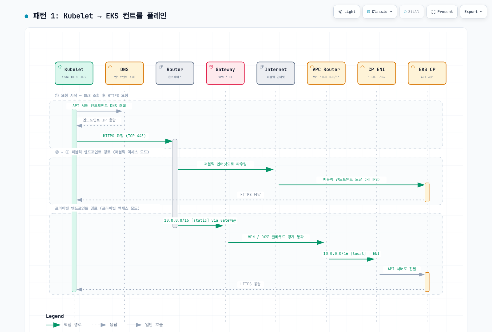
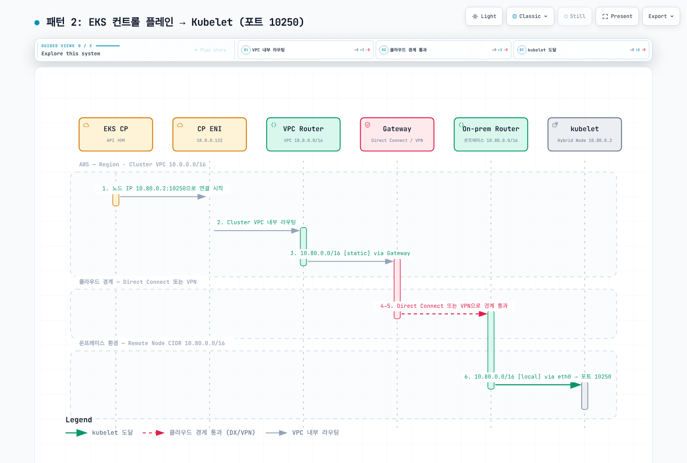
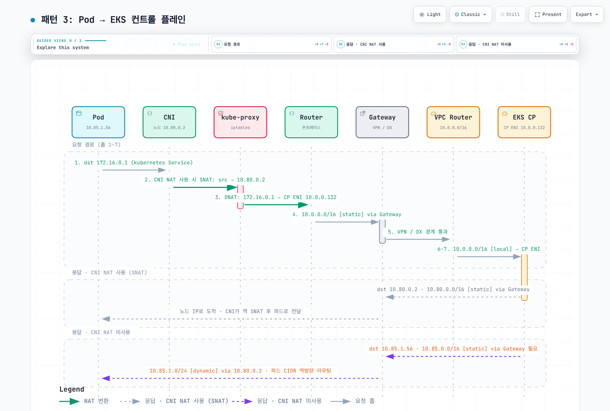
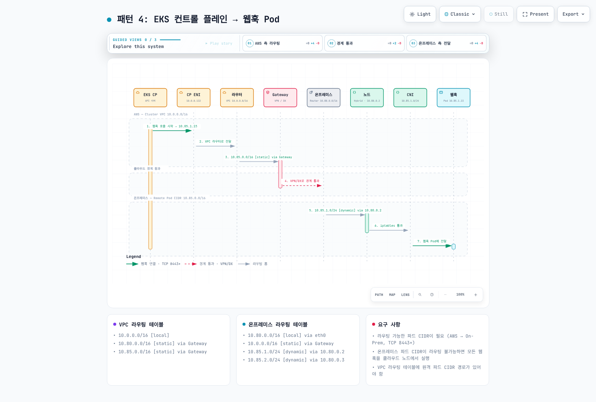
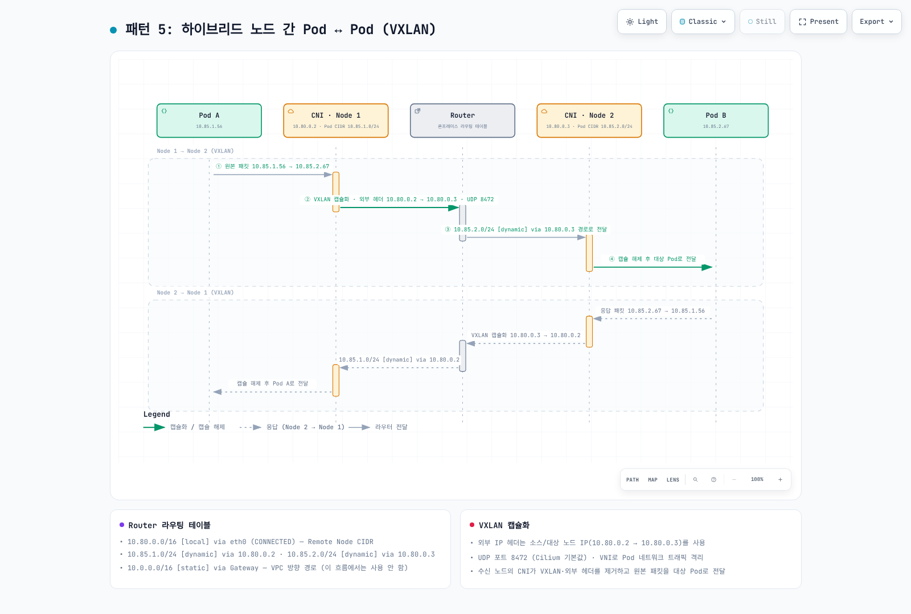
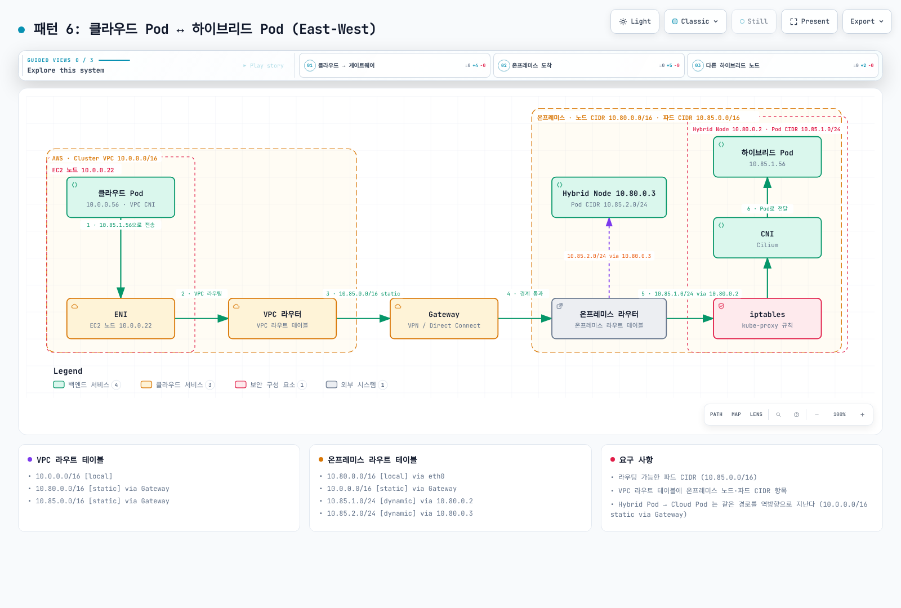
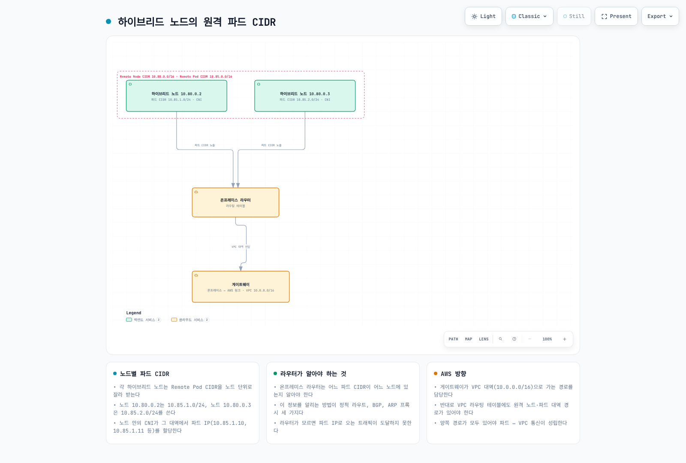
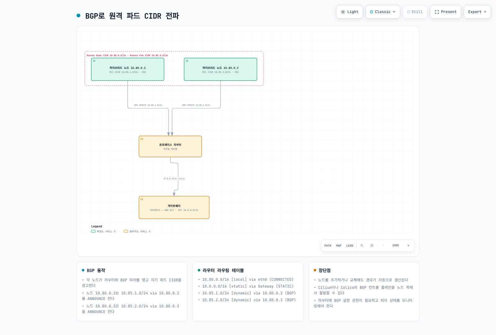
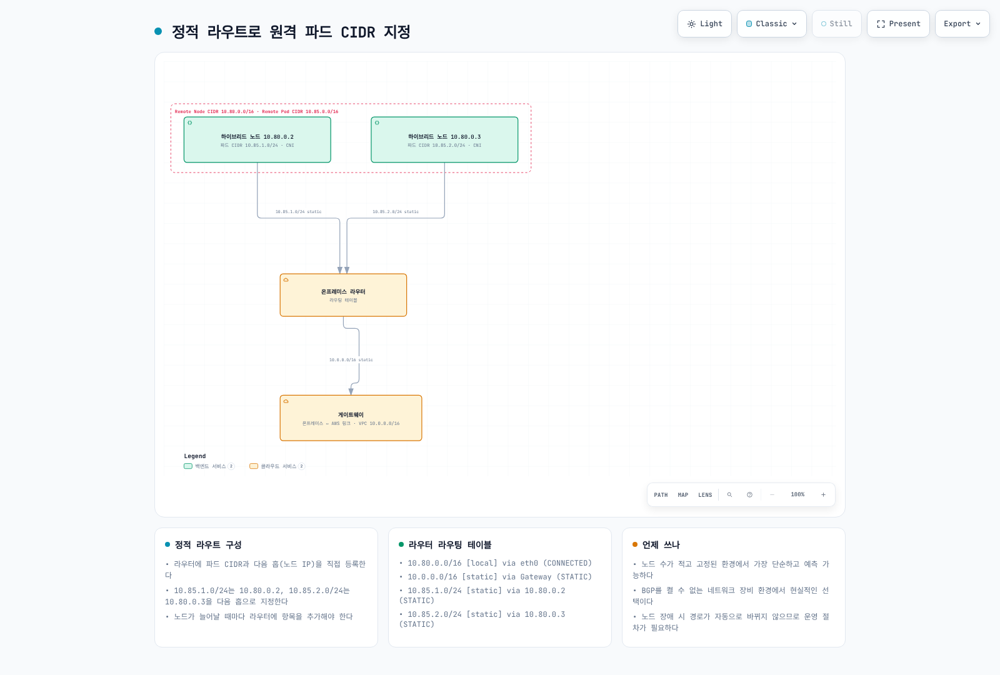
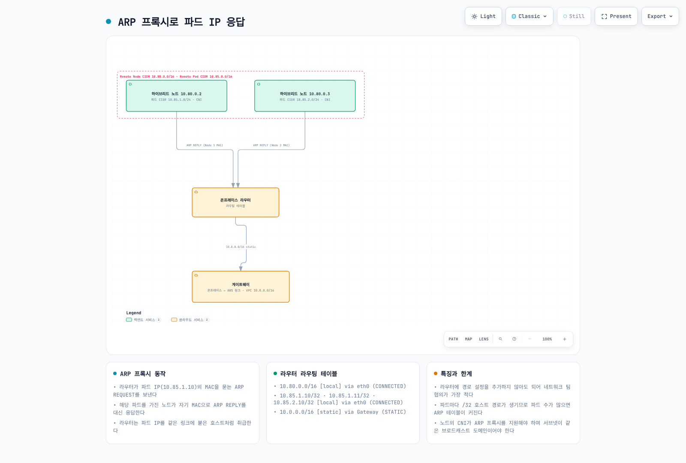

# 네트워크 구성

> **지원 버전**: EKS 1.36 예제; AWS-maintained Cilium 1.18.3-0 기준, 호환 host/kernel 필요
> **마지막 업데이트**: 2026년 9월 12일

Routing·DNS·TLS·credential·앱 트래픽을 별도로 검증합니다. 아래는 Terraform mock provider 등을 사용해 로컬 schema/fixture로 확인한 예제이며 AWS 리소스·router·firewall·실제 cluster를 변경하지 않았습니다. 그림은 AWS 개념을 바탕으로 이 저장소에서 제작했으며 AWS가 이 구성을 검증한 결과물이 아닙니다.


[🔍 인터랙티브 다이어그램 보기](https://www.atomai.click/kubernetes-docs/archmaps/ko-eks-hybrid-nodes-prereq-0.html)

## 네트워크 아키텍처 개요

Control-plane→hybrid node와 private Kubernetes API 트래픽은 cluster VPC 경로를 사용합니다. Public API endpoint로 가는 kubelet 트래픽은 설정된 public 경로를 사용하므로 “모든 트래픽이 항상 VPC ENI 경유”라는 설명은 과도했습니다. Direct Connect public VIF·private 연결·public internet 경로를 구분하세요.

Control-plane ENI/IP는 바뀔 수 있습니다. 공유 VPC의 모든 `Amazon EKS*` ENI를 이 cluster 것으로 간주하지 말고 실제 소유권·승인된 control-plane subnet 범위를 확인합니다.

읽기 전용 진단 전에 계정·Kubernetes context를 확인합니다.

```bash
set -euo pipefail
: "${EXPECTED_ACCOUNT_ID:?Set the intended account}"
: "${AWS_REGION:?Set the cluster Region}"
: "${CLUSTER_NAME:?Set the reviewed cluster name}"
: "${KUBECONFIG:?Set the reviewed kubeconfig}"
export KUBECONFIG KUBE_CONTEXT="${KUBE_CONTEXT:-$CLUSTER_NAME}"
check_account() {
  local account
  account=$(aws sts get-caller-identity --region "$AWS_REGION" --query Account --output text) || return
  test "$account" = "$EXPECTED_ACCOUNT_ID" || { printf 'Account mismatch.\n' >&2; return 1; }
}
check_account
umask 077
export WORK_DIR
WORK_DIR=$(mktemp -d "$PWD/hybrid-network.XXXXXXXX")
aws eks describe-cluster --region "$AWS_REGION" --name "$CLUSTER_NAME" --output json \
  > "$WORK_DIR/cluster.json"
endpoint=$(kubectl --context "$KUBE_CONTEXT" config view --minify \
  -o jsonpath='{.clusters[0].cluster.server}')
jq -e --arg endpoint "$endpoint" '
  .cluster.status=="ACTIVE" and .cluster.endpoint==$endpoint and
  (.cluster.remoteNetworkConfig.remoteNodeNetworks|length)>0
' "$WORK_DIR/cluster.json" >/dev/null
printf 'Private diagnostics: %s\n' "$WORK_DIR"
```

## CIDR 범위 요구 사항

Remote node/Pod는 겹치지 않는 IPv4 **RFC1918 또는 CGNAT**이며 VPC·Service CIDR과도 분리합니다. 각 remote 종류는 최대 15개 CIDR을 지원합니다. 현재 EKS API는 기존 cluster의 remote-network 구성도 지원하므로 생성 시점 전용이 아닙니다.

| Network 동작 | 의미 |
|--------------|------|
| Routable Pod IP | 승인된 route를 통해 cloud/control-plane client가 Pod IP로 연결 시작 가능 |
| Masqueraded egress | SNAT는 Pod가 시작한 연결의 return path를 제공할 수 있지만 신규 inbound 연결을 자동 허용하지 않음 |
| Unroutable Pod network | 직접 cloud→Pod 통신에는 다른 지원 경로가 필요; 일반적인 구성에서는 cloud-hosted webhook/API service 사용 |

Unroutable이 Pod의 모든 AWS API 호출 불가를 뜻하지는 않습니다. 직접 hybrid/cloud Pod 통신·hybrid webhook에는 실제 Pod route가 필요합니다. Gateway/proxy 대안은 별도 요구 사항을 확인하세요.

## 필수 방화벽 포트

| Flow | Protocol/port |
|------|---------------|
| Node/Pod → Kubernetes API | 실제 cluster endpoint TCP443 |
| Control-plane ENI → kubelet | 인증·권한 검사를 포함한 TCP10250 |
| Control plane → webhook/aggregated API Pod | 실제 설정 TCP port; 일반적인 “8443+” 범위 아님 |
| DNS client ↔ 실제 resolver | UDP/TCP53·stateful return traffic |
| 참여 node 간 Cilium VXLAN | UDP8472 |
| 선택하고 지원 범위를 검토한 Cilium Geneve | UDP6081 |
| Cilium health check | TCP4240과 필요한 ICMP/health endpoint 접근 |
| BGP node↔router | 설정한 active/passive peer의 TCP179 |
| VPN gateway transport | UDP500/4500 및 해당 IPsec transport 요구 |
| 앱/AWS credential·registry service | 실제 목적지·port만 |

Network owner가 connection tracking·기존 rule을 보존하며 변경합니다. 이전의 광범위한 `10.0.0.0/8` INPUT, 무제한 DNS/VXLAN, 전체 ruleset 저장은 재사용할 안전한 정책이 아니었습니다. 인증 없는 kubelet 10255를 현대적인 선택 요구로 열지 마세요.

## AWS 엔드포인트 접근

**EKS 관리 API PrivateLink endpoint와 Kubernetes API server endpoint는 다릅니다.**

| `com.amazonaws.<region>.*` 서비스 suffix | 용도/필요한 경우 |
|------------------------------------------|------------------|
| `eks` | DescribeCluster 등 AWS EKS 관리 API |
| `eks-auth` | EKS Pod Identity 사용 시 |
| `ecr.api`, `ecr.dkr` | Private ECR API/registry; image layer에는 S3 접근도 필요 |
| `s3` | Private S3; on-prem은 VPC gateway endpoint를 직접 사용할 수 없음 |
| `ssm`, 해당 SSM messaging service | SSM credential/management 기능 |
| `rolesanywhere` | 선택 provider가 IAM Roles Anywhere일 때 |
| `sts` | 실제 client STS/IRSA/AssumeRole 호출; 로컬 EKS token 서명 자체는 client의 STS network 요청이 아님 |
| `logs`, `monitoring` 등 선택 서비스 | 해당 agent/workload가 호출할 때 |
| `oidc-eks` | 지원 리전의 현재 EKS OIDC discovery/JWKS PrivateLink |
| `eks-proxy` | AWS console resource view용이며 공개 application SDK/API가 아님 |

대상 리전의 서비스 가용성을 확인합니다. Private ECR endpoint가 **public ECR**, CloudFront, 임의 package repository를 private으로 만들지는 않습니다. AWS Cilium OCI chart의 public ECR도 승인된 접근·mirror 배포 경로가 필요합니다.

OIDC discovery/JWKS는 익명 public-key 데이터입니다. `oidc-eks`는 default full-access endpoint policy만 허용합니다. Reachability는 SG/route, role authorization은 IAM trust의 `aud`/`sub`로 제어하세요. STS의 IRSA 검증은 이 endpoint와 독립적으로 AWS 내부에서 수행됩니다.

Roles Anywhere CreateSession endpoint policy의 principal은 인증서 인증 전 평가 때문에 `*`여야 합니다. 문서에 따라 승인된 trust-anchor resource·지원 certificate condition으로 제한합니다. 서로 다른 서비스에 일반 policy 하나를 복사하지 마세요. Endpoint policy는 통과 트래픽의 필터이며 IAM/role trust를 대체하거나 public service endpoint 전체를 끄지 않습니다.

```bash
check_account
vpc_id=$(jq -er '.cluster.resourcesVpcConfig.vpcId' "$WORK_DIR/cluster.json")
aws ec2 describe-vpc-endpoints --region "$AWS_REGION" \
  --filters "Name=vpc-id,Values=$vpc_id" --output json |
  jq '[.VpcEndpoints[]|{id:.VpcEndpointId,service:.ServiceName,type:.VpcEndpointType,
      state:.State,privateDNS:.PrivateDnsEnabled,dnsOptions:.DnsOptions,
      subnets:.SubnetIds,groups:.Groups,dnsEntries:.DnsEntries}]'
```

### S3 Private DNS와 Artifact 배포

S3 **interface endpoint는 private DNS를 지원합니다**. Inbound-Resolver-only 옵션은 on-prem query에 interface를, VPC 내부 트래픽에는 필요한 S3 gateway endpoint를 사용합니다. 옵션을 켠 동안 gateway를 유지하세요. 옵션을 해제하면 해당 S3 트래픽을 interface endpoint로 보낼 수 있습니다.

Private DNS는 TLS rewrite가 아닙니다. `hybrid-assets.eks.amazonaws.com`을 S3 endpoint로 PHZ/CNAME 매핑해도 S3가 CloudFront hostname의 인증서나 object/Host routing을 갖지는 않습니다. TLS 검증을 끄지 마세요. 지원 artifact 준비/client 설정 경로, 자체 hostname/certificate의 승인된 mirror, 검증된 image에 미리 설치한 의존성을 사용합니다.

## VPC 프라이빗 엔드포인트 (에어갭/프라이빗 환경)

여기서 “에어갭”은 필요한 AWS 연결을 유지하며 인터넷 접근을 제한한다는 뜻이지 disconnected cluster가 아닙니다.

다음 완전한 Terraform 예제는 기존 VPC·endpoint subnet·TGW를 사용합니다. VPN/DX 회선·TGW attachment·on-prem route·EKS private DNS 구성을 만들지는 않습니다. VPC DNS support/hostnames와 실제 AZ 분리를 확인하세요. 서로 다른 subnet ID 두 개만으로 AZ 다양성이 입증되지는 않습니다.

원 infrastructure owner를 사용하고 기존 리소스를 import/adopt한 뒤 변경을 계획합니다. 기본 endpoint 집합은 SSM 예시이므로 provider/workload에 맞게 바꿉니다. Endpoint/Resolver ENI에는 요금이 발생합니다. Provider account guard·제한된 ingress가 있으며 응답 트래픽은 stateful SG tracking을 사용합니다.

```hcl
terraform {
  required_version = ">= 1.9, < 2.0"
  required_providers {
    aws = {
      source  = "hashicorp/aws"
      version = "= 6.64.0"
    }
  }
}

provider "aws" {
  region              = var.region
  allowed_account_ids = [var.expected_account_id]
}

variable "expected_account_id" {
  type = string
  validation {
    condition     = can(regex("^[0-9]{12}$", var.expected_account_id))
    error_message = "Set the reviewed 12-digit account ID."
  }
}

variable "region" {
  type = string
}

variable "name_prefix" {
  type    = string
  default = "hybrid-network"
}

variable "vpc_id" {
  type = string
}

variable "endpoint_subnet_ids" {
  type = set(string)
  validation {
    condition     = length(var.endpoint_subnet_ids) >= 2
    error_message = "Provide subnets in at least two verified Availability Zones."
  }
}

variable "s3_gateway_route_table_ids" {
  type = set(string)
  validation {
    condition     = length(var.s3_gateway_route_table_ids) > 0
    error_message = "Provide the reviewed VPC route tables for the S3 gateway endpoint."
  }
}

variable "client_ipv4_cidrs" {
  type = set(string)
  validation {
    condition = length(var.client_ipv4_cidrs) > 0 && alltrue([
      for c in var.client_ipv4_cidrs : can(cidrnetmask(c)) && c != "0.0.0.0/0"
    ])
    error_message = "Provide scoped IPv4 CIDRs for the actual VPC/on-premises clients."
  }
}

variable "onprem_dns_client_cidrs" {
  type = set(string)
  validation {
    condition = length(var.onprem_dns_client_cidrs) > 0 && alltrue([
      for c in var.onprem_dns_client_cidrs : can(cidrnetmask(c)) && c != "0.0.0.0/0"
    ])
    error_message = "Scope inbound DNS to the actual on-premises resolvers."
  }
}

variable "onprem_dns_servers" {
  type = set(string)
  validation {
    condition = length(var.onprem_dns_servers) > 0 && alltrue([
      for ip in var.onprem_dns_servers : can(cidrnetmask("${ip}/32"))
    ])
    error_message = "Provide actual IPv4 addresses of the on-premises DNS servers."
  }
}

variable "onprem_domain" {
  type    = string
  default = "corp.example.internal"
  validation {
    condition = length(var.onprem_domain) <= 253 && length(split(".", trimsuffix(var.onprem_domain, "."))) >= 2 && alltrue([
      for label in split(".", trimsuffix(var.onprem_domain, ".")) :
      length(label) <= 63 && can(regex("^[A-Za-z0-9]([A-Za-z0-9-]*[A-Za-z0-9])?$", label))
    ]) && !can(regex("(^|\\.)(amazonaws\\.com|api\\.aws|cluster\\.local)\\.?$", lower(var.onprem_domain)))
    error_message = "Use a specific owned DNS suffix; do not forward root, AWS or Kubernetes service zones back to on-premises."
  }
}

variable "interface_services" {
  type    = set(string)
  default = ["eks", "ecr.api", "ecr.dkr", "ssm", "ssmmessages"]
  validation {
    condition     = !contains(var.interface_services, "s3")
    error_message = "S3 has its own gateway/interface configuration below."
  }
}

variable "endpoint_policy_json" {
  type    = map(string)
  default = {}
  validation {
    condition = !contains(keys(var.endpoint_policy_json), "oidc-eks") && alltrue([
      for policy in values(var.endpoint_policy_json) : can(jsondecode(policy))
    ])
    error_message = "Use valid service-specific JSON policies; oidc-eks supports only its default full-access policy."
  }
}

variable "controlplane_route_table_ids" {
  type = set(string)
}

variable "remote_ipv4_cidrs" {
  type = set(string)
  validation {
    condition = alltrue([
      for c in var.remote_ipv4_cidrs : can(cidrnetmask(c)) && c != "0.0.0.0/0"
    ])
    error_message = "Use reviewed remote node, Pod and required DNS/service IPv4 CIDRs."
  }
}

variable "existing_transit_gateway_id" {
  type = string
}
```
```hcl
# Import/adopt existing resources through their owner before using this example.
# The existing VPC must have DNS support/hostnames and working hybrid routes.
resource "aws_security_group" "endpoints" {
  name_prefix = "${var.name_prefix}-vpce-"
  description = "HTTPS clients for interface endpoints"
  vpc_id      = var.vpc_id
}

resource "aws_vpc_security_group_ingress_rule" "endpoint_https" {
  for_each          = var.client_ipv4_cidrs
  security_group_id = aws_security_group.endpoints.id
  cidr_ipv4         = each.value
  ip_protocol       = "tcp"
  from_port         = 443
  to_port           = 443
}

resource "aws_vpc_endpoint" "service" {
  for_each            = var.interface_services
  vpc_id              = var.vpc_id
  service_name        = "com.amazonaws.${var.region}.${each.value}"
  vpc_endpoint_type   = "Interface"
  private_dns_enabled = true
  subnet_ids          = var.endpoint_subnet_ids
  security_group_ids  = [aws_security_group.endpoints.id]
  policy              = lookup(var.endpoint_policy_json, each.key, null)
  tags                = { Name = "${var.name_prefix}-${each.key}" }
}

# S3 inbound-Resolver-only private DNS requires this gateway endpoint.
resource "aws_vpc_endpoint" "s3_gateway" {
  vpc_id            = var.vpc_id
  service_name      = "com.amazonaws.${var.region}.s3"
  vpc_endpoint_type = "Gateway"
  route_table_ids   = var.s3_gateway_route_table_ids
  tags             = { Name = "${var.name_prefix}-s3-gateway" }
}

resource "aws_vpc_endpoint" "s3_interface" {
  vpc_id              = var.vpc_id
  service_name        = "com.amazonaws.${var.region}.s3"
  vpc_endpoint_type   = "Interface"
  private_dns_enabled = true
  subnet_ids          = var.endpoint_subnet_ids
  security_group_ids  = [aws_security_group.endpoints.id]
  dns_options {
    private_dns_only_for_inbound_resolver_endpoint = true
  }
  depends_on = [aws_vpc_endpoint.s3_gateway]
  tags       = { Name = "${var.name_prefix}-s3-interface" }
}

resource "aws_security_group" "dns_inbound" {
  name_prefix = "${var.name_prefix}-dns-in-"
  description = "DNS from on-premises resolvers"
  vpc_id      = var.vpc_id
}

resource "aws_security_group" "dns_outbound" {
  name_prefix = "${var.name_prefix}-dns-out-"
  description = "DNS to reviewed on-premises resolvers"
  vpc_id      = var.vpc_id
}

locals {
  inbound_dns_rules = {
    for pair in setproduct(var.onprem_dns_client_cidrs, toset(["tcp", "udp"])) :
    "${pair[0]}-${pair[1]}" => { cidr = pair[0], protocol = pair[1] }
  }
  outbound_dns_rules = {
    for pair in setproduct(var.onprem_dns_servers, toset(["tcp", "udp"])) :
    "${pair[0]}-${pair[1]}" => { ip = pair[0], protocol = pair[1] }
  }
}

resource "aws_vpc_security_group_ingress_rule" "dns" {
  for_each          = local.inbound_dns_rules
  security_group_id = aws_security_group.dns_inbound.id
  cidr_ipv4         = each.value.cidr
  ip_protocol       = each.value.protocol
  from_port         = 53
  to_port           = 53
}

resource "aws_vpc_security_group_egress_rule" "dns" {
  for_each          = local.outbound_dns_rules
  security_group_id = aws_security_group.dns_outbound.id
  cidr_ipv4         = "${each.value.ip}/32"
  ip_protocol       = each.value.protocol
  from_port         = 53
  to_port           = 53
}

resource "aws_route53_resolver_endpoint" "inbound" {
  name                   = "${var.name_prefix}-inbound"
  direction              = "INBOUND"
  resolver_endpoint_type = "IPV4"
  security_group_ids     = [aws_security_group.dns_inbound.id]
  dynamic "ip_address" {
    for_each = var.endpoint_subnet_ids
    content {
      subnet_id = ip_address.value
    }
  }
}

resource "aws_route53_resolver_endpoint" "outbound" {
  name                   = "${var.name_prefix}-outbound"
  direction              = "OUTBOUND"
  resolver_endpoint_type = "IPV4"
  security_group_ids     = [aws_security_group.dns_outbound.id]
  dynamic "ip_address" {
    for_each = var.endpoint_subnet_ids
    content {
      subnet_id = ip_address.value
    }
  }
}

resource "aws_route53_resolver_rule" "onprem" {
  domain_name          = var.onprem_domain
  name                 = "${var.name_prefix}-onprem"
  rule_type            = "FORWARD"
  resolver_endpoint_id = aws_route53_resolver_endpoint.outbound.id
  dynamic "target_ip" {
    for_each = var.onprem_dns_servers
    content {
      ip   = target_ip.value
      port = 53
    }
  }
}

resource "aws_route53_resolver_rule_association" "onprem" {
  resolver_rule_id = aws_route53_resolver_rule.onprem.id
  vpc_id           = var.vpc_id
}

output "inbound_resolver_ips" {
  value = [for address in aws_route53_resolver_endpoint.inbound.ip_address : address.ip]
}

# VPC return routes only. Existing TGW attachment routes/propagation and
# on-premises routing must be managed separately by their infrastructure owner.
locals {
  remote_routes = {
    for pair in setproduct(var.controlplane_route_table_ids, var.remote_ipv4_cidrs) :
    "${pair[0]}-${pair[1]}" => { table = pair[0], cidr = pair[1] }
  }
}

resource "aws_route" "hybrid" {
  for_each               = local.remote_routes
  route_table_id         = each.value.table
  destination_cidr_block = each.value.cidr
  transit_gateway_id     = var.existing_transit_gateway_id
  # A VGW topology uses gateway_id instead; do not set both target fields.
}
```

S3 gateway 의존성이 명시돼 있습니다. `remote_ipv4_cidrs`에는 node/Pod 외에 필요한 on-prem DNS/service 대역도 넣습니다. 예시 DNS `192.168.1.10/11`에는 승인된 `192.168.1.0/24` 또는 해당 host route가 필요합니다. VGW return route에는 `transit_gateway_id` 대신 `gateway_id`를 사용하며 두 target을 동시에 설정하거나 TGW ID를 VGW/gateway 필드에 넣지 마세요. VPC route만으로 TGW/VPN/on-prem 전체 routing이 완성되지는 않습니다.

## DNS 구성

On-prem resolver에서 선택한 AWS/service·실제 cluster endpoint 이름을 Route 53 Resolver inbound IP로 조건부 전달할 수 있습니다. 실제 endpoint가 반환한 IP를 사용하세요. `amazonaws.com` 전체 전달은 다른 서비스에도 영향을 주므로 zone을 의도적으로 고르고 loop를 피합니다.

```text
// Example service zones only. Replace these Resolver IPs with actual outputs.
zone "eks.ap-northeast-2.amazonaws.com" {
    type forward;
    forward only;
    forwarders { 10.0.1.10; 10.0.2.10; };
};
zone "s3.ap-northeast-2.amazonaws.com" {
    type forward;
    forward only;
    forwarders { 10.0.1.10; 10.0.2.10; };
};
```

이 BIND 조각은 표시한 service zone용이며 Kubernetes API hostname을 자동으로 포함하지 않습니다. 실제 cluster endpoint 이름/suffix와 필요한 서비스 이름을 추가하세요. Resolver outbound의 on-prem zone은 선택 DNS server에서 authoritative/reachable해야 하며 같은 loop로 다시 전달하면 안 됩니다.

### CoreDNS 커스텀 도메인 구성

CoreDNS 직접 forwarding을 선택했다면 기존 Corefile에 검토한 server block을 병합합니다. 관리형 ConfigMap 전체를 덮어쓰지 마세요.

```text
# Fragment to merge through the CoreDNS configuration owner.
corp.example.internal:53 {
    errors
    cache 30
    forward . 192.168.1.10 192.168.1.11 {
        max_concurrent 1000
    }
}
```

기존 Kubernetes zone·health/readiness·reload 동작을 보존합니다. 실제 resolver file·systemd-resolved/stub 구성을 확인하세요. 자기 자신으로 forwarding하면 loop가 생깁니다. 한 zone에 모순된 경로를 겹치기보다 적절한 VPC forwarding 또는 직접 CoreDNS 경로를 선택합니다.

관리형 EKS add-on은 **설치된 버전**의 schema를 조회하고 관련 없는 기존 설정을 보존한 전체 candidate를 검증합니다.

```bash
check_account
aws eks describe-addon --region "$AWS_REGION" --cluster-name "$CLUSTER_NAME" \
  --addon-name coredns --output json > "$WORK_DIR/coredns-addon.json"
addon_version=$(jq -er '.addon.addonVersion' "$WORK_DIR/coredns-addon.json")
aws eks describe-addon-configuration --region "$AWS_REGION" --addon-name coredns \
  --addon-version "$addon_version" --output json > "$WORK_DIR/coredns-schema-response.json"
jq -r '.configurationSchema' "$WORK_DIR/coredns-schema-response.json" \
  > "$WORK_DIR/coredns-schema.json"
# Prepare the full intended values, preserving unrelated existing configuration.
: "${COREDNS_CANDIDATE_JSON:?Set the reviewed full configurationValues JSON file}"
export COREDNS_CANDIDATE_JSON
python3 - <<'PY'
import json, os
from pathlib import Path
import jsonschema
folder = Path(os.environ["WORK_DIR"])
schema = json.loads((folder / "coredns-schema.json").read_text())
candidate = json.loads(Path(os.environ["COREDNS_CANDIDATE_JSON"]).read_text())
validator = jsonschema.validators.validator_for(schema)
validator.check_schema(schema)
validator(schema).validate(candidate)
print("Configuration matches the fetched schema; rollout and DNS behavior are not yet verified")
PY
```

이는 로컬 schema 검사이며 rollout이 아닙니다. Managed add-on/GitOps 소유권·autoscaling·복구를 조율한 뒤 적용하세요.

### CoreDNS 배치와 Locality

AWS는 혼합 cluster에서 cloud/hybrid에 각각 최소 한 replica를 권장합니다. 각 위치 두 개는 복원력 선택지이며 네 replica가 보편적인 최소값·보장은 아닙니다.

모든 DNS 대상 node의 실제 zone label을 확인합니다. Hybrid node에는 owner가 정한 `topology.kubernetes.io/zone: onprem-dc1` 같은 값이 필요합니다. Compute-type label이 zone이나 taint를 자동 생성하지는 않습니다. Pod template `spec` 조각을 병합할 때 기존 affinity/toleration을 지우지 마세요.

```json
{
  "affinity": {
    "podAntiAffinity": {
      "preferredDuringSchedulingIgnoredDuringExecution": [
        {
          "weight": 100,
          "podAffinityTerm": {
            "labelSelector": {
              "matchLabels": {
                "k8s-app": "kube-dns"
              }
            },
            "topologyKey": "kubernetes.io/hostname"
          }
        },
        {
          "weight": 50,
          "podAffinityTerm": {
            "labelSelector": {
              "matchLabels": {
                "k8s-app": "kube-dns"
              }
            },
            "topologyKey": "topology.kubernetes.io/zone"
          }
        }
      ]
    }
  }
}
```

Soft affinity/spread는 선호이며 2+2 배치나 bootstrap 성공 보장이 아닙니다. 배치만으로 client가 가까운 DNS replica를 선택하지도 않습니다.

AWS의 Service Traffic Distribution 예제는 `PreferClose`를 사용합니다. Cilium에는 지원되는 `loadBalancer.serviceTopology` 설정과 owner를 통한 agent rollout이 필요합니다. 실제 dataplane/version·정상 local endpoint를 확인하세요.

```json
{
  "spec": {
    "trafficDistribution": "PreferClose"
  }
}
```
```bash
kubectl --context "$KUBE_CONTEXT" --request-timeout=15s -n kube-system \
  get service kube-dns -o json |
  jq '{name:.metadata.name,uid:.metadata.uid,clusterIP:.spec.clusterIP,
       clusterIPs:.spec.clusterIPs,ports:.spec.ports,trafficDistribution:.spec.trafficDistribution}'
kubectl --context "$KUBE_CONTEXT" --request-timeout=15s -n kube-system \
  get endpointslices -l kubernetes.io/service-name=kube-dns -o json |
  jq '[.items[]|{name:.metadata.name,addressType,ports,
       endpoints:[.endpoints[]?|{addresses,nodeName,zone,conditions,hints}]}]'
kubectl --context "$KUBE_CONTEXT" --request-timeout=15s -n kube-system \
  get pods -l k8s-app=kube-dns -o json |
  jq '[.items[]|{name:.metadata.name,node:.spec.nodeName,phase:.status.phase,
       ready:([.status.conditions[]?|select(.type=="Ready")|.status]|first // "NotReported")}]'
```

실제 Service IP·EndpointSlice zone/hint·Pod readiness를 확인합니다. `10.100.0.10`은 특정 Service CIDR의 예시이지 보편적인 DNS 주소가 아닙니다. Local replica가 disconnected EKS를 독립적인 DNS/control plane으로 바꾸지는 않습니다.

## 트래픽 플로우 패턴

그림의 주소·처리 단계는 설명용입니다. 실제 Service dataplane이 kube-proxy iptables, nftables/IPVS, Cilium eBPF replacement 중 무엇인지 확인하세요.

### 패턴 1: Kubelet → EKS 컨트롤 플레인

Kubelet은 설정된 Kubernetes API endpoint를 해석해 연결합니다. Private/public 접근의 route가 다르며 EKS 관리 PrivateLink endpoint와 혼동하면 안 됩니다.



[🔍 인터랙티브 다이어그램 보기](https://www.atomai.click/kubernetes-docs/archmaps/ko-eks-hybrid-nodes-02-network-configuration-10.html)

### 패턴 2: EKS 컨트롤 플레인 → Kubelet

Control plane은 보고된 routable node 주소의 TCP10250에 연결합니다. Logs/exec/port-forward에 사용되며 return route·firewall·kubelet 인증이 필요합니다.



[🔍 인터랙티브 다이어그램 보기](https://www.atomai.click/kubernetes-docs/archmaps/ko-eks-hybrid-nodes-02-network-configuration-11.html)

### 패턴 3: Pod → EKS 컨트롤 플레인

Kubernetes Service IP를 사용하는 Pod에는 선택한 API endpoint로의 Service 변환이 필요합니다. Egress SNAT가 적용되면 응답은 node 주소로 오고 connection tracking이 역변환합니다. SNAT가 없으면 Pod 주소의 return route가 필요합니다.



[🔍 인터랙티브 다이어그램 보기](https://www.atomai.click/kubernetes-docs/archmaps/ko-eks-hybrid-nodes-02-network-configuration-12.html)

그림의 SNAT→DNAT 번호는 보편적인 hook 순서가 아닙니다. Iptables 경로에서는 일반적으로 Service DNAT 다음 routing·해당 POSTROUTING SNAT가 적용됩니다. eBPF 경로는 다르므로 실제 packet/connection 상태를 확인하세요.

### 패턴 4: EKS 컨트롤 플레인 → Pod (웹훅)

API server가 선택한 webhook Pod IP/port에 접근할 수 있어야 합니다. 실제 설정 port를 사용하며 그림의 이전 “8443+”는 유효한 port-range 요구가 아닙니다.



[🔍 인터랙티브 다이어그램 보기](https://www.atomai.click/kubernetes-docs/archmaps/ko-eks-hybrid-nodes-02-network-configuration-13.html)

### 패턴 5: 하이브리드 노드 간 Pod ↔ Pod

지원 VXLAN overlay는 **outer node IP**로 대상 node에 접근합니다. 캡슐화 패킷 운반만을 위해 underlay에 inner destination Pod CIDR route가 필요한 것은 아닙니다.



[🔍 인터랙티브 다이어그램 보기](https://www.atomai.click/kubernetes-docs/archmaps/ko-eks-hybrid-nodes-02-network-configuration-14.html)

그림에서 캡슐화 후 `10.85.x.0/24`를 조회하는 전달 label은 오래된 단순화입니다. 실제 outer packet은 `10.80.0.x`로 routing됩니다. 같은 L2 node끼리는 router hop 없이 직접 통신할 수도 있습니다.

VXLAN은 inner Ethernet frame을 UDP로 캡슐화합니다. IPv4·추가 encapsulation 없는 예제의 overhead 50바이트는 MTU 1500→1450을 설명하며 추가 tunnel에서는 달라집니다. Cilium VXLAN은 UDP8472, 일반 VXLAN은 흔히 4789, Geneve는 UDP6081입니다. 현재 Cilium tunnel 설정은 VXLAN/Geneve를 구분하며 IP-in-IP를 예전 `--tunnel` 옵션의 동등한 기본 overlay로 취급하면 안 됩니다.

VNI는 24비트이며 Cilium은 encapsulation metadata로 security identity를 전달할 수 있습니다. 암호학적 tenant 격리가 아니므로 policy·실제 identity 전파를 별도로 검토합니다.

### 패턴 6: 클라우드 Pod ↔ 하이브리드 Pod

직접 Pod-IP 트래픽은 VPC·WAN·on-prem Pod route가 필요합니다. 실제 요청이 Service VIP를 대상으로 할 때만 Service 변환이 필요합니다.



[🔍 인터랙티브 다이어그램 보기](https://www.atomai.click/kubernetes-docs/archmaps/ko-eks-hybrid-nodes-02-network-configuration-15.html)

그림의 kube-proxy/iptables block은 dataplane에 따라 다릅니다. 직접 Pod-IP packet에 kube-proxy DNAT가 본질적으로 필요한 것은 아닙니다.

### kube-proxy와 kubelet 상세

kube-proxy **iptables 모드**의 대표 chain 경로입니다.

```text
KUBE-SERVICES → KUBE-SVC-* → KUBE-SEP-* → endpoint DNAT
```

적격 equal-weight endpoint 3개와 별도 affinity/locality 정책이 없다면 조건부 확률 1/3, 남은 packet의 1/2, 나머지 선택이 대략 균등한 분배를 만듭니다. 아래는 설명용이며 실측 출력이나 모든 dataplane의 rule 구조가 아닙니다.

```text
# KUBE-SERVICES chain (nat table)
-A KUBE-SERVICES -d 172.20.0.10/32 -p tcp -m tcp --dport 80 -j KUBE-SVC-XXXXXX

# KUBE-SVC chain (load balancing)
-A KUBE-SVC-XXXXXX -m statistic --mode random --probability 0.33333 -j KUBE-SEP-AAAAAA
-A KUBE-SVC-XXXXXX -m statistic --mode random --probability 0.50000 -j KUBE-SEP-BBBBBB
-A KUBE-SVC-XXXXXX -j KUBE-SEP-CCCCCC

# KUBE-SEP chain (DNAT)
-A KUBE-SEP-AAAAAA -p tcp -j DNAT --to-destination 10.85.0.15:8080
-A KUBE-SEP-BBBBBB -p tcp -j DNAT --to-destination 10.85.0.16:8080
-A KUBE-SEP-CCCCCC -p tcp -j DNAT --to-destination 10.85.1.20:8080
```

| Secure kubelet endpoint | 용도 |
|------------------------|------|
| `/pods` | Pod 정보 |
| `/exec/{namespace}/{pod}/{container}` | Container exec stream |
| `/containerLogs/{namespace}/{pod}/{container}` | Container log; 이전 `/logs/...`가 아님 |
| `/metrics`, `/healthz` | 권한이 있는 metrics/health 접근 |

지원되는 API-server 경유 진단·권한을 사용합니다. 실제 Node `status.addresses`가 중요하며 다른 객체의 첫 주소나 hostname을 임의로 대신 쓰지 마세요.

## 라우팅 가능한 Pod CIDR 구성



[🔍 인터랙티브 다이어그램 보기](https://www.atomai.click/kubernetes-docs/archmaps/ko-eks-hybrid-nodes-02-network-configuration-0.html)

### 옵션 1: BGP (권장)



[🔍 인터랙티브 다이어그램 보기](https://www.atomai.click/kubernetes-docs/archmaps/ko-eks-hybrid-nodes-02-network-configuration-1.html)

AWS 전용 CNI 지원 페이지는 AWS-maintained Cilium 1.17/1.18을 안내합니다. 여기서는 호환 kernel/OS의 1.18.3-0을 참고하며 upstream 1.19로 무조건 바꾸지 않습니다. 다른 AWS 페이지는 Calico BGP·보존된 예제도 언급합니다. Calico 프로젝트가 deprecated됐다는 증거는 아니므로 기존 배포의 지원 범위를 확인하세요.

**기존 Cilium release의 정확한 버전**을 소유한 관리 도구에서 values를 병합하고 operator/agent rollout을 검토하며 BGP를 활성화합니다.

```yaml
bgpControlPlane:
  enabled: true
operator:
  rollOutPods: true
```

AWS 예제의 `v2alpha1`은 검토한 1.18.3 CRD에서 계속 served 상태이며 `v2`도 지원됩니다. 이 예제 때문에 CRD를 교체할 필요는 없습니다.

아래는 hybrid node를 선택하고 peer advertisement selector와 advertisement label을 연결하며 Pod CIDR만 광고합니다.

```yaml
apiVersion: cilium.io/v2alpha1
kind: CiliumBGPClusterConfig
metadata:
  name: hybrid-bgp-config
spec:
  nodeSelector:
    matchLabels:
      eks.amazonaws.com/compute-type: hybrid
  bgpInstances:
  - name: hybrid-instance
    localASN: 65001
    peers:
    - name: on-prem-router
      peerASN: 65000
      peerAddress: 10.80.1.1
      peerConfigRef:
        name: on-prem-peer
```
```yaml
apiVersion: cilium.io/v2alpha1
kind: CiliumBGPPeerConfig
metadata:
  name: on-prem-peer
spec:
  timers:
    holdTimeSeconds: 90
    keepAliveTimeSeconds: 30
  gracefulRestart:
    enabled: true
    restartTimeSeconds: 120
  families:
  - afi: ipv4
    safi: unicast
    advertisements:
      matchLabels:
        advertise: hybrid-pods
```
```yaml
apiVersion: cilium.io/v2alpha1
kind: CiliumBGPAdvertisement
metadata:
  name: hybrid-pod-cidrs
  labels:
    advertise: hybrid-pods
spec:
  advertisements:
  - advertisementType: PodCIDR
```

선택한 node가 의도한 peering topology로 router `10.80.1.1`에 접근한다는 전제입니다. Rack/loopback이 다르면 겹치지 않는 selector·검토한 multihop 설정이 필요할 수 있습니다. TCP179·ASN·인증·prefix filter·협상 timer·graceful-restart의 stale-route 동작을 network owner와 검토하세요.

BGP Established만으로 의도한 prefix 광고·수락·router forwarding-table 설치가 입증되지는 않습니다. Cilium BGP control plane은 reachability를 광고하며 모든 kernel/underlay routing을 대체하지 않습니다.

```bash
cilium --context "$KUBE_CONTEXT" bgp peers
cilium --context "$KUBE_CONTEXT" bgp routes
kubectl --context "$KUBE_CONTEXT" --request-timeout=15s \
  get ciliumbgpclusterconfigs,ciliumbgppeerconfigs,ciliumbgpadvertisements -o json |
  jq '[.items[]|{kind,name:.metadata.name,status:.status}]'
```

#### ASN과 Router 구성

RFC6996 private 범위는 **64512–65534**, **4200000000–4294967294**입니다. 이전의 “16비트 범위만 사용” 규칙은 부정확했습니다. 1–64511 전체를 자유로운 public ASN으로 설명해서도 안 됩니다. Public/reserved/documentation 할당에는 별도 규칙이 있습니다.

조율된 기존 ASN을 사용합니다. 여기서 `localASN=65001`은 Cilium node, `peerASN=65000`은 on-prem router입니다. TGW ASN은 별도 upstream 관계이며 TGW가 존재한다고 Cilium이 자동으로 peer가 되지는 않습니다. Site-to-Site VPN BGP는 설정한 VPN/customer gateway 경로에서 종료되며 TGW Connect도 별도 transport/design입니다.

아래 vendor 조각은 설명용 출발점이며 장비 실행 검증을 하지 않았습니다. Router owner가 platform/version별 import/export prefix filter·limit·복구를 포함해 병합해야 합니다. Live router의 전역 ASN을 무작정 바꾸지 마세요.

**Cisco IOS / IOS-XE**

```text
router bgp 65000
 neighbor 10.80.1.10 remote-as 65001
 neighbor 10.80.1.10 description "EKS Hybrid Node - Cilium BGP"
 !
 address-family ipv4 unicast
  neighbor 10.80.1.10 activate
  neighbor 10.80.1.10 soft-reconfiguration inbound
 exit-address-family
```

**Cisco NX-OS (Nexus)**

```text
router bgp 65000
  address-family ipv4 unicast
  neighbor 10.80.1.10
    remote-as 65001
    description EKS-Hybrid-Cilium
    address-family ipv4 unicast
      soft-reconfiguration inbound
```

**Juniper Junos (MX / QFX / SRX)**

```text
set protocols bgp group eks-hybrid type external
set protocols bgp group eks-hybrid peer-as 65001
set protocols bgp group eks-hybrid neighbor 10.80.1.10 description "EKS Hybrid Node"
set protocols bgp group eks-hybrid family inet unicast
set routing-options autonomous-system 65000
```

**Arista EOS**

```text
router bgp 65000
   neighbor 10.80.1.10 remote-as 65001
   neighbor 10.80.1.10 description EKS-Hybrid-Cilium
   !
   address-family ipv4
      neighbor 10.80.1.10 activate
```

**MikroTik RouterOS 7.20+**

```text
/routing/bgp/instance
add name=hybrid as=65000
/routing/bgp/connection
add name=hybrid-node-001 instance=hybrid remote.address=10.80.1.10 remote.as=65001 local.role=ebgp address-families=ip disabled=yes
# Review input/output filters and routing before enabling the connection.
```

**FRRouting (FRR), reference 10.7.1**

```text
ip prefix-list HYBRID_PODS seq 10 permit 10.85.0.0/16 ge 25 le 25
route-map FROM_HYBRID permit 10
 match ip address prefix-list HYBRID_PODS
route-map TO_HYBRID deny 10
router bgp 65000
 bgp router-id 10.80.1.1
 bgp ebgp-requires-policy
 neighbor 10.80.1.10 remote-as 65001
 address-family ipv4 unicast
  neighbor 10.80.1.10 activate
  neighbor 10.80.1.10 route-map FROM_HYBRID in
  neighbor 10.80.1.10 route-map TO_HYBRID out
 exit-address-family
```

RouterOS 7.20+는 BGP instance를 명시합니다. FRR traditional 기본값은 eBGP policy를 요구하므로 filter가 없으면 Established여도 `(Policy)` 상태로 route를 교환하지 않을 수 있습니다. FRR 예제는 검토한 `/25` Pod block만 수신하고 Cilium으로 route를 보내지 않습니다. 실제 IPAM·upstream routing에 맞게 filter를 조정하세요.

### 옵션 2: 정적 라우트



[🔍 인터랙티브 다이어그램 보기](https://www.atomai.click/kubernetes-docs/archmaps/ko-eks-hybrid-nodes-02-network-configuration-2.html)

Cilium **cluster-pool IPAM**에서는 할당된 `CiliumNode.spec.ipam.podCIDRs`를 모두 읽습니다. 등록 순서대로 할당된다는 보장은 없습니다. `/16`은 산술적으로 `/25` block 512개, 각 block은 주소 128개지만 지원 node 512개·node당 application Pod IP 128개를 보장하지 않습니다. 예약 주소·node/CNI 사용·kubelet/resource 제한도 고려해야 합니다.

다음은 검토한 새 pool의 Cilium Helm-values 조각이며 kubelet 전체의 `podCIDR` 설정이 아닙니다. 이전을 간단히 하려고 기존 할당 CIDR·block size를 바꾸지 마세요.

```yaml
ipam:
  mode: cluster-pool
  operator:
    clusterPoolIPv4PodCIDRList:
    - 10.85.0.0/16
    clusterPoolIPv4MaskSize: 25
```

`.addresses[0]`은 Cilium-internal 주소일 수 있어 next hop으로 쓰면 안 됩니다. 아래는 Kubernetes Node와 IPv4 InternalIP를 대조하고 모든 Pod prefix를 승인된 remote 범위와 검증합니다. 중첩·누락을 거부하며 실행 shell이 아닌 **JSON candidate**를 생성합니다.

```bash
kubectl --context "$KUBE_CONTEXT" --request-timeout=15s get nodes \
  -l eks.amazonaws.com/compute-type=hybrid -o json |
  jq '{items:[.items[]|{metadata:{name:.metadata.name,uid:.metadata.uid},
       status:{addresses:.status.addresses}}]}' > "$WORK_DIR/hybrid-nodes.json"
kubectl --context "$KUBE_CONTEXT" --request-timeout=15s get ciliumnodes.cilium.io -o json |
  jq '{items:[.items[]|{metadata:{name:.metadata.name,uid:.metadata.uid},
       spec:{addresses:.spec.addresses,ipam:{podCIDRs:.spec.ipam.podCIDRs}}}]}' \
  > "$WORK_DIR/cilium-nodes.json"
```
```bash
python3 - <<'PY'
import ipaddress, json, os
from pathlib import Path
folder = Path(os.environ["WORK_DIR"])
network = json.loads((folder / "cluster.json").read_text())["cluster"]["remoteNetworkConfig"]
node_ranges = [ipaddress.ip_network(c, strict=True) for n in network["remoteNodeNetworks"] for c in n["cidrs"]]
pod_ranges = [ipaddress.ip_network(c, strict=True) for n in network.get("remotePodNetworks", []) for c in n["cidrs"]]
if not pod_ranges:
    raise SystemExit("A reviewed routable remote Pod range is required for this route plan")
nodes = {n["metadata"]["name"]: n for n in json.loads((folder / "hybrid-nodes.json").read_text())["items"]}
claims = json.loads((folder / "cilium-nodes.json").read_text())["items"]
rows, seen = [], []
for item in claims:
    name = item["metadata"]["name"]
    if name not in nodes:
        continue
    node = nodes[name]
    ips = [ipaddress.ip_address(a["address"]) for a in node["status"]["addresses"]
           if a["type"] == "InternalIP" and ":" not in a["address"]]
    if len(ips) != 1 or not any(ips[0] in n for n in node_ranges):
        raise SystemExit(f"Review the unique IPv4 InternalIP and remote-node range for {name}")
    cilium_ips = [ipaddress.ip_address(a["ip"]) for a in item["spec"].get("addresses", [])
                  if a["type"] == "InternalIP" and ":" not in a["ip"]]
    if cilium_ips != ips:
        raise SystemExit(f"Kubernetes/Cilium InternalIP mismatch for {name}")
    cidrs = item["spec"]["ipam"].get("podCIDRs") or []
    if not cidrs:
        raise SystemExit(f"No allocated cluster-pool Pod CIDRs for {name}; do not invent a route")
    for raw in cidrs:
        cidr = ipaddress.ip_network(raw, strict=True)
        if cidr.version != 4 or not any(cidr.subnet_of(p) for p in pod_ranges):
            raise SystemExit(f"Unapproved Pod CIDR for {name}: {cidr}")
        if any(cidr.overlaps(previous) for previous in seen):
            raise SystemExit("Overlapping or duplicate Pod routes require investigation")
        seen.append(cidr)
        rows.append({"node": name, "nodeUID": node["metadata"]["uid"],
                     "ciliumNodeUID": item["metadata"]["uid"], "destination": str(cidr), "nextHop": str(ips[0])})
if set(nodes) != {row["node"] for row in rows}:
    raise SystemExit("Some hybrid nodes have no matching Cilium allocation")
(folder / "reviewed-route-candidates.json").write_text(json.dumps(rows, indent=2) + "\n")
print(json.dumps(rows, indent=2))
PY
```

Cluster-pool용 시점 snapshot이며 node identity의 원자적 lease·routing controller가 아닙니다. 변경 전 재확인하세요. Calico BlockAffinity는 다른 모델이므로 state·borrowing/pool·실제 route를 조사하고 이 generator를 그대로 재사용하지 마세요.

Owner 검토 후 수동 router syntax는 다음과 같을 수 있습니다.

```text
# Illustrative syntax after validating the route plan on the intended router:
# Linux
ip route add 10.85.0.0/25 via 10.80.1.10
# Cisco IOS / IOS-XE
ip route 10.85.0.0 255.255.255.128 10.80.1.10 name hybrid-node-001-pods
# FRR
ip route 10.85.0.0/25 10.80.1.10
```

실제 network manager/device 구성으로 영구 저장합니다. `up ip route ...`는 ifupdown stanza용이며 standalone Bash나 모든 현대 Linux network manager용이 아닙니다. Static route에는 drift/failure 추적이 필요하며 이전 “node 1–5개” 기준은 계획 예시이지 기술적 제한이 아닙니다.

### 옵션 3: ARP 프록시

AWS는 proxy ARP를 가능한 L2 접근으로 설명합니다. 적절한 on-link neighbor discovery·구체적인 CNI/host 설정이 필요하며 일반 Cilium 활성화만으로 이 경로가 준비되지는 않습니다.



[🔍 인터랙티브 다이어그램 보기](https://www.atomai.click/kubernetes-docs/archmaps/ko-eks-hybrid-nodes-02-network-configuration-3.html)

ARP broadcast는 TGW/VPN/DX L3 routing을 통과하지 않습니다. 이 선택이 VPC/WAN return route를 없애지 않으며 BGP/static 설계를 대체하기 전에 실제 L2·failover를 검증해야 합니다.

## 네트워크 정책

선택 대상·방향·실제 enforcing dataplane을 구분합니다. Kubernetes NetworkPolicy allow는 합집합이므로 다른 일치 policy가 트래픽을 허용할 수 있습니다. Cilium explicit deny·L7은 별도 평가가 필요합니다. 아래는 통제된 namespace에서 시험할 대안이며 모든 allow를 겹치면 더 엄격해진다는 뜻이 아닙니다.

### Kubernetes NetworkPolicy

```yaml
apiVersion: networking.k8s.io/v1
kind: NetworkPolicy
metadata:
  name: allow-frontend-to-backend
  namespace: bookinfo
spec:
  podSelector:
    matchLabels:
      app: reviews
  policyTypes:
  - Ingress
  ingress:
  - from:
    - podSelector:
        matchLabels:
          app: productpage
    ports:
    - protocol: TCP
      port: 9080
```

`reviews` ingress를 선택해 같은 namespace의 일치하는 `productpage` Pod에 TCP9080을 허용합니다. 모든 Pod/방향을 격리하거나 다른 모든 policy를 무효화하지는 않습니다.

### CiliumNetworkPolicy와 L7

```yaml
apiVersion: cilium.io/v2
kind: CiliumNetworkPolicy
metadata:
  name: allow-frontend-to-backend
  namespace: bookinfo
spec:
  endpointSelector:
    matchLabels:
      app: reviews
  ingress:
  - fromEndpoints:
    - matchLabels:
        app: productpage
        k8s:io.kubernetes.pod.namespace: bookinfo
    toPorts:
    - ports:
      - port: '9080'
        protocol: TCP
```
```yaml
apiVersion: cilium.io/v2
kind: CiliumNetworkPolicy
metadata:
  name: frontend-http-contract
  namespace: bookinfo
spec:
  endpointSelector:
    matchLabels:
      app: reviews
  ingress:
  - fromEndpoints:
    - matchLabels:
        app: productpage
        k8s:io.kubernetes.pod.namespace: bookinfo
    toPorts:
    - ports:
      - port: '9080'
        protocol: TCP
      rules:
        http:
        - method: GET
          path: /api/v1/.*
```

HTTP rule은 무제한 L4 allow의 대안이며 그 위에 자동으로 더하는 제한이 아닙니다. 실제 앱 path를 사용하세요. HTTP inspection에는 적절한 가시성이 필요하며 암호화 mesh/TLS가 자동으로 검사되지는 않습니다.

### DNS 기반 Egress

별도 `external-api-client` 예제는 **Cilium이 식별하는 CoreDNS Pod**의 DNS와 관측한 API 주소의 HTTPS를 허용합니다.

```yaml
apiVersion: cilium.io/v2
kind: CiliumNetworkPolicy
metadata:
  name: allow-external-api
  namespace: bookinfo
spec:
  endpointSelector:
    matchLabels:
      app: external-api-client
  egress:
  - toEndpoints:
    - matchLabels:
        k8s:io.kubernetes.pod.namespace: kube-system
        k8s:k8s-app: kube-dns
    toPorts:
    - ports:
      - port: '53'
        protocol: ANY
      rules:
        dns:
        - matchPattern: '*'
  - toFQDNs:
    - matchName: api.example.com
    toPorts:
    - ports:
      - port: '443'
        protocol: TCP
```

실제 resolver/identity 구성을 확인하세요. NodeLocal DNS·host DNS·비 Cilium endpoint에는 다른 지원 rule이 필요할 수 있습니다. FQDN IP 관측은 원격 API 인증이 아니며 DNS cache·공유 주소를 고려합니다. Cilium L7/FQDN 기능은 AWS가 명시한 기본 Kubernetes NetworkPolicy 지원 범위도 넘어섭니다.

## 웹훅 구성

일반 direct-routing 설계에서는 control plane이 webhook Pod IP에 접근해야 합니다. 적절한 Pod return path가 없으면 cloud-hosted component를 배치하고 gateway/proxy 대안은 별도로 검증합니다.

```yaml
affinity:
  nodeAffinity:
    requiredDuringSchedulingIgnoredDuringExecution:
      nodeSelectorTerms:
      - matchExpressions:
        - key: eks.amazonaws.com/compute-type
          operator: NotIn
          values:
          - hybrid
```

완전한 Deployment가 아닌 Pod-template affinity 조각입니다. `NotIn hybrid`만으로 정상 cloud capacity나 다른 배치 조건이 입증되지는 않습니다.

AWS Load Balancer Controller·CloudWatch/ADOT operator·cert-manager의 webhook 배치를 검토합니다. Operator와 node collector를 구분하세요. **Metrics Server는 admission webhook이 아닌 aggregated API service**지만 control-plane→Pod 접근은 필요합니다. Pod phase만 보지 말고 실제 API/webhook 호출을 확인하세요.

## 읽기 전용 연결 진단

### Kubernetes API TLS와 시간

```bash
set -euo pipefail
endpoint=$(jq -er '.cluster.endpoint' "$WORK_DIR/cluster.json")
case "$endpoint" in https://*) ;; *) printf 'HTTPS endpoint required.\n' >&2; exit 1;; esac
jq -er '.cluster.certificateAuthority.data' "$WORK_DIR/cluster.json" |
  base64 --decode > "$WORK_DIR/cluster-ca.pem"
openssl x509 -in "$WORK_DIR/cluster-ca.pem" -noout >/dev/null
curl --silent --show-error --connect-timeout 5 --max-time 15 \
  --cacert "$WORK_DIR/cluster-ca.pem" --output "$WORK_DIR/api-response.txt" \
  --write-out '{"httpCode":%{http_code},"remoteIP":"%{remote_ip}","dnsTotalSeconds":%{time_namelookup},"connectTotalSeconds":%{time_connect},"tlsTotalSeconds":%{time_appconnect},"totalSeconds":%{time_total}}\n' \
  "$endpoint/readyz" > "$WORK_DIR/api-timing.json"
cat "$WORK_DIR/api-timing.json"
```

Cluster CA·hostname 검증이 성공해야 합니다. HTTP401/403은 TLS endpoint 도달과 미충족 권한을 보여줄 수 있으나 앱 health 성공은 아닙니다. Curl 시간은 누적 단계이며 순수 RTT가 아닙니다. ICMP ping 무응답만으로 EKS API 장애를 판단하지 마세요.

### VPN 상태와 Metrics

```bash
: "${VPN_ID:?Select the reviewed VPN connection}"
: "${TUNNEL_IP:?Select its actual AWS tunnel outside IP}"
check_account
# Select telemetry only: do not dump customer gateway configuration or pre-shared keys.
aws ec2 describe-vpn-connections --region "$AWS_REGION" --vpn-connection-ids "$VPN_ID" \
  --query 'VpnConnections[].{id:VpnConnectionId,state:State,telemetry:VgwTelemetry}' \
  --output json > "$WORK_DIR/vpn-state.json"
jq -e --arg ip "$TUNNEL_IP" 'length==1 and any(.[0].telemetry[]?; .OutsideIpAddress==$ip)' \
  "$WORK_DIR/vpn-state.json" >/dev/null
export VPN_ID TUNNEL_IP
python3 - <<'PY'
import ipaddress, json, os
from datetime import datetime, timedelta, timezone
from pathlib import Path
ipaddress.ip_address(os.environ["TUNNEL_IP"])
now = datetime.now(timezone.utc)
end = now.replace(minute=now.minute - now.minute % 5, second=0, microsecond=0)
body = {"Namespace": "AWS/VPN", "MetricName": "TunnelState",
        "Dimensions": [{"Name": "VpnId", "Value": os.environ["VPN_ID"]},
                       {"Name": "TunnelIpAddress", "Value": os.environ["TUNNEL_IP"]}],
        "StartTime": (end - timedelta(minutes=15)).isoformat(), "EndTime": end.isoformat(),
        "Period": 300, "Statistics": ["Minimum", "Maximum"]}
(Path(os.environ["WORK_DIR"]) / "vpn-metric-request.json").write_text(json.dumps(body, indent=2) + "\n")
PY
aws cloudwatch get-metric-statistics --region "$AWS_REGION" \
  --cli-input-json "file://$WORK_DIR/vpn-metric-request.json" --output json \
  > "$WORK_DIR/vpn-metric-result.json"
jq '{label:.Label,datapoints:(.Datapoints|sort_by(.Timestamp))}' "$WORK_DIR/vpn-metric-result.json"
```

`available`은 VPN 리소스 상태이지 tunnel health가 아닙니다. TunnelState 1은 static의 UP/BGP의 ESTABLISHED, 0은 나머지이며 집계값은 소수일 수 있습니다. 데이터 부재와 DOWN을 구분하고 양쪽 tunnel·route·실제 workload를 검증합니다. 이 query는 customer gateway 구성·pre-shared key를 dump하지 않습니다.

AWS의 RTT ≤200ms/100Mbps는 일반 권장입니다. 이전 50/100ms 구간·“Direct Connect는 항상 10ms 미만”은 미검증 기준이며 보장값이 아닙니다.

## 참고 자료

- [Hybrid networking](https://docs.aws.amazon.com/eks/latest/userguide/hybrid-nodes-networking.html)
- [EKS PrivateLink: management, OIDC and console endpoints](https://docs.aws.amazon.com/eks/latest/userguide/vpc-interface-endpoints.html)
- [S3 interface endpoints and private DNS](https://docs.aws.amazon.com/AmazonS3/latest/userguide/privatelink-interface-endpoints.html)
- [Roles Anywhere endpoint policies](https://docs.aws.amazon.com/rolesanywhere/latest/userguide/vpc-interface-endpoints.html)
- [Current hybrid CNI support](https://docs.aws.amazon.com/eks/latest/userguide/hybrid-nodes-cni.html)
- [AWS hybrid BGP procedure](https://docs.aws.amazon.com/eks/latest/userguide/hybrid-nodes-cilium-bgp.html)
- [Mixed-mode DNS and webhooks](https://docs.aws.amazon.com/eks/latest/userguide/hybrid-nodes-webhooks.html)
- [Hybrid routing concepts](https://docs.aws.amazon.com/eks/latest/userguide/hybrid-nodes-concepts-kubernetes.html)
- [Hybrid traffic-flow reference](https://docs.aws.amazon.com/eks/latest/userguide/hybrid-nodes-concepts-traffic-flows.html)
- [Cilium 1.18.3 routing source](https://github.com/cilium/cilium/blob/v1.18.3/Documentation/network/concepts/routing.rst)
- [Cilium 1.18.3 DNS-policy source](https://github.com/cilium/cilium/blob/v1.18.3/Documentation/security/dns.rst)
- [RFC6996 private ASNs](https://www.rfc-editor.org/rfc/rfc6996.html)
- [RouterOS BGP reference](https://help.mikrotik.com/docs/spaces/ROS/pages/328220/BGP)
- [FRR 10.7.1 BGP reference source](https://github.com/FRRouting/frr/blob/frr-10.7.1/doc/user/bgp.rst)
- [VPN metrics](https://docs.aws.amazon.com/vpn/latest/s2svpn/monitoring-cloudwatch-vpn.html)
- [Kubernetes 1.36.2 kubelet server source](https://github.com/kubernetes/kubernetes/blob/v1.36.2/pkg/kubelet/server/server.go)
- [Kubernetes NetworkPolicy semantics](https://kubernetes.io/docs/concepts/services-networking/network-policies/)


< [이전: 사전 요구 사항](01-prerequisites.md) | [목차](./README.md) | [다음: 제한된 인터넷 환경](03-airgap-setup.md) >
