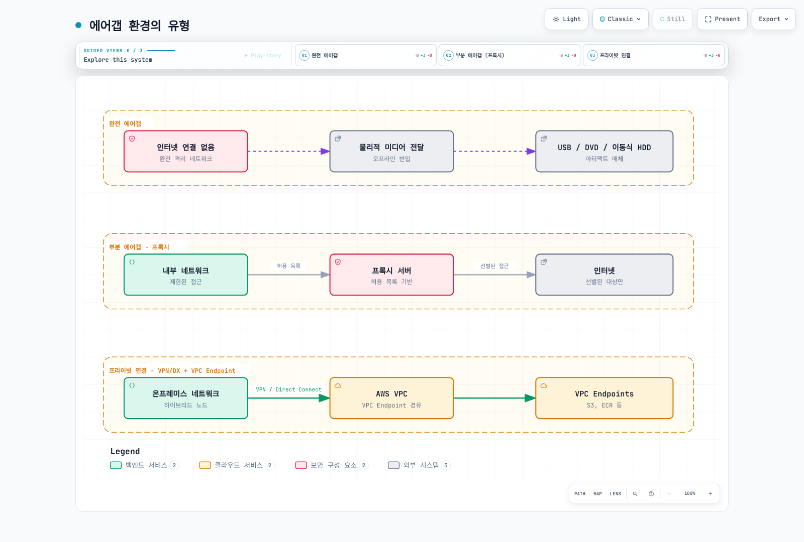
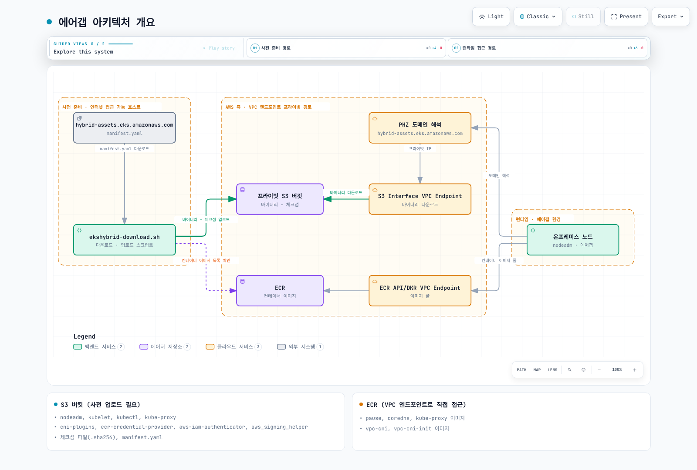

# 인터넷 제한 환경 구성 (S3, 프라이빗 엔드포인트, 프록시)

< [이전: 네트워크 구성](./02-network-configuration.md) | [목차](./README.md) | [다음: 노드 부트스트랩](./04-node-bootstrap.md) >

> **지원 버전**: EKS Hybrid Nodes; nodeadm v1.0.20 소스 확인. Kubernetes·OS·런타임·애드온 조합은 대상 클러스터에 맞게 선택합니다.
> **마지막 업데이트**: 2026년 9월 12일

이 문서는 퍼블릭 인터넷 접근을 제한한 Hybrid Nodes의 설치 준비를 다룹니다. **Hybrid Nodes에는 AWS에서 실행되는 EKS 컨트롤 플레인과 자격 증명에 사용하는 AWS 서비스 연결이 계속 필요합니다.** 소프트웨어를 물리적 매체로 전달하더라도 Hybrid Nodes가 완전히 단절된 Kubernetes 배포판으로 바뀌지는 않습니다.

예제는 준비·검토 절차이며 운영 배포를 검증한 레시피가 아닙니다. 이번 감사에서는 소스, 구성과 로컬 실패 사례를 확인했으며 OS 이미지 빌드, 아티팩트 게시, 노드 등록, 실제 프라이빗 네트워크 검증은 수행하지 않았습니다. 감사 환경에서 퍼블릭 아티팩트 manifest 요청은 TLS 호스트명 검증에 실패했습니다. 인증서 검사를 우회하지 않았으며, 실패한 요청을 근거로 최신 아티팩트 패치나 다이제스트를 추정하지 않습니다.

## 연결과 격리의 경계

| 방식 | 제공하는 기능 | Hybrid Nodes 고려 사항 |
|---|---|---|
| 물리적으로 단절된 네트워크 | AWS와 실시간 연결 없음 | 필수 EKS 컨트롤 플레인·자격 증명 서비스 연결을 제공할 수 없음 |
| 통제된 외부 통신 프록시 | 승인한 외부 HTTPS 목적지와 접근 기록 | 설치 프로그램, 패키지 관리자, 호스트 데몬과 해당 Pod를 각각 구성 |
| VPN/Direct Connect와 프라이빗 엔드포인트 | 클러스터와 지원 AWS API로 향하는 프라이빗 경로 | 양방향 라우팅, DNS, 보안 그룹, 권한 필요; 모든 퍼블릭 다운로드 호스트를 포함하지 않음 |
| 오프라인 소프트웨어 전달 | 검토한 아티팩트를 통제된 경로로 반입 | AWS 프라이빗 연결과 함께 사용 가능하며 그 연결을 대체하지 않음 |

네트워크 제한은 노출을 줄일 수 있지만 규정 준수, 데이터 유출의 완전 차단, 모든 공급망 공격 방지를 보장하지 않습니다. 인증서 신뢰, 승인된 게시자, 서명, 패치, 운영자 접근과 애플리케이션 데이터 흐름은 별도 통제 대상입니다. 프라이빗 연결도 AWS 서비스와 온프레미스 네트워크에 의존합니다.



[🔍 인터랙티브 다이어그램 보기](https://www.atomai.click/kubernetes-docs/archmaps/ko-eks-hybrid-nodes-03-airgap-setup-0.html)

> **다이어그램 설명 보완:** 물리적 격리 방식은 비교 대상이며 Hybrid Nodes의 지원 운영 방식이 아닙니다.

## 아키텍처와 아티팩트별 책임



[🔍 인터랙티브 다이어그램 보기](https://www.atomai.click/kubernetes-docs/archmaps/ko-eks-hybrid-nodes-03-airgap-setup-1.html)

> **다이어그램 정정:** `hybrid-assets.eks.amazonaws.com → PHZ → S3`만으로 투명 미러가 동작하지 않습니다. 아래 설치 경로를 사용합니다. DNS 변경은 원래 호스트명의 TLS 인증서, S3 객체 라우팅이나 요청 권한을 제공하지 않습니다.

| 아티팩트 | 준비와 전달 |
|---|---|
| Hybrid `nodeadm` | `aws/eks-hybrid` 릴리스를 승인하고 출처·체크섬을 확인한 뒤 root로 실행. EC2용 `amazon-eks-ami` nodeadm과 다름 |
| kubelet, kubectl, CNI 플러그인, ECR credential provider, IAM authenticator | 승인한 manifest에서 정확한 릴리스·빌드·OS·아키텍처 선택 |
| IAM Roles Anywhere signing helper | 별도 릴리스를 선택·검증. 배열의 첫 항목을 임의로 선택하지 않음 |
| SSM 설치 프로그램·에이전트 | 별도 리전별 다운로드, 서명과 등록 경로 사용. EKS 아티팩트 manifest만으로 모두 재지정되지 않음 |
| containerd, runc, iptables와 OS 의존성 | 전이 의존성과 서명된 저장소 메타데이터를 포함한 승인 OS·런타임 조합 |
| CNI, CoreDNS, kube-proxy, 샌드박스와 워크로드 이미지 | 실제 manifest, init container, 이미지 다이제스트와 플랫폼 목록 확인. 바이너리 manifest가 이미지 태그를 제공하지 않음 |

Amazon VPC CNI(`aws-node` / `vpc-cni-init`)는 Hybrid Nodes용 CNI가 아닙니다. [네트워크 구성](./02-network-configuration.md)의 지원 Hybrid CNI 절차를 따릅니다. 선택한 CNI 데이터 경로가 kube-proxy를 사용할 때만 이를 포함합니다. CNI 플러그인 바이너리 묶음을 설치하는 것과 CNI 컨트롤러 배포는 다릅니다.

## 설치 경로 선택

### 경로 A: 의존성을 미리 설치한 OS 이미지

통제된 빌더에서 승인한 Hybrid nodeadm을 설치하고, 대상 클러스터의 Kubernetes 버전과 자격 증명 공급자로 `nodeadm install`을 실행합니다. AWS는 이 이미지 빌드 사용 방식을 문서화합니다. 설치한 아티팩트와 nodeadm tracker를 이미지에 보존합니다.

```bash
# Controlled image builder only; installs software on this host.
set -euo pipefail
: "${KUBERNETES_VERSION:?Approved cluster-compatible version}"
: "${REGION:?}" "${CREDENTIAL_PROVIDER:?ssm or iam-ra}"
case "$CREDENTIAL_PROVIDER" in ssm|iam-ra) ;; *) exit 1 ;; esac
sudo nodeadm install "$KUBERNETES_VERSION" \
  --credential-provider "$CREDENTIAL_PROVIDER" --region "$REGION"
```

기본 런타임 소스는 OS 배포판이며 RHEL에서는 지원되지 않습니다. RHEL은 문서화된 Docker 패키지 소스를 선택하거나 호환 런타임을 미리 설치하고 `--containerd-source none`을 사용합니다. AL2023에서는 Docker 소스를 지원하지 않습니다. `none`은 containerd를 대신 설치하지 않습니다.

빌더를 초기화·등록한 뒤 그 신원을 복제하면 **안 됩니다**. 노드별 SSM 활성화 또는 IAM Roles Anywhere 인증서·개인 키는 승인된 개별 전달 절차를 사용합니다. 활성화 코드, 개인 키, SSM 등록 상태, kubelet 인증서, 운영자 자격 증명을 재사용 이미지에 넣지 않습니다. Bottlerocket은 별도 준비·부트스트랩 방식을 사용하며 이 nodeadm 절차를 사용하지 않습니다.

SSM 신규 설치·업그레이드는 오래된 SSM 서명 키 문제 때문에 nodeadm **1.0.19 이상**이 필요합니다. 이 문서는 무제한으로 바뀌는 `latest`가 아닌 **v1.0.20**을 확인했습니다.

### 경로 B: 사용자 지정 아티팩트 manifest

릴리스된 **v1.0.20 소스**는 다음 옵션을 지원합니다. 사용자 가이드의 옵션 표에는 이들 중 일부가 나열되어 있지 않습니다.

| 명령·설정 | 확인한 릴리스의 실제 동작 |
|---|---|
| `install --manifest-override file:///path/manifest.json` | 로컬 manifest를 읽음. YAML 디코더는 JSON도 수용 |
| `install --manifest-override https://mirror.example.com/manifest.json` | 일반 HTTP 클라이언트로 manifest 다운로드 |
| `install --private-mode` | `--manifest-override` 필수. OS 패키지 설치를 건너뛰지만 자격 증명·EKS 아티팩트 설치는 수행 |
| `init --manifest-override ... --private-mode` | manifest 인자를 요구하고 그 파일에서 리전 메타데이터를 읽음. AWS 인증과 EKS 연결 요구 사항은 유지 |
| 개별 아티팩트 `uri` / `checksum_uri` | S3 SigV4 서명 없는 HTTP(S) 요청으로 가져옴. `file://` **manifest** 지원이 `file://` **아티팩트** 지원을 뜻하지 않음 |
| `gzip_uri` | 있으면 `uri`보다 우선 사용하며 압축 해제 후 체크섬 검증 |

이 옵션을 사용하기 전에 배포할 정확한 바이너리의 `install --help`와 `init --help`를 확인합니다. Private mode는 완전한 오프라인 패키지 설치 프로그램이 아닙니다. systemd unit을 포함한 containerd, runc, iptables, CA 인증서와 필수 OS 의존성을 미리 설치합니다.

`--credential-provider ssm`을 사용하면 v1.0.20은 리전별 `ssm-setup-cli`와 서명 URL을 별도로 구성합니다. manifest의 `ssm_releases`는 이 설치 경로를 재지정하지 않습니다. 해당 S3 객체와 이후 에이전트 설치·등록 의존성에 대한 접근을 준비하거나 검증한 사전 설치 이미지 방식을 사용합니다.

### Manifest 검토와 단일 조합 선택

원본 manifest에는 `supported_eks_releases`, `iam_roles_anywhere_releases`, `region_config`가 있습니다. Kubernetes 항목에는 `major_minor_version`, `latest_patch_version`, `patch_releases[].version`, **`patch_version`**, **`release_date`**와 아티팩트별 URL이 포함됩니다. 같은 패치에 여러 빌드가 있을 수 있습니다. 이전 `1.33.3` 예제는 역사적 스키마 설명이며 현재 승인된 패치라는 증거가 아닙니다.

받은 원본 manifest, 수집 시점·해시와 승인 기록을 보존하고 HTTPS 출처를 확인합니다. 다음 로컬 선택기는 정확한 Kubernetes 패치, 빌드 날짜, signing helper 릴리스, 아키텍처를 요구합니다. 모호한 선택, 누락 아티팩트, 중복 YAML 키와 알 수 없는 리전을 거부합니다. ECR 계정을 추정하지 않고 실제 리전 메타데이터를 유지합니다.

준비 호스트에 `select-mirror.py`로 저장합니다. Python 3과 PyYAML이 필요합니다.

```python
#!/usr/bin/env python3
"""Build a local review plan, not an installer. Requires PyYAML."""
import copy
import datetime
import json
import re
import sys
from pathlib import Path
from urllib.parse import urlsplit

import yaml


class UniqueLoader(yaml.SafeLoader):
    pass


def mapping(loader, node, deep=False):
    result = {}
    for key_node, value_node in node.value:
        key = loader.construct_object(key_node, deep=deep)
        if key in result:
            raise ValueError("duplicate YAML key")
        result[key] = loader.construct_object(value_node, deep=deep)
    return result


UniqueLoader.add_constructor(
    yaml.resolver.BaseResolver.DEFAULT_MAPPING_TAG, mapping
)


def https_url(value):
    if not isinstance(value, str) or any(c.isspace() for c in value):
        raise ValueError("URL must be a nonempty HTTPS URL")
    parsed = urlsplit(value)
    if (parsed.scheme != "https" or not parsed.hostname or parsed.username
            or parsed.password or parsed.query or parsed.fragment):
        raise ValueError("HTTPS URL must not contain credentials, query or fragment")
    return value


def select(manifest, version, build_date, iam_version, arch, region, mirror):
    if not re.fullmatch(r"1\.\d+\.\d+", version):
        raise ValueError("an exact approved Kubernetes patch is required")
    datetime.date.fromisoformat(build_date)
    if arch not in ("amd64", "arm64"):
        raise ValueError("unsupported architecture")
    mirror = https_url(mirror).rstrip("/")
    region_info = manifest["region_config"][region]  # No account fallback.
    if (region_info.get("partition") != "aws"
            or region_info.get("dns_suffix") != "amazonaws.com"
            or not region_info.get("cred_providers", {}).get("iam-ra")
            or not re.fullmatch(r"\d{12}", str(region_info.get("ecr_account_id", "")))):
        raise ValueError("review a supported commercial Region with IAM Roles Anywhere")
    minor, patch = version.rsplit(".", 1)
    releases = [
        release
        for family in manifest["supported_eks_releases"]
        if family["major_minor_version"] == minor
        for release in family["patch_releases"]
        if release["version"] == version and release["patch_version"] == patch
        and release["release_date"] == build_date
    ]
    iam = [
        release for release in manifest["iam_roles_anywhere_releases"]
        if release["version"] == iam_version
    ]
    if len(releases) != 1 or len(iam) != 1:
        raise ValueError("release selection must be unique")
    eks_release, iam_release = copy.deepcopy(releases[0]), copy.deepcopy(iam[0])
    plan = []
    for release, names in [
        (eks_release, ["kubelet", "kubectl", "cni-plugins",
                       "ecr-credential-provider", "aws-iam-authenticator"]),
        (iam_release, ["aws_signing_helper"]),
    ]:
        chosen = []
        for name in names:
            matches = [a for a in release["artifacts"]
                       if a["name"] == name and a["arch"] == arch and a["os"] == "linux"]
            if len(matches) != 1:
                raise ValueError("missing or duplicate artifact: " + name)
            artifact = matches[0]
            item_id = "a%02d" % len(plan)
            plan.append({"id": item_id, "name": name,
                         "uri": https_url(artifact["uri"]),
                         "checksum_uri": https_url(artifact["checksum_uri"])})
            # Use the original, uncompressed URI; its checksum is not a gzip-file hash.
            artifact.pop("gzip_uri", None)
            artifact["uri"] = mirror + "/" + item_id + "/data"
            artifact["checksum_uri"] = mirror + "/" + item_id + "/data.sha256"
            chosen.append(artifact)
        release["artifacts"] = chosen
    selected = {
        "supported_eks_releases": [{
            "major_minor_version": minor, "latest_patch_version": patch,
            "patch_releases": [eks_release],
        }],
        "iam_roles_anywhere_releases": [iam_release],
        "region_config": {region: copy.deepcopy(region_info)},
    }
    return selected, {"artifacts": plan}


def main():
    if len(sys.argv) != 9:
        raise ValueError(
            "usage: select-mirror.py UPSTREAM VERSION BUILD_DATE IAM_VERSION "
            "ARCH REGION HTTPS_MIRROR_PREFIX NEW_OUTPUT_DIR"
        )
    source, version, date, iam, arch, region, mirror, output = sys.argv[1:]
    manifest = yaml.load(Path(source).read_text(), Loader=UniqueLoader)
    selected, plan = select(manifest, version, date, iam, arch, region, mirror)
    out = Path(output)
    out.mkdir(mode=0o700, parents=False, exist_ok=False)
    (out / "upstream.yaml").write_bytes(Path(source).read_bytes())
    (out / "manifest.json").write_text(json.dumps(selected, indent=2) + "\n")
    (out / "plan.json").write_text(json.dumps(plan, indent=2) + "\n")


if __name__ == "__main__":
    main()
```

출력 디렉터리는 새 경로여야 합니다. HTTPS 미러 접두사는 게시에 사용하는 동일한 불변 객체 접두사로 연결되어야 합니다. 이 스크립트는 계획만 만들며 다운로드나 미러 인증은 수행하지 않습니다.

```bash
set -euo pipefail
: "${APPROVED_PATCH:?}" "${APPROVED_BUILD_DATE:?}" "${APPROVED_IAM_VERSION:?}"
: "${ARCH:?amd64 or arm64}" "${REGION:?}"
: "${MIRROR_PREFIX:?HTTPS URL for this reviewed candidate}"
: "${NEW_PLAN_DIR:?A new local directory}"
python3 select-mirror.py upstream.yaml "$APPROVED_PATCH" "$APPROVED_BUILD_DATE" \
  "$APPROVED_IAM_VERSION" "$ARCH" "$REGION" "$MIRROR_PREFIX" "$NEW_PLAN_DIR"
```

다운로드 전에 모든 소스 호스트와 선택한 6개 아티팩트를 검토합니다. 이는 **IAM Roles Anywhere 아티팩트 예제**이며 SSM 설치 프로그램 미러가 아닙니다. nodeadm 자체, OS 패키지, 이미지, 서명 키와 인증서는 포함하지 않습니다.

`download-plan.sh`로 저장합니다.

```bash
#!/usr/bin/env bash
# Download into a new plan directory. No AWS writes or host installation.
set -euo pipefail
umask 077
cd -- "${1:?Use the directory produced by select-mirror.py}"
test ! -e checksums.sha256
test ! -e queue.tsv
jq -er '.artifacts[] | [.id, .uri, .checksum_uri] | @tsv' plan.json > queue.tsv
test "$(wc -l < queue.tsv)" -eq 6
while IFS=$'\t' read -r item_id uri checksum_uri; do
  [[ "$item_id" =~ ^a[0-9]{2}$ ]]
  mkdir -- "$item_id"  # Refuse a partial run or existing directory.
  curl --fail --show-error --silent --location \
    --proto '=https' --proto-redir '=https' --connect-timeout 10 \
    --max-time 300 --max-filesize 268435456 \
    "$uri" -o "$item_id/data"
  curl --fail --show-error --silent --location \
    --proto '=https' --proto-redir '=https' --connect-timeout 10 \
    --max-time 30 --max-filesize 4096 \
    "$checksum_uri" -o "$item_id/upstream.sha256"
  expected=$(python3 - "$item_id/upstream.sha256" <<'CHECKSUM_PY'
import pathlib, re, sys
text = pathlib.Path(sys.argv[1]).read_text().strip()
match = re.fullmatch(r"([0-9a-fA-F]{64})(?:[ \t]+[^\r\n]+)?", text)
if not match:
    raise SystemExit("missing, malformed or multi-record upstream checksum")
print(match.group(1).lower())
CHECKSUM_PY
)
  actual=$(sha256sum "$item_id/data")
  [[ "${actual%% *}" == "$expected" ]]
  # nodeadm v1.0.20 requires GNU format: digest, space, filename.
  printf '%s  data\n' "$expected" > "$item_id/data.sha256"
done < queue.tsv
sha256sum manifest.json plan.json upstream.yaml a*/data a*/data.sha256 \
  > checksums.sha256
sha256sum --strict --check checksums.sha256
printf '%s\n' 'Six artifacts verified locally; publishing and node installation remain separate.'
```

아티팩트당 256 MiB 제한은 의도된 제한입니다. 승인한 파일이 더 크면 검토 후 조정합니다. 다운로드 실패, 잘못된 체크섬 또는 해시 불일치는 스크립트를 중단합니다. 부분 디렉터리는 조사용으로 보존하고 원인 해결 후 새 후보를 만듭니다. 공유 `/tmp` 디렉터리를 삭제하거나 누락 체크섬을 건너뛰지 않습니다.

이 해시는 선택한 바이트와 가져온 체크섬의 일치를 확인합니다. 독립적인 서명이나 침해된 게시자가 신뢰할 수 있다는 증거는 아닙니다. 검토한 manifest·체크섬 기록을 보호하고 게시자의 검증 수단을 사용할 수 있으면 함께 적용합니다.

## 프라이빗 S3 게시와 권한

Block Public Access, 승인한 암호화, 버전 관리·보존 정책과 분리된 게시자·읽기 권한을 갖춘 **사전 생성된 소유 버킷**을 사용합니다. 아래 예제는 버킷을 만들거나 정책을 교체하지 않습니다. AccessDenied, 자격 증명 만료, 시간 초과는 실패이며 버킷·객체가 없다는 증거가 아닙니다.

기존 버킷에 적용할 수 있는 *읽기 정책 statement* 예제:

```json
{
  "Sid": "ReadApprovedHybridArtifacts",
  "Effect": "Allow",
  "Principal": {"AWS": "arn:aws:iam::111122223333:role/HybridArtifactReader"},
  "Action": "s3:GetObject",
  "Resource": "arn:aws:s3:::example-hybrid-artifacts/hybrid-candidates/*",
  "Condition": {"StringEquals": {"aws:SourceVpce": "vpce-0123456789abcdef0"}}
}
```

계정, 역할, 버킷, 접두사와 엔드포인트를 검토한 값으로 바꿉니다. 이 statement는 한 접근 경로를 허용하며 다른 기존 허용을 취소하지 않습니다. 한 엔드포인트 이외의 모든 요청에 버킷 전체 `Deny s3:*`를 적용하면 연결된 게시자와 관리자 복구 경로도 차단할 수 있습니다. 이런 경계 정책을 적용하기 전에 각 경로를 설계합니다.

지정한 Principal 정책은 서명된 요청을 요구합니다. **노드에 IAM 역할이 있다고 nodeadm의 일반 HTTPS 다운로더가 IAM 인증 S3 클라이언트로 바뀌지 않습니다.** 다음 방식 중 선택하여 검증합니다.

1. 인증된 준비 에이전트·CLI로 승인한 파일을 가져오고, 자체 호스트명 인증서와 적절한 네트워크 접근 통제가 있는 조직 내부 HTTPS 아티팩트 서비스를 통해 제공합니다.
2. 실행 시 바이너리 미러에 의존하지 않는 사전 설치 이미지 방식을 사용합니다.

프라이빗 S3 객체 URL의 `403`은 DNS 오버라이드로 해결되지 않습니다. Bearer presigned URL이나 자격 증명을 manifest, 프로세스 인자, 공개 로그에 넣지 않습니다. 조직이 비밀이 아닌 바이너리에 한해 프라이빗 네트워크로 제한한 비인증 읽기를 선택한다면 별도 검토할 정책이며 위의 Principal 지정 정책과 다릅니다.

`publish-plan.sh`로 저장합니다. 버킷 소유자가 후보와 권한을 승인한 뒤에만 실행하며 **S3 객체를 씁니다**.

```bash
#!/usr/bin/env bash
# Owner-approved publication only; creates billable S3 objects, never a bucket.
set -euo pipefail
umask 077
cd -- "${1:?Use a verified plan directory}"
: "${REGION:?}" "${BUCKET:?}" "${EXPECTED_ACCOUNT_ID:?}" "${PREFIX:?}"
[[ "$EXPECTED_ACCOUNT_ID" =~ ^[0-9]{12}$ ]]
[[ "$PREFIX" =~ ^hybrid-candidates/[A-Za-z0-9-]+$ ]]
sha256sum --strict --check checksums.sha256
aws s3api head-bucket --region "$REGION" --bucket "$BUCKET" \
  --expected-bucket-owner "$EXPECTED_ACCOUNT_ID"
# Manifest is last. Any failed write stops; retain the partial prefix for review.
for file in a{00..05}/data a{00..05}/data.sha256 checksums.sha256 \
            upstream.yaml plan.json manifest.json; do
  test -f "$file"
  aws s3api put-object --region "$REGION" --bucket "$BUCKET" \
    --expected-bucket-owner "$EXPECTED_ACCOUNT_ID" \
    --key "$PREFIX/$file" --body "$file" --if-none-match '*' \
    --server-side-encryption AES256 --checksum-algorithm SHA256 \
    --output json > "${file//\//_}.upload.json"
done
printf '%s\n' 'Candidate uploaded. Verify readback, mirror URL mapping and hashes before promotion.'
```

SSE-KMS를 요구하는 버킷에서는 AES256 예제 대신 승인한 키와 KMS 권한을 사용합니다. 조건부 쓰기는 기존 키 덮어쓰기를 막지만 다중 객체 업로드를 원자적으로 만들지는 않습니다. Manifest는 마지막에 올리며, 실패한 후보는 재읽기와 실제 HTTPS 미러 매핑 확인 전까지 배포 대상으로 승격하지 않습니다. 반환된 객체 VersionId·체크섬과 보존 정책을 기록합니다. S3 ETag는 모든 경우에 SHA-256 다이제스트인 값이 아닙니다.

## DNS와 프라이빗 엔드포인트 요구 사항

`hybrid-assets.eks.amazonaws.com`은 AWS CloudFront 다운로드 호스트입니다. 이 이름의 PHZ를 만들고 S3에 별칭으로 연결해도 다음이 보존되지 않습니다.

- TLS 인증서·SNI 호스트명
- HTTP Host 헤더와 S3 버킷·객체 키 매핑
- 원래 경로, 특히 업로더가 모든 파일을 basename으로 평탄화한 경우
- 요청 권한

TLS 검사를 꺼서 해결하지 않습니다. 승인한 원본에 통제된 프록시로 접근하거나, 사전 설치 이미지를 사용하거나, 실제 미러 URL을 지정한 manifest override를 사용합니다.

S3 **Interface** 엔드포인트는 VPN/Direct Connect로 온프레미스 클라이언트에 서비스를 제공할 수 있으며 S3 프라이빗 DNS도 지원됩니다. **Inbound Resolver에만 프라이빗 DNS 적용** 옵션은 VPC 측 S3 gateway 엔드포인트를 유지해야 합니다. 또는 VPC와 온프레미스 요청을 모두 interface 엔드포인트로 보낼 수 있습니다. Gateway 엔드포인트만으로는 온프레미스에서 직접 접근할 수 없습니다.

리전의 첫 S3 엔드포인트가 아니라 검토한 VPC·엔드포인트 ID를 선택합니다. [네트워크 구성](./02-network-configuration.md)의 DNS·라우팅 절차를 사용합니다. EKS 관리 API 엔드포인트는 Kubernetes API 엔드포인트가 아니며, 프라이빗 ECR 엔드포인트는 public ECR이나 CloudFront 일반 접근을 제공하지 않습니다.

## 준비한 노드의 설치와 초기화

사용자 지정 IAM Roles Anywhere 경로에서는 런타임, OS 의존성, 승인한 nodeadm과 미러 서비스가 이미 준비되어 있어야 합니다. 다음 명령은 대상 노드에 소프트웨어를 설치합니다.

```bash
set -euo pipefail
: "${APPROVED_PATCH:?}" "${REGION:?}" "${LOCAL_MANIFEST:?Absolute local path}"
[[ "$LOCAL_MANIFEST" = /* ]]
test -s "$LOCAL_MANIFEST"
sudo nodeadm install "$APPROVED_PATCH" --region "$REGION" \
  --credential-provider iam-ra --containerd-source none \
  --manifest-override "file://$LOCAL_MANIFEST" --private-mode
```

[사전 요구 사항](./01-prerequisites.md)과 [노드 부트스트랩](./04-node-bootstrap.md)에 따라 노드별 설정을 준비합니다. 예를 들어 SSM 설정의 **형태**는 다음과 같습니다.

```yaml
apiVersion: node.eks.aws/v1alpha1
kind: NodeConfig
spec:
  cluster:
    name: my-hybrid-cluster
    region: ap-northeast-2
  hybrid:
    ssm:
      activationCode: REPLACE_WITH_NODE_ACTIVATION_CODE
      activationId: REPLACE_WITH_NODE_ACTIVATION_ID
```

노드에 설치한 공급자와 동일한 공급자를 사용합니다. 이 SSM 형태는 위 IAM Roles Anywhere 명령용 설정이 아닙니다. 값을 채운 파일은 root 소유, `0600`으로 보호하고 커밋하지 않으며 비밀을 셸 기록에 넣지 않습니다. API 엔드포인트·CA 필드를 수동으로 채워도 문서화된 클러스터 조회·인증 경로가 없어지지 않습니다.

```bash
# Local config validation; this is not a join or an end-to-end network test.
sudo nodeadm config check --config-source file:///etc/eks/nodeconfig.yaml
```

네트워크, 신원과 CNI 요구 사항을 확인한 뒤 소유자가 `nodeadm init`을 실행합니다. 프라이빗 manifest 경로에서는 승인한 manifest를 다시 전달합니다.

```bash
# Mutates the target node and registers it with EKS.
sudo nodeadm init --config-source file:///etc/eks/nodeconfig.yaml \
  --manifest-override file:///etc/eks/manifest.json --private-mode
```

확인한 버전에는 `nodeadm init --dry-run`이 없습니다. 준비가 불완전한 상태를 통과시키려고 초기화 검증을 건너뛰지 않습니다.

## 컨테이너 이미지 전달

프라이빗 ECR 풀에는 ECR API·DKR 경로, S3 레이어 다운로드 경로, DNS와 이미지 풀 권한이 필요합니다. `describe-repositories` 성공만으로 이미지 레이어 다운로드를 증명할 수 없습니다. Pull-through cache를 미리 채우고 시험합니다. ECR 엔드포인트 문서는 처음 캐시되지 않은 이미지를 가져올 때 추가 인터넷 요구 사항을 설명합니다.

배포한 애드온 manifest의 실제 레지스트리 계정·리전·이미지 참조를 사용합니다. Kubernetes 패치에 `-eksbuild.1`을 붙여 이미지 태그를 만들거나 다른 클러스터의 오래된 pause·CoreDNS 버전을 복사하지 않습니다.

nodeadm은 ECR helper를 `/etc/eks/image-credential-provider/ecr-credential-provider`에 설치하고 설정을 `/etc/eks/image-credential-provider/config.json`에 초기화합니다. 다른 디렉터리에 사용되지 않는 파일을 쓰기보다 생성된 kubelet 구성을 확인합니다. `ctr images pull`은 별도 클라이언트이며 kubelet의 exec credential provider를 자동 사용하지 않습니다.

### 오프라인 이미지 전달

승인한 다이제스트와 필요한 플랫폼을 선택합니다. 다중 플랫폼 아카이브는 소스·대상 형식이 지원하는 경우 인덱스와 다이제스트를 보존합니다.

```bash
# Preparation host: downloads images; requires reviewed registry authentication.
set -euo pipefail
: "${SOURCE_DIGEST_REF:?registry/repository@sha256:approved-digest}"
: "${NEW_IMAGE_DIR:?New directory}"
[[ "$SOURCE_DIGEST_REF" =~ @sha256:[0-9a-f]{64}$ ]]
mkdir -m 700 -- "$NEW_IMAGE_DIR"
skopeo copy --all --preserve-digests "docker://$SOURCE_DIGEST_REF" \
  "oci-archive:$NEW_IMAGE_DIR/image.tar:approved"
(cd "$NEW_IMAGE_DIR" && sha256sum image.tar > image.tar.sha256)
```

아카이브와 독립적으로 보호한 승인·해시 기록을 전달합니다. 가져오기나 푸시 전에 해당 디렉터리에서 `sha256sum --strict --check image.tar.sha256`을 실행하고 실패하면 중단합니다. 내부 레지스트리로 보내는 경우:

```bash
# Internal staging host: writes an image to the reviewed destination registry.
set -euo pipefail
: "${DEST_DIGEST_REF:?approved-registry/repository@sha256:approved-digest}"
[[ "$DEST_DIGEST_REF" =~ @sha256:[0-9a-f]{64}$ ]]
sha256sum --strict --check image.tar.sha256
skopeo copy --all --preserve-digests oci-archive:image.tar:approved \
  "docker://$DEST_DIGEST_REF"
```

레지스트리 TLS 검증을 끄지 않습니다. 압축·manifest 형식을 바꾸면 다이제스트를 보존하지 못할 수 있으므로 중단하고 결과 식별자를 검토합니다. 변경되지 않았다고 조용히 가정하지 않습니다.

containerd에 직접 미리 넣는 방식도 가능하지만 배포 런타임에서 검증해야 합니다. Kubernetes는 `k8s.io` 네임스페이스를 사용하며 가져온 이미지 참조가 Pod·샌드박스 참조와 일치하고 필요한 플랫폼 blob이 모두 있어야 합니다. 아카이브의 `approved` annotation이 Pod가 요청하는 레지스트리 이름으로 자동 변환되지는 않습니다. 이미지 가비지 컬렉션과 `imagePullPolicy` 때문에 이후 풀을 다시 시도할 수도 있습니다. Tar 가져오기 성공만으로 오프라인 Pod 시작을 증명하지 못합니다.

## 서명된 로컬 패키지 저장소

OS 릴리스, 아키텍처, 전이 의존성과 메타데이터를 검토한 조합으로 미러링합니다. 공급자 서명을 보존하거나 별도로 신뢰한 키로 조직 관리 저장소에 서명합니다.

**준비와 서명이 완료된** 로컬 flat 저장소용 Ubuntu 클라이언트 설정 예제:

```text
deb [signed-by=/etc/apt/keyrings/hybrid-mirror.gpg] file:///srv/apt-repo ./
```

저장소에는 `Packages.gz`만 아니라 유효한 `Release`와 `InRelease` 또는 `Release.gpg`가 필요합니다. 키 지문은 독립적인 신뢰 경로로 배포·검증합니다. 저장소 인증을 생략하려고 `trusted=yes`를 사용하지 않습니다.

DNF/YUM 저장소 설정 예제:

```ini
[hybrid-local]
name=Reviewed hybrid packages
baseurl=file:///srv/yum-repo
enabled=1
gpgcheck=1
repo_gpgcheck=1
gpgkey=file:///etc/pki/rpm-gpg/RPM-GPG-KEY-hybrid-mirror
```

유효한 패키지 서명과 서명된 저장소 메타데이터가 필요합니다. 메타데이터와 패키지 서명 키가 다를 수 있으므로 승인한 키 집합을 구성합니다. 검증 실패 시 `gpgcheck=0`으로 바꾸지 않습니다. 패키지 설치·서비스 재시작은 이미지 빌드나 drain한 유지보수 작업에서 수행하며 임의의 운영 노드 검증 스크립트에 넣지 않습니다.

## 프록시 구성

클라이언트별 목적지 표를 먼저 작성합니다. Loopback, 실제 프라이빗 API·레지스트리 이름과 프록시를 우회해야 하는 노드·Pod·Service 대역을 포함합니다. CIDR·접미사 매칭은 클라이언트마다 다릅니다. **`.eks.amazonaws.com`**을 무조건 `NO_PROXY`에 넣지 않습니다. 퍼블릭 다운로드 호스트 `hybrid-assets.eks.amazonaws.com`도 이 접미사와 일치합니다.

검토한 비밀이 아닌 프록시 설정의 셸 예제:

```bash
export HTTP_PROXY=http://proxy.internal.example.com:3128
export HTTPS_PROXY=http://proxy.internal.example.com:3128
export NO_PROXY=localhost,127.0.0.1,::1,.svc,.cluster.local,registry.internal.example.com
export http_proxy="$HTTP_PROXY" https_proxy="$HTTPS_PROXY" no_proxy="$NO_PROXY"
```

실제 프라이빗 API 호스트명·IP와 다른 우회 목적지를 추가합니다. 이 예제는 사이트 전체 완성 설정이 아닙니다. 로그인 셸 환경은 기존 systemd 서비스를 설정하지 않습니다. `/etc/environment`를 source하거나 반복해서 내용을 덧붙이지 않습니다.

`containerd.service`와 `kubelet.service`에는 `/etc/systemd/system/UNIT.service.d/http-proxy.conf`의 소유자 관리 drop-in을 사용합니다.

```ini
[Service]
Environment="HTTP_PROXY=http://proxy.internal.example.com:3128"
Environment="HTTPS_PROXY=http://proxy.internal.example.com:3128"
Environment="NO_PROXY=localhost,127.0.0.1,::1,.svc,.cluster.local,registry.internal.example.com"
```

기존 drop-in을 확인하고 승인한 빌드·유지보수 단계에서만 해당 unit을 재시작합니다. containerd TOML의 `[proxy.http]`는 HTTP 프록시 설정이 아닙니다.

| 구성 요소 | 설정과 조건 |
|---|---|
| nodeadm 프로세스 | `sudo`에 검토한 프록시 환경만 전달. `sudo -E`로 운영자 환경 전체를 전달하지 않음 |
| containerd / kubelet | 각각의 systemd 환경. 생성된 kubelet 구성과 호스트 환경은 다른 계층 |
| 문서화된 snap 설치를 사용한 Ubuntu SSM | `snap.amazon-ssm-agent.amazon-ssm-agent.service.d/http-proxy.conf` |
| AL2023/RHEL SSM | `amazon-ssm-agent.service.d/http-proxy.conf`; 실제 설치 unit 확인 |
| IAM Roles Anywhere credential process | nodeadm이 `--with-proxy`를 생성할 때 프록시 환경 감지. 호출하는 데몬에도 올바른 환경 필요 |
| `spec.hybrid.enableCredentialsFile: true`인 IAM Roles Anywhere | 이 모드에는 `aws_signing_helper_update.service`가 **실제로 존재**. 초기화 전에 drop-in 준비. 모든 IAM Roles Anywhere 설치에 있다고 가정하지 않음 |
| apt | `/etc/apt/apt.conf.d/`의 소유자 관리 파일에 `Acquire::http::Proxy`, `Acquire::https::Proxy` |
| snap | 실제로 snap을 사용하는 경우 `snap set system proxy.http=... proxy.https=...` |
| dnf / yum | 기존 구성의 `proxy` 설정을 검토·수정. 다른 설정 교체나 중복 추가 금지 |
| kube-proxy / 다른 Pod | 해당 트래픽에 프록시가 필요한 경우 Pod 환경 설정 |

문서화된 프록시 토폴로지에서는 클러스터 생성 후 Hybrid Node를 조인하기 전에 kube-proxy를 구성합니다. 기존 `NODE_NAME` 환경과 모든 명령 인자를 유지합니다. 다음은 독립 DaemonSet이 아닌 **strategic merge patch 조각**입니다.

```yaml
spec:
  template:
    spec:
      containers:
        - name: kube-proxy
          env:
            - name: HTTP_PROXY
              value: http://proxy.internal.example.com:3128
            - name: HTTPS_PROXY
              value: http://proxy.internal.example.com:3128
            - name: NO_PROXY
              value: localhost,127.0.0.1,::1,.svc,.cluster.local
```

우회 목적지를 검토·추가하고 애드온 소유자를 통해 적용합니다. 내장 DaemonSet의 strategic merge는 컨테이너·환경 변수 이름을 사용합니다. JSON Patch의 `add /containers/0/env`는 기존 환경 전체를 교체할 수 있고 컨테이너 순서를 가정합니다. 선택한 CNI가 kube-proxy를 대체한다면 이 예제를 위해 kube-proxy를 배포하지 않습니다.

## 검증과 통제된 업데이트

| 검사 | 필요한 증거 | 충분하지 않은 검사 |
|---|---|---|
| 아티팩트 무결성 | 선택한 모든 파일·체크섬·승인 manifest·버전 조합 일치 | 누락 파일 건너뛰기, 검증 파일 0개 수용 |
| DNS/TLS | 의도한 경로의 정확한 목적지와 호스트명·CA 검증 | `10.*` 주소, 임의의 `172.*` 주소, `curl -k` |
| S3 | 정확한 버킷·키·버전의 권한 있는 재읽기, 예상 소유자와 해시 | 접두사 목록 조회, API 오류를 부재로 취급 |
| ECR | 워크로드 자격 증명 경로로 필요한 다이제스트·플랫폼·레이어 풀 | `describe-repositories`, 독립된 비인증 `ctr` 호출 |
| nodeadm 구성 | 보호되고 실제 값이 채워진 파일의 `nodeadm config check` 성공 | 설정 누락을 성공 처리, 존재하지 않는 `init --dry-run` |
| 노드 운영 | 자격 증명 갱신, Kubernetes API 신뢰·인증, CNI/DNS와 제한된 워크로드 시험 | 로컬 파서 성공 또는 `/healthz` 응답 한 번 |

AWS 읽기가 승인된 환경에서 문서화된 연결·신원 진단인 `nodeadm debug --config-source file:///etc/eks/nodeconfig.yaml`을 사용합니다. 서비스에 접속하고 민감한 진단 정보를 출력할 수 있으므로 비공개로 보관하고 공유 전에 정제합니다. 알 수 없거나 실패한 검사를 “운영 준비 완료”로 바꾸지 않습니다.

업데이트 자동화는 **후보 탐색**을 수행한 뒤 출처 검증, 호환성 검토, OS·이미지 검사, 로컬 검증, 대표 노드 canary와 승인을 거쳐 승격하도록 구성합니다. 새 불변 버전·빌드 접두사에 게시하고 이전 승인 조합을 보존하며 롤백 제약을 기록합니다. 운영 `latest` 키를 조용히 덮어쓰는 cron을 사용하지 않습니다. `nodeadm upgrade`는 워크로드 이동이 필요한 중단 작업입니다.

이전 퀴즈의 대역폭 추정치인 레이어 캐싱 **50–80%**, 압축 **30–50%**, 플랫폼 필터링 **50%**에는 확인 가능한 측정 출처가 없었습니다. 예측 절감률이 아닌 미검증 역사적 예시로만 보존합니다. 실제 레이어 재사용, 플랫폼과 압축 형식으로 전송량을 측정하며, 승인한 콘텐츠를 재압축하면서 다이제스트가 그대로라고 주장하지 않습니다.

## 공식 참고 자료

- [AWS Hybrid nodeadm 레퍼런스](https://docs.aws.amazon.com/eks/latest/userguide/hybrid-nodes-nodeadm.html)
- [Hybrid OS 준비](https://docs.aws.amazon.com/eks/latest/userguide/hybrid-nodes-os.html)
- [Hybrid 프록시 구성](https://docs.aws.amazon.com/eks/latest/userguide/hybrid-nodes-proxy.html)
- [nodeadm v1.0.20 install 옵션](https://github.com/aws/eks-hybrid/blob/v1.0.20/cmd/nodeadm/install/install.go), [init 옵션](https://github.com/aws/eks-hybrid/blob/v1.0.20/cmd/nodeadm/init/init.go)
- [아티팩트 선택·다운로드 구현](https://github.com/aws/eks-hybrid/blob/v1.0.20/internal/aws/source.go), [SSM 소스](https://github.com/aws/eks-hybrid/blob/v1.0.20/internal/ssm/source.go)
- [S3 interface 엔드포인트·프라이빗 DNS](https://docs.aws.amazon.com/AmazonS3/latest/userguide/privatelink-interface-endpoints.html)
- [ECR VPC 엔드포인트](https://docs.aws.amazon.com/AmazonECR/latest/userguide/vpc-endpoints.html)
- [Skopeo copy](https://github.com/containers/skopeo/blob/main/docs/skopeo-copy.1.md)
- [APT 저장소 인증](https://manpages.ubuntu.com/manpages/noble/man8/apt-secure.8.html)
- [DNF 저장소 서명 설정](https://github.com/rpm-software-management/dnf/blob/master/doc/conf_ref.rst)
- [S3 PutObject 조건·암호화·체크섬](https://docs.aws.amazon.com/AmazonS3/latest/API/API_PutObject.html)
- [Kubernetes 이미지 이름·다이제스트·풀 정책](https://kubernetes.io/docs/concepts/containers/images/)

< [이전: 네트워크 구성](./02-network-configuration.md) | [목차](./README.md) | [다음: 노드 부트스트랩](./04-node-bootstrap.md) >
