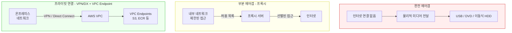
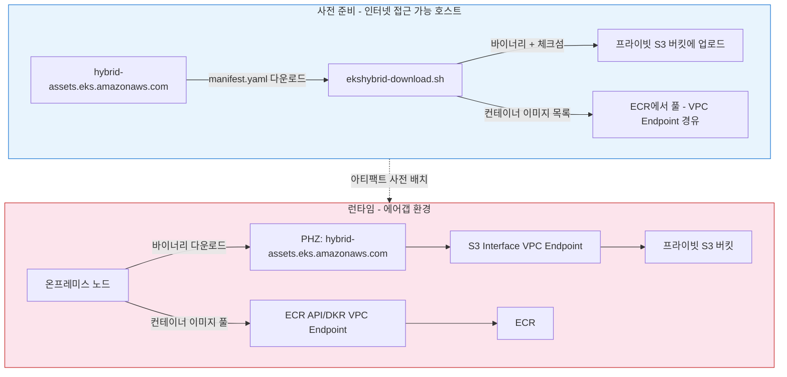

# 에어갭 환경 구성 (S3 + VPC 엔드포인트)

< [이전: 네트워크 구성](./02-network-configuration.md) | [목차](./README.md) | [다음: 노드 부트스트랩](./04-node-bootstrap.md) >

> **지원 버전**: EKS 1.31+, nodeadm 0.1+
> **마지막 업데이트**: 2026년 2월 23일

이 문서에서는 에어갭(Air-Gapped) 환경에서 EKS Hybrid Nodes를 구성하는 방법을 다룹니다. 바이너리 아티팩트는 프라이빗 S3 버킷과 VPC 엔드포인트를 통해, 컨테이너 이미지는 ECR VPC 엔드포인트를 통해 접근합니다.

## 에어갭 환경이란?

에어갭(Air-Gapped) 환경은 외부 인터넷과 완전히 격리된 네트워크 환경을 의미합니다. 이러한 환경은 보안이 중요한 산업에서 필수적으로 요구됩니다.

### 에어갭 환경이 필요한 이유

| 요구 사항 | 설명 |
|-----------|------|
| **보안 규정 준수** | 금융, 의료, 국방 등 민감한 데이터를 다루는 산업에서는 외부 네트워크와의 격리가 법적으로 요구됩니다 |
| **데이터 유출 방지** | 외부 통신 경로를 차단하여 데이터 유출 위험을 원천적으로 차단합니다 |
| **공급망 공격 방지** | 외부 레지스트리에서 악성 이미지가 유입되는 것을 방지합니다 |
| **네트워크 안정성** | 외부 서비스 장애가 내부 시스템에 영향을 미치지 않습니다 |

### 에어갭 환경의 유형



---

## 에어갭 아키텍처 개요

이 문서에서 구성하는 에어갭 아키텍처는 다음과 같습니다:



### 아티팩트 저장소 역할 분담

| 아티팩트 유형 | 저장소 | 접근 경로 |
|--------------|--------|----------|
| nodeadm, kubelet, kubectl, kube-proxy | S3 버킷 | S3 Interface VPC Endpoint |
| cni-plugins, ecr-credential-provider | S3 버킷 | S3 Interface VPC Endpoint |
| aws-iam-authenticator, aws_signing_helper | S3 버킷 | S3 Interface VPC Endpoint |
| 체크섬 파일 (.sha256) | S3 버킷 | S3 Interface VPC Endpoint |
| manifest.yaml | S3 버킷 | S3 Interface VPC Endpoint |
| pause, coredns, kube-proxy 이미지 | ECR | ECR API/DKR VPC Endpoint |
| vpc-cni, vpc-cni-init 이미지 | ECR | ECR API/DKR VPC Endpoint |

---

## manifest.yaml 기반 아티팩트 다운로드

### manifest.yaml 구조

`hybrid-assets.eks.amazonaws.com/manifest.yaml`에는 EKS Hybrid Node에 필요한 모든 바이너리의 URL과 체크섬이 버전/아키텍처별로 정의되어 있습니다.

```yaml
# manifest.yaml 구조 (발췌)
supported_eks_releases:
- latest_patch_version: "3"
  major_minor_version: "1.33"
  patch_releases:
  - version: "1.33.3"
    artifacts:
    - arch: amd64
      checksum_uri: https://hybrid-assets.eks.amazonaws.com/artifacts/1.33.0/.../kubelet.sha256
      name: kubelet
      os: linux
      uri: https://hybrid-assets.eks.amazonaws.com/artifacts/1.33.0/.../kubelet
    - arch: amd64
      checksum_uri: https://hybrid-assets.eks.amazonaws.com/artifacts/1.33.0/.../kubectl.sha256
      name: kubectl
      os: linux
      uri: https://hybrid-assets.eks.amazonaws.com/artifacts/1.33.0/.../kubectl
    # ... cni, cni-plugins, kube-proxy, ecr-credential-provider, aws-iam-authenticator
```

manifest.yaml에 포함된 주요 바이너리:

| 바이너리 | 용도 |
|---------|------|
| `kubelet` | 노드의 Kubernetes 에이전트 |
| `kubectl` | Kubernetes CLI |
| `kube-proxy` | 네트워크 프록시 |
| `cni` / `cni-plugins` | 컨테이너 네트워크 인터페이스 |
| `ecr-credential-provider` | ECR 인증 헬퍼 |
| `aws-iam-authenticator` | IAM 인증 |

### 다운로드 및 S3 업로드 스크립트 (ekshybrid-download.sh)

인터넷 접근 가능한 호스트에서 실행하여 manifest.yaml 기반으로 모든 바이너리를 다운로드하고 S3에 업로드합니다.

```bash
#!/bin/bash
# ekshybrid-download.sh - EKS Hybrid nodeadm 에어갭 설치 준비 스크립트
# 사용법: ./ekshybrid-download.sh <S3_BUCKET_NAME> [KUBERNETES_VERSION] [ARCHITECTURE]
# 예시:   ./ekshybrid-download.sh ekshybrid-my-bucket 1.33.3 amd64

set -e

# 기본값 설정
KUBERNETES_VERSION="${2:-1.33.3}"
ARCHITECTURE="${3:-amd64}"
REGION="ap-northeast-2"
MANIFEST_URL="https://hybrid-assets.eks.amazonaws.com/manifest.yaml"
WORK_DIR="/tmp/nodeadm-offline"
LOG_FILE="/tmp/nodeadm-offline-setup.log"

# 색상 정의
RED='\033[0;31m'
GREEN='\033[0;32m'
YELLOW='\033[1;33m'
BLUE='\033[0;34m'
NC='\033[0m'

log()  { echo -e "${GREEN}[$(date '+%Y-%m-%d %H:%M:%S')] $1${NC}" | tee -a "$LOG_FILE"; }
warn() { echo -e "${YELLOW}[$(date '+%Y-%m-%d %H:%M:%S')] WARNING: $1${NC}" | tee -a "$LOG_FILE"; }
error(){ echo -e "${RED}[$(date '+%Y-%m-%d %H:%M:%S')] ERROR: $1${NC}" | tee -a "$LOG_FILE"; exit 1; }
info() { echo -e "${BLUE}[$(date '+%Y-%m-%d %H:%M:%S')] INFO: $1${NC}" | tee -a "$LOG_FILE"; }

# 매개변수 검증
if [ $# -lt 1 ]; then
    echo "사용법: $0 <S3_BUCKET_NAME> [KUBERNETES_VERSION] [ARCHITECTURE]"
    echo ""
    echo "매개변수:"
    echo "  S3_BUCKET_NAME      : 바이너리를 저장할 S3 버킷명 (필수)"
    echo "  KUBERNETES_VERSION  : Kubernetes 버전 (기본값: 1.33.3)"
    echo "  ARCHITECTURE        : 아키텍처 (기본값: amd64, 옵션: arm64)"
    echo ""
    echo "예시:"
    echo "  $0 my-nodeadm-bucket"
    echo "  $0 my-nodeadm-bucket 1.33.3 amd64"
    exit 1
fi

S3_BUCKET="$1"

# 필수 도구 확인
check_prerequisites() {
    log "필수 도구 확인 중..."
    local missing_tools=()

    command -v aws &>/dev/null  || missing_tools+=("aws-cli")
    command -v curl &>/dev/null || missing_tools+=("curl")
    command -v yq &>/dev/null   || missing_tools+=("yq (https://github.com/mikefarah/yq)")
    command -v jq &>/dev/null   || missing_tools+=("jq")

    if [ ${#missing_tools[@]} -ne 0 ]; then
        error "다음 도구들이 필요합니다: ${missing_tools[*]}"
    fi
    log "필수 도구 확인 완료"
}

# 작업 디렉터리 설정
setup_work_directory() {
    log "작업 디렉터리 설정 중..."
    rm -rf "$WORK_DIR"
    mkdir -p "$WORK_DIR"/{binaries,checksums,images}
    cd "$WORK_DIR"
}

# manifest.yaml 다운로드
download_manifest() {
    log "manifest.yaml 다운로드 중..."
    curl -sL "$MANIFEST_URL" -o manifest.yaml
    [ -f manifest.yaml ] || error "manifest.yaml 다운로드 실패"
    log "manifest.yaml 다운로드 완료"
}

# manifest.yaml에서 바이너리 URL 추출 (yq 사용)
extract_binary_urls() {
    log "Kubernetes $KUBERNETES_VERSION ($ARCHITECTURE) 바이너리 URL 추출 중..."
    local MAJOR_MINOR=$(echo "$KUBERNETES_VERSION" | cut -d. -f1,2)

    # 바이너리 URL 추출
    yq -r ".supported_eks_releases[]
      | select(.major_minor_version == \"$MAJOR_MINOR\")
      | .patch_releases[]
      | select(.version == \"$KUBERNETES_VERSION\")
      | .artifacts[]
      | select(.os == \"linux\" and .arch == \"$ARCHITECTURE\")
      | .uri" manifest.yaml > binary_urls.txt

    # 체크섬 URL 추출
    yq -r ".supported_eks_releases[]
      | select(.major_minor_version == \"$MAJOR_MINOR\")
      | .patch_releases[]
      | select(.version == \"$KUBERNETES_VERSION\")
      | .artifacts[]
      | select(.os == \"linux\" and .arch == \"$ARCHITECTURE\")
      | .checksum_uri" manifest.yaml > checksum_urls.txt

    [ -s binary_urls.txt ] || error "지정된 버전/아키텍처에 해당하는 바이너리를 찾을 수 없습니다"

    # 추가 URL 및 메타데이터를 JSON으로 생성
    local ECR_ACCOUNT_ID=$(yq -r ".region_config.\"$REGION\".ecr_account_id // \"602401143452\"" manifest.yaml)
    local SIGNING_URI=$(yq -r "[.iam_roles_anywhere_releases[].artifacts[] | select(.os == \"linux\" and .arch == \"$ARCHITECTURE\")] | .[0].uri // \"\"" manifest.yaml)
    local SIGNING_CHECKSUM=$(yq -r "[.iam_roles_anywhere_releases[].artifacts[] | select(.os == \"linux\" and .arch == \"$ARCHITECTURE\")] | .[0].checksum_uri // \"\"" manifest.yaml)

    jq -n \
      --arg ecr "$ECR_ACCOUNT_ID" \
      --arg nodeadm "https://hybrid-assets.eks.amazonaws.com/releases/latest/bin/linux/${ARCHITECTURE}/nodeadm" \
      --arg ssm "https://amazon-ssm-us-west-2.s3.us-west-2.amazonaws.com/latest/linux_${ARCHITECTURE}/ssm-setup-cli" \
      --arg signing_uri "$SIGNING_URI" \
      --arg signing_checksum "$SIGNING_CHECKSUM" \
      '{ecr_account_id: $ecr, nodeadm: $nodeadm, ssm_setup_cli: $ssm,
        aws_signing_helper: {uri: $signing_uri, checksum_uri: $signing_checksum}}' \
      > additional_urls.json

    # 컨테이너 이미지 목록 생성
    # 참고: 이미지 태그는 manifest.yaml에 포함되지 않으므로 하드코딩합니다
    local ECR_REGISTRY="${ECR_ACCOUNT_ID}.dkr.ecr.${REGION}.amazonaws.com"
    cat > container_images.txt <<IMGEOF
${ECR_REGISTRY}/eks/kube-proxy:v${KUBERNETES_VERSION}-minimal-eksbuild.1
${ECR_REGISTRY}/eks/pause:3.5
${ECR_REGISTRY}/amazon-k8s-cni:v1.18.5-eksbuild.1
${ECR_REGISTRY}/amazon-k8s-cni-init:v1.18.5-eksbuild.1
${ECR_REGISTRY}/eks/coredns:v1.11.3-eksbuild.1
IMGEOF

    log "추출 완료: 바이너리 $(wc -l < binary_urls.txt)개, 체크섬 $(wc -l < checksum_urls.txt)개, 이미지 $(wc -l < container_images.txt)개"
}

# 바이너리 다운로드
download_binaries() {
    log "바이너리 다운로드 중..."
    local count=0
    local total=$(wc -l < binary_urls.txt)
    while IFS= read -r url; do
        [ -n "$url" ] || continue
        count=$((count + 1))
        filename=$(basename "$url")
        info "[$count/$total] $filename 다운로드 중..."
        curl -sL -o "binaries/$filename" "$url" && log "  $filename 완료" || warn "  $filename 실패"
    done < binary_urls.txt
}

# 체크섬 다운로드
download_checksums() {
    log "체크섬 파일 다운로드 중..."
    local count=0
    local total=$(wc -l < checksum_urls.txt)
    while IFS= read -r url; do
        [ -n "$url" ] || continue
        count=$((count + 1))
        filename=$(basename "$url")
        info "[$count/$total] $filename 다운로드 중..."
        curl -sL -o "checksums/$filename" "$url" && log "  $filename 완료" || warn "  $filename 실패"
    done < checksum_urls.txt
}

# 추가 바이너리 다운로드 (nodeadm, ssm-setup-cli, aws_signing_helper)
download_additional_binaries() {
    log "추가 필수 바이너리 다운로드 중..."
    if [ -f additional_urls.json ]; then
        local nodeadm_url=$(jq -r '.nodeadm // empty' additional_urls.json)
        [ -n "$nodeadm_url" ] && { info "nodeadm 다운로드 중..."; curl -sL -o "binaries/nodeadm" "$nodeadm_url"; chmod +x "binaries/nodeadm"; }

        local ssm_url=$(jq -r '.ssm_setup_cli // empty' additional_urls.json)
        [ -n "$ssm_url" ] && { info "ssm-setup-cli 다운로드 중..."; curl -sL -o "binaries/ssm-setup-cli" "$ssm_url"; chmod +x "binaries/ssm-setup-cli"; }

        local signing_helper=$(jq -r '.aws_signing_helper.uri // empty' additional_urls.json)
        [ -n "$signing_helper" ] && { info "aws_signing_helper 다운로드 중..."; curl -sL -o "binaries/aws_signing_helper" "$signing_helper"; chmod +x "binaries/aws_signing_helper"; }
    fi
}

# 체크섬 검증
verify_checksums() {
    log "체크섬 검증 중..."
    local verified=0 failed=0
    for checksum_file in checksums/*.sha256; do
        [ -f "$checksum_file" ] || continue
        checksum_name=$(basename "$checksum_file" .sha256)
        binary_file="binaries/$checksum_name"
        [ -f "$binary_file" ] || continue
        expected=$(awk '{print $1}' "$checksum_file")
        actual=$(sha256sum "$binary_file" | awk '{print $1}')
        if [ "$expected" = "$actual" ]; then
            info "  $checksum_name 검증 성공"; verified=$((verified + 1))
        else
            warn "  $checksum_name 검증 실패"; failed=$((failed + 1))
        fi
    done
    log "체크섬 검증 완료: 성공 ${verified}개, 실패 ${failed}개"
}

# S3 업로드
upload_to_s3() {
    log "S3 버킷 ($S3_BUCKET)에 업로드 중..."
    aws s3 ls "s3://$S3_BUCKET" --region "$REGION" &>/dev/null || {
        info "S3 버킷 생성 중..."; aws s3 mb "s3://$S3_BUCKET" --region "$REGION"
    }
    aws s3 cp manifest.yaml "s3://$S3_BUCKET/manifest.yaml" --region "$REGION"
    aws s3 sync binaries/  "s3://$S3_BUCKET/binaries/"  --region "$REGION"
    aws s3 sync checksums/ "s3://$S3_BUCKET/checksums/" --region "$REGION"
    aws s3 cp container_images.txt "s3://$S3_BUCKET/container_images.txt" --region "$REGION"
    aws s3 cp additional_urls.json "s3://$S3_BUCKET/additional_urls.json" --region "$REGION"
    log "S3 업로드 완료"
}

# 메인 실행
main() {
    log "EKS Hybrid nodeadm 에어갭 설치 준비 시작"
    log "S3 버킷: $S3_BUCKET, Kubernetes: $KUBERNETES_VERSION, 아키텍처: $ARCHITECTURE"

    check_prerequisites
    setup_work_directory
    download_manifest
    extract_binary_urls
    download_binaries
    download_checksums
    download_additional_binaries
    verify_checksums
    upload_to_s3

    log "=== 업로드 완료 요약 ==="
    info "바이너리: $(ls binaries/ | wc -l)개 → /binaries 하위 폴더"
    info "체크섬: $(ls checksums/ | wc -l)개 → /checksums 하위 폴더"
    info "컨테이너 이미지: $(wc -l < container_images.txt)개 → container_images.txt"
    log "모든 작업이 완료되었습니다!"
}

main "$@"
```

실행 결과 S3 버킷에는 다음과 같은 구조로 파일이 저장됩니다:

```
s3://<BUCKET_NAME>/
├── manifest.yaml
├── container_images.txt
├── additional_urls.json
├── binaries/
│   ├── nodeadm
│   ├── kubelet
│   ├── kubectl
│   ├── kube-proxy
│   ├── cni-plugins-linux-amd64-*.tgz
│   ├── ecr-credential-provider
│   ├── aws-iam-authenticator
│   ├── ssm-setup-cli
│   └── aws_signing_helper
└── checksums/
    ├── kubelet.sha256
    ├── kubectl.sha256
    ├── kube-proxy.sha256
    └── ...
```

---

## S3 버킷 구성

### 버킷 생성 및 버전 관리

```bash
BUCKET_NAME="my-hybrid-assets-$(aws sts get-caller-identity --query Account --output text)"
REGION="ap-northeast-2"

# S3 버킷 생성
aws s3 mb s3://${BUCKET_NAME} --region ${REGION}

# 버전 관리 활성화 (롤백 대비)
aws s3api put-bucket-versioning \
  --bucket ${BUCKET_NAME} \
  --versioning-configuration Status=Enabled
```

### S3 버킷 정책 (VPC Endpoint 제한)

VPC Endpoint를 통한 접근만 허용하도록 버킷 정책을 설정합니다.

```json
{
  "Version": "2012-10-17",
  "Statement": [
    {
      "Sid": "AllowVPCEndpointAccess",
      "Effect": "Allow",
      "Principal": "*",
      "Action": [
        "s3:GetObject",
        "s3:ListBucket"
      ],
      "Resource": [
        "arn:aws:s3:::my-hybrid-assets-<ACCOUNT_ID>",
        "arn:aws:s3:::my-hybrid-assets-<ACCOUNT_ID>/*"
      ],
      "Condition": {
        "StringEquals": {
          "aws:sourceVpce": "<VPCE_ID>"
        }
      }
    },
    {
      "Sid": "DenyNonVPCEndpointAccess",
      "Effect": "Deny",
      "Principal": "*",
      "Action": "s3:*",
      "Resource": [
        "arn:aws:s3:::my-hybrid-assets-<ACCOUNT_ID>",
        "arn:aws:s3:::my-hybrid-assets-<ACCOUNT_ID>/*"
      ],
      "Condition": {
        "StringNotEquals": {
          "aws:sourceVpce": "<VPCE_ID>"
        }
      }
    }
  ]
}
```

```bash
# 버킷 정책 적용
aws s3api put-bucket-policy \
  --bucket my-hybrid-assets-<ACCOUNT_ID> \
  --policy file://bucket-policy.json
```

---

## PHZ DNS 오버라이드

### 문제

`hybrid-assets.eks.amazonaws.com`은 AWS가 CloudFront를 통해 배포하는 nodeadm 바이너리 호스팅 URL입니다. 이 도메인은 표준 VPC 엔드포인트로 접근할 수 없습니다:

- **CloudFront 배포**이므로 S3 또는 EKS VPC 엔드포인트로는 도달 불가
- 에어갭 환경에서 `nodeadm install` 실행 시 이 URL에서 바이너리 다운로드를 시도하여 실패
- 인터넷 경로가 없으면 nodeadm 설치 자체가 불가능

### 해결 방법

아티팩트를 프라이빗 S3 버킷에 미러링하고, Private Hosted Zone(PHZ)으로 DNS를 오버라이드하여 `hybrid-assets.eks.amazonaws.com` 요청을 S3 Interface VPC Endpoint로 라우팅합니다.

### S3 Interface VPC 엔드포인트

S3 Interface VPC 엔드포인트는 [네트워크 구성 문서](./02-network-configuration.md#vpc-프라이빗-엔드포인트-에어갭프라이빗-환경)에서 이미 생성했습니다. 엔드포인트 DNS 이름을 확인합니다:

```bash
# S3 Interface VPC 엔드포인트의 DNS 이름 확인
aws ec2 describe-vpc-endpoints \
  --filters "Name=service-name,Values=com.amazonaws.<REGION>.s3" \
             "Name=vpc-endpoint-type,Values=Interface" \
  --query 'VpcEndpoints[0].DnsEntries[0].DnsName' \
  --output text
# 출력 예시: *.vpce-0abc123def456789a-xyz12345.s3.ap-northeast-2.vpce.amazonaws.com
```

### Private Hosted Zone 생성

```bash
# 1. Private Hosted Zone 생성
HOSTED_ZONE_ID=$(aws route53 create-hosted-zone \
  --name "hybrid-assets.eks.amazonaws.com" \
  --vpc VPCRegion=<REGION>,VPCId=<VPC_ID> \
  --caller-reference "hybrid-assets-phz-$(date +%s)" \
  --hosted-zone-config PrivateZone=true \
  --query 'HostedZone.Id' --output text)

echo "PHZ 생성 완료: ${HOSTED_ZONE_ID}"

# 2. S3 Interface VPC Endpoint의 리전 DNS 이름 확인
VPCE_DNS=$(aws ec2 describe-vpc-endpoints \
  --filters "Name=service-name,Values=com.amazonaws.<REGION>.s3" \
             "Name=vpc-endpoint-type,Values=Interface" \
  --query 'VpcEndpoints[0].DnsEntries[?contains(DnsName, `vpce`)].DnsName | [0]' \
  --output text)

# 3. S3 VPC Endpoint의 Hosted Zone ID 확인
VPCE_HZ_ID=$(aws ec2 describe-vpc-endpoints \
  --filters "Name=service-name,Values=com.amazonaws.<REGION>.s3" \
             "Name=vpc-endpoint-type,Values=Interface" \
  --query 'VpcEndpoints[0].DnsEntries[?contains(DnsName, `vpce`)].HostedZoneId | [0]' \
  --output text)

# 4. Alias 레코드 생성
aws route53 change-resource-record-sets \
  --hosted-zone-id ${HOSTED_ZONE_ID} \
  --change-batch "{
    \"Changes\": [{
      \"Action\": \"UPSERT\",
      \"ResourceRecordSet\": {
        \"Name\": \"hybrid-assets.eks.amazonaws.com\",
        \"Type\": \"A\",
        \"AliasTarget\": {
          \"DNSName\": \"${VPCE_DNS}\",
          \"HostedZoneId\": \"${VPCE_HZ_ID}\",
          \"EvaluateTargetHealth\": true
        }
      }
    }]
  }"

echo "PHZ Alias 레코드 생성 완료"
```

### 온프레미스 DNS 연동

온프레미스 노드에서 `hybrid-assets.eks.amazonaws.com`을 쿼리할 때 PHZ를 거쳐 S3 VPC Endpoint의 프라이빗 IP가 반환되도록 구성합니다.

[네트워크 구성 문서](./02-network-configuration.md)에서 이미 Route 53 Resolver Inbound Endpoint를 생성했다면, 온프레미스 DNS의 조건부 포워딩에 `eks.amazonaws.com` 도메인이 포함되어 있는지 확인합니다.

```
# BIND 예시 - eks.amazonaws.com 전체를 Route 53으로 포워딩
zone "eks.amazonaws.com" {
    type forward;
    forward only;
    forwarders {
        10.0.1.10;    # Route 53 Inbound Endpoint IP #1
        10.0.2.10;    # Route 53 Inbound Endpoint IP #2
    };
};
```

---

## 에어갭 노드에서 설치

PHZ DNS 오버라이드 구성이 완료되면 일반 환경과 동일하게 `nodeadm install`과 `nodeadm init`을 실행합니다.
`nodeadm install`은 `hybrid-assets.eks.amazonaws.com`에서 바이너리를 다운로드하며,
PHZ에 의해 이 요청이 S3 VPC Endpoint로 라우팅됩니다.

```bash
# 1. EKS 컴포넌트 설치 (PHZ를 통해 S3에서 다운로드됨)
sudo nodeadm install 1.31 --credential-provider ssm

# 2. 설치 확인
nodeadm version
```

### nodeadm init 실행

설치 완료 후 노드를 EKS 클러스터에 등록합니다:

```yaml
# nodeconfig.yaml
apiVersion: node.eks.aws/v1alpha1
kind: NodeConfig
spec:
  cluster:
    name: my-hybrid-cluster
    region: ap-northeast-2
    apiServerEndpoint: https://XXXXXXXX.gr7.ap-northeast-2.eks.amazonaws.com
    certificateAuthority: |
      -----BEGIN CERTIFICATE-----
      ...
      -----END CERTIFICATE-----
    cidr: 10.100.0.0/16

  hybrid:
    ssm:
      activationCode: <activation-code>
      activationId: <activation-id>

  kubelet:
    config:
      maxPods: 110
    flags:
      - --node-labels=topology.kubernetes.io/zone=on-premises
```

```bash
# 설정 파일 검증
nodeadm config check --config-source file://nodeconfig.yaml

# 노드 초기화
sudo -E nodeadm init --config-source file://nodeconfig.yaml
```

---

## 컨테이너 이미지 접근 (ECR VPC 엔드포인트)

### 필수 컨테이너 이미지

EKS Hybrid Nodes 운영에 필요한 컨테이너 이미지는 ECR에서 제공됩니다:

| 이미지 | 용도 | 소스 레지스트리 |
|--------|------|-----------------|
| `pause` | Pod 인프라 컨테이너 | `602401143452.dkr.ecr.<region>.amazonaws.com/eks/pause` |
| `coredns` | 클러스터 DNS | `602401143452.dkr.ecr.<region>.amazonaws.com/eks/coredns` |
| `kube-proxy` | 네트워크 프록시 | `602401143452.dkr.ecr.<region>.amazonaws.com/eks/kube-proxy` |
| `vpc-cni-init` | VPC CNI 초기화 | `602401143452.dkr.ecr.<region>.amazonaws.com/amazon-k8s-cni-init` |
| `aws-node` | AWS VPC CNI | `602401143452.dkr.ecr.<region>.amazonaws.com/amazon-k8s-cni` |

### ECR VPC 엔드포인트를 통한 이미지 접근

[네트워크 구성 문서](./02-network-configuration.md#vpc-프라이빗-엔드포인트-에어갭프라이빗-환경)에서 이미 ECR API (`ecr.api`) 및 ECR DKR (`ecr.dkr`) Interface VPC 엔드포인트를 생성했습니다. 이를 통해 에어갭 환경에서도 ECR에서 직접 이미지를 풀할 수 있습니다.

### ecr-credential-provider 설정

kubelet이 ECR에서 이미지를 풀하려면 인증이 필요합니다. `ecr-credential-provider`는 ekshybrid-download.sh에서 이미 다운로드하여 `/usr/local/bin/`에 설치되어 있습니다.

```bash
# credential provider 설정 디렉터리 생성
sudo mkdir -p /etc/kubernetes/image-credential-provider

# credential provider 설정 파일
cat <<EOF | sudo tee /etc/kubernetes/image-credential-provider/config.json
{
  "apiVersion": "kubelet.config.k8s.io/v1",
  "kind": "CredentialProviderConfig",
  "providers": [
    {
      "name": "ecr-credential-provider",
      "matchImages": [
        "*.dkr.ecr.*.amazonaws.com",
        "*.dkr.ecr.*.amazonaws.com.cn"
      ],
      "defaultCacheDuration": "12h",
      "apiVersion": "credentialprovider.kubelet.k8s.io/v1"
    }
  ]
}
EOF
```

### 완전 에어갭 환경을 위한 이미지 내보내기/가져오기

ECR VPC 엔드포인트도 사용할 수 없는 완전 에어갭 환경에서는 이미지를 파일로 내보내 물리적 미디어로 전달합니다.

```bash
# 인터넷 연결 환경에서 이미지를 tar로 내보내기
IMAGES=(
  "602401143452.dkr.ecr.ap-northeast-2.amazonaws.com/eks/pause:3.5"
  "602401143452.dkr.ecr.ap-northeast-2.amazonaws.com/eks/coredns:v1.11.3-eksbuild.1"
  "602401143452.dkr.ecr.ap-northeast-2.amazonaws.com/eks/kube-proxy:v1.33.3-minimal-eksbuild.1"
)

EXPORT_DIR="/media/usb/eks-images"
mkdir -p $EXPORT_DIR

for img in "${IMAGES[@]}"; do
  filename=$(echo $img | tr '/:' '_')
  echo "Exporting: $img"
  skopeo copy "docker://${img}" "oci-archive:${EXPORT_DIR}/${filename}.tar"
done

# 체크섬 생성
cd $EXPORT_DIR && sha256sum *.tar > checksums.sha256
```

```bash
# 에어갭 환경에서 이미지 가져오기 (containerd 사용)
IMPORT_DIR="/media/usb/eks-images"

cd $IMPORT_DIR
sha256sum -c checksums.sha256

for tarfile in $IMPORT_DIR/*.tar; do
  echo "Importing: $tarfile"
  sudo ctr -n k8s.io images import "$tarfile"
done
```

---

## 로컬 RPM/DEB 저장소 구성

대규모 배포를 위해 로컬 패키지 저장소를 구성할 수 있습니다.

```bash
# Ubuntu/Debian - 로컬 APT 저장소 구성
mkdir -p /srv/apt-repo/pool
cp /media/usb/nodeadm-packages/debs/* /srv/apt-repo/pool/

cd /srv/apt-repo
dpkg-scanpackages pool /dev/null | gzip -9c > Packages.gz

# 클라이언트 설정
echo "deb [trusted=yes] file:///srv/apt-repo ./" > /etc/apt/sources.list.d/local.list
apt-get update
```

```bash
# RHEL/CentOS - 로컬 YUM 저장소 구성
mkdir -p /srv/yum-repo
cp /media/usb/nodeadm-packages/rpms/* /srv/yum-repo/

cd /srv/yum-repo
createrepo .

# 클라이언트 설정
cat <<EOF > /etc/yum.repos.d/local.repo
[local]
name=Local Repository
baseurl=file:///srv/yum-repo
enabled=1
gpgcheck=0
EOF

yum clean all
yum makecache
```

---

## 프록시 환경 구성

부분 에어갭 환경에서는 프록시를 통해 제한된 외부 접근을 허용할 수 있습니다.

### 시스템 프록시 설정

```bash
# /etc/environment에 프록시 설정 추가
cat <<EOF | sudo tee -a /etc/environment
HTTP_PROXY="http://proxy.internal.company.io:3128"
HTTPS_PROXY="http://proxy.internal.company.io:3128"
NO_PROXY="localhost,127.0.0.1,10.0.0.0/8,172.16.0.0/12,192.168.0.0/16,.internal.company.io,.eks.amazonaws.com"
http_proxy="http://proxy.internal.company.io:3128"
https_proxy="http://proxy.internal.company.io:3128"
no_proxy="localhost,127.0.0.1,10.0.0.0/8,172.16.0.0/12,192.168.0.0/16,.internal.company.io,.eks.amazonaws.com"
EOF

source /etc/environment
```

### containerd 프록시 설정

```bash
sudo mkdir -p /etc/systemd/system/containerd.service.d

cat <<EOF | sudo tee /etc/systemd/system/containerd.service.d/http-proxy.conf
[Service]
Environment="HTTP_PROXY=http://proxy.internal.company.io:3128"
Environment="HTTPS_PROXY=http://proxy.internal.company.io:3128"
Environment="NO_PROXY=localhost,127.0.0.1,10.0.0.0/8,172.16.0.0/12,192.168.0.0/16,.internal.company.io,.eks.amazonaws.com"
EOF

sudo systemctl daemon-reload
sudo systemctl restart containerd
```

### kubelet 프록시 설정

```bash
sudo mkdir -p /etc/systemd/system/kubelet.service.d

cat <<EOF | sudo tee /etc/systemd/system/kubelet.service.d/http-proxy.conf
[Service]
Environment="HTTP_PROXY=http://proxy.internal.company.io:3128"
Environment="HTTPS_PROXY=http://proxy.internal.company.io:3128"
Environment="NO_PROXY=localhost,127.0.0.1,10.0.0.0/8,172.16.0.0/12,192.168.0.0/16,.internal.company.io,.eks.amazonaws.com"
EOF

sudo systemctl daemon-reload
sudo systemctl restart kubelet
```

### nodeadm 프록시 설정

```yaml
# nodeconfig.yaml에 프록시 설정 추가
apiVersion: node.eks.aws/v1alpha1
kind: NodeConfig
spec:
  cluster:
    name: my-hybrid-cluster
    region: ap-northeast-2
    apiServerEndpoint: https://XXXXXXXX.gr7.ap-northeast-2.eks.amazonaws.com
    certificateAuthority: |
      -----BEGIN CERTIFICATE-----
      ...
      -----END CERTIFICATE-----
    cidr: 10.100.0.0/16

  hybrid:
    ssm:
      activationCode: <activation-code>
      activationId: <activation-id>

  kubelet:
    config:
      maxPods: 110
    flags:
      - --node-labels=topology.kubernetes.io/zone=on-premises

  containerd:
    config: |
      version = 2

      [proxy]
        [proxy.http]
          address = "http://proxy.internal.company.io:3128"
        [proxy.https]
          address = "http://proxy.internal.company.io:3128"
        [proxy.no_proxy]
          addresses = ["localhost", "127.0.0.1", "10.0.0.0/8", ".eks.amazonaws.com"]
```

### OS별 SSM 에이전트 프록시 설정

SSM 에이전트는 OS에 따라 다른 경로에 프록시 설정 파일을 배치해야 합니다.

| OS | 프록시 설정 경로 |
|----|-----------------|
| Ubuntu | `/etc/systemd/system/snap.amazon-ssm-agent.amazon-ssm-agent.service.d/http-proxy.conf` |
| AL2023 | `/etc/systemd/system/amazon-ssm-agent.service.d/http-proxy.conf` |
| RHEL | `/etc/systemd/system/amazon-ssm-agent.service.d/http-proxy.conf` |

**Ubuntu (snap 기반):**

```bash
sudo mkdir -p /etc/systemd/system/snap.amazon-ssm-agent.amazon-ssm-agent.service.d

cat <<EOF | sudo tee /etc/systemd/system/snap.amazon-ssm-agent.amazon-ssm-agent.service.d/http-proxy.conf
[Service]
Environment="HTTP_PROXY=http://proxy.internal.company.io:3128"
Environment="HTTPS_PROXY=http://proxy.internal.company.io:3128"
Environment="NO_PROXY=localhost,127.0.0.1,169.254.169.254,10.0.0.0/8,.eks.amazonaws.com"
EOF

sudo systemctl daemon-reload
sudo systemctl restart snap.amazon-ssm-agent.amazon-ssm-agent.service
```

**AL2023 / RHEL:**

```bash
sudo mkdir -p /etc/systemd/system/amazon-ssm-agent.service.d

cat <<EOF | sudo tee /etc/systemd/system/amazon-ssm-agent.service.d/http-proxy.conf
[Service]
Environment="HTTP_PROXY=http://proxy.internal.company.io:3128"
Environment="HTTPS_PROXY=http://proxy.internal.company.io:3128"
Environment="NO_PROXY=localhost,127.0.0.1,169.254.169.254,10.0.0.0/8,.eks.amazonaws.com"
EOF

sudo systemctl daemon-reload
sudo systemctl restart amazon-ssm-agent
```

### kube-proxy DaemonSet 프록시 설정

kube-proxy DaemonSet에 프록시 환경 변수를 설정해야 할 수 있습니다. 이 설정은 **클러스터 생성 후, nodeadm init 실행 전**에 적용해야 합니다.

```yaml
apiVersion: apps/v1
kind: DaemonSet
metadata:
  name: kube-proxy
  namespace: kube-system
spec:
  template:
    spec:
      containers:
        - name: kube-proxy
          command:
            - kube-proxy
          env:
            - name: HTTP_PROXY
              value: "http://proxy.internal.company.io:3128"
            - name: HTTPS_PROXY
              value: "http://proxy.internal.company.io:3128"
            - name: NO_PROXY
              value: "localhost,127.0.0.1,10.0.0.0/8,172.16.0.0/12,192.168.0.0/16,.eks.amazonaws.com,.svc,.cluster.local"
```

```bash
# 기존 kube-proxy DaemonSet에 환경 변수 패치
kubectl patch daemonset kube-proxy -n kube-system --type='json' -p='[
  {
    "op": "add",
    "path": "/spec/template/spec/containers/0/env",
    "value": [
      {"name": "HTTP_PROXY", "value": "http://proxy.internal.company.io:3128"},
      {"name": "HTTPS_PROXY", "value": "http://proxy.internal.company.io:3128"},
      {"name": "NO_PROXY", "value": "localhost,127.0.0.1,10.0.0.0/8,.eks.amazonaws.com,.svc,.cluster.local"}
    ]
  }
]'
```

> **주의**: kube-proxy 프록시 설정은 클러스터 생성 후 nodeadm init 실행 전에 적용해야 합니다. 그렇지 않으면 하이브리드 노드에서 kube-proxy가 올바르게 시작되지 않을 수 있습니다.

### IAM Roles Anywhere 프록시 설정

IAM Roles Anywhere를 사용하는 경우, `aws_signing_helper` 서비스에도 프록시 설정이 필요합니다.

```bash
sudo mkdir -p /etc/systemd/system/aws_signing_helper_update.service.d

cat <<EOF | sudo tee /etc/systemd/system/aws_signing_helper_update.service.d/http-proxy.conf
[Service]
Environment="HTTP_PROXY=http://proxy.internal.company.io:3128"
Environment="HTTPS_PROXY=http://proxy.internal.company.io:3128"
Environment="NO_PROXY=localhost,127.0.0.1,169.254.169.254,10.0.0.0/8,.eks.amazonaws.com"
EOF

sudo systemctl daemon-reload
sudo systemctl restart aws_signing_helper_update.service
```

### 패키지 관리자 프록시 설정

운영 체제의 패키지 관리자에도 프록시 설정이 필요할 수 있습니다.

**Ubuntu - apt:**

```bash
cat <<EOF | sudo tee /etc/apt/apt.conf.d/proxy.conf
Acquire::http::Proxy "http://proxy.internal.company.io:3128";
Acquire::https::Proxy "http://proxy.internal.company.io:3128";
EOF
```

**Ubuntu - snap:**

```bash
sudo snap set system proxy.http="http://proxy.internal.company.io:3128"
sudo snap set system proxy.https="http://proxy.internal.company.io:3128"
```

**AL2023 - dnf:**

```bash
cat <<EOF | sudo tee -a /etc/dnf/dnf.conf
proxy=http://proxy.internal.company.io:3128
EOF
```

**RHEL - yum:**

```bash
cat <<EOF | sudo tee -a /etc/yum.conf
proxy=http://proxy.internal.company.io:3128
EOF
```

### 프록시 설정 요약

| 구성 요소 | 설정 파일 |
|----------|----------|
| 시스템 전역 | `/etc/environment` |
| containerd | `/etc/systemd/system/containerd.service.d/http-proxy.conf` |
| kubelet | `/etc/systemd/system/kubelet.service.d/http-proxy.conf` |
| SSM Agent (Ubuntu) | `/etc/systemd/system/snap.amazon-ssm-agent.amazon-ssm-agent.service.d/http-proxy.conf` |
| SSM Agent (AL2023/RHEL) | `/etc/systemd/system/amazon-ssm-agent.service.d/http-proxy.conf` |
| IAM Roles Anywhere | `/etc/systemd/system/aws_signing_helper_update.service.d/http-proxy.conf` |
| apt (Ubuntu) | `/etc/apt/apt.conf.d/proxy.conf` |
| snap (Ubuntu) | `snap set system proxy.*` |
| dnf (AL2023) | `/etc/dnf/dnf.conf` |
| yum (RHEL) | `/etc/yum.conf` |
| kube-proxy | DaemonSet 환경 변수 |

---

## 에어갭 환경 검증

### 검증 스크립트

```bash
#!/bin/bash
# verify-airgap.sh - 에어갭 환경 검증 스크립트

echo "=== 에어갭 환경 검증 ==="
PASS=0
FAIL=0

# 1. DNS 해석 테스트 (hybrid-assets → 프라이빗 IP)
echo ""
echo "1. DNS 해석 테스트"
RESOLVED_IP=$(nslookup hybrid-assets.eks.amazonaws.com | grep "Address:" | tail -1 | awk '{print $2}')
echo "   hybrid-assets.eks.amazonaws.com → ${RESOLVED_IP}"

if [[ "$RESOLVED_IP" == 10.* ]] || [[ "$RESOLVED_IP" == 172.* ]] || [[ "$RESOLVED_IP" == 192.168.* ]]; then
  echo "   [PASS] 프라이빗 IP로 해석됨 (VPC Endpoint 경유)"
  ((PASS++))
else
  echo "   [FAIL] 퍼블릭 IP로 해석됨 — PHZ 또는 DNS 포워딩 확인 필요"
  ((FAIL++))
fi

# 2. S3 VPC Endpoint 연결 테스트
echo ""
echo "2. S3 VPC Endpoint 상태"
aws ec2 describe-vpc-endpoints \
  --filters "Name=service-name,Values=com.amazonaws.*.s3" \
             "Name=vpc-endpoint-type,Values=Interface" \
  --query 'VpcEndpoints[].{ID:VpcEndpointId, State:State}' \
  --output table
((PASS++))

# 3. S3에서 바이너리 다운로드 테스트
echo ""
echo "3. S3 바이너리 다운로드 테스트"
if aws s3 ls "s3://<BUCKET_NAME>/binaries/nodeadm" --region ap-northeast-2 &>/dev/null; then
  echo "   [PASS] S3 버킷에서 nodeadm 확인 성공"
  ((PASS++))
else
  echo "   [FAIL] S3 버킷 접근 실패"
  ((FAIL++))
fi

# 4. ECR VPC Endpoint 연결 테스트
echo ""
echo "4. ECR VPC Endpoint 테스트"
if aws ecr describe-repositories --region ap-northeast-2 &>/dev/null; then
  echo "   [PASS] ECR API 연결 성공"
  ((PASS++))
else
  echo "   [FAIL] ECR API 연결 실패"
  ((FAIL++))
fi

# 5. 컨테이너 이미지 풀링 테스트
echo ""
echo "5. ECR 이미지 풀링 테스트"
if sudo ctr -n k8s.io images pull 602401143452.dkr.ecr.ap-northeast-2.amazonaws.com/eks/pause:3.5 2>/dev/null; then
  echo "   [PASS] ECR 이미지 풀링 성공"
  ((PASS++))
else
  echo "   [FAIL] ECR 이미지 풀링 실패"
  ((FAIL++))
fi

# 6. EKS API 서버 연결 테스트
echo ""
echo "6. EKS API 서버 연결 테스트"
if curl -sk --connect-timeout 5 https://XXXXXXXX.gr7.ap-northeast-2.eks.amazonaws.com/healthz | grep -q "ok"; then
  echo "   [PASS] EKS API 서버 연결 성공"
  ((PASS++))
else
  echo "   [FAIL] EKS API 서버 연결 실패 (VPN/Direct Connect 확인 필요)"
  ((FAIL++))
fi

# 7. 필수 바이너리 확인
echo ""
echo "7. 필수 바이너리 확인"
for bin in nodeadm kubelet kubectl containerd runc; do
  if command -v $bin &>/dev/null; then
    echo "   [PASS] $bin 설치됨"
    ((PASS++))
  else
    echo "   [FAIL] $bin 미설치"
    ((FAIL++))
  fi
done

# 8. nodeadm dry-run 테스트
echo ""
echo "8. nodeadm 구성 검증"
if [ -f /etc/eks/nodeconfig.yaml ]; then
  if sudo nodeadm init -c file:///etc/eks/nodeconfig.yaml --dry-run 2>/dev/null; then
    echo "   [PASS] nodeadm 구성 유효"
    ((PASS++))
  else
    echo "   [FAIL] nodeadm 구성 오류"
    ((FAIL++))
  fi
else
  echo "   [SKIP] nodeconfig.yaml 파일 없음"
fi

# 요약
echo ""
echo "=== 검증 결과 ==="
echo "성공: ${PASS}"
echo "실패: ${FAIL}"

if [ ${FAIL} -eq 0 ]; then
  echo ""
  echo "모든 검증 통과! Hybrid Node 초기화를 진행할 수 있습니다."
  exit 0
else
  echo ""
  echo "일부 검증 실패. 문제를 해결한 후 다시 시도하세요."
  exit 1
fi
```

---

## 미러링 동기화 자동화

새로운 nodeadm 버전이 릴리스될 때 프라이빗 S3 버킷을 자동으로 동기화하는 cron 작업을 설정합니다.

```bash
#!/bin/bash
# sync-hybrid-assets.sh - 인터넷 접근 가능한 중간 호스트에서 실행
# crontab 예시: 0 2 * * 0 /opt/scripts/sync-hybrid-assets.sh

BUCKET_NAME="my-hybrid-assets-$(aws sts get-caller-identity --query Account --output text)"
LOG_FILE="/var/log/hybrid-assets-sync.log"

echo "$(date): 동기화 시작" >> ${LOG_FILE}

for ARCH in amd64 arm64; do
  REMOTE_URL="https://hybrid-assets.eks.amazonaws.com/releases/latest/bin/linux/${ARCH}/nodeadm"
  S3_KEY="releases/latest/bin/linux/${ARCH}/nodeadm"
  LOCAL_TMP="/tmp/nodeadm-${ARCH}"

  # 다운로드
  curl -sLo "${LOCAL_TMP}" "${REMOTE_URL}"

  # 기존 파일과 체크섬 비교
  LOCAL_SHA=$(sha256sum "${LOCAL_TMP}" | awk '{print $1}')
  REMOTE_SHA=$(aws s3api head-object --bucket ${BUCKET_NAME} --key ${S3_KEY} \
    --query 'Metadata.sha256' --output text 2>/dev/null || echo "none")

  if [ "${LOCAL_SHA}" != "${REMOTE_SHA}" ]; then
    echo "$(date): 새 버전 감지 (${ARCH}) — 업로드 중" >> ${LOG_FILE}
    aws s3 cp "${LOCAL_TMP}" "s3://${BUCKET_NAME}/${S3_KEY}" \
      --metadata sha256="${LOCAL_SHA}"
  else
    echo "$(date): 변경 없음 (${ARCH})" >> ${LOG_FILE}
  fi

  rm -f "${LOCAL_TMP}"
done

echo "$(date): 동기화 완료" >> ${LOG_FILE}
```

---

< [이전: 네트워크 구성](./02-network-configuration.md) | [목차](./README.md) | [다음: 노드 부트스트랩](./04-node-bootstrap.md) >
