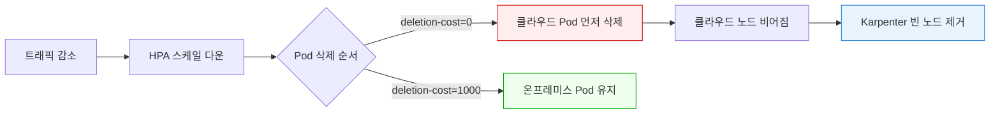

# 워크로드 배치 전략

< [이전: GPU 서버 통합](./05-gpu-integration.md) | [목차](./README.md) | [다음: 노드 라이프사이클 관리](./07-node-lifecycle.md) >

> **지원 버전**: EKS 1.31+, nodeadm 0.1+
> **마지막 업데이트**: 2026년 2월

이 문서에서는 EKS Hybrid Nodes 환경에서 효과적인 워크로드 배치 전략을 다룹니다.

## Node Affinity 및 Taints/Tolerations

### Hybrid 노드 Taint 설정

```bash
# 온프레미스 노드에 Taint 추가
kubectl taint nodes hybrid-node-001 eks.amazonaws.com/compute-type=hybrid:NoSchedule

# GPU 노드에 추가 Taint
kubectl taint nodes hybrid-gpu-node-001 gpu=true:NoSchedule
```

### 온프레미스 전용 워크로드

```yaml
# on-prem-workload.yaml
apiVersion: apps/v1
kind: Deployment
metadata:
  name: data-processor
  namespace: analytics
spec:
  replicas: 3
  selector:
    matchLabels:
      app: data-processor
  template:
    metadata:
      labels:
        app: data-processor
    spec:
      affinity:
        nodeAffinity:
          requiredDuringSchedulingIgnoredDuringExecution:
            nodeSelectorTerms:
            - matchExpressions:
              - key: eks.amazonaws.com/compute-type
                operator: In
                values:
                - hybrid
      tolerations:
      - key: eks.amazonaws.com/compute-type
        operator: Equal
        value: hybrid
        effect: NoSchedule
      containers:
      - name: processor
        image: harbor.internal.company.io/analytics/data-processor:v2.1.0
        resources:
          requests:
            cpu: "2"
            memory: "4Gi"
          limits:
            cpu: "4"
            memory: "8Gi"
```

## GPU 워크로드 온프레미스, CPU 워크로드 클라우드 패턴

```yaml
# hybrid-deployment.yaml
apiVersion: apps/v1
kind: Deployment
metadata:
  name: ml-training
  namespace: ai-workloads
spec:
  replicas: 1
  selector:
    matchLabels:
      app: ml-training
  template:
    metadata:
      labels:
        app: ml-training
    spec:
      affinity:
        nodeAffinity:
          requiredDuringSchedulingIgnoredDuringExecution:
            nodeSelectorTerms:
            - matchExpressions:
              - key: eks.amazonaws.com/compute-type
                operator: In
                values:
                - hybrid
              - key: nvidia.com/gpu.present
                operator: In
                values:
                - "true"
      tolerations:
      - key: eks.amazonaws.com/compute-type
        operator: Equal
        value: hybrid
        effect: NoSchedule
      - key: gpu
        operator: Equal
        value: "true"
        effect: NoSchedule
      containers:
      - name: trainer
        image: harbor.internal.company.io/ai/model-trainer:v1.0.0
        resources:
          limits:
            nvidia.com/gpu: 4
          requests:
            cpu: "16"
            memory: "64Gi"
---
apiVersion: apps/v1
kind: Deployment
metadata:
  name: ml-inference-api
  namespace: ai-workloads
spec:
  replicas: 5
  selector:
    matchLabels:
      app: ml-inference-api
  template:
    metadata:
      labels:
        app: ml-inference-api
    spec:
      affinity:
        nodeAffinity:
          requiredDuringSchedulingIgnoredDuringExecution:
            nodeSelectorTerms:
            - matchExpressions:
              - key: eks.amazonaws.com/compute-type
                operator: DoesNotExist
      containers:
      - name: api
        image: 123456789012.dkr.ecr.ap-northeast-2.amazonaws.com/ai/inference-api:v1.0.0
        resources:
          requests:
            cpu: "2"
            memory: "4Gi"
          limits:
            cpu: "4"
            memory: "8Gi"
```

## Karpenter를 활용한 Cloud Bursting

온프레미스 용량이 초과되면 자동으로 AWS로 확장합니다.

### Karpenter NodePool 구성

```yaml
# karpenter-nodepool.yaml
apiVersion: karpenter.sh/v1
kind: NodePool
metadata:
  name: cloud-burst-pool
spec:
  template:
    metadata:
      labels:
        node-type: cloud-burst
        topology.kubernetes.io/zone: ap-northeast-2a
    spec:
      requirements:
      - key: kubernetes.io/arch
        operator: In
        values: ["amd64"]
      - key: karpenter.sh/capacity-type
        operator: In
        values: ["spot", "on-demand"]
      - key: node.kubernetes.io/instance-type
        operator: In
        values: ["m6i.xlarge", "m6i.2xlarge", "m6i.4xlarge"]
      nodeClassRef:
        group: karpenter.k8s.aws
        kind: EC2NodeClass
        name: default
  limits:
    cpu: 1000
    memory: 4000Gi
  disruption:
    consolidationPolicy: WhenEmpty
    consolidateAfter: 30s
---
apiVersion: karpenter.k8s.aws/v1
kind: EC2NodeClass
metadata:
  name: default
spec:
  amiFamily: AL2023
  subnetSelectorTerms:
  - tags:
      karpenter.sh/discovery: my-hybrid-cluster
  securityGroupSelectorTerms:
  - tags:
      karpenter.sh/discovery: my-hybrid-cluster
  role: KarpenterNodeRole-my-hybrid-cluster
```

### Topology-Aware 스케줄링

```yaml
# topology-aware-deployment.yaml
apiVersion: apps/v1
kind: Deployment
metadata:
  name: latency-sensitive-app
spec:
  replicas: 10
  selector:
    matchLabels:
      app: latency-sensitive
  template:
    metadata:
      labels:
        app: latency-sensitive
    spec:
      topologySpreadConstraints:
      - maxSkew: 2
        topologyKey: topology.kubernetes.io/zone
        whenUnsatisfiable: ScheduleAnyway
        labelSelector:
          matchLabels:
            app: latency-sensitive
      affinity:
        nodeAffinity:
          preferredDuringSchedulingIgnoredDuringExecution:
          - weight: 100
            preference:
              matchExpressions:
              - key: eks.amazonaws.com/compute-type
                operator: In
                values:
                - hybrid
          - weight: 50
            preference:
              matchExpressions:
              - key: topology.kubernetes.io/zone
                operator: In
                values:
                - ap-northeast-2a
                - ap-northeast-2b
      containers:
      - name: app
        image: harbor.internal.company.io/apps/latency-app:v1.0.0
        resources:
          requests:
            cpu: "1"
            memory: "2Gi"
```

## Pod Deletion Cost를 활용한 온프레미스 노드 최대 활용

### 왜 Pod Deletion Cost가 필요한가

Cloud Bursting 패턴에서 트래픽이 줄어 스케일 다운할 때, **어떤 Pod를 먼저 제거할지**가 중요합니다. 온프레미스 하드웨어는 이미 투자된 비용(sunk cost)이므로 가능한 한 활용해야 하고, 클라우드 Pod는 사용한 만큼 과금되므로 먼저 제거하는 것이 비용 효율적입니다.

`controller.kubernetes.io/pod-deletion-cost` 어노테이션은 ReplicaSet 컨트롤러가 스케일 다운 시 어떤 Pod를 먼저 삭제할지 결정하는 데 사용됩니다.

| 어노테이션 값 | 동작 |
|--------------|------|
| 낮은 값 (예: 0, 기본값) | 먼저 삭제됨 |
| 높은 값 (예: 1000) | 나중에 삭제됨 (보호됨) |

### 동작 원리

```
스케일 다운 시 Pod 삭제 순서:

1순위: deletion-cost가 낮은 Pod (클라우드) → 먼저 삭제
2순위: deletion-cost가 높은 Pod (온프레미스) → 마지막까지 유지

예시: replicas 10 → 4로 축소
  클라우드 Pod (cost=0)    : 6개 모두 삭제
  온프레미스 Pod (cost=1000): 4개 모두 유지
```

### Mutating Webhook으로 자동 적용

Pod가 생성될 때 노드 위치에 따라 자동으로 deletion-cost를 부여하는 Mutating Webhook을 구성합니다.

```yaml
# pod-deletion-cost-webhook.yaml
apiVersion: apps/v1
kind: Deployment
metadata:
  name: deletion-cost-webhook
  namespace: kube-system
spec:
  replicas: 2
  selector:
    matchLabels:
      app: deletion-cost-webhook
  template:
    metadata:
      labels:
        app: deletion-cost-webhook
    spec:
      serviceAccountName: deletion-cost-webhook
      containers:
      - name: webhook
        image: harbor.internal.company.io/platform/deletion-cost-webhook:v1.0.0
        ports:
        - containerPort: 8443
        env:
        - name: ON_PREM_COST
          value: "1000"
        - name: CLOUD_COST
          value: "0"
        - name: ON_PREM_LABEL_KEY
          value: "eks.amazonaws.com/compute-type"
        - name: ON_PREM_LABEL_VALUE
          value: "hybrid"
---
apiVersion: admissionregistration.k8s.io/v1
kind: MutatingWebhookConfiguration
metadata:
  name: pod-deletion-cost
webhooks:
- name: deletion-cost.hybrid.eks
  admissionReviewVersions: ["v1"]
  sideEffects: None
  clientConfig:
    service:
      name: deletion-cost-webhook
      namespace: kube-system
      path: /mutate
  rules:
  - apiGroups: [""]
    apiVersions: ["v1"]
    operations: ["CREATE"]
    resources: ["pods"]
  namespaceSelector:
    matchExpressions:
    - key: kubernetes.io/metadata.name
      operator: NotIn
      values: ["kube-system", "kube-node-lease"]
```

### 수동 적용 (간단한 방법)

Webhook 없이도 Deployment 매니페스트에 직접 어노테이션을 지정할 수 있습니다. 이 방식은 Pod 생성 시점에는 노드가 결정되지 않으므로, 스케줄링 후 노드 정보를 기반으로 패치하는 CronJob을 활용합니다.

```bash
#!/bin/bash
# patch-deletion-cost.sh
# CronJob으로 주기적 실행: 온프레미스 노드의 Pod에 높은 deletion-cost 부여

ON_PREM_NODES=$(kubectl get nodes -l eks.amazonaws.com/compute-type=hybrid \
  -o jsonpath='{.items[*].metadata.name}')

for NODE in $ON_PREM_NODES; do
  PODS=$(kubectl get pods --all-namespaces --field-selector spec.nodeName=$NODE \
    -o jsonpath='{range .items[*]}{.metadata.namespace}/{.metadata.name}{"\n"}{end}')

  for POD in $PODS; do
    NS=$(echo $POD | cut -d'/' -f1)
    NAME=$(echo $POD | cut -d'/' -f2)
    CURRENT=$(kubectl get pod $NAME -n $NS \
      -o jsonpath='{.metadata.annotations.controller\.kubernetes\.io/pod-deletion-cost}' 2>/dev/null)

    if [ "$CURRENT" != "1000" ]; then
      kubectl annotate pod $NAME -n $NS \
        controller.kubernetes.io/pod-deletion-cost="1000" --overwrite
    fi
  done
done
```

```yaml
# deletion-cost-cronjob.yaml
apiVersion: batch/v1
kind: CronJob
metadata:
  name: patch-deletion-cost
  namespace: kube-system
spec:
  schedule: "*/5 * * * *"
  jobTemplate:
    spec:
      template:
        spec:
          serviceAccountName: deletion-cost-patcher
          containers:
          - name: patcher
            image: bitnami/kubectl:latest
            command: ["/bin/bash", "/scripts/patch-deletion-cost.sh"]
            volumeMounts:
            - name: script
              mountPath: /scripts
          volumes:
          - name: script
            configMap:
              name: deletion-cost-script
          restartPolicy: OnFailure
```

### Karpenter 연동 시 고려 사항

Karpenter의 `consolidationPolicy`와 pod-deletion-cost를 함께 사용하면 더욱 효과적입니다:

| 구성 | 역할 |
|------|------|
| `pod-deletion-cost` | ReplicaSet 스케일 다운 시 클라우드 Pod 우선 삭제 |
| Karpenter `WhenEmpty` | 빈 클라우드 노드를 자동 제거 |
| Karpenter `WhenUnderutilized` | 활용도 낮은 클라우드 노드 통합 |

```yaml
# karpenter와 deletion-cost 연동 예시
apiVersion: karpenter.sh/v1
kind: NodePool
metadata:
  name: cloud-burst-pool
spec:
  disruption:
    consolidationPolicy: WhenUnderutilized  # 활용도 낮으면 통합
    consolidateAfter: 60s
  # ...나머지 설정은 위 Karpenter NodePool 구성 참조
```

스케일 다운 시의 전체 흐름:



---

< [이전: GPU 서버 통합](./05-gpu-integration.md) | [목차](./README.md) | [다음: 노드 라이프사이클 관리](./07-node-lifecycle.md) >
