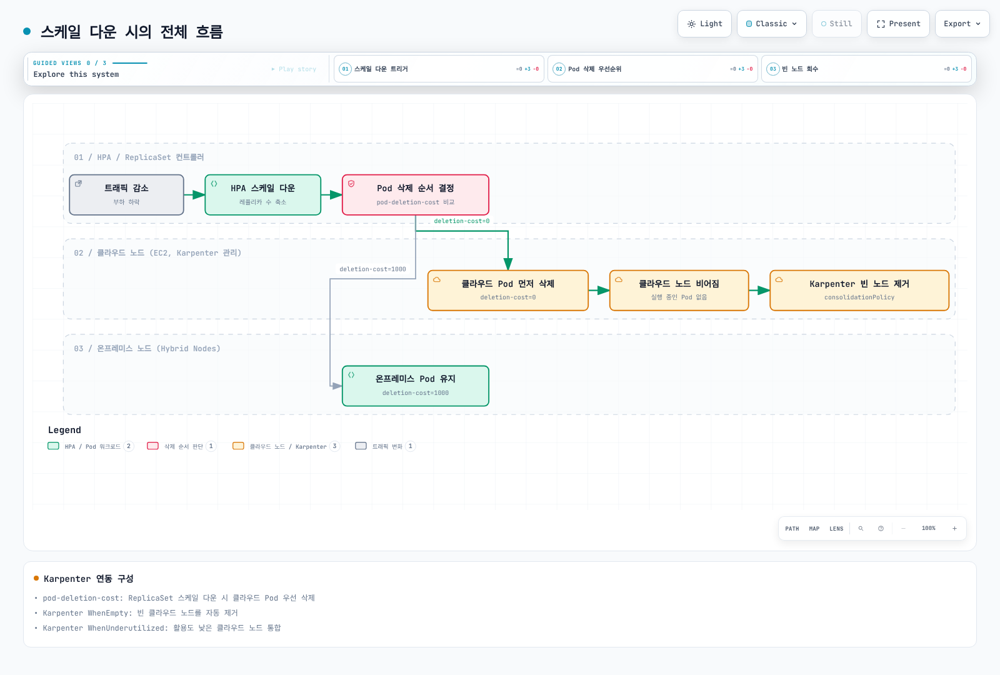

# 워크로드 배치 전략

< [이전: GPU 서버 통합](./05-gpu-integration.md) | [목차](./README.md) | [다음: 노드 라이프사이클 관리](./07-node-lifecycle.md) >

> **지원 버전**: 호환 Karpenter를 사용하는 지원 EKS 버전. Kubernetes 1.36.2와 Karpenter/provider 1.14.1 인터페이스 확인.
> **마지막 업데이트**: 2026년 9월 13일

이 문서는 Hybrid·클라우드 노드에 워크로드를 배치하고 cloud bursting과 Pod deletion cost의 한계를 설명합니다. 예제는 로컬로 검증한 구성·패치 방식입니다. 감사 중 클라우드 용량 생성, 노드 변경, 애플리케이션·GPU 워크로드 실행을 수행하지 않았습니다.

## 배치 제약과 허용

| 기법 | 동작 | 보장하지 않는 것 |
|---|---|---|
| `nodeSelector` / required node affinity | 스케줄링 시 대상 노드 필터링 | 데이터 존재, 의존성 정상 상태, label 변경 후 기존 Pod 이동 |
| Preferred node affinity | 스케줄링 선호도 추가 | 엄격한 온프레미스 우선, 고정 비율, 실행 Pod 자동 이동 |
| Taint / toleration | 해당 toleration 없는 Pod 배제 | Toleration은 Pod를 유인하거나 GPU 사용을 증명하지 않음 |
| Pod anti-affinity / topology spread | 적격 도메인 사이 분산 제약·점수 | 공유 물리 호스트·전원·스토리지·네트워크 장애에 대한 완전한 가용성 |
| PDB | 지원되는 자발적 eviction 요청 제약 | 일반적인 가용성, 배치 또는 모든 삭제·scale-down 경로 보호 |

`eks.amazonaws.com/compute-type=hybrid`와 소유자 관리 위치 label을 함께 사용합니다. Compute-type label의 `DoesNotExist`는 “클라우드”의 정의가 아닙니다. 정상 클라우드 노드도 compute-type label을 가질 수 있고, label이 없는 노드가 승인한 클라우드 위치라는 증거도 아닙니다.

예제는 [노드 부트스트랩](./04-node-bootstrap.md)의 Hybrid Node에 `workload.example.com/location=onprem`, 아래 특정 Karpenter pool에 `cloud`를 사용합니다. Label은 운영 입력이며 단독으로 데이터 상주·보안 통제를 제공하지 않습니다. 스토리지 토폴로지, egress, IAM과 신뢰할 수 있는 노드 관리도 필요합니다.

실제 노드 소유자의 구성으로 위치 label을 설정합니다. 예를 들어 nodeadm의 kubelet flag `--node-labels=workload.example.com/location=onprem` 또는 대응하는 Bottlerocket node-label 설정을 사용합니다. 자격 증명만 있는 최소 NodeConfig는 이 사용자 지정 label을 자동으로 추가하지 않습니다.

### 선택적 taint

Hybrid taint는 선택 사항입니다. 추가 전에 필수 CNI, DNS, GPU 인프라와 애플리케이션 Pod의 toleration을 확인합니다. 이전 GPU 예제가 새로 만든 모든 taint를 자동 허용하지는 않습니다.

```bash
# Identified node only; owner-approved scheduling-policy change.
set -euo pipefail
: "${KUBECONFIG:?}" "${CONTEXT:?}" "${NODE_NAME:?}"
kubectl --kubeconfig "$KUBECONFIG" --context "$CONTEXT" \
  taint node "$NODE_NAME" eks.amazonaws.com/compute-type=hybrid:NoSchedule
```

GPU 전용 taint에는 `nvidia.com/gpu=present:NoSchedule` 같은 검토한 규칙을 사용하고 인프라·워크로드 toleration을 맞춥니다. CPU 전용 Pod도 이 taint를 허용할 수 있으므로 admission·리소스 요청 정책은 별도입니다.

`NoSchedule`은 새 스케줄링에 영향을 주고 `PreferNoSchedule`은 약한 회피 선호입니다. `NoExecute`는 toleration과 `tolerationSeconds`에 따라 기존 Pod도 퇴거시킬 수 있습니다. Label이나 `IgnoredDuringExecution`이 붙은 required affinity를 바꿔도 이미 실행 중인 Pod가 자동 이동하지 않습니다.

## Cloud burst pool 준비

Karpenter는 조건을 만족하는 Pending Pod를 위해 EC2 용량을 생성하며 온프레미스 서버를 추가하지 않습니다. HPA/KEDA나 애플리케이션 컨트롤러가 replica 수요를 조절하고, 노드 프로비저너는 별도 제어 루프입니다. AWS quota, 인스턴스 가용성, subnet IP, IAM, 노드 bootstrap과 워크로드 의존성이 확장을 막을 수 있습니다.

클러스터 Kubernetes minor와 호환되는 Karpenter를 사용합니다. 현재 호환성 행렬에서 **Kubernetes 1.36은 최소 1.13**이 필요합니다. 예제는 **1.14.1** CRD로 확인했습니다. Auto Mode `NodeClass`가 아닌 자체 관리 Karpenter `EC2NodeClass` 예제입니다.

```yaml
apiVersion: karpenter.sh/v1
kind: NodePool
metadata:
  name: cloud-burst-pool
spec:
  template:
    metadata:
      labels:
        workload.example.com/location: cloud
    spec:
      taints:
        - key: workload.example.com/cloud-burst
          value: "true"
          effect: NoSchedule
      requirements:
        - key: kubernetes.io/arch
          operator: In
          values: [amd64]
        - key: kubernetes.io/os
          operator: In
          values: [linux]
        - key: topology.kubernetes.io/zone
          operator: In
          values: [ap-northeast-2a, ap-northeast-2b]
        - key: karpenter.sh/capacity-type
          operator: In
          values: [spot, on-demand]
        - key: node.kubernetes.io/instance-type
          operator: In
          values: [m6i.xlarge, m6i.2xlarge, m6i.4xlarge]
      nodeClassRef:
        group: karpenter.k8s.aws
        kind: EC2NodeClass
        name: hybrid-cloud-burst
  limits:
    cpu: "1000"
    memory: 4000Gi
  disruption:
    consolidationPolicy: WhenEmpty
    consolidateAfter: 30s
    budgets:
      - nodes: "1"
---
apiVersion: karpenter.k8s.aws/v1
kind: EC2NodeClass
metadata:
  name: hybrid-cloud-burst
spec:
  amiFamily: AL2023
  amiSelectorTerms:
    - id: ami-0123456789abcdef0
  subnetSelectorTerms:
    - id: subnet-0123456789abcdef0
    - id: subnet-0fedcba9876543210
  securityGroupSelectorTerms:
    - id: sg-0123456789abcdef0
  instanceProfile: REPLACE_WITH_APPROVED_EC2_NODE_INSTANCE_PROFILE
```

**적용 전 모든 AWS 예시 리소스 ID와 instance profile을 교체합니다.** 리전·아키텍처·Kubernetes 버전에 맞는 승인한 불변 AL2023 AMI를 선택합니다. AMI ID 선택 시 `amiFamily: AL2023`이 bootstrap family를 제공합니다. Instance profile은 SSM/IAM Roles Anywhere Hybrid 역할이 아닌 준비한 **EC2 노드 profile**입니다. Subnet·security group은 의도한 프라이빗 네트워크·AZ와 실제로 일치해야 합니다.

AZ 제한은 `requirements`에 두며 template label로 AWS zone을 위조하지 않습니다. Pool의 opt-in taint는 대응 toleration을 가진 워크로드로 범위를 제한하며 데이터·레지스트리 접근 권한을 주지 않습니다.

보존한 CPU `1000` / 메모리 `4000Gi`는 큰 규모의 **계획 예시**이며 권장 할당량이나 지출 상한이 아닙니다. 사용 전 크기를 정합니다. Karpenter 한도 검사는 eventual consistency이므로 빠른 확장 중 초과할 수 있습니다. `budgets: [{nodes: "1"}]`는 해당 자발적 중단의 동시성을 제한하며 최소 용량 예약이 아닙니다.

완성된 NodePool 정의 하나를 사용합니다. 같은 이름의 두 번째 부분 객체를 적용하는 것은 “위 설정 상속”의 안전한 방법이 아닙니다. 만료, AMI 선택과 disruption policy 변경은 별도 rollout 검토가 필요합니다.

## 로컬·클라우드 전용·버스팅 허용 워크로드

`hybrid-placement-lab` 같은 승인한 lab namespace를 만들고 실행 전 실제 이미지 다이제스트, 애플리케이션 보안 설정, probe, 스토리지와 레지스트리 접근을 준비합니다. 예제는 **replica 0개**와 의도적으로 사용 불가능한 이미지로 시작합니다. 이전 3/5/10 replica 수는 가능한 규모 예시이며 용량 실측이나 애플리케이션 동작 보장이 아닙니다.

```yaml
apiVersion: apps/v1
kind: Deployment
metadata:
  name: hybrid-local-processor
  namespace: hybrid-placement-lab
spec:
  replicas: 0
  selector:
    matchLabels:
      app: hybrid-local-processor
  template:
    metadata:
      labels:
        app: hybrid-local-processor
    spec:
      nodeSelector:
        eks.amazonaws.com/compute-type: hybrid
        workload.example.com/location: onprem
      tolerations:
        - key: eks.amazonaws.com/compute-type
          operator: Equal
          value: hybrid
          effect: NoSchedule
      automountServiceAccountToken: false
      securityContext:
        runAsNonRoot: true
        runAsUser: 65532
        seccompProfile:
          type: RuntimeDefault
      containers:
        - name: processor
          image: registry.example.invalid/approved/data-processor:replace-with-approved-digest
          securityContext:
            allowPrivilegeEscalation: false
            capabilities:
              drop: ["ALL"]
          resources:
            requests:
              cpu: "2"
              memory: 4Gi
            limits:
              cpu: "4"
              memory: 8Gi
---
apiVersion: apps/v1
kind: Deployment
metadata:
  name: hybrid-cloud-api
  namespace: hybrid-placement-lab
spec:
  replicas: 0
  selector:
    matchLabels:
      app: hybrid-cloud-api
  template:
    metadata:
      labels:
        app: hybrid-cloud-api
    spec:
      nodeSelector:
        workload.example.com/location: cloud
        karpenter.sh/nodepool: cloud-burst-pool
      tolerations:
        - key: workload.example.com/cloud-burst
          operator: Equal
          value: "true"
          effect: NoSchedule
      automountServiceAccountToken: false
      securityContext:
        runAsNonRoot: true
        runAsUser: 65532
        seccompProfile:
          type: RuntimeDefault
      containers:
        - name: api
          image: registry.example.invalid/approved/inference-api:replace-with-approved-digest
          securityContext:
            allowPrivilegeEscalation: false
            capabilities:
              drop: ["ALL"]
          resources:
            requests:
              cpu: "2"
              memory: 4Gi
            limits:
              cpu: "4"
              memory: 8Gi
---
apiVersion: apps/v1
kind: Deployment
metadata:
  name: hybrid-burst-app
  namespace: hybrid-placement-lab
spec:
  replicas: 0
  selector:
    matchLabels:
      app: hybrid-burst-app
  template:
    metadata:
      labels:
        app: hybrid-burst-app
    spec:
      tolerations:
        - key: eks.amazonaws.com/compute-type
          operator: Equal
          value: hybrid
          effect: NoSchedule
        - key: workload.example.com/cloud-burst
          operator: Equal
          value: "true"
          effect: NoSchedule
      affinity:
        nodeAffinity:
          requiredDuringSchedulingIgnoredDuringExecution:
            nodeSelectorTerms:
              - matchExpressions:
                  - key: eks.amazonaws.com/compute-type
                    operator: In
                    values: [hybrid]
                  - key: workload.example.com/location
                    operator: In
                    values: [onprem]
              - matchExpressions:
                  - key: workload.example.com/location
                    operator: In
                    values: [cloud]
                  - key: karpenter.sh/nodepool
                    operator: In
                    values: [cloud-burst-pool]
          preferredDuringSchedulingIgnoredDuringExecution:
            - weight: 100
              preference:
                matchExpressions:
                  - key: workload.example.com/location
                    operator: In
                    values: [onprem]
      topologySpreadConstraints:
        - maxSkew: 2
          topologyKey: topology.kubernetes.io/zone
          whenUnsatisfiable: ScheduleAnyway
          labelSelector:
            matchLabels:
              app: hybrid-burst-app
      automountServiceAccountToken: false
      securityContext:
        runAsNonRoot: true
        runAsUser: 65532
        seccompProfile:
          type: RuntimeDefault
      containers:
        - name: app
          image: registry.example.invalid/approved/latency-app:replace-with-approved-digest
          securityContext:
            allowPrivilegeEscalation: false
            capabilities:
              drop: ["ALL"]
          resources:
            requests:
              cpu: "1"
              memory: 2Gi
            limits:
              cpu: "2"
              memory: 4Gi
```

로컬 processor는 Hybrid·온프레미스 label을 모두 요구합니다. 클라우드 API는 명시적으로 소유한 cloud-burst pool을 요구합니다. 다른 승인 EC2 group에는 별도의 명시적 선택 규칙이 필요하며, label 누락을 fallback 허가로 해석하지 않습니다.

Burst 애플리케이션의 두 node-affinity term은 승인 온프레미스 집합 또는 승인 cloud pool이라는 **OR** 조건입니다. 한 term 안의 expression은 **AND**입니다. 온프레미스를 선호하지만 scheduler 점수, 리소스 요청, taint와 토폴로지 선호도 함께 적용됩니다. Karpenter는 새 노드를 계획할 때 선호도를 완화할 수 있습니다. 이는 포화 감지기나 모든 온프레미스 슬롯 우선 채우기 보장이 아닙니다.

100·50 같은 weight는 스케줄링 점수이며 용량 2:1 할당 비율이 아닙니다. 노드 하나에 여러 Pod가 들어가거나 호환 Pod가 전혀 없을 수도 있습니다. 따라서 “8개 노드에 Pod1–8을 두고 Pod9부터 무제한 cloud로 넘긴다”는 모델은 잘못입니다.

온프레미스 용량이 돌아와도 실행 중인 cloud Pod는 자동 복귀하지 않습니다. 재배치에는 데이터·가용성을 고려한 별도 통제 rollout·eviction 정책이 필요합니다.

온프레미스 GPU 학습·클라우드 CPU API 패턴에서는 GPU 요구 사항과 데이터 이동을 명시합니다. [GPU 통합](./05-gpu-integration.md)의 제한된 Job·할당 패턴을 사용합니다. 이전 **GPU4개 / CPU16 / 64Gi** 학습 요청은 크기 예시이며 실제 GPU 용량, 호환 장치와 지속 가능한 입력·checkpoint 접근이 필요합니다. 유한 학습 프로세스를 계속 재시작하는 Deployment는 Job이나 적절한 학습 컨트롤러를 대체하지 않습니다.

### 토폴로지와 데이터 locality

`topology.kubernetes.io/zone` 사용 전에 정확한 장애 도메인 label을 부여합니다. 클라우드는 실제 AWS AZ, 온프레미스는 의미 있는 자체 도메인을 사용합니다. Selector를 맞추려고 모든 Hybrid host를 AWS AZ로 표시하지 않습니다.

Burst 예제의 `ScheduleAnyway` spread는 점수 선호이며 `maxSkew`를 초과할 수 있습니다. `DoNotSchedule`에서는 설정한 `minDomains`를 고려하여 **적격 도메인 전체의 global minimum**을 기준으로 skew를 검사합니다. 항상 클러스터 모든 zone의 최대값−최소값이라는 의미는 아닙니다.

엄격한 spread·anti-affinity는 적격 노드·도메인이 부족하면 Pod를 Pending으로 남길 수 있습니다. 노드 적격성에는 affinity, taint와 topology policy도 적용됩니다. 강한 분산과 온프레미스 활용 극대화는 경쟁하는 목표일 수 있으므로 tradeoff를 선택합니다.

Required hostname anti-affinity는 충분한 용량이 있을 때 matching replica가 같은 Kubernetes Node에 배치되지 않게 할 수 있습니다. 나머지 replica가 정상이고 충분한 처리 용량을 가지며 공유 물리 장애를 피한다는 보장은 아닙니다.

데이터 위치 label은 데이터를 생성·복제하지 않습니다. 로컬 영구 데이터에는 PV node affinity와 적절한 `WaitForFirstConsumer` binding을 사용하는 관리된 local PV/PVC를 사용합니다. 원시 `hostPath: /mnt/data`는 dataset을 확인하거나 이동 가능한 영속성을 제공하지 않습니다. 로컬 스토리지에 bound된 Pod는 단순히 EC2 node로 fallback할 수 없으므로 복제, 접근 가능한 스토리지 또는 별도 애플리케이션 경로를 계획합니다.

## Pod deletion cost는 선호도

`controller.kubernetes.io/pod-deletion-cost`는 Pod의 정수 annotation입니다. 유효 범위는 **−2147483648~2147483647**, 없으면 기본값0이며 음수도 허용됩니다. ReplicaSet 축소 시 해당 Pod 집합 안에서 낮은 값을 **best-effort**로 먼저 제거합니다.

확인한 Kubernetes1.36.2 컨트롤러에서 deletion cost보다 먼저 비교하는 항목은 다음과 같습니다.

1. 할당된 Pod보다 미할당 Pod 우선.
2. Pending → Unknown → Running 순서.
3. Ready보다 NotReady 우선.
4. 그 뒤 낮은 deletion cost → 높은 cost 순서.

이후 replica 동시 배치, readiness 경과 시간, restart 수와 생성 시각 등을 비교합니다. 따라서 cost1000인 비정상 온프레미스 Pod가 cost0인 정상 cloud Pod보다 먼저 제거될 수 있습니다. Cost1000은 eviction, rollout, 노드 장애, 수동 삭제나 다른 컨트롤러로부터의 보호가 아닙니다.

이전 “replica10→4, cloud Pod6개 모두 삭제·온프레미스4개 모두 보존”은 **조건부 예시**입니다. 같은 ReplicaSet이고 상위 우선순위 기준과 상태가 안정적이어야 하며, 특히 Deployment revision이 다르면 보장된 결과가 아닙니다.

온프레미스에도 전력·유지보수·기회비용이 있습니다. 이를 보존하는 것은 평가할 운영 목표이며 보편적인 경제 법칙이 아닙니다. Deletion-cost 값 자체가 지출 예산이나 가용성 목표를 강제하지 않습니다.

## Binding 후 소유한 Pod 하나에 cost 부여

일반적인 Pod `CREATE` admission 요청에는 아직 할당된 `spec.nodeName`이 없습니다. CREATE 전용 mutating webhook은 최종 노드 위치를 신뢰성 있게 알 수 없습니다. 이전 webhook 예제는 Service/TLS/backend/RBAC 구성도 빠져 있어 failure policy에 따라 Pod 생성을 막을 수 있었습니다. 운영 솔루션으로 설치하지 않습니다.

작은 통제 작업에서는 **스케줄링 후** cost를 계산합니다. 다음 스크립트는 선택한 Pod 하나를 읽고 controller ReplicaSet UID·노드 분류를 검사한 뒤 검토할 비공개 JSON Patch를 만듭니다. 모든 namespace를 조사하거나 변경하지 않습니다.

공유 label만 보지 말고 애플리케이션 소유자의 실제 Deployment/ReplicaSet 소유 체인에서 `NAMESPACE`, `POD_NAME`, `EXPECTED_RS_UID`를 정합니다. 스크립트는 이 문서의 위치 규칙과 cloud pool만 인식합니다.

```bash
#!/usr/bin/env bash
# Read one owned, scheduled ReplicaSet Pod and write a reviewable JSON Patch.
# This script does not mutate the cluster.
set -euo pipefail
umask 077
: "${KUBECONFIG:?}" "${CONTEXT:?}" "${NAMESPACE:?}" "${POD_NAME:?}"
: "${EXPECTED_RS_UID:?UID of the ReplicaSet owned by the application operator}"
[[ "$NAMESPACE" =~ ^[a-z0-9]([-a-z0-9]*[a-z0-9])?$ && ${#NAMESPACE} -le 63 ]]
[[ "$POD_NAME" =~ ^[a-z0-9]([-a-z0-9.]*[a-z0-9])?$ && ${#POD_NAME} -le 253 ]]
PLAN_DIR=$(mktemp -d ./deletion-cost-review.XXXXXXXX)
kubectl --kubeconfig "$KUBECONFIG" --context "$CONTEXT" \
  get pod "$POD_NAME" -n "$NAMESPACE" -o json |
  jq '{metadata: {name: .metadata.name, namespace: .metadata.namespace,
      uid: .metadata.uid, resourceVersion: .metadata.resourceVersion,
      ownerReferences: .metadata.ownerReferences,
      deletionTimestamp: .metadata.deletionTimestamp},
    nodeName: .spec.nodeName,
    hasAnnotations: (.metadata.annotations | type == "object"),
    currentCost: .metadata.annotations["controller.kubernetes.io/pod-deletion-cost"]}' \
    > "$PLAN_DIR/pod.json"
jq -e --arg ns "$NAMESPACE" --arg pod "$POD_NAME" --arg owner "$EXPECTED_RS_UID" '
  .metadata.namespace == $ns and .metadata.name == $pod and
  (.metadata.uid | type == "string" and length > 0) and
  (.metadata.resourceVersion | type == "string" and length > 0) and
  .metadata.deletionTimestamp == null and
  ([.metadata.ownerReferences[]? | select(.controller == true)] | length == 1) and
  any(.metadata.ownerReferences[]?; .controller == true and
    .apiVersion == "apps/v1" and .kind == "ReplicaSet" and .uid == $owner) and
  (.nodeName | type == "string" and length > 0)' "$PLAN_DIR/pod.json" > /dev/null
NODE_NAME=$(jq -er '.nodeName' "$PLAN_DIR/pod.json")
[[ "$NODE_NAME" =~ ^[a-z0-9]([-a-z0-9.]*[a-z0-9])?$ ]]
kubectl --kubeconfig "$KUBECONFIG" --context "$CONTEXT" \
  get node "$NODE_NAME" -o json |
  jq '{metadata: {name: .metadata.name, uid: .metadata.uid, labels: {
    compute: .metadata.labels["eks.amazonaws.com/compute-type"],
    location: .metadata.labels["workload.example.com/location"],
    nodepool: .metadata.labels["karpenter.sh/nodepool"]}}}' > "$PLAN_DIR/node.json"
desired=$(jq -er --arg node "$NODE_NAME" '
  if .metadata.name != $node or (.metadata.uid | type != "string" or length == 0) then
    error("unexpected Node identity")
  elif .metadata.labels.compute == "hybrid" and .metadata.labels.location == "onprem" then "1000"
  elif .metadata.labels.compute != "hybrid" and .metadata.labels.location == "cloud"
       and .metadata.labels.nodepool == "cloud-burst-pool" then "0"
  else error("unknown or conflicting node classification") end' "$PLAN_DIR/node.json")
jq --arg cost "$desired" '
  [{op:"test",path:"/metadata/uid",value:.metadata.uid},
   {op:"test",path:"/metadata/resourceVersion",value:.metadata.resourceVersion},
   {op:"test",path:"/spec/nodeName",value:.nodeName}]
  + (if .hasAnnotations then [] else
       [{op:"add",path:"/metadata/annotations",value:{}}] end)
  + (if .currentCost == $cost then [] else
       [{op:"add",path:"/metadata/annotations/controller.kubernetes.io~1pod-deletion-cost",
         value:$cost}] end)' "$PLAN_DIR/pod.json" > "$PLAN_DIR/patch.json"
printf 'Review private snapshots and patch in %s; nothing was applied.\n' "$PLAN_DIR"
```

적용 전 snapshot과 원하는 annotation을 검토합니다. Patch는 Pod UID, resourceVersion과 bound node를 검사하므로 객체 교체·동시 변경에서 새 Pod를 덮어쓰지 않고 실패합니다. Deletion-cost 키만 추가하고 다른 annotation은 보존합니다.

스크립트가 출력한 디렉터리를 호출 셸의 `PLAN_DIR`로 지정합니다. 자식 프로세스는 호출자의 변수를 설정하지 않습니다.

```bash
# Cluster write, only after the named Pod/owner and generated patch are reviewed.
set -euo pipefail
: "${KUBECONFIG:?}" "${CONTEXT:?}" "${NAMESPACE:?}" "${POD_NAME:?}" "${PLAN_DIR:?}"
kubectl --kubeconfig "$KUBECONFIG" --context "$CONTEXT" \
  patch pod "$POD_NAME" -n "$NAMESPACE" --type=json \
  --patch-file "$PLAN_DIR/patch.json"
```

Test 실패나 노드 분류 변경 시 새 상태에서 다시 만들고 검토합니다. Test를 제거하거나 관련 없는 Pod에 `--overwrite`를 적용하지 않습니다. 기존 컨트롤러와 annotation 소유권을 조정합니다.

빠르게 변하는 metric으로 cost를 계속 갱신하지 않습니다. Kubernetes 문서는 API 업데이트 부담을 설명합니다. 운영 post-binding 컨트롤러에는 좁은 권한, 소유권 검사, 제한된 재시도와 충돌 처리가 필요합니다. 구현되지 않은 이전의 모든-namespace CronJob, 누락된 ServiceAccount/ConfigMap과 변경 가능한 `bitnami/kubectl:latest` 이미지는 그런 컨트롤러가 아닙니다.

Namespace RBAC으로 Pod patch 경계를 제한할 수 있지만 일반 RBAC은 임의의 Pod label selector를 권한으로 표현하지 않습니다. 노드 메타데이터 읽기와 애플리케이션 namespace 쓰기 권한을 적절히 분리합니다. 이 단일 Pod 관리 예제는 클러스터 전체 쓰기 권한을 부여하지 않습니다.

## Karpenter와의 관계

Karpenter1.14.1도 Pod priority와 함께 **정규화된 eviction-cost 계산**에 `pod-deletion-cost`를 사용합니다. ReplicaSet만 이 값을 읽는다는 설명도 잘못입니다. Karpenter는 Pod cost와 노드·중단 정보를 조합하며 값1000이 보존 가능성1000배를 보장하지 않습니다.

| 제어 | 적용 범위 |
|---|---|
| ReplicaSet deletion cost | 해당 ReplicaSet의 축소 후보 사이 선호 |
| Karpenter disruption cost | 후보 평가 heuristic이며 eviction 금지가 아님 |
| `WhenEmpty` | 관련 워크로드 Pod가 없는 적격 노드를 delay·검사 후 통합 가능 |
| `WhenEmptyOrUnderutilized` | 해당 제약에 따라 통합 과정에서 워크로드 이동 가능 |
| PDB / disruption budget / lifecycle 설정 | 서로 적용 범위가 다르며 cost annotation으로 대체하지 않음 |

빈 노드가 즉시 사라진다는 보장은 없습니다. 조정 주기, disruption budget, finalizer와 cloud 종료 과정이 남습니다. Affinity·spread 선호도 통합 기회를 줄일 수 있습니다. 모든 HPA 축소가 같은 수의 cloud node 삭제를 만든다고 가정하지 말고 함께 평가합니다.



[🔍 인터랙티브 다이어그램 보기](https://www.atomai.click/kubernetes-docs/archmaps/ko-eks-hybrid-nodes-06-workload-placement-0.html)

> **다이어그램 정정:** cloud Pod 우선 삭제와 온프레미스 완전 보존은 best-effort 목표이며 불변 조건이 아닙니다. “빈 노드”에도 DaemonSet Pod가 남을 수 있습니다. 이전 `WhenUnderutilized` label은 v1 예제의 `WhenEmptyOrUnderutilized`로 읽어야 합니다. 위의 정렬·수명 주기 조건을 함께 읽습니다.

## 공식 참고 자료

- [Pod 노드 배치](https://kubernetes.io/docs/concepts/scheduling-eviction/assign-pod-node/)
- [Taint와 toleration](https://kubernetes.io/docs/concepts/scheduling-eviction/taint-and-toleration/)
- [Pod topology spread](https://kubernetes.io/docs/concepts/scheduling-eviction/topology-spread-constraints/)
- [ReplicaSet deletion cost](https://kubernetes.io/docs/concepts/workloads/controllers/replicaset/#pod-deletion-cost)
- [Kubernetes1.36.2 scale-down 비교](https://github.com/kubernetes/kubernetes/blob/v1.36.2/pkg/controller/controller_utils.go)
- [Pod disruption과 PDB 범위](https://kubernetes.io/docs/concepts/workloads/pods/disruptions/)
- [Local volume과 PV node affinity](https://kubernetes.io/docs/concepts/storage/volumes/#local)
- [StorageClass volume binding](https://kubernetes.io/docs/concepts/storage/storage-classes/#volume-binding-mode)
- [Karpenter NodePool](https://karpenter.sh/docs/concepts/nodepools/), [호환성](https://karpenter.sh/docs/upgrading/compatibility/)
- [Karpenter disruption](https://karpenter.sh/docs/concepts/disruption/)
- [Karpenter1.14.1 eviction-cost 구현](https://github.com/kubernetes-sigs/karpenter/blob/v1.14.1/pkg/utils/disruption/disruption.go)

< [이전: GPU 서버 통합](./05-gpu-integration.md) | [목차](./README.md) | [다음: 노드 라이프사이클 관리](./07-node-lifecycle.md) >
