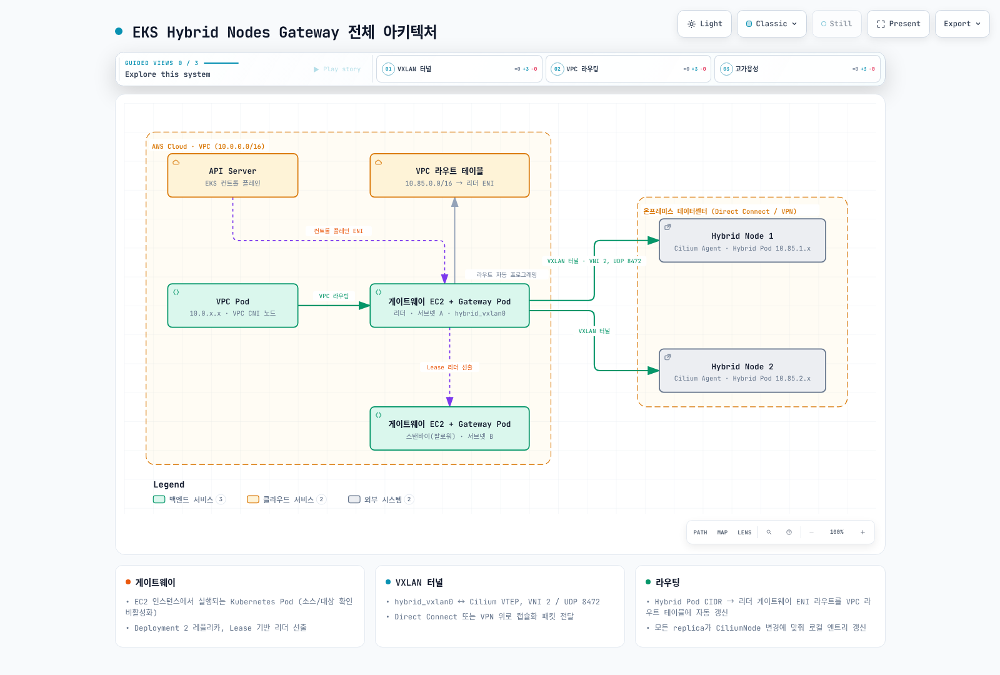
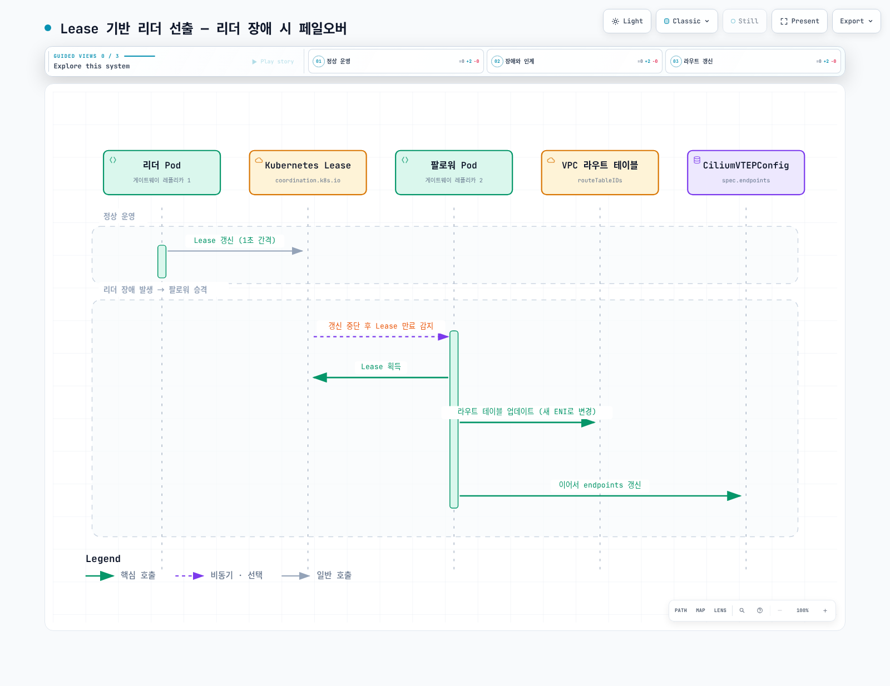
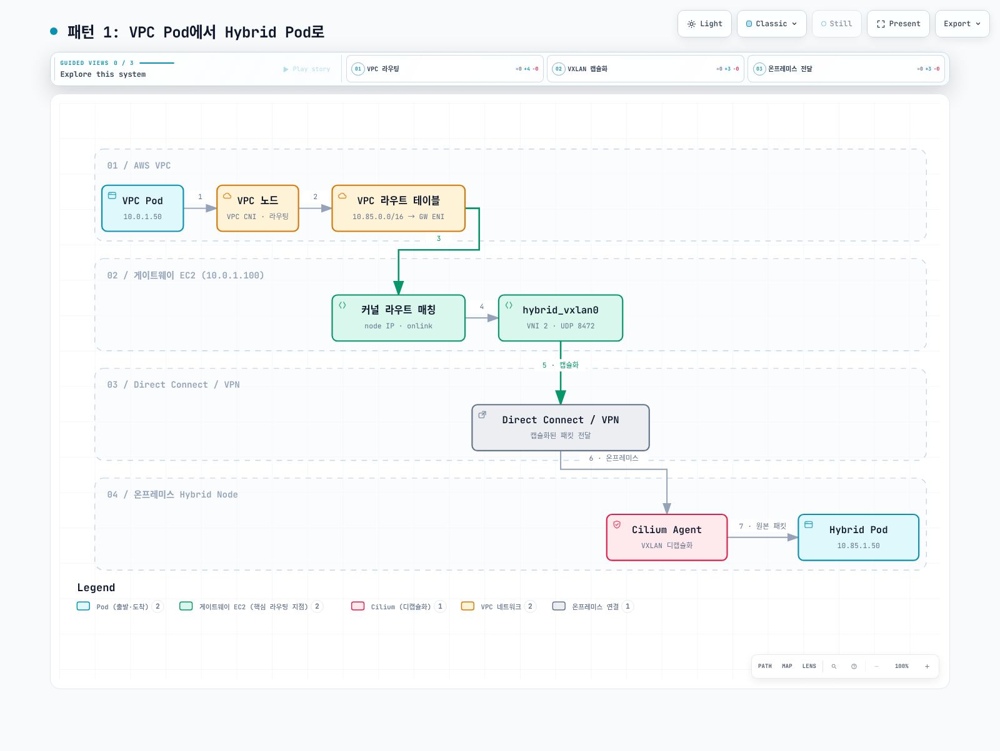
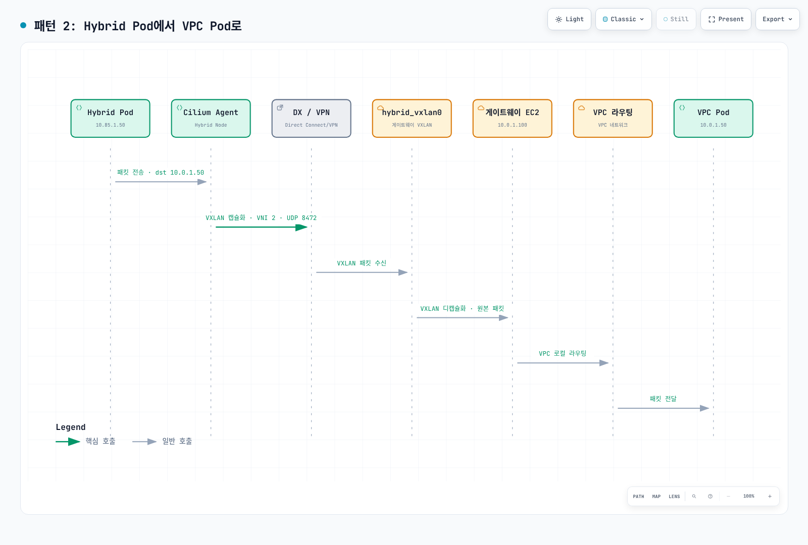
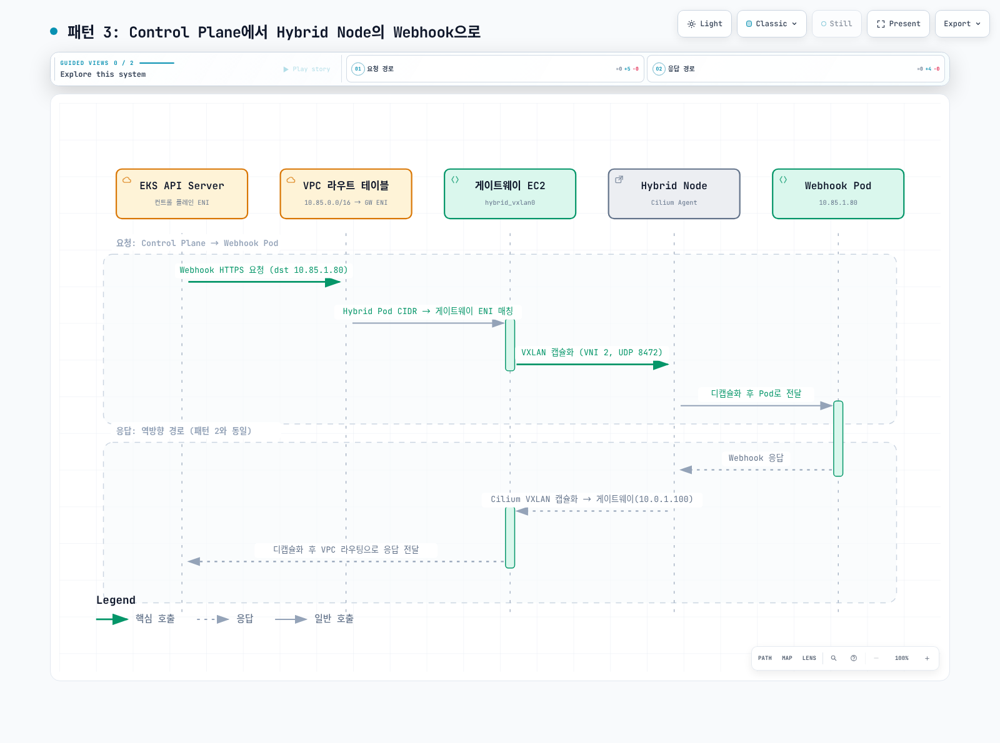
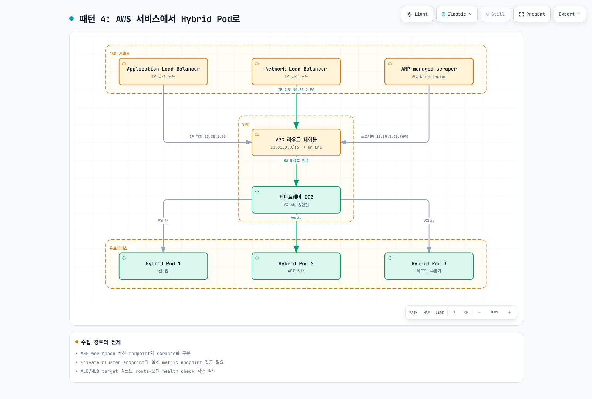
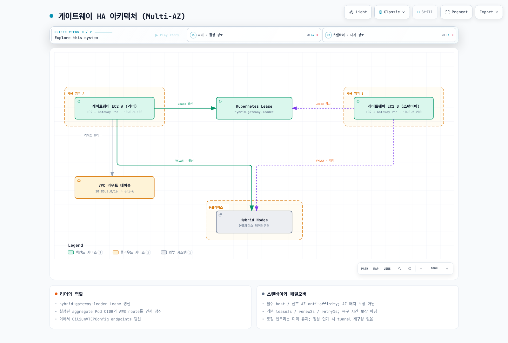

# EKS Hybrid Nodes Gateway

< [이전: 베어메탈 서버 OS 설치](./09-bare-metal-os-setup.md) | [목차](./README.md) >

> **검토 기준**: Gateway/chart 1.0.2. EKS가 지원하는 Kubernetes 버전과 Gateway 전제 조건을 충족하는 AWS 유지 관리 Cilium 릴리스를 사용합니다.
> **마지막 업데이트**: 2026년 9월 13일

이 문서에서는 EKS Hybrid Nodes Gateway의 아키텍처, 설치, 구성, 운영 방법을 다룹니다. Hybrid Nodes Gateway는 EKS 클러스터 VPC의 Pod와 온프레미스 Hybrid Node의 Pod 간 네트워크 연결을 VXLAN 터널로 자동화하는 오픈소스 솔루션입니다.

---

## 개요 및 학습 목표

### EKS Hybrid Nodes Gateway란?

EKS Hybrid Nodes Gateway는 **2026년 4월 21일 정식 출시(GA)** 된 오픈소스 프로젝트로, EKS 클러스터의 VPC 네트워크와 온프레미스 Hybrid Nodes의 Kubernetes Pod 네트워크 간 라우팅 가능한 연결을 자동으로 구성합니다.

핵심 원리는 간단합니다: EC2 인스턴스에서 실행되는 게이트웨이 Pod가 VXLAN 터널을 통해 온프레미스 Cilium 노드와 직접 연결되고, VPC 라우트 테이블을 자동으로 업데이트하여 양방향 Pod-to-Pod 통신을 가능하게 합니다.

**GitHub**: [github.com/aws/eks-hybrid-nodes-gateway](https://github.com/aws/eks-hybrid-nodes-gateway)

### 학습 목표

이 문서를 완료하면 다음을 이해하고 수행할 수 있습니다:

1. Hybrid Nodes Gateway의 아키텍처와 VXLAN 터널링 메커니즘 이해
2. Cilium VTEP(Virtual Tunnel Endpoint)와 CiliumVTEPConfig CRD 구성
3. Helm 차트를 사용한 게이트웨이 설치 및 구성
4. IAM 역할 및 보안 그룹 설정
5. VPC Pod에서 Hybrid Pod로, Hybrid Pod에서 VPC Pod로의 트래픽 흐름 이해
6. 고가용성 구성 및 페일오버 메커니즘 운영
7. 모니터링, 트러블슈팅, 업그레이드 수행
8. 기존 수동 라우팅 방식에서 게이트웨이 방식으로 마이그레이션

### 왜 Hybrid Nodes Gateway가 필요한가?

기존 EKS Hybrid Nodes 환경에서 VPC Pod와 온프레미스 Pod 간 직접 통신을 위해서는 다음과 같은 수동 작업이 필요했습니다:

| 과제 | 기존 수동 방식 | Gateway 방식 |
|------|---------------|-------------|
| Pod CIDR 라우팅 | VPN/Direct Connect + 수동 정적 라우트 관리 | VXLAN 터널로 자동화 |
| VPC 라우트 테이블 | 수동으로 라우트 추가/삭제 관리 | 게이트웨이가 자동 프로그래밍 |
| 노드 추가/삭제 시 | BGP 또는 수동 라우트 업데이트 필요 | 자동 감지 및 업데이트 |
| 웹훅 연결 | 실제 route·remote Pod·TLS·보안 설정 필요 | 같은 전제 조건을 검증한 Gateway 경로 |
| 비용 | Cluster·연결·인프라·운영 비용 | Gateway 소프트웨어 요금 없음. EC2·해당 Auto Mode·전송·storage 등은 별도 |
| 복잡도 | BGP 구성, 방화벽 규칙, NAT 등 | Helm 차트 하나로 설치 |

> **핵심 가치**: Hybrid Nodes Gateway는 추가 요금 없이 사용 가능한 오픈소스 프로젝트입니다. EC2·해당 Auto Mode 관리 요금·storage·데이터 전송·private 연결·관측성 비용은 별도입니다.

---

## 아키텍처 심층 분석

### 전체 아키텍처 개요



[🔍 인터랙티브 다이어그램 보기](https://www.atomai.click/kubernetes-docs/archmaps/ko-eks-hybrid-nodes-10-hybrid-nodes-gateway-0.html)

### 핵심 구성 요소 상세

#### 1. EC2 게이트웨이 노드

게이트웨이는 EC2 인스턴스에서 실행되는 Kubernetes Pod입니다. 이 인스턴스는 다음과 같은 특별한 요구 사항을 갖습니다:

- **소스/대상 확인 비활성화**: EC2 인스턴스의 소스/대상 확인(source/destination check)을 비활성화해야 합니다. 이는 인스턴스가 자신이 소스나 대상이 아닌 트래픽을 전달하는 라우터 역할을 하기 때문입니다.
- **VPC 네트워킹**: 관리형/자체 관리 노드의 AWS VPC CNI와 Auto Mode의 내장 네트워킹을 구분합니다. Gateway는 `hostNetwork: true`로 노드 네트워크를 사용합니다.
- **프라이빗 연결**: Direct Connect 또는 VPN을 통해 온프레미스 네트워크와 연결됩니다.

```yaml
# 기존 적격 EC2 노드의 metadata 조각; 독립 실행 Node manifest가 아닙니다.
metadata:
  labels:
    hybrid-gateway-node: "true"
```

#### 2. VXLAN 터널 인터페이스 (hybrid_vxlan0)

게이트웨이 Pod는 `hybrid_vxlan0`이라는 VXLAN 인터페이스를 생성합니다:

| 속성 | 값 | 설명 |
|------|-----|------|
| 인터페이스 이름 | `hybrid_vxlan0` | 게이트웨이 측 VXLAN 인터페이스 |
| VNI (VXLAN Network Identifier) | 2 | Gateway 기본값. CiliumVTEPConfig의 설정 필드는 아님 |
| UDP 포트 | 8472 | VXLAN 캡슐화를 위한 UDP 포트 |
| MTU | 실제 인터페이스와 전체 경로에서 확인 | IPv4 VXLAN 오버헤드와 DX/VPN 경로의 가장 작은 MTU를 함께 고려 |

```bash
# ip 도구가 있는 승인된 노드 진단 환경에서 읽기 전용으로 확인
ip link show hybrid_vxlan0
ip addr show hybrid_vxlan0
```

Gateway 1.0.2는 VXLAN 인터페이스에 IP 주소를 할당하지 않습니다. 외부 터널 endpoint는 노드의 private IP이며 인터페이스 MAC은 해당 IP에서 유도합니다. 기본 Gateway 이미지에 `ip`·`bridge` 도구가 있다고 가정하지 않습니다. 이전 문서의 MTU 8950·`inet 10.0.1.5/32` 출력은 실행 증거가 아니며, 특히 IP 할당 부분은 현재 구현과 다릅니다.

#### 3. FDB 엔트리, ARP 엔트리, 라우트 프로그래밍

각 replica의 node reconciler는 `eks.amazonaws.com/compute-type: hybrid` label이 있는 `CiliumNode`를 감시하며, node internal IP와 할당된 Pod CIDR을 사용해 로컬 엔트리를 관리합니다:

**FDB (Forwarding Database) 엔트리**: VXLAN 터널의 원격 엔드포인트를 정의합니다.

```bash
# FDB 엔트리 확인 - 노드 IPv4에서 유도한 MAC과 node internal IP 매핑
bridge fdb show dev hybrid_vxlan0
# 출력 예시:
# 02:00:c0:a8:0a:65 dst 192.168.10.101 self permanent  (합성 예시)
# 02:00:c0:a8:0a:66 dst 192.168.10.102 self permanent  (합성 예시)
```

**ARP 엔트리**: VXLAN 터널 내에서 IP-to-MAC 매핑을 제공합니다.

```bash
# ARP 엔트리 확인
ip neigh show dev hybrid_vxlan0
# 출력 예시:
# 192.168.10.101 lladdr 02:00:c0:a8:0a:65 PERMANENT  (합성 예시)
# 192.168.10.102 lladdr 02:00:c0:a8:0a:66 PERMANENT  (합성 예시)
```

**라우트 엔트리**: Hybrid Pod CIDR에 대한 라우팅 경로를 정의합니다.

```bash
# 라우트 엔트리 확인
ip route show dev hybrid_vxlan0
# 출력 예시:
# 10.85.1.0/24 via 192.168.10.101 dev hybrid_vxlan0 onlink  (합성 예시)
# 10.85.2.0/24 via 192.168.10.102 dev hybrid_vxlan0 onlink  (합성 예시)
```

이 세 가지 엔트리가 함께 작동하여 다음과 같은 패킷 처리 파이프라인을 구성합니다:

```text
VPC Pod → 패킷 도착 (dst: 10.85.1.5)
  → 라우트 조회: 10.85.1.0/24 via 192.168.10.101 dev hybrid_vxlan0 onlink
  → ARP 조회: 192.168.10.101 → MAC 02:00:c0:a8:0a:65
  → FDB 조회: 02:00:c0:a8:0a:65 → 192.168.10.101 (Hybrid Node 1 IP)
  → VXLAN 캡슐화 (VNI 2, UDP 8472)
  → 전송: 192.168.10.101:8472
```

#### 4. CiliumVTEPConfig: 게이트웨이를 원격 VTEP로 등록

Cilium 측에서는 `CiliumVTEPConfig` CRD를 사용하여 EC2 게이트웨이를 원격 VTEP(Virtual Tunnel Endpoint)로 등록합니다. 이를 통해 Hybrid Node의 Cilium 에이전트가 VPC Pod로 향하는 트래픽을 VXLAN 터널을 통해 게이트웨이로 전달합니다.

```yaml
apiVersion: cilium.io/v2
kind: CiliumVTEPConfig
metadata:
  name: hybrid-gateway
spec:
  endpoints:
    - name: vpc-gateway
      tunnelEndpoint: "10.0.1.5"      # 실제 leader node IP
      cidr: "10.0.0.0/16"            # endpoint 하나당 VPC prefix 하나
      mac: "82:36:6c:89:e6:ad"       # 예시값. 실제 leader VXLAN MAC을 확인
```

> **자동 관리**: Hybrid Nodes Gateway가 이 CRD를 자동으로 생성하고 업데이트합니다. 수동으로 CiliumVTEPConfig를 만들 필요는 없지만, 구조를 이해하는 것은 트러블슈팅에 중요합니다.

#### 5. Lease 기반 리더 선출

게이트웨이는 **Deployment**로 배포되며, 기본적으로 **2개의 레플리카**로 구성됩니다. Kubernetes Lease 오브젝트를 사용한 리더 선출 메커니즘을 통해 한 번에 하나의 Pod만 활성(리더) 상태로 동작합니다.

```bash
# Lease 오브젝트 확인
kubectl get lease hybrid-gateway-leader -n eks-hybrid-nodes-gateway
# 출력 예시:
# NAME                        HOLDER                                  AGE
# hybrid-gateway-leader      gateway-node-hostname_example-uuid    5d
```

holderIdentity가 Pod 이름과 같다고 가정하지 않습니다. 실제 node/Pod 대응을 조회한 뒤 운영 명령을 결정합니다.

리더 Pod의 역할:
- VXLAN 터널 관리 (FDB, ARP, 라우트 프로그래밍)
- VPC 라우트 테이블 업데이트
- CiliumVTEPConfig CRD 관리
- CiliumNode 감시와 로컬 터널 엔트리 갱신

팔로워 Pod의 역할:
- 리더와 마찬가지로 VXLAN·FDB·neighbor·로컬 라우트를 계속 유지
- 인계 후 AWS 라우트와 CiliumVTEPConfig 갱신 필요. 무중단 인계 보장은 아님
- Lease 갱신 모니터링



[🔍 인터랙티브 다이어그램 보기](https://www.atomai.click/kubernetes-docs/archmaps/ko-eks-hybrid-nodes-10-hybrid-nodes-gateway-1.html)

Lease 관련 주요 파라미터:

| 파라미터 | 기본값 | 설명 |
|---------|--------|------|
| `--leader-election-lease-duration` | 3s | Lease 유효 기간 |
| `--leader-election-renew-deadline` | 2s | 리더 갱신 deadline |
| `--leader-election-retry-period` | 1s | Lease 획득 재시도 간격 |

표는 binary flag입니다. chart 1.0.2는 `leaderElection` values 객체를 지원하지 않으므로 해당 YAML을 추가하는 것만으로 값이 바뀌지 않습니다.

#### 6. VPC 라우트 테이블 자동 관리

게이트웨이의 리더 Pod는 VPC 라우트 테이블을 자동으로 관리합니다:

```
VPC 라우트 테이블 (rtb-0abc123456789def0):
┌────────────────────┬────────────────────────────────┐
│ Destination        │ Target                         │
├────────────────────┼────────────────────────────────┤
│ 10.0.0.0/16        │ local                          │
│ 10.85.0.0/16       │ eni-0abc... (게이트웨이 ENI)    │
│ 0.0.0.0/0          │ igw-0xyz...                    │
└────────────────────┴────────────────────────────────┘
```

게이트웨이는 `routeTableIDs` 값에 지정된 모든 라우트 테이블에 대해:
1. Hybrid Pod CIDR(`podCIDRs`)에 대한 라우트를 게이트웨이 EC2 인스턴스의 ENI로 설정
2. 리더 변경 시 새 리더의 ENI로 라우트 업데이트
3. 같은 CIDR의 기존 라우트가 다른 대상을 가리키면 `ReplaceRoute`로 변경. 설치 전 라우트 소유자와 전환·복구 절차 확인

리더 setup은 AWS 라우트를 먼저 변경한 뒤 `CiliumVTEPConfig`를 갱신합니다. AWS의 aggregate `podCIDRs` 라우트와 각 replica의 CiliumNode별 로컬 터널 엔트리는 별개입니다. Runtime은 `DescribeRouteTables`·`DescribeInstances`·`CreateRoute`·`ReplaceRoute`를 사용하며 `DeleteRoute`는 호출하지 않습니다. **Helm 제거 시 AWS 라우트는 자동 정리되지 않습니다.**

[1.0.2 구현](https://github.com/aws/eks-hybrid-nodes-gateway/tree/v1.0.2/internal)과 [AWS 운영 문서](https://docs.aws.amazon.com/eks/latest/userguide/hybrid-nodes-gateway-operations.html)로 확인했습니다. API 조회 성공·readiness·leader metric만으로 실제 forwarding 성공을 판단하지 않습니다.

---

## 사전 요구 사항

### 클러스터 요구 사항

| 요구 사항 | 최소 버전 / 조건 | 비고 |
|-----------|-----------------|------|
| EKS 클러스터 | EKS와 선택한 add-on이 지원하는 버전 | IPv4, API/API_AND_CONFIG_MAP 인증, 겹치지 않는 주소 범위 |
| Hybrid Nodes | 1개 이상 등록됨 | Cilium CNI 실행 중 |
| Cilium CNI | [CNI 구성](#cni-구성)의 AWS branch 최소 버전 충족 | VTEP 활성화·L7 proxy 비활성화 |
| Cloud networking | 관리형/자체 관리 노드는 지원되는 AWS VPC CNI, Auto Mode는 내장 네트워킹 | aws-node ClusterIP 경로는 Hybrid CIDR SNAT 제외 |
| kubectl | 대상 API server와 지원되는 version skew | 임의의 최소 버전만으로 호환성을 판단하지 않음 |
| Helm | 3.12+ | 게이트웨이 설치에 사용 |

### 네트워크 요구 사항

#### 프라이빗 연결

온프레미스 node IP와 AWS VPC 사이의 승인된 private 연결이 필요합니다. 아래 이전 수치·비용 등급은 미검증 예시이며 현재 상품 최대치나 지연 보장이 아닙니다. Tunnel 유형·라우팅·packet mix·중복 연결 설계에 따라 달라집니다. [Hybrid cluster 요구 사항](https://docs.aws.amazon.com/eks/latest/userguide/hybrid-nodes-cluster-create.html)에 따라 public-only 또는 private-only endpoint를 선택하며 IPv4와 API/API_AND_CONFIG_MAP 인증을 사용합니다:

| 연결 방식 | 대역폭 | 지연 시간 | 비용 | 적합한 환경 |
|-----------|--------|----------|------|------------|
| AWS Direct Connect | 1-100 Gbps | < 5ms | 높음 | 프로덕션 대규모 환경 |
| Site-to-Site VPN | ~1.25 Gbps/터널 | 가변적 | 낮음 | 개발/소규모 환경 |
| Direct Connect + VPN | 1-100 Gbps | < 5ms | 높음 | 최고 보안 요구 환경 |

#### EC2 인스턴스

다음 기존 instance/node-count 표는 실측 없는 sizing 예시입니다. 실제 network baseline/burst·PPS·CPU·memory·장애 여유를 검토합니다:

```
권장 인스턴스 타입:
┌──────────────┬──────────┬──────────┬──────────────────────────┐
│ 인스턴스 타입 │ vCPU     │ 메모리    │ 적합한 환경              │
├──────────────┼──────────┼──────────┼──────────────────────────┤
│ c5.large     │ 2        │ 4 GiB    │ 개발/테스트 (< 10 노드)  │
│ c5.xlarge    │ 4        │ 8 GiB    │ 소규모 프로덕션 (< 50)   │
│ c5.2xlarge   │ 8        │ 16 GiB   │ 대규모 프로덕션 (< 200)  │
│ c5n.xlarge   │ 4        │ 10.5 GiB │ 고대역폭 필요 시         │
└──────────────┴──────────┴──────────┴──────────────────────────┘
```

> **중요**: EC2 인스턴스의 **소스/대상 확인(Source/Destination Check)**을 반드시 비활성화해야 합니다. 게이트웨이가 라우터 역할을 하므로 자신이 소스/대상이 아닌 패킷도 전달해야 하기 때문입니다.

Auto Mode는 NodeClass의 `advancedNetworking.sourceDestCheck: DisabledPrimaryENI`로 준비합니다. 관리형/자체 관리 노드는 provisioning 소유자가 정확한 primary ENI에 필요한 변경을 수행합니다. 다음 명령은 현재 속성만 읽습니다.

```bash
: "${AWS_REGION:?Set the reviewed Region}"
: "${GATEWAY_PRIMARY_ENI_ID:?Set the verified gateway primary ENI}"
aws ec2 describe-network-interface-attribute --region "$AWS_REGION" \
  --network-interface-id "$GATEWAY_PRIMARY_ENI_ID" --attribute sourceDestCheck
```

#### 보안 그룹

| 경로 | 확인 범위 |
|---|---|
| Gateway private node IP ↔ Hybrid node IP | 외부 VXLAN UDP8472 양방향 |
| Cloud workload ↔ Hybrid Pod | 실제 내부 application protocol/port와 반환 트래픽 |
| Node → Kubernetes API·AWS API/registry·DNS | 실제 endpoint/resolver의 TCP443와 DNS 경로 |
| Control plane → kubelet | 대상 node TCP10250. Node의 API443 outbound와 구분 |
| Prometheus → Gateway | 승인된 scraper의 TCP10080만 허용 |

UDP8472 하나가 모든 application/control-plane 연결을 보장하지 않습니다. SG·stateless NACL·온프레미스 firewall을 각각 검토하고, 전체 VPC all-protocol ingress로 요구 사항 확인을 대신하지 않습니다. 기존 node/network IaC에서 승인된 flow matrix를 관리합니다. SG가 생성됐다는 사실은 rule·연결 성공의 증거가 아닙니다.

#### 온프레미스 방화벽 규칙

Private underlay로 도달 가능한 Gateway **private node IP**를 사용하며 Elastic IP를 사용하지 않습니다. 모든 leader/standby 후보와 replacement node를 반영합니다. API/kubelet·DNS·application 경로는 별도로 확인하고 node 교체 시 firewall inventory를 갱신합니다. Auto Mode와 관리형/자체 관리 node의 네트워킹·source/destination check 설정 소유권도 구분합니다.

---

## IAM 구성

### 필요 권한

Gateway workload role, EC2 node role, 운영자의 provisioning/cleanup 권한을 분리합니다. [AWS 시작 가이드](https://docs.aws.amazon.com/eks/latest/userguide/hybrid-nodes-gateway-getting-started.html)는 EKS Pod Identity를 권장합니다. 적격 관리형/자체 관리 노드에는 agent가 필요하며 Auto Mode는 Pod Identity 지원을 제공합니다. 기존 설치 위에 add-on을 무조건 생성하지 않습니다.

Gateway runtime은 `ec2:DescribeRouteTables`·`ec2:DescribeInstances`·`ec2:CreateRoute`·`ec2:ReplaceRoute`를 사용합니다. Describe에는 `Resource: "*"`가 필요하므로 Region을 제한하고, route 쓰기는 정확한 route-table ARN과 VPC condition으로 제한합니다. 종료된 라우트 삭제는 운영자 작업이며 runtime 권한이 아닙니다.

아래 정책은 account·Region·VPC·route-table ID를 검토한 inventory로 바꾼 후 `gateway-permissions.json`으로 저장합니다. 식별자는 예시이며 이번 감사에서 생성한 리소스가 아닙니다. 이 정책은 지정 table 안에서 수정할 destination CIDR까지 제한하지 않습니다. Route table을 보안 경계로 취급하고 Gateway values와 ServiceAccount를 사용할 권한도 통제합니다.

```json
{
  "Version": "2012-10-17",
  "Statement": [
    {
      "Sid": "ReadGatewayRoutingMetadata",
      "Effect": "Allow",
      "Action": [
        "ec2:DescribeRouteTables",
        "ec2:DescribeInstances"
      ],
      "Resource": "*",
      "Condition": {
        "StringEquals": {
          "aws:RequestedRegion": "ap-northeast-2"
        }
      }
    },
    {
      "Sid": "ManageOnlyOwnedRouteTables",
      "Effect": "Allow",
      "Action": [
        "ec2:CreateRoute",
        "ec2:ReplaceRoute"
      ],
      "Resource": [
        "arn:aws:ec2:ap-northeast-2:111122223333:route-table/rtb-0abc123456789def0",
        "arn:aws:ec2:ap-northeast-2:111122223333:route-table/rtb-0def456789abc1230"
      ],
      "Condition": {
        "StringEquals": {
          "ec2:Vpc": "arn:aws:ec2:ap-northeast-2:111122223333:vpc/vpc-0123456789abcdef0"
        }
      }
    }
  ]
}
```

Route-table ARN과 `ec2:Vpc` 조건은 [EC2 공식 정책 예제](https://docs.aws.amazon.com/AWSEC2/latest/UserGuide/ExamplePolicies_EC2.html)를 따릅니다. Describe 성공이 CreateRoute/ReplaceRoute 권한을 입증하지 않습니다. 전환 전 승인된 환경에서 권한과 route 소유권을 확인합니다.

### IAM 역할 생성 (AWS CLI)

Pod Identity trust policy를 `gateway-trust.json`으로 저장하며 정확한 cluster ARN으로 바꿉니다. Cluster·namespace·ServiceAccount 조건을 사용하므로 session tag를 활성화 상태로 유지합니다. 해당 Pod/ServiceAccount 생성과 Pod Identity association 관리 권한도 함께 제한합니다.

```json
{
  "Version": "2012-10-17",
  "Statement": [
    {
      "Effect": "Allow",
      "Principal": {
        "Service": "pods.eks.amazonaws.com"
      },
      "Action": [
        "sts:AssumeRole",
        "sts:TagSession"
      ],
      "Condition": {
        "StringEquals": {
          "aws:RequestTag/eks-cluster-arn": "arn:aws:eks:ap-northeast-2:111122223333:cluster/hybrid-production",
          "aws:RequestTag/kubernetes-namespace": "eks-hybrid-nodes-gateway",
          "aws:RequestTag/kubernetes-service-account": "eks-hybrid-nodes-gateway"
        }
      }
    }
  ]
}
```

[Pod Identity trust policy](https://docs.aws.amazon.com/eks/latest/userguide/pod-id-role.html)와 [session tag](https://docs.aws.amazon.com/eks/latest/userguide/pod-id-abac.html)의 조건을 사용합니다. IAM 소유자가 검토한 trust/permission JSON으로 role을 준비한 뒤 연결합니다. ServiceAccount 이름은 렌더링한 chart와 일치해야 하며 release/name override에 따라 달라질 수 있습니다. Chart 1.0.2의 `serviceAccount.annotations` 값은 무시되므로 IAM 연결을 대신하지 못합니다.

```bash
: "${AWS_REGION:?Set the reviewed Region}"
: "${CLUSTER_NAME:?Set the reviewed cluster}"
: "${GATEWAY_ROLE_ARN:?Set the prepared, scoped Pod Identity role ARN}"
# Inspect existing associations; do not create a duplicate or replace another owner.
aws eks list-pod-identity-associations --region "$AWS_REGION" \
  --cluster-name "$CLUSTER_NAME" --namespace eks-hybrid-nodes-gateway \
  --service-account eks-hybrid-nodes-gateway
# Run only for the reviewed new association; keep session tags enabled:
aws eks create-pod-identity-association --region "$AWS_REGION" \
  --cluster-name "$CLUSTER_NAME" --namespace eks-hybrid-nodes-gateway \
  --service-account eks-hybrid-nodes-gateway --role-arn "$GATEWAY_ROLE_ARN" \
  --no-disable-session-tags
```

### Terraform을 사용한 IAM 구성

다음은 기존 provider/cluster stack에 넣는 조각입니다. 변수와 JSON 파일을 실제 inventory로 준비하고, 리소스마다 Terraform 또는 CLI 중 한 소유자를 정합니다. 완전한 cluster 배포 예제가 아닙니다.

```hcl
# Fragment in the existing reviewed AWS provider/cluster stack.
# Declare and validate these variables; do not create duplicate CLI-managed resources.
resource "aws_iam_role" "gateway" {
  name               = var.gateway_role_name
  assume_role_policy = file("${path.module}/gateway-trust.json")
}
resource "aws_iam_role_policy" "gateway_routes" {
  name   = "GatewayOwnedRoutes"
  role   = aws_iam_role.gateway.id
  policy = file("${path.module}/gateway-permissions.json")
}
resource "aws_eks_pod_identity_association" "gateway" {
  cluster_name    = var.cluster_name
  namespace       = "eks-hybrid-nodes-gateway"
  service_account = "eks-hybrid-nodes-gateway"
  role_arn        = aws_iam_role.gateway.arn
}
```

IRSA도 실제 OIDC trust policy와 렌더링된 ServiceAccount annotation을 관리하는 patch/overlay를 갖추면 사용할 수 있습니다. Helm이 무시하는 값만으로 IRSA가 설정되지는 않습니다. 모든 node workload에 route 쓰기 권한을 넓게 부여하지 않습니다. Binary의 node 식별용 EC2 metadata 조회와 SDK 자격 증명 체인은 별개이므로 필요한 node identity 입력을 제공·검증하지 않고 metadata를 무조건 차단하지 않습니다.

Auto Mode는 `NodeClass.spec.advancedNetworking.sourceDestCheck: DisabledPrimaryENI`로 forwarding을 준비합니다. 관리형/자체 관리 node bootstrap은 별도로 제한한 node/operator 권한으로 대상 primary ENI의 source/destination check를 비활성화해야 합니다. `ModifyNetworkInterfaceAttribute`와 cluster/role/add-on 생성 권한은 위 Gateway workload 정책에 포함하지 않습니다.

---

## 설치 및 구성

### Helm 차트 설치

#### 기본 설치

적격 cloud EC2 노드를 먼저 준비합니다. 관리형/자체 관리 노드는 `autoMode.enabled=false`를 사용합니다. Auto Mode는 NodeClass/NodePool을 준비하고 `autoMode.enabled=true`를 사용합니다. IAM·source/destination check·CNI·security group과 반환 경로를 확인한 뒤 설치합니다. Leader가 기존 CIDR 라우트를 즉시 바꿀 수 있으므로 소유자·전환·복구 계획을 먼저 정합니다. 이 장의 검증은 로컬 구성 검증이며 실제 설치 성공 기록이 아닙니다.

AWS account·cluster VPC·remote Pod CIDR과 해당 subnet/control-plane route table을 확인합니다. VPC의 모든 table을 조회했다고 모두 변경해도 되는 것은 아닙니다. `remoteNetworkConfig`는 `cluster` 바로 아래에 있으며 `kubernetesNetworkConfig`의 하위 필드가 아닙니다.

```bash
: "${AWS_REGION:?Set the reviewed AWS Region}"
: "${CLUSTER_NAME:?Set the reviewed EKS cluster}"
: "${VPC_ID:?Set the cluster VPC ID}"
aws sts get-caller-identity --query Account --output text
aws eks describe-cluster --region "$AWS_REGION" --name "$CLUSTER_NAME" \
  --query 'cluster.{VpcId:resourcesVpcConfig.vpcId,RemotePodCIDRs:remoteNetworkConfig.remotePodNetworks[].cidrs[]}' \
  --output json
aws ec2 describe-vpcs --region "$AWS_REGION" --vpc-ids "$VPC_ID" \
  --query 'Vpcs[].CidrBlockAssociationSet[].{CIDR:CidrBlock,State:CidrBlockState.State}' \
  --output json
aws ec2 describe-route-tables --region "$AWS_REGION" \
  --filters "Name=vpc-id,Values=$VPC_ID" \
  --query 'RouteTables[].{ID:RouteTableId,Associations:Associations,Routes:Routes}' \
  --output json
```

#### 전체 values.yaml 예제

배포된 1.0.2 chart의 `podCIDRs`·`routeTableIDs`는 YAML 배열이 아닌 **CSV 문자열**입니다. Helm `--set`의 comma/list 해석을 피하도록 values 파일을 사용합니다.

```yaml
# values.yaml: replace CIDRs/table IDs from the reviewed network inventory.
vpcCIDR: "10.0.0.0/16"
podCIDRs: "10.85.0.0/16"
routeTableIDs: "rtb-0abc123456789def0,rtb-0def456789abc1230"
replicas: 2
nodeLabel: hybrid-gateway-node
autoMode:
  enabled: false  # MNG/self-managed. Set true only for prepared Auto Mode nodes.
```

그 밖에 `image.repository`·`image.tag`·`image.pullPolicy`와 이름 helper를 지원합니다. `replicaCount`·`nodeSelector`·`resources`·`affinity`·`topologySpreadConstraints`·`serviceAccount.annotations`·`leaderElection`·`logLevel`·`metrics`·`extraEnv`·사용자 volume values는 1.0.2 템플릿에 연결되어 있지 않습니다. YAML을 받았다는 사실이 설정 적용을 의미하지 않습니다. Workload identity는 별도로 연결합니다. 다른 설정에 관리하는 post-renderer가 필요하면 최종 Deployment와 업그레이드 동작을 검토합니다.

두 모드 모두 hostNetwork·NET_ADMIN·필수 host anti-affinity·선호 AZ anti-affinity를 사용하며 Service·ServiceMonitor·PDB는 만들지 않습니다. Auto Mode 전략은 maxSurge=1/maxUnavailable=0, 다른 노드는 0/1입니다. 어느 전략도 리더를 인식한 교체나 무중단 forwarding을 보장하지 않습니다. Auto Mode surge에는 host anti-affinity를 만족할 추가 적격 노드가 필요합니다.

#### 설치 및 검증

```bash
: "${KUBE_CONTEXT:?Set the reviewed Kubernetes context}"
# Local rendering first; it does not prove API admission, IAM or network readiness.
helm template eks-hybrid-nodes-gateway \
  oci://public.ecr.aws/eks/eks-hybrid-nodes-gateway \
  --version 1.0.2 --namespace eks-hybrid-nodes-gateway \
  --values values.yaml > gateway-rendered.yaml
# Creates/changes cluster resources and can redirect existing VPC routes:
helm upgrade --install eks-hybrid-nodes-gateway \
  oci://public.ecr.aws/eks/eks-hybrid-nodes-gateway \
  --version 1.0.2 --namespace eks-hybrid-nodes-gateway --create-namespace \
  --kube-context "$KUBE_CONTEXT" --values values.yaml
```

실제 Lease holder·Gateway Pod의 node/IP·VTEP endpoint/MAC·route ENI가 같은 리더를 나타내는지 대조합니다. holderIdentity는 node hostname과 UUID일 수 있으므로 `kubectl logs` 또는 Pod 삭제 명령에 그대로 전달하지 않습니다.

```bash
: "${KUBE_CONTEXT:?Set the reviewed Kubernetes context}"
: "${AWS_REGION:?Set the reviewed AWS Region}"
: "${ROUTE_TABLE_ID:?Set one reviewed route table ID}"
kubectl --context "$KUBE_CONTEXT" -n eks-hybrid-nodes-gateway \
  rollout status deployment/eks-hybrid-nodes-gateway --timeout=180s
kubectl --context "$KUBE_CONTEXT" -n eks-hybrid-nodes-gateway get pods -o wide
kubectl --context "$KUBE_CONTEXT" -n eks-hybrid-nodes-gateway   get lease hybrid-gateway-leader -o yaml
kubectl --context "$KUBE_CONTEXT" get ciliumvtepconfig hybrid-gateway -o yaml
aws ec2 describe-route-tables --region "$AWS_REGION" \
  --route-table-ids "$ROUTE_TABLE_ID" --query 'RouteTables[].Routes' --output json
kubectl --context "$KUBE_CONTEXT" -n eks-hybrid-nodes-gateway logs \
  -l app.kubernetes.io/name=eks-hybrid-nodes-gateway --all-containers=true --tail=50
```

Running·readiness·leader gauge만으로 forwarding 성공을 판단하지 않습니다. 명시적으로 선택한 cloud/Hybrid workload에서 양방향 Pod IP, Hybrid endpoint를 가진 ClusterIP, 실제 webhook과 반환 트래픽을 시험합니다. 테스트 서버는 실제 해당 포트를 listen해야 합니다. 로그는 비공개로 보관하고 공유 전 workload 민감 자료를 제거합니다.

### 노드 레이블링

가능하면 서로 다른 AZ의 적격 노드 두 개를 선택합니다. Instance type/AZ처럼 provider가 관리하는 label을 임의로 바꾸지 않습니다. 아래 label은 forwarding·IAM·network 전제 조건을 확인한 노드에만 적용합니다. 실제 순서는 노드 준비·label 적용 후 Helm 설치입니다.

```bash
: "${KUBE_CONTEXT:?Set the reviewed Kubernetes context}"
: "${GW_NODE_A:?Set the first eligible gateway node}"
: "${GW_NODE_B:?Set the second eligible gateway node}"
kubectl --context "$KUBE_CONTEXT" get node "$GW_NODE_A" "$GW_NODE_B" \
  -L topology.kubernetes.io/zone,eks.amazonaws.com/compute-type
# Apply only after source/destination check, IAM and network prerequisites are met:
kubectl --context "$KUBE_CONTEXT" label node "$GW_NODE_A" "$GW_NODE_B"   hybrid-gateway-node=true
```

---

## CNI 구성

### Cilium VTEP 활성화

AWS가 유지 관리하는 Cilium build를 사용합니다. [Gateway CNI 문서](https://docs.aws.amazon.com/eks/latest/userguide/hybrid-nodes-gateway-cni.html)의 branch별 최소 버전은 **1.17.13-1·1.18.8-1·1.19.2-1**입니다. 이는 기능 최소 버전이며 downgrade나 branch 지원 종료를 무시하라는 권장이 아닙니다. 기존 node selector·IPAM 범위·검토한 release 값을 유지합니다.

#### Cilium Helm 값에서 VTEP 활성화

필수 변경은 `vtep.enabled=true`, **`l7Proxy=false`**입니다. [운영 문서](./08-operations.md)의 Cilium Ingress/Gateway API L7 profile을 같은 Cilium 설치에서 함께 켤 수 없습니다. 일반 HTTP 앱이 Gateway 라우팅을 사용하는 것까지 금지하는 제약은 아닙니다. VXLAN은 암호화를 제공하지 않으며, 별도 예제의 WireGuard flag만으로 이 datapath의 암호화 호환성이 확인되는 것도 아닙니다.

#### Cilium 설치/업데이트

```bash
: "${KUBE_CONTEXT:?Set the reviewed Kubernetes context}"
: "${CILIUM_VERSION:?Choose an AWS-maintained Cilium version meeting the gateway minimum}"
# Apply to the existing reviewed Hybrid Cilium release during a maintenance window.
helm upgrade cilium oci://public.ecr.aws/eks/cilium/cilium \
  --version "$CILIUM_VERSION" --namespace kube-system \
  --kube-context "$KUBE_CONTEXT" --reuse-values \
  --set vtep.enabled=true --set l7Proxy=false
kubectl --context "$KUBE_CONTEXT" -n kube-system rollout restart daemonset/cilium
kubectl --context "$KUBE_CONTEXT" -n kube-system   rollout status daemonset/cilium --timeout=300s
kubectl --context "$KUBE_CONTEXT" -n kube-system get configmap cilium-config \
  -o jsonpath='{.data.enable-vtep}{"\n"}{.data.enable-l7-proxy}{"\n"}'
```

출력은 순서대로 `true`, `false`여야 합니다. 각 Hybrid Node의 Cilium 건강 상태와 controller 소유 VTEP 객체도 확인합니다. 선택한 image에 들어 있는 CLI와 help를 확인한 뒤 해당 버전의 `bpf vtep` 명령을 사용합니다. DaemonSet에서 임의로 선택한 Pod 하나가 모든 노드를 검증하지는 않습니다.

### VPC CNI 구성

AWS VPC CNI를 쓰는 cloud node에서 **Hybrid endpoint로 가는 ClusterIP 트래픽**을 위해 Hybrid Pod CIDR의 SNAT 제외 설정이 필요합니다. 이 값이 없어도 직접 Pod IP 통신은 성공할 수 있으므로 그 테스트만으로 완료 처리하지 않습니다. 기존 제외 범위를 유지하고 add-on 설정 소유자와 변경을 일치시킵니다.

```bash
: "${KUBE_CONTEXT:?Set the reviewed Kubernetes context}"
# MNG/self-managed cloud nodes using the aws-node DaemonSet:
kubectl --context "$KUBE_CONTEXT" -n kube-system get daemonset aws-node
# Preserve existing exclusions; use the complete reviewed CSV union, not just a new CIDR.
: "${SNAT_EXCLUDE_CIDRS:?Set existing exclusions plus all Hybrid Pod CIDRs}"
kubectl --context "$KUBE_CONTEXT" -n kube-system set env daemonset/aws-node \
  AWS_VPC_K8S_CNI_EXCLUDE_SNAT_CIDRS="$SNAT_EXCLUDE_CIDRS"
```

Auto Mode는 내장 네트워킹을 사용하므로 설정할 `aws-node` DaemonSet이 있는 것으로 가정하지 않습니다. 이 절차로 Auto Mode 네트워킹을 설치·교체하지 않습니다. 지원되는 Hybrid service 경로를 별도로 확인하며, 혼합 환경에서는 실제 aws-node가 관리하는 cloud node에만 DaemonSet 설정을 적용합니다. Prefix delegation/custom networking은 별도 설계 선택이며 Gateway 필수 설정이 아닙니다.

### CiliumVTEPConfig CRD 상세

[1.0.2 upsert 구현](https://github.com/aws/eks-hybrid-nodes-gateway/blob/v1.0.2/internal/cilium/vtep.go)의 API 구조입니다. Gateway는 `hybrid-gateway`라는 객체를 관리합니다. 클러스터에 CiliumVTEPConfig가 하나만 존재할 수 있다는 뜻은 아닙니다.

```yaml
# Illustrative controller-owned observation; do not apply over the running controller.
apiVersion: cilium.io/v2
kind: CiliumVTEPConfig
metadata:
  name: hybrid-gateway
spec:
  endpoints:
  - name: vpc-gateway
    tunnelEndpoint: "10.0.1.5"
    cidr: "10.0.0.0/16"
    mac: "82:36:6c:89:e6:ad"  # Read the actual leader VXLAN MAC.
```

리더 변경 시 `tunnelEndpoint`와 `mac`을 갱신합니다. Endpoint 하나는 `cidr` 하나를 가지며 여러 VPC prefix는 여러 entry로 표현합니다. MAC은 실제 리더 VXLAN 인터페이스의 값이며 임의 dummy 값이 아닙니다. Cilium 반영과 애플리케이션 복구를 관찰해야 하며 보편적인 1–5초 완료를 가정하지 않습니다. 이전의 해당 시간 범위는 측정 증거가 없는 예시였습니다.

### CNI 구성 검증 체크리스트

1. AWS Cilium 버전과 VTEP=true/L7=false를 확인합니다.
2. CiliumNode의 Hybrid label·internal IP·Pod CIDR, 각 Gateway의 로컬 tunnel 상태를 대조합니다.
3. VTEP의 leader IP/MAC과 aggregate VPC route의 ENI를 대조합니다.
4. cloud node 유형에 맞는 SNAT·return routing과 security group/firewall을 확인합니다.
5. 직접 Pod IP와 ClusterIP·webhook 등 실제 애플리케이션 경로를 각각 검증합니다. API 조회 실패는 정상/없음으로 처리하지 않습니다.

---

## 트래픽 흐름 패턴

### 패턴 1: VPC Pod에서 Hybrid Pod로



[🔍 인터랙티브 다이어그램 보기](https://www.atomai.click/kubernetes-docs/archmaps/ko-eks-hybrid-nodes-10-hybrid-nodes-gateway-2.html)

**상세 흐름:**

1. VPC Pod(10.0.1.50)가 Hybrid Pod(10.85.1.50)로 패킷을 전송
2. VPC CNI가 패킷을 VPC 네트워크로 라우팅
3. VPC 라우트 테이블에서 `10.85.0.0/16 → eni-게이트웨이` 규칙에 의해 게이트웨이 EC2로 전달
4. 게이트웨이의 커널 라우트 테이블에서 `10.85.1.0/24 via <hybrid-node-internal-ip> dev hybrid_vxlan0 onlink` 매칭
5. hybrid_vxlan0 인터페이스에서 VXLAN 캡슐화 (VNI 2, UDP 8472)
6. 캡슐화된 패킷이 Direct Connect/VPN을 통해 온프레미스로 전달
7. Hybrid Node의 Cilium이 VXLAN 패킷을 수신하고 디캡슐화
8. 원본 패킷이 대상 Hybrid Pod로 전달

### 패턴 2: Hybrid Pod에서 VPC Pod로



[🔍 인터랙티브 다이어그램 보기](https://www.atomai.click/kubernetes-docs/archmaps/ko-eks-hybrid-nodes-10-hybrid-nodes-gateway-3.html)

**상세 흐름:**

1. Hybrid Pod(10.85.1.50)가 VPC Pod(10.0.1.50)로 패킷을 전송
2. Cilium eBPF 프로그램이 CiliumVTEPConfig를 참조하여 대상 IP(10.0.1.50)가 VPC CIDR(10.0.0.0/16)에 속하는 것을 확인
3. Cilium이 패킷을 VXLAN으로 캡슐화하여 게이트웨이 EC2(10.0.1.100)로 전송
4. 게이트웨이의 hybrid_vxlan0 인터페이스가 VXLAN 패킷을 수신하고 디캡슐화
5. 디캡슐화된 패킷이 VPC 네트워크를 통해 대상 VPC Pod로 라우팅

### 패턴 3: Control Plane에서 Webhook으로

이 패턴은 Hybrid Node에서 실행되는 Admission Webhook이나 Conversion Webhook으로의 통신에 중요합니다.



[🔍 인터랙티브 다이어그램 보기](https://www.atomai.click/kubernetes-docs/archmaps/ko-eks-hybrid-nodes-10-hybrid-nodes-gateway-4.html)

> Control plane에서 실제 remote Pod endpoint로 접근할 수 있어야 합니다. Remote Pod network·control-plane subnet route·webhook Service/endpoint/TLS·firewall·return path를 확인합니다. Gateway 설치만으로 이 조건이 완성되지는 않으며 routable native Pod 설계도 Hybrid webhook을 지원할 수 있습니다.

### 패턴 4: AWS 서비스에서 Hybrid Pod로

ALB/NLB IP target과 AMP managed collector의 scraper처럼 VPC에서 Hybrid endpoint를 호출하는 구성입니다. AMP workspace ingestion과 scraper는 서로 다른 역할입니다.



[🔍 인터랙티브 다이어그램 보기](https://www.atomai.click/kubernetes-docs/archmaps/ko-eks-hybrid-nodes-10-hybrid-nodes-gateway-5.html)

**통합별 전제 조건:**

| 경로 | 확인 사항 |
|---|---|
| ALB/NLB IP target | 의도한 controller의 target 등록, LB subnet route·health check·application port·source identity·return path |
| AMP managed collector | Scraper에서 metric endpoint까지 VPC/remote Pod route와 firewall port. Private cluster endpoint 필요 |
| Prometheus remote_write | Prometheus/ADOT collector가 AMP workspace ingestion으로 push. Workspace 자체가 inbound scraper는 아님 |
| CloudWatch / trace export | Agent/collector가 service endpoint로 전송. IAM/API/DNS/egress 설정은 별도 |
| PrivateLink | Consumer endpoint → provider service/LB → target 설계를 검토. 일반 AWS service가 임의 Hybrid Pod로 연결을 시작하는 구조가 아님 |

[Hybrid add-on 문서](https://docs.aws.amazon.com/eks/latest/userguide/hybrid-nodes-add-ons.html)는 해당 endpoint/네트워크 전제 조건을 충족한 AMP managed collection을 지원합니다. 이 scraper와 자체 관리 remote_write를 구분하며 Gateway 설치만으로 둘 중 어느 것도 자동 구성되지 않습니다.

---

## 고가용성 및 페일오버

### HA 아키텍처



[🔍 인터랙티브 다이어그램 보기](https://www.atomai.click/kubernetes-docs/archmaps/ko-eks-hybrid-nodes-10-hybrid-nodes-gateway-6.html)

### Lease 기반 리더 선출 상세

리더 선출은 Kubernetes 내장 기능인 `coordination.k8s.io/v1` Lease 리소스를 사용합니다:

```yaml
apiVersion: coordination.k8s.io/v1
kind: Lease
metadata:
  name: hybrid-gateway-leader
  namespace: eks-hybrid-nodes-gateway
spec:
  holderIdentity: gateway-node-hostname_example-uuid
  leaseDurationSeconds: 3
  acquireTime: "2026-06-28T10:00:00Z"
  renewTime: "2026-06-28T10:05:15Z"
  leaseTransitions: 2
```

### 페일오버 동작

**아래 표는 재현 가능한 측정 trace가 없는 이전 예시입니다.** 원 수치를 보존하지만 현재 SLO나 보장값으로 사용하지 않습니다. 현재 AWS 지침의 예상치는 약 3–5초이며 tagged README에는 다른 예상치도 있습니다. 실제 API·route·Cilium·애플리케이션 복구를 검증해야 합니다. Node/AZ 장애에서 kubelet 상태 전파를 기다려야만 Lease 인계가 시작된다는 의미도 아닙니다.

이전 문서의 페일오버 예시:

| 장애 유형 | 감지 시간 | 복구 시간 | 총 중단 시간 |
|-----------|----------|----------|------------|
| Gateway Pod 크래시 | 즉시 (Pod 종료) | ~3초 (Lease 만료) | ~5-10초 |
| EC2 인스턴스 장애 | ~30초 (kubelet 타임아웃) | ~3초 (Lease 만료) | ~35-40초 |
| AZ 전체 장애 | ~1분 (노드 상태 전파) | ~3초 (Lease 만료) | ~65-70초 |
| 네트워크 파티션 | ~2초 (renewDeadline 초과) | ~3초 (Lease 만료) | ~5-10초 |

**페일오버 프로세스:**

1. 리더 Pod가 Lease 갱신에 실패 (renewDeadline: 2초)
2. Lease가 만료됨 (leaseDuration: 3초)
3. 팔로워 Pod가 Lease를 획득 (retryPeriod: 1초)
4. 새 리더가 자신의 EC2 인스턴스 ENI로 VPC 라우트 테이블 업데이트
5. CiliumVTEPConfig CRD를 새 리더의 정보로 업데이트
6. 기존 standby의 VXLAN·로컬 엔트리는 이미 유지됨. Cilium 반영과 실제 데이터 경로 확인
7. 트래픽이 새 리더를 통해 흐름

장애 시험은 승인된 창에서 실제 Pod/node 대응과 traffic probe, 복구 담당자를 정한 뒤 수행합니다. holderIdentity는 hostname_UUID일 수 있으므로 이를 곧바로 Pod 삭제 인자로 사용하지 않습니다. 이전 스크립트의 40–55초 또는 고정 sleep 60초 역시 복구 보장이 아니며 실행 증거가 없습니다. 별도 측정 없이 sleep 종료를 성공으로 처리하지 않습니다.

```bash
: "${KUBE_CONTEXT:?Set the reviewed Kubernetes context}"
kubectl --context "$KUBE_CONTEXT" -n eks-hybrid-nodes-gateway get pods -o wide
kubectl --context "$KUBE_CONTEXT" get nodes -l hybrid-gateway-node=true -o wide
kubectl --context "$KUBE_CONTEXT" -n eks-hybrid-nodes-gateway   get lease hybrid-gateway-leader -o yaml
kubectl --context "$KUBE_CONTEXT" get ciliumvtepconfig hybrid-gateway -o yaml
```

두 Gateway가 모두 실패하면 별도 underlay/API/Cilium 장애와 구분합니다. Gateway를 거치지 않는 node/control-plane 또는 intra-Hybrid 경로도 자체 네트워크·DNS·종속성이 정상일 때만 유지됩니다. 리더 복구 후 실제 VPC route ENI와 양방향 앱 probe를 다시 확인합니다.

### Multi-AZ 배포 전략

Chart 1.0.2는 서로 다른 host를 필수로 하고 다른 AZ를 선호합니다. 서로 다른 AZ에 적격 노드를 준비하고 실제 배치를 확인하며 topology label을 임의로 바꾸지 않습니다. 이전 `affinity`·`topologySpreadConstraints` values는 이 chart에 연결되지 않습니다. 엄격한 AZ 제약이 필요하면 관리하는 Deployment overlay와 AZ/capacity 부족 시 Pending되는 동작을 함께 검토합니다.

PDB를 별도로 구성하면 eviction API를 통한 자발적 퇴거를 제한할 수 있습니다. 직접 Pod 삭제·Deployment rollout·비자발적 장애는 막지 않으며 leader의 신원이나 교체 순서를 보호하지도 않습니다. Auto Mode surge에는 host anti-affinity를 만족할 추가 적격 노드가 필요합니다.

---

## 운영

### 모니터링

#### Prometheus 메트릭

1.0.2는 **10080**의 `/metrics`, 8088의 `/healthz`·`/readyz`를 노출합니다. [Metric 정의](https://github.com/aws/eks-hybrid-nodes-gateway/blob/v1.0.2/internal/metrics/metrics.go)와 [collector](https://github.com/aws/eks-hybrid-nodes-gateway/blob/v1.0.2/internal/metrics/collector.go)에서 이름·타입을 확인했습니다.

| Metric | 타입 | 의미 |
|---|---|---|
| `hybrid_gateway_leader_is_active` | Gauge | 해당 replica의 리더 상태. Route setup 성공 증거는 아님 |
| `hybrid_gateway_hybrid_nodes_configured` | Gauge | 해당 replica의 로컬 노드 구성 수 |
| `hybrid_gateway_vxlan_tx_bytes_total`, `hybrid_gateway_vxlan_rx_bytes_total` | Counter | Kernel byte counter. Rate와 reset 고려 |
| `hybrid_gateway_vxlan_tx_packets_total`, `hybrid_gateway_vxlan_rx_packets_total` | Counter | Packet 수. Application 성공 횟수는 아님 |
| `hybrid_gateway_vxlan_interface_up` | Gauge | 인터페이스 상태. 전체 경로 도달성은 아님 |
| `hybrid_gateway_vxlan_fdb_entries`, `hybrid_gateway_vxlan_route_count` | Gauge | 로컬 table entry 수 |
| `hybrid_gateway_aws_route_table_update_total`, `hybrid_gateway_aws_route_table_update_errors_total` | Counter | Route 작업 성공·오류 event |
| `hybrid_gateway_aws_route_table_update_duration_seconds`, `hybrid_gateway_leader_setup_duration_seconds` | Histogram | 작업 duration. Event가 없으면 유용한 지연 추정 불가 |

일부 설명 표가 gauge라고 부르더라도 이 코드의 network `_total` 값은 Counter입니다. `LeaderIsActive`는 route/VTEP setup 완료 전에 설정되며 readiness도 애플리케이션 probe가 아닙니다. Leader 부재/중복이 지속되면 scrape 상태·API 오류를 함께 조사하며 순간 sample 하나로 split-brain을 단정하지 않습니다.

#### ServiceMonitor 설정

Chart는 Service를 생성하지 않습니다. 다음 별도 예제는 Service와 그 **이름 있는 Service port**를 선택하는 ServiceMonitor를 함께 정의합니다. Prometheus Operator/CRD·namespace 선택·실제 `serviceMonitorSelector`가 미리 설정되어 있어야 합니다. 예시 `release` label은 해당 stack에 맞게 바꿉니다. Host-network metrics port 접근은 node/network 제어로 제한합니다.

```yaml
apiVersion: v1
kind: Service
metadata:
  name: hybrid-gateway-metrics
  namespace: eks-hybrid-nodes-gateway
  labels:
    app.kubernetes.io/name: eks-hybrid-nodes-gateway
    app.kubernetes.io/instance: eks-hybrid-nodes-gateway
spec:
  selector:
    app.kubernetes.io/name: eks-hybrid-nodes-gateway
    app.kubernetes.io/instance: eks-hybrid-nodes-gateway
  ports:
  - name: metrics
    port: 10080
    targetPort: metrics
---
apiVersion: monitoring.coreos.com/v1
kind: ServiceMonitor
metadata:
  name: hybrid-gateway-metrics
  namespace: eks-hybrid-nodes-gateway
  labels:
    release: kube-prom  # Must match the existing Prometheus serviceMonitorSelector.
spec:
  namespaceSelector:
    matchNames: [eks-hybrid-nodes-gateway]
  selector:
    matchLabels:
      app.kubernetes.io/name: eks-hybrid-nodes-gateway
      app.kubernetes.io/instance: eks-hybrid-nodes-gateway
  endpoints:
  - port: metrics
    interval: 30s
    scrapeTimeout: 10s
    path: /metrics
```

#### Grafana 대시보드 쿼리 예시

```promql
# Expected steady-state leader count, scoped to this one Service scrape job.
sum(hybrid_gateway_leader_is_active{namespace="eks-hybrid-nodes-gateway",service="hybrid-gateway-metrics"})

# Per-target VXLAN TX/RX byte rates; do not sum duplicate scrape jobs.
rate(hybrid_gateway_vxlan_tx_bytes_total{namespace="eks-hybrid-nodes-gateway",service="hybrid-gateway-metrics"}[5m])
rate(hybrid_gateway_vxlan_rx_bytes_total{namespace="eks-hybrid-nodes-gateway",service="hybrid-gateway-metrics"}[5m])

# Failures in the observation window, not a cumulative nonzero counter alert.
increase(hybrid_gateway_aws_route_table_update_errors_total{namespace="eks-hybrid-nodes-gateway",service="hybrid-gateway-metrics"}[5m])

# Per-replica local configuration counts; summing leader and standby double-counts nodes.
hybrid_gateway_hybrid_nodes_configured{namespace="eks-hybrid-nodes-gateway",service="hybrid-gateway-metrics"}

# Target scrape health is separate from leader/traffic metrics.
up{namespace="eks-hybrid-nodes-gateway",service="hybrid-gateway-metrics"}
```

Leader와 standby의 node count를 합산하면 같은 노드를 중복 계산합니다. 여러 scrape job도 구분합니다. Series가 없을 때 sum이 자동으로 0이 되는 것은 아니므로 missing target/scrape 경고를 별도로 둡니다. 트래픽 감소는 idle 상태일 수도 있으며 과거 누적 오류가 nonzero라는 이유만으로 현재 장애를 단정하지 않습니다.

#### CloudWatch 알람 설정

EC2 `NetworkIn`/`NetworkOut`은 인스턴스 단위이며 VXLAN만의 ENI metric이 아닙니다. Gateway custom metric은 collector의 namespace·dimension·unit·누적 counter 처리를 먼저 구성하고 실제 게시 sample을 확인해야 합니다. put-metric-alarm이 metric을 만들거나 트래픽 장애를 입증하지 않습니다. Collector 단절·idle·counter reset을 알람 설계에 반영합니다.

### 트러블슈팅

#### 자주 발생하는 문제와 해결 방법

| 관찰 | 확인할 후보 원인·범위 |
|---|---|
| 트래픽 전달 실패 | 양방향 UDP8472·SG/NACL/firewall, primary ENI forwarding, 실제 listener와 반환 경로 |
| Aggregate VPC route 누락/오류 | 설정한 table/CIDR, Gateway workload IAM identity, leader setup 오류 |
| Leader/VTEP 이상 | Lease/API/RBAC, AWS Cilium 최소 버전과 VTEP=true/L7=false, 실제 endpoint/MAC |
| 작은 요청만 성공 | 전체 underlay 최소 MTU, packet loss, TLS/앱 설정. 증상 하나로 MTU를 확정하지 않음 |
| 간헐적 인계 | API 지연·node 건강·자원 압박·scrape 누락. Readiness는 로컬 boolean 확인 |

#### 진단 명령어

다음 수집은 조회나 log 요청 실패 시 중단하며 auth/transport 오류를 리소스 없음으로 숨기지 않습니다. 결과는 비공개 파일이며 공유 전 민감 정보를 제거합니다. Label selector는 리더만이 아니라 두 replica를 선택합니다.

```bash
#!/usr/bin/env bash
set -euo pipefail
umask 077
: "${KUBE_CONTEXT:?Set the reviewed Kubernetes context}"
: "${AWS_REGION:?Set the reviewed AWS Region}"
: "${ROUTE_TABLE_ID:?Set one reviewed route table ID}"
OUT_DIR=$(mktemp -d "${TMPDIR:-/tmp}/gateway-diagnose.XXXXXX")
kubectl --context "$KUBE_CONTEXT" -n eks-hybrid-nodes-gateway get pods -o json > "$OUT_DIR/pods.json"
kubectl --context "$KUBE_CONTEXT" -n eks-hybrid-nodes-gateway \
  get lease hybrid-gateway-leader -o json > "$OUT_DIR/lease.json"
kubectl --context "$KUBE_CONTEXT" get ciliumvtepconfig hybrid-gateway -o json > "$OUT_DIR/vtep.json"
kubectl --context "$KUBE_CONTEXT" get ciliumnodes -o json > "$OUT_DIR/ciliumnodes.json"
aws ec2 describe-route-tables --region "$AWS_REGION" \
  --route-table-ids "$ROUTE_TABLE_ID" --output json > "$OUT_DIR/routes.json"
kubectl --context "$KUBE_CONTEXT" -n eks-hybrid-nodes-gateway logs \
  -l app.kubernetes.io/name=eks-hybrid-nodes-gateway \
  --all-containers=true --prefix=true --tail=100 > "$OUT_DIR/gateway.log"
printf 'Private diagnostic files: %s\n' "$OUT_DIR"
```

holderIdentity를 Pod 이름으로 사용하지 않습니다. 실제 Pod node/IP·VTEP IP/MAC·route primary ENI·CiliumNode CIDR을 대조합니다. `Processing CiliumNode`·`Adding hybrid node to gateway`·`Remote VTEP added`·`Reconciling CiliumVTEPConfig` 등 실제 1.0.2 로그를 사용하며 runtime이 호출하지 않는 AWS DeleteRoute 로그를 기다리지 않습니다. chart의 `logLevel=debug`도 지원 값이 아니므로 logging flag와 관리하는 overlay를 먼저 확인합니다.

#### 연결 테스트

명시적으로 선택한 cloud/Hybrid workload에서 실제 listen 중인 서버를 대상으로 양방향 직접 Pod IP, ClusterIP, webhook/LB 경로를 각각 시험합니다. sleep만 실행하는 BusyBox Pod는 HTTP 서버가 아니며, `compute-type=ec2`라는 label을 모든 cloud node가 가진다고 가정하지 않습니다. 승인된 namespace·node selector·image를 준비하고 자신이 생성한 test resource만 정리합니다.

UDP는 연결 handshake가 없어 `nc -uz` 성공이 VXLAN 도착/decapsulation을 입증하지 않습니다. 외부 UDP8472는 physical interface에서, 내부 packet은 `hybrid_vxlan0`에서 관찰합니다. 내부 인터페이스에 외부 UDP8472 필터를 적용하면 조사할 트래픽을 놓칠 수 있습니다. 캡처 범위·시간·권한과 민감 payload 노출을 제한합니다.

MTU 검사는 iproute2/iputils가 실제 포함된 진단 환경에서 제한한 횟수·timeout으로 수행합니다. BusyBox ping이 iputils `-M do`를 지원한다고 가정하지 않습니다. IPv4 ICMP에는 payload 외 28바이트의 IP/ICMP header가 필요하며 VPN/DX 등 전체 경로의 최소 MTU를 고려합니다. ICMP 차단이나 API 서버의 TLS/auth 오류를 네트워크 단절로 단정하지 않습니다.

운영자의 STS identity 조회는 Gateway SDK의 identity를 증명하지 않습니다. DryRun은 대상 principal/parameter와 `DryRunOperation`·`UnauthorizedOperation`을 구분해야 하며 실제 라우트 생성 성공이 아닙니다. 누락된 map 때문에 Cilium을 무조건 재시작하지 말고 버전·설정·reconcile 오류부터 확인합니다.

### 스케일링 고려 사항

#### Hybrid Node 수에 따른 게이트웨이 스케일링

**이전의 미검증 sizing 예시를 보존한 표입니다.** 노드 수별 성능 한도나 실측 bandwidth가 아닙니다. CiliumNode별 로컬 tunnel과 aggregate AWS route를 구분하며, standby replica 증설은 처리량을 분산하지 않습니다. Peak byte rate·PPS·동시 연결/tunnel·CPU·memory·장애 여유를 실제 instance 사양/트래픽으로 평가합니다.

| Hybrid Node 수 | 게이트웨이 인스턴스 타입 | FDB 엔트리 수 | 예상 대역폭 |
|---------------|----------------------|-------------|-----------|
| 1-10 | c5.large | ~10 | ~5 Gbps |
| 10-50 | c5.xlarge | ~50 | ~10 Gbps |
| 50-200 | c5.2xlarge | ~200 | ~20 Gbps |
| 200+ | c5n.2xlarge | ~500+ | ~25 Gbps |

> VXLAN 처리는 CPU·memory도 사용합니다. EC2 burst/baseline bandwidth와 PPS 한계를 확인하며 표의 최대치만으로 지속 처리량을 보장하지 않습니다.

#### 대역폭 모니터링

```bash
# EC2 인스턴스의 네트워크 사용량 모니터링
aws cloudwatch get-metric-statistics \
  --namespace "AWS/EC2" \
  --metric-name "NetworkIn" \
  --dimensions "Name=InstanceId,Value=i-0abc123456789def0" \
  --start-time $(date -u -d '1 hour ago' +%Y-%m-%dT%H:%M:%S) \
  --end-time $(date -u +%Y-%m-%dT%H:%M:%S) \
  --period 300 \
  --statistics Average Maximum
```

### 업그레이드

#### Helm 차트 업그레이드

실제로 게시된 release와 chart/application 계약을 확인합니다. 이 감사는 1.0.2를 검증했으며 이전 1.1.0 명령은 실행하지 않은 예시였습니다. 소유한 values·manifest·route inventory를 비공개로 보관하고 Helm history에서 정확한 rollback revision을 선택합니다. Revision 1을 무조건 복구 대상으로 삼지 않습니다.

```bash
: "${KUBE_CONTEXT:?Set the reviewed Kubernetes context}"
: "${GATEWAY_VERSION:?Set an existing, reviewed release version}"
helm history eks-hybrid-nodes-gateway -n eks-hybrid-nodes-gateway   --kube-context "$KUBE_CONTEXT"
# OCI charts are inspected/pulled by an explicit version, not helm search repo.
helm show chart oci://public.ecr.aws/eks/eks-hybrid-nodes-gateway   --version "$GATEWAY_VERSION"
helm template eks-hybrid-nodes-gateway \
  oci://public.ecr.aws/eks/eks-hybrid-nodes-gateway \
  --version "$GATEWAY_VERSION" --namespace eks-hybrid-nodes-gateway \
  --values values.yaml > gateway-upgrade-rendered.yaml
# Run only after reviewing the rendered diff, IAM, routes and rollback plan:
helm upgrade eks-hybrid-nodes-gateway \
  oci://public.ecr.aws/eks/eks-hybrid-nodes-gateway \
  --version "$GATEWAY_VERSION" --namespace eks-hybrid-nodes-gateway \
  --kube-context "$KUBE_CONTEXT" --values values.yaml
kubectl --context "$KUBE_CONTEXT" -n eks-hybrid-nodes-gateway \
  rollout status deployment/eks-hybrid-nodes-gateway --timeout=300s
```

#### 업그레이드 시 주의 사항

Deployment rolling update는 리더를 인식하지 않으므로 standby부터 교체한다고 보장하지 않습니다. chart 1.0.2는 `strategy` value도 연결하지 않습니다. Host anti-affinity/capacity, Lease와 route/VTEP 반영으로 트래픽 중단이 생길 수 있습니다. 이전 5–10초·40–55초는 실측 또는 upgrade SLO가 아닙니다. Helm rollback도 CRD/config 호환성과 앱·라우트 검증이 필요하며 외부 AWS route 전체를 자동 복구하지 않습니다.

### 제거와 외부 라우트 정리

**Helm 제거는 AWS 라우트를 삭제하지 않습니다.** 설치 전과 제거 전에 table·CIDR·기존 target·현재 Gateway ENI를 기록합니다. Gateway 종속 트래픽을 먼저 이전/종료하고 controller를 중지한 뒤 소유한 VTEP를 정리해야 재생성을 피할 수 있습니다.

```bash
: "${KUBE_CONTEXT:?Set the reviewed Kubernetes context}"
: "${AWS_REGION:?Set the reviewed AWS Region}"
: "${ROUTE_TABLE_ID:?Set one route table whose ownership was confirmed}"
# Snapshot/read current targets before deciding which routes to restore or delete.
aws ec2 describe-route-tables --region "$AWS_REGION"   --route-table-ids "$ROUTE_TABLE_ID" --output json
kubectl --context "$KUBE_CONTEXT" get ciliumvtepconfig hybrid-gateway -o yaml
# Disruptive: retire/migrate traffic and record the current leader/ENI before running.
helm uninstall eks-hybrid-nodes-gateway -n eks-hybrid-nodes-gateway   --kube-context "$KUBE_CONTEXT" --wait --timeout=180s
```

Gateway Pod가 사라진 뒤 migration 계획에 따라 이전 route target을 복구하거나, table/CIDR/현재 target과 소유권이 확인된 라우트만 삭제합니다. 다른 소유자가 target을 바꿨을 수 있으므로 설정한 CIDR 전체를 무조건 지우지 않습니다. 승인된 변경 후 AWS를 다시 조회하고 access/transport 오류를 없음으로 처리하지 않습니다.

`ciliumvtepconfig/hybrid-gateway`도 다른 consumer/controller가 사용하지 않는지 확인한 후 제거합니다. Pod Identity association/role·metrics resource·전용 capacity는 기록한 IaC 소유자를 통해 정리합니다. Helm 삭제만으로 유료 인프라 종료가 입증되지 않습니다. Namespace·node label은 독점 소유와 다른 workload 부재를 확인한 뒤 정리하고 앱 경로·route·association·capacity를 재검증합니다.

---

## 비교: 게이트웨이 사용 vs 미사용

### 상세 비교표

| 항목 | Gateway 없는 routable Pod 설계 | Hybrid Nodes Gateway |
|---|---|---|
| 라우팅 | 소유자가 관리하는 BGP/static/다른 자동화 | Aggregate VPC route와 Cilium VTEP·로컬 tunnel reconciliation |
| 구성 | Underlay/router/CNI/address 계획 | 같은 underlay 계획과 적격 node·IAM·AWS Cilium VTEP/L7 profile·route 소유권 |
| Webhook·ALB/NLB IP target | Route·remote Pod network·반환 경로·보안 규칙이 맞으면 가능 | 동일한 실제 경로 검증 필요. Helm 설치만으로 완료되지 않음 |
| CNI | 지원되는 routable Pod 설계 선택 | AWS Cilium VTEP와 L7 proxy 비활성화 필요 |
| 처리량 | 실제 router/link/CNI/host 한계 | 활성 Gateway 한 대와 전체 link/path 한계 |
| HA | 소유한 네트워크의 수렴·장애 설계 | Lease 기반 active-standby와 route/VTEP 반영. 일시 중단 가능 |
| 비용 | Cluster/Hybrid Nodes·연결·인프라·운영 비용 | 위 비용과 Gateway EC2/storage·해당 Auto Mode 요금·추가 cross-AZ 트래픽 가능 |
| 제거 | 소유한 route/resource 정리 | Helm은 외부 AWS route·IAM association·전용 capacity를 삭제하지 않음 |

이전의 설정 시간 “~30분” 대 “수 시간~수 일”, failover 5–10초는 측정 증거 없는 비교 예시이며 일반화하지 않습니다. 양쪽 모두 network 팀의 underlay·CIDR·MTU·firewall·복구 계획이 필요합니다.

### 아키텍처 비교

#### 게이트웨이 미사용 (수동 방식)

승인된 private underlay 위에서 Pod CIDR을 BGP/static routing 또는 다른 관리 경로로 연결할 수 있습니다. Gateway가 없다는 이유만으로 Hybrid webhook이나 ALB/NLB IP target이 불가능한 것은 아닙니다. 실제 remote Pod configuration·route·return path·security rule이 결정합니다.

#### 게이트웨이 사용 (자동 방식)

VPC의 aggregate Pod route가 활성 Gateway primary ENI를 가리키고, Gateway의 로컬 VXLAN state와 Hybrid node의 Cilium VTEP가 forwarding을 연결합니다. AWS route 소유권과 각 CiliumNode의 로컬 tunnel state는 구분합니다. Replica 증설은 active-active 처리량 분산이 아니며, VTEP/L7 조합·추가 hop·장애 수렴을 수용할 수 있는지 평가합니다.

### 마이그레이션 가이드: 수동 방식에서 게이트웨이로

#### Phase 1: 준비

정확한 table/CIDR/current target과 기존 BGP/static/NAT/CNI state의 소유권을 비공개로 기록합니다. Rollback 경로와 underlay·firewall·주소 중복을 검증합니다. 일률적인 “무중단 준비”를 가정하지 않습니다.

#### Phase 2: Cilium VTEP 활성화

위에서 검토한 AWS chart/minimum branch와 VTEP=true/L7=false profile을 사용합니다. 기존 selector/IPAM·release 값을 보존하고 CNI 변경 자체의 중단 가능성을 계획합니다.

#### Phase 3: 게이트웨이 설치

설치를 route-changing cutover로 취급합니다. Leader는 같은 CIDR의 기존 route를 ReplaceRoute할 수 있으므로 CreateRoute 실패로 이전 target이 안전하게 남을 것이라 가정하지 않습니다.

#### Phase 4: 검증 및 전환

양방향 직접 Pod IP·ClusterIP·실제 webhook/LB·return path를 확인합니다. 다른 route controller와 소유권을 조율하여 서로 덮어쓰지 않도록 합니다. 이미 Gateway가 재사용한 table/CIDR을 “이전 수동 route”라며 지우지 않습니다.

#### Phase 5: 정리

소유권과 불필요성이 확인된 BGP/static/NAT/resource만 종료합니다. Rollback은 Gateway controller 정지, 기록한 이전 target과 호환되는 Cilium/network 구성 복구, 트래픽 재검증을 포함합니다. Helm만으로 외부 route 변경이 원복되지 않습니다. 더 긴 prefix는 longest-prefix routing 영향을 검토한 설계 선택이지 일반적인 충돌 회피법이 아닙니다.

---

## 모범 사례

### 보안 모범 사례

#### 1. 최소 권한 원칙

앞의 4개 runtime action과 정확한 route-table 정책을 사용하고 DeleteRoute는 승인된 정리 소유자의 권한으로 분리합니다. Gateway values·ServiceAccount·node label·Pod Identity association 수정 권한도 제한합니다.

#### 2. 네트워크 세그먼테이션

실제 Hybrid node private CIDR, application port, API/DNS/metrics 경로로 SG와 firewall을 제한합니다. NACL은 stateless이므로 inbound UDP8472 rule 하나로 양방향 경로가 완성되지 않습니다. Node 교체와 반환 트래픽을 함께 검토합니다.

#### 3. Pod 보안 표준

1.0.2 chart는 capability를 모두 drop한 뒤 NET_ADMIN만 추가하며 privilege escalation을 비활성화합니다. NET_RAW·readOnlyRootFilesystem 등의 이전 values 조각은 실제 chart 설정이 아닙니다. `privileged: true`가 아니더라도 hostNetwork와 NET_ADMIN은 node 네트워크를 제어하는 높은 권한입니다. Baseline/Restricted Pod Security 정책에서 자동 허용되는 일반 앱 Pod로 취급하지 않습니다.

#### 4. 네트워크 정책

hostNetwork 트래픽에 대한 일반 Pod NetworkPolicy 동작은 구현에 따라 달라지므로 node/ENI/firewall 제어를 대신하지 않습니다. 실제 workload endpoint에 지원되는 L3/L4 정책을 적용하고 NAT·캡슐화 뒤 source identity를 검증합니다. CIDR selector는 Kubernetes namespace selector가 아닙니다. Cilium L7 정책은 이 Gateway의 l7Proxy=false 요구 사항과 충돌합니다.

### 성능 모범 사례

#### 1. 인스턴스 타입 선택

Sustained/burst bandwidth·PPS·packet size·CPU·memory·장애 여유를 평가합니다. 이전 node-count별 instance 표는 미검증 추정입니다. AWS 현재 Gateway operations 표의 c6in.2xlarge는 up to 40 Gbps이며, 최대치가 지속 처리량을 보장하지 않습니다.

#### 2. MTU 최적화

IPv4 VXLAN의 일반적인 50바이트에는 내부 Ethernet header가 포함됩니다. 기존 계산 9001−50=8951은 산술 예시이며 DX/VPN을 포함한 실제 path MTU 측정이 아닙니다. 더 작은 underlay MTU와 다른 캡슐화가 있으면 달라집니다. 승인된 환경에서 interface MTU와 양방향 packet behavior를 확인합니다.

#### 3. 커널 파라미터 튜닝

Gateway는 ip_forward를 읽어 확인하며 이 프로그램이 전역 sysctl을 자동 튜닝하지 않습니다. 이전 제안값 nf_conntrack_max=1048576, rmem/wmem max=16777216·default=1048576, tcp_rmem/tcp_wmem=4096/1048576/16777216, neighbor gc_thresh=1024/4096/8192는 검증 근거 없는 예시로만 보존합니다. Memory·kernel·node 관리 방식의 영향을 측정하지 않고 적용하지 않습니다. Auto Mode immutable node에 임의 sysctl 스크립트를 배포하는 절차로 해석하지 않습니다.

#### 애플리케이션 경로 확인

curl이 이미 설치된 승인된 client Pod와 실제 listen 중인 endpoint를 사용합니다. 명시한 cloud/Hybrid 위치에서 직접 Pod IP와 ClusterIP·실제 앱 경로를 각각 확인합니다. `time_total`은 DNS·연결/TLS·서버 처리를 포함하며 순수 network RTT나 benchmark가 아닙니다.

```bash
#!/usr/bin/env bash
set -euo pipefail
: "${KUBE_CONTEXT:?Set the reviewed Kubernetes context}"
: "${PROBE_NAMESPACE:?Set the approved probe namespace}"
: "${PROBE_CLIENT_POD:?Set an existing client Pod with curl installed}"
: "${PROBE_URL:?Set the actual listening application URL}"
# Select and inspect the client node first; run separately from cloud and Hybrid clients.
kubectl --context "$KUBE_CONTEXT" -n "$PROBE_NAMESPACE" get pod "$PROBE_CLIENT_POD" -o wide
for attempt in 1 2 3; do
  kubectl --context "$KUBE_CONTEXT" -n "$PROBE_NAMESPACE" exec "$PROBE_CLIENT_POD" -- \
  curl --fail --show-error --silent --connect-timeout 3 --max-time 10 \
  --output /dev/null --write-out 'http_code=%{http_code} total_seconds=%{time_total}\n' \
  "$PROBE_URL"
done
```

### 비용 최적화

#### 1. 인스턴스 비용 추정

Gateway 소프트웨어 요금은 없지만 EC2/storage·해당 Auto Mode 관리 요금·cross-AZ 전송·private 연결·관측성과 cluster/Hybrid Nodes 요금은 별도입니다. 같은 VPC라도 cross-AZ 전송이 무료인 것은 아닙니다.

**아래는 출처를 재확인할 수 없는 이전 가격·할인·인건비 추정입니다.** 원 수치를 보존하지만 현재 견적이나 측정한 절감 효과가 아닙니다. 실제 Region·사용량·약정·데이터 경로를 [EKS 가격](https://aws.amazon.com/eks/pricing/)과 관련 요금에 대조하여 새로 산정합니다.

```
게이트웨이 비용 계산 (ap-northeast-2 기준):

c5.xlarge (4 vCPU, 8 GiB):
  온디맨드: $0.192/시간 × 24시간 × 30일 = ~$138/월
  1년 예약: ~$89/월 (약 35% 절감)
  3년 예약: ~$59/월 (약 57% 절감)

HA 구성 (2 인스턴스):
  온디맨드: ~$276/월
  1년 예약: ~$178/월
  3년 예약: ~$118/월

비교: 기존 수동 방식의 관리 비용
  - 네트워크 엔지니어 인건비 (부분 시간): ~$2,000-5,000/월
  - BGP 라우터 유지보수: ~$200-500/월
  - 운영 오버헤드: 측정 불가
```

#### 2. 비용 절감 전략

실제 utilization과 standby/failure 요구를 바탕으로 크기를 조정합니다. 장기 약정 할인은 안정적인 사용량과 실제 조건을 평가한 뒤 선택하며 고정 절감률을 가정하지 않습니다. Spot 등 capacity 유형은 명시한 중단 예산으로 결정합니다. Replica가 둘이라는 이유만으로 Spot이 안전하거나 모든 환경의 중단 허용치가 같다고 판단하지 않습니다.

### 통합 모범 사례

#### 1. GitOps와의 통합

Argo CD에 Helm OCI repository(enableOCI=true)와 제한된 AppProject/destination 접근을 먼저 등록합니다. 이 예제는 valuesObject를 포함하므로 chart에 없는 values.yaml 파일을 요구하지 않습니다. 실제 CIDR·table ID·node 모드로 바꾸고 node/CNI/IAM 준비와 render/diff 검토 후 동기화합니다. 자동 prune/selfHeal가 외부 AWS route 정리나 안전한 cutover를 대신하지 않습니다.

```yaml
# Assumes an existing restricted AppProject and Helm OCI repository registration (enableOCI=true).
apiVersion: argoproj.io/v1alpha1
kind: Application
metadata:
  name: hybrid-nodes-gateway
  namespace: argocd
spec:
  project: infrastructure
  source:
    chart: eks-hybrid-nodes-gateway
    repoURL: public.ecr.aws/eks
    targetRevision: "1.0.2"
    helm:
      releaseName: eks-hybrid-nodes-gateway
      valuesObject:
        vpcCIDR: "10.0.0.0/16"
        podCIDRs: "10.85.0.0/16"
        routeTableIDs: "rtb-0abc123456789def0,rtb-0def456789abc1230"
        replicas: 2
        nodeLabel: hybrid-gateway-node
        autoMode:
          enabled: false
  destination:
    server: https://kubernetes.default.svc
    namespace: eks-hybrid-nodes-gateway
  syncPolicy:
    syncOptions:
    - CreateNamespace=true
```

#### 2. Terraform과의 통합

기존 node/network/IAM stack에 다음 fragment를 연결합니다. 변수·provider 버전·cluster 접근과 실제 node/CNI 준비를 별도로 검증합니다. Bare EC2의 tag는 Kubernetes node label이 아니며 AMI만 지정한다고 cluster에 join하지 않습니다. Instance profile, bootstrap과 primary ENI 설정을 제공하지 않는 예제를 전체 배포로 사용하지 않습니다. `aws_instance.user_data`에는 plain user data를, base64를 사용한다면 해당 `user_data_base64` 속성을 구분합니다.

```hcl
# Fragment after node/CNI/IAM preparation; provider configuration and variables are external.
resource "helm_release" "hybrid_gateway" {
  name             = "eks-hybrid-nodes-gateway"
  repository       = "oci://public.ecr.aws/eks"
  chart            = "eks-hybrid-nodes-gateway"
  version          = "1.0.2"
  namespace        = "eks-hybrid-nodes-gateway"
  create_namespace = true
  values = [yamlencode({
    vpcCIDR       = var.vpc_cidr
    podCIDRs      = join(",", var.hybrid_pod_cidrs)
    routeTableIDs = join(",", var.route_table_ids)
    replicas      = 2
    nodeLabel     = "hybrid-gateway-node"
    autoMode      = { enabled = false }
  })]
  depends_on = [aws_eks_pod_identity_association.gateway]
}
```

#### 3. CI/CD 파이프라인 통합

CI는 action/tool 버전을 검토·고정하고 최소 권한 OIDC role, 제한된 EKS access, 독립 kubeconfig/context, 대상 환경 보호와 동시 실행 제어를 사용합니다. PR에서 values/render/schema를 검사하고 route-changing 배포와 rollback은 해당 환경의 절차로 연결합니다. rollout status 성공만으로 실제 forwarding·webhook·ClusterIP 검증을 통과 처리하지 않습니다. 이 감사에서는 CI provider 로그인이나 AWS/cluster 배포를 실행하지 않았습니다.

---

## 전체 배포 예제: 처음부터 끝까지

다음은 앞의 검토된 구성 요소를 연결하는 절차이며 실행 완료한 production recipe가 아닙니다. 기존 중복 예제의 1.31/1.31.2 출력과 가짜 subnet/table ID는 실측·실제 inventory가 아니었습니다. 확인된 현재 inventory와 지원 버전을 사용합니다.

### 환경 가정

예시 주소는 VPC 10.0.0.0/16, AZ별 private subnet 10.0.1.0/24·10.0.2.0/24, remote node 192.168.10.0/24, Pod 10.85.0.0/16입니다. 이는 가상 설계이며 Service CIDR·다른 연결망과 중복되지 않는지 실제로 확인해야 합니다. 하나의 Gateway deployment는 하나의 EKS cluster를 위한 것입니다.

### Step 1: 사전 요구 사항 확인

AWS account/Region·EKS endpoint/auth/IPv4·CIDR inventory·private routing과 CiliumNode 상태를 조회합니다. AWS-supported Cilium 최소 버전과 VTEP/L7 요구를 확인합니다.

### Step 2: EC2 게이트웨이 노드 프로비저닝

공식 node 준비 절차에 따라 Auto Mode NodeClass/NodePool 또는 관리형/자체 관리 node를 준비합니다. 올바른 primary ENI forwarding·IAM·SG·private subnet·실제 AZ 분산·chart label을 확인합니다. Account 전체에서 nodegroup 이름만 필터링하여 다른 cluster의 instance 속성을 변경하지 않습니다.

### Step 3: IAM 역할 설정

앞의 정확한 route-table 정책과 cluster/namespace/ServiceAccount trust를 연결합니다. Pod Identity runtime 또는 별도로 검토한 IRSA를 준비하고 실제 gateway principal을 검증합니다.

### Step 4: Cilium VTEP 활성화

앞의 AWS Helm OCI 절차로 VTEP=true/L7=false를 적용합니다. 기존 values와 IPAM을 보존하고 cloud node 유형에 맞는 SNAT/ClusterIP 경로를 확인합니다.

### Step 5: 게이트웨이 설치

CSV 타입·replicas·nodeLabel·autoMode.enabled를 확인한 values.yaml과 검증한 chart version을 렌더링한 뒤 소유권과 cutover 계획에 따라 설치합니다. 존재하지 않는 chart value로 IRSA·metrics·rollout 설정이 적용된다고 가정하지 않습니다.

### Step 6: 설치 검증

실제 node/IP·Lease·VTEP·primary ENI route를 대조하고 양방향 Pod IP·ClusterIP·webhook/LB·return path를 검증합니다. 두 위치의 client와 실제 listener가 있어야 합니다. 본인이 소유한 시험 resource만 정리하며 Gateway 제거는 별도 external-route/IAM/capacity 정리 절차를 따릅니다.

---

## 자주 묻는 질문 (FAQ)

### Q1: Calico를 CNI로 사용할 수 있나요?

이 Gateway 구현은 AWS Cilium VTEP와 L7 proxy 비활성화가 필요합니다. Calico를 사용하는 다른 routable Pod 설계와 구분합니다. Cloud node는 관리형/자체 관리 AWS VPC CNI와 Auto Mode 내장 네트워킹을 구분합니다.

### Q2: 게이트웨이 EC2 인스턴스가 다운되면 어떻게 되나요?

정상 standby가 Lease를 획득하고 AWS route를 바꾼 뒤 VTEP를 갱신합니다. 실제 복구는 API·Cilium·underlay·애플리케이션 상태에 달려 있습니다. 이전 40–55초 예시는 검증된 중단 시간이나 보장값이 아닙니다.

### Q3: 여러 VPC에서 하나의 게이트웨이를 공유할 수 있나요?

Gateway deployment는 하나의 EKS cluster를 위한 것입니다. 추가 VPC에서 접근하는 설계는 지원 범위·route·CIDR·security·반환 경로를 별도로 검토해야 하며, 하나의 Helm release가 multi-cluster/TGW 라우팅을 구성하지 않습니다. VPC prefix를 여러 개 설정할 수 있다는 사실만으로 임의 cross-VPC 설계를 보장하지 않습니다.

### Q4: VXLAN 오버헤드가 성능에 미치는 영향은?

IPv4 VXLAN은 일반적으로 50바이트 overhead를 추가하지만 PPS·packet size·CPU·offload와 전체 경로가 중요합니다. Jumbo frame이라는 이유만으로 overhead나 CPU 영향이 무시할 수준이라고 단정하지 않습니다.

### Q5: 온프레미스에서 인터넷으로 나가는 트래픽도 게이트웨이를 경유하나요?

이 구성은 지정한 VPC prefix에 대한 VTEP 경로를 제공합니다. Internet default route나 NAT를 자동 구성하지 않습니다. 실제 목적지 prefix와 기존 CNI/라우팅/NAT 설정에 따라 egress 경로를 확인해야 합니다.

### Q6: 게이트웨이 없이도 Hybrid Node를 사용할 수 있나요?

네. 선택 사항이며, 지원되는 native/BGP/static Pod routing 설계도 직접 통신·webhook·AWS service IP target 경로를 제공할 수 있습니다. 각각 실제 route·return path·보안·remote Pod 구성을 검증해야 합니다.

### Q7: 기존 Direct Connect/VPN 설정을 변경해야 하나요?

Gateway가 기반 연결을 만들지는 않지만 기존 설정이 항상 충분한 것은 아닙니다. Node private IP 라우팅·UDP8472·MTU·firewall·교체 node 범위를 확인하고 필요한 변경을 수행합니다.

---

## 참고 자료

### AWS 공식 문서

- [EKS Hybrid Nodes Gateway 공식 문서](https://docs.aws.amazon.com/eks/latest/userguide/hybrid-nodes-gateway-overview.html)
- [EKS Hybrid Nodes 네트워킹 가이드](https://docs.aws.amazon.com/eks/latest/userguide/hybrid-nodes-networking.html)
- [EKS Hybrid Nodes CNI 구성](https://docs.aws.amazon.com/eks/latest/userguide/hybrid-nodes-cni.html)
- [EKS Hybrid Nodes 트러블슈팅](https://docs.aws.amazon.com/eks/latest/userguide/hybrid-nodes-troubleshooting.html)

### GitHub

- [eks-hybrid-nodes-gateway (소스 코드)](https://github.com/aws/eks-hybrid-nodes-gateway)
- [Cilium VTEP 문서](https://docs.cilium.io/en/stable/network/vtep/)

### 내부 관련 문서

- [네트워크 구성](./02-network-configuration.md) - CIDR 요구 사항, 방화벽 포트, 보안 그룹
- [노드 부트스트랩](./04-node-bootstrap.md) - nodeadm을 사용한 Hybrid Node 설정
- [운영 및 유지보수](./08-operations.md) - 모니터링, 로깅, 트러블슈팅
- [베어메탈 서버 OS 설치](./09-bare-metal-os-setup.md) - 베어메탈 환경 구축
- [사전 요구 사항](./01-prerequisites.md) - 전체 사전 요구 사항

### 추가 학습 자료

- [AWS re:Invent - EKS Hybrid Nodes Deep Dive](https://www.youtube.com/results?search_query=eks+hybrid+nodes+reinvent)
- [Cilium VXLAN Tunnel Endpoint (VTEP) 통합](https://docs.cilium.io/en/stable/network/vtep/)
- [VXLAN RFC 7348](https://datatracker.ietf.org/doc/html/rfc7348)

---

< [이전: 베어메탈 서버 OS 설치](./09-bare-metal-os-setup.md) | [목차](./README.md) >
