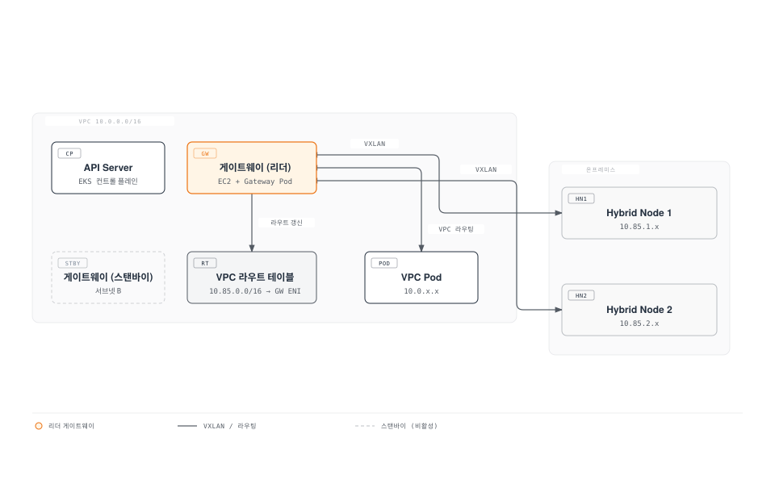
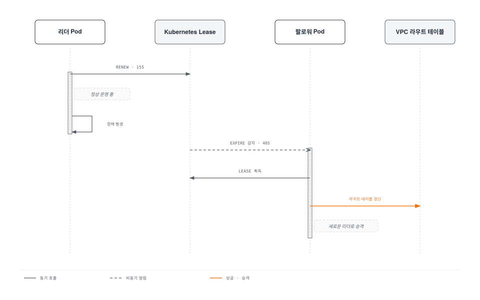
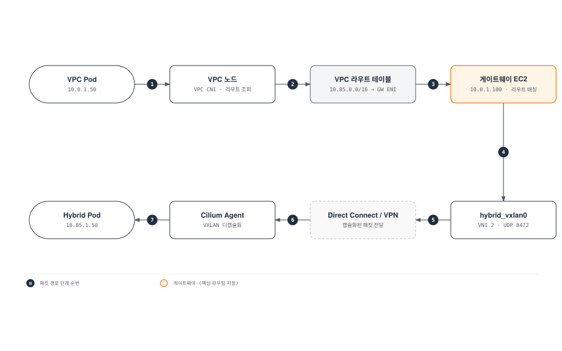
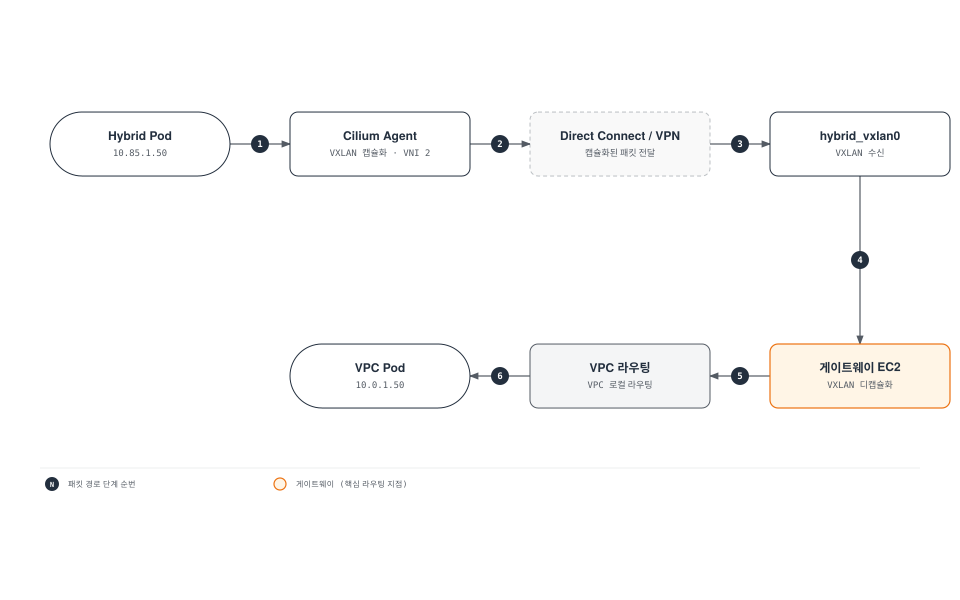
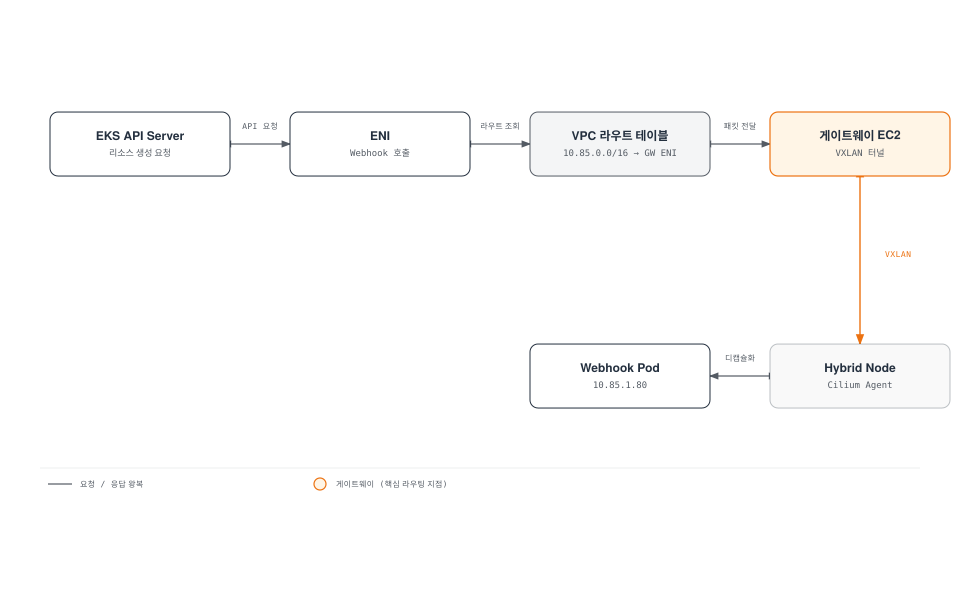
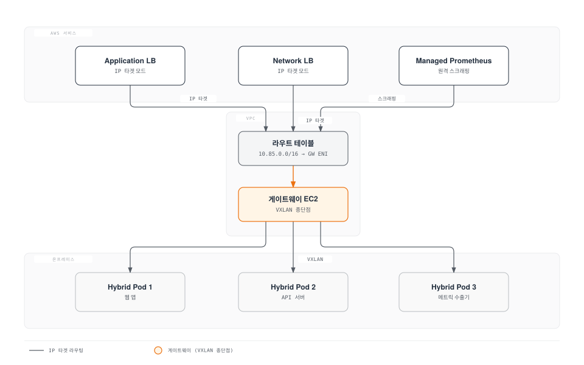
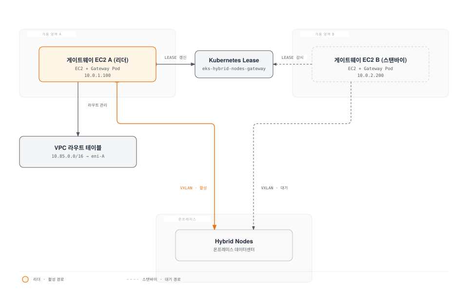

# EKS Hybrid Nodes Gateway

< [이전: 베어메탈 서버 OS 설치](./09-bare-metal-os-setup.md) | [목차](./README.md) >

> **지원 버전**: EKS 1.31+
> **마지막 업데이트**: 2026년 6월 28일

이 문서에서는 EKS Hybrid Nodes Gateway의 아키텍처, 설치, 구성, 운영 방법을 다룹니다. Hybrid Nodes Gateway는 EKS 클러스터 VPC의 Pod와 온프레미스 Hybrid Node의 Pod 간 네트워크 연결을 VXLAN 터널로 자동화하는 오픈소스 솔루션입니다.

---

## 개요 및 학습 목표

### EKS Hybrid Nodes Gateway란?

EKS Hybrid Nodes Gateway는 **2026년 4월 21일 정식 출시(GA)** 된 오픈소스 프로젝트로, EKS 클러스터의 VPC 네트워크와 온프레미스 Hybrid Nodes의 Kubernetes Pod 네트워크 간 라우팅 가능한 연결을 자동으로 구성합니다.

핵심 원리는 간단합니다: EC2 인스턴스에서 실행되는 게이트웨이 Pod가 VXLAN 터널을 통해 온프레미스 Cilium 노드와 직접 연결되고, VPC 라우트 테이블을 자동으로 업데이트하여 양방향 Pod-to-Pod 통신을 가능하게 합니다.

**GitHub**: [github.com/aws/eks-hybrid-nodes-gateway](https://github.com/aws/eks-hybrid-nodes-gateway)

### 학습 목표

이 문서를 완료하면 다음을 이해하고 수행할 수 있습니다:

1. Hybrid Nodes Gateway의 아키텍처와 VXLAN 터널링 메커니즘 이해
2. Cilium VTEP(Virtual Tunnel Endpoint)와 CiliumVTEPConfig CRD 구성
3. Helm 차트를 사용한 게이트웨이 설치 및 구성
4. IAM 역할 및 보안 그룹 설정
5. VPC Pod에서 Hybrid Pod로, Hybrid Pod에서 VPC Pod로의 트래픽 흐름 이해
6. 고가용성 구성 및 페일오버 메커니즘 운영
7. 모니터링, 트러블슈팅, 업그레이드 수행
8. 기존 수동 라우팅 방식에서 게이트웨이 방식으로 마이그레이션

### 왜 Hybrid Nodes Gateway가 필요한가?

기존 EKS Hybrid Nodes 환경에서 VPC Pod와 온프레미스 Pod 간 직접 통신을 위해서는 다음과 같은 수동 작업이 필요했습니다:

| 과제 | 기존 수동 방식 | Gateway 방식 |
|------|---------------|-------------|
| Pod CIDR 라우팅 | VPN/Direct Connect + 수동 정적 라우트 관리 | VXLAN 터널로 자동화 |
| VPC 라우트 테이블 | 수동으로 라우트 추가/삭제 관리 | 게이트웨이가 자동 프로그래밍 |
| 노드 추가/삭제 시 | BGP 또는 수동 라우트 업데이트 필요 | 자동 감지 및 업데이트 |
| 웹훅 연결 | 복잡한 네트워크 경로 설정 필요 | 터널을 통해 자동 연결 |
| 비용 | VPN 장비 + 관리 인력 | EC2 인스턴스 비용만 발생 (추가 요금 없음) |
| 복잡도 | BGP 구성, 방화벽 규칙, NAT 등 | Helm 차트 하나로 설치 |

> **핵심 가치**: Hybrid Nodes Gateway는 추가 요금 없이 사용 가능한 오픈소스 프로젝트입니다. EC2 인스턴스 실행 비용만 발생합니다.

---

## 아키텍처 심층 분석

### 전체 아키텍처 개요



### 핵심 구성 요소 상세

#### 1. EC2 게이트웨이 노드

게이트웨이는 EC2 인스턴스에서 실행되는 Kubernetes Pod입니다. 이 인스턴스는 다음과 같은 특별한 요구 사항을 갖습니다:

- **소스/대상 확인 비활성화**: EC2 인스턴스의 소스/대상 확인(source/destination check)을 비활성화해야 합니다. 이는 인스턴스가 자신이 소스나 대상이 아닌 트래픽을 전달하는 라우터 역할을 하기 때문입니다.
- **VPC CNI**: EC2 인스턴스는 VPC CNI를 사용하여 VPC 네트워크에 직접 참여합니다.
- **프라이빗 연결**: Direct Connect 또는 VPN을 통해 온프레미스 네트워크와 연결됩니다.

```yaml
# EC2 게이트웨이 노드 레이블
apiVersion: v1
kind: Node
metadata:
  labels:
    # 게이트웨이 Pod를 이 노드에 스케줄링하기 위한 레이블
    eks.amazonaws.com/hybrid-nodes-gateway: "true"
    node.kubernetes.io/instance-type: "c5.xlarge"
    topology.kubernetes.io/zone: "ap-northeast-2a"
```

#### 2. VXLAN 터널 인터페이스 (hybrid_vxlan0)

게이트웨이 Pod는 `hybrid_vxlan0`이라는 VXLAN 인터페이스를 생성합니다:

| 속성 | 값 | 설명 |
|------|-----|------|
| 인터페이스 이름 | `hybrid_vxlan0` | 게이트웨이 측 VXLAN 인터페이스 |
| VNI (VXLAN Network Identifier) | 2 | Cilium VTEP의 기본 VNI와 일치 |
| UDP 포트 | 8472 | VXLAN 캡슐화를 위한 UDP 포트 |
| MTU | 호스트 MTU - 50 | VXLAN 오버헤드 고려 |

```bash
# 게이트웨이 Pod 내에서 VXLAN 인터페이스 확인
ip link show hybrid_vxlan0
# 출력 예시:
# 4: hybrid_vxlan0: <BROADCAST,MULTICAST,UP,LOWER_UP> mtu 8950 qdisc noqueue state UNKNOWN
#     link/ether 02:00:0a:00:01:05 brd ff:ff:ff:ff:ff:ff
#     vxlan id 2 srcport 0 0 dstport 8472 nolearning l2miss l3miss

# VXLAN 인터페이스 IP 확인
ip addr show hybrid_vxlan0
# 출력 예시:
# 4: hybrid_vxlan0: <BROADCAST,MULTICAST,UP,LOWER_UP> mtu 8950
#     inet 10.0.1.5/32 scope global hybrid_vxlan0
```

#### 3. FDB 엔트리, ARP 엔트리, 라우트 프로그래밍

게이트웨이는 각 Hybrid Node에 대해 세 가지 종류의 네트워크 엔트리를 관리합니다:

**FDB (Forwarding Database) 엔트리**: VXLAN 터널의 원격 엔드포인트를 정의합니다.

```bash
# FDB 엔트리 확인 - 각 Hybrid Node의 Cilium MAC과 IP 매핑
bridge fdb show dev hybrid_vxlan0
# 출력 예시:
# 02:00:0a:55:01:01 dst 192.168.10.101 self permanent  (Hybrid Node 1)
# 02:00:0a:55:02:01 dst 192.168.10.102 self permanent  (Hybrid Node 2)
```

**ARP 엔트리**: VXLAN 터널 내에서 IP-to-MAC 매핑을 제공합니다.

```bash
# ARP 엔트리 확인
ip neigh show dev hybrid_vxlan0
# 출력 예시:
# 10.85.1.0 lladdr 02:00:0a:55:01:01 PERMANENT  (Hybrid Node 1의 Cilium IP)
# 10.85.2.0 lladdr 02:00:0a:55:02:01 PERMANENT  (Hybrid Node 2의 Cilium IP)
```

**라우트 엔트리**: Hybrid Pod CIDR에 대한 라우팅 경로를 정의합니다.

```bash
# 라우트 엔트리 확인
ip route show dev hybrid_vxlan0
# 출력 예시:
# 10.85.1.0/24 via 10.85.1.0 dev hybrid_vxlan0  (Hybrid Node 1의 Pod CIDR)
# 10.85.2.0/24 via 10.85.2.0 dev hybrid_vxlan0  (Hybrid Node 2의 Pod CIDR)
```

이 세 가지 엔트리가 함께 작동하여 다음과 같은 패킷 처리 파이프라인을 구성합니다:

```
VPC Pod → 패킷 도착 (dst: 10.85.1.5)
  → 라우트 조회: 10.85.1.0/24 via 10.85.1.0 dev hybrid_vxlan0
  → ARP 조회: 10.85.1.0 → MAC 02:00:0a:55:01:01
  → FDB 조회: 02:00:0a:55:01:01 → 192.168.10.101 (Hybrid Node 1 IP)
  → VXLAN 캡슐화 (VNI 2, UDP 8472)
  → 전송: 192.168.10.101:8472
```

#### 4. CiliumVTEPConfig: 게이트웨이를 원격 VTEP로 등록

Cilium 측에서는 `CiliumVTEPConfig` CRD를 사용하여 EC2 게이트웨이를 원격 VTEP(Virtual Tunnel Endpoint)로 등록합니다. 이를 통해 Hybrid Node의 Cilium 에이전트가 VPC Pod로 향하는 트래픽을 VXLAN 터널을 통해 게이트웨이로 전달합니다.

```yaml
apiVersion: cilium.io/v1alpha1
kind: CiliumVTEPConfig
metadata:
  name: cilium-vtep-config
spec:
  vteps:
    # 게이트웨이 EC2 인스턴스의 프라이빗 IP
    - externalNode: "10.0.1.5"
      # 게이트웨이 VXLAN 인터페이스의 MAC 주소
      mac: "82:36:6c:89:e6:ad"
      # 게이트웨이가 담당하는 CIDR (VPC CIDR)
      cidrs:
        - "10.0.0.0/16"
```

> **자동 관리**: Hybrid Nodes Gateway가 이 CRD를 자동으로 생성하고 업데이트합니다. 수동으로 CiliumVTEPConfig를 만들 필요는 없지만, 구조를 이해하는 것은 트러블슈팅에 중요합니다.

#### 5. Lease 기반 리더 선출

게이트웨이는 **Deployment**로 배포되며, 기본적으로 **2개의 레플리카**로 구성됩니다. Kubernetes Lease 오브젝트를 사용한 리더 선출 메커니즘을 통해 한 번에 하나의 Pod만 활성(리더) 상태로 동작합니다.

```yaml
# Lease 오브젝트 확인
kubectl get lease -n eks-hybrid-nodes-gateway
# 출력 예시:
# NAME                        HOLDER                                  AGE
# eks-hybrid-nodes-gateway    eks-hybrid-nodes-gateway-pod-abc123     5d
```

리더 Pod의 역할:
- VXLAN 터널 관리 (FDB, ARP, 라우트 프로그래밍)
- VPC 라우트 테이블 업데이트
- CiliumVTEPConfig CRD 관리
- Hybrid Node 목록 감시 (Watch)

팔로워 Pod의 역할:
- 대기 상태 유지
- 리더 장애 시 즉시 인계 준비
- Lease 갱신 모니터링



Lease 관련 주요 파라미터:

| 파라미터 | 기본값 | 설명 |
|---------|--------|------|
| leaseDuration | 40s | Lease 유효 기간 |
| renewDeadline | 30s | 리더가 갱신해야 하는 최대 시간 |
| retryPeriod | 15s | Lease 획득 재시도 간격 |

#### 6. VPC 라우트 테이블 자동 관리

게이트웨이의 리더 Pod는 VPC 라우트 테이블을 자동으로 관리합니다:

```
VPC 라우트 테이블 (rtb-0abc123456789def0):
┌────────────────────┬────────────────────────────────┐
│ Destination        │ Target                         │
├────────────────────┼────────────────────────────────┤
│ 10.0.0.0/16        │ local                          │
│ 10.85.0.0/16       │ eni-0abc... (게이트웨이 ENI)    │
│ 0.0.0.0/0          │ igw-0xyz...                    │
└────────────────────┴────────────────────────────────┘
```

게이트웨이는 `routeTableIDs` 값에 지정된 모든 라우트 테이블에 대해:
1. Hybrid Pod CIDR(`podCIDRs`)에 대한 라우트를 게이트웨이 EC2 인스턴스의 ENI로 설정
2. 리더 변경 시 새 리더의 ENI로 라우트 업데이트
3. 클러스터 삭제 시 관련 라우트 정리 (Helm 언인스톨 시)

---

## 사전 요구 사항

### 클러스터 요구 사항

| 요구 사항 | 최소 버전 / 조건 | 비고 |
|-----------|-----------------|------|
| EKS 클러스터 | 1.31+ | Hybrid Nodes 기능 활성화 필수 |
| Hybrid Nodes | 1개 이상 등록됨 | Cilium CNI 실행 중 |
| Cilium CNI | 1.16+ (권장) | VTEP 기능 활성화 필수 |
| VPC CNI | 최신 버전 | 클라우드 노드에서 사용 |
| kubectl | 1.31+ | 클러스터 관리 도구 |
| Helm | 3.12+ | 게이트웨이 설치에 사용 |

### 네트워크 요구 사항

#### 프라이빗 연결

온프레미스 네트워크와 AWS VPC 간 프라이빗 연결이 필수입니다:

| 연결 방식 | 대역폭 | 지연 시간 | 비용 | 적합한 환경 |
|-----------|--------|----------|------|------------|
| AWS Direct Connect | 1-100 Gbps | < 5ms | 높음 | 프로덕션 대규모 환경 |
| Site-to-Site VPN | ~1.25 Gbps/터널 | 가변적 | 낮음 | 개발/소규모 환경 |
| Direct Connect + VPN | 1-100 Gbps | < 5ms | 높음 | 최고 보안 요구 환경 |

#### EC2 인스턴스

게이트웨이를 실행할 EC2 인스턴스 요구 사항:

```
권장 인스턴스 타입:
┌──────────────┬──────────┬──────────┬──────────────────────────┐
│ 인스턴스 타입 │ vCPU     │ 메모리    │ 적합한 환경              │
├──────────────┼──────────┼──────────┼──────────────────────────┤
│ c5.large     │ 2        │ 4 GiB    │ 개발/테스트 (< 10 노드)  │
│ c5.xlarge    │ 4        │ 8 GiB    │ 소규모 프로덕션 (< 50)   │
│ c5.2xlarge   │ 8        │ 16 GiB   │ 대규모 프로덕션 (< 200)  │
│ c5n.xlarge   │ 4        │ 10.5 GiB │ 고대역폭 필요 시         │
└──────────────┴──────────┴──────────┴──────────────────────────┘
```

> **중요**: EC2 인스턴스의 **소스/대상 확인(Source/Destination Check)**을 반드시 비활성화해야 합니다. 게이트웨이가 라우터 역할을 하므로 자신이 소스/대상이 아닌 패킷도 전달해야 하기 때문입니다.

```bash
# 소스/대상 확인 비활성화 (AWS CLI)
aws ec2 modify-instance-attribute \
  --instance-id i-0abc123456789def0 \
  --source-dest-check '{"Value": false}'

# 확인
aws ec2 describe-instance-attribute \
  --instance-id i-0abc123456789def0 \
  --attribute sourceDestCheck
```

#### 보안 그룹

게이트웨이 EC2 인스턴스에 적용할 보안 그룹 규칙:

```
인바운드 규칙:
┌──────────┬──────────┬────────────────────┬──────────────────────────┐
│ 포트     │ 프로토콜 │ 소스               │ 용도                     │
├──────────┼──────────┼────────────────────┼──────────────────────────┤
│ 8472     │ UDP      │ 온프레미스 CIDR    │ VXLAN 터널 (Hybrid→GW)   │
│ 10250    │ TCP      │ EKS 컨트롤 플레인  │ kubelet 통신             │
│ 443      │ TCP      │ VPC CIDR           │ HTTPS (선택사항)         │
│ 전체     │ 전체     │ VPC CIDR           │ VPC 내부 통신            │
└──────────┴──────────┴────────────────────┴──────────────────────────┘

아웃바운드 규칙:
┌──────────┬──────────┬────────────────────┬──────────────────────────┐
│ 포트     │ 프로토콜 │ 대상               │ 용도                     │
├──────────┼──────────┼────────────────────┼──────────────────────────┤
│ 8472     │ UDP      │ 온프레미스 CIDR    │ VXLAN 터널 (GW→Hybrid)   │
│ 443      │ TCP      │ 0.0.0.0/0          │ EKS API, ECR 등          │
│ 전체     │ 전체     │ VPC CIDR           │ VPC 내부 통신            │
└──────────┴──────────┴────────────────────┴──────────────────────────┘
```

```bash
# 보안 그룹 생성 (AWS CLI)
SECURITY_GROUP_ID=$(aws ec2 create-security-group \
  --group-name eks-hybrid-gateway-sg \
  --description "Security group for EKS Hybrid Nodes Gateway" \
  --vpc-id vpc-0abc123456789def0 \
  --query 'GroupId' --output text)

# VXLAN 인바운드 규칙 추가
aws ec2 authorize-security-group-ingress \
  --group-id $SECURITY_GROUP_ID \
  --protocol udp \
  --port 8472 \
  --cidr 192.168.0.0/16

# VPC 내부 통신 허용
aws ec2 authorize-security-group-ingress \
  --group-id $SECURITY_GROUP_ID \
  --protocol -1 \
  --cidr 10.0.0.0/16

# VXLAN 아웃바운드 규칙 추가
aws ec2 authorize-security-group-egress \
  --group-id $SECURITY_GROUP_ID \
  --protocol udp \
  --port 8472 \
  --cidr 192.168.0.0/16

echo "보안 그룹 ID: $SECURITY_GROUP_ID"
```

#### 온프레미스 방화벽 규칙

온프레미스 네트워크 방화벽에서 다음 규칙을 허용해야 합니다:

| 방향 | 프로토콜 | 포트 | 소스 | 대상 | 용도 |
|------|---------|------|------|------|------|
| 인바운드 | UDP | 8472 | 게이트웨이 EC2 IP | Hybrid Node IP | VXLAN 터널 수신 |
| 아웃바운드 | UDP | 8472 | Hybrid Node IP | 게이트웨이 EC2 IP | VXLAN 터널 송신 |
| 양방향 | TCP | 443 | Hybrid Node IP | VPC CIDR | API 서버 통신 |
| 양방향 | TCP | 10250 | VPC CIDR | Hybrid Node IP | kubelet 통신 |

---

## IAM 구성

### 필요 권한

게이트웨이 Pod는 다음 AWS API를 호출하므로 적절한 IAM 권한이 필요합니다:

```json
{
  "Version": "2012-10-17",
  "Statement": [
    {
      "Sid": "EC2DescribePermissions",
      "Effect": "Allow",
      "Action": [
        "ec2:DescribeRouteTables",
        "ec2:DescribeInstances",
        "ec2:DescribeNetworkInterfaces",
        "ec2:DescribeSubnets",
        "ec2:DescribeVpcs"
      ],
      "Resource": "*"
    },
    {
      "Sid": "EC2RouteManagement",
      "Effect": "Allow",
      "Action": [
        "ec2:CreateRoute",
        "ec2:ReplaceRoute",
        "ec2:DeleteRoute"
      ],
      "Resource": "arn:aws:ec2:*:*:route-table/*",
      "Condition": {
        "StringEquals": {
          "aws:ResourceTag/kubernetes.io/cluster/<CLUSTER_NAME>": "owned"
        }
      }
    },
    {
      "Sid": "EC2ModifyInstanceAttribute",
      "Effect": "Allow",
      "Action": [
        "ec2:ModifyInstanceAttribute"
      ],
      "Resource": "arn:aws:ec2:*:*:instance/*",
      "Condition": {
        "StringEquals": {
          "aws:ResourceTag/kubernetes.io/cluster/<CLUSTER_NAME>": "owned"
        }
      }
    }
  ]
}
```

### IAM 역할 생성 (AWS CLI)

```bash
# 변수 설정
CLUSTER_NAME="my-hybrid-cluster"
ACCOUNT_ID=$(aws sts get-caller-identity --query Account --output text)
REGION="ap-northeast-2"
OIDC_PROVIDER=$(aws eks describe-cluster \
  --name $CLUSTER_NAME \
  --query "cluster.identity.oidc.issuer" \
  --output text | sed 's|https://||')

# 신뢰 정책 생성 (IRSA 사용)
cat > /tmp/trust-policy.json << EOF
{
  "Version": "2012-10-17",
  "Statement": [
    {
      "Effect": "Allow",
      "Principal": {
        "Federated": "arn:aws:iam::${ACCOUNT_ID}:oidc-provider/${OIDC_PROVIDER}"
      },
      "Action": "sts:AssumeRoleWithWebIdentity",
      "Condition": {
        "StringEquals": {
          "${OIDC_PROVIDER}:sub": "system:serviceaccount:eks-hybrid-nodes-gateway:eks-hybrid-nodes-gateway",
          "${OIDC_PROVIDER}:aud": "sts.amazonaws.com"
        }
      }
    }
  ]
}
EOF

# IAM 역할 생성
aws iam create-role \
  --role-name EKSHybridNodesGatewayRole \
  --assume-role-policy-document file:///tmp/trust-policy.json

# 인라인 정책 연결
cat > /tmp/gateway-policy.json << 'EOF'
{
  "Version": "2012-10-17",
  "Statement": [
    {
      "Sid": "EC2DescribePermissions",
      "Effect": "Allow",
      "Action": [
        "ec2:DescribeRouteTables",
        "ec2:DescribeInstances",
        "ec2:DescribeNetworkInterfaces",
        "ec2:DescribeSubnets",
        "ec2:DescribeVpcs"
      ],
      "Resource": "*"
    },
    {
      "Sid": "EC2RouteManagement",
      "Effect": "Allow",
      "Action": [
        "ec2:CreateRoute",
        "ec2:ReplaceRoute",
        "ec2:DeleteRoute"
      ],
      "Resource": "*"
    },
    {
      "Sid": "EC2ModifyInstanceAttribute",
      "Effect": "Allow",
      "Action": [
        "ec2:ModifyInstanceAttribute"
      ],
      "Resource": "*"
    }
  ]
}
EOF

aws iam put-role-policy \
  --role-name EKSHybridNodesGatewayRole \
  --policy-name HybridNodesGatewayPolicy \
  --policy-document file:///tmp/gateway-policy.json

echo "IAM 역할 ARN: arn:aws:iam::${ACCOUNT_ID}:role/EKSHybridNodesGatewayRole"
```

### Terraform을 사용한 IAM 구성

```hcl
# terraform/iam.tf

# OIDC 프로바이더 데이터
data "aws_eks_cluster" "cluster" {
  name = var.cluster_name
}

data "aws_iam_openid_connect_provider" "oidc" {
  url = data.aws_eks_cluster.cluster.identity[0].oidc[0].issuer
}

# IAM 역할
resource "aws_iam_role" "hybrid_gateway" {
  name = "${var.cluster_name}-hybrid-nodes-gateway"

  assume_role_policy = jsonencode({
    Version = "2012-10-17"
    Statement = [
      {
        Effect = "Allow"
        Principal = {
          Federated = data.aws_iam_openid_connect_provider.oidc.arn
        }
        Action = "sts:AssumeRoleWithWebIdentity"
        Condition = {
          StringEquals = {
            "${replace(data.aws_eks_cluster.cluster.identity[0].oidc[0].issuer, "https://", "")}:sub" = "system:serviceaccount:eks-hybrid-nodes-gateway:eks-hybrid-nodes-gateway"
            "${replace(data.aws_eks_cluster.cluster.identity[0].oidc[0].issuer, "https://", "")}:aud" = "sts.amazonaws.com"
          }
        }
      }
    ]
  })

  tags = {
    "kubernetes.io/cluster/${var.cluster_name}" = "owned"
    Environment                                  = var.environment
  }
}

# IAM 정책
resource "aws_iam_role_policy" "hybrid_gateway" {
  name = "hybrid-nodes-gateway-policy"
  role = aws_iam_role.hybrid_gateway.id

  policy = jsonencode({
    Version = "2012-10-17"
    Statement = [
      {
        Sid    = "EC2DescribePermissions"
        Effect = "Allow"
        Action = [
          "ec2:DescribeRouteTables",
          "ec2:DescribeInstances",
          "ec2:DescribeNetworkInterfaces",
          "ec2:DescribeSubnets",
          "ec2:DescribeVpcs"
        ]
        Resource = "*"
      },
      {
        Sid    = "EC2RouteManagement"
        Effect = "Allow"
        Action = [
          "ec2:CreateRoute",
          "ec2:ReplaceRoute",
          "ec2:DeleteRoute"
        ]
        Resource = "arn:aws:ec2:${var.region}:${data.aws_caller_identity.current.account_id}:route-table/*"
        Condition = {
          StringEquals = {
            "aws:ResourceTag/kubernetes.io/cluster/${var.cluster_name}" = "owned"
          }
        }
      },
      {
        Sid    = "EC2ModifyInstanceAttribute"
        Effect = "Allow"
        Action = [
          "ec2:ModifyInstanceAttribute"
        ]
        Resource = "arn:aws:ec2:${var.region}:${data.aws_caller_identity.current.account_id}:instance/*"
        Condition = {
          StringEquals = {
            "aws:ResourceTag/kubernetes.io/cluster/${var.cluster_name}" = "owned"
          }
        }
      }
    ]
  })
}

data "aws_caller_identity" "current" {}

# 출력
output "gateway_role_arn" {
  value       = aws_iam_role.hybrid_gateway.arn
  description = "Hybrid Nodes Gateway IAM 역할 ARN"
}
```

---

## 설치 및 구성

### Helm 차트 설치

#### 기본 설치

```bash
# Helm 차트 설치 (OCI 레지스트리에서)
helm install eks-hybrid-nodes-gateway \
  oci://public.ecr.aws/eks/eks-hybrid-nodes-gateway \
  --version 1.0.0 \
  --namespace eks-hybrid-nodes-gateway \
  --create-namespace \
  --set vpcCIDR=10.0.0.0/16 \
  --set podCIDRs='{10.85.0.0/16}' \
  --set routeTableIDs='{rtb-0abc123456789def0}' \
  --set serviceAccount.annotations."eks\.amazonaws\.com/role-arn"="arn:aws:iam::111122223333:role/EKSHybridNodesGatewayRole"
```

#### 전체 values.yaml 예제

```yaml
# values.yaml - EKS Hybrid Nodes Gateway 전체 구성

# VPC CIDR - EKS 클러스터가 위치한 VPC의 CIDR
vpcCIDR: "10.0.0.0/16"

# Pod CIDR - 온프레미스 Hybrid Node의 Pod CIDR
# 여러 CIDR을 지정할 수 있음
podCIDRs:
  - "10.85.0.0/16"

# VPC 라우트 테이블 ID
# 게이트웨이가 라우트를 프로그래밍할 라우트 테이블
# 프라이빗 서브넷의 라우트 테이블을 지정
routeTableIDs:
  - "rtb-0abc123456789def0"
  - "rtb-0def456789abc1230"  # Multi-AZ인 경우 추가 서브넷 라우트 테이블

# 레플리카 수 (고가용성을 위해 최소 2)
replicaCount: 2

# 리소스 요청/제한
resources:
  requests:
    cpu: "100m"
    memory: "128Mi"
  limits:
    cpu: "500m"
    memory: "512Mi"

# 노드 셀렉터 - 게이트웨이를 실행할 EC2 노드 지정
nodeSelector:
  eks.amazonaws.com/hybrid-nodes-gateway: "true"

# 토폴로지 분산 제약 - Multi-AZ 분산
topologySpreadConstraints:
  - maxSkew: 1
    topologyKey: topology.kubernetes.io/zone
    whenUnsatisfiable: DoNotSchedule
    labelSelector:
      matchLabels:
        app.kubernetes.io/name: eks-hybrid-nodes-gateway

# Pod 안티어피니티 - 같은 노드에 스케줄링 방지
affinity:
  podAntiAffinity:
    requiredDuringSchedulingIgnoredDuringExecution:
      - labelSelector:
          matchExpressions:
            - key: app.kubernetes.io/name
              operator: In
              values:
                - eks-hybrid-nodes-gateway
        topologyKey: kubernetes.io/hostname

# 서비스 어카운트 설정
serviceAccount:
  create: true
  name: eks-hybrid-nodes-gateway
  annotations:
    # IRSA (IAM Roles for Service Accounts) 설정
    eks.amazonaws.com/role-arn: "arn:aws:iam::111122223333:role/EKSHybridNodesGatewayRole"

# 리더 선출 설정
leaderElection:
  enabled: true
  leaseDuration: 40s
  renewDeadline: 30s
  retryPeriod: 15s

# 로깅 레벨
logLevel: "info"  # debug, info, warn, error

# 프로메테우스 메트릭 설정
metrics:
  enabled: true
  port: 8080
  serviceMonitor:
    enabled: true
    namespace: monitoring
    interval: 30s

# 보안 컨텍스트
securityContext:
  capabilities:
    add:
      - NET_ADMIN    # 네트워크 인터페이스, 라우트 관리에 필요
      - NET_RAW      # VXLAN 패킷 처리에 필요
    drop:
      - ALL
  privileged: false
  readOnlyRootFilesystem: true

# Pod 보안 컨텍스트
podSecurityContext:
  runAsNonRoot: false  # 네트워크 설정을 위해 root 권한 필요
  fsGroup: 65534

# 톨러레이션 (필요시)
tolerations: []

# 추가 환경 변수
extraEnv: []

# 추가 볼륨
extraVolumes: []
extraVolumeMounts: []
```

#### 설치 및 검증

```bash
# 1. 네임스페이스 생성
kubectl create namespace eks-hybrid-nodes-gateway

# 2. Helm 설치
helm install eks-hybrid-nodes-gateway \
  oci://public.ecr.aws/eks/eks-hybrid-nodes-gateway \
  --version 1.0.0 \
  --namespace eks-hybrid-nodes-gateway \
  -f values.yaml

# 3. Pod 상태 확인
kubectl get pods -n eks-hybrid-nodes-gateway
# 출력 예시:
# NAME                                          READY   STATUS    RESTARTS   AGE
# eks-hybrid-nodes-gateway-7b8c9d4e5f-abc12     1/1     Running   0          2m
# eks-hybrid-nodes-gateway-7b8c9d4e5f-def34     1/1     Running   0          2m

# 4. 리더 Pod 확인
kubectl get lease -n eks-hybrid-nodes-gateway
# 출력 예시:
# NAME                        HOLDER                                           AGE
# eks-hybrid-nodes-gateway    eks-hybrid-nodes-gateway-7b8c9d4e5f-abc12        2m

# 5. 로그 확인 (리더 Pod)
kubectl logs -n eks-hybrid-nodes-gateway \
  $(kubectl get lease eks-hybrid-nodes-gateway -n eks-hybrid-nodes-gateway -o jsonpath='{.spec.holderIdentity}') \
  --tail=50

# 6. VPC 라우트 테이블 확인
aws ec2 describe-route-tables \
  --route-table-ids rtb-0abc123456789def0 \
  --query "RouteTables[0].Routes[?DestinationCidrBlock=='10.85.0.0/16']"
```

### 노드 레이블링

게이트웨이 Pod가 올바른 EC2 노드에 스케줄링되도록 노드에 레이블을 추가합니다:

```bash
# 게이트웨이 전용 EC2 노드에 레이블 추가
kubectl label node ip-10-0-1-100.ap-northeast-2.compute.internal \
  eks.amazonaws.com/hybrid-nodes-gateway=true

kubectl label node ip-10-0-2-200.ap-northeast-2.compute.internal \
  eks.amazonaws.com/hybrid-nodes-gateway=true

# 레이블 확인
kubectl get nodes -l eks.amazonaws.com/hybrid-nodes-gateway=true
```

> **참고**: 게이트웨이 전용 노드를 별도로 운영하는 것이 권장됩니다. 다른 워크로드와 리소스 경합을 방지하고, 보안 그룹을 최소 권한으로 구성할 수 있습니다.

---

## CNI 구성

### Cilium VTEP 활성화

Hybrid Nodes에서 실행되는 Cilium에 VTEP(Virtual Tunnel Endpoint) 기능을 활성화해야 합니다. VTEP는 Cilium이 외부 VTEP(게이트웨이)와 VXLAN 터널을 통해 통신할 수 있게 합니다.

#### Cilium Helm 값에서 VTEP 활성화

```yaml
# cilium-values.yaml
vtep:
  enabled: true
  # VTEP 엔드포인트 설정은 CiliumVTEPConfig CRD로 관리됨
  # 게이트웨이가 자동으로 CRD를 생성/업데이트함

# 추가 권장 설정
tunnel: "disabled"  # 네이티브 라우팅 모드 사용
autoDirectNodeRoutes: true
ipam:
  mode: "cluster-pool"
  operator:
    clusterPoolIPv4PodCIDRList:
      - "10.85.0.0/16"
    clusterPoolIPv4MaskSize: 24

# Hybrid Nodes 전용 설정
enableIPv4Masquerade: true
bpf:
  masquerade: true

# VTEP 관련 eBPF 맵 설정
# Cilium이 VTEP 엔드포인트 정보를 eBPF 맵에 저장
vtepEndpoint: ""  # CiliumVTEPConfig CRD로 관리
vtepCIDR: ""      # CiliumVTEPConfig CRD로 관리
vtepMAC: ""       # CiliumVTEPConfig CRD로 관리
```

#### Cilium 설치/업데이트

```bash
# Cilium 설치 (Hybrid Nodes에서)
helm upgrade --install cilium cilium/cilium \
  --version 1.16.5 \
  --namespace kube-system \
  -f cilium-values.yaml

# Cilium 상태 확인
cilium status

# VTEP 설정 확인
cilium vtep list
```

### VPC CNI 구성

클라우드 노드에서는 VPC CNI가 사용됩니다. 특별한 추가 구성은 필요하지 않지만, 다음 사항을 확인해야 합니다:

```yaml
# VPC CNI 설정 확인
apiVersion: v1
kind: ConfigMap
metadata:
  name: amazon-vpc-cni
  namespace: kube-system
data:
  # Pod에 VPC 서브넷 IP를 할당
  enable-prefix-delegation: "true"
  warm-prefix-target: "1"
```

```bash
# VPC CNI DaemonSet 상태 확인
kubectl get daemonset aws-node -n kube-system

# VPC CNI 설정 확인
kubectl get configmap amazon-vpc-cni -n kube-system -o yaml
```

### CiliumVTEPConfig CRD 상세

게이트웨이가 자동으로 생성하는 CiliumVTEPConfig CRD의 구조:

```yaml
apiVersion: cilium.io/v1alpha1
kind: CiliumVTEPConfig
metadata:
  name: cilium-vtep-config
  labels:
    app.kubernetes.io/managed-by: eks-hybrid-nodes-gateway
spec:
  vteps:
    # 활성 게이트웨이(리더)의 정보
    - externalNode: "10.0.1.100"      # 게이트웨이 EC2 인스턴스의 프라이빗 IP
      mac: "82:36:6c:89:e6:ad"         # 게이트웨이 VXLAN 인터페이스의 MAC
      cidrs:
        - "10.0.0.0/16"               # VPC CIDR (이 CIDR로 향하는 트래픽을 터널로 전달)
```

```bash
# CiliumVTEPConfig 확인
kubectl get ciliumvtepconfig -o yaml

# Cilium 에이전트에서 VTEP 설정이 적용되었는지 확인
kubectl exec -n kube-system ds/cilium -- cilium bpf vtep list
# 출력 예시:
# IP               MAC                TUNNEL ENDPOINT
# 10.0.0.0/16      82:36:6c:89:e6:ad  10.0.1.100
```

### CNI 구성 검증 체크리스트

```bash
#!/bin/bash
# verify-cni-config.sh - CNI 구성 검증 스크립트

echo "=== 1. Cilium VTEP 상태 확인 ==="
kubectl exec -n kube-system ds/cilium -- cilium vtep list

echo ""
echo "=== 2. CiliumVTEPConfig CRD 확인 ==="
kubectl get ciliumvtepconfig -o jsonpath='{.items[0].spec.vteps}' | jq .

echo ""
echo "=== 3. VPC CNI 상태 확인 ==="
kubectl get daemonset aws-node -n kube-system -o wide

echo ""
echo "=== 4. Cilium 건강 상태 확인 ==="
kubectl exec -n kube-system ds/cilium -- cilium status --brief

echo ""
echo "=== 5. VXLAN 터널 연결 상태 확인 ==="
# 게이트웨이 Pod에서 확인
GW_POD=$(kubectl get pods -n eks-hybrid-nodes-gateway -l app.kubernetes.io/name=eks-hybrid-nodes-gateway -o jsonpath='{.items[0].metadata.name}')
kubectl exec -n eks-hybrid-nodes-gateway $GW_POD -- ip link show hybrid_vxlan0

echo ""
echo "=== 6. FDB 엔트리 확인 ==="
kubectl exec -n eks-hybrid-nodes-gateway $GW_POD -- bridge fdb show dev hybrid_vxlan0

echo ""
echo "=== 7. 라우트 테이블 확인 ==="
kubectl exec -n eks-hybrid-nodes-gateway $GW_POD -- ip route show dev hybrid_vxlan0
```

---

## 트래픽 흐름 패턴

### 패턴 1: VPC Pod에서 Hybrid Pod로



**상세 흐름:**

1. VPC Pod(10.0.1.50)가 Hybrid Pod(10.85.1.50)로 패킷을 전송
2. VPC CNI가 패킷을 VPC 네트워크로 라우팅
3. VPC 라우트 테이블에서 `10.85.0.0/16 → eni-게이트웨이` 규칙에 의해 게이트웨이 EC2로 전달
4. 게이트웨이의 커널 라우트 테이블에서 `10.85.1.0/24 via hybrid_vxlan0` 매칭
5. hybrid_vxlan0 인터페이스에서 VXLAN 캡슐화 (VNI 2, UDP 8472)
6. 캡슐화된 패킷이 Direct Connect/VPN을 통해 온프레미스로 전달
7. Hybrid Node의 Cilium이 VXLAN 패킷을 수신하고 디캡슐화
8. 원본 패킷이 대상 Hybrid Pod로 전달

### 패턴 2: Hybrid Pod에서 VPC Pod로



**상세 흐름:**

1. Hybrid Pod(10.85.1.50)가 VPC Pod(10.0.1.50)로 패킷을 전송
2. Cilium eBPF 프로그램이 CiliumVTEPConfig를 참조하여 대상 IP(10.0.1.50)가 VPC CIDR(10.0.0.0/16)에 속하는 것을 확인
3. Cilium이 패킷을 VXLAN으로 캡슐화하여 게이트웨이 EC2(10.0.1.100)로 전송
4. 게이트웨이의 hybrid_vxlan0 인터페이스가 VXLAN 패킷을 수신하고 디캡슐화
5. 디캡슐화된 패킷이 VPC 네트워크를 통해 대상 VPC Pod로 라우팅

### 패턴 3: Control Plane에서 Webhook으로

이 패턴은 Hybrid Node에서 실행되는 Admission Webhook이나 Conversion Webhook으로의 통신에 중요합니다.



> **중요**: 게이트웨이가 없는 환경에서는 라우팅 불가능한 Pod 네트워크를 사용할 경우 웹훅을 Hybrid Node에서 실행할 수 없습니다. 게이트웨이를 사용하면 이 제약이 해소됩니다.

### 패턴 4: AWS 서비스에서 Hybrid Pod로

ALB, NLB, Amazon Managed Prometheus 등 AWS 서비스가 Hybrid Pod에 직접 접근하는 패턴입니다.



**지원되는 AWS 서비스 통합:**

| AWS 서비스 | 통합 방식 | 비고 |
|-----------|----------|------|
| ALB (Application Load Balancer) | IP 타겟 모드 | TargetGroupBinding CRD 활용 |
| NLB (Network Load Balancer) | IP 타겟 모드 | TCP/UDP 레벨 로드 밸런싱 |
| Amazon Managed Prometheus | 원격 쓰기 / 스크래핑 | 메트릭 수집 |
| Amazon CloudWatch | CloudWatch Agent | 로그/메트릭 전송 |
| AWS X-Ray | X-Ray 데몬 | 분산 추적 |

---

## 고가용성 및 페일오버

### HA 아키텍처



### Lease 기반 리더 선출 상세

리더 선출은 Kubernetes 내장 기능인 `coordination.k8s.io/v1` Lease 리소스를 사용합니다:

```yaml
apiVersion: coordination.k8s.io/v1
kind: Lease
metadata:
  name: eks-hybrid-nodes-gateway
  namespace: eks-hybrid-nodes-gateway
spec:
  holderIdentity: eks-hybrid-nodes-gateway-7b8c9d4e5f-abc12
  leaseDurationSeconds: 40
  acquireTime: "2026-06-28T10:00:00Z"
  renewTime: "2026-06-28T10:05:15Z"
  leaseTransitions: 2
```

### 페일오버 동작

페일오버 시나리오와 소요 시간:

| 장애 유형 | 감지 시간 | 복구 시간 | 총 중단 시간 |
|-----------|----------|----------|------------|
| Gateway Pod 크래시 | 즉시 (Pod 종료) | ~40초 (Lease 만료) | ~40-55초 |
| EC2 인스턴스 장애 | ~30초 (kubelet 타임아웃) | ~40초 (Lease 만료) | ~60-70초 |
| AZ 전체 장애 | ~1분 (노드 상태 전파) | ~40초 (Lease 만료) | ~90-120초 |
| 네트워크 파티션 | ~30초 (Lease 갱신 실패) | ~40초 (Lease 만료) | ~60-70초 |

**페일오버 프로세스:**

1. 리더 Pod가 Lease 갱신에 실패 (renewDeadline: 30초)
2. Lease가 만료됨 (leaseDuration: 40초)
3. 팔로워 Pod가 Lease를 획득 (retryPeriod: 15초)
4. 새 리더가 자신의 EC2 인스턴스 ENI로 VPC 라우트 테이블 업데이트
5. CiliumVTEPConfig CRD를 새 리더의 정보로 업데이트
6. VXLAN 터널 재구성
7. 트래픽이 새 리더를 통해 흐름

```bash
# 페일오버 시뮬레이션 (리더 Pod 삭제)
LEADER_POD=$(kubectl get lease eks-hybrid-nodes-gateway \
  -n eks-hybrid-nodes-gateway \
  -o jsonpath='{.spec.holderIdentity}')

echo "현재 리더: $LEADER_POD"

# 리더 Pod 삭제
kubectl delete pod $LEADER_POD -n eks-hybrid-nodes-gateway

# 새 리더 확인 (약 40-55초 후)
sleep 60
NEW_LEADER=$(kubectl get lease eks-hybrid-nodes-gateway \
  -n eks-hybrid-nodes-gateway \
  -o jsonpath='{.spec.holderIdentity}')

echo "새 리더: $NEW_LEADER"

# VPC 라우트 테이블이 새 ENI로 업데이트되었는지 확인
aws ec2 describe-route-tables \
  --route-table-ids rtb-0abc123456789def0 \
  --query "RouteTables[0].Routes[?DestinationCidrBlock=='10.85.0.0/16']"
```

### Multi-AZ 배포 전략

고가용성을 위해 게이트웨이를 여러 가용 영역에 분산 배포하는 것이 권장됩니다:

```yaml
# Multi-AZ 배포를 위한 values.yaml 설정
replicaCount: 2

topologySpreadConstraints:
  - maxSkew: 1
    topologyKey: topology.kubernetes.io/zone
    whenUnsatisfiable: DoNotSchedule
    labelSelector:
      matchLabels:
        app.kubernetes.io/name: eks-hybrid-nodes-gateway

# AZ별 라우트 테이블 지정
routeTableIDs:
  - "rtb-0abc123456789def0"  # AZ-A 프라이빗 서브넷
  - "rtb-0def456789abc1230"  # AZ-B 프라이빗 서브넷
```

```bash
# 게이트웨이 전용 노드를 각 AZ에 배치
# AZ-A
kubectl label node ip-10-0-1-100.ap-northeast-2.compute.internal \
  eks.amazonaws.com/hybrid-nodes-gateway=true \
  topology.kubernetes.io/zone=ap-northeast-2a

# AZ-B
kubectl label node ip-10-0-2-200.ap-northeast-2.compute.internal \
  eks.amazonaws.com/hybrid-nodes-gateway=true \
  topology.kubernetes.io/zone=ap-northeast-2b
```

---

## 운영

### 모니터링

#### Prometheus 메트릭

게이트웨이는 다음과 같은 Prometheus 메트릭을 노출합니다:

| 메트릭 이름 | 타입 | 설명 |
|------------|------|------|
| `hybrid_gateway_vxlan_packets_sent_total` | Counter | VXLAN 터널로 전송된 총 패킷 수 |
| `hybrid_gateway_vxlan_packets_received_total` | Counter | VXLAN 터널에서 수신된 총 패킷 수 |
| `hybrid_gateway_vxlan_bytes_sent_total` | Counter | VXLAN 터널로 전송된 총 바이트 수 |
| `hybrid_gateway_vxlan_bytes_received_total` | Counter | VXLAN 터널에서 수신된 총 바이트 수 |
| `hybrid_gateway_route_table_updates_total` | Counter | VPC 라우트 테이블 업데이트 횟수 |
| `hybrid_gateway_route_table_errors_total` | Counter | VPC 라우트 테이블 업데이트 오류 횟수 |
| `hybrid_gateway_leader_is_leader` | Gauge | 현재 Pod가 리더인지 여부 (1=리더, 0=팔로워) |
| `hybrid_gateway_hybrid_nodes_count` | Gauge | 연결된 Hybrid Node 수 |
| `hybrid_gateway_fdb_entries_count` | Gauge | FDB 엔트리 수 |
| `hybrid_gateway_reconcile_duration_seconds` | Histogram | 조정(reconcile) 루프 소요 시간 |

#### ServiceMonitor 설정

```yaml
apiVersion: monitoring.coreos.com/v1
kind: ServiceMonitor
metadata:
  name: hybrid-nodes-gateway
  namespace: monitoring
  labels:
    release: prometheus
spec:
  selector:
    matchLabels:
      app.kubernetes.io/name: eks-hybrid-nodes-gateway
  namespaceSelector:
    matchNames:
      - eks-hybrid-nodes-gateway
  endpoints:
    - port: metrics
      interval: 30s
      path: /metrics
      scrapeTimeout: 10s
```

#### Grafana 대시보드 쿼리 예시

```promql
# VXLAN 터널 트래픽 (초당 바이트)
rate(hybrid_gateway_vxlan_bytes_sent_total[5m])
rate(hybrid_gateway_vxlan_bytes_received_total[5m])

# 라우트 테이블 업데이트 오류율
rate(hybrid_gateway_route_table_errors_total[5m])
/ rate(hybrid_gateway_route_table_updates_total[5m])

# 리더 선출 상태
hybrid_gateway_leader_is_leader

# Hybrid Node 수
hybrid_gateway_hybrid_nodes_count

# 조정 루프 지연 시간 (p99)
histogram_quantile(0.99, rate(hybrid_gateway_reconcile_duration_seconds_bucket[5m]))
```

#### CloudWatch 알람 설정

```bash
# VXLAN 터널 트래픽 감소 알람 (연결 끊김 감지)
aws cloudwatch put-metric-alarm \
  --alarm-name "HybridGateway-NoTraffic" \
  --alarm-description "Hybrid Gateway VXLAN 터널 트래픽이 5분 이상 감지되지 않음" \
  --metric-name "hybrid_gateway_vxlan_packets_sent_total" \
  --namespace "EKS/HybridNodesGateway" \
  --statistic Sum \
  --period 300 \
  --threshold 0 \
  --comparison-operator LessThanOrEqualToThreshold \
  --evaluation-periods 1 \
  --alarm-actions "arn:aws:sns:ap-northeast-2:111122223333:ops-alerts"
```

### 트러블슈팅

#### 자주 발생하는 문제와 해결 방법

| 문제 | 증상 | 원인 | 해결 방법 |
|------|------|------|----------|
| VXLAN 터널 연결 실패 | VPC Pod에서 Hybrid Pod로 통신 불가 | UDP 8472 포트 차단 | 보안 그룹, 방화벽에서 UDP 8472 허용 |
| VPC 라우트 누락 | VPC Pod에서 Hybrid Pod CIDR로 라우팅 실패 | IAM 권한 부족 | IAM 정책에 ec2:CreateRoute 등 추가 |
| 리더 선출 실패 | 두 Pod 모두 리더가 아님 | RBAC 권한 부족 | ServiceAccount에 Lease 리소스 접근 권한 확인 |
| CiliumVTEPConfig 미생성 | Hybrid Pod에서 VPC Pod로 통신 불가 | 게이트웨이 Pod 권한 부족 | RBAC에 CiliumVTEPConfig CRD 접근 권한 확인 |
| MTU 불일치 | 대용량 패킷 손실 | VXLAN 오버헤드 미고려 | MTU를 호스트 MTU - 50으로 설정 |
| 소스/대상 확인 | 게이트웨이가 패킷 전달 불가 | EC2 소스/대상 확인 활성 | 소스/대상 확인 비활성화 |

#### 진단 명령어

```bash
#!/bin/bash
# diagnose-gateway.sh - 게이트웨이 진단 스크립트

NAMESPACE="eks-hybrid-nodes-gateway"

echo "================================================================"
echo "EKS Hybrid Nodes Gateway 진단"
echo "================================================================"

echo ""
echo "--- 1. Pod 상태 ---"
kubectl get pods -n $NAMESPACE -o wide

echo ""
echo "--- 2. 리더 확인 ---"
kubectl get lease -n $NAMESPACE -o jsonpath='{.items[0].spec.holderIdentity}'
echo ""

echo ""
echo "--- 3. 리더 Pod 로그 (최근 20줄) ---"
LEADER=$(kubectl get lease eks-hybrid-nodes-gateway -n $NAMESPACE -o jsonpath='{.spec.holderIdentity}' 2>/dev/null)
if [ -n "$LEADER" ]; then
  kubectl logs -n $NAMESPACE $LEADER --tail=20
else
  echo "리더를 찾을 수 없습니다"
fi

echo ""
echo "--- 4. CiliumVTEPConfig 확인 ---"
kubectl get ciliumvtepconfig -o yaml 2>/dev/null || echo "CiliumVTEPConfig를 찾을 수 없습니다"

echo ""
echo "--- 5. VPC 라우트 테이블 확인 ---"
# values.yaml에서 routeTableIDs를 가져옴
ROUTE_TABLE_IDS=$(helm get values eks-hybrid-nodes-gateway -n $NAMESPACE -o json 2>/dev/null | jq -r '.routeTableIDs[]' 2>/dev/null)
if [ -n "$ROUTE_TABLE_IDS" ]; then
  for RT_ID in $ROUTE_TABLE_IDS; do
    echo "라우트 테이블: $RT_ID"
    aws ec2 describe-route-tables --route-table-ids $RT_ID \
      --query "RouteTables[0].Routes" --output table 2>/dev/null
  done
else
  echo "라우트 테이블 ID를 가져올 수 없습니다"
fi

echo ""
echo "--- 6. VXLAN 인터페이스 확인 ---"
GW_POD=$(kubectl get pods -n $NAMESPACE -l app.kubernetes.io/name=eks-hybrid-nodes-gateway \
  -o jsonpath='{.items[0].metadata.name}' 2>/dev/null)
if [ -n "$GW_POD" ]; then
  echo "VXLAN 인터페이스:"
  kubectl exec -n $NAMESPACE $GW_POD -- ip link show hybrid_vxlan0 2>/dev/null
  echo ""
  echo "FDB 엔트리:"
  kubectl exec -n $NAMESPACE $GW_POD -- bridge fdb show dev hybrid_vxlan0 2>/dev/null
  echo ""
  echo "ARP 엔트리:"
  kubectl exec -n $NAMESPACE $GW_POD -- ip neigh show dev hybrid_vxlan0 2>/dev/null
  echo ""
  echo "라우트:"
  kubectl exec -n $NAMESPACE $GW_POD -- ip route show dev hybrid_vxlan0 2>/dev/null
fi

echo ""
echo "--- 7. Hybrid Node 상태 ---"
kubectl get nodes -l eks.amazonaws.com/compute-type=hybrid -o wide

echo ""
echo "--- 8. Cilium 상태 (Hybrid Node) ---"
CILIUM_POD=$(kubectl get pods -n kube-system -l k8s-app=cilium \
  --field-selector spec.nodeName=$(kubectl get nodes -l eks.amazonaws.com/compute-type=hybrid \
  -o jsonpath='{.items[0].metadata.name}') \
  -o jsonpath='{.items[0].metadata.name}' 2>/dev/null)
if [ -n "$CILIUM_POD" ]; then
  kubectl exec -n kube-system $CILIUM_POD -- cilium status --brief 2>/dev/null
  echo ""
  kubectl exec -n kube-system $CILIUM_POD -- cilium bpf vtep list 2>/dev/null
fi

echo ""
echo "--- 9. 연결 테스트 ---"
echo "VPC Pod에서 Hybrid Pod로 ping 테스트를 실행하려면:"
echo "  kubectl exec -it <vpc-pod> -- ping <hybrid-pod-ip>"
echo ""
echo "Hybrid Pod에서 VPC Pod로 ping 테스트를 실행하려면:"
echo "  kubectl exec -it <hybrid-pod> -- ping <vpc-pod-ip>"
```

#### 연결 테스트

```bash
# 1. 테스트용 Pod 배포 (VPC 노드)
kubectl run test-vpc --image=busybox:1.36 --restart=Never \
  --overrides='{"spec":{"nodeSelector":{"eks.amazonaws.com/compute-type":"ec2"}}}' \
  -- sleep 3600

# 2. 테스트용 Pod 배포 (Hybrid 노드)
kubectl run test-hybrid --image=busybox:1.36 --restart=Never \
  --overrides='{"spec":{"nodeSelector":{"eks.amazonaws.com/compute-type":"hybrid"}}}' \
  -- sleep 3600

# 3. Pod IP 확인
VPC_POD_IP=$(kubectl get pod test-vpc -o jsonpath='{.status.podIP}')
HYBRID_POD_IP=$(kubectl get pod test-hybrid -o jsonpath='{.status.podIP}')

echo "VPC Pod IP: $VPC_POD_IP"
echo "Hybrid Pod IP: $HYBRID_POD_IP"

# 4. VPC → Hybrid 연결 테스트
echo "=== VPC Pod → Hybrid Pod 테스트 ==="
kubectl exec test-vpc -- ping -c 5 $HYBRID_POD_IP

# 5. Hybrid → VPC 연결 테스트
echo "=== Hybrid Pod → VPC Pod 테스트 ==="
kubectl exec test-hybrid -- ping -c 5 $VPC_POD_IP

# 6. TCP 연결 테스트 (HTTP)
kubectl exec test-vpc -- wget -qO- --timeout=5 http://${HYBRID_POD_IP}:8080/health 2>/dev/null
kubectl exec test-hybrid -- wget -qO- --timeout=5 http://${VPC_POD_IP}:8080/health 2>/dev/null

# 7. 정리
kubectl delete pod test-vpc test-hybrid
```

### 스케일링 고려 사항

#### Hybrid Node 수에 따른 게이트웨이 스케일링

| Hybrid Node 수 | 게이트웨이 인스턴스 타입 | FDB 엔트리 수 | 예상 대역폭 |
|---------------|----------------------|-------------|-----------|
| 1-10 | c5.large | ~10 | ~5 Gbps |
| 10-50 | c5.xlarge | ~50 | ~10 Gbps |
| 50-200 | c5.2xlarge | ~200 | ~20 Gbps |
| 200+ | c5n.2xlarge | ~500+ | ~25 Gbps |

> **참고**: 게이트웨이의 병목은 주로 EC2 인스턴스의 네트워크 대역폭입니다. 대규모 환경에서는 향상된 네트워킹(ENA)이 지원되는 인스턴스를 선택하세요.

#### 대역폭 모니터링

```bash
# EC2 인스턴스의 네트워크 사용량 모니터링
aws cloudwatch get-metric-statistics \
  --namespace "AWS/EC2" \
  --metric-name "NetworkIn" \
  --dimensions "Name=InstanceId,Value=i-0abc123456789def0" \
  --start-time $(date -u -d '1 hour ago' +%Y-%m-%dT%H:%M:%S) \
  --end-time $(date -u +%Y-%m-%dT%H:%M:%S) \
  --period 300 \
  --statistics Average Maximum
```

### 업그레이드

#### Helm 차트 업그레이드

```bash
# 현재 버전 확인
helm list -n eks-hybrid-nodes-gateway

# 사용 가능한 버전 확인
helm show chart oci://public.ecr.aws/eks/eks-hybrid-nodes-gateway

# 업그레이드 (롤링 업데이트)
helm upgrade eks-hybrid-nodes-gateway \
  oci://public.ecr.aws/eks/eks-hybrid-nodes-gateway \
  --version 1.1.0 \
  --namespace eks-hybrid-nodes-gateway \
  -f values.yaml

# 업그레이드 상태 확인
kubectl rollout status deployment/eks-hybrid-nodes-gateway \
  -n eks-hybrid-nodes-gateway

# 롤백 (필요시)
helm rollback eks-hybrid-nodes-gateway 1 -n eks-hybrid-nodes-gateway
```

#### 업그레이드 시 주의 사항

1. **중단 시간**: 롤링 업데이트 중 리더가 변경되면 약 40-55초의 중단이 발생할 수 있습니다.
2. **values.yaml 백업**: 업그레이드 전 현재 값을 백업합니다.
3. **테스트**: 스테이징 환경에서 먼저 테스트합니다.

```bash
# 현재 values 백업
helm get values eks-hybrid-nodes-gateway -n eks-hybrid-nodes-gateway > values-backup.yaml

# 업그레이드 전 dry-run
helm upgrade eks-hybrid-nodes-gateway \
  oci://public.ecr.aws/eks/eks-hybrid-nodes-gateway \
  --version 1.1.0 \
  --namespace eks-hybrid-nodes-gateway \
  -f values.yaml \
  --dry-run
```

---

## 비교: 게이트웨이 사용 vs 미사용

### 상세 비교표

| 항목 | 게이트웨이 사용 | 게이트웨이 미사용 |
|------|---------------|-----------------|
| **Pod 네트워크 유형** | 라우팅 가능 (자동) | 라우팅 불가능 또는 수동 설정 |
| **VPC ↔ Hybrid Pod 통신** | 자동 (VXLAN 터널) | 수동 BGP/정적 라우트 |
| **웹훅 실행 위치** | Hybrid Node에서 실행 가능 | 클라우드 노드에서만 가능 |
| **AWS 서비스 연동** | ALB/NLB IP 타겟 가능 | NAT/프록시 필요 |
| **Control Plane → Pod** | 직접 통신 가능 | 제한적 |
| **VPC 라우트 관리** | 자동 | 수동 |
| **노드 추가/삭제 시** | 자동 라우트 업데이트 | 수동 업데이트 필요 |
| **네트워크 복잡도** | 낮음 (Helm 설치) | 높음 (BGP, NAT, 방화벽) |
| **추가 비용** | EC2 인스턴스 비용만 | VPN 장비, 관리 인력 |
| **HA** | Lease 기반 자동 페일오버 | 수동 구성 필요 |
| **CNI 요구 사항** | Cilium (VTEP 활성화) | Cilium 또는 Calico |
| **설정 소요 시간** | ~30분 | 수 시간~수 일 |

### 아키텍처 비교

#### 게이트웨이 미사용 (수동 방식)

```
┌─── AWS VPC ──────────────────────────────────────────────────┐
│                                                               │
│  VPC Pod (10.0.1.50)                                         │
│       │                                                       │
│       │ ⚠️ 라우팅 불가능 (NAT 경유)                           │
│       ▼                                                       │
│  [수동 구성 필요: BGP, 정적 라우트, NAT, 방화벽]             │
│                                                               │
└───────────────────────────────────────────────────────────────┘
                    │
        VPN / Direct Connect
        (수동 라우팅 설정 필요)
                    │
┌─── 온프레미스 ───────────────────────────────────────────────┐
│                                                               │
│  [수동 BGP/정적 라우트 설정]                                 │
│       │                                                       │
│       ▼                                                       │
│  Hybrid Pod (10.85.1.50)                                     │
│  ⚠️ VPC Pod에서 직접 접근 불가 (masquerade 사용)             │
│                                                               │
└───────────────────────────────────────────────────────────────┘

문제점:
- 웹훅을 Hybrid Node에서 실행 불가
- ALB/NLB에서 직접 Hybrid Pod 타겟 불가
- 노드 추가/삭제마다 수동 라우트 업데이트
- 운영 부담이 큼
```

#### 게이트웨이 사용 (자동 방식)

```
┌─── AWS VPC ──────────────────────────────────────────────────┐
│                                                               │
│  VPC Pod (10.0.1.50)                                         │
│       │                                                       │
│       ▼                                                       │
│  VPC 라우트 테이블                                           │
│  (10.85.0.0/16 → 게이트웨이 ENI) ← 자동 관리                │
│       │                                                       │
│       ▼                                                       │
│  게이트웨이 EC2 (hybrid_vxlan0)                              │
│  ✅ VXLAN 캡슐화 (VNI 2, UDP 8472)                          │
│                                                               │
└───────────────────────────────────────────────────────────────┘
                    │
        VPN / Direct Connect
        (VXLAN 터널 오버레이)
                    │
┌─── 온프레미스 ───────────────────────────────────────────────┐
│                                                               │
│  Cilium Agent (CiliumVTEPConfig 기반)                        │
│  ✅ VXLAN 디캡슐화                                           │
│       │                                                       │
│       ▼                                                       │
│  Hybrid Pod (10.85.1.50)                                     │
│  ✅ VPC Pod에서 직접 접근 가능                                │
│                                                               │
└───────────────────────────────────────────────────────────────┘

장점:
- 웹훅을 Hybrid Node에서 실행 가능
- ALB/NLB에서 직접 Hybrid Pod 타겟 가능
- 노드 추가/삭제 시 자동 라우트 업데이트
- 운영 부담 최소화
```

### 마이그레이션 가이드: 수동 방식에서 게이트웨이로

기존에 수동 라우팅(BGP, 정적 라우트)을 사용하고 있는 환경에서 게이트웨이로 마이그레이션하는 단계:

#### Phase 1: 준비

```bash
# 1. 현재 라우팅 구성 백업
aws ec2 describe-route-tables \
  --route-table-ids rtb-0abc123456789def0 \
  --output json > route-table-backup.json

# 2. 게이트웨이 전용 EC2 인스턴스 프로비저닝
# (별도 노드 그룹 또는 수동 프로비저닝)

# 3. IAM 역할 생성
# (위의 IAM 구성 섹션 참조)

# 4. 보안 그룹 설정
# (위의 보안 그룹 섹션 참조)
```

#### Phase 2: Cilium VTEP 활성화

```bash
# 1. Cilium Helm 값 업데이트 (VTEP 활성화)
helm upgrade cilium cilium/cilium \
  --namespace kube-system \
  --set vtep.enabled=true \
  --reuse-values

# 2. Cilium 에이전트 재시작 확인
kubectl rollout status daemonset/cilium -n kube-system
```

#### Phase 3: 게이트웨이 설치

```bash
# 1. 게이트웨이 설치
helm install eks-hybrid-nodes-gateway \
  oci://public.ecr.aws/eks/eks-hybrid-nodes-gateway \
  --version 1.0.0 \
  --namespace eks-hybrid-nodes-gateway \
  --create-namespace \
  -f values.yaml

# 2. 게이트웨이 상태 확인
kubectl get pods -n eks-hybrid-nodes-gateway
kubectl get lease -n eks-hybrid-nodes-gateway
```

#### Phase 4: 검증 및 전환

```bash
# 1. 연결 테스트 (게이트웨이 경유)
kubectl exec test-vpc -- ping -c 5 <hybrid-pod-ip>
kubectl exec test-hybrid -- ping -c 5 <vpc-pod-ip>

# 2. 기존 수동 라우트 확인
# 게이트웨이가 자동으로 관리하는 라우트와 충돌하는 기존 라우트 제거

# 3. 기존 BGP 설정 제거 (필요시)
# Cilium BGP Control Plane 비활성화 또는 관련 설정 제거

# 4. 트래픽 모니터링
# 게이트웨이를 통한 트래픽이 정상적으로 흐르는지 확인
```

#### Phase 5: 정리

```bash
# 기존 수동 라우팅 관련 리소스 제거
# - 정적 라우트 제거 (게이트웨이가 자동 관리하므로)
# - BGP 관련 설정 제거
# - NAT 규칙 제거
```

---

## 모범 사례

### 보안 모범 사례

#### 1. 최소 권한 원칙

```yaml
# IAM 정책에서 리소스 수준 조건 사용
{
  "Sid": "EC2RouteManagement",
  "Effect": "Allow",
  "Action": [
    "ec2:CreateRoute",
    "ec2:ReplaceRoute",
    "ec2:DeleteRoute"
  ],
  "Resource": "arn:aws:ec2:ap-northeast-2:111122223333:route-table/*",
  "Condition": {
    "StringEquals": {
      "aws:ResourceTag/kubernetes.io/cluster/my-cluster": "owned"
    }
  }
}
```

#### 2. 네트워크 세그먼테이션

```bash
# 게이트웨이 전용 보안 그룹 - 필요한 트래픽만 허용
# VXLAN (UDP 8472)만 온프레미스에서 허용
aws ec2 authorize-security-group-ingress \
  --group-id sg-gateway \
  --protocol udp \
  --port 8472 \
  --cidr 192.168.0.0/16  # 온프레미스 CIDR만

# 불필요한 인바운드 규칙 제거
# SSH는 Systems Manager Session Manager로 대체
```

#### 3. Pod 보안 표준

```yaml
# 게이트웨이 Pod의 보안 컨텍스트
securityContext:
  capabilities:
    add:
      - NET_ADMIN    # 필수: 네트워크 인터페이스 관리
      - NET_RAW      # 필수: VXLAN 패킷 처리
    drop:
      - ALL          # 나머지 모든 권한 제거
  readOnlyRootFilesystem: true  # 파일시스템 읽기 전용
  allowPrivilegeEscalation: false
```

#### 4. 네트워크 정책

```yaml
# 게이트웨이 네임스페이스에 대한 네트워크 정책
apiVersion: networking.k8s.io/v1
kind: NetworkPolicy
metadata:
  name: gateway-network-policy
  namespace: eks-hybrid-nodes-gateway
spec:
  podSelector:
    matchLabels:
      app.kubernetes.io/name: eks-hybrid-nodes-gateway
  policyTypes:
    - Ingress
    - Egress
  ingress:
    # VXLAN 트래픽 허용
    - ports:
        - port: 8472
          protocol: UDP
    # 메트릭 스크래핑 허용
    - from:
        - namespaceSelector:
            matchLabels:
              name: monitoring
      ports:
        - port: 8080
          protocol: TCP
  egress:
    # VXLAN 트래픽 허용
    - ports:
        - port: 8472
          protocol: UDP
    # Kubernetes API 서버 접근
    - ports:
        - port: 443
          protocol: TCP
    # DNS 해석
    - ports:
        - port: 53
          protocol: UDP
        - port: 53
          protocol: TCP
```

### 성능 모범 사례

#### 1. 인스턴스 타입 선택

```
성능 최적화 체크리스트:
✅ ENA(Elastic Network Adapter) 지원 인스턴스 사용
✅ 네트워크 대역폭이 충분한 인스턴스 타입 선택
✅ VXLAN 오버헤드(50 바이트) 고려한 MTU 설정
✅ 소스/대상 확인 비활성화 확인
✅ 향상된 네트워킹 활성화 확인
```

#### 2. MTU 최적화

```bash
# VXLAN 오버헤드: 50 바이트 (VXLAN 헤더 8 + UDP 헤더 8 + IP 헤더 20 + 이더넷 14)
# 호스트 MTU가 9001 (점보 프레임)인 경우:
# VXLAN MTU = 9001 - 50 = 8951

# EC2 인스턴스의 MTU 확인
ip link show eth0 | grep mtu
# 출력: ... mtu 9001 ...

# VXLAN 인터페이스 MTU 확인
ip link show hybrid_vxlan0 | grep mtu
# 출력: ... mtu 8951 ...
```

#### 3. 커널 파라미터 튜닝

```bash
# 게이트웨이 EC2 인스턴스의 커널 파라미터 (권장)
# /etc/sysctl.d/99-hybrid-gateway.conf

# IP 포워딩 활성화
net.ipv4.ip_forward = 1

# 커넥션 트래킹 테이블 크기
net.netfilter.nf_conntrack_max = 1048576

# 네트워크 버퍼 크기
net.core.rmem_max = 16777216
net.core.wmem_max = 16777216
net.core.rmem_default = 1048576
net.core.wmem_default = 1048576

# TCP 버퍼
net.ipv4.tcp_rmem = 4096 1048576 16777216
net.ipv4.tcp_wmem = 4096 1048576 16777216

# ARP 캐시 크기 (대규모 환경)
net.ipv4.neigh.default.gc_thresh1 = 1024
net.ipv4.neigh.default.gc_thresh2 = 4096
net.ipv4.neigh.default.gc_thresh3 = 8192
```

```bash
# 커널 파라미터 적용
sudo sysctl -p /etc/sysctl.d/99-hybrid-gateway.conf
```

### 비용 최적화

#### 1. 인스턴스 비용 추정

```
게이트웨이 비용 계산 (ap-northeast-2 기준):

c5.xlarge (4 vCPU, 8 GiB):
  온디맨드: $0.192/시간 × 24시간 × 30일 = ~$138/월
  1년 예약: ~$89/월 (약 35% 절감)
  3년 예약: ~$59/월 (약 57% 절감)

HA 구성 (2 인스턴스):
  온디맨드: ~$276/월
  1년 예약: ~$178/월
  3년 예약: ~$118/월

비교: 기존 수동 방식의 관리 비용
  - 네트워크 엔지니어 인건비 (부분 시간): ~$2,000-5,000/월
  - BGP 라우터 유지보수: ~$200-500/월
  - 운영 오버헤드: 측정 불가
```

#### 2. 비용 절감 전략

- **예약 인스턴스**: 프로덕션 환경에서는 1년 또는 3년 예약 인스턴스 사용
- **적정 인스턴스 크기**: 실제 트래픽 패턴에 맞는 인스턴스 선택
- **모니터링 기반 최적화**: CloudWatch 메트릭으로 네트워크 사용량 모니터링 후 적정 크기 조정

### 통합 모범 사례

#### 1. GitOps와의 통합

```yaml
# ArgoCD Application으로 게이트웨이 관리
apiVersion: argoproj.io/v1alpha1
kind: Application
metadata:
  name: hybrid-nodes-gateway
  namespace: argocd
spec:
  project: infrastructure
  source:
    chart: eks-hybrid-nodes-gateway
    repoURL: public.ecr.aws/eks
    targetRevision: "1.0.0"
    helm:
      valueFiles:
        - values.yaml
  destination:
    server: https://kubernetes.default.svc
    namespace: eks-hybrid-nodes-gateway
  syncPolicy:
    automated:
      prune: true
      selfHeal: true
    syncOptions:
      - CreateNamespace=true
```

#### 2. Terraform과의 통합

```hcl
# Terraform으로 전체 게이트웨이 인프라 관리

# EC2 인스턴스
resource "aws_instance" "gateway" {
  count         = 2
  ami           = data.aws_ami.eks_optimized.id
  instance_type = var.gateway_instance_type
  subnet_id     = element(var.private_subnet_ids, count.index)

  vpc_security_group_ids = [aws_security_group.gateway.id]

  # 소스/대상 확인 비활성화
  source_dest_check = false

  tags = {
    Name                                        = "${var.cluster_name}-hybrid-gateway-${count.index}"
    "kubernetes.io/cluster/${var.cluster_name}"  = "owned"
    "eks.amazonaws.com/hybrid-nodes-gateway"     = "true"
  }

  user_data = base64encode(templatefile("${path.module}/userdata.sh", {
    cluster_name    = var.cluster_name
    cluster_endpoint = data.aws_eks_cluster.cluster.endpoint
    cluster_ca      = data.aws_eks_cluster.cluster.certificate_authority[0].data
  }))
}

# 보안 그룹
resource "aws_security_group" "gateway" {
  name_prefix = "${var.cluster_name}-hybrid-gateway-"
  vpc_id      = var.vpc_id

  # VXLAN 인바운드
  ingress {
    from_port   = 8472
    to_port     = 8472
    protocol    = "udp"
    cidr_blocks = var.on_premises_cidrs
    description = "VXLAN tunnel from on-premises"
  }

  # VPC 내부 통신
  ingress {
    from_port   = 0
    to_port     = 0
    protocol    = "-1"
    cidr_blocks = [var.vpc_cidr]
    description = "All traffic from VPC"
  }

  # VXLAN 아웃바운드
  egress {
    from_port   = 8472
    to_port     = 8472
    protocol    = "udp"
    cidr_blocks = var.on_premises_cidrs
    description = "VXLAN tunnel to on-premises"
  }

  # 일반 아웃바운드
  egress {
    from_port   = 0
    to_port     = 0
    protocol    = "-1"
    cidr_blocks = ["0.0.0.0/0"]
    description = "All outbound traffic"
  }

  tags = {
    Name = "${var.cluster_name}-hybrid-gateway"
  }
}

# Helm 릴리스
resource "helm_release" "hybrid_gateway" {
  name             = "eks-hybrid-nodes-gateway"
  repository       = "oci://public.ecr.aws/eks"
  chart            = "eks-hybrid-nodes-gateway"
  version          = var.gateway_chart_version
  namespace        = "eks-hybrid-nodes-gateway"
  create_namespace = true

  values = [
    templatefile("${path.module}/values.yaml.tpl", {
      vpc_cidr        = var.vpc_cidr
      pod_cidrs       = var.hybrid_pod_cidrs
      route_table_ids = var.route_table_ids
      iam_role_arn    = aws_iam_role.hybrid_gateway.arn
    })
  ]

  depends_on = [
    aws_instance.gateway,
    aws_iam_role_policy.hybrid_gateway
  ]
}
```

#### 3. CI/CD 파이프라인 통합

```yaml
# GitHub Actions 워크플로우
name: Deploy Hybrid Nodes Gateway

on:
  push:
    branches: [main]
    paths:
      - 'infrastructure/hybrid-gateway/**'

jobs:
  deploy:
    runs-on: ubuntu-latest
    permissions:
      id-token: write
      contents: read

    steps:
      - uses: actions/checkout@v4

      - name: Configure AWS Credentials
        uses: aws-actions/configure-aws-credentials@v4
        with:
          role-to-assume: arn:aws:iam::111122223333:role/GitHubActionsRole
          aws-region: ap-northeast-2

      - name: Update kubeconfig
        run: aws eks update-kubeconfig --name my-hybrid-cluster --region ap-northeast-2

      - name: Deploy Gateway
        run: |
          helm upgrade --install eks-hybrid-nodes-gateway \
            oci://public.ecr.aws/eks/eks-hybrid-nodes-gateway \
            --version 1.0.0 \
            --namespace eks-hybrid-nodes-gateway \
            --create-namespace \
            -f infrastructure/hybrid-gateway/values.yaml

      - name: Verify Deployment
        run: |
          kubectl rollout status deployment/eks-hybrid-nodes-gateway \
            -n eks-hybrid-nodes-gateway --timeout=300s
          kubectl get pods -n eks-hybrid-nodes-gateway
```

---

## 전체 배포 예제: 처음부터 끝까지

이 섹션에서는 새로운 EKS Hybrid Nodes 환경에 게이트웨이를 설치하는 전체 과정을 단계별로 안내합니다.

### 환경 가정

```
AWS 환경:
  - VPC CIDR: 10.0.0.0/16
  - 프라이빗 서브넷 A: 10.0.1.0/24 (ap-northeast-2a)
  - 프라이빗 서브넷 B: 10.0.2.0/24 (ap-northeast-2b)
  - EKS 클러스터: my-hybrid-cluster (1.31)
  - 라우트 테이블: rtb-aaa111, rtb-bbb222

온프레미스 환경:
  - 노드 CIDR: 192.168.10.0/24
  - Pod CIDR: 10.85.0.0/16
  - Hybrid Node 1: 192.168.10.101
  - Hybrid Node 2: 192.168.10.102
  - 연결 방식: AWS Direct Connect
```

### Step 1: 사전 요구 사항 확인

```bash
# EKS 클러스터 상태 확인
aws eks describe-cluster --name my-hybrid-cluster \
  --query "cluster.{Status:status,Version:version,HybridNodes:remoteNetworkConfig}" \
  --output table

# Hybrid Nodes 확인
kubectl get nodes -l eks.amazonaws.com/compute-type=hybrid
# 출력 예시:
# NAME                  STATUS   ROLES    AGE   VERSION
# hybrid-node-1         Ready    <none>   5d    v1.31.2-eks-...
# hybrid-node-2         Ready    <none>   5d    v1.31.2-eks-...

# Cilium 상태 확인
kubectl exec -n kube-system ds/cilium -- cilium status | grep VTEP
```

### Step 2: EC2 게이트웨이 노드 프로비저닝

```bash
# 게이트웨이용 노드 그룹 생성 (eksctl 예시)
cat > gateway-nodegroup.yaml << 'EOF'
apiVersion: eksctl.io/v1alpha5
kind: ClusterConfig

metadata:
  name: my-hybrid-cluster
  region: ap-northeast-2

managedNodeGroups:
  - name: hybrid-gateway
    instanceType: c5.xlarge
    desiredCapacity: 2
    minSize: 2
    maxSize: 2
    subnets:
      - subnet-aaa111
      - subnet-bbb222
    labels:
      eks.amazonaws.com/hybrid-nodes-gateway: "true"
    tags:
      kubernetes.io/cluster/my-hybrid-cluster: owned
    # 소스/대상 확인은 별도로 비활성화 필요
    privateNetworking: true
    securityGroups:
      attachIDs:
        - sg-gateway123
EOF

eksctl create nodegroup -f gateway-nodegroup.yaml

# 소스/대상 확인 비활성화
for INSTANCE_ID in $(aws ec2 describe-instances \
  --filters "Name=tag:eks:nodegroup-name,Values=hybrid-gateway" \
  --query "Reservations[].Instances[].InstanceId" --output text); do
  echo "Disabling source/dest check for $INSTANCE_ID"
  aws ec2 modify-instance-attribute \
    --instance-id $INSTANCE_ID \
    --source-dest-check '{"Value": false}'
done
```

### Step 3: IAM 역할 설정

```bash
# OIDC 프로바이더 확인
OIDC_URL=$(aws eks describe-cluster --name my-hybrid-cluster \
  --query "cluster.identity.oidc.issuer" --output text)
echo "OIDC URL: $OIDC_URL"

# IAM 역할 생성 (위의 IAM 구성 섹션의 스크립트 실행)
# ... (IAM 역할 생성 스크립트)
```

### Step 4: Cilium VTEP 활성화

```bash
# Cilium Helm 값 업데이트
helm upgrade cilium cilium/cilium \
  --namespace kube-system \
  --set vtep.enabled=true \
  --reuse-values

# Cilium 재시작 대기
kubectl rollout status daemonset/cilium -n kube-system
```

### Step 5: 게이트웨이 설치

```bash
# values.yaml 작성
cat > gateway-values.yaml << 'EOF'
vpcCIDR: "10.0.0.0/16"
podCIDRs:
  - "10.85.0.0/16"
routeTableIDs:
  - "rtb-aaa111"
  - "rtb-bbb222"
replicaCount: 2
nodeSelector:
  eks.amazonaws.com/hybrid-nodes-gateway: "true"
topologySpreadConstraints:
  - maxSkew: 1
    topologyKey: topology.kubernetes.io/zone
    whenUnsatisfiable: DoNotSchedule
    labelSelector:
      matchLabels:
        app.kubernetes.io/name: eks-hybrid-nodes-gateway
serviceAccount:
  annotations:
    eks.amazonaws.com/role-arn: "arn:aws:iam::111122223333:role/EKSHybridNodesGatewayRole"
metrics:
  enabled: true
  serviceMonitor:
    enabled: true
logLevel: "info"
EOF

# Helm 설치
helm install eks-hybrid-nodes-gateway \
  oci://public.ecr.aws/eks/eks-hybrid-nodes-gateway \
  --version 1.0.0 \
  --namespace eks-hybrid-nodes-gateway \
  --create-namespace \
  -f gateway-values.yaml
```

### Step 6: 설치 검증

```bash
# Pod 상태 확인
kubectl get pods -n eks-hybrid-nodes-gateway -o wide

# 리더 확인
kubectl get lease -n eks-hybrid-nodes-gateway

# CiliumVTEPConfig 확인
kubectl get ciliumvtepconfig -o yaml

# VPC 라우트 확인
aws ec2 describe-route-tables --route-table-ids rtb-aaa111 rtb-bbb222 \
  --query "RouteTables[].Routes[?DestinationCidrBlock=='10.85.0.0/16']" \
  --output table

# 연결 테스트
kubectl run test-vpc --image=busybox:1.36 --restart=Never \
  --overrides='{"spec":{"nodeSelector":{"eks.amazonaws.com/compute-type":"ec2"}}}' \
  -- sleep 3600

kubectl run test-hybrid --image=busybox:1.36 --restart=Never \
  --overrides='{"spec":{"nodeSelector":{"eks.amazonaws.com/compute-type":"hybrid"}}}' \
  -- sleep 3600

VPC_IP=$(kubectl get pod test-vpc -o jsonpath='{.status.podIP}')
HYBRID_IP=$(kubectl get pod test-hybrid -o jsonpath='{.status.podIP}')

echo "VPC → Hybrid 테스트:"
kubectl exec test-vpc -- ping -c 3 $HYBRID_IP

echo "Hybrid → VPC 테스트:"
kubectl exec test-hybrid -- ping -c 3 $VPC_IP

# 정리
kubectl delete pod test-vpc test-hybrid
```

---

## 자주 묻는 질문 (FAQ)

### Q1: Calico를 CNI로 사용할 수 있나요?

아니요. Hybrid Nodes Gateway는 **Cilium VTEP** 기능에 의존하므로 Hybrid Node에서는 반드시 Cilium CNI를 사용해야 합니다. 클라우드 노드에서는 VPC CNI를 사용합니다.

### Q2: 게이트웨이 EC2 인스턴스가 다운되면 어떻게 되나요?

Lease 기반 리더 선출에 의해 팔로워 Pod가 자동으로 새 리더로 승격됩니다. VPC 라우트 테이블이 새 리더의 ENI로 업데이트되며, 약 40-55초의 중단이 발생할 수 있습니다.

### Q3: 여러 VPC에서 하나의 게이트웨이를 공유할 수 있나요?

아니요. 게이트웨이는 특정 VPC에 바인딩됩니다. 여러 VPC에서 Hybrid Node에 접근해야 하는 경우 각 VPC마다 별도의 게이트웨이를 배포해야 합니다.

### Q4: VXLAN 오버헤드가 성능에 미치는 영향은?

VXLAN 캡슐화는 약 50 바이트의 오버헤드를 추가합니다. 점보 프레임(MTU 9001)을 사용하는 경우 이 오버헤드는 무시할 수 있는 수준입니다. CPU 오버헤드는 최소이며, 대부분의 워크로드에서 성능 차이를 느끼기 어렵습니다.

### Q5: 온프레미스에서 인터넷으로 나가는 트래픽도 게이트웨이를 경유하나요?

아니요. 게이트웨이는 VPC CIDR과 Hybrid Pod CIDR 간의 트래픽만 처리합니다. 인터넷 트래픽은 기존의 온프레미스 인터넷 게이트웨이를 통해 나갑니다.

### Q6: 게이트웨이 없이도 Hybrid Node를 사용할 수 있나요?

네. 게이트웨이는 선택 사항입니다. 게이트웨이 없이도 Hybrid Node를 사용할 수 있지만, VPC Pod와 Hybrid Pod 간 직접 통신이 필요한 경우(웹훅, AWS 서비스 연동 등)에는 수동으로 BGP 또는 정적 라우팅을 구성해야 합니다.

### Q7: 기존 Direct Connect/VPN 설정을 변경해야 하나요?

아니요. 기존 Direct Connect 또는 VPN 설정은 그대로 유지합니다. 게이트웨이는 이 기존 연결 위에 VXLAN 오버레이를 추가하는 것이므로 기반 네트워크 연결을 변경할 필요가 없습니다. 다만 UDP 8472 포트가 허용되어야 합니다.

---

## 참고 자료

### AWS 공식 문서

- [EKS Hybrid Nodes Gateway 공식 문서](https://docs.aws.amazon.com/eks/latest/userguide/hybrid-nodes-gateway.html)
- [EKS Hybrid Nodes 네트워킹 가이드](https://docs.aws.amazon.com/eks/latest/userguide/hybrid-nodes-networking.html)
- [EKS Hybrid Nodes CNI 구성](https://docs.aws.amazon.com/eks/latest/userguide/hybrid-nodes-cni.html)
- [EKS Hybrid Nodes 트러블슈팅](https://docs.aws.amazon.com/eks/latest/userguide/hybrid-nodes-troubleshooting.html)

### GitHub

- [eks-hybrid-nodes-gateway (소스 코드)](https://github.com/aws/eks-hybrid-nodes-gateway)
- [Cilium VTEP 문서](https://docs.cilium.io/en/stable/network/vtep/)

### 내부 관련 문서

- [네트워크 구성](./02-network-configuration.md) - CIDR 요구 사항, 방화벽 포트, 보안 그룹
- [노드 부트스트랩](./04-node-bootstrap.md) - nodeadm을 사용한 Hybrid Node 설정
- [운영 및 유지보수](./08-operations.md) - 모니터링, 로깅, 트러블슈팅
- [베어메탈 서버 OS 설치](./09-bare-metal-os-setup.md) - 베어메탈 환경 구축
- [사전 요구 사항](./01-prerequisites.md) - 전체 사전 요구 사항

### 추가 학습 자료

- [AWS re:Invent - EKS Hybrid Nodes Deep Dive](https://www.youtube.com/results?search_query=eks+hybrid+nodes+reinvent)
- [Cilium VXLAN Tunnel Endpoint (VTEP) 통합](https://docs.cilium.io/en/stable/network/vtep/)
- [VXLAN RFC 7348](https://datatracker.ietf.org/doc/html/rfc7348)

---

< [이전: 베어메탈 서버 OS 설치](./09-bare-metal-os-setup.md) | [목차](./README.md) >
