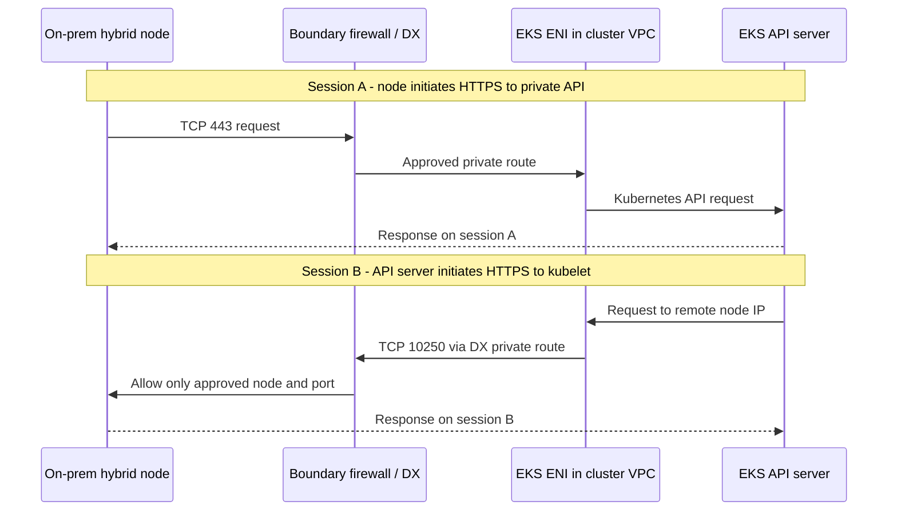

# 보안팀 관점의 Hybrid Nodes 망분리 검토

> **마지막 업데이트**: 2026년 9월 16일

EKS Hybrid Nodes에서 AWS control plane이 Direct Connect(DX)를 거쳐 온프레미스에 연결한다는 사실만으로 망분리 위반을 단정할 수는 없습니다. 반대로 **“private endpoint를 사용하므로 망분리를 준수한다”는 결론도 성립하지 않습니다.** 설명해야 할 대상은 서로 다른 신뢰 영역 사이에 허용하는 관리 통신의 범위, 통제 수단, 이동 가능한 데이터입니다.

이 글은 **Kubernetes API private-only endpoint와 DX 사설 라우팅을 사용하는 일반적인 Hybrid Nodes 구성**의 기술 검토 자료입니다. 고객의 업종·시스템 등급·내부 보안 규정에 대한 적합성 판정이나 승인서는 아닙니다. 아래의 “허용 가능”은 해당 조직이 통제된 망 간 관리 통신을 허용한다는 조건부 설계 판단입니다. 실제 고객 계정, DX, 방화벽 또는 클러스터를 점검한 결과는 포함하지 않습니다.

AWS·Kubernetes 약어가 익숙하지 않다면 [용어 참고](#glossary)를 함께 사용합니다.

## 먼저 보안팀에 전달할 설명

> EKS Hybrid Nodes는 온프레미스 노드를 AWS 관리형 Kubernetes control plane에 연결하는 구성입니다. 검토 대상 설계는 Kubernetes API의 public access를 끄고, 승인된 사설 경로와 경계 방화벽을 사용합니다. Control plane에서 시작하는 통신은 클러스터 VPC의 EKS ENI를 거쳐 승인된 노드의 kubelet TCP 10250과, 사용하는 경우 승인된 webhook 목적지·포트로 제한합니다. API와 kubelet의 인증·권한 검사, 운영자 권한 제한 및 감사 기록을 함께 적용합니다.
>
> 따라서 보안 검토의 근거는 “AWS 또는 endpoint를 신뢰한다”는 전제가 아니라 **어느 주체가 어떤 자원에 어떤 기능을 실행할 수 있는지 제한하고 검증한다는 것**입니다. 이 구성에는 망 간 관리 연결이 존재합니다. 완전 단절이나 클라우드에서 시작하는 연결의 전면 금지가 요구되면 이 설계를 그대로 적용할 수 없습니다.

위 문안을 제출할 때 “제한합니다”, “적용합니다”라는 표현은 실제 구성·시험 증거가 있는 항목에만 사용합니다. 아직 설계 단계라면 “제한할 계획이며 검증이 필요합니다”로 바꿉니다. AWS의 [Hybrid Nodes 네트워킹 요구 사항](https://docs.aws.amazon.com/eks/latest/userguide/hybrid-nodes-networking.html)은 온프레미스 방화벽의 inbound TCP 10250 및 필요한 webhook 포트를 명시합니다.

## “Endpoint”라는 말로 묶으면 안 되는 세 가지

| 구성 요소 | 역할 | 보장하지 않는 것 |
|---|---|---|
| **Kubernetes API private endpoint** | kubelet·Pod·승인된 운영자가 클러스터 API에 HTTPS TCP 443으로 접근하는 사설 진입점 | Control plane의 온프레미스행 연결을 제거하거나 허가된 API 작업의 데이터 이동을 차단하지 않음 |
| **클러스터 VPC의 EKS control-plane ENI** | API server와 VPC·remote node/Pod network 사이의 네트워크 연결 지점; 연결된 SG와 route의 적용 대상 | 자체적으로 DLP, 망연계 솔루션, 애플리케이션 명령 승인 장비가 아님 |
| **AWS 서비스용 interface VPC endpoint / PrivateLink** | `eks`, `ssm`, `rolesanywhere` 등 해당 AWS 서비스 API를 사설 주소로 접근 | `com.amazonaws.<region>.eks`는 Kubernetes API나 control-plane→kubelet 연결의 중계 서비스가 아님 |

AWS는 Kubernetes API private endpoint가 일반적인 AWS API용 PrivateLink endpoint와 다르며 VPC 콘솔의 endpoint 목록에 나타나지 않는다고 설명합니다. `eks` interface endpoint는 `DescribeCluster` 같은 **AWS EKS 관리 API**용입니다. 두 endpoint의 정책을 혼동하면 TCP 10250 연결을 endpoint policy로 통제하고 있다고 잘못 판단할 수 있습니다. [Cluster endpoint](https://docs.aws.amazon.com/eks/latest/userguide/cluster-endpoint.html), [EKS PrivateLink](https://docs.aws.amazon.com/eks/latest/userguide/vpc-interface-endpoints.html)

`endpointPrivateAccess=true`만으로 private-only가 되지는 않습니다. 이 글의 전제는 `endpointPublicAccess=false`도 함께 설정한 경우입니다. Public과 private을 모두 켜면 Hybrid Nodes가 클러스터 이름을 public IP로 해석할 수 있습니다. `publicAccessCidrs`는 private endpoint의 접근 규칙이 아니며, private 경로는 cluster SG·routing·방화벽으로 제한합니다. [Endpoint 모드별 동작](https://docs.aws.amazon.com/eks/latest/userguide/cluster-endpoint.html)

## 실제로 누가 연결을 시작하는가

아래는 **서로 다른 두 TCP 세션의 요청 방향**입니다. 화살표가 돌아오는 모습은 기존 연결의 응답만으로 모든 동작이 성립한다는 뜻이 아닙니다. 경계 방화벽은 고객이 설계·배치하는 통제 지점이며 DX가 자동으로 제공하지 않습니다.

점선 응답도 실제로는 동일한 승인 경로의 역방향을 통과합니다. 그림은 TLS 종료 위치를 바꾸는 프록시를 의미하지 않습니다. 실제 경로는 VPC route table과 선택한 VGW 또는 TGW/DX gateway 구성, 온프레미스 라우팅·방화벽으로 결정됩니다. [AWS의 패킷 흐름 설명](https://docs.aws.amazon.com/eks/latest/userguide/hybrid-nodes-concepts-traffic-flows.html)

| 연결을 시작하는 주체 → 목적지 | 목적지 포트 | 목적과 심사 범위 |
|---|---|---|
| Hybrid kubelet → Kubernetes API private endpoint | TCP 443 | 노드 상태·Pod 사양 등 클러스터 관리 |
| API server → hybrid node kubelet | TCP 10250 | `logs`, `exec`, `attach`, `cp`, `port-forward` 등에 필요한 별도 연결 |
| API server → 온프레미스 webhook / aggregated API backend | 실제 backend TCP 포트 | 해당 기능을 온프레미스에서 실행할 때만 별도 승인. Service 포트와 실제 대상 포트 확인 |
| Hybrid node → 선택한 SSM 또는 IAM Roles Anywhere endpoint | TCP 443 | 노드 임시 자격 증명 발급·갱신; SSM 관리 기능을 쓰면 그 권한·연결도 검토 |
| Pod → Kubernetes API / 필요한 AWS 서비스 | 주로 TCP 443 | CNI의 SNAT 여부에 따라 방화벽에서 보이는 출발지와 반환 경로가 달라짐 |
| DNS client → 승인된 resolver | UDP/TCP 53 | 이름 해석 경로를 별도 정의. CoreDNS 위치와 DNS forwarding 구성을 반영 |
| 앱·CNI·모니터링 간 통신 | 선택한 기능별 포트 | 위 관리 통신으로 일괄 승인하지 않고 별도 flow 목록 작성 |

포트 표는 모든 CNI·앱의 완성된 방화벽 규칙이 아닙니다. 세부 요구는 [네트워크 구성](02-network-configuration.md)과 [AWS의 운영 중 필수 흐름](https://docs.aws.amazon.com/eks/latest/userguide/hybrid-nodes-networking.html)을 사용합니다. Webhook의 `8443`은 예시일 뿐 `8443` 이상 전체 범위를 열라는 의미가 아닙니다.

**Node가 시작한 TCP 443의 stateful return 허용만으로 TCP 10250의 신규 inbound 연결이 열리지는 않습니다.** 이를 outbound-only agent 터널이라고 설명하면 운영과 보안 양쪽에서 문제가 됩니다. SG는 stateful이지만 NACL은 stateless이므로 반환 트래픽 규칙도 구분합니다. 중간 NAT·보안 장비가 있으면 각 경계에서 실제로 보이는 주소와 대칭 반환 경로를 확인합니다. [Hybrid traffic flows](https://docs.aws.amazon.com/eks/latest/userguide/hybrid-nodes-concepts-traffic-flows.html), [SG와 NACL 비교](https://aws.amazon.com/vpc/faqs/)

## 망분리 요구를 설계 조건으로 바꾸기

“망분리”의 의미를 먼저 고객의 정책 문장으로 확정합니다. 다음 표는 법령 해석이 아닌 **기술 요구와 설계의 일치 여부**를 확인하는 기준입니다.

| 고객이 요구하는 조건 | 이 설계의 판단 |
|---|---|
| 인터넷 비노출, 승인된 사설 망 간 관리 통신 허용 | 검토 가능한 후보. Public API 차단, 서비스별 사설 경로, 최소 권한·방화벽·기록을 증명해야 함 |
| 물리적으로 단절되어 외부 control plane과 실시간 연결 불가 | Hybrid Nodes의 연결 전제와 충돌. Control plane을 허용된 내부 영역에 두는 방안을 검토 |
| 내부에서 시작한 세션의 응답만 허용, 클라우드발 신규 연결 전면 금지 | 일반적인 routed Hybrid Nodes의 kubelet·webhook 흐름과 충돌 |
| 업무 영역별로 관리 주체와 권한까지 독립해야 함 | VLAN·namespace만으로 결론 내리지 않음. 공통 cluster 관리자와 control plane의 관리 범위를 심사하고 필요하면 cluster 분리 |
| Kubernetes 객체·Secret·운영 로그까지 모두 온프레미스에만 존재해야 함 | AWS에 control plane을 두는 구성과 충돌하는 데이터가 있는지 확인. 노드 위치만으로 충족 불가 |
| 특정 망연계 장비·승인 절차를 거친 연결만 허용 | DX·PrivateLink가 그 장비나 승인 절차를 대체하는지 임의로 판단하지 않음. 실제 적용 가능성과 기능 호환성을 확인 |

인터넷 접근 제한과 AWS로부터의 완전 격리의 차이는 [인터넷 제한 환경 구성](03-airgap-setup.md)에 설명되어 있습니다. Hybrid Nodes는 신뢰할 수 있는 양방향 연결이 필요한 서비스입니다. [Hybrid Nodes 개요](https://docs.aws.amazon.com/eks/latest/userguide/hybrid-nodes-overview.html)

## 보안 통제는 어느 지점에 적용하는가

### 경로와 네트워크 접근

Remote node/Pod CIDR은 EKS가 대상 네트워크를 알도록 하는 구성입니다. 이를 등록했다고 온프레미스 route·방화벽이나 격리 정책이 완성되지는 않습니다. EKS가 추가하는 cluster SG inbound 규칙도 확인하고, 축소한 CIDR의 이전 규칙이 남아 있지 않은지 점검합니다. AWS는 remote network 제거 시 관련 SG 규칙을 자동 삭제하지 않는다고 명시합니다. [네트워크 및 SG 구성](https://docs.aws.amazon.com/eks/latest/userguide/hybrid-nodes-networking.html)

보안팀에는 EKS ENI가 사용하는 **검증된 출발지 주소 범위 → 지정 hybrid node 주소 → TCP 10250** 형태로 제시합니다. ENI IP는 바뀔 수 있으므로 현재 `/32` 목록을 영구 고정하지 않습니다. 전용 control-plane subnet을 사용할 수 있다면 주소 범위의 소유권을 좁히고, ENI 교체·클러스터 업데이트 때 허용 목록을 갱신·재검증하는 절차를 둡니다. 공유 subnet 전체를 허용하면 그 안의 다른 자원까지 출발지 범위에 들어갈 수 있다는 잔여 위험을 기록합니다. [EKS ENI 수명과 네트워크 계획](https://docs.aws.amazon.com/eks/latest/userguide/hybrid-nodes-networking.html)

Cluster SG의 egress, VPC/TGW 경로, 온프레미스 경계·host firewall을 함께 검토합니다. SG ID 자체가 온프레미스 방화벽에 전달되는 신원은 아닙니다. 또한 route의 존재는 허가된 API 작업의 증명이 아닙니다. 관련 없는 업무망 prefix의 전파·접근을 제한하고, 허용 목적지 이외의 연결은 명시적인 거부 시험으로 확인합니다. 이는 이 글의 설계 권고이며 실제 고객 구성에 적용됐다는 주장이 아닙니다.

### 암호화와 신원·권한

**DX는 기본적으로 전송 중 암호화를 제공하지 않습니다.** Kubernetes API·kubelet HTTPS의 TLS와 인증 검사를 유지하고, 회선 구간 암호화가 요구되면 지원되는 IPsec over DX 또는 MACsec의 적용 범위를 검토합니다. MACsec은 지원 DX 연결의 링크 보호이며 애플리케이션 종단 간 TLS와 같은 범위가 아닙니다. DX를 사용한다는 사실로 모든 앱·overlay 트래픽이 암호화됐다고 주장하지 않습니다. [DX 암호화](https://docs.aws.amazon.com/directconnect/latest/UserGuide/encryption-in-transit.html)

Private 주소는 호출자의 권한을 증명하지 않습니다. 운영자 IAM 신원과 EKS access entry/access policy·Kubernetes RBAC, node 신원, kubelet의 인증·인가 구성을 각각 확인합니다. TLS 검증을 끄거나 kubelet에 anonymous/AlwaysAllow를 허용하는 방법으로 연결 문제를 해결하지 않습니다. kubelet에 대한 직접 접근은 별도 권한 경로이므로 API server를 통한 작업과 동일하게 취급하지 않습니다. [EKS 접근 관리](https://docs.aws.amazon.com/eks/latest/userguide/access-entries.html), [Kubelet 인증과 인가](https://kubernetes.io/docs/reference/access-authn-authz/kubelet-authn-authz/)

AWS 서비스용 endpoint policy는 그 endpoint를 통과하는 해당 API 호출의 필터입니다. IAM 권한을 부여하거나 Kubernetes RBAC를 대체하지 않습니다. SSM을 사용하는 경우 Run Command·Session Manager 같은 관리 기능의 실행 권한도 심사합니다. “노드가 먼저 HTTPS를 연결했다”는 이유로 외부 관리 명령의 가능성이 사라지지는 않습니다. [Endpoint 접근 통제](https://docs.aws.amazon.com/vpc/latest/privatelink/vpc-endpoints-access.html), [SSM 접근 통제](https://docs.aws.amazon.com/systems-manager/latest/userguide/security-iam.html)

### 데이터와 관리자 권한의 경계

온프레미스 Pod에서 처리하는 대용량 업무 데이터가 자동으로 모두 AWS에 복제되는 것은 아닙니다. 그러나 Kubernetes API 객체는 AWS control plane이 관리합니다. Pod 사양, ConfigMap, Kubernetes Secret에 민감 데이터를 넣으면 그 내용도 관리 대상 데이터가 됩니다. `logs`는 애플리케이션이 출력한 내용을 전달하며, `exec`·`cp`·`port-forward`는 허가된 사용자의 데이터 접근 경로가 될 수 있습니다. “control traffic이므로 업무 데이터는 절대 지나가지 않는다”고 설명하지 않습니다. API 데이터의 저장 암호화도 저장 위치나 허가된 조회의 데이터 이동을 바꾸지 않습니다. [Hybrid networking concepts](https://docs.aws.amazon.com/eks/latest/userguide/hybrid-nodes-concepts-networking.html), [EKS API 데이터 암호화](https://docs.aws.amazon.com/eks/latest/userguide/envelope-encryption.html)

따라서 `pods/log`, `pods/exec`, `pods/attach`, `pods/portforward`, `nodes/proxy`와 workload 생성·변경 권한을 함께 검토합니다. `exec`만 제한해도 새 Pod나 privileged/hostPath workload를 만들 수 있는 주체는 다른 방식으로 데이터에 접근할 수 있습니다. RBAC 외에 Pod 보안·admission 정책과 host 접근 제한이 필요합니다. Namespace와 NetworkPolicy만으로 공통 cluster 관리자에 대한 독립 보안 경계가 만들어지지는 않습니다. [Kubernetes RBAC 모범 사례](https://kubernetes.io/docs/concepts/security/rbac-good-practices/)

특히 `get nodes/proxy`를 단순 조회 권한으로 분류하지 않습니다. 이 권한은 kubelet API를 통한 컨테이너 명령 실행을 허용할 수 있으며, 해당 접근은 Kubernetes audit·admission 경로를 우회할 수 있습니다. API audit만 수집하면서 모든 관리자 작업이 추적된다고 결론 내리지 않습니다. [Node proxy 권한 위험](https://kubernetes.io/docs/concepts/security/rbac-good-practices/#access-to-proxy-subresource-of-nodes)

업무 데이터, API 객체, 스트리밍 로그, 감사 로그, image/artifact, 자격 증명을 각각 분류하고 저장 위치·전송 목적지·조회 권한·보존 기간을 정합니다. 애플리케이션 egress와 SSM 관리 경로도 같은 목록에 포함해야 “온프레미스에만 데이터가 있다”는 설명의 범위를 검증할 수 있습니다.

## 보안 심사에 첨부할 증거

다음은 **준비해야 할 증거 목록**이며 점검 완료 결과가 아닙니다. 고객 식별자·토큰·Secret 값·실제 업무 로그를 공개 문서에 첨부하지 않습니다.

| 심사 질문 | 제출 증거 | 통과 기준 |
|---|---|---|
| Private-only가 실제 적용됐는가? | 대상 cluster의 endpoint 설정, 온프레미스 DNS 응답, DX 경로와 경계 flow 기록 | public access 비활성화, 실제 사설 IP·경로 확인. DNS 조회 성공만으로 판정하지 않음 |
| AWS에서 내부 어디까지 접근할 수 있는가? | ENI/subnet 소유권, remote CIDR, VPC/TGW·온프레미스 route, SG·firewall 규칙의 대응표 | 승인된 node·backend·포트만 허용하고 다른 업무 영역으로의 접근 제한 입증 |
| 허가된 기능과 금지된 기능을 구별하는가? | 격리된 검증 환경의 합성 데이터로 `logs`·승인된 관리 기능 성공, 미승인 사용자·목적지 거부 결과 | 연결과 권한을 각각 검사. 권한 거부를 단순 네트워크 실패로 대체하지 않음 |
| 누가 언제 어떤 API 작업을 했는가? | EKS Kubernetes audit 로그와 인증 기록, AWS 관리 API의 CloudTrail, 시간 상관관계 | 두 API 계층을 구분하고 테스트 신원·시점·작업·대상·결과를 추적 |
| 무엇이 망을 통과했는가? | VPC Flow Logs·온프레미스 방화벽 기록, 별도 데이터 흐름 목록 | IP/port/허용 여부와 데이터 분류를 함께 제시. Flow Logs가 TLS payload나 명령 본문을 증명한다고 주장하지 않음 |
| 변경·장애 후에도 같은 경계인가? | ENI 교체, route 변경, DX/VPN failover, 자격 증명 갱신·만료에 대한 재검증·복구 계획 | 예비 경로에서도 정책 유지. 검증하지 않은 failover를 안전하다고 표기하지 않음 |

EKS control-plane logging은 필요한 유형을 활성화해야 하며, Kubernetes audit는 CloudTrail과 역할이 다릅니다. Audit 로그는 정책·기록 수준에 따른 API 이벤트이지 `exec`의 모든 입력·출력이나 `port-forward` payload를 녹화하는 장치가 아닙니다. 보존·접근 권한·민감정보 취급도 함께 설계합니다. [Control-plane logs](https://docs.aws.amazon.com/eks/latest/userguide/control-plane-logs.html), [EKS 감사·로깅](https://docs.aws.amazon.com/eks/latest/best-practices/auditing-and-logging.html), [EKS CloudTrail](https://docs.aws.amazon.com/eks/latest/userguide/logging-using-cloudtrail.html), [Flow Logs 한계](https://docs.aws.amazon.com/vpc/latest/userguide/flow-logs.html)

로그는 수집 범위 밖의 트래픽을 포함하지 않거나 지연·누락될 수 있습니다. EKS 로그 전달은 best effort이며, Flow Logs의 `SKIPDATA` 같은 누락 신호와 수집 설정도 확인합니다. **기록이 없다는 사실만으로 통신이나 작업이 없었다고 판단하지 않습니다.** 방화벽 기록과 명시적인 허용·거부 시험을 대조합니다. [Flow Logs 수집 한계](https://docs.aws.amazon.com/vpc/latest/userguide/flow-logs-limitations.html), [Flow Logs 누락 진단](https://docs.aws.amazon.com/vpc/latest/userguide/flow-logs-troubleshooting.html)

실제 검증은 승인된 비운영 대상과 합성 데이터로 수행합니다. 경계 확인을 위해 업무망 전체를 스캔하거나, 운영 방화벽을 일괄 개방하거나, 고객 데이터를 `logs`/`cp`로 추출할 필요는 없습니다.

## 자주 나오는 보안팀 질문

### “10250을 열면 AWS 전체가 내부 서버에 접근할 수 있나?”

올바르게 제한한 설계의 허용 주체는 전체 AWS 주소 공간이 아니라 검증된 cluster ENI 출발지 범위와 인증된 호출자입니다. 다만 IP allowlist만으로 cluster 신원이 보장되지는 않으며, 공유 subnet과 과도한 관리자 권한의 위험은 남습니다. 네트워크 제한과 TLS·인증·인가 증거를 함께 제시해야 합니다.

### “Webhook을 AWS 쪽으로 옮기면 inbound가 없어지나?”

온프레미스 webhook으로 향하는 직접 연결은 줄일 수 있습니다. 그러나 kubelet TCP 10250 요구는 별개이며 cloud webhook의 다른 의존성도 확인해야 합니다. Webhook을 cloud node에 배치하는 선택지는 [AWS webhook 가이드](https://docs.aws.amazon.com/eks/latest/userguide/hybrid-nodes-webhooks.html)에 설명되어 있습니다.

### “Hybrid Nodes Gateway를 쓰면 outbound-only로 바뀌나?”

[Hybrid Nodes Gateway](10-hybrid-nodes-gateway.md)는 Cilium VTEP/VXLAN을 이용해 hybrid Pod 연결을 지원합니다. 인터넷 단절 제품이나 단방향 보안 게이트웨이가 아닙니다. 적용 시 gateway·tunnel의 outer 주소/포트와 내부 Pod 흐름을 별도로 심사해야 합니다. 이 글의 직접 라우팅 표를 그대로 복사하지 않습니다. [AWS Gateway 설명](https://aws.amazon.com/blogs/containers/simplify-hybrid-kubernetes-networking-with-amazon-eks-hybrid-nodes-gateway/)

### “최종적으로 망분리 위반이 아니라는 문구를 써도 되나?”

구성 방식만으로 쓰지 않습니다. 적용 정책이 통제된 관리 연결을 허용하고, 해당 연결·권한·데이터 경계의 증거와 조직의 승인 절차가 갖춰졌을 때 그 **검토 범위와 조건**을 함께 기록합니다. 정책상 금지된 연결을 DX나 private endpoint라는 명칭으로 허용된 것으로 바꿔 설명해서는 안 됩니다.

## 용어 참고 {#glossary}

| 약어 | 전체 이름과 이 글에서의 의미 |
|---|---|
| VPC / ENI | Virtual Private Cloud / Elastic Network Interface. AWS의 논리적 네트워크 영역과 그 영역에 연결되는 가상 네트워크 인터페이스 |
| SG / NACL | Security Group / Network Access Control List. 각각 인터페이스에 연결하는 stateful 허용 규칙과 subnet 경계의 stateless 허용·거부 규칙 |
| DLP | Data Loss Prevention. 민감정보의 부적절한 반출을 탐지·제어하는 통제; ENI 자체 기능이 아님 |
| CNI / SNAT | Container Network Interface / Source Network Address Translation. Pod 네트워크를 연결하는 인터페이스 규격·구현과 패킷 출발지 주소 변환 |
| VGW / TGW | Virtual Private Gateway / Transit Gateway. 선택한 AWS 사설 연결 설계에서 사용하는 게이트웨이 |
| VXLAN / VTEP | Virtual Extensible LAN / VXLAN Tunnel Endpoint. 네트워크 캡슐화 방식과 그 터널의 끝점; 단방향 통제를 뜻하지 않음 |
| IAM / RBAC | Identity and Access Management / Role-Based Access Control. AWS 신원·권한 관리와 Kubernetes 역할 기반 접근 통제 |
| TLS / IPsec / MACsec | Transport Layer Security / Internet Protocol Security / Media Access Control Security. 보호하는 통신 계층·구간이 서로 다른 보안 기술 |
| SSM | AWS Systems Manager를 가리키는 서비스 식별자. 이 글에서는 노드 자격 증명과 선택적인 시스템 관리 기능의 접근을 구분 |

## 함께 읽기

- [네트워크 구성과 endpoint 상세](02-network-configuration.md)
- [인터넷 제한 환경과 완전 단절의 차이](03-airgap-setup.md)
- [운영 및 유지보수](08-operations.md)
- [망분리 보안 검토 퀴즈](../quizzes/eks-hybrid-nodes/11-network-separation-security-quiz.md)

< [Hybrid Nodes 목차](README.md) | [이전: Hybrid Nodes Gateway](10-hybrid-nodes-gateway.md) >
