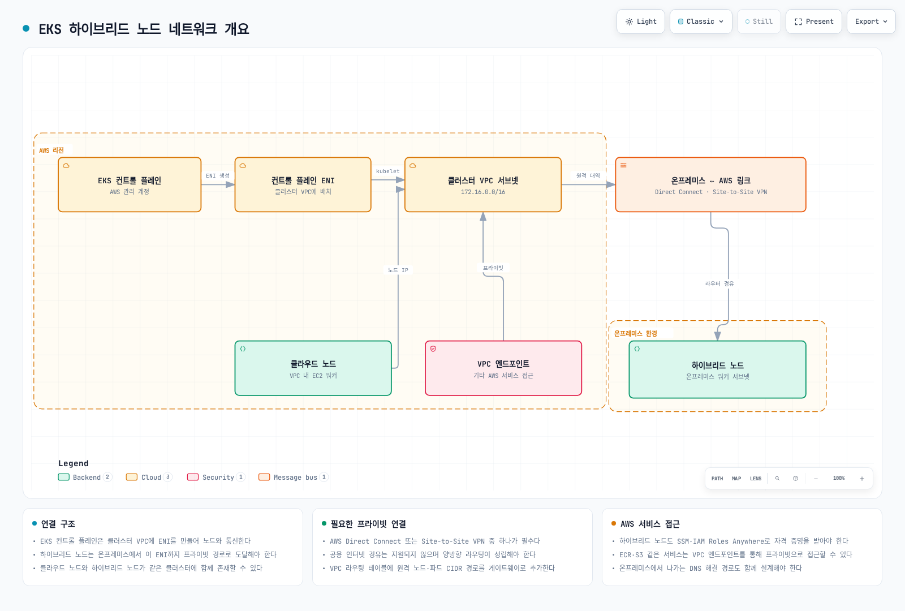
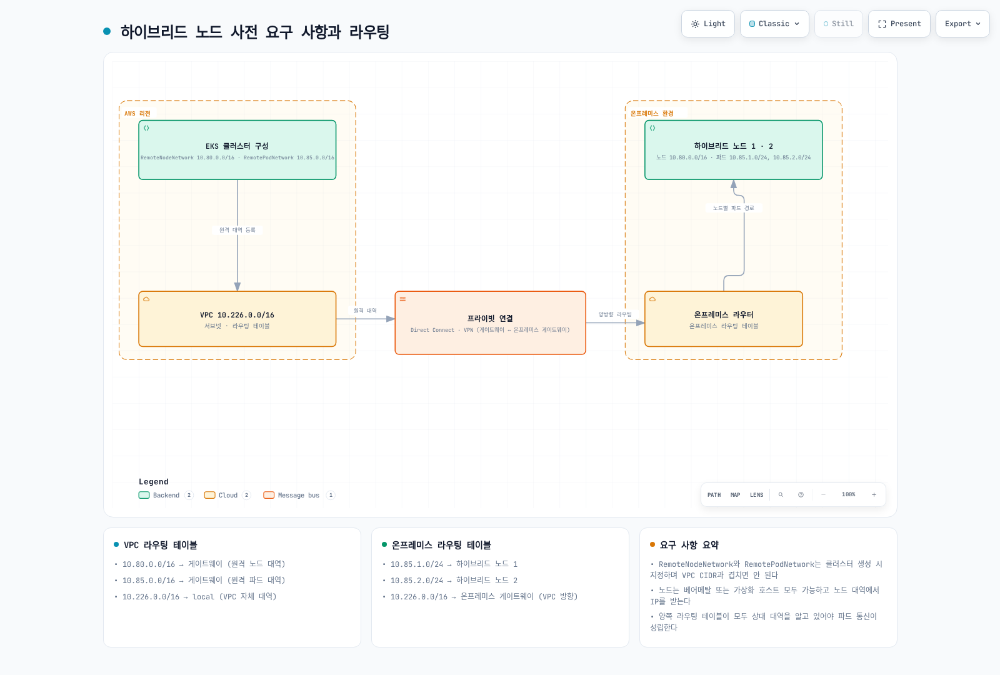

# EKS Hybrid Nodes

> **지원 버전**: EKS 1.31+, nodeadm 0.1+ **마지막 업데이트**: 2026년 2월 23일

Amazon EKS Hybrid Nodes는 온프레미스 서버를 AWS EKS 컨트롤 플레인에서 관리할 수 있게 해주는 기능입니다. 이 문서에서는 EKS Hybrid Nodes의 개념, 설정 방법, 그리고 실제 운영 환경에서의 활용 방법을 상세히 다룹니다.

## 목차

1. [사전 요구 사항 및 시스템 요구 사항](01-prerequisites.md)
2. [네트워크 구성](02-network-configuration.md)
3. [에어갭 환경 구성 (S3 + VPC 엔드포인트)](03-airgap-setup.md)
4. [노드 부트스트랩](04-node-bootstrap.md)
5. [GPU 서버 통합](05-gpu-integration.md)
6. [워크로드 배치 전략](06-workload-placement.md)
7. [노드 라이프사이클 관리](07-node-lifecycle.md)
8. [운영 및 유지보수](08-operations.md)
9. [베어메탈 서버 OS 설치 및 마이그레이션 가이드](09-bare-metal-os-setup.md)
10. [Hybrid Nodes Gateway](10-hybrid-nodes-gateway.md)

## EKS Hybrid Nodes 개요

### Hybrid Nodes란?

EKS Hybrid Nodes는 온프레미스 데이터센터나 엣지 환경에 있는 서버를 AWS EKS 컨트롤 플레인에서 관리되는 Kubernetes 노드로 등록할 수 있게 해주는 기능입니다. 이를 통해 클라우드와 온프레미스 인프라를 단일 Kubernetes 클러스터로 통합 관리할 수 있습니다.



[🔍 인터랙티브 다이어그램 보기](https://www.atomai.click/kubernetes-docs/archmaps/ko-eks-hybrid-nodes-highlevel-0.html)

아래 다이어그램은 VPC, 서브넷, Transit Gateway/Virtual Private Gateway, 원격 노드/파드 CIDR 연결을 포함한 네트워크 사전 요구 사항을 보여줍니다.



[🔍 인터랙티브 다이어그램 보기](https://www.atomai.click/kubernetes-docs/archmaps/ko-eks-hybrid-nodes-prereq-0.html)

### 왜 Hybrid Nodes를 사용하는가?

#### 1. 규제 준수 및 데이터 주권

특정 산업(금융, 의료, 공공기관)에서는 데이터가 특정 지역이나 시설을 벗어나지 못하도록 규정하고 있습니다. Hybrid Nodes를 사용하면 민감한 데이터를 온프레미스에 유지하면서도 EKS의 관리 기능을 활용할 수 있습니다.

```yaml
# 규제 준수 워크로드 배치 예시
apiVersion: v1
kind: Pod
metadata:
  name: financial-data-processor
spec:
  nodeSelector:
    topology.kubernetes.io/zone: "on-premises"
    compliance.company.io/data-sovereignty: "required"
  containers:
  - name: processor
    image: harbor.internal.company.io/finance/data-processor:v1.2.0
```

#### 2. 데이터 중력 (Data Gravity)

대용량 데이터셋이 온프레미스에 존재하는 경우, 데이터를 클라우드로 이동하는 것보다 컴퓨팅을 데이터 가까이로 가져오는 것이 더 효율적입니다.

#### 3. 기존 하드웨어 활용

이미 투자한 고성능 서버(특히 GPU 서버)를 계속 활용하면서 Kubernetes 기반의 현대적인 워크로드 관리 방식을 적용할 수 있습니다.

#### 4. 통합 관리

클라우드와 온프레미스의 Kubernetes 워크로드를 단일 컨트롤 플레인에서 관리함으로써 운영 복잡성을 줄일 수 있습니다.

### 아키텍처 구성 요소

EKS Hybrid Nodes 아키텍처는 다음 구성 요소로 이루어집니다:

| 구성 요소                           | 위치          | 역할                           |
| ------------------------------- | ----------- | ---------------------------- |
| EKS Control Plane               | AWS         | API 서버, etcd, 컨트롤러 매니저, 스케줄러 |
| nodeadm                         | On-Premises | 노드 부트스트랩 및 관리 에이전트           |
| kubelet                         | On-Premises | 파드 실행 및 노드 상태 보고             |
| containerd                      | On-Premises | 컨테이너 런타임                     |
| VPN/Direct Connect              | 네트워크        | AWS와 온프레미스 간 보안 연결           |
| SSM Agent 또는 IAM Roles Anywhere | On-Premises | 자격 증명 관리                     |

### 주요 제약 사항 및 제한

* **네트워크 연결**: 온프레미스와 AWS 간 안정적인 VPN 또는 Direct Connect 연결 필요 (연결이 불안정한 환경에는 적합하지 않음)
* **CIDR 제한**: 클러스터당 Remote Node Networks 및 Remote Pod Networks에 최대 15개 CIDR
* **IPv4 전용**: IPv4 주소 패밀리만 지원 (하이브리드 노드에서 IPv6 미지원)
* **인증 모드**: 클러스터는 `API` 또는 `API_AND_CONFIG_MAP` 인증 모드 사용 필수
* **엔드포인트 접근**: Public 또는 Private 중 하나만 지원 ("Public and Private" 동시 사용 불가 — 하이브리드 노드 조인 실패)
* **vCPU 기반 과금**: 하이브리드 노드는 시간당 vCPU 단위로 과금 (최소 약정 없음)
* **클라우드 인프라 미지원**: EC2 등 클라우드 인프라에서 실행 시 하이브리드 노드 비용 발생
* **VPC CNI 미호환**: Amazon VPC CNI는 하이브리드 노드와 호환되지 않으며, Cilium 또는 Calico 사용 필수

### 자격 증명 프로바이더 옵션

EKS Hybrid Nodes는 온프레미스 노드를 AWS에 인증하기 위해 두 가지 자격 증명 프로바이더를 지원합니다:

| 기능           | SSM Hybrid Activations                                | IAM Roles Anywhere        |
| ------------ | ----------------------------------------------------- | ------------------------- |
| **설정 복잡도**   | 간단 — 활성화 코드/ID 쌍                                      | 보통 — PKI 인프라 필요           |
| **인증서 필요**   | 아니오                                                   | 예 (노드별 X.509 인증서)         |
| **에어갭 호환**   | 아니오 (SSM 엔드포인트 접근 필요)                                 | 예 (로컬 CA로 동작)             |
| **자격 증명 갱신** | 자동 (AWS 관리, 1시간 TTL 고정)                               | 자동 (인증서 기반, 1-12시간 설정 가능) |
| **노드 이름**    | 자동 생성 (`mi-xxxx`, 변경 불가)                              | 커스텀 (인증서 CN과 일치 필요)       |
| **스케일링 제한**  | 계정당 리전당 1,000개 무료, 초과 시 advanced-instances 티어 (추가 비용) | 제한 없음                     |
| **AWS 종속성**  | SSM 서비스                                               | IAM Roles Anywhere 서비스    |
| **적합한 환경**   | 인터넷/VPN 연결된 표준 환경                                     | 에어갭, 엄격한 컴플라이언스, 기존 PKI   |

> **권장 사항**: 대부분의 환경에서는 설정이 간단한 SSM Hybrid Activations를 사용하세요. 에어갭 환경이거나 이미 PKI 인프라가 있는 경우 IAM Roles Anywhere를 선택하세요.

### 주요 사용 사례

1. **AI/ML 워크로드**: 온프레미스 GPU 서버에서 모델 학습, 클라우드에서 추론 서비스
2. **금융 서비스**: 거래 데이터 처리는 온프레미스, 분석은 클라우드
3. **제조업**: 공장 내 엣지 컴퓨팅과 중앙 클라우드 통합
4. **미디어 처리**: 대용량 미디어 파일 처리는 데이터가 있는 곳에서 수행

## 다음 단계

EKS Hybrid Nodes에 대한 이해를 더욱 깊이 하고 실습을 진행하려면 다음 리소스를 참고하세요:

### 퀴즈

이 문서의 내용을 테스트하려면 다음 퀴즈를 풀어보세요:

* [EKS Hybrid Nodes 퀴즈](https://github.com/Atom-oh/kubernetes-docs/blob/main/ko/quizzes/eks-hybrid-nodes/README.md)

### 관련 문서

* [EKS 복원력 가이드](../eks/10-eks-resiliency.md) - 하이브리드 환경에서의 고가용성 구성
* [EKS 비용 최적화](../eks/07-eks-cost-optimization.md) - 비용 관리 전략
* [EKS 모니터링 및 로깅](../eks/06-eks-monitoring-logging.md) - 통합 모니터링 구성

### 공식 문서

* [AWS EKS Hybrid Nodes 공식 문서](https://docs.aws.amazon.com/eks/latest/userguide/hybrid-nodes-overview.html)
* [nodeadm 사용자 가이드](https://docs.aws.amazon.com/eks/latest/userguide/hybrid-nodes-nodeadm.html)
* [Harbor 공식 문서](https://goharbor.io/docs/)
* [NVIDIA GPU Operator 문서](https://docs.nvidia.com/datacenter/cloud-native/gpu-operator/overview.html)
* [하이브리드 노드 네트워킹 가이드](https://docs.aws.amazon.com/eks/latest/userguide/hybrid-nodes-networking.html)
* [하이브리드 노드 CNI 구성](https://docs.aws.amazon.com/eks/latest/userguide/hybrid-nodes-cni.html)
* [하이브리드 노드 트러블슈팅](https://docs.aws.amazon.com/eks/latest/userguide/hybrid-nodes-troubleshooting.html)
