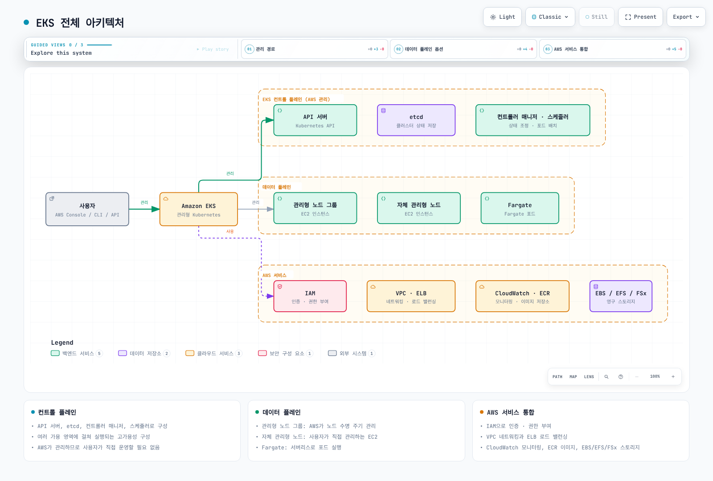
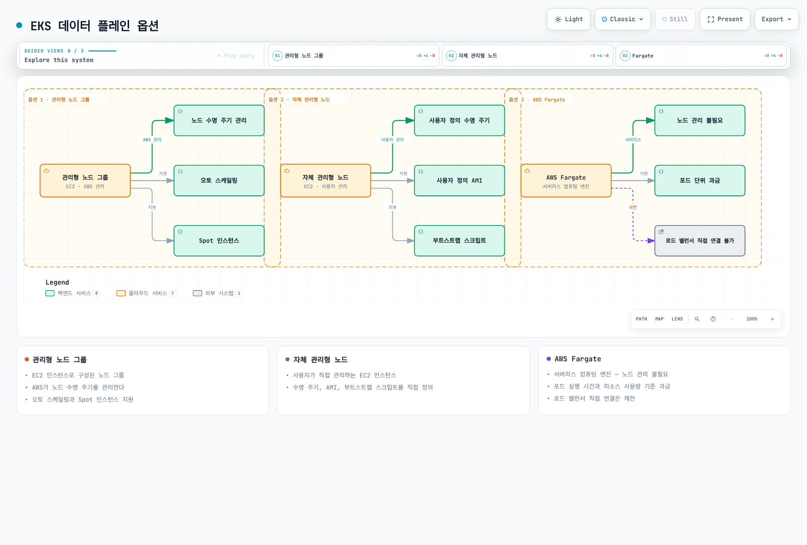
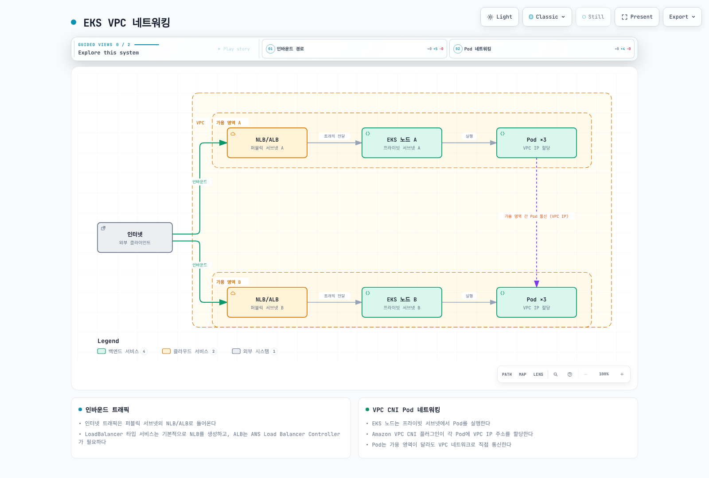
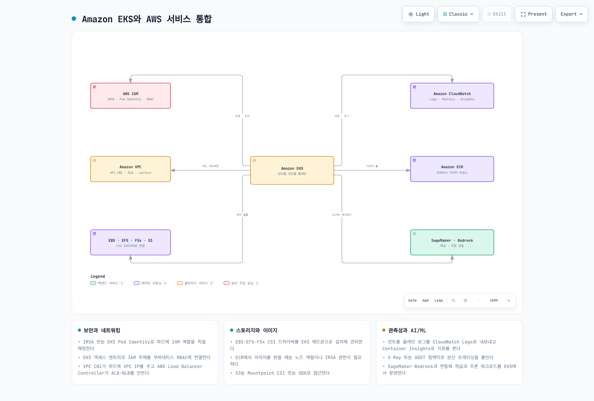

# EKS 소개

> **지원 버전**: Amazon EKS 표준 지원 1.34–1.36, 연장 지원 1.31–1.33
> **마지막 업데이트**: 2026년 9월 11일

Amazon Elastic Kubernetes Service(EKS)는 AWS에서 Kubernetes를 실행하기 위한 관리형 서비스입니다. 이 장에서는 EKS의 기본 개념, 아키텍처, 그리고 일반 Kubernetes와의 차이점을 살펴보겠습니다.

## EKS와 Kubernetes

EKS는 표준 Kubernetes API를 제공하는 관리형 서비스입니다. Kubernetes의 기본 개념과 작동 방식에 대한 자세한 내용은 [Kubernetes 소개](../basics/04-kubernetes-introduction.md) 문서를 참조하세요.

### EKS의 주요 이점

1. **관리형 컨트롤 플레인**: AWS가 Kubernetes 컨트롤 플레인의 가용성과 확장성을 관리
2. **보안 강화**: AWS IAM과의 통합을 통한 인증 및 권한 부여
3. **AWS 서비스 통합**: 다른 AWS 서비스(ELB, ECR, IAM 등)와의 원활한 통합
4. **다양한 컴퓨팅 옵션**: EC2 기반 노드, EKS Auto Mode, Fargate, Hybrid Nodes 지원. Bottlerocket은 별도 컴퓨팅 서비스가 아니라 노드 운영체제
5. **자동 확장**: 클러스터 오토스케일러, Karpenter 등을 통한 자동 확장 지원
6. **관리형 노드 그룹**: 노드 수명 주기 관리 자동화

## EKS 아키텍처 및 구성 요소

Amazon EKS의 전체 아키텍처는 다음과 같습니다:

[🔍 인터랙티브 다이어그램 보기](https://www.atomai.click/kubernetes-docs/archmaps/ko-eks-01-eks-introduction-10.html)

### 컨트롤 플레인

EKS는 고가용성 컨트롤 플레인을 제공합니다. 컨트롤 플레인은 여러 가용 영역에 걸쳐 실행되며, 다음과 같은 구성 요소로 이루어져 있습니다:

* **API 서버**: Kubernetes API를 노출하고 클러스터와의 상호 작용을 처리합니다.
* **etcd**: 클러스터의 상태를 저장하는 분산 키-값 저장소입니다.
* **컨트롤러 매니저**: 클러스터의 상태를 관리하는 컨트롤러를 실행합니다.
* **스케줄러**: 포드를 노드에 할당합니다.

EKS에서는 이러한 컨트롤 플레인 구성 요소가 AWS에 의해 관리되므로, 사용자는 이를 직접 관리할 필요가 없습니다.

### 데이터 플레인

EKS 데이터 플레인은 다음과 같은 옵션으로 구성할 수 있습니다:

[🔍 인터랙티브 다이어그램 보기](https://www.atomai.click/kubernetes-docs/archmaps/ko-eks-01-eks-introduction-11.html)

1. **관리형 노드 그룹**: AWS가 EC2 노드의 프로비저닝·교체 과정을 관리합니다. 운영자가 노드 버전/AMI 업데이트를 선택하고 시작하며, 컨트롤 플레인 업그레이드만으로 이 노드들이 자동 갱신되지는 않습니다.
2. **자체 관리형 노드**: 사용자가 직접 관리하는 EC2 인스턴스입니다.
3. **AWS Fargate**: Fargate 프로필로 선택하는 Pod 단위 컴퓨팅입니다. 워크로드 구성과 리소스 요청은 운영자가 관리합니다.
4. **EKS Auto Mode**: AWS가 EC2 노드 프로비저닝·확장·업데이트와 지원되는 네트워킹·로드 밸런싱·블록 스토리지 기능을 관리합니다.
5. **Hybrid Nodes**: 고객이 관리하는 온프레미스/엣지 머신을 AWS의 EKS 컨트롤 플레인에 연결합니다. 안정적인 네트워크 연결이 필요합니다.

### 네트워킹

일반 EC2 기반 EKS 노드에서는 Amazon VPC CNI가 기본이며 일반 Pod에 VPC 주소를 할당합니다. `hostNetwork` Pod는 노드 네트워크를 공유합니다. Auto Mode는 자체 네트워킹 기능을 관리하고, Hybrid Nodes는 Amazon VPC CNI 대신 호환되는 온프레미스 CNI를 사용합니다.

[🔍 인터랙티브 다이어그램 보기](https://www.atomai.click/kubernetes-docs/archmaps/ko-eks-01-eks-introduction-12.html)

## 일반 Kubernetes와 EKS의 차이점

### 관리 책임

* **자체 관리형 Kubernetes**: 운영자가 컨트롤 플레인과 데이터 플레인을 관리합니다. 다른 관리형 배포판은 책임 분담이 다를 수 있습니다.
* **EKS**: AWS가 컨트롤 플레인을 관리합니다. 데이터 플레인 책임은 컴퓨팅 옵션에 따라 다르며, 워크로드 보안·신원·구성·가용성·데이터 보호는 고객 책임으로 남습니다.

### 네트워킹

* **일반 Kubernetes**: 다양한 CNI 플러그인 중에서 선택할 수 있습니다.
* **EKS**: 일반 EC2 기반 클러스터의 기본은 Amazon VPC CNI입니다. 대체 CNI와 Auto Mode/Hybrid Nodes에는 서로 다른 기능·지원 제약이 있습니다.

### 로드 밸런싱

* **일반 Kubernetes**: `LoadBalancer` 타입의 서비스를 사용하려면 별도의 컨트롤러를 설치해야 합니다.
* **EKS**: 일반 클러스터에서는 NLB Service와 ALB Ingress를 위해 AWS Load Balancer Controller를 설치하고 권한을 부여합니다. 레거시 컨트롤러는 Classic Load Balancer를 생성할 수 있습니다. Auto Mode는 별도 클래스와 지원 설정을 사용하는 관리형 NLB/ALB 통합을 제공합니다. Service 타입만으로 담당 컨트롤러가 정해지는 것은 아닙니다. Fargate는 ALB/NLB의 IP 타깃을 지원합니다.

### 스토리지

* **일반 Kubernetes**: 다양한 스토리지 드라이버를 수동으로 설치하고 구성해야 합니다.
* **EKS**: 일반 클러스터에서는 EBS CSI 드라이버/애드온을 설치하고 IAM 권한을 부여합니다. Auto Mode의 관리형 EBS 프로비저너는 `ebs.csi.eks.amazonaws.com`으로, 일반 드라이버의 `ebs.csi.aws.com`과 다릅니다. EFS·FSx 통합에는 별도 선행 조건이 있으며, Fargate와 Hybrid Nodes에서는 EBS 볼륨을 마운트할 수 없습니다.

## EKS 비용 구조

EKS 클러스터를 운영할 때 발생하는 비용은 다음과 같습니다:

1. **EKS 컨트롤 플레인 비용**: 클러스터당 시간 요금은 표준/연장 지원에 따라 다르며, 선택한 프로비저닝 컨트롤 플레인 등급에는 추가 요금이 있습니다.
2. **컴퓨팅 비용**:
   * EC2 인스턴스(관리형 또는 자체 관리형 노드)
   * Fargate(포드 실행 시간 및 리소스 사용량에 따라 요금 부과)
3. **스토리지 비용**: EBS, EFS, FSx 등의 스토리지 서비스 사용 비용
4. **네트워크 비용**: 데이터 전송, NAT 게이트웨이, 퍼블릭 IPv4 주소, 로드 밸런서 사용 비용
5. **관리형 기능 비용**: Auto Mode, EKS Capabilities, Hybrid Nodes에는 해당 클러스터/인프라 비용 외에 별도 요금이 있습니다.

### 비용 최적화 전략

1. **Spot 인스턴스 사용**: 현재 Spot 가격과 중단 허용 범위를 비교합니다. 광고된 절감률이 개별 워크로드의 절감률을 보장하지는 않습니다.
2. **Fargate 평가**: 프로비저닝된 Pod 크기, 실행 시간, 기능 제약, 운영 부담을 EC2와 비교합니다. 앱 사용률이 낮다는 이유만으로 저렴해지지는 않습니다.
3. **오토스케일링 구성**: 필요에 따라 노드를 자동으로 확장하고 축소합니다.
4. **Locality Routing**: 지원되는 경우 같은 AZ의 트래픽을 우선하되 충분한 용량과 장애 전환을 유지합니다. 실제 전송 비용 절감은 라우팅·로드 밸런서 설정에 따라 달라집니다.
5. **EKS Auto Mode**: 자동 확장·통합의 절감 효과와 Auto Mode 관리 요금을 함께 평가합니다.
6. **Hybrid Nodes**: 기존 온프레미스 용량을 vCPU당 Hybrid Nodes 요금 및 연결·운영 비용과 함께 평가합니다. EC2 인스턴스 유형 혼합을 뜻하는 기능이 아닙니다.

## AWS 서비스와의 통합

EKS는 다음과 같은 AWS 서비스와 통합됩니다:

[🔍 인터랙티브 다이어그램 보기](https://www.atomai.click/kubernetes-docs/archmaps/ko-eks-01-eks-introduction-0.html)

1. **IAM**: IAM 신원이 클러스터에 인증하고 EKS access entry의 접근 정책 및/또는 Kubernetes RBAC 그룹으로 권한을 부여합니다. 워크로드의 AWS 권한은 Pod Identity·IRSA로 별도 구성합니다.
2. **VPC**: 네트워킹 인프라를 제공합니다.
3. **CloudWatch**: 모니터링 및 로깅을 제공합니다.
4. **ALB/NLB**: 로드 밸런싱을 제공합니다.
5. **ECR**: 컨테이너 이미지 저장소를 제공합니다.
6. **EBS/EFS/FSx**: 영구 스토리지를 제공합니다.
7. **AWS App Mesh**: 기존 통합은 마이그레이션을 계획해야 합니다. AWS 지원 종료일은 2026년 9월 30일이며 신규 배포 대상으로 선택하지 않습니다.
8. **AWS Certificate Manager**: SSL/TLS 인증서를 관리합니다.
9. **AWS Secrets Manager**: 민감한 정보를 안전하게 저장하고 관리합니다.
10. **AWS SageMaker**: 머신 러닝 워크로드를 실행합니다.
11. **AWS Bedrock**: 생성형 AI 모델을 활용합니다.

## EKS 모범 사례

1. **클러스터 설계**:
   * 다중 가용 영역에 노드 배포
   * 적절한 인스턴스 유형 선택
   * 노드 그룹 전략 수립
2. **보안**:
   * 최소 권한 원칙 적용
   * 네트워크 정책 구현
   * Pod Security Admission 및/또는 admission 정책으로 Pod Security Standards 적용. PodSecurityPolicy API는 Kubernetes 1.25에서 제거됨
   * 이미지 스캐닝 및 취약점 관리
3. **네트워킹**:
   * 적절한 서브넷 설계
   * 보안 그룹 구성
   * Locality Routing 활용
4. **모니터링 및 로깅**:
   * CloudWatch 컨테이너 인사이트 활성화
   * 컨트롤 플레인 로깅 구성
   * 프로메테우스 및 그라파나 활용
5. **업그레이드 전략**:
   * 정기적인 업그레이드 계획
   * 블루/그린 배포 전략 고려
   * 업그레이드 전 테스트 수행

## 공식 참고 자료

- [EKS version lifecycle](https://docs.aws.amazon.com/eks/latest/userguide/kubernetes-versions.html)
- [Compute and shared responsibilities](https://docs.aws.amazon.com/eks/latest/userguide/what-is-eks.html)
- [AWS Load Balancer Controller](https://docs.aws.amazon.com/eks/latest/userguide/aws-load-balancer-controller.html)
- [EBS CSI and Auto Mode](https://docs.aws.amazon.com/eks/latest/userguide/ebs-csi.html)
- [Hybrid Nodes](https://docs.aws.amazon.com/eks/latest/userguide/hybrid-nodes-overview.html)
- [Fargate considerations](https://docs.aws.amazon.com/eks/latest/userguide/fargate.html)
- [App Mesh support notice](https://docs.aws.amazon.com/app-mesh/latest/userguide/what-is-app-mesh.html)
- [EKS pricing](https://aws.amazon.com/eks/pricing/)
- [Pod Security Admission](https://kubernetes.io/docs/concepts/security/pod-security-admission/)

## 퀴즈

이 장에서 배운 내용을 테스트하려면 [Amazon EKS 소개 퀴즈](../quizzes/eks/01-eks-introduction-quiz.md)를 풀어보세요.
