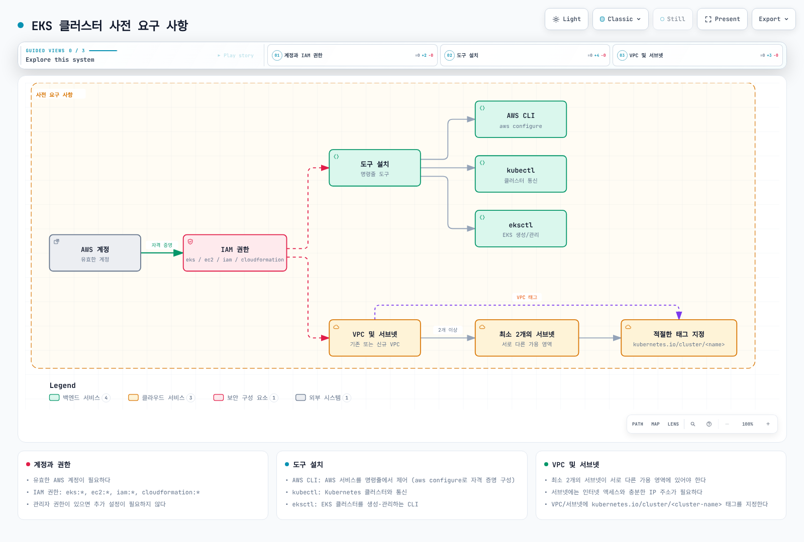
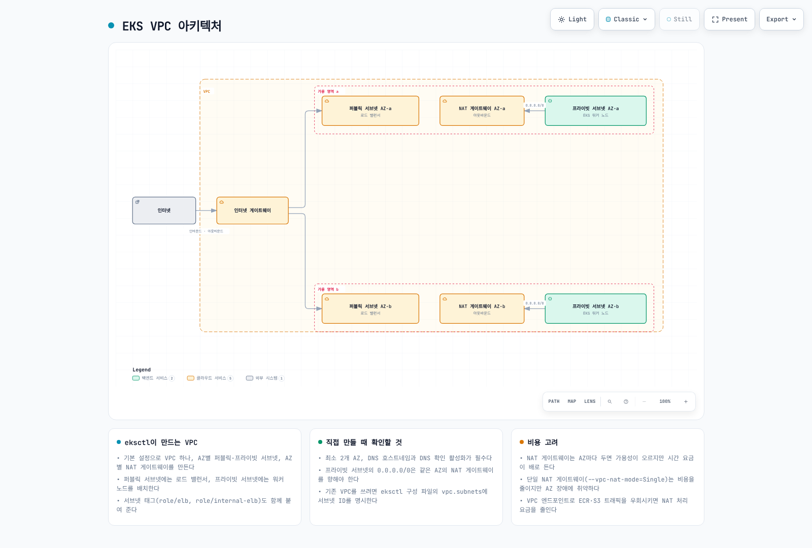

# Part 1: 사전 요구 사항

> **마지막 업데이트**: 2026년 9월 11일

Amazon EKS 클러스터를 생성하는 방법은 여러 가지가 있습니다. 이 장에서는 다양한 도구와 방법을 사용하여 EKS 클러스터를 생성하는 방법을 알아보겠습니다.

## 목차

1. [사전 요구 사항](#사전-요구-사항)
2. [eksctl](02-eks-cluster-creation-part2.md)
3. [AWS Management Console 및 CLI](02-eks-cluster-creation-part3.md)
4. [Terraform](02-eks-cluster-creation-part4.md)
5. [액세스·검증·업그레이드·삭제](02-eks-cluster-creation-part5.md)
6. [종합 가이드와 CDK](02-eks-cluster-creation.md)

## 사전 요구 사항

EKS 클러스터를 생성하기 전에 다음과 같은 사전 요구 사항이 필요합니다:

<!-- Audit 2026-09-11: restore after parent repairs legacy wildcard IAM, mandatory internet and VPC ownership-tag labels.


[🔍 인터랙티브 다이어그램 보기](https://www.atomai.click/kubernetes-docs/archmaps/ko-eks-02-eks-cluster-creation-part1-10.html)
-->

### 1. AWS 계정

유효한 AWS 계정이 필요합니다. AWS 계정이 없는 경우 [AWS 웹사이트](https://aws.amazon.com/)에서 가입할 수 있습니다.

### 2. IAM 권한

필요한 권한은 생성 도구와 직접 관리할 리소스에 따라 달라집니다. `eks:*`, `ec2:*`, `iam:*`, `cloudformation:*`를 모든 리소스에 부여하는 정책을 필수 최소 권한으로 취급하지 않습니다.

| 작업 | 검토할 권한 범위 |
| --- | --- |
| EKS 클러스터·노드 그룹 관리 | 필요한 EKS 작업과 대상 리소스 |
| 기존 IAM 역할 전달 | 승인된 역할 ARN의 `iam:PassRole` 및 서비스 조건 |
| IAM 역할·정책·OIDC 제공자 생성 | 도구가 관리하는 IAM 리소스와 이름·태그 범위 |
| 네트워크 생성 | 새 VPC·서브넷·보안 그룹에 필요한 EC2 작업 |
| eksctl/CDK 사용 | 해당 CloudFormation 스택, 실행 역할, 부트스트랩 리소스 |

프로비저닝 사용자, 클러스터 서비스 역할, 노드 역할은 별개입니다. SCP·권한 경계·세션 정책도 적용됩니다. 합성된 템플릿/계획을 기준으로 조직의 프로비저닝 권한을 검토합니다. Auto Mode의 역할 요구 사항은 일반 노드 그룹과 다릅니다.

참고: [EKS IAM 작업과 리소스](https://docs.aws.amazon.com/service-authorization/latest/reference/list_amazonelastickubernetesservice.html), [Auto Mode 역할](https://docs.aws.amazon.com/eks/latest/userguide/auto-cluster-iam-role.html).

### 3. 도구 설치

#### AWS CLI

[AWS CLI v2 공식 설치 지침](https://docs.aws.amazon.com/cli/latest/userguide/getting-started-install.html)에서 OS/CPU에 맞는 패키지를 선택하고 서명 검증 절차를 따릅니다. 이전 v1/v2 설치가 있다면 업데이트·마이그레이션 절차를 먼저 확인합니다.

| 환경 | 공식 패키지/설치 방식 |
| --- | --- |
| macOS | 서명된 `AWSCLIV2.pkg` |
| Linux x86_64 | `awscli-exe-linux-x86_64.zip` 및 PGP 서명 검증 |
| Linux ARM64 | `awscli-exe-linux-aarch64.zip` 및 PGP 서명 검증 |
| Windows | 지원되는 Windows용 MSI 설치 프로그램 |

Linux x86_64 패키지를 ARM 시스템에 그대로 사용하지 않습니다. 설치 후 `aws --version`으로 실제 실행되는 CLI를 확인합니다. 조직에서 IAM Identity Center를 사용하는 경우 다음과 같이 승인된 프로필을 구성합니다. 다른 페더레이션 방식을 사용하는 조직은 그 절차를 따르며 장기 액세스 키를 전제로 하지 않습니다.

```bash
aws configure sso --profile eks-docs
aws sso login --profile eks-docs
aws sts get-caller-identity --profile eks-docs
export AWS_PROFILE=eks-docs
```

참고: [IAM Identity Center 인증](https://docs.aws.amazon.com/cli/latest/userguide/cli-configure-sso.html). 이후 명령에서도 승인된 계정·역할·리전을 유지합니다.

#### kubectl과 eksctl — Linux/macOS

이 장의 EKS 1.36 예제에는 kubectl **1.36.4**, eksctl **0.230.0**을 기준으로 합니다. kubectl은 서버와 같은 마이너 버전을 권장하며 허용되는 차이는 ±1 마이너입니다. 업스트림 `stable.txt`의 최신 마이너를 이전 EKS 클러스터에 무조건 설치하지 않습니다.

아래 Bash 예제는 AMD64/ARM64를 구분하고 공식 체크섬을 확인한 뒤 설치합니다. `curl`, `tar`, `awk`와 `sha256sum` 또는 `shasum`이 필요하며 `/usr/local/bin` 설치는 관리자 권한이 필요합니다. 다운로드/검증 실패 시 설치를 중단합니다.

```bash
(
  set -e
  case "$(uname -s)" in
    Linux) EKS_TOOL_OS=linux; EKS_ARCHIVE_OS=Linux ;;
    Darwin) EKS_TOOL_OS=darwin; EKS_ARCHIVE_OS=Darwin ;;
    *) printf 'Use the official installer for this operating system\n' >&2; exit 1 ;;
  esac
  case "$(uname -m)" in
    x86_64) EKS_TOOL_ARCH=amd64 ;;
    aarch64|arm64) EKS_TOOL_ARCH=arm64 ;;
    *) printf 'Select a supported CPU architecture\n' >&2; exit 1 ;;
  esac
  EKS_TOOL_ARCHIVE="eksctl_${EKS_ARCHIVE_OS}_${EKS_TOOL_ARCH}.tar.gz"
  EKS_TOOL_DIR=$(mktemp -d)
  : "${EKS_TOOL_DIR:?}"
  trap 'rm -f -- "$EKS_TOOL_DIR/kubectl" "$EKS_TOOL_DIR/kubectl.sha256" "$EKS_TOOL_DIR/eksctl" "$EKS_TOOL_DIR/eksctl_checksums.txt" "$EKS_TOOL_DIR/$EKS_TOOL_ARCHIVE" "$EKS_TOOL_DIR/selected.sha256"; rmdir -- "$EKS_TOOL_DIR"' EXIT
  cd "$EKS_TOOL_DIR" || exit 1
  verify_sha() {
    if command -v sha256sum >/dev/null 2>&1; then
      sha256sum --check "$1"
    else
      shasum -a 256 --check "$1"
    fi
  }
  EKS_KUBECTL_VERSION=v1.36.4
  curl -fL "https://dl.k8s.io/release/$EKS_KUBECTL_VERSION/bin/$EKS_TOOL_OS/$EKS_TOOL_ARCH/kubectl" -o kubectl || exit 1
  curl -fL "https://dl.k8s.io/release/$EKS_KUBECTL_VERSION/bin/$EKS_TOOL_OS/$EKS_TOOL_ARCH/kubectl.sha256" -o kubectl.sha256 || exit 1
  printf '%s  kubectl\n' "$(tr -d '[:space:]' < kubectl.sha256)" > selected.sha256
  verify_sha selected.sha256 || exit 1

  EKSCTL_VERSION=0.230.0
  curl -fL "https://github.com/eksctl-io/eksctl/releases/download/v$EKSCTL_VERSION/$EKS_TOOL_ARCHIVE" -o "$EKS_TOOL_ARCHIVE" || exit 1
  curl -fL "https://github.com/eksctl-io/eksctl/releases/download/v$EKSCTL_VERSION/eksctl_checksums.txt" -o eksctl_checksums.txt || exit 1
  awk -v name="$EKS_TOOL_ARCHIVE" '$2 == name {print; count++} END {if (count != 1) exit 1}' \
    eksctl_checksums.txt > selected.sha256 || exit 1
  verify_sha selected.sha256 || exit 1
  tar -xzf "$EKS_TOOL_ARCHIVE" eksctl || exit 1
  sudo install -m 0755 kubectl /usr/local/bin/kubectl || exit 1
  sudo install -m 0755 eksctl /usr/local/bin/eksctl || exit 1
  kubectl version --client
  eksctl version
)
```

공식 절차: [Linux kubectl](https://kubernetes.io/docs/tasks/tools/install-kubectl-linux/), [macOS kubectl](https://kubernetes.io/docs/tasks/tools/install-kubectl-macos/), [eksctl 설치](https://eksctl.io/installation/).

#### Windows

PowerShell에서 [공식 kubectl 설치 절차](https://kubernetes.io/docs/tasks/tools/install-kubectl-windows/)를 따릅니다. 이 장의 AMD64 예제에는 [kubectl 1.36.4](https://dl.k8s.io/release/v1.36.4/bin/windows/amd64/kubectl.exe)와 같은 경로의 `.sha256` 파일을 사용합니다. [eksctl 0.230.0 릴리스](https://github.com/eksctl-io/eksctl/releases/tag/v0.230.0)에서 CPU에 맞는 Windows ZIP과 `eksctl_checksums.txt`를 선택합니다.

`Get-FileHash -Algorithm SHA256` 결과를 공식 해시와 비교하고 불일치하면 중단합니다. 검증 후 ZIP을 풀고 실행 파일 디렉터리를 PATH에 추가한 뒤 `kubectl version --client`, `eksctl version`을 확인합니다. PowerShell 구문을 Bash로 실행하지 않습니다.

AWS CLI 예제의 JSON 생성을 위해서는 `jq`도 준비합니다. 실제 다운로드·설치·로그인은 감사에서 실행하지 않았습니다.

### 4. VPC 및 서브넷



[🔍 인터랙티브 다이어그램 보기](https://www.atomai.click/kubernetes-docs/archmaps/ko-eks-02-eks-cluster-creation-part1-0.html)

이 그림은 NAT를 사용하는 한 가지 배치 예시이며 인터넷 경로가 필수라는 뜻은 아닙니다.

리전 EKS 클러스터에는 같은 VPC의 서로 다른 AZ에 있는 서브넷이 최소 2개 필요합니다. 각 클러스터 서브넷은 EKS용 IP가 최소 6개 남아 있어야 하며 AWS는 16개 이상을 권장합니다. 노드·Pod·로드 밸런서·업그레이드에 필요한 IP는 별도로 계획합니다. VPC DNS 호스트명과 DNS 해석도 활성화해야 합니다.

인터넷 경로가 모든 EKS 클러스터의 필수 조건은 아닙니다. 노드와 워크로드가 API·이미지·필요한 AWS 서비스에 접근할 수 있어야 하며, NAT/인터넷 경로나 필요한 VPC 엔드포인트 및 미러 이미지를 준비합니다. 프라이빗 Kubernetes 엔드포인트는 VPC 또는 연결된 네트워크에서 올바른 DNS·라우팅으로 접근합니다.

#### EKS 클러스터를 위한 VPC 태그

`kubernetes.io/cluster/<cluster-name>` VPC 태그는 오래된 클러스터의 레거시 방식이며 현재 EKS 생성의 보편적 필수 조건이 아닙니다. 로드 밸런서의 서브넷 자동 검색에는 선택한 컨트롤러의 규칙을 따릅니다:

- 퍼블릭 로드 밸런서용 서브넷: `kubernetes.io/role/elb=1`
- 내부 로드 밸런서용 서브넷: `kubernetes.io/role/internal-elb=1`

태그만으로 라우팅·보안 그룹·가용 IP가 구성되지는 않습니다. [VPC/서브넷 요구 사항](https://docs.aws.amazon.com/eks/latest/userguide/network-reqs.html)과 [인터넷 없이 운영하는 클러스터](https://docs.aws.amazon.com/eks/latest/userguide/private-clusters.html)를 확인합니다.

## 퀴즈

이 장에서 배운 내용을 테스트하려면 [EKS 클러스터 생성 - 1부 퀴즈](../quizzes/eks/02-eks-cluster-creation-part1-quiz.md)를 풀어보세요.
