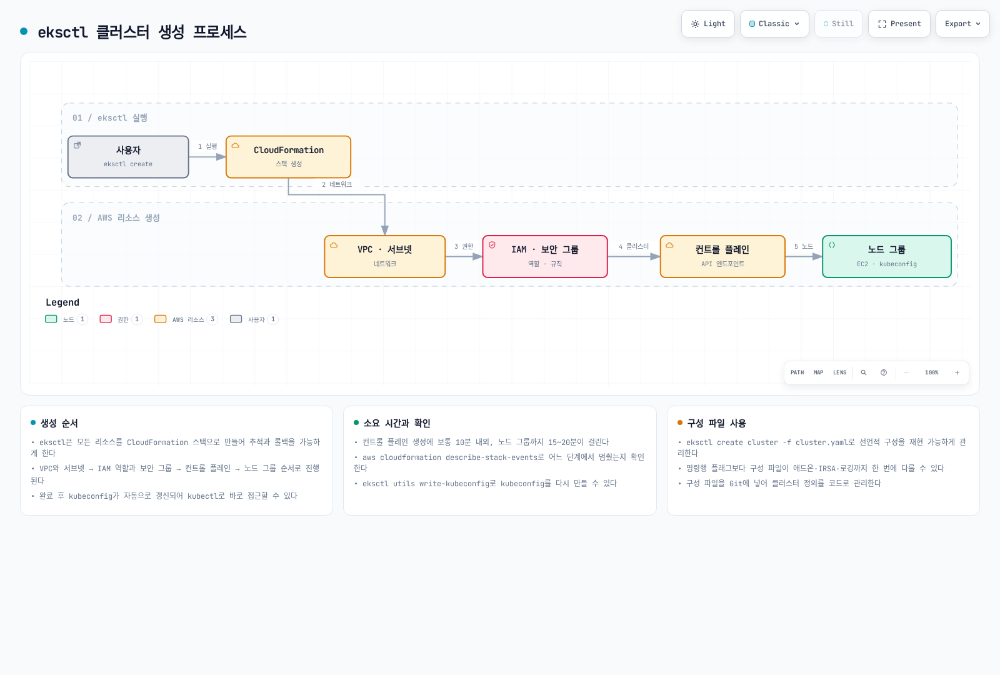
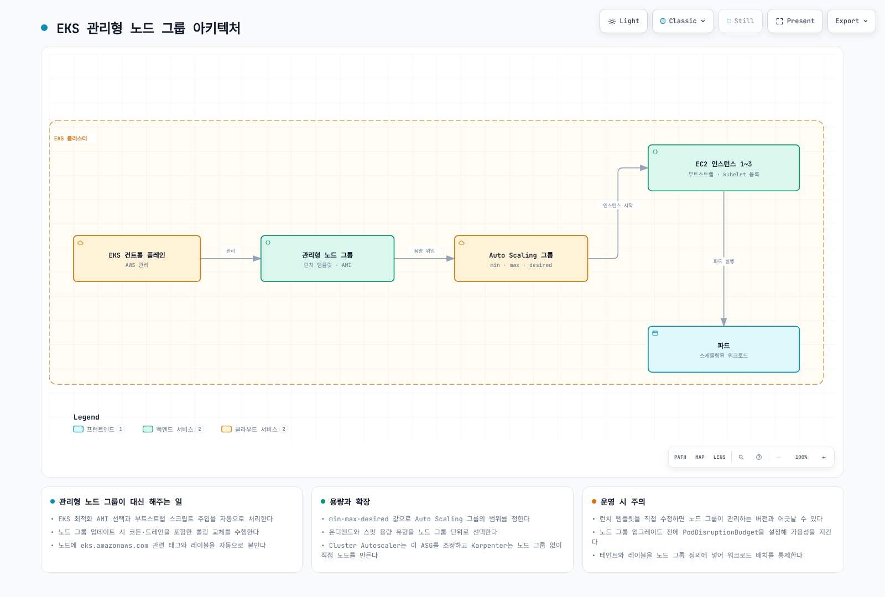
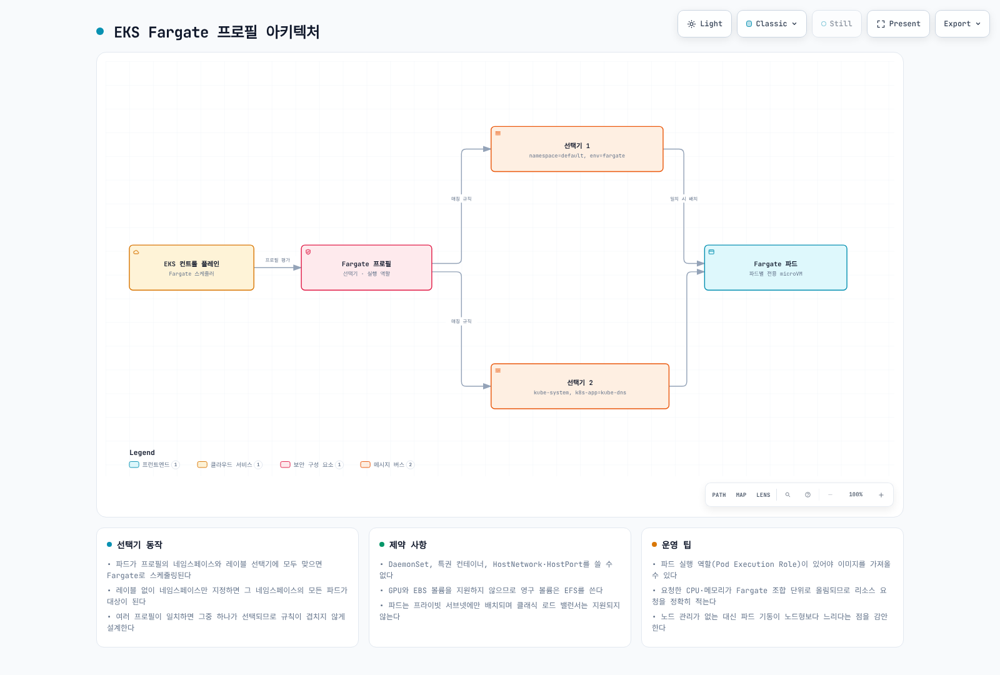
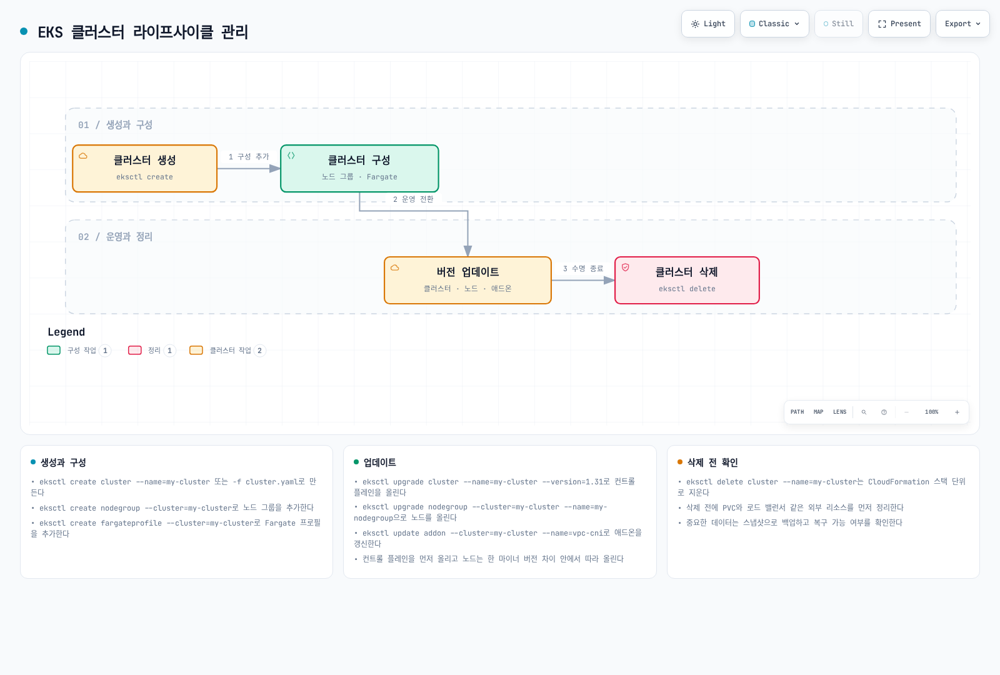

# Part 2: eksctl을 사용한 클러스터 생성

> **마지막 업데이트**: 2026년 9월 11일

[Part 1 사전 준비](02-eks-cluster-creation-part1.md)를 완료하고 전용 교육용 계정·클러스터 및 임시 kubeconfig(`EKS_KUBECONFIG`)를 사용합니다. 예제는 대안이며 하나의 연속 스크립트가 아닙니다. `EKS_CLUSTER_NAME`·`EKS_REGION`을 검토한 대상으로 설정하고 승인된 기존 자격 증명을 사용합니다. AWS 리소스 생성 명령은 과금되며 이 감사에서는 프로비저닝하지 않았습니다. 예제는 eksctl 0.230.0과 EKS 1.36을 기준으로 검토했습니다.

## eksctl을 사용한 클러스터 생성

eksctl은 EKS의 명령줄·선언적 구성 인터페이스를 제공합니다. eksctl은 CloudFormation을 사용하여 EKS 클러스터와 관련 리소스를 생성합니다.

다음 다이어그램은 eksctl을 사용한 EKS 클러스터 생성 프로세스를 보여줍니다:



[🔍 인터랙티브 다이어그램 보기](https://www.atomai.click/kubernetes-docs/archmaps/ko-eks-02-eks-cluster-creation-part2-0.html)

새 VPC를 만드는 흐름의 예시입니다. 기존 VPC를 재사용할 수 있고 소요 시간은 달라지며 kubeconfig 작성만으로 접근 권한이나 준비 상태가 확보되지는 않습니다.

### 기본 클러스터 생성

검토한 구성 파일로 기본 클러스터를 생성합니다:

```bash
eksctl create cluster --config-file cluster.yaml --kubeconfig "${EKS_KUBECONFIG:?}"
```

명령 실행 전에 아래 `cluster.yaml`을 읽고 수정합니다. EKS 1.36, AL2023, 기존 VPC 서브넷과 노드 그룹 용량을 명시하는 예제입니다. 예시 식별자와 문서용 CIDR을 승인된 실제 값으로 바꿉니다. 모든 eksctl 버전의 기본값을 설명하는 목록이 아닙니다.

### 구성 파일을 사용한 클러스터 생성

더 복잡한 구성의 경우 YAML 파일을 사용하여 클러스터를 정의할 수 있습니다:

```yaml
# cluster.yaml
apiVersion: eksctl.io/v1alpha5
kind: ClusterConfig
metadata:
  name: my-cluster
  region: us-west-2
  version: '1.36'
vpc:
  id: vpc-12345678
  subnets:
    private:
      us-west-2a:
        id: subnet-12345678
      us-west-2b:
        id: subnet-87654321
    public:
      us-west-2a:
        id: subnet-23456789
      us-west-2b:
        id: subnet-98765432
  clusterEndpoints:
    privateAccess: true
    publicAccess: true
  publicAccessCIDRs:
  - 203.0.113.10/32
managedNodeGroups:
- name: ng-1
  instanceType: m5.large
  desiredCapacity: 2
  minSize: 1
  maxSize: 3
  privateNetworking: true
  volumeSize: 80
  volumeType: gp3
  amiFamily: AmazonLinux2023
  disableIMDSv1: true
- name: ng-2
  instanceType: c5.xlarge
  desiredCapacity: 2
  privateNetworking: true
  spot: true
  amiFamily: AmazonLinux2023
  disableIMDSv1: true
cloudWatch:
  clusterLogging:
    enableTypes:
    - api
    - audit
    - authenticator
    - controllerManager
    - scheduler
fargateProfiles:
- name: fp-default
  selectors:
  - namespace: default
    labels:
      env: fargate
iam:
  withOIDC: true
accessConfig:
  authenticationMode: API
```

이 구성 파일을 사용하여 클러스터를 생성하려면 다음 명령을 실행합니다:

```bash
eksctl create cluster -f cluster.yaml --kubeconfig "${EKS_KUBECONFIG:?}"
```

위 구성은 EC2 노드와 선택적 앱 Fargate 프로필을 보여 줍니다. CoreDNS는 EC2에 두며, Fargate로 옮기려면 프로필 외에 CoreDNS의 컴퓨팅 설정도 검토해야 합니다.


이 구성은 노드 역할의 포괄적인 애드온 권한을 제거했습니다. `iam.withOIDC`를 활성화했을 때 eksctl이 생성하는 CNI IRSA와 정책을 확인하고 다른 AWS 연동 컨트롤러에는 별도 역할을 구성합니다. 실제 애드온 구성과 일반 노드 역할의 CNI 권한 대안도 검토합니다. API 인증에도 운영자의 적절한 EKS 액세스 항목·정책이 필요합니다. 최소·최대 노드 수는 Cluster Autoscaler를 설치하지 않습니다.

### 관리형 노드 그룹 생성

다음 다이어그램은 EKS 클러스터의 관리형 노드 그룹 아키텍처를 보여줍니다:



[🔍 인터랙티브 다이어그램 보기](https://www.atomai.click/kubernetes-docs/archmaps/ko-eks-02-eks-cluster-creation-part2-1.html)

인프라를 조정하는 주체는 AWS EKS 관리형 노드 그룹 서비스와 Auto Scaling 그룹입니다. 그림은 EKS가 AMI를 선택하는 기본 경로를 보여주며 사용자 지정 AMI에는 별도로 검토한 부트스트랩 구성이 필요합니다. Kubernetes는 생성된 노드에 포드를 스케줄링합니다.

기존 클러스터에 관리형 노드 그룹을 추가하려면 다음 명령을 실행합니다:

```bash
eksctl create nodegroup \
  --cluster my-cluster \
  --region us-west-2 \
  --name my-nodegroup \
  --node-type m5.large \
  --nodes 3 \
  --nodes-min 1 \
  --nodes-max 5 \
  --managed --node-ami-family AmazonLinux2023 --node-private-networking
```

또는 구성 파일을 사용할 수 있습니다:

```yaml
# nodegroup.yaml
apiVersion: eksctl.io/v1alpha5
kind: ClusterConfig

metadata:
  name: my-cluster
  region: us-west-2

managedNodeGroups:
  - name: my-nodegroup
    instanceType: m5.large
    desiredCapacity: 3
    minSize: 1
    maxSize: 5
    volumeSize: 80
    volumeType: gp3
    amiFamily: AmazonLinux2023
    privateNetworking: true
    disableIMDSv1: true
    ssh:
      allow: false
```

```bash
eksctl create nodegroup -f nodegroup.yaml
```

### Fargate 프로필 생성

프로필은 일치하는 포드를 선택하며 포드 생성이나 애플리케이션 복제본 확장을 수행하지 않습니다. 프라이빗 서브넷, Fargate 포드 실행 역할, 지원되는 워크로드 기능을 확인합니다. 애플리케이션 프로필만으로 CoreDNS가 Fargate로 이동하지는 않습니다. 아래 CLI와 파일 예제는 대안입니다.

Fargate 프로필은 네임스페이스와 레이블로 포드를 선택합니다. 프로필이 겹치면 `eks.amazonaws.com/fargate-profile` 레이블로 일치하는 프로필을 명시할 수 있으며, AWS는 여러 프로필이 일치할 때 프로필 이름의 영숫자 정렬 기준 선택을 설명합니다. 시작 지연은 이미지·용량·환경에 따라 달라집니다.

<!-- Audit asset repair pending: Correct overlapping-profile selection and remove unmeasured startup comparison. Restore this embed/link after parent repairs the asset.


[🔍 인터랙티브 다이어그램 보기](https://www.atomai.click/kubernetes-docs/archmaps/ko-eks-02-eks-cluster-creation-part2-2.html)
-->

Fargate 프로필을 생성하려면 다음 명령을 실행합니다:

```bash
eksctl create fargateprofile \
  --cluster my-cluster \
  --region us-west-2 \
  --name my-fargate-profile \
  --namespace default \
  --labels env=fargate
```

또는 구성 파일을 사용할 수 있습니다:

```yaml
# fargate.yaml
apiVersion: eksctl.io/v1alpha5
kind: ClusterConfig

metadata:
  name: my-cluster
  region: us-west-2

fargateProfiles:
- name: my-fargate-profile
  selectors:
    - namespace: default
      labels:
        env: fargate
```

```bash
eksctl create fargateprofile -f fargate.yaml
```

### 클러스터 업데이트

지원되는 마이너 버전을 한 단계씩 업그레이드합니다. 먼저 EKS 업그레이드 인사이트, 제거된 API, kubelet 버전 차이, 애드온, 용량, 워크로드 중단을 검토합니다. EKS 지원 버전은 업스트림 릴리스와 별개입니다. 첫 eksctl 명령은 변경을 미리 확인하고 `--approve`가 실제 업데이트를 시작합니다.

```bash
aws eks describe-cluster-versions --region "${EKS_REGION:?}" --output table
aws eks describe-cluster --name "${EKS_CLUSTER_NAME:?}" --region "$EKS_REGION" \
  --query 'cluster.{version:version,status:status}' --output table

# Select the next supported minor after compatibility/readiness review.
eksctl upgrade cluster --name "$EKS_CLUSTER_NAME" --region "$EKS_REGION" \
  --version "${NEXT_MINOR_VERSION:?}"

# This separate command actually starts the reviewed control-plane upgrade.
eksctl upgrade cluster --name "$EKS_CLUSTER_NAME" --region "$EKS_REGION" \
  --version "$NEXT_MINOR_VERSION" --approve
```

컨트롤 플레인 업데이트 성공을 기다린 후 검토한 순서에 따라 호환 애드온과 관리형 노드 그룹을 갱신합니다. 다음 노드 그룹 명령은 EKS가 선택하는 AMI의 업데이트이며, 사용자 지정 AMI에는 같은 시작 템플릿의 검토한 버전이 필요합니다. 관리형 노드 업데이트는 인스턴스를 교체하며 컨트롤 플레인 갱신과 별개입니다. PDB와 여유 용량은 중단 제어에 도움이 되지만 가용성을 보장하지는 않습니다.

```bash
# After control-plane completion and add-on/workload compatibility checks.
eksctl upgrade nodegroup --cluster "${EKS_CLUSTER_NAME:?}" \
  --region "${EKS_REGION:?}" --name "${EKS_NODEGROUP_NAME:?}" --wait
```

### 클러스터 삭제

생성 후 대상 실습 클러스터 ARN을 `EKS_EXPECTED_CLUSTER_ARN`으로 기록합니다. 삭제 전에 컨트롤러가 실행 중일 때 실습 LoadBalancer Service·Ingress를 제거하고 AWS 리소스 정리를 기다리며 PVC 회수 정책과 보존 데이터를 확인합니다. 제거할 리소스만 있는 클러스터인지 확인합니다. 아래 ARN 검사는 기록한 계정·리전·이름을 확인할 뿐 백업이나 불변 생성 식별자가 아닙니다.

```bash
if CURRENT_CLUSTER_ARN=$(aws eks describe-cluster \
  --name "${EKS_CLUSTER_NAME:?}" --region "${EKS_REGION:?}" \
  --query cluster.arn --output text) &&
  [ "$CURRENT_CLUSTER_ARN" = "${EKS_EXPECTED_CLUSTER_ARN:?Recorded lab cluster ARN required}" ]; then
  eksctl delete cluster --name "$EKS_CLUSTER_NAME" --region "$EKS_REGION" --wait
else
  printf '%s\n' 'Cluster lookup/identity mismatch; no deletion attempted.' >&2
fi
```

이후 CloudFormation 삭제 이벤트와 보존·별도 생성 리소스를 확인합니다. 기존 공유 VPC는 이 예제가 소유한 리소스가 아닙니다. 수명 주기 의존성은 [전체 정리 안내](02-eks-cluster-creation-part5.md)를 함께 확인합니다.

## EKS 클러스터 라이프사이클 관리

수명 주기는 생성·구성·운영·검토한 업그레이드와 최종 정리를 포함합니다. 컨트롤러가 실행 중일 때 애플리케이션 로드 밸런서 리소스를 제거하고, 이후 노드 그룹·프로필과 클러스터를 제거합니다. 전용 VPC는 의존 리소스가 사라진 뒤에만 제거합니다.

<!-- Audit asset repair pending: Correct upgrade target/approval and resource cleanup order; VPC comes after dependencies are removed. Restore this embed/link after parent repairs the asset.


[🔍 인터랙티브 다이어그램 보기](https://www.atomai.click/kubernetes-docs/archmaps/ko-eks-02-eks-cluster-creation-part2-3.html)
-->

## 퀴즈

이 장에서 배운 내용을 테스트하려면 [EKS 클러스터 생성 - 2부 퀴즈](../quizzes/eks/02-eks-cluster-creation-part2-quiz.md)를 풀어보세요.

## 참고 자료

- [eksctl schema](https://schema.eksctl.io/)
- [EKS versions](https://docs.aws.amazon.com/eks/latest/userguide/kubernetes-versions.html)
- [AL2023](https://docs.aws.amazon.com/eks/latest/userguide/al2023.html)
- [Fargate profiles](https://docs.aws.amazon.com/eks/latest/userguide/fargate-profile.html)
- [Upgrade EKS](https://docs.aws.amazon.com/eks/latest/userguide/update-cluster.html)
- [Managed node updates](https://docs.aws.amazon.com/eks/latest/userguide/managed-node-update-behavior.html)
