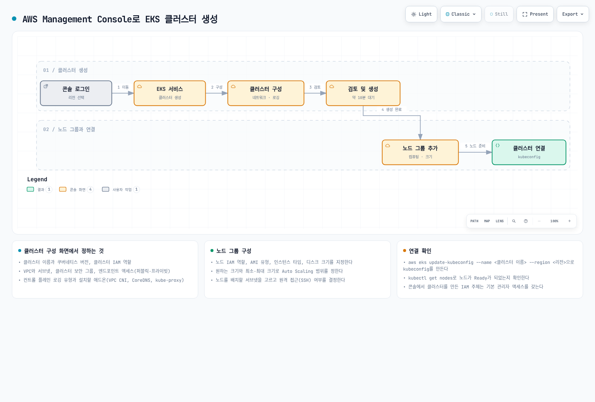
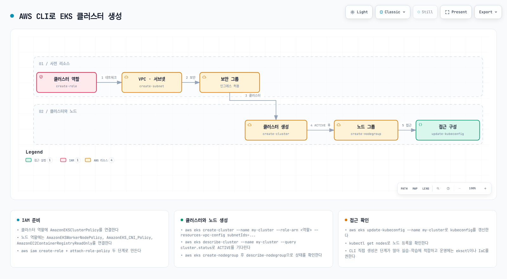

# Part 3: AWS Management Console 및 CLI를 사용한 클러스터 생성

> **마지막 업데이트**: 2026년 9월 11일

[Part 1 사전 준비](02-eks-cluster-creation-part1.md)를 완료합니다. 예제는 과금되는 AWS 리소스를 만드는 교육용 절차이며 이번 감사에서 프로비저닝하거나 프로덕션 구성을 인증하지 않았습니다.

## AWS Management Console을 사용한 클러스터 생성

일반 EC2 관리형 노드 그룹 클러스터를 만드는 절차입니다. **Custom configuration**을 선택하고 **Use EKS Auto Mode**를 끕니다. 빠른 Auto Mode 경로는 역할과 인프라 관리 방식이 다릅니다.



[🔍 인터랙티브 다이어그램 보기](https://www.atomai.click/kubernetes-docs/archmaps/ko-eks-02-eks-cluster-creation-part3-0.html)

그림은 예시 흐름이며 생성 시간은 달라집니다. 기본값이 요구사항을 충족한다고 가정하지 말고 생성자 접근과 노드 준비 상태를 명시적으로 검토합니다.

### 클러스터 구성

대상 계정·리전의 EKS 콘솔에서 **Add cluster → Create**를 선택하고 위의 사용자 지정 구성을 사용합니다.

- 고유한 클러스터 이름과 현재 EKS 지원 버전을 선택합니다. 아래 CLI 예제는 **1.36**이며 업스트림 Kubernetes 릴리스와 EKS 지원 목록은 별개입니다.
- `eks.amazonaws.com` 신뢰와 `AmazonEKSClusterPolicy`를 가진 검토한 클러스터 IAM 역할을 선택합니다. 프로비저닝 자격 증명에는 범위를 제한한 `iam:PassRole`, 필요한 서비스 연결 역할 생성 등 적절한 EKS·IAM 권한도 필요합니다.
- 표준·확장 지원 정책, 태그, 선택 기능을 검토합니다. EKS 1.28 이상은 AWS 소유 키로 Kubernetes API 데이터를 이미 봉투 암호화하며 고객 관리 KMS 키는 선택 사항입니다.
- API 액세스 항목 인증을 선택합니다. 이 실습은 생성자의 자동 관리자 접근을 허용하지 않고 기존 운영자 역할의 명시적 액세스 항목을 구성합니다. 이후 kubeconfig를 만들어도 접근 권한이 생기지는 않습니다.

### 네트워킹 지정

EKS 요구사항에 맞는 기존 VPC를 선택하거나 완전한 네트워크 설계로 먼저 준비합니다. 서로 다른 AZ의 적합한 서브넷을 최소 두 개 선택합니다. 클러스터 서브넷마다 여유 IP가 최소 여섯 개 필요하고 AWS는 열여섯 개 이상을 권장합니다. 노드·포드·업데이트 용량도 별도로 계획합니다.

VPC DNS, 라우팅, IP 계열·서비스 CIDR 중복, 필요한 AWS 서비스·레지스트리 연결을 검토합니다. 적절한 NAT·VPC 엔드포인트가 있는 프라이빗 노드 서브넷을 사용합니다. API 엔드포인트 선택은 다음과 같습니다:

- **퍼블릭:** 퍼블릭 경로를 사용하며 `publicAccessCidrs`로 클라이언트 송신 주소 범위를 제한합니다.
- **프라이빗:** 필요한 경로·DNS·보안 그룹·IAM/Kubernetes 권한을 갖춘 VPC 내부 또는 연결된 네트워크에서 접근합니다.
- **퍼블릭 및 프라이빗:** 두 경로를 사용하되 퍼블릭 CIDR을 제한하고 프라이빗 경로도 확인합니다.

EKS가 클러스터 보안 그룹을 생성합니다. 추가 그룹은 선택 사항이며 클러스터 인터페이스에 연결되고 모든 노드 그룹에 자동 적용되지는 않습니다. 이 그룹에 TCP 443을 전면 개방하는 규칙으로 퍼블릭 API를 제어하지 않습니다.

### 로깅 구성

**Configure observability**에서 필요한 컨트롤 플레인 로그(`api`, `audit`, `authenticator`, `controllerManager`, `scheduler`)를 선택합니다. 선택적 지표 기능은 별도로 검토합니다. CloudWatch 수집·저장·쿼리 비용이 발생하며 로그는 최선 노력 방식으로 전달됩니다.

### 애드온 선택

일반 EC2 클러스터에서는 검토한 대체 구현이 없다면 호환 VPC CNI·CoreDNS·kube-proxy를 유지합니다. **Configure selected add-ons settings**에서 호환 버전과 필요한 애드온 IAM 자격 증명을 구성합니다. 선택적 컨트롤러·스토리지 드라이버는 별도 설치와 권한이 필요합니다.

### 검토 및 생성

역할, 접근 모드, 네트워크, 애드온 설정을 검토한 뒤 클러스터를 생성하고 **ACTIVE**를 기다립니다. kubectl 접근 전에 운영자 액세스 항목을 구성합니다.

### 노드 그룹 추가

클러스터의 **Compute**에서 관리형 노드 그룹을 추가합니다:

1. 사용하지 않는 그룹 이름과 검토한 EC2 노드 IAM 역할을 선택합니다.
2. **AL2023 x86_64**, 호환 인스턴스 유형, 워크로드에 맞는 디스크·크기 범위를 선택합니다. CLI의 `m5.large`, 80 GiB, 1–3 범위는 예시이며 측정된 크기 권장값이 아닙니다.
3. 실제 프라이빗 서브넷을 선택합니다. 별도로 검토한 접근 경로가 필요하지 않으면 SSH는 비활성화합니다.
4. 그룹을 생성하고 **ACTIVE**, 노드의 정상 **Ready** 상태를 기다립니다. 최소·최대 범위만으로 워크로드 기반 노드 오토스케일러가 설치되지는 않습니다.

노드 역할에는 워커·이미지 풀 권한이 필요합니다. CNI 전용 워크로드 역할을 우선 검토하고, 아래 CLI의 단순한 IPv4 노드 역할 대안은 한계를 명시하여 사용합니다.

## AWS CLI를 사용한 클러스터 생성

일반 IPv4 예제로 EKS 1.36과 AL2023 관리형 노드를 사용합니다. 이 경로와 콘솔 경로 중 하나를 선택합니다. CLI 단계는 같은 Bash 세션에서 사용하지 않는 실습 이름으로 실행하고, 소유권·정리 확인을 위해 전용 응답 파일을 보관합니다.



[🔍 인터랙티브 다이어그램 보기](https://www.atomai.click/kubernetes-docs/archmaps/ko-eks-02-eks-cluster-creation-part3-1.html)

그림은 일반적인 단계를 보여줍니다. EKS가 클러스터 보안 그룹을 자동 생성하므로 아래의 현재 역할 정책과 명시적인 접근 설정을 사용합니다. 이번 감사에서는 AWS 작업을 실행하지 않았습니다.

```bash
: "${EKS_CLUSTER_NAME:?Choose an unused training cluster name}"
: "${EKS_REGION:?For example us-west-2}"
: "${OPERATOR_ROLE_ARN:?Existing operator IAM role that this login may assume}"
: "${APPROVED_API_CIDR:?Actual approved administration egress CIDR}"
EKS_CREATE_DIR=$(mktemp -d /tmp/eks-console-cli.XXXXXX)
: "${EKS_CREATE_DIR:?}"
EKS_KUBECONFIG="$EKS_CREATE_DIR/kubeconfig"
aws sts get-caller-identity
```

### 1. 클러스터 IAM 역할 생성

다음 명령은 **새** 역할을 만들고 생성 실패 시 중단합니다. 이미 검토한 역할을 재사용한다면 `EKS_CLUSTER_ROLE_ARN`을 설정하고 생성·연결 블록을 건너뜁니다. 이름이 우연히 같은 기존 역할을 변경하지 않습니다.

```bash
cat > "${EKS_CREATE_DIR:?}/cluster-trust.json" << 'EOF'
{
  "Version":"2012-10-17",
  "Statement":[{
    "Effect":"Allow",
    "Principal":{"Service":"eks.amazonaws.com"},
    "Action":"sts:AssumeRole"
  }]
}
EOF
aws iam create-role --role-name "${NEW_CLUSTER_ROLE_NAME:?Unused role name}" \
  --assume-role-policy-document "file://$EKS_CREATE_DIR/cluster-trust.json" \
  --query Role --output json > "$EKS_CREATE_DIR/created-cluster-role.json" || exit 1
EKS_CLUSTER_ROLE_ARN=$(jq -er '.Arn' "$EKS_CREATE_DIR/created-cluster-role.json") || exit 1
aws iam attach-role-policy --role-name "$NEW_CLUSTER_ROLE_NAME" \
  --policy-arn arn:aws:iam::aws:policy/AmazonEKSClusterPolicy || exit 1
```

### 2. VPC 및 서브넷 생성

검토한 기존 VPC를 사용하거나 아래 공식 템플릿으로 완전한 예제 네트워크를 선택적으로 생성합니다. 템플릿은 AZ 두 개의 퍼블릭·프라이빗 서브넷 각각 두 개, 인터넷 게이트웨이, NAT 게이트웨이·EIP 두 개를 생성합니다. CIDR 중복, 경로, 비용을 먼저 검토합니다. URL의 날짜는 Kubernetes 버전이 아닙니다.

```bash
# Optional new-network path; review the entire template and its CIDR/NAT costs first.
aws cloudformation create-stack --region "${EKS_REGION:?}" \
  --stack-name "${NEW_VPC_STACK_NAME:?Unused stack name}" \
  --template-url https://s3.us-west-2.amazonaws.com/amazon-eks/cloudformation/2020-10-29/amazon-eks-vpc-private-subnets.yaml \
  > "${EKS_CREATE_DIR:?}/vpc-stack.json" || exit 1
aws cloudformation wait stack-create-complete --region "$EKS_REGION" \
  --stack-name "$NEW_VPC_STACK_NAME" || exit 1
aws cloudformation describe-stacks --region "$EKS_REGION" \
  --stack-name "$NEW_VPC_STACK_NAME" --query 'Stacks[0].Outputs' --output table
```

스택의 `SubnetIds` 출력에는 **네 서브넷 모두** 포함됩니다. 라우팅 테이블·태그로 프라이빗 두 개를 확인한 뒤 `EKS_PRIVATE_SUBNET_A/B`를 설정합니다. 명시적으로 라우팅 테이블에 연결하지 않은 서브넷도 VPC의 기본 라우팅 테이블을 사용합니다.

다음은 AZ·VPC·IP·DNS 기본 조건 검사입니다. 실제 경로, 보안 통제, 레지스트리·S3 접근, 필요한 VPC 엔드포인트도 별도로 확인합니다. VPC와 서브넷 두 개만 생성하면 노드 송신 경로까지 구성되는 것은 아닙니다.

```bash
# Set these IDs after identifying the actual private subnets and their routes.
aws ec2 describe-subnets --region "${EKS_REGION:?}" \
  --subnet-ids "${EKS_PRIVATE_SUBNET_A:?}" "${EKS_PRIVATE_SUBNET_B:?}" \
  --query Subnets --output json > "${EKS_CREATE_DIR:?}/subnets.json" || exit 1
jq -e 'length == 2 and
  (map(.VpcId) | unique | length) == 1 and
  (map(.AvailabilityZone) | unique | length) == 2 and
  all(.[]; .AvailableIpAddressCount >= 6)' \
  "$EKS_CREATE_DIR/subnets.json" >/dev/null || exit 1
EKS_VPC_ID=$(jq -er '.[0].VpcId' "$EKS_CREATE_DIR/subnets.json") || exit 1
aws ec2 describe-vpc-attribute --region "$EKS_REGION" --vpc-id "$EKS_VPC_ID" \
  --attribute enableDnsSupport --output json > "$EKS_CREATE_DIR/dns-support.json" || exit 1
aws ec2 describe-vpc-attribute --region "$EKS_REGION" --vpc-id "$EKS_VPC_ID" \
  --attribute enableDnsHostnames --output json > "$EKS_CREATE_DIR/dns-hostnames.json" || exit 1
jq -e '.EnableDnsSupport.Value == true' "$EKS_CREATE_DIR/dns-support.json" >/dev/null || exit 1
jq -e '.EnableDnsHostnames.Value == true' "$EKS_CREATE_DIR/dns-hostnames.json" >/dev/null || exit 1
```

### 3. 클러스터 보안 그룹 생성

EKS가 클러스터 생성 중 보안 그룹을 자동 생성합니다. 이 예제에는 `0.0.0.0/0`으로 개방한 별도 그룹이 필요하지 않습니다. 퍼블릭 API는 `publicAccessCidrs`로 제한하며 클러스터 보안 그룹은 프라이빗 경로·노드 통신에 적용됩니다.

추가 그룹이 필요하면 규칙을 검토하고 해당 ID를 명시적으로 구성에 추가합니다. 클러스터 네트워크 요청을 JSON으로 작성합니다:

```bash
# EKS creates the cluster security group; public API restrictions use this CIDR list.
jq -n --arg a "${EKS_PRIVATE_SUBNET_A:?}" --arg b "${EKS_PRIVATE_SUBNET_B:?}" \
  --arg cidr "${APPROVED_API_CIDR:?}" '{
    subnetIds:[$a,$b],
    endpointPublicAccess:true,
    endpointPrivateAccess:true,
    publicAccessCidrs:[$cidr]
  }' > "${EKS_CREATE_DIR:?}/vpc-config.json" || exit 1
```

### 4. EKS 클러스터 생성

`aws eks create-cluster`에는 `--kubernetes-version`을 사용합니다. `--version`은 AWS CLI 버전을 출력하며 API JSON 필드는 `version`입니다. 예제는 생성자의 자동 관리자 접근을 끄고 컨트롤 플레인 로그 다섯 유형과 일반 코어 애드온 부트스트랩을 활성화합니다. CLI 부트스트랩 애드온은 자체 관리형이므로 EKS 관리형 애드온으로 전환하려면 별도의 호환 버전·구성 절차가 필요합니다.

```bash
aws eks describe-cluster-versions --region "${EKS_REGION:?}" --output table
aws eks create-cluster --name "${EKS_CLUSTER_NAME:?}" --region "$EKS_REGION" \
  --kubernetes-version 1.36 --role-arn "${EKS_CLUSTER_ROLE_ARN:?}" \
  --resources-vpc-config "file://${EKS_CREATE_DIR:?}/vpc-config.json" \
  --access-config authenticationMode=API,bootstrapClusterCreatorAdminPermissions=false \
  --bootstrap-self-managed-addons \
  --logging '{"clusterLogging":[{"types":["api","audit","authenticator","controllerManager","scheduler"],"enabled":true}]}' \
  --query cluster --output json > "$EKS_CREATE_DIR/created-cluster.json" || exit 1
aws eks wait cluster-active --name "$EKS_CLUSTER_NAME" --region "$EKS_REGION" || exit 1
aws eks describe-cluster --name "$EKS_CLUSTER_NAME" --region "$EKS_REGION" \
  --query 'cluster.{arn:arn,status:status,version:version,vpc:resourcesVpcConfig}'
```

Waiter 실패가 모든 리소스의 롤백을 의미하지는 않습니다. 다음 단계 전에 클러스터 상태와 기록한 응답을 확인합니다. 로깅에는 CloudWatch 비용이 발생합니다.

### 5. 노드 IAM 역할 생성

EC2를 신뢰하는 새 역할을 만듭니다. `AmazonEC2ContainerRegistryPullOnly`는 이미지 풀 권한을 제공합니다. 단순한 **IPv4 실습**에서는 부트스트랩된 VPC CNI가 동작하도록 노드 역할에 CNI 권한을 둡니다. 지원되는 전용 CNI IRSA·Pod Identity 역할을 우선 검토하고 해당 구성이 동작한 뒤에만 대안 권한을 제거합니다. 다른 애플리케이션·컨트롤러의 AWS 권한을 모든 노드에 부여하지 않습니다.

```bash
cat > "${EKS_CREATE_DIR:?}/node-trust.json" << 'EOF'
{
  "Version":"2012-10-17",
  "Statement":[{
    "Effect":"Allow",
    "Principal":{"Service":"ec2.amazonaws.com"},
    "Action":"sts:AssumeRole"
  }]
}
EOF
aws iam create-role --role-name "${NEW_NODE_ROLE_NAME:?Unused role name}" \
  --assume-role-policy-document "file://$EKS_CREATE_DIR/node-trust.json" \
  --query Role --output json > "$EKS_CREATE_DIR/created-node-role.json" || exit 1
EKS_NODE_ROLE_ARN=$(jq -er '.Arn' "$EKS_CREATE_DIR/created-node-role.json") || exit 1
aws iam attach-role-policy --role-name "$NEW_NODE_ROLE_NAME" \
  --policy-arn arn:aws:iam::aws:policy/AmazonEKSWorkerNodePolicy || exit 1
aws iam attach-role-policy --role-name "$NEW_NODE_ROLE_NAME" \
  --policy-arn arn:aws:iam::aws:policy/AmazonEC2ContainerRegistryPullOnly || exit 1
# Simple IPv4 lab fallback only. Prefer a dedicated CNI workload role in production.
aws iam attach-role-policy --role-name "$NEW_NODE_ROLE_NAME" \
  --policy-arn arn:aws:iam::aws:policy/AmazonEKS_CNI_Policy || exit 1
```

### 6. 노드 그룹 생성

검토한 프라이빗 서브넷에 관리형 그룹을 만듭니다. EKS가 선택한 AL2023 AMI의 노드 초기화와 관리형 노드 액세스 항목을 제공합니다. 예제는 SSH 접근과 사용자 지정 시작 템플릿 덮어쓰기를 사용하지 않습니다.

```bash
aws eks create-nodegroup --cluster-name "${EKS_CLUSTER_NAME:?}" --region "${EKS_REGION:?}" \
  --nodegroup-name "${NEW_NODEGROUP_NAME:?}" --node-role "${EKS_NODE_ROLE_ARN:?}" \
  --subnets "${EKS_PRIVATE_SUBNET_A:?}" "${EKS_PRIVATE_SUBNET_B:?}" \
  --ami-type AL2023_x86_64_STANDARD --instance-types m5.large --capacity-type ON_DEMAND \
  --disk-size 80 --scaling-config minSize=1,maxSize=3,desiredSize=2 \
  --query nodegroup --output json > "${EKS_CREATE_DIR:?}/created-nodegroup.json" || exit 1
aws eks wait nodegroup-active --cluster-name "$EKS_CLUSTER_NAME" --region "$EKS_REGION" \
  --nodegroup-name "$NEW_NODEGROUP_NAME" || exit 1
aws eks describe-nodegroup --cluster-name "$EKS_CLUSTER_NAME" --region "$EKS_REGION" \
  --nodegroup-name "$NEW_NODEGROUP_NAME" \
  --query 'nodegroup.{status:status,health:health,ami:amiType,release:releaseVersion}'
```

### 7. kubeconfig 구성

현재 로그인에서 수임할 수 있는 기존 운영자 IAM 역할을 사용합니다. 프로비저닝 자격 증명에는 EKS 액세스 항목 생성과 실습 접근 정책 연결 권한이 필요합니다. 다음은 이 클러스터의 Kubernetes 관리 권한이며 AWS 계정 전체의 관리자 권한이 아닙니다.

```bash
# The named operator gets cluster-admin only on this training cluster.
aws eks create-access-entry --cluster-name "${EKS_CLUSTER_NAME:?}" --region "${EKS_REGION:?}" \
  --principal-arn "${OPERATOR_ROLE_ARN:?}" --type STANDARD || exit 1
aws eks associate-access-policy --cluster-name "$EKS_CLUSTER_NAME" --region "$EKS_REGION" \
  --principal-arn "$OPERATOR_ROLE_ARN" \
  --policy-arn arn:aws:eks::aws:cluster-access-policy/AmazonEKSClusterAdminPolicy \
  --access-scope type=cluster || exit 1
aws eks update-kubeconfig --name "$EKS_CLUSTER_NAME" --region "$EKS_REGION" \
  --role-arn "$OPERATOR_ROLE_ARN" --kubeconfig "${EKS_KUBECONFIG:?}" \
  --alias "$EKS_CLUSTER_NAME" || exit 1
```

### 8. 클러스터 확인

대상 컨텍스트, 노드 준비 상태, 시스템 포드를 확인합니다:

```bash
kubectl --kubeconfig "${EKS_KUBECONFIG:?}" config current-context
kubectl --kubeconfig "$EKS_KUBECONFIG" auth can-i get nodes
kubectl --kubeconfig "$EKS_KUBECONFIG" get nodes -o wide
kubectl --kubeconfig "$EKS_KUBECONFIG" get pods -n kube-system
```

인프라의 `ACTIVE` 상태만으로 애플리케이션 준비를 확인할 수 없으며 `get nodes` 결과에서 실제 정상 Ready 상태를 확인해야 합니다. 운영 사용 전에 스케줄링, DNS, 이미지 풀, 애플리케이션 의존성을 검증합니다. 이번 감사에서는 성능·가용성을 측정하지 않았습니다.

정리는 [검토한 수명 주기 절차](02-eks-cluster-creation.md#클러스터-삭제)를 따릅니다. 애플리케이션의 클라우드 의존성을 먼저 제거하고 적절한 노드 그룹·프로필과 클러스터를 정리합니다. 실습 전용 VPC는 의존 리소스가 사라진 뒤 제거하고 역할도 실습 소유만 정리합니다. 실패하면 응답·소유권 파일을 유지합니다.

## 퀴즈

이 장에서 배운 내용을 테스트하려면 [EKS 클러스터 생성 - 3부 퀴즈](../quizzes/eks/02-eks-cluster-creation-part3-quiz.md)를 풀어보세요.

## 참고 자료

- [Create an EKS cluster](https://docs.aws.amazon.com/eks/latest/userguide/create-cluster.html)
- [EKS network requirements](https://docs.aws.amazon.com/eks/latest/userguide/network-reqs.html)
- [API endpoint access](https://docs.aws.amazon.com/eks/latest/userguide/cluster-endpoint.html)
- [Node IAM role](https://docs.aws.amazon.com/eks/latest/userguide/create-node-role.html)
- [Default envelope encryption](https://docs.aws.amazon.com/eks/latest/userguide/envelope-encryption.html)
- [EKS access entries](https://docs.aws.amazon.com/eks/latest/userguide/access-entries.html)
