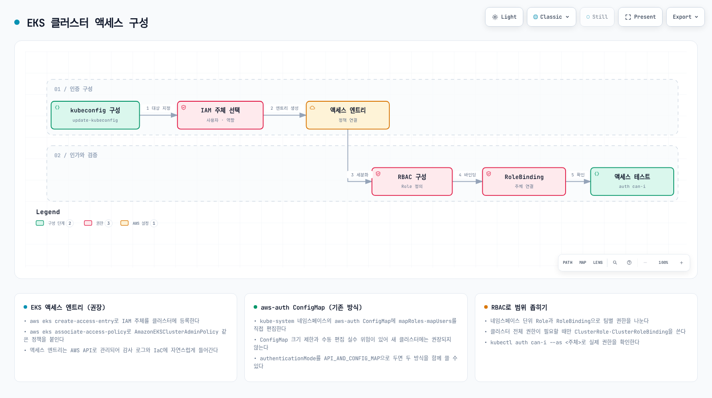
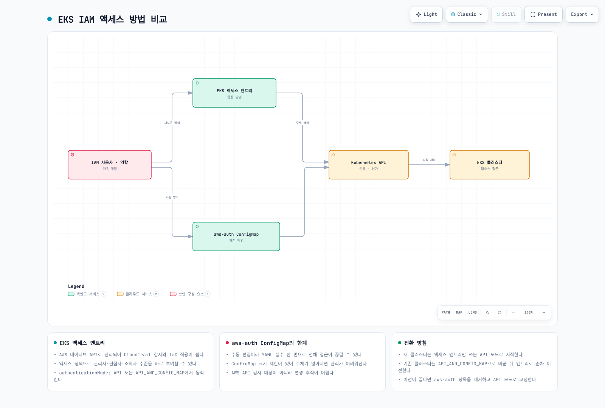
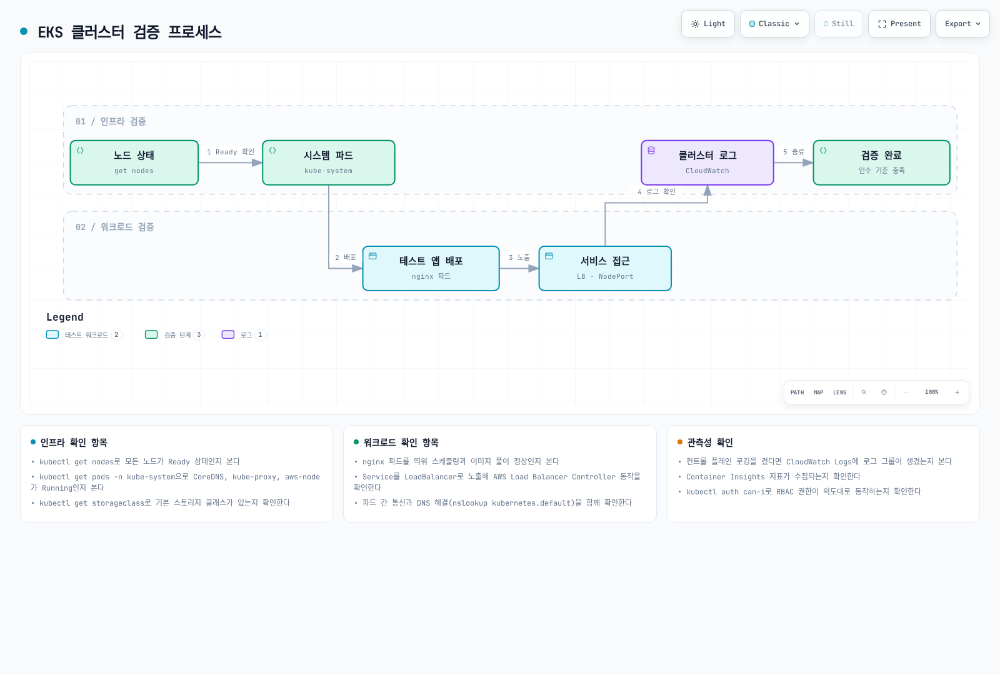
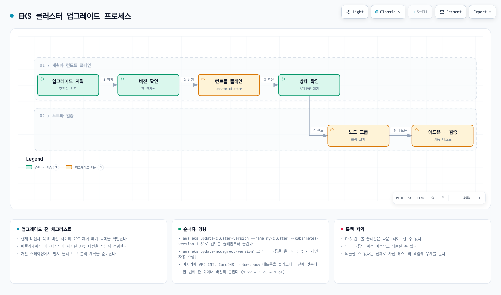
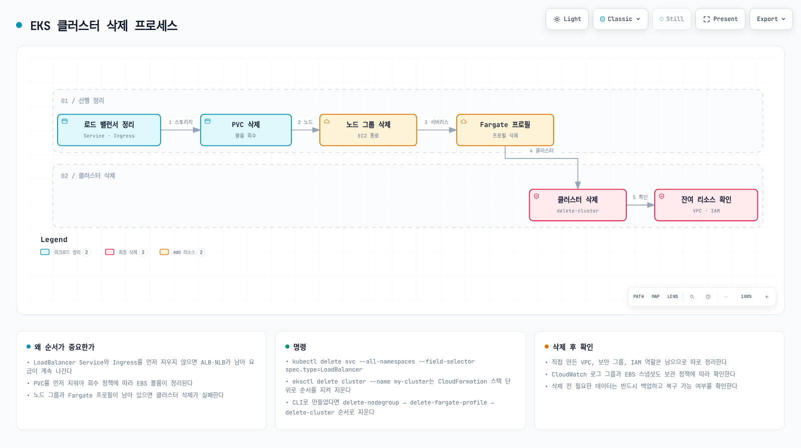

# Part 5: 클러스터 액세스, 검증, 업그레이드 및 삭제

> **마지막 업데이트**: 2026년 9월 11일

기존 EKS 클러스터를 대상으로 하는 가이드입니다. 승인된 계정·리전과 전용 kubeconfig를 사용하세요. 현재 AWS 문서와 로컬 파서로 예제를 검토했으며 이번 감사에서 AWS 변경·클러스터 워크로드·프로덕션 복구 테스트를 실행하지 않았습니다.

## 클러스터 액세스 구성

### 대상 컨텍스트 준비

의도한 클러스터의 `EXAMPLE_CLUSTER`·`EXAMPLE_REGION`을 설정합니다. 현재 AWS CLI 신원에는 해당 AWS API 권한이 필요합니다. Kubernetes 관리에는 이미 허용된 신원을 사용하며 필요하면 운영자가 맡을 수 있는 승인된 역할을 `ADMIN_ROLE_ARN`으로 지정합니다. kubeconfig는 권한을 부여하지 않습니다. 초기 관리 권한은 클러스터의 부트스트랩·접근 설정에 따라 달라지며 항상 “생성자만” 접근하는 것은 아닙니다.

아래 변수·헬퍼 함수는 전용 Bash 세션에서 사용합니다. 필요한 작업 흐름만 실행하세요. 업그레이드와 삭제는 별도 작업입니다.

```bash
set -euo pipefail
umask 077
: "${EXAMPLE_CLUSTER:?Set the existing cluster name}"
: "${EXAMPLE_REGION:?Set the Region}"
EKS_REVIEW_DIR=$(mktemp -d /tmp/eks-lifecycle-review.XXXXXX)
ADMIN_KUBECONFIG="$EKS_REVIEW_DIR/admin.kubeconfig"
aws eks describe-cluster --name "$EXAMPLE_CLUSTER" --region "$EXAMPLE_REGION" \
  --query cluster --output json > "$EKS_REVIEW_DIR/cluster-before.json"
jq -e '{arn,createdAt} | (.arn | type == "string") and (.createdAt != null)' \
  "$EKS_REVIEW_DIR/cluster-before.json" >/dev/null
EXPECTED_CLUSTER_ARN=$(jq -er '.arn' "$EKS_REVIEW_DIR/cluster-before.json")
EXPECTED_CLUSTER_CREATED=$(jq -er '.createdAt | tostring' "$EKS_REVIEW_DIR/cluster-before.json")
CLUSTER_KUBERNETES_VERSION=$(jq -er '.version' "$EKS_REVIEW_DIR/cluster-before.json")
KUBECONFIG_ARGS=(--name "$EXAMPLE_CLUSTER" --region "$EXAMPLE_REGION"
  --kubeconfig "$ADMIN_KUBECONFIG" --alias "$EXAMPLE_CLUSTER-review")
if [ -n "${ADMIN_ROLE_ARN:-}" ]; then
  KUBECONFIG_ARGS+=(--role-arn "$ADMIN_ROLE_ARN")
fi
aws eks update-kubeconfig "${KUBECONFIG_ARGS[@]}"
```
기록된 검토 디렉터리에 전용 kubeconfig를 작성하므로 기본 컨텍스트를 바꾸지 않습니다. `--kubeconfig`를 생략하면 AWS CLI가 `KUBECONFIG` 또는 기본 `~/.kube/config`를 사용하므로 모든 환경에서 경로가 고정되지는 않습니다.

<!-- Audit 2026-09-11: parent asset repair required. Material correction:access-policy andRBACpermissionsareadditive;RBACcannotnarrowAmazonEKSClusterAdminPolicy. Arrow3narrowandfooter--asprincipal effectiveEKSpermissionsclaimarewrong;testactualIAMcredentials. Rebuilddiagramasalternative/additiveauthorizationpaths.


[🔍 인터랙티브 다이어그램 보기](https://www.atomai.click/kubernetes-docs/archmaps/ko-eks-02-eks-cluster-creation-part5-0.html)
-->

액세스 엔트리는 EKS 접근 정책, Kubernetes 그룹·RBAC 또는 둘 다 사용할 수 있습니다. 권한은 **합산**되므로 네임스페이스 RoleBinding이 EKS 클러스터 관리자 접근 정책을 제한할 수는 없습니다. 이 예제는 광범위한 접근 정책을 추가하지 않고 사용자 정의 그룹과 네임스페이스 RBAC를 사용합니다.
### EKS 업데이트 완료 확인

설정·버전 변경은 비동기입니다. `ACTIVE`·`InProgress` 상태를 한 번 확인한 것으로 완료를 판단하지 말고 반환된 업데이트 ID를 추적하며 오류가 나면 중단합니다:

```bash
# Additional describe-update arguments can identify a node group or add-on.
wait_eks_update() {
  local update_id="$1"
  shift
  local update_json update_status attempt
  for attempt in $(seq 1 120); do
    update_json=$(aws eks describe-update --name "$EXAMPLE_CLUSTER" \
      --region "$EXAMPLE_REGION" --update-id "$update_id" "$@" --output json) || return 1
    update_status=$(printf '%s' "$update_json" | jq -er '.update.status') || return 1
    case "$update_status" in
      Successful) return 0 ;;
      Failed|Cancelled)
        printf '%s' "$update_json" | jq '.update.errors' >&2
        return 1 ;;
      InProgress) sleep 10 ;;
      *) printf 'Unexpected update status: %s\n' "$update_status" >&2; return 1 ;;
    esac
  done
  printf 'Update %s did not finish within this wait window; inspect it before retrying.\n' "$update_id" >&2
  return 1
}
```
### 방법 1: 액세스 엔트리와 범위를 제한한 RBAC

인증 모드를 먼저 확인합니다. 기존 `CONFIG_MAP` 클러스터는 마이그레이션 검토 후 `API_AND_CONFIG_MAP`을 활성화할 수 있습니다. `API` 클러스터는 이미 액세스 엔트리를 지원하므로 ConfigMap 접근을 다시 켜려 하지 마세요. 되돌릴 수 없는 전환 동안 관리자·노드 접근을 보존합니다.

```bash
AUTH_MODE=$(aws eks describe-cluster --name "$EXAMPLE_CLUSTER" --region "$EXAMPLE_REGION" \
  --query cluster.accessConfig.authenticationMode --output text)
case "$AUTH_MODE" in
  CONFIG_MAP)
    AUTH_UPDATE_ID=$(aws eks update-cluster-config --name "$EXAMPLE_CLUSTER" \
      --region "$EXAMPLE_REGION" --access-config authenticationMode=API_AND_CONFIG_MAP \
      --query update.id --output text)
    wait_eks_update "$AUTH_UPDATE_ID"
    ;;
  API_AND_CONFIG_MAP|API)
    printf '%s\n' 'Access entries are already enabled.'
    ;;
  *)
    printf 'Unexpected authentication mode: %s\n' "$AUTH_MODE" >&2
    exit 1
    ;;
esac
```
**별도의 기존 개발자 IAM 역할**을 사용하며 유일한 관리자 역할을 대상으로 삼지 않습니다. 생성한 그룹·네임스페이스로 다른 바인딩과의 충돌을 피합니다. 역할 세션을 식별할 수 있도록 사용자 이름은 EKS가 생성하게 둡니다. 네임스페이스 범위를 제한하는 이 예제에 `system:masters`를 사용하면 안 됩니다.

```bash
# Use a separate, existing developer IAM role; retain the administrator's access.
: "${DEVELOPER_ROLE_ARN:?Existing role that the test operator can assume}"
ACCESS_NAMESPACE="eks-access-$(date +%s)-$$"
DEVELOPER_GROUP="$ACCESS_NAMESPACE-developers"
kubectl --kubeconfig "$ADMIN_KUBECONFIG" create namespace "$ACCESS_NAMESPACE"
ACCESS_NAMESPACE_UID=$(kubectl --kubeconfig "$ADMIN_KUBECONFIG" \
  get namespace "$ACCESS_NAMESPACE" -o jsonpath='{.metadata.uid}')
: "${ACCESS_NAMESPACE_UID:?}"
jq -n --arg name "$ACCESS_NAMESPACE" --arg uid "$ACCESS_NAMESPACE_UID" \
  '{namespace:$name,namespaceUID:$uid}' > "$EKS_REVIEW_DIR/access-namespace.json"
kubectl --kubeconfig "$ADMIN_KUBECONFIG" label namespace "$ACCESS_NAMESPACE" \
  pod-security.kubernetes.io/enforce=restricted \
  "pod-security.kubernetes.io/enforce-version=v$CLUSTER_KUBERNETES_VERSION"

# Creation fails rather than rewriting an existing principal's entry.
aws eks create-access-entry --cluster-name "$EXAMPLE_CLUSTER" --region "$EXAMPLE_REGION" \
  --principal-arn "$DEVELOPER_ROLE_ARN" --type STANDARD \
  --kubernetes-groups "$DEVELOPER_GROUP" \
  --query accessEntry --output json > "$EKS_REVIEW_DIR/created-access-entry.json"
```
일치하는 Role·Group 바인딩을 만들고 개발자 역할 자체로 테스트합니다. 이 Role은 Secret 직접 조회나 RBAC·네임스페이스 관리 권한을 주지 않습니다. 다만 워크로드 생성 권한으로 같은 네임스페이스의 신원·Secret을 사용할 수 있으므로 강한 격리가 필요하면 admission 제어로 허용 ServiceAccount·마운트를 제한하세요.

```bash
kubectl --kubeconfig "$ADMIN_KUBECONFIG" -n "$ACCESS_NAMESPACE" create -f - <<EOF
apiVersion: rbac.authorization.k8s.io/v1
kind: Role
metadata:
  name: developer
rules:
- apiGroups: [""]
  resources: ["pods", "pods/log"]
  verbs: ["get", "list", "watch"]
- apiGroups: [""]
  resources: ["services", "configmaps"]
  verbs: ["get", "list", "watch", "create", "update", "patch", "delete"]
- apiGroups: ["apps"]
  resources: ["deployments", "statefulsets"]
  verbs: ["get", "list", "watch", "create", "update", "patch", "delete"]
---
apiVersion: rbac.authorization.k8s.io/v1
kind: RoleBinding
metadata:
  name: developer-binding
subjects:
- kind: Group
  name: $DEVELOPER_GROUP
  apiGroup: rbac.authorization.k8s.io
roleRef:
  kind: Role
  name: developer
  apiGroup: rbac.authorization.k8s.io
EOF

DEVELOPER_KUBECONFIG="$EKS_REVIEW_DIR/developer.kubeconfig"
aws eks update-kubeconfig --name "$EXAMPLE_CLUSTER" --region "$EXAMPLE_REGION" \
  --role-arn "$DEVELOPER_ROLE_ARN" --kubeconfig "$DEVELOPER_KUBECONFIG" \
  --alias "$EXAMPLE_CLUSTER-developer"

# Allow for access-entry propagation; test using the role, not --as impersonation.
kubectl --kubeconfig "$DEVELOPER_KUBECONFIG" auth can-i list pods -n "$ACCESS_NAMESPACE"
kubectl --kubeconfig "$DEVELOPER_KUBECONFIG" -n "$ACCESS_NAMESPACE" get pods
NODE_DELETE_ALLOWED=$(kubectl --kubeconfig "$DEVELOPER_KUBECONFIG" auth can-i delete nodes 2>"$EKS_REVIEW_DIR/can-i-errors.txt") || {
  # kubectl returns nonzero for an ordinary "no"; distinguish other failures.
  [ "$NODE_DELETE_ALLOWED" = no ] || exit 1
}
[ "$NODE_DELETE_ALLOWED" = no ] || {
  printf '%s\n' 'Unexpected cluster-wide permission; review all access policies and RBAC bindings.' >&2
  exit 1
}
```
액세스 엔트리는 전파 시간이 필요하므로 오류를 확인하고 전파를 고려해 재시도합니다. `kubectl --as`·`--as-group`은 IAM 주체의 EKS 접근 정책 권한이 아닌 Kubernetes RBAC를 테스트합니다. `auth can-i --list`도 EKS 접근 정책 권한 전체 목록은 아닙니다. IAM 사용자도 지원되지만 임시 자격 증명의 역할을 우선하며 기존 사용자는 별도의 올바른 자격 증명 경로가 필요합니다.
### 방법 2: 기존 aws-auth 마이그레이션



[🔍 인터랙티브 다이어그램 보기](https://www.atomai.click/kubernetes-docs/archmaps/ko-eks-02-eks-cluster-creation-part5-1.html)

클러스터 인증 모드에 ConfigMap 접근이 포함될 때만 사용합니다. 실제 전체 ConfigMap을 보존하고 노드 역할 하나만 있는 예제로 대체하지 마세요. 관리형 노드·Fargate 매핑은 대응하는 액세스 엔트리를 검증할 때까지 유지합니다. 두 방식 모두 IaC로 관리하고 해당 AWS·Kubernetes 로그로 감사할 수 있습니다.

```bash
kubectl --kubeconfig "$ADMIN_KUBECONFIG" -n kube-system get configmap aws-auth -o yaml   > "$EKS_REVIEW_DIR/aws-auth-before.yaml"
kubectl --kubeconfig "$ADMIN_KUBECONFIG" -n kube-system edit configmap aws-auth
```
기존 `mapRoles`·`mapUsers` YAML에 검토한 역할·사용자 항목만 병합하고 RoleBinding과 같은 사용자 정의 Group을 사용합니다. 노드 사용자 이름·그룹과 다른 매핑은 그대로 유지하세요. 기존 aws-auth의 역할 ARN 경로 제약은 액세스 엔트리와 다르므로 임의 ARN을 직접 고치지 말고 문서화된 전환 경로를 따릅니다. 같은 주체가 양쪽에 있으면 액세스 엔트리 매핑이 우선합니다. 이전한 신원을 검증하는 동안 별도의 관리자 세션을 유지하세요.
## 클러스터 검증

### 대상 컴퓨팅과 시스템 구성 요소 확인

<!-- Audit 2026-09-11: parent asset repair required. Footercriteriaareincomplete:RunningdoesnotmeanReady,defaultStorageClassnotuniversallyrequired,LoadBalancerdoesnotproveAWSLBCwithoutclass/ownership,loggroupexistencedoesnotprovedelivery. Mainflowusableaftercaption/footercorrection.


[🔍 인터랙티브 다이어그램 보기](https://www.atomai.click/kubernetes-docs/archmaps/ko-eks-02-eks-cluster-creation-part5-2.html)
-->

```bash
kubectl --kubeconfig "$ADMIN_KUBECONFIG" get nodes -o wide
kubectl --kubeconfig "$ADMIN_KUBECONFIG" get pods -n kube-system -o wide
aws eks list-addons --cluster-name "$EXAMPLE_CLUSTER" --region "$EXAMPLE_REGION"
```
예상 노드 수·준비 상태, Deployment·DaemonSet 롤아웃과 애드온 상태를 확인합니다. `Running`은 Pod 단계이며 컨테이너 준비를 입증하지 않고 성공한 Job은 정상적으로 `Succeeded`일 수 있습니다. 빈 노드 목록을 일반 EC2 클러스터의 정상 상태로 판단하면 안 됩니다. Auto Mode·Fargate·Hybrid Nodes는 시스템 구성 요소 배치가 다르며 기본 StorageClass는 그것을 사용하는 워크로드에 필요합니다.
### 소유권을 기록한 HTTP 테스트 배포

일반 Linux 예제로 새 네임스페이스에 작은 HTTP 응답 서버를 만듭니다. 퍼블릭 로드 밸런서를 자동 생성하지 않고 스케줄링·이미지 pull·DNS·ClusterIP Service를 테스트합니다. 조직 전체 정책이 있으면 DNS·HTTP에 대한 승인된 허용 규칙이 필요할 수 있으며 이 예제는 기존 정책을 끄지 않습니다.

```bash
VALIDATION_NAMESPACE="eks-validation-$(date +%s)-$$"
kubectl --kubeconfig "$ADMIN_KUBECONFIG" create namespace "$VALIDATION_NAMESPACE"
VALIDATION_NAMESPACE_UID=$(kubectl --kubeconfig "$ADMIN_KUBECONFIG" \
  get namespace "$VALIDATION_NAMESPACE" -o jsonpath='{.metadata.uid}')
: "${VALIDATION_NAMESPACE_UID:?}"
jq -n --arg name "$VALIDATION_NAMESPACE" --arg uid "$VALIDATION_NAMESPACE_UID" \
  '{namespace:$name,namespaceUID:$uid}' > "$EKS_REVIEW_DIR/validation-namespace.json"
kubectl --kubeconfig "$ADMIN_KUBECONFIG" label namespace "$VALIDATION_NAMESPACE" \
  pod-security.kubernetes.io/enforce=restricted \
  "pod-security.kubernetes.io/enforce-version=v$CLUSTER_KUBERNETES_VERSION"
kubectl --kubeconfig "$ADMIN_KUBECONFIG" -n "$VALIDATION_NAMESPACE" create -f - <<'EOF'
apiVersion: apps/v1
kind: Deployment
metadata:
  name: http-validation
spec:
  replicas: 3
  selector:
    matchLabels: {app: http-validation}
  template:
    metadata:
      labels: {app: http-validation}
    spec:
      automountServiceAccountToken: false
      securityContext:
        runAsNonRoot: true
        runAsUser: 1000
        runAsGroup: 1000
        fsGroup: 1000
        seccompProfile: {type: RuntimeDefault}
      containers:
      - name: server
        image: public.ecr.aws/docker/library/busybox:1.37.0
        command: [sh, -c]
        args:
        - 'printf "%s\n" eks-validation-ok > /work/index.html && exec httpd -f -p 8080 -h /work'
        ports:
        - containerPort: 8080
        readinessProbe:
          httpGet: {path: /, port: 8080}
        resources:
          requests: {cpu: 50m, memory: 32Mi}
          limits: {cpu: 200m, memory: 64Mi}
        securityContext:
          allowPrivilegeEscalation: false
          readOnlyRootFilesystem: true
          capabilities: {drop: [ALL]}
        volumeMounts:
        - {name: work, mountPath: /work}
      volumes:
      - name: work
        emptyDir: {}
---
apiVersion: v1
kind: Service
metadata:
  name: http-validation
spec:
  type: ClusterIP
  selector: {app: http-validation}
  ports:
  - {port: 8080, targetPort: 8080, protocol: TCP}
EOF
kubectl --kubeconfig "$ADMIN_KUBECONFIG" -n "$VALIDATION_NAMESPACE" \
  rollout status deployment/http-validation --timeout=180s
```

```bash
kubectl --kubeconfig "$ADMIN_KUBECONFIG" -n "$VALIDATION_NAMESPACE" create -f - <<'EOF'
apiVersion: batch/v1
kind: Job
metadata:
  name: dns-http-check
spec:
  backoffLimit: 0
  template:
    spec:
      restartPolicy: Never
      automountServiceAccountToken: false
      securityContext:
        runAsNonRoot: true
        runAsUser: 1000
        seccompProfile: {type: RuntimeDefault}
      containers:
      - name: client
        image: public.ecr.aws/docker/library/busybox:1.37.0
        command: [sh, -c]
        args:
        - |
          set -eu
          nslookup http-validation
          response=$(wget -qO- -T 5 http://http-validation:8080/) || exit 1
          [ "$response" = eks-validation-ok ]
          printf '%s\n' 'DNS and Service HTTP check passed'
        resources:
          requests: {cpu: 10m, memory: 16Mi}
          limits: {cpu: 100m, memory: 32Mi}
        securityContext:
          allowPrivilegeEscalation: false
          readOnlyRootFilesystem: true
          capabilities: {drop: [ALL]}
EOF
kubectl --kubeconfig "$ADMIN_KUBECONFIG" -n "$VALIDATION_NAMESPACE" \
  wait --for=condition=complete job/dns-http-check --timeout=120s
kubectl --kubeconfig "$ADMIN_KUBECONFIG" -n "$VALIDATION_NAMESPACE" logs job/dns-http-check
```
성공 결과는 이 경로만 검증하며 모든 네트워크·스토리지·애플리케이션 요구를 검증하지는 않습니다. 선택적인 로드 밸런서 검증에는 설치·권한이 구성된 컨트롤러, 검토한 scheme·서브넷·보안 규칙과 일반 또는 Auto Mode 컴퓨팅에 맞는 `loadBalancerClass`가 필요합니다. AWS는 `status.loadBalancer.ingress`에 보통 외부 IP 대신 호스트 이름을 반환합니다. 이 테스트는 유료 리소스를 생성하므로 정리까지 포함해야 합니다. Port-forward는 디버깅에 유용하지만 일반 Service·로드 밸런서 데이터 경로를 우회합니다.

```bash
CURRENT_VALIDATION_UID=$(kubectl --kubeconfig "${ADMIN_KUBECONFIG:?}" \
  get namespace "${VALIDATION_NAMESPACE:?}" --ignore-not-found \
  -o jsonpath='{.metadata.uid}') || exit 1
if [ -z "$CURRENT_VALIDATION_UID" ]; then
  printf '%s\n' 'Validation namespace is already absent.'
elif [ "$CURRENT_VALIDATION_UID" = "${VALIDATION_NAMESPACE_UID:?Recorded UID required}" ]; then
  kubectl --kubeconfig "$ADMIN_KUBECONFIG" delete namespace "$VALIDATION_NAMESPACE" --wait=true
else
  printf '%s\n' 'Namespace identity changed; no deletion attempted.' >&2
  exit 1
fi
```
### 실제 로그 전달 확인

새 이벤트를 기대하려면 제어 플레인 로깅이 활성화되어 있어야 합니다. 올바른 리전의 활성 로그 유형·스트림 시각을 확인하며 로그 그룹 존재만으로 전달 성공을 판단하지 않습니다. 전달은 최선형이며 스트림이 회전합니다. 로그를 공개 보고서에 덤프하지 말고 적절한 권한으로 관련 실제 이벤트를 검토하세요.

```bash
aws eks describe-cluster --name "$EXAMPLE_CLUSTER" --region "$EXAMPLE_REGION" \
  --query cluster.logging
aws logs describe-log-streams --region "$EXAMPLE_REGION" \
  --log-group-name "/aws/eks/$EXAMPLE_CLUSTER/cluster" \
  --order-by LastEventTime --descending --max-items 5 \
  --query 'logStreams[].{stream:logStreamName,lastEvent:lastEventTimestamp}'
```
워커 kubelet·컨테이너 로그에는 별도 수집 경로가 필요하며 EKS 제어 플레인 로깅만 켠다고 활성화되지는 않습니다.
## 클러스터 업그레이드

<!-- Audit 2026-09-11: parent asset repair required. Materialcorrection:footerincorrectlydeniesEKScontrolplanerollback;currentAWSsupportsconditionalpreviousminorrollbackwithin7days. Stale1.31copytarget/1.29→1.30→1.31; trackupdateIDSuccessful,notACTIVEalone. Preservecompatiblecomponentsequence/preflight.


[🔍 인터랙티브 다이어그램 보기](https://www.atomai.click/kubernetes-docs/archmaps/ko-eks-02-eks-cluster-creation-part5-3.html)
-->

EKS 버전 일정과 업그레이드 인사이트를 사용합니다. 제거된 API·워크로드 및 데이터 백업·용량·애드온 호환성을 검토하세요. 제어 플레인 업그레이드 전에 EKS 절차에 따라 관리형·Fargate 노드를 현재 제어 플레인 마이너에 맞추고 자체 관리·Hybrid 노드도 권장에 따라 갱신합니다. kubelet은 API 서버보다 최신일 수 없습니다. 아래 API 작업 흐름은 준비 상태 검토를 대체하지 않으며 Terraform·eksctl 소유 리소스는 해당 소유자의 절차를 사용합니다.

```bash
# Read the EKS release catalog; add-on versions are not the cluster release catalog.
aws eks describe-cluster-versions --region "$EXAMPLE_REGION" \
  --query 'clusterVersions[].{version:clusterVersion,status:versionStatus,standardEnd:endOfStandardSupportDate,extendedEnd:endOfExtendedSupportDate}' \
  --output table

: "${NEXT_KUBERNETES_VERSION:?Select the next supported minor after readiness review}"
CURRENT_KUBERNETES_VERSION=$(aws eks describe-cluster --name "$EXAMPLE_CLUSTER" \
  --region "$EXAMPLE_REGION" --query cluster.version --output text)
if [[ "$CURRENT_KUBERNETES_VERSION" =~ ^1\.([0-9]+)$ ]]; then
  EXPECTED_NEXT_VERSION="1.$((BASH_REMATCH[1] + 1))"
else
  printf '%s\n' 'Unexpected version; stop and inspect.' >&2
  exit 1
fi
[ "$NEXT_KUBERNETES_VERSION" = "$EXPECTED_NEXT_VERSION" ] || {
  printf '%s\n' 'This upgrade workflow only permits the next minor version.' >&2
  exit 1
}
CLUSTER_UPDATE_ID=$(aws eks update-cluster-version --name "$EXAMPLE_CLUSTER" \
  --region "$EXAMPLE_REGION" --kubernetes-version "$NEXT_KUBERNETES_VERSION" \
  --query update.id --output text)
wait_eks_update "$CLUSTER_UPDATE_ID"
```
### 노드와 애드온 업데이트

관리형 노드 그룹별로 업데이트 전략·PDB·여유 용량·영속 볼륨 제약을 먼저 검증합니다. 강제 축출을 일상적인 우회책으로 사용하지 마세요:

```bash
# Configure/review node update strategy and PDB/capacity prerequisites separately first.
: "${NODEGROUP_TO_UPDATE:?Select an owned managed node group}"
NODE_UPDATE_ID=$(aws eks update-nodegroup-version --cluster-name "$EXAMPLE_CLUSTER" \
  --region "$EXAMPLE_REGION" --nodegroup-name "$NODEGROUP_TO_UPDATE" \
  --query update.id --output text)
wait_eks_update "$NODE_UPDATE_ID" --nodegroup-name "$NODEGROUP_TO_UPDATE"
```
자체 관리·Hybrid 노드는 이미지·패키지·드레인 수명주기를 별도로 관리합니다. Auto Mode는 노드 수명주기를 관리하며 기존 Fargate Pod는 현재 버전을 사용하도록 제어된 교체가 필요할 수 있습니다. Cluster Autoscaler 같은 컨트롤러도 대상 마이너에 맞춥니다. 제어 플레인보다 먼저 필요한 업데이트는 각 애드온의 호환성 절차에 따라 결정하세요.

```bash
: "${ADDON_NAME:?Select an existing managed add-on}"
TARGET_CLUSTER_VERSION=$(aws eks describe-cluster --name "$EXAMPLE_CLUSTER" \
  --region "$EXAMPLE_REGION" --query cluster.version --output text)
aws eks describe-addon --cluster-name "$EXAMPLE_CLUSTER" --region "$EXAMPLE_REGION" \
  --addon-name "$ADDON_NAME" > "$EKS_REVIEW_DIR/addon-before.json"
aws eks describe-addon-versions --region "$EXAMPLE_REGION" --addon-name "$ADDON_NAME" \
  --kubernetes-version "$TARGET_CLUSTER_VERSION"

: "${REVIEWED_ADDON_VERSION:?Choose a compatible build before inspecting its schema}"
aws eks describe-addon-configuration --region "$EXAMPLE_REGION" --addon-name "$ADDON_NAME" \
  --addon-version "$REVIEWED_ADDON_VERSION" --query configurationSchema --output text \
  > "$EKS_REVIEW_DIR/addon-target-schema.json"
# Preserve the configuration string, whether the service returned JSON or YAML.
jq -er '(.addon.configurationValues // "{}") |
  if type != "string" then error("Unexpected configurationValues type")
  elif . == "" then "{}" else . end' \
  "$EKS_REVIEW_DIR/addon-before.json" > "$EKS_REVIEW_DIR/addon-values-reviewed.txt"
# Stop here to review this file against the target schema, plus IAM and direct customizations.
```
저장한 구성을 대상 스키마와 대조한 뒤 적용합니다. `configurationValues`에 없는 직접 Kubernetes 수정도 확인하세요. 관리형 CoreDNS의 커스텀 Corefile은 지원되는 `corefile` 설정 키로 관리합니다. `PRESERVE`가 설정 소유권·스키마 검토를 대체하지는 않습니다.

```bash
: "${REVIEWED_ADDON_VERSION:?Use the reviewed compatible build}"
ADDON_UPDATE_ID=$(aws eks update-addon --cluster-name "$EXAMPLE_CLUSTER" \
  --region "$EXAMPLE_REGION" --addon-name "$ADDON_NAME" \
  --addon-version "$REVIEWED_ADDON_VERSION" --resolve-conflicts PRESERVE \
  --configuration-values "file://$EKS_REVIEW_DIR/addon-values-reviewed.txt" \
  --query update.id --output text)
wait_eks_update "$ADDON_UPDATE_ID" --addon-name "$ADDON_NAME"
aws eks describe-addon --cluster-name "$EXAMPLE_CLUSTER" --region "$EXAMPLE_REGION" \
  --addon-name "$ADDON_NAME" --query 'addon.{status:status,version:addonVersion,health:health}'
```
현재 EKS는 in-place 업그레이드 후 7일 이내에 조건부로 직전 마이너로 롤백할 수 있습니다. etcd·워크로드 구성·영속 데이터를 이전 시점으로 되돌리지는 않습니다. 호환 노드·애드온과 모든 롤백 자격 조건을 확인해야 하며 Auto Mode 노드 롤백은 EKS가 처리합니다. “다운그레이드 불가”라는 일괄 설명이나 무조건적인 실행 취소 보장에 의존하면 안 됩니다.
## 클러스터 삭제

<!-- Audit 2026-09-11: parent asset repair required. Bulkall-namespacesservicedeleteexampleandunconditionalPVCdeleteflowneedownedinventory/dataretentionguards;RetainvsDelete/CSIcleanupwaits matter. Specifyallownedgroups/profileswaitersandoriginalIaCowner;retentionbackupbeforedeletion.


[🔍 인터랙티브 다이어그램 보기](https://www.atomai.click/kubernetes-docs/archmaps/ko-eks-02-eks-cluster-creation-part5-4.html)
-->

폐기는 별도로 검토하는 작업입니다. 대상 계정·리전·클러스터 신원, 백업·복원 요구와 관련 리소스 소유권을 확인하세요. 먼저 목록을 조사하며 전체 PVC·모든 네임스페이스의 Service를 일괄 삭제하지 않습니다.

```bash
# Read-only inventory: review ownership and data retention before selecting any deletion.
kubectl --kubeconfig "$ADMIN_KUBECONFIG" get services,ingresses -A
kubectl --kubeconfig "$ADMIN_KUBECONFIG" get pvc -A
kubectl --kubeconfig "$ADMIN_KUBECONFIG" get pv
aws eks list-nodegroups --cluster-name "$EXAMPLE_CLUSTER" --region "$EXAMPLE_REGION"
aws eks list-fargate-profiles --cluster-name "$EXAMPLE_CLUSTER" --region "$EXAMPLE_REGION"
aws eks list-capabilities --cluster-name "$EXAMPLE_CLUSTER" --region "$EXAMPLE_REGION"
```
명시적으로 검토한 Service·Ingress·데이터 리소스만 해당 소유자를 통해 삭제합니다. PVC 삭제는 `Delete` 회수 정책에서 스토리지도 삭제할 수 있으며 `Retain`·스냅샷·백업·finalizer는 별도 처리가 필요합니다. 컨트롤러와 IAM 권한을 유지한 상태에서 애플리케이션을 중지하고 의도한 스토리지·로드 밸런서 정리를 기다리세요. EKS 노드 그룹 목록은 관리형 그룹만 포함하므로 자체 관리 ASG·인스턴스·Hybrid Nodes도 별도 조사합니다.
### 원래 리소스 소유자 사용

레이어형 Terraform 프로젝트는 Part 4의 저장·검토한 역순 삭제 계획을 사용합니다. eksctl 생성 클러스터는 리소스·데이터 선행 정리를 마친 뒤 해당 삭제 절차를 사용하고 완료를 기다립니다:

```bash
eksctl delete cluster --name "${EXAMPLE_CLUSTER:?}" --region "${EXAMPLE_REGION:?}" --wait
```
Terraform·CloudFormation 소유 리소스를 API로 삭제한 뒤 상태·스택이 일치한다고 가정하면 안 됩니다. API 소유 클러스터는 최종 클러스터 삭제 전에 모든 소유 관리형 그룹·Fargate 프로필·EKS Capabilities를 처리합니다. ACK·Argo CD·kro 같은 Capability에는 별도 정리 정책이 있습니다. 삭제 보호는 검토한 소유자 절차를 통해서만 해제하며 아래 검사는 여전히 활성화되어 있으면 중단합니다.

```bash
check_retirement_cluster() {
  [ "${RETIREMENT_REVIEWED:?Set yes only after this cluster retirement is reviewed}" = yes ] || return 1
  local current_cluster
  current_cluster=$(aws eks describe-cluster --name "$EXAMPLE_CLUSTER" --region "$EXAMPLE_REGION" \
    --query cluster --output json) || return 1
  printf '%s' "$current_cluster" |
    jq -e --arg arn "${EXPECTED_CLUSTER_ARN:?}" --arg created "${EXPECTED_CLUSTER_CREATED:?}" \
      '.arn == $arn and (.createdAt | tostring) == $created and .deletionProtection != true' \
      >/dev/null || {
        printf '%s\n' 'Cluster identity changed or deletion protection is enabled; stop.' >&2
        return 1
      }
}
```

```bash
# For an API-owned group, after workload/data cleanup and ownership review.
: "${NODEGROUP_TO_DELETE:?Select a reviewed managed node group}"
aws eks describe-nodegroup --cluster-name "$EXAMPLE_CLUSTER" --region "$EXAMPLE_REGION" \
  --nodegroup-name "$NODEGROUP_TO_DELETE" --query 'nodegroup.{arn:nodegroupArn,status:status}'
if [ "${RETIREMENT_REVIEWED:?Set yes only for this reviewed cluster retirement}" = yes ]; then
  check_retirement_cluster
  aws eks delete-nodegroup --cluster-name "$EXAMPLE_CLUSTER" --region "$EXAMPLE_REGION" \
    --nodegroup-name "$NODEGROUP_TO_DELETE"
  aws eks wait nodegroup-deleted --cluster-name "$EXAMPLE_CLUSTER" --region "$EXAMPLE_REGION" \
    --nodegroup-name "$NODEGROUP_TO_DELETE"
fi
```

```bash
# Delete profiles serially; another profile cannot be deleted while one is DELETING.
: "${FARGATE_PROFILE_TO_DELETE:?Select a reviewed Fargate profile}"
aws eks describe-fargate-profile --cluster-name "$EXAMPLE_CLUSTER" --region "$EXAMPLE_REGION" \
  --fargate-profile-name "$FARGATE_PROFILE_TO_DELETE"
if [ "${RETIREMENT_REVIEWED:?}" = yes ]; then
  check_retirement_cluster
  aws eks delete-fargate-profile --cluster-name "$EXAMPLE_CLUSTER" --region "$EXAMPLE_REGION" \
    --fargate-profile-name "$FARGATE_PROFILE_TO_DELETE"
  aws eks wait fargate-profile-deleted --cluster-name "$EXAMPLE_CLUSTER" --region "$EXAMPLE_REGION" \
    --fargate-profile-name "$FARGATE_PROFILE_TO_DELETE"
fi
```
검토한 소유 항목별로 반복하며 Fargate 프로필은 순차적으로 삭제합니다. Capability·자체 관리 인프라는 문서화된 소유자를 통해 정리합니다. 이후 기록된 클러스터 신원과 관리 리소스 목록이 비었는지 검증하고 마지막 API를 호출하세요:

```bash
# Final API-owned-cluster step. It does not disable deletion protection or delete capabilities.
[ "${RETIREMENT_REVIEWED:?}" = yes ] || exit 1
check_retirement_cluster
aws eks describe-cluster --name "$EXAMPLE_CLUSTER" --region "$EXAMPLE_REGION" \
  --query cluster --output json > "$EKS_REVIEW_DIR/cluster-before-delete.json"
jq -e --arg arn "${EXPECTED_CLUSTER_ARN:?}" --arg created "${EXPECTED_CLUSTER_CREATED:?}" \
  '.arn == $arn and (.createdAt | tostring) == $created and .deletionProtection != true' \
  "$EKS_REVIEW_DIR/cluster-before-delete.json" >/dev/null || {
    printf '%s\n' 'Cluster identity changed or deletion protection is enabled; stop.' >&2
    exit 1
  }
aws eks list-nodegroups --cluster-name "$EXAMPLE_CLUSTER" --region "$EXAMPLE_REGION" \
  > "$EKS_REVIEW_DIR/remaining-nodegroups.json"
aws eks list-fargate-profiles --cluster-name "$EXAMPLE_CLUSTER" --region "$EXAMPLE_REGION" \
  > "$EKS_REVIEW_DIR/remaining-fargate.json"
aws eks list-capabilities --cluster-name "$EXAMPLE_CLUSTER" --region "$EXAMPLE_REGION" \
  > "$EKS_REVIEW_DIR/remaining-capabilities.json"
jq -e '.nodegroups | type == "array" and length == 0' \
  "$EKS_REVIEW_DIR/remaining-nodegroups.json" >/dev/null
jq -e '.fargateProfileNames | type == "array" and length == 0' \
  "$EKS_REVIEW_DIR/remaining-fargate.json" >/dev/null
jq -e '.capabilities | type == "array" and length == 0' \
  "$EKS_REVIEW_DIR/remaining-capabilities.json" >/dev/null
aws eks delete-cluster --name "$EXAMPLE_CLUSTER" --region "$EXAMPLE_REGION"
aws eks wait cluster-deleted --name "$EXAMPLE_CLUSTER" --region "$EXAMPLE_REGION"
```
### 잔여 리소스와 보존 정책 확인

Auto Mode 클러스터 삭제는 문서화된 관리 노드·EC2 인스턴스·로드 밸런서도 제거합니다. 그렇다고 임의의 공유 VPC 리소스를 삭제해도 되는 것은 아닙니다. 기록한 소유권·보존 계획에 따라 볼륨·스냅샷·NAT Gateway·EIP·ENI·보안 그룹·IAM 역할·OIDC provider·로그 그룹을 확인하세요.

가능하면 원래 VPC·IAM Terraform 상태나 CloudFormation 스택을 사용합니다. `delete-vpc` 하나는 의존성을 고려한 정리 절차가 아닙니다. 일반적인 `EKSClusterRole`·`EKSNodeRole` 이름만 보고 정책을 분리하거나 공유 역할을 삭제하지 마세요. 감사·복구에 필요한 로그 그룹과 암호화 키를 보존합니다. EKS 제어 플레인 삭제가 이들의 삭제를 뜻하지는 않습니다.

## 퀴즈

[EKS 클러스터 생성 - Part 5 퀴즈](../quizzes/eks/02-eks-cluster-creation-part5-quiz.md)

## 참고 자료

- [Access entry groups](https://docs.aws.amazon.com/eks/latest/userguide/create-k8s-group-access-entry.html)
- [Access-policy authorization](https://docs.aws.amazon.com/eks/latest/userguide/access-policies.html)
- [Access migration](https://docs.aws.amazon.com/eks/latest/userguide/migrating-access-entries.html)
- [EKS version lifecycle](https://docs.aws.amazon.com/eks/latest/userguide/kubernetes-versions.html)
- [Cluster upgrade](https://docs.aws.amazon.com/eks/latest/userguide/update-cluster.html)
- [Cluster rollback](https://docs.aws.amazon.com/eks/latest/userguide/rollback-cluster.html)
- [Control-plane logging](https://docs.aws.amazon.com/eks/latest/userguide/control-plane-logs.html)
- [Cluster deletion](https://docs.aws.amazon.com/eks/latest/userguide/delete-cluster.html)
