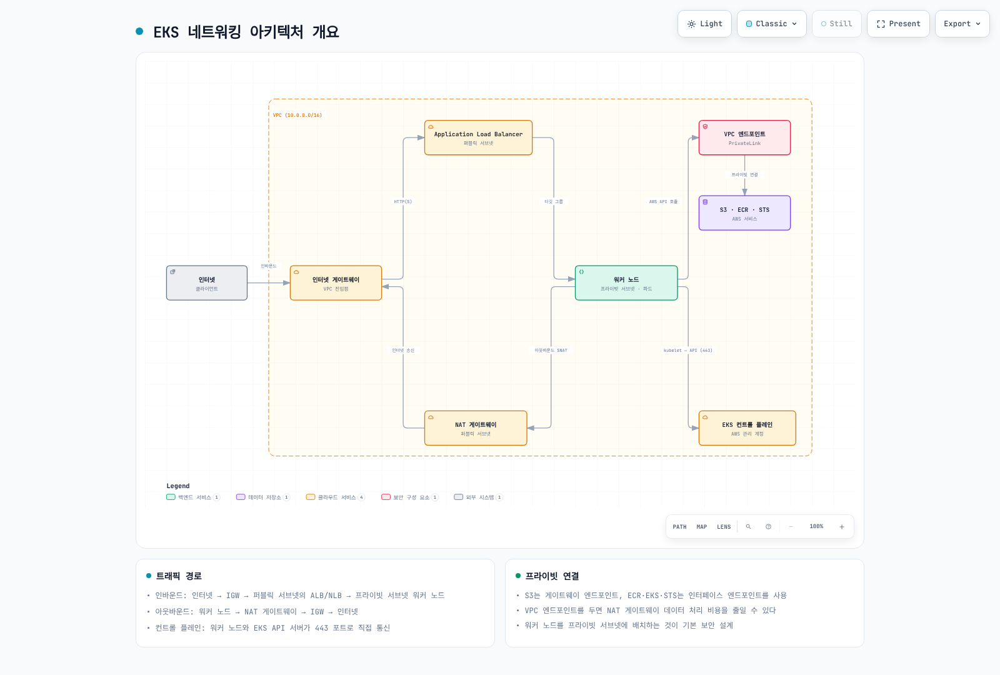
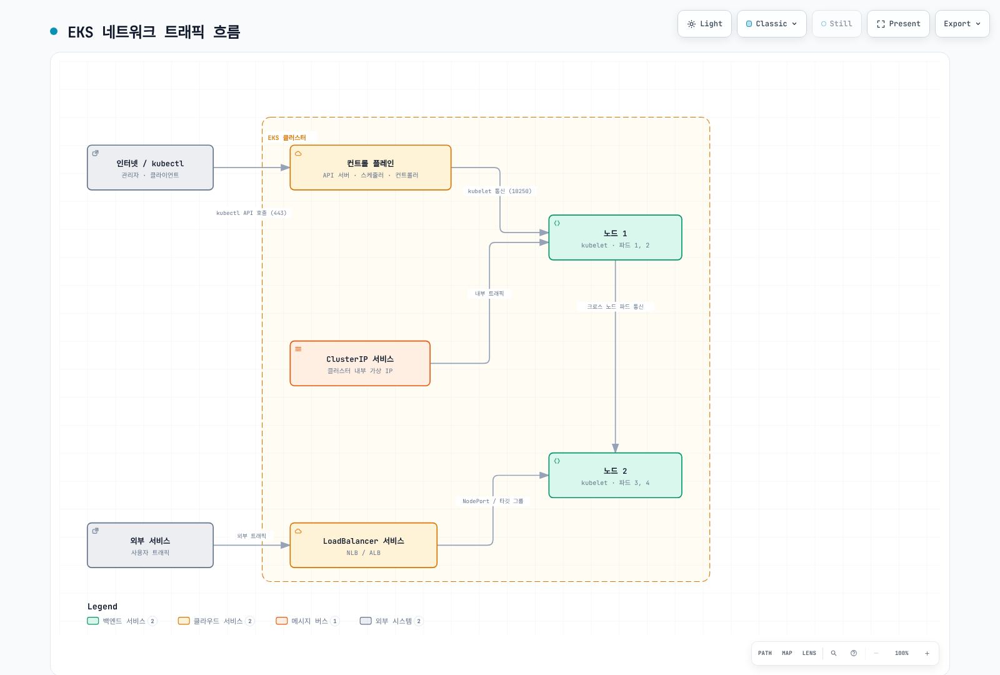
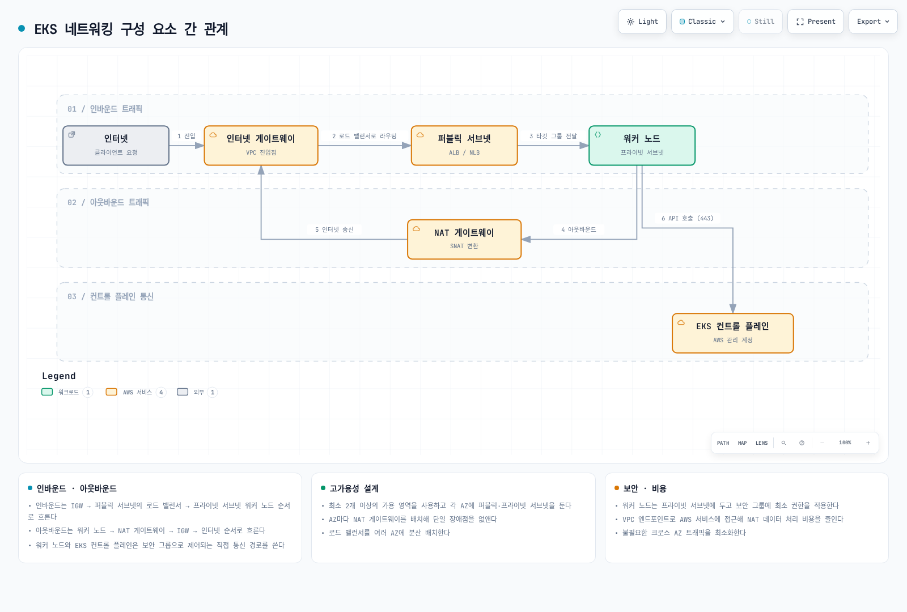
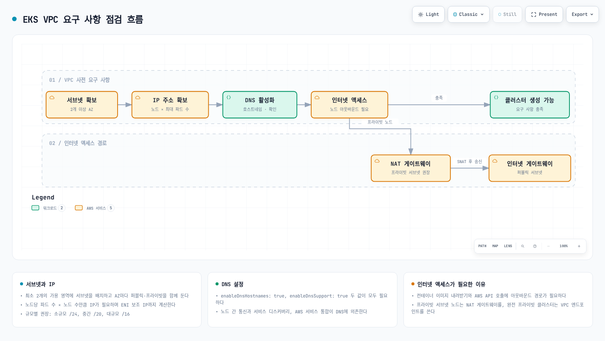
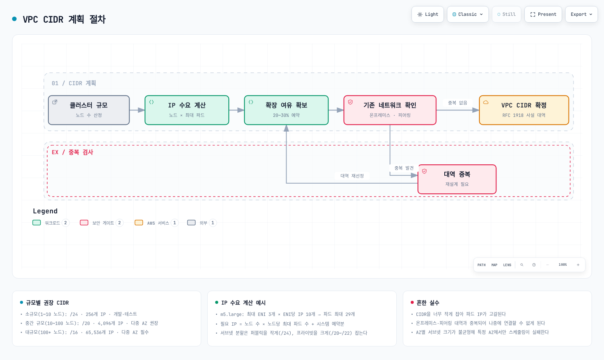
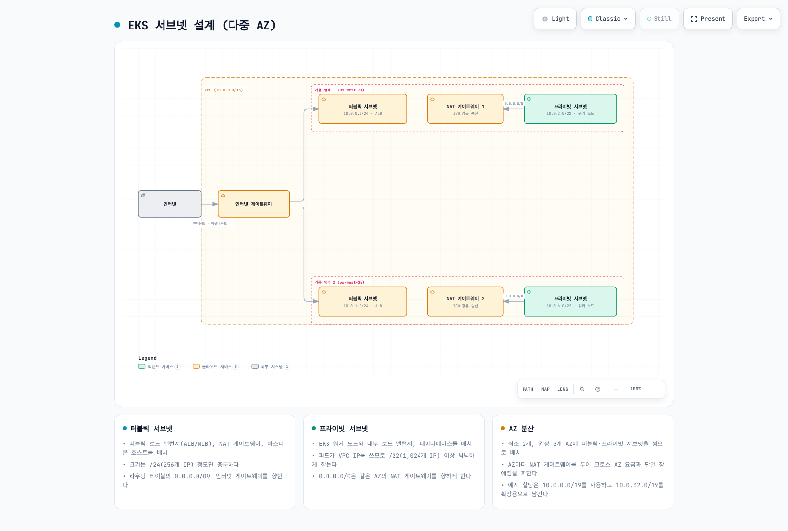
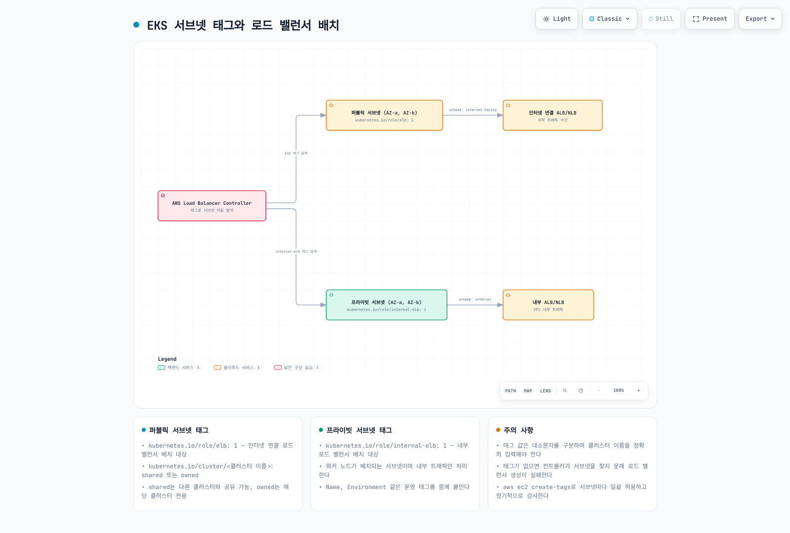
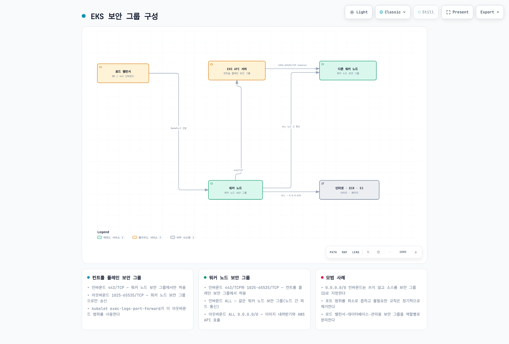

# EKS 네트워킹

> **마지막 업데이트**: 2026년 9월 11일

## 개요

일반 EKS 클러스터의 VPC·서브넷 계획과 보안 그룹 경로를 다룹니다. 제어 플레인은 AWS 관리 인프라에 있고 고객 VPC에는 클러스터 연결 ENI, 노드·Pod 인터페이스, 로드 밸런서·엔드포인트 리소스가 있습니다. 고객 VPC 경계 안에 관리형 제어 플레인이나 리전 S3·ECR·STS 서비스가 물리적으로 위치한다고 해석하면 안 됩니다.

## EKS 네트워킹 아키텍처

<!-- Audit 2026-09-11: parent asset repair required. MoveAWS-managedcontrolplaneandregionalS3/ECR/STSservicesoutsidethecustomerVPCboundary;showcustomerclusterENIs/interfaceendpointendsinsideVPC. ScopeNATpathasIPv4internetexample,notalltraffic.


[🔍 인터랙티브 다이어그램 보기](https://www.atomai.click/kubernetes-docs/archmaps/ko-eks-03-eks-networking-part1-0.html)
-->

| 구성 요소 | 역할 |
| --- | --- |
| VPC·서브넷 | 주소·라우팅 경계; 서브넷 하나는 AZ 하나에 속함 |
| 라우팅 테이블 | 목적지 범위에 따른 다음 경로 선택 |
| Internet Gateway | VPC에 연결되며 퍼블릭 서브넷이 이 경로를 사용 |
| 퍼블릭 NAT Gateway | 퍼블릭 서브넷의 EIP·IGW 경로로 프라이빗 IPv4 인터넷 egress 제공 |
| 보안 그룹 | 지원 네트워크 인터페이스·리소스에 연결되는 상태 저장 규칙 |
| 네트워크 ACL | 필요한 응답 트래픽도 포함하는 비상태 저장 서브넷 경계 규칙 |
| CNI | 선택한 구현·모드에 따라 Pod 네트워크 구성 |

### 트래픽 경로

<!-- Audit 2026-09-11: parent asset repair required. NodePortusesallocatedportsfromthedefaultrange,nottheentire30000–32767rangeoneverynode;separateNLBServicefromALBIngress/GatewayandIPvsinstancetargetpaths. KOPNGfooterappearscropped;parentfullPagecapture.


[🔍 인터랙티브 다이어그램 보기](https://www.atomai.click/kubernetes-docs/archmaps/ko-eks-03-eks-networking-part1-1.html)
-->

Pod 간 트래픽은 한 노드 안에서 처리되거나 노드 인터페이스·VPC 라우트를 지날 수 있습니다. 같은 노드의 트래픽은 VPC 경로를 지나지 않을 수 있으므로 VPC Flow Logs가 모든 Pod 통신 기록은 아닙니다. Service 트래픽은 구성한 프록시 경로와 선택한 백엔드를 사용하며 Service 자체가 전용 전달 장비는 아닙니다. 외부 ingress·egress는 scheme·라우팅·대상 유형·보안 제어에 따라 달라지고 제어 플레인 통신은 애플리케이션 트래픽과 별개입니다.



[🔍 인터랙티브 다이어그램 보기](https://www.atomai.click/kubernetes-docs/archmaps/ko-eks-03-eks-networking-part1-2.html)

그림은 퍼블릭 ingress와 AZ 단위 NAT의 IPv4 egress 예제입니다. 모든 EKS 클러스터에 퍼블릭 서브넷·NAT를 만들라는 요구가 아닙니다. 완전한 프라이빗 엔드포인트, 중앙 egress, 네이티브 IPv6 경로는 조건과 비용이 다릅니다.
## VPC와 서브넷 요구 사항

<!-- Audit 2026-09-11: parent asset repair required. InternetaccessisnotuniversalEKSprerequisite;fullyprivateendpointsareanalternative. IGWattachesVPC,notpublicsubnet. Replacearbitrarysmall/mediumCIDRswithmeasuredplanninginputs.


[🔍 인터랙티브 다이어그램 보기](https://www.atomai.click/kubernetes-docs/archmaps/ko-eks-03-eks-networking-part1-3.html)
-->

* 리전 EKS 클러스터는 최소 두 AZ의 적격 서브넷을 선택합니다. 클러스터 서브넷마다 EKS용 가용 IP가 최소 6개 필요하며 AWS는 16개 이상을 권장합니다. 업그레이드의 제어 플레인 ENI 교체와 다른 리소스의 여유도 확보하세요.
* VPC DNS 지원·호스트 이름을 활성화합니다. 클러스터 서브넷과 노드·Pod 서브넷이 같을 필요는 없지만 필요한 경로는 라우팅되어야 합니다.
* 노드에는 Kubernetes API·이미지 레지스트리·사용하는 AWS 서비스 접근이 필요합니다. 반드시 퍼블릭 인터넷이 필요한 것은 아니며 프라이빗 엔드포인트·미러로 경로를 제공할 수 있습니다. EKS AWS 서비스 엔드포인트와 클러스터 Kubernetes API 엔드포인트는 별개입니다.
* `controlPlaneEgressMode=CUSTOMER_ROUTED`를 사용하면 제어 플레인 egress 경로도 검토합니다. 클러스터 서브넷의 라우팅·보안 규칙이 필요한 웹훅·OIDC 등 엔드포인트에 도달해야 합니다.
* 클러스터 서브넷 변경에는 원래 VPC·AZ 집합 제약이 유지됩니다. VPC CIDR 추가가 모든 제어 플레인 작업에 즉시 반영되는 것은 아니며 AWS는 최대 한 시간의 조정 시간이 걸릴 수 있다고 설명합니다.
### CIDR 계획

<!-- Audit 2026-09-11: parent asset repair required. Removeuniversal1–10node/24,10–100node/20,100+node/16and20–30%headroomguarantees;countreserved/ENI/warm/controlplane/LB/upgradeIPs. RFC1918onlylabeltoobroad;nonoverlapandsupportedCIDRrulesmatter.


[🔍 인터랙티브 다이어그램 보기](https://www.atomai.click/kubernetes-docs/archmaps/ko-eks-03-eks-networking-part1-4.html)
-->

예상 노드, 일반·branch ENI Pod, warm pool·prefix 블록, 제어 플레인 인터페이스, 로드 밸런서·엔드포인트, 증가량·업데이트 용량으로 주소를 계획합니다. Service CIDR·연결 VPC·온프레미스 범위와 중복을 확인하세요. 노드 수만으로 안전한 VPC CIDR을 정할 수 없으며 고정된 20–30% 여유가 보편적 용량 규칙도 아닙니다.

다음은 클러스터 규모 권장값이나 사용 가능한 Pod 용량이 아닌 **전체 IPv4 주소 개수**입니다:

| CIDR | Total addresses |
| --- | ---: |
| /24 | 256 |
| /22 | 1,024 |
| /20 | 4,096 |
| /16 | 65,536 |

일반 AWS IPv4 서브넷 할당에서는 각 서브넷의 처음 4개·마지막 1개 주소를 예약합니다. 따라서 워크로드·인프라 사용 전 /24는 251개, /22는 1,019개를 할당할 수 있습니다. VPC 전체에서 5개가 아닌 서브넷별 예약이며 BYOIP에는 문서화된 예외가 있습니다. 기존 서브넷 CIDR은 제자리에서 간단히 늘릴 수 없습니다. Prefix delegation은 연속 블록이 필요하며 주소 공간 자체를 만들지는 않습니다.
### 서브넷 설계 예제

<!-- Audit 2026-09-11: parent asset repair required. Private10.0.2.0/22and10.0.6.0/22arenoncanonical;canonicalfirstoverlapspublicsubnets. Use10.0.4.0/22and10.0.8.0/22;showzonalpublicNATplacementandIGWroute;rawIPcountsnotusable.


[🔍 인터랙티브 다이어그램 보기](https://www.atomai.click/kubernetes-docs/archmaps/ko-eks-03-eks-networking-part1-5.html)
-->

VPC가 `10.0.0.0/16`일 때 아래 정렬된 범위는 중복되지 않습니다. 퍼블릭 로드 밸런서·AZ별 NAT 설계 예제이며 실측 사이징은 아닙니다. 퍼블릭 서브넷은 IGW로 향하는 라우트가 연결되어 있어야 하며 태그·이름만으로 퍼블릭이 되지 않습니다. 프라이빗 노드는 NAT 또는 적절한 프라이빗 서비스 엔드포인트를 사용할 수 있습니다.

| 유형 | AZ | CIDR | 예시 용도 |
| --- | --- | --- | --- |
| 퍼블릭 | us-west-2a | 10.0.0.0/24 | 퍼블릭 로드 밸런서·AZ별 NAT |
| 퍼블릭 | us-west-2b | 10.0.1.0/24 | 퍼블릭 로드 밸런서·AZ별 NAT |
| 프라이빗 | us-west-2a | 10.0.4.0/22 | 워커 노드·Pod |
| 프라이빗 | us-west-2b | 10.0.8.0/22 | 워커 노드·Pod |

기존 `10.0.2.0/22`·`10.0.6.0/22`는 정렬된 네트워크 주소가 아니었습니다. AWS가 CIDR을 정규화하면 첫 범위가 `10.0.0.0/22`가 되어 퍼블릭 서브넷과 중복됩니다. 프로비저닝 전에 경계·중복을 검증하세요. AZ 내부 NAT 경로는 다른 AZ의 NAT 의존성을 줄이지만 여유 용량·라우팅·워크로드 배치도 검토해야 합니다.
### 서브넷 검색 태그

<!-- Audit 2026-09-11: parent asset repair required. Tagrequirementsdependcontroller/version/features;LBC>=2.12.1canuseSubnetDiscoveryByReachabilitywithoutroletags. owned/sharedarenotsecurityisolation;privatesubnetscanhaveegress. Removewithouttagsalwaysfailsclaim.


[🔍 인터랙티브 다이어그램 보기](https://www.atomai.click/kubernetes-docs/archmaps/ko-eks-03-eks-networking-part1-6.html)
-->

검색 동작은 선택한 컨트롤러·버전에 따라 다릅니다. AWS Load Balancer Controller 3.5는 역할 태그로 퍼블릭·내부 서브넷을 선택하며 값은 `1` 또는 빈 값입니다. 최신 LBC에서 기존 클러스터 소유권 태그가 항상 필수는 아닙니다. 역할 태그 후보가 없으면 LBC 2.12.1 이상은 `SubnetDiscoveryByReachability` 활성화 시 라우팅 기반 검색을 사용할 수 있습니다. 클러스터 태그 필터·가용 IP·AZ별 선택도 중요합니다. EKS Auto Mode는 별도의 태그 요구 사항을 따릅니다.

* 인터넷 연결 배치: `kubernetes.io/role/elb`.
* 내부 배치: `kubernetes.io/role/internal-elb`.
* `kubernetes.io/cluster/<cluster-name>`는 필터·우선순위에 영향을 줄 수 있으며 `owned`·`shared`는 보안 경계나 자동 라우팅 규칙이 아닙니다.

```bash
# After reviewing subnet ownership and its associated routes, tag the intended public subnet.
aws ec2 describe-subnets --region "${EXAMPLE_REGION:?}" --subnet-ids "${PUBLIC_SUBNET_ID:?}" \
  --query 'Subnets[].{id:SubnetId,vpc:VpcId,cidr:CidrBlock,free:AvailableIpAddressCount,tags:Tags}'
aws ec2 create-tags --region "$EXAMPLE_REGION" --resources "$PUBLIC_SUBNET_ID" \
  --tags Key=kubernetes.io/role/elb,Value=1
```
검토한 프라이빗·내부 배치에는 internal-elb 역할 태그를 사용합니다. 검색 실패를 검토 없이 우회하려고 임의의 기존 서브넷을 태깅하거나 클러스터 태그 검사를 끄지 마세요. 서브넷을 명시적으로 선택해도 로드 밸런서 적격성 요구를 충족해야 합니다.
### 보안 그룹 경로

<!-- Audit 2026-09-11: parent asset repair required. Replace1025–65535kubeletrangewithactualTCP10250;distinguishprivateAPI443,DNS53,webhook/workloadports,andstatefulSGvsNACLreturnports. EKSdefaultclusterSGmaybesharedwithMNG;publicAPIusesCIDRs;alloutboundnotuniversalneed.


[🔍 인터랙티브 다이어그램 보기](https://www.atomai.click/kubernetes-docs/archmaps/ko-eks-03-eks-networking-part1-7.html)
-->

EKS는 기본 클러스터 보안 그룹을 만들고 클러스터 ENI 및 일반적인 관리형 노드 인터페이스에 연결합니다. 항상 두 그룹으로 분리되는 구조는 아닙니다. 추가 클러스터 SG가 자동으로 노드 SG가 되지는 않으며 커스텀 Launch Template·Pod 보안 그룹에 따라 경로가 달라집니다. 규칙 수정 전에 실제 연결을 확인하세요:

```bash
aws eks describe-cluster --name "${EXAMPLE_CLUSTER:?}" --region "${EXAMPLE_REGION:?}" \
  --query 'cluster.resourcesVpcConfig.{clusterSG:clusterSecurityGroupId,additionalSGs:securityGroupIds,subnets:subnetIds,public:endpointPublicAccess,private:endpointPrivateAccess,publicCIDRs:publicAccessCidrs}'
```

| 경로 | 일반적인 목적지 포트 | 검토 범위 |
| --- | --- | --- |
| 노드·허용된 연결 클라이언트 → 프라이빗 Kubernetes API | TCP 443 | 엔드포인트 SG와 승인된 소스 |
| 제어 플레인 → kubelet | TCP 10250 | 대상 노드 SG·라우팅 |
| 노드·Pod → DNS 백엔드 | UDP·TCP 53 | 실제 CoreDNS·NodeLocal DNS 경로 |
| 제어 플레인 → admission webhook | 구성된 백엔드 포트 | 웹훅 Service·엔드포인트·SG 경로 |
| 애플리케이션·로드 밸런서 → 워크로드 | 구성된 앱·상태 확인 포트 | 대상 유형·SG·상태 확인 |

AWS는 기본 클러스터 SG를 제한할 때 클러스터 SG 대상 TCP 443·TCP 10250·TCP/UDP 53을 최소 아웃바운드로 안내하며 실제 앱·노드 간 통신·서비스 접근 요구도 추가해야 합니다. 기존 `1025–65535` kubelet 범위가 최소 요구는 아닙니다. SG는 상태 저장 방식이므로 허용된 연결의 응답을 위해 임시 포트 전체를 무조건 열지 않습니다. NACL은 비상태 저장 방식이므로 해당 응답 경로도 허용해야 합니다.

기본 self ingress·self egress/EFA 규칙은 클러스터 업데이트에서 다시 생성될 수 있습니다. 좁은 SG를 추가해도 다른 연결 SG의 넓은 허용을 취소하지 못합니다. 퍼블릭 API는 `publicAccessCidrs`를 사용하며 클러스터 SG는 프라이빗 엔드포인트 경로를 제어합니다. 레지스트리·AWS API egress를 검토하고 적절한 엔드포인트·라우팅을 사용하세요. 모든 클러스터에 `ALL → 0.0.0.0/0`이 필요하다고 가정하면 안 됩니다.

## 다음 단계와 퀴즈

[EKS 네트워킹 Part 2](./03-eks-networking-part2.md)에서 서비스·로드 밸런싱·정책을 이어서 다룹니다. [Part 1 퀴즈](../quizzes/eks/03-eks-networking-part1-quiz.md)로 이해를 확인하세요.

## 참고 자료

- [EKS VPC/subnets](https://docs.aws.amazon.com/eks/latest/userguide/network-reqs.html)
- [Private clusters](https://docs.aws.amazon.com/eks/latest/userguide/private-clusters.html)
- [Subnet sizing](https://docs.aws.amazon.com/vpc/latest/userguide/subnet-sizing.html)
- [Security groups](https://docs.aws.amazon.com/eks/latest/userguide/sec-group-reqs.html)
- [LBC subnet discovery](https://github.com/kubernetes-sigs/aws-load-balancer-controller/blob/v3.5.0/docs/deploy/subnet_discovery.md)
