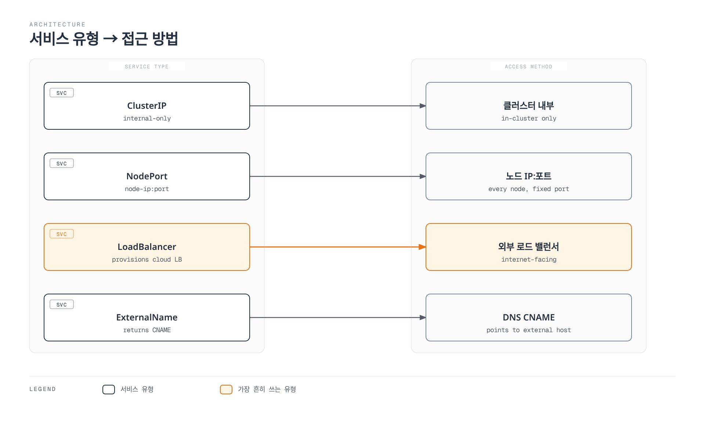
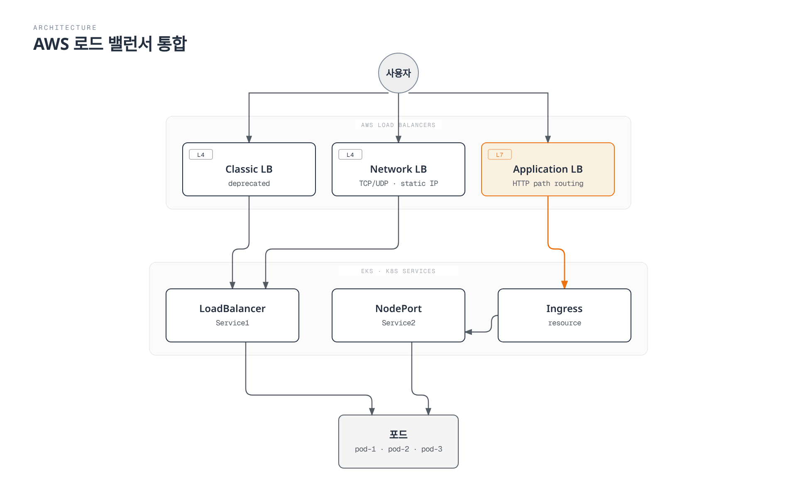
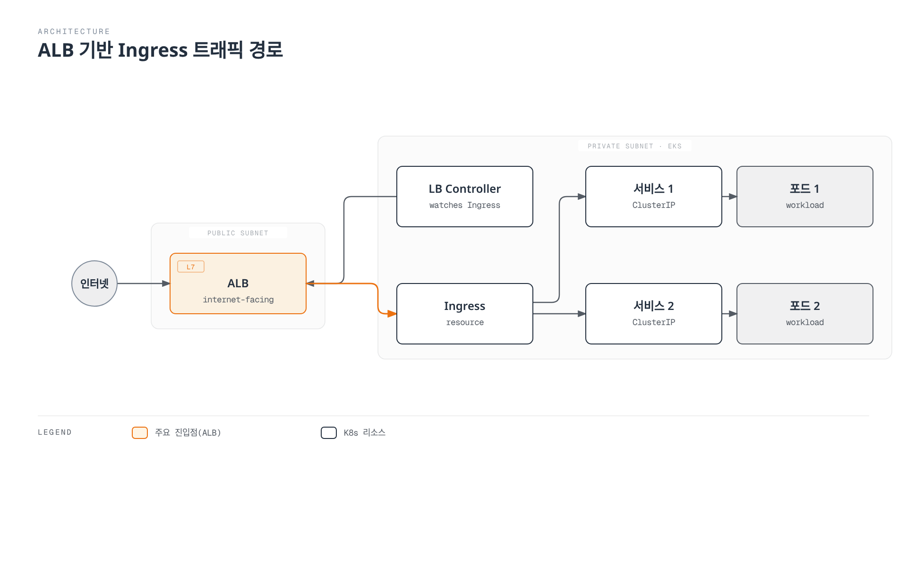
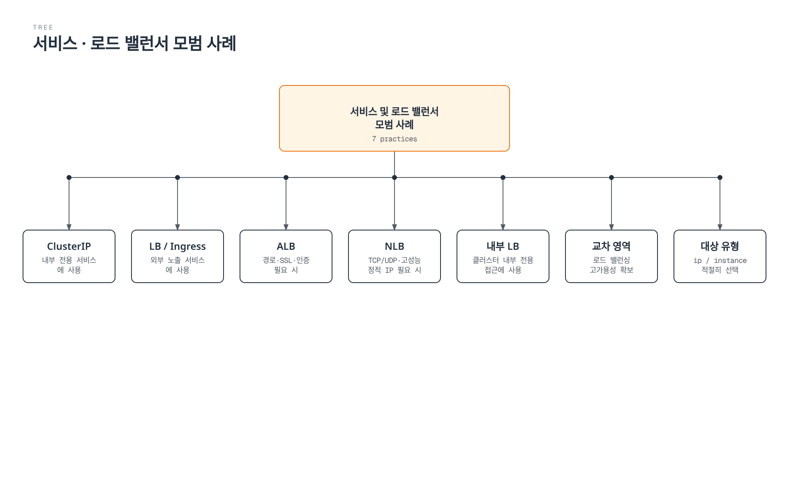
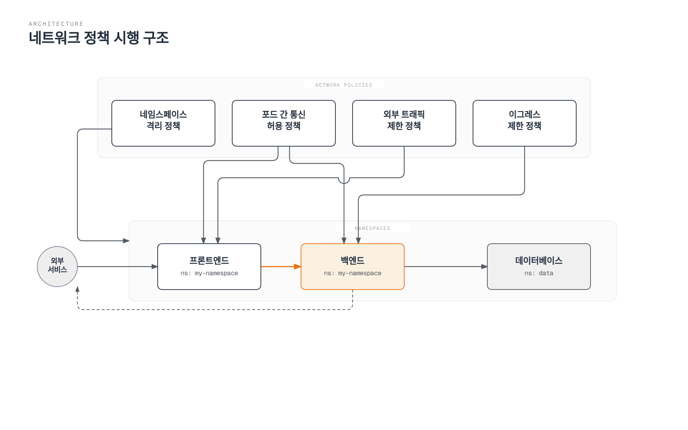
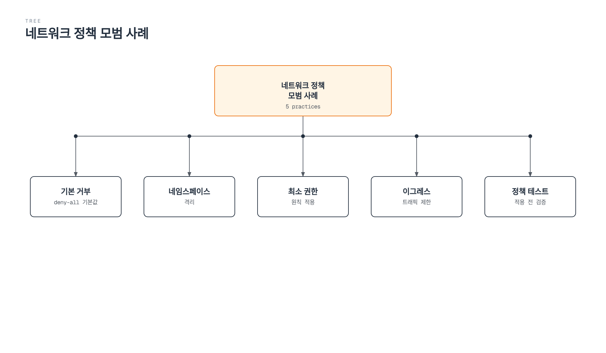
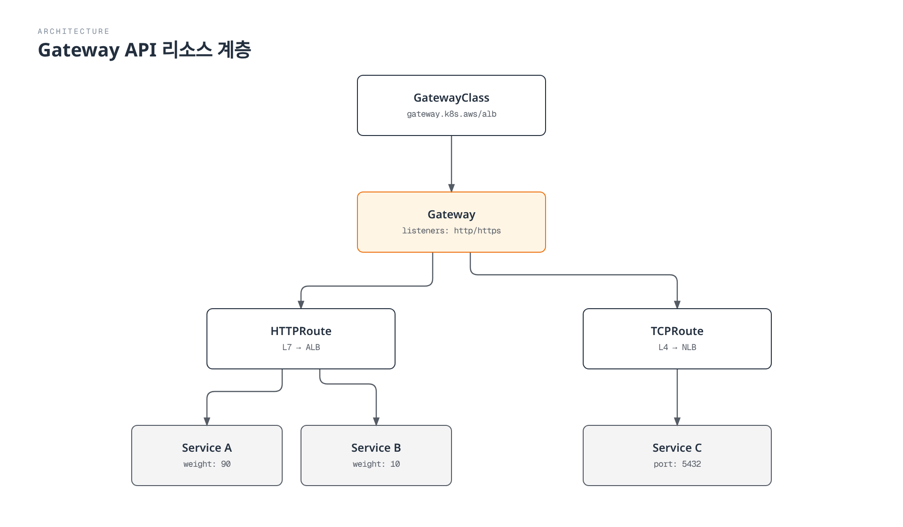

# EKS 네트워킹 - Part 2: 서비스 및 로드 밸런싱, 네트워크 정책

## 개요

이 문서에서는 Amazon EKS에서의 서비스 및 로드 밸런싱, 네트워크 정책에 대해 알아보겠습니다. Kubernetes 서비스를 통해 애플리케이션을 노출하는 방법, AWS 로드 밸런서와의 통합, 그리고 네트워크 정책을 사용하여 포드 간 통신을 제어하는 방법을 다룹니다.

## Kubernetes 서비스 유형

Kubernetes에서는 다음과 같은 서비스 유형을 제공합니다:



1. **ClusterIP**: 클러스터 내부에서만 액세스 가능한 서비스
2. **NodePort**: 모든 노드의 특정 포트를 통해 액세스 가능한 서비스
3. **LoadBalancer**: 외부 로드 밸런서를 통해 액세스 가능한 서비스
4. **ExternalName**: 외부 서비스에 대한 CNAME 레코드 제공

### ClusterIP 서비스

ClusterIP 서비스는 클러스터 내부에서만 액세스할 수 있는 서비스입니다. 이는 기본 서비스 유형입니다.

```yaml
apiVersion: v1
kind: Service
metadata:
  name: my-service
spec:
  selector:
    app: my-app
  ports:
  - port: 80
    targetPort: 8080
  type: ClusterIP
```

### NodePort 서비스

NodePort 서비스는 모든 노드의 특정 포트를 통해 액세스할 수 있는 서비스입니다.

```yaml
apiVersion: v1
kind: Service
metadata:
  name: my-service
spec:
  selector:
    app: my-app
  ports:
  - port: 80
    targetPort: 8080
    nodePort: 30080
  type: NodePort
```

### LoadBalancer 서비스

LoadBalancer 서비스는 외부 로드 밸런서를 통해 액세스할 수 있는 서비스입니다. EKS에서는 AWS 로드 밸런서(CLB, NLB, ALB)와 통합됩니다.

```yaml
apiVersion: v1
kind: Service
metadata:
  name: my-service
spec:
  selector:
    app: my-app
  ports:
  - port: 80
    targetPort: 8080
  type: LoadBalancer
```

### ExternalName 서비스

ExternalName 서비스는 외부 서비스에 대한 CNAME 레코드를 제공합니다.

```yaml
apiVersion: v1
kind: Service
metadata:
  name: my-service
spec:
  type: ExternalName
  externalName: my-service.example.com
```

## AWS 로드 밸런서 통합

EKS는 Kubernetes 서비스를 AWS 로드 밸런서와 통합하여 외부에서 애플리케이션에 액세스할 수 있게 합니다.



### Classic Load Balancer(CLB)

기본적으로 `type: LoadBalancer`로 설정된 서비스는 Classic Load Balancer를 생성합니다. 그러나 CLB는 더 이상 권장되지 않으며, NLB 또는 ALB를 사용하는 것이 좋습니다.

```yaml
apiVersion: v1
kind: Service
metadata:
  name: my-service
spec:
  selector:
    app: my-app
  ports:
  - port: 80
    targetPort: 8080
  type: LoadBalancer
```

### Network Load Balancer(NLB)

NLB를 사용하려면 서비스에 특정 주석을 추가해야 합니다:

```yaml
apiVersion: v1
kind: Service
metadata:
  name: my-service
  annotations:
    service.beta.kubernetes.io/aws-load-balancer-type: nlb
spec:
  selector:
    app: my-app
  ports:
  - port: 80
    targetPort: 8080
  type: LoadBalancer
```

NLB 추가 구성 옵션:

```yaml
metadata:
  annotations:
    # 내부 NLB 생성
    service.beta.kubernetes.io/aws-load-balancer-internal: "true"
    
    # 교차 영역 로드 밸런싱 활성화
    service.beta.kubernetes.io/aws-load-balancer-cross-zone-load-balancing-enabled: "true"
    
    # 대상 유형 지정 (instance 또는 ip)
    service.beta.kubernetes.io/aws-load-balancer-target-group-attributes: preserve_client_ip.enabled=true
    
    # TCP 프록시 프로토콜 활성화
    service.beta.kubernetes.io/aws-load-balancer-proxy-protocol: "*"
```

### Application Load Balancer(ALB)

ALB를 사용하려면 AWS Load Balancer Controller를 설치하고 Ingress 리소스를 사용해야 합니다:



1. AWS Load Balancer Controller 설치:

```bash
# IAM 정책 다운로드
curl -o iam-policy.json https://raw.githubusercontent.com/kubernetes-sigs/aws-load-balancer-controller/main/docs/install/iam_policy.json

# IAM 정책 생성
aws iam create-policy \
  --policy-name AWSLoadBalancerControllerIAMPolicy \
  --policy-document file://iam-policy.json

# IAM 역할 생성 및 정책 연결 (eksctl 사용)
eksctl create iamserviceaccount \
  --cluster=my-cluster \
  --namespace=kube-system \
  --name=aws-load-balancer-controller \
  --attach-policy-arn=arn:aws:iam::123456789012:policy/AWSLoadBalancerControllerIAMPolicy \
  --approve

# Helm 저장소 추가
helm repo add eks https://aws.github.io/eks-charts
helm repo update

# AWS Load Balancer Controller 설치
helm install aws-load-balancer-controller eks/aws-load-balancer-controller \
  -n kube-system \
  --set clusterName=my-cluster \
  --set serviceAccount.create=false \
  --set serviceAccount.name=aws-load-balancer-controller
```

2. Ingress 리소스 생성:

```yaml
apiVersion: networking.k8s.io/v1
kind: Ingress
metadata:
  name: my-ingress
  annotations:
    kubernetes.io/ingress.class: alb
    alb.ingress.kubernetes.io/scheme: internet-facing
    alb.ingress.kubernetes.io/target-type: ip
spec:
  rules:
  - http:
      paths:
      - path: /
        pathType: Prefix
        backend:
          service:
            name: my-service
            port:
              number: 80
```

ALB 추가 구성 옵션:

```yaml
metadata:
  annotations:
    # 내부 ALB 생성
    alb.ingress.kubernetes.io/scheme: internal
    
    # SSL 인증서 지정
    alb.ingress.kubernetes.io/certificate-arn: arn:aws:acm:region:account-id:certificate/certificate-id
    
    # HTTPS 리디렉션
    alb.ingress.kubernetes.io/actions.ssl-redirect: '{"Type": "redirect", "RedirectConfig": {"Protocol": "HTTPS", "Port": "443", "StatusCode": "HTTP_301"}}'
    
    # 대상 유형 지정 (instance 또는 ip)
    alb.ingress.kubernetes.io/target-type: ip
    
    # 보안 그룹 지정
    alb.ingress.kubernetes.io/security-groups: sg-xxxx,sg-yyyy
```

### 서비스 및 로드 밸런서 모범 사례



1. **내부 서비스에는 ClusterIP 사용**: 클러스터 내부에서만 액세스하는 서비스에는 ClusterIP 유형을 사용합니다.
2. **외부 서비스에는 LoadBalancer 또는 Ingress 사용**: 외부에서 액세스해야 하는 서비스에는 LoadBalancer 유형 또는 Ingress 리소스를 사용합니다.
3. **ALB 사용**: 경로 기반 라우팅, SSL 종료, 인증 등의 기능이 필요한 경우 ALB를 사용합니다.
4. **NLB 사용**: TCP/UDP 트래픽, 고성능, 정적 IP가 필요한 경우 NLB를 사용합니다.
5. **내부 로드 밸런서 사용**: 클러스터 내부에서만 액세스하는 서비스에는 내부 로드 밸런서를 사용합니다.
6. **교차 영역 로드 밸런싱 활성화**: 고가용성을 위해 교차 영역 로드 밸런싱을 활성화합니다.
7. **적절한 대상 유형 선택**: 포드 IP를 직접 대상으로 사용하려면 `ip` 대상 유형을, 노드 IP를 대상으로 사용하려면 `instance` 대상 유형을 선택합니다.

## 네트워크 정책

네트워크 정책은 포드 간 통신을 제어하는 데 사용됩니다. EKS에서 네트워크 정책을 사용하려면 네트워크 정책을 지원하는 CNI 플러그인(예: Calico, Cilium)을 설치해야 합니다.



### Calico 설치

Calico는 EKS에서 네트워크 정책을 구현하는 데 널리 사용되는 CNI 플러그인입니다:

```bash
# Calico 설치
kubectl apply -f https://docs.projectcalico.org/manifests/calico-vxlan.yaml

# Calico 상태 확인
kubectl get pods -n kube-system -l k8s-app=calico-node
```

### 기본 네트워크 정책

기본적으로 네트워크 정책이 없는 경우 모든 포드는 서로 통신할 수 있습니다. 네트워크 정책을 적용하면 명시적으로 허용된 트래픽만 허용됩니다.

### 네임스페이스 격리 정책

특정 네임스페이스 내의 포드 간 통신만 허용하는 정책:

```yaml
apiVersion: networking.k8s.io/v1
kind: NetworkPolicy
metadata:
  name: namespace-isolation
  namespace: my-namespace
spec:
  podSelector: {}
  policyTypes:
  - Ingress
  ingress:
  - from:
    - podSelector: {}
```

### 특정 포드 간 통신 허용 정책

특정 레이블을 가진 포드 간 통신만 허용하는 정책:

```yaml
apiVersion: networking.k8s.io/v1
kind: NetworkPolicy
metadata:
  name: allow-frontend-to-backend
  namespace: my-namespace
spec:
  podSelector:
    matchLabels:
      app: backend
  policyTypes:
  - Ingress
  ingress:
  - from:
    - podSelector:
        matchLabels:
          app: frontend
    ports:
    - protocol: TCP
      port: 80
```

### 외부 트래픽 제한 정책

특정 IP 범위에서만 트래픽을 허용하는 정책:

```yaml
apiVersion: networking.k8s.io/v1
kind: NetworkPolicy
metadata:
  name: allow-external-traffic
  namespace: my-namespace
spec:
  podSelector:
    matchLabels:
      app: web
  policyTypes:
  - Ingress
  ingress:
  - from:
    - ipBlock:
        cidr: 192.168.1.0/24
        except:
        - 192.168.1.10/32
    ports:
    - protocol: TCP
      port: 80
```

### 이그레스(Egress) 트래픽 제한 정책

특정 대상으로만 이그레스 트래픽을 허용하는 정책:

```yaml
apiVersion: networking.k8s.io/v1
kind: NetworkPolicy
metadata:
  name: limit-egress-traffic
  namespace: my-namespace
spec:
  podSelector:
    matchLabels:
      app: web
  policyTypes:
  - Egress
  egress:
  - to:
    - podSelector:
        matchLabels:
          app: db
    ports:
    - protocol: TCP
      port: 5432
  - to:
    - ipBlock:
        cidr: 0.0.0.0/0
        except:
        - 10.0.0.0/8
        - 172.16.0.0/12
        - 192.168.0.0/16
    ports:
    - protocol: TCP
      port: 443
```

### 네트워크 정책 모범 사례



1. **기본 거부 정책 적용**: 모든 트래픽을 기본적으로 거부하고 필요한 트래픽만 명시적으로 허용합니다.
2. **네임스페이스 격리**: 네임스페이스 간 통신을 제한하여 보안을 강화합니다.
3. **최소 권한 원칙 적용**: 필요한 최소한의 통신만 허용합니다.
4. **이그레스 트래픽 제한**: 포드에서 나가는 트래픽도 제한하여 보안을 강화합니다.
5. **정책 테스트**: 네트워크 정책을 적용하기 전에 테스트하여 의도하지 않은 통신 차단을 방지합니다.

---

## Gateway API

> **지원 버전**: AWS Load Balancer Controller v2.13.0+
> **마지막 업데이트**: 2026년 2월 19일

### 개요

Gateway API는 Kubernetes의 차세대 서비스 네트워킹 API로, 기존 Ingress 리소스의 한계를 극복하고 더 풍부한 라우팅 기능을 제공합니다. AWS Load Balancer Controller는 Gateway API를 지원하여 L4(NLB) 및 L7(ALB) 라우팅을 Gateway 리소스를 통해 구성할 수 있습니다.



### 사전 요구 사항

1. **AWS Load Balancer Controller v2.13.0 이상** 설치
2. **Feature Gates 활성화**: Controller 배포 시 `--feature-gates=EnableGatewayAPI=true` 플래그 추가
3. **Gateway API CRD 설치**:

```bash
# Standard CRDs 설치
kubectl apply -f https://github.com/kubernetes-sigs/gateway-api/releases/download/v1.2.1/standard-install.yaml

# Experimental CRDs 설치 (TCPRoute 등)
kubectl apply -f https://github.com/kubernetes-sigs/gateway-api/releases/download/v1.2.1/experimental-install.yaml

# AWS LBC 전용 CRDs 설치
kubectl apply -f https://raw.githubusercontent.com/kubernetes-sigs/aws-load-balancer-controller/main/config/crd/gateway-api/crds.yaml
```

### GatewayClass 및 Gateway 설정

GatewayClass는 로드 밸런서의 유형을 정의하고, Gateway는 실제 로드 밸런서 인스턴스를 나타냅니다.

```yaml
# GatewayClass 정의
apiVersion: gateway.networking.k8s.io/v1
kind: GatewayClass
metadata:
  name: amazon-alb
spec:
  controllerName: gateway.k8s.aws/alb

---
# Gateway 정의 (L7 - ALB)
apiVersion: gateway.networking.k8s.io/v1
kind: Gateway
metadata:
  name: my-hotel-gateway
  namespace: default
spec:
  gatewayClassName: amazon-alb
  listeners:
  - name: http
    protocol: HTTP
    port: 80
  - name: https
    protocol: HTTPS
    port: 443
    tls:
      mode: Terminate
      certificateRefs:
      - kind: Secret
        name: my-tls-secret
```

### HTTPRoute 예제 (L7 → ALB)

HTTPRoute는 HTTP/HTTPS 트래픽을 서비스로 라우팅하는 규칙을 정의합니다. Gateway에 연결된 HTTPRoute는 ALB를 통해 트래픽을 분배합니다.

```yaml
apiVersion: gateway.networking.k8s.io/v1
kind: HTTPRoute
metadata:
  name: app-route
  namespace: default
spec:
  parentRefs:
  - name: my-hotel-gateway
    sectionName: http
  hostnames:
  - "app.example.com"
  rules:
  - matches:
    - path:
        type: PathPrefix
        value: /api
    backendRefs:
    - name: api-service
      port: 80
      weight: 90
    - name: api-service-v2
      port: 80
      weight: 10
  - matches:
    - path:
        type: PathPrefix
        value: /
    backendRefs:
    - name: frontend-service
      port: 80
```

### TCPRoute 예제 (L4 → NLB)

TCPRoute는 TCP 트래픽을 처리하며, NLB를 통해 L4 레벨의 로드 밸런싱을 제공합니다.

```yaml
# NLB용 GatewayClass
apiVersion: gateway.networking.k8s.io/v1
kind: GatewayClass
metadata:
  name: amazon-nlb
spec:
  controllerName: gateway.k8s.aws/nlb

---
# NLB Gateway
apiVersion: gateway.networking.k8s.io/v1
kind: Gateway
metadata:
  name: my-nlb-gateway
spec:
  gatewayClassName: amazon-nlb
  listeners:
  - name: tcp
    protocol: TCP
    port: 5432

---
# TCPRoute
apiVersion: gateway.networking.k8s.io/v1alpha2
kind: TCPRoute
metadata:
  name: db-route
spec:
  parentRefs:
  - name: my-nlb-gateway
    sectionName: tcp
  rules:
  - backendRefs:
    - name: postgres-service
      port: 5432
```

### QUIC/HTTP3 지원

Gateway API를 통해 생성된 ALB는 QUIC/HTTP3 프로토콜을 자동으로 지원합니다. HTTPS 리스너가 구성되면 ALB는 자동으로 QUIC 프로토콜 업그레이드를 처리합니다.

```yaml
apiVersion: gateway.networking.k8s.io/v1
kind: Gateway
metadata:
  name: quic-gateway
  annotations:
    gateway.k8s.aws/quic-enabled: "true"
spec:
  gatewayClassName: amazon-alb
  listeners:
  - name: https
    protocol: HTTPS
    port: 443
    tls:
      mode: Terminate
      certificateRefs:
      - kind: Secret
        name: tls-cert
```

### 인증서 디스커버리

AWS Load Balancer Controller는 두 가지 인증서 디스커버리 방법을 지원합니다:

1. **정적 인증서 참조**: Gateway의 `tls.certificateRefs`에서 직접 지정
2. **호스트명 기반 자동 디스커버리**: HTTPRoute의 `hostnames` 필드를 기반으로 ACM에서 자동으로 일치하는 인증서를 검색

```yaml
# 호스트명 기반 자동 디스커버리 예시
apiVersion: gateway.networking.k8s.io/v1
kind: HTTPRoute
metadata:
  name: auto-cert-route
spec:
  parentRefs:
  - name: my-gateway
  hostnames:
  - "secure.example.com"  # ACM에서 이 도메인과 일치하는 인증서 자동 검색
  rules:
  - backendRefs:
    - name: secure-service
      port: 443
```

### 보안 그룹

Gateway API를 통해 생성된 로드 밸런서에는 보안 그룹이 자동으로 생성됩니다:

- **프론트엔드 보안 그룹**: 클라이언트에서 로드 밸런서로의 인바운드 트래픽을 허용
- **백엔드 보안 그룹**: 로드 밸런서에서 대상 파드로의 트래픽을 허용

Gateway 어노테이션을 통해 사용자 정의 보안 그룹을 지정할 수도 있습니다:

```yaml
apiVersion: gateway.networking.k8s.io/v1
kind: Gateway
metadata:
  name: custom-sg-gateway
  annotations:
    gateway.k8s.aws/security-group-ids: sg-0123456789abcdef0,sg-0987654321fedcba0
spec:
  gatewayClassName: amazon-alb
  listeners:
  - name: http
    protocol: HTTP
    port: 80
```

### Out-of-Band 대상 그룹

`TargetGroupName` backendRef를 사용하면 기존에 생성된 대상 그룹을 Gateway API 라우팅에 연결할 수 있습니다. 이는 기존 인프라와의 통합이나 마이그레이션 시나리오에서 유용합니다.

```yaml
apiVersion: gateway.networking.k8s.io/v1
kind: HTTPRoute
metadata:
  name: oob-route
spec:
  parentRefs:
  - name: my-gateway
  rules:
  - backendRefs:
    - group: gateway.k8s.aws
      kind: TargetGroupBinding
      name: existing-target-group
```

### Gateway API vs Ingress 비교

| 기능 | Ingress | Gateway API |
|------|---------|-------------|
| 라우팅 모델 | 호스트/경로 기반 | 호스트/경로/헤더/쿼리 기반 |
| 프로토콜 지원 | HTTP/HTTPS | HTTP, HTTPS, TCP, TLS, gRPC |
| 트래픽 분할 | 어노테이션 기반 | 네이티브 가중치 기반 |
| 역할 분리 | 단일 리소스 | GatewayClass/Gateway/Route 분리 |
| 확장성 | 어노테이션으로 제한적 | Policy attachment로 확장 가능 |
| L4 로드 밸런싱 | 미지원 | TCPRoute/UDPRoute 지원 |

## 퀴즈

이 장에서 배운 내용을 테스트하려면 [주제 퀴즈](../quizzes/eks/03-eks-networking-part2-quiz.md)를 풀어보세요.
