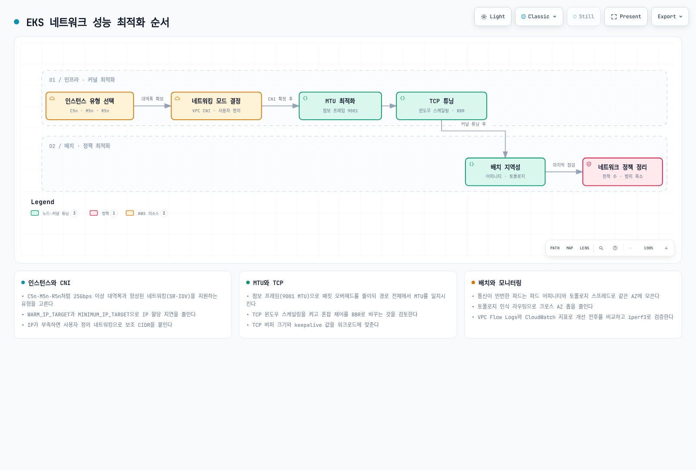
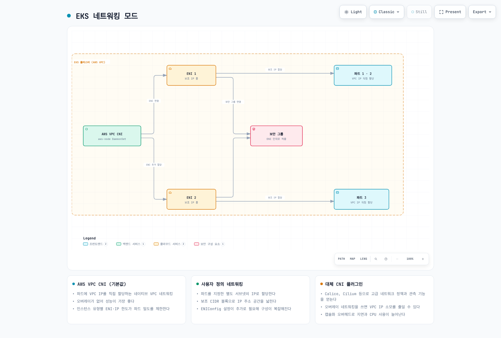
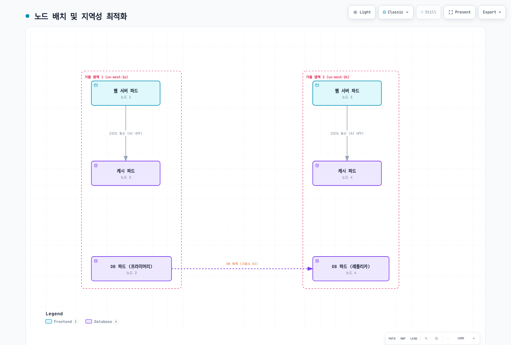
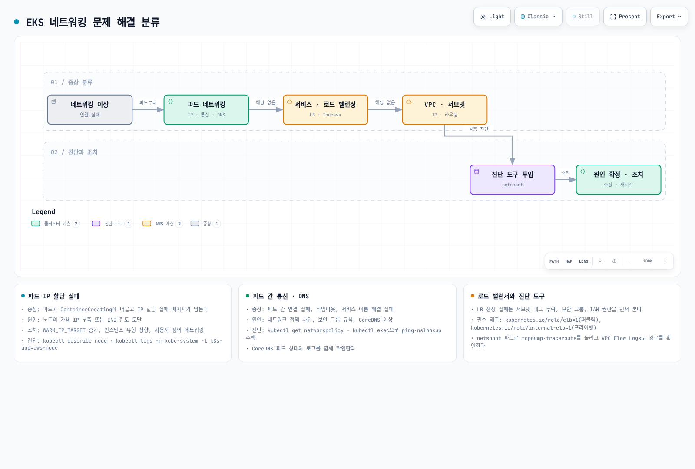
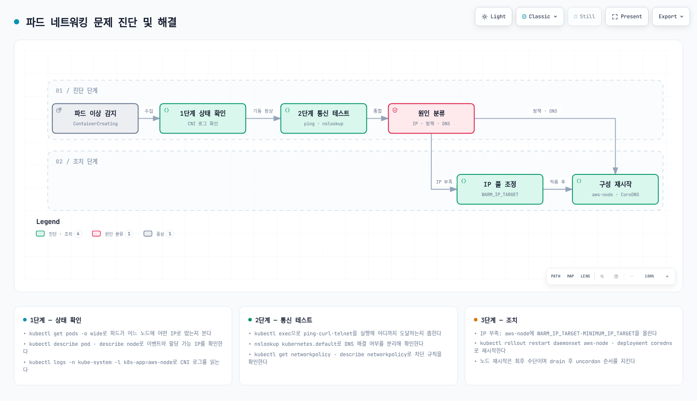
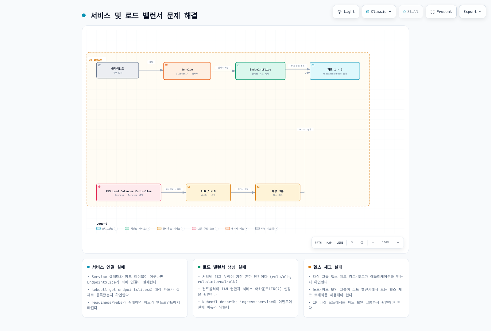

# Part 3: 문제 해결

> **예제 검증 버전**: EKS Kubernetes 1.36, Amazon VPC CNI 1.23.0
> **마지막 업데이트**: 2026년 9월 11일

## 개요

이 문서에서는 Amazon EKS 네트워킹의 성능 최적화, 문제 해결 방법, 그리고 고급 사용 사례에 대해 알아보겠습니다. 네트워크 성능을 최적화하는 방법, 일반적인 네트워킹 문제를 해결하는 방법, 그리고 고급 네트워킹 기능을 활용하는 방법을 다룹니다.

## 네트워크 성능 최적화

EKS 클러스터의 네트워크 성능을 최적화하기 위한 여러 전략이 있습니다.

<!-- Diagram repair pending: see batch report.


[🔍 인터랙티브 다이어그램 보기](https://www.atomai.click/kubernetes-docs/archmaps/ko-eks-03-eks-networking-part3-0.html)
-->

### 인스턴스 유형 선택

C5/M5/R5는 ENA 지원 제품군의 예시이지 이전 세대를 권장하는 목록은 아닙니다. 실제 인스턴스의 기본·버스트 대역폭, 초당 패킷 수, 연결 추적, ENA 큐, 단일 흐름 제한과 CPU 부하를 비교합니다. 크기 증가가 보편적인 지연 개선은 아니며 100 Gbps가 모든 ENA의 상한도 아닙니다.

[공식 M5 사양](https://docs.aws.amazon.com/ec2/latest/instancetypes/gp.html)은 **m5.large: 기본 0.75 Gbps / 최대 10 Gbps 버스트**, **m5.24xlarge: 25 Gbps**입니다. 애플리케이션 실측 처리량이 아니라 인스턴스 제한이며 지속 부하·목적지·단일 흐름 제한이 병목일 수 있습니다. 제품군 이름으로 추정하지 말고 대상 리전에서 확인합니다:
```bash
set -euo pipefail
: "${AWS_REGION:?Set the instance Region}"
aws ec2 describe-instance-types --region "$AWS_REGION" \
  --instance-types m5.large m5.24xlarge \
  --query 'InstanceTypes[].{Type:InstanceType,Network:NetworkInfo.NetworkPerformance,Cards:NetworkInfo.NetworkCards,ENIs:NetworkInfo.MaximumNetworkInterfaces,IPsPerENI:NetworkInfo.Ipv4AddressesPerInterface}'
```

### 클러스터 네트워킹 모드

EKS는 여러 네트워킹 모드를 지원하며, 각 모드는 성능 특성이 다릅니다.



[🔍 인터랙티브 다이어그램 보기](https://www.atomai.click/kubernetes-docs/archmaps/ko-eks-03-eks-networking-part3-1.html)

1. **Amazon VPC CNI(일반 EC2 노드)**:
   * 포드에 VPC IP 주소를 직접 할당합니다.
   * VPC 주소를 사용하며 실제 처리량·지연은 인스턴스와 경로 제한에 달려 있습니다. Prefix delegation은 주로 IP 할당·Pod 밀도에 영향을 주며 패킷 경로 지연을 자동 개선하지 않습니다.
   * 각 노드는 할당할 수 있는 IP 주소 수에 제한이 있습니다.
2. **사용자 정의 네트워킹**:
   * 포드에 특정 서브넷의 IP 주소를 할당할 수 있습니다.
   * 같은 VPC/AZ의 ENIConfig 서브넷을 통해 적절히 라우팅된 보조 VPC CIDR을 사용할 수 있습니다. 기존 서브넷 자체의 크기를 늘리는 것은 아닙니다.
   * 네트워크 토폴로지를 더 세밀하게 제어할 수 있습니다.
3. **대체 CNI 플러그인**:
   * Calico, Cilium 등의 대체 CNI 플러그인을 사용할 수 있습니다.
   * 기능·성능 차이는 정책 전용·체이닝·오버레이 모드, 암호화와 부하에 따라 달라집니다. 지원 컴퓨팅의 VPC CNI도 NetworkPolicy를 제공합니다. Auto Mode와 Hybrid Nodes는 별도 네트워킹·운영 모델이므로 일반 EC2 절차로 CNI를 교체하지 않습니다.

### MTU 최적화

실제 VPC CNI 환경 변수는 `ENI_MTU`가 아닌 **`AWS_VPC_ENI_MTU`**입니다. 1.23.0 기본값은 9001이며 `POD_MTU`는 Pod 가상 인터페이스를 제어하고 미설정 시 ENI MTU에서 값을 가져옵니다. 구성 변경 전 init/main 컨테이너를 모두 확인합니다:
```bash
kubectl -n kube-system get daemonset aws-node -o json > aws-node-current.json
python3 - <<'PY'
import json
with open("aws-node-current.json") as stream:
    spec = json.load(stream)["spec"]["template"]["spec"]
for field in ("initContainers", "containers"):
    for container in spec.get(field, []):
        settings = {e["name"]: e.get("value", "<valueFrom>")
                    for e in container.get("env", [])
                    if e["name"] in {"AWS_VPC_ENI_MTU", "POD_MTU",
                      "DISABLE_TCP_EARLY_DEMUX", "POD_SECURITY_GROUP_ENFORCING_MODE"}}
        print(field, container["name"], settings)
PY
```
경로 테스트로 1500이 적합함을 확인했다면 아래 **Helm values 조각**을 기존 소유자의 구성에 병합합니다. EKS add-on은 정확한 구성 스키마를 확인하고 기존 값을 보존하며 Helm 소유 DaemonSet을 임의 패치하지 않습니다. ENI·Pod 인터페이스 변경에는 계획된 노드·Pod 교체가 필요할 수 있으므로 새 인터페이스와 기존 워크로드를 각각 확인합니다.
```yaml
env:
  AWS_VPC_ENI_MTU: "1500"
  POD_MTU: "1500"
```
점보 프레임은 패킷 오버헤드를 줄일 수 있지만 **실제 전체 경로**가 크기를 수용해야 합니다. SG와 서브넷 자체는 MTU를 설정하는 장치가 아닙니다. 인터넷 게이트웨이·VPN 경로는 흔히 1500으로 제한되며 게이트웨이·피어링·터널·로드 밸런서별 제한도 확인합니다. 경로 MTU 탐색을 위한 ICMP fragmentation needed/IPv6 Packet Too Big을 허용하세요. 작은 ping 성공이 큰 애플리케이션 패킷의 성공을 증명하지는 않습니다. CNI 허용 범위는 IPv4 576–9001, IPv6 1280–9001이며 유효한 값이 종단 경로 적합성을 보장하지는 않습니다.

### TCP 최적화

**TCP early demux:** 일반적인 처리량 향상 스위치가 아닙니다. 공식 안내의 Pod SG **strict** 모드에서는 비활성화하여 kubelet TCP 프로브가 branch ENI Pod에 접근하게 합니다. 설정 대상은 `aws-node` main 컨테이너가 아니라 `aws-vpc-cni-init`입니다. Standard 모드에는 이 우회가 필요하지 않습니다. 모드와 실패 경로를 확인한 뒤 적용할 Helm 조각은 다음과 같습니다:
```yaml
init:
  env:
    DISABLE_TCP_EARLY_DEMUX: "true"
```
**Keepalive:** TCP keepalive는 애플리케이션이 소켓에서 활성화한 경우 유휴·단절된 장기 연결을 탐지합니다. HTTP 연결 풀과 별개이며 짧은 연결을 빠르게 만들지 않습니다. 먼저 영향받은 호스트·네트워크 네임스페이스의 값을 읽습니다. 관리자 노트북에서 실행한 `sysctl`은 EKS 노드가 아니라 노트북 값을 보여줍니다:
```bash
sysctl net.ipv4.tcp_keepalive_time net.ipv4.tcp_keepalive_intvl \
  net.ipv4.tcp_keepalive_probes net.ipv4.tcp_rmem net.ipv4.tcp_wmem \
  net.core.rmem_max net.core.wmem_max
```
기존 60/15/6은 보편적인 프로덕션 기본값이 아닌 **측정하지 않은 튜닝 예시**입니다. 호환 Linux 커널과 hostNetwork가 아닌 워크로드에서 이 sysctl은 Kubernetes 1.29부터 safe 집합에 포함됩니다. 기존 Pod securityContext의 다른 설정을 보존하며 sysctl만 병합합니다:
```yaml
spec:
  template:
    spec:
      securityContext:
        sysctls:
        - name: net.ipv4.tcp_keepalive_time
          value: "60"
        - name: net.ipv4.tcp_keepalive_intvl
          value: "15"
        - name: net.ipv4.tcp_keepalive_probes
          value: "6"
```
**버퍼:** 바이트 단위 대역폭·지연 곱 `초당 비트 대역폭 × RTT 초 / 8`을 기준으로 실험합니다. TCP 자동 튜닝, 병렬 흐름, 소켓별 재정의와 총 메모리 압력도 중요합니다. 이전 16,777,216바이트(16 MiB) 상한 및 `4096 87380 16777216` / `4096 65536 16777216`은 실측 최적값이 아닌 예시입니다. `tcp_rmem`/`tcp_wmem`은 커널 4.15+에서 Kubernetes 1.32부터 safe Pod sysctl이지만 `net.core.*`도 같은 승인·격리 지원을 가진다고 가정하지 않습니다. 노드 수준 변경은 소유자의 관리 구성으로 적용하고 전후 오류·지연·처리량·메모리를 비교합니다.

### 노드 배치 및 지역성

아래는 같은 Deployment의 대안 배치 예제입니다. 같은 네임스페이스에 `app=cache` Pod를 먼저 준비합니다. 선호 조건은 배치를 강제하거나 기존 Pod를 옮기지 않습니다. Python 서버는 교육용이며 재현성이 필요하면 승인된 image digest를 고정하세요. 지역성과 복제본 분산·노드/AZ 장애 내성을 함께 판단하며 같은 노드 배치는 장애 영역을 공유합니다.

노드 배치 및 지역성을 최적화하여 네트워크 성능을 향상시킬 수 있습니다.



[🔍 인터랙티브 다이어그램 보기](https://www.atomai.click/kubernetes-docs/archmaps/ko-eks-03-eks-networking-part3-2.html)

1. **가용 영역 지역성**:
   * 통신이 빈번한 포드를 같은 가용 영역에 배치하여 지연 시간을 줄입니다.
   * 포드 어피니티 및 안티-어피니티를 사용하여 포드 배치를 제어합니다.

```yaml
apiVersion: apps/v1
kind: Deployment
metadata:
  name: web-server
spec:
  replicas: 3
  selector:
    matchLabels:
      app: web
  template:
    metadata:
      labels:
        app: web
    spec:
      automountServiceAccountToken: false
      securityContext:
        runAsNonRoot: true
        runAsUser: 10001
        runAsGroup: 10001
        seccompProfile:
          type: RuntimeDefault
      containers:
      - name: http
        image: python:3.13-alpine
        command:
        - python
        - -u
        - -c
        args:
        - |
          import os
          from http.server import BaseHTTPRequestHandler, HTTPServer
          class Handler(BaseHTTPRequestHandler):
              def do_GET(self):
                  self.send_response(200)
                  self.end_headers()
                  self.wfile.write((os.environ["APP_NAME"] + "\n").encode())
          HTTPServer(("0.0.0.0", 8080), Handler).serve_forever()
        env:
        - name: APP_NAME
          value: web
        ports:
        - name: http
          containerPort: 8080
        readinessProbe:
          httpGet:
            path: /health
            port: http
        resources:
          requests:
            cpu: 50m
            memory: 32Mi
          limits:
            cpu: 200m
            memory: 64Mi
        securityContext:
          allowPrivilegeEscalation: false
          readOnlyRootFilesystem: true
          capabilities:
            drop:
            - ALL
      affinity:
        podAffinity:
          preferredDuringSchedulingIgnoredDuringExecution:
          - weight: 100
            podAffinityTerm:
              labelSelector:
                matchExpressions:
                - key: app
                  operator: In
                  values:
                  - cache
              topologyKey: topology.kubernetes.io/zone
```

2. **노드 지역성**:
   * 통신이 빈번한 포드를 같은 노드에 배치하여 네트워크 홉을 줄입니다.
   * 이는 지연 시간에 민감한 애플리케이션에 특히 유용합니다.

```yaml
apiVersion: apps/v1
kind: Deployment
metadata:
  name: web-server
spec:
  replicas: 3
  selector:
    matchLabels:
      app: web
  template:
    metadata:
      labels:
        app: web
    spec:
      automountServiceAccountToken: false
      securityContext:
        runAsNonRoot: true
        runAsUser: 10001
        runAsGroup: 10001
        seccompProfile:
          type: RuntimeDefault
      containers:
      - name: http
        image: python:3.13-alpine
        command:
        - python
        - -u
        - -c
        args:
        - |
          import os
          from http.server import BaseHTTPRequestHandler, HTTPServer
          class Handler(BaseHTTPRequestHandler):
              def do_GET(self):
                  self.send_response(200)
                  self.end_headers()
                  self.wfile.write((os.environ["APP_NAME"] + "\n").encode())
          HTTPServer(("0.0.0.0", 8080), Handler).serve_forever()
        env:
        - name: APP_NAME
          value: web
        ports:
        - name: http
          containerPort: 8080
        readinessProbe:
          httpGet:
            path: /health
            port: http
        resources:
          requests:
            cpu: 50m
            memory: 32Mi
          limits:
            cpu: 200m
            memory: 64Mi
        securityContext:
          allowPrivilegeEscalation: false
          readOnlyRootFilesystem: true
          capabilities:
            drop:
            - ALL
      affinity:
        podAffinity:
          preferredDuringSchedulingIgnoredDuringExecution:
          - weight: 100
            podAffinityTerm:
              labelSelector:
                matchExpressions:
                - key: app
                  operator: In
                  values:
                  - cache
              topologyKey: kubernetes.io/hostname
```

3. **Service 트래픽 선호**:

현재 예제는 호환 서비스 프록시에서 `trafficDistribution: PreferSameZone`을 사용합니다. 같은 영역의 준비된 엔드포인트를 선호하고 없으면 다른 영역으로 대체하며 격리·영역 간 비용을 보장하지 않습니다. 지역 용량도 확보하세요. 방식을 바꿀 때는 더 높은 우선순위의 기존 `service.kubernetes.io/topology-mode: Auto` 어노테이션을 검토하여 제거합니다. `internalTrafficPolicy: Local`/`externalTrafficPolicy: Local`은 각각의 트래픽에 더 엄격한 노드 지역성을 적용하며 우선합니다. 로컬 엔드포인트가 없으면 트래픽이 중단될 수 있습니다.
```yaml
apiVersion: v1
kind: Service
metadata:
  name: my-service
spec:
  selector:
    app: my-app
  ports:
  - port: 80
    targetPort: 8080
  type: ClusterIP
  trafficDistribution: PreferSameZone
```

### 네트워크 정책 최적화

Kubernetes NetworkPolicy 허용은 합집합이며 규칙·정책 이름 순서로 “먼저 일치한 규칙 우선”을 정하지 않습니다. 자주 사용하는 규칙을 앞에 놓는 것은 이식 가능한 최적화가 아닙니다. Calico tier/order 등은 별도 API입니다. 필요한 ingress/egress 격리를 보존하면서 확인된 중복·폐기 규칙만 소유 관리 도구로 정리합니다. 대표 부하에서 정책 반영 시간, 규칙·맵 사용량, CPU와 패킷 손실을 측정해야 하며 정책 개수만으로 병목을 확정할 수 없습니다.

## 네트워킹 문제 해결

EKS 클러스터에서 발생할 수 있는 일반적인 네트워킹 문제와 해결 방법을 알아보겠습니다.



[🔍 인터랙티브 다이어그램 보기](https://www.atomai.click/kubernetes-docs/archmaps/ko-eks-03-eks-networking-part3-3.html)

### 포드 네트워킹 문제

<!-- Diagram repair pending: see batch report.


[🔍 인터랙티브 다이어그램 보기](https://www.atomai.click/kubernetes-docs/archmaps/ko-eks-03-eks-networking-part3-4.html)
-->

실제 Pod 이벤트부터 확인합니다. `ContainerCreating`은 CNI/IPAM뿐 아니라 이미지·볼륨·런타임 문제일 수 있으므로 IP 고갈의 증거가 아닙니다. 영향 노드, 서브넷 여유 주소, ENI/IP 제한, prefix 단편화, API 오류·제한과 CNI 로그를 함께 확인합니다:
```bash
set -euo pipefail
: "${APP_NAMESPACE:?Set the affected namespace}"
: "${APP_POD:?Set the affected Pod}"
: "${APP_SERVICE:?Set the affected Service}"
kubectl -n "$APP_NAMESPACE" describe pod "$APP_POD"
kubectl -n "$APP_NAMESPACE" get events --field-selector "involvedObject.name=$APP_POD" --sort-by=.metadata.creationTimestamp
kubectl -n "$APP_NAMESPACE" get service "$APP_SERVICE" -o yaml
kubectl -n "$APP_NAMESPACE" get endpointslices \
  -l "kubernetes.io/service-name=$APP_SERVICE" -o yaml
kubectl -n "$APP_NAMESPACE" get networkpolicy
kubectl -n kube-system logs -l k8s-app=aws-node -c aws-node --tail=200 --prefix=true
```
**IP 할당:** `WARM_IP_TARGET`을 늘리면 여유 주소를 더 예약하므로 서브넷 고갈을 악화시킬 수 있습니다. 관찰한 할당·시작 지연 요구와 여유 용량에 맞춰 조정하세요. 여유 IP 총합이 많아도 연속된 /28이 없으면 prefix를 할당할 수 없습니다. 노드 크기 변경도 서브넷을 확장하지 않습니다. 병목을 찾은 뒤 서브넷·prefix 예약, 지원 Pod 밀도 또는 단계적 네트워크 이전을 계획합니다.

**연결:** 실제 TCP/UDP 프로토콜로 같은 노드·다른 노드·다른 영역·Pod IP·Service 경로를 비교합니다. DNS 실패·도구 부재·ICMP 차단이 NetworkPolicy 거부의 증거는 아닙니다. 아래는 표시된 도구를 가진 기존 승인 진단 Pod를 전제로 하며 클러스터 DNS 접미사와 대상 URL을 조정합니다. 이를 위해 프로덕션 Pod에 특권 도구를 설치하지 마세요:
```bash
set -euo pipefail
: "${APP_NAMESPACE:?Set the affected namespace}"
: "${DIAGNOSTIC_POD:?Set a running diagnostic Pod with curl and DNS tools}"
: "${TARGET_URL:?Set the real application URL and port}"
kubectl -n "$APP_NAMESPACE" exec "$DIAGNOSTIC_POD" -- cat /etc/resolv.conf
kubectl -n "$APP_NAMESPACE" exec "$DIAGNOSTIC_POD" -- nslookup kubernetes.default.svc.cluster.local
kubectl -n "$APP_NAMESPACE" exec "$DIAGNOSTIC_POD" -- curl \
  --fail --show-error --max-time 10 "$TARGET_URL"
```
**DNS:** dnsPolicy/dnsConfig, resolv.conf, DNS Service/EndpointSlice, CoreDNS 이벤트·로그와 업스트림 연결을 확인합니다. `nslookup`과 `dig`는 대안 도구이지 애플리케이션 이미지에 반드시 포함되지는 않습니다. Auto Mode 네이티브 DNS는 관리 경로가 다르므로 기존 CoreDNS Deployment가 없다고 바로 장애는 아닙니다. 재시작을 고려하기 전에 관리형 add-on 구성과 증거를 보존하세요.

### 서비스 및 로드 밸런싱 문제



[🔍 인터랙티브 다이어그램 보기](https://www.atomai.click/kubernetes-docs/archmaps/ko-eks-03-eks-networking-part3-5.html)

**Service 경로:** 네임스페이스, 선택자 레이블, 실제 리스닝 포트, Service port/targetPort, readiness와 EndpointSlice 주소·조건을 확인합니다. 대규모 백엔드가 잘릴 수 있는 기존 Endpoints API 대신 EndpointSlice를 사용합니다. 이후 실제 서비스 프록시·CNI 모드와 트래픽 정책·지역성 선호를 확인합니다.

**로드 밸런서/Ingress:** 먼저 소유 컨트롤러와 클래스를 식별합니다. 일반 LBC는 Ingress 이벤트, 컨트롤러 로그와 AWS 대상 상태 사유를 확인하고 Auto Mode는 관리형 컨트롤러의 별도 진단 경로를 사용합니다. scheme·클라이언트 경로, 서브넷 선택·구성, 프론트엔드·대상 SG, 실제 대상 유형, 헬스체크 포트·경로, 인증서·SNI·DNS를 확인하세요. 서브넷 태그가 경로를 만들지 않으며 컨트롤러 Running이 대상의 정상 상태를 증명하지는 않습니다.
```bash
set -euo pipefail
: "${APP_NAMESPACE:?Set the affected namespace}"
: "${INGRESS_NAME:?Set the affected Ingress}"
: "${AWS_REGION:?Set the load balancer Region}"
: "${TARGET_GROUP_ARN:?Set the target group identified from this Ingress}"
kubectl -n "$APP_NAMESPACE" describe ingress "$INGRESS_NAME"
kubectl -n kube-system logs -l app.kubernetes.io/name=aws-load-balancer-controller --tail=200 --prefix=true
aws elbv2 describe-target-health --region "$AWS_REGION" --target-group-arn "$TARGET_GROUP_ARN"
```
확인된 원인을 하나씩 변경하고 되돌릴 경로를 보존하며 동일한 허용·거부 애플리케이션 테스트를 반복합니다. 위 명령은 진단 예제이며 이 감사에서는 EKS 클러스터를 대상으로 실행하지 않았습니다.

공식 참고: [EC2 대역폭](https://docs.aws.amazon.com/AWSEC2/latest/UserGuide/ec2-instance-network-bandwidth.html), [MTU](https://docs.aws.amazon.com/AWSEC2/latest/UserGuide/network_mtu.html), [VPC CNI 1.23.0 설정](https://github.com/aws/amazon-vpc-cni-k8s/blob/v1.23.0/README.md), [Kubernetes sysctl](https://kubernetes.io/docs/tasks/administer-cluster/sysctl-cluster/), [Service 트래픽 분산](https://kubernetes.io/docs/reference/networking/virtual-ips/).

## 퀴즈

이 장에서 배운 내용을 테스트하려면 [주제 퀴즈](../quizzes/eks/03-eks-networking-part3-quiz.md)를 풀어보세요.
