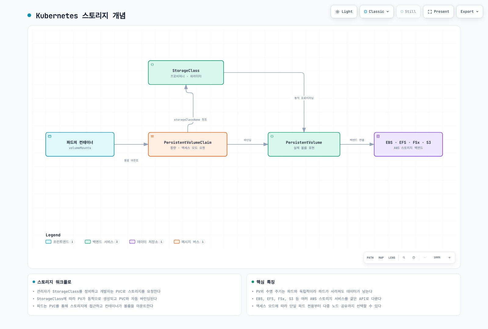
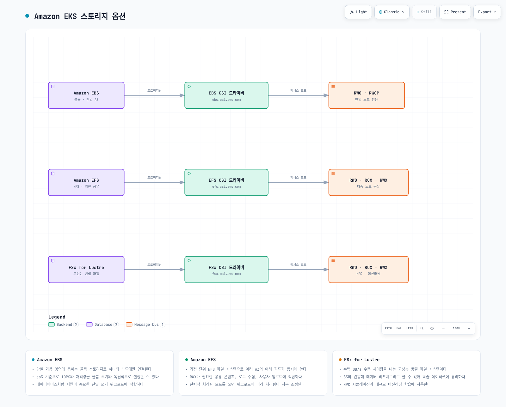
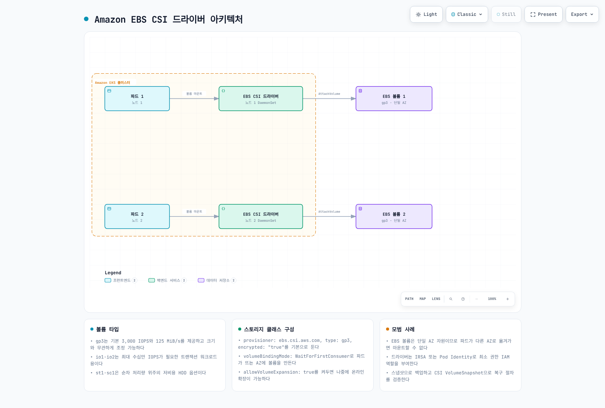
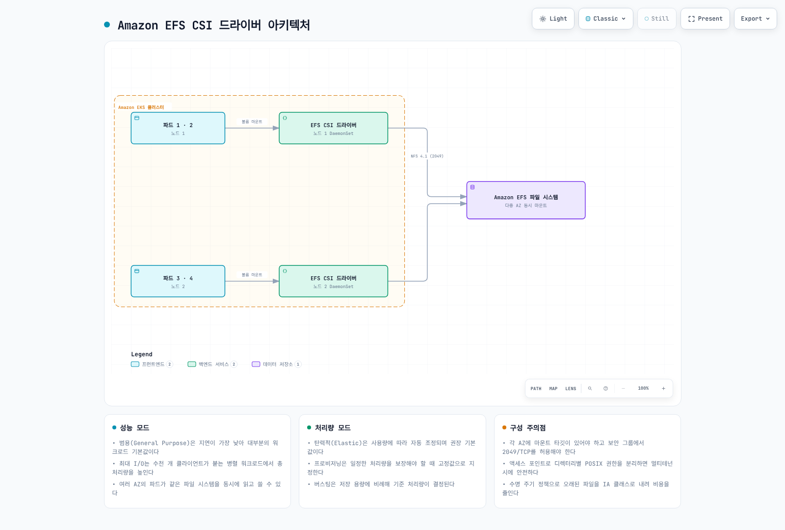
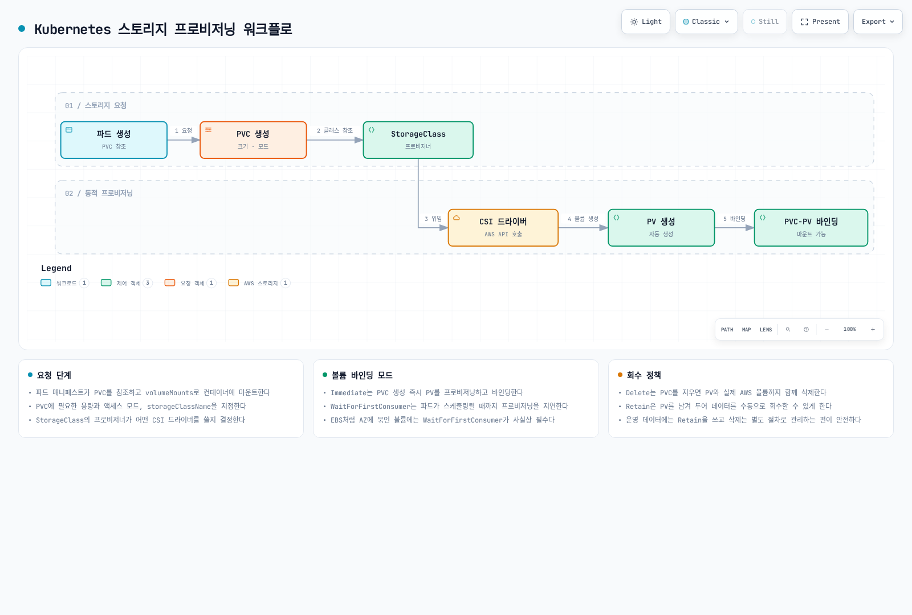

# EKS 스토리지

> **마지막 업데이트**: 2026년 9월 12일

Amazon EKS에서 애플리케이션을 실행할 때 데이터를 저장하고 관리하기 위한 다양한 스토리지 옵션이 있습니다. 이 문서에서는 EKS 스토리지의 기본 개념과 Amazon EBS(Elastic Block Store) 및 Amazon EFS(Elastic File System)를 사용하는 방법에 대해 알아보겠습니다.

## 목차

1. [Kubernetes 스토리지 기본 개념](04-eks-storage-part1.md#kubernetes-스토리지-기본-개념)
2. [Amazon EKS 스토리지 옵션 개요](04-eks-storage-part1.md#amazon-eks-스토리지-옵션-개요)
3. [Amazon EBS를 사용한 스토리지](04-eks-storage-part1.md#amazon-ebs를-사용한-스토리지)
4. [Amazon EFS를 사용한 스토리지](04-eks-storage-part1.md#amazon-efs를-사용한-스토리지)
5. [스토리지 클래스 및 동적 프로비저닝](04-eks-storage-part1.md#스토리지-클래스-및-동적-프로비저닝)

## Kubernetes 스토리지 기본 개념

Kubernetes에서 스토리지를 관리하기 위한 핵심 개념들을 먼저 이해해 보겠습니다.



[🔍 인터랙티브 다이어그램 보기](https://www.atomai.click/kubernetes-docs/archmaps/ko-eks-04-eks-storage-part1-0.html)

### 볼륨(Volume)

볼륨은 컨테이너에 파일 시스템 마운트 또는 지원되는 raw block 장치로 스토리지를 제공합니다. 수명은 유형에 따라 다릅니다. `emptyDir`는 컨테이너 재시작에는 유지되지만 Pod와 함께 제거되고, PVC 기반 영구 볼륨은 별도로 관리됩니다. Pod 삭제가 모든 백엔드 데이터 삭제를 의미하지는 않습니다.

### 영구 볼륨(PersistentVolume, PV)

영구 볼륨은 관리자가 프로비저닝하거나 스토리지 클래스를 통해 동적으로 프로비저닝된 클러스터의 스토리지 조각입니다. PV 객체는 Pod와 별개이지만 PVC 소유권과 reclaim policy에 따라 보존 여부가 달라집니다. 예를 들어 generic ephemeral volume의 PVC는 소유 Pod와 함께 가비지 컬렉션될 수 있습니다.

### 영구 볼륨 클레임(PersistentVolumeClaim, PVC)

영구 볼륨 클레임은 사용자의 스토리지 요청입니다. PVC는 특정 크기와 액세스 모드를 가진 스토리지를 요청하며, 이 요청은 적절한 PV에 바인딩됩니다.

PVC는 네임스페이스 리소스이며 보통 PV 하나와 바인딩됩니다. 접근 모드·백엔드가 허용하면 같은 네임스페이스의 여러 Pod가 클레임을 사용할 수 있습니다. 바인딩 자체가 파일 권한이나 용량·성능을 보장하지는 않습니다.

### 스토리지 클래스(StorageClass)

스토리지 클래스는 관리자가 제공하는 스토리지의 "클래스"를 설명합니다. 스토리지 클래스를 사용하면 PVC가 생성될 때 동적으로 PV를 프로비저닝할 수 있습니다.

### 액세스 모드

Kubernetes는 다음과 같은 액세스 모드를 지원합니다:

* **ReadWriteOnce(RWO)**: 단일 노드에서 읽기/쓰기로 마운트 가능
* **ReadOnlyMany(ROX)**: 여러 노드에서 읽기 전용으로 마운트 가능
* **ReadWriteMany(RWX)**: 여러 노드에서 읽기/쓰기로 마운트 가능
* **ReadWriteOncePod(RWOP)**: 호환 CSI 구성에서 클러스터 전체의 Pod 하나로 읽기/쓰기 사용 제한; 1.22 도입, 1.29부터 stable

**RWO는 Pod 하나가 아니라 노드 하나**를 뜻하므로 그 노드의 여러 Pod가 PVC를 공유할 수 있습니다. RWOP는 별도 제약이며 호환 CSI sidecar가 필요합니다. 다른 접근 모드는 주로 매칭·마운트 기능에 관여하므로 필요한 read-only 플래그, 파일 권한과 서비스 권한도 설정해야 합니다. RWX가 동시 쓰기의 애플리케이션 일관성을 보장하지는 않습니다.

## Amazon EKS 스토리지 옵션 개요

Amazon EKS에서는 다양한 AWS 스토리지 서비스를 활용하여 컨테이너화된 애플리케이션에 스토리지를 제공할 수 있습니다.



[🔍 인터랙티브 다이어그램 보기](https://www.atomai.click/kubernetes-docs/archmaps/ko-eks-04-eks-storage-part1-1.html)

### 주요 스토리지 옵션

1. **Amazon EBS(Elastic Block Store)**
   * AZ 범위의 네트워크 블록 스토리지; 일반 gp3 파일 시스템 볼륨은 노드 하나에 연결(RWO 또는 호환 RWOP)
   * 고성능, 내구성 있는 블록 스토리지
   * 데이터베이스, 상태 유지 애플리케이션에 적합
2. **Amazon EFS(Elastic File System)**
   * 완전 관리형 NFS 파일 시스템
   * 여러 노드에서 동시에 마운트 가능(RWX)
   * 공유 파일 시스템이 필요한 워크로드에 적합
3. **Amazon FSx for Lustre**
   * 고성능 파일 시스템
   * 기계 학습, HPC, 빅 데이터 분석에 적합
   * 여러 노드에서 동시에 마운트 가능(RWX)
4. **Amazon S3(Simple Storage Service)**
   * 객체 스토리지
   * S3 API 또는 공식 Mountpoint for Amazon S3 CSI 드라이버로 접근(기존 버킷, 제한된 POSIX 인터페이스); 별도 공유 파일 시스템인 S3 Files는 EFS CSI 3.0+ 사용
   * 대용량 데이터 저장에 적합
5. **EC2 Instance Store(로컬 NVMe)**
   * EC2 인스턴스에 물리적으로 직접 연결된 임시(ephemeral) 로컬 NVMe 스토리지, 매우 낮은 지연시간
   * EC2 Instance Store CSI 드라이버는 2026년 5월 5일 EKS add-on으로 출시됨. 로컬 NVMe를 Kubernetes PV로 관리하지만 PV 객체가 노드 소실·종료 시 데이터 내구성을 보장하지는 않음. 설치 전 인스턴스·OS·add-on 호환성 확인 필요
   * AI/ML 임시 데이터 처리, Spark/Hadoop 로컬 캐시, 고속 로그 처리, DB 캐시 계층에 적합
   * 비용: 호환 EC2 인스턴스와 관련 AWS 리소스 비용을 계획하며 로컬 스토리지는 선택한 인스턴스에 종속됨 ([출처](https://aws.amazon.com/about-aws/whats-new/2026/05/ec2-csi-eks/))

### 스토리지 옵션 비교

성능은 용량·처리량/IOPS 모드·클라이언트/네트워크 제한·부하에 따라 달라집니다. 아래는 실측 순위가 아닌 기능 비교입니다.

| 옵션 | 인터페이스 | 대표 용도 | 핵심 제약 |
|---|---|---|---|
| EBS | 블록/파일 시스템 | DB, 복제본별 상태 | 일반 볼륨은 한 AZ에 위치; 연결·일관성 규칙 적용 |
| EFS | 공유 NFS 파일 시스템 | 공유 파일 | Regional/One Zone, 처리량, POSIX 신원과 mount target 경로 구분 |
| FSx for Lustre | 병렬 파일 시스템 | HPC/ML 데이터셋 | 클라이언트·커널, 배포 유형, 용량과 프로비저닝 처리량 |
| S3 + Mountpoint CSI | 객체/파일 인터페이스 | 대규모 객체 데이터 | 기존 버킷 static provisioning; 모든 POSIX 연산을 지원하지 않음 |
| S3 Files + EFS CSI | S3 기반 공유 파일 시스템 | S3 데이터의 파일 접근 | 별도 서비스/IAM 구성; EFS CSI3.0+와 컴퓨팅 제약 |
| EC2 Instance Store CSI | 로컬 블록/파일 시스템 | 재생성 가능한 캐시·scratch | 노드·로컬 매체 수명에 데이터 종속 |

서로 다른 의미와 컨트롤러·노드 IAM 요건은 [Mountpoint CSI](https://docs.aws.amazon.com/eks/latest/userguide/s3-csi.html), [S3 Files](https://docs.aws.amazon.com/eks/latest/userguide/s3files-csi.html)를 참고하세요. 어느 쪽도 트랜잭션 DB 파일 시스템의 자동 대체재는 아닙니다.

## Amazon EBS를 사용한 스토리지

Amazon EBS는 EC2 인스턴스에 연결할 수 있는 블록 수준 스토리지 볼륨을 제공합니다. EKS에서는 EBS CSI(Container Storage Interface) 드라이버를 통해 EBS 볼륨을 Kubernetes 파드에 마운트할 수 있습니다.

<!-- Diagram repair pending: controller attach versus node mount path; see batch report.


[🔍 인터랙티브 다이어그램 보기](https://www.atomai.click/kubernetes-docs/archmaps/ko-eks-04-eks-storage-part1-2.html)
-->

### EBS CSI 드라이버 설치

일반 Linux EC2 노드는 인프라 소유 관리 도구로 호환 EBS CSI add-on을 설치합니다. Auto Mode는 `ebs.csi.eks.amazonaws.com`으로 블록 스토리지를 관리하며 기존 `ebs.csi.aws.com` 볼륨은 다른 provisioner를 사용합니다. 이전은 바인딩된 PVC나 driver의 in-place 수정이 아닙니다. 검증한 backup/snapshot 복원 계획 또는 현재 [AWS 이전 가이드의 workload 중지·Retain·static PV/PVC 재생성 절차](https://docs.aws.amazon.com/eks/latest/userguide/migrate-auto.html)로 기존 EBS volume을 재사용할 수 있습니다. 쓰기 재개 전에 backup 복구, volume/AZ/KMS 소유권, IAM/tag 권한, reclaim policy, finalizer와 새 binding을 검증하세요. Fargate Pod와 Hybrid Node에는 EBS를 마운트할 수 없습니다. 컨트롤러는 Fargate에 실행할 수 있지만 node plugin은 실행할 수 없으며 별도 배포·신원 설계가 필요합니다.

아래 공통 절차는 EBS 또는 EFS용입니다. 이 절에서는 `CSI_ADDON_NAME=aws-ebs-csi-driver`로 설정하고 목록에서 정확한 호환 add-on 버전을 선택합니다. AWS API는 버전에 문자열 `latest`를 사용하지 않습니다. `eksctl --version latest`는 AWS API 값이 아닌 별도 도구 편의 기능입니다.
```bash
set -euo pipefail
: "${CLUSTER_NAME:?Set the existing cluster name}"
: "${AWS_REGION:?Set the cluster Region}"
: "${CSI_ADDON_NAME:?Use aws-ebs-csi-driver or aws-efs-csi-driver}"
case "$CSI_ADDON_NAME" in
  aws-ebs-csi-driver|aws-efs-csi-driver) ;;
  *) echo "Unexpected add-on"; exit 1 ;;
esac
KUBERNETES_VERSION=$(aws eks describe-cluster --region "$AWS_REGION" --name "$CLUSTER_NAME" \
  --query cluster.version --output text)
CLUSTER_ENDPOINT=$(aws eks describe-cluster --region "$AWS_REGION" --name "$CLUSTER_NAME" \
  --query cluster.endpoint --output text)
CURRENT_ENDPOINT=$(kubectl config view --minify -o jsonpath='{.clusters[0].cluster.server}')
test "$CURRENT_ENDPOINT" = "$CLUSTER_ENDPOINT" || { echo "kubeconfig points to another cluster"; exit 1; }
aws eks describe-addon-versions --region "$AWS_REGION" --addon-name "$CSI_ADDON_NAME" \
  --kubernetes-version "$KUBERNETES_VERSION" --output json > csi-addon-versions.json
aws eks list-addons --region "$AWS_REGION" --cluster-name "$CLUSTER_NAME" --output json
```
설치 전에 정확한 `kube-system/ebs-csi-controller-sa`의 Pod Identity 역할·신뢰와 지원 컴퓨팅의 Pod Identity agent를 준비합니다. `AmazonEBSCSIDriverPolicyV2` 또는 제한한 정책, 필요한 고객 키 KMS 권한을 검토합니다. IRSA는 범위가 맞는 OIDC 신뢰와 `--service-account-role-arn`을 사용하며 신원 옵션을 무조건 혼합하지 않습니다. 기존 설치가 있으면 아래 코드는 중단합니다. 덮어쓰지 말고 해당 소유자의 갱신·인계 절차를 사용하세요.
```bash
set -euo pipefail
: "${CSI_ADDON_VERSION:?Choose a reviewed compatible version from csi-addon-versions.json}"
: "${CSI_ROLE_ARN:?Set the prepared Pod Identity role ARN}"
: "${CLUSTER_NAME:?Run the inspection step first}"
: "${AWS_REGION:?Run the inspection step first}"
: "${CSI_ADDON_NAME:?Run the inspection step first}"
case "$CSI_ADDON_NAME" in
  aws-ebs-csi-driver) CSI_SA=ebs-csi-controller-sa; CSI_PREFIX=ebs-csi ;;
  aws-efs-csi-driver) CSI_SA=efs-csi-controller-sa; CSI_PREFIX=efs-csi ;;
  *) echo "Unexpected add-on"; exit 1 ;;
esac
python3 - "$CSI_ADDON_NAME" "$CSI_ADDON_VERSION" <<'PY'
import json, sys
with open("csi-addon-versions.json") as stream:
    catalog = json.load(stream)
versions = [v["addonVersion"] for a in catalog["addons"]
            if a["addonName"] == sys.argv[1] for v in a["addonVersions"]]
if sys.argv[2] not in versions:
    raise SystemExit("Version not present in the inspected compatible catalog")
PY
aws eks list-addons --region "$AWS_REGION" --cluster-name "$CLUSTER_NAME" \
  --output json > csi-existing-addons.json
python3 - "$CSI_ADDON_NAME" <<'PY'
import json, sys
with open("csi-existing-addons.json") as stream:
    names = json.load(stream)["addons"]
if sys.argv[1] in names:
    raise SystemExit("Existing add-on: use its owner's update procedure")
PY
EXISTING_CSI=$(kubectl -n kube-system get "deployment/$CSI_PREFIX-controller" \
  "daemonset/$CSI_PREFIX-node" --ignore-not-found -o name)
test -z "$EXISTING_CSI" || { echo "Existing CSI installation: review its owner"; exit 1; }
aws eks describe-addon-configuration --region "$AWS_REGION" \
  --addon-name "$CSI_ADDON_NAME" --addon-version "$CSI_ADDON_VERSION"
aws eks create-addon --region "$AWS_REGION" --cluster-name "$CLUSTER_NAME" \
  --addon-name "$CSI_ADDON_NAME" --addon-version "$CSI_ADDON_VERSION" \
  --pod-identity-associations "serviceAccount=$CSI_SA,roleArn=$CSI_ROLE_ARN" \
  --resolve-conflicts NONE
aws eks wait addon-active --region "$AWS_REGION" --cluster-name "$CLUSTER_NAME" \
  --addon-name "$CSI_ADDON_NAME"
```
Add-on Active가 애플리케이션의 연결·마운트·쓰기·복원 성공을 증명하지는 않습니다. 전용 환경에서 각각 검증하세요. 이 장의 AWS 명령은 실행 시 리소스를 생성하며 감사에서는 로컬 검증만 수행했습니다.

### EBS 스토리지 클래스 생성

EBS 볼륨을 동적으로 프로비저닝하기 위한 스토리지 클래스를 생성합니다. 여기서는 gp3 볼륨 타입을 사용합니다.

이 장의 네임스페이스 리소스는 같은 `storage-demo`에서 사용합니다. 실습 전용 새 네임스페이스를 생성하고 이미 존재하면 소유권 확인 전 중단하세요. StorageClass와 snapshot class는 클러스터 범위이므로 별도 소유권 검토도 필요합니다. 아래 구성은 프로덕션 용량 산정값이 아닌 예제입니다.
```yaml
apiVersion: v1
kind: Namespace
metadata:
  name: storage-demo
  labels:
    pod-security.kubernetes.io/enforce: restricted
    pod-security.kubernetes.io/enforce-version: v1.36
```
위 네임스페이스 매니페스트를 **먼저** `storage-demo-namespace.yaml`로 저장한 뒤 create 명령을 실행합니다. 데이터 보존을 의도적으로 선택하세요. 예제는 `Retain`을 사용하므로 PVC 삭제 후 과금 AWS 리소스가 남을 수 있습니다.
```bash
kubectl create -f storage-demo-namespace.yaml
```


```yaml
apiVersion: storage.k8s.io/v1
kind: StorageClass
metadata:
  name: ebs-gp3
provisioner: ebs.csi.aws.com
volumeBindingMode: WaitForFirstConsumer
reclaimPolicy: Retain
allowVolumeExpansion: true
parameters:
  type: gp3
  encrypted: 'true'
  csi.storage.k8s.io/fstype: ext4
```

### 영구 볼륨 클레임(PVC) 생성

애플리케이션에서 사용할 PVC를 생성합니다.

```yaml
apiVersion: v1
kind: PersistentVolumeClaim
metadata:
  name: ebs-claim
  namespace: storage-demo
spec:
  accessModes:
  - ReadWriteOnce
  storageClassName: ebs-gp3
  resources:
    requests:
      storage: 10Gi
```

### 파드에서 PVC 사용

생성한 PVC를 파드에 마운트하여 사용합니다.

```yaml
apiVersion: v1
kind: Pod
metadata:
  name: app-with-ebs
  namespace: storage-demo
spec:
  automountServiceAccountToken: false
  securityContext:
    runAsNonRoot: true
    runAsUser: 1000
    runAsGroup: 1000
    fsGroup: 1000
    seccompProfile:
      type: RuntimeDefault
  containers:
  - name: app
    image: busybox:1.37.0
    command:
    - sh
    - -c
    args:
    - test -w /data && touch /data/demo-marker && sync && sleep 3600
    securityContext:
      allowPrivilegeEscalation: false
      readOnlyRootFilesystem: true
      capabilities:
        drop:
        - ALL
    resources:
      requests:
        cpu: 10m
        memory: 16Mi
      limits:
        cpu: 100m
        memory: 64Mi
    volumeMounts:
    - name: data
      mountPath: /data
  volumes:
  - name: data
    persistentVolumeClaim:
      claimName: ebs-claim
```

### EBS 볼륨 스냅샷

이 리소스를 사용하기 전에 snapshot CRD, 호환 snapshot controller와 드라이버 snapshotter 구성 요소를 준비합니다. 관리 소유자 또는 검토한 고정 릴리스를 사용하고 floating `master` 매니페스트를 적용하지 마세요. Class의 driver는 볼륨 provisioner와 일치해야 합니다. 스냅샷은 블록 시점 복사이므로 일관성에 따라 애플리케이션 quiesce/flush 또는 지원 백업 절차가 필요합니다.
```yaml
apiVersion: snapshot.storage.k8s.io/v1
kind: VolumeSnapshotClass
metadata:
  name: ebs-snapshot-retain
driver: ebs.csi.aws.com
deletionPolicy: Retain
```

```yaml
apiVersion: snapshot.storage.k8s.io/v1
kind: VolumeSnapshot
metadata:
  name: ebs-snapshot
  namespace: storage-demo
  labels:
    storage-demo: ebs
spec:
  volumeSnapshotClassName: ebs-snapshot-retain
  source:
    persistentVolumeClaimName: ebs-claim
```

```bash
set -euo pipefail
kubectl -n storage-demo wait --for=jsonpath='{.status.readyToUse}'=true \
  volumesnapshot/ebs-snapshot --timeout=300s
kubectl -n storage-demo get volumesnapshot ebs-snapshot -o yaml
```
복원은 스냅샷 네임스페이스에서 `status.restoreSize` 이상 크기의 새 PVC를 만들고 소비 Pod로 데이터를 검증합니다. 아래20Gi는 스냅샷이 그 이하라는 전제입니다. `WaitForFirstConsumer`이면 스케줄링 전 복원 PVC가 Pending인 것은 정상일 수 있습니다. Snapshot `deletionPolicy`는 PV `reclaimPolicy`와 별개이며 Retain은 백엔드 스냅샷을 남겨 별도 정리가 필요합니다.
```yaml
apiVersion: v1
kind: PersistentVolumeClaim
metadata:
  name: ebs-restored
  namespace: storage-demo
spec:
  accessModes:
  - ReadWriteOnce
  storageClassName: ebs-gp3
  resources:
    requests:
      storage: 20Gi
  dataSource:
    name: ebs-snapshot
    kind: VolumeSnapshot
    apiGroup: snapshot.storage.k8s.io
```


### EBS 볼륨 확장

StorageClass가 확장을 허용하고 드라이버·파일 시스템이 지원해야 합니다. 이10Gi 예제에서는 소유 관리 도구로 PVC 요청만20Gi로 늘립니다. 축소하거나 PV capacity를 수동 변경하여 확장을 흉내 내지 마세요. PVC 조건·용량과 마운트된 파일 시스템을 확인하며 `FileSystemResizePending`이면 문서화된 재마운트·재시작 경로가 필요할 수 있습니다.
```bash
set -euo pipefail
kubectl -n storage-demo get pvc ebs-claim -o yaml
kubectl -n storage-demo patch pvc ebs-claim --type merge \
  -p '{"spec":{"resources":{"requests":{"storage":"20Gi"}}}}'
kubectl -n storage-demo describe pvc ebs-claim
```

### EBS 볼륨 유형 및 성능

Amazon EBS는 다양한 볼륨 유형을 제공합니다:

| 볼륨 유형 | 설명              | 사용 사례                 |
| ----- | --------------- | --------------------- |
| gp3   | 범용 SSD          | 대부분의 워크로드에 적합, 비용 효율적 |
| io2   | 프로비저닝된 IOPS SSD | 고성능 데이터베이스            |
| st1   | 처리량 최적화 HDD     | 빅 데이터, 로그 처리          |
| sc1   | 콜드 HDD          | 자주 액세스하지 않는 데이터       |

gp3는 일반적인 시작점이지만 워크로드와 인스턴스 EBS 제한에 맞춰 용량·IOPS·처리량을 선택합니다. 일반 gp3 파일 시스템 볼륨은 다중 노드 공유 파일 시스템이 아닙니다. EBS CSI1.66.0은 `ReadWriteMany`용 io2 **raw block** Multi-Attach 경로를 지원하지만 호환 노드와 애플리케이션의 동시 접근 조정·fencing이 필요합니다. ext4/XFS를 여러 노드에서 독립적으로 동시 마운트해도 안전해지는 것은 아닙니다. RWOP와 RWO를 구분하고 CSI sidecar 호환성을 확인하세요.

## Amazon EFS를 사용한 스토리지

Amazon EFS는 완전 관리형 NFS 파일 시스템으로, 여러 EC2 인스턴스에서 동시에 액세스할 수 있습니다. EKS에서는 EFS CSI 드라이버를 통해 EFS 파일 시스템을 여러 파드에 동시에 마운트할 수 있습니다.



[🔍 인터랙티브 다이어그램 보기](https://www.atomai.click/kubernetes-docs/archmaps/ko-eks-04-eks-storage-part1-3.html)

### EFS CSI 드라이버 설치

지원 Linux EC2 컴퓨팅에서는 앞의 공통 add-on 절차에 `CSI_ADDON_NAME=aws-efs-csi-driver`, 호환 EFS 버전과 `kube-system/efs-csi-controller-sa`용 역할을 사용합니다. `AmazonEFSCSIDriverPolicy` 또는 제한한 동등 정책을 검토하세요. Fargate는 관리형 통합으로 EFS를 마운트하며 동적이 아닌 static provisioning을 지원합니다. 관리형 EFS CSI 지원 범위에서는 Windows/Hybrid Nodes가 제외됩니다. S3 Files는 EFS CSI3.0+를 사용하지만 컨트롤러 **및 노드** IAM 요건이 별도이고 Fargate를 지원하지 않습니다.

### EFS 파일 시스템 생성

`efs-ap` 동적 프로비저닝은 **기존** 파일 시스템에 access point를 만듭니다. 파일 시스템과 mount target은 네트워크·스토리지 소유자가 생성합니다. 아래 선택적 CLI 예제는 새 암호화 Regional 파일 시스템과 **서로 다른 AZ 두 개**에 mount target을 하나씩 생성합니다. 실제 클라이언트 AZ의 서브넷을 선택하고 추가 AZ는 모든 서브넷이 아닌 AZ당 target 하나로 확장합니다. 이미 IaC가 관리하는 파일 시스템은 기존 소유자의 절차를 사용하세요.

운영자 권한, 정확한 리전·계정, 클라이언트 SG와 DNS/NFS 경로를 먼저 준비합니다. 모호한 Name 태그 검색 대신 반환된 ID를 저장하고 쓰기 전에 VPC/AZ를 검증하며 부분 실패 기록을 남깁니다. 고유하고 안정적인 creation token은 해당 요청 소유입니다. 기존 token 응답이 다른 파일 시스템을 인계·변경할 권한은 아닙니다. 생성을 무조건 반복하지 말고 부분 생성 리소스를 검토·조정하세요.
```bash
set -euo pipefail
umask 077
: "${CLUSTER_NAME:?Set the cluster name}"
: "${AWS_REGION:?Set the Region}"
: "${EFS_CREATION_TOKEN:?Set a unique, stable token for this new filesystem}"
: "${EFS_SUBNET_A:?Set the first approved subnet}"
: "${EFS_SUBNET_B:?Set a subnet in a different AZ}"
: "${NFS_CLIENT_SG_ID:?Set the SG of the actual NFS clients}"
EFS_SETUP_DIR=$(mktemp -d -t eks-efs-setup.XXXXXX)
printf 'Creation records: %s\n' "$EFS_SETUP_DIR"
VPC_ID=$(aws eks describe-cluster --region "$AWS_REGION" --name "$CLUSTER_NAME" \
  --query cluster.resourcesVpcConfig.vpcId --output text)
aws ec2 describe-subnets --region "$AWS_REGION" \
  --subnet-ids "$EFS_SUBNET_A" "$EFS_SUBNET_B" --output json > "$EFS_SETUP_DIR/subnets.json"
aws ec2 describe-security-groups --region "$AWS_REGION" \
  --group-ids "$NFS_CLIENT_SG_ID" --output json > "$EFS_SETUP_DIR/client-sg.json"
python3 - "$EFS_SETUP_DIR" "$VPC_ID" "$EFS_CREATION_TOKEN" <<'PY'
import json, pathlib, sys
root, vpc, token = pathlib.Path(sys.argv[1]), sys.argv[2], sys.argv[3]
subnets = json.loads((root / "subnets.json").read_text())["Subnets"]
groups = json.loads((root / "client-sg.json").read_text())["SecurityGroups"]
if not 1 <= len(token) <= 64 or not token.isascii():
    raise SystemExit("Creation token must contain 1–64 ASCII characters")
if len(subnets) != 2 or len({s["SubnetId"] for s in subnets}) != 2:
    raise SystemExit("Exactly two distinct subnets are required")
if any(s["VpcId"] != vpc for s in subnets) or len({s["AvailabilityZoneId"] for s in subnets}) != 2:
    raise SystemExit("Subnets must be in the cluster VPC and different AZs")
if len(groups) != 1 or groups[0]["VpcId"] != vpc:
    raise SystemExit("The NFS client SG must belong to the cluster VPC")
PY
aws efs create-file-system --region "$AWS_REGION" --creation-token "$EFS_CREATION_TOKEN" \
  --performance-mode generalPurpose --throughput-mode elastic --encrypted \
  --tags Key=Name,Value=eks-storage-demo --output json > "$EFS_SETUP_DIR/filesystem-created.json"
EFS_FS_ID=$(python3 - "$EFS_SETUP_DIR/filesystem-created.json" <<'PY'
import json, sys
with open(sys.argv[1]) as stream:
    print(json.load(stream)["FileSystemId"])
PY
)
test -n "$EFS_FS_ID"
FS_READY=false
for ((attempt=0; attempt<60; attempt++)); do
  STATE=$(aws efs describe-file-systems --region "$AWS_REGION" --file-system-id "$EFS_FS_ID" \
    --query 'FileSystems[0].LifeCycleState' --output text)
  case "$STATE" in
    available) FS_READY=true; break ;;
    creating) sleep 5 ;;
    *) echo "Unexpected filesystem state: $STATE"; exit 1 ;;
  esac
done
test "$FS_READY" = true || { echo "Filesystem readiness timed out"; exit 1; }
aws ec2 create-security-group --region "$AWS_REGION" --group-name "efs-nfs-$EFS_FS_ID" \
  --description "NFS clients for $EFS_FS_ID" --vpc-id "$VPC_ID" \
  --output json > "$EFS_SETUP_DIR/sg-created.json"
EFS_SG_ID=$(python3 - "$EFS_SETUP_DIR/sg-created.json" <<'PY'
import json, sys
with open(sys.argv[1]) as stream:
    print(json.load(stream)["GroupId"])
PY
)
test -n "$EFS_SG_ID"
aws ec2 authorize-security-group-ingress --region "$AWS_REGION" --group-id "$EFS_SG_ID" \
  --protocol tcp --port 2049 --source-group "$NFS_CLIENT_SG_ID"
for SUBNET_ID in "$EFS_SUBNET_A" "$EFS_SUBNET_B"; do
  aws efs create-mount-target --region "$AWS_REGION" --file-system-id "$EFS_FS_ID" \
    --subnet-id "$SUBNET_ID" --security-groups "$EFS_SG_ID" --output json \
    > "$EFS_SETUP_DIR/mount-target-$SUBNET_ID.json"
done
TARGETS_READY=false
for ((attempt=0; attempt<60; attempt++)); do
  aws efs describe-mount-targets --region "$AWS_REGION" --file-system-id "$EFS_FS_ID" \
    --output json > "$EFS_SETUP_DIR/mount-targets.json"
  STATE=$(python3 - "$EFS_SETUP_DIR/mount-targets.json" <<'PY'
import json, sys
with open(sys.argv[1]) as stream:
    targets = json.load(stream)["MountTargets"]
states = [t["LifeCycleState"] for t in targets]
if any(s not in ("creating", "available") for s in states):
    raise SystemExit("Unexpected mount-target state")
print("available" if len(states) == 2 and all(s == "available" for s in states) else "creating")
PY
)
  if test "$STATE" = available; then TARGETS_READY=true; break; fi
  sleep 5
done
test "$TARGETS_READY" = true || { echo "Mount-target readiness timed out"; exit 1; }
printf 'Filesystem: %s\nMount-target SG: %s\nCreation records: %s\n' "$EFS_FS_ID" "$EFS_SG_ID" "$EFS_SETUP_DIR"
```
예제는 준비 상태 확인에 횟수를 제한한 Describe polling을 사용합니다. CSI 컨트롤러 역할은 일반적인 파일 시스템 생성 역할이 아닙니다. NFS ingress에는 실제 클라이언트 SG를 사용하며 해당 설계에서 노드·Pod 중 어느 ENI가 마운트 트래픽을 보내는지 확인하세요.

### EFS 스토리지 클래스 생성

EFS를 사용하기 위한 스토리지 클래스를 생성합니다. 파일 시스템 ID를 저장한 값으로 바꿉니다. 예제는 access point에서 UID/GID1000을 강제하고 고유 디렉토리를 유지하므로 신뢰 경계에 맞는 신원을 선택하세요. TLS를 사용합니다. `iam` 마운트 옵션은 애플리케이션 ServiceAccount가 아닌 **CSI node Pod의 신원**을 사용합니다. 컨트롤러 프로비저닝 권한과 클라이언트 마운트 권한은 별개입니다.

```yaml
apiVersion: storage.k8s.io/v1
kind: StorageClass
metadata:
  name: efs-sc
provisioner: efs.csi.aws.com
reclaimPolicy: Retain
mountOptions:
- tls
parameters:
  provisioningMode: efs-ap
  fileSystemId: fs-0123456789abcdef0
  directoryPerms: '750'
  uid: '1000'
  gid: '1000'
  basePath: /storage-demo
  ensureUniqueDirectory: 'true'
```

### 영구 볼륨 클레임(PVC) 생성

EFS를 사용하기 위한 PVC를 생성합니다. `5Gi` 요청은 Kubernetes 바인딩 메타데이터이지 EFS 디렉토리 quota나 할당 용량이 아닙니다. 증가하는 사용량에 대한 처리량·IOPS, access point quota와 비용 계획은 여전히 필요합니다.

```yaml
apiVersion: v1
kind: PersistentVolumeClaim
metadata:
  name: efs-claim
  namespace: storage-demo
spec:
  accessModes:
  - ReadWriteMany
  storageClassName: efs-sc
  resources:
    requests:
      storage: 5Gi
```

### 파드에서 EFS PVC 사용

생성한 PVC를 파드에 마운트하여 사용합니다.

```yaml
apiVersion: v1
kind: Pod
metadata:
  name: app-with-efs
  namespace: storage-demo
spec:
  automountServiceAccountToken: false
  securityContext:
    runAsNonRoot: true
    runAsUser: 1000
    runAsGroup: 1000
    fsGroup: 1000
    seccompProfile:
      type: RuntimeDefault
  containers:
  - name: app
    image: busybox:1.37.0
    command:
    - sh
    - -c
    args:
    - test -w /shared-data && touch /shared-data/demo-marker && sync && sleep 3600
    securityContext:
      allowPrivilegeEscalation: false
      readOnlyRootFilesystem: true
      capabilities:
        drop:
        - ALL
    resources:
      requests:
        cpu: 10m
        memory: 16Mi
      limits:
        cpu: 100m
        memory: 64Mi
    volumeMounts:
    - name: data
      mountPath: /shared-data
  volumes:
  - name: data
    persistentVolumeClaim:
      claimName: efs-claim
```

### EFS 액세스 포인트

Access point는 제시하는 루트 디렉토리와 강제 POSIX 신원을 설정합니다. 이것만으로 네임스페이스 격리가 완성되지는 않으므로 파일 시스템 IAM 정책과 네트워크 제어로 의도한 access point·TLS·클라이언트 권한을 강제합니다. 상호 신뢰하지 않는 테넌트가 공유하는 class에 `reuseAccessPoint`를 켜지 마세요. 검토한 드라이버의 재사용 token은 네임스페이스가 아닌 PVC 이름으로 정해져 서로 다른 클레임이 같은 데이터에 접근할 수 있습니다.

다음 static 예제는 기본·동적 프로비저닝을 사용하지 않도록 `storageClassName: ""`를 지정하고 기존 access point에 PVC를 명시적으로 바인딩합니다. 앞의 동적 클레임에 대한 대안입니다. Access point의 루트 디렉토리·POSIX 권한이 이미 적합해야 하며 소비자는 `storage-demo`의 `efs-static-claim`을 참조해야 합니다:
```yaml
apiVersion: v1
kind: PersistentVolume
metadata:
  name: efs-static-pv
spec:
  capacity:
    storage: 5Gi
  volumeMode: Filesystem
  accessModes:
  - ReadWriteMany
  persistentVolumeReclaimPolicy: Retain
  storageClassName: ''
  mountOptions:
  - tls
  csi:
    driver: efs.csi.aws.com
    volumeHandle: fs-0123456789abcdef0::fsap-0123456789abcdef0
---
apiVersion: v1
kind: PersistentVolumeClaim
metadata:
  name: efs-static-claim
  namespace: storage-demo
spec:
  accessModes:
  - ReadWriteMany
  storageClassName: ''
  volumeName: efs-static-pv
  resources:
    requests:
      storage: 5Gi
```


### EFS 성능 모드 및 처리량 모드

- **General Purpose**는 AWS가 모든 파일 시스템에 권장하는 성능 모드입니다. **Max I/O**는 연산별 지연이 높은 이전 세대 모드이며 Elastic 처리량 또는 One Zone과 함께 사용할 수 없습니다.
- **Elastic**은 수요에 맞춰 처리량을 조정하고, **Provisioned**는 선택한 처리량을 프로비저닝하며, **Bursting**은 저장 데이터·크레딧에 영향을 받습니다. 명시적으로 선택하며 콘솔/API의 기본값을 하나로 일반화하지 마세요.
- Regional과 One Zone의 장애·가용성 특성은 다릅니다. 현재 One Zone도 Elastic 처리량을 지원하지만 단일 AZ의 내구성 고려 사항은 남습니다.
- 실제 접근 패턴과 클라이언트 제한을 측정하세요. 이 설명은 예제의 지연·처리량 벤치마크가 아닙니다.

## 스토리지 클래스 및 동적 프로비저닝

Kubernetes의 스토리지 클래스를 사용하면 영구 볼륨을 동적으로 프로비저닝할 수 있습니다. EKS에서는 다양한 AWS 스토리지 서비스에 대한 스토리지 클래스를 구성할 수 있습니다.



[🔍 인터랙티브 다이어그램 보기](https://www.atomai.click/kubernetes-docs/archmaps/ko-eks-04-eks-storage-part1-4.html)

### 볼륨 바인딩 모드

스토리지 클래스의 `volumeBindingMode` 필드는 PVC가 생성될 때 PV가 바인딩되는 방식을 결정합니다:

* **Immediate**: PVC가 생성되는 즉시 PV를 프로비저닝하고 바인딩합니다.
* **WaitForFirstConsumer**: 파드가 PVC를 사용하려고 할 때까지 PV 프로비저닝을 지연합니다.

일반적인 AZ 범위 EBS 볼륨에는 `WaitForFirstConsumer`를 사용하여 스케줄러 제약이 프로비저닝·바인딩에 반영되게 합니다. EBS는 물리적인 instance-store 매체가 아닌 네트워크 연결 블록 스토리지이며, 드라이버의 별도 사전 연결 node-local 캐시 모드는 다른 기능입니다. 지연 바인딩 PVC가 Pending일 때 `spec.nodeName`으로 스케줄러를 우회하지 말고 nodeSelector 같은 스케줄링 제약을 사용하세요.

### 기본 스토리지 클래스 설정

PVC가 storageClassName을 생략하면 기본 class를 사용하며 명시적인 `storageClassName: ""`는 제외됩니다. 기존 기본값을 소유 관리 도구로 검토하세요. 전환 중 기본 class가 여러 개이면 가장 최근 생성된 기본값을 선택하지만 이후 의도한 기본값 하나를 유지합니다. 기존 바인딩 볼륨이 이전되지는 않습니다. 아래 같은 이름의 class 예제는 순차적인 파라미터 변경이 아닌 대안입니다.

```yaml
apiVersion: storage.k8s.io/v1
kind: StorageClass
metadata:
  name: ebs-gp3
  annotations:
    storageclass.kubernetes.io/is-default-class: 'true'
provisioner: ebs.csi.aws.com
volumeBindingMode: WaitForFirstConsumer
reclaimPolicy: Retain
allowVolumeExpansion: true
parameters:
  type: gp3
  encrypted: 'true'
  csi.storage.k8s.io/fstype: ext4
```

### 스토리지 클래스 예제

**1. EBS gp3 스토리지 클래스**

```yaml
apiVersion: storage.k8s.io/v1
kind: StorageClass
metadata:
  name: ebs-gp3
provisioner: ebs.csi.aws.com
volumeBindingMode: WaitForFirstConsumer
reclaimPolicy: Retain
allowVolumeExpansion: true
parameters:
  type: gp3
  encrypted: 'true'
  csi.storage.k8s.io/fstype: ext4
  iops: '3000'
  throughput: '125'
```

**2. EFS 스토리지 클래스**

```yaml
apiVersion: storage.k8s.io/v1
kind: StorageClass
metadata:
  name: efs-sc
provisioner: efs.csi.aws.com
reclaimPolicy: Retain
mountOptions:
- tls
parameters:
  provisioningMode: efs-ap
  fileSystemId: fs-0123456789abcdef0
  directoryPerms: '750'
  uid: '1000'
  gid: '1000'
  basePath: /storage-demo
  ensureUniqueDirectory: 'true'
```

**3. FSx for Lustre 스토리지 클래스**

지원 FSx CSI·컨트롤러 IAM 역할, Lustre 클라이언트·커널과 네트워크 경로를 먼저 준비합니다. 아래 최소 SCRATCH_2 class는 persistent 전용 처리량·백업 설정을 생략합니다. 재생성·복구 가능한 데이터에 사용하며 Retain이 scratch 스토리지를 영구 백업으로 바꾸지는 않습니다. CSI1.10.0의 `s3ImportPath`는 선택한 FSx 배포가 해당 통합을 지원할 때 사용할 수 있는 유효한 선택 파라미터입니다.

```yaml
apiVersion: storage.k8s.io/v1
kind: StorageClass
metadata:
  name: fsx-lustre
provisioner: fsx.csi.aws.com
reclaimPolicy: Retain
parameters:
  subnetId: subnet-0123456789abcdef0
  securityGroupIds: sg-0123456789abcdef0
  deploymentType: SCRATCH_2
  dataCompressionType: NONE
```

### 리클레임 정책

영구 볼륨의 리클레임 정책은 PVC가 삭제될 때 PV와 해당 데이터를 어떻게 처리할지 결정합니다:

* **Delete**: 클레임 해제·보호 처리 후 provisioner가 드라이버에 따라 백엔드 정리를 시도합니다. EBS는 볼륨을 삭제하지만 EFS 동적 프로비저닝은 기본적으로 파일 시스템·파일이 아닌 access point를 삭제합니다. EFS 컨트롤러의 `deleteAccessPointRootDir` 설정에 따라 동작이 달라집니다.
* **Retain**: PVC가 삭제되어도 PV와 데이터는 유지됩니다. 관리자가 수동으로 정리해야 합니다.
* **Recycle**: 사용되지 않는 정책으로, 대신 동적 프로비저닝과 스토리지 클래스를 사용하는 것이 좋습니다.

StorageClass 필드는 **`reclaimPolicy`**이며 **`persistentVolumeReclaimPolicy`**는 PV spec의 필드입니다. Class는 새 PV의 초기 정책을 정하며 이를 바꿔도 기존 PV 정책이 자동 변경되지는 않습니다. 클레임 삭제 전에 실제 PV와 백업을 확인하세요:

```yaml
apiVersion: storage.k8s.io/v1
kind: StorageClass
metadata:
  name: ebs-gp3-retain
provisioner: ebs.csi.aws.com
volumeBindingMode: WaitForFirstConsumer
reclaimPolicy: Retain
allowVolumeExpansion: true
parameters:
  type: gp3
  encrypted: 'true'
  csi.storage.k8s.io/fstype: ext4
```

공식 참고: [EBS CSI](https://docs.aws.amazon.com/eks/latest/userguide/ebs-csi.html), [EFS CSI](https://docs.aws.amazon.com/eks/latest/userguide/efs-csi.html), [snapshot controller](https://docs.aws.amazon.com/eks/latest/userguide/csi-snapshot-controller.html), [EFS 성능](https://docs.aws.amazon.com/efs/latest/ug/performance.html), [Kubernetes PV](https://kubernetes.io/docs/concepts/storage/persistent-volumes/).

## 결론

Amazon EKS에서는 다양한 스토리지 옵션을 활용하여 애플리케이션의 요구 사항에 맞는 스토리지 솔루션을 구성할 수 있습니다. 이 문서에서는 EBS와 EFS를 중심으로 기본 개념과 구성 방법을 살펴보았습니다. 다음 문서에서는 FSx for Lustre와 S3를 활용한 고급 스토리지 구성에 대해 알아보겠습니다.

## 퀴즈

이 장에서 배운 내용을 테스트하려면 [주제 퀴즈](../quizzes/eks/04-eks-storage-part1-quiz.md)를 풀어보세요.
