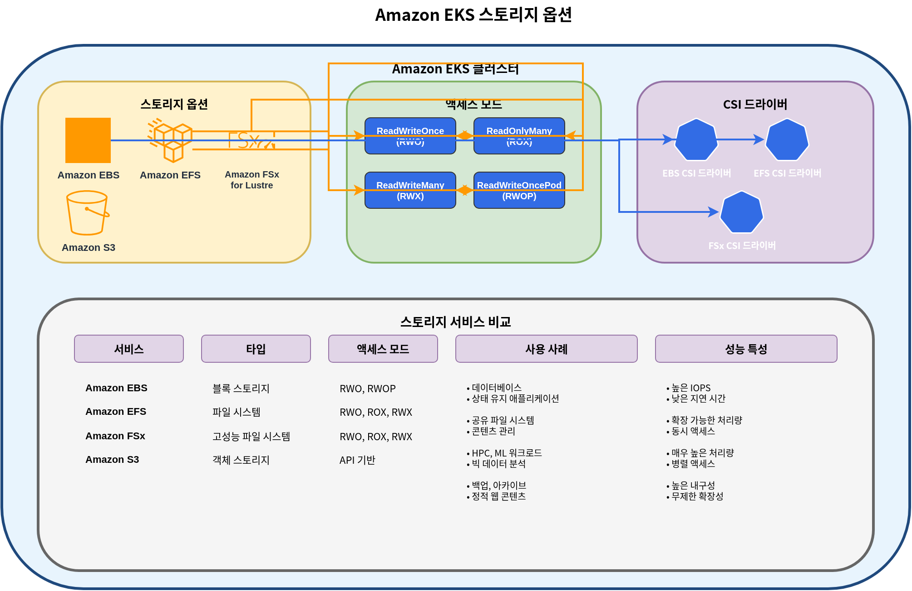

# Amazon EKS 스토리지 - Part 1: 기본 개념, EBS, EFS
> **마지막 업데이트**: 2026년 7월 3일

Amazon EKS에서 애플리케이션을 실행할 때 데이터를 저장하고 관리하기 위한 다양한 스토리지 옵션이 있습니다. 이 문서에서는 EKS 스토리지의 기본 개념과 Amazon EBS(Elastic Block Store) 및 Amazon EFS(Elastic File System)를 사용하는 방법에 대해 알아보겠습니다.

## 목차

1. [Kubernetes 스토리지 기본 개념](#kubernetes-스토리지-기본-개념)
2. [Amazon EKS 스토리지 옵션 개요](#amazon-eks-스토리지-옵션-개요)
3. [Amazon EBS를 사용한 스토리지](#amazon-ebs를-사용한-스토리지)
4. [Amazon EFS를 사용한 스토리지](#amazon-efs를-사용한-스토리지)
5. [스토리지 클래스 및 동적 프로비저닝](#스토리지-클래스-및-동적-프로비저닝)

## Kubernetes 스토리지 기본 개념

Kubernetes에서 스토리지를 관리하기 위한 핵심 개념들을 먼저 이해해 보겠습니다.


### 볼륨(Volume)

볼륨은 파드 내의 컨테이너에 마운트할 수 있는 디렉토리로, 컨테이너가 재시작되더라도 데이터가 유지됩니다. 볼륨의 수명은 파드의 수명과 동일하며, 파드가 삭제되면 볼륨도 함께 삭제됩니다.

### 영구 볼륨(PersistentVolume, PV)

영구 볼륨은 관리자가 프로비저닝하거나 스토리지 클래스를 통해 동적으로 프로비저닝된 클러스터의 스토리지 조각입니다. PV는 파드와 독립적인 수명 주기를 가지며, 파드가 삭제되어도 PV는 유지됩니다.

### 영구 볼륨 클레임(PersistentVolumeClaim, PVC)

영구 볼륨 클레임은 사용자의 스토리지 요청입니다. PVC는 특정 크기와 액세스 모드를 가진 스토리지를 요청하며, 이 요청은 적절한 PV에 바인딩됩니다.

### 스토리지 클래스(StorageClass)

스토리지 클래스는 관리자가 제공하는 스토리지의 "클래스"를 설명합니다. 스토리지 클래스를 사용하면 PVC가 생성될 때 동적으로 PV를 프로비저닝할 수 있습니다.

### 액세스 모드

Kubernetes는 다음과 같은 액세스 모드를 지원합니다:

- **ReadWriteOnce(RWO)**: 단일 노드에서 읽기/쓰기로 마운트 가능
- **ReadOnlyMany(ROX)**: 여러 노드에서 읽기 전용으로 마운트 가능
- **ReadWriteMany(RWX)**: 여러 노드에서 읽기/쓰기로 마운트 가능
- **ReadWriteOncePod(RWOP)**: 단일 파드에서만 읽기/쓰기로 마운트 가능 (Kubernetes 1.22+)

## Amazon EKS 스토리지 옵션 개요

Amazon EKS에서는 다양한 AWS 스토리지 서비스를 활용하여 컨테이너화된 애플리케이션에 스토리지를 제공할 수 있습니다.



### 주요 스토리지 옵션

1. **Amazon EBS(Elastic Block Store)**
   - 블록 스토리지로, 단일 노드에 마운트 가능(RWO)
   - 고성능, 내구성 있는 블록 스토리지
   - 데이터베이스, 상태 유지 애플리케이션에 적합

2. **Amazon EFS(Elastic File System)**
   - 완전 관리형 NFS 파일 시스템
   - 여러 노드에서 동시에 마운트 가능(RWX)
   - 공유 파일 시스템이 필요한 워크로드에 적합

3. **Amazon FSx for Lustre**
   - 고성능 파일 시스템
   - 기계 학습, HPC, 빅 데이터 분석에 적합
   - 여러 노드에서 동시에 마운트 가능(RWX)

4. **Amazon S3(Simple Storage Service)**
   - 객체 스토리지
   - 직접 볼륨으로 마운트할 수 없지만, S3 API를 통해 액세스 가능
   - 대용량 데이터 저장에 적합

5. **EC2 Instance Store(로컬 NVMe)**
   - EC2 인스턴스에 물리적으로 직접 연결된 임시(ephemeral) 로컬 NVMe 스토리지, 매우 낮은 지연시간
   - EC2 Instance Store CSI 드라이버가 2026년 5월 Amazon EKS 애드온으로 정식 출시(GA)되어, EKS Console/CLI에서 표준 애드온 형태로 설치·관리 가능(이전에는 커뮤니티 매니페스트로 수동 설치 필요). 볼륨 lifecycle을 드라이버가 자동 관리해 운영 부담을 줄여줌
   - AI/ML 임시 데이터 처리, Spark/Hadoop 로컬 캐시, 고속 로그 처리, DB 캐시 계층에 적합
   - 비용: 드라이버 자체는 무료이며, Instance Store가 포함된 EC2 인스턴스 사용 비용만 과금됨 ([출처](https://aws.amazon.com/about-aws/whats-new/2026/05/ec2-csi-eks/))

### 스토리지 옵션 비교

| 스토리지 옵션 | 유형 | 액세스 모드 | 성능 | 사용 사례 |
|--------------|------|------------|------|----------|
| Amazon EBS | 블록 | RWO | 높음 | 데이터베이스, 상태 유지 애플리케이션 |
| Amazon EFS | 파일 | RWX | 중간 | 공유 파일, 웹 서버, CMS |
| FSx for Lustre | 파일 | RWX | 매우 높음 | HPC, ML 훈련, 빅 데이터 |
| Amazon S3 | 객체 | API 액세스 | 중간 | 백업, 아카이브, 정적 콘텐츠 |
| EC2 Instance Store | 블록(로컬 NVMe) | RWO, ephemeral | 매우 높음(초저지연) | AI/ML 임시 데이터, 로컬 캐시, 고속 로그 처리 |

## Amazon EBS를 사용한 스토리지

Amazon EBS는 EC2 인스턴스에 연결할 수 있는 블록 수준 스토리지 볼륨을 제공합니다. EKS에서는 EBS CSI(Container Storage Interface) 드라이버를 통해 EBS 볼륨을 Kubernetes 파드에 마운트할 수 있습니다.


### EBS CSI 드라이버 설치

EKS에서 EBS 볼륨을 사용하기 위해서는 EBS CSI 드라이버를 설치해야 합니다. 이 드라이버는 Amazon EKS 애드온으로 제공됩니다.

```bash
# EBS CSI 드라이버 설치
eksctl create addon --name aws-ebs-csi-driver --cluster my-cluster --version latest

# 또는 AWS CLI 사용
aws eks create-addon --cluster-name my-cluster --addon-name aws-ebs-csi-driver --addon-version latest
```

### EBS 스토리지 클래스 생성

EBS 볼륨을 동적으로 프로비저닝하기 위한 스토리지 클래스를 생성합니다. 여기서는 gp3 볼륨 타입을 사용합니다.

```yaml
apiVersion: storage.k8s.io/v1
kind: StorageClass
metadata:
  name: ebs-gp3
provisioner: ebs.csi.aws.com
volumeBindingMode: WaitForFirstConsumer
parameters:
  type: gp3
  encrypted: "true"
  fsType: ext4
```

### 영구 볼륨 클레임(PVC) 생성

애플리케이션에서 사용할 PVC를 생성합니다.

```yaml
apiVersion: v1
kind: PersistentVolumeClaim
metadata:
  name: ebs-claim
spec:
  accessModes:
    - ReadWriteOnce
  storageClassName: ebs-gp3
  resources:
    requests:
      storage: 10Gi
```

### 파드에서 PVC 사용

생성한 PVC를 파드에 마운트하여 사용합니다.

```yaml
apiVersion: v1
kind: Pod
metadata:
  name: app-with-ebs
spec:
  containers:
  - name: app
    image: nginx
    volumeMounts:
    - mountPath: "/data"
      name: ebs-volume
  volumes:
  - name: ebs-volume
    persistentVolumeClaim:
      claimName: ebs-claim
```

### EBS 볼륨 스냅샷

EBS 볼륨의 스냅샷을 생성하여 데이터를 백업할 수 있습니다.

```yaml
apiVersion: snapshot.storage.k8s.io/v1
kind: VolumeSnapshot
metadata:
  name: ebs-snapshot
spec:
  volumeSnapshotClassName: csi-aws-vsc
  source:
    persistentVolumeClaimName: ebs-claim
```

### EBS 볼륨 확장

필요에 따라 EBS 볼륨의 크기를 확장할 수 있습니다.

```yaml
apiVersion: v1
kind: PersistentVolumeClaim
metadata:
  name: ebs-claim
spec:
  accessModes:
    - ReadWriteOnce
  storageClassName: ebs-gp3
  resources:
    requests:
      storage: 20Gi  # 10Gi에서 20Gi로 확장
```

### EBS 볼륨 유형 및 성능

Amazon EBS는 다양한 볼륨 유형을 제공합니다:

| 볼륨 유형 | 설명 | 사용 사례 |
|----------|------|----------|
| gp3 | 범용 SSD | 대부분의 워크로드에 적합, 비용 효율적 |
| io2 | 프로비저닝된 IOPS SSD | 고성능 데이터베이스 |
| st1 | 처리량 최적화 HDD | 빅 데이터, 로그 처리 |
| sc1 | 콜드 HDD | 자주 액세스하지 않는 데이터 |

EKS에서는 gp3 볼륨 타입을 권장합니다. gp3는 비용 효율적이면서도 일관된 성능을 제공합니다.

## Amazon EFS를 사용한 스토리지

Amazon EFS는 완전 관리형 NFS 파일 시스템으로, 여러 EC2 인스턴스에서 동시에 액세스할 수 있습니다. EKS에서는 EFS CSI 드라이버를 통해 EFS 파일 시스템을 여러 파드에 동시에 마운트할 수 있습니다.


### EFS CSI 드라이버 설치

EKS에서 EFS를 사용하기 위해서는 EFS CSI 드라이버를 설치해야 합니다.

```bash
# EFS CSI 드라이버 설치
eksctl create addon --name aws-efs-csi-driver --cluster my-cluster --version latest

# 또는 AWS CLI 사용
aws eks create-addon --cluster-name my-cluster --addon-name aws-efs-csi-driver --addon-version latest
```

### EFS 파일 시스템 생성

AWS Management Console, AWS CLI 또는 AWS CloudFormation을 사용하여 EFS 파일 시스템을 생성합니다.

```bash
# AWS CLI를 사용하여 EFS 파일 시스템 생성
aws efs create-file-system \
  --performance-mode generalPurpose \
  --throughput-mode bursting \
  --encrypted \
  --tags Key=Name,Value=MyEFSFileSystem

# 파일 시스템 ID 저장
EFS_FS_ID=$(aws efs describe-file-systems --query "FileSystems[?Name=='MyEFSFileSystem'].FileSystemId" --output text)

# EKS 클러스터의 VPC ID 가져오기
VPC_ID=$(aws eks describe-cluster --name my-cluster --query "cluster.resourcesVpcConfig.vpcId" --output text)

# 보안 그룹 생성
aws ec2 create-security-group \
  --group-name MyEFSSecurityGroup \
  --description "Security group for EFS mount targets" \
  --vpc-id $VPC_ID

SG_ID=$(aws ec2 describe-security-groups \
  --filters Name=group-name,Values=MyEFSSecurityGroup \
  --query "SecurityGroups[0].GroupId" --output text)

# NFS 트래픽 허용
aws ec2 authorize-security-group-ingress \
  --group-id $SG_ID \
  --protocol tcp \
  --port 2049 \
  --cidr 10.0.0.0/16

# 서브넷 ID 가져오기
SUBNET_IDS=$(aws ec2 describe-subnets \
  --filters "Name=vpc-id,Values=$VPC_ID" \
  --query "Subnets[*].SubnetId" --output text)

# 각 서브넷에 마운트 타겟 생성
for SUBNET_ID in $SUBNET_IDS; do
  aws efs create-mount-target \
    --file-system-id $EFS_FS_ID \
    --subnet-id $SUBNET_ID \
    --security-groups $SG_ID
done
```

### EFS 스토리지 클래스 생성

EFS를 사용하기 위한 스토리지 클래스를 생성합니다.

```yaml
apiVersion: storage.k8s.io/v1
kind: StorageClass
metadata:
  name: efs-sc
provisioner: efs.csi.aws.com
parameters:
  provisioningMode: efs-ap
  fileSystemId: fs-0123456789abcdef0  # 생성한 EFS 파일 시스템 ID
  directoryPerms: "700"
```

### 영구 볼륨 클레임(PVC) 생성

EFS를 사용하기 위한 PVC를 생성합니다.

```yaml
apiVersion: v1
kind: PersistentVolumeClaim
metadata:
  name: efs-claim
spec:
  accessModes:
    - ReadWriteMany  # 여러 노드에서 동시에 읽기/쓰기 가능
  storageClassName: efs-sc
  resources:
    requests:
      storage: 5Gi
```

### 파드에서 EFS PVC 사용

생성한 PVC를 파드에 마운트하여 사용합니다.

```yaml
apiVersion: v1
kind: Pod
metadata:
  name: app-with-efs
spec:
  containers:
  - name: app
    image: nginx
    volumeMounts:
    - mountPath: "/shared-data"
      name: efs-volume
  volumes:
  - name: efs-volume
    persistentVolumeClaim:
      claimName: efs-claim
```

### EFS 액세스 포인트

EFS 액세스 포인트를 사용하면 특정 디렉토리에 대한 액세스를 제한하고, 사용자 및 그룹 권한을 설정할 수 있습니다.

```yaml
apiVersion: v1
kind: PersistentVolume
metadata:
  name: efs-pv
spec:
  capacity:
    storage: 5Gi
  volumeMode: Filesystem
  accessModes:
    - ReadWriteMany
  persistentVolumeReclaimPolicy: Retain
  storageClassName: efs-sc
  csi:
    driver: efs.csi.aws.com
    volumeHandle: fs-0123456789abcdef0::fsap-0123456789abcdef0
    # volumeHandle 형식: {EFS 파일 시스템 ID}::{EFS 액세스 포인트 ID}
```

### EFS 성능 모드 및 처리량 모드

Amazon EFS는 두 가지 성능 모드와 세 가지 처리량 모드를 제공합니다:

**성능 모드**:
- **General Purpose**: 대부분의 워크로드에 권장
- **Max I/O**: 높은 병렬 처리가 필요한 워크로드에 적합

**처리량 모드**:
- **Bursting**: 기본 모드, 파일 시스템 크기에 따라 버스트 크레딧 제공
- **Provisioned**: 일관된 처리량이 필요한 경우 사용
- **Elastic**: 워크로드에 따라 자동으로 처리량 조정 (권장)

## 스토리지 클래스 및 동적 프로비저닝

Kubernetes의 스토리지 클래스를 사용하면 영구 볼륨을 동적으로 프로비저닝할 수 있습니다. EKS에서는 다양한 AWS 스토리지 서비스에 대한 스토리지 클래스를 구성할 수 있습니다.


### 볼륨 바인딩 모드

스토리지 클래스의 `volumeBindingMode` 필드는 PVC가 생성될 때 PV가 바인딩되는 방식을 결정합니다:

- **Immediate**: PVC가 생성되는 즉시 PV를 프로비저닝하고 바인딩합니다.
- **WaitForFirstConsumer**: 파드가 PVC를 사용하려고 할 때까지 PV 프로비저닝을 지연합니다.

EBS와 같은 노드 로컬 스토리지의 경우 `WaitForFirstConsumer`를 사용하는 것이 좋습니다. 이렇게 하면 파드가 스케줄링되는 노드와 동일한 가용 영역에 볼륨이 생성됩니다.

### 기본 스토리지 클래스 설정

특정 스토리지 클래스를 기본값으로 설정하면 PVC에서 스토리지 클래스를 지정하지 않아도 해당 스토리지 클래스가 사용됩니다.

```yaml
apiVersion: storage.k8s.io/v1
kind: StorageClass
metadata:
  name: ebs-gp3
  annotations:
    storageclass.kubernetes.io/is-default-class: "true"
provisioner: ebs.csi.aws.com
volumeBindingMode: WaitForFirstConsumer
parameters:
  type: gp3
  encrypted: "true"
```

### 스토리지 클래스 예제

**1. EBS gp3 스토리지 클래스**

```yaml
apiVersion: storage.k8s.io/v1
kind: StorageClass
metadata:
  name: ebs-gp3
provisioner: ebs.csi.aws.com
volumeBindingMode: WaitForFirstConsumer
parameters:
  type: gp3
  encrypted: "true"
  iops: "3000"
  throughput: "125"
```

**2. EFS 스토리지 클래스**

```yaml
apiVersion: storage.k8s.io/v1
kind: StorageClass
metadata:
  name: efs-sc
provisioner: efs.csi.aws.com
parameters:
  provisioningMode: efs-ap
  fileSystemId: fs-0123456789abcdef0
  directoryPerms: "700"
```

**3. FSx for Lustre 스토리지 클래스**

```yaml
apiVersion: storage.k8s.io/v1
kind: StorageClass
metadata:
  name: fsx-lustre
provisioner: fsx.csi.aws.com
parameters:
  subnetId: subnet-0123456789abcdef0
  securityGroupIds: sg-0123456789abcdef0
  deploymentType: SCRATCH_2
  automaticBackupRetentionDays: "0"
  dailyAutomaticBackupStartTime: "00:00"
  perUnitStorageThroughput: "200"
  dataCompressionType: "NONE"
```

### 리클레임 정책

영구 볼륨의 리클레임 정책은 PVC가 삭제될 때 PV와 해당 데이터를 어떻게 처리할지 결정합니다:

- **Delete**: PVC가 삭제되면 PV와 해당 데이터도 삭제됩니다.
- **Retain**: PVC가 삭제되어도 PV와 데이터는 유지됩니다. 관리자가 수동으로 정리해야 합니다.
- **Recycle**: 사용되지 않는 정책으로, 대신 동적 프로비저닝과 스토리지 클래스를 사용하는 것이 좋습니다.

스토리지 클래스에서 `persistentVolumeReclaimPolicy` 필드를 사용하여 리클레임 정책을 설정할 수 있습니다:

```yaml
apiVersion: storage.k8s.io/v1
kind: StorageClass
metadata:
  name: ebs-gp3-retain
provisioner: ebs.csi.aws.com
volumeBindingMode: WaitForFirstConsumer
reclaimPolicy: Retain
parameters:
  type: gp3
  encrypted: "true"
```

## 결론

Amazon EKS에서는 다양한 스토리지 옵션을 활용하여 애플리케이션의 요구 사항에 맞는 스토리지 솔루션을 구성할 수 있습니다. 이 문서에서는 EBS와 EFS를 중심으로 기본 개념과 구성 방법을 살펴보았습니다. 다음 문서에서는 FSx for Lustre와 S3를 활용한 고급 스토리지 구성에 대해 알아보겠습니다.

## 퀴즈

이 장에서 배운 내용을 테스트하려면 [주제 퀴즈](../quizzes/eks/04-eks-storage-part1-quiz.md)를 풀어보세요.
