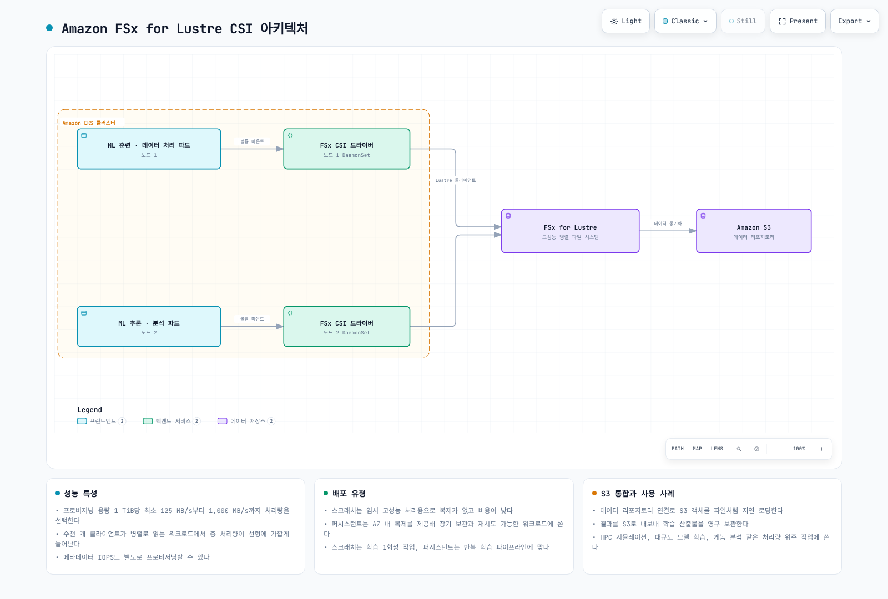
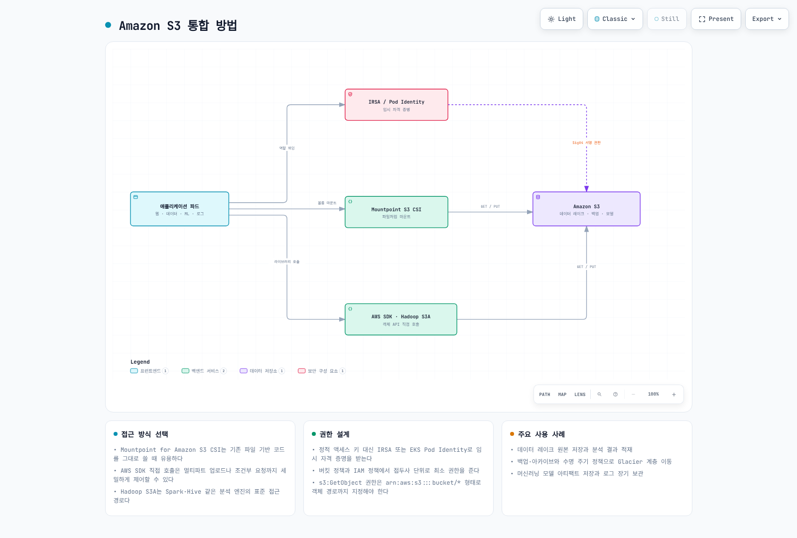
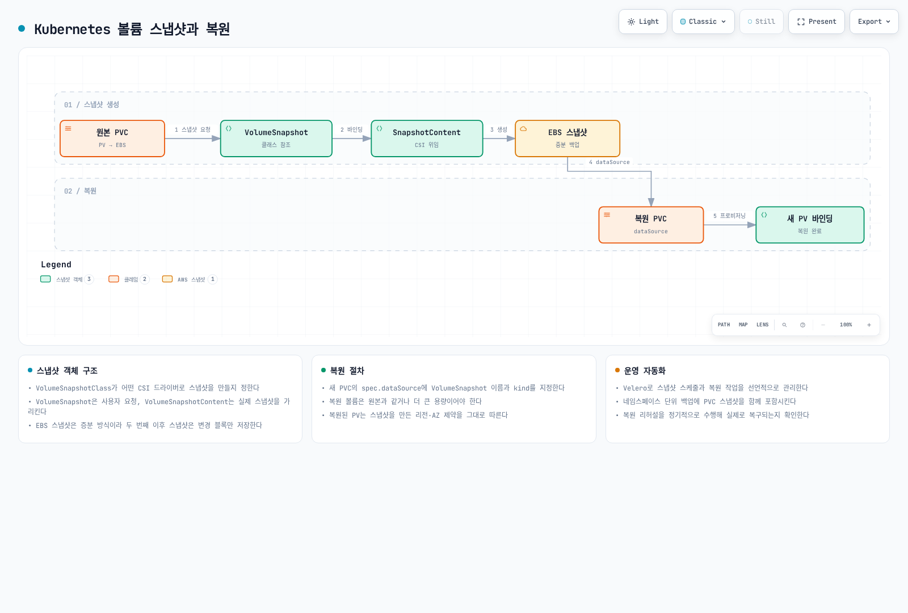
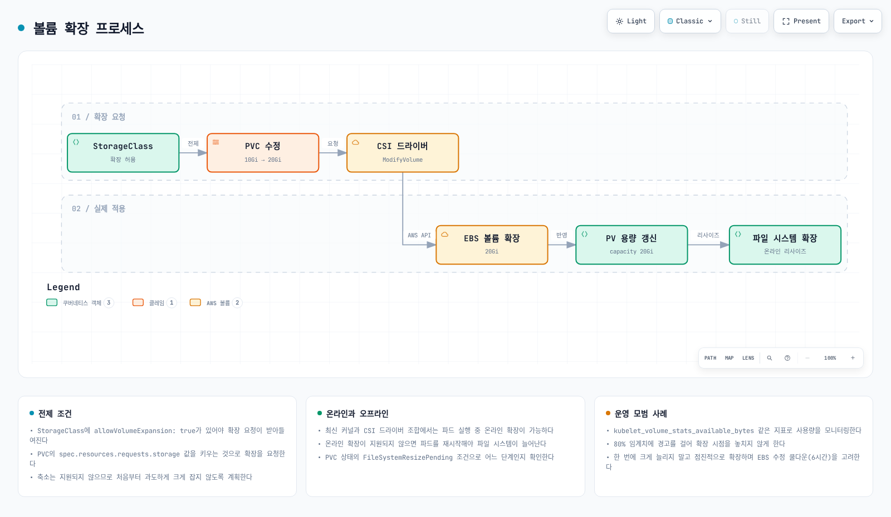
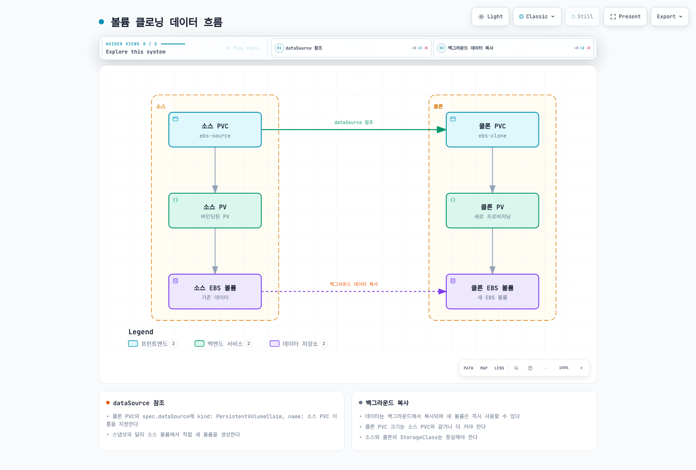
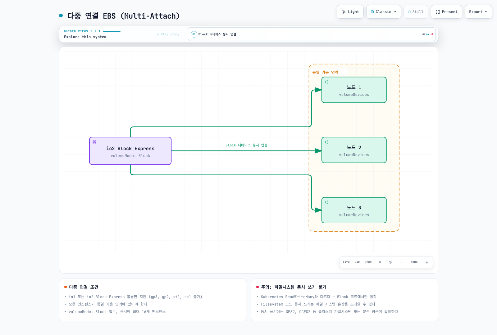
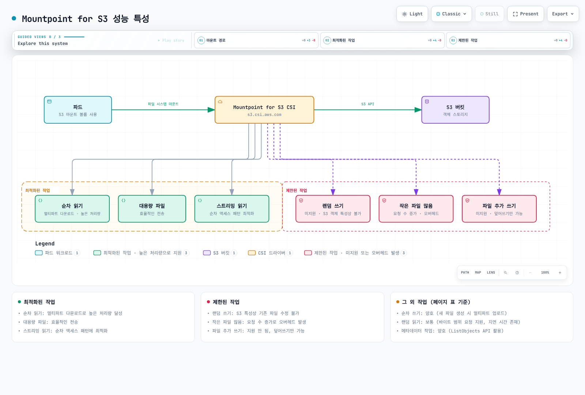
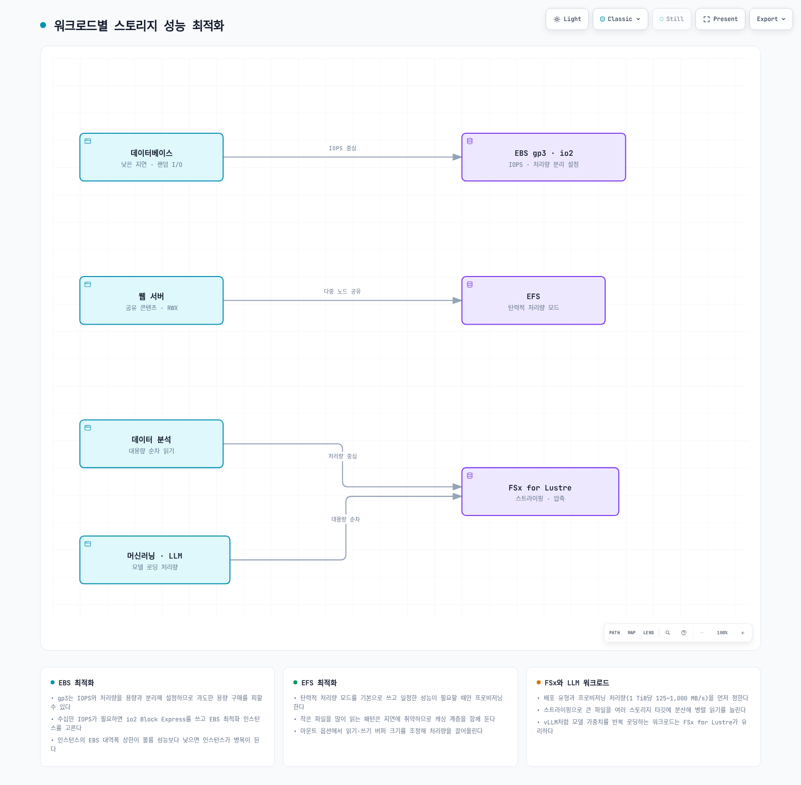

# Part 2: 스토리지 클래스

> **마지막 업데이트**: 2026년 9월 11일

이 문서는 Amazon EKS 스토리지 시리즈의 두 번째 부분으로, FSx for Lustre, Amazon S3, 스냅샷, 볼륨 확장 및 성능 최적화에 대해 다룹니다.

## 목차

1. [Amazon FSx for Lustre](04-eks-storage-part2.md#amazon-fsx-for-lustre)
2. [Amazon S3 스토리지 통합](04-eks-storage-part2.md#amazon-s3-스토리지-통합)
3. [스냅샷 및 백업](04-eks-storage-part2.md#스냅샷-및-백업)
4. [볼륨 확장 및 크기 조정](04-eks-storage-part2.md#볼륨-확장-및-크기-조정)
5. [볼륨 클로닝](04-eks-storage-part2.md#볼륨-클로닝)
6. [다중 연결 EBS (Multi-Attach)](04-eks-storage-part2.md#다중-연결-ebs-multi-attach)
7. [Mountpoint for S3 CSI 심화](04-eks-storage-part2.md#mountpoint-for-s3-csi-심화)
8. [스토리지 성능 최적화](04-eks-storage-part2.md#스토리지-성능-최적화)

## Amazon FSx for Lustre

FSx for Lustre는 지원되는 HPC/ML/분석 워크로드용 병렬 파일 시스템입니다. 성능은 배포·스토리지 유형, 용량, 프로비저닝 처리량, 클라이언트와 네트워크에 따라 달라지며 작은 예제가 제품의 모든 집계 최댓값을 제공하지는 않습니다.

그림은 선택적인 S3 데이터 저장소 통합을 나타냅니다. Import/export 정책·작업·권한이 필요하며 CSI 볼륨 생성만으로 자동 양방향 동기화가 구성되지는 않습니다.



[🔍 인터랙티브 다이어그램 보기](https://www.atomai.click/kubernetes-docs/archmaps/ko-eks-04-eks-storage-part2-0.html)

### FSx for Lustre CSI 드라이버 설치

인프라 소유자가 관리하는 지원 EKS add-on 또는 배포된 Helm 릴리스를 사용합니다. 아래 관리형 예제는 `CSI_ADDON_NAME=aws-fsx-csi-driver`로 설정합니다. `kube-system/fsx-csi-controller-sa`용 검토한 FSx 드라이버 권한과 Pod Identity 신뢰·agent를 준비합니다. IRSA도 OIDC 신뢰와 대응 add-on 역할 옵션으로 지원됩니다. Pod Identity agent는 해당 신원 방식에 필요하며 IRSA의 필수 조건은 아닙니다. Fargate는 지원 FSx CSI 노드 환경이 아니므로 Linux 커널·Lustre 클라이언트·실제 컴퓨팅 지원을 확인하세요.

`eksctl --role-only`는 Kubernetes ServiceAccount를 생성하지 않습니다. 관리형 add-on은 계정을 만들지만 Helm은 실제 계정을 생성·참조하고 신원을 연결해야 합니다. 계정을 준비하지 않은 상태에서 role-only와 `serviceAccount.create=false`를 조합하지 마세요.
```bash
set -euo pipefail
: "${CLUSTER_NAME:?Set the existing cluster name}"
: "${AWS_REGION:?Set the cluster Region}"
: "${CSI_ADDON_NAME:?Use aws-fsx-csi-driver}"
case "$CSI_ADDON_NAME" in
  aws-fsx-csi-driver) ;;
  *) echo "Unexpected add-on"; exit 1 ;;
esac
KUBERNETES_VERSION=$(aws eks describe-cluster --region "$AWS_REGION" --name "$CLUSTER_NAME" \
  --query cluster.version --output text)
CLUSTER_ENDPOINT=$(aws eks describe-cluster --region "$AWS_REGION" --name "$CLUSTER_NAME" \
  --query cluster.endpoint --output text)
CURRENT_ENDPOINT=$(kubectl config view --minify -o jsonpath='{.clusters[0].cluster.server}')
test "$CURRENT_ENDPOINT" = "$CLUSTER_ENDPOINT" || { echo "kubeconfig points to another cluster"; exit 1; }
aws eks describe-addon-versions --region "$AWS_REGION" --addon-name "$CSI_ADDON_NAME" \
  --kubernetes-version "$KUBERNETES_VERSION" --output json > csi-addon-versions.json
aws eks list-addons --region "$AWS_REGION" --cluster-name "$CLUSTER_NAME" --output json
```

```bash
set -euo pipefail
: "${CSI_ADDON_VERSION:?Choose a reviewed compatible version from csi-addon-versions.json}"
: "${CSI_ROLE_ARN:?Set the prepared Pod Identity role ARN}"
: "${CLUSTER_NAME:?Run the inspection step first}"
: "${AWS_REGION:?Run the inspection step first}"
: "${CSI_ADDON_NAME:?Run the inspection step first}"
case "$CSI_ADDON_NAME" in
  aws-fsx-csi-driver) CSI_SA=fsx-csi-controller-sa; CSI_PREFIX=fsx-csi ;;
  *) echo "Unexpected add-on"; exit 1 ;;
esac
python3 - "$CSI_ADDON_NAME" "$CSI_ADDON_VERSION" <<'PY'
import json, sys
with open("csi-addon-versions.json") as stream:
    catalog = json.load(stream)
versions = [v["addonVersion"] for a in catalog["addons"]
            if a["addonName"] == sys.argv[1] for v in a["addonVersions"]]
if sys.argv[2] not in versions:
    raise SystemExit("Version not present in the inspected compatible catalog")
PY
aws eks list-addons --region "$AWS_REGION" --cluster-name "$CLUSTER_NAME" \
  --output json > csi-existing-addons.json
python3 - "$CSI_ADDON_NAME" <<'PY'
import json, sys
with open("csi-existing-addons.json") as stream:
    names = json.load(stream)["addons"]
if sys.argv[1] in names:
    raise SystemExit("Existing add-on: use its owner's update procedure")
PY
EXISTING_CSI=$(kubectl -n kube-system get "deployment/$CSI_PREFIX-controller" \
  "daemonset/$CSI_PREFIX-node" --ignore-not-found -o name)
test -z "$EXISTING_CSI" || { echo "Existing CSI installation: review its owner"; exit 1; }
aws eks describe-addon-configuration --region "$AWS_REGION" \
  --addon-name "$CSI_ADDON_NAME" --addon-version "$CSI_ADDON_VERSION"
aws eks create-addon --region "$AWS_REGION" --cluster-name "$CLUSTER_NAME" \
  --addon-name "$CSI_ADDON_NAME" --addon-version "$CSI_ADDON_VERSION" \
  --pod-identity-associations "serviceAccount=$CSI_SA,roleArn=$CSI_ROLE_ARN" \
  --resolve-conflicts NONE
aws eks wait addon-active --region "$AWS_REGION" --cluster-name "$CLUSTER_NAME" \
  --addon-name "$CSI_ADDON_NAME"
```
기존 설치가 있으면 절차가 중단되므로 해당 소유자의 이전·갱신 경로를 사용합니다. Add-on Active가 파일 시스템 마운트를 증명하지는 않습니다. 아래 예제는 Part1의 전용 `storage-demo` 네임스페이스를 재사용하며 클러스터 범위 리소스 이름도 검토해야 합니다.

### FSx for Lustre 파일 시스템 생성

**동적 또는 정적 프로비저닝 중 선택합니다.** 동적 방식은 PVC로 파일 시스템을 만들므로 먼저 수동 생성한 시스템을 자동 인계한다고 가정하지 마세요. 아래 선택적 수동 절차는 정적 경로용입니다. 지원 AZ의 승인된 서브넷과 클라이언트·파일 시스템 통신 규칙을 준비한 Lustre SG를 선택합니다. `Subnets[0]`을 임의 선택하거나 TCP988만으로 모든 구성이 완료된다고 가정하지 않습니다. 예제는 클러스터 VPC로 제한하며 연결 VPC는 별도 경로·보안 검토가 필요합니다. 실행하면 과금 리소스가 생성되며 실패 시 반환 ID를 보존합니다.
```bash
set -euo pipefail
: "${CLUSTER_NAME:?Set the existing cluster}"
: "${AWS_REGION:?Set the filesystem Region}"
: "${FSX_SUBNET_ID:?Select an approved subnet in a supported AZ}"
: "${FSX_SECURITY_GROUP_ID:?Set the reviewed Lustre filesystem SG}"
: "${FSX_CREATION_TOKEN:?Set a unique stable token for this new filesystem}"
FSX_SETUP_DIR=$(mktemp -d -t eks-fsx-setup.XXXXXX)
printf 'Creation records: %s\n' "$FSX_SETUP_DIR"
VPC_ID=$(aws eks describe-cluster --region "$AWS_REGION" --name "$CLUSTER_NAME" \
  --query cluster.resourcesVpcConfig.vpcId --output text)
aws ec2 describe-subnets --region "$AWS_REGION" --subnet-ids "$FSX_SUBNET_ID" \
  --output json > "$FSX_SETUP_DIR/subnet.json"
aws ec2 describe-security-groups --region "$AWS_REGION" --group-ids "$FSX_SECURITY_GROUP_ID" \
  --output json > "$FSX_SETUP_DIR/sg.json"
python3 - "$FSX_SETUP_DIR" "$VPC_ID" <<'PY'
import pathlib, json, sys
root, vpc = pathlib.Path(sys.argv[1]), sys.argv[2]
subnets = json.loads((root / "subnet.json").read_text())["Subnets"]
groups = json.loads((root / "sg.json").read_text())["SecurityGroups"]
if len(subnets) != 1 or len(groups) != 1 or subnets[0]["VpcId"] != vpc or groups[0]["VpcId"] != vpc:
    raise SystemExit("This example requires one subnet and SG in the cluster VPC")
PY
aws fsx create-file-system --region "$AWS_REGION" --file-system-type LUSTRE \
  --client-request-token "$FSX_CREATION_TOKEN" --storage-capacity 1200 --storage-type SSD \
  --subnet-ids "$FSX_SUBNET_ID" --security-group-ids "$FSX_SECURITY_GROUP_ID" \
  --lustre-configuration DeploymentType=SCRATCH_2,DataCompressionType=NONE \
  --tags Key=Name,Value=eks-lustre-demo --output json > "$FSX_SETUP_DIR/created.json"
FSX_FILE_SYSTEM_ID=$(python3 - "$FSX_SETUP_DIR/created.json" <<'PY'
import json, sys
with open(sys.argv[1]) as stream:
    print(json.load(stream)["FileSystem"]["FileSystemId"])
PY
)
FSX_READY=false
for ((attempt=0; attempt<60; attempt++)); do
  STATE=$(aws fsx describe-file-systems --region "$AWS_REGION" --file-system-ids "$FSX_FILE_SYSTEM_ID" \
    --query 'FileSystems[0].Lifecycle' --output text)
  case "$STATE" in
    AVAILABLE) FSX_READY=true; break ;;
    CREATING) sleep 10 ;;
    *) echo "Unexpected filesystem state: $STATE"; exit 1 ;;
  esac
done
test "$FSX_READY" = true || { echo "Filesystem creation still pending; inspect recorded ID"; exit 1; }
aws fsx describe-file-systems --region "$AWS_REGION" --file-system-ids "$FSX_FILE_SYSTEM_ID" \
  --query 'FileSystems[0].{Id:FileSystemId,State:Lifecycle,DNS:DNSName,MountName:LustreConfiguration.MountName,CapacityGiB:StorageCapacity}' \
  --output json > "$FSX_SETUP_DIR/available.json"
cat "$FSX_SETUP_DIR/available.json"
```


### FSx for Lustre 스토리지 클래스 생성

**동적** 경로는 class에 실제 서브넷·보안 그룹을 지정합니다. 용량은 무시되는 `storageCapacity` class 파라미터가 아닌 PVC 요청으로 정합니다. SCRATCH_2에는 persistent 전용 per-unit 처리량·백업 설정을 혼합하지 않습니다. 반환된 mount name은 class의 `mountName`이 아니라 static PV의 volumeAttributes에 들어갑니다.
```yaml
apiVersion: storage.k8s.io/v1
kind: StorageClass
metadata:
  name: fsx-lustre-sc
provisioner: fsx.csi.aws.com
reclaimPolicy: Retain
parameters:
  subnetId: subnet-0123456789abcdef0
  securityGroupIds: sg-0123456789abcdef0
  deploymentType: SCRATCH_2
  dataCompressionType: NONE
```


### PVC 생성 및 파드에 마운트

읽기 전용 소비자는 마운트 접근만 확인하며 GPU 작업·처리량 벤치마크가 아닙니다. 이 점검에 CUDA 이미지는 필요하지 않습니다. UID/GID1000의 파일 권한과 실제 클라이언트 네트워크 경로를 준비합니다.
```yaml
apiVersion: v1
kind: PersistentVolumeClaim
metadata:
  name: fsx-claim
  namespace: storage-demo
spec:
  accessModes:
  - ReadWriteMany
  storageClassName: fsx-lustre-sc
  resources:
    requests:
      storage: 1200Gi
```

```yaml
apiVersion: v1
kind: Pod
metadata:
  name: app-with-fsx
  namespace: storage-demo
spec:
  automountServiceAccountToken: false
  securityContext:
    runAsNonRoot: true
    runAsUser: 1000
    runAsGroup: 1000
    fsGroup: 1000
    seccompProfile:
      type: RuntimeDefault
  containers:
  - name: app
    image: busybox:1.37.0
    command:
    - sh
    - -c
    args:
    - test -r /data && sleep 3600
    securityContext:
      allowPrivilegeEscalation: false
      readOnlyRootFilesystem: true
      capabilities:
        drop:
        - ALL
    resources:
      requests:
        cpu: 10m
        memory: 16Mi
      limits:
        cpu: 100m
        memory: 64Mi
    volumeMounts:
    - name: data
      mountPath: /data
      readOnly: true
  volumes:
  - name: data
    persistentVolumeClaim:
      claimName: fsx-claim
```


### 정적 프로비저닝을 사용한 FSx for Lustre 마운트

기존 파일 시스템의 실제 ID·DNSName·MountName·용량을 사용하며 동적 PVC의 대안입니다. 조회한 값으로 아래 자리표시자를 바꾸고 예약된 static PV/PVC를 바인딩합니다. `storageClassName: ""`는 기본 동적 프로비저닝을 막습니다. 소비자는 `fsx-static-claim`을 사용해야 합니다.
```bash
set -euo pipefail
: "${AWS_REGION:?Set the filesystem Region}"
: "${FSX_FILE_SYSTEM_ID:?Set the owned existing filesystem ID}"
aws fsx describe-file-systems --region "$AWS_REGION" --file-system-ids "$FSX_FILE_SYSTEM_ID" \
  --query 'FileSystems[0].{Id:FileSystemId,State:Lifecycle,DNS:DNSName,MountName:LustreConfiguration.MountName,CapacityGiB:StorageCapacity}' \
  --output json
```

```yaml
apiVersion: v1
kind: PersistentVolume
metadata:
  name: fsx-lustre-static
spec:
  capacity:
    storage: 1200Gi
  volumeMode: Filesystem
  accessModes:
  - ReadWriteMany
  persistentVolumeReclaimPolicy: Retain
  storageClassName: ''
  claimRef:
    namespace: storage-demo
    name: fsx-static-claim
  csi:
    driver: fsx.csi.aws.com
    volumeHandle: fs-0123456789abcdef0
    volumeAttributes:
      dnsname: replace-with-filesystem-dns.example.internal
      mountname: replace-with-mountname
---
apiVersion: v1
kind: PersistentVolumeClaim
metadata:
  name: fsx-static-claim
  namespace: storage-demo
spec:
  accessModes:
  - ReadWriteMany
  storageClassName: ''
  volumeName: fsx-lustre-static
  resources:
    requests:
      storage: 1200Gi
```


### FSx for Lustre 배포 유형

- **SCRATCH_1/SCRATCH_2**는 임시·재생성 가능한 데이터용입니다. PV로 마운트했다고 persistent 배포의 복제·복구를 제공하지는 않으며 SCRATCH_2는 버스트·성능·암호화 특성이 다릅니다.
- **PERSISTENT_1/PERSISTENT_2**는 스토리지·처리량·지연 기능이 다른 영구 배포 선택지입니다. 모든 리전/AZ 구성이 PERSISTENT_2를 지원하지는 않습니다.
- 처리량 필드를 배포·스토리지 유형과 맞춥니다. PERSISTENT_2 SSD는125/250/500/1000MB/s/TiB 선택지를 지원하며 다른 조합은 다릅니다. Retain은 Kubernetes 수명 정책이지 scratch 내구성 향상 기능이 아닙니다.

### vLLM을 위한 FSx for Lustre 구성

vLLM은 LLM 추론·서빙 프로젝트이며 “Vector Language Model”이 아닙니다. 아래는 모델 파일 저장소의 예시 할당이지 최적화·실측한 vLLM 배포가 아닙니다. 로딩에는 파일 형식·CPU 역직렬화·캐시·GPU 초기화도 관여합니다. 이미 압축된 데이터에는 압축이 오버헤드를 더할 수 있으므로 측정합니다.
```yaml
apiVersion: storage.k8s.io/v1
kind: StorageClass
metadata:
  name: fsx-lustre-vllm
provisioner: fsx.csi.aws.com
reclaimPolicy: Retain
parameters:
  subnetId: subnet-0123456789abcdef0
  securityGroupIds: sg-0123456789abcdef0
  deploymentType: PERSISTENT_2
  dataCompressionType: LZ4
  perUnitStorageThroughput: '1000'
---
apiVersion: v1
kind: PersistentVolumeClaim
metadata:
  name: vllm-models
  namespace: storage-demo
spec:
  accessModes:
  - ReadWriteMany
  storageClassName: fsx-lustre-vllm
  resources:
    requests:
      storage: 4800Gi
```

## Amazon S3 스토리지 통합

S3는 객체 스토리지입니다. 애플리케이션은 API, Hadoop은 S3A를 사용할 수 있고 Mountpoint CSI는 기존 버킷을 제한이 있는 파일 시스템 인터페이스로 노출합니다. 이 경로들은 서로 대체 가능한 POSIX 파일 시스템이 아닙니다. Part1의 S3 Files는 별도 EFS CSI 요구사항이 있는 또 다른 통합입니다.



[🔍 인터랙티브 다이어그램 보기](https://www.atomai.click/kubernetes-docs/archmaps/ko-eks-04-eks-storage-part2-1.html)

### S3 액세스를 위한 Pod Identity 또는 IRSA

Part1의 전용 `storage-demo` 네임스페이스를 재사용합니다. 기존 버킷·리전과 대상 버킷/접두사 범위의 IAM 역할을 준비합니다. 예시 정책은 버킷 하나의 목록 조회와 `training/` 읽기만 허용하며 쓰기는 허용하지 않습니다. SSE-KMS 객체는 적절한 key policy와 범위를 제한한 KMS decrypt 권한도 필요합니다. 버킷 정책·endpoint·교차 계정 신뢰에는 추가 제약이 있을 수 있습니다.

```json
{
  "Version": "2012-10-17",
  "Statement": [
    {
      "Sid": "ListOneBucket",
      "Effect": "Allow",
      "Action": [
        "s3:ListBucket"
      ],
      "Resource": "arn:aws:s3:::replace-with-owned-data-bucket"
    },
    {
      "Sid": "ReadTrainingPrefix",
      "Effect": "Allow",
      "Action": [
        "s3:GetObject"
      ],
      "Resource": "arn:aws:s3:::replace-with-owned-data-bucket/training/*"
    }
  ]
}
```

아래 ServiceAccount는 **IRSA** 예제입니다. 예시 ARN을 해당 클러스터·`system:serviceaccount:storage-demo:s3-access-sa`·STS audience만 허용하는 OIDC 신뢰가 준비된 역할로 교체하세요. Annotation만으로 역할·신뢰가 생성되지는 않습니다. **EKS Pod Identity**를 선택하면 IRSA annotation을 생략하고 지원 agent와 이 애플리케이션 계정의 검토한 association을 준비합니다. 두 방식을 우발적인 fallback으로 함께 구성하지 마세요. 매니페스트에 정적 AWS 키를 넣지 않습니다.

```yaml
apiVersion: v1
kind: ServiceAccount
metadata:
  name: s3-access-sa
  namespace: storage-demo
  annotations:
    eks.amazonaws.com/role-arn: arn:aws:iam::111122223333:role/storage-demo-s3-reader
```

### S3 액세스를 위한 파드 구성

아래 제한 시간·읽기 전용 목록 조회 Job은 공식 AWS CLI 이미지와 준비한 계정을 사용합니다. 실행 전에 버킷·리전을 교체하세요. 전용 쓰기 가능 디렉터리는 비특권 CLI 프로세스를 지원합니다. 종료 상태만으로 애플리케이션이 모든 대상 객체를 읽을 수 있다고 입증되지는 않으므로 Job·로그와 대표적인 허용 객체를 별도로 확인합니다.

```yaml
apiVersion: batch/v1
kind: Job
metadata:
  name: s3-read-check
  namespace: storage-demo
spec:
  backoffLimit: 0
  activeDeadlineSeconds: 120
  template:
    spec:
      serviceAccountName: s3-access-sa
      restartPolicy: Never
      securityContext:
        runAsNonRoot: true
        runAsUser: 1000
        runAsGroup: 1000
        fsGroup: 1000
        seccompProfile:
          type: RuntimeDefault
      containers:
      - name: reader
        image: public.ecr.aws/aws-cli/aws-cli:2.36.43
        command:
        - aws
        args:
        - s3api
        - list-objects-v2
        - --bucket
        - replace-with-owned-data-bucket
        - --prefix
        - training/
        - --max-items
        - '5'
        env:
        - name: AWS_REGION
          value: us-west-2
        - name: AWS_EC2_METADATA_DISABLED
          value: 'true'
        securityContext:
          allowPrivilegeEscalation: false
          readOnlyRootFilesystem: true
          capabilities:
            drop:
            - ALL
        resources:
          requests:
            cpu: 100m
            memory: 128Mi
          limits:
            cpu: 500m
            memory: 256Mi
        volumeMounts:
        - name: private-home
          mountPath: /root
        - name: tmp
          mountPath: /tmp
      volumes:
      - name: private-home
        emptyDir: {}
      - name: tmp
        emptyDir: {}
```

### Hadoop S3A 액세스

S3A는 Hadoop의 `s3a://` 파일 시스템 구현이며 Kubernetes 볼륨 마운트가 아닙니다. Hadoop3.5.0은 AWS SDK for Java v2를 사용합니다. 같은 버전의 `hadoop-common`·`hadoop-aws`와 호환 shaded SDK bundle을 포함한 이미지를 빌드·검토하세요. 아래 placeholder는 바로 실행할 수 있는 배포 이미지가 아닙니다. 이미지 계약은 PATH의 `hadoop`, `/opt/hadoop/etc/hadoop`와 UID1000 지원을 포함합니다. 다른 optional tool이 필요하면 `hadoop-aws`와 합칩니다. 번들 SDK가 지원하는 경우 v2 default credentials provider로 선택한 워크로드 신원을 사용할 수 있으며 v1 `com.amazonaws` provider를 재사용하지 않습니다.

```yaml
apiVersion: v1
kind: ConfigMap
metadata:
  name: hadoop-s3a-config
  namespace: storage-demo
data:
  core-site.xml: |
    <?xml version="1.0" encoding="UTF-8"?>
    <configuration>
      <property>
        <name>fs.s3a.aws.credentials.provider</name>
        <value>software.amazon.awssdk.auth.credentials.DefaultCredentialsProvider</value>
      </property>
      <property>
        <name>fs.s3a.endpoint.region</name>
        <value>us-west-2</value>
      </property>
    </configuration>
---
apiVersion: batch/v1
kind: Job
metadata:
  name: hadoop-s3a-read-check
  namespace: storage-demo
spec:
  backoffLimit: 0
  activeDeadlineSeconds: 120
  template:
    spec:
      serviceAccountName: s3-access-sa
      restartPolicy: Never
      securityContext:
        runAsNonRoot: true
        runAsUser: 1000
        runAsGroup: 1000
        fsGroup: 1000
        seccompProfile:
          type: RuntimeDefault
      containers:
      - name: hadoop
        image: registry.example.com/reviewed-hadoop-s3a:3.5.0
        command:
        - hadoop
        args:
        - fs
        - -ls
        - s3a://replace-with-owned-data-bucket/training/
        env:
        - name: AWS_REGION
          value: us-west-2
        - name: AWS_EC2_METADATA_DISABLED
          value: 'true'
        - name: HADOOP_CONF_DIR
          value: /opt/hadoop/etc/hadoop
        - name: HADOOP_OPTIONAL_TOOLS
          value: hadoop-aws
        securityContext:
          allowPrivilegeEscalation: false
          readOnlyRootFilesystem: true
          capabilities:
            drop:
            - ALL
        resources:
          requests:
            cpu: 100m
            memory: 128Mi
          limits:
            cpu: 500m
            memory: 256Mi
        volumeMounts:
        - name: tmp
          mountPath: /tmp
        - name: hadoop-config
          mountPath: /opt/hadoop/etc/hadoop/core-site.xml
          subPath: core-site.xml
          readOnly: true
      volumes:
      - name: tmp
        emptyDir: {}
      - name: hadoop-config
        configMap:
          name: hadoop-s3a-config
```

ConfigMap 키 하나를 subPath로 마운트하면 이미지의 다른 Hadoop 설정 파일을 가리지 않습니다. SubPath는 ConfigMap 변경을 실시간 반영하지 않으므로 설정 변경 후 Job을 다시 생성합니다.

### Mountpoint CSI로 기존 버킷 마운트

검토한 upstream 조합은 CSI2.8.0과 번들 Mountpoint1.23.0입니다. Standalone Mountpoint1.24.0이 CSI 이미지에 자동 반영되지는 않습니다. 실제 EKS add-on 버전과 컴퓨팅 호환성을 확인하세요. 이 upstream CSI 릴리스는 Kubernetes1.31+가 필요하며 AL2·Ubuntu22.04 지원이 제거되었습니다. 기존 인프라 소유자를 따르며 관리형 add-on·기존 드라이버 위에 Helm을 설치하지 않습니다.

별도로 관리하는 Helm 설치는 **배포된 chart**를 먼저 렌더링하여 검토하고 `--kube-version`에 실제 클러스터 버전을 사용합니다. Git checkout의 chart는 지원 배포본이 아니므로 배포 검사를 우회하지 마세요. 선택한 소유자 경로로 배포하기 전에 특권 노드 구성 요소·CRD 소유권·`mount-s3` 네임스페이스를 검토합니다:

```bash
set -euo pipefail
helm repo add aws-mountpoint-s3-csi-driver https://awslabs.github.io/mountpoint-s3-csi-driver
helm repo update aws-mountpoint-s3-csi-driver
helm template aws-mountpoint-s3-csi-driver \
  aws-mountpoint-s3-csi-driver/aws-mountpoint-s3-csi-driver \
  --version 2.8.0 --namespace kube-system --kube-version 1.36.0 --include-crds \
  > s3-driver-review.yaml
```

배포 chart는 기본적으로 `s3-csi-driver-sa`와 `s3-csi-driver-controller-sa`를 생성합니다. 아래 PV는 `s3-access-sa`의 **pod-level credentials**를 명시적으로 선택하며 이 볼륨에서는 driver-level 신원을 무시합니다. IRSA·EKS Pod Identity 모두 지원됩니다. Helm 렌더링 성공만으로 준비된 것은 아니며 실제 드라이버·신원 설치가 필요합니다.

Mountpoint CSI는 기존 버킷을 **정적 프로비저닝**하며 이전 예제의 동적 StorageClass를 사용하지 않습니다. 양쪽 storageClassName을 빈 값으로 유지하고 PV/PVC 사전 바인딩과 클러스터에서 고유한 volumeHandle을 사용합니다. Capacity는 Kubernetes 바인딩 메타데이터이며 S3 용량 생성·제한 기능이 아닙니다. 버킷·접두사·리전을 함께 교체하세요. 읽기 전용 마운트와 IAM 권한은 각각 별도 제어입니다:

```yaml
apiVersion: v1
kind: PersistentVolume
metadata:
  name: s3-training-pv
spec:
  capacity:
    storage: 1Ti
  volumeMode: Filesystem
  accessModes:
  - ReadOnlyMany
  persistentVolumeReclaimPolicy: Retain
  storageClassName: ''
  claimRef:
    namespace: storage-demo
    name: training-data
  mountOptions:
  - read-only
  - region us-west-2
  - prefix training/
  - allow-other
  - uid 1000
  - gid 1000
  - dir-mode 0750
  - file-mode 0440
  csi:
    driver: s3.csi.aws.com
    volumeHandle: storage-demo-s3-training-v1
    volumeAttributes:
      bucketName: replace-with-owned-data-bucket
      authenticationSource: pod
      stsRegion: us-west-2
---
apiVersion: v1
kind: PersistentVolumeClaim
metadata:
  name: training-data
  namespace: storage-demo
spec:
  accessModes:
  - ReadOnlyMany
  storageClassName: ''
  volumeName: s3-training-pv
  resources:
    requests:
      storage: 1Ti
```


```yaml
apiVersion: v1
kind: Pod
metadata:
  name: app-with-s3
  namespace: storage-demo
spec:
  serviceAccountName: s3-access-sa
  securityContext:
    runAsNonRoot: true
    runAsUser: 1000
    runAsGroup: 1000
    seccompProfile:
      type: RuntimeDefault
  containers:
  - name: reader
    image: busybox:1.37.0
    command:
    - sh
    - -c
    args:
    - ls -la /data && sleep 3600
    securityContext:
      allowPrivilegeEscalation: false
      readOnlyRootFilesystem: true
      capabilities:
        drop:
        - ALL
    resources:
      requests:
        cpu: 10m
        memory: 16Mi
      limits:
        cpu: 100m
        memory: 64Mi
    volumeMounts:
    - name: data
      mountPath: /data
      readOnly: true
  volumes:
  - name: data
    persistentVolumeClaim:
      claimName: training-data
      readOnly: true
```

Mount option은 파일 시스템 소유권을 UID/GID1000으로 표시하며 S3 객체 소유권을 바꾸지 않습니다. `allow-other`는 애플리케이션 UID가 드라이버가 생성한 마운트에 접근하도록 합니다. 이 마운트 읽기 경로에서 애플리케이션 컨테이너 자체에 AWS CLI·FUSE 특권은 필요하지 않습니다.

### S3 사용 사례

데이터 레이크·모델 저장소·아카이브·정적 자산·감사 객체에 S3를 사용할 수 있습니다. 객체 버전·조건부 요청·Mountpoint 파일 시스템 계약 밖의 기능이 필요하면 API 경로를 선택합니다. 랜덤 갱신·POSIX 잠금이 필요한 쓰기 가능 DB 디렉터리는 다른 스토리지 설계가 필요합니다.

## 스냅샷 및 백업

CSI 스냅샷은 해당 드라이버·백엔드 지원이 필요하며 PVC라는 이유만으로 지원되지는 않습니다. 아래 EBS 예제는 블록 볼륨의 한 시점을 캡처합니다. 필요에 따라 애플리케이션 quiesce/flush 또는 DB 전용 백업·WAL 보관을 사용합니다. 스냅샷 성공은 애플리케이션 일관성·DB 시점 복구를 입증하지 않습니다.



[🔍 인터랙티브 다이어그램 보기](https://www.atomai.click/kubernetes-docs/archmaps/ko-eks-04-eks-storage-part2-2.html)

### 스냅샷 컨트롤러 준비

기존 snapshot CRD·컨트롤러 소유자·CSI snapshotter를 먼저 조회합니다. 호환 EKS add-on 또는 검토한 고정 external-snapshotter 릴리스를 사용하며 기존 설치에 floating master CRD를 덮어쓰지 않습니다. External-snapshotter8.6.0은 검토한 upstream 참고 버전이지 모든 add-on의 자동 업그레이드 목표가 아닙니다. Part1의 드라이버·네임스페이스 전제도 적용됩니다.

```bash
set -euo pipefail
kubectl get crd volumesnapshots.snapshot.storage.k8s.io \
  volumesnapshotcontents.snapshot.storage.k8s.io volumesnapshotclasses.snapshot.storage.k8s.io
kubectl -n storage-demo get pvc ebs-claim -o yaml
```

### 클래스와 스냅샷 생성

Class driver와 PV driver가 일치해야 합니다. 수동 관리 예제의 Retain은 Kubernetes 스냅샷 삭제 시 보존한 EBS snapshot을 자동 삭제하지 않습니다. 소유권·비용을 추적하고 아래 Velero 수명과 혼동하지 마세요. 이 EBS 예제에는 빈 snapshotter-secret 파라미터가 필요하지 않습니다.

```yaml
apiVersion: snapshot.storage.k8s.io/v1
kind: VolumeSnapshotClass
metadata:
  name: ebs-snapshot-class
driver: ebs.csi.aws.com
deletionPolicy: Retain
```


```yaml
apiVersion: snapshot.storage.k8s.io/v1
kind: VolumeSnapshot
metadata:
  name: ebs-part2-snapshot
  namespace: storage-demo
  labels:
    storage-demo: ebs
spec:
  volumeSnapshotClassName: ebs-snapshot-class
  source:
    persistentVolumeClaimName: ebs-claim
```


```bash
set -euo pipefail
kubectl -n storage-demo wait --for=jsonpath='{.status.readyToUse}'=true \
  volumesnapshot/ebs-part2-snapshot --timeout=300s
kubectl -n storage-demo get volumesnapshot ebs-part2-snapshot -o yaml
```

### 새 PVC로 복원

`readyToUse=true` 이후 restoreSize와 바인딩된 content·driver를 확인합니다. 같은 네임스페이스의 별도 이름과 restoreSize 이상의 용량을 사용하세요. 아래20Gi는 스냅샷이 그보다 크지 않다는 가정입니다. 운영 클레임은 보존하며 WaitForFirstConsumer라면 호환 소비자가 스케줄될 때까지 후보가 Pending일 수 있습니다. 통제된 전환 전에 격리한 호환 애플리케이션으로 복구 데이터를 검증합니다.

```yaml
apiVersion: v1
kind: PersistentVolumeClaim
metadata:
  name: ebs-part2-restored
  namespace: storage-demo
spec:
  accessModes:
  - ReadWriteOnce
  storageClassName: ebs-gp3
  resources:
    requests:
      storage: 20Gi
  dataSource:
    name: ebs-part2-snapshot
    kind: VolumeSnapshot
    apiGroup: snapshot.storage.k8s.io
```

### Velero로 백업 예약

검토한 조합은 Velero1.18.2와 AWS plugin1.14.2입니다. 설치 전 CLI 릴리스 checksum·plugin 호환성을 확인합니다. CSI 지원은 Velero에 통합되었지만 이 경로는 여전히 `EnableCSI`가 필요하며 이전 별도 CSI plugin을 추가하지 않습니다. 비공개 백업 버킷·접두사, 네트워크 경로, 제한된 IAM/KMS 권한과 `velero/velero` IRSA 역할을 준비합니다. 다음은 리소스를 생성하지 않고 신규 설치 매니페스트를 검토용으로 렌더링합니다:

```bash
set -euo pipefail
: "${BACKUP_BUCKET:?Set the existing private backup bucket}"
: "${VELERO_ROLE_ARN:?Set the reviewed IRSA role for system:serviceaccount:velero:velero}"
: "${AWS_REGION:?Set the bucket/snapshot Region for this example}"
velero install --provider aws \
  --plugins velero/velero-plugin-for-aws:v1.14.2 \
  --bucket "$BACKUP_BUCKET" --prefix eks-storage-demo \
  --backup-location-config "region=$AWS_REGION" \
  --snapshot-location-config "region=$AWS_REGION" \
  --features EnableCSI --no-secret \
  --sa-annotations "eks.amazonaws.com/role-arn=$VELERO_ROLE_ARN" \
  --dry-run -o yaml > velero-review.yaml
```

이 CLI dry-run에도 유효한 kubeconfig 형식이 필요하지만 렌더링은 권한·백업 테스트가 아닙니다. 기존 Velero·CRD 설치를 덮어쓰지 마세요. 기본 ServiceAccount는 IRSA annotation과 함께 생성됩니다. 대신 `--service-account-name`을 사용하면 이미 존재하는 계정을 선택하며 `--sa-annotations`를 무시합니다. Pod Identity는 별도 association·agent 설정이 필요한 대안입니다. 정적 자격 증명 파일은 필요하지 않습니다.

CSI class 선택은 드라이버당 기본 class 하나만 레이블로 지정하거나 지원 backup/schedule annotation을 사용합니다. 다음 class를 기존 class들과 함께 검토하세요:

```yaml
apiVersion: snapshot.storage.k8s.io/v1
kind: VolumeSnapshotClass
metadata:
  name: ebs-velero-snapshots
  labels:
    velero.io/csi-volumesnapshot-class: 'true'
driver: ebs.csi.aws.com
deletionPolicy: Retain
```

**Velero가 자신의 CSI 백업 스냅샷 수명을 관리합니다.** 백업 만료·삭제 시 원래 class가 Retain이어도 VolumeSnapshotContent 정책을 Delete로 바꾸어 스냅샷을 삭제합니다. 백업 TTL과 독립 보존·아카이브 절차를 명시적으로 정하세요. S3의 Velero 백업이 모든 볼륨 바이트를 포함한다고 가정하면 안 됩니다. CSI snapshot·filesystem backup·data mover는 다른 경로입니다. 예를 들어 FSx CSI1.10.0은 CSI snapshot을 구현하지 않으므로 지원 FSx·애플리케이션 백업 전략이 필요합니다.

```bash
set -euo pipefail
velero schedule create storage-demo-daily --schedule="0 1 * * *" \
  --include-namespaces=storage-demo --ttl=168h0m0s -o yaml > velero-schedule-review.yaml
```

Schedule 명령도 YAML만 출력합니다. 소유자 경로로 검토한 schedule을 배포한 후 실제 Backup phase·오류·snapshot/data mover 완료와 복구 테스트를 확인합니다. 예약 스냅샷만으로 임의 시점 DB PITR을 제공하지는 않습니다.

복구는 과거 시각을 하드코딩하지 말고 실제 검증한 백업을 선택합니다. `-o yaml`이어도 API 검색과 선택한 Backup 조회를 수행하므로 대상 클러스터의 읽기 권한이 필요합니다. 아래 미리보기는 요청 리소스 유형을 제한하고 네임스페이스를 매핑합니다. 제출 전에 의존성과 plugin restore action을 확인하세요. 대상 네임스페이스 격리·이름 충돌·StorageClass/CSI driver/KMS/AZ 매핑을 검토해야 하며 완성된 프로덕션 복구 절차는 아닙니다:

```bash
set -euo pipefail
: "${VERIFIED_BACKUP:?Choose an actual completed backup after checking its contents/errors}"
velero restore create storage-demo-recovery-review --from-backup "$VERIFIED_BACKUP" \
  --namespace-mappings storage-demo:storage-recovery \
  --include-namespaces storage-demo \
  --include-resources persistentvolumes,persistentvolumeclaims,volumesnapshots.snapshot.storage.k8s.io,volumesnapshotcontents.snapshot.storage.k8s.io \
  --restore-volumes=true -o yaml > velero-restore-review.yaml
```

후보 데이터의 애플리케이션 검증 후 복구 워크로드를 시작하고 되돌릴 경로를 유지합니다. 교차 클러스터 CSI 복원은 같은 driver name과 접근 가능한 스냅샷·키가 필요하며 네임스페이스 매핑만으로 클라우드 리소스가 이식되지는 않습니다.

## 볼륨 확장 및 크기 조정



[🔍 인터랙티브 다이어그램 보기](https://www.atomai.click/kubernetes-docs/archmaps/ko-eks-04-eks-storage-part2-3.html)

`allowVolumeExpansion: true` class와 확장을 지원하는 CSI·파일 시스템이 필요합니다. 바인딩된 클레임의 storageClassName은 유지하며 크기 조정 스위치처럼 바꾸지 않습니다. 예제는 Part1의 `ebs-gp3`를 재사용하고 클레임 요청만 늘립니다. 이미 더 큰 클레임을 줄이지 않도록 현재 요청·실제 용량을 먼저 확인하세요.
```yaml
apiVersion: storage.k8s.io/v1
kind: StorageClass
metadata:
  name: ebs-gp3
provisioner: ebs.csi.aws.com
volumeBindingMode: WaitForFirstConsumer
reclaimPolicy: Retain
allowVolumeExpansion: true
parameters:
  type: gp3
  encrypted: 'true'
  csi.storage.k8s.io/fstype: ext4
```

```bash
set -euo pipefail
kubectl -n storage-demo get pvc ebs-claim -o yaml
kubectl -n storage-demo patch pvc ebs-claim --type merge \
  -p '{"spec":{"resources":{"requests":{"storage":"20Gi"}}}}'
kubectl -n storage-demo describe pvc ebs-claim
```
지원되는 경우 CSI가 백엔드·파일 시스템 확장을 처리합니다. PVC 조건, 컨트롤러·노드 로그와 마운트 용량을 확인합니다. 필요한 경우 문서화된 재마운트·재시작 절차를 따르며 애플리케이션 컨테이너에서 추측한 `/dev/xvdf`에 `resize2fs`를 실행하지 않습니다. PV capacity를 수정해 확장을 우회하지 마세요. Quota·비용 상한과 이전 확장이 진행 중일 때의 중복 증가 방지를 계획합니다.

## 볼륨 클로닝

현재 EBS CSI는 `dataSource`와 CSI clone capability로 PVC 복제를 지원하며 EBS CSI1.66.0은 숨겨진 스냅샷을 가정하는 방식이 아닌 native EBS volume copy(`CopyVolumes`)를 사용합니다. 사용 전 배포한 드라이버/add-on 지원을 확인하세요. 대상은 독립 볼륨이지만 사용 가능 상태와 초기화 완료 성능은 다릅니다.



[🔍 인터랙티브 다이어그램 보기](https://www.atomai.click/kubernetes-docs/archmaps/ko-eks-04-eks-storage-part2-10.html)

일반 PVC dataSource 경로는 같은 네임스페이스의 Bound 소스, 호환 volume mode·드라이버와 소스 이상의 요청 크기를 사용합니다. StorageClassName을 명시하며 생략 시 원본을 자동 상속하는 대신 기본 class 규칙이 적용됩니다. Native EBS 복사본은 소스 AZ에 생성됩니다. 애플리케이션 quiesce/flush가 없으면 crash-consistent이며 소스당 초기화 중 복사본 하나와 계정·리전 quota가 적용됩니다.

전용 학습 소스를 사용하여 검증하지 않은 DB 클론을 프로덕션 네임스페이스에 시작하지 않습니다. Writer와 reader **양쪽** 예시 AZ를 실제 지원 AZ로 바꾸세요. Seed Job은 소스 PVC를 소비하고 기존 marker를 덮어쓰지 않으면서 파일을 만든 뒤 종료합니다.
```yaml
apiVersion: v1
kind: PersistentVolumeClaim
metadata:
  name: ebs-clone-source
  namespace: storage-demo
spec:
  accessModes:
  - ReadWriteOnce
  storageClassName: ebs-gp3
  resources:
    requests:
      storage: 10Gi
---
apiVersion: batch/v1
kind: Job
metadata:
  name: ebs-clone-seed
  namespace: storage-demo
spec:
  backoffLimit: 0
  template:
    metadata:
      labels:
        app: ebs-clone-seed
    spec:
      restartPolicy: Never
      automountServiceAccountToken: false
      nodeSelector:
        topology.kubernetes.io/zone: us-west-2a
      securityContext:
        runAsNonRoot: true
        runAsUser: 1000
        runAsGroup: 1000
        fsGroup: 1000
        seccompProfile:
          type: RuntimeDefault
      containers:
      - name: writer
        image: busybox:1.37.0
        command:
        - sh
        - -c
        args:
        - |
          set -eu
          (set -C; printf 'clone-demo\n' > /data/seed.txt)
          sync
        securityContext:
          allowPrivilegeEscalation: false
          readOnlyRootFilesystem: true
          capabilities:
            drop:
            - ALL
        resources:
          requests:
            cpu: 10m
            memory: 16Mi
          limits:
            cpu: 100m
            memory: 64Mi
        volumeMounts:
        - name: data
          mountPath: /data
      volumes:
      - name: data
        persistentVolumeClaim:
          claimName: ebs-clone-source
```

```bash
kubectl -n storage-demo wait --for=condition=complete job/ebs-clone-seed --timeout=300s
kubectl -n storage-demo get pvc ebs-clone-source -o yaml
```
Seed Job 완료 후 별도 클론과 읽기 전용 소비자를 만듭니다. Marker 확인은 검증할 동작을 보여주며 이 검토에서 클라우드 복사를 실행하지는 않았습니다. DB 복사는 기존 암호를 재설정하지 않으며 DB로 시작할 때는 데이터와 호환되는 DB 버전이 필요합니다.
```yaml
apiVersion: v1
kind: PersistentVolumeClaim
metadata:
  name: ebs-clone
  namespace: storage-demo
spec:
  accessModes:
  - ReadWriteOnce
  storageClassName: ebs-gp3
  resources:
    requests:
      storage: 10Gi
  dataSource:
    kind: PersistentVolumeClaim
    name: ebs-clone-source
---
apiVersion: v1
kind: Pod
metadata:
  name: app-with-clone
  namespace: storage-demo
spec:
  automountServiceAccountToken: false
  securityContext:
    runAsNonRoot: true
    runAsUser: 1000
    runAsGroup: 1000
    fsGroup: 1000
    seccompProfile:
      type: RuntimeDefault
  containers:
  - name: app
    image: busybox:1.37.0
    command:
    - sh
    - -c
    args:
    - test "$(cat /data/seed.txt)" = clone-demo && sleep 3600
    securityContext:
      allowPrivilegeEscalation: false
      readOnlyRootFilesystem: true
      capabilities:
        drop:
        - ALL
    resources:
      requests:
        cpu: 10m
        memory: 16Mi
      limits:
        cpu: 100m
        memory: 64Mi
    volumeMounts:
    - name: data
      mountPath: /data
      readOnly: true
  volumes:
  - name: data
    persistentVolumeClaim:
      claimName: ebs-clone
  nodeSelector:
    topology.kubernetes.io/zone: us-west-2a
```
| 특성 | PVC/native volume copy | 스냅샷 복원 |
|---|---|---|
| 소스 | 기존 볼륨/PVC | 보존된 시점 스냅샷 |
| 준비 상태 | 백그라운드 초기화 완료 전 사용 가능 | 스냅샷·복원·초기화 상태에 따라 다름 |
| 배치 | Native EBS 복사본은 소스 AZ 유지 | 새 복원 볼륨을 허용된 다른 AZ에 생성 가능 |
| 일관성 | 애플리케이션 quiescing 필요 가능 | 애플리케이션-aware 백업 필요 가능 |
| 네임스페이스 | 일반 PVC dataSource는 같은 네임스페이스 | 스냅샷 객체는 네임스페이스 범위; 교차 import는 명시적인 지원 절차 필요 |
| 비용·보존 | 복사 작업·새 볼륨 요금, 독립 수명 | 스냅샷·복원 볼륨 요금, 별도 삭제 정책 |

“한 단계/두 단계”만으로 속도·스토리지 오버헤드·RPO를 추정하지 않습니다. Native volume copy에는 fast snapshot restore나 provisioned initialization rate를 사용할 수 없으므로 실제 복사 초기화 안내를 따릅니다.

## 다중 연결 EBS (Multi-Attach)

EC2 서비스는 볼륨 유형·리전 조건에 따라 적격 io1/io2를 같은 AZ의 호환 Nitro 인스턴스 최대16개에 Multi-Attach할 수 있습니다. **EBS CSI1.66.0 동적 경로는 io2 + ReadWriteMany + volumeMode: Block**을 지원하며 capability로 Multi-Attach를 활성화합니다. 이 경로에서 `multiAttachEnabled`는 지원 StorageClass 스위치가 아닙니다. RWOP는 Pod 하나 제약이지 Multi-Attach 모드가 아닙니다.

<!-- Diagram repair pending: distinguish EC2 service from CSI io2/RWX/raw-block mapping.


[🔍 인터랙티브 다이어그램 보기](https://www.atomai.click/kubernetes-docs/archmaps/ko-eks-04-eks-storage-part2-11.html)
-->

공유 블록 장치는 애플리케이션 쓰기를 조정하지 않습니다. 일반 ext4/XFS를 여러 노드가 독립적으로 읽기/쓰기 마운트하면 안 되며 조정된 애플리케이션·클러스터 파일 시스템과 fencing 설계가 필요합니다. io2는 NVMe reservation fencing을 지원하지만 애플리케이션이 올바르게 사용해야 합니다. 아래 연결 데모는 **장치 I/O·포맷을 수행하지 않습니다**. 일치하는 레이블·anti-affinity로 볼륨 AZ의 적합한 노드 두 개가 필요합니다. 실제 부하는 sleep 컨테이너가 아닌 검토한 장치 접근·동시성 조정이 필요합니다:
```yaml
apiVersion: storage.k8s.io/v1
kind: StorageClass
metadata:
  name: ebs-io2-multi-attach
provisioner: ebs.csi.aws.com
volumeBindingMode: WaitForFirstConsumer
reclaimPolicy: Retain
allowVolumeExpansion: true
parameters:
  type: io2
  iops: '10000'
  encrypted: 'true'
---
apiVersion: v1
kind: PersistentVolumeClaim
metadata:
  name: shared-block-pvc
  namespace: storage-demo
spec:
  accessModes:
  - ReadWriteMany
  volumeMode: Block
  storageClassName: ebs-io2-multi-attach
  resources:
    requests:
      storage: 100Gi
---
apiVersion: v1
kind: Pod
metadata:
  name: shared-block-a
  namespace: storage-demo
  labels:
    app: shared-block-demo
spec:
  automountServiceAccountToken: false
  securityContext:
    runAsNonRoot: true
    runAsUser: 1000
    runAsGroup: 1000
    seccompProfile:
      type: RuntimeDefault
  affinity:
    podAntiAffinity:
      requiredDuringSchedulingIgnoredDuringExecution:
      - labelSelector:
          matchLabels:
            app: shared-block-demo
        topologyKey: kubernetes.io/hostname
  containers:
  - name: attachment-only
    image: busybox:1.37.0
    command:
    - sleep
    - '3600'
    securityContext:
      allowPrivilegeEscalation: false
      readOnlyRootFilesystem: true
      capabilities:
        drop:
        - ALL
    resources:
      requests:
        cpu: 10m
        memory: 16Mi
      limits:
        cpu: 100m
        memory: 64Mi
    volumeDevices:
    - name: shared
      devicePath: /dev/ebs-shared
  volumes:
  - name: shared
    persistentVolumeClaim:
      claimName: shared-block-pvc
---
apiVersion: v1
kind: Pod
metadata:
  name: shared-block-b
  namespace: storage-demo
  labels:
    app: shared-block-demo
spec:
  automountServiceAccountToken: false
  securityContext:
    runAsNonRoot: true
    runAsUser: 1000
    runAsGroup: 1000
    seccompProfile:
      type: RuntimeDefault
  affinity:
    podAntiAffinity:
      requiredDuringSchedulingIgnoredDuringExecution:
      - labelSelector:
          matchLabels:
            app: shared-block-demo
        topologyKey: kubernetes.io/hostname
  containers:
  - name: attachment-only
    image: busybox:1.37.0
    command:
    - sleep
    - '3600'
    securityContext:
      allowPrivilegeEscalation: false
      readOnlyRootFilesystem: true
      capabilities:
        drop:
        - ALL
    resources:
      requests:
        cpu: 10m
        memory: 16Mi
      limits:
        cpu: 100m
        memory: 64Mi
    volumeDevices:
    - name: shared
      devicePath: /dev/ebs-shared
  volumes:
  - name: shared
    persistentVolumeClaim:
      claimName: shared-block-pvc
```
io2 Multi-Attach는 서비스 조건에 따라 크기·IOPS 변경을 지원하므로 “온라인 확장 불가”로 일반화하면 틀립니다. io1의 변경 지원은 다릅니다. Multi-Attach 활성/비활성 전환은 분리된 볼륨이 필요하며 안전한 확장에는 CSI·파일 시스템·애플리케이션 지원도 확인해야 합니다. 공유 볼륨 장애는 연결 인스턴스 전체에 영향을 줄 수 있고 Retain·연결 설정은 백업 전략이 아닙니다.

## Mountpoint for S3 CSI 심화

아래 동작은 CSI2.8.0에 포함된 Mountpoint1.23.0을 기준으로 확인했습니다. 더 새로운 standalone 옵션을 적용하기 전에 실제 설치 버전을 확인하세요.

<!-- Diagram repair pending: append/rename depend on bucket type and Mountpoint version; cache lives in Mountpoint Pod.


[🔍 인터랙티브 다이어그램 보기](https://www.atomai.click/kubernetes-docs/archmaps/ko-eks-04-eks-storage-part2-12.html)
-->

### 성능 특성

순차 대용량 객체 읽기·새 파일 순차 쓰기는 일반적인 적용 대상이며 Mountpoint는 자동 prefetch를 수행합니다. Random range 읽기도 지원하지만 객체 크기·요청률·네트워크·캐시·애플리케이션 동시성이 결과를 결정합니다. 임의 위치 랜덤 쓰기는 단지 느린 선택지가 아니라 미지원 동작입니다.

**검증되지 않은 과거 수치:** 기존 영어 문서는 재현 구성·추적 가능한 출처 없이 다음 집계 수치를 제시했습니다. 과거 주장으로 보존하며 현재 서비스 한도·이번 검토의 실측·용량 설계 보장으로 사용하지 않습니다.

| 과거 작업 | 원래 주장 |
|---|---|
| 대용량 순차 읽기 | 집계 최대100Gbps |
| 새 파일 순차 쓰기 | 집계 최대50Gbps |
| 소용량 랜덤 읽기 | 높은 지연·낮은 처리량, 워크로드에 따라 다름 |

기존 “우수/양호/보통” 등급도 통제된 벤치마크가 아니었습니다.

### 파일 시스템·일관성 제한

- S3는 강한 읽기·목록 일관성을 제공합니다. Mountpoint 캐시는 TTL 동안 오래된 메타데이터·내용·negative entry를 의도적으로 유지할 수 있으며 이를 S3 자체의 eventual consistency로 설명하면 안 됩니다.
- 새 파일은 순차 쓰기합니다. 기존 객체 교체는 `allow-overwrite`와 truncating open이 필요하며 임의 랜덤 갱신은 여전히 미지원입니다.
- Availability Zone의 S3 Express One Zone directory bucket은 `incremental-upload` append와 개별 파일의 atomic rename을 지원합니다. 이 Mountpoint 버전에서 general purpose bucket의 파일 rename과 모든 directory rename은 미지원입니다. Local Zone directory bucket은 기능 지원이 다릅니다. 교체 rename에도 overwrite 권한·옵션이 필요합니다.
- 삭제는 `allow-delete`와 IAM 권한으로 허용하는 선택 기능이며 읽기 전용 예제는 둘 다 허용하지 않습니다. Append가 항상 “새 객체 버전 생성”인 것은 아닙니다.
- Hard/symbolic link·chmod/chown·extended attribute·POSIX 잠금·장치 파일·일반 sparse-file 의미론을 지원하지 않습니다. 누락된 기능에 DB 정확성을 의존시키면 안 됩니다.

### 캐시 설정

Mountpoint CLI 옵션은 StorageClass parameters가 아닌 **PV.spec.mountOptions**에 두며 `metadata-ttl 300` 같은 옵션 문자열을 사용합니다. Mountpoint1.23의 metadata TTL 단위는 초, standalone `max-cache-size`는 **MiB**, read/write-part-size는 **byte**이며8MiB는8,388,608byte입니다. 이전 prefetch-bytes·read-ahead·max-read-parallelism·max-cache-size-mb·cache-block-size 예제는 유효한1.23 CLI flag가 아닙니다.

CSI v2는 보통 `mount-s3`의 **Mountpoint Pod**에 캐시 스토리지를 만듭니다. 애플리케이션 Pod의 emptyDir가 그 캐시로 연결되지는 않습니다. 아래 대안 정적 PV는 드라이버가 크기 한도를 적용하는10Gi 디스크 기반 emptyDir 캐시를 사용합니다. Memory는 NVMe가 아니라 tmpfs RAM입니다. 실제 버킷·접두사·리전을 교체하고 별도로 사전 바인딩한 PVC를 사용합니다:

```yaml
apiVersion: v1
kind: PersistentVolume
metadata:
  name: s3-training-cached-pv
spec:
  capacity:
    storage: 1Ti
  volumeMode: Filesystem
  accessModes:
  - ReadOnlyMany
  persistentVolumeReclaimPolicy: Retain
  storageClassName: ''
  claimRef:
    namespace: storage-demo
    name: training-data-cached
  mountOptions:
  - read-only
  - region us-west-2
  - prefix training/
  - allow-other
  - uid 1000
  - gid 1000
  - dir-mode 0750
  - file-mode 0440
  - metadata-ttl 300
  - read-part-size 8388608
  csi:
    driver: s3.csi.aws.com
    volumeHandle: storage-demo-s3-training-cached-v1
    volumeAttributes:
      bucketName: replace-with-owned-data-bucket
      authenticationSource: pod
      stsRegion: us-west-2
      cache: emptyDir
      cacheEmptyDirSizeLimit: 10Gi
      cacheEmptyDirMedium: ''
---
apiVersion: v1
kind: PersistentVolumeClaim
metadata:
  name: training-data-cached
  namespace: storage-demo
spec:
  accessModes:
  - ReadOnlyMany
  storageClassName: ''
  volumeName: s3-training-cached-pv
  resources:
    requests:
      storage: 1Ti
```

300초 TTL은 그 기간 외부 변경을 숨길 수 있으므로 필요하면 불변·버전별 데이터셋 접두사를 사용합니다. 로컬 캐시의 내용은 평문이므로 노드·스토리지 접근도 위협 모델에 포함합니다. 학습 컨테이너와 별도로 캐시 용량·eviction·Mountpoint Pod 메모리를 계획하세요. `cache: ephemeral`과 해당 StorageClass·요청 필드로 ephemeral PVC 캐시도 지원되며 수명·비용을 평가해야 합니다. 이전 host cache path를 전달한 뒤 CSI v2가 그대로 사용한다고 가정하지 않습니다.

### 대규모 데이터 학습 예제

다음은 최적화된 p4d 벤치마크가 아닌 **미실행 통합 템플릿**입니다. `/opt/training/train.py`가 포함된 검토한 GPU 호환 이미지, 스케줄 가능한 GPU 네 개·device plugin, 앞의 계정·캐시 데이터 PVC와 UID/GID1000이 쓸 수 있는 RWX `reviewed-model-output-rwx` PVC를 준비합니다. 스크립트는 표시한 인수와 독립 출력 디렉터리 생성을 구현해야 합니다. 배포 전에 모든 placeholder를 해결하세요.

```yaml
apiVersion: batch/v1
kind: Job
metadata:
  name: s3-sharded-training
  namespace: storage-demo
spec:
  completions: 4
  parallelism: 4
  completionMode: Indexed
  backoffLimit: 0
  activeDeadlineSeconds: 7200
  template:
    spec:
      serviceAccountName: s3-access-sa
      restartPolicy: Never
      securityContext:
        runAsNonRoot: true
        runAsUser: 1000
        runAsGroup: 1000
        fsGroup: 1000
        seccompProfile:
          type: RuntimeDefault
      containers:
      - name: trainer
        image: registry.example.com/reviewed-trainer:replace-me
        command:
        - sh
        - -c
        args:
        - exec python /opt/training/train.py --data-dir=/data --shard-index="$JOB_COMPLETION_INDEX"
          --shard-count=4 --output-dir="/models/$JOB_COMPLETION_INDEX"
        env:
        - name: JOB_COMPLETION_INDEX
          valueFrom:
            fieldRef:
              fieldPath: metadata.annotations['batch.kubernetes.io/job-completion-index']
        resources:
          requests:
            cpu: '4'
            memory: 16Gi
            nvidia.com/gpu: 1
          limits:
            cpu: '8'
            memory: 32Gi
            nvidia.com/gpu: 1
        securityContext:
          allowPrivilegeEscalation: false
          readOnlyRootFilesystem: true
          capabilities:
            drop:
            - ALL
        volumeMounts:
        - name: data
          mountPath: /data
          readOnly: true
        - name: output
          mountPath: /models
        - name: tmp
          mountPath: /tmp
      volumes:
      - name: data
        persistentVolumeClaim:
          claimName: training-data-cached
          readOnly: true
      - name: output
        persistentVolumeClaim:
          claimName: reviewed-model-output-rwx
      - name: tmp
        emptyDir: {}
```

Indexed completion 네 개는 각각 GPU 하나를 사용하는 독립 데이터 shard입니다. 분산 학습 rendezvous·gradient 동기화·exactly-once 부수 효과를 구성하지는 않습니다. 재시도에도 출력 처리가 안전하도록 구현하세요. 이전4-GPU/8-GPU 예제는 서로 다른 설명용 구성이었으며 비교 실측이 아닙니다. 실제 하드웨어·리소스는 측정한 요구로 선택합니다.

### S3·EFS·FSx 선택

| 고려 사항 | Mountpoint/S3 | EFS | FSx for Lustre |
|---|---|---|---|
| 인터페이스 | 객체 기반 파일 시스템 부분집합 | 관리형 NFS 파일 시스템 | 병렬 Lustre 파일 시스템 |
| 일반 용도 | 대규모 불변 입력 데이터셋 | 공유 애플리케이션 파일 | 지원 HPC/ML 병렬 I/O |
| 쓰기 | 문서화된 순차·덮어쓰기와 버킷별 append 제한 | 애플리케이션 조정이 필요한 파일 쓰기 | 애플리케이션 조정이 필요한 파일 쓰기 |
| 크기 산정 근거 | 요청 패턴·캐시·네트워크·객체 배치 | 성능·처리량 모드·클라이언트·접근 패턴 | 배포·용량·처리량·클라이언트·stripe |
| 비용·동시성 | 요청·전송·캐시·클라이언트 한도 측정 | 처리량·스토리지·클라이언트 한도 측정 | 할당·처리량·클라이언트 한도 측정 |

서비스 이름만으로 보편적인 낮음/중간/높음 비용이나 무제한 클라이언트 등급을 정할 수는 없습니다.

## 스토리지 성능 최적화

EKS에서 스토리지 성능을 최적화하기 위한 다양한 전략을 살펴보겠습니다.



[🔍 인터랙티브 다이어그램 보기](https://www.atomai.click/kubernetes-docs/archmaps/ko-eks-04-eks-storage-part2-4.html)

### EBS 성능 최적화

측정한 워크로드 요구와 인스턴스 EBS 제한에 따라 볼륨 유형·IOPS·처리량을 선택합니다. 이전16,000IOPS·1,000MiB/s는 유효한 구성 예제이지만 현재 gp3의 보편적 최댓값은 아닙니다. Regional gp3는 용량·IOPS 제약에 따라 최대80,000IOPS·2,000MiB/s를 지원하며 Outposts 한도는 더 낮습니다. 최댓값 프로비저닝이 필요·충분하다고 가정하지 않습니다.

빈 볼륨은 초기화가 필요하지 않습니다. 스냅샷 복원·native copy는 초기화 지연이 있을 수 있으며 절차가 다릅니다. **0 쓰기는 기존 데이터를 파괴하며 안전한 초기화가 아닙니다.** 정확한 볼륨을 먼저 식별합니다. 스냅샷 복원은 지원 provisioned initialization rate, fast snapshot restore 또는 공식 읽기 기반 절차를 검토하며 이 가속 기능은 native copy에 적용되지 않습니다. 다음은 승인된 노드 환경의 메타데이터 조회만 수행합니다:
```bash
lsblk -o NAME,SERIAL,SIZE,TYPE,MOUNTPOINT
```

### EFS 성능 최적화

AWS는 높은 동시성 부하에도 General Purpose를 권장하며 Max I/O는 연산 지연이 더 높은 이전 세대 선택지입니다. 실제 수요에 맞는 처리량 모드를 선택합니다. Mount option은 `Pod.spec.volumes`가 아닌 StorageClass 또는 PV에 설정합니다.

아래는 새 클레임용 대안 class입니다. EFS helper의1MiB RPC 크기, hard mount, timeout과 noresvport는 시작점이지 벤치마크가 아닙니다. `retrans=2`는 재시도 후 추가 복구 동작을 정하며 hard mount가 두 번 뒤 요청을 포기하는 것은 아닙니다. Part1처럼 파일 시스템 ID·access point 신원을 준비합니다:
```yaml
apiVersion: storage.k8s.io/v1
kind: StorageClass
metadata:
  name: efs-tuned
provisioner: efs.csi.aws.com
reclaimPolicy: Retain
mountOptions:
- tls
- rsize=1048576
- wsize=1048576
- hard
- timeo=600
- retrans=2
- noresvport
parameters:
  provisioningMode: efs-ap
  fileSystemId: fs-0123456789abcdef0
  directoryPerms: '750'
  uid: '1000'
  gid: '1000'
  basePath: /storage-demo
  ensureUniqueDirectory: 'true'
```

### FSx for Lustre 성능 최적화

배포·스토리지·처리량과 클라이언트 용량을 함께 선택합니다. 파일 크기·동시성·측정한 병목에 따라 Lustre stripe를 정하며 많다고 항상 빠르지는 않습니다. PV/StorageClass의 지원 mount option을 사용하고 `noatime`·`relatime`을 충돌시키지 말고 하나의 정책을 선택합니다. 압축 효과는 데이터에 따라 다릅니다. `s3ImportPath`는 지원 CSI 파라미터이지만 import/export 지원·자동화는 선택한 FSx 통합에 달려 있습니다.

### vLLM 워크로드를 위한 스토리지 최적화

Class의 `storageCapacity` 필드 대신 앞에서 명시한 class/PVC 할당을 사용합니다. Cold/warm 모델 로딩, 메타데이터, CPU/GPU 초기화와 동시 소비자를 측정합니다. 양자화·sharding은 파일 배치뿐 아니라 모델 메모리·연산도 바꾸며 자동 스토리지 최적화가 아닙니다. EFA는 지원 파일 시스템·클라이언트 또는 통신 스택에서만 도움이 되며 EFA GPU 인스턴스 선택만으로 모든 스토리지 경로가 빨라지지는 않습니다.

## 결론

이 문서에서는 Amazon EKS에서 FSx for Lustre, S3, 스냅샷, 볼륨 확장 및 성능 최적화에 대해 알아보았습니다. 각 스토리지 옵션은 서로 다른 특성과 사용 사례를 가지고 있으므로, 애플리케이션의 요구사항에 맞는 적절한 스토리지 솔루션을 선택하고 최적화하는 것이 중요합니다.

다음 파트에서는 EKS 스토리지의 모니터링, 문제 해결, 비용 최적화 및 보안에 대해 알아보겠습니다.

## 참고 자료

* [Amazon FSx for Lustre CSI 드라이버](https://github.com/kubernetes-sigs/aws-fsx-csi-driver)
* [Amazon S3 CSI 드라이버](https://github.com/awslabs/mountpoint-s3-csi-driver)
* [Kubernetes 볼륨 스냅샷](https://kubernetes.io/docs/concepts/storage/volume-snapshots/)
* [Velero 백업 및 복원](https://velero.io/docs/)
* [Amazon EKS 스토리지 모범 사례](https://docs.aws.amazon.com/eks/latest/best-practices/storage.html)

* [Mountpoint CSI2.8 configuration](https://github.com/awslabs/mountpoint-s3-csi-driver/blob/v2.8.0/docs/CONFIGURATION.md)
* [Mountpoint CSI2.8 cache](https://github.com/awslabs/mountpoint-s3-csi-driver/blob/v2.8.0/docs/CACHING.md)
* [Mountpoint1.23 filesystem semantics](https://github.com/awslabs/mountpoint-s3/blob/mountpoint-s3-1.23.0/doc/SEMANTICS.md)
* [Hadoop3.5 S3A authentication](https://hadoop.apache.org/docs/r3.5.0/hadoop-aws/tools/hadoop-aws/index.html)
* [Velero1.18 CSI snapshot lifecycle](https://velero.io/docs/v1.18/csi/)
* [Velero AWS plugin compatibility](https://github.com/velero-io/velero-plugin-for-aws)
* [EBS native copy](https://docs.aws.amazon.com/ebs/latest/userguide/ebs-copying-volume.html)
* [EBS Multi-Attach](https://docs.aws.amazon.com/ebs/latest/userguide/ebs-volumes-multi.html)
* [FSx CSI add-on identities](https://docs.aws.amazon.com/eks/latest/userguide/fsx-csi-create.html)

## 퀴즈

이 장에서 배운 내용을 테스트하려면 [주제 퀴즈](../quizzes/eks/04-eks-storage-part2-quiz.md)를 풀어보세요.
