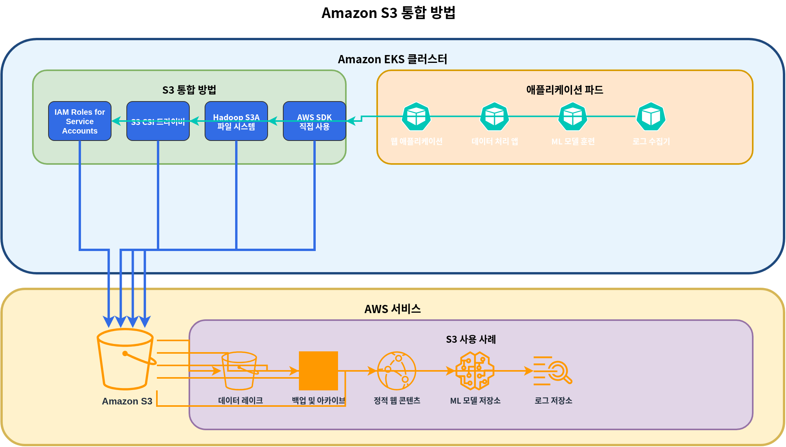
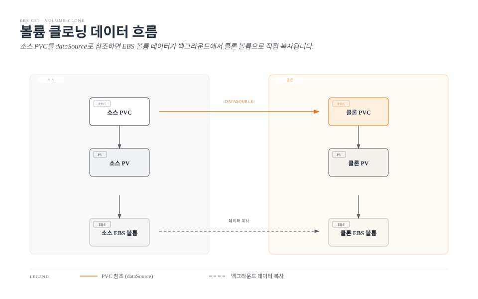
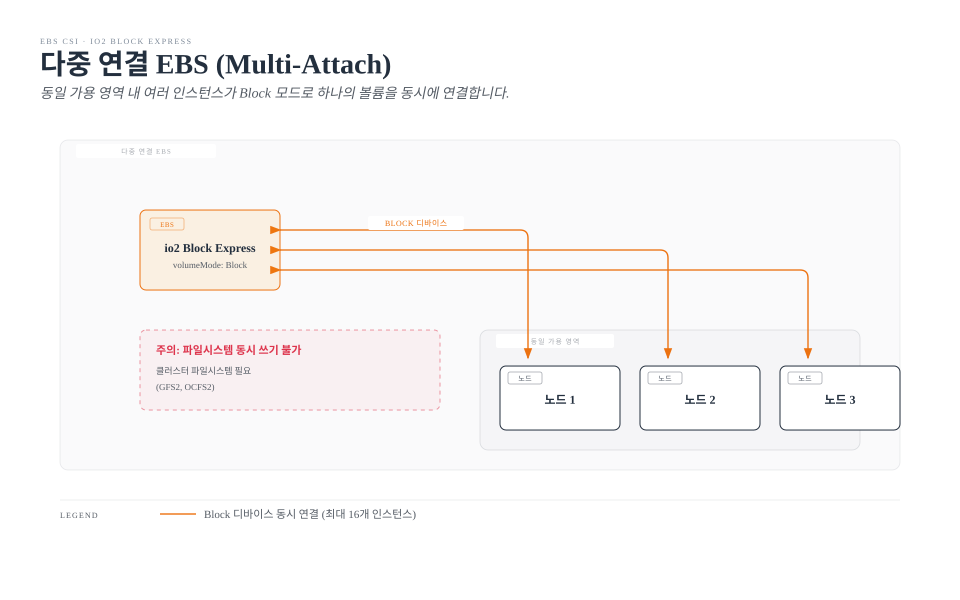
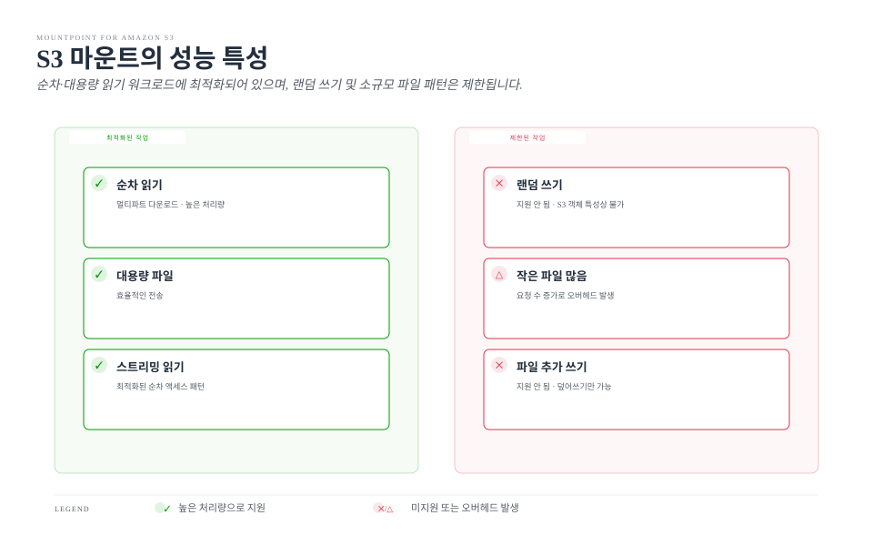

# Part 2: 스토리지 클래스

이 문서는 Amazon EKS 스토리지 시리즈의 두 번째 부분으로, FSx for Lustre, Amazon S3, 스냅샷, 볼륨 확장 및 성능 최적화에 대해 다룹니다.

## 목차

1. [Amazon FSx for Lustre](04-eks-storage-part2.md#amazon-fsx-for-lustre)
2. [Amazon S3 스토리지 통합](04-eks-storage-part2.md#amazon-s3-스토리지-통합)
3. [스냅샷 및 백업](04-eks-storage-part2.md#스냅샷-및-백업)
4. [볼륨 확장 및 크기 조정](04-eks-storage-part2.md#볼륨-확장-및-크기-조정)
5. [볼륨 클로닝](04-eks-storage-part2.md#볼륨-클로닝)
6. [다중 연결 EBS (Multi-Attach)](04-eks-storage-part2.md#다중-연결-ebs-multi-attach)
7. [Mountpoint for S3 CSI 심화](04-eks-storage-part2.md#mountpoint-for-s3-csi-심화)
8. [스토리지 성능 최적화](04-eks-storage-part2.md#스토리지-성능-최적화)

## Amazon FSx for Lustre

Amazon FSx for Lustre는 고성능 컴퓨팅(HPC), 기계 학습, 빅 데이터 처리와 같은 컴퓨팅 집약적 워크로드를 위한 고성능 파일 시스템입니다. Lustre는 병렬 분산 파일 시스템으로, 수천 개의 클라이언트에서 동시에 액세스할 수 있는 높은 처리량과 낮은 지연 시간을 제공합니다.


### FSx for Lustre CSI 드라이버 설치

FSx for Lustre CSI 드라이버를 설치하기 위해 다음 단계를 따릅니다:

1. IAM 역할 생성:

```bash
eksctl create iamserviceaccount \
  --name fsx-csi-controller-sa \
  --namespace kube-system \
  --cluster my-cluster \
  --attach-policy-arn arn:aws:iam::aws:policy/AmazonFSxFullAccess \
  --approve \
  --role-only \
  --role-name AmazonEKS_FSx_Lustre_CSI_DriverRole
```

2. Helm을 사용하여 드라이버 설치:

```bash
helm repo add aws-fsx-csi-driver https://kubernetes-sigs.github.io/aws-fsx-csi-driver/
helm repo update
helm upgrade -i aws-fsx-csi-driver aws-fsx-csi-driver/aws-fsx-csi-driver \
  --namespace kube-system \
  --set controller.serviceAccount.create=false \
  --set controller.serviceAccount.name=fsx-csi-controller-sa
```

### FSx for Lustre 파일 시스템 생성

FSx for Lustre 파일 시스템을 생성하기 위해 AWS CLI를 사용할 수 있습니다:

```bash
# EKS 클러스터의 VPC ID 및 서브넷 ID 가져오기
VPC_ID=$(aws eks describe-cluster \
  --name my-cluster \
  --query "cluster.resourcesVpcConfig.vpcId" \
  --output text)

SUBNET_ID=$(aws ec2 describe-subnets \
  --filters "Name=vpc-id,Values=$VPC_ID" \
  --query "Subnets[0].SubnetId" \
  --output text)

# 보안 그룹 생성
SECURITY_GROUP_ID=$(aws ec2 create-security-group \
  --group-name FsxLustreSecurityGroup \
  --description "Security group for FSx Lustre file system" \
  --vpc-id $VPC_ID \
  --output text)

# Lustre 트래픽 허용
aws ec2 authorize-security-group-ingress \
  --group-id $SECURITY_GROUP_ID \
  --protocol tcp \
  --port 988 \
  --cidr $VPC_CIDR

# FSx for Lustre 파일 시스템 생성
FILE_SYSTEM_ID=$(aws fsx create-file-system \
  --file-system-type LUSTRE \
  --storage-capacity 1200 \
  --subnet-ids $SUBNET_ID \
  --lustre-configuration DeploymentType=SCRATCH_2,PerUnitStorageThroughput=125 \
  --security-group-ids $SECURITY_GROUP_ID \
  --tags Key=Name,Value=MyLustreFileSystem \
  --query "FileSystem.FileSystemId" \
  --output text)
```

### FSx for Lustre 스토리지 클래스 생성

FSx for Lustre를 사용하는 스토리지 클래스를 생성합니다:

```yaml
apiVersion: storage.k8s.io/v1
kind: StorageClass
metadata:
  name: fsx-lustre-sc
provisioner: fsx.csi.aws.com
parameters:
  deploymentType: SCRATCH_2
  storageCapacity: "1200"
  perUnitStorageThroughput: "125"
  automaticBackupRetentionDays: "0"
  dailyAutomaticBackupStartTime: "00:00"
  copyTagsToBackups: "false"
  dataCompressionType: "NONE"
  driveCacheType: "NONE"
  storageType: "SSD"
  mountName: "fsx-lustre-fs"
```

### PVC 생성 및 파드에 마운트

1. PVC 생성:

```yaml
apiVersion: v1
kind: PersistentVolumeClaim
metadata:
  name: fsx-claim
spec:
  accessModes:
    - ReadWriteMany
  storageClassName: fsx-lustre-sc
  resources:
    requests:
      storage: 1200Gi
```

2. 파드에 PVC 마운트:

```yaml
apiVersion: v1
kind: Pod
metadata:
  name: app-with-fsx
spec:
  containers:
  - name: app
    image: nvidia/cuda:11.6.0-base-ubuntu20.04
    command: ["sleep", "infinity"]
    volumeMounts:
    - mountPath: "/data"
      name: fsx-volume
  volumes:
  - name: fsx-volume
    persistentVolumeClaim:
      claimName: fsx-claim
```

### 정적 프로비저닝을 사용한 FSx for Lustre 마운트

이미 생성된 FSx for Lustre 파일 시스템을 정적으로 마운트할 수도 있습니다:

```yaml
apiVersion: v1
kind: PersistentVolume
metadata:
  name: fsx-lustre-pv
spec:
  capacity:
    storage: 1200Gi
  volumeMode: Filesystem
  accessModes:
    - ReadWriteMany
  persistentVolumeReclaimPolicy: Retain
  storageClassName: fsx-lustre-sc
  csi:
    driver: fsx.csi.aws.com
    volumeHandle: fs-0123456789abcdef0
    volumeAttributes:
      dnsname: fs-0123456789abcdef0.fsx.us-west-2.amazonaws.com
      mountname: fsx
```

### FSx for Lustre 배포 유형

FSx for Lustre는 다양한 워크로드 요구사항을 충족하기 위해 여러 배포 유형을 제공합니다:

1. **Scratch 파일 시스템**:
   * **Scratch 1**: 단기 스토리지 및 처리를 위한 비용 최적화된 파일 시스템
   * **Scratch 2**: Scratch 1보다 높은 버스트 처리량과 더 나은 데이터 내구성 제공
2. **영구 파일 시스템**:
   * **영구 1**: 장기 스토리지 및 처리량이 중요한 워크로드를 위한 파일 시스템
   * **영구 2**: 영구 1보다 높은 처리량 제공

### vLLM을 위한 FSx for Lustre 구성

vLLM(Vector Language Model)과 같은 대규모 AI 워크로드를 위해 FSx for Lustre를 최적화하려면 다음 구성을 고려하세요:

```yaml
apiVersion: storage.k8s.io/v1
kind: StorageClass
metadata:
  name: fsx-lustre-vllm
provisioner: fsx.csi.aws.com
parameters:
  deploymentType: PERSISTENT_2
  storageCapacity: "4800"  # 4.8TB
  perUnitStorageThroughput: "1000"  # 1000 MB/s per TiB
  dataCompressionType: "LZ4"  # 데이터 압축 활성화
  mountName: "vllm-models"
```

이 구성은 다음과 같은 이점을 제공합니다:

* 높은 처리량으로 모델 로딩 시간 단축
* 데이터 압축을 통한 스토리지 효율성 향상
* 여러 노드에서 동일한 모델 파일에 동시 액세스 가능

## Amazon S3 스토리지 통합

Amazon S3는 객체 스토리지 서비스로, 무제한 양의 데이터를 저장하고 검색할 수 있습니다. Kubernetes에서는 S3를 직접 볼륨으로 마운트할 수는 없지만, 다양한 방법으로 S3와 통합할 수 있습니다.



### S3 액세스를 위한 IRSA 설정

파드가 S3에 액세스하기 위해 IAM Roles for Service Accounts(IRSA)를 설정합니다:

```bash
eksctl create iamserviceaccount \
  --name s3-access-sa \
  --namespace default \
  --cluster my-cluster \
  --attach-policy-arn arn:aws:iam::aws:policy/AmazonS3ReadOnlyAccess \
  --approve
```

### S3 액세스를 위한 파드 구성

서비스 계정을 사용하여 S3에 액세스하는 파드:

```yaml
apiVersion: v1
kind: Pod
metadata:
  name: s3-access-pod
spec:
  serviceAccountName: s3-access-sa
  containers:
  - name: app
    image: amazon/aws-cli:latest
    command: ["sleep", "infinity"]
```

### S3A 파일 시스템 마운트

Hadoop S3A 파일 시스템을 사용하여 S3를 HDFS와 유사한 방식으로 액세스할 수 있습니다:

```yaml
apiVersion: v1
kind: Pod
metadata:
  name: hadoop-s3a-pod
spec:
  serviceAccountName: s3-access-sa
  containers:
  - name: hadoop
    image: apache/hadoop:3.3.1
    env:
    - name: HADOOP_HOME
      value: /opt/hadoop
    - name: HADOOP_CONF_DIR
      value: /opt/hadoop/etc/hadoop
    - name: AWS_REGION
      value: us-west-2
    command: ["sleep", "infinity"]
    volumeMounts:
    - name: hadoop-config
      mountPath: /opt/hadoop/etc/hadoop
  volumes:
  - name: hadoop-config
    configMap:
      name: hadoop-config
---
apiVersion: v1
kind: ConfigMap
metadata:
  name: hadoop-config
data:
  core-site.xml: |
    <?xml version="1.0" encoding="UTF-8"?>
    <configuration>
      <property>
        <name>fs.s3a.aws.credentials.provider</name>
        <value>com.amazonaws.auth.WebIdentityTokenCredentialsProvider</value>
      </property>
      <property>
        <name>fs.s3a.endpoint</name>
        <value>s3.us-west-2.amazonaws.com</value>
      </property>
    </configuration>
```

### S3 버킷을 CSI 드라이버로 마운트

[AWS S3 CSI 드라이버](https://github.com/awslabs/mountpoint-s3-csi-driver)를 사용하여 S3 버킷을 Kubernetes 볼륨으로 마운트할 수 있습니다:

1. 드라이버 설치:

```bash
helm repo add aws-mountpoint-s3-csi-driver https://awslabs.github.io/mountpoint-s3-csi-driver
helm repo update
helm upgrade --install aws-mountpoint-s3-csi-driver aws-mountpoint-s3-csi-driver/aws-mountpoint-s3-csi-driver \
  --namespace kube-system \
  --set controller.serviceAccount.create=false \
  --set controller.serviceAccount.name=s3-csi-controller-sa
```

2. 스토리지 클래스 생성:

```yaml
apiVersion: storage.k8s.io/v1
kind: StorageClass
metadata:
  name: s3-sc
provisioner: s3.csi.aws.com
parameters:
  bucketName: my-eks-bucket
  mountOptions: "--cache-control-max-ttl 0"
```

3. PVC 및 파드 생성:

```yaml
apiVersion: v1
kind: PersistentVolumeClaim
metadata:
  name: s3-claim
spec:
  accessModes:
    - ReadWriteMany
  storageClassName: s3-sc
  resources:
    requests:
      storage: 1Gi
---
apiVersion: v1
kind: Pod
metadata:
  name: app-with-s3
spec:
  serviceAccountName: s3-access-sa
  containers:
  - name: app
    image: nginx
    volumeMounts:
    - mountPath: "/data"
      name: s3-volume
  volumes:
  - name: s3-volume
    persistentVolumeClaim:
      claimName: s3-claim
```

### S3 사용 사례

Amazon S3는 다음과 같은 사용 사례에 적합합니다:

1. **데이터 레이크**: 대규모 데이터 분석을 위한 중앙 저장소
2. **백업 및 아카이브**: 장기 데이터 보존
3. **정적 웹 콘텐츠**: 이미지, 비디오, 문서 등의 정적 콘텐츠 제공
4. **ML 모델 저장소**: 학습된 모델 파일 저장
5. **로그 및 감사 데이터**: 로그 파일 및 감사 데이터 저장

## 스냅샷 및 백업

Kubernetes에서는 볼륨 스냅샷을 사용하여 PV의 데이터를 백업하고 복원할 수 있습니다.


### 볼륨 스냅샷 컨트롤러 설치

볼륨 스냅샷 기능을 사용하기 위해 스냅샷 컨트롤러를 설치합니다:

```bash
kubectl apply -f https://raw.githubusercontent.com/kubernetes-csi/external-snapshotter/master/client/config/crd/snapshot.storage.k8s.io_volumesnapshotclasses.yaml
kubectl apply -f https://raw.githubusercontent.com/kubernetes-csi/external-snapshotter/master/client/config/crd/snapshot.storage.k8s.io_volumesnapshotcontents.yaml
kubectl apply -f https://raw.githubusercontent.com/kubernetes-csi/external-snapshotter/master/client/config/crd/snapshot.storage.k8s.io_volumesnapshots.yaml

kubectl apply -f https://raw.githubusercontent.com/kubernetes-csi/external-snapshotter/master/deploy/kubernetes/snapshot-controller/rbac-snapshot-controller.yaml
kubectl apply -f https://raw.githubusercontent.com/kubernetes-csi/external-snapshotter/master/deploy/kubernetes/snapshot-controller/setup-snapshot-controller.yaml
```

### 볼륨 스냅샷 클래스 생성

EBS 볼륨에 대한 스냅샷 클래스를 생성합니다:

```yaml
apiVersion: snapshot.storage.k8s.io/v1
kind: VolumeSnapshotClass
metadata:
  name: ebs-snapshot-class
driver: ebs.csi.aws.com
deletionPolicy: Delete
parameters:
  csi.storage.k8s.io/snapshotter-secret-name: ""
  csi.storage.k8s.io/snapshotter-secret-namespace: ""
```

### 볼륨 스냅샷 생성

PVC의 스냅샷을 생성합니다:

```yaml
apiVersion: snapshot.storage.k8s.io/v1
kind: VolumeSnapshot
metadata:
  name: ebs-volume-snapshot
spec:
  volumeSnapshotClassName: ebs-snapshot-class
  source:
    persistentVolumeClaimName: ebs-claim
```

### 스냅샷에서 PVC 복원

스냅샷에서 새 PVC를 생성합니다:

```yaml
apiVersion: v1
kind: PersistentVolumeClaim
metadata:
  name: ebs-claim-restored
spec:
  accessModes:
    - ReadWriteOnce
  storageClassName: ebs-gp3
  resources:
    requests:
      storage: 10Gi
  dataSource:
    name: ebs-volume-snapshot
    kind: VolumeSnapshot
    apiGroup: snapshot.storage.k8s.io
```

### 정기적인 스냅샷 자동화

[Velero](https://velero.io/)를 사용하여 정기적인 백업 및 복원을 자동화할 수 있습니다:

1. Velero 설치:

```bash
# Velero CLI 설치
brew install velero

# Velero 서버 설치
velero install \
  --provider aws \
  --plugins velero/velero-plugin-for-aws:v1.5.0 \
  --bucket velero-backup-bucket \
  --backup-location-config region=us-west-2 \
  --snapshot-location-config region=us-west-2 \
  --secret-file ./credentials-velero
```

2. 백업 스케줄 생성:

```bash
velero schedule create daily-backup \
  --schedule="0 1 * * *" \
  --include-namespaces=default,app-namespace
```

3. 특정 시점으로 복원:

```bash
velero restore create --from-backup daily-backup-20250710010000
```

## 볼륨 확장 및 크기 조정

Kubernetes에서는 PVC의 크기를 확장하여 스토리지 용량을 늘릴 수 있습니다.


### 볼륨 확장 활성화

스토리지 클래스에서 볼륨 확장을 활성화합니다:

```yaml
apiVersion: storage.k8s.io/v1
kind: StorageClass
metadata:
  name: ebs-gp3-expandable
provisioner: ebs.csi.aws.com
parameters:
  type: gp3
allowVolumeExpansion: true
```

### PVC 크기 확장

PVC의 크기를 확장합니다:

```yaml
apiVersion: v1
kind: PersistentVolumeClaim
metadata:
  name: ebs-claim
spec:
  accessModes:
    - ReadWriteOnce
  storageClassName: ebs-gp3-expandable
  resources:
    requests:
      storage: 20Gi  # 원래 10Gi에서 20Gi로 확장
```

### 파일 시스템 확장

볼륨 확장 후 파일 시스템을 확장해야 할 수 있습니다:

1. 온라인 확장(파드가 실행 중인 경우):
   * EBS CSI 드라이버는 자동으로 파일 시스템을 확장합니다.
2. 오프라인 확장(수동 확장이 필요한 경우):
   * 파드에 접속하여 파일 시스템 확장 명령 실행:

```bash
# ext4 파일 시스템의 경우
resize2fs /dev/xvdf

# xfs 파일 시스템의 경우
xfs_growfs /data
```

### 볼륨 크기 조정 모범 사례

1. **초기 크기 적절히 설정**: 필요한 것보다 약간 더 큰 초기 볼륨 크기 설정
2. **모니터링 설정**: 볼륨 사용량 모니터링 및 경고 설정
3. **점진적 확장**: 필요에 따라 점진적으로 볼륨 크기 확장
4. **다운타임 계획**: 일부 파일 시스템 확장은 다운타임이 필요할 수 있음
5. **자동화 고려**: 자동 확장 정책 구현

## 볼륨 클로닝

볼륨 클로닝은 기존 PVC(PersistentVolumeClaim)의 데이터를 복사하여 새로운 PVC를 생성하는 기능입니다. EBS CSI 드라이버는 Kubernetes의 `dataSource` 필드를 통해 볼륨 클로닝을 지원합니다.

### 볼륨 클론 개념

볼륨 클로닝은 스냅샷과 달리 소스 볼륨에서 직접 새 볼륨을 생성합니다. 클로닝 과정에서 데이터는 백그라운드에서 복사되며, 새 볼륨은 즉시 사용할 수 있습니다.



### dataSource 필드 사용

PVC의 `dataSource` 필드를 사용하여 기존 PVC를 소스로 지정합니다:

```yaml
apiVersion: v1
kind: PersistentVolumeClaim
metadata:
  name: ebs-clone
spec:
  accessModes:
    - ReadWriteOnce
  storageClassName: ebs-gp3
  resources:
    requests:
      storage: 10Gi  # 소스 PVC와 같거나 더 큰 크기 지정
  dataSource:
    kind: PersistentVolumeClaim
    name: ebs-source  # 소스 PVC 이름
```

### 클론 생성 예제

전체 클론 생성 워크플로우:

```yaml
# 1. 소스 PVC (이미 데이터가 있는 볼륨)
apiVersion: v1
kind: PersistentVolumeClaim
metadata:
  name: ebs-source
spec:
  accessModes:
    - ReadWriteOnce
  storageClassName: ebs-gp3
  resources:
    requests:
      storage: 10Gi
---
# 2. 클론 PVC 생성
apiVersion: v1
kind: PersistentVolumeClaim
metadata:
  name: ebs-clone
spec:
  accessModes:
    - ReadWriteOnce
  storageClassName: ebs-gp3
  resources:
    requests:
      storage: 10Gi
  dataSource:
    kind: PersistentVolumeClaim
    name: ebs-source
---
# 3. 클론된 볼륨을 사용하는 파드
apiVersion: v1
kind: Pod
metadata:
  name: app-with-clone
spec:
  containers:
  - name: app
    image: nginx
    volumeMounts:
    - mountPath: "/data"
      name: cloned-volume
  volumes:
  - name: cloned-volume
    persistentVolumeClaim:
      claimName: ebs-clone
```

### 스냅샷 기반 복원 vs 클론 비교

| 특성           | 볼륨 클로닝                   | 스냅샷 기반 복원                 |
| ------------ | ------------------------ | ------------------------- |
| **소스**       | 기존 PVC                   | VolumeSnapshot            |
| **속도**       | 즉시 사용 가능 (백그라운드 복사)      | 스냅샷 생성 후 복원               |
| **스토리지 클래스** | 동일해야 함                   | 다른 스토리지 클래스 가능            |
| **사용 사례**    | 개발/테스트 환경 복제, 데이터 마이그레이션 | 백업/복구, 재해 복구, 장기 보존       |
| **비용**       | 클론 볼륨 전체 비용              | 스냅샷 저장 비용 (증분) + 복원 볼륨 비용 |

## 다중 연결 EBS (Multi-Attach)

다중 연결 EBS(Multi-Attach)는 단일 EBS 볼륨을 동일한 가용 영역 내 여러 인스턴스에 동시에 연결할 수 있는 기능입니다.

### 지원 볼륨 유형

다중 연결은 다음 볼륨 유형에서만 지원됩니다:

* **io1**: 프로비저닝된 IOPS SSD
* **io2 Block Express**: 차세대 고성능 IOPS SSD

> **주의**: gp3, gp2, st1, sc1 볼륨 유형은 다중 연결을 지원하지 않습니다.

### ReadWriteMany가 아닌 이유

EBS 다중 연결은 Kubernetes의 `ReadWriteMany` 액세스 모드와 다릅니다:

* EBS 다중 연결은 **Block 모드**에서만 작동합니다
* Filesystem 모드의 동시 쓰기는 파일 시스템 손상을 초래할 수 있습니다
* 애플리케이션 수준에서 동시 액세스 조정이 필요합니다 (클러스터 파일 시스템 또는 분산 잠금)



### 제한사항

1. **동일 가용 영역**: 모든 연결된 인스턴스가 같은 AZ에 있어야 합니다
2. **Block 볼륨 모드만**: `volumeMode: Block` 필수
3. **최대 연결 수**: 동시에 최대 16개 인스턴스까지 연결 가능
4. **클러스터 파일 시스템 필요**: 동시 쓰기를 위해서는 GFS2, OCFS2 등 클러스터 인식 파일 시스템 필요

### 사용 사례

* 고가용성이 필요한 데이터베이스 클러스터 (Oracle RAC 등)
* 분산 스토리지 시스템
* 장애 조치(failover) 시나리오

### 다중 연결 EBS 구성 예제

```yaml
# 다중 연결을 지원하는 스토리지 클래스
apiVersion: storage.k8s.io/v1
kind: StorageClass
metadata:
  name: ebs-io2-multi-attach
provisioner: ebs.csi.aws.com
parameters:
  type: io2
  iops: "10000"
volumeBindingMode: WaitForFirstConsumer
---
# Block 모드 PVC
apiVersion: v1
kind: PersistentVolumeClaim
metadata:
  name: multi-attach-pvc
spec:
  accessModes:
    - ReadWriteMany  # 다중 연결 시 사용
  volumeMode: Block   # 필수: Block 모드
  storageClassName: ebs-io2-multi-attach
  resources:
    requests:
      storage: 100Gi
---
# 첫 번째 파드 - Block 디바이스로 마운트
apiVersion: v1
kind: Pod
metadata:
  name: app-1
spec:
  containers:
  - name: app
    image: amazonlinux:2
    command: ["sleep", "infinity"]
    volumeDevices:         # volumeMounts 대신 volumeDevices 사용
    - name: data
      devicePath: /dev/xvda
  volumes:
  - name: data
    persistentVolumeClaim:
      claimName: multi-attach-pvc
---
# 두 번째 파드 - 같은 볼륨을 다른 노드에서 사용
apiVersion: v1
kind: Pod
metadata:
  name: app-2
spec:
  containers:
  - name: app
    image: amazonlinux:2
    command: ["sleep", "infinity"]
    volumeDevices:
    - name: data
      devicePath: /dev/xvda
  volumes:
  - name: data
    persistentVolumeClaim:
      claimName: multi-attach-pvc
  affinity:
    podAntiAffinity:
      requiredDuringSchedulingIgnoredDuringExecution:
      - labelSelector:
          matchLabels:
            app: multi-attach-app
        topologyKey: "kubernetes.io/hostname"
```

## Mountpoint for S3 CSI 심화

Mountpoint for Amazon S3 CSI 드라이버는 S3 버킷을 Kubernetes 파드에 파일 시스템으로 마운트할 수 있게 해줍니다. 이 섹션에서는 성능 특성, 제한사항, 캐싱 전략 및 대규모 데이터 학습 시나리오에 대해 심층적으로 다룹니다.

### 성능 특성

Mountpoint for S3는 특정 워크로드 패턴에 최적화되어 있습니다:



| 작업       | 성능  | 설명                     |
| -------- | --- | ---------------------- |
| 순차 읽기    | 우수  | 멀티파트 다운로드로 높은 처리량 달성   |
| 순차 쓰기    | 양호  | 새 파일 생성 시 멀티파트 업로드     |
| 랜덤 읽기    | 보통  | 바이트 범위 요청 지원, 지연 시간 존재 |
| 랜덤 쓰기    | 미지원 | S3 특성상 기존 파일 수정 불가     |
| 메타데이터 작업 | 양호  | ListObjects API 활용     |

### 제한사항

Mountpoint for S3는 POSIX 파일 시스템과 완전히 호환되지 않습니다:

**지원되지 않는 기능:**

1. **하드 링크**: `ln` 명령 사용 불가
2. **심볼릭 링크**: `ln -s` 명령 사용 불가
3. **파일 권한 변경**: `chmod`, `chown` 무시됨
4. **파일 잠금**: `flock`, `fcntl` 잠금 미지원
5. **특수 파일**: 디바이스 파일, 소켓, 파이프 생성 불가
6. **기존 파일 수정**: 파일 내용 추가/수정 불가 (덮어쓰기만 가능)

**지원되는 기능:**

* 파일 및 디렉토리 생성
* 파일 읽기 (순차/랜덤)
* 새 파일 쓰기 (전체 쓰기)
* 파일 삭제
* 디렉토리 목록 조회

### 캐시 설정

성능 향상을 위해 메타데이터 및 데이터 캐시를 구성할 수 있습니다:

#### 메타데이터 캐시

```yaml
apiVersion: storage.k8s.io/v1
kind: StorageClass
metadata:
  name: s3-cached
provisioner: s3.csi.aws.com
parameters:
  bucketName: my-ml-data-bucket
mountOptions:
  # 메타데이터 캐시: 디렉토리 목록 결과 캐싱
  - metadata-ttl=3600       # 메타데이터 TTL (초)
  - max-cache-size=1000     # 최대 캐시 항목 수
```

#### 데이터 캐시

```yaml
apiVersion: storage.k8s.io/v1
kind: StorageClass
metadata:
  name: s3-data-cached
provisioner: s3.csi.aws.com
parameters:
  bucketName: my-training-data
mountOptions:
  # 데이터 캐시: 로컬 디스크에 데이터 캐싱
  - cache=/tmp/s3-cache     # 캐시 디렉토리
  - max-cache-size-mb=10240 # 최대 캐시 크기 (MB)
  - cache-block-size=8      # 캐시 블록 크기 (MB)
```

#### 성능 튜닝 옵션

```yaml
mountOptions:
  # 읽기 성능 최적화
  - read-ahead=10           # 미리 읽기 블록 수
  - max-read-parallelism=8  # 병렬 읽기 스레드 수

  # 쓰기 성능 최적화
  - max-write-parallelism=4 # 병렬 쓰기 스레드 수
  - upload-part-size=8      # 멀티파트 업로드 크기 (MB)
```

### 대량 데이터 학습 시나리오

ML/AI 워크로드에서 S3의 대용량 학습 데이터를 효율적으로 사용하는 예제:

```yaml
# S3 학습 데이터용 스토리지 클래스
apiVersion: storage.k8s.io/v1
kind: StorageClass
metadata:
  name: s3-ml-training
provisioner: s3.csi.aws.com
parameters:
  bucketName: ml-training-datasets
mountOptions:
  # 읽기 최적화 설정
  - read-only                    # 학습 데이터는 읽기 전용
  - max-read-parallelism=16      # 높은 병렬성
  - read-ahead=20                # 공격적인 미리 읽기
  - metadata-ttl=86400           # 메타데이터 24시간 캐시
  # 로컬 캐시 활성화
  - cache=/mnt/nvme/s3-cache     # NVMe 스토리지에 캐싱
  - max-cache-size-mb=102400     # 100GB 캐시
---
# 학습 데이터 PVC
apiVersion: v1
kind: PersistentVolumeClaim
metadata:
  name: training-data
spec:
  accessModes:
    - ReadOnlyMany               # 여러 학습 파드에서 공유
  storageClassName: s3-ml-training
  resources:
    requests:
      storage: 1Ti               # S3이므로 실제 제한 없음
---
# PyTorch 학습 파드
apiVersion: v1
kind: Pod
metadata:
  name: pytorch-training
spec:
  serviceAccountName: ml-training-sa  # IRSA로 S3 접근
  containers:
  - name: pytorch
    image: pytorch/pytorch:2.0.0-cuda11.7-cudnn8-runtime
    resources:
      limits:
        nvidia.com/gpu: 8
        memory: "256Gi"
        cpu: "64"
    command:
    - python
    - -m
    - torch.distributed.launch
    - --nproc_per_node=8
    - train.py
    - --data-path=/data/training
    env:
    - name: PYTORCH_CUDA_ALLOC_CONF
      value: "max_split_size_mb:512"
    volumeMounts:
    - name: training-data
      mountPath: /data/training
      readOnly: true
    - name: model-output
      mountPath: /data/models
    - name: local-cache
      mountPath: /mnt/nvme/s3-cache
  volumes:
  - name: training-data
    persistentVolumeClaim:
      claimName: training-data
  - name: model-output
    persistentVolumeClaim:
      claimName: fsx-model-output  # 모델 출력은 FSx 사용
  - name: local-cache
    emptyDir:
      medium: Memory              # 또는 로컬 NVMe
      sizeLimit: "100Gi"
  nodeSelector:
    node.kubernetes.io/instance-type: p4d.24xlarge
```

### S3 vs EFS vs FSx 성능 비교

학습 워크로드에서 스토리지 옵션 선택 가이드:

| 특성        | S3 (Mountpoint) | EFS      | FSx for Lustre |
| --------- | --------------- | -------- | -------------- |
| **처리량**   | 높음 (S3 한도)      | 중간       | 매우 높음          |
| **지연 시간** | 높음              | 중간       | 낮음             |
| **비용**    | 낮음              | 중간       | 높음             |
| **동시 접근** | 무제한             | 수천 클라이언트 | 수천 클라이언트       |
| **랜덤 읽기** | 느림              | 빠름       | 매우 빠름          |
| **쓰기 패턴** | 새 파일만           | 모든 패턴    | 모든 패턴          |
| **사용 사례** | 대용량 데이터셋 읽기     | 범용       | HPC, ML 학습     |

## 스토리지 성능 최적화

EKS에서 스토리지 성능을 최적화하기 위한 다양한 전략을 살펴보겠습니다.


### EBS 성능 최적화

1. **적절한 볼륨 유형 선택**:
   * 일반 워크로드: gp3
   * 고성능 데이터베이스: io2
   * 처리량 중심 워크로드: st1
2. **gp3 볼륨 성능 조정**:

```yaml
apiVersion: storage.k8s.io/v1
kind: StorageClass
metadata:
  name: ebs-gp3-high-perf
provisioner: ebs.csi.aws.com
parameters:
  type: gp3
  iops: "16000"  # 최대 16,000 IOPS
  throughput: "1000"  # 최대 1,000 MiB/s
```

3. **인스턴스 유형 고려**:
   * EBS 최적화 인스턴스 사용
   * 충분한 네트워크 대역폭을 가진 인스턴스 선택
4. **볼륨 초기화**:
   * 새 볼륨의 경우 사용 전 초기화 고려:

```bash
dd if=/dev/zero of=/dev/xvdf bs=1M count=1000 oflag=direct
```

### EFS 성능 최적화

1. **적절한 성능 모드 선택**:
   * 대부분의 워크로드: 범용 모드
   * 높은 동시성 워크로드: 최대 I/O 모드
2. **처리량 모드 선택**:
   * 예측 가능한 워크로드: 프로비저닝된 처리량
   * 가변적인 워크로드: 버스팅 또는 탄력적 처리량
3. **액세스 패턴 최적화**:
   * 큰 파일 작업: 큰 I/O 크기 사용
   * 병렬 액세스: 여러 스레드 또는 프로세스 사용
4. **마운트 옵션 최적화**:

```yaml
apiVersion: v1
kind: Pod
metadata:
  name: efs-app
spec:
  containers:
  - name: app
    image: nginx
    volumeMounts:
    - mountPath: "/data"
      name: efs-volume
  volumes:
  - name: efs-volume
    persistentVolumeClaim:
      claimName: efs-claim
    mountOptions:
      - nfsvers=4.1
      - rsize=1048576
      - wsize=1048576
      - timeo=600
      - retrans=2
      - noresvport
```

### FSx for Lustre 성능 최적화

1. **적절한 배포 유형 및 처리량 선택**:
   * 높은 처리량 요구사항: PERSISTENT\_2 + 높은 처리량
   * 비용 효율적인 임시 워크로드: SCRATCH\_2
2. **스트라이핑 최적화**:
   * 큰 파일: 여러 OST(Object Storage Target)에 스트라이핑
   * 작은 파일: 단일 OST에 저장
3. **클라이언트 마운트 옵션**:

```yaml
mountOptions:
  - flock
  - noatime
  - relatime
```

4. **데이터 압축 활성화**:

```yaml
parameters:
  dataCompressionType: "LZ4"
```

### vLLM 워크로드를 위한 스토리지 최적화

vLLM과 같은 대규모 언어 모델 워크로드를 위한 스토리지 최적화:

1. **FSx for Lustre 사용**:
   * 높은 처리량으로 모델 로딩 시간 단축
   * 여러 노드에서 동일한 모델 파일에 동시 액세스
2. **최적의 구성**:

```yaml
apiVersion: storage.k8s.io/v1
kind: StorageClass
metadata:
  name: fsx-lustre-vllm
provisioner: fsx.csi.aws.com
parameters:
  deploymentType: PERSISTENT_2
  storageCapacity: "4800"  # 4.8TB
  perUnitStorageThroughput: "1000"  # 1000 MB/s per TiB
  dataCompressionType: "LZ4"  # 데이터 압축 활성화
```

3. **모델 파일 최적화**:
   * 모델 파일을 메모리에 미리 로드
   * 모델 양자화 고려
   * 모델 샤딩 구현
4. **노드 인스턴스 유형 선택**:
   * 충분한 메모리와 네트워크 대역폭을 가진 인스턴스 선택
   * GPU 인스턴스의 경우 EFA(Elastic Fabric Adapter) 지원 고려

## 결론

이 문서에서는 Amazon EKS에서 FSx for Lustre, S3, 스냅샷, 볼륨 확장 및 성능 최적화에 대해 알아보았습니다. 각 스토리지 옵션은 서로 다른 특성과 사용 사례를 가지고 있으므로, 애플리케이션의 요구사항에 맞는 적절한 스토리지 솔루션을 선택하고 최적화하는 것이 중요합니다.

다음 파트에서는 EKS 스토리지의 모니터링, 문제 해결, 비용 최적화 및 보안에 대해 알아보겠습니다.

## 참고 자료

* [Amazon FSx for Lustre CSI 드라이버](https://github.com/kubernetes-sigs/aws-fsx-csi-driver)
* [Amazon S3 CSI 드라이버](https://github.com/awslabs/mountpoint-s3-csi-driver)
* [Kubernetes 볼륨 스냅샷](https://kubernetes.io/docs/concepts/storage/volume-snapshots/)
* [Velero 백업 및 복원](https://velero.io/docs/)
* [Amazon EKS 스토리지 모범 사례](https://aws.github.io/aws-eks-best-practices/storage/)

## 퀴즈

이 장에서 배운 내용을 테스트하려면 [주제 퀴즈](../quizzes/eks/04-eks-storage-part2-quiz.md)를 풀어보세요.
