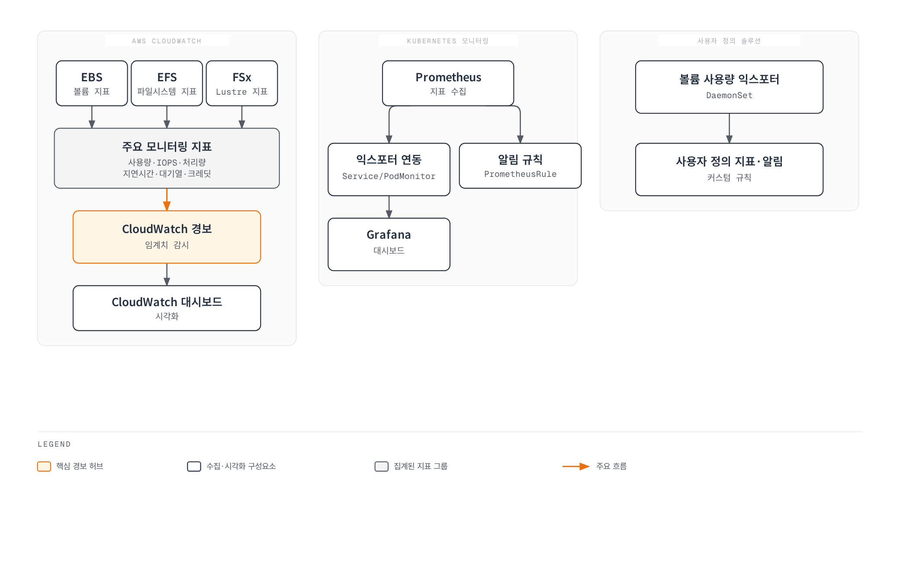
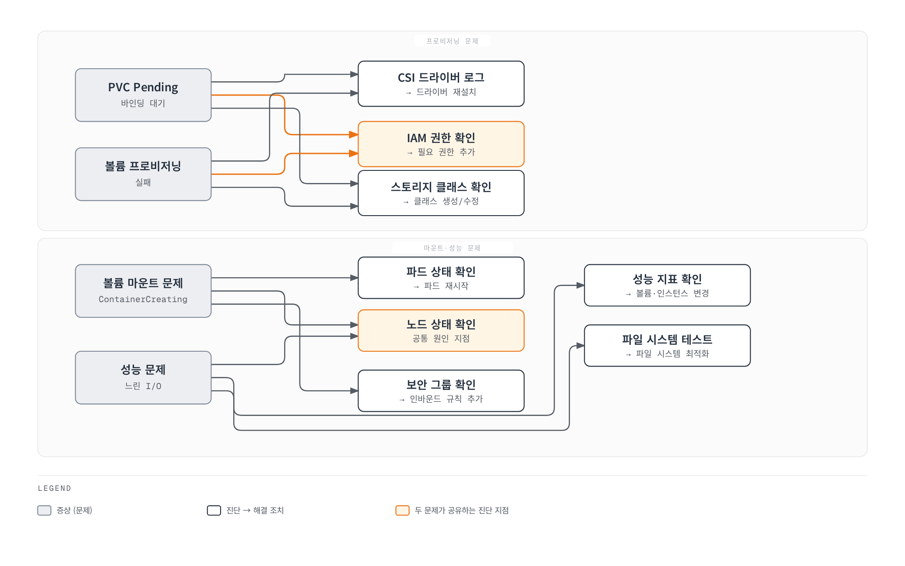
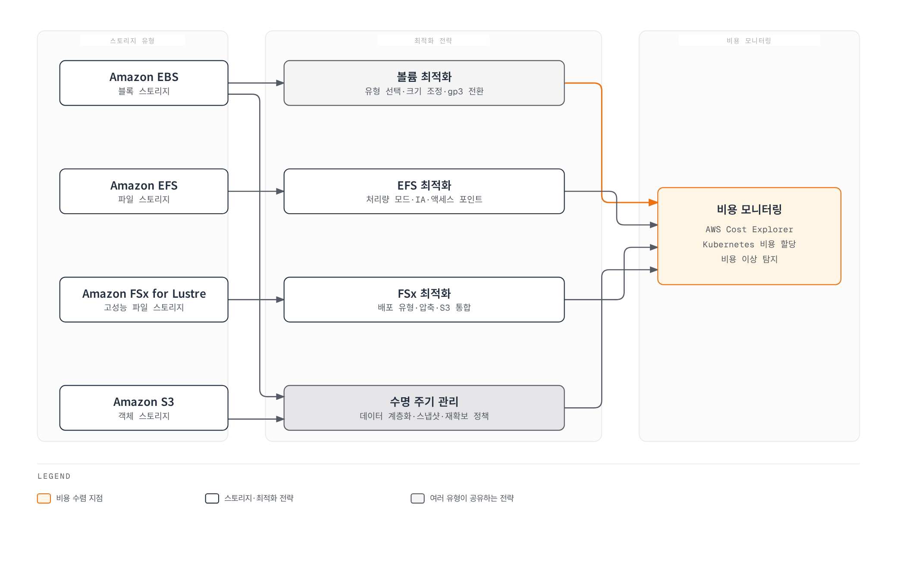
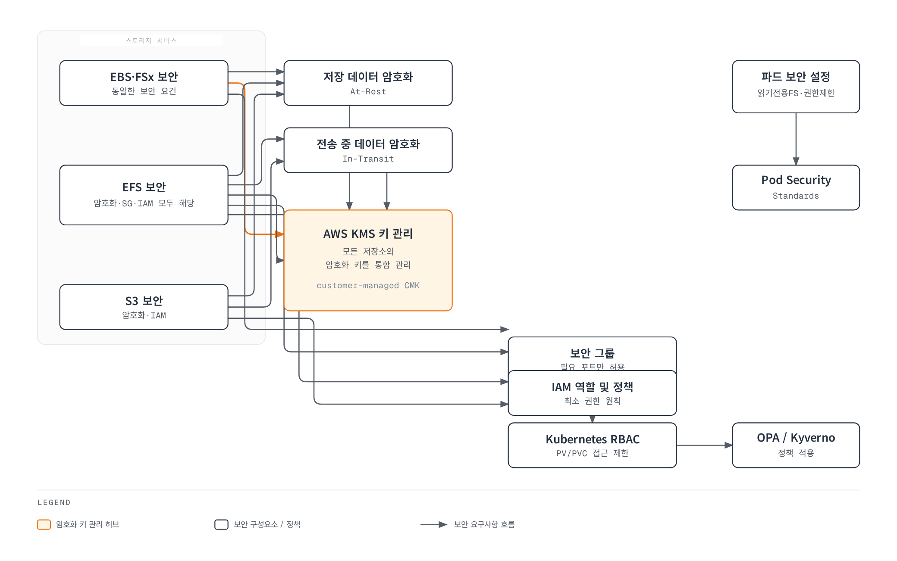
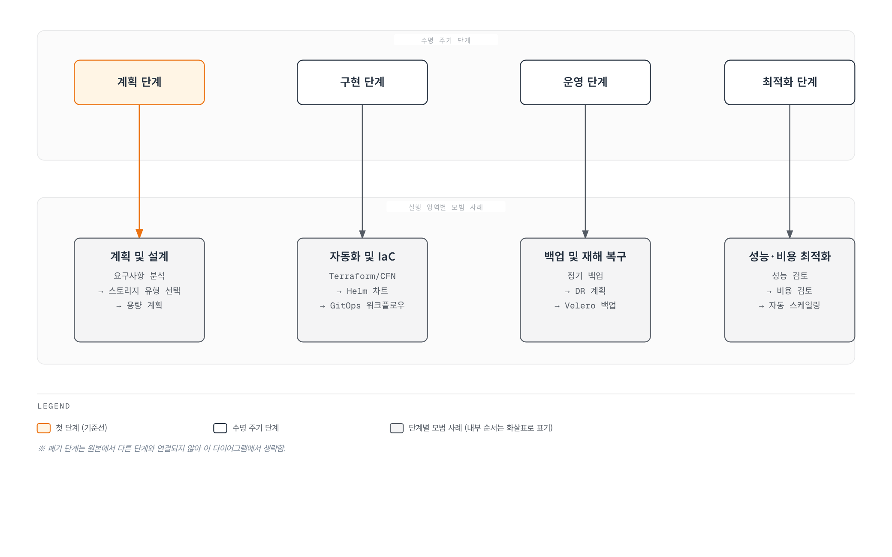

# Amazon EKS 스토리지 - Part 3: 모니터링, 문제 해결, 비용 최적화, 보안

이 문서는 Amazon EKS 스토리지 시리즈의 세 번째이자 마지막 부분으로, 스토리지 모니터링, 문제 해결, 비용 최적화 및 보안에 대해 다룹니다.

## 목차

1. [스토리지 모니터링](#스토리지-모니터링)
2. [스토리지 문제 해결](#스토리지-문제-해결)
3. [스토리지 비용 최적화](#스토리지-비용-최적화)
4. [스토리지 보안](#스토리지-보안)
5. [스토리지 관리 모범 사례](#스토리지-관리-모범-사례)

## 스토리지 모니터링

EKS 클러스터에서 스토리지 리소스를 효과적으로 모니터링하는 것은 성능 문제를 조기에 발견하고 용량 계획을 수립하는 데 중요합니다.



### CloudWatch를 사용한 모니터링

AWS CloudWatch를 사용하여 EBS, EFS 및 FSx for Lustre 볼륨의 성능 지표를 모니터링할 수 있습니다:

#### EBS 볼륨 지표

주요 EBS 지표:
- VolumeReadBytes/VolumeWriteBytes: 읽기/쓰기 처리량
- VolumeReadOps/VolumeWriteOps: 읽기/쓰기 작업 수
- VolumeTotalReadTime/VolumeTotalWriteTime: 읽기/쓰기 지연 시간
- VolumeQueueLength: 대기 중인 I/O 요청 수
- BurstBalance: 버스트 크레딧 잔액(gp2 볼륨)

CloudWatch 대시보드 예시:

```bash
aws cloudwatch get-dashboard --dashboard-name EBSVolumeMonitoring
```

#### EFS 파일 시스템 지표

주요 EFS 지표:
- TotalIOBytes: 총 I/O 바이트
- DataReadIOBytes/DataWriteIOBytes: 읽기/쓰기 처리량
- ClientConnections: 연결된 클라이언트 수
- PermittedThroughput: 허용된 처리량
- BurstCreditBalance: 버스트 크레딧 잔액

#### FSx for Lustre 지표

주요 FSx for Lustre 지표:
- DataReadBytes/DataWriteBytes: 읽기/쓰기 처리량
- DataReadOperations/DataWriteOperations: 읽기/쓰기 작업 수
- FreeDataStorageCapacity: 사용 가능한 스토리지 용량
- NetworkThroughputUtilization: 네트워크 처리량 사용률

### Prometheus 및 Grafana를 사용한 모니터링

Prometheus와 Grafana를 사용하여 Kubernetes 수준에서 스토리지 리소스를 모니터링할 수 있습니다:

1. Prometheus 및 Grafana 설치:

```bash
helm repo add prometheus-community https://prometheus-community.github.io/helm-charts
helm repo update
helm install prometheus prometheus-community/kube-prometheus-stack \
  --namespace monitoring \
  --create-namespace
```

2. 스토리지 관련 지표 수집을 위한 ServiceMonitor 구성:

```yaml
apiVersion: monitoring.coreos.com/v1
kind: ServiceMonitor
metadata:
  name: csi-metrics
  namespace: monitoring
spec:
  selector:
    matchLabels:
      app: ebs-csi-controller
  endpoints:
  - port: metrics
    interval: 30s
```

3. Grafana 대시보드 구성:

Grafana에서 다음 지표를 포함하는 대시보드를 생성합니다:
- PVC 사용량 및 용량
- 볼륨 프로비저닝 상태
- CSI 드라이버 작업 지연 시간
- 볼륨 마운트/언마운트 작업

### 사용자 정의 모니터링 솔루션

특정 요구사항에 맞는 사용자 정의 모니터링 솔루션을 구현할 수 있습니다:

1. 볼륨 사용량 모니터링 파드:

```yaml
apiVersion: apps/v1
kind: DaemonSet
metadata:
  name: volume-usage-exporter
  namespace: monitoring
spec:
  selector:
    matchLabels:
      app: volume-usage-exporter
  template:
    metadata:
      labels:
        app: volume-usage-exporter
    spec:
      containers:
      - name: exporter
        image: quay.io/prometheus/node-exporter:v1.3.1
        args:
        - --path.procfs=/host/proc
        - --path.sysfs=/host/sys
        - --collector.filesystem
        volumeMounts:
        - name: proc
          mountPath: /host/proc
          readOnly: true
        - name: sys
          mountPath: /host/sys
          readOnly: true
        - name: root
          mountPath: /host/root
          readOnly: true
          mountPropagation: HostToContainer
      volumes:
      - name: proc
        hostPath:
          path: /proc
      - name: sys
        hostPath:
          path: /sys
      - name: root
        hostPath:
          path: /
```

2. 알림 규칙 구성:

```yaml
apiVersion: monitoring.coreos.com/v1
kind: PrometheusRule
metadata:
  name: storage-alerts
  namespace: monitoring
spec:
  groups:
  - name: storage
    rules:
    - alert: VolumeUsageHigh
      expr: kubelet_volume_stats_used_bytes / kubelet_volume_stats_capacity_bytes > 0.85
      for: 10m
      labels:
        severity: warning
      annotations:
        summary: "Volume usage high ({{ $value | humanizePercentage }})"
        description: "PVC {{ $labels.persistentvolumeclaim }} is using {{ $value | humanizePercentage }} of its capacity."
    - alert: VolumeFullIn24Hours
      expr: predict_linear(kubelet_volume_stats_used_bytes[6h], 24 * 3600) > kubelet_volume_stats_capacity_bytes
      for: 10m
      labels:
        severity: warning
      annotations:
        summary: "Volume will fill in 24 hours"
        description: "PVC {{ $labels.persistentvolumeclaim }} is predicted to fill within 24 hours."
```

## 스토리지 문제 해결

EKS 클러스터에서 발생할 수 있는 일반적인 스토리지 문제와 해결 방법을 살펴보겠습니다.



### 볼륨 프로비저닝 문제

#### 문제: PVC가 Pending 상태로 유지됨

1. PVC 상태 확인:

```bash
kubectl get pvc
kubectl describe pvc <pvc-name>
```

2. 스토리지 클래스 확인:

```bash
kubectl get sc
kubectl describe sc <storage-class-name>
```

3. 프로비저너 파드 로그 확인:

```bash
kubectl -n kube-system get pods | grep csi
kubectl -n kube-system logs <csi-controller-pod-name>
```

4. 일반적인 원인 및 해결 방법:
   - 스토리지 클래스가 존재하지 않음: 올바른 스토리지 클래스 생성
   - CSI 드라이버가 설치되지 않음: 드라이버 설치
   - IAM 권한 부족: 필요한 IAM 권한 부여
   - 볼륨 한도 초과: 서비스 한도 증가 요청

#### 문제: WaitForFirstConsumer 바인딩 모드에서 볼륨이 프로비저닝되지 않음

1. 파드 상태 확인:

```bash
kubectl get pods
kubectl describe pod <pod-name>
```

2. 노드 가용 영역 확인:

```bash
kubectl get nodes -L topology.kubernetes.io/zone
```

3. 해결 방법:
   - 파드 스케줄링 문제 해결
   - 노드 선택기 및 어피니티 규칙 확인
   - 노드 풀이 PVC와 동일한 가용 영역에 있는지 확인

### 볼륨 마운트 문제

#### 문제: 파드가 ContainerCreating 상태로 멈춤

1. 파드 이벤트 확인:

```bash
kubectl describe pod <pod-name>
```

2. 노드 kubelet 로그 확인:

```bash
kubectl get nodes
ssh ec2-user@<node-ip>
sudo journalctl -u kubelet
```

3. 일반적인 원인 및 해결 방법:
   - 볼륨 ID를 찾을 수 없음: AWS 콘솔에서 볼륨 존재 여부 확인
   - 디바이스 마운트 실패: 디바이스 경로 및 파일 시스템 확인
   - 권한 문제: IAM 역할 및 보안 그룹 확인

#### 문제: EFS 또는 FSx 마운트 실패

1. 보안 그룹 확인:
   - EFS: TCP 포트 2049 허용
   - FSx for Lustre: TCP 포트 988 허용

2. 네트워크 연결 확인:

```bash
kubectl debug node/<node-name> -it --image=amazon/aws-cli
ping <efs-dns-name>
telnet <efs-dns-name> 2049
```

3. 마운트 헬퍼 파드 생성:

```yaml
apiVersion: v1
kind: Pod
metadata:
  name: mount-helper
spec:
  containers:
  - name: mount-helper
    image: amazonlinux:2
    command: ["sleep", "infinity"]
    securityContext:
      privileged: true
```

4. 수동으로 마운트 테스트:

```bash
kubectl exec -it mount-helper -- bash
yum install -y nfs-utils
mkdir -p /mnt/efs
mount -t nfs4 <efs-dns-name>:/ /mnt/efs
```

### 성능 문제

#### 문제: 느린 I/O 성능

1. 볼륨 성능 지표 확인:

```bash
aws cloudwatch get-metric-statistics \
  --namespace AWS/EBS \
  --metric-name VolumeReadOps \
  --dimensions Name=VolumeId,Value=vol-1234567890abcdef0 \
  --start-time $(date -u -v-1H +%Y-%m-%dT%H:%M:%SZ) \
  --end-time $(date -u +%Y-%m-%dT%H:%M:%SZ) \
  --period 300 \
  --statistics Average
```

2. 파일 시스템 성능 테스트:

```bash
kubectl exec -it <pod-name> -- bash
dd if=/dev/zero of=/data/test bs=1M count=1000 oflag=direct
dd if=/data/test of=/dev/null bs=1M count=1000 iflag=direct
```

3. 일반적인 원인 및 해결 방법:
   - 부적절한 볼륨 유형: 워크로드에 맞는 볼륨 유형 선택(예: gp3, io2)
   - IOPS 또는 처리량 제한: 볼륨 성능 파라미터 조정
   - 인스턴스 제한: EBS 최적화 인스턴스 사용
   - 파일 시스템 단편화: 파일 시스템 최적화 또는 재생성

#### 문제: EFS 성능 저하

1. EFS 성능 모드 및 처리량 모드 확인
2. 클라이언트 마운트 옵션 최적화:

```yaml
mountOptions:
  - nfsvers=4.1
  - rsize=1048576
  - wsize=1048576
  - timeo=600
  - retrans=2
  - noresvport
```

3. 액세스 패턴 최적화:
   - 작은 파일 대신 큰 파일 사용
   - 순차적 액세스 패턴 사용
   - 메타데이터 작업 최소화

## 스토리지 비용 최적화

EKS 클러스터의 스토리지 비용을 최적화하기 위한 전략을 살펴보겠습니다.



### 볼륨 유형 및 크기 최적화

1. **적절한 볼륨 유형 선택**:
   - 일반 워크로드: gp3 (gp2보다 비용 효율적)
   - 처리량 중심 워크로드: st1
   - 자주 액세스하지 않는 데이터: sc1

2. **볼륨 크기 최적화**:
   - 필요한 크기보다 약간 더 큰 볼륨 프로비저닝
   - 볼륨 사용량 모니터링 및 필요에 따라 확장
   - 불필요한 데이터 정리 또는 아카이브

3. **gp3 볼륨으로 마이그레이션**:

```yaml
apiVersion: storage.k8s.io/v1
kind: StorageClass
metadata:
  name: ebs-gp3
  annotations:
    storageclass.kubernetes.io/is-default-class: "true"
provisioner: ebs.csi.aws.com
parameters:
  type: gp3
  encrypted: "true"
allowVolumeExpansion: true
```

### 스토리지 수명 주기 관리

1. **데이터 계층화**:
   - 자주 액세스하는 데이터: EBS 또는 EFS
   - 자주 액세스하지 않는 데이터: S3 또는 S3 Glacier

2. **자동 스냅샷 정책**:
   - 정기적인 스냅샷 생성
   - 오래된 스냅샷 자동 삭제

```yaml
apiVersion: snapshot.storage.k8s.io/v1
kind: VolumeSnapshotClass
metadata:
  name: ebs-snapshot-class
driver: ebs.csi.aws.com
deletionPolicy: Delete
```

3. **PV 재확보 정책**:
   - 임시 데이터의 경우 Delete 정책 사용
   - 중요한 데이터의 경우 Retain 정책 사용

### EFS 비용 최적화

1. **적절한 처리량 모드 선택**:
   - 예측 가능한 워크로드: 프로비저닝된 처리량
   - 가변적인 워크로드: 버스팅 모드

2. **수명 주기 관리**:
   - 자주 액세스하지 않는 파일을 IA(Infrequent Access) 스토리지 클래스로 자동 이동
   - 수명 주기 정책 구성:

```bash
aws efs put-lifecycle-configuration \
  --file-system-id fs-1234567890abcdef0 \
  --lifecycle-policies '[{"TransitionToIA":"AFTER_30_DAYS"}]'
```

3. **액세스 포인트 사용**:
   - 애플리케이션별 액세스 포인트를 사용하여 파일 시스템 공유

### FSx for Lustre 비용 최적화

1. **적절한 배포 유형 선택**:
   - 임시 워크로드: SCRATCH_2
   - 장기 워크로드: PERSISTENT_1 또는 PERSISTENT_2

2. **데이터 압축 활성화**:
   - LZ4 데이터 압축을 사용하여 스토리지 비용 절감

3. **S3와의 통합**:
   - S3 버킷을 FSx for Lustre에 연결하여 데이터 계층화

### 비용 모니터링 및 분석

1. **AWS Cost Explorer 사용**:
   - 스토리지 비용 추세 분석
   - 리소스별 비용 분석

2. **Kubernetes 비용 할당**:
   - 네임스페이스 및 레이블을 사용하여 비용 할당
   - Kubecost와 같은 도구 사용

3. **비용 이상 탐지**:
   - AWS 예산 및 알림 설정
   - 비정상적인 비용 증가에 대한 알림 구성

## 스토리지 보안

EKS 클러스터에서 스토리지 리소스를 보호하기 위한 보안 모범 사례를 살펴보겠습니다.



### 데이터 암호화

1. **저장 데이터 암호화**:
   - EBS 볼륨 암호화:

```yaml
apiVersion: storage.k8s.io/v1
kind: StorageClass
metadata:
  name: ebs-encrypted
provisioner: ebs.csi.aws.com
parameters:
  type: gp3
  encrypted: "true"
  kmsKeyId: arn:aws:kms:us-west-2:111122223333:key/1234abcd-12ab-34cd-56ef-1234567890ab
```

   - EFS 파일 시스템 암호화:

```bash
aws efs create-file-system \
  --encrypted \
  --kms-key-id arn:aws:kms:us-west-2:111122223333:key/1234abcd-12ab-34cd-56ef-1234567890ab
```

   - FSx for Lustre 암호화:

```bash
aws fsx create-file-system \
  --file-system-type LUSTRE \
  --storage-capacity 1200 \
  --subnet-ids subnet-1234567890abcdef0 \
  --lustre-configuration DeploymentType=SCRATCH_2 \
  --security-group-ids sg-1234567890abcdef0 \
  --kms-key-id arn:aws:kms:us-west-2:111122223333:key/1234abcd-12ab-34cd-56ef-1234567890ab
```

2. **전송 중 데이터 암호화**:
   - EFS 전송 중 암호화:

```yaml
mountOptions:
  - tls
```

   - S3 전송 중 암호화:

```bash
aws s3 cp --sse AES256 file.txt s3://my-bucket/
```

### 액세스 제어

1. **IAM 역할 및 정책**:
   - 최소 권한 원칙 적용
   - 서비스 계정에 대한 IAM 역할 사용

```bash
eksctl create iamserviceaccount \
  --name ebs-csi-controller-sa \
  --namespace kube-system \
  --cluster my-cluster \
  --attach-policy-arn arn:aws:iam::aws:policy/service-role/AmazonEBSCSIDriverPolicy \
  --approve
```

2. **보안 그룹**:
   - 필요한 포트만 허용
   - 소스 IP 제한

```bash
aws ec2 authorize-security-group-ingress \
  --group-id sg-1234567890abcdef0 \
  --protocol tcp \
  --port 2049 \
  --source-group sg-0987654321fedcba0
```

3. **Kubernetes RBAC**:
   - PV 및 PVC에 대한 액세스 제한

```yaml
apiVersion: rbac.authorization.k8s.io/v1
kind: Role
metadata:
  namespace: app-namespace
  name: pvc-manager
rules:
- apiGroups: [""]
  resources: ["persistentvolumeclaims"]
  verbs: ["get", "list", "watch", "create", "update", "patch", "delete"]
---
apiVersion: rbac.authorization.k8s.io/v1
kind: RoleBinding
metadata:
  name: pvc-manager-binding
  namespace: app-namespace
subjects:
- kind: ServiceAccount
  name: app-service-account
  namespace: app-namespace
roleRef:
  kind: Role
  name: pvc-manager
  apiGroup: rbac.authorization.k8s.io
```

### 파드 보안 컨텍스트

1. **읽기 전용 루트 파일 시스템**:

```yaml
apiVersion: v1
kind: Pod
metadata:
  name: secure-pod
spec:
  containers:
  - name: app
    image: nginx
    securityContext:
      readOnlyRootFilesystem: true
    volumeMounts:
    - name: data-volume
      mountPath: /data
      readOnly: false
```

2. **권한 제한**:

```yaml
securityContext:
  runAsUser: 1000
  runAsGroup: 3000
  fsGroup: 2000
  allowPrivilegeEscalation: false
```

3. **SELinux, AppArmor 또는 seccomp 프로필**:

```yaml
securityContext:
  seLinuxOptions:
    level: "s0:c123,c456"
  seccompProfile:
    type: RuntimeDefault
```

### 보안 정책 적용

1. **OPA Gatekeeper 또는 Kyverno**:
   - 암호화된 볼륨만 허용

```yaml
apiVersion: kyverno.io/v1
kind: ClusterPolicy
metadata:
  name: require-ebs-encryption
spec:
  validationFailureAction: enforce
  rules:
  - name: check-ebs-encryption
    match:
      resources:
        kinds:
        - PersistentVolumeClaim
    validate:
      message: "EBS volumes must be encrypted"
      pattern:
        spec:
          storageClassName: "ebs-*"
          +(storageClassName): "ebs-encrypted"
```

2. **Pod Security Standards**:
   - 네임스페이스에 Pod Security Standards 적용

```yaml
apiVersion: v1
kind: Namespace
metadata:
  name: secure-ns
  labels:
    pod-security.kubernetes.io/enforce: restricted
```

## 스토리지 관리 모범 사례

EKS 클러스터에서 스토리지를 효과적으로 관리하기 위한 모범 사례를 살펴보겠습니다.



### 스토리지 계획 및 설계

1. **요구사항 분석**:
   - 성능 요구사항(IOPS, 처리량)
   - 용량 요구사항
   - 액세스 패턴(읽기/쓰기 비율, 동시성)
   - 가용성 및 내구성 요구사항

2. **스토리지 유형 선택**:
   - 블록 스토리지(EBS): 데이터베이스, 상태 유지 애플리케이션
   - 파일 스토리지(EFS): 공유 파일, 웹 서버, CMS
   - 고성능 파일 스토리지(FSx for Lustre): HPC, ML 훈련
   - 객체 스토리지(S3): 백업, 아카이브, 정적 콘텐츠

3. **용량 계획**:
   - 현재 요구사항 + 성장 여유
   - 자동 확장 메커니즘 구현
   - 정기적인 용량 검토

### 백업 및 재해 복구

1. **정기적인 백업**:
   - 볼륨 스냅샷 자동화
   - 백업 보존 정책 정의

```bash
# 매일 자정에 스냅샷 생성
0 0 * * * kubectl create -f snapshot.yaml
```

2. **재해 복구 계획**:
   - 다중 가용 영역 또는 리전 복제
   - 복구 시간 목표(RTO) 및 복구 지점 목표(RPO) 정의
   - 정기적인 복구 테스트

3. **Velero를 사용한 클러스터 백업**:

```bash
velero backup create daily-backup --include-namespaces=default,app-namespace
```

### 자동화 및 IaC(Infrastructure as Code)

1. **Terraform 또는 CloudFormation 사용**:
   - 스토리지 리소스 선언적 정의
   - 버전 제어 및 변경 추적

```hcl
resource "aws_efs_file_system" "example" {
  creation_token = "example"
  performance_mode = "generalPurpose"
  throughput_mode = "bursting"
  encrypted = true
  
  lifecycle_policy {
    transition_to_ia = "AFTER_30_DAYS"
  }
  
  tags = {
    Name = "ExampleFileSystem"
  }
}
```

2. **Helm 차트 사용**:
   - 스토리지 클래스 및 PVC 템플릿화

```yaml
# values.yaml
storage:
  class: ebs-gp3
  size: 10Gi
  encrypted: true
```

3. **GitOps 워크플로우**:
   - ArgoCD 또는 Flux를 사용한 스토리지 구성 관리

### 성능 및 비용 최적화

1. **정기적인 성능 검토**:
   - 병목 현상 식별 및 해결
   - 워크로드 변화에 따른 스토리지 구성 조정

2. **비용 최적화 검토**:
   - 사용되지 않는 볼륨 식별 및 제거
   - 비용 효율적인 스토리지 유형으로 마이그레이션
   - 예약 인스턴스 또는 Savings Plans 고려

3. **자동 스케일링**:
   - 수요에 따른 스토리지 자동 확장
   - 사용량 기반 알림 구성

## 결론

이 문서에서는 Amazon EKS 스토리지의 모니터링, 문제 해결, 비용 최적화 및 보안에 대해 알아보았습니다. 효과적인 스토리지 관리는 EKS 클러스터의 성능, 안정성 및 비용 효율성을 보장하는 데 중요합니다.

스토리지 요구사항은 애플리케이션마다 다르므로, 워크로드의 특성을 이해하고 적절한 스토리지 솔루션을 선택하는 것이 중요합니다. 또한, 정기적인 모니터링, 문제 해결, 비용 최적화 및 보안 검토를 통해 스토리지 리소스를 효과적으로 관리해야 합니다.

## 참고 자료

- [Amazon EKS 스토리지 모범 사례](https://aws.github.io/aws-eks-best-practices/storage/)
- [Kubernetes 스토리지 문제 해결](https://kubernetes.io/docs/tasks/debug-application-cluster/debug-application/#debugging-pods)
- [AWS 스토리지 비용 최적화](https://aws.amazon.com/blogs/storage/cost-optimization-for-amazon-ebs-and-amazon-efs/)
- [Kubernetes 스토리지 보안](https://kubernetes.io/docs/concepts/security/)

## 퀴즈

이 장에서 배운 내용을 테스트하려면 [주제 퀴즈](../quizzes/eks/04-eks-storage-part3-quiz.md)를 풀어보세요.
