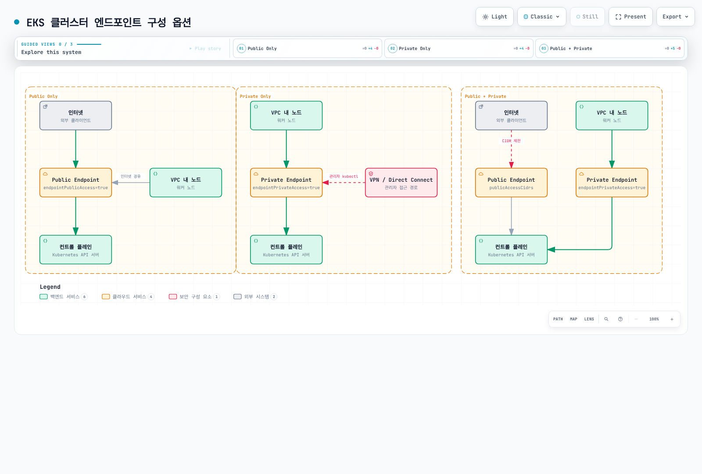
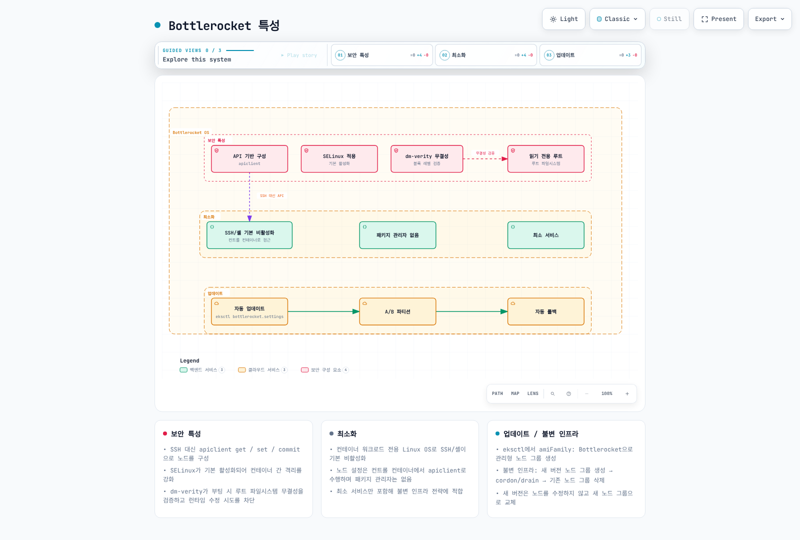

# Amazon EKS 보안

> **지원 버전**: EKS 표준 지원 1.34–1.36; 연장 지원 1.31–1.33 (2026년 9월 11일 확인)
> **마지막 업데이트**: 2026년 9월 11일

Amazon EKS(Elastic Kubernetes Service)에서 워크로드를 안전하게 실행하기 위해서는 다양한 보안 계층과 모범 사례를 이해하고 구현해야 합니다. 이 문서에서는 EKS 클러스터의 보안을 강화하기 위한 주요 개념, 구성 요소 및 모범 사례를 다룹니다.

## 목차

1. [EKS 보안 개요](#eks-보안-개요)
2. [보안 실무](#보안-실무)
3. [IAM 및 인증](#iam-및-인증)
4. [OIDC Provider 심화](#oidc-provider-심화)
5. [EKS Pod Identity](#eks-pod-identity)
6. [Cluster Endpoint 접근 제어](#cluster-endpoint-접근-제어)
7. [네트워크 보안](#네트워크-보안)
8. [포드 보안](#포드-보안)
9. [Bottlerocket 및 읽기 전용 OS](#bottlerocket-및-읽기-전용-os)
10. [IAM 권한 경계](#iam-권한-경계)
11. [암호화 및 비밀 관리](#암호화-및-비밀-관리)
12. [컴플라이언스 및 감사](#컴플라이언스-및-감사)
13. [보안 모니터링 및 탐지](#보안-모니터링-및-탐지)
14. [EKS 보안 모범 사례](#eks-보안-모범-사례)
15. [금융 서비스를 위한 EKS 보안 고려사항](#금융-서비스를-위한-eks-보안-고려사항)

## EKS 보안 개요

인프라·클러스터 접근·워크로드 제어를 구분합니다. AWS는 컨트롤 플레인을 관리하며 노드/OS 책임은 EC2 자체/관리형 노드·Fargate·Auto Mode·Hybrid Nodes에 따라 달라집니다. 앱 이미지·신원·데이터 처리·워크로드 정책은 여전히 고객 책임입니다. 일반 EC2 노드 그림이 고객이 Auto Mode/Fargate 호스트 OS를 패치한다는 뜻은 아닙니다.


[🔍 인터랙티브 다이어그램 보기](https://www.atomai.click/kubernetes-docs/archmaps/ko-eks-05-eks-security-0.html)

## 보안 실무

범위가 명시된 여러 제어를 사용합니다. 도구 하나로 zero trust·워크로드 인증이 완성되지는 않습니다. 호출자·워크로드 신원을 확인하고 대상 작업을 허용하며 네트워크 경로와 위협 모델에 맞는 근거를 관리합니다.

<!-- Diagram repair pending: network policies filter traffic; posture findings are not continuous request authentication or complete zero-trust enforcement.


[🔍 인터랙티브 다이어그램 보기](https://www.atomai.click/kubernetes-docs/archmaps/ko-eks-05-eks-security-1.html)
-->

### 신원과 네트워크 제어

IRSA·Pod Identity는 워크로드 AWS 자격 증명, NetworkPolicy는 지원 네트워크 필터링, admission 엔진은 설정한 Kubernetes 요청 검사를 제공합니다. 호환되는 유지보수 중인 서비스 메시로 mTLS·앱 트래픽 정책을 추가할 수 있습니다. AWS App Mesh는2026년9월30일 지원 종료이므로 신규 기본 권장 대상이 아니라 기존 배포의 이전 계획이 필요합니다.

### 공급망 보안

SLSA 같은 검토한 빌드·provenance 절차, SBOM 구성 요소 목록, 대상 취약점 검사와 의도한 서명자 신원에 대한 artifact 서명 검증을 사용합니다. Syft는 SBOM 도구, Grype는 취약점 scanner입니다. ECR/Inspector·다른 scanner의 범위·업데이트 요구를 확인하세요. 서명·검사된 이미지가 무해한 코드의 증거는 아닙니다. 빌드 신원·저장소·admission 구성도 보호합니다.

현재 ECR은 AWS Signer 관리형 이미지 서명과 Notation 수동 서명을 지원합니다. 서명과 admission 검증은 별도 단계이며 registry filter·서명 profile 권한·검증기 신뢰를 대상 pipeline과 맞춰야 합니다.

### 런타임 탐지와 Policy as Code

GuardDuty EKS Protection은 독립적인 EKS audit-log stream을 분석합니다. Runtime Monitoring은 별도 agent 기반 기능이며 현재 EC2·Auto Mode EKS를 지원하고 플랫폼/agent 조건이 있으며 EKS Fargate·Hybrid Nodes는 제외됩니다. CloudWatch 감사 로그 전달은 별도 설정입니다. Security Hub CSPM은 설정한 제어를 평가하고 Security Hub는 findings를 연계할 수 있습니다. 앱 권한·모든 규제 요구 평가를 대체하지는 않습니다.

필요한 kernel·controller·API·metadata 통합을 갖춘 Falco·Gatekeeper·Kyverno 같은 지원 런타임/정책 도구를 사용합니다. gVisor/Kata 같은 추가 sandbox runtime에는 호환 노드·런타임 설계가 필요하며 모든 EKS 컴퓨팅 경로에서 쓸 수는 없습니다. 정책·이미지·OS 강화는 특정 위험을 줄이며 모든 탈출·악성 작업을 불가능하게 보장하지는 않습니다.

Policy-as-code 도구의 단계도 다릅니다. Gatekeeper/Kyverno는 Kubernetes admission, CloudFormation Guard·Sentinel은 인프라 변경, AWS Config는 지원되는 배포 리소스 구성을 평가할 수 있습니다. Detective 같은 조사 도구는 설정한 데이터 소스에 의존합니다. 이를 런타임 방지 기능과 구분합니다.

## IAM 및 인증

| 신원·제어 | 목적 |
|---|---|
| 사람·자동화 IAM 주체 | 설정한 IAM 매핑/access-entry 경로로 클러스터 접근 인증 |
| Kubernetes RBAC·EKS access policy | Kubernetes 작업 허용; 허용 권한은 합산됨 |
| 외부 OIDC identity provider | Client·claim 설정이 별도인 Kubernetes API 사용자 로그인 |
| EKS cluster IAM role | EKS 서비스의 클러스터 관련 AWS API 호출 |
| EC2 node IAM role | Bootstrap·필요한 node agent AWS 작업 |
| IRSA·EKS Pod Identity 역할 | 앱에 임시 AWS 자격 증명 제공 |
| Kubernetes ServiceAccount token | RBAC 권한에 따른 Pod의 Kubernetes API 인증 |

IRSA용 IAM OIDC provider와 Kubernetes 사용자 로그인을 위해 연결한 외부 OIDC provider는 다릅니다. 앱 AWS 권한이 Kubernetes API 권한을 자동 부여하지는 않습니다.

<!-- Diagram repair pending: IRSA/Pod Identity give workload AWS credentials; the ordinary Pod-to-Kubernetes API path uses its Kubernetes ServiceAccount token/RBAC.


[🔍 인터랙티브 다이어그램 보기](https://www.atomai.click/kubernetes-docs/archmaps/ko-eks-05-eks-security-2.html)
-->

### 클러스터 역할과 생성 호출자

일반 EKS cluster role은 EKS 서비스를 신뢰합니다. 다음은 그 신뢰 관계이며 개발자 사용자의 권한 정책이 아닙니다:

```json
{
  "Version": "2012-10-17",
  "Statement": [
    {
      "Effect": "Allow",
      "Principal": {
        "Service": "eks.amazonaws.com"
      },
      "Action": "sts:AssumeRole"
    }
  ]
}
```

이 역할에는 서비스 작업에 맞는 AmazonEKSClusterPolicy 또는 지원 custom policy가 필요하며 Auto Mode에는 추가 역할·정책 요구가 있습니다. 생성 호출자에게는 선택한 구성의 작업 권한과 대상 역할 전달 권한이 별도로 필요합니다. 현재 권한 참조에서 CreateCluster는 resource ARN 범위를 지원하지 않으므로 지원 request condition을 사용하고 ARN 범위를 지원하는 작업·PassRole은 범위를 제한합니다. 개발자 역할에 AmazonEKSClusterPolicy를 연결해도 Kubernetes 앱 접근 권한이 생기지는 않습니다.

### Access Entry와 네임스페이스 권한

IAM 클러스터 접근에는 지원 access-entry API를 우선 검토합니다. 현재 모드를 조회하고 이전 전에 관리자·노드 매핑을 보존합니다. CONFIG_MAP에서 API_AND_CONFIG_MAP/API로의 전환은 자유롭게 되돌리는 스위치가 아닙니다. 노드 역할이 빠진 짧은 예제로 aws-auth를 덮어쓰지 마세요. API-only 선택 전에 전체 신원·정책·노드·복구 경로를 검토합니다.

```bash
set -euo pipefail
: "${CLUSTER_NAME:?Set the existing cluster name}"
: "${AWS_REGION:?Set its Region}"
aws eks describe-cluster --name "$CLUSTER_NAME" --region "$AWS_REGION" \
  --query 'cluster.{Name:name,Status:status,Endpoint:endpoint,Access:accessConfig}' --output json
```

다음은 승인된 기존 IAM 개발자 역할·access entry가 이미 활성화된 클러스터·플랫폼 운영자의 권한을 전제로 합니다. 소유자를 통해 전용 네임스페이스를 준비합니다. Pod Security Admission 버전은 검토한 EKS1.36 예제에 맞추었으므로 대상 클러스터에 적절한 버전을 선택하세요:

```yaml
apiVersion: v1
kind: Namespace
metadata:
  name: security-demo
  labels:
    pod-security.kubernetes.io/enforce: restricted
    pod-security.kubernetes.io/enforce-version: v1.36
```


```bash
set -euo pipefail
: "${CLUSTER_NAME:?Set the verified cluster name}"
: "${AWS_REGION:?Set its Region}"
: "${DEVELOPER_ROLE_ARN:?Set a prepared IAM role ARN, not an STS session ARN}"
MODE=$(aws eks describe-cluster --name "$CLUSTER_NAME" --region "$AWS_REGION" \
  --query cluster.accessConfig.authenticationMode --output text)
case "$MODE" in
  API|API_AND_CONFIG_MAP) ;;
  *) echo "Access entries are not enabled; review the migration first"; exit 1 ;;
esac
aws eks list-access-entries --cluster-name "$CLUSTER_NAME" --region "$AWS_REGION" \
  --output json > security-access-entries.json
python3 - "$DEVELOPER_ROLE_ARN" <<'PY'
import json, sys
with open("security-access-entries.json") as stream:
    existing = json.load(stream)["accessEntries"]
if sys.argv[1] in existing:
    raise SystemExit("Entry already exists; inspect its groups/policies instead of overwriting")
PY
aws eks create-access-entry --cluster-name "$CLUSTER_NAME" --region "$AWS_REGION" \
  --principal-arn "$DEVELOPER_ROLE_ARN" --type STANDARD \
  --kubernetes-groups security-demo-developers
```


```yaml
apiVersion: rbac.authorization.k8s.io/v1
kind: Role
metadata:
  name: developer
  namespace: security-demo
rules:
- apiGroups:
  - ''
  resources:
  - pods
  verbs:
  - get
  - list
  - watch
- apiGroups:
  - apps
  resources:
  - deployments
  verbs:
  - get
  - list
  - watch
  - create
  - update
  - patch
- apiGroups:
  - batch
  resources:
  - jobs
  verbs:
  - get
  - list
  - watch
  - create
  - update
  - patch
---
apiVersion: rbac.authorization.k8s.io/v1
kind: RoleBinding
metadata:
  name: developer
  namespace: security-demo
subjects:
- kind: Group
  name: security-demo-developers
  apiGroup: rbac.authorization.k8s.io
roleRef:
  kind: Role
  name: developer
  apiGroup: rbac.authorization.k8s.io
```

Entry는 IAM 주체를 그룹에 매핑하고 RoleBinding은 표시한 네임스페이스 권한을 부여합니다. 그룹 이름만으로 네임스페이스 경계가 생기지는 않습니다. 워크로드 컨트롤러 생성 권한으로 네임스페이스의 ServiceAccount·Secret·PVC를 사용하는 Pod가 생길 수 있습니다. 테넌트를 구분하고 적절한 admission·소유권 제어로 워크로드·ServiceAccount 사용을 제한합니다.

별도로 검토한 viewer entry에는 custom RBAC 대신 EKS access policy를 사용할 수 있습니다. 아래 namespace view를 추가하기 전에 현재 그룹·연결 정책을 조회합니다:

```bash
set -euo pipefail
: "${CLUSTER_NAME:?Set the verified cluster name}"
: "${AWS_REGION:?Set its Region}"
: "${VIEWER_ROLE_ARN:?Set the IAM principal of a prepared, reviewed access entry}"
aws eks list-associated-access-policies --cluster-name "$CLUSTER_NAME" --region "$AWS_REGION" \
  --principal-arn "$VIEWER_ROLE_ARN"
aws eks associate-access-policy --cluster-name "$CLUSTER_NAME" --region "$AWS_REGION" \
  --principal-arn "$VIEWER_ROLE_ARN" \
  --policy-arn arn:aws:eks::aws:cluster-access-policy/AmazonEKSViewPolicy \
  --access-scope type=namespace,namespaces=security-demo
```

View 추가가 더 넓은 RBAC/access-policy 권한을 취소하지는 않습니다. 변경 전파에 시간이 걸릴 수 있습니다. 의도한 실제 IAM 로그인으로 검증하며 kubectl --as는 Kubernetes impersonation/RBAC 검사이지 IAM access-policy 경로의 증거가 아닙니다. Kubeconfig는 클러스터·자격 증명 경로를 가리킬 뿐 자체적으로 권한을 부여하지 않습니다.

IAM eks:DescribeCluster/ListClusters는 AWS 관리·검색 작업용입니다. eks:AccessKubernetesApi는 콘솔 조회 권한입니다. eks:namespaces 조건은 access-policy association 요청을 필터링하며 kubectl API 호출의 범용 네임스페이스 필터가 아닙니다.

## OIDC Provider 심화

EKS는 클러스터 OIDC issuer와 공개 서명 키를 게시합니다. Endpoint만으로 IAM OIDC provider가 생성되거나 역할 전환이 허용되지는 않습니다. IRSA는 역할 계정의 대상 IAM OIDC provider, 올바른 issuer/subject/audience 신뢰 조건과 호환 SDK가 필요합니다.


[🔍 인터랙티브 다이어그램 보기](https://www.atomai.click/kubernetes-docs/archmaps/ko-eks-05-eks-security-3.html)

### IRSA 토큰과 역할 전환

IRSA webhook은 대상 Pod에 projected token·role 설정을 추가합니다. SDK는 AssumeRoleWithWebIdentity로 web-identity token을 STS와 교환합니다. STS가 issuer·서명·토큰·역할 신뢰를 검증하면 임시 AWS 자격 증명을 반환하며 앱은 허용된 AWS 작업에 이를 사용합니다. Kubernetes의 projected token 갱신과 SDK의 AWS 자격 증명 갱신은 수명이 다릅니다.

다음은 오래되어 만료된 시각과 placeholder 신원을 사용한 **decoded payload 구조 예제**입니다. 서명된 토큰·인증 테스트가 아닙니다. STS audience는 IRSA 경로용이며 Pod Identity는 다른 audience를 사용합니다:

```json
{
  "aud": [
    "sts.amazonaws.com"
  ],
  "exp": 1234567890,
  "iat": 1234567800,
  "iss": "https://oidc.eks.us-west-2.amazonaws.com/id/REPLACE_WITH_CLUSTER_ISSUER_ID",
  "kubernetes.io": {
    "namespace": "security-demo",
    "pod": {
      "name": "irsa-read-check-example",
      "uid": "example-pod-uid"
    },
    "serviceaccount": {
      "name": "irsa-reader",
      "uid": "example-serviceaccount-uid"
    }
  },
  "sub": "system:serviceaccount:security-demo:irsa-reader"
}
```

JSON decode 성공만이 아니라 issuer·audience·만료·예상 subject를 검증합니다. 실제 토큰·AWS secret access key·session token을 예제·로그에 출력하지 않습니다. 역할이 명시적으로 허용한 여러 ServiceAccount·issuer를 신뢰할 수 있으며 IRSA가 ServiceAccount당 역할 하나를 강제하지는 않습니다.

### Discovery와 JWKS 조회

실제 클러스터가 반환한 issuer를 사용합니다. 다음 진단은 공개 discovery/JWKS를 조회하고 discovery issuer·HTTPS scheme을 확인합니다. 워크로드 토큰·IAM 권한 검증은 아닙니다:

```bash
set -euo pipefail
: "${CLUSTER_NAME:?Set the verified cluster}"
: "${AWS_REGION:?Set its Region}"
OIDC_URL=$(aws eks describe-cluster --name "$CLUSTER_NAME" --region "$AWS_REGION" \
  --query cluster.identity.oidc.issuer --output text)
case "$OIDC_URL" in https://*) ;; *) echo "Unexpected issuer URL"; exit 1 ;; esac
curl --fail --silent --show-error --proto '=https' --connect-timeout 5 --max-time 20 \
  "${OIDC_URL%/}/.well-known/openid-configuration" > oidc-discovery.json
JWKS_URI=$(python3 - "$OIDC_URL" <<'PY'
import json, sys, urllib.parse
with open("oidc-discovery.json") as stream:
    doc = json.load(stream)
if doc["issuer"] != sys.argv[1]:
    raise SystemExit("Discovery issuer does not match the cluster issuer")
uri = doc["jwks_uri"]
parsed = urllib.parse.urlparse(uri)
if parsed.scheme != "https" or not parsed.hostname or parsed.username or parsed.password:
    raise SystemExit("JWKS must be an HTTPS URL without embedded credentials")
print(uri)
PY
)
curl --fail --silent --show-error --proto '=https' --connect-timeout 5 --max-time 20 \
  "$JWKS_URI" > oidc-jwks.json
python3 - <<'PY'
import json
with open("oidc-jwks.json") as stream:
    keys = json.load(stream).get("keys")
if not isinstance(keys, list) or not keys or not all(isinstance(k, dict) and "kty" in k for k in keys):
    raise SystemExit("Unexpected JWKS response")
print("Fetched", len(keys), "public keys; no token signature was validated")
PY
```

자동 validator는 Cache-Control에 따라 키를 캐시하고 검토한 JWT 라이브러리로 서명 키 교체·알 수 없는 kid를 처리해야 합니다. EKS OIDC 서명 키는7일마다 교체됩니다. 현재 EKS는 인터넷 egress가 없는 validator용 클러스터 OIDC discovery/JWKS PrivateLink interface endpoint인 `com.amazonaws.region-code.oidc-eks`도 지원합니다. 해당 endpoint의 리전·DNS 조건을 확인하세요. EKS 관리 API endpoint와는 다른 서비스입니다.

### 범위를 제한한 IRSA 예제

소유자를 통해 IAM OIDC provider·역할·버킷을 준비합니다. 계정·전체 issuer hostname/path·role ARN을 일관되게 교체하세요. IPv6 클러스터는 dual-stack issuer hostname을 사용할 수 있습니다. 다음은 security-demo/irsa-reader와 STS audience만 연결한 신규 역할 신뢰 예제이며 기존 역할의 다른 신뢰 문장을 대체하는 정책이 아닙니다:

```json
{
  "Version": "2012-10-17",
  "Statement": [
    {
      "Effect": "Allow",
      "Principal": {
        "Federated": "arn:aws:iam::111122223333:oidc-provider/oidc.eks.us-west-2.amazonaws.com/id/REPLACE_WITH_CLUSTER_ISSUER_ID"
      },
      "Action": "sts:AssumeRoleWithWebIdentity",
      "Condition": {
        "StringEquals": {
          "oidc.eks.us-west-2.amazonaws.com/id/REPLACE_WITH_CLUSTER_ISSUER_ID:sub": "system:serviceaccount:security-demo:irsa-reader",
          "oidc.eks.us-west-2.amazonaws.com/id/REPLACE_WITH_CLUSTER_ISSUER_ID:aud": "sts.amazonaws.com"
        }
      }
    }
  ]
}
```

읽기 정책은 특정 버킷 접두사만 허용합니다. 객체가 customer managed 암호화 키를 사용하면 필요한 KMS 권한만 추가하고 버킷·endpoint 정책도 확인합니다. 이 접두사 하나의 예제에 계정 전체 AmazonS3ReadOnlyAccess가 필요한 것은 아닙니다:

```json
{
  "Version": "2012-10-17",
  "Statement": [
    {
      "Effect": "Allow",
      "Action": [
        "s3:ListBucket"
      ],
      "Resource": "arn:aws:s3:::replace-with-owned-security-bucket",
      "Condition": {
        "StringLike": {
          "s3:prefix": [
            "security-demo/",
            "security-demo/*"
          ]
        }
      }
    },
    {
      "Effect": "Allow",
      "Action": [
        "s3:GetObject"
      ],
      "Resource": "arn:aws:s3:::replace-with-owned-security-bucket/security-demo/*"
    }
  ]
}
```

security-demo 네임스페이스·역할 준비 후 다음 ServiceAccount와 제한 시간의 목록 조회 Job을 생성합니다. 공식 AWS CLI 이미지에는 client가 있지만 임의 amazonlinux:2 이미지에 있다고 보장되지 않습니다. 버킷·리전·역할 값을 교체하세요. Job은 비밀 값 출력 없이 접두사 목록을 조회하며 성공이 모든 앱 GetObject/KMS 권한의 증거는 아닙니다.

```yaml
apiVersion: v1
kind: ServiceAccount
metadata:
  name: irsa-reader
  namespace: security-demo
  annotations:
    eks.amazonaws.com/role-arn: arn:aws:iam::111122223333:role/SecurityDemoIRSAReader
---
apiVersion: batch/v1
kind: Job
metadata:
  name: irsa-read-check
  namespace: security-demo
spec:
  backoffLimit: 0
  activeDeadlineSeconds: 120
  template:
    spec:
      serviceAccountName: irsa-reader
      restartPolicy: Never
      securityContext:
        runAsNonRoot: true
        runAsUser: 1000
        runAsGroup: 1000
        fsGroup: 1000
        seccompProfile:
          type: RuntimeDefault
      containers:
      - name: reader
        image: public.ecr.aws/aws-cli/aws-cli:2.36.43
        command:
        - aws
        args:
        - s3api
        - list-objects-v2
        - --bucket
        - replace-with-owned-security-bucket
        - --prefix
        - security-demo/
        - --max-items
        - '5'
        env:
        - name: AWS_REGION
          value: us-west-2
        - name: AWS_EC2_METADATA_DISABLED
          value: 'true'
        securityContext:
          allowPrivilegeEscalation: false
          readOnlyRootFilesystem: true
          capabilities:
            drop:
            - ALL
        resources:
          requests:
            cpu: 100m
            memory: 128Mi
          limits:
            cpu: 500m
            memory: 256Mi
        volumeMounts:
        - name: private-home
          mountPath: /root
        - name: tmp
          mountPath: /tmp
      volumes:
      - name: private-home
        emptyDir: {}
      - name: tmp
        emptyDir: {}
      nodeSelector:
        kubernetes.io/os: linux
```

## EKS Pod Identity

EKS Pod Identity는 SDK의 container credential provider와 EKS Auth를 통해 임시 AWS 자격 증명을 제공합니다. Association은 클러스터/네임스페이스/ServiceAccount와 IAM 역할의 매핑이며 ServiceAccount 생성·Kubernetes RBAC 권한 부여 기능은 아닙니다.

### IRSA와 비교

| 특성 | IRSA | EKS Pod Identity |
|---|---|---|
| 신뢰 | IAM OIDC provider와 issuer/subject/audience 조건 | pods.eks.amazonaws.com 역할 신뢰와 association |
| 역할 재사용 | IAM 정책 한도 안에서 여러 subject/issuer 허용 가능 | 적절한 association·신뢰 조건으로 재사용 가능 |
| 내장 Kubernetes session tag | 표준 EKS IRSA 경로가 자동 제공하지 않음 | 기본 활성화되며 의도적으로 비활성화할 수 있음 |
| 자격 증명 provider | STS와 web identity 교환 | EKS Auth 기반 container credential endpoint |
| 교차 계정 | 역할 계정의 직접 OIDC 신뢰 또는 role chaining | 같은 계정의 association 역할과 선택적 target-role chaining |
| 갱신 | Kubernetes가 token, SDK가 AWS 자격 증명 갱신 | Kubernetes가 projected token, agent/service cache·SDK가 AWS 자격 증명 처리 |

Session tag는 assumed-role session의 속성이며 앱이 생성하는 모든 AWS 리소스를 자동으로 태깅하지 않습니다. 설정이 간단해져도 IAM·네트워크·SDK·앱 검증 요구가 없어지지는 않습니다.

### Agent와 자격 증명 흐름

<!-- Diagram repair pending: SDK calls container credential endpoint; agent calls EKS Auth AssumeRoleForPodIdentity, not STS directly or arbitrary request interception.


[🔍 인터랙티브 다이어그램 보기](https://www.atomai.click/kubernetes-docs/archmaps/ko-eks-05-eks-security-4.html)
-->

Association이 있는 새 Pod에는 EKS가 audience가 pods.eks.amazonaws.com인 token·token-file 환경 변수·container credentials URI를 주입합니다. SDK가 agent endpoint(일반적으로169.254.170.23/v1/credentials)를 호출하고 agent는 **EKS Auth의 AssumeRoleForPodIdentity**를 호출하여 반환된 자격 증명을 SDK에 제공합니다. 모든 앱 요청을 투명하게 가로채는 방식이 아니며 앱은 그 자격 증명으로 AWS 서비스에 직접 요청합니다.

지원되는 일반 EC2 노드는 Pod Identity Agent add-on/DaemonSet을 사용합니다. Auto Mode는 관리형 노드의 일부로 기능을 제공합니다. Hybrid Nodes는 문서화된 OS·agent·노드 자격 증명 설정으로 지원하므로 일반 EC2 agent 구성을 그대로 적용하지 않습니다. EKS Fargate는 이 Pod Identity agent 경로를 지원하지 않습니다. 실제 컴퓨팅 지원·노드 EKS Auth 권한·네트워크를 확인하세요.

### 역할과 Association 준비

일반 관리형 agent 설치는 소유자를 통해 실제 클러스터 버전·호환 add-on catalog를 조회합니다. 이전v1.0.0 build를 하드코딩하거나 Auto Mode·다른 소유자의 설치에 agent를 중복 설치하지 마세요:

```bash
set -euo pipefail
: "${CLUSTER_NAME:?Set the existing cluster}"
: "${AWS_REGION:?Set its Region}"
EKS_VERSION=$(aws eks describe-cluster --name "$CLUSTER_NAME" --region "$AWS_REGION" \
  --query cluster.version --output text)
aws eks describe-addon-versions --addon-name eks-pod-identity-agent \
  --kubernetes-version "$EKS_VERSION" --region "$AWS_REGION" --output json
```

앞의 범위가 제한된 S3 읽기 정책과 다음 신뢰 관계로 같은 계정의 IAM 역할을 준비합니다. 계정·클러스터 값을 함께 교체하세요. 이 예제는 기본 session tag에 의존하므로 tag를 비활성화하면 조건을 재검토해야 합니다. 호출자에는 해당 association 권한·대상 역할의 iam:PassRole이 필요합니다:

```json
{
  "Version": "2012-10-17",
  "Statement": [
    {
      "Effect": "Allow",
      "Principal": {
        "Service": "pods.eks.amazonaws.com"
      },
      "Action": [
        "sts:AssumeRole",
        "sts:TagSession"
      ],
      "Condition": {
        "StringEquals": {
          "aws:RequestTag/eks-cluster-arn": "arn:aws:eks:us-west-2:111122223333:cluster/my-cluster",
          "aws:RequestTag/kubernetes-namespace": "security-demo",
          "aws:RequestTag/kubernetes-service-account": "podid-reader"
        }
      }
    }
  ]
}
```

다음 신규 association 예제는 기존 association을 덮어쓰지 않습니다. IAM 역할·agent·Kubernetes 계정을 생성하는 명령은 아닙니다:

```bash
set -euo pipefail
: "${CLUSTER_NAME:?Set the verified cluster}"
: "${AWS_REGION:?Set its Region}"
: "${POD_ID_ROLE_ARN:?Set the prepared same-account role matching the trust example}"
aws eks list-pod-identity-associations --cluster-name "$CLUSTER_NAME" --region "$AWS_REGION" \
  --namespace security-demo --service-account podid-reader --output json > podid-associations-before.json
python3 - <<'PY'
import json
with open("podid-associations-before.json") as stream:
    existing = json.load(stream)["associations"]
if existing:
    raise SystemExit("Association exists; review its owner/configuration before changing it")
PY
aws eks create-pod-identity-association --cluster-name "$CLUSTER_NAME" --region "$AWS_REGION" \
  --namespace security-demo --service-account podid-reader --role-arn "$POD_ID_ROLE_ARN"
```

Association 전파 후 ServiceAccount·새 제한 시간 테스트 Job을 생성합니다. IAM 역할 신뢰·네임스페이스·계정 이름·버킷 접두사를 맞추세요. Association보다 먼저 생성된 Pod는 주입 설정을 받기 위해 재생성이 필요할 수 있습니다. 실제 선택한 provider·대표 권한을 검증하고 자격 증명·token 파일은 출력하지 않습니다.

```yaml
apiVersion: v1
kind: ServiceAccount
metadata:
  name: podid-reader
  namespace: security-demo
---
apiVersion: batch/v1
kind: Job
metadata:
  name: podid-read-check
  namespace: security-demo
spec:
  backoffLimit: 0
  activeDeadlineSeconds: 120
  template:
    spec:
      serviceAccountName: podid-reader
      restartPolicy: Never
      securityContext:
        runAsNonRoot: true
        runAsUser: 1000
        runAsGroup: 1000
        fsGroup: 1000
        seccompProfile:
          type: RuntimeDefault
      containers:
      - name: reader
        image: public.ecr.aws/aws-cli/aws-cli:2.36.43
        command:
        - aws
        args:
        - s3api
        - list-objects-v2
        - --bucket
        - replace-with-owned-security-bucket
        - --prefix
        - security-demo/
        - --max-items
        - '5'
        env:
        - name: AWS_REGION
          value: us-west-2
        - name: AWS_EC2_METADATA_DISABLED
          value: 'true'
        securityContext:
          allowPrivilegeEscalation: false
          readOnlyRootFilesystem: true
          capabilities:
            drop:
            - ALL
        resources:
          requests:
            cpu: 100m
            memory: 128Mi
          limits:
            cpu: 500m
            memory: 256Mi
        volumeMounts:
        - name: private-home
          mountPath: /root
        - name: tmp
          mountPath: /tmp
      volumes:
      - name: private-home
        emptyDir: {}
      - name: tmp
        emptyDir: {}
      nodeSelector:
        kubernetes.io/os: linux
```


### 교차 계정과 캐시 고려 사항

Association 역할은 EKS 클러스터 계정에 있어야 합니다. 선택적 target IAM role은 다른 계정에 둘 수 있으며 양쪽 신뢰·assume-role 권한으로 같은 계정의 역할에서 target으로 chaining합니다. 임의의 외부 역할을 association 역할로 직접 연결할 수 있다는 뜻은 아닙니다.

현재 target-role 안내는 target이 없으면6시간, 있으면59분 자격 증명 캐시를 설명합니다. Association 변경이 캐시를 초기화하지 않으며 Pod 재생성으로 새 구성을 더 빨리 받을 수 있습니다. 실제 앱의 갱신·취소 동작을 확인하세요. 새 association session-policy 옵션은 session tag 비활성화가 필요하고 target role이 있으면 그 권한을 제한합니다. 해당 tag가 필요한 신뢰 조건과 검토 없이 조합하지 않습니다.

### IRSA에서 Pod Identity로 마이그레이션

이전 준비 전에 기존 IRSA 신뢰·ServiceAccount 구성을 보존합니다. 역할 신뢰를 Pod Identity 서비스 Principal만으로 덮어쓰면 기존 소비자의 자격 증명 갱신이 실패할 수 있습니다. 다음은 구성 기록만 수행합니다:

```bash
set -euo pipefail
: "${IRSA_ROLE_NAME:?Set the existing role whose trust must be preserved}"
: "${WORKLOAD_NAMESPACE:?Set the workload namespace}"
: "${SERVICE_ACCOUNT:?Set the existing application ServiceAccount}"
aws iam get-role --role-name "$IRSA_ROLE_NAME" \
  --query Role.AssumeRolePolicyDocument --output json > irsa-trust-before.json
kubectl -n "$WORKLOAD_NAMESPACE" get serviceaccount "$SERVICE_ACCOUNT" \
  -o yaml > irsa-serviceaccount-before.yaml
```

1. 실제 컴퓨팅 지원·호환 SDK/container credential provider·Pod Identity agent 또는 내장 기능·준비한 IAM 역할 권한을 확인합니다.
2. 소유자 경로로 검토한 Pod Identity 신뢰 문장을 기존 정책에 병합하고 모든 소비자가 이전될 때까지 IRSA issuer·subject·audience 조건과 다른 유효한 문장을 유지합니다.
3. 범위가 제한된 association과 의도한 Pod Identity 신원 경로만 사용하는 별도 ServiceAccount의 canary를 준비합니다. 검증 전에 운영 IRSA annotation을 지우거나 운영 Deployment를 재시작하지 않습니다.
4. 토큰·비밀 값을 출력하지 않고 실제 선택된 credential provider와 필요한 AWS 접근을 검증합니다. Association 생성 후에도 SDK 체인의 앞선 신원이 계속 사용될 수 있습니다. 같은 IAM 역할이 표시되는 get-caller-identity 성공만으로 IRSA·Pod Identity를 구별할 수는 없습니다.
5. 통제된 rollout으로 대상 워크로드를 이전하고 주입 설정에 필요한 Pod 재생성과 앱 동작·갱신을 확인합니다. ServiceAccount annotation 변경이 기존 Pod 환경을 다시 작성하지는 않습니다.
6. 워크로드 구성을 되돌릴 검증한 경로를 유지합니다. 모든 남은 소비자를 조사하고 이전 완료를 확인한 뒤에만 이전 IRSA 신뢰를 제거합니다.

대상 환경에서 검증할 이전 절차이며 이번 문서 검토에서 실제 이전을 실행했다는 뜻이 아닙니다.

## Cluster Endpoint 접근 제어

Endpoint 구성은 네트워크 도달성을 정하며 API 작업에는 별도로 인증·권한이 필요합니다. 운영 요구로 접근 경로를 선택하고 도구 기본값을 가정하지 말고 실제 설정을 조회합니다.

| Public | Private | 네트워크 동작 |
|---|---|---|
| 활성화 | 비활성화 | 클라이언트·노드가 public 주소에 도달해야 하며 CIDR 제한에는 실제 public egress 출발지가 필요 |
| 비활성화 | 활성화 | 승인된 연결 네트워크를 포함한 VPC/private 경로·DNS·SG 규칙 필요 |
| 활성화 | 활성화 | 클러스터 VPC 출발 요청은 private 경로, 허용된 외부 클라이언트는 public 경로 사용 |

Public 주소라는 이유만으로 EC2–EKS 트래픽이 AWS 네트워크 밖으로 나간다고 단정하지 않습니다. Private 접근이 호출자 권한·VPN/DNS·복구 경로를 자동 구성하지도 않습니다. EKS는 접근 모드 하나 이상이 필요합니다.

### 기존 구성 조회와 보존

관련 블록은 같은 shell에서 실행하고 새 검토 디렉터리를 보존합니다. Kubernetes 로그인과 별도로 endpoint 설정을 조회·복구할 AWS 관리 신원을 준비합니다. 다음은 복구용으로 변경 가능한 endpoint 접근 필드만 기록하며 다른 VPC 설정·아래의 일방향 egress 모드까지 복원하려는 절차가 아닙니다.

```bash
set -euo pipefail
umask 077
: "${CLUSTER_NAME:?Set the existing cluster name}"
: "${AWS_REGION:?Set its Region}"
ENDPOINT_REVIEW_DIR=$(mktemp -d -t eks-endpoint-review.XXXXXX)
printf 'Review records: %s\n' "$ENDPOINT_REVIEW_DIR"
aws eks describe-cluster --name "$CLUSTER_NAME" --region "$AWS_REGION" \
  --query cluster --output json > "$ENDPOINT_REVIEW_DIR/cluster-before.json"
python3 - "$ENDPOINT_REVIEW_DIR" "$CLUSTER_NAME" <<'PY'
import json, pathlib, sys, urllib.parse
root = pathlib.Path(sys.argv[1])
cluster = json.loads((root / "cluster-before.json").read_text())
if cluster["name"] != sys.argv[2] or cluster["status"] != "ACTIVE":
    raise SystemExit("Unexpected cluster or cluster is not ACTIVE")
endpoint = urllib.parse.urlparse(cluster["endpoint"])
if endpoint.scheme != "https" or not endpoint.hostname or endpoint.username or endpoint.password:
    raise SystemExit("Unexpected Kubernetes endpoint")
(root / "endpoint-host.txt").write_text(endpoint.hostname + "\n")
config = cluster["resourcesVpcConfig"]
before = {k: config[k] for k in ["endpointPublicAccess", "endpointPrivateAccess", "publicAccessCidrs"] if k in config}
(root / "endpoint-before.json").write_text(json.dumps(before, indent=2) + "\n")
(root / "endpoint-private.json").write_text(json.dumps({"endpointPublicAccess": False, "endpointPrivateAccess": True}, indent=2) + "\n")
(root / "ssm-remote-host.json").write_text(json.dumps({"host": [endpoint.hostname], "portNumber": ["443"], "localPortNumber": ["6443"]}, indent=2) + "\n")
print(json.dumps(before, indent=2))
PY
```

### Public 주소 경로 제한

Public allowlist에는 승인된 실제 public NAT/VPN/사무실 egress 주소를 넣어야 합니다.10.0.0.0/8 같은 private 범위는 public 출발지 주소를 나타내지 않습니다.203.0.113.0/24 같은 문서용 범위도 동작하는 사무실 네트워크가 아닌 placeholder입니다.

PUBLIC_EGRESS_CIDRS를 네트워크 소유자가 제공한 JSON 배열로 설정합니다. 이 제한된 예제는 IPv4 CIDR과 명백한 private/default/문서용 범위를 검사하지만 소유권·현재 클라이언트 포함 여부를 입증하지 않습니다. 범위·quota·클러스터 IP family 지원을 확인하세요. Dual-stack/IPv6에는 별도로 검증한 allowlist가 필요합니다.

```bash
set -euo pipefail
: "${ENDPOINT_REVIEW_DIR:?Run the inspection step in this shell first}"
: "${PUBLIC_EGRESS_CIDRS:?Set a JSON array of approved actual public IPv4 egress CIDRs}"
python3 - "$ENDPOINT_REVIEW_DIR" "$PUBLIC_EGRESS_CIDRS" <<'PY'
import ipaddress, json, pathlib, sys
values = json.loads(sys.argv[2])
if not isinstance(values, list) or not values:
    raise SystemExit("Provide a nonempty reviewed CIDR list")
cidrs = []
for value in values:
    network = ipaddress.ip_network(value, strict=True)
    if network.version != 4 or network.prefixlen == 0 or not network.is_global or network.is_multicast or network.is_reserved:
        raise SystemExit("This IPv4 example requires actual public egress CIDRs, not private/default/documentation ranges")
    cidrs.append(str(network))
if len(cidrs) != len(set(cidrs)):
    raise SystemExit("Remove duplicate CIDRs")
desired = {"endpointPublicAccess": True, "endpointPrivateAccess": True, "publicAccessCidrs": cidrs}
path = pathlib.Path(sys.argv[1]) / "endpoint-public-restricted.json"
path.write_text(json.dumps(desired, indent=2) + "\n")
print(json.dumps(desired, indent=2))
PY
```

계획한 public-restricted 구성은 private 접근도 활성화합니다. Private 접근이 없으면 노드·Fargate의 public egress 주소도 허용해야 하며 누락 시 API 통신이 실패할 수 있습니다. ENDPOINT_CHANGE=public-restricted 선택 전에 생성 JSON을 검토합니다.

### Private 연결 경로



[🔍 인터랙티브 다이어그램 보기](https://www.atomai.click/kubernetes-docs/archmaps/ko-eks-05-eks-security-5.html)


[🔍 인터랙티브 다이어그램 보기](https://www.atomai.click/kubernetes-docs/archmaps/ko-eks-05-eks-security-6.html)


[🔍 인터랙티브 다이어그램 보기](https://www.atomai.click/kubernetes-docs/archmaps/ko-eks-05-eks-security-7.html)

Route·DNS·SG·권한이 구성되면 VPN·Direct Connect/TGW·승인된 관리 호스트를 경로로 사용할 수 있습니다. Client VPN 생성 명령 하나로 subnet association·권한 규칙·route·인증서·연결 로그가 준비되지는 않습니다. AWS CLI 이미지 Deployment도 SSM 관리 bastion·kubectl·SSM Agent를 자동 생성하지 않습니다.

SSM remote-host forwarding은 SSM Agent3.1.1374.0 이상인 관리 호스트·Session Manager IAM/네트워크 접근·로컬 plugin·private EKS endpoint의 DNS/route가 필요합니다. Private endpoint가 활성화되어 있고 호스트가 실제 private 경로를 해석·접속하는지 확인합니다. 첫 터미널에서 전달 세션을 유지합니다:

```bash
set -euo pipefail
: "${AWS_REGION:?Set the cluster/managed-instance Region for this example}"
: "${MANAGED_INSTANCE_ID:?Set the prepared SSM-managed instance with a private route to EKS}"
: "${ENDPOINT_REVIEW_DIR:?Use the endpoint inspection directory}"
aws ssm start-session --region "$AWS_REGION" --target "$MANAGED_INSTANCE_ID" \
  --document-name AWS-StartPortForwardingSessionToRemoteHost \
  --parameters "file://$ENDPOINT_REVIEW_DIR/ssm-remote-host.json"
```

두 번째 터미널은 같은 클러스터의 kubeconfig·CA·의도한 IAM exec 인증을 유지합니다. 로컬로 연결하되 실제 TLS 서버 이름을 지정하며 hostname 불일치를 숨기려고 인증서 검증을 끄지 않습니다:

```bash
set -euo pipefail
: "${ENDPOINT_REVIEW_DIR:?Set the same review directory in this second terminal}"
: "${CLUSTER_KUBECONFIG:?Set the kubeconfig for this same EKS cluster and intended IAM identity}"
EKS_ENDPOINT_HOST=$(cat "$ENDPOINT_REVIEW_DIR/endpoint-host.txt")
kubectl --kubeconfig "$CLUSTER_KUBECONFIG" \
  --server https://127.0.0.1:6443 --tls-server-name "$EKS_ENDPOINT_HOST" \
  --request-timeout=10s -n security-demo get pods
```

Remote-host 문서는 지정한 EKS host로 전달합니다. 기존 AWS-StartPortForwardingSession은 관리 인스턴스 자체의 port를 전달하므로 그443을 전달한다고 EKS API 서버가 되지는 않습니다. Tunnel·health check 성공만으로 권한·private route가 입증되지는 않습니다. Public 접근을 제거하기 전에 대상 API 작업·DNS/private 주소·실제 route를 검증합니다.

### 검토한 Endpoint 변경 적용

Private 접근을 활성화하고 대상 private client 경로를 검증한 뒤 ENDPOINT_CHANGE=private를 선택하기 전에 새 조회 기록을 만듭니다. 다음은 다른 클러스터·계정, 변경된 endpoint 설정, private 접근 활성화 전 private-only 전환을 거부합니다. 조회·검사는 원자적 transaction이 아니므로 소유자와 변경을 조율합니다.

```bash
set -euo pipefail
: "${CLUSTER_NAME:?Use the inspected cluster}"
: "${AWS_REGION:?Use its Region}"
: "${ENDPOINT_REVIEW_DIR:?Use the review directory}"
: "${ENDPOINT_CHANGE:?Choose public-restricted or private after validating the intended route}"
case "$ENDPOINT_CHANGE" in
  public-restricted|private) ;;
  *) echo "Unexpected endpoint change"; exit 1 ;;
esac
test -f "$ENDPOINT_REVIEW_DIR/endpoint-$ENDPOINT_CHANGE.json"
aws eks describe-cluster --name "$CLUSTER_NAME" --region "$AWS_REGION" \
  --query cluster --output json > "$ENDPOINT_REVIEW_DIR/cluster-current.json"
python3 - "$ENDPOINT_REVIEW_DIR" "$CLUSTER_NAME" "$ENDPOINT_CHANGE" <<'PY'
import json, pathlib, sys
root = pathlib.Path(sys.argv[1])
before = json.loads((root / "cluster-before.json").read_text())
current = json.loads((root / "cluster-current.json").read_text())
keys = ["endpointPublicAccess", "endpointPrivateAccess", "publicAccessCidrs"]
if current["name"] != sys.argv[2] or current["arn"] != before["arn"] or current["status"] != "ACTIVE":
    raise SystemExit("Cluster identity/state differs from the reviewed target")
if any(current["resourcesVpcConfig"].get(k) != before["resourcesVpcConfig"].get(k) for k in keys):
    raise SystemExit("Endpoint configuration changed; inspect and review again")
if sys.argv[3] == "private" and current["resourcesVpcConfig"].get("endpointPrivateAccess") is not True:
    raise SystemExit("Enable and verify private access before disabling public access")
PY
aws eks update-cluster-config --name "$CLUSTER_NAME" --region "$AWS_REGION" \
  --resources-vpc-config "file://$ENDPOINT_REVIEW_DIR/endpoint-$ENDPOINT_CHANGE.json" \
  --output json > "$ENDPOINT_REVIEW_DIR/update-response.json"
EKS_UPDATE_ID=$(python3 - "$ENDPOINT_REVIEW_DIR/update-response.json" <<'PY'
import json, sys
with open(sys.argv[1]) as stream:
    print(json.load(stream)["update"]["id"])
PY
)
UPDATE_DONE=false
for ((attempt=0; attempt<60; attempt++)); do
  STATE=$(aws eks describe-update --name "$CLUSTER_NAME" --region "$AWS_REGION" \
    --update-id "$EKS_UPDATE_ID" --query update.status --output text)
  case "$STATE" in
    Successful) UPDATE_DONE=true; break ;;
    InProgress) sleep 10 ;;
    *) echo "Update $EKS_UPDATE_ID status: $STATE; inspect before further changes"; exit 1 ;;
  esac
done
test "$UPDATE_DONE" = true || { echo "Update still pending; inspect $EKS_UPDATE_ID"; exit 1; }
aws eks describe-cluster --name "$CLUSTER_NAME" --region "$AWS_REGION" \
  --query cluster.resourcesVpcConfig --output json
```

Cluster ACTIVE만이 아니라 반환된 update ID와 Successful 상태로 완료를 확인합니다. Timeout이면 기존 작업을 조회하며 다른 변경을 무조건 제출하지 않습니다. 이후 실제 API 경로를 다시 확인합니다. 이전 endpoint 필드·AWS 관리 복구 접근을 보존하세요. 이번 검토에서 실제 endpoint 변경을 실행하지 않았습니다.

### Private AWS 서비스 의존성

| 경로 | 관련 Endpoint·의존성 |
|---|---|
| Kubernetes API | Cluster endpoint private 접근과 route/DNS/SG |
| AWS EKS 관리 API | Private 관리 접근에 필요한 eks interface endpoint |
| Pod Identity agent | 노드가 public egress를 쓸 수 없을 때 eks-auth interface endpoint |
| OIDC discovery/JWKS 도구 | oidc-eks interface endpoint; 익명 공개 키 데이터이며 기본 endpoint policy만 지원 |
| IRSA 자격 증명 교환 | OIDC 키 조회와 별도인 regional STS endpoint |
| ECR 이미지 pull | ecr.api/ecr.dkr interface와 동작하는 S3 layer 다운로드 경로 |
| 다른 컨트롤러·앱 | 실제 필요한 EC2·Logs·Secrets Manager·SSM 등 서비스 의존성만 |

EKS interface endpoint와 Kubernetes API endpoint는 다릅니다. S3 gateway endpoint는 route table, interface endpoint는 subnet·SG·private DNS를 사용합니다. Endpoint type을 생략한 loop 하나로 모든 서비스를 생성하지 마세요. OIDC PrivateLink는 STS token 검증·IRSA 역할 권한을 바꾸지 않습니다. 생성 장의 절차로 소유자가 관리하는 전체 네트워크·신원·컴퓨팅을 준비하며 여기의 endpoint 조각은 프로덕션 준비가 끝난 클러스터 배포가 아닙니다.

### Customer-Routed Control Plane Egress (2026년 6월)

2026년6월18일 발표된 CUSTOMER_ROUTED는 지원되는 EKS 컨트롤 플레인 egress 모드입니다. 별도 egress ENI를 생성하지 않고 사용자 subnet의 기존 cross-account cluster network interface를 사용합니다. Admission webhook·OIDC discovery·aggregated API server 같은 고객 대상 API-server 호출에 적용됩니다.

**전환은 일방향입니다. CUSTOMER_ROUTED 활성화 후 해당 클러스터를 AWS_MANAGED로 되돌릴 수 없습니다.** 저장한 구성·Kubernetes 버전 rollback으로 이 모드를 취소할 수 있는 것처럼 설명하면 안 됩니다. 새 경로가 실패하면 routing·연결 구성을 복구해야 합니다.

```bash
set -euo pipefail
: "${CLUSTER_NAME:?Set the existing cluster}"
: "${AWS_REGION:?Set its Region}"
aws eks describe-cluster --name "$CLUSTER_NAME" --region "$AWS_REGION" \
  --query 'cluster.{Status:status,Vpc:resourcesVpcConfig,IPFamily:kubernetesNetworkConfig.ipFamily}' --output json
```

전환 전에 webhook·OIDC·aggregated API 목적지와 port를 조사합니다. Cluster ENI subnet의 route·outbound SG·NACL 반환 트래픽·DNS를 확인하세요. VPC DHCP option에는 AmazonProvidedDNS가 포함되어야 하며 실제 목적지의 Route53 private zone/Resolver forwarding·외부 DNS가 동작해야 합니다. 목적지에 따라 NAT·firewall·중앙 routing을 사용할 수 있습니다. IPv6 클러스터는 문서화된 IPv4·IPv6 경로가 필요하고 IPv4 전용 의존성에는 동작하는 IPv4 경로가 여전히 필요합니다.

위 검토 후 사용하는 실제 API 옵션은 다음과 같습니다. 이 감사에서는 오프라인 문법만 확인했으며 AWS 클러스터에 실행하지 않았습니다:

```bash
set -euo pipefail
: "${CLUSTER_NAME:?Set the reviewed cluster}"
: "${AWS_REGION:?Set its Region}"
# One-way change: complete subnet route/SG/NACL/DNS and dependency checks first.
aws eks update-cluster-config --name "$CLUSTER_NAME" --region "$AWS_REGION" \
  --resources-vpc-config controlPlaneEgressMode=CUSTOMER_ROUTED --output json
```

반환된 update ID를 기록하고 DescribeUpdate의 Successful 상태를 확인합니다. ACTIVE만으로는 부족합니다. 이후 실제 설정한 webhook·사용자 OIDC·aggregated API 경로를 검증하세요. 로컬 CLI parser 검사가 VPC 연결을 입증한다고 주장하지 않습니다.

| 트래픽 | 이 설정의 영향 |
|---|---|
| 고객 대상 API-server egress | 설정한 고객 VPC 경로 사용 |
|10250 kubelet API | Cluster ENI/노드 경로 사용; 외부 egress 장치 경유 아님 |
| etcd·CloudWatch Logs·내부 EKS 트래픽 | EKS 관리 경로 유지 |
| 관리형 ArgoCD/ACK/KRO 같은 EKS Capabilities controller | 별도 관리형 인프라에서 실행되며 이 기능으로 경로 변경되지 않음 |
| 앱의 STS/EKS Auth/S3 호출 | 워크로드·노드 네트워크를 따르며 API-server 모드가 제어하지 않음 |

기능 자체는 EKS 리전에서 추가 기능 요금 없이 제공되지만 NAT·firewall·PrivateLink·logging 리소스는 별도 요금이 있습니다. 네트워크 흐름 근거가 필요하면 Flow Logs를 구성해야 하며 암호화된 payload·앱 권한을 자동으로 보여주거나 입증하지 않습니다.

#### 요청 범위의 SCP 예제

eks:controlPlaneEgressMode는 CreateCluster/UpdateClusterConfig 요청에 지정한 모드를 평가합니다. 존재 조건 없는 StringNotEquals Deny는 키 생략에도 일치합니다. 아래 예제는 신규 클러스터에 해당 모드를 요구하고 update의 명시적 다른 모드를 거부하되, 모드를 생략한 관련 없는 update 요청은 허용합니다:

```json
{
  "Version": "2012-10-17",
  "Statement": [
    {
      "Sid": "RequireCustomerRoutedForNewClusters",
      "Effect": "Deny",
      "Action": "eks:CreateCluster",
      "Resource": "*",
      "Condition": {
        "StringNotEquals": {
          "eks:controlPlaneEgressMode": "CUSTOMER_ROUTED"
        }
      }
    },
    {
      "Sid": "RejectExplicitOtherEgressMode",
      "Effect": "Deny",
      "Action": "eks:UpdateClusterConfig",
      "Resource": "*",
      "Condition": {
        "Null": {
          "eks:controlPlaneEgressMode": "false"
        },
        "StringNotEquals": {
          "eks:controlPlaneEgressMode": "CUSTOMER_ROUTED"
        }
      }
    }
  ]
}
```

의도한 요청 제어이며 기존 클러스터 자동 이전 기능이 아닙니다. 이 예제 아래에서 기존 AWS_MANAGED 클러스터는 관련 없는 update를 계속 받을 수 있습니다. 조직이 다른 rollout 정책을 요구하면 별도로 설계해야 합니다. SCP가 IAM 권한·routing/DNS를 구성하지는 않습니다. 배포 전에 조직 소유자와 정책 상속·대표 허용/거부 요청을 검증합니다.

## 네트워크 보안

SG·routing·NetworkPolicy·앱 인증을 각각의 계층에 사용합니다. 그림은 전통적인 네트워크 구성이며 public bastion·private AWS endpoint는 실제 구성해야 하는 선택 요소이지 모든 EKS 클러스터의 기본 속성이 아닙니다.


[🔍 인터랙티브 다이어그램 보기](https://www.atomai.click/kubernetes-docs/archmaps/ko-eks-05-eks-security-8.html)

### 보안 그룹과 필요한 경로

API·노드 경로에 필요한 node→API TCP443·control-plane→kubelet TCP10250을 허용합니다. DNS·webhook·워크로드는 실제 목적지 port가 추가로 필요할 수 있습니다. “노드 간 통신”이라며 TCP1025–65535 전체를 열어야 하는 보편적 요구는 없습니다. SG는 stateful이고 NACL·반환 경로 규칙은 별개입니다.

실제 ENI·노드에 연결된 SG를 조회합니다. Custom launch-template SG가 모든 EKS 기본 규칙을 자동 상속하지는 않습니다. Security Groups for Pods와 Auto Mode NodeClass pod SG selector는 지원·동작이 다른 별도 기능이며 SG를 추상적인 인스턴스 전용 계층으로만 설명하면 안 됩니다. 선택한 컴퓨팅·CNI·실제 출발 interface를 확인하세요.

### NetworkPolicy 의미

NetworkPolicy는 지원·구성된 시행 구현이 필요합니다. YAML 생성만으로 패킷이 필터링되지는 않습니다. 기존 네트워크 소유자의 지원 EKS VPC CNI 정책 기능 또는 의도적으로 선택한 호환 stack을 사용합니다. 기존 클러스터에 floating Calico manifest·관련 없는 Cilium 설정을 설치하지 마세요. Auto Mode는 네트워크를 자체 관리하며 임의 대체 CNI 설치 대상이 아닙니다.

정책은 합산됩니다. 격리된 연결은 출발지 egress·목적지 ingress 양쪽에서 허용되어야 합니다. Rule 순서는 deny/allow 우선순위가 아닙니다. PodSelector만 있으면 정책 네임스페이스의 peer를 선택하고 같은 peer의 namespaceSelector+podSelector는 AND입니다. 별도 peer 항목은 대안으로 합쳐집니다.

### 격리된 정책 실습

이 예제는 새 실습 네임스페이스·정책을 시행하는 Linux EC2 CNI·kube-system의 k8s-app=kube-dns 레이블을 가진 전통적인 CoreDNS Deployment를 전제로 합니다. app=frontend/api/database 레이블의 준비된 Pod, API8080·실습 metrics9090·DB5432 port를 가정합니다. 이 정책들이 앱을 배포하지는 않습니다.

Default deny는 양방향을 포함하며 DNS·의도한 출발지/목적지 흐름을 명시합니다. 모든 의존성 조사 없이 기존 프로덕션 네임스페이스에 가정을 적용하지 않습니다:

```yaml
apiVersion: v1
kind: Namespace
metadata:
  name: security-network-demo
  labels:
    pod-security.kubernetes.io/enforce: restricted
    pod-security.kubernetes.io/enforce-version: v1.36
---
apiVersion: v1
kind: Namespace
metadata:
  name: security-monitoring-demo
---
apiVersion: networking.k8s.io/v1
kind: NetworkPolicy
metadata:
  name: default-deny
  namespace: security-network-demo
spec:
  podSelector: {}
  policyTypes:
  - Ingress
  - Egress
---
apiVersion: networking.k8s.io/v1
kind: NetworkPolicy
metadata:
  name: allow-dns
  namespace: security-network-demo
spec:
  podSelector: {}
  policyTypes:
  - Egress
  egress:
  - to:
    - namespaceSelector:
        matchLabels:
          kubernetes.io/metadata.name: kube-system
      podSelector:
        matchLabels:
          k8s-app: kube-dns
    ports:
    - protocol: UDP
      port: 53
    - protocol: TCP
      port: 53
---
apiVersion: networking.k8s.io/v1
kind: NetworkPolicy
metadata:
  name: frontend-to-api
  namespace: security-network-demo
spec:
  podSelector:
    matchLabels:
      app: frontend
  policyTypes:
  - Egress
  egress:
  - to:
    - podSelector:
        matchLabels:
          app: api
    ports:
    - protocol: TCP
      port: 8080
---
apiVersion: networking.k8s.io/v1
kind: NetworkPolicy
metadata:
  name: api-ingress
  namespace: security-network-demo
spec:
  podSelector:
    matchLabels:
      app: api
  policyTypes:
  - Ingress
  ingress:
  - from:
    - podSelector:
        matchLabels:
          app: frontend
    ports:
    - protocol: TCP
      port: 8080
---
apiVersion: networking.k8s.io/v1
kind: NetworkPolicy
metadata:
  name: api-to-database
  namespace: security-network-demo
spec:
  podSelector:
    matchLabels:
      app: api
  policyTypes:
  - Egress
  egress:
  - to:
    - podSelector:
        matchLabels:
          app: database
    ports:
    - protocol: TCP
      port: 5432
---
apiVersion: networking.k8s.io/v1
kind: NetworkPolicy
metadata:
  name: database-ingress
  namespace: security-network-demo
spec:
  podSelector:
    matchLabels:
      app: database
  policyTypes:
  - Ingress
  ingress:
  - from:
    - podSelector:
        matchLabels:
          app: api
    ports:
    - protocol: TCP
      port: 5432
---
apiVersion: networking.k8s.io/v1
kind: NetworkPolicy
metadata:
  name: monitor-api
  namespace: security-network-demo
spec:
  podSelector:
    matchLabels:
      app: api
  policyTypes:
  - Ingress
  ingress:
  - from:
    - namespaceSelector:
        matchLabels:
          kubernetes.io/metadata.name: security-monitoring-demo
      podSelector:
        matchLabels:
          app: prometheus
    ports:
    - protocol: TCP
      port: 9090
```

모니터링 Pod에도 egress 권한이 필요합니다. 다음 별도 실습 정책은 API metrics·전통적인 DNS 경로를 허용하며 프로덕션 Prometheus의 완전한 네트워크 정책은 아닙니다:

```yaml
apiVersion: networking.k8s.io/v1
kind: NetworkPolicy
metadata:
  name: prometheus-to-demo-api
  namespace: security-monitoring-demo
spec:
  podSelector:
    matchLabels:
      app: prometheus
  policyTypes:
  - Egress
  egress:
  - to:
    - namespaceSelector:
        matchLabels:
          kubernetes.io/metadata.name: security-network-demo
      podSelector:
        matchLabels:
          app: api
    ports:
    - protocol: TCP
      port: 9090
  - to:
    - namespaceSelector:
        matchLabels:
          kubernetes.io/metadata.name: kube-system
      podSelector:
        matchLabels:
          k8s-app: kube-dns
    ports:
    - protocol: UDP
      port: 53
    - protocol: TCP
      port: 53
```

Pure Auto Mode는 전통적 Deployment 대신 node-local CoreDNS를 사용하며 NodeLocal DNS·custom resolver 경로도 다를 수 있습니다. DNS 규칙을 적용하기 전에 실제 resolver 경로를 확인하세요. 레이블은 selector이지 암호학적 워크로드 신원이 아니므로 생성·재레이블 권한과 필요한 앱 권한을 제어합니다.

### 외부 목적지와 검증 한계

다음 문서용 주소는 연결 실습 전에 승인된 실제 목적지로 교체해야 합니다. IP/port 하나의 권한을 설명하며 AWS 서비스·FQDN allowlist가 아닙니다:

```yaml
apiVersion: networking.k8s.io/v1
kind: NetworkPolicy
metadata:
  name: approved-https-example
  namespace: security-network-demo
spec:
  podSelector:
    matchLabels:
      app: external-client
  policyTypes:
  - Egress
  egress:
  - to:
    - ipBlock:
        cidr: 203.0.113.10/32
    ports:
    - protocol: TCP
      port: 443
```

0.0.0.0/0의443 허용은 넓은 public 목적지를 허용하며 private/link-local 제외만으로 신뢰 서비스가 식별되지 않습니다. Native NetworkPolicy는 도메인을 영속 allowlist로 해석하거나 IAM 권한을 제공하지 않습니다. Node/hostNetwork 예외·NAT 순서·구현별 동작 때문에 IMDS 격리의 유일한 수단으로 삼을 수도 없습니다.

실제 CNI에서 허용·거부되는 새 연결을 테스트합니다. 정책 전파는 비동기일 수 있고 기존 연결 처리도 구현에 따라 다릅니다. 본문은 합성 selector/port 사례로 검사했으며 이번 검토에서 패킷 필터링·DNS·실제 트래픽을 실행하지 않았습니다.

## 포드 보안

Pod Security Standards는 profile을 정의하고 Pod Security Admission(PSA)이 선택한 네임스페이스 정책을 시행합니다. PSA는 Kubernetes1.25부터 stable입니다. PodSecurityPolicy는1.21에서 deprecated, **1.25에서 제거**되었으므로 현재 EKS에 배포할 API가 아닙니다. 이름에 PSP가 있는 Gatekeeper constraint도 제거된 API가 아니라 별도 custom resource입니다.


[🔍 인터랙티브 다이어그램 보기](https://www.atomai.click/kubernetes-docs/archmaps/ko-eks-05-eks-security-9.html)

### 버전이 있는 Profile과 시행

| Profile | 의미 |
|---|---|
| Privileged | 이 PSS profile의 제한은 없지만 다른 권한·admission 제어는 적용됨 |
| Baseline | 알려진 권한 확대 구성에 대한 기본 제약 |
| Restricted | 지원 non-root·capability·seccomp 조건 등을 추가한 더 강한 제약 |

Namespace enforce는 위반 Pod 요청을 거부합니다. Audit·warn은 위반을 기록·보고하며 controller apply 성공이 Pod 실행 가능성의 증거가 되지는 않습니다. Deployment/Job template에는 audit/warn을 적용할 수 있고 enforce는 생성되는 Pod에 적용됩니다. kubectl apply뿐 아니라 rollout·이벤트를 확인하세요. 네임스페이스 정책 변경이 기존 Pod를 소급 eviction하지는 않습니다.

### 완전한 Linux Security Context 예제

다음은 실제 이미지·쓰기 가능한 앱 runtime 경로가 필요 없는 작은 Linux 신원/security-context 데모이며 nginx 앱 배포가 아닙니다. 실제 클러스터에 맞는 PSS 버전을 사용하세요. 예제는 검토한 EKS1.36 정책에 고정했습니다.

```yaml
apiVersion: v1
kind: Namespace
metadata:
  name: security-demo
  labels:
    pod-security.kubernetes.io/enforce: restricted
    pod-security.kubernetes.io/enforce-version: v1.36
    pod-security.kubernetes.io/audit: restricted
    pod-security.kubernetes.io/audit-version: v1.36
    pod-security.kubernetes.io/warn: restricted
    pod-security.kubernetes.io/warn-version: v1.36
---
apiVersion: v1
kind: Pod
metadata:
  name: security-context-demo
  namespace: security-demo
spec:
  automountServiceAccountToken: false
  nodeSelector:
    kubernetes.io/os: linux
  securityContext:
    runAsNonRoot: true
    runAsUser: 1000
    runAsGroup: 1000
    seccompProfile:
      type: RuntimeDefault
  containers:
  - name: app
    image: busybox:1.37.0
    command:
    - sh
    - -c
    args:
    - id && sleep 3600
    securityContext:
      allowPrivilegeEscalation: false
      readOnlyRootFilesystem: true
      capabilities:
        drop:
        - ALL
    resources:
      requests:
        cpu: 10m
        memory: 16Mi
      limits:
        cpu: 100m
        memory: 64Mi
```

Pod 수준 runAsUser/runAsGroup/runAsNonRoot/seccomp와 컨테이너 수준 allowPrivilegeEscalation·capability를 구분합니다. fsGroup은 드라이버·파일 시스템 동작에 영향을 받는 Pod 수준 볼륨 소유권 설정이며 container capability가 아닙니다. readOnlyRootFilesystem은 앱과 호환되어야 하는 추가 강화이며 PSS Restricted의 보편적 필수 조건이 아닙니다. 모든 PVC까지 읽기 전용으로 만들지도 않습니다.

실제 앱에는 이미지 UID/GID·쓰기 가능한 tmp/cache/socket volume·probe port를 준비합니다. 필요한 경로 없이 root 중심 nginx가 임의 UID·읽기 전용 루트로 시작한다고 가정하지 마세요. 표준 제어는 위험을 줄이며 모든 kernel/runtime 탈출이 불가능함을 입증하지는 않습니다.

### Admission 정책 예제

호환되는 소유자 관리 정책 엔진과 실제 CRD를 사용합니다. Kyverno1.19.1은 policies.kyverno.io/v1 ValidatingPolicy API를 제공하며 해당 릴리스에서 이전 ClusterPolicy 형식은 deprecated입니다. 아래 제한된 예제는 security-demo에만 적용되어 일반·init·ephemeral container를 검사합니다. Privileged 생략은 기본 false로 허용하고 privileged:true는 거부합니다.

```yaml
apiVersion: policies.kyverno.io/v1
kind: ValidatingPolicy
metadata:
  name: demo-disallow-privileged
spec:
  validationActions:
  - Deny
  failurePolicy: Fail
  matchConstraints:
    resourceRules:
    - apiGroups:
      - ''
      apiVersions:
      - v1
      resources:
      - pods
      - pods/ephemeralcontainers
      operations:
      - CREATE
      - UPDATE
      scope: Namespaced
  matchConditions:
  - name: demo-namespace
    expression: has(object.metadata.namespace) && object.metadata.namespace == 'security-demo'
  validations:
  - expression: object.spec.containers.all(c, !has(c.securityContext) || !has(c.securityContext.privileged)
      || c.securityContext.privileged == false) && (!has(object.spec.initContainers)
      || object.spec.initContainers.all(c, !has(c.securityContext) || !has(c.securityContext.privileged)
      || c.securityContext.privileged == false)) && (!has(object.spec.ephemeralContainers)
      || object.spec.ephemeralContainers.all(c, !has(c.securityContext) || !has(c.securityContext.privileged)
      || c.securityContext.privileged == false))
    message: Privileged containers, including init and ephemeral containers, are not
      allowed in security-demo.
```

이 규칙 하나가 전체 PSS profile·이미지 서명 검증을 대체하지는 않습니다. 플랫폼 CSI·모니터링 agent와 의도한 예외는 별도 검토한 소유권으로 관리하며 kube-system에 데모 정책을 일괄 적용하지 않습니다. Gatekeeper 대안도 추측한 constraint kind만이 아니라 대응 ConstraintTemplate·schema·동작 검증이 필요합니다.

CEL 정책은 배포 CRD와 실제 Kyverno CLI로 생략/false·일반/init/ephemeral true·다른 네임스페이스 사례를 검사했습니다. 실제 admission webhook·Pod 배포·정책 시행을 실행한 것은 아닙니다. 프로덕션 시행 전에 기존 리소스·컨트롤러 rollout을 검토합니다.

## Bottlerocket 및 읽기 전용 OS

Bottlerocket은 호스트 소프트웨어 구성을 작게 유지하고 API로 설정을 관리하며 이미지 단위로 업데이트하는 Linux 컨테이너 호스트입니다. 읽기 전용 루트가 모든 저장 공간을 불변으로 만들거나 커널·runtime 취약점을 없애지는 않습니다.

<!-- Audit: diagram requires parent repair: update orchestration/rollback is not an unconditional automatic guarantee.


[🔍 인터랙티브 다이어그램 보기](https://www.atomai.click/kubernetes-docs/archmaps/ko-eks-05-eks-security-10.html)
-->

### API 기반 구성

호스트는 일반적인 SSH 서버·패키지 관리자 대신 API로 관리합니다. Control/admin host container의 접근 경로와 권한은 다릅니다. SSM·SSH 진입 경로, 노드 IAM, 로컬 API socket 접근을 보호하세요. Socket 접근자는 호스트 구성을 바꿀 수 있습니다. Control container 활성화만으로 SSM 등록·권한·네트워크 연결이 준비되지는 않습니다.

```bash
# Run inside an authorized Bottlerocket control container.
apiclient get settings.host-containers.admin
apiclient get settings.updates
apiclient get settings.motd
```

승인된 설정 변경에는 `apiclient set motd="EKS Bottlerocket node"`를 사용할 수 있습니다. `set`은 **자동으로 commit·apply**하며 관련 서비스를 재시작할 수 있습니다. 독립된 `apiclient commit` 명령은 없습니다. 저수준 staged transaction은 API의 transaction commit-and-apply 동작을 사용합니다.

User data는 Bash가 아닌 TOML입니다. 아래는 실제 클러스터용 bootstrap 구성에 병합할 설정 조각이며 endpoint·CA·모든 bootstrap 요건을 제공하는 전체 구성이 아닙니다:

```toml
[settings]
motd = "EKS Bottlerocket node"

[settings.host-containers.admin]
enabled = false
```

### SELinux 및 파일 시스템 무결성

SELinux는 enforcing 모드에서 process·file label에 따라 접근을 제한합니다. 필요한 호스트 서비스에는 여전히 높은 권한이 필요하며 충분한 권한을 가진 사용자는 일부 label을 변경할 수 있습니다. 이 제어는 위험을 줄이지만 모든 컨테이너 탈출 방지를 보장하지는 않습니다.

루트 파일 시스템은 dm-verity를 사용해 보호 블록을 읽을 때 hash tree와 검증합니다. 부팅 시 모든 파일을 이미 검사했다는 뜻은 아닙니다. 로그·컨테이너 이미지·앱 volume·설정에는 변경 가능한 저장 공간이 있으며 `/etc`의 일부는 ephemeral이므로 지원하는 구성 경로를 사용해야 합니다.


[🔍 인터랙티브 다이어그램 보기](https://www.atomai.click/kubernetes-docs/archmaps/ko-eks-05-eks-security-11.html)

### 업데이트: In-Place 또는 노드 교체

Bottlerocket은 **in-place 이미지 업데이트를 지원**합니다. `apiclient update check`로 적용 가능한 업데이트를 확인하고 `apiclient update apply`로 다른 partition에 기록하여 다음 부팅 대상으로 선택합니다. 명시적으로 결합하지 않았다면 reboot는 별도의 중단을 유발하는 단계입니다. 원시 apiclient·SSM 업데이트 명령은 Kubernetes 워크로드를 drain하지 않습니다.

Bottlerocket 문서는 Kubernetes in-place 업데이트의 조정 도구로 Brupop을 권장합니다. EKS 관리형 노드 그룹 업데이트는 인스턴스 교체 방식도 제공합니다. Fleet의 업데이트 주체를 하나로 조정하고 버전·variant 호환성, 여유 용량, PDB, 로컬 데이터와 앱 상태를 검토한 뒤 소규모 rollout을 확인하고 진행합니다. A/B partition은 복구 수단을 제공하지만 모든 앱·bootstrap 실패의 자동 복구를 보장하지 않습니다.

`settings.updates.version-lock`은 `1.64.0` 같은 전체 버전 또는 `latest`를 받으며 `1.15.%` 같은 wildcard lock은 지원하지 않습니다. Lock은 업데이트 선택을 제한할 뿐 자동 업데이트 일정·완료를 보장하지 않습니다. 검증한 custom repository를 의도적으로 운영하는 경우 외에는 variant의 update repository 설정을 유지하고 일반적인 updates URL로 덮어쓰지 마세요.

### EKS 관리형 노드 그룹 예제

소유한 기존 클러스터의 이름·Region·버전·용량으로 바꾼 후 아래를 `bottlerocket-nodegroup.yaml`로 저장합니다. eksctl 관리형 노드 그룹 구성과 생성된 bootstrap 설정을 사용합니다. 리소스를 생성하기 전에 Bottlerocket AMI variant의 클러스터 버전·인스턴스 아키텍처 지원, private subnet egress·endpoint, 노드 역할과 별도의 워크로드·CNI 신원을 확인합니다. 위 OS 버전은 문법 예시이며 모든 노드를 해당 릴리스로 올리라는 지시가 아닙니다.

```yaml
apiVersion: eksctl.io/v1alpha5
kind: ClusterConfig
metadata:
  name: secure-cluster
  region: us-west-2
  version: "1.36"
managedNodeGroups:
  - name: bottlerocket-ng
    amiFamily: Bottlerocket
    instanceType: m5.large
    privateNetworking: true
    minSize: 2
    desiredCapacity: 3
    maxSize: 5
    volumeSize: 100
    volumeType: gp3
    volumeEncrypted: true
    updateConfig:
      maxUnavailable: 1
    bottlerocket:
      enableAdminContainer: false
      settings:
        motd: "EKS Bottlerocket node"
        host-containers:
          control:
            enabled: true
```

검토한 배포의 생성 명령은 `eksctl create nodegroup --config-file bottlerocket-nodegroup.yaml`입니다. 노드 경계 예제를 완성하려고 모든 노드에 앱의 Secrets Manager 권한이나 CSI controller의 volume 관리 권한을 주지 마세요. 해당 워크로드에 지원되는 별도 신원을 부여합니다. 활성화한 기능에 따라 노드의 EKS Auth·registry·SSM 필수 권한을 검토합니다.

Fleet 변경 전에 관리형 노드 그룹과 노드가 실제 보고하는 OS를 확인합니다. kubectl context가 같은 소유 클러스터인지 확인하세요:

```bash
set -euo pipefail
: "${CLUSTER_NAME:?Set the owned cluster name}"
: "${NODEGROUP_NAME:?Set the owned managed node group name}"
: "${AWS_REGION:?Set the cluster Region}"
aws eks describe-nodegroup --region "$AWS_REGION" \
  --cluster-name "$CLUSTER_NAME" --nodegroup-name "$NODEGROUP_NAME" \
  --query 'nodegroup.{Name:nodegroupName,Status:status,AMIType:amiType,Release:releaseVersion,Kubernetes:version,Role:nodeRole,Update:updateConfig,Health:health.issues}'
kubectl get nodes -l "eks.amazonaws.com/nodegroup=$NODEGROUP_NAME" \
  -o custom-columns='NAME:.metadata.name,OS:.status.nodeInfo.osImage,KUBELET:.status.nodeInfo.kubeletVersion'
```

AMI release만으로 이후 API 설정 변경·in-place OS 업데이트의 전체 이력이 남지는 않습니다. 원하는 설정, 업데이트 결과와 실행 중인 노드 목록을 함께 보관합니다. 노드 교체에는 명시적인 상태 확인·복구 계획이 필요하며 검증하지 않은 drain·emptyDir 삭제·노드 그룹 삭제를 연달아 실행하지 않습니다.

이 문서의 검증 범위는 TOML 문법, 배포된 eksctl 구성 schema와 shell 문법입니다. Bottlerocket 노드·업데이트·SSM session·노드 그룹을 생성하거나 실행 검증하지 않았습니다.

공식 참고 자료: [Bottlerocket API client](https://github.com/bottlerocket-os/bottlerocket-core-kit/tree/v15.0.0/sources/api/apiclient), [in-place updates](https://bottlerocket.dev/en/os/1.64.x/update/methods/in-place/), [node replacement](https://bottlerocket.dev/en/os/1.64.x/update/methods/node-replacement/), [version locks](https://bottlerocket.dev/en/os/1.64.x/update/locking-to-a-specific-release/), [dm-verity](https://docs.kernel.org/admin-guide/device-mapper/verity.html).

## IAM 권한 경계

Permissions boundary는 identity-based policy가 IAM 사용자·역할에 부여할 수 있는 권한을 제한하며 자체적으로 권한을 부여하지 않습니다. Identity policy 경로의 허용 범위는 policy와 boundary의 교집합이며 적용되는 session·Organizations 정책과 명시적 Deny도 평가합니다.


[🔍 인터랙티브 다이어그램 보기](https://www.atomai.click/kubernetes-docs/archmaps/ko-eks-05-eks-security-12.html)

그림은 identity policy 경로를 설명하며 모든 IAM 권한 평가의 공식은 아닙니다. 같은 계정의 resource policy가 사용자 ARN이나 role-session ARN에 직접 부여하는 권한은 implicit deny와의 관계가 다를 수 있습니다. 명시적 Deny는 여전히 중요합니다. 실제 principal·resource policy를 확인하며 boundary가 모든 resource-based grant의 무조건적인 상한이라고 가정하지 않습니다. Boundary가 있는 principal에 resource policy의 `NotPrincipal`과 `Deny`를 조합하지 말고 문서의 principal-ARN 조건 패턴을 사용하세요.

### 범위를 제한한 워크로드 Boundary

아래 예시 boundary는 버킷 하나의 목록 조회·객체 읽기만 허용 범위로 둡니다. 소유한 버킷으로 바꾸고 별도의 identity policy와 올바른 IRSA·Pod Identity trust를 준비하세요. SSE-KMS 객체에는 해당 KMS key 권한·key policy도 검토해야 하며 이 S3 전용 boundary는 KMS 동작을 부여하거나 허용하지 않습니다.

```json
{
  "Version": "2012-10-17",
  "Statement": [
    {
      "Sid": "ListOwnedBucket",
      "Effect": "Allow",
      "Action": "s3:ListBucket",
      "Resource": "arn:aws:s3:::amzn-s3-demo-app-bucket"
    },
    {
      "Sid": "ReadOwnedObjects",
      "Effect": "Allow",
      "Action": "s3:GetObject",
      "Resource": "arn:aws:s3:::amzn-s3-demo-app-bucket/*"
    }
  ]
}
```

역할의 기존 IaC·소유권 절차로 검토한 boundary를 적용하고 허용·거부 사례를 모두 확인합니다. Pod 역할에도 boundary를 사용할 수 있지만 association·trust·session 요건은 별도로 충족해야 합니다. 위임받은 관리자가 필수 boundary를 바꾸거나 제거하고 policy version을 변경하지 못하도록 관리하세요.

이 boundary를 EKS 노드 역할에 붙이지 마세요. 노드 요건은 활성화한 기능에 따라 EKS 노드 정보 조회, registry pull, `eks-auth:AssumeRoleForPodIdentity`, SSM 동작 등을 포함합니다. 불완전한 allowlist를 붙이면 노드·자격 증명 기능이 중단될 수 있습니다. 실제 노드 policy·기능 의존성을 조사한 뒤 canary에서 노드 boundary를 검증합니다. 앱 secret 권한과 CSI·CNI controller 권한은 지원하는 워크로드 신원에 두고 모든 노드에 추가하지 않습니다.

### 최소 권한 패턴

**Kubernetes namespace 접근:** 인증 절의 access entry와 namespace 범위 EKS access policy 또는 RBAC Role·RoleBinding을 사용합니다. `eks:AccessKubernetesApi`는 EKS console에서 Kubernetes 객체를 보는 권한이며 kubectl용 일반 namespace RBAC 권한이 아닙니다. `eks:namespaces`는 `AssociateAccessPolicy`·`DisassociateAccessPolicy` 요청의 ArrayOfString 조건이며 `AccessKubernetesApi`의 조건이 아닙니다. IAM `DescribeCluster`·`ListClusters`만으로 Kubernetes 작업이 허용되지는 않습니다. 여러 grant는 합산되므로 좁은 association이 기존 cluster 전체 grant를 제거하지 않습니다.

**Repository 범위 pull:** 이미지 읽기 동작은 승인한 repository ARN으로 제한할 수 있습니다. `GetAuthorizationToken`은 `Resource: "*"`가 필요하지만 인증 권한만으로 이미지 접근이 허용되지는 않습니다.

```json
{
  "Version": "2012-10-17",
  "Statement": [
    {
      "Sid": "PullApprovedRepository",
      "Effect": "Allow",
      "Action": [
        "ecr:GetDownloadUrlForLayer",
        "ecr:BatchGetImage",
        "ecr:BatchCheckLayerAvailability"
      ],
      "Resource": "arn:aws:ecr:us-west-2:123456789012:repository/approved-*"
    },
    {
      "Sid": "RegistryAuthentication",
      "Effect": "Allow",
      "Action": "ecr:GetAuthorizationToken",
      "Resource": "*"
    }
  ]
}
```

**S3 bucket ABAC:** 현재 S3 general purpose bucket은 ListBucket·GetObject 등의 동작에서 bucket tag 조건을 지원하지만 **해당 버킷의 ABAC를 먼저 활성화**해야 합니다. 기본값은 disabled입니다. 아래 IAM policy는 object tag가 아닌 bucket의 Environment tag를 사용합니다:

```json
{
  "Version": "2012-10-17",
  "Statement": [
    {
      "Sid": "ListMatchingEnvironment",
      "Effect": "Allow",
      "Action": "s3:ListBucket",
      "Resource": "arn:aws:s3:::amzn-s3-demo-app-bucket",
      "Condition": {
        "StringEquals": {
          "aws:ResourceTag/Environment": "${aws:PrincipalTag/Environment}"
        }
      }
    },
    {
      "Sid": "ReadMatchingEnvironment",
      "Effect": "Allow",
      "Action": "s3:GetObject",
      "Resource": "arn:aws:s3:::amzn-s3-demo-app-bucket/*",
      "Condition": {
        "StringEquals": {
          "aws:ResourceTag/Environment": "${aws:PrincipalTag/Environment}"
        }
      }
    }
  ]
}
```

별도 통제하는 principal·session에 실제로 일치하는 Environment tag가 있어야 합니다. Kubernetes 객체나 Pod Identity association 리소스에 tag를 붙인다고 임의 principal tag가 자동으로 생기지는 않습니다. ABAC 활성화 전에 기존 bucket policy를 감사하고 tag·ABAC 상태 변경 권한을 제한합니다. 활성화 후 bucket tag 변경에는 S3 `TagResource`·`UntagResource`를 사용하며 `PutBucketTagging`·`DeleteBucketTagging`은 동작하지 않습니다. 상태는 `aws s3api get-bucket-abac --bucket YOUR_OWNED_BUCKET --region YOUR_REGION`으로 확인합니다. 이 예제는 ABAC를 활성화하거나 버킷을 변경하지 않습니다.

### Organizations SCP 통제

SCP는 member account의 적용 대상 principal 권한을 제한하며 권한을 부여하지 않습니다. Management account와 service-linked role에는 적용되지 않습니다. Kubernetes RBAC·네트워크 제어도 대체하지 않습니다. 제한된 OU·계정에서 검증하고 소유자가 관리하는 복구 경로를 준비한 뒤 범위를 확대합니다. Deny 전용 예제는 Organizations 계층에 필요한 Allow policy가 유지된다는 전제입니다.

아래 삭제 통제는 명시한 operator 역할 하나를 이 Deny의 예외로 둡니다. 검토한 복구 principal의 계정·역할로 바꾸세요. 예외 자체가 삭제 권한을 부여하지는 않습니다:

```json
{
  "Version": "2012-10-17",
  "Statement": [
    {
      "Sid": "RestrictClusterDeletion",
      "Effect": "Deny",
      "Action": "eks:DeleteCluster",
      "Resource": "*",
      "Condition": {
        "ArnNotEquals": {
          "aws:PrincipalArn": "arn:aws:iam::123456789012:role/EKSDeletionOperator"
        }
      }
    }
  ]
}
```

### 신규 EKS IAM 조건 키 7종 (2026년 4월)

2026년 4월 20일 발표된 기능은 유효합니다. 각 조건은 현재 service authorization reference에서 해당 조건을 제공하는 동작에만 적용합니다:

| 키 | 타입 | 지원 동작 범위 |
|---|---|---|
| `eks:endpointPublicAccess`, `eks:endpointPrivateAccess` | Bool | CreateCluster, UpdateClusterConfig |
| `eks:encryptionConfigProviderKeyArns` | ArrayOfARN | CreateCluster, AssociateEncryptionConfig |
| `eks:kubernetesVersion` | String | CreateCluster, UpdateClusterVersion |
| `eks:controlPlaneScalingTier` | String | CreateCluster, UpdateClusterConfig |
| `eks:deletionProtection` | Bool | CreateCluster, UpdateClusterConfig |
| `eks:zonalShiftEnabled` | Bool | CreateCluster, UpdateClusterConfig |

아래는 전체 조직 정책이 아닌 **요청 통제 예제**입니다. 생성 시 명시적인 private-only endpoint 설정과 customer-managed key를 요구하고 업데이트에서 명시적으로 endpoint 통제를 약화하는 요청을 거부합니다. 승인 버전 목록은 이번 검토 시점의 예시입니다. 조직 정책·지원 기간에 따라 목록을 관리하며 기존 클러스터를 업그레이드하라는 명령이 아닙니다.

```json
{
  "Version": "2012-10-17",
  "Statement": [
    {
      "Sid": "RequireExplicitPrivateOnlyCreation",
      "Effect": "Deny",
      "Action": "eks:CreateCluster",
      "Resource": "*",
      "Condition": {
        "BoolIfExists": {
          "eks:endpointPublicAccess": "true"
        }
      }
    },
    {
      "Sid": "RequireExplicitPrivateEndpointCreation",
      "Effect": "Deny",
      "Action": "eks:CreateCluster",
      "Resource": "*",
      "Condition": {
        "BoolIfExists": {
          "eks:endpointPrivateAccess": "false"
        }
      }
    },
    {
      "Sid": "DenyEnablingPublicEndpoint",
      "Effect": "Deny",
      "Action": "eks:UpdateClusterConfig",
      "Resource": "*",
      "Condition": {
        "Bool": {
          "eks:endpointPublicAccess": "true"
        }
      }
    },
    {
      "Sid": "DenyDisablingPrivateEndpoint",
      "Effect": "Deny",
      "Action": "eks:UpdateClusterConfig",
      "Resource": "*",
      "Condition": {
        "Bool": {
          "eks:endpointPrivateAccess": "false"
        }
      }
    },
    {
      "Sid": "RequireCustomerKeyAtCreation",
      "Effect": "Deny",
      "Action": "eks:CreateCluster",
      "Resource": "*",
      "Condition": {
        "Null": {
          "eks:encryptionConfigProviderKeyArns": "true"
        }
      }
    },
    {
      "Sid": "RequireReviewedVersion",
      "Effect": "Deny",
      "Action": [
        "eks:CreateCluster",
        "eks:UpdateClusterVersion"
      ],
      "Resource": "*",
      "Condition": {
        "StringNotEquals": {
          "eks:kubernetesVersion": [
            "1.34",
            "1.35",
            "1.36"
          ]
        }
      }
    }
  ]
}
```

생성 문장은 API 기본값이 있더라도 endpoint 필드 생략을 의도적으로 거부합니다. 업데이트 문장은 IfExists 없는 Bool을 사용하므로 해당 필드를 생략한 무관한 업데이트는 이 문장에 의해 거부되지 않습니다. 조건은 요청을 검사하며 클러스터 전체 현재 상태를 검사하거나 기존 클러스터를 자동 수정하지 않습니다.

Customer key 조건은 존재 여부만 검사합니다. 승인 key allowlist에는 ArrayOfARN에 맞는 set·ARN 연산자와 누락값 처리가 필요하며 UpdateClusterConfig에는 이 조건을 사용할 수 없습니다. Customer key 요구는 소유·제어 정책입니다. EKS 1.28+는 이미 AWS-owned KMS v2 방식으로 모든 Kubernetes API 데이터를 기본 암호화합니다. CreateCluster는 cluster resource ARN 범위 제한을 지원하지 않으므로 요청 조건과 함께 `Resource: "*"`를 사용합니다.

JSON과 제한된 조건 truth-table을 로컬에서 확인했습니다. SCP 연결·IAM 역할 변경·AWS 권한 simulation은 실행하지 않았으며 rollout 전에 전체 조직·resource policy 맥락을 검증해야 합니다.

공식 참고 자료: [IAM boundaries](https://docs.aws.amazon.com/IAM/latest/UserGuide/access_policies_boundaries.html), [SCP effects](https://docs.aws.amazon.com/organizations/latest/userguide/orgs_manage_policies_scps.html), [EKS authorization reference](https://docs.aws.amazon.com/service-authorization/latest/reference/list_eks.html), [EKS condition key announcement](https://aws.amazon.com/about-aws/whats-new/2026/04/amazon-eks-iam-condition-keys/), [S3 ABAC enablement](https://docs.aws.amazon.com/AmazonS3/latest/userguide/buckets-tagging-enable-abac.html), [bucket tag conditions](https://docs.aws.amazon.com/AmazonS3/latest/userguide/buckets-tagging.html).

## 암호화 및 비밀 관리

### 기본 암호화와 Customer Key 소유권

Kubernetes 1.28+ EKS 클러스터는 Secret·ConfigMap을 포함한 **모든 Kubernetes API 데이터**를 AWS-owned key 기반 기본 KMS v2 envelope encryption으로 암호화합니다. 이는 기존 etcd disk 암호화와 별개입니다. Customer-managed KMS key를 선택하면 key 소유·제어 방식이 바뀌는 것이며 현재 EKS의 평문 저장을 처음 암호화하는 것이 아닙니다. 선택 전에 grant, key 가용성·교체·삭제 보호를 검토합니다. 이 제어가 노드·EBS·EFS의 앱 데이터나 네트워크 연결을 암호화하지는 않습니다.

Secret manifest의 Base64는 암호화가 아닙니다. API 권한, admission 권한, 백업·노드·워크로드 접근 제어도 필요합니다. API로 Secret을 읽을 수 있는 principal은 저장 시 암호화 여부와 관계없이 내용을 받습니다.

<!-- Audit: parent diagram repair needed: KMS v2 AWS-owned default versus customer key; ESO sync versus ASCP file mount are distinct paths.


[🔍 인터랙티브 다이어그램 보기](https://www.atomai.click/kubernetes-docs/archmaps/ko-eks-05-eks-security-13.html)
-->

### Secret 전달 경로 선택

| 통합 | 결과와 운영 경계 |
|---|---|
| External Secrets Operator(ESO) | 설정한 backend를 읽어 Kubernetes Secret을 기록하며 앱은 일반 Secret volume·환경 변수 참조로 사용 |
| ASCP + Secrets Store CSI Driver | Backend 값을 파일로 mount하며 Kubernetes Secret 동기화는 별도로 활성화하는 driver 기능 |
| SOPS | 저장·검토할 파일을 암호화하며 통제된 배포 단계에서 복호화한 후 Kubernetes Secret 데이터를 적용 |

ESO와 CSI 동기화가 같은 target Secret을 동시에 소유하지 않도록 합니다. 선택한 provider·driver의 현재 노드 지원과 신원 방식을 확인하세요. CSI node plugin은 Fargate나 모든 hybrid 구성에서 보편적으로 제공되지 않습니다.

### Namespace 범위 IRSA 신원을 사용하는 ESO

**새로운 소유자 관리 설치** 예제는 chart·application 2.10.0과 `external-secrets.io/v1` API를 고정합니다. 먼저 기존 Helm release·CRD 소유권을 확인하며 기존 설치는 두 번째 controller를 실행하는 대신 migration 절차를 검토합니다. Chart는 Kubernetes 1.36용으로 로컬 render했으며 EKS에 배포하지 않았습니다.

```bash
helm repo add external-secrets https://charts.external-secrets.io
helm repo update external-secrets
helm install external-secrets external-secrets/external-secrets \
  --version 2.10.0 --namespace external-secrets --create-namespace \
  --set installCRDs=true --wait --timeout 5m
```

승인된 secret 입력 절차로 `username`·`password` 속성이 있는 Secrets Manager JSON secret을 준비합니다. 모든 예제에서 정확한 secret ARN·계정·Region·역할로 바꿉니다. 역할의 IRSA trust는 실제 IAM OIDC provider와 정확한 namespace·service-account subject를 사용해야 합니다. Dual-stack 형식 등을 포함한 **issuer hostname·path 전체**를 실제 값으로 바꾸세요:

```json
{
  "Version": "2012-10-17",
  "Statement": [
    {
      "Effect": "Allow",
      "Principal": {
        "Federated": "arn:aws:iam::123456789012:oidc-provider/oidc.eks.us-west-2.amazonaws.com/id/EXAMPLEOIDCID"
      },
      "Action": "sts:AssumeRoleWithWebIdentity",
      "Condition": {
        "StringEquals": {
          "oidc.eks.us-west-2.amazonaws.com/id/EXAMPLEOIDCID:aud": "sts.amazonaws.com",
          "oidc.eks.us-west-2.amazonaws.com/id/EXAMPLEOIDCID:sub": "system:serviceaccount:security-secrets-demo:eso-reader"
        }
      }
    }
  ]
}
```

아래처럼 명시한 remote key의 읽기 policy는 해당 secret으로 제한할 수 있습니다. Customer-managed KMS key를 사용한다면 그 key에 맞는 `kms:Decrypt` 권한과 key policy도 필요하며 다음 예제에는 KMS grant가 없습니다:

```json
{
  "Version": "2012-10-17",
  "Statement": [
    {
      "Effect": "Allow",
      "Action": [
        "secretsmanager:GetSecretValue",
        "secretsmanager:DescribeSecret"
      ],
      "Resource": "arn:aws:secretsmanager:us-west-2:123456789012:secret:training/db-credentials-ABC123"
    }
  ]
}
```

ServiceAccount·SecretStore·ExternalSecret은 같은 namespace에 둡니다. ESO는 참조한 ServiceAccount의 단기 token을 요청하므로 해당 account의 자동 token mount를 꺼도 TokenRequest 동작이 차단되지는 않습니다. Controller에는 chart에서 요구하는 Kubernetes RBAC와 Kubernetes API·regional STS·Secrets Manager 네트워크 접근이 필요합니다.

```yaml
apiVersion: v1
kind: Namespace
metadata:
  name: security-secrets-demo
  labels:
    pod-security.kubernetes.io/enforce: restricted
    pod-security.kubernetes.io/enforce-version: v1.36
---
apiVersion: v1
kind: ServiceAccount
metadata:
  name: eso-reader
  namespace: security-secrets-demo
  annotations:
    eks.amazonaws.com/role-arn: arn:aws:iam::123456789012:role/EKSSecretReader
automountServiceAccountToken: false
---
apiVersion: external-secrets.io/v1
kind: SecretStore
metadata:
  name: aws-secretsmanager
  namespace: security-secrets-demo
spec:
  provider:
    aws:
      service: SecretsManager
      region: us-west-2
      auth:
        jwt:
          serviceAccountRef:
            name: eso-reader
---
apiVersion: external-secrets.io/v1
kind: ExternalSecret
metadata:
  name: db-credentials
  namespace: security-secrets-demo
spec:
  refreshPolicy: Periodic
  refreshInterval: 1h
  secretStoreRef:
    name: aws-secretsmanager
    kind: SecretStore
  target:
    name: eso-db-credentials
    creationPolicy: Owner
    deletionPolicy: Retain
  data:
    - secretKey: username
      remoteRef:
        key: arn:aws:secretsmanager:us-west-2:123456789012:secret:training/db-credentials-ABC123
        property: username
    - secretKey: password
      remoteRef:
        key: arn:aws:secretsmanager:us-west-2:123456789012:secret:training/db-credentials-ABC123
        property: password
```

여기서 `creationPolicy: Owner`는 ExternalSecret이 `eso-db-credentials`를 소유하게 하므로 ExternalSecret 삭제 시 해당 Secret도 garbage collection될 수 있습니다. `deletionPolicy: Retain`은 backend secret이 없어지는 경우에 대한 설정이며 owner garbage collection 방지가 아닙니다. Secret 데이터 출력 없이 SecretStore·ExternalSecret의 Ready condition과 이벤트를 확인하세요.

**Pod Identity 대안:** ESO controller 자체 ServiceAccount를 역할과 연결하고 store의 `auth` 블록을 생략하여 controller credential chain을 사용합니다. `auth.jwt.serviceAccountRef`를 유지한 채 ESO가 임의의 Pod Identity association account를 impersonate한다고 기대하지 마세요. Store별 IRSA와 controller Pod Identity는 다른 인증 경로이므로 controller 전체의 trust 범위를 검토합니다.

### Rotation과 앱 Reload

Backend rotation·동기화·앱 reload는 서로 다른 단계입니다. Secrets Manager는 지원 secret에 구성한 rotation을 제공하며 Parameter Store가 같은 내장 credential rotation 절차를 제공하는 것은 아닙니다. 예제의 ESO 1시간 주기는 즉시 갱신 보장이 아닙니다. 일반 Secret volume은 나중에 갱신되지만 subPath mount는 갱신을 받지 못하고 기존 환경 변수도 바뀌지 않습니다. 앱의 파일 재개방·reload 또는 통제된 rollout이 필요하며 credential에 맞는 중첩 유효 기간·복구를 설계합니다.

`aws secretsmanager rotate-secret`은 기본적으로 즉시 rotation합니다. `--no-rotate-immediately`도 Lambda rotation 구성을 시험하며 AWSPENDING version을 생성·제거할 수 있고, 이전 rate·day 기반 일정의 rotation이 실행될 수도 있습니다. 읽기 전용 검증 명령이 아닙니다. 실행 전 rotation 함수·권한·네트워크·일정을 검토하세요. 이번 검토에서 secret rotation은 수행하지 않았습니다.

### 파일 암호화를 위한 SOPS

SOPS는 getsops 프로젝트가 관리하며 “Mozilla SOPS”는 과거 출처입니다. 검증한 release·설치 도구를 사용하세요. 다음 SOPS 3.13.3 문법은 검토한 AWS KMS key로 Kubernetes Secret의 data·stringData 필드를 암호화합니다. 평문은 Git 밖에 보관하고 secret 값을 명령 인수로 전달하거나 shell tracing을 켜지 마세요:

```bash
set -euo pipefail
umask 077
: "${SOPS_KMS_ARN:?Set the reviewed KMS key ARN}"
: "${PLAINTEXT_FILE:?Set a protected YAML file outside the Git working tree}"
: "${ENCRYPTED_FILE:?Set a new output path for the encrypted YAML}"
test -f "$PLAINTEXT_FILE"
test ! -e "$ENCRYPTED_FILE"
sops encrypt --kms "$SOPS_KMS_ARN" \
  --input-type yaml --output-type yaml \
  --encrypted-regex '^(data|stringData)$' \
  --output "$ENCRYPTED_FILE" "$PLAINTEXT_FILE"
```

이 regex는 metadata·다른 필드를 노출하며 임의 YAML이 아닌 Kubernetes Secret 파일용입니다. `.sops.yaml` creation rule의 `path_regex`는 shell redirection 출력 경로가 아니라 입력 경로 또는 `--filename-override`를 검사합니다. Staging 전에 암호화된 결과를 확인하세요. KMS 접근에는 실제 caller 권한·key policy가 필요합니다.

승인된 로컬 검증에서는 private 임시 파일로 복호화하고 종료 시 제거하며 CI log에 평문을 출력하지 않습니다:

```bash
set -euo pipefail
umask 077
: "${ENCRYPTED_FILE:?Set the reviewed encrypted YAML path}"
review_dir=$(mktemp -d "${TMPDIR:-/tmp}/eks-secret-review.XXXXXXXX")
trap 'rm -rf -- "$review_dir"' EXIT
sops decrypt --output "$review_dir/secret.yaml" "$ENCRYPTED_FILE"
# Use this private file only in an authorized local validation step.
# Do not print it, commit it, or enable shell tracing.
test -s "$review_dir/secret.yaml"
```

임시 파일 삭제가 모든 파일 시스템에서 안전한 소거를 보장하지는 않습니다. 실행 환경·백업도 보호하세요. Terraform `sensitive`는 일부 출력을 숨길 뿐 secret 값을 state에서 자동 제외하지 않습니다. 실제 secret 값을 예제 Terraform resource나 보호되지 않은 plan·state 산출물에 넣지 마세요.

검증은 배포된 ESO CRD·chart, Kubernetes 기본 schema와 합성 데이터의 로컬 age 기반 SOPS 암호화를 사용합니다. AWS KMS 암복호화·secret 조회·controller reconciliation·앱 rotation은 실제 환경에서 확인할 사항이며 실행하지 않았습니다.

공식 참고 자료: [EKS envelope encryption](https://docs.aws.amazon.com/eks/latest/userguide/envelope-encryption.html), [ESO 2.10 AWS authentication](https://github.com/external-secrets/external-secrets/blob/v2.10.0/docs/provider/aws-access.md), [ESO release](https://github.com/external-secrets/external-secrets/releases/tag/helm-chart-2.10.0), [Kubernetes Secrets](https://kubernetes.io/docs/concepts/configuration/secret/), [Secrets Manager rotation CLI](https://docs.aws.amazon.com/cli/latest/reference/secretsmanager/rotate-secret.html), [SOPS](https://getsops.io/docs/).

## 컴플라이언스 및 감사

### EKS 컨트롤 플레인 감사 로그

Kubernetes audit log는 audit policy·level이 선택한 요청을 기록하며 모든 요청 본문이나 워크로드 내부 작업을 빠짐없이 기록하는 보장이 아닙니다. CloudTrail은 AWS API 활동을 기록하고 앱 데이터 접근에는 앱·서비스별 log가 필요할 수 있습니다. 각 자료는 상호 보완합니다.

먼저 실제 클러스터 logging 설정을 확인하세요. EKS의 CloudWatch control plane log 전달은 best effort이며 보통 수분 이내에 이루어지고 수집·저장 비용이 발생합니다. 보존 기간·접근 제어·후속 전달·log 누락 탐지를 구성합니다. Export를 켠다고 이전에 내보내지 않은 이벤트가 소급 생성되지는 않습니다.

```bash
set -euo pipefail
: "${CLUSTER_NAME:?Set the owned cluster name}"
: "${AWS_REGION:?Set the cluster Region}"
aws eks describe-cluster --name "$CLUSTER_NAME" --region "$AWS_REGION" \
  --query 'cluster.{ARN:arn,Status:status,Logging:logging}'
```

<!-- Audit: parent diagram repair needed: Security Hub receives findings, not all raw logs; Config/Inspector checks do not certify CIS Kubernetes or regulatory compliance.


[🔍 인터랙티브 다이어그램 보기](https://www.atomai.click/kubernetes-docs/archmaps/ko-eks-05-eks-security-14.html)
-->

승인한 logging 변경에서는 아래처럼 다섯 log type을 활성화하고 반환된 update를 확인할 수 있습니다. 먼저 subnet 여유 IP 요건, 계정·클러스터 신원과 진행 중인 update 상태를 검토합니다:

```bash
set -euo pipefail
: "${CLUSTER_NAME:?Set the reviewed cluster name}"
: "${AWS_REGION:?Set the cluster Region}"
UPDATE_ID=$(aws eks update-cluster-config \
  --name "$CLUSTER_NAME" --region "$AWS_REGION" \
  --logging '{"clusterLogging":[{"types":["api","audit","authenticator","controllerManager","scheduler"],"enabled":true}]}' \
  --query 'update.id' --output text)
if [[ -z "$UPDATE_ID" || "$UPDATE_ID" == None ]]; then
  printf '%s\n' 'No update ID returned; inspect the request result.' >&2
  exit 1
fi
aws eks describe-update --name "$CLUSTER_NAME" --region "$AWS_REGION" \
  --update-id "$UPDATE_ID" \
  --query 'update.{ID:id,Status:status,Errors:errors}'
```

마지막 DescribeUpdate는 waiter가 아닌 상태 조회입니다. Successful 또는 최종 실패가 될 때까지 재조회한 뒤 설정한 유형과 `/aws/eks/CLUSTER_NAME/cluster`의 실제 log 도착을 확인합니다. UpdateClusterConfig가 ID를 반환했다는 이유만으로 완료를 보고하지 않습니다.

### AWS Config와 Security Hub CSPM

정확한 managed rule과 parameter·Region 지원을 확인합니다. 비슷한 이름의 logging 규칙 두 개는 모두 유효합니다:

| 규칙 | 검사 범위 |
|---|---|
| `eks-cluster-logging-enabled` | 모든 control plane log type 활성화 여부를 주기적으로 검사하며 parameter 없음 |
| `eks-cluster-log-enabled` | 구성 변경 기반 검사이며 선택적 `logTypes` CSV로 유형 지정 |
| `eks-cluster-oldest-supported-version` | 지정한 `oldestVersionSupported`와 비교하므로 parameter 관리 필요; 자동 갱신 지원 catalog가 아님 |
| `eks-endpoint-no-public-access` | Endpoint가 공개 접근 가능한지 검사 |
| `eks-secrets-encrypted` | 명시적 encryptionConfig·secrets와 선택적 `kmsKeyArns` 검사; finding이 현재 EKS API 데이터의 평문 저장을 의미하지는 않음 |

Security Hub CSPM은 활성화한 AWS Foundational Security Best Practices(FSBP), 지원 CIS AWS Foundations 등의 표준에 포함된 지원 control을 평가합니다. FSBP는 CIS Kubernetes Benchmark가 아닙니다. Control 통과·점수는 앱 인증, 전체 Kubernetes 강화 감사, PCI DSS·HIPAA·개인정보 규정 준수의 증명이 아닙니다. AWS Config recording, 지원 resource·Region 범위, control 상태와 중앙 구성의 영향을 확인합니다.

이미 활성화된 소유 CSPM 계정·Region에서는 `aws securityhub describe-hub --region YOUR_REGION`, `aws securityhub get-enabled-standards --region YOUR_REGION`으로 상태를 확인합니다. FSBP subscription ARN은 `standards/aws-foundational-security-best-practices/v/1.0.0`으로 끝나며 이를 CIS subscription이라고 표시하지 않습니다. 중앙 구성을 사용한다면 활성화·표준 변경은 delegated administrator와 조정합니다.

현재 Security Hub OCSF finding 경로와 CSPM ASFF 이벤트의 schema는 다릅니다. EventBridge에서 CSPM 이벤트는 `Security Hub Findings - Imported`, V2는 `Findings Imported V2`입니다. 실제 schema로 matching하고 대표 이벤트를 시험합니다. 어느 통합도 모든 CloudWatch 원시 log를 자동으로 finding으로 수집한다는 뜻은 아닙니다.

## 보안 모니터링 및 탐지

Audit 기반 위협 탐지, agent 기반 runtime telemetry, posture 평가와 인시던트 대응은 별도 제어입니다. 서비스 enabled 상태만으로 전체 클러스터·노드 coverage나 알림 전달 성공을 입증할 수는 없습니다.


[🔍 인터랙티브 다이어그램 보기](https://www.atomai.click/kubernetes-docs/archmaps/ko-eks-05-eks-security-15.html)

### GuardDuty Audit·Runtime Coverage

**EKS Protection**은 GuardDuty의 독립된 stream으로 Kubernetes audit log를 분석합니다. 고객 CloudWatch audit log export는 조사에 유용하지만 GuardDuty EKS audit 분석의 선행 요건은 아닙니다.

**Runtime Monitoring**은 GuardDuty security agent와 data endpoint를 사용합니다. 현재 EKS runtime coverage는 EC2 노드·EKS Auto Mode를 지원하지만 EKS Fargate·Hybrid Nodes는 지원하지 않습니다. 공개 agent·OS·Kubernetes 호환표와 실제 resource coverage 상태를 확인하세요. Agent 호환표의 오래된 OS 항목이 OS 자체의 지원 수명을 연장하지는 않습니다.

```bash
set -euo pipefail
: "${AWS_REGION:?Set the reviewed Region}"
: "${DETECTOR_ID:?Select the owned regional detector; do not pick an arbitrary first result}"
aws guardduty get-detector --region "$AWS_REGION" --detector-id "$DETECTOR_ID" \
  --query '{Status:Status,Features:Features}'
aws guardduty list-coverage --region "$AWS_REGION" --detector-id "$DETECTOR_ID"
```

검토한 feature 구성에서 현재 이름은 다음처럼 구분합니다:

```json
[
  {
    "Name": "EKS_AUDIT_LOGS",
    "Status": "ENABLED"
  },
  {
    "Name": "RUNTIME_MONITORING",
    "Status": "ENABLED"
  }
]
```

이는 feature payload 예제이며 계정 rollout 전체가 아닙니다. 먼저 기존 Region detector·조직 정책을 조사합니다. 이전 `EKS_RUNTIME_MONITORING`이 켜져 있다면 공식 `RUNTIME_MONITORING` migration 절차를 따르며 호환되지 않는 구·신 모드를 함께 켜지 않습니다.

수동·자동 agent 관리 방식을 의도적으로 선택합니다. 자동 관리는 agent 배포와 GuardDuty data endpoint·security group 생성을 수행할 수 있으며 inclusion·exclusion tag와 편집 권한이 coverage에 영향을 줍니다. 수동 관리는 지원 agent·접근 가능한 data endpoint가 필요합니다. Coverage와 통제된 finding·알림 경로를 시험하며 API 성공 응답만으로 보호가 동작한다고 판단하지 않습니다.

### Falco Runtime 규칙

Falco는 runtime event를 규칙으로 평가합니다. 아래 교육용 values는 stable chart 9.1.0·Falco 0.44.1, modern eBPF를 지원하는 Linux EC2 노드와 chart의 container metadata plugin을 전제로 합니다. Fargate·Hybrid Nodes·모든 Auto Mode 구성의 배포 검증 결과가 아닙니다. 설치 전에 render된 privileged·host 접근, runtime socket, kernel·BTF 요건, scheduling과 namespace admission 예외를 검토합니다.

`falco-demo-values.yaml`로 저장합니다. 배포된 Terminal shell in container 규칙을 재정의하는 대신 고유 이름의 shell audit 규칙을 추가합니다. 성공한 exec event·terminal 조건을 포함하며 정상적인 관리자 shell도 matching될 수 있습니다. 출력은 명령 인수를 제외하고 Kubernetes metadata enrichment가 활성화되었다고 가정하지 않습니다:

```yaml
driver:
  kind: modern_ebpf
  loader:
    enabled: false
falcoctl:
  artifact:
    follow:
      enabled: false
customRules:
  eks-shell-demo.yaml: |
    - rule: Interactive shell in container - EKS demo
      desc: Audit successful shell execution with a terminal; tune expected administrative use.
      condition: evt.type in (execve, execveat) and evt.rawres=0 and container.id != host and proc.name in (bash,
        sh, dash, ash, zsh, ksh) and proc.tty != 0
      output: Interactive container shell | container_id=%container.id user_uid=%user.uid process=%proc.name parent=%proc.pname
        terminal=%proc.tty
      priority: NOTICE
      source: syscall
      tags:
      - container
      - audit
```

검토를 마친 신규 소유 설치에서는 `falcosecurity` repository를 `https://falcosecurity.github.io/charts`로 구성한 뒤 `helm install falco falcosecurity/falco --version 9.1.0 --namespace falco --create-namespace -f falco-demo-values.yaml --wait --timeout 5m`을 사용합니다. 기존 release는 소유자의 upgrade 절차를 따릅니다.

Artifact follow를 꺼도 Pod 시작 시 설정된 rule·plugin artifact는 설치합니다. Chart 기본 `falco-rules:5`는 major version tag이므로 chart 고정만으로 불변 rule bundle이 되지 않습니다. 운영 rollout에서는 실제 OCI artifact를 검토·고정합니다. Pod·namespace 출력에는 호환 Kubernetes metadata collector·plugin과 RBAC가 필요하며 규칙에 `%k8s.pod.name`만 쓰면 제공되는 기능이 아닙니다.

실제 Falco 0.44.1·container plugin 0.7.1의 `--validate` 모드에서 모든 runtime collector를 끈 상태로 custom rule과 undefined-macro 거부 사례를 확인했습니다. Parser 경고에 따라 obsolete `evt.dir` 조건도 제거했습니다. Helm render는 확인했지만 syscall capture·kernel driver·BPF attachment·클러스터 설치·실제 알림은 실행하지 않았습니다.

공식 참고 자료: [EKS logs](https://docs.aws.amazon.com/eks/latest/userguide/control-plane-logs.html), [all-type Config rule](https://docs.aws.amazon.com/config/latest/developerguide/eks-cluster-logging-enabled.html), [selected-type Config rule](https://docs.aws.amazon.com/config/latest/developerguide/eks-cluster-log-enabled.html), [CSPM standards](https://docs.aws.amazon.com/securityhub/latest/userguide/standards-view-manage.html), [ASFF events](https://docs.aws.amazon.com/securityhub/latest/userguide/securityhub-cwe-event-formats.html), [V2 events](https://docs.aws.amazon.com/securityhub/latest/userguide/securityhub-v2-cwe-event-formats.html), [GuardDuty EKS Protection](https://docs.aws.amazon.com/guardduty/latest/ug/kubernetes-protection.html), [GuardDuty runtime](https://docs.aws.amazon.com/guardduty/latest/ug/how-runtime-monitoring-works-eks.html), [Falco chart 9.1.0](https://github.com/falcosecurity/charts/releases/tag/falco-9.1.0).

## EKS 보안 모범 사례

### 클러스터 보안 강화

1. **지원되는 호환 버전 유지**: AWS 지원 기간 안에서 워크로드·노드·CNI·CSI·add-on 호환성을 확인하고 EKS upgrade를 계획하며 최신 upstream Kubernetes 버전을 자동 선택하지 않음
2. **프라이빗 API 엔드포인트 사용**: 퍼블릭 인터넷에서 API 서버에 대한 액세스 제한
3. **최소 권한 원칙 적용**: IAM 역할 및 RBAC에 최소 권한 원칙 적용
4. **보안 그룹 제한**: 필요한 포트만 허용하도록 보안 그룹 구성
5. **네트워크 정책 구현**: 파드 간 통신을 제한하는 네트워크 정책 적용

### 노드 및 컨테이너 보안

1. **패치된 노드 이미지 유지**: 클러스터·아키텍처에 맞는 지원 OS·AMI를 선택하고 canary에서 업데이트 검증
2. **이미지 스캔·검증**: 구성한 ECR·Inspector 또는 다른 scanner와 필요한 provenance·서명 검증을 적용하며 scan이 모든 backdoor·취약점 부재를 증명하지는 않음
3. **노드 업데이트 조정**: 통제된 인스턴스 교체 또는 지원 Bottlerocket in-place 조정 방식을 사용하고 기존 용량 제거 전에 여유 용량·PDB·로컬 데이터·앱 상태 확인
4. **비 루트 사용자로 컨테이너 실행**: 컨테이너를 비 루트 사용자로 실행하여 권한 제한
5. **읽기 전용 파일 시스템 사용**: 가능한 경우 컨테이너의 루트 파일 시스템을 읽기 전용으로 마운트

### 지속적인 보안 모니터링

1. **감사 로깅 활성화**: EKS 컨트롤 플레인 감사 로그 활성화
2. **GuardDuty Coverage 확인**: EKS Protection의 audit 분석과 agent 기반 Runtime Monitoring을 구분하고 실제 노드 coverage 검증
3. **Security Hub 통합**: CSPM control과 finding 수집·schema를 검토하고 인시던트 전달·대응 소유권 시험
4. **정기적인 보안 평가**: 해당 CIS·EKS benchmark 버전을 사용하고 관리형 서비스 예외·수동 검사 기록
5. **인시던트 대응 계획 수립**: EKS 클러스터에 대한 보안 인시던트 대응 계획 수립 및 테스트

## 금융 서비스를 위한 EKS 보안 고려사항

다음은 범위를 정한 금융 워크로드의 설계 고려사항이며 인증 checklist나 예제의 운영 검증 완료 주장이 아닙니다. 담당 보안·준법 소유자와 적용 관할권·데이터 유형·계약 요건·제어 증거를 정해야 합니다.

### 규제 준수

1. **PCI DSS**: 카드 결제 데이터를 처리하는 워크로드에 대한 PCI DSS 요구사항 준수
2. **GDPR/CCPA**: 개인 식별 정보(PII)에 대한 데이터 보호 규정 준수
3. **금융 규제**: 국내 금융 규제 기관의 요구사항 준수(예: 금융감독원 지침)

### 데이터 보안

1. **전송 중 암호화**: 현재 승인된 TLS protocol·cipher를 선택하고 각 hop을 확인하며 ALB listener TLS만으로 평문 ALB-to-Pod 연결까지 암호화되지는 않음
2. **저장 데이터 암호화**: 각 datastore·volume·backup·API 데이터 경로의 암호화와 key 소유권 구성·검증
3. **데이터 분류**: 민감도에 따른 데이터 분류 및 적절한 보안 제어 적용
4. **데이터 접근 로깅**: 필요한 감사 범위·보존 기간을 정의하고 전달 여부를 검증하며 log에 credential·민감 payload가 노출되지 않도록 보호

### 고가용성 및 재해 복구

1. **다중 가용 영역 배포**: 워크로드 replica를 분산하고 storage·database·AZ 장애 동작을 확인하며 관리형 multi-AZ control plane만으로 모든 앱의 고가용성이 보장되지는 않음
2. **재해 복구 계획**: 정기적인 백업 및 복구 테스트를 포함한 재해 복구 계획 수립
3. **비즈니스 연속성**: 금융 서비스에 적합한 RTO(Recovery Time Objective) 및 RPO(Recovery Point Objective) 정의

### 금융 서비스를 위한 EKS 보안 아키텍처 예시


[🔍 인터랙티브 다이어그램 보기](https://www.atomai.click/kubernetes-docs/archmaps/ko-eks-05-eks-security-16.html)

이는 제어 배치의 논리도입니다. WAF는 지원 ingress resource에 연결하는 제어이며 별도로 routing하는 network hop이 아닙니다. 실제 TLS 종료·재암호화, 네트워크 경로, 데이터 서비스 권한, finding coverage와 대응 절차를 정의해야 하며 그림 자체가 규제 준수·운영 검증 완료를 입증하지 않습니다.

## 결론

EKS 보안은 IAM·Kubernetes 권한, workload admission, 네트워크 제어, 암호화, 노드 이미지 유지 관리와 관찰 가능한 인시던트 대응을 결합합니다. 각 제어의 범위·실패 방식은 다르므로 enabled 상태나 sample manifest를 보호의 증거로 삼지 말고 실제 동작·예외를 검증해야 합니다.

특히 금융 서비스와 같은 규제가 엄격한 산업에서는 추가적인 보안 제어 및 규정 준수 요구사항을 고려해야 합니다. 정기적인 보안 평가, 취약점 스캔, 그리고 지속적인 모니터링을 통해 EKS 환경의 보안 상태를 유지하는 것이 중요합니다.

## 참고 자료

- [Amazon EKS 보안 모범 사례](https://docs.aws.amazon.com/eks/latest/best-practices/security.html)
- [Kubernetes 보안 모범 사례](https://kubernetes.io/docs/concepts/security/overview/)
- [CIS Kubernetes Benchmark](https://www.cisecurity.org/benchmark/kubernetes)
- [AWS Security Hub](https://aws.amazon.com/security-hub/)
- [Amazon GuardDuty](https://aws.amazon.com/guardduty/)
- [Amazon EKS Customer-Routed Control Plane Egress (2026-06-18)](https://aws.amazon.com/about-aws/whats-new/2026/06/amazon-eks-customer-routed-control-plane-egress/)
- [Amazon EKS 신규 IAM Condition Key 7종 (2026-04-20)](https://aws.amazon.com/about-aws/whats-new/2026/04/amazon-eks-iam-condition-keys/)

## 퀴즈

이 장에서 배운 내용을 테스트하려면 [주제 퀴즈](../quizzes/eks/05-eks-security-quiz.md)를 풀어보세요.
