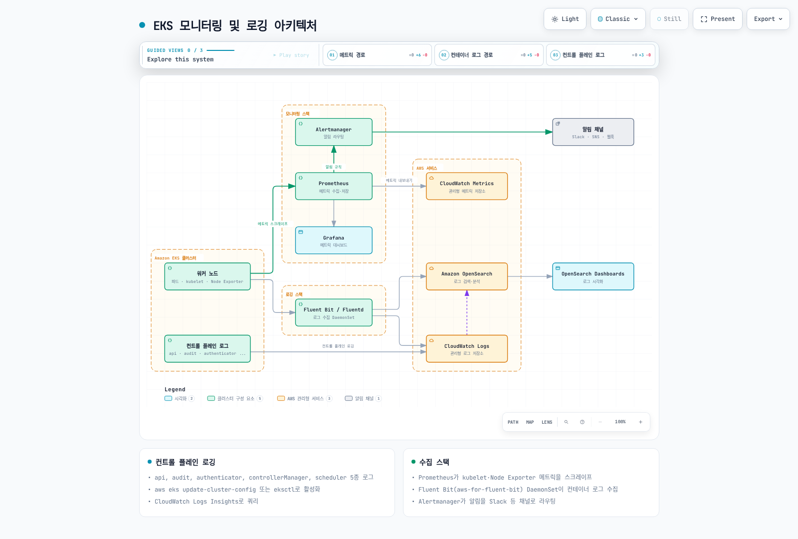
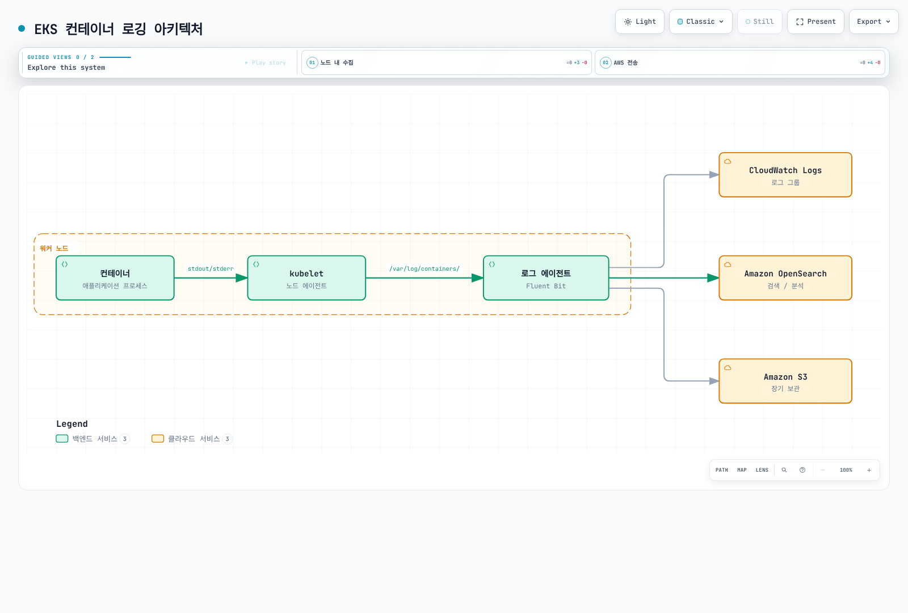
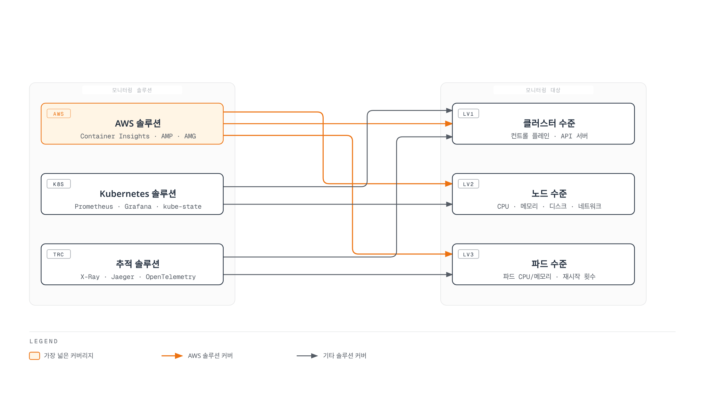
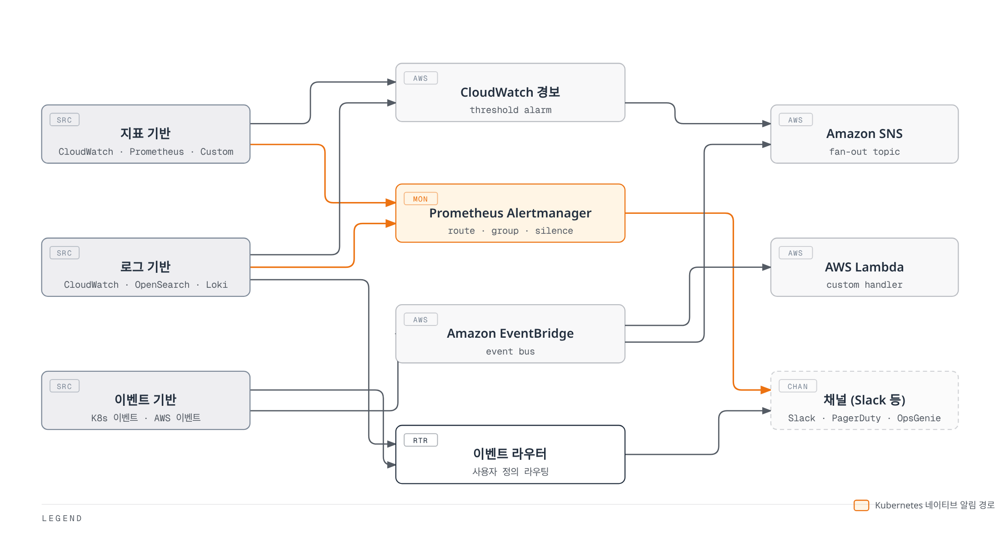
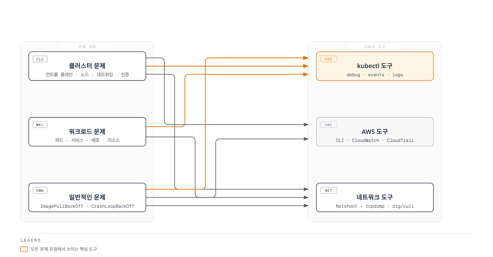

# Amazon EKS 모니터링 및 로깅

> **마지막 업데이트**: 2026년 9월 12일

효과적인 모니터링 및 로깅은 Amazon EKS 클러스터의 안정성, 가용성 및 성능을 유지하는 데 필수적입니다. 이 문서에서는 EKS 클러스터에서 모니터링 및 로깅을 구현하기 위한 다양한 도구, 기술 및 모범 사례를 다룹니다.

## 목차

1. [모니터링 및 로깅 개요](#모니터링-및-로깅-개요)
2. [EKS 컨트롤 플레인 로깅](#eks-컨트롤-플레인-로깅)
3. [컨테이너 로깅](#컨테이너-로깅)
4. [클러스터 모니터링](#클러스터-모니터링)
5. [알림 및 이벤트 관리](#알림-및-이벤트-관리)
6. [로그 분석 및 시각화](#로그-분석-및-시각화)
7. [모니터링 및 로깅 모범 사례](#모니터링-및-로깅-모범-사례)
8. [문제 해결 및 디버깅](#문제-해결-및-디버깅)

## 모니터링 및 로깅 개요

### 모니터링과 로깅의 중요성

Amazon EKS 클러스터에서 모니터링과 로깅은 다음과 같은 이유로 중요합니다:

1. **가시성 확보**: 클러스터의 상태, 성능 및 동작에 대한 가시성 제공
2. **문제 감지**: 문제가 심각해지기 전에 조기 감지
3. **트렌드 분석**: 시간에 따른 성능 및 리소스 사용량 추세 파악
4. **용량 계획**: 리소스 요구사항 예측 및 계획
5. **보안 및 감사**: 조사와 적용되는 제어에 필요한 증거 확보 지원
6. **문제 해결**: 문제 발생 시 신속한 진단 및 해결

### 모니터링 및 로깅 아키텍처

EKS 클러스터의 포괄적인 모니터링 및 로깅 아키텍처는 다음과 같은 구성 요소로 이루어집니다:

관리형 control plane log는 AWS가 CloudWatch Logs로 전달합니다. Container runtime은 CRI log 파일을 기록하고 kubelet은 rotation·log 접근을 관리하며 노드 collector는 파일을 읽습니다. Metric·trace는 별도로 구성한 수집·export 경로를 사용합니다.

<!-- Audit: parent diagram repair needed for direct control-plane delivery and runtime-versus-kubelet log responsibilities.


[🔍 인터랙티브 다이어그램 보기](https://www.atomai.click/kubernetes-docs/archmaps/ko-eks-06-eks-monitoring-logging-0.html)
-->

### 모니터링 및 로깅 전략

효과적인 모니터링 및 로깅 전략을 개발하려면 다음 단계를 따르세요:

1. **목표 정의**: 모니터링 및 로깅의 목표와 요구사항 정의
2. **지표 및 로그 식별**: 수집할 핵심 지표 및 로그 식별
3. **도구 선택**: 요구사항에 맞는 모니터링 및 로깅 도구 선택
4. **기준선 설정**: 정상 동작에 대한 기준선 설정
5. **알림 구성**: 중요한 이벤트 및 임계값에 대한 알림 구성
6. **자동화**: 가능한 한 모니터링 및 로깅 프로세스 자동화
7. **정기적인 검토**: 모니터링 및 로깅 전략 정기적 검토 및 개선

## EKS 컨트롤 플레인 로깅

EKS는 선택한 관리형 control plane log type을 CloudWatch Logs로 export합니다. 노드 collector가 관리형 control plane 파일 시스템을 직접 scrape하는 방식이 아닙니다. 전달은 best effort이므로 접근·보존·log 누락 탐지를 구성하고 실제 도착을 확인합니다.

### 컨트롤 플레인 로그 유형

| 유형 | 목적 |
|---|---|
| `api` | API server 구성 요소 진단 |
| `audit` | Audit policy·level이 선택한 Kubernetes 요청 |
| `authenticator` | EKS IAM 인증 진단 |
| `controllerManager` | Core controller-manager 동작 |
| `scheduler` | Scheduler 결정·진단 |

Audit log는 모든 요청 본문·앱 작업을 빠짐없이 기록하는 보장이 아닙니다. Secret 관련 기록은 metadata만 남길 수 있고 일부 이벤트는 policy에서 제외합니다. CloudTrail의 AWS API 기록과 앱 데이터 접근 log는 별도 증거입니다.

### 로깅 조회·활성화

변경 전에 소유 클러스터의 Region·ARN·현재 logging 설정과 update 상태를 확인합니다. Logging 변경에는 문서화된 subnet 여유 IP가 필요하고 CloudWatch 수집·저장 비용이 발생합니다.

```bash
set -euo pipefail
: "${CLUSTER_NAME:?Set the owned cluster name}"
: "${AWS_REGION:?Set the cluster Region}"
aws eks describe-cluster --name "$CLUSTER_NAME" --region "$AWS_REGION" \
  --query 'cluster.{ARN:arn,Status:status,Logging:logging}'
```

승인한 변경에서는 아래처럼 다섯 log type을 활성화하고 반환된 update를 확인합니다:

```bash
set -euo pipefail
: "${CLUSTER_NAME:?Set the reviewed cluster name}"
: "${AWS_REGION:?Set the cluster Region}"
UPDATE_ID=$(aws eks update-cluster-config \
  --name "$CLUSTER_NAME" --region "$AWS_REGION" \
  --logging '{"clusterLogging":[{"types":["api","audit","authenticator","controllerManager","scheduler"],"enabled":true}]}' \
  --query 'update.id' --output text)
if [[ -z "$UPDATE_ID" || "$UPDATE_ID" == None ]]; then
  printf '%s\n' 'No update ID returned; inspect the request result.' >&2
  exit 1
fi
aws eks describe-update --name "$CLUSTER_NAME" --region "$AWS_REGION" \
  --update-id "$UPDATE_ID" \
  --query 'update.{ID:id,Status:status,Errors:errors}'
```

마지막 명령은 waiter가 아닌 상태 조회입니다. Successful 또는 최종 실패가 될 때까지 DescribeUpdate를 반복한 뒤 실제 설정·log 도착을 확인합니다. Update ID만으로 완료가 증명되지는 않습니다. 선택한 유형 활성화를 위해 기존 다른 유형을 끌 필요는 없으며 명시적인 disable은 보존·가시성에 대한 별도 결정입니다.

검토한 eksctl CLI에서 --approve를 생략하면 변경을 preview합니다. CLUSTER_NAME·AWS_REGION을 확인한 같은 클러스터로 설정하고 preview를 확인합니다:

```bash
set -euo pipefail
: "${CLUSTER_NAME:?Set the verified cluster name}"
: "${AWS_REGION:?Set the cluster Region}"
eksctl utils update-cluster-logging \
  --region "$AWS_REGION" --cluster "$CLUSTER_NAME" \
  --enable-types api,audit,authenticator,controllerManager,scheduler
```

해당 계획을 검토한 뒤 별도 apply 명령을 사용합니다:

```bash
set -euo pipefail
: "${CLUSTER_NAME:?Set the verified cluster name}"
: "${AWS_REGION:?Set the cluster Region}"
eksctl utils update-cluster-logging \
  --region "$AWS_REGION" --cluster "$CLUSTER_NAME" \
  --enable-types api,audit,authenticator,controllerManager,scheduler --approve
```

### 컨트롤 플레인 로그 조회

실제 `/aws/eks/CLUSTER_NAME/cluster` group을 사용합니다. 앞의 두 예제는 선택한 구성 요소 stream의 문자열 검색이며 완전한 오류율 측정이 아닙니다.

**API 진단:**

```text
fields @timestamp, @message
| filter @logStream like /kube-apiserver-/ and @logStream not like /audit/
| filter @message like /[Ee]rror/
| sort @timestamp desc
| limit 20
```

**IAM 인증 진단:**

```text
fields @timestamp, @message
| filter @logStream like /authenticator/
| filter @message like /[Ff]ailed|[Dd]enied|[Uu]nauthorized/
| sort @timestamp desc
| limit 20
```

**Audit 거부:** 원시 JSON에 responseStatus.code 문자열이 그대로 있다고 가정하지 말고 발견된 JSON 필드를 사용합니다. 표본 이벤트의 필드 구조를 확인하세요.

```text
fields @timestamp, user.username, verb, objectRef.resource, objectRef.namespace, responseStatus.code
| filter @logStream like /kube-apiserver-audit/
| filter responseStatus.code in [401, 403]
| sort @timestamp desc
| limit 20
```

### 보존 기간과 비용 관리

Prefix 검색 결과에서 정확한 group 항목을 확인합니다:

```bash
set -euo pipefail
: "${CLUSTER_NAME:?Set the owned cluster name}"
: "${AWS_REGION:?Set the cluster Region}"
aws logs describe-log-groups --region "$AWS_REGION" \
  --log-group-name-prefix "/aws/eks/$CLUSTER_NAME/cluster" \
  --query 'logGroups[].{Name:logGroupName,RetentionDays:retentionInDays,KmsKey:kmsKeyId}'
```

승인한 정책이 30일을 요구한다면 `aws logs put-retention-policy --region "$AWS_REGION" --log-group-name "/aws/eks/$CLUSTER_NAME/cluster" --retention-in-days 30`으로 변경합니다. 30일은 예시 정책이며 보편적인 준법 요건이 아닙니다. 보존 기간 축소는 오래된 증거를 만료시킬 수 있고 확대해도 삭제된 log가 복구되지는 않습니다. Retention만으로 archive 전달·무결성·준수가 입증되지는 않습니다.

### EKS Capabilities 로깅 (GitOps, ACK, kro)

2026년 6월 4일 발표된 기능은 지원됩니다. ACK·kro·Argo CD capability controller는 **고객 클러스터 밖의 AWS 관리 인프라**에서 실행되며 CloudWatch Vended Logs로 구조화된 controller log를 전달합니다. 이는 다섯 표준 control plane log type과 별도의 capability별 delivery 구성입니다.

| Capability | Log type |
|---|---|
| ACK | `EKS_CAPABILITY_ACK_LOGS` |
| kro | `EKS_CAPABILITY_KRO_LOGS` |
| Argo CD | `EKS_CAPABILITY_ARGOCD_APPLICATION_LOGS`, `EKS_CAPABILITY_ARGOCD_APPLICATIONSET_LOGS`, `EKS_CAPABILITY_ARGOCD_COMMITSERVER_LOGS`, `EKS_CAPABILITY_ARGOCD_REPOSERVER_LOGS`, `EKS_CAPABILITY_ARGOCD_SERVER_LOGS` |

Delivery source를 구성하기 전에 실제 capability ARN을 확인합니다:

```bash
set -euo pipefail
: "${CLUSTER_NAME:?Set the owned cluster name}"
: "${AWS_REGION:?Set the cluster Region}"
: "${CAPABILITY_NAME:?Set the actual capability name}"
aws eks describe-capability --region "$AWS_REGION" \
  --cluster-name "$CLUSTER_NAME" --capability-name "$CAPABILITY_NAME" \
  --query 'capability.capabilityArn' --output text
```

소유자는 해당 ARN·log type으로 PutDeliverySource, 승인한 목적지로 PutDeliveryDestination, 둘을 연결하는 CreateDelivery를 구성합니다. 활성화 전에 목적지 policy·암호화·cross-account 권한·보존을 검토합니다.

CloudWatch Logs 목적지는 Logs Insights로 조회할 수 있습니다. S3 목적지는 선택한 S3·Athena 경로의 객체이며 Firehose는 설정된 target으로 전달합니다. 이들이 자동으로 CloudWatch Logs Insights의 조회 대상이 되지는 않습니다. ACK 기록의 controllerGroup으로 service controller를 구분할 수 있습니다. 실제 전달·query 필드를 확인하고 Vended Logs 비용을 고려합니다.

참고: [EKS control plane logging](https://docs.aws.amazon.com/eks/latest/userguide/control-plane-logs.html), [audit policy·query 예제](https://docs.aws.amazon.com/eks/latest/best-practices/auditing-and-logging.html), [capability controller log](https://docs.aws.amazon.com/eks/latest/userguide/capabilities-controller-logs.html).

## 컨테이너 로깅

Container runtime은 stdout·stderr를 노드의 CRI log 파일에 기록합니다. Kubelet은 rotation·Pod log 접근을 관리하고 collector는 파일을 읽어 선택한 backend로 전달합니다. JSON 앱 메시지도 CRI wrapper 안에 있으므로 전체 컨테이너 log line을 Docker JSON으로 가정해 파싱하면 안 됩니다.

<!-- Audit: parent diagram repair needed for direct control-plane delivery and runtime-versus-kubelet log responsibilities.


[🔍 인터랙티브 다이어그램 보기](https://www.atomai.click/kubernetes-docs/archmaps/ko-eks-06-eks-monitoring-logging-1.html)
-->

### Collector 소유권 선택

CloudWatch Observability add-on에는 컨테이너 log collector가 포함되므로 이를 선택한 stack이라면 소유자가 해당 구성을 관리합니다. 아래 standalone Fluent Bit는 독립적으로 관리하는 log pipeline의 대안입니다. 중복 전송·비용을 설계하지 않은 채 같은 파일·목적지에 collector를 겹쳐 설치하지 않습니다.

### 실제 연결된 Fluent Bit 예제

예제는 공개 release·구성을 확인한 AWS chart 0.2.0과 image 3.4.14(Fluent Bit 5.0.9)를 사용합니다. 소유한 Linux·containerd EC2 노드를 대상으로 하며 affinity에서 이 예제의 Fargate·Auto Mode·Hybrid label을 제외합니다. 해당 mode에는 별도의 지원 수집·신원 설계가 필요합니다. 선택한 노드의 taint를 허용하므로 배치 범위와 platform agent admission 권한을 검토합니다.

logging namespace, logging/eks-log-collector ServiceAccount를 위한 최소 권한 IRSA 역할 EKSLogWriter, 소유 CloudWatch log group을 준비합니다. 계정·역할·Region·클러스터별 group을 일관되게 바꾸고 보안 장처럼 IAM OIDC provider·trust audience·subject를 구성합니다. Collector에는 CloudWatch stream·쓰기 권한과 regional STS·backend 연결이 필요합니다. IAM 선행 요건과 Kubernetes metadata RBAC는 별개입니다.

fluent-bit-values.yaml로 저장합니다:

```yaml
fullnameOverride: eks-log-collector
image:
  tag: 3.4.14
serviceAccount:
  create: true
  name: eks-log-collector
  annotations:
    eks.amazonaws.com/role-arn: arn:aws:iam::123456789012:role/EKSLogWriter
nodeSelector:
  kubernetes.io/os: linux
affinity:
  nodeAffinity:
    requiredDuringSchedulingIgnoredDuringExecution:
      nodeSelectorTerms:
      - matchExpressions:
        - key: eks.amazonaws.com/compute-type
          operator: NotIn
          values:
          - fargate
          - auto
          - hybrid
tolerations:
- operator: Exists
service:
  extraService: 'Flush 5

    Log_Level info

    Daemon Off

    HTTP_Server On

    HTTP_Listen 0.0.0.0

    HTTP_Port 2020

    Health_Check On

    storage.path /var/fluent-bit/state/storage

    storage.sync normal

    storage.checksum On

    storage.backlog.mem_limit 20M

    '
input:
  path: /var/log/containers/*.log
  db: /var/fluent-bit/state/tail.db
  multilineParser: cri
  skipLongLines: 'On'
  extraInputs: 'storage.type filesystem

    Read_from_Head On

    '
filter:
  kubeURL: https://kubernetes.default.svc:443
  mergeLog: 'On'
  mergeLogKey: data
  keepLog: 'On'
  k8sLoggingParser: 'Off'
  k8sLoggingExclude: 'Off'
  extraFilters: 'Use_Kubelet Off

    '
cloudWatch:
  enabled: false
cloudWatchLogs:
  enabled: true
  region: us-west-2
  logGroupName: /aws/eks/my-cluster/application
  logStreamPrefix: unmatched-
  logStreamTemplate: $kubernetes['namespace_name'].$kubernetes['pod_name'].$kubernetes['container_name']
  autoCreateGroup: false
  extraOutputs: 'auto_create_group false

    storage.total_limit_size 512M

    '
volumes:
- name: varlog
  hostPath:
    path: /var/log
    type: Directory
- name: state
  hostPath:
    path: /var/lib/eks-log-collector
    type: DirectoryOrCreate
volumeMounts:
- name: varlog
  mountPath: /var/log
  readOnly: true
- name: state
  mountPath: /var/fluent-bit/state
```

Chart 0.2.0은 native cloudWatchLogs 출력을 기본 활성화하고 이전 cloudWatch 출력은 비활성화합니다. 따라서 cloudWatch.region만 지정하면 실제 native 출력에 적용되지 않습니다. 위 values는 실제 출력의 Region·group을 설정하고 전체 record를 유지합니다. log_key를 지정하면 선택한 값만 전송되어 Kubernetes context가 빠질 수 있습니다.

logStreamTemplate은 record accessor 문법과 fallback prefix를 사용합니다. logStreamPrefix는 record별 Kubernetes 표현식이 아닌 고정 prefix입니다. CRI multiline parser가 컨테이너 wrapper를 처리하고 Merge_Log는 JSON 앱 필드를 data 아래에 넣으며 log도 유지합니다. 이 예제에서는 workload annotation으로 parser를 선택하거나 수집에서 제외할 수 없습니다.

### Render 단계의 Metadata RBAC 제한

공개 chart의 넓은 ClusterRole에는 nodes/proxy와 이전 PodSecurityPolicy 규칙이 있습니다. 이 API server metadata 방식은 Use_Kubelet Off를 명시하며 선택한 Pod·Namespace 읽기 권한을 사용하고 kubelet proxy 접근은 사용하지 않습니다. Python 3·PyYAML post-renderer를 fluent-bit-rbac.py로 저장합니다. 예상과 다른 chart 신원이 나오면 다른 넓은 역할을 그대로 남기지 않고 중단합니다:

```python
#!/usr/bin/env python3
"""Helm post-renderer for this pinned, owned metadata-only Fluent Bit setup."""
import sys
import yaml

objects = [obj for obj in yaml.safe_load_all(sys.stdin) if obj is not None]
roles = [obj for obj in objects if obj.get("kind") == "ClusterRole"]
bindings = [obj for obj in objects if obj.get("kind") == "ClusterRoleBinding"]
if len(roles) != 1 or roles[0].get("metadata", {}).get("name") != "eks-log-collector":
    raise SystemExit("Unexpected chart RBAC; review this renderer before proceeding")
if len(bindings) != 1 or bindings[0].get("roleRef", {}).get("name") != "eks-log-collector":
    raise SystemExit("Unexpected chart role binding")
subjects = bindings[0].get("subjects", [])
if len(subjects) != 1 or any(
    subjects[0].get(key) != value
    for key, value in {
        "kind": "ServiceAccount", "name": "eks-log-collector", "namespace": "logging"
    }.items()
):
    raise SystemExit("Unexpected collector identity")
if any(obj.get("kind") == "PodSecurityPolicy" for obj in objects):
    raise SystemExit("Obsolete PodSecurityPolicy output is not supported by this example")
roles[0]["rules"] = [{
    "apiGroups": [""],
    "resources": ["namespaces", "pods"],
    "verbs": ["get", "list", "watch"],
}]
yaml.safe_dump_all(objects, sys.stdout, sort_keys=False)
```

신규 소유 release는 values와 renderer를 함께 사용하여 설치합니다:

```bash
helm repo add eks https://aws.github.io/eks-charts
helm repo update eks
chmod +x fluent-bit-rbac.py
helm install eks-log-collector eks/aws-for-fluent-bit \
  --version 0.2.0 --namespace logging --create-namespace \
  -f fluent-bit-values.yaml --post-renderer ./fluent-bit-rbac.py \
  --wait --timeout 5m
```

모든 upgrade에도 같은 검토한 post-renderer를 사용하고 chart version·release 신원·namespace·metadata 방식을 바꿀 때 다시 검증합니다. Render된 ConfigMap은 실제 DaemonSet에 mount되며 무관한 ConfigMap만 apply해도 구성이 바뀌지는 않습니다. 계정·IRSA 역할·log group은 선행 요건이며 이 chart 예제가 생성하는 리소스가 아닙니다.

### Buffer·Rotation·실패 동작

Host log는 읽기 전용이고 checkpoint·filesystem buffer 상태는 별도 node-local directory에 둡니다. Tail database는 offset 기록이며 그 자체가 내구성 있는 backend archive는 아닙니다. 노드 교체 시 상태가 사라질 수 있습니다. Checkpoint가 없을 때 Read_from_Head On은 남아 있는 파일 내용을 읽으므로 backfill·중복 처리를 설계합니다.

512M output queue 한도와 backlog memory는 예시 할당입니다. storage.total_limit_size에 도달하면 Fluent Bit가 해당 queue의 오래된 chunk를 버릴 수 있습니다. Skip_Long_Lines On도 큰 record를 의도적으로 건너뜁니다. 유한 buffer·retry·node-local 상태는 무손실·exactly-once 전달 보장이 아닙니다. Retry·drop·disk 용량·목적지 실패를 감시하고 실제 log 유입량·장애 기간에 맞게 한도를 검증합니다.

### 선택적 OpenSearch 동시 전송

소유 VPC domain과 collector IAM·FGAC mapping을 준비한 후 overlay를 fluent-bit-opensearch-values.yaml로 저장하고 endpoint hostname을 바꿉니다. 같은 검토된 Helm 작업에 `-f fluent-bit-opensearch-values.yaml`을 추가합니다. CloudWatch를 유지하면 두 목적지로 복제 전송하며 OpenSearch만 선택하는 경우에만 cloudWatchLogs.enabled=false를 설정합니다.

```yaml
opensearch:
  enabled: true
  host: vpc-eks-logs-EXAMPLE.us-west-2.es.amazonaws.com
  port: '443'
  tls: 'On'
  awsAuth: 'On'
  awsRegion: us-west-2
  index: eks-logs
  generateId: 'On'
  suppressTypeName: 'On'
  extraOutputs: 'tls.verify On

    storage.total_limit_size 512M

    '
```

TLS 인증서·hostname 검증과 통제한 고정 index·rollover 설계를 사용합니다. Pod별 index는 index·shard 수를 과도하게 늘릴 수 있습니다. Generate_ID는 retry 중 중복 indexing을 줄이며 독립 출력·실패 복구는 여전히 검증해야 합니다. 한 목적지의 쓰기 성공이 다른 목적지 전달의 증거는 아닙니다.

### 다른 Logging Stack

Fluentd도 소유한 배포에서 필요한 parser·output plugin, host mount, 신원·TLS를 구성하면 선택할 수 있습니다. 일반 JSON parser가 CRI wrapper를 해석하는 것은 아니며 ssl_verify 비활성화는 인증서 오류의 해결책이 아닙니다. 이전 Elastic Helm chart repository는 archive되었으므로 Elastic 배포에는 유지 관리되는 product·operator 설치 경로를 사용합니다.

loki-stack chart는 deprecated이며 Promtail agent는 2026년 3월 2일 EOL에 도달했습니다. Loki는 지원되는 현재 배포와 Alloy 같은 지원 client를 사용하고 storage·접근 제어·retention을 명시합니다. 전용 구성은 [Loki 문서](../observability/logging/01-loki.md), [collector 문서](../observability/logging/05-collectors.md)를 참고하세요. Promtail agent 종료에는 별도 lambda-promtail client가 포함되지 않습니다.

### 구조화된 애플리케이션 Log

다음은 유지한 합성 앱 데이터 예제이며 새 실측이나 이번 감사에서 수집한 기록이 아닙니다. Timestamp는 원래 예시 값을 유지했습니다:

```json
{
  "timestamp": "2025-07-11T13:00:00Z",
  "level": "INFO",
  "message": "Request processed successfully",
  "request_id": "12345",
  "user_id": "user-789",
  "duration_ms": 45,
  "status_code": 200
}
```

이 pipeline에서는 CRI record가 전달 timestamp를 제공하고 앱 JSON은 data 아래에 놓입니다. 앱 필드로 timestamp를 덮어쓰기 전에 timezone·clock 동작을 확인합니다. User·session identifier도 민감하거나 연결 가능한 정보일 수 있으므로 최소화하고 credential·원시 session token은 기록하지 않습니다.

다음 query는 이 collector의 record 구조를 전제로 하며 다른 collector는 field path가 다를 수 있습니다:

```text
fields @timestamp, kubernetes.namespace_name, kubernetes.pod_name, data.level, log
| filter kubernetes.namespace_name = "production"
| filter data.level in ["ERROR", "error"]
| sort @timestamp desc
| limit 100
```

공개 chart·image metadata, 실제 Helm ConfigMap·DaemonSet 연결, Kubernetes 기본 schema와 post-renderer 실패 사례를 검증했습니다. Image 설치·collector process 실행·AWS log 전송·운영 파일 시스템 접근은 시험하지 않았습니다. Rollout 전에 실제 노드 권한·IRSA 자격 증명·전체 전달 경로를 검증해야 합니다.

참고: [AWS image 3.4.14](https://github.com/aws/aws-for-fluent-bit/releases/tag/v3.4.14), [CloudWatch output](https://docs.fluentbit.io/manual/data-pipeline/outputs/cloudwatch), [Fluent Bit buffering](https://docs.fluentbit.io/manual/data-pipeline/buffering), [Promtail lifecycle](https://grafana.com/docs/loki/latest/send-data/promtail/).

## 클러스터 모니터링

효과적인 클러스터 모니터링은 EKS 클러스터의 상태, 성능 및 리소스 사용량을 추적하는 데 필수적입니다. 이 섹션에서는 EKS 클러스터를 모니터링하기 위한 다양한 도구와 기술을 살펴봅니다.



[🔍 인터랙티브 다이어그램 보기](https://www.atomai.click/kubernetes-docs/archmaps/ko-eks-06-eks-monitoring-logging-2.html)

### CloudWatch Container Insights

CloudWatch Observability add-on은 Container Insights·컨테이너 log 수집·Application Signals 기능을 결합합니다. 소유자가 관리하는 설치 하나를 사용하고 같은 파일을 읽는 다른 Fluent Bit collector와 겹치지 않게 합니다. 데이터 수집을 기대하기 전에 신원·지원 노드 접근·backend 연결을 구성합니다.

#### 클러스터와 호환 Add-on Build 확인

일반 Linux EC2 예제에서는 적절한 EKS Pod Identity agent와 이 클러스터·amazon-cloudwatch/cloudwatch-agent로 trust 범위를 정한 전용 CloudWatch 역할을 준비합니다. 운영자에게는 필요한 add-on·association 제어와 승인 역할 전달 권한이 있어야 합니다. EKS add-on 목록뿐 아니라 기존 Helm release·ServiceAccount annotation·association도 확인합니다. 기존 collector는 소유자의 migration·upgrade 절차가 필요합니다.

```bash
set -euo pipefail
: "${CLUSTER_NAME:?Set the owned cluster name}"
: "${AWS_REGION:?Set the cluster Region}"
CLUSTER_VERSION=$(aws eks describe-cluster --name "$CLUSTER_NAME" --region "$AWS_REGION" \
  --query cluster.version --output text)
aws eks list-addons --cluster-name "$CLUSTER_NAME" --region "$AWS_REGION"
aws eks describe-addon-versions --region "$AWS_REGION" \
  --addon-name amazon-cloudwatch-observability --kubernetes-version "$CLUSTER_VERSION"
```

고정된 v5.0.0 예제로 downgrade하지 말고 catalog에서 호환되는 검토한 build를 선택합니다. Add-on configuration schema는 버전별로 다릅니다. 여기서 로컬 기준 render에는 Helm chart 6.6.0을 사용했고 Fluent Bit DaemonSet도 agent 신원 경로의 cloudwatch-agent ServiceAccount를 사용합니다.

#### 명시적인 Auto Monitor 구성

신규 설치 예제의 cloudwatch-config.json으로 저장합니다. 기본 컨테이너 log 구성은 유지하고 앱 rollout을 검토할 때까지 광범위한 자동 workload 선택·자동 restart를 비활성화합니다:

```json
{
  "manager": {
    "applicationSignals": {
      "autoMonitor": {
        "monitorAllServices": false,
        "restartPods": false
      }
    }
  }
}
```

이 설정은 Auto Monitor 선택·restart를 제어하며 모든 telemetry source를 끄는 설정은 아닙니다. 기존 annotation·custom selector·수동 계측 앱은 별도로 검토합니다. 로컬 Python 3·jsonschema를 준비한 뒤 선택한 build의 schema를 받아 구성을 검사합니다:

```bash
set -euo pipefail
: "${AWS_REGION:?Set the cluster Region}"
: "${CLOUDWATCH_ADDON_VERSION:?Choose a reviewed compatible add-on build}"
aws eks describe-addon-configuration --region "$AWS_REGION" \
  --addon-name amazon-cloudwatch-observability --addon-version "$CLOUDWATCH_ADDON_VERSION" \
  --output json > cloudwatch-addon-review.json
python3 - "$CLOUDWATCH_ADDON_VERSION" <<'PY'
import json
import sys
import jsonschema
with open("cloudwatch-addon-review.json") as stream:
    review = json.load(stream)
if review["addonName"] != "amazon-cloudwatch-observability" or review["addonVersion"] != sys.argv[1]:
    raise SystemExit("Returned schema does not match the selected add-on build")
schema = json.loads(review["configurationSchema"])
with open("cloudwatch-config.json") as stream:
    config = json.load(stream)
validator = jsonschema.validators.validator_for(schema)
validator.check_schema(schema)
validator(schema).validate(config)
PY
```

#### 신규 소유 설치 요청

CloudWatch 역할에는 선택한 기능에 필요한 CloudWatch·trace 권한이 이미 있어야 합니다. 다음은 검토한 schema·build를 재확인하고 기존 add-on·collector association이 있으면 중단하며 충돌 리소스를 인수하지 않습니다:

```bash
set -euo pipefail
: "${CLUSTER_NAME:?Set the reviewed cluster name}"
: "${AWS_REGION:?Set the cluster Region}"
: "${CLOUDWATCH_ADDON_VERSION:?Set the reviewed, schema-checked compatible build}"
: "${CLOUDWATCH_ROLE_ARN:?Set the prepared CloudWatch Pod Identity role ARN}"
python3 - "$CLOUDWATCH_ADDON_VERSION" <<'PY'
import json
import sys
import jsonschema
with open("cloudwatch-addon-review.json") as stream:
    review = json.load(stream)
if review["addonName"] != "amazon-cloudwatch-observability" or review["addonVersion"] != sys.argv[1]:
    raise SystemExit("Selected add-on build changed; review its schema again")
schema = json.loads(review["configurationSchema"])
with open("cloudwatch-config.json") as stream:
    config = json.load(stream)
jsonschema.validators.validator_for(schema)(schema).validate(config)
PY
EXISTING_ADDONS=$(aws eks list-addons --cluster-name "$CLUSTER_NAME" --region "$AWS_REGION" --output json)
python3 - "$EXISTING_ADDONS" <<'PY'
import json, sys
if "amazon-cloudwatch-observability" in json.loads(sys.argv[1])["addons"]:
    raise SystemExit("Add-on already exists; use its owner's reviewed upgrade procedure")
PY
EXISTING_ASSOCIATIONS=$(aws eks list-pod-identity-associations \
  --cluster-name "$CLUSTER_NAME" --region "$AWS_REGION" \
  --namespace amazon-cloudwatch --service-account cloudwatch-agent --output json)
python3 - "$EXISTING_ASSOCIATIONS" <<'PY'
import json, sys
if json.loads(sys.argv[1])["associations"]:
    raise SystemExit("Collector association already exists; inspect its owner before installation")
PY
ASSOCIATIONS=$(python3 - "$CLOUDWATCH_ROLE_ARN" <<'PY'
import json, sys
print(json.dumps([{"serviceAccount": "cloudwatch-agent", "roleArn": sys.argv[1]}]))
PY
)
aws eks create-addon --cluster-name "$CLUSTER_NAME" --region "$AWS_REGION" \
  --addon-name amazon-cloudwatch-observability --addon-version "$CLOUDWATCH_ADDON_VERSION" \
  --pod-identity-associations "$ASSOCIATIONS" \
  --configuration-values file://cloudwatch-config.json --resolve-conflicts NONE
aws eks describe-addon --cluster-name "$CLUSTER_NAME" --region "$AWS_REGION" \
  --addon-name amazon-cloudwatch-observability \
  --query 'addon.{Status:status,Version:addonVersion,Health:health.issues}'
```

CreateAddon은 비동기입니다. ACTIVE가 될 때까지 status·health를 확인한 뒤 agent·collector Pod, 실제 ContainerInsights datapoint와 대상 log group을 검증합니다. 요청 성공·ACTIVE·dashboard만으로 전체 수집이 증명되지는 않습니다. 마지막 DescribeAddon은 waiter가 아닌 조회입니다. 재시도 전에 실패·권한을 확인하며 검토하지 않은 overwrite나 기존 구성 삭제로 설치를 강제하지 않습니다.

#### 버전 5.0.0의 변경점

2026년 2월 26일의 기본 APM 변경은 실제 기능입니다. 5.0.0+의 신규 설치·upgrade는 Application Signals Auto Monitor를 기본 활성화합니다. monitorAllServices 기본값은 true, restartPods는 false입니다. 지원되는 Service 연결 Deployment·DaemonSet·StatefulSet이 대상이며 kube-system·amazon-cloudwatch는 기본 제외됩니다. 대상의 신규·재시작 workload는 개별 annotation 없이 계측될 수 있지만 실행 중인 모든 Pod가 즉시 재계측되는 것은 아닙니다.

지원 언어·workload를 선택하고 기존 OpenTelemetry·APM 통합, sampling·비용과 restart rollout을 검토합니다. 명시적 제외가 우선합니다. Container Insights는 Linux·Windows 구성을 지원하지만 EKS Windows 노드의 Application Signals는 지원하지 않습니다. Fargate·Hybrid 수집·신원은 해당 플랫폼의 문서화된 경로가 필요하며 일반 DaemonSet 예제로 지원을 단정하지 않습니다.

#### Metric·Dashboard·경보

Container Insights console view에서 실제 클러스터를 선택하고 공개 metric 이름·차원·최근 데이터를 확인합니다. Node CPU·메모리·파일 시스템 metric은 노드 사용량을 나타냅니다. Pod CPU·메모리 사용률의 분모는 Pod request가 아닌 노드 한도입니다. 문서화된 metric에는 namespace·service·cluster 집계가 있지만 집계 백분율이 이기종 클러스터의 용량 가중 사용률이 되는 것은 아닙니다.

Dashboard는 데이터 조회를 돕지만 모든 경보를 만들거나 알림 전달을 보장하지 않습니다. 뒤의 CloudWatch 경보 예제는 명시적으로 선택한 차원과 node metric·Maximum을 사용합니다. Metric 존재를 검증하고 workload에 맞는 경보·전달 경로를 구성하세요.

기존 공개 chart의 기본 log 구성·Auto Monitor 인수를 render하고 schema·소유권·실패 흐름의 mocked 사례 9개를 검증했습니다. 합성 test schema는 helper 동작 검사이며 위의 실제 build별 schema를 대체하지 않습니다. 이번 감사에서 add-on·workload 계측·telemetry export·AWS resource를 실행하지 않았습니다.

참고: [CloudWatch add-on 설치·Auto Monitor](https://docs.aws.amazon.com/AmazonCloudWatch/latest/monitoring/install-CloudWatch-Observability-EKS-addon.html), [기본 APM 발표](https://aws.amazon.com/about-aws/whats-new/2026/02/application-performance-monitoring-cloudwatch-eks/), [Container Insights metric](https://docs.aws.amazon.com/AmazonCloudWatch/latest/monitoring/Container-Insights-metrics-EKS.html).

### EKS Node Monitoring Agent

EKS Node Monitoring Agent는 노드의 시스템·스토리지·네트워크·가속기 상태를 condition으로 게시합니다. 2026년 2월 24일 open source로 공개되었고 EKS Auto Mode에 포함됩니다. 별도로 관리하는 add-on 설치에서는 release 선택 전에 실제 클러스터 버전·기존 add-on·호환 agent 버전을 확인합니다:

```bash
set -euo pipefail
: "${CLUSTER_NAME:?Set the owned cluster name}"
: "${AWS_REGION:?Set the cluster Region}"
KUBERNETES_VERSION=$(aws eks describe-cluster --name "$CLUSTER_NAME" --region "$AWS_REGION" \
  --query cluster.version --output text)
aws eks list-addons --cluster-name "$CLUSTER_NAME" --region "$AWS_REGION"
aws eks describe-addon-versions --addon-name eks-node-monitoring-agent \
  --kubernetes-version "$KUBERNETES_VERSION" --region "$AWS_REGION"
```

기존 add-on 소유자가 검토한 버전·지원 노드 구성으로 설치하거나 update합니다. Add-on create 명령은 기존 설치의 upgrade 절차가 아닙니다.

Condition 이름의 존재만으로 노드가 비정상이라고 판단하지 않습니다. Status·reason과 각 condition의 의미를 읽어야 합니다. Ready=False와 MemoryPressure=False는 의미가 다릅니다.

```bash
kubectl get nodes -o jsonpath='{range .items[*]}{.metadata.name}{"\n"}{range .status.conditions[*]}{"  "}{.type}{"="}{.status}{" reason="}{.reason}{"\n"}{end}{end}'
```

모니터링과 repair 활성화는 별개입니다. Auto Mode는 automatic node repair가 활성화되어 있고 managed node group은 nodeRepairConfig, Karpenter는 NodeRepair feature gate를 사용합니다. Agent 설치만으로 복구 동작을 단정하지 말고 실제 managed node group 구성을 확인합니다:

```bash
set -euo pipefail
: "${CLUSTER_NAME:?Set the owned cluster name}"
: "${NODEGROUP_NAME:?Set an actual managed node group name}"
: "${AWS_REGION:?Set the cluster Region}"
aws eks describe-nodegroup --region "$AWS_REGION" \
  --cluster-name "$CLUSTER_NAME" --nodegroup-name "$NODEGROUP_NAME" \
  --query 'nodegroup.{Name:nodegroupName,Repair:nodeRepairConfig,Health:health.issues}'
```

Repair 대상 여부는 condition·reason·대기 시간과 적용되는 보호 조건에 따라 달라집니다. 문서화된 기본값에서 MemoryPressure·DiskPressure에는 automatic repair action이 없습니다. 모든 condition이나 agent 설치를 노드 교체의 증거로 간주하지 않습니다. Open source agent를 수정할 때도 게시하는 condition 의미를 선택한 repair 구성과 함께 시험해야 합니다.

참고: [open source 발표](https://aws.amazon.com/about-aws/whats-new/2026/02/amazon-eks-node-monitoring-agent-open-source/), [automatic node repair](https://docs.aws.amazon.com/eks/latest/userguide/node-repair.html).

### Prometheus 및 Grafana

Prometheus는 시계열 데이터베이스 및 모니터링 시스템이며, Grafana는 지표를 시각화하기 위한 대시보드 도구입니다. 이 두 도구를 함께 사용하여 EKS 클러스터를 포괄적으로 모니터링할 수 있습니다.

#### Amazon Managed Service for Prometheus 및 Grafana

AMP는 수집한 Prometheus metric을 저장·조회하고 AMG는 구성한 data source를 조회해 dashboard로 표시합니다. Workspace 생성만으로 scraper 배포·AWS 신원 권한·data source 연결이 완료되지는 않습니다. 이 예제는 기존 소유 workspace를 조회하고 아래 kube-prometheus-stack release를 확장하므로 Prometheus를 중복 설치하지 않습니다.

**AMP 수집 신원과 values**

ServiceAccount monitoring/amp-writer용 IRSA 역할을 준비합니다. Trust policy는 이 클러스터의 OIDC provider와 정확한 sub=system:serviceaccount:monitoring:amp-writer·aud=sts.amazonaws.com 조건을 사용해야 합니다. 대상 workspace ARN에 aps:RemoteWrite를 부여합니다. Prometheus process는 projected token을 받고 STS·AMP endpoint에 연결할 수 있어야 하며 Kubernetes RBAC는 별도 권한 경로입니다. 이 예제에 무관한 Pod Identity association이나 정적 AWS key를 함께 연결하지 않습니다.

다음은 workspace를 읽고 검토한 chart 90.1.1의 overlay를 작성합니다. /api/v1/이 있거나 없는 endpoint 형식을 처리해 remote_write 경로를 한 번만 붙입니다. Python 3이 필요하며 workspace를 생성하지 않습니다:

```bash
set -euo pipefail
: "${AWS_REGION:?Set the AMP workspace Region}"
: "${AMP_WORKSPACE_ID:?Set the owned AMP workspace ID}"
: "${AMP_WRITE_ROLE_ARN:?Set the prepared IRSA writer role ARN}"
: "${CLUSTER_NAME:?Set the source cluster name}"
aws amp describe-workspace --region "$AWS_REGION" \
  --workspace-id "$AMP_WORKSPACE_ID" --output json > amp-workspace.json
python3 - "$AWS_REGION" "$AMP_WORKSPACE_ID" "$AMP_WRITE_ROLE_ARN" "$CLUSTER_NAME" <<'PY'
import json
import sys
from urllib.parse import urlsplit, urlunsplit

region, workspace_id, role_arn, cluster = sys.argv[1:]
with open("amp-workspace.json") as stream:
    workspace = json.load(stream)["workspace"]
if workspace["workspaceId"] != workspace_id or workspace["status"]["statusCode"] != "ACTIVE":
    raise SystemExit("Review the workspace identity and ACTIVE status")
arn = workspace["arn"].split(":", 5)
if len(arn) != 6 or arn[2] != "aps" or arn[3] != region or arn[5] != "workspace/" + workspace_id:
    raise SystemExit("Workspace ARN does not match the selected Region/ID")
endpoint = urlsplit(workspace["prometheusEndpoint"])
path = endpoint.path.rstrip("/")
if path.endswith("/api/v1"):
    path = path[:-7]
if (endpoint.scheme != "https" or not endpoint.hostname or endpoint.username
        or endpoint.password or endpoint.query or endpoint.fragment
        or path != "/workspaces/" + workspace_id):
    raise SystemExit("Inspect the workspace endpoint before configuring remote write")
remote_write = urlunsplit((endpoint.scheme, endpoint.netloc, path + "/api/v1/remote_write", "", ""))
values = {
    "prometheus": {
        "serviceAccount": {
            "create": True, "name": "amp-writer", "createTokenSecret": True,
            "annotations": {"eks.amazonaws.com/role-arn": role_arn},
        },
        "prometheusSpec": {
            "externalLabels": {"cluster": cluster},
            "remoteWrite": [{"url": remote_write, "sigv4": {"region": region}}],
        },
    },
}
with open("amp-values.json", "w") as stream:
    json.dump(values, stream, indent=2)
    stream.write("\n")
print("Wrote amp-values.json; review it with all existing release values")
PY
```

소유자의 검토한 설치·upgrade values에서 amp-values.json과 monitoring-values.yaml을 함께 사용합니다. Overlay는 remoteWrite 목록을 교체하므로 기존 목적지·external label을 의도에 맞게 보존합니다. 신규 release는 아래 설치 명령에 -f amp-values.json을 추가합니다. 기존 release는 현재 설정을 모두 유지하고 render diff·rollout을 검토한 뒤 소유자의 upgrade 절차를 따릅니다. ServiceAccount 변경은 Prometheus Pod 신원을 바꾸며 Chart 90.1.1의 기본 API-server·kubelet ServiceMonitor 인증은 명시적인 ServiceAccount token Secret을 사용합니다. 이 Secret을 보호하고 rotation·폐기 절차를 따릅니다. IRSA의 짧은 수명·audience 제한 token과는 다릅니다. 의존하는 모든 monitor 자격 증명을 교체하지 않고 createTokenSecret을 끄면 render·인증이 실패합니다.

여러 replica에서는 중복 scrape가 무료라고 가정하지 말고 AMP의 문서화된 HA deduplication label·replica 구성을 설정합니다. 실제 workload에 맞게 cardinality·retention·수집 비용을 계획합니다. Remote-write 실패·backlog와 대상 workspace의 최근 데이터를 확인하며 Helm rollout 성공만으로 수집을 증명하지 않습니다.

**AMG 인증과 data source 연결**

```bash
set -euo pipefail
: "${AMG_REGION:?Set the Grafana workspace Region}"
: "${AMG_WORKSPACE_ID:?Set the owned Grafana workspace ID}"
aws grafana describe-workspace --region "$AMG_REGION" \
  --workspace-id "$AMG_WORKSPACE_ID" \
  --query 'workspace.{ID:id,Status:status,Version:grafanaVersion,Endpoint:endpoint,Role:workspaceRoleArn,Authentication:authentication,PermissionType:permissionType}'
```

Workspace 사용자 인증(IAM Identity Center·SAML), Grafana 사용자 권한, AWS data source용 workspace IAM 역할은 서로 다른 제어입니다. Grafana service account는 Grafana HTTP API 신원이며 ADMIN service account를 만든다고 AMP data source가 생성되거나 aps:QueryMetrics가 부여되지는 않습니다. Metric 조회를 위해 불필요하게 광범위한 API 신원을 만들지 않습니다.

AMG 12+에서는 Amazon Managed Service for Prometheus data-source plugin을 선택합니다. 해당 AMG 버전의 Core Prometheus plugin에서 SigV4 지원이 제거되었고 기존 AMP data source는 AMP plugin으로 migration됩니다. 실제 workspace 버전에 맞는 문서를 사용합니다. 승인된 workspace 구성 경로에서 대상 account·Region·workspace와 조회 신원을 설정하고 알려진 series를 시험합니다. 문서의 AWS data-source configuration 절차는 service-managed 권한을 사용합니다. Customer-managed workspace는 자체 IAM 구성을 검토해야 하며 자동으로 소유권 방식을 바꾸지 않습니다.

조회 역할에는 일반적으로 workspace 범위의 aps:QueryMetrics·aps:GetSeries·aps:GetLabels·aps:GetMetricMetadata가 필요하며 discovery·다른 활성 기능에는 추가 action이 필요할 수 있습니다. 조회 endpoint와 remote_write 수집 URL은 다릅니다. 별도로 workspace를 생성할 때 CLI는 --workspace-name을 사용하고 --account-access-type·인증·권한 구성이 필요합니다. Service-managed IAM 자동화는 문서화된 console 절차와 연결됩니다. Workspace를 사용 가능하다고 판단하기 전에 신원·사용자 할당·네트워크 접근을 완료합니다.

참고: [AMP remote write](https://docs.aws.amazon.com/prometheus/latest/userguide/AMP-onboard-ingest-metrics-existing-Prometheus.html), [AMG AMP plugin](https://docs.aws.amazon.com/grafana/latest/userguide/amazon-prometheus-data-source.html), [AWS data-source configuration](https://docs.aws.amazon.com/grafana/latest/userguide/amazon-AMP-adding-AWS-config.html). 이번 감사에서 workspace·인증 흐름·telemetry 수집을 실행하지 않았습니다.

#### 자체 관리형 Prometheus 및 Grafana

이 예제는 ServiceMonitor·PrometheusRule 예제에 필요한 Prometheus Operator를 포함하는 kube-prometheus-stack release 하나를 소유자가 관리합니다. 독립 Prometheus chart만 설치하면 해당 CRD·controller가 자동 제공되는 것은 아닙니다. 설치 전에 기존 operator·release·CRD 소유권을 확인하며 기존 stack은 소유자의 upgrade 절차를 따릅니다.

검토한 기준은 chart 90.1.1·Operator 0.93.1이며 EKS 1.36용으로 render했습니다. 일반 Linux EC2 노드와 동작하는 EBS CSI 권한, 준비된 암호화 ebs-gp3 StorageClass를 전제로 합니다. Auto Mode·다른 storage 구현은 실제 지원 class와 노드 배치를 선택합니다. 아래 retention·PVC 크기는 예시 할당이며 실측 용량 보장이 아닙니다.

승인된 secret 관리 경로로 monitoring namespace와 admin-user·admin-password key가 있는 grafana-admin Secret을 준비합니다. Values는 공통 암호를 Helm values·명령 인수에 넣는 대신 Secret을 참조합니다. 다음을 monitoring-values.yaml로 저장합니다:

```yaml
grafana:
  admin:
    existingSecret: grafana-admin
    userKey: admin-user
    passwordKey: admin-password
  service:
    type: ClusterIP
  rbac:
    namespaced: true
  sidecar:
    dashboards:
      searchNamespace: monitoring
    datasources:
      searchNamespace: monitoring
  persistence:
    enabled: true
    storageClassName: ebs-gp3
    size: 10Gi
    accessModes:
    - ReadWriteOnce
  deploymentStrategy:
    type: Recreate
prometheus:
  prometheusSpec:
    retention: 14d
    storageSpec:
      volumeClaimTemplate:
        spec:
          storageClassName: ebs-gp3
          accessModes:
          - ReadWriteOnce
          resources:
            requests:
              storage: 20Gi
kubeEtcd:
  enabled: false
kubeControllerManager:
  enabled: false
kubeScheduler:
  enabled: false
kubeProxy:
  enabled: false
kubelet:
  serviceMonitor:
    tlsConfig:
      insecureSkipVerify: false
      ca:
        configMap:
          name: kubelet-serving-ca
          key: ca.crt
```

Grafana dashboard·data-source sidecar는 namespaced role로 monitoring만 감시합니다. ClusterIP 서비스는 로컬 port-forward로 접근합니다. Replica 하나와 PVC를 사용하는 예제는 rollout 중 동시 writer를 피하도록 Recreate를 사용하므로 교체 중 UI 중단을 계획해야 하며 고가용성 Grafana 설계는 아닙니다.

Chart 기본값은 kubelet server 인증서 검증을 생략합니다. 이 values는 대신 신뢰하는 kubelet serving CA chain을 ca.crt에 담은 monitoring/kubelet-serving-ca ConfigMap과 scrape endpoint의 SAN이 일치하는 인증서를 전제로 합니다. 노드 소유자의 인증서 관리 절차로 신뢰를 검증하며 EKS API-server CA가 자동으로 kubelet serving CA가 되는 것은 아닙니다. 이 전제가 충족되지 않으면 수집 활성화 전에 인증서 구성을 해결합니다. 실패한 target을 정상으로 보이게 하려고 insecureSkipVerify를 조용히 되돌리지 않습니다. 이번 감사에서 kubelet TLS handshake는 시험하지 않았습니다.

이 구성에서 직접 endpoint를 제공하지 않는 etcd·controller-manager·scheduler·kube-proxy scrape job은 비활성화했습니다. 실제 도달 가능하고 권한이 있는 endpoint를 구성한 뒤 해당 job을 활성화합니다. API server·CloudWatch metric은 별도 자료이며 없는 구성 요소 ServiceMonitor target을 동작시키지 않습니다.

신규 소유 release 설치:

```bash
helm repo add prometheus-community https://prometheus-community.github.io/helm-charts
helm repo update prometheus-community
helm install monitoring prometheus-community/kube-prometheus-stack \
  --version 90.1.1 --namespace monitoring --create-namespace \
  -f monitoring-values.yaml --wait --timeout 10m
```

Helm wait가 모든 operator 생성 resource·target·알림 경로의 동작을 입증하지는 않습니다. 생성된 resource, PVC binding, Prometheus target 상태와 실제 metric 데이터를 확인합니다:

```bash
kubectl get pods,svc,pvc -n monitoring
kubectl get prometheus,alertmanager -n monitoring
```

다음 명령 실행 중 `http://127.0.0.1:3000`에서 Grafana에 접근하고 승인된 secret store의 자격 증명을 사용합니다:

```bash
kubectl port-forward --address 127.0.0.1 -n monitoring \
  svc/monitoring-grafana 3000:80
```

Grafana database·PVC와 export한 dashboard 정의를 보호합니다. Grafana가 지원하는 자격 증명 rotation 절차를 사용하며 bootstrap Secret 변경만으로 기존 database 사용자 암호가 바뀌었다고 판단하지 않습니다. 공통 sample 암호로 UI를 공개하지 마세요.

Chart render에서 실제 Prometheus service monitoring-kube-prometheus-prometheus, Grafana service monitoring-grafana와 data-source UID prometheus를 확인했습니다. Custom ServiceMonitor·PrometheusRule은 이 release의 release=monitoring selector와 일치해야 합니다. Render·schema 검사는 로컬 증거이며 실제 클러스터의 stack·PVC·로그인을 시험하지 않았습니다.

참고: [kube-prometheus-stack chart and upgrade guidance](https://github.com/prometheus-community/helm-charts/tree/kube-prometheus-stack-90.1.1/charts/kube-prometheus-stack).

#### 주요 Prometheus 지표

Metric 존재 여부는 dashboard 이름이 아니라 실제 scrape target·권한에 따라 달라집니다:

- Node exporter는 지원 노드의 CPU·메모리·파일 시스템·네트워크 series를 제공합니다.
- Kubelet·cAdvisor는 컨테이너 resource metric을, kube-state-metrics는 재시작·readiness 같은 Kubernetes 객체 상태를 제공합니다.
- API server는 권한 있는 API metric을 제공합니다. 직접 etcd·controller-manager·scheduler metric에는 각각 도달 가능한 endpoint가 필요하며 위 구성은 해당 target을 활성화하지 않습니다.

Series가 없으면 exporter 부재·scrape 실패·미지원 플랫폼·metric 변경 등을 확인합니다. 사용량 0이나 정상 상태를 의미하지는 않습니다.

#### 유용한 Grafana 대시보드

검토한 kube-prometheus-stack release에 포함된 Kubernetes·node-exporter·API-server dashboard부터 사용하고 prometheus data-source UID를 선택합니다. Community dashboard ID만으로 metric·label 호환성이 보장되지는 않습니다. 가져온 dashboard의 query·단위·필요한 recording rule·data-source 참조를 확인합니다. 데이터가 없는 graph는 해당 구성 요소가 정상이라는 증거가 아닙니다.

기존 community ID는 모두 존재하지만 일부 제목·용도 설명이 부정확했습니다. Catalog에서 확인한 참조는 다음과 같으며 import·runtime 호환성은 시험하지 않았습니다:

| ID | 실제 catalog 제목 | 범위 참고 |
| --- | --- | --- |
| [15661](https://grafana.com/grafana/dashboards/15661-k8s-dashboard-en-20250125/) | K8S Dashboard | 전반적인 K8S resource 개요 |
| [1860](https://grafana.com/grafana/dashboards/1860-node-exporter-full/) | Node Exporter Full | 일치하는 node-exporter series 필요 |
| [6417](https://grafana.com/grafana/dashboards/6417-kubernetes-cluster-prometheus/) | Kubernetes Cluster (Prometheus) | 클러스터·컨테이너 개요; catalog 마지막 갱신 2018년 |
| [12006](https://grafana.com/grafana/dashboards/12006-kubernetes-apiserver/) | Kubernetes apiserver | API-server 지연·cache dashboard; catalog 마지막 갱신 2020년 |
| [13770](https://grafana.com/grafana/dashboards/13770-1-kubernetes-all-in-one-cluster-monitoring-kr/) | 1 Kubernetes All-in-one Cluster Monitoring KR | 해당 도서의 VM 환경에 최적화한 한국어 all-in-one dashboard |

#### PromQL 쿼리 예시

다음은 검토한 stack의 job·metrics_path label에 맞춘 예제입니다. 특히 공유 AMP workspace에서는 Pod의 namespace와 존재하는 cluster label을 보존합니다. Prometheus external label은 외부 전송 시 붙으며 로컬 저장 series에 자동으로 모두 추가되는 것은 아닙니다. Max 집계는 같은 식별 객체의 중복 관측을 합치는 용도이며 서로 다른 workload를 합치는 용도가 아닙니다. 적용 전에 label을 확인합니다.

CPU별 평균을 사용한 노드 CPU non-idle 비율:

```promql
100 * (1 - avg by (cluster, instance) (max by (cluster, instance, cpu) (rate(node_cpu_seconds_total{job="node-exporter",mode="idle"}[5m]))))
```

컨테이너 메모리 working-set byte 기준 상위 Pod 10개:

```promql
topk(10, sum by (cluster, namespace, pod) (max by (cluster, namespace, pod, container) (container_memory_working_set_bytes{job="kubelet",metrics_path="/metrics/cadvisor",container!="",container!="POD"})))
```

Pod UID별 현재 재시작 counter이며 CrashLoopBackOff 판별식은 아닙니다:

```promql
sum by (cluster, namespace, pod, uid) (max by (cluster, namespace, pod, uid, container) (kube_pod_container_status_restarts_total{job="kube-state-metrics"}))
```

크기가 0인 파일 시스템을 제외한 root 파일 시스템의 사용 불가 용량 비율:

```promql
(100 * (1 - max by (cluster, instance, device, mountpoint, fstype) (node_filesystem_avail_bytes{job="node-exporter",mountpoint="/"}) / max by (cluster, instance, device, mountpoint, fstype) (node_filesystem_size_bytes{job="node-exporter",mountpoint="/"}))) and on (cluster, instance, device, mountpoint, fstype) (max by (cluster, instance, device, mountpoint, fstype) (node_filesystem_size_bytes{job="node-exporter",mountpoint="/"}) > 0)
```

여기서 CPU 비율은 non-idle 시간, 메모리는 byte, 재시작은 현재 Pod·컨테이너 수명의 counter입니다. Counter 변화량이 필요하면 선택한 구간의 rate·increase를 사용합니다. 파일 시스템 식은 available 용량 기준이므로 일반 사용자에게 예약된 공간이 포함될 수 있습니다. 조사용 예제이며 보편적인 경보 threshold가 아닙니다.

### AWS X-Ray를 사용한 분산 추적

X-Ray는 계속 지원되는 trace backend입니다. SDK·daemon은 2026년 2월 25일부터 보안 수정만 제공하는 maintenance 단계이며 현재 AWS 일정은 해당 단계 종료일을 제시하지 않습니다. 신규 계측에는 지원되는 OpenTelemetry·ADOT 통합을 사용합니다. X-Ray daemon·collector의 trace 제출에 Kubernetes cluster-admin은 필요하지 않고 그 Kubernetes 역할이 AWS 쓰기 권한을 주지도 않습니다.

#### Collector 소유권과 사전 조건

계측·수집 소유 경로를 하나 선택합니다. 앞의 CloudWatch add-on Application Signals 경로도 대안이며 이미 계측된 process에 다른 SDK agent를 추가하기 전에 중복 span·충돌을 검토합니다. 아래 명시적 예제는 OpenTelemetry Operator 0.158.0·ADOT Collector 0.50.0과 trace 전용 pipeline을 사용합니다.

Collector 적용 전에 각 소유 경로에서 다음 의존성을 준비합니다:

- 일치하는 CRD·webhook이 있는 동작 중인 Operator. Upstream 공개 manifest는 cert-manager를 사용하므로 문서화된 설치·upgrade 경로를 따릅니다. EKS ADOT add-on도 별도 소유 경로이며 build별 schema를 확인해야 합니다. Collector release에는 Operator 설치 manifest가 없습니다.
- 전용 tracing-demo namespace와 이 클러스터의 IRSA trust, sub=system:serviceaccount:tracing-demo:adot-traces·aud=sts.amazonaws.com을 설정한 ServiceAccount adot-traces. 필요한 X-Ray 쓰기 action(이 pipeline은 PutTraceSegments)과 STS·X-Ray 연결을 준비합니다. 이 OTLP 전용 collector는 Kubernetes 객체를 discovery하지 않으므로 cluster-wide RBAC가 필요하지 않습니다.
- tls.crt·tls.key가 있는 Secret tracing-demo/otel-receiver-tls와 adot-traces-collector.tracing-demo.svc에 유효한 server 인증서. 신뢰하는 CA를 앱에 mount합니다. 인증서 발급·갱신과 collector reload·restart는 운영 책임입니다.
- NetworkPolicy를 강제하는 CNI와 검토한 앱 egress. 예제는 default namespace의 app=my-app Pod에서 들어오는 트래픽을 허용하며 전용 tracing-demo namespace의 모든 Pod에 적용됩니다. Label은 트래픽 선택 조건이지 workload 인증이나 Pod 생성 RBAC의 대체 수단은 아닙니다.

[Operator release](https://github.com/open-telemetry/opentelemetry-operator/releases/tag/v0.158.0)와 [ADOT release](https://github.com/aws-observability/aws-otel-collector/releases/tag/v0.50.0)를 검토하며 Collector URL을 Operator manifest로 적용하지 않습니다. V1beta1 CRD의 spec.config는 object입니다. 예시 Region을 바꿀 때 env·exporter 필드를 함께 변경합니다:

```yaml
apiVersion: opentelemetry.io/v1beta1
kind: OpenTelemetryCollector
metadata:
  name: adot-traces
  namespace: tracing-demo
spec:
  mode: deployment
  replicas: 1
  image: public.ecr.aws/aws-observability/aws-otel-collector:v0.50.0
  serviceAccount: adot-traces
  env:
  - name: AWS_REGION
    value: us-west-2
  - name: AWS_EC2_METADATA_DISABLED
    value: "true"
  resources:
    requests:
      cpu: 100m
      memory: 128Mi
    limits:
      cpu: "1"
      memory: 512Mi
  volumes:
  - name: receiver-tls
    secret:
      secretName: otel-receiver-tls
  volumeMounts:
  - name: receiver-tls
    mountPath: /etc/otel/tls
    readOnly: true
  config:
    receivers:
      otlp:
        protocols:
          http:
            endpoint: 0.0.0.0:4318
            tls:
              cert_file: /etc/otel/tls/tls.crt
              key_file: /etc/otel/tls/tls.key
    processors:
      memory_limiter:
        check_interval: 1s
        limit_percentage: 75
        spike_limit_percentage: 15
      batch: {}
    exporters:
      awsxray:
        region: us-west-2
        local_mode: true
        no_verify_ssl: false
        index_all_attributes: false
        telemetry:
          enabled: false
    extensions:
      health_check:
        endpoint: 0.0.0.0:13133
    service:
      extensions: [health_check]
      pipelines:
        traces:
          receivers: [otlp]
          processors: [memory_limiter, batch]
          exporters: [awsxray]
---
apiVersion: networking.k8s.io/v1
kind: NetworkPolicy
metadata:
  name: tracing-ingress
  namespace: tracing-demo
spec:
  podSelector: {}
  policyTypes: [Ingress]
  ingress:
  - from:
    - namespaceSelector:
        matchLabels:
          kubernetes.io/metadata.name: default
      podSelector:
        matchLabels:
          app: my-app
    ports:
    - protocol: TCP
      port: 4318
```

Operator는 OTLP/HTTP port에서 ClusterIP receiver Service를 구성합니다. 이름은 tracing-demo의 adot-traces-collector이고 TCP 4318입니다. Receiver가 사용자 신원·업무 권한을 검증하는 것은 아니며 이 예제는 server TLS와 선택한 네트워크 범위를 사용합니다. 더 강한 격리에는 mTLS·지원 receiver authenticator가 필요할 수 있습니다. 접근 범위를 넓히기 전에 양 끝을 일관되게 구성합니다.

Collector가 수신했다고 backend 저장이 확인되는 것은 아닙니다. 생성된 Deployment·Service, TLS handshake, AWS 자격 증명 선택, exporter 실패와 X-Ray의 알려진 trace를 확인합니다. Replica 하나·메모리 기반 예제는 무손실·고가용성 pipeline이 아닙니다. Workload에 맞게 buffer·backpressure·retry·실패 처리를 설계하고 시험해야 합니다. CRD schema 검사는 모든 component 구성이나 collector 시작을 검증하지 않습니다.

#### 앱 계측과 Context 전파

Python 3.10+ 앱의 의존성 lock에서 opentelemetry-sdk==1.44.0·opentelemetry-exporter-otlp-proto-http==1.44.0을 일치시킵니다. 서비스별로 설정하며 공유 collector가 모든 입력 service.name을 하나의 전역 값으로 덮어쓰면 안 됩니다. HTTP exporter endpoint에는 /v1/traces가 포함됩니다. 4317의 gRPC endpoint는 다른 protocol·구성입니다.

```bash
export OTEL_SERVICE_NAME=my-app
export CLUSTER_NAME=my-owned-cluster
export OTEL_EXPORTER_OTLP_TRACES_ENDPOINT=https://adot-traces-collector.tracing-demo.svc:4318/v1/traces
export OTEL_EXPORTER_OTLP_TRACES_CERTIFICATE=/etc/otel/ca.crt
```

CA file을 앱 컨테이너에 mount해야 합니다. 앱 시작 시 RequestTracing 하나를 만들고 실제 server handler에서 소문자로 정규화한 입력 header 이름과 제공된 출력 header를 사용할 operation을 handle_request에 전달하며 정상 종료 시 close를 호출합니다. Framework·client 자동 계측으로 이 경계를 처리할 수도 있으므로 같은 작업을 중복 계측하지 않습니다:

```python
import os
from urllib.parse import urlsplit

from opentelemetry.exporter.otlp.proto.http.trace_exporter import OTLPSpanExporter
from opentelemetry.sdk.resources import Resource
from opentelemetry.sdk.trace import TracerProvider
from opentelemetry.sdk.trace.export import BatchSpanProcessor
from opentelemetry.sdk.trace.sampling import ParentBased, TraceIdRatioBased
from opentelemetry.trace import SpanKind
from opentelemetry.trace.propagation.tracecontext import TraceContextTextMapPropagator


class RequestTracing:
    def __init__(self):
        endpoint = os.environ["OTEL_EXPORTER_OTLP_TRACES_ENDPOINT"]
        parsed = urlsplit(endpoint)
        if parsed.scheme != "https" or parsed.path != "/v1/traces":
            raise ValueError("Set the HTTPS OTLP/HTTP traces endpoint including /v1/traces")
        self.provider = TracerProvider(
            resource=Resource.create({
                "service.name": os.environ["OTEL_SERVICE_NAME"],
                "k8s.cluster.name": os.environ["CLUSTER_NAME"],
            }),
            sampler=ParentBased(TraceIdRatioBased(0.1)),
        )
        exporter = OTLPSpanExporter(
            endpoint=endpoint,
            certificate_file=os.environ["OTEL_EXPORTER_OTLP_TRACES_CERTIFICATE"],
            timeout=10,
        )
        self.provider.add_span_processor(BatchSpanProcessor(exporter))
        self.tracer = self.provider.get_tracer("example.request-handler")
        self.propagator = TraceContextTextMapPropagator()

    def handle_request(self, incoming_headers, operation):
        parent = self.propagator.extract(incoming_headers)
        with self.tracer.start_as_current_span("request", context=parent, kind=SpanKind.SERVER):
            outgoing_headers = {}
            self.propagator.inject(outgoing_headers)
            return operation(outgoing_headers)

    def close(self):
        self.provider.shutdown()
```

Adapter는 W3C tracecontext 전파와 server span 하나를 보여주며 HTTP server·모든 client span을 구현하지는 않습니다. X-Amzn-Trace-Id를 사용하는 AWS edge 통합에는 지원 propagator·bridge가 필요하고 W3C 전용 extraction이 그 header를 읽는다고 가정하지 않습니다. 10% head sampling은 신규 root의 예시이며 parent 결정을 따릅니다. 나중에 발생하는 모든 오류·느린 요청의 보존을 보장할 수 없습니다. Tail sampling에는 같은 trace의 모든 span을 함께 전달하고 충분히 buffer하는 별도 설계가 필요합니다.

#### Trace Map과 조사

해당 account에서 사용할 수 있는 X-Ray·CloudWatch 추적 view에서 trace map·지연 분포·error·fault 세부 내용을 확인합니다. Map은 계측·sampling·전달에 성공한 span을 반영하므로 edge가 없다고 서비스 간 통신이 없었다고 단정하지 않습니다. 자격 증명·개인정보·무제한 request attribute를 제외하고 보존한 log·metric과 trace ID를 연계합니다.

이번 감사의 검증 범위는 공개 API·schema와 합성 로컬 동작입니다. Collector 배포·실제 계측·trace export·운영 용량 시험을 주장하지 않습니다. 참고: [X-Ray maintenance 일정](https://aws.amazon.com/blogs/mt/aws-x-ray-sdks-daemon-migration-to-opentelemetry/), [EKS ADOT 소유 경로](https://docs.aws.amazon.com/eks/latest/userguide/opentelemetry.html), [AWS X-Ray exporter](https://github.com/open-telemetry/opentelemetry-collector-contrib/tree/v0.158.0/exporter/awsxrayexporter).

### Kubernetes 대시보드

[Kubernetes Dashboard 프로젝트](https://github.com/kubernetes-retired/dashboard)는 archive되어 더 이상 유지 관리되지 않습니다. Maintainer는 현재 UI 용도로 Kubernetes SIG UI의 Headlamp를 안내합니다. 오래된 Dashboard v2.7 raw manifest·cluster-admin token 예제를 현재 설치 경로로 사용하지 않습니다.

유지 관리되는 UI를 선택하고 실제 인증·TLS·권한·upgrade 요건을 검토하세요. 보안 장의 access entry·RBAC 예제처럼 의도한 IAM·RBAC 신원과 namespace 범위를 사용합니다. UI의 기본 사용자로 무제한 cluster-admin ServiceAccount를 사용할 필요는 없으며 관리자 bearer token 노출이 접근 설계를 대체하지는 않습니다.

### 사용자 정의 지표 및 모니터링

애플리케이션별 지표를 수집하고 모니터링하기 위한 사용자 정의 솔루션을 구현할 수 있습니다:

#### Prometheus 클라이언트 라이브러리 통합

Prometheus Java client 1.8.0 API는 현재 io.prometheus.metrics package와 일치하는 의존성을 사용합니다. 기존 Gradle Java 프로젝트의 설정:

```groovy
dependencies {
    implementation(platform("io.prometheus:prometheus-metrics-bom:1.8.0"))
    implementation("io.prometheus:prometheus-metrics-core")
    implementation("io.prometheus:prometheus-metrics-exporter-httpserver")
}
```

예제를 App.java로 저장합니다. Main은 9400 port에 metric을 노출하고 대기하며 실제 앱 request handler가 수행할 작업을 processRequest에 전달해야 합니다. Metric endpoint를 시작하는 것만으로 업무 요청이 계수되지는 않습니다. 합성 요청 수를 실측 트래픽으로 제시하지 않습니다:

```java
import io.prometheus.metrics.core.metrics.Counter;
import io.prometheus.metrics.core.metrics.Histogram;
import io.prometheus.metrics.exporter.httpserver.HTTPServer;
import java.io.IOException;

public class App {
    private static final Counter requests = Counter.builder()
        .name("app_requests_total").help("Requests processed by this application.")
        .register();
    private static final Histogram latency = Histogram.builder()
        .name("app_request_latency_seconds").help("Request processing time in seconds.")
        .register();

    public static void processRequest(Runnable operation) {
        requests.inc();
        long started = System.nanoTime();
        try {
            operation.run();
        } finally {
            latency.observe((System.nanoTime() - started) / 1_000_000_000.0);
        }
    }

    public static void main(String[] args) throws IOException, InterruptedException {
        HTTPServer server = HTTPServer.builder().port(9400).buildAndStart();
        Runtime.getRuntime().addShutdownHook(new Thread(server::close));
        Thread.currentThread().join();
    }
}
```

공개 client source에서 API·의존성 좌표를 확인했습니다. 감사 환경에 Java compiler·runtime이 없어 compile·실행하지 않았습니다. 배포 전 앱 build·lifecycle·request 경로에 통합해야 합니다. Label 종류를 제한하고 request ID·user ID·원문 URL을 기본 metric 차원으로 사용하지 않습니다.

#### 사용자 정의 지표 수집

소유 앱 Pod가 default namespace에 있고 app=my-app label로 TCP 9400의 /metrics를 실제 제공한다고 가정합니다. Service는 Pod를 선택하고 ServiceMonitor는 Service label·이름 있는 port를 선택합니다. Release=monitoring label과 namespaceSelector가 위 stack에 연결됩니다:

```yaml
apiVersion: v1
kind: Service
metadata:
  name: my-app-metrics
  namespace: default
  labels:
    app: my-app
spec:
  type: ClusterIP
  selector:
    app: my-app
  ports:
  - name: metrics
    port: 9400
    targetPort: 9400
---
apiVersion: monitoring.coreos.com/v1
kind: ServiceMonitor
metadata:
  name: app-monitor
  namespace: monitoring
  labels:
    release: monitoring
spec:
  namespaceSelector:
    matchNames:
    - default
  selector:
    matchLabels:
      app: my-app
  endpoints:
  - port: metrics
    interval: 30s
    path: /metrics
```

Service EndpointSlice·Prometheus target 상태를 확인하고 적용되는 NetworkPolicy·보안 제어로 의도한 collector만 허용합니다. 이 클러스터 내부 HTTP metric 예제에는 검토한 네트워크 접근 범위가 필요하며 endpoint 요구에 따라 TLS·인증을 구성합니다. ServiceMonitor가 앱을 계측하거나 없는 metric server를 만드는 것은 아닙니다.

참고: [Java client quickstart](https://prometheus.github.io/client_java/getting-started/quickstart/), [Prometheus configuration](https://prometheus.io/docs/prometheus/latest/configuration/configuration/).

#### 사용자 정의 대시보드

Grafana에서 사용자 정의 대시보드를 생성하여 애플리케이션 지표를 시각화합니다:

1. Grafana에 로그인
2. "+" 아이콘을 클릭하고 "대시보드" 선택
3. "패널 추가" 클릭
4. 데이터 소스로 "Prometheus" 선택
5. PromQL 쿼리 작성(예: `rate(app_requests_total[5m])`)
6. 패널 제목, 설명 및 시각화 유형 구성
7. "저장" 클릭
## 알림 및 이벤트 관리

효과적인 알림 및 이벤트 관리는 EKS 클러스터에서 문제를 신속하게 감지하고 대응하는 데 필수적입니다. 이 섹션에서는 EKS 클러스터에서 알림 및 이벤트를 관리하기 위한 다양한 도구와 기술을 살펴봅니다.



[🔍 인터랙티브 다이어그램 보기](https://www.atomai.click/kubernetes-docs/archmaps/ko-eks-06-eks-monitoring-logging-3.html)

### CloudWatch 경보

경보 생성 전에 최근 datapoint와 정확한 metric namespace·이름·차원 집합을 확인합니다. 예제는 문서화된 ClusterName 단독 ContainerInsights node 집계와 Maximum을 사용합니다. 노드 hotspot을 찾는 데 도움이 되지만 전체 클러스터의 용량 가중 사용률은 아닙니다. 실제 노드 식별에는 node별 차원을 사용합니다.

80·80·85% threshold와 5분 평가 구간 두 개는 예시 정책입니다. 두 구간의 Maximum 초과가 10분 동안 매초 연속 포화되었다는 뜻은 아닙니다. 데이터 누락은 정상 사용률의 증거가 아닙니다. PutMetricAlarm은 기존 경보를 update하므로 이름을 재사용하기 전에 정의를 검토합니다. 알림 권한·subscription·전달 시험도 별도 선행 요건입니다.

#### 노드 CPU


```bash
set -euo pipefail
: "${CLUSTER_NAME:?Set the verified cluster name}"
: "${AWS_REGION:?Set the metric Region}"
: "${ALARM_PREFIX:?Set a reviewed alarm-name prefix owned by this workflow}"
: "${SNS_TOPIC_ARN:?Set the approved notification topic ARN}"
aws cloudwatch put-metric-alarm --region "$AWS_REGION" \
  --alarm-name "${ALARM_PREFIX}-node-cpu" \
  --alarm-description "Example: maximum reported node cpu utilization exceeds 80 percent" \
  --metric-name node_cpu_utilization --namespace ContainerInsights \
  --statistic Maximum --period 300 --threshold 80 \
  --comparison-operator GreaterThanThreshold \
  --dimensions "Name=ClusterName,Value=$CLUSTER_NAME" \
  --evaluation-periods 2 --datapoints-to-alarm 2 --treat-missing-data missing \
  --alarm-actions "$SNS_TOPIC_ARN"
```

#### 노드 메모리


```bash
set -euo pipefail
: "${CLUSTER_NAME:?Set the verified cluster name}"
: "${AWS_REGION:?Set the metric Region}"
: "${ALARM_PREFIX:?Set a reviewed alarm-name prefix owned by this workflow}"
: "${SNS_TOPIC_ARN:?Set the approved notification topic ARN}"
aws cloudwatch put-metric-alarm --region "$AWS_REGION" \
  --alarm-name "${ALARM_PREFIX}-node-memory" \
  --alarm-description "Example: maximum reported node memory utilization exceeds 80 percent" \
  --metric-name node_memory_utilization --namespace ContainerInsights \
  --statistic Maximum --period 300 --threshold 80 \
  --comparison-operator GreaterThanThreshold \
  --dimensions "Name=ClusterName,Value=$CLUSTER_NAME" \
  --evaluation-periods 2 --datapoints-to-alarm 2 --treat-missing-data missing \
  --alarm-actions "$SNS_TOPIC_ARN"
```

#### 노드 파일 시스템


```bash
set -euo pipefail
: "${CLUSTER_NAME:?Set the verified cluster name}"
: "${AWS_REGION:?Set the metric Region}"
: "${ALARM_PREFIX:?Set a reviewed alarm-name prefix owned by this workflow}"
: "${SNS_TOPIC_ARN:?Set the approved notification topic ARN}"
aws cloudwatch put-metric-alarm --region "$AWS_REGION" \
  --alarm-name "${ALARM_PREFIX}-node-disk" \
  --alarm-description "Example: maximum reported node disk utilization exceeds 85 percent" \
  --metric-name node_filesystem_utilization --namespace ContainerInsights \
  --statistic Maximum --period 300 --threshold 85 \
  --comparison-operator GreaterThanThreshold \
  --dimensions "Name=ClusterName,Value=$CLUSTER_NAME" \
  --evaluation-periods 2 --datapoints-to-alarm 2 --treat-missing-data missing \
  --alarm-actions "$SNS_TOPIC_ARN"
```

이 경보 명령을 AWS에 실행하지 않았습니다. 참고: [Container Insights metric·차원](https://docs.aws.amazon.com/AmazonCloudWatch/latest/monitoring/Container-Insights-metrics-EKS.html).

### Prometheus Alertmanager

Prometheus가 경보 rule을 평가하고 Alertmanager가 결과 경보를 묶고 중복 처리해 전달합니다. 임의 이름의 ConfigMap을 만든다고 Operator 관리 Alertmanager가 자동으로 읽지는 않습니다. 검토한 stack은 Alertmanager 0.34.0을 사용하며 구성·자격 증명 file을 명시적으로 연결해야 합니다.

#### Alertmanager 구성

Slack 예제는 승인된 secret 관리 경로로 실제 webhook URL을 slack-url key에 담은 monitoring/notification-credentials를 준비합니다. 자격 증명을 ConfigMap·저장소 본문·Helm 명령 인수에 넣지 않습니다. 다음 비밀 값이 없는 routing 정의를 alertmanager-config.yaml로 저장합니다:

```yaml
global:
  resolve_timeout: 5m
route:
  group_by: [cluster, namespace, alertname]
  group_wait: 30s
  group_interval: 5m
  repeat_interval: 4h
  receiver: slack-notifications
  routes:
  - matchers:
    - alertname="Watchdog"
    receiver: discard
receivers:
- name: discard
- name: slack-notifications
  slack_configs:
  - api_url_file: /etc/alertmanager/secrets/notification-credentials/slack-url
    channel: "#eks-alerts"
    send_resolved: true
    title: '[{{ .Status | toUpper }}] {{ .CommonLabels.alertname }}'
    text: '{{ range .Alerts }}{{ .Annotations.summary }} — {{ .Annotations.description }}{{ "\n" }}{{ end }}'
```

Webhook은 대상 Slack 목적지의 권한이 있어야 하며 channel 필드가 Slack app 권한을 덮어쓰지는 않습니다. 예제는 Slack으로 주기적 메시지를 보내지 않도록 기본 항상 firing인 Watchdog 경보를 버립니다. 실제 dead-man·heartbeat 감시는 별도 receiver와 외부 수신 중단 감지가 필요하며 Watchdog 폐기가 알림 전달을 시험하는 것은 아닙니다.

일치하는 amtool로 file을 로컬 검증한 뒤 신규 소유 설치에만 구성 Secret을 만듭니다. 기존 Secret·release는 소유자의 검토한 update 절차를 따릅니다:

```bash
amtool --no-version-check check-config alertmanager-config.yaml
kubectl create secret generic alertmanager-routing -n monitoring \
  --from-file=alertmanager.yaml=alertmanager-config.yaml
```

다음을 alertmanager-values.yaml로 저장하고 monitoring release의 검토한 전체 values와 함께 사용합니다. ConfigSecret이 Secret을 선택하며 Operator는 alertmanager.yaml key를 사용합니다. Secrets는 notification-credentials를 /etc/alertmanager/secrets/notification-credentials에 mount합니다. 배포 전에 monitoring에서 release=monitoring으로 선택되는 추가 AlertmanagerConfig 리소스도 검토합니다:

```yaml
alertmanager:
  alertmanagerSpec:
    useExistingSecret: true
    configSecret: alertmanager-routing
    secrets:
    - notification-credentials
    alertmanagerConfigSelector:
      matchLabels:
        release: monitoring
    alertmanagerConfigNamespaceSelector:
      matchLabels:
        kubernetes.io/metadata.name: monitoring
```

생성된 구성·reload 상태·notification 실패를 확인하고 paging에 의존하기 전에 승인된 시험 목적지로 구분 가능한 test alert를 전달합니다. 로컬 parser·route 검사는 Secret 존재·webhook 권한·SMTP 연결·실제 전달을 증명하지 않습니다. Replica 하나인 chart 예제에는 별도 가용성 설계도 필요합니다.

#### 알림 규칙 구성

Rule의 release label은 Prometheus selector와 일치합니다. 중복 경보를 피하도록 유사한 기본 rule이 있는지 확인합니다. CrashLoopBackOff는 Kubernetes waiting reason이며 재시작 rate threshold만으로 해당 상태를 입증할 수 없습니다. 예제는 지정한 kube-state-metrics series를 전제로 하고 namespace·Pod UID·container 또는 node 신원을 보존합니다:

```yaml
apiVersion: monitoring.coreos.com/v1
kind: PrometheusRule
metadata:
  name: kubernetes-alerts
  namespace: monitoring
  labels:
    release: monitoring
spec:
  groups:
  - name: kubernetes-example
    rules:
    - alert: KubernetesPodCrashLooping
      expr: max by (cluster, namespace, pod, uid, container) (max_over_time(kube_pod_container_status_waiting_reason{job="kube-state-metrics",reason="CrashLoopBackOff"}[5m])) >= 1
      for: 5m
      labels:
        severity: critical
      annotations:
        summary: "CrashLoopBackOff observed for {{ $labels.namespace }}/{{ $labels.pod }}"
        description: "Inspect container {{ $labels.container }} logs and events; the rule tracks recent waiting reasons, not a restart-count guarantee."
    - alert: KubernetesNodeMemoryPressure
      expr: max by (cluster, node) (kube_node_status_condition{job="kube-state-metrics",condition="MemoryPressure",status="true"}) == 1
      for: 5m
      labels:
        severity: warning
      annotations:
        summary: "Node {{ $labels.node }} reports MemoryPressure"
        description: "Inspect node capacity and workloads; the observed condition has matched for five minutes."
    - alert: KubernetesNodeDiskPressure
      expr: max by (cluster, node) (kube_node_status_condition{job="kube-state-metrics",condition="DiskPressure",status="true"}) == 1
      for: 5m
      labels:
        severity: warning
      annotations:
        summary: "Node {{ $labels.node }} reports DiskPressure"
        description: "Inspect disk space and inodes; the observed condition has matched for five minutes."
```

CrashLoopBackOff rule은 최근 5분 구간을 반복 관찰하며 재시작 횟수를 세는 식이 아닙니다. Node pressure는 관측한 kubelet condition으로 일반적인 사용률과 다릅니다. Series 부재·staleness로 경보가 나오지 않을 수 있으므로 scrape 상태·metric 존재를 별도로 감시합니다. Threshold·대기 시간은 예시이며 장애 대응 보장이 아닙니다.

### EventBridge 이벤트 규칙

이벤트를 발행하는 서비스가 공개한 이름·payload 필드를 사용합니다. EKS 직접 event catalog에는 add-on 생성·update·삭제 결과, add-on health degraded·restored와 Fargate 예정 종료가 있습니다. 기존 예제의 일반적인 EKS Cluster State Change·EKS Node Group State Change 이름은 공개 catalog에 없습니다. CloudTrail로 전달되는 EKS API 활동은 다른 detail-type·payload를 사용합니다.

#### 직접 Add-on Health Event와 CloudTrail API 활동

다음은 선택한 account·Region 범위의 대안 두 개를 작성합니다. 단일 클러스터가 아니라 해당 account·Region의 일치하는 활동을 포함합니다. 범위를 더 좁히려면 해당 event type의 실제 수신 event·문서화된 필드를 확인해 시험하며 모든 event에 detail.clusterName이 있다고 가정하지 않습니다.

```bash
set -euo pipefail
: "${AWS_REGION:?Set the owned Region}"
: "${ACCOUNT_ID:?Set the owned 12-digit AWS account ID}"
python3 - "$AWS_REGION" "$ACCOUNT_ID" <<'PY'
import json
import re
import sys
region, account = sys.argv[1:]
if not re.fullmatch(r"[0-9]{12}", account):
    raise SystemExit("ACCOUNT_ID must contain 12 digits")
base = {"source": ["aws.eks"], "account": [account], "region": [region]}
patterns = {
    "eks-addon-health-pattern.json": dict(base, **{
        "detail-type": ["EKS Addon Health Degraded", "EKS Addon Health Restored"],
    }),
    "eks-update-api-pattern.json": dict(base, **{
        "detail-type": ["AWS API Call via CloudTrail"],
        "detail": {
            "eventSource": ["eks.amazonaws.com"],
            "eventName": ["UpdateClusterVersion", "UpdateNodegroupVersion"],
        },
    }),
}
for filename, pattern in patterns.items():
    with open(filename, "w") as stream:
        json.dump(pattern, stream, indent=2)
        stream.write("\n")
PY
```

CloudTrail pattern은 적용되는 upgrade·rollback 요청을 포함한 UpdateClusterVersion·UpdateNodegroupVersion API event를 선택합니다. API 호출 event는 시도·접수된 요청을 기록하며 비동기 update 완료를 뜻하지 않습니다. Error 필드를 확인하고 성공한 요청도 update ID·DescribeUpdate 상태와 연계합니다. 관련 CloudTrail management-event 전달 구성이 필요합니다. 직접·CloudTrail 기반 전달 모두 best effort이므로 서비스 상태 조회·실패 감시도 사용합니다.

#### 소유한 SNS Target 연결

같은 account·Region에 standard SNS topic·확인한 subscription과 EventBridge target execution role을 준비합니다. 역할은 EventBridge를 신뢰하고 대상 topic의 sns:Publish 및 암호화에 필요한 KMS 권한을 가져야 합니다. 운영자에게는 rule·target 제어와 승인 역할 전달 권한이 필요합니다. 현재 EventBridge는 SNS target의 execution role을 지원합니다. Resource-based policy도 대안이지만 target 추가만으로 자동 구성되지는 않습니다.

생성한 pattern file 하나와 신규 소유 rule 이름을 선택합니다. 사전 조회에서 존재하는 이름은 거부하지만 PutRule은 upsert이므로 소유권·동시 변경을 조율해야 합니다. Rule은 비활성 상태로 만들고 PutTargets의 부분 실패도 workflow를 중단합니다:

```bash
set -euo pipefail
: "${AWS_REGION:?Set the reviewed Region}"
: "${ACCOUNT_ID:?Set the reviewed account ID}"
: "${RULE_NAME:?Set a new owned rule name}"
: "${PATTERN_FILE:?Select one reviewed pattern JSON file}"
: "${SNS_TOPIC_ARN:?Set the prepared standard SNS topic ARN}"
: "${EVENTBRIDGE_ROLE_ARN:?Set the prepared EventBridge target execution role ARN}"
python3 - "$AWS_REGION" "$ACCOUNT_ID" "$RULE_NAME" "$PATTERN_FILE" \
  "$SNS_TOPIC_ARN" "$EVENTBRIDGE_ROLE_ARN" <<'PY'
import json
import re
import sys
region, account, name, path, topic, role = sys.argv[1:]
if not re.fullmatch(r"[0-9]{12}", account) or not re.fullmatch(r"[A-Za-z0-9._-]{1,64}", name):
    raise SystemExit("Review the account ID and rule name")
with open(path) as stream:
    pattern = json.load(stream)
if pattern.get("account") != [account] or pattern.get("region") != [region] or pattern.get("source") != ["aws.eks"]:
    raise SystemExit("Pattern scope differs from the selected account/Region/service")
t, r = topic.split(":", 5), role.split(":", 5)
if (len(t) != 6 or len(r) != 6 or t[0] != "arn" or r[0] != "arn"
        or t[1] != r[1] or t[2:5] != ["sns", region, account]
        or r[2:5] != ["iam", "", account] or not r[5].startswith("role/")
        or not t[5] or t[5].endswith(".fifo")):
    raise SystemExit("Use the reviewed same-account standard topic and target role")
with open("eks-event-targets.json", "w") as stream:
    json.dump([{"Id": "ops-sns", "Arn": topic, "RoleArn": role}], stream)
PY
EXISTING=$(aws events list-rules --region "$AWS_REGION" --event-bus-name default \
  --name-prefix "$RULE_NAME" --query 'Rules[].Name' --output json)
python3 - "$RULE_NAME" "$EXISTING" <<'PY'
import json
import sys
if sys.argv[1] in json.loads(sys.argv[2]):
    raise SystemExit("Rule already exists; use its owner's reviewed update procedure")
PY
aws events put-rule --region "$AWS_REGION" --event-bus-name default \
  --name "$RULE_NAME" --state DISABLED --event-pattern "file://$PATTERN_FILE"
aws events put-targets --region "$AWS_REGION" --event-bus-name default \
  --rule "$RULE_NAME" --targets file://eks-event-targets.json \
  --output json > eks-event-targets-result.json
python3 - <<'PY'
import json
with open("eks-event-targets-result.json") as stream:
    result = json.load(stream)
if result["FailedEntryCount"] != 0:
    raise SystemExit("Target configuration failed; inspect FailedEntries before retrying")
print("Rule remains DISABLED; review the target and pattern before enabling")
PY
```

전체 target 응답·역할·subscription·전달 retry·dead-letter policy와 대표 수신 event를 검토합니다. TestEventPattern으로 pattern 일치를 확인할 수 있지만 target 권한·전달을 시험하지는 않습니다. 해당 검토 후 활성화합니다:

```bash
aws events enable-rule --region "$AWS_REGION" --event-bus-name default --name "$RULE_NAME"
```

활성화 후 matched·failed invocation을 감시하고 승인된 end-to-end event를 확인합니다. Rule·target·API 응답 성공만으로 경보 전달이 보장되지는 않습니다. 이번 감사에서는 EventBridge·SNS resource·event·notification을 생성하지 않았습니다.

참고: [EKS EventBridge event catalog](https://docs.aws.amazon.com/eventbridge/latest/ref/events-ref-eks.html), [target 권한](https://docs.aws.amazon.com/eventbridge/latest/userguide/eb-use-resource-based.html).

### Kubernetes 이벤트 모니터링

Kubernetes Event는 scheduling·image pull·restart 등 객체 활동 조사에 도움이 됩니다. 수명이 짧은 best-effort 관측이며 반복 발생이 집계될 수 있으므로 완전하고 영구적인 audit trail은 아닙니다. 먼저 대상 namespace를 확인합니다:

```bash
kubectl events -n default --types=Warning
kubectl events -n default --types=Warning --watch
```

#### Collector 버전과 소유권

원래 Opsgenie exporter는 유지 관리되지 않습니다. 활성 fork는 resmoio에서 mustafaakin/kubernetes-event-exporter로 이전했습니다. 여기서 확인한 최신 공개 release는 2024년 2월의 v1.7이며 이후 repository 개발도 있습니다. 활성 repository나 오래된 latest tag만으로 현재 patch가 적용된 운영 image가 확인되는 것은 아닙니다.

다음 참조는 v1.7 configuration·watcher source를 기준으로 확인했습니다. 해당 구성·CLI 계약을 유지하고 UID 65532·읽기 전용 root filesystem에서 mount한 구성을 읽을 수 있도록 자체 build 절차로 검토·patch한 소유 image가 필요합니다. Render 시 immutable digest를 지정하며 공개 latest image나 임의 digest를 제공하지 않습니다. 이번 감사에서는 image build·취약점 검토·runtime 호환성 시험을 실행하지 않았습니다.

#### Namespace 범위·RBAC·구성

예제는 기존 monitoring namespace에서 실행하지만 default의 core/v1 Event만 감시합니다. OmitLookup=true는 관련 객체 label·annotation 보강을 위한 별도 GET 요청을 끄므로 Role은 default의 Event 읽기만 허용하고 Secret·모든 API resource의 wildcard 읽기를 허용하지 않습니다. Replica 하나에서 leader election을 끄므로 lease 쓰기 권한도 부여하지 않습니다. 범위를 바꿀 때 namespace·Role·RoleBinding을 함께 맞춥니다.

다음을 event-exporter-template.yaml로 저장합니다. Image marker가 있으므로 사용 전에 반드시 render해야 합니다. Match rule은 이름 있는 receiver를 가리키며 receiver는 기존 소유 컨테이너 log pipeline에서 수집할 수 있는 JSON을 stdout으로 출력합니다. 이 구성은 Warning event만 내보냅니다:

```yaml
apiVersion: v1
kind: ServiceAccount
metadata:
  name: event-exporter
  namespace: monitoring
---
apiVersion: rbac.authorization.k8s.io/v1
kind: Role
metadata:
  name: event-exporter-read
  namespace: default
rules:
- apiGroups: [""]
  resources: [events]
  verbs: [get, list, watch]
---
apiVersion: rbac.authorization.k8s.io/v1
kind: RoleBinding
metadata:
  name: event-exporter-read
  namespace: default
subjects:
- kind: ServiceAccount
  name: event-exporter
  namespace: monitoring
roleRef:
  apiGroup: rbac.authorization.k8s.io
  kind: Role
  name: event-exporter-read
---
apiVersion: v1
kind: ConfigMap
metadata:
  name: event-exporter-config
  namespace: monitoring
data:
  config.yaml: |
    logLevel: warn
    logFormat: json
    namespace: default
    omitLookup: true
    maxEventAgeSeconds: 60
    metricsNamePrefix: event_exporter_
    leaderElection:
      enabled: false
    route:
      routes:
      - match:
        - type: Warning
          receiver: event-log
    receivers:
    - name: event-log
      stdout:
        deDot: false
---
apiVersion: apps/v1
kind: Deployment
metadata:
  name: event-exporter
  namespace: monitoring
spec:
  replicas: 1
  strategy:
    type: Recreate
  selector:
    matchLabels:
      app: event-exporter
  template:
    metadata:
      labels:
        app: event-exporter
    spec:
      serviceAccountName: event-exporter
      securityContext:
        runAsNonRoot: true
        runAsUser: 65532
        runAsGroup: 65532
        seccompProfile:
          type: RuntimeDefault
      containers:
      - name: event-exporter
        image: REVIEWED_EVENT_EXPORTER_IMAGE
        args:
        - -conf=/etc/event-exporter/config.yaml
        - -metrics-address=127.0.0.1:2112
        resources:
          requests:
            cpu: 50m
            memory: 64Mi
          limits:
            cpu: 250m
            memory: 128Mi
        securityContext:
          allowPrivilegeEscalation: false
          readOnlyRootFilesystem: true
          capabilities:
            drop: [ALL]
        volumeMounts:
        - name: config
          mountPath: /etc/event-exporter
          readOnly: true
      volumes:
      - name: config
        configMap:
          name: event-exporter-config
```

Render에는 Python 3·PyYAML이 필요합니다. 먼저 기존 event-exporter 리소스·소유자를 확인하고 기존 설치는 소유자의 upgrade 절차를 사용합니다:

```bash
set -euo pipefail
: "${EVENT_EXPORTER_IMAGE:?Set the reviewed, patched image reference including @sha256 digest}"
python3 - "$EVENT_EXPORTER_IMAGE" <<'PY'
import re
import sys
import yaml
image = sys.argv[1]
if not re.fullmatch(r"[A-Za-z0-9][A-Za-z0-9._:/-]*@sha256:[a-f0-9]{64}", image):
    raise SystemExit("Use a reviewed image pinned by SHA256 digest")
with open("event-exporter-template.yaml") as stream:
    objects = list(yaml.safe_load_all(stream))
deployment = next(obj for obj in objects if obj["kind"] == "Deployment")
container = deployment["spec"]["template"]["spec"]["containers"][0]
if container["image"] != "REVIEWED_EVENT_EXPORTER_IMAGE":
    raise SystemExit("Review the template before replacing its image")
container["image"] = image
with open("event-exporter-rendered.yaml", "w") as stream:
    yaml.safe_dump_all(objects, stream, sort_keys=False)
PY
```

신규 소유 설치는 render한 manifest·image pull 신원·API 연결을 검토한 뒤 적용합니다. Recreate는 rollout 중 replica 중첩을 피하지만 중단이 생기므로 고가용성 collector가 아닙니다:

```bash
kubectl apply -f event-exporter-rendered.yaml
kubectl rollout status deployment/event-exporter -n monitoring --timeout=120s
kubectl logs -n monitoring deployment/event-exporter --tail=100
```

#### 누락·반복 Event·Alert Payload

확인한 v1.7 watcher는 add notification을 처리하고 update·delete callback을 무시합니다. 따라서 반복 Event의 count·series update를 신뢰할 수 있는 내보낸 발생 횟수로 볼 수 없습니다. MaxEventAgeSeconds=60은 예시 수신 age 기준이며 backend retention이 아닙니다. 시작·throttling·중단 시 오래된 event를 버릴 수 있고 재조회·restart로 관측이 중복될 수도 있습니다. Event 횟수로 운영 결정을 내리기 전에 필요한 update 처리·buffer·영구 목적지를 선택하고 시험합니다.

Log뿐 아니라 watch·discard counter도 확인합니다. 예제의 exporter metric listener는 loopback에 bind되므로 권한 있는 운영자가 로컬 port-forward로 확인할 수 있습니다. Prometheus에 endpoint를 자동으로 추가하지는 않습니다:

```bash
kubectl port-forward --address 127.0.0.1 -n monitoring \
  deployment/event-exporter 2112:2112
```

Forward 실행 중 `http://127.0.0.1:2112/metrics`의 /metrics를 읽습니다. Rollout·stdout record만으로 CloudWatch·OpenSearch 저장이 확인되지는 않으므로 기존 log collector·대상 목적지를 검증합니다. Event message에는 민감한 운영 정보가 포함될 수 있어 접근·필터·retention을 검토해야 합니다.

Webhook URL만 바꿔 원문 Kubernetes Event 객체를 Alertmanager로 보내면 안 됩니다. 현재 /api/v2/alerts endpoint는 자체 alert-array schema를 요구하며 기존 /api/v1/alerts는 현재 API가 아닙니다. 신원·label·annotation·해제 의미를 변환하는 명시적 adapter가 필요합니다. 위 stdout·log 경로가 해당 adapter를 구현한다고 가정하지 않습니다.

참고: [유지 관리되는 exporter 저장소](https://github.com/mustafaakin/kubernetes-event-exporter), [v1.7 watcher](https://github.com/mustafaakin/kubernetes-event-exporter/blob/v1.7/pkg/kube/watcher.go), [Alertmanager v2 API](https://github.com/prometheus/alertmanager/blob/v0.34.0/api/v2/openapi.yaml).

### 알림 채널 통합

실제 Alertmanager 버전이 지원하는 receiver를 사용합니다. 아래 fragment는 Kubernetes 리소스가 아니라 alertmanager-config.yaml의 receivers 항목입니다. 사용할 receiver를 추가한 뒤 route.receiver 또는 일치하는 하위 route를 정확한 이름으로 연결하고 전체 구성을 검증해 선택한 Secret을 갱신합니다. 사용하지 않는 receiver 항목만 추가하면 경보가 전달되지 않습니다.

#### Slack 통합

위의 연결된 Slack 예제는 mount한 webhook file을 사용합니다. 허용 channel을 확인하고 민감정보 검토 없이 전체 alert label·annotation을 게시하지 않습니다. 저장소에 commit하는 Provider·ConfigMap 예제에 실제 Slack token·webhook을 넣지 않습니다.

#### PagerDuty 통합

Events API v2 integration은 notification-credentials의 pagerduty-routing-key key를 준비합니다. Routing_key_file은 일반 PagerDuty REST API token이 아닌 integration key를 가리킵니다. Critical만 paging하려면 검토한 하위 route로 critical 경보를 연결합니다:

```yaml
name: pagerduty-notifications
pagerduty_configs:
- routing_key_file: /etc/alertmanager/secrets/notification-credentials/pagerduty-routing-key
  send_resolved: true
  severity: '{{ if eq .CommonLabels.severity "critical" }}critical{{ else }}warning{{ end }}'
  description: '{{ .CommonLabels.alertname }}'
```

#### 이메일 통합

예약된 예시 SMTP host·주소·사용자를 승인된 mail service 설정으로 바꾸고 같은 자격 증명 Secret에 smtp-password를 준비합니다. TLS 필수를 유지하고 server 신뢰·발신 권한·전달을 검증합니다. 이는 Flux Provider가 아닌 Alertmanager email receiver입니다:

```yaml
name: email-notifications
email_configs:
- to: oncall@example.com
  from: alerts@example.com
  smarthost: smtp.example.com:587
  auth_username: alerting-user
  auth_password_file: /etc/alertmanager/secrets/notification-credentials/smtp-password
  require_tls: true
  send_resolved: true
```

#### 기본 Amazon SNS 통합

Alertmanager 0.34.0은 기본 SNS receiver를 제공하므로 이 경로에 정의되지 않은 sns-forwarder webhook service를 둘 필요는 없습니다. 예시 Region·account·topic을 소유한 standard topic으로 바꿉니다. 실제 Alertmanager ServiceAccount에 해당 topic의 sns:Publish와 필요한 암호화 topic KMS 권한·네트워크 연결을 갖춘 지원 AWS 신원을 부여합니다. Prometheus·앱 역할이 자동으로 Alertmanager 역할이 되지는 않습니다. 정적 AWS access key를 포함하지 않습니다:

```yaml
name: sns-notifications
sns_configs:
- sigv4:
    region: us-west-2
  topic_arn: arn:aws:sns:us-west-2:123456789012:eks-alerts
  send_resolved: true
  subject: 'EKS {{ .CommonLabels.alertname }}'
```

Topic subscription·목적지 policy를 확인하고 전달을 별도로 시험합니다. FIFO topic에는 추가 deduplication·grouping 조건이 있으며 이 fragment는 standard topic 대상입니다. Receiver parser 검사는 IAM·SNS 게시를 실행하지 않습니다.

Flux notification Provider는 Flux Alert 리소스·선택한 event source와 함께 Flux reconciliation event를 전달합니다. 존재하는 것만으로 임의 Prometheus alert·Kubernetes Event를 수신하지는 않습니다. 해당 workflow와 여기의 Alertmanager receiver 구성을 구분합니다.

참고: [Alertmanager 구성·receiver](https://prometheus.io/docs/alerting/latest/configuration/).

### 알림 관리 및 에스컬레이션

알림을 효과적으로 관리하고 에스컬레이션하기 위한 전략을 구현할 수 있습니다:

#### 알림 심각도 수준

알림을 다음과 같은 심각도 수준으로 분류합니다:

- **Critical**: 즉각적인 조치가 필요한 심각한 문제
- **Warning**: 주의가 필요하지만 즉각적인 조치가 필요하지 않은 문제
- **Info**: 정보 제공 목적의 알림

#### 알림 에스컬레이션 정책

PagerDuty와 같은 도구를 사용하여 알림 에스컬레이션 정책을 구현합니다:

1. **1차 대응**: 온콜 엔지니어에게 알림
2. **에스컬레이션 1**: 15분 후 응답이 없으면 백업 엔지니어에게 알림
3. **에스컬레이션 2**: 30분 후 응답이 없으면 팀 리더에게 알림
4. **에스컬레이션 3**: 45분 후 응답이 없으면 관리자에게 알림

#### 알림 피로 감소

알림 피로를 줄이기 위한 전략을 구현합니다:

1. **알림 그룹화**: 관련 알림을 그룹화하여 중복 알림 감소
2. **알림 필터링**: 중요한 알림만 전달하도록 필터링
3. **알림 조절**: 반복되는 알림의 빈도 제한
4. **알림 시간대**: 비즈니스 크리티컬하지 않은 알림은 업무 시간에만 전달
## 로그 분석 및 시각화

로그 분석 및 시각화는 EKS 클러스터에서 발생하는 문제를 진단하고 해결하는 데 중요한 역할을 합니다. 이 섹션에서는 EKS 클러스터의 로그를 분석하고 시각화하기 위한 다양한 도구와 기술을 살펴봅니다.


[🔍 인터랙티브 다이어그램 보기](https://www.atomai.click/kubernetes-docs/archmaps/ko-eks-06-eks-monitoring-logging-4.html)

### CloudWatch Logs Insights

Query 전에 실제 log group과 제한된 시간 구간을 선택합니다. Container·API/audit·authenticator stream의 schema는 서로 다릅니다. 위의 독립 Fluent Bit values는 파싱한 앱 JSON을 data, Kubernetes metadata를 kubernetes에 두고 원문 log 필드를 유지합니다. 다른 collector·구성은 field path가 다를 수 있으므로 먼저 저장된 event를 확인합니다.

#### 컨테이너 로그 쿼리

문자열 level 필드가 있는 구조화 앱 record 예제:

```
fields @timestamp, @log, kubernetes.pod_name, data.level, data.message, log
| filter kubernetes.namespace_name = "default"
| filter kubernetes.container_name = "app"
| filter toupper(data.level) = "ERROR"
| sort @timestamp desc
| limit 20
```

평문·JSON 파싱 실패 record에는 data.level이 없습니다. 결과가 없다고 “오류 없음”으로 해석하지 말고 log 필드를 별도로 확인합니다.

#### Audit Log의 API 오류 응답

Audit logging이 켜져 있고 record에 responseStatus가 있으면 모든 API-server 본문에서 Error 문자열을 찾는 대신 숫자 응답 code를 사용합니다:

```
fields @timestamp, verb, objectRef.resource, responseStatus.code, user.username
| filter @logStream like /kube-apiserver-audit/
| filter responseStatus.code >= 400
| sort @timestamp desc
| limit 20
```

선택한 audit stream·시간 구간에 기록된 응답을 찾으며 모든 API 요청 시도를 의미하지 않습니다. 4xx는 호출자·권한 문제일 수 있고 자동으로 control-plane 장애를 뜻하지 않습니다. Logging policy·stage·수집·retention 등이 포함 범위에 영향을 줍니다.

#### Authenticator Event 확인

실패 filter를 추가하기 전에 현재 authenticator message 형식을 확인합니다:

```
fields @timestamp, @message
| filter @logStream like /authenticator/
| sort @timestamp desc
| limit 50
```

고정된 “authentication failed” 문자열은 실제 실패를 놓치거나 무관한 본문과 일치할 수 있습니다. 관측한 message·status 필드를 확인하고 audit의 401·403 응답과 연계합니다. 인증과 Kubernetes 권한 검사는 별도이며 하나의 stream이 양쪽의 완전한 증거가 되지는 않습니다.

#### Level별 Log 수

같은 구조화 앱 schema의 집계 예제:

```
fields toupper(data.level) as level, kubernetes.namespace_name
| filter ispresent(data.level)
| stats count(*) as log_records by @log, level, kubernetes.namespace_name
| sort log_records desc
```

이는 고유 요청 수·오류율이 아닌 log record 수입니다. Retry·반복 message·collector 중복이 count에 영향을 줍니다. 가정한 공백 구분 형식으로 임의 JSON·container·control-plane log를 신뢰성 있게 분류할 수는 없습니다.

참고: [JSON field discovery](https://docs.aws.amazon.com/AmazonCloudWatch/latest/logs/CWL_AnalyzeLogData-discoverable-fields.html), [query function](https://docs.aws.amazon.com/AmazonCloudWatch/latest/logs/CWL_QuerySyntax-operations-functions.html).

### Amazon OpenSearch Service

Amazon OpenSearch Service(이전의 Amazon Elasticsearch Service)를 사용하여 EKS 클러스터의 로그를 저장, 분석 및 시각화할 수 있습니다:

#### 소유자가 관리하는 OpenSearch 도메인 준비

플랫폼 소유자가 검토한 provisioning 절차로 준비한 도메인을 사용합니다. 워크로드에 맞는 지원 engine·버전, 용량과 보존 정책을 선택하세요. 이 로깅 예제는 승인된 네트워크 경로, HTTPS, 저장 시 암호화, node-to-node 암호화와 fine-grained access control(FGAC)이 있는 VPC 도메인을 사용합니다. Collector 구성 전에 실제 도메인을 확인합니다:

```bash
set -euo pipefail
: "${AWS_REGION:?Set the owned domain Region}"
: "${OPENSEARCH_DOMAIN:?Set the owned domain name}"
aws opensearch describe-domain --region "$AWS_REGION" \
  --domain-name "$OPENSEARCH_DOMAIN" \
  --query 'DomainStatus.{ARN:ARN,Engine:EngineVersion,Endpoint:Endpoint,EndpointV2:EndpointV2,Endpoints:Endpoints,VPC:VPCOptions,HTTPS:DomainEndpointOptions.EnforceHTTPS,AtRest:EncryptionAtRestOptions.Enabled,NodeToNode:NodeToNodeEncryptionOptions.Enabled,FGAC:AdvancedSecurityOptions.Enabled}'
```

네트워크 도달성, domain access policy와 FGAC는 별도 계층입니다. SigV4 collector 신원은 domain·IAM policy에서 허용되어야 하고 제한된 OpenSearch ingestion role에 매핑되어야 합니다. 관리 권한과 ingestion 권한을 분리합니다. Internal user database를 사용하는 구성도 IAM 신원을 매핑할 수 있지만 한 요청에 HTTP basic 자격 증명과 SigV4 자격 증명을 함께 사용하지 않습니다.

승인된 신원·secret 관리 경로로 자격 증명을 제공하세요. 공개 문서의 공통 관리자 암호와 wildcard public access policy는 적절한 로깅 구성이 아닙니다. 기존 public 도메인을 VPC로 옮기려면 새 도메인과 데이터 migration이 필요하며 endpoint 설정만 바꾸는 작업이 아닙니다. 기존 Terraform resource type·address 변경에도 소유권·state migration 계획이 필요합니다.

반환된 endpoint hostname을 collector 구성에 사용하고 CA·hostname과 승인된 ingestion을 검증합니다. 도메인 조회만으로 ingestion·운영 준비 완료를 검증한 것은 아닙니다.

참고: [OpenSearch FGAC](https://docs.aws.amazon.com/opensearch-service/latest/developerguide/fgac.html), [VPC 도메인과 migration](https://docs.aws.amazon.com/opensearch-service/latest/developerguide/vpc.html).

#### Fluent Bit를 사용하여 OpenSearch로 로그 전송

컨테이너 로깅 절의 연결된 Fluent Bit values·RBAC post-renderer·OpenSearch overlay를 사용합니다. 실제 소유 endpoint·SigV4 권한·FGAC ingestion mapping을 준비하세요. 다른 이름의 ConfigMap을 mount하는 Helm release에 무관한 fluent-bit-config를 apply해도 구성이 바뀌지는 않습니다.

#### OpenSearch Dashboards를 사용한 로그 시각화

OpenSearch Dashboards에서 다음과 같은 시각화를 생성할 수 있습니다:

1. **로그 탐색기**: 로그 검색 및 필터링
2. **대시보드**: 로그 데이터를 기반으로 한 대시보드 생성
3. **시각화**: 로그 데이터를 기반으로 한 차트 및 그래프 생성
4. **알림**: 로그 패턴에 기반한 알림 구성

### Grafana Loki

Grafana Loki는 로그 집계 시스템으로, Prometheus와 유사한 레이블 기반 접근 방식을 사용합니다:

#### Loki 설치

[현재 Loki 구성 문서](../observability/logging/01-loki.md)를 따라 소유한 배포와 Alloy 같은 지원 client를 구성합니다. Deprecated loki-stack·Promtail 조합은 현재 설치 경로가 아닙니다. 운영 log 전송 전에 storage·인증·label·retention 정책을 구성합니다.

#### LogQL 쿼리 예시

다음은 collector가 namespace·pod stream label을 만들고 최상위 level 필드가 있는 앱 JSON을 저장한다고 가정합니다. Label·JSON 추출 결과가 CloudWatch·Fluent Bit의 data wrapper와 자동으로 같아지는 것은 아닙니다:

```logql
{namespace="default"} |= "ERROR"

{namespace="default", pod=~"app-.*"} | json | __error__=""

sum by (level) (
  count_over_time(
    {namespace="default"} | json | __error__="" | level=~"INFO|WARN|ERROR" [5m]
  )
)
```

JSON parser 오류 filter는 파싱 뒤에 둡니다. Metric query에서는 pipeline error를 제외해야 하며, 누락·형식 오류 record를 별도 조사해 filter가 수집 문제를 가리지 않도록 합니다. 예제 level은 대문자 구조화 log sample과 일치합니다. 실제 데이터의 field·대소문자에 맞춰 조정하세요. Stream label 종류를 제한하고 request ID·user ID를 기본 고카디널리티 stream label로 사용하지 않습니다.

#### Grafana 대시보드 생성

Grafana에서 Loki 데이터 소스를 사용하여 로그 대시보드를 생성할 수 있습니다:

1. Grafana에 로그인
2. "+" 아이콘을 클릭하고 "대시보드" 선택
3. "패널 추가" 클릭
4. 데이터 소스로 "Loki" 선택
5. LogQL 쿼리 작성
6. 패널 제목, 설명 및 시각화 유형 구성
7. "저장" 클릭

### AWS CloudTrail

CloudTrail은 EKS cluster·add-on·node-group 관리 같은 지원 AWS API 활동을 기록합니다. Kubernetes API audit log·앱 request log의 대체 수단은 아닙니다. 준비되지 않은 bucket으로 중복 trail을 만들기보다 기존 조직·계정 trail을 먼저 확인합니다:

```bash
set -euo pipefail
: "${AWS_REGION:?Set the Region to inspect}"
aws cloudtrail describe-trails --region "$AWS_REGION" --include-shadow-trails \
  --query 'trailList[].{Name:Name,ARN:TrailARN,HomeRegion:HomeRegion,Organization:IsOrganizationTrail,MultiRegion:IsMultiRegionTrail}'
```

소유 trail·home Region을 선택한 뒤 확인합니다:

```bash
set -euo pipefail
: "${TRAIL_ARN:?Choose the existing owned trail ARN}"
: "${TRAIL_HOME_REGION:?Use the home Region of the selected trail}"
aws cloudtrail get-trail-status --region "$TRAIL_HOME_REGION" --name "$TRAIL_ARN"
aws cloudtrail get-event-selectors --region "$TRAIL_HOME_REGION" --trail-name "$TRAIL_ARN"
```

Logging·delivery 오류와 event selector를 확인합니다. 신규 trail에는 검토한 bucket·delivery policy, 암호화·key 권한, retention·소유권 구성이 필요합니다. Trail resource만으로 저장소 전달이 확인되지는 않으며 trail 생성과 logging 시작도 별도 작업입니다.

#### 최근 Management Event

CloudTrail Event history는 trail을 만들지 않아도 사용할 수 있으며 선택한 Region의 최근 90일 management event를 포함합니다. 다음 읽기 전용 예제는 최근 1시간을 요청하고 출력 batch를 50개로 제한합니다:

```bash
set -euo pipefail
: "${AWS_REGION:?Set the Region to query}"
python3 - <<'PY'
import datetime
import json
end = datetime.datetime.now(datetime.timezone.utc)
request = {
    "LookupAttributes": [{"AttributeKey": "EventSource", "AttributeValue": "eks.amazonaws.com"}],
    "StartTime": (end - datetime.timedelta(hours=1)).isoformat(),
    "EndTime": end.isoformat(),
}
with open("cloudtrail-lookup.json", "w") as stream:
    json.dump(request, stream, indent=2)
PY
aws cloudtrail lookup-events --region "$AWS_REGION" \
  --cli-input-json file://cloudtrail-lookup.json --max-items 50 --output json
```

CLI가 NextToken을 반환하면 같은 요청·시간 구간에 --starting-token을 사용해 나머지를 확인합니다. 전체 신원·request·error 필드는 CloudTrailEvent JSON 문자열을 파싱하며 Username만으로 호출자를 완전히 식별하지 않습니다. Event history는 장기 보존 계획이 아니며 모든 data-event 범주를 포함하지 않습니다.

#### 사용 자격이 있는 기존 고객의 CloudTrail Lake

CloudTrail Lake는 2026년 5월 31일부터 신규 고객에게 닫혔고 현재는 중요 bug·security update를 제공합니다. 기존 고객은 문서화된 조건에 따라 계속 사용할 수 있습니다. 조직 event data store는 신규 member account를 포함할 수 있지만 기존 계정 단위 store가 새로 추가한 계정까지 Lake 수집을 자동 확장하지는 않습니다. CloudTrail Trails·Insights·Aggregated Events는 계속 지원됩니다. 신규 분석 설계는 새 Lake 가입을 요구하지 말고 AWS의 현재 CloudWatch migration·ingestion 가이드를 검토합니다.

사용 가능한 기존 store에서는 EVENT_DATA_STORE_ID를 Lake query editor에서 선택한 실제 ID로 바꿉니다. Eks_events 같은 임의 table alias가 아닙니다. 다음은 원래 예시의 2025년 7월 1–11일 구간을 유지합니다. 이번 감사에서 실행한 query가 아니며 해당 store가 실제로 그 기간을 보존하고 있어야 합니다:

```sql
SELECT eventTime, eventName, userIdentity.arn, requestParameters
FROM EVENT_DATA_STORE_ID
WHERE eventSource = 'eks.amazonaws.com'
  AND eventTime >= '2025-07-01 00:00:00'
  AND eventTime < '2025-07-12 00:00:00'
ORDER BY eventTime DESC
```

배타적인 상한으로 마지막 날짜 전체를 포함하며 timestamp가 초 단위로만 존재한다고 가정하지 않습니다. Query는 사용 가능한 EKS AWS 관리 활동을 반환하고 신원 필드는 caller type에 따라 다를 수 있습니다. Query 실행에는 서비스 비용이 발생할 수 있습니다.

참고: [CloudTrail Event history](https://aws.amazon.com/cloudtrail/features/), [Lake availability 변경](https://docs.aws.amazon.com/awscloudtrail/latest/userguide/cloudtrail-lake-service-availability-change.html), [event data store 선택](https://docs.aws.amazon.com/help-panel/awscloudtrail/latest/console/query-editor-eds.html).

### 로그 분석 모범 사례

EKS 클러스터의 로그를 효과적으로 분석하기 위한 모범 사례:

#### 구조화된 로깅

애플리케이션에서 구조화된 로그 형식(예: JSON)을 사용합니다:

```json
{
  "timestamp": "2025-07-11T13:00:00Z",
  "level": "INFO",
  "message": "Request processed successfully",
  "request_id": "12345",
  "user_id": "user-789",
  "duration_ms": 45,
  "status_code": 200
}
```

#### 상관 ID

위의 2025년 JSON·duration·가상 식별자는 설명용 예제이며 신규 실측이 아닙니다. 가명 처리한 user·session 식별자도 민감할 수 있으므로 필요한 필드만 적절한 접근·보존 범위로 포함합니다.

SLF4J·MDC 지원 logging backend를 사용하는 Java 앱에서는 길이·문자를 제한한 식별자를 쓰고 중첩 호출의 기존 context를 복원합니다. Framework에 의존하지 않는 다음 helper는 정의되지 않은 Request type을 제거하고 UUID import를 포함합니다:

```java
import java.util.UUID;
import java.util.regex.Pattern;
import org.slf4j.MDC;

public final class CorrelationContext {
    private static final Pattern SAFE_ID = Pattern.compile("[A-Za-z0-9._-]{1,128}");

    public static void run(String suppliedId, Runnable operation) {
        String correlationId = suppliedId != null && SAFE_ID.matcher(suppliedId).matches()
            ? suppliedId : UUID.randomUUID().toString();
        String previous = MDC.get("correlation_id");
        MDC.put("correlation_id", correlationId);
        try {
            operation.run();
        } finally {
            if (previous == null) {
                MDC.remove("correlation_id");
            } else {
                MDC.put("correlation_id", previous);
            }
        }
    }
}
```

추출한 request header·실제 작업으로 CorrelationContext.run을 호출합니다. Encoder·pattern에서 correlation_id를 포함하도록 구성해야 하며 MDC에 값을 넣는 것만으로 log 형식이 바뀌지는 않습니다. 호출자가 제공한 correlation ID는 추적 metadata이지 인증 정보가 아닙니다. MDC context는 thread에 연결되므로 executor·reactive 경계에서는 backend·framework가 지원하는 방법으로 전파·복원해야 합니다. Helper는 source 검토를 했으며 이 환경에는 Java compiler·runtime이 없었습니다.

참고: [SLF4J MDC API](https://www.slf4j.org/apidocs/org/slf4j/MDC.html), [Logback MDC·thread pool](https://logback.qos.ch/manual/mdc.html).

#### 로그 수준 사용

적절한 로그 수준을 사용하여 로그의 중요도를 나타냅니다:

- **ERROR**: 애플리케이션 오류 및 예외
- **WARN**: 잠재적인 문제 또는 예상치 못한 상황
- **INFO**: 일반적인 애플리케이션 이벤트
- **DEBUG**: 디버깅에 유용한 상세 정보
- **TRACE**: 매우 상세한 디버깅 정보

#### 로그 보존 정책

승인된 운영·데이터 접근·보존 요구에 맞게 retention을 선택합니다. 보존 기간을 줄이면 기존 저장 데이터가 만료될 수 있으며 기간 값 자체가 규정 준수·불변 hold를 보장하지는 않습니다. 다음은 소유 CloudWatch log group의 단순 조회가 아니라 보존 기간을 변경합니다:

```bash
set -euo pipefail
: "${AWS_REGION:?Set the log group Region}"
: "${LOG_GROUP:?Set the reviewed owned log group}"
: "${RETENTION_DAYS:?Choose a supported approved retention value such as 30}"
aws logs put-retention-policy --region "$AWS_REGION" \
  --log-group-name "$LOG_GROUP" --retention-in-days "$RETENTION_DAYS"
```

S3 general purpose bucket의 PutBucketLifecycleConfiguration은 전체 lifecycle 구성을 교체합니다. 무관한 모든 rule, versioning·Object Lock 요구와 transition 최소 크기 설정을 확인하고 보존합니다. Expected account owner로 잘못된 bucket 선택을 줄입니다:

```bash
set -euo pipefail
: "${LOG_BUCKET:?Set the owned general purpose S3 bucket}"
: "${ACCOUNT_ID:?Set its expected AWS account ID}"
aws s3api get-bucket-versioning --bucket "$LOG_BUCKET" --expected-bucket-owner "$ACCOUNT_ID"
aws s3api get-bucket-lifecycle-configuration --bucket "$LOG_BUCKET" \
  --expected-bucket-owner "$ACCOUNT_ID" --output json > current-lifecycle.json
```

서비스가 명확히 NoSuchLifecycleConfiguration을 반환한 경우 부재를 확인하고 신규 policy용 current-lifecycle.json을 {"Rules":[]}로 초기화합니다. AccessDenied·다른 조회 실패를 빈 policy로 취급하지 않습니다. 아래 예제를 추가하기 전에 기존 rule을 검토합니다.

설명용 90일 current-object policy를 log-lifecycle-example.json으로 저장합니다. 대상 log를 30일 후 Standard-IA로 전환하고 current object를 90일 후 만료시킵니다. 기존 60일째 Glacier 전환·90일째 만료 조합은 명목상 Glacier Flexible Retrieval 저장 기간이 30일뿐인데 최소 저장 요금 기간은 90일입니다. 따라서 이 90일 예제에서는 해당 전환을 제외합니다.

```json
{
  "Rules": [
    {
      "ID": "example-logs-expiry-90d",
      "Status": "Enabled",
      "Filter": {
        "Prefix": "logs/"
      },
      "Expiration": {
        "Days": 90
      }
    },
    {
      "ID": "example-logs-standard-ia-30d",
      "Status": "Enabled",
      "Filter": {
        "Prefix": "logs/"
      },
      "Transitions": [
        {
          "Days": 30,
          "StorageClass": "STANDARD_IA"
        }
      ]
    }
  ]
}
```

이는 이미 존재하는 객체도 포함하는 object-age rule이며 동작은 비동기입니다. 실제 전환 시점·이른 수동 삭제·덮어쓰기로 최소 기간 요금이 발생할 수도 있습니다. Standard-IA의 최소 요금 기간은 30일, Glacier Flexible Retrieval은 90일, Deep Archive는 180일입니다. 장기 archive 일정은 이 조건과 실제 접근·retrieval 비용을 고려해 선택합니다. 해당 숫자는 서비스 규칙이지 실측 절감액이 아닙니다.

검토한 rule 추가 시 다음을 merge-log-lifecycle.py로 저장해 실행합니다. 기존 Rules를 보존하고 예제 ID 충돌을 거부하지만 겹치는 filter를 해결하거나 조합된 retention policy를 승인하는 것은 아닙니다:

```python
import json

with open("current-lifecycle.json") as stream:
    current = json.load(stream)
with open("log-lifecycle-example.json") as stream:
    example = json.load(stream)
if not isinstance(current.get("Rules"), list) or not isinstance(example.get("Rules"), list):
    raise SystemExit("Both files must contain an explicitly reviewed Rules array")
existing_ids = {rule.get("ID") for rule in current["Rules"] if rule.get("ID")}
new_ids = [rule.get("ID") for rule in example["Rules"]]
if any(not name for name in new_ids) or len(new_ids) != len(set(new_ids)):
    raise SystemExit("Example rules need distinct nonempty IDs")
if existing_ids.intersection(new_ids):
    raise SystemExit("A rule ID already exists; review its owner and changes instead of replacing it")
merged = {"Rules": current["Rules"] + example["Rules"]}
if len(merged["Rules"]) > 1000:
    raise SystemExit("The merged configuration exceeds the lifecycle rule limit")
with open("reviewed-full-lifecycle.json", "w") as stream:
    json.dump(merged, stream, indent=2)
    stream.write("\n")
print("Wrote a candidate preserving existing Rules; review overlaps, retention impact and minimum-size setting")
```


```bash
python3 merge-log-lifecycle.py
```

완전한 후보를 확인하고 최신 bucket 구성과 비교하며 이 API가 전체 교체 방식이므로 다른 writer와 조율합니다. 2024년 9월부터 새로 만들거나 수정한 구성은 기본적으로 128 KB 미만 객체의 전환을 막습니다. 수정하지 않은 이전 구성은 과거 동작을 유지할 수 있습니다. Size filter가 기본값을 재정의할 수 있고 이 설정은 보존한 다른 rule에도 영향을 줄 수 있습니다. 검토한 all_storage_classes_128K·varies_by_storage_class 값을 명시적으로 선택합니다. GET 응답은 사용 가능할 때 TransitionDefaultMinimumObjectSize를 제공합니다.

전체 구성과 기존 데이터에 미치는 영향을 검토한 뒤 완전한 file을 제출합니다:

```bash
set -euo pipefail
: "${LOG_BUCKET:?Set the reviewed owned bucket}"
: "${ACCOUNT_ID:?Set its expected AWS account ID}"
: "${TRANSITION_MINIMUM_OBJECT_SIZE:?Choose the reviewed minimum-size behavior}"
aws s3api put-bucket-lifecycle-configuration --bucket "$LOG_BUCKET" \
  --expected-bucket-owner "$ACCOUNT_ID" \
  --transition-default-minimum-object-size "$TRANSITION_MINIMUM_OBJECT_SIZE" \
  --lifecycle-configuration file://reviewed-full-lifecycle.json
```

Versioning-enabled bucket에서 current-version 만료는 일반적으로 delete marker를 만들고 noncurrent version을 남깁니다. Noncurrent-version 만료·delete marker 정리·Object Lock·replication 제한은 각각 검토해야 하며 이 예제가 모든 version 삭제·bucket 비움을 보장하지 않습니다. 전환하지 않는 작은 객체도 expiration rule에 일치할 수 있습니다.

이번 감사에서 retention policy·객체 lifecycle 동작을 적용하지 않았습니다. 참고: [lifecycle 전체 교체 API](https://docs.aws.amazon.com/AmazonS3/latest/API/API_PutBucketLifecycleConfiguration.html), [전환 제한](https://docs.aws.amazon.com/AmazonS3/latest/userguide/lifecycle-transition-general-considerations.html), [만료·versioning·최소 기간](https://docs.aws.amazon.com/AmazonS3/latest/userguide/lifecycle-expire-general-considerations.html).

## 모니터링 및 로깅 모범 사례

EKS 클러스터의 모니터링 및 로깅을 효과적으로 구현하기 위한 모범 사례를 살펴보겠습니다.

### 모니터링 모범 사례

#### 다중 계층 모니터링

EKS 클러스터의 모든 계층을 모니터링합니다:

1. **인프라 계층**: EC2 인스턴스, VPC, 서브넷, 보안 그룹
2. **클러스터 계층**: 컨트롤 플레인, 노드, 파드, 서비스
3. **애플리케이션 계층**: 애플리케이션 성능, 사용자 경험

#### 골든 시그널 모니터링

Google의 SRE 책에서 제안하는 "4개의 골든 시그널"에 초점을 맞춥니다:

1. **지연 시간**: 요청을 처리하는 데 걸리는 시간
2. **트래픽**: 시스템에 대한 요청 수
3. **오류**: 실패한 요청의 비율
4. **포화도**: 시스템이 얼마나 "가득 찼는지"(예: 메모리 사용량)

#### 프로액티브 모니터링

추세·이상을 통해 진행 중인 위험을 파악합니다. 예측은 추정치이며 장애를 미리 감지한다고 보장하지 않습니다:

1. **추세 분석**: 시간에 따른 리소스 사용량 추세 분석
2. **이상 탐지**: 비정상적인 패턴 감지
3. **예측 분석**: 미래 리소스 요구사항 예측

#### 자동화된 스케일링

다음 HPA는 소유한 default/my-app Deployment, 동작하는 resource-metrics API와 적절한 CPU·메모리 request를 전제로 한 예제입니다. Utilization은 node 용량·container limit이 아닌 request 대비 비율입니다. 여러 metric의 권장 replica 중 가장 큰 값을 선택하며 metric 오류가 downscale을 막을 수 있습니다. HPA condition을 확인하고 해당 workload가 실제로 수평 확장의 이점을 얻는지 시험합니다:

```yaml
apiVersion: autoscaling/v2
kind: HorizontalPodAutoscaler
metadata:
  name: app-hpa
  namespace: default
spec:
  scaleTargetRef:
    apiVersion: apps/v1
    kind: Deployment
    name: my-app
  minReplicas: 2
  maxReplicas: 10
  metrics:
  - type: Resource
    resource:
      name: cpu
      target:
        type: Utilization
        averageUtilization: 70
  - type: Resource
    resource:
      name: memory
      target:
        type: Utilization
        averageUtilization: 80
```

#### 비즈니스 지표 모니터링

기술적 지표뿐만 아니라 비즈니스 지표도 모니터링합니다:

1. **사용자 활동**: 활성 사용자 수, 세션 길이
2. **트랜잭션**: 트랜잭션 수, 트랜잭션 값
3. **전환율**: 사용자 전환율, 이탈률
4. **SLI·SLO 달성**: 지표와 정의한 목표를 측정합니다. SLA는 결과·보상 조건 등을 포함할 수 있는 합의이며 내부 SLO 달성만으로 계약 준수가 입증되지는 않습니다.

### 로깅 모범 사례

#### 중앙 집중식 로깅

필요한 log를 승인된 목적지에 수집하고 접근·retention·수집 실패 감시를 명시합니다:

1. **일관된 형식**: 모든 애플리케이션에서 일관된 로그 형식 사용
2. **중앙 저장소**: CloudWatch Logs, OpenSearch, Loki와 같은 중앙 로그 저장소 사용
3. **로그 전송**: Fluent Bit, Fluentd와 같은 로그 전송 에이전트 사용

#### 컨텍스트 정보 포함

로그에 충분한 컨텍스트 정보를 포함합니다:

1. **타임스탬프**: 정확한 타임스탬프(ISO 8601 형식 권장)
2. **요청 ID**: 분산 시스템에서 요청 추적을 위한 고유 ID
3. **승인된 식별자**: 사용자·session ID도 민감하거나 식별 가능할 수 있습니다. 필요한 식별자만 적절한 접근·retention 범위로 포함합니다.
4. **서비스 정보**: 서비스 이름, 버전, 인스턴스 ID
5. **오류 세부 정보**: 오류 코드, 오류 메시지, 스택 트레이스

#### 로그 수준 필터링

환경에 따라 적절한 로그 수준을 설정합니다:

1. **개발 환경**: 조사 목적에 맞게 DEBUG·TRACE를 사용하고 test에서도 secret 필터를 적용합니다.
2. **스테이징 환경**: INFO 수준
3. **프로덕션 환경**: 유용한 INFO·WARN 범위를 선택하고 일시적인 DEBUG도 양·기간을 제한하며 민감정보를 필터링합니다.

#### 민감 정보 보호

로그에서 민감한 정보를 보호합니다:

1. **PII 마스킹**: 개인 식별 정보(PII) 마스킹
2. **자격 증명 제외**: 암호, 토큰, API 키와 같은 자격 증명 제외
3. **암호화**: 저장 및 전송 중인 로그 암호화

### 알림 모범 사례

#### 알림 우선순위 지정

알림의 우선순위를 지정하여 알림 피로를 줄입니다:

1. **P1(Critical)**: 즉각적인 조치가 필요한 심각한 문제
2. **P2(High)**: 서비스의 합의된 응답 시간 안에 처리할 중요한 문제이며 긴급도가 높다고 업무 시간까지 기다려도 되는 것은 아닙니다.
3. **P3(Medium)**: 계획된 유지 관리 중에 조치가 필요한 문제
4. **P4(Low)**: 정보 제공 목적의 알림

#### 알림 그룹화

아래 route 필드를 앞의 완전한 Alertmanager 구성에 병합하되 receiver·하위 route를 유지합니다. 모든 instance를 별도 group으로 나누기보다 서비스 context에 따라 그룹화합니다:

```yaml
route:
  group_by: ['cluster', 'namespace', 'alertname']
  group_wait: 30s
  group_interval: 5m
  repeat_interval: 4h
```

#### 실행 가능한 알림

알림에 문제 해결을 위한 충분한 정보를 포함합니다:

1. **명확한 제목**: 문제를 명확하게 설명하는 제목
2. **증거와 영향**: 관측한 증상·영향을 설명하고 확인 전의 추정 원인은 가설로 표시합니다.
3. **문제 해결 단계**: 문제 해결을 위한 단계 또는 링크
4. **관련 지표 및 로그**: 문제 진단에 도움이 되는 지표 및 로그 링크

#### 알림 테스트

알림 시스템을 정기적으로 테스트합니다:

1. **알림 시뮬레이션**: 테스트 알림 생성
2. **에스컬레이션 테스트**: 에스컬레이션 경로 테스트
3. **장애 주입**: 제어된 환경에서 장애 주입

### 비용 최적화 모범 사례

#### 로그 볼륨 최적화

로그 볼륨을 최적화하여 비용을 절감합니다:

1. **샘플링**: 필요한 포함 범위가 허용하는 경우에만 sampling하고 누락 범위를 기록하며 필요한 audit·error 증거를 보존합니다.
2. **필터링**: 불필요한 로그 필터링
3. **압축**: 로그 압축

#### 지표 카디널리티 관리

지표 카디널리티를 관리하여 비용을 절감합니다:

1. **Label 값 제한**: label 이름 수뿐 아니라 서로 다른 값과 label 조합의 수를 제한합니다.
2. **집계**: 상세 지표를 더 높은 수준으로 집계
3. **수집 해상도**: 필요한 신호를 보존하도록 scrape 간격·집계를 선택하며 낮은 수집 해상도가 peak를 숨길 수 있음을 고려합니다.

#### 스토리지 계층화

비용 효율적인 스토리지 계층화를 구현합니다:

1. **핫 스토리지**: 최근 로그 및 자주 액세스하는 로그
2. **웜 스토리지**: 덜 자주 액세스하는 로그
3. **콜드 스토리지**: 아카이브된 로그

## 문제 해결 및 디버깅

EKS 클러스터에서 발생하는 문제를 해결하고 디버깅하기 위한 다양한 기술을 살펴보겠습니다.



[🔍 인터랙티브 다이어그램 보기](https://www.atomai.click/kubernetes-docs/archmaps/ko-eks-06-eks-monitoring-logging-5.html)

### 클러스터 문제 해결

#### 클러스터 상태 확인

```bash
set -euo pipefail
: "${CLUSTER_NAME:?Set the owned cluster name}"
: "${AWS_REGION:?Set the cluster Region}"
LOG_GROUP="/aws/eks/$CLUSTER_NAME/cluster"
aws eks describe-cluster --name "$CLUSTER_NAME" --region "$AWS_REGION" \
  --query 'cluster.{ARN:arn,Status:status,Endpoint:endpoint,Logging:logging}'
aws logs describe-log-streams --region "$AWS_REGION" \
  --log-group-name "$LOG_GROUP" --order-by LastEventTime --descending \
  --max-items 10 --query 'logStreams[].{Name:logStreamName,LastEvent:lastEventTimestamp}'
```

반환된 실제 stream을 선택해 제한된 GetLogEvents 조회를 수행하거나 위 query를 사용합니다. 이 조회는 logging을 켜거나 끄지 않습니다. Log가 없다면 별도로 검토한 구성 절차를 사용하고 update 완료를 확인합니다.

#### 노드 문제 해결

Node condition을 해석하기 전에 Kubernetes context·실제 노드를 확인합니다. Node Ready·스케줄링 가능 여부·앱 상태는 서로 다른 신호입니다:

```bash
kubectl config current-context
kubectl get nodes
: "${NODE_NAME:?Choose the node to inspect}"
kubectl describe node "$NODE_NAME"
kubectl get node "$NODE_NAME" -o jsonpath='{.spec.providerID}{"\n"}{.status.nodeInfo.kubeletVersion}{"\n"}{.status.nodeInfo.containerRuntimeVersion}{"\n"}'
```

Managed node group은 실제 이름을 선택해 status·health를 확인합니다. 모든 Auto Mode·Fargate·self-managed node에 해당하는 것은 아닙니다:

```bash
set -euo pipefail
: "${CLUSTER_NAME:?Set the owned cluster}"
: "${AWS_REGION:?Set its Region}"
: "${NODEGROUP_NAME:?Choose the actual managed node group}"
aws eks describe-nodegroup --region "$AWS_REGION" --cluster-name "$CLUSTER_NAME" \
  --nodegroup-name "$NODEGROUP_NAME" \
  --query 'nodegroup.{Status:status,Version:version,Health:health.issues,Resources:resources}'
```

노드 소유자의 승인된 접근·진단 경로를 사용합니다. SSH 가능 여부·로그인 사용자·systemd 도구는 OS·구성에 따라 달라지며 EKS 공통 기능이 아닙니다. Auto Mode·Fargate·Bottlerocket에는 해당 managed·platform 절차를 사용합니다. Systemd가 있는 일반 Linux EC2 노드의 이미 승인된 session에서는 제한된 kubelet log·공간·inode를 확인합니다:

```bash
sudo journalctl -u kubelet --since "30 minutes ago" --no-pager
df -h
df -i
```

접근 가능한 소유 instance의 EC2 console output은 부팅 문제에 도움이 되지만 완전한 kubelet·앱 log stream은 아닙니다. 모든 노드가 Docker를 실행한다고 가정하지 말고 보고된 runtime과 해당 진단 절차를 사용합니다.

#### 파드 문제 해결

```bash
set -euo pipefail
: "${NAMESPACE:?Set the owned namespace}"
: "${POD_NAME:?Choose the actual Pod}"
: "${CONTAINER_NAME:?Choose its application container}"
kubectl get pod "$POD_NAME" -n "$NAMESPACE" -o wide
kubectl describe pod "$POD_NAME" -n "$NAMESPACE"
kubectl events -n "$NAMESPACE" --for="pod/$POD_NAME"
kubectl logs "$POD_NAME" -n "$NAMESPACE" -c "$CONTAINER_NAME" --tail=100
```

해당 container의 이전 종료 instance가 남아 있으면 해당 log도 확인합니다:

```bash
kubectl logs "$POD_NAME" -n "$NAMESPACE" -c "$CONTAINER_NAME" --previous --tail=100
```

Previous log 명령은 이전에 종료된 container instance가 남아 있을 때만 해당합니다. 임의의 과거 Pod·노드와 함께 사라진 log를 복구하지는 않습니다. Exit code·최근 종료 reason·probe·resource event를 함께 읽으며 restart count만으로 OOM·특정 원인을 단정하지 않습니다. 모든 앱 image에 /bin/bash 같은 shell이 있는 것은 아닙니다.

### 네트워킹 문제 해결

#### 서비스 문제 해결

```bash
set -euo pipefail
: "${NAMESPACE:?Set the service namespace}"
: "${SERVICE_NAME:?Choose the actual Service}"
kubectl get service "$SERVICE_NAME" -n "$NAMESPACE" -o yaml
kubectl get endpointslices.discovery.k8s.io -n "$NAMESPACE" \
  -l "kubernetes.io/service-name=$SERVICE_NAME" -o yaml
kubectl get pods -n "$NAMESPACE" --show-labels
kubectl get networkpolicies -n "$NAMESPACE"
```

현재 endpoint 확인에는 EndpointSlice를 사용합니다. 기존 Endpoints API는 deprecated이며 모든 버전에서 제거된 것은 아닙니다. Selector·ready endpoint 주소·Service port·targetPort·protocol을 확인합니다. DNS 해석·endpoint readiness·네트워크 도달성은 별도 검사입니다.

로컬 port-forward로 선택한 Service port를 확인할 수 있지만 진단 경로를 이용하므로 일반 Pod-to-Service 트래픽·load balancer의 동작을 증명하지는 않습니다. 실제 Service port를 선택합니다:

```bash
set -euo pipefail
: "${NAMESPACE:?Set the service namespace}"
: "${SERVICE_NAME:?Choose the Service}"
: "${SERVICE_PORT:?Choose its service port number}"
kubectl port-forward --address 127.0.0.1 -n "$NAMESPACE" \
  "svc/$SERVICE_NAME" "8080:$SERVICE_PORT"
```

#### NetworkPolicy와 진단 Context

Source egress·destination ingress, namespace·Pod selector, DNS 접근과 강제하는 CNI를 모두 확인합니다. Security group·route·network ACL·service-mesh policy·TLS도 추가 계층일 수 있습니다. 임의의 임시 Pod는 실패한 workload와 label·ServiceAccount·security group·sidecar가 다를 수 있습니다.

승인된 조사에서는 restricted profile과 호환되는 검토한 non-root image로 선택한 Pod에 ephemeral 진단 container를 추가할 수 있습니다. 오래된 BusyBox tag·검토하지 않은 latest 대신 DEBUG_IMAGE에 승인된 digest를 지정합니다:

```bash
set -euo pipefail
: "${NAMESPACE:?Set the owned Pod namespace}"
: "${POD_NAME:?Choose the Pod}"
: "${CONTAINER_NAME:?Choose the target container}"
: "${DEBUG_IMAGE:?Set the reviewed non-root diagnostic image digest}"
kubectl debug "$POD_NAME" -n "$NAMESPACE" -it \
  --image="$DEBUG_IMAGE" --profile=restricted --target="$CONTAINER_NAME" -- sh
```

이는 ephemeral container를 추가하는 Pod 변경이며 해당 RBAC·admission 권한이 필요합니다. 기록은 Pod가 제거될 때까지 남으며 shell 종료가 ephemeral-container 항목을 삭제하지는 않습니다. Process namespace target은 runtime 지원에 따라 달라집니다. Image에 필요한 도구가 있어야 하고 profile이 금지하는 capability 없이 실행할 수 있어야 합니다. 거부된 진단을 우회하려고 privileged profile로 조용히 바꾸지 않습니다.

진단 shell 안에서도 대상 값을 지정합니다. Host shell 변수가 자동 전달되지는 않습니다. 선택한 image에 해당 도구가 있을 때 실행합니다:

```bash
: "${SERVICE_DNS:?Set the intended service DNS name inside this shell}"
: "${SERVICE_PORT:?Set its port inside this shell}"
nslookup "$SERVICE_DNS"
nc -zv "$SERVICE_DNS" "$SERVICE_PORT"
```

FQDN이 필요하면 실제 cluster DNS suffix를 사용합니다. TCP 연결 성공이 HTTP·앱 인증·TLS를 검증하지는 않습니다. Packet capture·node debug에는 별도로 검토한 privilege·context와 제한된 filter·기간·저장 범위가 필요하며 일반 unprivileged tcpdump 명령이 어디서나 동작하는 것은 아닙니다. 잘라낸 capture에도 자격 증명·사용자 데이터가 포함될 수 있습니다. 이번 감사에서는 진단 Pod·ephemeral container·packet capture·노드 session을 시작하지 않았습니다.

### 로깅 및 모니터링 문제 해결

#### Fluent Bit 문제 해결

이 장의 독립 collector render 결과는 logging namespace의 DaemonSet·ConfigMap 이름이 모두 eks-log-collector입니다:

```bash
kubectl get daemonset eks-log-collector -n logging
kubectl get pods -n logging -l app.kubernetes.io/instance=eks-log-collector
kubectl logs -n logging -l app.kubernetes.io/instance=eks-log-collector \
  -c aws-for-fluent-bit --prefix --tail=100
kubectl get configmap eks-log-collector -n logging -o yaml
```

CloudWatch add-on이 수집을 소유하면 amazon-cloudwatch의 실제 리소스를 확인합니다. Mount한 구성·노드 file 접근·IRSA/Pod Identity 선택·RBAC·output 연결·buffer·backlog·drop 지표를 검증합니다. 무관한 kube-system/fluent-bit-config를 만들고 collector가 읽는다고 가정하지 않습니다. 구성·log를 공유하기 전에 민감정보를 확인합니다.

#### Prometheus 문제 해결

```bash
kubectl get prometheus,alertmanager -n monitoring
kubectl get pods,pvc -n monitoring
kubectl get servicemonitors,prometheusrules -n monitoring
kubectl port-forward --address 127.0.0.1 -n monitoring \
  svc/monitoring-kube-prometheus-prometheus 9090:9090
```

Forward 실행 중 `http://127.0.0.1:9090/targets`를 확인합니다. 실제 Pod log·target error·인증서 신뢰·이름 있는 Service port·namespace·label selector·rule·최근 sample을 확인합니다. ServiceMonitor 객체만으로 Prometheus가 선택하거나 endpoint에 연결된다고 증명되지는 않습니다. AMP는 remote-write 실패·backlog와 대상 workspace를 별도로 확인합니다.

#### Grafana 문제 해결

```bash
kubectl get deployment monitoring-grafana -n monitoring
kubectl logs deployment/monitoring-grafana -n monitoring -c grafana --tail=100
kubectl port-forward --address 127.0.0.1 -n monitoring \
  svc/monitoring-grafana 3000:80
```

`http://127.0.0.1:3000`에서 구성한 data source·자격 증명·시간 구간·query를 확인합니다. 로컬 stack의 Prometheus data-source UID는 prometheus이고 AMG·AMP는 별도의 plugin·IAM 조건을 가집니다. 빈 dashboard는 사용량 0이 아니라 잘못된 data source·label·시간 구간·수집 실패 때문일 수 있습니다.

### 일반적인 문제 및 해결 방법

#### ImagePullBackOff 오류

Pull error·image repository·digest·architecture·registry 권한·노드 네트워크 경로를 확인합니다. 적절한 private endpoint·route가 있으면 인터넷 접근이 항상 필요한 것은 아닙니다. ECR은 EC2 node 또는 Fargate Pod execution 신원과 repository policy를 검증합니다. 앱 IRSA·Pod Identity가 kubelet image pull 신원은 아닙니다.

Pull Secret을 사용하는 private registry는 승인된 자격 증명 절차로 보호된 독립 Docker auth JSON file을 준비합니다. Credential-helper 참조만 있는 file은 Kubernetes imagePullSecret으로 충분하지 않습니다. 신규 소유 Secret은 명령 인수에 password를 넣지 않고 file path를 전달합니다:

```bash
set -euo pipefail
: "${NAMESPACE:?Set the owned workload namespace}"
: "${DOCKER_CONFIG_JSON:?Set the protected self-contained registry auth JSON file}"
kubectl create secret generic regcred -n "$NAMESPACE" \
  --type=kubernetes.io/dockerconfigjson \
  --from-file=".dockerconfigjson=$DOCKER_CONFIG_JSON"
```

의도한 소유 workload에만 연결합니다. Deployment의 다음 strategic patch는 이름 있는 imagePullSecrets 항목을 기존 항목과 병합합니다. Pod template을 바꾸고 rollout을 유발하므로 소유자의 배포 절차를 먼저 확인합니다:

```bash
set -euo pipefail
: "${NAMESPACE:?Set the owned workload namespace}"
: "${DEPLOYMENT:?Set the owned Deployment name}"
kubectl patch deployment "$DEPLOYMENT" -n "$NAMESPACE" --type=strategic \
  -p '{"spec":{"template":{"spec":{"imagePullSecrets":[{"name":"regcred"}]}}}}'
```

기존 Secret은 소유자의 rotation 절차를 사용하고 다른 registry 참조를 보존합니다. Namespace의 default ServiceAccount를 일괄 수정하는 해결책을 사용하지 않습니다. Secret 생성만으로 registry login·image 존재·pull 성공이 검증되지는 않습니다.

#### CrashLoopBackOff 오류

선택한 container의 현재·이전 log, exit code·종료 reason, startup·liveness probe, 구성·resource event를 연계합니다. OOMKilled·probe 실패·앱 종료는 다른 원인이며 시작 의존성 부재·잘못된 command도 restart를 유발할 수 있습니다. 일반 image에 도구가 없으면 위의 범위를 제한한 진단 절차를 사용하고 증거 수집 전에 restart·삭제하지 않습니다.

#### 노드 NotReady 상태

적절한 platform 접근 경로로 Ready status·reason, node·lease 최신 상태, pressure condition과 실제 runtime·kubelet 진단을 확인합니다. Disk byte·inode 고갈·네트워크·API 연결·runtime 실패는 각각 다른 조치가 필요합니다. NotReady 표시만으로 자동 복구 trigger나 안전한 drain을 추정하지 않습니다.

#### 서비스 연결 문제

위의 Service→EndpointSlice→Pod 경로를 따라가고 source·destination 네트워크 제어와 앱 listening port·protocol을 확인합니다. 대표 workload context에서 시험합니다. Port-forward·DNS 조회·TCP handshake 성공만으로 end-to-end 서비스 정상이 입증되지는 않습니다.

### 디버깅 도구

Kubernetes 상태·event는 kubectl, 해당 managed-service 상태는 AWS CLI, 연결은 승인된 context의 network 도구로 확인합니다. 증거를 보존하고 조회와 Pod 생성·template 변경·node drain·logging 변경을 구분합니다.

#### CloudWatch Logs Insights 결과 조회

StartQuery는 최종 결과가 아니라 비동기 query ID를 반환합니다. 다음 Bash·Python 예제는 macOS 전용 date -v 대신 UTC epoch second를 사용하고 제한된 횟수로 polling하며 Complete 이후에만 결과를 출력합니다:

```bash
set -euo pipefail
: "${AWS_REGION:?Set the log group Region}"
: "${LOG_GROUP:?Set the owned log group to query}"
python3 - "$LOG_GROUP" <<'PY'
import datetime
import json
import sys
end = datetime.datetime.now(datetime.timezone.utc)
request = {
    "logGroupName": sys.argv[1],
    "startTime": int((end - datetime.timedelta(hours=1)).timestamp()),
    "endTime": int(end.timestamp()),
    "queryString": "fields @timestamp, @message | sort @timestamp desc | limit 50",
}
with open("logs-query-request.json", "w") as stream:
    json.dump(request, stream, indent=2)
PY
STARTED=$(aws logs start-query --region "$AWS_REGION" \
  --cli-input-json file://logs-query-request.json --output json)
QUERY_ID=$(python3 - "$STARTED" <<'PY'
import json
import sys
value = json.loads(sys.argv[1]).get("queryId")
if not isinstance(value, str) or not value:
    raise SystemExit("StartQuery did not return a query ID")
print(value)
PY
)
printf 'Started query %s\n' "$QUERY_ID" >&2
for ((query_attempt = 1; query_attempt <= 20; query_attempt++)); do
  aws logs get-query-results --region "$AWS_REGION" --query-id "$QUERY_ID" \
    --output json > logs-query-result.json
  QUERY_STATE=$(python3 - <<'PY'
import json
with open("logs-query-result.json") as stream:
    print(json.load(stream)["status"])
PY
)
  case "$QUERY_STATE" in
    Complete)
      cat logs-query-result.json
      exit 0
      ;;
    Scheduled|Running)
      if (( query_attempt < 20 )); then sleep 3; fi
      ;;
    *)
      printf 'Query %s ended with status %s; inspect logs-query-result.json\n' "$QUERY_ID" "$QUERY_STATE" >&2
      exit 1
      ;;
  esac
done
printf 'Query %s is still %s; inspect it again or stop it explicitly if no longer needed\n' "$QUERY_ID" "$QUERY_STATE" >&2
exit 2
```

Polling 한도는 서비스 timeout이 아닙니다. 계속 실행 중인 query는 active 상태로 남으므로 다시 확인하거나 사용을 중단하면 명시적으로 StopQuery를 사용합니다. Log group·시간 구간·필요한 IAM 권한을 제한하고 query 비용을 고려합니다. 이번 감사에서는 CloudWatch query·클러스터 debug 작업을 실행하지 않았습니다.

## 결론

이 문서에서는 Amazon EKS 클러스터의 모니터링 및 로깅을 위한 다양한 도구, 기술 및 모범 사례를 살펴보았습니다. 효과적인 모니터링 및 로깅 전략을 구현하면 클러스터의 상태를 지속적으로 파악하고, 문제를 조기에 감지하며, 문제가 발생했을 때 신속하게 대응할 수 있습니다.

주요 내용:

1. **모니터링 및 로깅 개요**: 모니터링과 로깅의 중요성 및 아키텍처
2. **EKS 컨트롤 플레인 로깅**: 컨트롤 플레인 로그 유형 및 활성화 방법
3. **컨테이너 로깅**: Fluent Bit, CloudWatch Container Insights를 사용한 컨테이너 로그 수집
4. **클러스터 모니터링**: CloudWatch, Prometheus, Grafana를 사용한 클러스터 모니터링
5. **알림 및 이벤트 관리**: CloudWatch 경보, Prometheus Alertmanager를 사용한 알림 구성
6. **로그 분석 및 시각화**: CloudWatch Logs Insights, OpenSearch, Grafana Loki를 사용한 로그 분석
7. **모니터링 및 로깅 모범 사례**: 효과적인 모니터링 및 로깅을 위한 모범 사례
8. **문제 해결 및 디버깅**: 일반적인 문제 및 해결 방법

EKS 클러스터의 모니터링 및 로깅은 지속적인 프로세스로, 클러스터 및 애플리케이션의 요구사항에 맞게 지속적으로 개선해야 합니다.

## 참고 자료

- [Amazon EKS 모니터링 모범 사례](https://docs.aws.amazon.com/eks/latest/userguide/eks-observe.html)
- [Amazon EKS 로깅 모범 사례](https://docs.aws.amazon.com/prescriptive-guidance/latest/amazon-eks-observability-best-practices/logging-best-practices.html)
- [Kubernetes 모니터링 아키텍처](https://kubernetes.io/docs/tasks/debug-application-cluster/resource-usage-monitoring/)
- [Prometheus 문서](https://prometheus.io/docs/introduction/overview/)
- [Grafana 문서](https://grafana.com/docs/grafana/latest/)
- [Fluent Bit 문서](https://docs.fluentbit.io/manual/)
- [Amazon CloudWatch 문서](https://docs.aws.amazon.com/cloudwatch/)
- [Amazon OpenSearch Service 문서](https://docs.aws.amazon.com/opensearch-service/)

## 퀴즈

이 장에서 배운 내용을 테스트하려면 [주제 퀴즈](../quizzes/eks/06-eks-monitoring-logging-quiz.md)를 풀어보세요.
