# Amazon EKS 비용 최적화

> **지원 버전**: Amazon EKS 1.31, 1.32, 1.33  
> **마지막 업데이트**: 2026년 2월 22일

Amazon EKS(Elastic Kubernetes Service)를 사용하면 컨테이너화된 애플리케이션을 쉽게 배포, 관리 및 확장할 수 있지만, 비용을 효과적으로 관리하는 것이 중요합니다. 이 문서에서는 EKS 클러스터의 비용을 최적화하기 위한 다양한 전략과 모범 사례를 다룹니다.

## 목차

1. [EKS 비용 구성 요소](#eks-비용-구성-요소)
2. [FinOps 원칙과 EKS](#finops-원칙과-eks)
3. [컴퓨팅 비용 최적화](#컴퓨팅-비용-최적화)
4. [스토리지 비용 최적화](#스토리지-비용-최적화)
5. [네트워킹 비용 최적화](#네트워킹-비용-최적화)
6. [리소스 관리 및 거버넌스](#리소스-관리-및-거버넌스)
7. [비용 모니터링 및 분석](#비용-모니터링-및-분석)
8. [비용 최적화 모범 사례](#비용-최적화-모범-사례)

## EKS 비용 구성 요소

Amazon EKS를 사용할 때 발생하는 비용은 다음과 같은 구성 요소로 이루어집니다:



## FinOps 원칙과 EKS

FinOps(Financial Operations)는 클라우드 비용 관리를 위한 운영 모델로, 재무, 기술 및 비즈니스 팀이 협력하여 클라우드 지출에 대한 책임을 공유하고 비용 최적화 결정을 내리는 방식입니다.

### FinOps 프레임워크의 핵심 원칙


### EKS에 FinOps 적용하기

1. **비용 가시성 확보**
   - Kubernetes 네임스페이스, 레이블, 어노테이션을 사용한 비용 할당
   - AWS Cost Explorer와 Kubecost 같은 도구를 통합하여 세부적인 비용 분석
   - 팀별, 애플리케이션별, 환경별 비용 분석

2. **책임 공유 모델 구현**
   - 팀별 비용 할당 및 보고
   - 비용 최적화 목표 설정 및 추적
   - 비용 절감 인센티브 제공

3. **지속적인 최적화 자동화**
   - 자동 스케일링 정책 구현
   - 스팟 인스턴스 활용 자동화
   - 유휴 리소스 감지 및 제거

4. **비용 예측 및 계획**
   - 워크로드 패턴 분석을 통한 비용 예측
   - 예약 인스턴스 및 Savings Plans 활용
   - 비용 이상 탐지 및 알림

### 최신 FinOps 도구 및 기술

1. **Kubecost**: Kubernetes 비용 모니터링 및 최적화 도구
2. **AWS Cost Anomaly Detection**: 비정상적인 비용 증가 감지
3. **Karpenter**: 효율적인 노드 프로비저닝 및 비용 최적화
4. **Goldilocks**: 리소스 요청 및 제한 최적화
5. **Vertical Pod Autoscaler**: 파드 리소스 요청 자동 조정

### EKS 클러스터 비용

EKS 클러스터 자체에 대한 비용:

- **EKS 컨트롤 플레인**: 시간당 $0.10(리전에 따라 다를 수 있음)
- **EKS 확장 클러스터**: 시간당 $0.10(리전에 따라 다를 수 있음)

### 컴퓨팅 비용

EKS 클러스터에서 실행되는 워커 노드에 대한 비용:

- **EC2 인스턴스**: 노드 그룹에 사용되는 EC2 인스턴스 비용
- **Fargate**: Fargate 프로필을 사용하는 경우 vCPU 및 메모리 사용량에 따른 비용

### 스토리지 비용

EKS 클러스터에서 사용하는 스토리지에 대한 비용:

- **EBS 볼륨**: 영구 볼륨에 사용되는 EBS 볼륨 비용
- **EFS**: 공유 파일 시스템에 사용되는 EFS 비용
- **S3**: 객체 스토리지에 사용되는 S3 비용

### 네트워킹 비용

EKS 클러스터의 네트워킹과 관련된 비용:

- **데이터 전송**: 리전 간 또는 인터넷으로의 데이터 전송 비용
- **로드 밸런서**: 서비스에 사용되는 로드 밸런서 비용
- **NAT 게이트웨이**: 프라이빗 서브넷의 아웃바운드 트래픽을 위한 NAT 게이트웨이 비용

### 기타 비용

- **CloudWatch**: 모니터링 및 로깅에 사용되는 CloudWatch 비용
- **ECR**: 컨테이너 이미지 저장에 사용되는 ECR 비용
- **기타 AWS 서비스**: EKS 클러스터와 함께 사용되는 기타 AWS 서비스 비용

## 컴퓨팅 비용 최적화

컴퓨팅 비용은 일반적으로 EKS 클러스터의 가장 큰 비용 구성 요소입니다. 다음과 같은 전략을 사용하여 컴퓨팅 비용을 최적화할 수 있습니다.



### 적절한 인스턴스 유형 선택

워크로드에 적합한 인스턴스 유형을 선택하는 것이 중요합니다:

#### 인스턴스 패밀리 선택

워크로드 특성에 따라 적절한 인스턴스 패밀리를 선택합니다:

- **범용(T3, M5, M6)**: 균형 잡힌 컴퓨팅, 메모리 및 네트워킹 리소스가 필요한 워크로드
- **컴퓨팅 최적화(C5, C6)**: 고성능 프로세서가 필요한 컴퓨팅 집약적 워크로드
- **메모리 최적화(R5, R6, X1)**: 대규모 인메모리 데이터베이스, 캐시 등 메모리 집약적 워크로드
- **스토리지 최적화(I3, D2)**: 높은 디스크 I/O가 필요한 워크로드
- **가속 컴퓨팅(P3, G4, Inf1)**: GPU 또는 기계 학습 가속기가 필요한 워크로드

#### 인스턴스 크기 최적화

워크로드 요구사항에 맞는 적절한 인스턴스 크기를 선택합니다:

- 너무 큰 인스턴스는 리소스 낭비로 이어질 수 있습니다.
- 너무 작은 인스턴스는 성능 문제를 일으킬 수 있습니다.
- CloudWatch Container Insights 또는 Kubernetes 지표를 사용하여 실제 리소스 사용량을 모니터링하고 적절한 크기를 선택합니다.

#### 인스턴스 세대 고려

최신 세대 인스턴스는 일반적으로 이전 세대보다 더 나은 성능과 비용 효율성을 제공합니다:

- M5 대신 M6i 또는 M6g 사용
- C5 대신 C6i 또는 C6g 사용
- R5 대신 R6i 또는 R6g 사용

### 스팟 인스턴스 활용

스팟 인스턴스를 사용하면 온디맨드 가격보다 최대 90% 저렴한 비용으로 EC2 인스턴스를 사용할 수 있습니다:

#### 스팟 인스턴스에 적합한 워크로드

- **스테이트리스 애플리케이션**: 상태를 저장하지 않는 애플리케이션
- **내결함성 애플리케이션**: 인스턴스 중단을 처리할 수 있는 애플리케이션
- **배치 처리 작업**: 중단되어도 다시 시작할 수 있는 작업
- **CI/CD 파이프라인**: 빌드 및 테스트 작업

#### 관리형 노드 그룹에서 스팟 인스턴스 사용

```bash
eksctl create nodegroup \
  --cluster my-cluster \
  --name my-spot-ng \
  --node-type m5.large \
  --nodes-min 2 \
  --nodes-max 5 \
  --spot
```

#### Karpenter를 사용한 스팟 인스턴스 프로비저닝

```yaml
apiVersion: karpenter.sh/v1
kind: NodePool
metadata:
  name: spot
spec:
  template:
    spec:
      requirements:
      - key: karpenter.sh/capacity-type
        operator: In
        values: ["spot"]
      - key: kubernetes.io/arch
        operator: In
        values: ["amd64"]
      - key: node.kubernetes.io/instance-type
        operator: In
        values: ["m5.large", "m5.xlarge", "m5.2xlarge"]
      nodeClassRef:
        group: karpenter.k8s.aws
        kind: EC2NodeClass
        name: spot-class
  limits:
    cpu: 1000
    memory: 1000Gi
  disruption:
    consolidationPolicy: WhenEmpty
    consolidateAfter: 30s
---
apiVersion: karpenter.k8s.aws/v1
kind: EC2NodeClass
metadata:
  name: spot-class
spec:
  subnetSelectorTerms:
    - tags:
        karpenter.sh/discovery: my-cluster
  securityGroupSelectorTerms:
    - tags:
        karpenter.sh/discovery: my-cluster
```

#### 스팟 인스턴스 중단 처리

스팟 인스턴스 중단 처리를 위한 모범 사례:

1. **여러 인스턴스 유형 사용**: 다양한 인스턴스 유형을 사용하여 중단 위험 분산
2. **여러 가용 영역 사용**: 여러 가용 영역에 걸쳐 인스턴스 배포
3. **스팟 인스턴스 중단 처리기 사용**: AWS Node Termination Handler를 사용하여 중단 알림 처리

```bash
helm repo add eks https://aws.github.io/eks-charts
helm install aws-node-termination-handler \
  --namespace kube-system \
  eks/aws-node-termination-handler \
  --set enableSpotInterruptionDraining=true
```

### Savings Plans 및 예약 인스턴스

예측 가능한 워크로드의 경우 Savings Plans 또는 예약 인스턴스를 사용하여 비용을 절감할 수 있습니다:

#### Compute Savings Plans

Compute Savings Plans는 1년 또는 3년 약정으로 온디맨드 요금보다 최대 66% 할인된 가격을 제공합니다:

- **유연성**: 인스턴스 패밀리, 크기, OS, 테넌시 및 리전에 관계없이 적용
- **EC2, Fargate 및 Lambda 포함**: 여러 컴퓨팅 서비스에 걸쳐 적용

#### EC2 Instance Savings Plans

EC2 Instance Savings Plans는 특정 리전의 인스턴스 패밀리에 대해 최대 72% 할인을 제공합니다:

- **중간 수준의 유연성**: 특정 리전 내에서 인스턴스 패밀리 내의 크기 및 OS에 걸쳐 적용
- **더 높은 할인율**: Compute Savings Plans보다 더 높은 할인율 제공

#### 예약 인스턴스

예약 인스턴스는 특정 인스턴스 유형 및 리전에 대해 최대 75% 할인을 제공합니다:

- **낮은 유연성**: 특정 인스턴스 유형, 리전 및 가용 영역에 연결
- **가장 높은 할인율**: 가장 높은 할인율 제공

### Fargate vs EC2 비용 비교

Fargate와 EC2 중에서 선택할 때 비용을 고려해야 합니다:

#### Fargate 장점

- **운영 오버헤드 감소**: 노드 관리 불필요
- **정확한 리소스 프로비저닝**: 파드 수준에서 리소스 할당
- **유휴 용량 없음**: 실행 중인 파드에 대해서만 비용 지불

#### EC2 장점

- **대규모 워크로드에 더 비용 효율적**: 높은 리소스 사용률의 경우
- **더 많은 인스턴스 유형 옵션**: 다양한 워크로드에 맞는 인스턴스 유형 선택 가능
- **스팟 인스턴스 지원**: 스팟 인스턴스를 사용하여 추가 비용 절감 가능

#### 비용 비교 예시

**시나리오**: 2vCPU, 4GB 메모리를 사용하는 애플리케이션

**Fargate 비용**:
- vCPU: $0.04048 per vCPU-hour × 2 = $0.08096 per hour
- 메모리: $0.004445 per GB-hour × 4 = $0.01778 per hour
- 총 비용: $0.09874 per hour

**EC2 비용(t3.medium)**:
- 온디맨드: $0.0416 per hour
- 스팟: ~$0.0125 per hour (70% 할인 가정)

이 예시에서는 EC2가 더 비용 효율적이지만, 노드 관리 오버헤드와 클러스터 사용률을 고려해야 합니다.

### 자동 스케일링 최적화

효과적인 자동 스케일링 전략을 구현하여 비용을 최적화할 수 있습니다:

#### Cluster Autoscaler

Cluster Autoscaler는 파드가 스케줄링될 수 없을 때 노드를 자동으로 추가하고, 노드가 충분히 활용되지 않을 때 노드를 제거합니다:

```bash
# Cluster Autoscaler 설치
kubectl apply -f https://raw.githubusercontent.com/kubernetes/autoscaler/master/cluster-autoscaler/cloudprovider/aws/examples/cluster-autoscaler-autodiscover.yaml

# Cluster Autoscaler 구성
kubectl -n kube-system set env deployment.apps/cluster-autoscaler \
  CLUSTER_NAME=my-cluster \
  AWS_REGION=us-west-2
```

Cluster Autoscaler 구성 최적화:

- **scale-down-delay-after-add**: 노드 추가 후 축소 지연 시간 (기본값: 10분)
- **scale-down-unneeded-time**: 노드가 불필요하다고 간주되기 전의 시간 (기본값: 10분)
- **max-node-provision-time**: 노드 프로비저닝 최대 대기 시간 (기본값: 15분)

```bash
kubectl -n kube-system set env deployment.apps/cluster-autoscaler \
  CLUSTER_AUTOSCALER_EXPANDER=least-waste \
  CLUSTER_AUTOSCALER_SCALE_DOWN_DELAY_AFTER_ADD=5m \
  CLUSTER_AUTOSCALER_SCALE_DOWN_UNNEEDED_TIME=5m
```

#### Karpenter

Karpenter는 Cluster Autoscaler의 대안으로, 더 빠르고 유연한 노드 프로비저닝을 제공합니다:

```yaml
apiVersion: karpenter.sh/v1
kind: NodePool
metadata:
  name: default
spec:
  template:
    spec:
      requirements:
      - key: kubernetes.io/arch
        operator: In
        values: ["amd64"]
      - key: node.kubernetes.io/instance-type
        operator: In
        values: ["m5.large", "m5.xlarge", "m5.2xlarge"]
      nodeClassRef:
        group: karpenter.k8s.aws
        kind: EC2NodeClass
        name: default-class
  limits:
    cpu: 1000
    memory: 1000Gi
  disruption:
    consolidationPolicy: WhenEmpty
    consolidateAfter: 30s
---
apiVersion: karpenter.k8s.aws/v1
kind: EC2NodeClass
metadata:
  name: default-class
spec:
  subnetSelectorTerms:
    - tags:
        karpenter.sh/discovery: my-cluster
  securityGroupSelectorTerms:
    - tags:
        karpenter.sh/discovery: my-cluster
```

Karpenter 비용 최적화 설정:

- **ttlSecondsAfterEmpty**: 노드가 비어 있은 후 종료까지의 시간 (예: 30초)
- **consolidation.enabled**: 노드 통합 활성화 (기본값: true)
- **instance-types**: 비용 효율적인 인스턴스 유형 지정

#### Horizontal Pod Autoscaler (HPA)

HPA는 CPU 사용률 또는 사용자 정의 지표를 기반으로 파드 수를 자동으로 조정합니다:

```yaml
apiVersion: autoscaling/v2
kind: HorizontalPodAutoscaler
metadata:
  name: app-hpa
spec:
  scaleTargetRef:
    apiVersion: apps/v1
    kind: Deployment
    name: app
  minReplicas: 2
  maxReplicas: 10
  metrics:
  - type: Resource
    resource:
      name: cpu
      target:
        type: Utilization
        averageUtilization: 70
  - type: Resource
    resource:
      name: memory
      target:
        type: Utilization
        averageUtilization: 80
```

HPA 최적화 설정:

- **--horizontal-pod-autoscaler-downscale-stabilization**: 축소 안정화 기간 (기본값: 5분)
- **--horizontal-pod-autoscaler-cpu-initialization-period**: CPU 초기화 기간 (기본값: 5분)
- **--horizontal-pod-autoscaler-initial-readiness-delay**: 초기 준비 지연 (기본값: 30초)

#### Vertical Pod Autoscaler (VPA)

VPA는 파드의 CPU 및 메모리 요청을 자동으로 조정하여 리소스 사용률을 최적화합니다:

```yaml
apiVersion: autoscaling.k8s.io/v1
kind: VerticalPodAutoscaler
metadata:
  name: app-vpa
spec:
  targetRef:
    apiVersion: apps/v1
    kind: Deployment
    name: app
  updatePolicy:
    updateMode: Auto
  resourcePolicy:
    containerPolicies:
    - containerName: '*'
      minAllowed:
        cpu: 50m
        memory: 100Mi
      maxAllowed:
        cpu: 1
        memory: 1Gi
```

VPA 모드:

- **Auto**: 자동으로 파드를 재시작하여 리소스 요청 업데이트
- **Initial**: 새 파드에만 리소스 요청 설정
- **Off**: 권장 사항만 제공, 자동 업데이트 없음
## 스토리지 비용 최적화

스토리지는 EKS 클러스터의 중요한 비용 구성 요소입니다. 다음과 같은 전략을 사용하여 스토리지 비용을 최적화할 수 있습니다.


### EBS 볼륨 최적화

EBS 볼륨은 EKS 클러스터의 영구 스토리지에 주로 사용됩니다:

#### 적절한 볼륨 유형 선택

워크로드에 적합한 EBS 볼륨 유형을 선택합니다:

- **gp3**: 대부분의 워크로드에 권장되는 범용 SSD
- **gp2**: 이전 세대 범용 SSD, gp3로 마이그레이션 권장
- **io1/io2**: 고성능 워크로드를 위한 프로비저닝된 IOPS SSD
- **st1**: 처리량 집약적 워크로드를 위한 처리량 최적화 HDD
- **sc1**: 자주 액세스하지 않는 데이터를 위한 콜드 HDD

gp3는 gp2보다 비용 효율적이며, 기본 성능이 더 높습니다:

| 볼륨 유형 | 기본 IOPS | 최대 IOPS | 기본 처리량 | 최대 처리량 | GB당 가격 |
|----------|----------|----------|------------|------------|---------|
| gp3      | 3,000    | 16,000   | 125 MiB/s  | 1,000 MiB/s | $0.08/GB-월 |
| gp2      | 3 IOPS/GB | 16,000  | 최대 250 MiB/s | 250 MiB/s | $0.10/GB-월 |

#### gp3로 마이그레이션

기존 gp2 볼륨을 gp3로 마이그레이션하여 비용을 절감합니다:

```yaml
apiVersion: storage.k8s.io/v1
kind: StorageClass
metadata:
  name: gp3
  annotations:
    storageclass.kubernetes.io/is-default-class: "true"
provisioner: ebs.csi.aws.com
parameters:
  type: gp3
  encrypted: "true"
allowVolumeExpansion: true
```

기존 PVC를 gp3로 마이그레이션:

1. 볼륨 스냅샷 생성
2. 스냅샷에서 gp3 볼륨으로 새 PVC 생성
3. 애플리케이션을 새 PVC로 마이그레이션

#### 볼륨 크기 최적화

필요한 크기의 볼륨만 프로비저닝합니다:

- 과도하게 프로비저닝된 볼륨은 불필요한 비용을 발생시킵니다.
- 볼륨 사용량을 모니터링하고 필요에 따라 크기를 조정합니다.
- 자동 확장 솔루션을 고려하여 필요에 따라 볼륨 크기를 자동으로 조정합니다.

#### 볼륨 수명 주기 관리

불필요한 볼륨을 식별하고 제거합니다:

- 사용되지 않는 PVC 및 PV 정기적으로 검토
- 종료된 파드에서 사용하던 볼륨 정리
- 적절한 PV 재확보 정책 설정(Delete 또는 Retain)

### EFS 비용 최적화

EFS는 여러 노드에서 공유 액세스가 필요한 워크로드에 유용합니다:

#### 적절한 처리량 모드 선택

워크로드에 적합한 EFS 처리량 모드를 선택합니다:

- **버스팅 처리량**: 간헐적인 액세스 패턴에 적합
- **프로비저닝된 처리량**: 예측 가능한 성능이 필요한 워크로드에 적합
- **탄력적 처리량**: 변동이 심한 워크로드에 적합

#### 수명 주기 관리

EFS 수명 주기 관리를 사용하여 자주 액세스하지 않는 파일을 IA(Infrequent Access) 스토리지 클래스로 자동 이동:

```bash
aws efs put-lifecycle-configuration \
  --file-system-id fs-1234567890abcdef0 \
  --lifecycle-policies '[{"TransitionToIA":"AFTER_30_DAYS"}]'
```

#### 액세스 패턴 최적화

EFS 액세스 패턴을 최적화하여 비용을 절감합니다:

- 작은 파일보다 큰 파일 사용
- 메타데이터 작업 최소화
- 순차적 액세스 패턴 사용

### S3 비용 최적화

S3는 로그, 백업, 정적 콘텐츠 등을 저장하는 데 비용 효율적인 옵션입니다:

#### 스토리지 클래스 최적화

워크로드에 적합한 S3 스토리지 클래스를 선택합니다:

- **S3 Standard**: 자주 액세스하는 데이터
- **S3 Intelligent-Tiering**: 액세스 패턴이 변하는 데이터
- **S3 Standard-IA**: 자주 액세스하지 않는 데이터
- **S3 One Zone-IA**: 자주 액세스하지 않고 중요하지 않은 데이터
- **S3 Glacier**: 아카이브 데이터

#### 수명 주기 정책

S3 수명 주기 정책을 사용하여 객체를 자동으로 저렴한 스토리지 클래스로 이동하거나 만료시킵니다:

```json
{
  "Rules": [
    {
      "ID": "Move to IA after 30 days, Glacier after 90 days",
      "Status": "Enabled",
      "Prefix": "logs/",
      "Transitions": [
        {
          "Days": 30,
          "StorageClass": "STANDARD_IA"
        },
        {
          "Days": 90,
          "StorageClass": "GLACIER"
        }
      ],
      "Expiration": {
        "Days": 365
      }
    }
  ]
}
```

#### S3 요청 최적화

S3 요청 비용을 최적화합니다:

- 작은 객체를 더 큰 객체로 결합
- 불필요한 LIST 작업 최소화
- S3 Transfer Acceleration 또는 멀티파트 업로드 사용 고려

## 네트워킹 비용 최적화

네트워킹 비용은 특히 대규모 데이터 전송이 있는 경우 상당할 수 있습니다. 다음과 같은 전략을 사용하여 네트워킹 비용을 최적화할 수 있습니다.


### 데이터 전송 최적화

#### 리전 내 통신 활용

가능한 한 동일한 리전 내에서 통신하여 리전 간 데이터 전송 비용을 줄입니다:

- EKS 클러스터와 관련 AWS 서비스를 동일한 리전에 배치
- 여러 리전에 걸쳐 있는 경우 리전 간 데이터 전송 최소화

#### 가용 영역 인식 라우팅

가용 영역 간 데이터 전송 비용을 줄이기 위해 가용 영역 인식 라우팅을 구현합니다:

- 토폴로지 인식 서비스 라우팅 사용
- 가용 영역 친화성(affinity) 구성

```yaml
apiVersion: v1
kind: Service
metadata:
  name: my-service
  annotations:
    service.kubernetes.io/topology-aware-hints: "auto"
spec:
  selector:
    app: my-app
  ports:
  - port: 80
    targetPort: 8080
  type: ClusterIP
```

#### 압축 사용

데이터 전송 전에 압축을 사용하여 전송되는 데이터 양을 줄입니다:

- API 응답 압축
- 로그 및 지표 압축
- 이미지 및 정적 자산 최적화

### 로드 밸런서 최적화

#### 적절한 로드 밸런서 유형 선택

워크로드에 적합한 로드 밸런서 유형을 선택합니다:

- **Network Load Balancer(NLB)**: TCP/UDP 트래픽, 낮은 지연 시간이 필요한 경우
- **Application Load Balancer(ALB)**: HTTP/HTTPS 트래픽, 경로 기반 라우팅이 필요한 경우
- **Classic Load Balancer(CLB)**: 레거시 워크로드

#### 로드 밸런서 공유

여러 서비스에서 로드 밸런서를 공유하여 비용을 절감합니다:

- ALB 인그레스 컨트롤러 사용
- 인그레스 리소스를 사용하여 여러 서비스 노출

```bash
# ALB 인그레스 컨트롤러 설치
helm repo add eks https://aws.github.io/eks-charts
helm install aws-load-balancer-controller \
  eks/aws-load-balancer-controller \
  -n kube-system \
  --set clusterName=my-cluster
```

```yaml
apiVersion: networking.k8s.io/v1
kind: Ingress
metadata:
  name: shared-ingress
  annotations:
    kubernetes.io/ingress.class: alb
    alb.ingress.kubernetes.io/scheme: internet-facing
spec:
  rules:
  - host: service1.example.com
    http:
      paths:
      - path: /
        pathType: Prefix
        backend:
          service:
            name: service1
            port:
              number: 80
  - host: service2.example.com
    http:
      paths:
      - path: /
        pathType: Prefix
        backend:
          service:
            name: service2
            port:
              number: 80
```

#### 유휴 로드 밸런서 제거

사용되지 않는 로드 밸런서를 식별하고 제거합니다:

- 트래픽이 없는 로드 밸런서 모니터링
- 테스트 또는 개발 환경의 불필요한 로드 밸런서 제거

### NAT 게이트웨이 최적화

NAT 게이트웨이는 시간당 요금과 데이터 처리 요금이 부과됩니다:

#### NAT 게이트웨이 공유

여러 서브넷에서 NAT 게이트웨이를 공유하여 비용을 절감합니다:

- 가용 영역당 하나의 NAT 게이트웨이 사용
- 여러 프라이빗 서브넷에서 동일한 NAT 게이트웨이 사용

#### VPC 엔드포인트 사용

VPC 엔드포인트를 사용하여 AWS 서비스에 프라이빗 액세스하고 NAT 게이트웨이 비용을 줄입니다:

```bash
# S3 VPC 엔드포인트 생성
aws ec2 create-vpc-endpoint \
  --vpc-id vpc-1234567890abcdef0 \
  --service-name com.amazonaws.us-west-2.s3 \
  --route-table-ids rtb-1234567890abcdef0

# DynamoDB VPC 엔드포인트 생성
aws ec2 create-vpc-endpoint \
  --vpc-id vpc-1234567890abcdef0 \
  --service-name com.amazonaws.us-west-2.dynamodb \
  --route-table-ids rtb-1234567890abcdef0
```

일반적으로 사용되는 VPC 엔드포인트:

- S3
- DynamoDB
- ECR
- CloudWatch Logs
- STS

#### 아웃바운드 트래픽 최적화

NAT 게이트웨이를 통과하는 아웃바운드 트래픽을 최적화합니다:

- 불필요한 외부 API 호출 최소화
- 대규모 데이터 전송을 오프 피크 시간으로 예약
- 데이터 압축 사용

## 리소스 관리 및 거버넌스

효과적인 리소스 관리 및 거버넌스는 EKS 클러스터의 비용을 제어하는 데 중요합니다. 다음과 같은 전략을 사용하여 리소스를 효과적으로 관리할 수 있습니다.


### 리소스 요청 및 제한 최적화

#### 적절한 리소스 요청 설정

애플리케이션의 실제 리소스 요구사항에 맞는 리소스 요청을 설정합니다:

- 너무 높은 요청은 리소스 낭비로 이어집니다.
- 너무 낮은 요청은 성능 문제를 일으킬 수 있습니다.
- VPA(Vertical Pod Autoscaler)를 사용하여 리소스 요청 최적화

```yaml
apiVersion: v1
kind: Pod
metadata:
  name: app
spec:
  containers:
  - name: app
    image: app:latest
    resources:
      requests:
        cpu: 100m
        memory: 256Mi
      limits:
        cpu: 500m
        memory: 512Mi
```

#### 리소스 제한 설정

리소스 제한을 설정하여 컨테이너가 과도한 리소스를 사용하지 않도록 합니다:

- CPU 제한: 컨테이너가 사용할 수 있는 최대 CPU
- 메모리 제한: 컨테이너가 사용할 수 있는 최대 메모리

#### QoS 클래스 이해

Kubernetes QoS(Quality of Service) 클래스를 이해하고 활용합니다:

- **Guaranteed**: 요청 = 제한 (가장 높은 우선순위)
- **Burstable**: 요청 < 제한
- **BestEffort**: 요청 및 제한 없음 (가장 낮은 우선순위)

리소스 부족 시 BestEffort 파드가 먼저 제거되고, 그 다음 Burstable 파드가 제거됩니다.

### 네임스페이스 및 리소스 쿼터

#### 네임스페이스 기반 분리

네임스페이스를 사용하여 리소스를 논리적으로 분리합니다:

- 팀, 환경 또는 애플리케이션별로 네임스페이스 생성
- 네임스페이스별 리소스 사용량 모니터링

#### 리소스 쿼터 설정

ResourceQuota를 사용하여 네임스페이스별 리소스 사용량을 제한합니다:

```yaml
apiVersion: v1
kind: ResourceQuota
metadata:
  name: team-quota
  namespace: team-a
spec:
  hard:
    requests.cpu: "10"
    requests.memory: 20Gi
    limits.cpu: "20"
    limits.memory: 40Gi
    pods: "20"
    services: "10"
    persistentvolumeclaims: "5"
```

#### LimitRange 설정

LimitRange를 사용하여 네임스페이스 내의 컨테이너에 대한 기본 리소스 제한을 설정합니다:

```yaml
apiVersion: v1
kind: LimitRange
metadata:
  name: default-limits
  namespace: team-a
spec:
  limits:
  - default:
      cpu: 500m
      memory: 512Mi
    defaultRequest:
      cpu: 100m
      memory: 256Mi
    type: Container
```

### 비용 할당 및 태깅

#### 리소스 태깅

AWS 리소스에 태그를 지정하여 비용을 추적하고 할당합니다:

- 팀, 프로젝트, 환경, 비용 센터 등으로 태그 지정
- 일관된 태깅 전략 구현

```bash
# EKS 클러스터에 태그 지정
aws eks tag-resource \
  --resource-arn arn:aws:eks:us-west-2:123456789012:cluster/my-cluster \
  --tags Team=DevOps,Environment=Production,CostCenter=123456

# EC2 인스턴스에 태그 지정
aws ec2 create-tags \
  --resources i-1234567890abcdef0 \
  --tags Key=Team,Value=DevOps Key=Environment,Value=Production Key=CostCenter,Value=123456
```

#### Kubernetes 레이블 및 주석

Kubernetes 리소스에 레이블과 주석을 지정하여 비용을 추적하고 할당합니다:

```yaml
apiVersion: apps/v1
kind: Deployment
metadata:
  name: app
  labels:
    app: app
    team: team-a
    environment: production
    cost-center: "123456"
spec:
  replicas: 3
  selector:
    matchLabels:
      app: app
  template:
    metadata:
      labels:
        app: app
        team: team-a
        environment: production
        cost-center: "123456"
    spec:
      containers:
      - name: app
        image: app:latest
```

#### Kubecost 사용

Kubecost를 사용하여 Kubernetes 리소스 비용을 추적하고 최적화합니다:

```bash
# Kubecost 설치
helm repo add kubecost https://kubecost.github.io/cost-analyzer/
helm install kubecost kubecost/cost-analyzer \
  --namespace kubecost \
  --create-namespace \
  --set kubecostToken="<your-token>"
```

Kubecost는 다음과 같은 기능을 제공합니다:

- 네임스페이스, 배포, 서비스, 레이블별 비용 분석
- 비용 최적화 권장 사항
- 비용 할당 및 차지백 보고서
## 비용 모니터링 및 분석

비용을 효과적으로 최적화하려면 비용을 지속적으로 모니터링하고 분석해야 합니다. 다음과 같은 도구와 전략을 사용하여 EKS 클러스터의 비용을 모니터링하고 분석할 수 있습니다.



### AWS Cost Explorer

AWS Cost Explorer는 AWS 비용 및 사용량을 시각화, 이해 및 관리하는 데 도움이 되는 도구입니다:

#### 비용 분석

AWS Cost Explorer를 사용하여 EKS 클러스터 비용을 분석합니다:

- 서비스별 비용 분석
- 태그별 비용 분석
- 시간에 따른 비용 추세 분석

```bash
# AWS CLI를 사용하여 비용 데이터 가져오기
aws ce get-cost-and-usage \
  --time-period Start=2025-06-01,End=2025-07-01 \
  --granularity MONTHLY \
  --metrics "BlendedCost" "UnblendedCost" "UsageQuantity" \
  --group-by Type=DIMENSION,Key=SERVICE Type=TAG,Key=Environment
```

#### 비용 이상 탐지

AWS Cost Anomaly Detection을 사용하여 비정상적인 비용 증가를 감지합니다:

1. AWS Management Console에 로그인
2. AWS Cost Management 서비스로 이동
3. "Cost Anomaly Detection" 선택
4. "Create anomaly monitor" 클릭
5. 모니터 유형 및 알림 기본 설정 구성

#### 비용 예산 설정

AWS Budgets를 사용하여 비용 예산을 설정하고 초과 시 알림을 받습니다:

```bash
# AWS CLI를 사용하여 예산 생성
aws budgets create-budget \
  --account-id 123456789012 \
  --budget file://budget.json \
  --notifications-with-subscribers file://notifications.json
```

budget.json:
```json
{
  "BudgetName": "EKS Cluster Budget",
  "BudgetLimit": {
    "Amount": "1000",
    "Unit": "USD"
  },
  "BudgetType": "COST",
  "CostFilters": {
    "TagKeyValue": [
      "user:Environment$Production"
    ],
    "Service": [
      "Amazon Elastic Kubernetes Service"
    ]
  },
  "TimePeriod": {
    "Start": 1625097600,
    "End": 1627776000
  },
  "TimeUnit": "MONTHLY"
}
```

notifications.json:
```json
[
  {
    "Notification": {
      "ComparisonOperator": "GREATER_THAN",
      "NotificationType": "ACTUAL",
      "Threshold": 80,
      "ThresholdType": "PERCENTAGE"
    },
    "Subscribers": [
      {
        "Address": "email@example.com",
        "SubscriptionType": "EMAIL"
      }
    ]
  }
]
```

### Kubecost

Kubecost는 Kubernetes 클러스터의 비용을 모니터링하고 최적화하기 위한 전용 도구입니다:

#### Kubecost 설치

```bash
helm repo add kubecost https://kubecost.github.io/cost-analyzer/
helm install kubecost kubecost/cost-analyzer \
  --namespace kubecost \
  --create-namespace \
  --set kubecostToken="<your-token>"
```

#### Kubecost 대시보드

Kubecost 대시보드에서 다음과 같은 정보를 확인할 수 있습니다:

- 네임스페이스, 배포, 서비스, 노드별 비용
- 리소스 효율성 및 사용률
- 비용 최적화 권장 사항
- 비용 할당 및 차지백 보고서

#### Kubecost 알림

Kubecost 알림을 구성하여 비용 이상이나 예산 초과 시 알림을 받을 수 있습니다:

```yaml
apiVersion: v1
kind: ConfigMap
metadata:
  name: cost-analyzer-alerts
  namespace: kubecost
data:
  alerts.json: |
    {
      "alerts": [
        {
          "name": "Budget Warning",
          "description": "Monthly spend is approaching budget",
          "type": "budget",
          "threshold": 0.8,
          "window": "month",
          "aggregation": "namespace",
          "filter": {
            "namespace": "team-a"
          },
          "budget": 1000
        }
      ]
    }
```

### CloudWatch Container Insights

CloudWatch Container Insights를 사용하여 EKS 클러스터의 리소스 사용량을 모니터링합니다:

#### Container Insights 활성화

```bash
# Container Insights 활성화
eksctl utils update-cluster-logging \
  --enable-types containerinsights \
  --cluster my-cluster \
  --region us-west-2
```

#### 리소스 사용량 모니터링

CloudWatch 대시보드에서 다음과 같은 지표를 모니터링할 수 있습니다:

- CPU 및 메모리 사용량
- 디스크 및 네트워크 I/O
- 컨테이너 재시작 횟수
- 노드 상태

#### 비용 최적화 인사이트

CloudWatch Container Insights 데이터를 분석하여 비용 최적화 기회를 식별합니다:

- 과도하게 프로비저닝된 리소스 식별
- 리소스 사용률이 낮은 노드 식별
- 리소스 요청과 실제 사용량 간의 차이 분석

### 사용자 정의 비용 대시보드

사용자 정의 비용 대시보드를 생성하여 EKS 클러스터의 비용을 종합적으로 모니터링할 수 있습니다:

#### Grafana 대시보드

Prometheus 및 Grafana를 사용하여 사용자 정의 비용 대시보드를 생성합니다:

1. Prometheus에서 리소스 사용량 지표 수집
2. Grafana에서 비용 대시보드 생성
3. AWS Cost Explorer API와 통합하여 실제 비용 데이터 표시

#### 비용 최적화 점수

비용 최적화 점수를 계산하여 클러스터의 비용 효율성을 추적합니다:

- 리소스 요청 대 사용량 비율
- 노드 사용률
- 스팟 인스턴스 사용 비율
- 유휴 리소스 비율

## 비용 최적화 모범 사례

EKS 클러스터의 비용을 최적화하기 위한 모범 사례를 살펴보겠습니다.



### 일반적인 모범 사례

#### 지속적인 비용 최적화

비용 최적화는 일회성 작업이 아닌 지속적인 프로세스입니다:

1. **측정**: 현재 비용 및 리소스 사용량 측정
2. **분석**: 비용 동인 및 최적화 기회 분석
3. **최적화**: 비용 최적화 전략 구현
4. **모니터링**: 결과 모니터링 및 필요에 따라 조정
5. **반복**: 프로세스 반복

#### 비용 인식 문화 구축

조직 내에서 비용 인식 문화를 구축합니다:

- 팀에 비용 가시성 제공
- 비용 최적화 목표 설정
- 비용 최적화 성과 인정 및 보상
- 비용 최적화 모범 사례 공유

#### 자동화 활용

자동화를 활용하여 비용을 최적화합니다:

- 자동 스케일링 구현
- 사용량 기반 리소스 프로비저닝
- 비용 이상 탐지 및 알림 자동화
- 유휴 리소스 자동 식별 및 제거

### 워크로드별 최적화

#### 개발 및 테스트 환경

개발 및 테스트 환경의 비용을 최적화합니다:

- 사용하지 않을 때 환경 자동 종료
- 스팟 인스턴스 사용
- 리소스 제한 설정
- 공유 환경 사용 고려

```bash
# 개발 환경 자동 종료를 위한 크론잡
kubectl apply -f - <<EOF
apiVersion: batch/v1
kind: CronJob
metadata:
  name: dev-env-shutdown
  namespace: kube-system
spec:
  schedule: "0 20 * * 1-5"  # 평일 오후 8시
  jobTemplate:
    spec:
      template:
        spec:
          serviceAccountName: cluster-admin
          containers:
          - name: kubectl
            image: bitnami/kubectl:latest
            command:
            - /bin/sh
            - -c
            - kubectl scale deployment -n dev --all --replicas=0
          restartPolicy: OnFailure
EOF
```

#### 배치 워크로드

배치 워크로드의 비용을 최적화합니다:

- 스팟 인스턴스 사용
- 오프 피크 시간에 실행 예약
- 리소스 요청 최적화
- 작업 완료 후 리소스 해제

```yaml
apiVersion: batch/v1
kind: Job
metadata:
  name: batch-job
spec:
  template:
    spec:
      nodeSelector:
        kubernetes.io/lifecycle: spot
      containers:
      - name: batch-processor
        image: batch-processor:latest
        resources:
          requests:
            cpu: 2
            memory: 4Gi
          limits:
            cpu: 4
            memory: 8Gi
      restartPolicy: Never
  backoffLimit: 4
```

#### 웹 애플리케이션

웹 애플리케이션의 비용을 최적화합니다:

- 자동 스케일링 구현
- CDN 사용하여 트래픽 감소
- 캐싱 전략 구현
- 서버리스 아키텍처 고려

```yaml
apiVersion: autoscaling/v2
kind: HorizontalPodAutoscaler
metadata:
  name: web-app-hpa
spec:
  scaleTargetRef:
    apiVersion: apps/v1
    kind: Deployment
    name: web-app
  minReplicas: 2
  maxReplicas: 10
  metrics:
  - type: Resource
    resource:
      name: cpu
      target:
        type: Utilization
        averageUtilization: 70
  - type: Resource
    resource:
      name: memory
      target:
        type: Utilization
        averageUtilization: 80
```

#### 데이터베이스 워크로드

데이터베이스 워크로드의 비용을 최적화합니다:

- 적절한 인스턴스 유형 선택
- 스토리지 자동 확장 구성
- 읽기 전용 복제본 사용 고려
- 캐싱 계층 추가 고려

### 금융 서비스를 위한 비용 최적화

금융 서비스 산업에서 EKS를 사용할 때 고려해야 할 추가 비용 최적화 전략:

#### 규제 준수 비용 관리

규제 준수 요구사항을 충족하면서 비용을 최적화합니다:

- 규제 요구사항에 맞는 최소한의 리소스 프로비저닝
- 규제 준수 자동화를 통한 운영 비용 절감
- 규제 준수 환경과 비규제 환경 분리

#### 고가용성과 비용 균형

고가용성 요구사항과 비용 사이의 균형을 유지합니다:

- 중요 워크로드에 대한 다중 가용 영역 배포
- 비중요 워크로드에 대한 단일 가용 영역 배포 고려
- 재해 복구 환경에 대한 비용 효율적인 접근 방식 구현

#### 보안 요구사항과 비용 균형

보안 요구사항과 비용 사이의 균형을 유지합니다:

- 위험 기반 접근 방식을 사용하여 보안 제어 구현
- 보안 자동화를 통한 운영 비용 절감
- 비용 효율적인 보안 도구 및 서비스 선택

## 결론

Amazon EKS 클러스터의 비용을 효과적으로 최적화하려면 컴퓨팅, 스토리지, 네트워킹 및 운영 비용을 포괄하는 종합적인 접근 방식이 필요합니다. 이 문서에서 다룬 전략과 모범 사례를 구현하면 성능이나 안정성을 희생하지 않으면서 EKS 비용을 크게 절감할 수 있습니다.

주요 내용:

1. **EKS 비용 구성 요소**: EKS 클러스터 비용, 컴퓨팅 비용, 스토리지 비용, 네트워킹 비용 및 기타 비용
2. **컴퓨팅 비용 최적화**: 적절한 인스턴스 유형 선택, 스팟 인스턴스 활용, Savings Plans 및 예약 인스턴스 사용, 자동 스케일링 최적화
3. **스토리지 비용 최적화**: EBS 볼륨 최적화, EFS 비용 최적화, S3 비용 최적화
4. **네트워킹 비용 최적화**: 데이터 전송 최적화, 로드 밸런서 최적화, NAT 게이트웨이 최적화
5. **리소스 관리 및 거버넌스**: 리소스 요청 및 제한 최적화, 네임스페이스 및 리소스 쿼터, 비용 할당 및 태깅
6. **비용 모니터링 및 분석**: AWS Cost Explorer, Kubecost, CloudWatch Container Insights, 사용자 정의 비용 대시보드
7. **비용 최적화 모범 사례**: 일반적인 모범 사례, 워크로드별 최적화, 금융 서비스를 위한 비용 최적화

비용 최적화는 지속적인 프로세스이며, 클러스터 및 워크로드가 발전함에 따라 비용 최적화 전략을 정기적으로 검토하고 조정해야 합니다.

## 참고 자료

- [Amazon EKS 요금](https://aws.amazon.com/eks/pricing/)
- [AWS 비용 최적화 리소스](https://aws.amazon.com/aws-cost-management/)
- [Kubernetes 리소스 관리](https://kubernetes.io/docs/concepts/configuration/manage-resources-containers/)
- [AWS Well-Architected Framework - 비용 최적화 원칙](https://docs.aws.amazon.com/wellarchitected/latest/cost-optimization-pillar/welcome.html)
- [Kubecost 문서](https://www.kubecost.com/kubernetes-cost-optimization/kubernetes-cost-optimization-best-practices/)
- [EKS 모범 사례 - 비용 최적화](https://aws.github.io/aws-eks-best-practices/cost-optimization/)

## 퀴즈

이 장에서 배운 내용을 테스트하려면 [주제 퀴즈](../quizzes/eks/07-eks-cost-optimization-quiz.md)를 풀어보세요.
