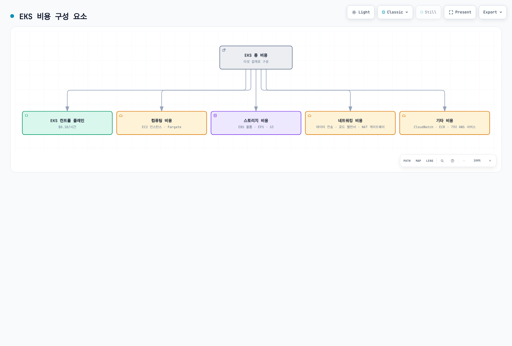
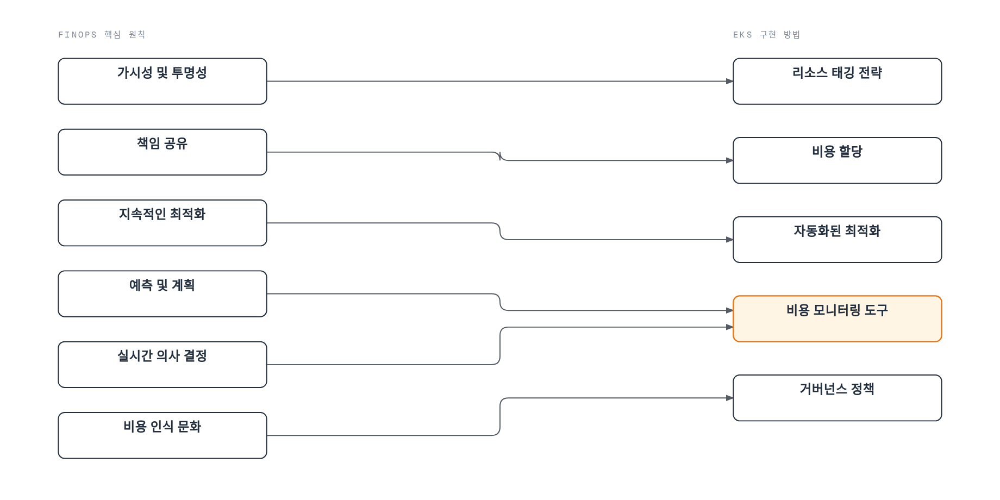
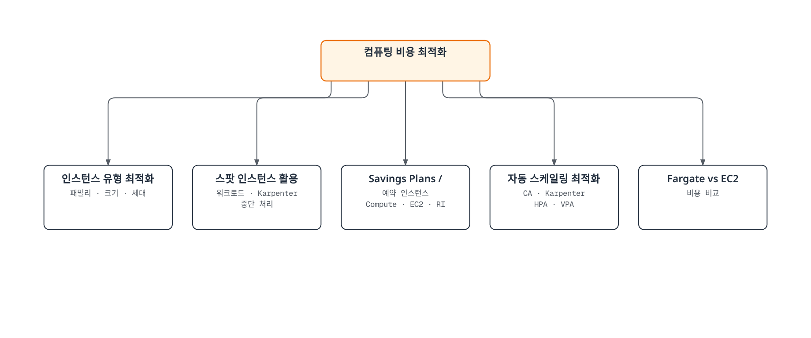
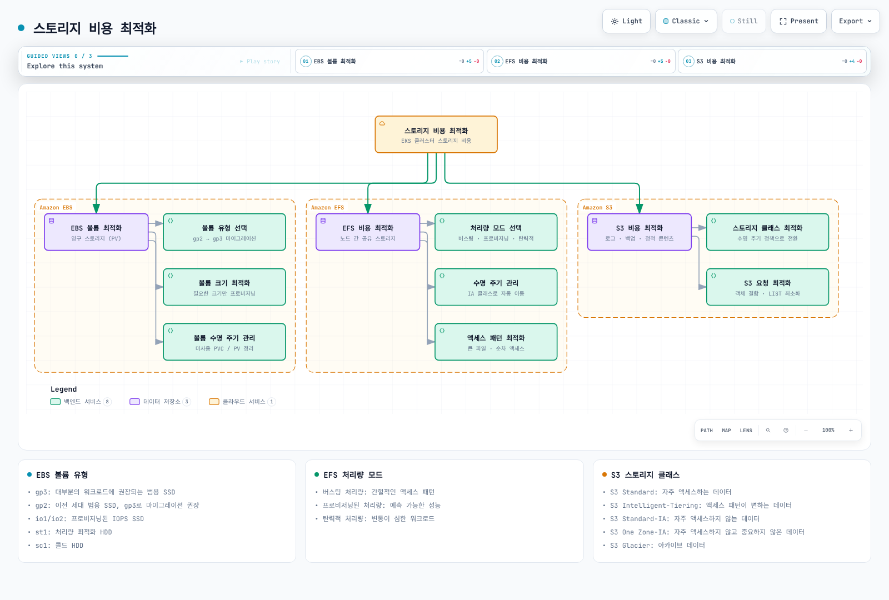
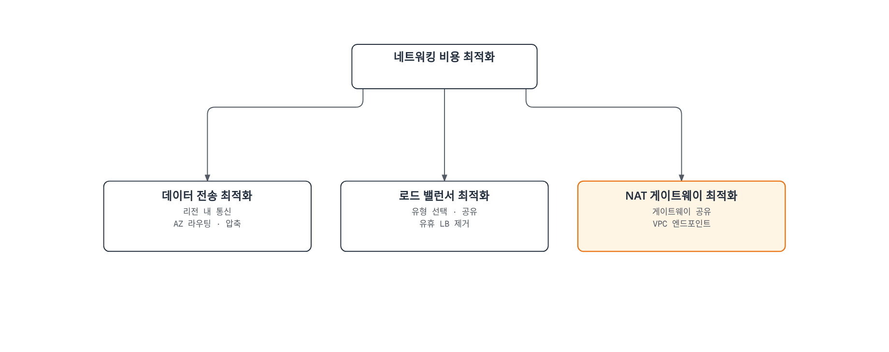
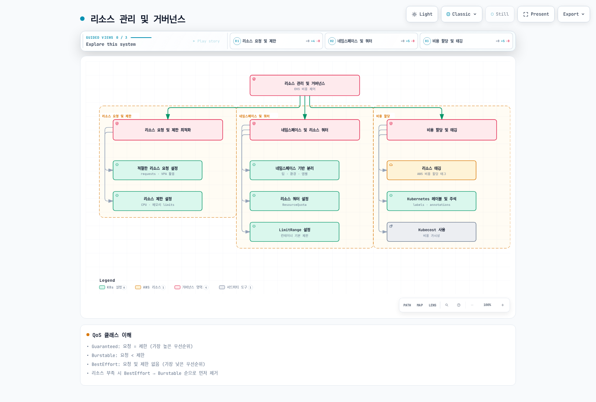
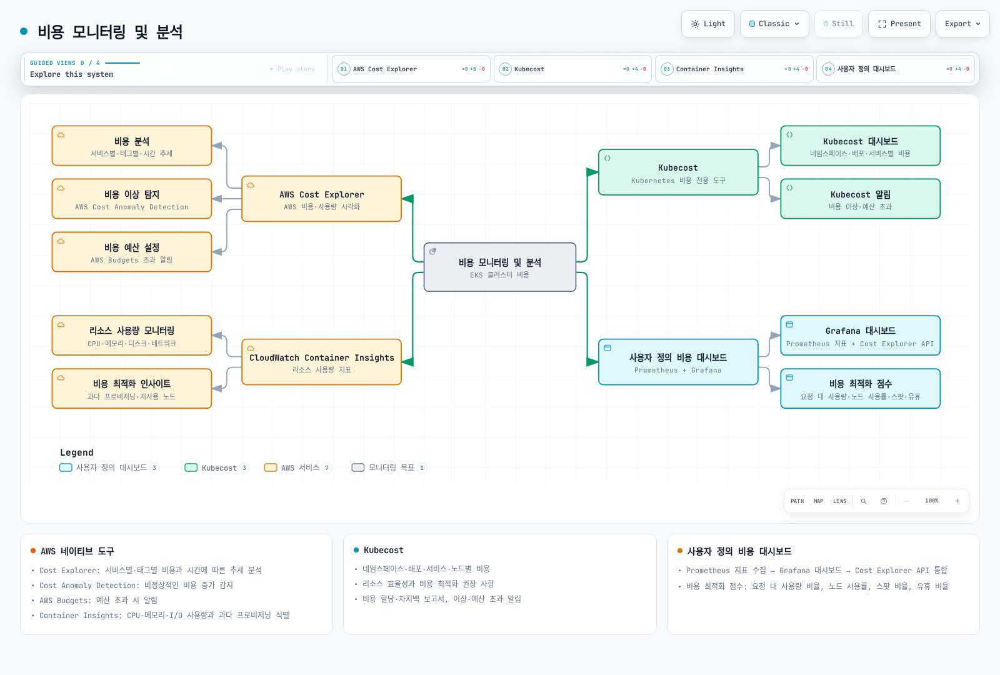
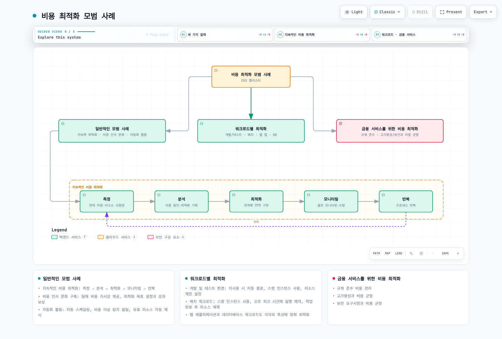

# Amazon EKS 비용 최적화

> **검증 범위**: 현재 AWS 요금·지원 문서 및 Kubernetes 1.36 매니페스트 스키마. 실제 EKS 버전과 애드온은 AWS 지원 카탈로그에서 선택합니다.
> **마지막 업데이트**: 2026년 9월 12일

Amazon EKS(Elastic Kubernetes Service)를 사용하면 컨테이너화된 애플리케이션을 쉽게 배포, 관리 및 확장할 수 있지만, 비용을 효과적으로 관리하는 것이 중요합니다. 이 문서에서는 EKS 클러스터의 비용을 최적화하기 위한 다양한 전략과 모범 사례를 다룹니다.

명령은 구성 예시이며 실제 배포 기록이나 실측 절감 결과가 아닙니다. 적용 전에 계정·리전·기존 리소스 소유자·워크로드 요구·지원 도구 버전을 확인합니다. 아래의 과거 가격 가정은 현재 서비스 동작과 구분합니다.

## 목차

1. [EKS 비용 구성 요소](#eks-비용-구성-요소)
2. [FinOps 원칙과 EKS](#finops-원칙과-eks)
3. [컴퓨팅 비용 최적화](#컴퓨팅-비용-최적화)
4. [스토리지 비용 최적화](#스토리지-비용-최적화)
5. [네트워킹 비용 최적화](#네트워킹-비용-최적화)
6. [리소스 관리 및 거버넌스](#리소스-관리-및-거버넌스)
7. [비용 모니터링 및 분석](#비용-모니터링-및-분석)
8. [비용 최적화 모범 사례](#비용-최적화-모범-사례)

## EKS 비용 구성 요소

Amazon EKS를 사용할 때 발생하는 비용은 다음과 같은 구성 요소로 이루어집니다:



[🔍 인터랙티브 다이어그램 보기](https://www.atomai.click/kubernetes-docs/archmaps/ko-eks-07-eks-cost-optimization-0.html)

## FinOps 원칙과 EKS

FinOps는 기술의 비즈니스 가치를 높이기 위한 운영 프레임워크와 문화적 실천입니다. 엔지니어링·재무·비즈니스 팀이 적시 데이터 기반 의사결정과 재무 책임을 공유하며, 이 장은 그 접근을 EKS에 적용합니다.

### FinOps 프레임워크의 핵심 원칙

FinOps Foundation은 팀 간 협업, 비즈니스 가치 기반 의사결정, 사용량에 대한 책임, 적시에 접근 가능한 정확한 데이터, 중앙 조직의 지원, 클라우드 변동 비용 모델의 활용을 강조합니다. 아래 EKS 실천 방법은 이 원칙을 적용한 것이며 별도의 공식 6대 원칙 체계가 아닙니다.

<!-- Pending parent diagram repair: see /tmp/eks-cost-optimization-audit/diagram-review.json


[🔍 인터랙티브 다이어그램 보기](https://www.atomai.click/kubernetes-docs/archmaps/ko-eks-07-eks-cost-optimization-1.html)
-->

### EKS에 FinOps 적용하기

1. **비용 가시성 확보**
   - Kubernetes 네임스페이스, 레이블, 어노테이션을 사용한 비용 할당
   - AWS Cost Explorer와 Kubecost 같은 도구를 통합하여 세부적인 비용 분석
   - 팀별, 애플리케이션별, 환경별 비용 분석

2. **책임 공유 모델 구현**
   - 팀별 비용 할당 및 보고
   - 비용 최적화 목표 설정 및 추적
   - 비용 절감 인센티브 제공

3. **지속적인 최적화 자동화**
   - 자동 스케일링 정책 구현
   - 스팟 인스턴스 활용 자동화
   - 낭비 후보 감지 및 소유자·보존 요구 검토 후 리소스 제거

4. **비용 예측 및 계획**
   - 워크로드 패턴 분석을 통한 비용 예측
   - 예약 인스턴스 및 Savings Plans 활용
   - 비용 이상 탐지 및 알림

### 최신 FinOps 도구 및 기술

1. **Kubecost**: Kubernetes 비용 모니터링 및 최적화 도구
2. **AWS Cost Anomaly Detection**: 비정상적인 비용 증가 감지
3. **Karpenter**: 효율적인 노드 프로비저닝 및 비용 최적화
4. **Goldilocks**: 리소스 요청 및 제한 최적화
5. **Vertical Pod Autoscaler**: 파드 리소스 요청 자동 조정

### EKS 클러스터 비용

공식 버전 지원 요금은 다음과 같습니다.

- **표준 지원**: 클러스터당 시간당 $0.10.
- **확장 지원**: 클러스터당 **시간당 총 $0.60**($0.10 기본 요금 + $0.50 확장 지원 요금). 별도의 “확장 클러스터”가 $0.10인 것이 아닙니다.

표준 지원은 EKS 버전 출시 후 14개월이며, 이후 확장 지원 12개월이 이어집니다. 정확한 버전별 날짜와 지원 정책은 [EKS 출시 일정](https://docs.aws.amazon.com/eks/latest/userguide/kubernetes-versions.html)에서 확인합니다. Provisioned Control Plane 등급, Auto Mode, Hybrid Nodes, EKS Capabilities에는 별도 요금이 추가될 수 있습니다. EC2/Fargate·스토리지·네트워크·관측 비용도 별개입니다. 개요 그림의 $0.10은 표준 버전 지원만 나타냅니다. [현재 EKS 요금](https://aws.amazon.com/eks/pricing/)을 확인하세요.

### 컴퓨팅 비용

EKS 클러스터에서 실행되는 워커 노드에 대한 비용:

- **EC2 인스턴스**: 노드 그룹에 사용되는 EC2 인스턴스 비용
- **Fargate**: 순간 사용률이 아닌 프로비저닝된 Pod vCPU/메모리 구성과 시간에 대한 요금 및 해당 스토리지 요금

### 스토리지 비용

EKS 클러스터에서 사용하는 스토리지에 대한 비용:

- **EBS 볼륨**: 영구 볼륨에 사용되는 EBS 볼륨 비용
- **EFS**: 공유 파일 시스템에 사용되는 EFS 비용
- **S3**: 객체 스토리지에 사용되는 S3 비용

### 네트워킹 비용

EKS 클러스터의 네트워킹과 관련된 비용:

- **데이터 전송**: 가용 영역 간·리전 간·인터넷 전송 중 과금 대상 경로의 비용. 방향과 서비스 경로에 따라 다릅니다.
- **로드 밸런서**: 서비스에 사용되는 로드 밸런서 비용
- **NAT 게이트웨이**: 프라이빗 서브넷의 아웃바운드 트래픽을 위한 NAT 게이트웨이 비용

### 기타 비용

- **CloudWatch**: 모니터링 및 로깅에 사용되는 CloudWatch 비용
- **ECR**: 컨테이너 이미지 저장에 사용되는 ECR 비용
- **기타 AWS 서비스**: EKS 클러스터와 함께 사용되는 기타 AWS 서비스 비용

## 컴퓨팅 비용 최적화

컴퓨팅 비용은 일반적으로 EKS 클러스터의 가장 큰 비용 구성 요소입니다. 다음과 같은 전략을 사용하여 컴퓨팅 비용을 최적화할 수 있습니다.



[🔍 인터랙티브 다이어그램 보기](https://www.atomai.click/kubernetes-docs/archmaps/ko-eks-07-eks-cost-optimization-2.html)

### 적절한 인스턴스 유형 선택

워크로드에 적합한 인스턴스 유형을 선택하는 것이 중요합니다:

#### 인스턴스 패밀리 선택

워크로드 특성에 따라 선택합니다. 아래 패밀리는 기존 세대의 예시이며 최신 세대 권장이 아닙니다. 리전 가용성, CPU 아키텍처, AMI, 가격을 확인하세요.

- **범용(T3, M5, M6)**: 균형 잡힌 컴퓨팅, 메모리 및 네트워킹 리소스가 필요한 워크로드
- **컴퓨팅 최적화(C5, C6)**: 고성능 프로세서가 필요한 컴퓨팅 집약적 워크로드
- **메모리 최적화(R5, R6, X1)**: 대규모 인메모리 데이터베이스, 캐시 등 메모리 집약적 워크로드
- **스토리지 최적화(I3, D2)**: 높은 디스크 I/O가 필요한 워크로드
- **가속 컴퓨팅(P3, G4, Inf1)**: GPU 또는 기계 학습 가속기가 필요한 워크로드

#### 인스턴스 크기 최적화

워크로드 요구사항에 맞는 적절한 인스턴스 크기를 선택합니다:

- 너무 큰 인스턴스는 리소스 낭비로 이어질 수 있습니다.
- 너무 작은 인스턴스는 성능 문제를 일으킬 수 있습니다.
- CloudWatch Container Insights 또는 Kubernetes 지표를 사용하여 실제 리소스 사용량을 모니터링하고 적절한 크기를 선택합니다.

#### 인스턴스 세대 고려

자체 워크로드 측정과 리전 가격으로 새 세대를 비교합니다. 다음은 과거 세대 전환 예시이며, x86(`i`)에서 Graviton(`g`)으로 옮길 때는 arm64 이미지와 의존성 호환성도 필요합니다:

- M5 대신 M6i 또는 M6g 사용
- C5 대신 C6i 또는 C6g 사용
- R5 대신 R6i 또는 R6g 사용

### 스팟 인스턴스 활용

AWS는 Spot의 온디맨드 대비 최대 90% 할인을 안내하지만 실제 가격·가용 용량·중단 가능성은 달라집니다. 상태 비저장이라는 이유만으로 중단을 허용할 수 있다고 판단하지 않습니다:

#### 스팟 인스턴스에 적합한 워크로드

- **스테이트리스 애플리케이션**: 상태를 저장하지 않는 애플리케이션
- **내결함성 애플리케이션**: 인스턴스 중단을 처리할 수 있는 애플리케이션
- **배치 처리 작업**: 중단되어도 다시 시작할 수 있는 작업
- **CI/CD 파이프라인**: 빌드 및 테스트 작업

#### 관리형 노드 그룹에서 스팟 인스턴스 사용

기존 클러스터에 관리형 노드 그룹을 생성하며 Cluster Autoscaler를 설치하는 명령은 아닙니다. 소유 구성에서 프라이빗 서브넷·IAM 역할·AMI·인스턴스 다양성을 검토합니다. 광범위한 노드 역할 애드온 권한 대신 컨트롤러 소유자를 통해 스케일링/IAM을 구성합니다.

```bash
eksctl create nodegroup \
  --cluster my-cluster \
  --name my-spot-ng \
  --managed \
  --node-type m5.large \
  --nodes-min 2 \
  --nodes-max 5 \
  --spot
```

#### Karpenter를 사용한 스팟 인스턴스 프로비저닝

Karpenter/CRD 설치, 범위가 제한된 컨트롤러 IAM, 승인된 노드 역할, 검색 태그가 있는 서브넷/보안 그룹, 중단 처리 큐가 필요합니다. 현재 호환성 표에서 EKS 1.36은 Karpenter >=1.13이 필요합니다. 다음 리소스가 컨트롤러를 설치하지는 않습니다. 인스턴스 목록과 limits는 예시이며 금액 상한이 아닙니다. `al2023@latest`는 변하는 선택자로 drift/교체를 유발할 수 있으므로 실제 해석된 AMI를 확인하고 운영 변경에서는 검증한 별칭 버전 또는 AMI ID를 고정합니다.

```yaml
apiVersion: karpenter.sh/v1
kind: NodePool
metadata:
  name: spot
spec:
  template:
    spec:
      requirements:
      - key: karpenter.sh/capacity-type
        operator: In
        values: ["spot"]
      - key: kubernetes.io/arch
        operator: In
        values: ["amd64"]
      - key: node.kubernetes.io/instance-type
        operator: In
        values: ["m5.large", "m5.xlarge", "m5.2xlarge"]
      nodeClassRef:
        group: karpenter.k8s.aws
        kind: EC2NodeClass
        name: spot-class
  limits:
    cpu: 1000
    memory: 1000Gi
  disruption:
    consolidationPolicy: WhenEmpty
    consolidateAfter: 30s
---
apiVersion: karpenter.k8s.aws/v1
kind: EC2NodeClass
metadata:
  name: spot-class
spec:
  role: KarpenterNodeRole-my-cluster
  amiSelectorTerms:
    - alias: al2023@latest
  subnetSelectorTerms:
    - tags:
        karpenter.sh/discovery: my-cluster
  securityGroupSelectorTerms:
    - tags:
        karpenter.sh/discovery: my-cluster
```

#### 스팟 인스턴스 중단 처리

스팟 인스턴스 중단 처리를 위한 모범 사례:

1. **여러 인스턴스 유형 사용**: 다양한 인스턴스 유형을 사용하여 중단 위험 분산
2. **여러 가용 영역 사용**: 여러 가용 영역에 걸쳐 인스턴스 배포
3. **노드 집합별 중단 처리 소유자 하나 선택**: 관리형 노드 그룹은 Spot 중단/리밸런싱을 이미 처리합니다. Karpenter 노드는 기본 중단 처리 큐를 구성하고 같은 노드에 Node Termination Handler를 중복 설치하지 않습니다. 자체 관리 ASG는 [AWS Node Termination Handler](https://github.com/aws/aws-node-termination-handler)의 IMDS 또는 큐 모드를 명시적으로 선택하고 해당 권한/이벤트 연결을 구성할 수 있습니다.
4. **애플리케이션 복구 설계**: 대체 용량은 보장되지 않습니다. 정상 종료, 재시도/체크포인트, 장애 영역별 복제본을 중단 허용 시간에 맞춰 설계합니다. PDB로 EC2의 Spot 회수를 막을 수는 없습니다.

### Savings Plans 및 예약 인스턴스

예측 가능한 워크로드의 경우 Savings Plans 또는 예약 인스턴스를 사용하여 비용을 절감할 수 있습니다:

#### Compute Savings Plans

Compute Savings Plans는 1년 또는 3년 약정으로 온디맨드 요금보다 최대 66% 할인된 가격을 제공합니다:

- **유연성**: 인스턴스 패밀리, 크기, OS, 테넌시 및 리전에 관계없이 적용
- **EC2, Fargate 및 Lambda 포함**: 여러 컴퓨팅 서비스에 걸쳐 적용

#### EC2 Instance Savings Plans

EC2 Instance Savings Plans는 특정 리전의 인스턴스 패밀리에 대해 최대 72% 할인을 제공합니다:

- **중간 수준의 유연성**: 특정 리전 내에서 인스턴스 패밀리 내의 크기 및 OS에 걸쳐 적용
- **더 높은 할인율**: Compute Savings Plans보다 더 높은 할인율 제공

#### 예약 인스턴스

AWS가 현재 안내하는 RI 할인은 최대 **72%**입니다. Standard/Convertible RI의 변경·교환 규칙과 Regional/Zonal 범위는 다릅니다. Zonal RI는 해당 AZ의 용량 예약을 포함하지만 Regional RI는 포함하지 않습니다. RI는 일치하는 사용량에 적용되는 청구 혜택이며 Kubernetes 스케줄러나 최고 할인 보장이 아닙니다.

Savings Plans는 1년 또는 3년 동안 시간당 적격 지출을 약정하고, RI는 적격 인스턴스 사용을 약정합니다. 적정 크기 조정 후 안정적인 기준 사용량에 맞춰 약정하고 미사용 약정 위험을 검토합니다. Spot 사용에 추가 할인을 중첩하지 않으며, 광고된 최대 할인율은 이 클러스터의 실측 절감률이 아닙니다.

### Fargate vs EC2 비용 비교

Fargate와 EC2 중에서 선택할 때 비용을 고려해야 합니다:

#### Fargate 장점

- **운영 오버헤드 감소**: 노드 관리 불필요
- **정확한 리소스 프로비저닝**: 파드 수준에서 리소스 할당
- **별도로 관리하는 유휴 워커 노드 없음**: 다만 Pod에 프로비저닝된 용량·시간과 반올림·최소 과금 기준에 따라 비용이 발생

#### EC2 장점

- **대규모 워크로드에 더 비용 효율적**: 높은 리소스 사용률의 경우
- **더 많은 인스턴스 유형 옵션**: 다양한 워크로드에 맞는 인스턴스 유형 선택 가능
- **스팟 인스턴스 지원**: 스팟 인스턴스를 사용하여 추가 비용 절감 가능

#### 비용 비교 예시

**과거 설명용 가정(가격 출처/리전 기록 없음, 현재 견적·벤치마크 아님)**: 2 vCPU와 4 GB 메모리를 요청하는 애플리케이션. 원 단가와 산술 계산은 아래에 보존하지만 EKS 예약량과 노드 오버헤드가 빠져 있습니다.

**Fargate 비용**:
- vCPU: $0.04048 per vCPU-hour × 2 = $0.08096 per hour
- 메모리: $0.004445 per GB-hour × 4 = $0.01778 per hour
- 총 비용: $0.09874 per hour

**EC2 비용(t3.medium)**:
- 온디맨드: $0.0416 per hour
- 스팟: ~$0.0125 per hour (70% 할인 가정)

**용량 산정 수정:** EKS Fargate는 Kubernetes 구성 요소용 256 MB를 추가하고 지원 구성으로 올림합니다. 위 가정의 2 vCPU/4 GB 요청에는 **2 vCPU/5 GB** 프로비저닝이 필요합니다. 같은 과거 단가를 쓰면 `2 × 0.04048 + 5 × 0.004445 = 0.103185 USD/hour`이며 새 견적이 아닌 산술 계산입니다. Linux Fargate 과금은 이미지 다운로드부터 시작하며 최소 1분입니다. EC2 `t3.medium`의 명목 용량은 2 vCPU/4 GiB이지만 OS/Kubernetes/DaemonSet 예약 후 allocatable은 더 작아 해당 Pod가 들어간다고 가정할 수 없습니다. 지속 CPU 사용에는 T3 크레딧 요금도 발생할 수 있습니다. 실제 스케줄링 가능한 용량 계획에서 EBS·네트워크·클러스터 요금·활용도·운영 비용을 함께 비교해야 하며, 이 표로 동등 서비스의 우열을 결정할 수 없습니다.

### 자동 스케일링 최적화

효과적인 자동 스케일링 전략을 구현하여 비용을 최적화할 수 있습니다:

#### Cluster Autoscaler

Cluster Autoscaler는 스케줄되지 못한 Pod를 위해 ASG를 확장하고, 단순 CPU 실측 저하가 아닌 requests 및 재배치/disruption 조건을 검토해 노드를 줄입니다. Kubernetes 마이너 버전을 클러스터와 맞추고 실제 ASG에 검색 태그를 구성하며 전용 워크로드 IAM 역할을 사용합니다. EKS/노드 그룹 태그가 모든 하위 리소스에 자동 전파되지는 않습니다. [업스트림 AWS 설정](https://github.com/kubernetes/autoscaler/tree/master/cluster-autoscaler/cloudprovider/aws)과 [EKS 권고](https://docs.aws.amazon.com/eks/latest/best-practices/cas.html)에 따라 소유 릴리스를 준비합니다.

다음 chart values는 CLI 인수가 됩니다. 임의의 `CLUSTER_AUTOSCALER_*` 환경 변수로는 설정되지 않으며, 수정하지 않은 `master` 예제 적용만으로 클러스터별 IAM/검색 설정이 완성되지 않습니다. 아래 시간은 조정 예시이며 짧게 줄이면 반복 확장/축소가 늘 수 있습니다.

```yaml
# Values fragment for the upstream cluster-autoscaler Helm chart.
# Merge into the existing release's reviewed values, including workload IAM.
autoDiscovery:
  clusterName: my-cluster
awsRegion: us-west-2
extraArgs:
  expander: least-waste
  scale-down-delay-after-add: 10m
  scale-down-unneeded-time: 10m
  max-node-provision-time: 15m
```

#### Karpenter

Karpenter는 고정 ASG 크기를 바꾸는 대신 NodePool/EC2NodeClass 제약에 따라 프로비저닝합니다. 지연과 비용은 워크로드·가용 용량에 따라 달라지며 앞의 컨트롤러/IAM/AMI 전제 조건이 여기에도 적용됩니다. Cluster Autoscaler가 관리하는 ASG와 노드 소유 범위를 분리합니다:

```yaml
apiVersion: karpenter.sh/v1
kind: NodePool
metadata:
  name: default
spec:
  template:
    spec:
      requirements:
      - key: kubernetes.io/arch
        operator: In
        values: ["amd64"]
      - key: node.kubernetes.io/instance-type
        operator: In
        values: ["m5.large", "m5.xlarge", "m5.2xlarge"]
      nodeClassRef:
        group: karpenter.k8s.aws
        kind: EC2NodeClass
        name: default-class
  limits:
    cpu: 1000
    memory: 1000Gi
  disruption:
    consolidationPolicy: WhenEmpty
    consolidateAfter: 30s
---
apiVersion: karpenter.k8s.aws/v1
kind: EC2NodeClass
metadata:
  name: default-class
spec:
  role: KarpenterNodeRole-my-cluster
  amiSelectorTerms:
    - alias: al2023@latest
  subnetSelectorTerms:
    - tags:
        karpenter.sh/discovery: my-cluster
  securityGroupSelectorTerms:
    - tags:
        karpenter.sh/discovery: my-cluster
```

Karpenter 비용 최적화 설정:

- **disruption.consolidateAfter**: Pod 추가/제거 후 통합 검토까지의 지연으로, 실제 동작은 정책과 disruption 검사에 따름 (예: `30s`, 기존 `ttlSecondsAfterEmpty`를 대체)
- **disruption.consolidationPolicy**: 노드 통합 정책 — `WhenEmpty`(빈 노드만 정리) 또는 `WhenEmptyOrUnderutilized`(저사용 노드까지 통합, 기존 `consolidation.enabled: true`에 해당)
- **template.spec.requirements** (`node.kubernetes.io/instance-type`): 비용 효율적인 인스턴스 유형 지정

#### Horizontal Pod Autoscaler (HPA)

HPA는 CPU 사용률 또는 사용자 정의 지표를 기반으로 파드 수를 자동으로 조정합니다:

```yaml
apiVersion: autoscaling/v2
kind: HorizontalPodAutoscaler
metadata:
  name: app-hpa
spec:
  scaleTargetRef:
    apiVersion: apps/v1
    kind: Deployment
    name: app
  minReplicas: 2
  maxReplicas: 10
  metrics:
  - type: Resource
    resource:
      name: cpu
      target:
        type: Utilization
        averageUtilization: 70
  - type: Resource
    resource:
      name: memory
      target:
        type: Utilization
        averageUtilization: 80
```

CPU/메모리 utilization 목표는 requests 대비 백분율이며 resource metrics API와 대상 컨테이너의 requests가 필요합니다. 여러 메트릭 중 가장 큰 희망 복제본 수를 선택하고, 메트릭 누락은 축소를 막을 수 있습니다. 복제본을 늘려도 메모리가 줄지 않을 수 있어 애플리케이션 동작을 검증해야 합니다. EKS의 controller-manager 플래그는 AWS가 관리하므로 전역 플래그 수정 대신 HPA별 `spec.behavior.scaleDown.stabilizationWindowSeconds`를 설정합니다. HPA가 CPU/메모리 requests를 분모로 사용할 때 VPA로 같은 requests를 동시에 자동 변경하지 않습니다.

#### Vertical Pod Autoscaler (VPA)

VPA는 파드의 CPU 및 메모리 요청을 자동으로 조정하여 리소스 사용률을 최적화합니다:

```yaml
apiVersion: autoscaling.k8s.io/v1
kind: VerticalPodAutoscaler
metadata:
  name: app-vpa
spec:
  targetRef:
    apiVersion: apps/v1
    kind: Deployment
    name: app
  updatePolicy:
    updateMode: "Off"
  resourcePolicy:
    containerPolicies:
    - containerName: '*'
      minAllowed:
        cpu: 50m
        memory: 100Mi
      maxAllowed:
        cpu: 1
        memory: 1Gi
```

여기서는 위 HPA와 충돌하지 않도록 자동 변경 없는 **Off** 모드로 권고를 수집합니다. 먼저 VPA 구성 요소/CRD와 메트릭 의존성을 설치해야 합니다.

- **Off**: 권고만 제공.
- **Initial**: 새 Pod 생성 시 admission에서 requests 설정.
- **Recreate**: updater가 eviction 정책/PDB에 따라 Pod를 축출하고 컨트롤러가 권고 리소스로 재생성할 수 있음.
- **Auto**: Recreate의 deprecated 별칭이므로 새 구성은 명시적 모드를 선택.
- In-place 모드는 호환 VPA/Kubernetes 릴리스와 문서화된 feature gate가 필요합니다. 선택한 모드의 동작을 확인하세요. `InPlaceOrRecreate`는 eviction으로 fallback할 수 있지만 `InPlace`는 그런 재생성 fallback을 사용하지 않습니다. 자동 변경 전 상·하한, disruption, 피크 수요를 검토합니다.

## 스토리지 비용 최적화

스토리지는 EKS 클러스터의 중요한 비용 구성 요소입니다. 다음과 같은 전략을 사용하여 스토리지 비용을 최적화할 수 있습니다.



[🔍 인터랙티브 다이어그램 보기](https://www.atomai.click/kubernetes-docs/archmaps/ko-eks-07-eks-cost-optimization-3.html)

### EBS 볼륨 최적화

EBS 볼륨은 EKS 클러스터의 영구 스토리지에 주로 사용됩니다:

#### 적절한 볼륨 유형 선택

워크로드에 적합한 EBS 볼륨 유형을 선택합니다:

- **gp3**: 대부분의 워크로드에 권장되는 범용 SSD
- **gp2**: 이전 세대 범용 SSD, gp3로 마이그레이션 권장
- **io1/io2**: 고성능 워크로드를 위한 프로비저닝된 IOPS SSD
- **st1**: 처리량 집약적 워크로드를 위한 처리량 최적화 HDD
- **sc1**: 자주 액세스하지 않는 데이터를 위한 콜드 HDD

gp3는 용량·IOPS·처리량 요금을 분리하며, 기본 3,000 IOPS가 모든 gp2 볼륨보다 높은 것은 아닙니다. 아래 한도는 일반 AWS 리전 볼륨 기준으로 용량/IOPS 비율과 인스턴스 한도에 따릅니다. Outposts 한도는 다릅니다. $0.08/$0.10 스토리지 단가는 리전/기준일 기록이 없는 설명용 가정으로 보존하며, 추가 IOPS/처리량을 포함한 현재 견적을 확인해야 합니다.

| 볼륨 유형 | 기본 IOPS | 최대 IOPS | 기본 처리량 | 최대 처리량 | GB당 가격 |
|----------|----------|----------|------------|------------|---------|
| gp3 | 3,000 | 80,000 | 125 MiB/s | 2,000 MiB/s | $0.08/GB-월 (설명용) |
| gp2 | 3 IOPS/GiB, 최소 100; 해당 소형 볼륨은 버스트 가능 | 16,000 | 용량/I/O에 따라 다름 | 250 MiB/s | $0.10/GB-월 (설명용) |

#### gp3로 마이그레이션

이 클래스는 표준 EBS CSI 드라이버(`ebs.csi.aws.com`)로 새 gp3 볼륨을 생성하며 기존 볼륨을 마이그레이션하거나 클러스터 기본 클래스를 바꾸지 않습니다. Auto Mode는 다른 provisioner(`ebs.csi.eks.amazonaws.com`)와 그에 맞는 노드/스토리지 전환 절차를 사용합니다. 드라이버·IAM/KMS·기존 클래스 소유권·토폴로지를 확인하세요. `Retain`은 해제된 스토리지를 소유자 검토용으로 남겨 요금이 계속 발생할 수 있습니다:

```yaml
apiVersion: storage.k8s.io/v1
kind: StorageClass
metadata:
  name: gp3
provisioner: ebs.csi.aws.com
parameters:
  type: gp3
  encrypted: "true"
volumeBindingMode: WaitForFirstConsumer
reclaimPolicy: Retain
allowVolumeExpansion: true
```

기존 PVC를 gp3로 마이그레이션:

1. 설치된 CSI snapshot 구성 요소로 애플리케이션 일관성 백업/스냅샷을 만들고 준비 상태와 복원 권한을 확인합니다.
2. gp3 클래스로 **새** PVC를 복원합니다. 바인딩된 PVC의 StorageClass를 제자리에서 바꾸는 방식이 아닙니다.
3. 복원 검증 후 계획된 전환에서 워크로드를 옮기고, 복구가 확인될 때까지 원본을 보존합니다.

지원 구성에서는 EBS Elastic Volumes의 볼륨 유형 변경도 대안입니다. CSI/IaC 소유자와 조율하여 구성 drift를 피합니다. [스토리지 가이드](04-eks-storage-part1.md)를 참고하세요.

#### 볼륨 크기 최적화

필요한 크기의 볼륨만 프로비저닝합니다:

- 과도하게 프로비저닝된 볼륨은 불필요한 비용을 발생시킵니다.
- 파일 시스템 사용량을 관측하고 지원 볼륨을 확장합니다. EBS 볼륨과 Kubernetes PVC는 제자리 축소가 불가능하며, 용량을 줄이려면 더 작은 새 볼륨과 애플리케이션을 고려한 데이터 이전이 필요합니다.
- `allowVolumeExpansion`은 지원되는 확장 요청을 허용할 뿐 사용량 감시나 자동 크기 조정을 수행하지 않습니다. 자동 확장에는 별도 컨트롤러·상한·실패 처리가 필요합니다.

#### 볼륨 수명 주기 관리

불필요한 볼륨을 식별하고 제거합니다:

- 사용되지 않는 PVC 및 PV 정기적으로 검토
- Pod 종료만으로 PVC/PV를 삭제 대상으로 보지 않습니다. claim/볼륨 삭제 전 StatefulSet 보존 정책, 대기 소비자, 백업, 소유권을 확인합니다.
- 적절한 PV 재확보 정책 설정(Delete 또는 Retain)

### EFS 비용 최적화

EFS는 여러 노드에서 공유 액세스가 필요한 워크로드에 유용합니다:

#### 적절한 처리량 모드 선택

워크로드에 적합한 EFS 처리량 모드를 선택합니다:

- **버스팅 처리량**: 간헐적인 액세스 패턴에 적합
- **프로비저닝된 처리량**: 예측 가능한 성능이 필요한 워크로드에 적합
- **탄력적 처리량**: 변동이 심한 워크로드에 적합

#### 수명 주기 관리

EFS lifecycle policy는 대상 파일을 IA/Archive로 옮기고 선택적으로 접근 시 기본 스토리지로 되돌릴 수 있습니다. 접근 요금, 최소 과금 크기/기간, 처리량 모드, 접근 패턴에 따라 절감 효과가 달라집니다. 다음은 검토할 기존 정책 배열을 내보내는 예시입니다. 그 배열에서 IA 규칙을 수정하되 필요한 Archive/기본 스토리지 복귀 항목을 보존한 뒤 원하는 전체 구성을 제출합니다:

```bash
aws efs describe-lifecycle-configuration \
  --file-system-id fs-1234567890abcdef0 \
  --query LifecyclePolicies --output json > efs-lifecycle-policies.json
# Edit the exported array; an IA rule is {"TransitionToIA":"AFTER_30_DAYS"}.
# Preserve required Archive/return-to-primary rules and review the complete array.
aws efs put-lifecycle-configuration \
  --file-system-id fs-1234567890abcdef0 \
  --lifecycle-policies file://efs-lifecycle-policies.json
```

#### 액세스 패턴 최적화

EFS 액세스 패턴을 최적화하여 비용을 절감합니다:

- 작은 파일보다 큰 파일 사용
- 메타데이터 작업 최소화
- 순차적 액세스 패턴 사용

### S3 비용 최적화

S3는 로그, 백업, 정적 콘텐츠 등을 저장하는 데 비용 효율적인 옵션입니다:

#### 스토리지 클래스 최적화

워크로드에 적합한 S3 스토리지 클래스를 선택합니다:

- **S3 Standard**: 자주 액세스하는 데이터
- **S3 Intelligent-Tiering**: 액세스 패턴이 변하는 데이터
- **S3 Standard-IA**: 자주 액세스하지 않는 데이터
- **S3 One Zone-IA**: 자주 액세스하지 않고 중요하지 않은 데이터
- **S3 Glacier**: 아카이브 데이터

#### 수명 주기 정책

이 설명용 규칙은 현재 객체를 30/90일에 전환하고 365일에 만료시킵니다. 복구 지연, 보존/Object Lock 요구, 전환/요청 요금, 최소 보관 기간을 확인하세요. 신규/수정 구성은 기본적으로 128 KB 미만 객체를 전환에서 제외합니다. 버전 관리 버킷은 noncurrent version을 별도로 관리해야 하며, 현재 버전 만료가 delete marker만 만들고 과거 데이터는 계속 과금될 수 있습니다. put-bucket-lifecycle-configuration은 버킷 lifecycle 전체를 교체하므로 관련 없는 규칙을 병합·보존합니다:

```json
{
  "Rules": [
    {
      "ID": "Move to IA after 30 days, Glacier after 90 days",
      "Status": "Enabled",
      "Filter": {"Prefix": "logs/"},
      "Transitions": [
        {
          "Days": 30,
          "StorageClass": "STANDARD_IA"
        },
        {
          "Days": 90,
          "StorageClass": "GLACIER"
        }
      ],
      "Expiration": {
        "Days": 365
      }
    }
  ]
}
```

#### S3 요청 최적화

S3 요청 비용을 최적화합니다:

- 작은 객체를 더 큰 객체로 결합
- 불필요한 LIST 작업 최소화
- 멀티파트 업로드는 전송/재시도에 도움이 되지만 요청 및 미완료 파트 보관 요금이 발생하므로 중단된 업로드 정리를 구성합니다. Transfer Acceleration은 추가 요금이 발생할 수 있는 지연/처리량 옵션이며 요청 비용을 자동으로 줄이지 않습니다.

## 네트워킹 비용 최적화

네트워킹 비용은 특히 대규모 데이터 전송이 있는 경우 상당할 수 있습니다. 다음과 같은 전략을 사용하여 네트워킹 비용을 최적화할 수 있습니다.

<!-- Pending parent diagram repair: see /tmp/eks-cost-optimization-audit/diagram-review.json


[🔍 인터랙티브 다이어그램 보기](https://www.atomai.click/kubernetes-docs/archmaps/ko-eks-07-eks-cost-optimization-4.html)
-->

### 데이터 전송 최적화

#### 리전 내 통신 활용

가능한 한 동일한 리전 내에서 통신하여 리전 간 데이터 전송 비용을 줄입니다:

- EKS 클러스터와 관련 AWS 서비스를 동일한 리전에 배치
- 여러 리전에 걸쳐 있는 경우 리전 간 데이터 전송 최소화

#### 가용 영역 인식 라우팅

가용 영역 간 데이터 전송 비용을 줄이기 위해 가용 영역 인식 라우팅을 구현합니다:

- 토폴로지 인식 서비스 라우팅 사용
- 다중 AZ 가용성을 유지하면서 지원되는 로컬 엔드포인트를 선호합니다. `trafficDistribution: PreferSameZone`은 Kubernetes 1.35+에서 stable이며 클러스터/프록시 구현을 확인해야 합니다. 로컬 엔드포인트가 없을 때 fallback하는 선호 설정으로 AZ 간 트래픽 0을 보장하지 않습니다. 배치 affinity만으로 Service 트래픽이 라우팅되지는 않습니다.

```yaml
apiVersion: v1
kind: Service
metadata:
  name: my-service
spec:
  trafficDistribution: PreferSameZone
  selector:
    app: my-app
  ports:
  - port: 80
    targetPort: 8080
  type: ClusterIP
```

#### 압축 사용

데이터 전송 전에 압축을 사용하여 전송되는 데이터 양을 줄입니다:

- API 응답 압축
- 로그 및 지표 압축
- 이미지 및 정적 자산 최적화

### 로드 밸런서 최적화

#### 적절한 로드 밸런서 유형 선택

워크로드에 적합한 로드 밸런서 유형을 선택합니다:

- **Network Load Balancer(NLB)**: TCP/UDP 트래픽, 낮은 지연 시간이 필요한 경우
- **Application Load Balancer(ALB)**: HTTP/HTTPS 트래픽, 경로 기반 라우팅이 필요한 경우
- **Classic Load Balancer(CLB)**: 레거시 워크로드

#### 로드 밸런서 공유

여러 서비스에서 로드 밸런서를 공유하여 비용을 절감합니다:

- AWS Load Balancer Controller 사용
- 인그레스 리소스를 사용하여 여러 서비스 노출

표준 AWS Load Balancer Controller는 [네트워킹 가이드](03-eks-networking-part1.md)에 따라 chart·IAM/service account·서브넷·보안 그룹을 구성하고 기존 컨트롤러 소유자를 재사용합니다. Auto Mode의 기본 통합은 다르므로 이 설치/클래스 설정을 그대로 적용하지 않습니다. 아래 두 backend Service는 Ingress와 같은 namespace에 있고 80번 포트를 노출해야 합니다. IP target 모드는 도달 가능한 Pod IP가 필요합니다. HTTP 라우팅 예시이므로 인터넷 운영 환경에는 검토한 TLS·DNS·접근 제어도 필요합니다.

```yaml
apiVersion: networking.k8s.io/v1
kind: Ingress
metadata:
  name: shared-ingress
  annotations:
    alb.ingress.kubernetes.io/scheme: internet-facing
    alb.ingress.kubernetes.io/target-type: ip
spec:
  ingressClassName: alb
  rules:
  - host: service1.example.com
    http:
      paths:
      - path: /
        pathType: Prefix
        backend:
          service:
            name: service1
            port:
              number: 80
  - host: service2.example.com
    http:
      paths:
      - path: /
        pathType: Prefix
        backend:
          service:
            name: service2
            port:
              number: 80
```

#### 유휴 로드 밸런서 제거

사용되지 않는 로드 밸런서를 식별하고 제거합니다:

- 트래픽이 없는 로드 밸런서 모니터링
- 테스트 또는 개발 환경의 불필요한 로드 밸런서 제거

### NAT 게이트웨이 최적화

NAT 게이트웨이는 시간당 요금과 데이터 처리 요금이 부과됩니다:

#### NAT 게이트웨이 공유

여러 서브넷에서 NAT 게이트웨이를 공유하여 비용을 절감합니다:

- Zonal NAT gateway는 같은 AZ의 프라이빗 서브넷이 공유할 수 있습니다. AZ별 가용성과 고정 시간 요금을 함께 평가합니다.
- 하나의 zonal gateway를 여러 AZ에서 공유하면 AZ 간 의존성과 전송 요금이 추가될 수 있어 항상 저렴한 고가용성 설계가 아닙니다. 현재 regional NAT 옵션은 해당 가용성/가격 모델로 별도 평가합니다.

#### VPC 엔드포인트 사용

실제 트래픽의 NAT 경로와 endpoint 비용을 비교합니다. S3/DynamoDB gateway endpoint는 추가 endpoint 시간/데이터 처리 요금이 없지만 ECR/Logs/STS 같은 interface endpoint는 별도 요금과 DNS/보안 그룹 구성이 필요합니다. 다음은 검토한 기존 라우팅 테이블에 gateway endpoint를 생성하는 예시이며 적절한 endpoint policy를 적용해야 합니다. ECR 이미지 pull은 일반적으로 `ecr.api`/`ecr.dkr` interface endpoint와 S3 접근이 필요하며 ECR API endpoint 하나로 완성되지 않습니다:

```bash
# S3 VPC 엔드포인트 생성
aws ec2 create-vpc-endpoint \
  --vpc-id vpc-1234567890abcdef0 \
  --service-name com.amazonaws.us-west-2.s3 \
  --route-table-ids rtb-1234567890abcdef0

# DynamoDB VPC 엔드포인트 생성
aws ec2 create-vpc-endpoint \
  --vpc-id vpc-1234567890abcdef0 \
  --service-name com.amazonaws.us-west-2.dynamodb \
  --route-table-ids rtb-1234567890abcdef0
```

일반적으로 사용되는 VPC 엔드포인트:

- S3
- DynamoDB
- ECR
- CloudWatch Logs
- STS

#### 아웃바운드 트래픽 최적화

NAT 게이트웨이를 통과하는 아웃바운드 트래픽을 최적화합니다:

- 불필요한 외부 API 호출 최소화
- 예약은 경합을 줄일 수 있지만 일반 NAT/데이터 전송 요금에 보편적인 오프 피크 할인이 있는 것은 아닙니다. 과금 바이트나 프로비저닝 시간을 줄여야 합니다.
- 데이터 압축 사용

## 리소스 관리 및 거버넌스

효과적인 리소스 관리 및 거버넌스는 EKS 클러스터의 비용을 제어하는 데 중요합니다. 다음과 같은 전략을 사용하여 리소스를 효과적으로 관리할 수 있습니다.



[🔍 인터랙티브 다이어그램 보기](https://www.atomai.click/kubernetes-docs/archmaps/ko-eks-07-eks-cost-optimization-5.html)

### 리소스 요청 및 제한 최적화

#### 적절한 리소스 요청 설정

애플리케이션의 실제 리소스 요구사항에 맞는 리소스 요청을 설정합니다:

- 너무 높은 요청은 리소스 낭비로 이어집니다.
- 너무 낮은 요청은 성능 문제를 일으킬 수 있습니다.
- VPA(Vertical Pod Autoscaler)를 사용하여 리소스 요청 최적화

```yaml
apiVersion: v1
kind: Pod
metadata:
  name: app
spec:
  containers:
  - name: app
    image: app:latest
    resources:
      requests:
        cpu: 100m
        memory: 256Mi
      limits:
        cpu: 500m
        memory: 512Mi
```

#### 리소스 제한 설정

리소스 제한을 설정하여 컨테이너가 과도한 리소스를 사용하지 않도록 합니다:

- CPU limit은 보통 throttling으로 적용되며 너무 낮으면 노드에 여유 CPU가 있어도 지연이 늘 수 있습니다.
- 메모리 limit은 사후적으로 강제되어 OOM 종료를 일으킬 수 있으며 사용량이 순간적으로 값을 넘지 않는다는 보장이 아닙니다. 보편적인 비율 대신 워크로드 측정으로 requests/limits를 정합니다.

#### QoS 클래스 이해

Kubernetes QoS(Quality of Service) 클래스를 이해하고 활용합니다:

여기서 사용하는 컨테이너 수준 리소스 구성 기준은 다음과 같습니다.

- **Guaranteed**: 모든 컨테이너에 0보다 큰 CPU·메모리 requests가 있고 각각 해당 limit과 같음.
- **Burstable**: 일부 CPU/메모리 request 또는 limit이 있지만 Guaranteed 조건은 충족하지 않음.
- **BestEffort**: 모든 컨테이너에 CPU/메모리 request와 limit이 없음.

QoS는 Pod Priority가 아니며 절대적인 축출 순서를 보장하지 않습니다. 노드 압력에서는 kubelet이 requests 초과 여부, Pod Priority, 상대적 초과량을 고려합니다. CPU/메모리 QoS로 ephemeral-storage requests를 분류하지 않으므로 디스크 압력 축출도 다릅니다. Pod 수준 리소스를 사용할 때는 [현재 QoS 규칙](https://kubernetes.io/docs/concepts/workloads/pods/pod-qos/)을 확인합니다.

### 네임스페이스 및 리소스 쿼터

#### 네임스페이스 기반 분리

네임스페이스를 사용하여 리소스를 논리적으로 분리합니다:

- 팀, 환경 또는 애플리케이션별로 네임스페이스 생성
- 네임스페이스별 리소스 사용량 모니터링

#### 리소스 쿼터 설정

ResourceQuota는 기존 namespace에서 admission되는 requests/limits와 객체 수를 제한하며 지출 상한이나 런타임 CPU 계량기가 아닙니다. `team-a` namespace를 먼저 생성하세요. CPU/메모리 quota는 새 컨테이너의 requests/limits를 요구할 수 있어 LimitRange 기본값을 워크로드와 조율해야 합니다:

```yaml
apiVersion: v1
kind: ResourceQuota
metadata:
  name: team-quota
  namespace: team-a
spec:
  hard:
    requests.cpu: "10"
    requests.memory: 20Gi
    limits.cpu: "20"
    limits.memory: 40Gi
    pods: "20"
    services: "10"
    persistentvolumeclaims: "5"
```

#### LimitRange 설정

LimitRange를 사용하여 네임스페이스 내의 컨테이너에 대한 기본 리소스 제한을 설정합니다:

```yaml
apiVersion: v1
kind: LimitRange
metadata:
  name: default-limits
  namespace: team-a
spec:
  limits:
  - default:
      cpu: 500m
      memory: 512Mi
    defaultRequest:
      cpu: 100m
      memory: 256Mi
    type: Container
```

### 비용 할당 및 태깅

#### 리소스 태깅

AWS 리소스에 태그를 적용하고 청구 담당자가 적격 청구 키를 활성화합니다. EKS 클러스터 태그가 EC2·ASG·EBS·로드 밸런서에 자동 전파되지는 않습니다. 실제 태그 범위와 청구 처리 지연을 확인해야 하며, 다음 개별 태그 예제로 전체 클러스터 비용 귀속이 완성되지는 않습니다:

- 팀, 프로젝트, 환경, 비용 센터 등으로 태그 지정
- 일관된 태깅 전략 구현

```bash
# EKS 클러스터에 태그 지정
aws eks tag-resource \
  --resource-arn arn:aws:eks:us-west-2:123456789012:cluster/my-cluster \
  --tags Team=DevOps,Environment=Production,CostCenter=123456

# EC2 인스턴스에 태그 지정
aws ec2 create-tags \
  --resources i-1234567890abcdef0 \
  --tags Key=Team,Value=DevOps Key=Environment,Value=Production Key=CostCenter,Value=123456
```

#### Kubernetes 레이블 및 주석

Kubernetes 레이블/어노테이션은 별도 메타데이터 체계입니다. 비용 도구는 선택한 워크로드 레이블로 그룹화할 수 있으며, Pod별 그룹화에 필요한 레이블은 Deployment의 Pod template에도 있어야 합니다. Namespace 레이블은 Pod나 AWS 리소스에 자동 상속되지 않습니다. AWS split cost allocation과 EKS Pod 비용 생성 속성은 별도 청구 설정이 필요합니다:

```yaml
apiVersion: apps/v1
kind: Deployment
metadata:
  name: app
  labels:
    app: app
    team: team-a
    environment: production
    cost-center: "123456"
spec:
  replicas: 3
  selector:
    matchLabels:
      app: app
  template:
    metadata:
      labels:
        app: app
        team: team-a
        environment: production
        cost-center: "123456"
    spec:
      containers:
      - name: app
        image: app:latest
```

#### Kubecost 사용

Kubecost를 사용하여 Kubernetes 리소스 비용을 추적하고 최적화합니다:

아래 설치 절차를 따르며 Kubecost/OpenCost 수집기를 중복 설치하지 않고 소유 배포 하나를 선택합니다. 리소스 기반 할당은 청구 데이터 및 합의한 공용 비용 정책과 대조하기 전까지 추정치입니다.

Kubecost는 다음과 같은 기능을 제공합니다:

- 네임스페이스, 배포, 서비스, 레이블별 비용 분석
- 비용 최적화 권장 사항
- 비용 할당 및 차지백 보고서
## 비용 모니터링 및 분석

비용을 효과적으로 최적화하려면 비용을 지속적으로 모니터링하고 분석해야 합니다. 다음과 같은 도구와 전략을 사용하여 EKS 클러스터의 비용을 모니터링하고 분석할 수 있습니다.



[🔍 인터랙티브 다이어그램 보기](https://www.atomai.click/kubernetes-docs/archmaps/ko-eks-07-eks-cost-optimization-6.html)

### AWS Cost Explorer

AWS Cost Explorer는 AWS 비용 및 사용량을 시각화, 이해 및 관리하는 데 도움이 되는 도구입니다:

#### 비용 분석

AWS Cost Explorer를 사용하여 EKS 클러스터 비용을 분석합니다:

- 서비스별 비용 분석
- 태그별 비용 분석
- 시간에 따른 비용 추세 분석

```bash
# AWS CLI를 사용하여 비용 데이터 가져오기
aws ce get-cost-and-usage \
  --time-period Start=2025-06-01,End=2025-07-01 \
  --granularity MONTHLY \
  --metrics "UnblendedCost" "AmortizedCost" \
  --group-by Type=DIMENSION,Key=SERVICE Type=TAG,Key=Environment
```

2025년 날짜는 과거 문법 예시이며 현재 비용 보고서가 아닙니다. 조회 가능한 UTC 청구 기간을 고르고 종료일은 미포함임을 고려하세요. `NextPageToken`이 있으면 첫 응답을 전체로 취급하지 말고 이어서 조회합니다. 비용 기준별로 비교하며 서로 다른 기준을 더하거나 단위가 다른 `UsageQuantity`를 합산하지 않습니다. 서비스/태그 그룹에는 태그 없는 값도 포함되며 자동으로 클러스터 범위가 되는 것은 아닙니다.

#### 비용 이상 탐지

AWS Cost Anomaly Detection을 사용하여 비정상적인 비용 증가를 감지합니다:

1. AWS Management Console에 로그인
2. AWS Cost Management 서비스로 이동
3. "Cost Anomaly Detection" 선택
4. "Create anomaly monitor" 클릭
5. 모니터 유형 및 알림 기본 설정 구성

#### 비용 예산 설정

이 1,000 USD/80% 예시는 실제 월별 예산 알림을 생성하므로 계정과 이메일을 승인된 값으로 바꿉니다. `user:Environment$Production` 같은 Budgets 태그 필터의 정확한 형식을 청구 설정과 대조합니다. 이 필터는 서비스 전반의 태그 비용을 선택하며, Service를 EKS로 한정하면 EC2·스토리지 등 클러스터 비용이 빠집니다. 태그 없는 비용/공용 비용은 별도로 할당해야 합니다. Budgets는 지연된 청구 데이터를 처리하며 강제 지출 상한이 아닙니다. 기존 예산은 소유자와 조정하고, 여기서는 이미 지난 고정 만료일을 설정하지 않습니다:

```bash
# AWS CLI를 사용하여 예산 생성
aws budgets create-budget \
  --account-id 123456789012 \
  --budget file://budget.json \
  --notifications-with-subscribers file://notifications.json
```

budget.json:
```json
{
  "BudgetName": "Tagged Production Workloads",
  "BudgetLimit": {
    "Amount": "1000",
    "Unit": "USD"
  },
  "BudgetType": "COST",
  "CostFilters": {
    "TagKeyValue": [
      "user:Environment$Production"
    ]
  },
  "TimeUnit": "MONTHLY"
}
```

notifications.json:
```json
[
  {
    "Notification": {
      "ComparisonOperator": "GREATER_THAN",
      "NotificationType": "ACTUAL",
      "Threshold": 80,
      "ThresholdType": "PERCENTAGE"
    },
    "Subscribers": [
      {
        "Address": "email@example.com",
        "SubscriptionType": "EMAIL"
      }
    ]
  }
]
```

### Kubecost

Kubecost는 Kubernetes 클러스터의 비용을 모니터링하고 최적화하기 위한 전용 도구입니다:

#### Kubecost 설치

확인한 chart/애플리케이션은 아래 현재 저장소의 **3.2.4**입니다. Kubecost 3.x는 ClickHouse와 finops-agent 직접 수집을 사용하므로 2.x `cost-analyzer` 설치법이나 번들 Prometheus/node-exporter values를 재사용하지 않습니다. 적용 전 [chart 문서](https://github.com/kubecost/cost-analyzer-helm-chart)에서 라이선스·Kubernetes 호환성·StorageClass/PVC 용량·cluster ID·네트워크 수집·접근 제어를 검토합니다. 기존 2.x는 공식 마이그레이션 절차를 따르며 다음은 제자리 업그레이드 절차가 아닙니다. 실제 설치나 운영 준비 완료를 주장하지 않습니다. [FinOps 플랫폼 가이드](../ops/13-finops-cost-platform.md)는 OpenCost 및 청구 대조도 다룹니다.

```bash
helm repo add kubecost https://kubecost.github.io/kubecost/
helm repo update kubecost
helm show values kubecost/kubecost --version 3.2.4 > kubecost-values.yaml
# Edit this file for the reviewed cluster ID, storage, license, and collection settings.
helm template kubecost kubecost/kubecost --version 3.2.4 \
  --namespace kubecost -f kubecost-values.yaml > kubecost-rendered.yaml
# Install a NEW release only after reviewing the rendered resources and prerequisites.
helm install kubecost kubecost/kubecost --version 3.2.4 \
  --namespace kubecost --create-namespace -f kubecost-values.yaml
```

#### Kubecost 대시보드

Kubecost 대시보드에서 다음과 같은 정보를 확인할 수 있습니다:

- 네임스페이스, 배포, 서비스, 노드별 비용
- 리소스 효율성 및 사용률
- 비용 최적화 권장 사항
- 비용 할당 및 차지백 보고서

#### Kubecost 알림

설치한 Kubecost 에디션/버전이 문서화한 알림 방식을 사용하고 수신자·자격 증명·예산 기간·집계·전달을 명시적으로 구성합니다. 임의의 `cost-analyzer-alerts` ConfigMap과 `alerts.json`이 자동 소비되지는 않으며 이전 예시는 유효한 스키마나 마운트를 제공하지 않았습니다. 위 AWS Budgets 예시는 별개의 구체적인 청구 알림이며 [FinOps 가이드](../ops/13-finops-cost-platform.md)는 명시적인 할당 보고 절차를 제공합니다. 알림에 의존하기 전에 합성 테스트로 전달을 검증하고 임계값 초과뿐 아니라 누락/오래된 데이터도 감시합니다.

### CloudWatch Container Insights

CloudWatch Container Insights를 사용하여 EKS 클러스터의 리소스 사용량을 모니터링합니다:

#### Container Insights 활성화

Container Insights는 CloudWatch agent/observability 애드온이 수집하는 노드/워크로드 텔레메트리입니다. `containerinsights`는 `eksctl utils update-cluster-logging`에서 사용하는 EKS 컨트롤 플레인 로그 유형이 아닙니다. [모니터링 가이드](06-eks-monitoring-logging.md)에 따라 호환 애드온·IAM 연결·설정·플랫폼별 수집 경로를 선택합니다. 수집기 소유자를 하나로 유지하고 실제 메트릭/로그 전달을 확인하세요. 애드온/agent 텔레메트리 자체에도 요금이 발생할 수 있습니다.

#### 리소스 사용량 모니터링

CloudWatch 대시보드에서 다음과 같은 지표를 모니터링할 수 있습니다:

- CPU 및 메모리 사용량
- 디스크 및 네트워크 I/O
- 컨테이너 재시작 횟수
- 노드 상태

#### 비용 최적화 인사이트

CloudWatch Container Insights 데이터를 분석하여 비용 최적화 기회를 식별합니다:

- 과도하게 프로비저닝된 리소스 식별
- 리소스 사용률이 낮은 노드 식별
- 리소스 요청과 실제 사용량 간의 차이 분석

### 사용자 정의 비용 대시보드

사용자 정의 비용 대시보드를 생성하여 EKS 클러스터의 비용을 종합적으로 모니터링할 수 있습니다:

#### Grafana 대시보드

Prometheus 및 Grafana를 사용하여 사용자 정의 비용 대시보드를 생성합니다:

1. Prometheus에서 리소스 사용량 지표 수집
2. Grafana에서 비용 대시보드 생성
3. Cost Explorer/CUR 결과는 별도로 구현한 인증된 청구 데이터 파이프라인이나 지원 데이터 소스로 연동합니다. Prometheus 사용량에 패널을 추가한다고 실제 청구 데이터가 되지는 않습니다. 브라우저 대시보드 JSON에 청구 자격 증명을 노출하지 않습니다.

#### 비용 최적화 점수

계산식·수집 범위·기간을 정의하여 다음을 별도 지표로 추적합니다. 보편적인 비용 최적화 점수가 있는 것은 아니며 어느 비율 하나로 낭비나 금액 절감을 입증할 수 없습니다:

- 리소스 요청 대 사용량 비율
- 노드 사용률
- 스팟 인스턴스 사용 비율
- 유휴 리소스 비율

## 비용 최적화 모범 사례

EKS 클러스터의 비용을 최적화하기 위한 모범 사례를 살펴보겠습니다.



[🔍 인터랙티브 다이어그램 보기](https://www.atomai.click/kubernetes-docs/archmaps/ko-eks-07-eks-cost-optimization-7.html)

### 일반적인 모범 사례

#### 지속적인 비용 최적화

비용 최적화는 일회성 작업이 아닌 지속적인 프로세스입니다:

1. **측정**: 현재 비용 및 리소스 사용량 측정
2. **분석**: 비용 동인 및 최적화 기회 분석
3. **최적화**: 비용 최적화 전략 구현
4. **모니터링**: 결과 모니터링 및 필요에 따라 조정
5. **반복**: 프로세스 반복

#### 비용 인식 문화 구축

조직 내에서 비용 인식 문화를 구축합니다:

- 팀에 비용 가시성 제공
- 비용 최적화 목표 설정
- 비용 최적화 성과 인정 및 보상
- 비용 최적화 모범 사례 공유

#### 자동화 활용

자동화를 활용하여 비용을 최적화합니다:

- 자동 스케일링 구현
- 사용량 기반 리소스 프로비저닝
- 비용 이상 탐지 및 알림 자동화
- 후보 식별은 자동화하되 소유권·보존·의존성·복구 확인 후 제거

### 워크로드별 최적화

#### 개발 및 테스트 환경

개발 및 테스트 환경의 비용을 최적화합니다:

- 사용하지 않을 때 환경 자동 종료
- 스팟 인스턴스 사용
- 리소스 제한 설정
- 공유 환경 사용 고려

```yaml
apiVersion: v1
kind: ServiceAccount
metadata:
  name: dev-app-scaler
  namespace: dev
---
apiVersion: rbac.authorization.k8s.io/v1
kind: Role
metadata:
  name: dev-app-scaler
  namespace: dev
rules:
- apiGroups: ["apps"]
  resources: ["deployments"]
  resourceNames: ["dev-app"]
  verbs: ["get"]
- apiGroups: ["apps"]
  resources: ["deployments/scale"]
  resourceNames: ["dev-app"]
  verbs: ["get", "patch", "update"]
---
apiVersion: rbac.authorization.k8s.io/v1
kind: RoleBinding
metadata:
  name: dev-app-scaler
  namespace: dev
subjects:
- kind: ServiceAccount
  name: dev-app-scaler
  namespace: dev
roleRef:
  apiGroup: rbac.authorization.k8s.io
  kind: Role
  name: dev-app-scaler
---
apiVersion: batch/v1
kind: CronJob
metadata:
  name: dev-app-shutdown
  namespace: dev
spec:
  suspend: true
  schedule: "0 20 * * 1-5"
  timeZone: Etc/UTC
  concurrencyPolicy: Forbid
  startingDeadlineSeconds: 1800
  successfulJobsHistoryLimit: 1
  failedJobsHistoryLimit: 2
  jobTemplate:
    spec:
      backoffLimit: 0
      activeDeadlineSeconds: 120
      template:
        spec:
          serviceAccountName: dev-app-scaler
          restartPolicy: Never
          securityContext:
            runAsNonRoot: true
            runAsUser: 65532
            seccompProfile:
              type: RuntimeDefault
          containers:
          - name: kubectl
            image: registry.k8s.io/kubectl:v1.36.2
            command: ["kubectl"]
            args: ["scale", "deployment/dev-app", "--namespace=dev", "--current-replicas=3", "--replicas=0"]
            env:
            - name: HOME
              value: /tmp
            securityContext:
              allowPrivilegeEscalation: false
              readOnlyRootFilesystem: true
              capabilities:
                drop: ["ALL"]
            resources:
              requests:
                cpu: 10m
                memory: 32Mi
              limits:
                memory: 128Mi
            volumeMounts:
            - name: tmp
              mountPath: /tmp
          volumes:
          - name: tmp
            emptyDir: {}
```

CronJob은 **기본 suspend 상태**로 기존 `dev/dev-app` Deployment 하나만 대상으로 하며 현재 복제본 3개를 전제로 합니다. 서버와 지원되는 버전 차이의 kubectl을 사용하세요. 활성화 전 UTC 일정과 복구 절차를 합의하고 이름/전제 조건을 의도적으로 조정합니다. HPA나 GitOps가 복제본을 관리하면 경쟁하는 대신 해당 소유자의 일정 기능과 조율합니다. Deployment 직접 축소는 PDB eviction admission을 사용하지 않으므로 승인된 개발 환경 종료에 한정합니다. Pod를 중지해도 EKS 컨트롤 플레인 요금, 보존 스토리지, 축소할 수 없는 노드의 요금이 멈추지는 않습니다.

#### 배치 워크로드

배치 워크로드의 비용을 최적화합니다:

- 스팟 인스턴스 사용
- 작업 기한과 가용 용량에 맞춰 예약합니다. 온디맨드 컴퓨팅에 보편적인 시간대 할인이 있는 것은 아닙니다.
- 리소스 요청 최적화
- 작업 완료 후 리소스 해제

```yaml
apiVersion: batch/v1
kind: Job
metadata:
  name: batch-job
spec:
  template:
    spec:
      nodeSelector:
        eks.amazonaws.com/capacityType: SPOT
      containers:
      - name: batch-processor
        image: batch-processor:latest
        resources:
          requests:
            cpu: 2
            memory: 4Gi
          limits:
            cpu: 4
            memory: 8Gi
      restartPolicy: Never
  backoffLimit: 4
```

이 Job은 **관리형 노드 그룹의 Spot 노드**를 선택합니다. Karpenter는 대신 `karpenter.sh/capacity-type: spot`을 사용하므로 대상 노드의 실제 레이블을 선택하세요. 애플리케이션 이미지는 자리표시자입니다. 멱등 재시도/체크포인트를 구현하고 노드 taint의 toleration도 확인합니다. Job 완료/TTL은 Kubernetes 객체를 정리하며 PVC·볼륨·과금 노드를 반드시 제거하지는 않습니다.

#### 웹 애플리케이션

웹 애플리케이션의 비용을 최적화합니다:

- 자동 스케일링 구현
- CDN 사용하여 트래픽 감소
- 캐싱 전략 구현
- 서버리스 아키텍처 고려

```yaml
apiVersion: autoscaling/v2
kind: HorizontalPodAutoscaler
metadata:
  name: web-app-hpa
spec:
  scaleTargetRef:
    apiVersion: apps/v1
    kind: Deployment
    name: web-app
  minReplicas: 2
  maxReplicas: 10
  metrics:
  - type: Resource
    resource:
      name: cpu
      target:
        type: Utilization
        averageUtilization: 70
  - type: Resource
    resource:
      name: memory
      target:
        type: Utilization
        averageUtilization: 80
```

#### 데이터베이스 워크로드

데이터베이스 워크로드의 비용을 최적화합니다:

- 적절한 인스턴스 유형 선택
- 스토리지 자동 확장 구성
- 읽기 전용 복제본 사용 고려
- 캐싱 계층 추가 고려

### 금융 서비스를 위한 비용 최적화

금융 서비스 산업에서 EKS를 사용할 때 고려해야 할 추가 비용 최적화 전략:

#### 규제 준수 비용 관리

규제 준수 요구사항을 충족하면서 비용을 최적화합니다:

- 규제 요구사항에 맞는 최소한의 리소스 프로비저닝
- 규제 준수 자동화를 통한 운영 비용 절감
- 규제 준수 환경과 비규제 환경 분리

#### 고가용성과 비용 균형

고가용성 요구사항과 비용 사이의 균형을 유지합니다:

- 중요 워크로드에 대한 다중 가용 영역 배포
- 비중요 워크로드에 대한 단일 가용 영역 배포 고려
- 재해 복구 환경에 대한 비용 효율적인 접근 방식 구현

#### 보안 요구사항과 비용 균형

보안 요구사항과 비용 사이의 균형을 유지합니다:

- 위험 기반 접근 방식을 사용하여 보안 제어 구현
- 보안 자동화를 통한 운영 비용 절감
- 비용 효율적인 보안 도구 및 서비스 선택

## 결론

Amazon EKS 클러스터의 비용을 효과적으로 최적화하려면 컴퓨팅, 스토리지, 네트워킹 및 운영 비용을 포괄하는 종합적인 접근 방식이 필요합니다. 각 변경은 실제 청구와 워크로드 SLO에 대조하여 평가해야 하며, 비용 절감이나 성능·안정성 유지가 보장되지는 않습니다.

주요 내용:

1. **EKS 비용 구성 요소**: EKS 클러스터 비용, 컴퓨팅 비용, 스토리지 비용, 네트워킹 비용 및 기타 비용
2. **컴퓨팅 비용 최적화**: 적절한 인스턴스 유형 선택, 스팟 인스턴스 활용, Savings Plans 및 예약 인스턴스 사용, 자동 스케일링 최적화
3. **스토리지 비용 최적화**: EBS 볼륨 최적화, EFS 비용 최적화, S3 비용 최적화
4. **네트워킹 비용 최적화**: 데이터 전송 최적화, 로드 밸런서 최적화, NAT 게이트웨이 최적화
5. **리소스 관리 및 거버넌스**: 리소스 요청 및 제한 최적화, 네임스페이스 및 리소스 쿼터, 비용 할당 및 태깅
6. **비용 모니터링 및 분석**: AWS Cost Explorer, Kubecost, CloudWatch Container Insights, 사용자 정의 비용 대시보드
7. **비용 최적화 모범 사례**: 일반적인 모범 사례, 워크로드별 최적화, 금융 서비스를 위한 비용 최적화

비용 최적화는 지속적인 프로세스이며, 클러스터 및 워크로드가 발전함에 따라 비용 최적화 전략을 정기적으로 검토하고 조정해야 합니다.

## 참고 자료

- [Amazon EKS 요금](https://aws.amazon.com/eks/pricing/)
- [AWS 비용 최적화 리소스](https://aws.amazon.com/aws-cost-management/)
- [Kubernetes 리소스 관리](https://kubernetes.io/docs/concepts/configuration/manage-resources-containers/)
- [AWS Well-Architected Framework - 비용 최적화 원칙](https://docs.aws.amazon.com/wellarchitected/latest/cost-optimization-pillar/welcome.html)
- [Kubecost 문서](https://www.kubecost.com/kubernetes-cost-optimization/kubernetes-cost-optimization-best-practices/)
- [EKS 모범 사례 - 비용 최적화](https://docs.aws.amazon.com/eks/latest/best-practices/cost-opt.html)

- [FinOps principles](https://www.finops.org/framework/principles/)
- [Karpenter compatibility](https://karpenter.sh/docs/upgrading/compatibility/)
- [EKS Fargate allocation](https://docs.aws.amazon.com/eks/latest/userguide/fargate-pod-configuration.html)
- [EBS gp3 limits](https://docs.aws.amazon.com/ebs/latest/userguide/general-purpose.html)
- [Regional NAT gateways](https://docs.aws.amazon.com/vpc/latest/userguide/nat-gateways-regional.html)

## 퀴즈

이 장에서 배운 내용을 테스트하려면 [주제 퀴즈](../quizzes/eks/07-eks-cost-optimization-quiz.md)를 풀어보세요.
