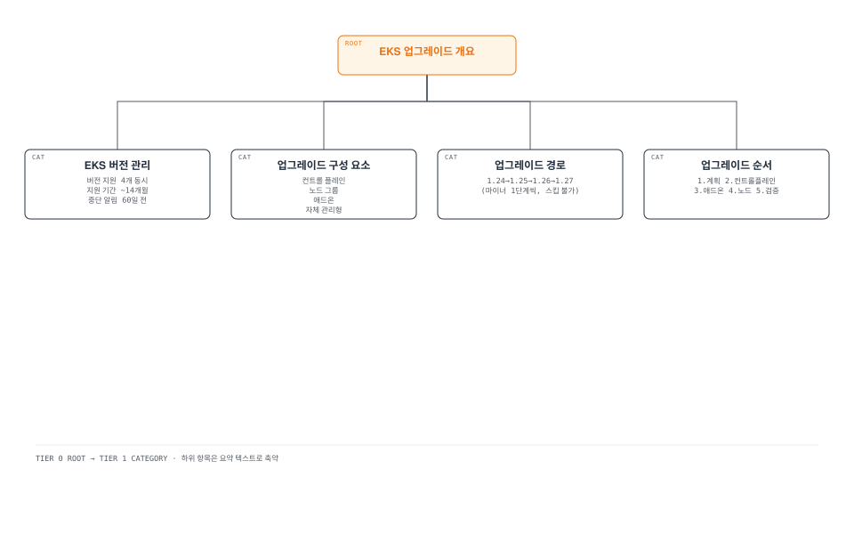
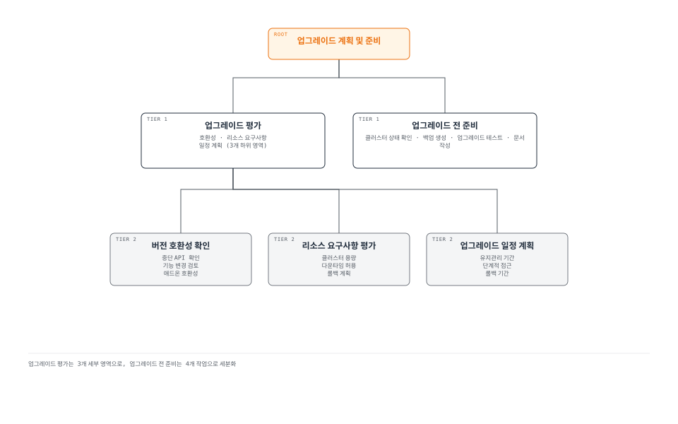
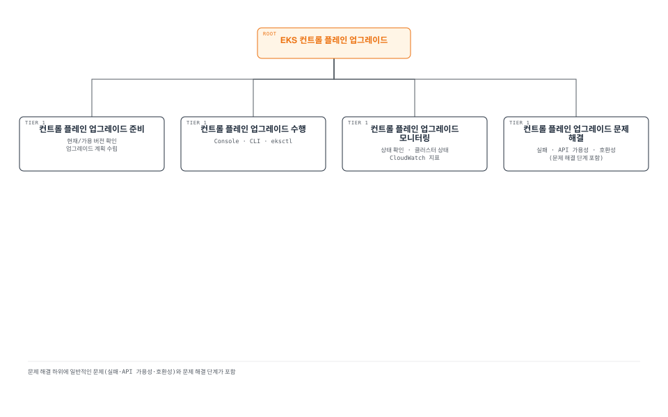
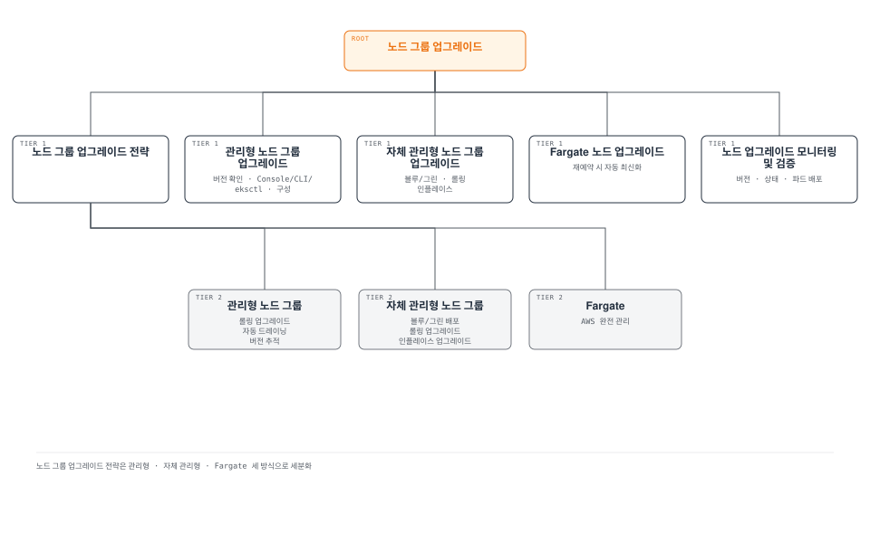
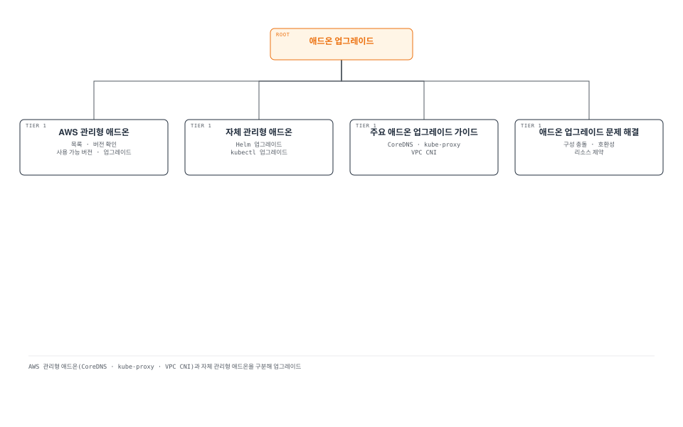
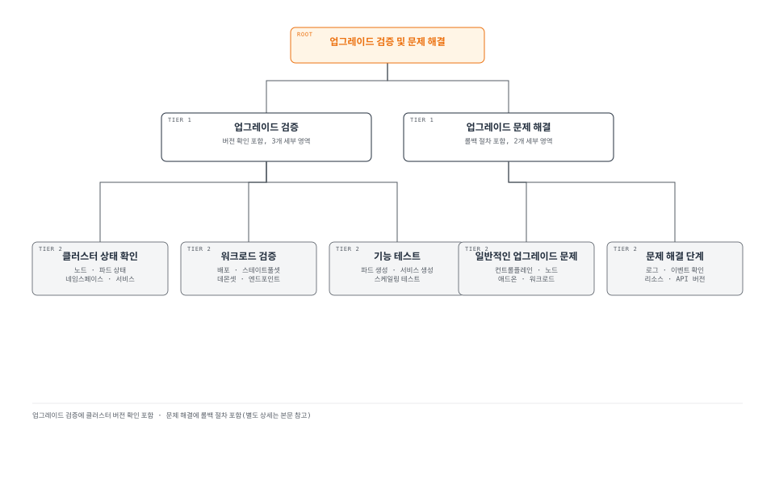
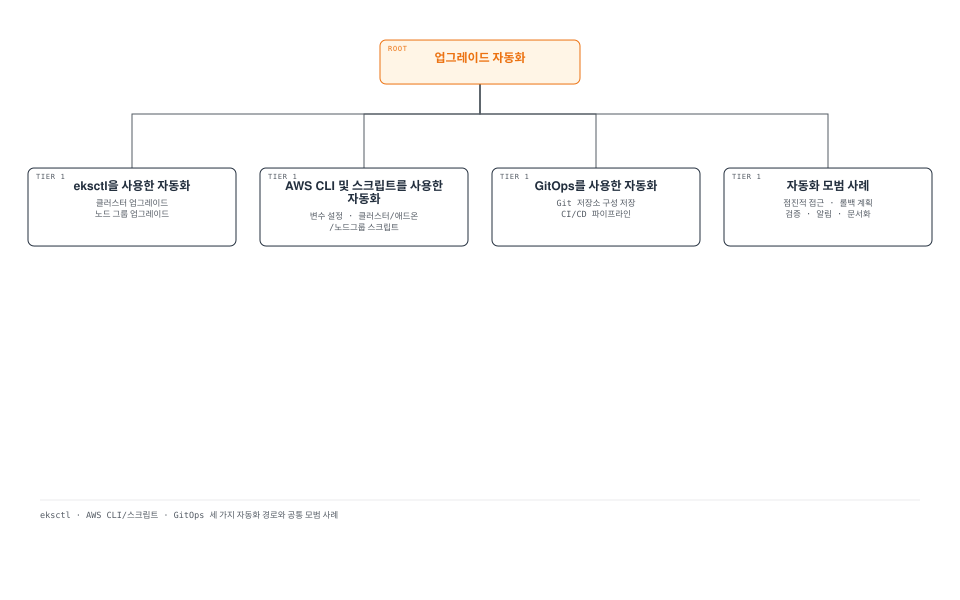
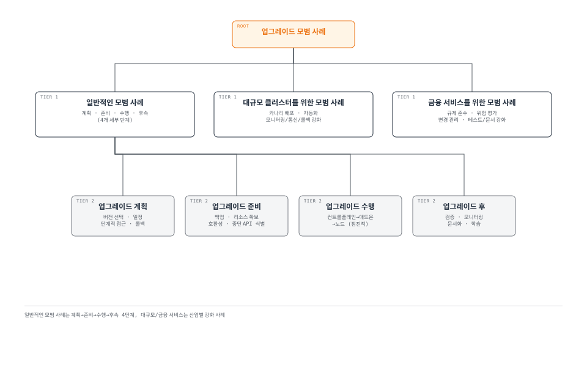

# Amazon EKS 업그레이드

> **마지막 업데이트**: 2026년 7월 3일

Amazon EKS 클러스터를 최신 상태로 유지하는 것은 보안, 안정성 및 새로운 기능을 활용하기 위해 중요합니다. 이 문서에서는 EKS 클러스터를 안전하게 업그레이드하기 위한 전략, 모범 사례 및 단계별 가이드를 제공합니다.

## 목차

1. [EKS 업그레이드 개요](#eks-업그레이드-개요)
2. [업그레이드 계획 및 준비](#업그레이드-계획-및-준비)
3. [EKS 컨트롤 플레인 업그레이드](#eks-컨트롤-플레인-업그레이드)
4. [노드 그룹 업그레이드](#노드-그룹-업그레이드)
5. [애드온 업그레이드](#애드온-업그레이드)
6. [업그레이드 검증 및 문제 해결](#업그레이드-검증-및-문제-해결)
7. [업그레이드 자동화](#업그레이드-자동화)
8. [업그레이드 모범 사례](#업그레이드-모범-사례)

## EKS 업그레이드 개요



### EKS 버전 관리

Amazon EKS는 Kubernetes 버전 관리 정책을 따릅니다:

- **버전 지원**: EKS는 최소 4개의 Kubernetes 버전을 동시에 지원합니다.
- **지원 기간**: 각 Kubernetes 버전은 EKS에서 출시된 후 약 14개월 동안 지원됩니다.
- **버전 사용 중단**: 버전이 사용 중단되기 전에 최소 60일 전에 알림이 제공됩니다.

### 최근 EKS 업그레이드 관련 발표 (2026년)

- **Kubernetes 버전 롤백 지원 (2026-07-01)**: 업그레이드 후 7일 이내라면 컨트롤 플레인을 이전 마이너 버전으로 롤백할 수 있습니다. 롤백 전 API 호환성, version skew, 애드온 호환성, 클러스터 상태를 점검하는 Rollback Readiness 검사가 자동으로 수행되며, EKS Auto Mode는 워커 노드 자동 롤백과 컨트롤 플레인 순차 복원을 지원합니다. 추가 비용 없이 모든 리전에서 제공됩니다. 자세한 절차는 [롤백 절차](#롤백-절차)를 참고하세요. (출처: [Amazon EKS 버전 롤백 발표](https://aws.amazon.com/about-aws/whats-new/2026/07/amazon-eks-version-rollback))
- **99.99% SLA 및 8XL 컨트롤 플레인 티어 (2026-03-20)**: Provisioned Control Plane의 SLA가 99.95%에서 99.99%로 향상되었으며 1분 단위로 측정됩니다. 초대규모 클러스터, AI/ML, HPC 워크로드를 위한 8XL 스케일링 티어가 신규 도입되어 기존 4XL 대비 API 처리 용량이 2배로 늘었습니다. (출처: [Amazon EKS SLA 및 8XL 스케일링 티어 발표](https://aws.amazon.com/about-aws/whats-new/2026/03/amazon-eks-announces-sla-8xl-scaling-tier/))

### 업그레이드 구성 요소

EKS 클러스터 업그레이드에는 다음과 같은 구성 요소가 포함됩니다:

1. **EKS 컨트롤 플레인**: Kubernetes API 서버, etcd, 컨트롤러 관리자 등
2. **노드 그룹**: 워커 노드 및 노드 AMI
3. **애드온**: AWS 관리형 애드온(예: CoreDNS, kube-proxy, VPC CNI)
4. **자체 관리형 구성 요소**: Helm 차트, 사용자 정의 리소스 등

### 업그레이드 경로

EKS 클러스터는 한 번에 한 마이너 버전씩 업그레이드해야 합니다:

- 1.24 → 1.25 → 1.26 → 1.27 (올바른 경로)
- 1.24 → 1.26 (지원되지 않음)

### 업그레이드 순서

일반적인 업그레이드 순서는 다음과 같습니다:

1. 업그레이드 계획 및 준비
2. EKS 컨트롤 플레인 업그레이드
3. 애드온 업그레이드
4. 노드 그룹 업그레이드
5. 업그레이드 검증

## 업그레이드 계획 및 준비



### 업그레이드 평가

업그레이드를 시작하기 전에 다음 사항을 평가해야 합니다:

#### 버전 호환성 확인

대상 Kubernetes 버전과의 호환성을 확인합니다:

- **API 사용 중단**: 사용 중단된 API를 사용하는 워크로드 식별
- **기능 변경**: 새 버전의 기능 변경 사항 검토
- **애드온 호환성**: 애드온이 대상 버전과 호환되는지 확인

```bash
# 사용 중단된 API 사용 확인
kubectl get -l k8s-app!=kube-dns deployments --all-namespaces -o json | jq '.items[].spec.template.spec.containers[].image' | sort | uniq

# 사용 중단된 API 사용 확인
kubectl get $(kubectl api-resources --verbs=list -o name | paste -sd, -) \
  --all-namespaces -o json | jq '.items[] | select(.apiVersion | contains("beta"))' | jq -r '.kind,.apiVersion,.metadata.name' | sort | uniq
```

#### 리소스 요구사항 평가

업그레이드에 필요한 리소스를 평가합니다:

- **클러스터 용량**: 업그레이드 중 추가 노드를 수용할 수 있는 충분한 용량
- **다운타임 허용**: 워크로드의 다운타임 허용 여부
- **롤백 계획**: 문제 발생 시 롤백 계획

#### 업그레이드 일정 계획

업그레이드 일정을 계획합니다:

- **유지 관리 기간**: 트래픽이 적은 시간에 업그레이드 예약
- **단계적 접근**: 비프로덕션 환경부터 시작하여 프로덕션 환경으로 진행
- **롤백 기간**: 문제 발생 시 롤백에 필요한 시간 계획

### 업그레이드 전 준비

#### 클러스터 상태 확인

업그레이드 전에 클러스터 상태를 확인합니다:

```bash
# 노드 상태 확인
kubectl get nodes

# 파드 상태 확인
kubectl get pods --all-namespaces

# 컴포넌트 상태 확인
kubectl get componentstatuses

# 이벤트 확인
kubectl get events --all-namespaces
```

#### 백업 생성

업그레이드 전에 중요한 데이터를 백업합니다:

```bash
# etcd 백업
kubectl -n kube-system exec -it etcd-pod -- etcdctl snapshot save /tmp/etcd-backup.db

# Velero를 사용한 백업
velero backup create pre-upgrade-backup --include-namespaces=default,app-namespace
```

#### 업그레이드 테스트

비프로덕션 환경에서 업그레이드를 테스트합니다:

1. 프로덕션 환경과 유사한 테스트 클러스터 생성
2. 테스트 클러스터에서 업그레이드 수행
3. 워크로드 및 기능 테스트
4. 문제 식별 및 해결

#### 업그레이드 문서 작성

업그레이드 프로세스를 문서화합니다:

- 업그레이드 단계
- 담당자 및 연락처
- 롤백 절차
- 문제 해결 가이드

## EKS 컨트롤 플레인 업그레이드



### 컨트롤 플레인 업그레이드 준비

#### 현재 버전 확인

현재 EKS 클러스터 버전을 확인합니다:

```bash
aws eks describe-cluster --name my-cluster --query "cluster.version"
```

#### 사용 가능한 버전 확인

사용 가능한 Kubernetes 버전을 확인합니다:

```bash
aws eks describe-addon-versions --kubernetes-version 1.27
```

#### 업그레이드 계획 수립

컨트롤 플레인 업그레이드 계획을 수립합니다:

- 업그레이드 시간: 트래픽이 적은 시간 선택
- 모니터링 설정: 업그레이드 중 클러스터 상태 모니터링
- 롤백 계획: 문제 발생 시 롤백 절차

### 컨트롤 플레인 업그레이드 수행

#### AWS Management Console을 사용한 업그레이드

1. AWS Management Console에 로그인
2. Amazon EKS 서비스로 이동
3. 클러스터 목록에서 업그레이드할 클러스터 선택
4. "클러스터 구성" 탭 선택
5. "Kubernetes 버전 업데이트" 클릭
6. 대상 버전 선택 및 "업데이트" 클릭

#### AWS CLI를 사용한 업그레이드

```bash
aws eks update-cluster-version \
  --name my-cluster \
  --kubernetes-version 1.27
```

#### eksctl을 사용한 업그레이드

```bash
eksctl upgrade cluster \
  --name my-cluster \
  --version 1.27 \
  --approve
```

### 컨트롤 플레인 업그레이드 모니터링

#### 업그레이드 상태 확인

업그레이드 상태를 확인합니다:

```bash
# AWS CLI를 사용한 상태 확인
aws eks describe-update \
  --name my-cluster \
  --update-id <update-id>

# eksctl을 사용한 상태 확인
eksctl get clusters
eksctl get nodegroup --cluster my-cluster
```

#### 클러스터 상태 모니터링

업그레이드 중 클러스터 상태를 모니터링합니다:

```bash
# 노드 상태 확인
kubectl get nodes

# 파드 상태 확인
kubectl get pods --all-namespaces

# 이벤트 확인
kubectl get events --all-namespaces --sort-by='.lastTimestamp'
```

#### CloudWatch 지표 모니터링

CloudWatch에서 클러스터 지표를 모니터링합니다:

- API 서버 지연 시간
- etcd 지연 시간
- 컨트롤러 관리자 지연 시간
- 스케줄러 지연 시간

### 컨트롤 플레인 업그레이드 문제 해결

#### 일반적인 문제

컨트롤 플레인 업그레이드 중 발생할 수 있는 일반적인 문제:

- **업그레이드 실패**: 업그레이드 프로세스가 실패하거나 중단됨
- **API 서버 가용성**: 업그레이드 중 API 서버 가용성 문제
- **호환성 문제**: 워크로드와 새 버전 간의 호환성 문제

#### 문제 해결 단계

1. 업그레이드 상태 확인
2. CloudTrail 로그 검토
3. EKS 컨트롤 플레인 로그 검토
4. AWS Support에 문의
## 노드 그룹 업그레이드

컨트롤 플레인을 업그레이드한 후에는 노드 그룹을 업그레이드해야 합니다. 노드 그룹 업그레이드에는 여러 전략이 있으며, 각 전략에는 장단점이 있습니다.



### 노드 그룹 업그레이드 전략

#### 관리형 노드 그룹 업그레이드

관리형 노드 그룹은 AWS에서 제공하는 노드 그룹 관리 기능으로, 노드 업그레이드를 자동화합니다:

- **롤링 업그레이드**: 노드가 하나씩 교체되어 워크로드 중단 최소화
- **자동 드레이닝**: 노드가 자동으로 드레이닝되어 파드가 다른 노드로 이동
- **버전 추적**: 컨트롤 플레인 버전과 호환되는 노드 AMI 자동 선택

#### 자체 관리형 노드 그룹 업그레이드

자체 관리형 노드 그룹의 경우 수동으로 노드를 업그레이드해야 합니다:

- **블루/그린 배포**: 새 노드 그룹 생성 후 워크로드 마이그레이션
- **롤링 업그레이드**: 노드를 하나씩 드레이닝하고 종료한 후 새 노드로 교체
- **인플레이스 업그레이드**: 기존 노드에서 kubelet 및 컨테이너 런타임 업그레이드

#### Fargate 노드 업그레이드

Fargate 노드는 AWS에서 관리하므로 별도의 업그레이드가 필요하지 않습니다:

- Fargate 파드는 새로 예약될 때 최신 플랫폼 버전을 자동으로 사용합니다.
- 기존 Fargate 파드는 재시작될 때까지 현재 플랫폼 버전을 유지합니다.

### 관리형 노드 그룹 업그레이드

#### 관리형 노드 그룹 버전 확인

현재 관리형 노드 그룹 버전을 확인합니다:

```bash
aws eks describe-nodegroup \
  --cluster-name my-cluster \
  --nodegroup-name my-nodegroup \
  --query "nodegroup.version"
```

#### AWS Management Console을 사용한 업그레이드

1. AWS Management Console에 로그인
2. Amazon EKS 서비스로 이동
3. 클러스터 목록에서 업그레이드할 클러스터 선택
4. "컴퓨팅" 탭 선택
5. 업그레이드할 노드 그룹 선택
6. "노드 그룹 업데이트" 클릭
7. 대상 버전 선택 및 "업데이트" 클릭

#### AWS CLI를 사용한 업그레이드

```bash
aws eks update-nodegroup-version \
  --cluster-name my-cluster \
  --nodegroup-name my-nodegroup \
  --kubernetes-version 1.27
```

#### eksctl을 사용한 업그레이드

```bash
eksctl upgrade nodegroup \
  --cluster my-cluster \
  --name my-nodegroup \
  --kubernetes-version 1.27
```

#### 관리형 노드 그룹 업그레이드 구성

관리형 노드 그룹 업그레이드 동작을 구성할 수 있습니다:

- **최대 사용 불가능**: 업그레이드 중 사용할 수 없는 최대 노드 수
- **파드 중단 예산**: 파드 중단 예산(PDB)을 준수하여 서비스 가용성 유지

```bash
aws eks update-nodegroup-config \
  --cluster-name my-cluster \
  --nodegroup-name my-nodegroup \
  --update-config maxUnavailable=1
```

### 자체 관리형 노드 그룹 업그레이드

#### 블루/그린 배포

블루/그린 배포는 새 노드 그룹을 생성한 후 워크로드를 마이그레이션하는 방식입니다:

1. 새 노드 그룹 생성:

```bash
eksctl create nodegroup \
  --cluster my-cluster \
  --name my-nodegroup-new \
  --node-type m5.large \
  --nodes 3 \
  --nodes-min 3 \
  --nodes-max 6 \
  --node-ami auto
```

2. 워크로드 마이그레이션:

```bash
# 기존 노드에 taint 적용
kubectl taint nodes -l alpha.eksctl.io/nodegroup-name=my-nodegroup-old \
  node-group=old:NoSchedule

# 새 파드가 새 노드에 스케줄링되는지 확인
kubectl get pods -o wide

# 기존 노드 드레이닝
for node in $(kubectl get nodes -l alpha.eksctl.io/nodegroup-name=my-nodegroup-old -o name); do
  kubectl drain --ignore-daemonsets --delete-emptydir-data $node
done
```

3. 기존 노드 그룹 삭제:

```bash
eksctl delete nodegroup \
  --cluster my-cluster \
  --name my-nodegroup-old
```

#### 롤링 업그레이드

롤링 업그레이드는 노드를 하나씩 드레이닝하고 종료한 후 새 노드로 교체하는 방식입니다:

```bash
# 노드 목록 가져오기
NODES=$(kubectl get nodes -l alpha.eksctl.io/nodegroup-name=my-nodegroup -o name)

# 각 노드에 대해 드레이닝 및 종료 수행
for node in $NODES; do
  echo "Draining node $node..."
  kubectl drain --ignore-daemonsets --delete-emptydir-data $node
  
  # 노드 ID 가져오기
  INSTANCE_ID=$(aws ec2 describe-instances \
    --filters "Name=private-dns-name,Values=$(echo $node | cut -d'/' -f2)" \
    --query "Reservations[0].Instances[0].InstanceId" \
    --output text)
  
  # 노드 종료
  aws ec2 terminate-instances --instance-ids $INSTANCE_ID
  
  # 새 노드가 준비될 때까지 대기
  echo "Waiting for new node to be ready..."
  sleep 60
  
  # 노드 상태 확인
  kubectl get nodes
done
```

#### 인플레이스 업그레이드

인플레이스 업그레이드는 기존 노드에서 kubelet 및 컨테이너 런타임을 업그레이드하는 방식입니다:

```bash
# 노드 목록 가져오기
NODES=$(kubectl get nodes -l alpha.eksctl.io/nodegroup-name=my-nodegroup -o name)

# 각 노드에 대해 인플레이스 업그레이드 수행
for node in $NODES; do
  echo "Cordoning node $node..."
  kubectl cordon $node
  
  echo "Draining node $node..."
  kubectl drain --ignore-daemonsets --delete-emptydir-data $node
  
  # 노드에 SSH 접속하여 업그레이드 수행
  # 이 부분은 노드 접근 방법에 따라 다를 수 있음
  INSTANCE_ID=$(aws ec2 describe-instances \
    --filters "Name=private-dns-name,Values=$(echo $node | cut -d'/' -f2)" \
    --query "Reservations[0].Instances[0].InstanceId" \
    --output text)
  
  # SSM을 사용하여 명령 실행
  aws ssm send-command \
    --instance-ids $INSTANCE_ID \
    --document-name "AWS-RunShellScript" \
    --parameters commands=["sudo yum update -y kubelet kubectl"]
  
  # 노드 uncordon
  echo "Uncordoning node $node..."
  kubectl uncordon $node
done
```

### 노드 업그레이드 모니터링 및 검증

#### 노드 버전 확인

노드 Kubernetes 버전을 확인합니다:

```bash
kubectl get nodes -o custom-columns=NAME:.metadata.name,VERSION:.status.nodeInfo.kubeletVersion
```

#### 노드 상태 확인

노드 상태를 확인합니다:

```bash
kubectl get nodes
kubectl describe nodes
```

#### 파드 배포 확인

파드가 정상적으로 배포되었는지 확인합니다:

```bash
kubectl get pods --all-namespaces -o wide
kubectl get pods --all-namespaces -o wide | grep -v Running
```

## 애드온 업그레이드

EKS 클러스터에는 여러 애드온이 포함되어 있으며, 이러한 애드온도 업그레이드해야 합니다.



### AWS 관리형 애드온

#### 관리형 애드온 목록 확인

클러스터에 설치된 관리형 애드온을 확인합니다:

```bash
aws eks list-addons --cluster-name my-cluster
```

#### 관리형 애드온 버전 확인

관리형 애드온의 현재 버전을 확인합니다:

```bash
aws eks describe-addon \
  --cluster-name my-cluster \
  --addon-name vpc-cni \
  --query "addon.addonVersion"
```

#### 사용 가능한 애드온 버전 확인

사용 가능한 애드온 버전을 확인합니다:

```bash
aws eks describe-addon-versions \
  --addon-name vpc-cni \
  --kubernetes-version 1.27
```

#### 관리형 애드온 업그레이드

AWS Management Console, AWS CLI 또는 eksctl을 사용하여 관리형 애드온을 업그레이드할 수 있습니다:

```bash
# AWS CLI를 사용한 업그레이드
aws eks update-addon \
  --cluster-name my-cluster \
  --addon-name vpc-cni \
  --addon-version v1.12.0-eksbuild.1 \
  --resolve-conflicts PRESERVE

# eksctl을 사용한 업그레이드
eksctl update addon \
  --cluster my-cluster \
  --name vpc-cni \
  --version v1.12.0-eksbuild.1 \
  --preserve
```

### 자체 관리형 애드온

#### 자체 관리형 애드온 업그레이드

Helm 또는 kubectl을 사용하여 자체 관리형 애드온을 업그레이드합니다:

```bash
# Helm을 사용한 업그레이드
helm repo update
helm upgrade metrics-server metrics-server/metrics-server \
  --namespace kube-system \
  --version 3.8.2

# kubectl을 사용한 업그레이드
kubectl apply -f https://raw.githubusercontent.com/kubernetes-sigs/metrics-server/v0.6.1/deploy/kubernetes/metrics-server-deployment.yaml
```

### 주요 애드온 업그레이드 가이드

#### CoreDNS 업그레이드

CoreDNS는 Kubernetes 클러스터의 DNS 서비스를 제공합니다:

```bash
# CoreDNS 버전 확인
kubectl get deployment coredns -n kube-system -o jsonpath="{.spec.template.spec.containers[0].image}"

# CoreDNS 업그레이드
aws eks update-addon \
  --cluster-name my-cluster \
  --addon-name coredns \
  --addon-version v1.9.3-eksbuild.2 \
  --resolve-conflicts PRESERVE
```

#### kube-proxy 업그레이드

kube-proxy는 Kubernetes 서비스 네트워킹을 처리합니다:

```bash
# kube-proxy 버전 확인
kubectl get daemonset kube-proxy -n kube-system -o jsonpath="{.spec.template.spec.containers[0].image}"

# kube-proxy 업그레이드
aws eks update-addon \
  --cluster-name my-cluster \
  --addon-name kube-proxy \
  --addon-version v1.27.1-eksbuild.1 \
  --resolve-conflicts PRESERVE
```

#### VPC CNI 업그레이드

Amazon VPC CNI는 파드 네트워킹을 처리합니다:

```bash
# VPC CNI 버전 확인
kubectl describe daemonset aws-node -n kube-system | grep Image

# VPC CNI 업그레이드
aws eks update-addon \
  --cluster-name my-cluster \
  --addon-name vpc-cni \
  --addon-version v1.12.0-eksbuild.1 \
  --resolve-conflicts PRESERVE
```

### 애드온 업그레이드 문제 해결

#### 일반적인 문제

애드온 업그레이드 중 발생할 수 있는 일반적인 문제:

- **구성 충돌**: 사용자 정의 구성과 새 버전 간의 충돌
- **호환성 문제**: 애드온과 Kubernetes 버전 간의 호환성 문제
- **리소스 제약**: 업그레이드에 필요한 리소스 부족

#### 문제 해결 단계

1. 애드온 상태 확인:

```bash
aws eks describe-addon \
  --cluster-name my-cluster \
  --addon-name vpc-cni
```

2. 애드온 로그 확인:

```bash
kubectl logs -n kube-system -l k8s-app=kube-dns
kubectl logs -n kube-system -l k8s-app=kube-proxy
kubectl logs -n kube-system -l k8s-app=aws-node
```

3. 애드온 이벤트 확인:

```bash
kubectl get events -n kube-system --sort-by='.lastTimestamp'
```
## 업그레이드 검증 및 문제 해결

업그레이드가 완료된 후에는 클러스터가 정상적으로 작동하는지 검증하고 발생할 수 있는 문제를 해결해야 합니다.



### 업그레이드 검증

#### 클러스터 버전 확인

클러스터 및 노드 버전을 확인합니다:

```bash
# 클러스터 버전 확인
kubectl version --short

# 노드 버전 확인
kubectl get nodes -o custom-columns=NAME:.metadata.name,VERSION:.status.nodeInfo.kubeletVersion
```

#### 클러스터 상태 확인

클러스터 구성 요소의 상태를 확인합니다:

```bash
# 노드 상태 확인
kubectl get nodes

# 파드 상태 확인
kubectl get pods --all-namespaces

# 네임스페이스 상태 확인
kubectl get namespaces

# 서비스 상태 확인
kubectl get services --all-namespaces
```

#### 워크로드 검증

애플리케이션 워크로드가 정상적으로 작동하는지 확인합니다:

```bash
# 배포 상태 확인
kubectl get deployments --all-namespaces

# 스테이트풀셋 상태 확인
kubectl get statefulsets --all-namespaces

# 데몬셋 상태 확인
kubectl get daemonsets --all-namespaces

# 서비스 엔드포인트 확인
kubectl get endpoints --all-namespaces
```

#### 기능 테스트

주요 기능이 정상적으로 작동하는지 테스트합니다:

1. **파드 생성 테스트**:

```bash
kubectl run nginx --image=nginx
kubectl get pod nginx
kubectl delete pod nginx
```

2. **서비스 생성 테스트**:

```bash
kubectl create deployment nginx --image=nginx --replicas=2
kubectl expose deployment nginx --port=80 --type=ClusterIP
kubectl get service nginx
kubectl delete service nginx
kubectl delete deployment nginx
```

3. **스케일링 테스트**:

```bash
kubectl create deployment nginx --image=nginx
kubectl scale deployment nginx --replicas=3
kubectl get deployment nginx
kubectl delete deployment nginx
```

### 업그레이드 문제 해결

#### 일반적인 업그레이드 문제

업그레이드 중 발생할 수 있는 일반적인 문제:

1. **컨트롤 플레인 업그레이드 실패**:
   - API 서버 가용성 문제
   - etcd 데이터베이스 문제
   - IAM 권한 문제

2. **노드 업그레이드 문제**:
   - 노드 드레이닝 실패
   - 새 노드 시작 실패
   - kubelet 버전 불일치

3. **애드온 업그레이드 문제**:
   - 구성 충돌
   - 호환성 문제
   - 리소스 제약

4. **워크로드 문제**:
   - API 사용 중단으로 인한 워크로드 실패
   - 리소스 제약으로 인한 파드 스케줄링 실패
   - 네트워킹 문제

#### 문제 해결 단계

1. **로그 확인**:

```bash
# 컨트롤 플레인 로그 확인
aws eks update-cluster-config \
  --region us-west-2 \
  --name my-cluster \
  --logging '{"clusterLogging":[{"types":["api","audit","authenticator","controllerManager","scheduler"],"enabled":true}]}'

# 노드 로그 확인
kubectl logs -n kube-system -l component=kube-proxy
kubectl logs -n kube-system -l k8s-app=aws-node
```

2. **이벤트 확인**:

```bash
kubectl get events --all-namespaces --sort-by='.lastTimestamp'
```

3. **리소스 상태 확인**:

```bash
kubectl describe nodes
kubectl describe pods --all-namespaces | grep -A 10 "Events:"
```

4. **API 버전 확인**:

```bash
kubectl api-versions
```

#### 롤백 절차

업그레이드 문제가 해결되지 않는 경우 롤백을 고려할 수 있습니다:

1. **컨트롤 플레인 롤백**:
   - 2026년 7월부터 Amazon EKS는 업그레이드 후 7일 이내에 컨트롤 플레인을 이전 마이너 버전으로 롤백하는 기능을 지원합니다. 롤백 전에는 API 호환성, version skew, 애드온 호환성, 클러스터 상태를 점검하는 Rollback Readiness 검사가 자동으로 수행됩니다. EKS Auto Mode 클러스터는 워커 노드 자동 롤백과 컨트롤 플레인 순차 복원을 통해 완전 자동으로 롤백되며, 추가 비용 없이 모든 리전에서 사용할 수 있습니다. (출처: [Amazon EKS 버전 롤백 발표](https://aws.amazon.com/about-aws/whats-new/2026/07/amazon-eks-version-rollback))
   - 7일이 지났거나 이 기능을 사용할 수 없는 경우, 심각한 문제가 있으면 새 클러스터를 생성하고 워크로드를 마이그레이션해야 합니다.

2. **노드 그룹 롤백**:
   - 이전 버전의 노드 그룹으로 롤백:

```bash
# 이전 버전의 새 노드 그룹 생성
eksctl create nodegroup \
  --cluster my-cluster \
  --name my-nodegroup-old-version \
  --node-type m5.large \
  --nodes 3 \
  --nodes-min 3 \
  --nodes-max 6 \
  --node-ami-family AmazonLinux2 \
  --node-ami auto \
  --kubernetes-version 1.26

# 새 노드 그룹이 준비되면 이전 노드 그룹 삭제
eksctl delete nodegroup \
  --cluster my-cluster \
  --name my-nodegroup-new-version
```

3. **애드온 롤백**:
   - 이전 버전의 애드온으로 롤백:

```bash
aws eks update-addon \
  --cluster-name my-cluster \
  --addon-name vpc-cni \
  --addon-version <previous-version> \
  --resolve-conflicts PRESERVE
```

## 업그레이드 자동화

대규모 환경에서는 업그레이드 프로세스를 자동화하는 것이 중요합니다. 다음과 같은 도구와 방법을 사용하여 EKS 업그레이드를 자동화할 수 있습니다.



### eksctl을 사용한 자동화

eksctl은 EKS 클러스터 관리를 위한 명령줄 도구로, 업그레이드 자동화에 사용할 수 있습니다:

```bash
# 클러스터 업그레이드
eksctl upgrade cluster \
  --name my-cluster \
  --version 1.27 \
  --approve

# 노드 그룹 업그레이드
eksctl upgrade nodegroup \
  --cluster my-cluster \
  --name my-nodegroup \
  --kubernetes-version 1.27
```

### AWS CLI 및 스크립트를 사용한 자동화

AWS CLI 및 셸 스크립트를 사용하여 업그레이드 프로세스를 자동화할 수 있습니다:

```bash
#!/bin/bash

# 변수 설정
CLUSTER_NAME="my-cluster"
TARGET_VERSION="1.27"
REGION="us-west-2"

# 클러스터 업그레이드
echo "Upgrading cluster $CLUSTER_NAME to version $TARGET_VERSION..."
UPDATE_ID=$(aws eks update-cluster-version \
  --region $REGION \
  --name $CLUSTER_NAME \
  --kubernetes-version $TARGET_VERSION \
  --query "update.id" \
  --output text)

# 업그레이드 완료 대기
echo "Waiting for cluster upgrade to complete..."
aws eks wait update-successful \
  --region $REGION \
  --name $CLUSTER_NAME \
  --update-id $UPDATE_ID

# 애드온 업그레이드
echo "Upgrading addons..."
for ADDON in vpc-cni coredns kube-proxy; do
  LATEST_VERSION=$(aws eks describe-addon-versions \
    --region $REGION \
    --addon-name $ADDON \
    --kubernetes-version $TARGET_VERSION \
    --query "addons[0].addonVersions[0].addonVersion" \
    --output text)
  
  echo "Upgrading $ADDON to version $LATEST_VERSION..."
  aws eks update-addon \
    --region $REGION \
    --cluster-name $CLUSTER_NAME \
    --addon-name $ADDON \
    --addon-version $LATEST_VERSION \
    --resolve-conflicts PRESERVE
done

# 관리형 노드 그룹 업그레이드
echo "Upgrading managed nodegroups..."
NODEGROUPS=$(aws eks list-nodegroups \
  --region $REGION \
  --cluster-name $CLUSTER_NAME \
  --query "nodegroups[]" \
  --output text)

for NG in $NODEGROUPS; do
  echo "Upgrading nodegroup $NG..."
  aws eks update-nodegroup-version \
    --region $REGION \
    --cluster-name $CLUSTER_NAME \
    --nodegroup-name $NG
  
  # 노드 그룹 업그레이드 완료 대기
  echo "Waiting for nodegroup $NG upgrade to complete..."
  aws eks wait nodegroup-active \
    --region $REGION \
    --cluster-name $CLUSTER_NAME \
    --nodegroup-name $NG
done

echo "Upgrade process completed successfully!"
```

### GitOps를 사용한 자동화

GitOps 도구(예: Flux, ArgoCD)를 사용하여 EKS 클러스터 업그레이드를 자동화할 수 있습니다:

1. **클러스터 구성을 Git 저장소에 저장**:

```yaml
# cluster.yaml
apiVersion: eksctl.io/v1alpha5
kind: ClusterConfig
metadata:
  name: my-cluster
  region: us-west-2
  version: "1.27"
managedNodeGroups:
  - name: my-nodegroup
    instanceType: m5.large
    desiredCapacity: 3
    minSize: 3
    maxSize: 6
```

2. **CI/CD 파이프라인 구성**:

```yaml
# .github/workflows/upgrade-eks.yml
name: Upgrade EKS Cluster

on:
  push:
    branches: [ main ]
    paths:
      - 'cluster.yaml'

jobs:
  upgrade:
    runs-on: ubuntu-latest
    steps:
      - name: Checkout code
        uses: actions/checkout@v2
      
      - name: Configure AWS credentials
        uses: aws-actions/configure-aws-credentials@v1
        with:
          aws-access-key-id: ${{ secrets.AWS_ACCESS_KEY_ID }}
          aws-secret-access-key: ${{ secrets.AWS_SECRET_ACCESS_KEY }}
          aws-region: us-west-2
      
      - name: Install eksctl
        run: |
          curl --silent --location "https://github.com/weaveworks/eksctl/releases/latest/download/eksctl_$(uname -s)_amd64.tar.gz" | tar xz -C /tmp
          sudo mv /tmp/eksctl /usr/local/bin
      
      - name: Upgrade EKS cluster
        run: |
          eksctl upgrade cluster -f cluster.yaml
```

### 자동화 모범 사례

EKS 업그레이드 자동화를 위한 모범 사례:

1. **점진적 접근**: 비프로덕션 환경부터 시작하여 프로덕션 환경으로 진행
2. **롤백 계획**: 자동화된 롤백 메커니즘 구현
3. **검증 단계**: 업그레이드 후 자동 검증 단계 포함
4. **알림**: 업그레이드 성공 또는 실패 시 알림 구성
5. **문서화**: 자동화 프로세스 및 단계 문서화

## 업그레이드 모범 사례

EKS 클러스터 업그레이드를 위한 모범 사례를 살펴보겠습니다.



### 일반적인 모범 사례

#### 업그레이드 계획

1. **버전 선택**: 안정적인 버전 선택 및 릴리스 노트 검토
2. **업그레이드 일정**: 트래픽이 적은 시간에 업그레이드 예약
3. **단계적 접근**: 비프로덕션 환경부터 시작하여 프로덕션 환경으로 진행
4. **롤백 계획**: 문제 발생 시 롤백 계획 수립

#### 업그레이드 준비

1. **백업**: 중요한 데이터 백업
2. **리소스 확보**: 업그레이드에 필요한 충분한 리소스 확보
3. **호환성 확인**: 워크로드 및 애드온 호환성 확인
4. **사용 중단된 API 식별**: 사용 중단된 API를 사용하는 워크로드 식별 및 업데이트

#### 업그레이드 수행

1. **컨트롤 플레인 먼저**: 컨트롤 플레인을 먼저 업그레이드
2. **애드온 다음**: 컨트롤 플레인 업그레이드 후 애드온 업그레이드
3. **노드 마지막**: 컨트롤 플레인 및 애드온 업그레이드 후 노드 업그레이드
4. **점진적 노드 업그레이드**: 노드를 점진적으로 업그레이드하여 워크로드 중단 최소화

#### 업그레이드 후

1. **검증**: 클러스터 및 워크로드 상태 검증
2. **모니터링**: 업그레이드 후 클러스터 모니터링
3. **문서화**: 업그레이드 프로세스 및 결과 문서화
4. **학습**: 업그레이드 중 발생한 문제 및 해결 방법 학습

### 대규모 클러스터를 위한 모범 사례

대규모 EKS 클러스터 업그레이드를 위한 추가 모범 사례:

1. **카나리 배포**: 일부 노드 또는 워크로드로 시작하여 점진적으로 확장
2. **자동화**: 업그레이드 프로세스 자동화
3. **모니터링 강화**: 업그레이드 중 클러스터 상태 지속적 모니터링
4. **통신 계획**: 이해관계자에게 업그레이드 상태 정기적으로 통신
5. **롤백 자동화**: 문제 발생 시 자동 롤백 메커니즘 구현

### 금융 서비스를 위한 모범 사례

금융 서비스 산업에서 EKS 클러스터 업그레이드를 위한 추가 모범 사례:

1. **규제 준수**: 업그레이드가 규제 요구사항을 충족하는지 확인
2. **위험 평가**: 업그레이드 전 위험 평가 수행
3. **변경 관리**: 엄격한 변경 관리 프로세스 따르기
4. **테스트 강화**: 업그레이드 전 철저한 테스트 수행
5. **문서화 강화**: 업그레이드 프로세스 및 결과 상세 문서화

## 결론

Amazon EKS 클러스터를 성공적으로 업그레이드하려면 철저한 계획, 준비 및 검증이 필요합니다. 이 문서에서는 EKS 클러스터의 컨트롤 플레인, 노드 그룹 및 애드온을 안전하게 업그레이드하기 위한 전략, 단계 및 모범 사례를 다루었습니다.

주요 내용:

1. **EKS 업그레이드 개요**: EKS 버전 관리, 업그레이드 구성 요소 및 경로
2. **업그레이드 계획 및 준비**: 업그레이드 평가, 준비 및 테스트
3. **EKS 컨트롤 플레인 업그레이드**: 컨트롤 플레인 업그레이드 방법 및 모니터링
4. **노드 그룹 업그레이드**: 관리형 및 자체 관리형 노드 그룹 업그레이드 전략
5. **애드온 업그레이드**: AWS 관리형 및 자체 관리형 애드온 업그레이드
6. **업그레이드 검증 및 문제 해결**: 업그레이드 검증 및 일반적인 문제 해결
7. **업그레이드 자동화**: eksctl, AWS CLI 및 GitOps를 사용한 업그레이드 자동화
8. **업그레이드 모범 사례**: 일반적인 모범 사례 및 특정 산업을 위한 모범 사례

EKS 클러스터를 최신 상태로 유지하면 보안 패치, 버그 수정 및 새로운 기능을 활용할 수 있으며, 이는 클러스터의 전반적인 보안, 안정성 및 성능을 향상시킵니다.

## 참고 자료

- [Amazon EKS 업그레이드 문서](https://docs.aws.amazon.com/eks/latest/userguide/update-cluster.html)
- [Kubernetes 버전 및 버전 차이](https://kubernetes.io/docs/setup/release/version-skew-policy/)
- [EKS 관리형 노드 그룹 업그레이드](https://docs.aws.amazon.com/eks/latest/userguide/update-managed-node-group.html)
- [EKS 애드온 업그레이드](https://docs.aws.amazon.com/eks/latest/userguide/managing-add-ons.html)
- [eksctl 문서](https://eksctl.io/usage/cluster-upgrade/)
- [Kubernetes 업그레이드 모범 사례](https://kubernetes.io/docs/tasks/administer-cluster/cluster-upgrade/)

## 퀴즈

이 장에서 배운 내용을 테스트하려면 [주제 퀴즈](../quizzes/eks/08-eks-upgrades-quiz.md)를 풀어보세요.
