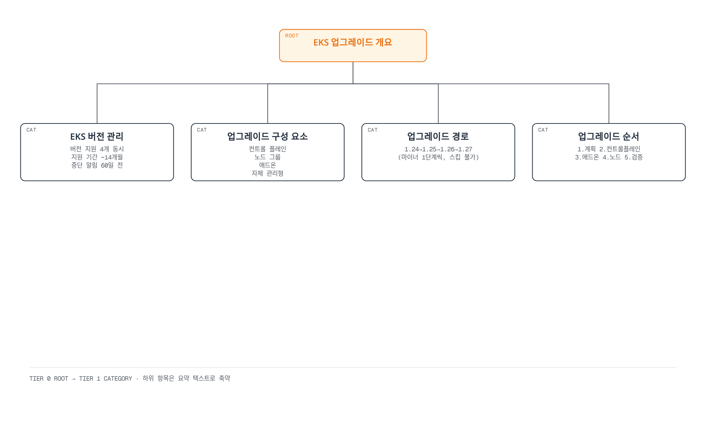
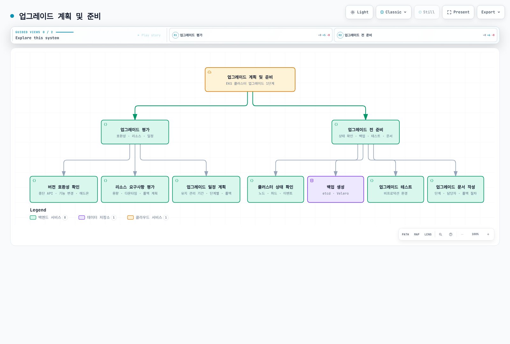
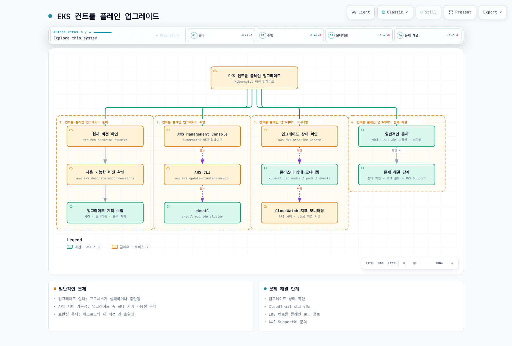
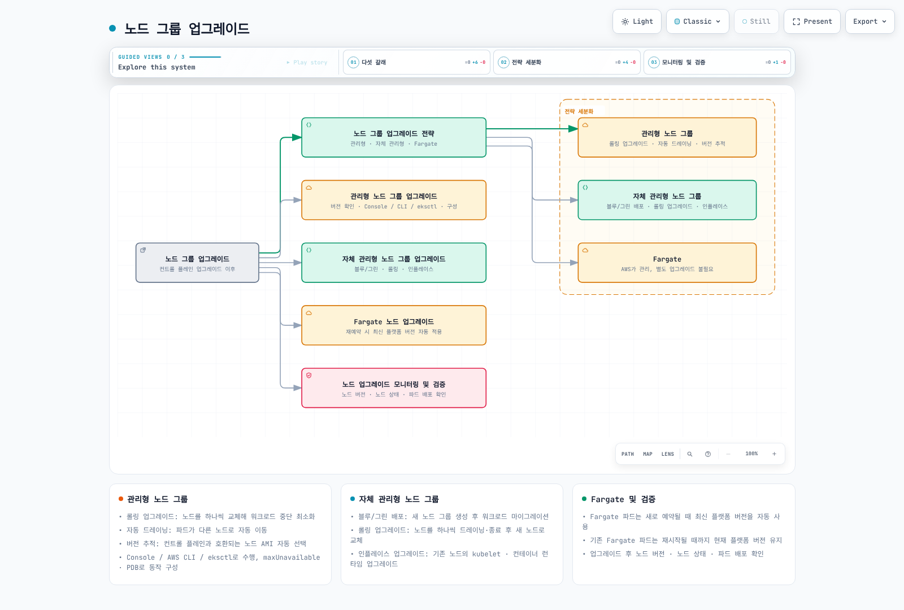
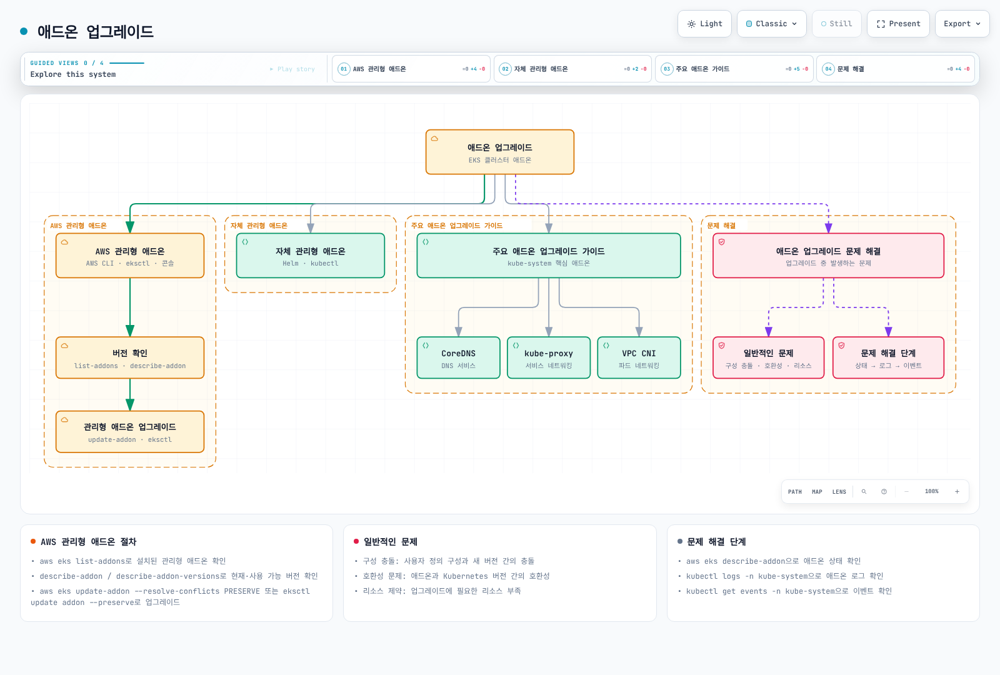
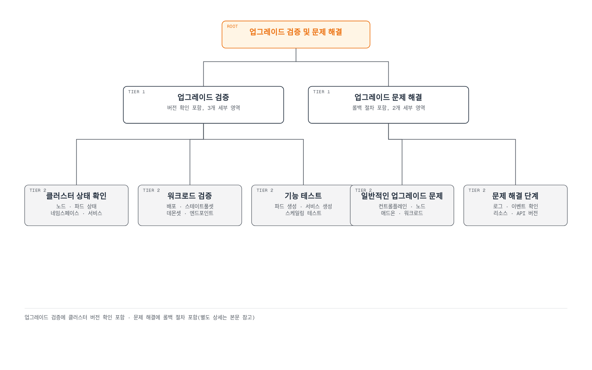
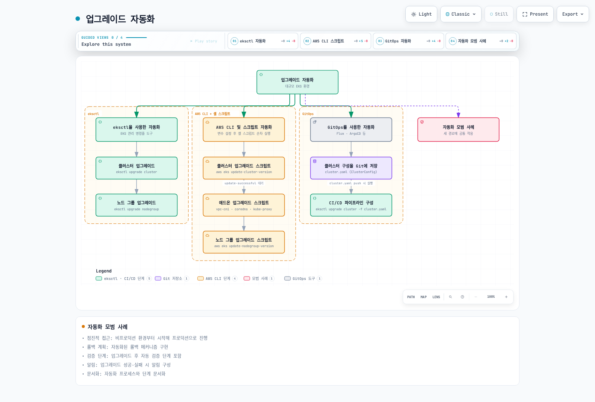
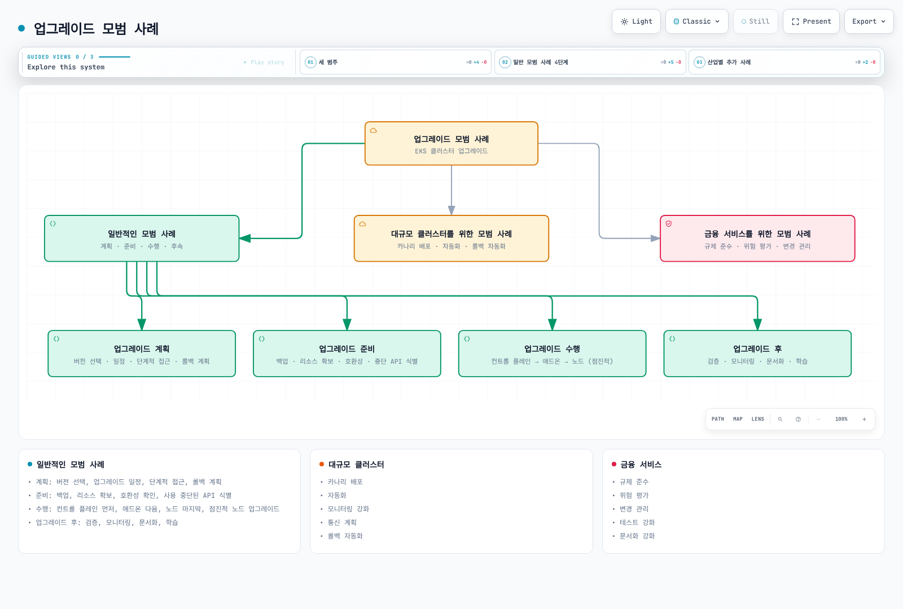

# Amazon EKS 업그레이드

> **마지막 업데이트**: 2026년 9월 12일

Amazon EKS 클러스터를 최신 상태로 유지하는 것은 보안, 안정성 및 새로운 기능을 활용하기 위해 중요합니다. 이 문서에서는 EKS 클러스터를 안전하게 업그레이드하기 위한 전략, 모범 사례 및 단계별 가이드를 제공합니다.

이 문서는 소유자가 검토하여 수행할 절차이며 이번 감사에서 실제 업그레이드를 실행한 기록이 아닙니다. 계정·리전·Kubernetes context를 명시하고 승인한 현재/대상 버전과 update ID를 기록하며 애플리케이션 동작을 검증합니다. 같은 리소스에 모든 대안 예시를 연속 실행하지 않습니다. 로컬 파서/모의 검증은 운영 준비 완료를 입증하지 않습니다.

## 목차

1. [EKS 업그레이드 개요](#eks-업그레이드-개요)
2. [업그레이드 계획 및 준비](#업그레이드-계획-및-준비)
3. [EKS 컨트롤 플레인 업그레이드](#eks-컨트롤-플레인-업그레이드)
4. [노드 그룹 업그레이드](#노드-그룹-업그레이드)
5. [애드온 업그레이드](#애드온-업그레이드)
6. [업그레이드 검증 및 문제 해결](#업그레이드-검증-및-문제-해결)
7. [업그레이드 자동화](#업그레이드-자동화)
8. [업그레이드 모범 사례](#업그레이드-모범-사례)

## EKS 업그레이드 개요



[🔍 인터랙티브 다이어그램 보기](https://www.atomai.click/kubernetes-docs/archmaps/ko-eks-08-eks-upgrades-0.html)

### EKS 버전 관리

EKS는 Kubernetes 버전 번호를 사용하지만 자체 출시/지원 일정을 따릅니다. 마이너 버전별 **표준 지원 14개월** 이후 추가 요금이 있는 **확장 지원 12개월**이 이어집니다. AWS는 표준 지원 종료를 최소 60일 전에 안내합니다. [현재 EKS 카탈로그/일정](https://docs.aws.amazon.com/eks/latest/userguide/kubernetes-versions.html)을 확인하며 업스트림 출시를 EKS 제공 여부로 간주하지 않습니다. 고정된 “최소 4개 버전”이나 14개월이 전체 지원 기간이라는 가정을 사용하지 않습니다.

### 최근 EKS 업그레이드 관련 발표 (2026년)

- **Kubernetes 버전 롤백 지원 (2026-07-01)**: 업그레이드 후 7일 이내라면 컨트롤 플레인을 이전 마이너 버전으로 롤백할 수 있습니다. 롤백 전 API 호환성, version skew, 애드온 호환성, 클러스터 상태를 점검하는 Rollback Readiness 검사가 자동으로 수행되며, 사용자가 롤백을 요청하면 Auto Mode가 해당 워커 노드를 먼저 교체한 뒤 컨트롤 플레인을 되돌립니다. 애플리케이션 장애를 감지해 자동 시작하는 기능은 아니며 자격 조건과 disruption 제어가 적용됩니다. EKS 제공 리전에서 기능 자체의 추가 요금은 없지만 노드·스토리지 및 해당 버전 지원 요금은 계속 적용됩니다. 자세한 절차는 [롤백 절차](#롤백-절차)를 참고하세요. (출처: [Amazon EKS 버전 롤백 발표](https://aws.amazon.com/about-aws/whats-new/2026/07/amazon-eks-version-rollback))
- **99.99% SLA 및 8XL 컨트롤 플레인 티어 (2026-03-20)**: Provisioned Control Plane의 SLA가 99.95%에서 99.99%로 향상되었으며 1분 단위로 측정됩니다. 초대규모 클러스터, AI/ML, HPC 워크로드를 위한 8XL 스케일링 티어가 신규 도입되어 기존 4XL 대비 API 처리 용량이 2배로 늘었습니다. (출처: [Amazon EKS SLA 및 8XL 스케일링 티어 발표](https://aws.amazon.com/about-aws/whats-new/2026/03/amazon-eks-announces-sla-8xl-scaling-tier/))

### 업그레이드 구성 요소

EKS 클러스터 업그레이드에는 다음과 같은 구성 요소가 포함됩니다:

1. **EKS 컨트롤 플레인**: Kubernetes API 서버, etcd, 컨트롤러 관리자 등
2. **노드 그룹**: 워커 노드 및 노드 AMI
3. **애드온**: AWS 관리형 애드온(예: CoreDNS, kube-proxy, VPC CNI)
4. **자체 관리형 구성 요소**: Helm 차트, 사용자 정의 리소스 등

### 업그레이드 경로

EKS 클러스터는 한 번에 한 마이너 버전씩 업그레이드해야 합니다:

- 과거 예시 1.24 → 1.25 → 1.26 → 1.27은 한 마이너씩 진행하는 형태를 설명하며 현재 배포 대상이 아닙니다.
- 1.24 → 1.26 직접 이동은 마이너 버전 건너뛰기의 예시입니다.
- 실제 변경은 해당 리전/지원 정책에서 EKS가 제공하는 다음 마이너를 선택합니다.

### 업그레이드 순서

1. 현황/테스트/백업과 진행 중인 업데이트를 확인하고, 보수적인 준비 절차로 노드를 **현재** 컨트롤 플레인 마이너에 맞춥니다.
2. 현재/대상 Kubernetes 모두와 호환되는 애드온/컨트롤러 중간 버전이 필요하면 먼저 적용하고 구성 요소별 전제 조건을 검증합니다.
3. 컨트롤 플레인을 지원되는 다음 마이너로 올리고 해당 update ID의 성공을 기다립니다.
4. 검증한 의존성 순서로 노드·클라이언트/컨트롤러·나머지 애드온을 갱신하며 매 단계 확인합니다. Auto Mode는 기본 기능을 관리하고 컨트롤 플레인 업그레이드 후 노드 갱신을 시작합니다.
5. 실제 노드 버전, 워크로드 readiness, 통신, 스토리지, SLO를 검증합니다.

업스트림 정책에서 kubelet 1.25+는 API server보다 최대 3개 마이너 이전을 허용하지만 더 새로울 수 없으며, API server 버전이 혼재하면 허용 범위가 좁아집니다. EKS 문서에는 준비 단계의 노드 버전 정렬 안내와 지원 skew 허용 범위가 함께 있습니다. 이 절차는 준비 정책으로 정렬을 선택하며 지원되는 모든 skew를 EKS API가 일률적으로 거절한다고 주장하지 않습니다. 애드온도 모두 CP 이전/이후라는 단일 순서로 정할 수 없습니다. 롤백은 아래의 다른 노드 우선 순서를 따릅니다.

## 업그레이드 계획 및 준비

<!-- Pending parent diagram repair: see core-audit/eks-upgrades/diagram-review.json


[🔍 인터랙티브 다이어그램 보기](https://www.atomai.click/kubernetes-docs/archmaps/ko-eks-08-eks-upgrades-1.html)
-->

### 업그레이드 평가

업그레이드를 시작하기 전에 다음 사항을 평가해야 합니다:

#### 버전 호환성 확인

대상 Kubernetes 버전과의 호환성을 확인합니다:

- **API 사용 중단**: 사용 중단된 API를 사용하는 워크로드 식별
- **기능 변경**: 새 버전의 기능 변경 사항 검토
- **애드온 호환성**: 애드온이 대상 버전과 호환되는지 확인

이미지 목록이나 `kubectl get … .apiVersion`은 클라이언트/API 사용 중단 감사가 아닙니다. API server가 협상한 현재 표현을 반환하며 beta API라는 이유만으로 deprecated는 아닙니다. 소스/Helm 매니페스트·클라이언트·CRD·웹훅과 EKS upgrade insight를 대상 릴리스 기준으로 검토합니다. 단일 API server 메트릭 수집은 관측 증거일 뿐이며 누락/오류가 미사용 증명은 아닙니다.

다음 읽기 전용 수집기를 `eks-upgrade-preflight.py`로 저장합니다. `CLUSTER_NAME`, `AWS_REGION`, `EXPECTED_ACCOUNT_ID`, `KUBE_CONTEXT`, `TARGET_VERSION`을 export하고 JSON을 제한된 로컬 권한으로 저장합니다. 종료 성공은 수집 성공이며 업그레이드 승인이나 모든 워크로드의 호환성 확인이 아닙니다.

```python
import json
import os
import re
import subprocess


def run_json(args):
    result = subprocess.run(args, check=True, capture_output=True, text=True, timeout=60)
    return json.loads(result.stdout)


def run_text(args):
    return subprocess.run(args, check=True, capture_output=True, text=True, timeout=30).stdout.strip()


def inspect_upgrade(cluster_name, region, expected_account, context, target, query=run_json, text=run_text):
    if not re.fullmatch(r"[0-9]{12}", expected_account):
        raise ValueError("Set the reviewed 12-digit AWS account ID")
    if not re.fullmatch(r"[0-9]+\.[0-9]+", target):
        raise ValueError("Target must be an EKS major.minor version")
    aws = [os.environ.get("AWS_CLI", "aws")]
    suffix = ["--region", region, "--output", "json", "--no-cli-pager"]
    identity = query(aws + ["sts", "get-caller-identity"] + suffix)
    if identity["Account"] != expected_account:
        raise RuntimeError("AWS account mismatch")
    cluster = query(aws + ["eks", "describe-cluster", "--name", cluster_name] + suffix)["cluster"]
    if cluster["status"] != "ACTIVE":
        raise RuntimeError("Cluster must be ACTIVE; inspect any in-progress updates")
    if cluster["arn"].split(":")[4] != expected_account:
        raise RuntimeError("Cluster/account mismatch")
    current = cluster["version"]
    current_parts = tuple(map(int, current.split(".")))
    target_parts = tuple(map(int, target.split(".")))
    if target_parts != (current_parts[0], current_parts[1] + 1):
        raise ValueError("This upgrade example requires exactly the next minor version")
    server = text(["kubectl", "--context", context, "config", "view", "--minify",
                   "--output", "jsonpath={.clusters[0].cluster.server}"])
    if server != cluster["endpoint"]:
        raise RuntimeError("Kubernetes context does not match the EKS API endpoint")
    catalog = query(aws + ["eks", "describe-cluster-versions", "--cluster-versions", target,
                         "--include-all", "--no-default-only"] + suffix)["clusterVersions"]
    if not any(item["clusterVersion"] == target and item.get("versionStatus") in
               ["STANDARD_SUPPORT", "EXTENDED_SUPPORT"] for item in catalog):
        raise ValueError("Target is not offered as a supported EKS version in this Region")
    insights = query(aws + [
        "eks", "list-insights", "--cluster-name", cluster_name,
        "--filter", json.dumps({"categories": ["UPGRADE_READINESS"], "kubernetesVersions": [target]}),
    ] + suffix)["insights"]
    nodes = query(["kubectl", "--context", context, "get", "nodes", "--output", "json"])["items"]
    update_ids = query(aws + ["eks", "list-updates", "--name", cluster_name] + suffix)["updateIds"]
    addon_names = query(aws + ["eks", "list-addons", "--cluster-name", cluster_name] + suffix)["addons"]
    addons = []
    for name in addon_names:
        addon = query(aws + ["eks", "describe-addon", "--cluster-name", cluster_name,
                             "--addon-name", name] + suffix)["addon"]
        addons.append({"name": name, "version": addon["addonVersion"], "status": addon["status"]})
    return {
        "cluster": cluster_name, "region": region, "account": expected_account,
        "currentVersion": current, "targetVersion": target, "targetCatalog": catalog,
        "insights": insights,
        "clusterUpdateIds": update_ids,
        "nodes": [{"name": node["metadata"]["name"],
                   "kubeletVersion": node["status"]["nodeInfo"]["kubeletVersion"],
                   "ready": next((condition.get("status") for condition in node["status"].get("conditions", [])
                                  if condition.get("type") == "Ready"), None),
                   "computeType": node["metadata"].get("labels", {}).get("eks.amazonaws.com/compute-type"),
                   "nodegroup": node["metadata"].get("labels", {}).get("eks.amazonaws.com/nodegroup")}
                  for node in nodes],
        "managedAddons": addons,
        "decision": "Inventory collected only; active-update review, owner approval, node alignment, API/client scans, "
                    "backups/restore tests, add-on bridge versions, capacity, and workload tests remain required.",
    }


if __name__ == "__main__":
    report = inspect_upgrade(
        os.environ["CLUSTER_NAME"], os.environ["AWS_REGION"],
        os.environ["EXPECTED_ACCOUNT_ID"], os.environ["KUBE_CONTEXT"],
        os.environ["TARGET_VERSION"],
    )
    print(json.dumps(report, indent=2))
```

#### 리소스 요구사항 평가

업그레이드에 필요한 리소스를 평가합니다:

- **클러스터 용량**: 업그레이드 중 추가 노드를 수용할 수 있는 충분한 용량
- **다운타임 허용**: 워크로드의 다운타임 허용 여부
- **롤백 계획**: 문제 발생 시 롤백 계획

#### 업그레이드 일정 계획

업그레이드 일정을 계획합니다:

- **유지 관리 기간**: 트래픽이 적은 시간에 업그레이드 예약
- **단계적 접근**: 비프로덕션 환경부터 시작하여 프로덕션 환경으로 진행
- **롤백 기간**: 문제 발생 시 롤백에 필요한 시간 계획

### 업그레이드 전 준비

#### 클러스터 상태 확인

업그레이드 전에 클러스터 상태를 확인합니다:

```bash
# 노드 상태 확인
kubectl --context "$KUBE_CONTEXT" get nodes

# 파드 상태 확인
kubectl --context "$KUBE_CONTEXT" get pods --all-namespaces

# 컴포넌트 상태 확인
kubectl --context "$KUBE_CONTEXT" get --raw /readyz

# 이벤트 확인
kubectl --context "$KUBE_CONTEXT" get events --all-namespaces
```

#### 백업 생성

업그레이드 전에 중요한 데이터를 백업합니다:

관리형 컨트롤 플레인 etcd는 EKS 소유이므로 사용자 namespace의 `etcd-pod`/`etcdctl snapshot` 명령으로 백업할 수 없습니다. `kubectl get all`도 중요한 리소스와 볼륨 데이터를 빠뜨리므로 전체 백업이 아닙니다.

[AWS Backup의 EKS 지원](https://docs.aws.amazon.com/eks/latest/userguide/integration-backup.html)은 문서화된 IAM, API/API_AND_CONFIG_MAP 접근 모드, 스토리지/복원 전제 조건 아래 cluster state와 PVC 기반 EBS/EFS/S3를 composite recovery point로 보호할 수 있습니다. 또는 볼륨 범위와 자격 증명을 검증한 소유 Velero/애플리케이션 백업을 사용합니다. namespace/클러스터 범위, DB 일관성, 보존, 복원 테스트를 검토하며 백업 요청 ID만으로 완료/복구 가능성을 판단하지 않습니다.

#### 업그레이드 테스트

비프로덕션 환경에서 업그레이드를 테스트합니다:

1. 프로덕션 환경과 유사한 테스트 클러스터 생성
2. 테스트 클러스터에서 업그레이드 수행
3. 워크로드 및 기능 테스트
4. 문제 식별 및 해결

#### 업그레이드 문서 작성

업그레이드 프로세스를 문서화합니다:

- 업그레이드 단계
- 담당자 및 연락처
- 롤백 절차
- 문제 해결 가이드

## EKS 컨트롤 플레인 업그레이드

<!-- Pending parent diagram repair: see core-audit/eks-upgrades/diagram-review.json


[🔍 인터랙티브 다이어그램 보기](https://www.atomai.click/kubernetes-docs/archmaps/ko-eks-08-eks-upgrades-2.html)
-->

### 컨트롤 플레인 업그레이드 준비

#### 현재 버전 확인

현재 EKS 클러스터 버전을 확인합니다:

```bash
aws eks describe-cluster --name "$CLUSTER_NAME" --region "$AWS_REGION" --query "cluster.version"
```

#### 사용 가능한 버전 확인

사용 가능한 Kubernetes 버전을 확인합니다:

```bash
aws eks describe-cluster-versions --region "$AWS_REGION" \
  --no-default-only --output json --no-cli-pager
```

#### 업그레이드 계획 수립

일반 업그레이드 요청 전 [현재 EKS 안내](https://docs.aws.amazon.com/eks/latest/userguide/update-cluster.html)를 확인합니다. Upgrade insight 문제에 `--force`를 요구하는 강제 적용 기능은 일시 철회된 상태이며, 버전 롤백의 `ROLLBACK_READINESS` 차단 규칙과 다릅니다. 문제를 해결하거나 명시적으로 평가하세요. 수정 후에도 최근 30일 API 사용 증거가 남을 수 있습니다. 클러스터 서브넷의 존재, 필요한 여유 주소(EKS가 최대 5개 필요로 할 수 있음), CP 통신 규칙을 확인합니다. 시작한 CP 업그레이드는 일시중지/중단할 수 없으며 클라이언트 재연결을 처리해야 합니다.

컨트롤 플레인 업그레이드 계획을 수립합니다:

- 업그레이드 시간: 트래픽이 적은 시간 선택
- 모니터링 설정: 업그레이드 중 클러스터 상태 모니터링
- 롤백 계획: 문제 발생 시 롤백 절차

### 컨트롤 플레인 업그레이드 수행

#### AWS Management Console을 사용한 업그레이드

1. AWS Management Console에 로그인
2. Amazon EKS 서비스로 이동
3. 클러스터 목록에서 업그레이드할 클러스터 선택
4. "클러스터 구성" 탭 선택
5. "Kubernetes 버전 업데이트" 클릭
6. 대상 버전 선택 및 "업데이트" 클릭

#### AWS CLI를 사용한 업그레이드

기록한 계획과 전제 조건의 승인이 끝난 후에만 실행합니다. 다음 절의 polling helper를 `eks-wait-update.py`로 저장하세요. 컨트롤 플레인 업데이트만 요청하며 노드/애드온 갱신이나 워크로드 readiness를 입증하지 않습니다.

```bash
set -euo pipefail
: "${CLUSTER_NAME:?Set the reviewed cluster}"
: "${AWS_REGION:?Set the reviewed Region}"
: "${TARGET_VERSION:?Set the next supported EKS minor version}"
umask 077
aws eks update-cluster-version \
  --name "$CLUSTER_NAME" --region "$AWS_REGION" \
  --kubernetes-version "$TARGET_VERSION" --output json --no-cli-pager \
  > control-plane-update.json
UPDATE_ID=$(jq -er '.update.id | select(type == "string" and length > 0)' control-plane-update.json)
export CLUSTER_NAME AWS_REGION UPDATE_ID
unset NODEGROUP_NAME ADDON_NAME
python3 eks-wait-update.py
```

#### eksctl을 사용한 업그레이드

```bash
eksctl upgrade cluster \
  --name "$CLUSTER_NAME" --region "$AWS_REGION" \
  --version "$TARGET_VERSION" \
  --approve
```

### 컨트롤 플레인 업그레이드 모니터링

#### 업그레이드 상태 확인

업그레이드 상태를 확인합니다:

정확한 update ID의 `DescribeUpdate`를 추적합니다. `cluster-active`/`nodegroup-active`는 해당 요청의 성공 증명이 아니며 AWS CLI 2.36.44에는 `eks wait update-successful` waiter가 없습니다. 다음을 `eks-wait-update.py`로 저장합니다. 노드 그룹/애드온 요청은 `NODEGROUP_NAME` 또는 `ADDON_NAME` 하나만 설정하고 CP 요청은 둘 다 해제합니다. API 오류, 실패/취소, 알 수 없는 상태, 클라이언트 기한 초과에서 실패합니다. 클라이언트 timeout은 AWS 작업을 취소하지 않습니다. 기본 2시간 클라이언트 대기는 승인한 작업에 맞춰 조정하며 긴 Auto Mode 롤백은 특히 주의합니다.

```python
import json
import os
import subprocess
import time
from pathlib import Path


def wait_update(lookup, timeout_seconds, interval_seconds=15, clock=time.monotonic, sleep=time.sleep):
    if timeout_seconds <= 0 or interval_seconds < 0:
        raise ValueError("Use a positive timeout and nonnegative polling interval")
    deadline = clock() + timeout_seconds
    while True:
        update = lookup()["update"]
        status = update["status"]
        print(json.dumps({"id": update["id"], "status": status, "errors": update.get("errors", [])}), flush=True)
        if status == "Successful":
            return update
        if status in ["Failed", "Cancelled"]:
            raise RuntimeError(f"EKS update ended with {status}; inspect its error details")
        if status not in ["InProgress", "Cancelling"]:
            raise RuntimeError(f"Unexpected update status: {status}")
        if clock() >= deadline:
            raise TimeoutError("Client wait expired; the AWS operation may still be running. Preserve its update ID.")
        sleep(interval_seconds)


if __name__ == "__main__":
    cluster = os.environ["CLUSTER_NAME"]
    region = os.environ["AWS_REGION"]
    update_id = os.environ["UPDATE_ID"]
    nodegroup = os.environ.get("NODEGROUP_NAME")
    addon = os.environ.get("ADDON_NAME")
    if nodegroup and addon:
        raise ValueError("Set only NODEGROUP_NAME or ADDON_NAME for a scoped update")
    command = [
        os.environ.get("AWS_CLI", "aws"), "eks", "describe-update",
        "--name", cluster, "--region", region, "--update-id", update_id,
        "--output", "json", "--no-cli-pager",
    ]
    if nodegroup:
        command += ["--nodegroup-name", nodegroup]
    if addon:
        command += ["--addon-name", addon]
    status_file = Path(os.environ.get("UPDATE_STATUS_FILE", "eks-update-status.json"))

    def lookup():
        completed = subprocess.run(command, check=True, capture_output=True, text=True, timeout=60)
        response = json.loads(completed.stdout)
        status_file.write_text(json.dumps(response, indent=2) + "\n")
        return response

    wait_update(lookup, int(os.environ.get("WAIT_TIMEOUT_SECONDS", "7200")))
```

#### 클러스터 상태 모니터링

업그레이드 중 클러스터 상태를 모니터링합니다:

```bash
# 노드 상태 확인
kubectl --context "$KUBE_CONTEXT" get nodes

# 파드 상태 확인
kubectl --context "$KUBE_CONTEXT" get pods --all-namespaces

# 이벤트 확인
kubectl --context "$KUBE_CONTEXT" get events --all-namespaces --sort-by='.lastTimestamp'
```

#### CloudWatch 지표 모니터링

EKS 버전/등급과 구성한 텔레메트리에서 실제 제공되는 메트릭을 모니터링합니다. API 요청률·지연·오류, API readiness와 클라이언트 재연결, 스케줄링, 노드/워크로드 상태, 애플리케이션 SLO를 확인하며 직접 etcd/controller-manager endpoint나 모든 구성 요소 메트릭의 노출을 가정하지 않습니다. `/readyz`는 API 준비 상태이며 모든 애플리케이션이나 과거 가용성 상태의 검증이 아닙니다.

### 컨트롤 플레인 업그레이드 문제 해결

#### 일반적인 문제

컨트롤 플레인 업그레이드 중 발생할 수 있는 일반적인 문제:

- **업그레이드 실패**: 업그레이드 프로세스가 실패하거나 중단됨
- **API 서버 가용성**: 업그레이드 중 API 서버 가용성 문제
- **호환성 문제**: 워크로드와 새 버전 간의 호환성 문제

#### 문제 해결 단계

1. 업그레이드 상태 확인
2. CloudTrail 로그 검토
3. EKS 컨트롤 플레인 로그 검토
4. AWS Support에 문의
## 노드 그룹 업그레이드

컨트롤 플레인을 업그레이드한 후에는 노드 그룹을 업그레이드해야 합니다. 노드 그룹 업그레이드에는 여러 전략이 있으며, 각 전략에는 장단점이 있습니다.

<!-- Pending parent diagram repair: see core-audit/eks-upgrades/diagram-review.json


[🔍 인터랙티브 다이어그램 보기](https://www.atomai.click/kubernetes-docs/archmaps/ko-eks-08-eks-upgrades-3.html)
-->

### 노드 그룹 업그레이드 전략

#### 관리형 노드 그룹 업그레이드

관리형 노드 그룹은 AWS에서 제공하는 노드 그룹 관리 기능으로, 노드 업그레이드를 자동화합니다:

- **교체 전략**: `maxUnavailable`/percentage에 따라 병렬 교체할 수 있습니다. API의 `updateStrategy=DEFAULT`는 새 용량 확보 후 기존 용량을 제거하고, `MINIMAL`은 기존 용량을 먼저 제거하므로 가용성/용량 조건이 다릅니다.
- **드레이닝**: 정상 업데이트는 Pod eviction/PDB를 확인하며 컨트롤러가 Pod를 재생성합니다. live migration이 아닙니다. 노드 그룹 force 옵션은 PDB 관련 drain 실패를 우회할 수 있으며 클러스터 롤백의 force와 다릅니다.
- **버전/AMI 선택**: 검토한 Kubernetes/AMI 릴리스 또는 custom AMI를 담은 기존 launch template의 새 버전을 선택합니다. 업데이트 실패가 전체 노드의 자동 롤백을 뜻하지 않으므로 혼재한 노드/AMI 상태와 오류를 확인합니다.

#### 자체 관리형 노드 그룹 업그레이드

자체 관리형 노드 그룹의 경우 수동으로 노드를 업그레이드해야 합니다:

- **블루/그린 배포**: 새 노드 그룹 생성 후 워크로드 마이그레이션
- **롤링 업그레이드**: 노드를 하나씩 드레이닝하고 종료한 후 새 노드로 교체
- **인플레이스 업그레이드**: 기존 노드에서 kubelet 및 컨테이너 런타임 업그레이드

#### Fargate 노드 업그레이드

Fargate 노드 인프라는 AWS가 관리하지만 워크로드 소유자가 Pod 교체를 조율해야 합니다. 새 Fargate Pod의 kubelet 버전은 CP와 일치하며 기존 Pod는 CP 업데이트만으로 갱신되지 않습니다. 별도 작업이 전혀 없다고 가정하지 말고 컨트롤러 rollout·가용성·검증을 계획합니다. Auto Mode는 별도로 CP 업그레이드 후 자체적인 점진적 노드 교체를 disruption 제어에 따라 시작합니다.

### 관리형 노드 그룹 업그레이드

#### 관리형 노드 그룹 버전 확인

현재 관리형 노드 그룹 버전을 확인합니다:

```bash
aws eks describe-nodegroup \
  --cluster-name "$CLUSTER_NAME" --region "$AWS_REGION" \
  --nodegroup-name "$NODEGROUP_NAME" \
  --query "nodegroup.version"
```

#### AWS Management Console을 사용한 업그레이드

1. AWS Management Console에 로그인
2. Amazon EKS 서비스로 이동
3. 클러스터 목록에서 업그레이드할 클러스터 선택
4. "컴퓨팅" 탭 선택
5. 업그레이드할 노드 그룹 선택
6. "노드 그룹 업데이트" 클릭
7. 대상 버전 선택 및 "업데이트" 클릭

#### AWS CLI를 사용한 업그레이드

EKS 최적화 AMI는 검토한 릴리스와 대상 버전을 사용합니다. 별도의 update ID를 가지므로 polling에도 노드 그룹 범위를 유지합니다. 플랫폼/AMI 계열 지원을 검토하며 Kubernetes 버전만 바꿔 AL2 노드 그룹이 AL2023으로 전환되는 것은 아닙니다.

```bash
set -euo pipefail
: "${CLUSTER_NAME:?}"; : "${AWS_REGION:?}"; : "${NODEGROUP_NAME:?}"
: "${TARGET_VERSION:?Set the reviewed target, no newer than the control plane}"
: "${TARGET_AMI_RELEASE:?Set the reviewed EKS-optimized AMI release}"
umask 077
aws eks describe-nodegroup --cluster-name "$CLUSTER_NAME" --nodegroup-name "$NODEGROUP_NAME" \
  --region "$AWS_REGION" --output json > nodegroup-before.json
if jq -e '.nodegroup.amiType == "CUSTOM"' nodegroup-before.json >/dev/null; then
  echo "Use the custom launch-template path for this node group" >&2
  exit 1
fi
aws eks update-nodegroup-version \
  --cluster-name "$CLUSTER_NAME" --nodegroup-name "$NODEGROUP_NAME" --region "$AWS_REGION" \
  --kubernetes-version "$TARGET_VERSION" --release-version "$TARGET_AMI_RELEASE" \
  --output json > nodegroup-update.json
UPDATE_ID=$(jq -er '.update.id | select(type == "string" and length > 0)' nodegroup-update.json)
export CLUSTER_NAME AWS_REGION UPDATE_ID NODEGROUP_NAME
unset ADDON_NAME
python3 eks-wait-update.py
```

**Custom AMI**는 원래 launch template의 검토한 새 버전을 사용합니다. 이 요청에는 Kubernetes `version`이나 `releaseVersion`을 함께 전달하지 않으며 교체 노드의 실제 kubelet/runtime/AMI를 검증합니다.

```bash
set -euo pipefail
: "${CLUSTER_NAME:?}"; : "${AWS_REGION:?}"; : "${NODEGROUP_NAME:?}"
: "${LAUNCH_TEMPLATE_ID:?Set the same launch template originally used by the group}"
: "${LAUNCH_TEMPLATE_VERSION:?Set the reviewed version containing the updated custom AMI}"
aws eks update-nodegroup-version \
  --cluster-name "$CLUSTER_NAME" --nodegroup-name "$NODEGROUP_NAME" --region "$AWS_REGION" \
  --launch-template "id=$LAUNCH_TEMPLATE_ID,version=$LAUNCH_TEMPLATE_VERSION" \
  --output json > nodegroup-update.json
UPDATE_ID=$(jq -er '.update.id | select(type == "string" and length > 0)' nodegroup-update.json)
export CLUSTER_NAME AWS_REGION UPDATE_ID NODEGROUP_NAME
unset ADDON_NAME
python3 eks-wait-update.py
```

#### eksctl을 사용한 업그레이드

```bash
eksctl upgrade nodegroup \
  --cluster "$CLUSTER_NAME" --region "$AWS_REGION" \
  --name "$NODEGROUP_NAME" \
  --kubernetes-version "$TARGET_VERSION"
```

#### 관리형 노드 그룹 업그레이드 구성

관리형 노드 그룹 업그레이드 동작을 구성할 수 있습니다:

- **최대 사용 불가능**: 업그레이드 중 사용할 수 없는 최대 노드 수
- **PDB**: 해당 자발적 축출을 제한하지만 모든 장애나 애플리케이션 결과를 보장하지 않습니다. 강제 노드 그룹 업데이트는 PDB 문제를 무시할 수 있습니다. 관리형 노드 그룹 desired/min/max 변경은 ASG scaling이며 업그레이드의 drain/PDB 보호를 제공하지 않으므로 0대 전환을 안전한 마이그레이션으로 취급하지 않습니다.

```bash
aws eks update-nodegroup-config \
  --cluster-name "$CLUSTER_NAME" --region "$AWS_REGION" \
  --nodegroup-name "$NODEGROUP_NAME" \
  --update-config maxUnavailable=1
```

### 자체 관리형 노드 그룹 업그레이드

#### 블루/그린 배포

소유한 구성에서 다른 이름의 새 노드 그룹을 준비하고 검토한 subnet/AZ·IAM·AMI 아키텍처/bootstrap·레이블·taint·스토리지·네트워크 요구를 유지합니다. [클러스터 생성 가이드](02-eks-cluster-creation.md)를 참고하세요. `eksctl create nodegroup`은 관리형 그룹이 기본이므로 자체 관리형은 `--managed=false` 또는 해당 `nodeGroups` 구성으로 명시합니다. 생성은 `--version`, `eksctl upgrade nodegroup`은 `--kubernetes-version`을 사용합니다.

1. 검토한 구성으로 green 용량을 만들고 노드 수·대상 kubelet/AMI·Ready·CNI/DNS·애플리케이션 배치를 확인합니다. 노드 목록 조회만으로 검증되지 않습니다.
2. 소유자가 단계적으로 워크로드를 옮깁니다. preferred affinity는 green 배치 보장이 아니므로 실제 Pod 노드와 스토리지 토폴로지를 확인합니다.
3. 식별한 기존 노드 하나씩 유한 timeout으로 drain하며 축출/상태 검사가 실패하면 중단합니다. 워크로드와 대체 용량을 확인한 뒤 다음 노드로 진행합니다.
4. 마이그레이션·상태·데이터 보존·복구 수용 기준을 기록한 뒤에만 기존 그룹을 폐기합니다. 확인하지 않은 반복문이나 고정 sleep 뒤에 자동 삭제하지 않습니다.

```bash
set -euo pipefail
: "${KUBE_CONTEXT:?Set the reviewed cluster context}"
: "${NODE_NAME:?Set one reviewed old node}"
kubectl --context "$KUBE_CONTEXT" get node "$NODE_NAME" -o wide
kubectl --context "$KUBE_CONTEXT" get node "$NODE_NAME" \
  -o jsonpath='{.spec.providerID}{"\n"}'
kubectl --context "$KUBE_CONTEXT" get pods --all-namespaces \
  --field-selector "spec.nodeName=$NODE_NAME" -o wide
# Stop on failure. Do not terminate the instance or delete the node group here.
kubectl --context "$KUBE_CONTEXT" drain "$NODE_NAME" --ignore-daemonsets --timeout=10m
```

기본 drain은 별도 판단이 필요한 unmanaged/local-data 사례에서 실패하도록 둡니다. `--delete-emptydir-data`는 emptyDir 데이터 손실을 명시적으로 허용하므로 무조건 추가하지 않습니다. `kubectl drain --force`는 unmanaged Pod 허용이며 eviction/PDB 우회와 다릅니다. DaemonSet·static Pod·컨트롤러·영구 데이터는 각 소유자와 조정합니다.

#### 롤링 업그레이드

자체 관리 ASG는 먼저 소유 launch configuration/template을 검증한 AMI로 갱신해야 하며 그렇지 않으면 교체 노드가 이전 이미지로 다시 시작할 수 있습니다. 위 단일 노드 drain 검사를 사용하고 종료 전에 provider ID·EC2 인스턴스·ASG 소유권을 확인합니다. 노드 이름을 private-DNS 검색의 첫 EC2 결과와 임의로 연결하지 않습니다. ASG 소유자가 drain한 인스턴스를 교체하고 **새** 노드의 구성/Ready와 워크로드 복구를 확인한 뒤 진행합니다. 60초 sleep은 교체 준비의 증명이 아닙니다. ASG scaling/instance refresh 자체가 PDB를 집행하지 않으므로 Kubernetes draining 연결이 필요합니다.

#### 인플레이스 업그레이드

이를 지원하는 자체 관리 호스트에서만 별도 검증한 OS/이미지별 절차를 사용합니다. EKS 최적화 관리형 fleet은 검증한 불변 AMI 교체 경로를 우선 검토하고 Auto Mode/Fargate 인프라는 서비스 소유입니다. 일반적인 `yum update kubelet kubectl`은 검토한 Kubernetes/runtime 버전 선택이나 EKS 노드 업그레이드 절차가 아닙니다. SSM 요청은 비동기이므로 invocation·필요한 서비스 재시작·실제 버전·노드 readiness·워크로드 테스트 성공 전 uncordon하지 않습니다. 오류 후 자동 uncordon/종료 대신 실패 증거를 보존합니다.

### 노드 업그레이드 모니터링 및 검증

#### 노드 버전 확인

노드 Kubernetes 버전을 확인합니다:

```bash
kubectl --context "$KUBE_CONTEXT" get nodes -o custom-columns=NAME:.metadata.name,VERSION:.status.nodeInfo.kubeletVersion
```

#### 노드 상태 확인

노드 상태를 확인합니다:

```bash
kubectl --context "$KUBE_CONTEXT" get nodes
kubectl --context "$KUBE_CONTEXT" describe nodes
```

#### 파드 배포 확인

파드가 정상적으로 배포되었는지 확인합니다:

```bash
kubectl --context "$KUBE_CONTEXT" get pods --all-namespaces -o wide
kubectl --context "$KUBE_CONTEXT" get pods --all-namespaces -o custom-columns=NAMESPACE:.metadata.namespace,NAME:.metadata.name,PHASE:.status.phase,READY:'.status.conditions[?(@.type=="Ready")].status'
```

## 애드온 업그레이드

실제 구성 요소의 소유자와 업그레이드 경로를 조사합니다. EKS 관리형 애드온 버전은 CP 업그레이드만으로 자동 갱신되지 않으며 소유자가 호환 버전을 선택해 요청합니다. 필요한 중간 릴리스는 CP 변경 전에 적용할 수 있습니다. Auto Mode 기본 기능은 AWS가 별도로 관리하므로 모든 클러스터가 같은 DaemonSet/Deployment를 사용한다고 가정해 네트워크·스토리지·DNS 구성 요소를 중복 설치/업데이트하지 않습니다.



[🔍 인터랙티브 다이어그램 보기](https://www.atomai.click/kubernetes-docs/archmaps/ko-eks-08-eks-upgrades-4.html)

### AWS 관리형 애드온

#### 관리형 애드온 목록 확인

클러스터에 설치된 관리형 애드온을 확인합니다:

```bash
aws eks list-addons --cluster-name "$CLUSTER_NAME" --region "$AWS_REGION"
```

#### 관리형 애드온 버전 확인

관리형 애드온의 현재 버전을 확인합니다:

```bash
aws eks describe-addon \
  --cluster-name "$CLUSTER_NAME" --region "$AWS_REGION" \
  --addon-name vpc-cni \
  --query "addon.addonVersion"
```

#### 사용 가능한 애드온 버전 확인

사용 가능한 애드온 버전을 확인합니다:

배열 첫 원소가 “최신” 또는 올바른 버전이라는 보장은 없습니다. `compatibilities`, default-version 표시, 플랫폼/compute/architecture 지원, 릴리스 노트, IAM 변경, 중간 버전 요구를 검토합니다. 변경 전에 구성과 identity 연결을 기록하고 민감 값이 있을 수 있는 구성 파일의 접근을 제한합니다.

```bash
set -euo pipefail
: "${CLUSTER_NAME:?}"; : "${AWS_REGION:?}"; : "${ADDON_NAME:?}"
: "${TARGET_VERSION:?Set the Kubernetes version for this stage}"
umask 077
aws eks describe-addon --cluster-name "$CLUSTER_NAME" --addon-name "$ADDON_NAME" \
  --region "$AWS_REGION" --output json > addon-before.json
aws eks describe-addon-versions --addon-name "$ADDON_NAME" \
  --kubernetes-version "$TARGET_VERSION" --region "$AWS_REGION" \
  --output json > addon-candidates.json
# Select ADDON_VERSION after reviewing compatibility, architecture, compute type, and upgrade path.
: "${ADDON_VERSION:?Set the reviewed add-on version}"
aws eks describe-addon-configuration --addon-name "$ADDON_NAME" \
  --addon-version "$ADDON_VERSION" --region "$AWS_REGION" \
  --output json > addon-schema.json
jq -r '.addon.configurationValues // "{}"' addon-before.json > addon-config-candidate.json
```

#### 관리형 애드온 업그레이드

AWS Management Console, AWS CLI 또는 eksctl을 사용하여 관리형 애드온을 업그레이드할 수 있습니다:

대상 스키마로 후보 JSON을 검증하고 의도한 구성/identity 의미를 보존합니다. `PRESERVE`는 관리 필드 충돌을 다루며 모든 사용자 값 검증, 애플리케이션 동작 보장, 명시한 부분 JSON과 기존 JSON의 병합을 뜻하지 않습니다. `{}` 전달은 구성을 초기화할 수 있습니다. 소유 애드온 하나씩 요청하고 update ID·health·버전·워크로드 동작을 확인합니다.

```bash
set -euo pipefail
: "${CLUSTER_NAME:?}"; : "${AWS_REGION:?}"; : "${ADDON_NAME:?}"; : "${ADDON_VERSION:?}"
: "${REVIEWED_ADDON_CONFIG_FILE:?Provide the complete reviewed target configuration JSON}"
aws eks update-addon --cluster-name "$CLUSTER_NAME" --addon-name "$ADDON_NAME" \
  --addon-version "$ADDON_VERSION" --region "$AWS_REGION" \
  --configuration-values "file://$REVIEWED_ADDON_CONFIG_FILE" \
  --resolve-conflicts PRESERVE --output json > addon-update.json
UPDATE_ID=$(jq -er '.update.id | select(type == "string" and length > 0)' addon-update.json)
export CLUSTER_NAME AWS_REGION UPDATE_ID ADDON_NAME
unset NODEGROUP_NAME
python3 eks-wait-update.py
aws eks describe-addon --cluster-name "$CLUSTER_NAME" --addon-name "$ADDON_NAME" \
  --region "$AWS_REGION" --output json
```

eksctl 0.229의 `update addon`에는 `--wait`와 `--config-file`이 있지만 `--preserve`는 없습니다. 의도한 충돌 정책을 검토한 eksctl 구성에 넣거나 위 AWS CLI 절차를 사용합니다. eksctl의 `--force`는 자체 관리 애드온의 소유권 이전이며 일반적인 충돌 보존 옵션이 아닙니다.

### 자체 관리형 애드온

#### 자체 관리형 애드온 업그레이드

Helm 또는 kubectl을 사용하여 자체 관리형 애드온을 업그레이드합니다:

기존 Helm/매니페스트 소유자를 사용합니다. 예시는 검토한 chart 저장소/OCI와 기존 릴리스를 전제로 하며, 릴리스가 없을 때 두 번째 관리자를 생성하지 않도록 `--install`을 사용하지 않습니다. 새 chart의 CRD/IAM 마이그레이션을 확인하며 `helm upgrade`만으로 chart `crds/` 디렉토리의 CRD가 갱신되지는 않습니다. Helm과 원시 매니페스트 배포는 대안이지 연속 업데이트 단계가 아닙니다. 이전 Metrics Server 0.6.1/3.8.2 예시는 대상 버전 호환성을 선택한 결과가 아닙니다.

```bash
set -euo pipefail
: "${KUBE_CONTEXT:?}"; : "${RELEASE:?}"; : "${ADDON_NAMESPACE:?}"
: "${CHART_REF:?Set the verified repository/chart or OCI reference}"
: "${CHART_VERSION:?Set a reviewed compatible chart version}"
: "${REVIEWED_VALUES_FILE:?Set the complete reviewed target values file}"
umask 077
helm get values "$RELEASE" --namespace "$ADDON_NAMESPACE" --kube-context "$KUBE_CONTEXT" \
  --all > addon-values-before.yaml
helm show values "$CHART_REF" --version "$CHART_VERSION" > addon-values-defaults.yaml
# Merge/migrate values and handle CRDs/IAM through the owner before this step.
helm upgrade "$RELEASE" "$CHART_REF" --version "$CHART_VERSION" \
  --namespace "$ADDON_NAMESPACE" --kube-context "$KUBE_CONTEXT" \
  -f "$REVIEWED_VALUES_FILE" --wait --timeout 15m
```

### 주요 애드온 업그레이드 가이드

#### CoreDNS 업그레이드

표준 노드는 CoreDNS Deployment의 소유자가 EKS인지 다른 도구인지 확인하고 Corefile·PDB·사용자 설정을 보존하며 선택한 버전의 마이그레이션 안내를 따릅니다. Auto Mode 노드는 CoreDNS를 노드 system service로 실행하므로 순수 Auto Mode에는 Deployment 애드온이 필요하지 않지만 혼합 클러스터는 비-Auto 노드의 DNS를 유지해야 합니다. 순수 Auto Mode에서 Deployment가 없다고 업그레이드 실패로 판단하지 않습니다.

#### kube-proxy 업그레이드

API server와 해당 노드에 호환되는 kube-proxy를 사용하며 API server보다 새로울 수 없습니다. 대상 버전의 지원 애드온 build와 검증한 순서를 사용합니다. Auto Mode의 서비스 네트워킹은 AWS가 관리하므로 자체 kube-proxy DaemonSet이 있다고 가정하지 않습니다.

#### VPC CNI 업그레이드

표준 EC2 노드는 CNI 버전 경로, IP/prefix 모드, IAM, network-policy 설정, 워크로드 연결을 검증합니다. `aws-node` ConfigMap 하나가 모든 설정을 담는다고 가정하지 말고 EKS `configurationValues`, DaemonSet/컨테이너 설정, service-account identity, 해당 Helm/GitOps 소유 구성을 포함합니다. Auto Mode 기본 네트워킹은 별도 관리 경로를 따릅니다.

각 EKS 소유 애드온에 위 capture/select/update/wait 절차를 사용하며 표준 노드 agent는 실제 설치된 환경에서만 조회합니다.

```bash
kubectl --context "$KUBE_CONTEXT" -n kube-system get deployment coredns -o wide
kubectl --context "$KUBE_CONTEXT" -n kube-system get daemonset kube-proxy,aws-node -o wide
```

### 애드온 업그레이드 문제 해결

#### 일반적인 문제

애드온 업그레이드 중 발생할 수 있는 일반적인 문제:

- **구성 충돌**: 사용자 정의 구성과 새 버전 간의 충돌
- **호환성 문제**: 애드온과 Kubernetes 버전 간의 호환성 문제
- **리소스 제약**: 업그레이드에 필요한 리소스 부족

#### 문제 해결 단계

1. 애드온 상태 확인:

```bash
aws eks describe-addon \
  --cluster-name "$CLUSTER_NAME" --region "$AWS_REGION" \
  --addon-name vpc-cni
```

2. 애드온 로그 확인:

```bash
kubectl --context "$KUBE_CONTEXT" logs -n kube-system -l k8s-app=kube-dns
kubectl --context "$KUBE_CONTEXT" logs -n kube-system -l k8s-app=kube-proxy
kubectl --context "$KUBE_CONTEXT" logs -n kube-system -l k8s-app=aws-node
```

3. 애드온 이벤트 확인:

```bash
kubectl --context "$KUBE_CONTEXT" get events -n kube-system --sort-by='.lastTimestamp'
```
## 업그레이드 검증 및 문제 해결

업그레이드가 완료된 후에는 클러스터가 정상적으로 작동하는지 검증하고 발생할 수 있는 문제를 해결해야 합니다.



[🔍 인터랙티브 다이어그램 보기](https://www.atomai.click/kubernetes-docs/archmaps/ko-eks-08-eks-upgrades-5.html)

### 업그레이드 검증

#### 클러스터 버전 확인

클러스터 및 노드 버전을 확인합니다:

```bash
# 클러스터 버전 확인
kubectl --context "$KUBE_CONTEXT" version --output=yaml

# 노드 버전 확인
kubectl --context "$KUBE_CONTEXT" get nodes -o custom-columns=NAME:.metadata.name,VERSION:.status.nodeInfo.kubeletVersion
```

#### 클러스터 상태 확인

클러스터 구성 요소의 상태를 확인합니다:

```bash
# 노드 상태 확인
kubectl --context "$KUBE_CONTEXT" get nodes

# 파드 상태 확인
kubectl --context "$KUBE_CONTEXT" get pods --all-namespaces

# 네임스페이스 상태 확인
kubectl --context "$KUBE_CONTEXT" get namespaces

# 서비스 상태 확인
kubectl --context "$KUBE_CONTEXT" get services --all-namespaces
```

#### 워크로드 검증

애플리케이션 워크로드가 정상적으로 작동하는지 확인합니다:

```bash
# 배포 상태 확인
kubectl --context "$KUBE_CONTEXT" get deployments --all-namespaces

# 스테이트풀셋 상태 확인
kubectl --context "$KUBE_CONTEXT" get statefulsets --all-namespaces

# 데몬셋 상태 확인
kubectl --context "$KUBE_CONTEXT" get daemonsets --all-namespaces

# 서비스 엔드포인트 확인
kubectl --context "$KUBE_CONTEXT" get endpointslices.discovery.k8s.io --all-namespaces
```

#### 기능 테스트

격리한 소유 테스트 리소스와 명시적인 수용 기준을 사용합니다. 다음 **Linux EC2 노드 smoke test**는 Deployment rollout/확장, Service/DNS 요청, 별도 Job 사이의 PVC 데이터 지속성을 확인합니다. 부하 벤치마크나 모든 노드/AZ 검사, 애플리케이션/HA/보안 정확성의 증명은 아닙니다. 워크로드별 ingress/egress·컨트롤러/웹훅·복구 검사를 추가하고 Fargate/hybrid 등 다른 플랫폼은 호환되는 별도 계획을 사용합니다.

`eks-upgrade-smoke.py`로 저장합니다. 이번 감사에서 manifest를 확인한 공식 BusyBox digest를 사용하지만 이미지/클러스터 테스트를 실제 실행한 것은 아닙니다. 실행 전에 이미지 정책, admission/network 규칙, 용량, 대상 노드의 호환 filesystem StorageClass를 확인합니다. `KUBE_CONTEXT`, `TEST_STORAGE_CLASS`, `RUN_SMOKE_TEST=yes`와 특정 교체 노드 검사용 `SMOKE_NODE_SELECTOR` JSON map을 설정하세요. 고유 namespace를 생성하고 기존 것을 인수하지 않으며, 실패 시 중단하고 실제 배치/PV reclaim 정보를 기록합니다. `WaitForFirstConsumer` 볼륨에는 완료를 기다리기 전에 writer 소비자를 생성합니다.

리소스는 기본적으로 검토용으로 남깁니다. `CLEANUP_ON_SUCCESS=yes`는 성공한 후 해당 실행이 생성한 namespace UID만 삭제합니다. Retain 클래스는 namespace 삭제 뒤에도 과금 PV/스토리지를 남길 수 있으므로 기록한 PV를 확인해 소유 테스트 스토리지만 정리합니다. 실패는 진단용으로 보존하며 성공으로 표시하지 않습니다. 현재 메트릭과 순차 HTTP 20회로 성능 동등성을 입증하지 않습니다.

```python
import json
import os
import subprocess
import uuid
from pathlib import Path

IMAGE = "docker.io/library/busybox@sha256:73aaf090f3d85aa34ee199857f03fa3a95c8ede2ffd4cc2cdb5b94e566b11662"


def manifests(namespace, storage_class, marker, node_selector):
    if node_selector.get("kubernetes.io/os", "linux") != "linux":
        raise ValueError("This BusyBox example requires Linux nodes")
    node_selector = {"kubernetes.io/os": "linux", **node_selector}
    security = {"runAsNonRoot": True, "runAsUser": 65532, "fsGroup": 65532,
                "seccompProfile": {"type": "RuntimeDefault"}}
    container_security = {"allowPrivilegeEscalation": False, "readOnlyRootFilesystem": True,
                          "capabilities": {"drop": ["ALL"]}}
    resources = {"requests": {"cpu": "50m", "memory": "32Mi"},
                 "limits": {"cpu": "200m", "memory": "128Mi"}}

    def job(name, command, with_volume=False):
        container = {"name": "check", "image": IMAGE, "command": ["sh", "-ec", command],
                     "resources": resources, "securityContext": container_security}
        pod = {"restartPolicy": "Never", "automountServiceAccountToken": False,
               "securityContext": security, "nodeSelector": node_selector, "containers": [container]}
        if with_volume:
            container["volumeMounts"] = [{"name": "data", "mountPath": "/data"}]
            pod["volumes"] = [{"name": "data", "persistentVolumeClaim": {"claimName": "smoke-data"}}]
        return {"apiVersion": "batch/v1", "kind": "Job", "metadata": {"name": name, "namespace": namespace},
                "spec": {"backoffLimit": 0, "activeDeadlineSeconds": 120,
                         "template": {"spec": pod}}}

    config = {"apiVersion": "v1", "kind": "ConfigMap",
              "metadata": {"name": "smoke-content", "namespace": namespace},
              "data": {"index.html": marker + "\n"}}
    deployment = {
        "apiVersion": "apps/v1", "kind": "Deployment",
        "metadata": {"name": "smoke-http", "namespace": namespace},
        "spec": {"replicas": 2, "selector": {"matchLabels": {"app": "smoke-http"}},
                 "template": {"metadata": {"labels": {"app": "smoke-http"}}, "spec": {
                     "automountServiceAccountToken": False, "securityContext": security,
                     "nodeSelector": node_selector,
                     "containers": [{"name": "http", "image": IMAGE,
                                     "command": ["httpd", "-f", "-p", "8080", "-h", "/www"],
                                     "securityContext": container_security, "resources": resources,
                                     "ports": [{"name": "http", "containerPort": 8080}],
                                     "readinessProbe": {"httpGet": {"path": "/", "port": "http"}},
                                     "volumeMounts": [{"name": "content", "mountPath": "/www", "readOnly": True}]}],
                     "volumes": [{"name": "content", "configMap": {"name": "smoke-content"}}],
                 }}},
    }
    service = {"apiVersion": "v1", "kind": "Service",
               "metadata": {"name": "smoke-http", "namespace": namespace},
               "spec": {"selector": {"app": "smoke-http"}, "ports": [{"port": 80, "targetPort": "http"}]}}
    pvc = {"apiVersion": "v1", "kind": "PersistentVolumeClaim",
           "metadata": {"name": "smoke-data", "namespace": namespace},
           "spec": {"storageClassName": storage_class, "accessModes": ["ReadWriteOnce"],
                    "resources": {"requests": {"storage": "1Gi"}}}}
    writer = job("smoke-write", f"printf '%s\\n' '{marker}' > /data/marker; sync", True)
    reader = job("smoke-read", f"test \"$(cat /data/marker)\" = '{marker}'", True)
    http = job("smoke-request", f"i=0; while [ \"$i\" -lt 20 ]; do "
               f"test \"$(wget -T 5 -q -O - http://smoke-http)\" = '{marker}'; "
               "i=$((i + 1)); sleep 1; done")
    return [config, deployment, service, pvc, writer], reader, http


def run_smoke(context, storage_class, node_selector, call=subprocess.run):
    if not context or not storage_class or not isinstance(node_selector, dict):
        raise ValueError("Set the reviewed context, StorageClass, and node selector map")
    namespace = "eks-upgrade-smoke-" + uuid.uuid4().hex[:12]
    marker = uuid.uuid4().hex
    evidence = Path(namespace)
    evidence.mkdir()
    prefix = ["kubectl", "--context", context]

    def kubectl(*args, payload=None):
        completed = call(prefix + list(args), input=json.dumps(payload) if payload else None,
                         check=True, capture_output=True, text=True, timeout=240)
        return completed.stdout

    # Create, never apply/adopt, the namespace. A failed creation must not lead to deletion.
    created = json.loads(kubectl("create", "namespace", namespace, "--output", "json"))
    namespace_uid = created["metadata"]["uid"]
    (evidence / "namespace.json").write_text(json.dumps(created, indent=2) + "\n")
    print(f"Owned smoke namespace: {namespace}; preserve evidence and inspect PV reclamation before cleanup.", flush=True)
    try:
        initial, reader, http = manifests(namespace, storage_class, marker, node_selector)
        kubectl("create", "-f", "-", payload={"apiVersion": "v1", "kind": "List", "items": initial})
        # The writer is a PVC consumer, so WaitForFirstConsumer provisioning can proceed.
        kubectl("-n", namespace, "wait", "--for=condition=Complete", "job/smoke-write", "--timeout=180s")
        kubectl("-n", namespace, "delete", "job", "smoke-write", "--cascade=foreground",
                "--wait=true", "--timeout=60s")
        kubectl("create", "-f", "-", payload=reader)
        kubectl("-n", namespace, "wait", "--for=condition=Complete", "job/smoke-read", "--timeout=180s")
        kubectl("-n", namespace, "rollout", "status", "deployment/smoke-http", "--timeout=180s")
        kubectl("-n", namespace, "scale", "deployment/smoke-http", "--replicas=3")
        kubectl("-n", namespace, "rollout", "status", "deployment/smoke-http", "--timeout=180s")
        kubectl("create", "-f", "-", payload=http)
        kubectl("-n", namespace, "wait", "--for=condition=Complete", "job/smoke-request", "--timeout=180s")
        pods = json.loads(kubectl("-n", namespace, "get", "pods", "--output", "json"))
        claim = json.loads(kubectl("-n", namespace, "get", "pvc", "smoke-data", "--output", "json"))
        volume = json.loads(kubectl("get", "pv", claim["spec"]["volumeName"], "--output", "json"))
        result = {"namespace": namespace, "namespaceUID": namespace_uid, "nodeSelector": node_selector,
                  "checks": ["PVC write/read across Jobs", "Deployment rollout/scale", "20 HTTP/DNS requests"],
                  "pods": pods, "pvc": claim, "pv": volume,
                  "limits": "A bounded smoke test, not a load benchmark, HA proof, or full application validation."}
        (evidence / "result.json").write_text(json.dumps(result, indent=2) + "\n")
    except Exception:
        print(f"Smoke test failed; namespace {namespace} retained for diagnosis.", flush=True)
        raise
    print(f"Smoke checks completed. Evidence: {evidence}/result.json", flush=True)
    if os.environ.get("CLEANUP_ON_SUCCESS") == "yes":
        current = json.loads(kubectl("get", "namespace", namespace, "--output", "json"))
        if current["metadata"]["uid"] != namespace_uid:
            raise RuntimeError("Namespace identity changed; refusing cleanup")
        kubectl("delete", "namespace", namespace, "--wait=true", "--timeout=180s")
        print("Namespace deleted; inspect the recorded PV reclaim policy for retained billable storage.", flush=True)
    return namespace


if __name__ == "__main__":
    if os.environ.get("RUN_SMOKE_TEST") != "yes":
        raise SystemExit("Set RUN_SMOKE_TEST=yes only for the approved test scope")
    os.umask(0o077)
    run_smoke(os.environ["KUBE_CONTEXT"], os.environ["TEST_STORAGE_CLASS"],
              json.loads(os.environ.get("SMOKE_NODE_SELECTOR", "{}")))
```

### 업그레이드 문제 해결

#### 일반적인 업그레이드 문제

업그레이드 중 발생할 수 있는 일반적인 문제:

1. **컨트롤 플레인 업그레이드 실패**:
   - API 서버 가용성 문제
   - etcd 데이터베이스 문제
   - IAM 권한 문제

2. **노드 업그레이드 문제**:
   - 노드 드레이닝 실패
   - 새 노드 시작 실패
   - kubelet 버전 불일치

3. **애드온 업그레이드 문제**:
   - 구성 충돌
   - 호환성 문제
   - 리소스 제약

4. **워크로드 문제**:
   - API 사용 중단으로 인한 워크로드 실패
   - 리소스 제약으로 인한 파드 스케줄링 실패
   - 네트워킹 문제

#### 문제 해결 단계

1. **로그 확인**:

```bash
set -euo pipefail
: "${CLUSTER_NAME:?}"; : "${AWS_REGION:?}"; : "${KUBE_CONTEXT:?}"
: "${START_TIME_MS:?Set the reviewed start timestamp in epoch milliseconds}"
: "${END_TIME_MS:?Set the reviewed analysis-window end timestamp}"
aws eks describe-cluster --name "$CLUSTER_NAME" --region "$AWS_REGION" \
  --query 'cluster.logging' --output json --no-cli-pager
# Read existing logs; enabling logging is a separate change and does not backfill history.
aws logs filter-log-events --region "$AWS_REGION" \
  --log-group-name "/aws/eks/$CLUSTER_NAME/cluster" \
  --start-time "$START_TIME_MS" --end-time "$END_TIME_MS" \
  --max-items 200 --output json --no-cli-pager
# Standard EC2-node agents only, where installed; these are Pod logs, not all host journals.
kubectl --context "$KUBE_CONTEXT" -n kube-system logs -l k8s-app=kube-proxy \
  --all-containers=true --prefix=true --since=15m --tail=100
kubectl --context "$KUBE_CONTEXT" -n kube-system logs -l k8s-app=aws-node \
  --all-containers=true --prefix=true --since=15m --tail=100
```

2. **이벤트 확인**:

```bash
kubectl --context "$KUBE_CONTEXT" get events --all-namespaces --sort-by='.lastTimestamp'
```

3. **리소스 상태 확인**:

```bash
kubectl --context "$KUBE_CONTEXT" describe nodes
kubectl --context "$KUBE_CONTEXT" -n "$WORKLOAD_NAMESPACE" get deployments,statefulsets,daemonsets,pods -o wide
```

4. **API 버전 확인**:

```bash
kubectl --context "$KUBE_CONTEXT" api-versions
```

#### 롤백 절차

EKS 버전 롤백은 2026년 7월 도입된 실제 사용자 요청 작업입니다. 과거의 일괄적인 “다운그레이드 불가” 설명 대신 [현재 롤백 가이드](https://docs.aws.amazon.com/eks/latest/userguide/rollback-cluster.html)를 따릅니다. Kubernetes 마이너를 되돌리는 작업이며 이전 etcd/애플리케이션/PV 데이터 스냅샷을 복원하거나 애드온을 자동 되돌리지 않습니다. 플랫폼 버전은 이전 마이너의 최신 플랫폼 버전이 됩니다.

**자격과 준비**

- **in-place 업그레이드 완료 후 7일 이내**에 시작해야 합니다. 현재 버전으로 처음 생성한 클러스터는 대상이 아니며 바로 이전 마이너만 허용합니다. 연쇄 롤백으로 더 오래된 마이너까지 내려갈 수 없습니다.
- 대상 버전은 지원 중이어야 합니다. 확장 지원 대상은 먼저 `EXTENDED` 정책으로 바꾸고 해당 요금을 고려합니다. 확장 지원 종료 시 자동 업그레이드는 되돌릴 수 없으며 표준 지원 종료 자동 업그레이드에는 문서화된 확장 정책 조건이 적용됩니다.
- 클러스터는 충돌하는 업데이트 없이 ACTIVE여야 합니다. 새 버전에서 활성화한 하위 비호환 EKS 기능은 롤백을 막을 수 있으며 `--force`로 이 전제 조건을 우회할 수 없습니다.
- 롤백 insight, 애플리케이션/클라이언트/CRD/웹훅 호환성, 노드 skew, 애드온을 검토합니다. 검사는 특정 시점의 best effort이므로 롤백 도중 비호환 변경을 추가하지 않습니다.

`ROLLBACK_READINESS`의 ERROR/UNKNOWN은 롤백을 막고 WARNING은 권고입니다. 일반 upgrade insight의 일시 철회된 강제 적용과 다릅니다. 롤백 `--force`는 ERROR/WARNING/UNKNOWN insight 검사를 우회하지만 위험한 계획을 안전하게 만들거나 자격/Auto Mode disruption 제어를 우회하지 않습니다. 가능하면 원인을 해결하고 override는 명시적인 위험 판단으로 취급하며 정상 예시에서는 사용하지 않습니다.

```bash
aws eks list-insights --cluster-name "$CLUSTER_NAME" --region "$AWS_REGION" \
  --filter '{"categories":["ROLLBACK_READINESS"]}' --output json --no-cli-pager
# Set INSIGHT_ID from the response to inspect one finding.
aws eks describe-insight --cluster-name "$CLUSTER_NAME" --region "$AWS_REGION" \
  --id "$INSIGHT_ID" --output json --no-cli-pager
kubectl --context "$KUBE_CONTEXT" get nodes -o wide
```

**컨트롤 플레인 전에 노드와 애드온 준비**

현재 [관리형 노드 그룹 가이드](https://docs.aws.amazon.com/eks/latest/userguide/update-managed-node-group.html)는 `UpdateNodegroupVersion`을 통한 롤백을 명시합니다. CP를 낮추기 전에 수행하고 실제 노드/AMI 버전을 검증합니다. 일부 API 개요에는 과거의 롤백 불가 문구가 남아 있지만 현재 롤백 가이드가 이 버전 복구 절차를 설명합니다. 임의의 과거 AMI로 항상 내릴 수 있다는 뜻은 아니며 custom AMI 그룹은 검토한 원래 launch-template 경로가 필요합니다.

```bash
set -euo pipefail
: "${CLUSTER_NAME:?}"; : "${AWS_REGION:?}"; : "${NODEGROUP_NAME:?}"
: "${ROLLBACK_VERSION:?Set the reviewed previous minor for the eligible rollback}"
aws eks update-nodegroup-version \
  --cluster-name "$CLUSTER_NAME" --nodegroup-name "$NODEGROUP_NAME" --region "$AWS_REGION" \
  --kubernetes-version "$ROLLBACK_VERSION" --output json --no-cli-pager > node-rollback-update.json
UPDATE_ID=$(jq -er '.update.id | select(type == "string" and length > 0)' node-rollback-update.json)
export CLUSTER_NAME AWS_REGION UPDATE_ID NODEGROUP_NAME
unset ADDON_NAME
python3 eks-wait-update.py
```

자체 관리/hybrid 노드는 소유자가 처리하고 Auto Mode는 자신의 노드를 CP보다 먼저 자동 처리합니다. Fargate kubelet은 제자리 롤백할 수 없습니다. HPA/GitOps/Job 등을 포함한 컨트롤러와 가용성을 조율하여 비호환 Fargate Pod가 새 버전으로 즉시 재생성되지 않게 해야 합니다. 검증한 마이그레이션/유지관리 계획을 사용하고 CP 복구 후 재생성합니다. 단순 Pod 삭제 반복문으로 해결되지 않으며 skew insight를 강제로 넘겨도 새 kubelet이 이전 API server에서 지원되는 것은 아닙니다.

EKS는 애드온 버전을 되돌리지 않습니다. 호환되는 중간/이전 버전과 검토한 구성을 선택하고 각 update ID 및 기능을 확인합니다. 자체 관리 컨트롤러/CRD도 별도 평가해야 합니다. 일괄 OVERWRITE나 추측한 오래된 AL2 노드 그룹을 롤백 계획으로 사용하지 않습니다.

**컨트롤 플레인 롤백 요청과 관찰**

승인한 이전 마이너로 `update-cluster-version`을 사용하며 별도의 `rollback-cluster` 명령은 없습니다. 업그레이드 요청의 대안이지 모든 업데이트 뒤에 자동 실행할 단계가 아닙니다. 적절한 클라이언트 대기 시간을 명시하고 반환된 update ID를 보존합니다.

```bash
set -euo pipefail
: "${CLUSTER_NAME:?}"; : "${AWS_REGION:?}"; : "${ROLLBACK_VERSION:?}"
: "${WAIT_TIMEOUT_SECONDS:?Set an explicit client wait for the approved rollback}"
aws eks update-cluster-version --name "$CLUSTER_NAME" --region "$AWS_REGION" \
  --kubernetes-version "$ROLLBACK_VERSION" --output json --no-cli-pager > rollback-update.json
UPDATE_ID=$(jq -er '.update.id | select(type == "string" and length > 0)' rollback-update.json)
export CLUSTER_NAME AWS_REGION UPDATE_ID WAIT_TIMEOUT_SECONDS
unset NODEGROUP_NAME ADDON_NAME
python3 eks-wait-update.py
```

**Auto Mode의 시간과 취소**

Auto Mode 노드 롤백 중에는 클러스터가 **ACTIVE**로 남고 CP 단계에서 UPDATING이 됩니다. 전 과정에서 update ID를 추적합니다. NodePool drift budget과 노드의 do-not-disrupt는 교체를 막을 수 있고 PDB/Pod의 do-not-disrupt는 `terminationGracePeriod` 조건 아래 지연시킵니다. 절대적인 애플리케이션 가용성 보장이 아니며 `--force`로 이런 제어를 우회하지 않습니다.

Auto Mode의 `rollbackConfig.timeoutMinutes`는 기본 **720**, 허용 범위 **120–10080**입니다. 정확한 종료 시각이 아닌 최소 시간 경계입니다. timeout이면 업데이트가 실패하고 CP는 현재 버전에 남으며 노드는 그 버전으로 다시 drift합니다. 재시도에도 원래의 7일 시작 자격 기간이 적용됩니다. 다음 옵션은 CLI 2.36.44에서 로컬 파서로 확인했습니다.

```bash
# Alternative Auto Mode request: do not run this as a second request after the preceding one.
# Select a reviewed timeout from 120 to 10080 minutes; default is 720 when omitted.
aws eks update-cluster-version --name "$CLUSTER_NAME" --region "$AWS_REGION" \
  --kubernetes-version "$ROLLBACK_VERSION" --rollback-config timeoutMinutes=720 \
  --output json --no-cli-pager > rollback-update.json
```

Auto Mode 요청도 반환 ID와 같은 polling helper를 사용합니다. helper 기본 2시간은 서비스 기본 12시간보다 짧으므로 클라이언트 기한을 의도적으로 선택해야 합니다. CI/IaC/자격 증명 timeout은 AWS 작업을 취소하지 않습니다. CancelUpdate는 CP 롤백 전 Auto Mode 노드 단계에서만 가능하며 best effort이고 이미 중단 중인 노드는 작업을 마칩니다. Cancelling → Cancelled와 이후 노드 수렴을 확인합니다. 일반 CP 업그레이드나 시작한 CP 롤백을 이 방법으로 취소할 수는 없습니다.

```bash
# Only during the cancellable Auto Mode node phase, before control-plane rollback starts.
aws eks cancel-update --name "$CLUSTER_NAME" --region "$AWS_REGION" \
  --update-id "$UPDATE_ID" --output json --no-cli-pager
```

CloudFormation stack rollback이나 Git revert가 EKS 버전 롤백을 자동 시작하지 않습니다. 명시적인 복구 후 관측한 버전과 IaC state/plan을 조정합니다. 롤백 자격이 없으면 전진 수정 또는 지원 버전의 새 클러스터와 검증한 이전/복원을 평가합니다. 어느 방식도 DB 마이그레이션이나 애플리케이션 데이터 변경을 자동 취소하지 않습니다.

## 업그레이드 자동화

대규모 환경에서는 업그레이드 프로세스를 자동화하는 것이 중요합니다. 다음과 같은 도구와 방법을 사용하여 EKS 업그레이드를 자동화할 수 있습니다.

<!-- Pending parent diagram repair: see core-audit/eks-upgrades/diagram-review.json


[🔍 인터랙티브 다이어그램 보기](https://www.atomai.click/kubernetes-docs/archmaps/ko-eks-08-eks-upgrades-6.html)
-->

### eksctl을 사용한 자동화

검토한 eksctl 구성과 작업별 올바른 플래그를 사용합니다. `upgrade cluster --approve`는 CP 변경을 요청하며 `--approve`가 없으면 미리보기입니다. 노드 그룹 생성은 `--version`, `upgrade nodegroup`은 `--kubernetes-version`을 사용합니다. 작업별 소유자/도구 하나를 선택하고 실제 EKS 업데이트 및 워크로드 상태를 검증하며 AWS CLI와 eksctl 업데이트를 중복 연속 요청하지 않습니다.

### AWS CLI 및 스크립트를 사용한 자동화

위의 읽기 전용 preflight, 정확한 update polling, 구성 요소별 요청 예시를 조합할 수 있습니다. 오케스트레이터는 결과를 보존하고 실패·timeout·검증 미완료에서 멈춰야 합니다. 배열 순서가 아닌 승인한 애드온/AMI/구성 버전을 사용하고 custom AMI 및 Auto/Fargate 차이를 처리하며 클라이언트 실패 후 update ID로 추적을 재개합니다. 리소스가 ACTIVE가 되었다는 이유로 전체 업그레이드 성공을 선언하지 않습니다. 다음 진입점은 조사만 수행하고 업그레이드를 시작하지 않습니다.

```bash
set -euo pipefail
: "${CLUSTER_NAME:?}"; : "${AWS_REGION:?}"; : "${EXPECTED_ACCOUNT_ID:?}"
: "${KUBE_CONTEXT:?}"; : "${TARGET_VERSION:?}"
export CLUSTER_NAME AWS_REGION EXPECTED_ACCOUNT_ID KUBE_CONTEXT TARGET_VERSION
umask 077
python3 eks-upgrade-preflight.py > preflight.json
# Review this evidence and the workload/backup/capacity plan before a separate change step.
```

### GitOps를 사용한 자동화

Git에 원하는 버전, 호환성 증거, 검토한 runbook을 저장할 수 있습니다. Argo CD/Flux가 eksctl `ClusterConfig` 파일을 기본적으로 EKS CP 변경으로 변환하지는 않으며 적절한 권한의 AWS-aware controller/runner가 필요합니다. Git/CloudFormation rollback도 EKS 버전 업그레이드를 자동 역전하지 않습니다.

다음 workflow는 **읽기 전용 준비 자료 수집**입니다. 사용 전 위의 전체 `eks-upgrade-preflight.py`를 `runbooks/eks-upgrade-preflight.py`에 저장하여 관리합니다. 신뢰하는 private-network runner와 검토한 AWS CLI/kubectl/Python toolchain은 별도로 준비합니다. 고정한 Actions는 Node.js 24를 사용하므로 self-hosted runner가 지원해야 합니다. 저장소 변수와 보호된 `eks-upgrade-review` environment를 구성하고 OIDC trust를 해당 저장소/environment 및 `sts.amazonaws.com`에 제한합니다. 이름을 지정하는 것만으로 reviewer 보호가 생기지 않습니다. 필요한 EKS/STS 조회와 Kubernetes 노드 목록 권한만 가진 조사 역할을 사용하며 클러스터 버전 변경 권한은 필요하지 않습니다.

artifact를 애플리케이션/API/백업/용량 테스트와 함께 검토한 후 별도로 승인한 변경 단계에서 위 구성 요소별 절차를 사용합니다. 수집 성공이 준비 완료나 검증된 운영 업그레이드를 뜻하지 않습니다. 인프라/insight 메타데이터에 맞게 artifact 접근을 제한하며 격리한 kubeconfig는 업로드하지 않습니다.

```yaml
name: Inspect EKS upgrade readiness
'on':
  workflow_dispatch:
    inputs:
      target_version:
        description: Reviewed next EKS minor version; inspection only
        required: true
        type: string
permissions:
  contents: read
  id-token: write
concurrency:
  group: eks-readiness-${{ vars.AWS_REGION }}-${{ vars.EKS_CLUSTER_NAME }}
  cancel-in-progress: false
jobs:
  inspect:
    runs-on:
    - self-hosted
    - linux
    - eks-upgrade
    environment: eks-upgrade-review
    timeout-minutes: 20
    env:
      CLUSTER_NAME: ${{ vars.EKS_CLUSTER_NAME }}
      AWS_REGION: ${{ vars.AWS_REGION }}
      EXPECTED_ACCOUNT_ID: ${{ vars.AWS_ACCOUNT_ID }}
      KUBE_CONTEXT: eks-upgrade-review
      TARGET_VERSION: ${{ inputs.target_version }}
    steps:
    - uses: actions/checkout@3d3c42e5aac5ba805825da76410c181273ba90b1
      with:
        persist-credentials: false
    - name: Assume the scoped review role
      uses: aws-actions/configure-aws-credentials@cbe3b392738ccf3f987d68400dafcf4b0624a56c
      with:
        role-to-assume: ${{ vars.EKS_REVIEW_ROLE_ARN }}
        aws-region: ${{ env.AWS_REGION }}
        allowed-account-ids: ${{ env.EXPECTED_ACCOUNT_ID }}
        unset-current-credentials: true
    - name: Prepare isolated context
      shell: bash
      run: "set -euo pipefail\numask 077\nEVIDENCE_DIR=\"$RUNNER_TEMP/eks-readiness-$GITHUB_RUN_ID-$GITHUB_RUN_ATTEMPT\"\
        \nKUBECONFIG=\"$EVIDENCE_DIR/kubeconfig\"\nexport EVIDENCE_DIR KUBECONFIG\n\
        mkdir -m 700 -p \"$EVIDENCE_DIR\"\nprintf 'EVIDENCE_DIR=%s\\nKUBECONFIG=%s\\\
        n' \"$EVIDENCE_DIR\" \"$KUBECONFIG\" >> \"$GITHUB_ENV\"\naws eks update-kubeconfig\
        \ --name \"$CLUSTER_NAME\" --region \"$AWS_REGION\" \\\n  --kubeconfig \"\
        $KUBECONFIG\" --alias \"$KUBE_CONTEXT\"\naws --version\nkubectl version --client\
        \ --output=json\npython3 --version"
      id: prepare
    - name: Collect review evidence
      shell: bash
      run: 'set -euo pipefail

        umask 077

        python3 runbooks/eks-upgrade-preflight.py > "$EVIDENCE_DIR/preflight.json"'
    - name: Preserve the review artifact
      if: ${{ always() && steps.prepare.outcome == 'success' }}
      uses: actions/upload-artifact@043fb46d1a93c77aae656e7c1c64a875d1fc6a0a
      with:
        name: eks-readiness-${{ github.run_id }}-${{ github.run_attempt }}
        path: ${{ env.EVIDENCE_DIR }}/preflight.json
        if-no-files-found: warn
        retention-days: 14
```

### 자동화 모범 사례

EKS 업그레이드 자동화를 위한 모범 사례:

1. **점진적 접근**: 비프로덕션 환경부터 시작하여 프로덕션 환경으로 진행
2. **복구 계획**: 자격 조건을 확인한 검증된 절차를 사용하며 버전/데이터 변경을 무조건 역순 실행하지 않음
3. **검증 단계**: 업그레이드 후 자동 검증 단계 포함
4. **알림**: 업그레이드 성공 또는 실패 시 알림 구성
5. **문서화**: 자동화 프로세스 및 단계 문서화

## 업그레이드 모범 사례

EKS 클러스터 업그레이드를 위한 모범 사례를 살펴보겠습니다.

<!-- Pending parent diagram repair: see core-audit/eks-upgrades/diagram-review.json


[🔍 인터랙티브 다이어그램 보기](https://www.atomai.click/kubernetes-docs/archmaps/ko-eks-08-eks-upgrades-7.html)
-->

### 일반적인 모범 사례

#### 업그레이드 계획

1. **버전 선택**: 안정적인 버전 선택 및 릴리스 노트 검토
2. **업그레이드 일정**: 트래픽이 적은 시간에 업그레이드 예약
3. **단계적 접근**: 비프로덕션 환경부터 시작하여 프로덕션 환경으로 진행
4. **롤백 계획**: 문제 발생 시 롤백 계획 수립

#### 업그레이드 준비

1. **백업**: 중요한 데이터 백업
2. **리소스 확보**: 업그레이드에 필요한 충분한 리소스 확보
3. **호환성 확인**: 워크로드 및 애드온 호환성 확인
4. **사용 중단된 API 식별**: 사용 중단된 API를 사용하는 워크로드 식별 및 업데이트

#### 업그레이드 수행

1. **준비**: 대상 변경 전 현재 노드 버전과 필요한 중간 애드온/컨트롤러를 정렬
2. **컨트롤 플레인 대상**: 지원되는 다음 마이너를 요청하고 update ID를 검증
3. **의존 구성 요소**: 검토한 호환 순서대로 노드·나머지 애드온/컨트롤러·클라이언트를 갱신
4. **점진적 노드 업그레이드**: 노드를 점진적으로 업그레이드하여 워크로드 중단 최소화

#### 업그레이드 후

1. **검증**: 클러스터 및 워크로드 상태 검증
2. **모니터링**: 업그레이드 후 클러스터 모니터링
3. **문서화**: 업그레이드 프로세스 및 결과 문서화
4. **학습**: 업그레이드 중 발생한 문제 및 해결 방법 학습

### 대규모 클러스터를 위한 모범 사례

대규모 EKS 클러스터 업그레이드를 위한 추가 모범 사례:

1. **카나리 배포**: 일부 노드 또는 워크로드로 시작하여 점진적으로 확장
2. **자동화**: 업그레이드 프로세스 자동화
3. **모니터링 강화**: 업그레이드 중 클러스터 상태 지속적 모니터링
4. **통신 계획**: 이해관계자에게 업그레이드 상태 정기적으로 통신
5. **통제된 복구**: 증거/자격 검사를 자동화하고 검토한 복구 경로를 적용하며 롤백은 조건부로 수행

### 금융 서비스를 위한 모범 사례

금융 서비스 산업에서 EKS 클러스터 업그레이드를 위한 추가 모범 사례:

1. **규제 준수**: 업그레이드가 규제 요구사항을 충족하는지 확인
2. **위험 평가**: 업그레이드 전 위험 평가 수행
3. **변경 관리**: 엄격한 변경 관리 프로세스 따르기
4. **테스트 강화**: 업그레이드 전 철저한 테스트 수행
5. **문서화 강화**: 업그레이드 프로세스 및 결과 상세 문서화

## 결론

Amazon EKS 클러스터를 성공적으로 업그레이드하려면 철저한 계획, 준비 및 검증이 필요합니다. 이 문서에서는 EKS 클러스터의 컨트롤 플레인, 노드 그룹 및 애드온을 안전하게 업그레이드하기 위한 전략, 단계 및 모범 사례를 다루었습니다.

주요 내용:

1. **EKS 업그레이드 개요**: EKS 버전 관리, 업그레이드 구성 요소 및 경로
2. **업그레이드 계획 및 준비**: 업그레이드 평가, 준비 및 테스트
3. **EKS 컨트롤 플레인 업그레이드**: 컨트롤 플레인 업그레이드 방법 및 모니터링
4. **노드 그룹 업그레이드**: 관리형 및 자체 관리형 노드 그룹 업그레이드 전략
5. **애드온 업그레이드**: AWS 관리형 및 자체 관리형 애드온 업그레이드
6. **업그레이드 검증 및 문제 해결**: 업그레이드 검증 및 일반적인 문제 해결
7. **업그레이드 자동화**: eksctl, AWS CLI 및 GitOps를 사용한 업그레이드 자동화
8. **업그레이드 모범 사례**: 일반적인 모범 사례 및 특정 산업을 위한 모범 사례

EKS 클러스터를 최신 상태로 유지하면 보안 패치, 버그 수정 및 새로운 기능을 활용할 수 있으며, 이는 클러스터의 전반적인 보안, 안정성 및 성능을 향상시킵니다.

## 참고 자료

- [Amazon EKS 업그레이드 문서](https://docs.aws.amazon.com/eks/latest/userguide/update-cluster.html)
- [Kubernetes 버전 및 버전 차이](https://kubernetes.io/docs/setup/release/version-skew-policy/)
- [EKS 관리형 노드 그룹 업그레이드](https://docs.aws.amazon.com/eks/latest/userguide/update-managed-node-group.html)
- [EKS 애드온 업그레이드](https://docs.aws.amazon.com/eks/latest/userguide/managing-add-ons.html)
- [eksctl 문서](https://eksctl.io/usage/cluster-upgrade/)
- [Kubernetes 업그레이드 모범 사례](https://kubernetes.io/docs/tasks/administer-cluster/cluster-upgrade/)

## 퀴즈

이 장에서 배운 내용을 테스트하려면 [주제 퀴즈](../quizzes/eks/08-eks-upgrades-quiz.md)를 풀어보세요.
