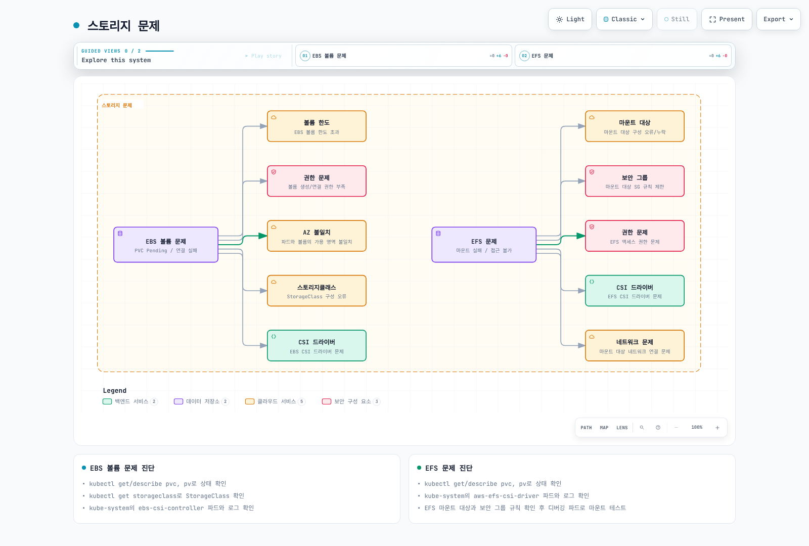
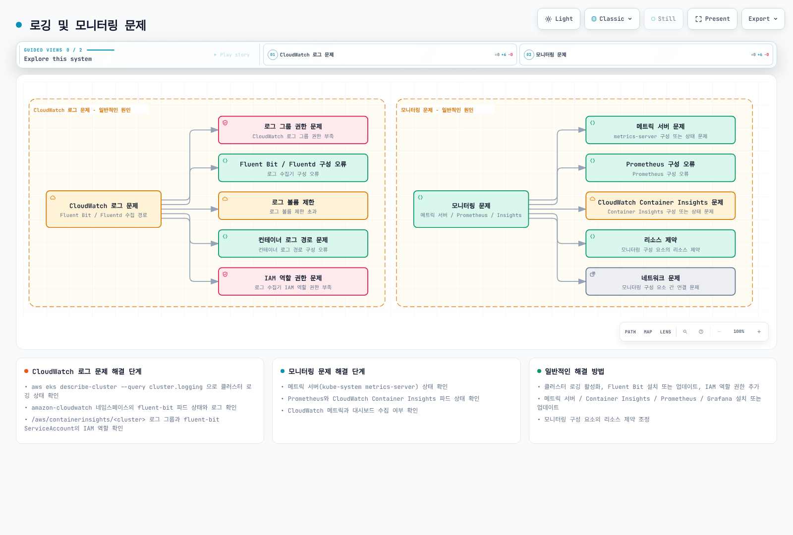
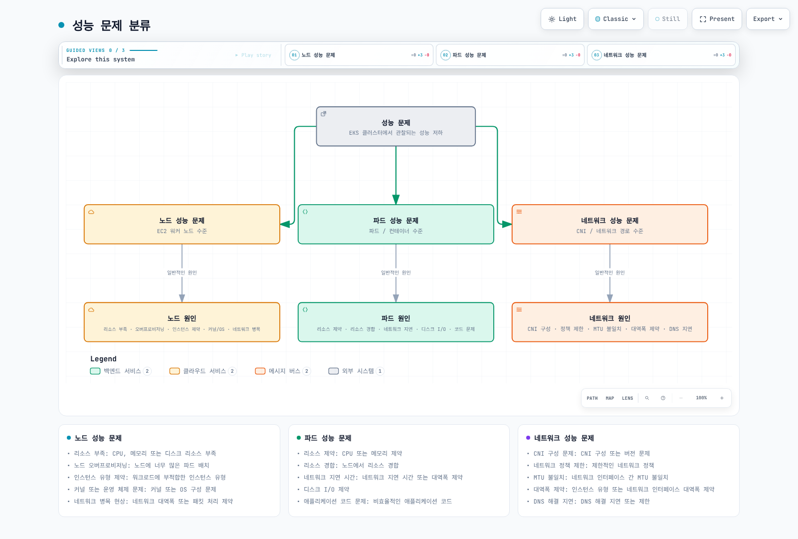
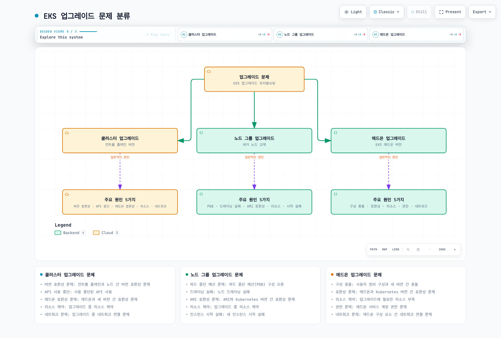
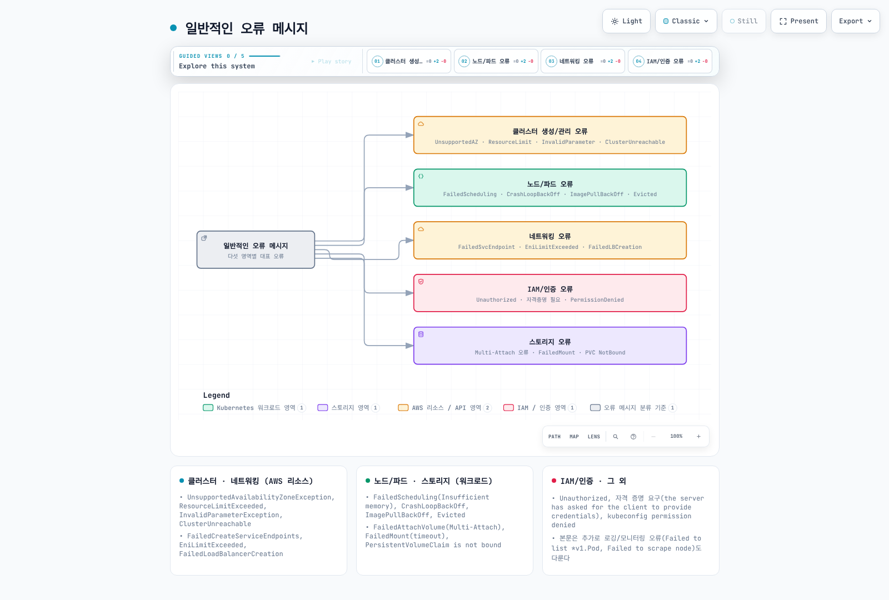

# Amazon EKS 문제 해결

> **마지막 업데이트**: 2026년 9월 12일

Amazon EKS 클러스터를 운영하다 보면 다양한 문제가 발생할 수 있습니다. 이 문서에서는 EKS 클러스터에서 발생할 수 있는 일반적인 문제와 그 해결 방법을 제공합니다.

## 목차

1. [문제 해결 기본 사항](#문제-해결-기본-사항)
2. [클러스터 생성 및 관리 문제](#클러스터-생성-및-관리-문제)
3. [네트워킹 문제](#네트워킹-문제)
4. [노드 및 파드 문제](#노드-및-파드-문제)
5. [IAM 및 인증 문제](#iam-및-인증-문제)
6. [스토리지 문제](#스토리지-문제)
7. [로깅 및 모니터링 문제](#로깅-및-모니터링-문제)
8. [성능 문제](#성능-문제)
9. [업그레이드 문제](#업그레이드-문제)
10. [일반적인 오류 메시지 및 해결 방법](#일반적인-오류-메시지-및-해결-방법)

## 문제 해결 기본 사항


[🔍 인터랙티브 다이어그램 보기](https://www.atomai.click/kubernetes-docs/archmaps/ko-eks-09-eks-troubleshooting-0.html)

### 문제 해결 접근 방식

1. 증상, 영향받는 사용자·워크로드와 장애 시간 범위를 식별합니다.
2. 리소스를 변경하기 전에 관련 상태·로그·이벤트·메트릭을 수집합니다.
3. 근거로 여러 가설을 비교합니다. 일반적인 오류 메시지를 확정 원인으로 취급하지 않습니다.
4. 데이터·가용성 영향을 파악한 표적 수정을 소유자를 통해 적용합니다.
5. 명령 종료 코드뿐 아니라 앱 동작·메트릭으로 복구를 확인합니다.
6. 원인, 변경, 결과, 남은 불확실성과 예방책을 기록합니다.

이 장의 명령은 검토한 환경을 위한 예시이며 위에서 아래로 모두 실행하는 스크립트가 아닙니다. 조회, debug 워크로드 생성, 구성 요소 재시작과 인프라 삭제의 효과는 다릅니다. 이번 검토에서는 실제 AWS·Kubernetes 작업을 실행하지 않았습니다.

### 필수 도구 및 명령어

**기존** 클러스터에서는 계정·리전·클러스터·kubectl 컨텍스트를 지정하고 일치를 확인합니다. 임의의 context 별칭에서 클러스터 이름을 추출하지 않습니다. 사용할 클러스터가 생성되기 전에 실패했다면 생성 절차의 계정·리전·원래 요청·stack 근거를 사용합니다.

```bash
set -euo pipefail
: "${AWS_REGION:?Set the intended Region}"
: "${CLUSTER_NAME:?Set the existing cluster name}"
: "${EXPECTED_ACCOUNT_ID:?Set the intended 12-digit account ID}"
: "${KUBE_CONTEXT:?Set the explicit kubectl context}"
ACTUAL_ACCOUNT_ID=$(aws sts get-caller-identity --query Account --output text)
if [ "$ACTUAL_ACCOUNT_ID" != "$EXPECTED_ACCOUNT_ID" ]; then
  echo "Account mismatch" >&2; exit 1
fi
CLUSTER_ENDPOINT=$(aws eks describe-cluster --name "$CLUSTER_NAME" --region "$AWS_REGION" \
  --query cluster.endpoint --output text)
KUBE_ENDPOINT=$(kubectl config view --context "$KUBE_CONTEXT" --minify \
  -o jsonpath='{.clusters[0].cluster.server}')
if [ "$CLUSTER_ENDPOINT" != "$KUBE_ENDPOINT" ]; then
  echo "kubectl context does not match the selected EKS cluster" >&2; exit 1
fi
export AWS_REGION CLUSTER_NAME EXPECTED_ACCOUNT_ID KUBE_CONTEXT
```

#### AWS CLI 및 eksctl

```bash
aws eks describe-cluster --name "$CLUSTER_NAME" --region "$AWS_REGION" \
  --query 'cluster.{arn:arn,status:status,version:version,health:health,access:accessConfig}'
aws eks list-nodegroups --cluster-name "$CLUSTER_NAME" --region "$AWS_REGION"
aws eks list-addons --cluster-name "$CLUSTER_NAME" --region "$AWS_REGION"
eksctl get nodegroup --cluster "$CLUSTER_NAME" --region "$AWS_REGION"
```

관리형 노드 그룹과 설치된 EKS 애드온 목록이며 모든 자체 관리 컨트롤러·컴퓨팅 리소스를 포함하지는 않습니다. 절차 선택 전에 실제 소유자와 컴퓨팅 유형을 기록합니다.

#### kubectl

```bash
kubectl --context "$KUBE_CONTEXT" get nodes -o wide
kubectl --context "$KUBE_CONTEXT" get pods -A -o wide
kubectl --context "$KUBE_CONTEXT" get services -A
kubectl --context "$KUBE_CONTEXT" get events -A --sort-by='.metadata.creationTimestamp'
: "${NAMESPACE:?}"; : "${POD_NAME:?}"
kubectl --context "$KUBE_CONTEXT" -n "$NAMESPACE" describe pod "$POD_NAME"
```

영향받는 namespace·Pod·container·node를 명시적으로 선택합니다. `describe`와 앱 로그에는 민감한 운영 정보가 포함될 수 있습니다. `kubectl auth can-i`는 특정 동작의 인가를 확인하고 `aws sts get-caller-identity`는 AWS 자격 증명 주체를 확인합니다. 어느 하나만으로 네트워크 접근이나 전체 Kubernetes 권한을 증명하지 못합니다.

### 로그 수집 및 분석

#### EKS 컨트롤 플레인 로그

기존 로깅 설정과 제한된 장애 시간 범위를 확인합니다.

```bash
set -euo pipefail
: "${CLUSTER_NAME:?}"; : "${AWS_REGION:?}"
: "${START_TIME_MS:?Set the incident-window start in epoch milliseconds}"
: "${END_TIME_MS:?Set the incident-window end in epoch milliseconds}"
aws eks describe-cluster --name "$CLUSTER_NAME" --region "$AWS_REGION" \
  --query cluster.logging --output json
aws logs filter-log-events --region "$AWS_REGION" \
  --log-group-name "/aws/eks/$CLUSTER_NAME/cluster" \
  --start-time "$START_TIME_MS" --end-time "$END_TIME_MS" \
  --max-items 200 --output json --no-cli-pager
```

컨트롤 플레인 로깅 활성화는 자체 Update ID·권한·CloudWatch 비용이 있는 별도 `UpdateClusterConfig` 변경입니다. 과거 로그를 복구하거나 앱·호스트 로그 수집을 활성화하지는 않습니다. 그룹 부재·조회 거부·빈 시간 범위는 관찰 한계입니다. 앱·호스트 로그는 `/aws/containerinsights/<cluster>/...` 또는 실제 수집기 목적지를 확인합니다.

#### 노드 로그

운영자가 접근할 수 있는 표준 Linux EC2 노드는 `spec.providerID`, 계정·리전과 SSM 전제 조건을 확인한 뒤 세션을 엽니다.

```bash
: "${INSTANCE_ID:?Verify the node EC2 ProviderID and account/Region first}"
aws ssm start-session --target "$INSTANCE_ID" --region "$AWS_REGION"
```

다음은 로컬 터미널이 아니라 **해당 노드 세션 안에서** 실행합니다. systemd·containerd 도구가 있는 이미지를 가정합니다. Bottlerocket, Fargate와 Auto Mode는 지원되는 진단 경로를 사용합니다.

```bash
sudo journalctl -u kubelet --since "15 minutes ago" --no-pager
sudo journalctl -u containerd --since "15 minutes ago" --no-pager
df -h
df -i
free -m
```

현재 EKS 최적화 Linux 노드는 containerd를 사용합니다. 해당 노드의 Docker daemon 로그는 kubelet 런타임 로그가 아닙니다. 이미지 정리·journal 삭제·재시작 전에 로그와 디스크·inode 근거를 보존합니다. 비정상 노드의 `kubectl top` 메트릭 부재만으로 CPU·메모리 고갈을 확정하지 않습니다.

#### 파드 로그

```bash
set -euo pipefail
: "${KUBE_CONTEXT:?}"; : "${NAMESPACE:?}"; : "${POD_NAME:?}"; : "${CONTAINER_NAME:?}"
kubectl --context "$KUBE_CONTEXT" -n "$NAMESPACE" logs "$POD_NAME" \
  -c "$CONTAINER_NAME" --since=15m --tail=200 --timestamps=true
# Run only when a previous container instance exists in this same Pod.
kubectl --context "$KUBE_CONTEXT" -n "$NAMESPACE" logs "$POD_NAME" \
  -c "$CONTAINER_NAME" --previous --tail=200 --timestamps=true
```

`--previous`는 **동일 Pod**의 지정 컨테이너에서 이전에 종료된 인스턴스입니다. 삭제된 이전 Pod 로그를 조회하지 못하므로 보존 이력은 로그 백엔드를 사용합니다. 일반·init container 상태, readiness와 종료 이유를 함께 확인합니다.

### 진단 정보 수집

```bash
set -euo pipefail
: "${EVIDENCE_PARENT:?Set an existing private directory}"
: "${KUBE_CONTEXT:?}"; : "${NAMESPACE:?}"
umask 077
EVIDENCE_DIR=$(mktemp -d "$EVIDENCE_PARENT/eks-diagnosis.XXXXXXXX")
kubectl --context "$KUBE_CONTEXT" get nodes -o wide > "$EVIDENCE_DIR/nodes.txt"
kubectl --context "$KUBE_CONTEXT" -n "$NAMESPACE" get pods -o wide > "$EVIDENCE_DIR/pods.txt"
kubectl --context "$KUBE_CONTEXT" -n "$NAMESPACE" get services -o wide > "$EVIDENCE_DIR/services.txt"
kubectl --context "$KUBE_CONTEXT" -n "$NAMESPACE" get events \
  --sort-by='.metadata.creationTimestamp' > "$EVIDENCE_DIR/events.txt"
printf 'Evidence saved to %s; assess the findings before remediation.\n' "$EVIDENCE_DIR"
```

조회 실패 시 예제가 중단되며 기존 파일은 부분 근거입니다. 범위를 제한한 정보로 충분하면 무차별 `cluster-info dump`나 전체 Pod 상세 수집을 피하고 공유 전에 근거를 검토·마스킹합니다.

리소스 압박은 requests·limits, 노드 allocatable과 Metrics Server가 있을 때의 `kubectl top`을 비교합니다. 접근 가능한 노드에서는 `df -h`와 `df -i`를 모두 확인합니다. 여유 바이트가 있어도 inode는 고갈될 수 있습니다. node debug Pod의 루트와 `/host`에 마운트된 호스트 루트는 다르므로 대상 경로 없는 `df -h`는 다른 파일시스템을 볼 수 있습니다. debug Pod 생성에는 namespace·이미지·profile·권한·정리 절차 검토가 필요합니다.

네트워크 진단은 출발 Pod·namespace·node, 목적지·프로토콜·포트를 식별하고 적용 정책과 출발지 resolver부터 확인합니다. 새 debug Pod는 실제 워크로드와 레이블·identity·DNS·경로가 다를 수 있습니다. ICMP ping은 TCP·UDP 앱 접근을 증명하지 못합니다. 공통 이름·미고정 이미지의 `dnsutils`·`netshoot` Pod를 반복 생성하기보다 소유자를 통해 도구·정리를 준비하고 실제 허용 경로에서 제한된 검사를 수행합니다.

출처: [EKS 문제 해결](https://docs.aws.amazon.com/eks/latest/userguide/troubleshooting.html), [Kubernetes 로그](https://kubernetes.io/docs/reference/kubectl/generated/kubectl_logs/), [노드 디버깅](https://kubernetes.io/docs/tasks/debug/debug-cluster/kubectl-node-debug/).

## 클러스터 생성 및 관리 문제


[🔍 인터랙티브 다이어그램 보기](https://www.atomai.click/kubernetes-docs/archmaps/ko-eks-09-eks-troubleshooting-1.html)

### 클러스터 생성 실패

#### 일반적인 원인

실패한 요청·CloudFormation 이벤트에서 호출자 권한, 클러스터 서비스 역할 trust·policy, 서비스 할당량, 지원 서브넷·AZ 선택, IP 여유, 이름 충돌과 서비스 가용성을 확인합니다. 이는 가설이며 실제 오류에 따라 가능성이 다릅니다.

#### 문제 해결 단계

```bash
set -euo pipefail
: "${AWS_REGION:?}"; : "${CLUSTER_ROLE_NAME:?}"; : "${VPC_ID:?}"
aws sts get-caller-identity
aws iam get-role --role-name "$CLUSTER_ROLE_NAME" \
  --query 'Role.{Arn:Arn,Trust:AssumeRolePolicyDocument}'
aws iam list-attached-role-policies --role-name "$CLUSTER_ROLE_NAME"
aws iam list-role-policies --role-name "$CLUSTER_ROLE_NAME"
aws ec2 describe-subnets --region "$AWS_REGION" --filters "Name=vpc-id,Values=$VPC_ID" \
  --query 'Subnets[].{Id:SubnetId,AZ:AvailabilityZone,AZId:AvailabilityZoneId,AvailableIPs:AvailableIpAddressCount,CIDR:CidrBlock}'
aws service-quotas list-service-quotas --service-code eks --region "$AWS_REGION"
aws cloudtrail lookup-events --region "$AWS_REGION" \
  --lookup-attributes AttributeKey=EventName,AttributeValue=CreateCluster \
  --max-items 20 --output json
```

연결된 정책만으로 호출자의 유효 권한을 알 수 없습니다. inline policy, permissions boundary, session policy와 Organizations 제어도 포함합니다. `AmazonEKSClusterPolicy`는 EKS 클러스터 서비스 역할용입니다. 사용자에게 연결해도 필요한 `eks:CreateCluster`·`iam:PassRole`이나 Kubernetes 접근 권한을 부여하지 않습니다. service-linked role 생성에도 별도 권한·생명주기가 있습니다.

네트워크는 선택한 클러스터 서브넷과 정확한 라우팅·보안 그룹·NACL을 확인합니다. 클러스터 서브넷 요구와 노드·Pod·LB 주소 용량은 별도 계획입니다. 사설 클러스터는 NAT gateway·일반 인터넷 없이 필요한 서비스 endpoint를 사용할 수 있습니다. `kubernetes.io/cluster/...` 서브넷 태그는 컨트롤 플레인 생성의 보편적 해결책이 아닙니다.

할당량 오류는 해당 서비스·quota를 식별하고 적용된 현재 값을 조회한 뒤 증가를 요청합니다. EKS 클러스터 수, EC2 vCPU·인스턴스 계열, VPC 한도는 다릅니다. “limit is 5” 같은 과거 메시지는 예시이며 현재 계정 한도가 아닙니다.

#### 일반적인 해결 방법

인프라 소유자를 통해 실제 권한·서비스 역할 trust·서브넷·IP·quota 문제를 수정하고 재시도를 검토합니다. `UnsupportedAvailabilityZoneException`은 지정한 클러스터 서브넷의 AZ가 해당 계정에서 EKS를 지원하지 않는다는 뜻입니다. 오류에 표시된 지원 AZ를 선택하며 EC2 인스턴스 유형 제공 목록만으로 진단하지 않습니다.

AWS Health의 서비스 이벤트를 확인합니다. 리전 변경은 별도 배치·데이터·네트워크 설계와 추가 클러스터를 만들 수 있으므로 기본 재시도 방식이 아닙니다. `eksctl create cluster --verbose ...`나 AWS CLI debug 플래그도 실제 생성을 실행합니다. 새 프로비저닝 전에 기존 stack event·요청 ID를 확인합니다.

### 클러스터 엔드포인트 접근 문제

#### DNS·전송·TLS·인증·인가를 구분하여 진단

endpoint mode, 허용 public CIDR과 cluster security group을 확인하고 클러스터 CA·타임아웃으로 테스트합니다.

```bash
set -euo pipefail
: "${CLUSTER_NAME:?}"; : "${AWS_REGION:?}"; : "${EVIDENCE_PARENT:?}"
umask 077
ENDPOINT_DIR=$(mktemp -d "$EVIDENCE_PARENT/eks-endpoint.XXXXXXXX")
aws eks describe-cluster --name "$CLUSTER_NAME" --region "$AWS_REGION" \
  --output json > "$ENDPOINT_DIR/cluster.json"
jq -er '.cluster.certificateAuthority.data' "$ENDPOINT_DIR/cluster.json" \
  | base64 --decode > "$ENDPOINT_DIR/cluster-ca.crt"
ENDPOINT=$(jq -er '.cluster.endpoint' "$ENDPOINT_DIR/cluster.json")
jq '.cluster.resourcesVpcConfig | {endpointPublicAccess,endpointPrivateAccess,publicAccessCidrs,clusterSecurityGroupId,vpcId}' \
  "$ENDPOINT_DIR/cluster.json"
curl --silent --show-error --connect-timeout 5 --max-time 10 \
  --cacert "$ENDPOINT_DIR/cluster-ca.crt" --output /dev/null \
  --write-out 'HTTP status: %{http_code}\n' "$ENDPOINT"
```

Kubernetes bearer token을 보내지 않는 요청입니다. 401·403은 접근이 거부되더라도 DNS·TCP·TLS 연결 성공을 보여줄 수 있습니다. HTTP 성공도 앱 상태 증명은 아닙니다. `curl -k`는 인증서 검증 오류를 숨깁니다. DNS 조회는 `https://` URL 전체가 아닌 endpoint URL의 hostname을 사용합니다.

public endpoint는 클라이언트의 실제 egress·NAT 주소와 허용 CIDR을 비교합니다. private endpoint는 VPC·연결 네트워크 경로, DNS와 보안 그룹 접근을 확인합니다. `com.amazonaws.<region>.eks` interface endpoint는 Kubernetes API가 아닌 **EKS 관리 API**용입니다. 이를 생성하는 것만으로 kubectl 접근을 해결하지 못하며 Kubernetes private endpoint는 별개입니다.

#### kubeconfig 및 권한

원시 자격 증명을 출력하지 않고 context 이름·server를 확인합니다. 별도 진단 kubeconfig에는 명시적 경로·alias를 사용하고 `NAMESPACE`를 의도한 인가 범위로 설정합니다.

```bash
set -euo pipefail
: "${CLUSTER_NAME:?}"; : "${AWS_REGION:?}"
: "${NAMESPACE:?Set the namespace for the authorization check}"
: "${DIAGNOSTIC_KUBECONFIG:?Set a separate writable kubeconfig path}"
: "${KUBE_CONTEXT:?Choose an explicit alias for this cluster}"
umask 077
aws eks update-kubeconfig --name "$CLUSTER_NAME" --region "$AWS_REGION" \
  --kubeconfig "$DIAGNOSTIC_KUBECONFIG" --alias "$KUBE_CONTEXT"
export KUBECONFIG="$DIAGNOSTIC_KUBECONFIG"
kubectl --context "$KUBE_CONTEXT" auth can-i get pods --namespace "$NAMESPACE"
```

kubeconfig 생성에는 `eks:DescribeCluster`가 필요하고 Kubernetes 인증·인가는 별도 요구입니다. role assume이 필요하면 검토한 `--role-arn`과 trust·STS 권한을 사용합니다. 세션 토큰을 출력하지 말고 설정한 SSO 세션 등 실제 자격 증명 제공자를 통해 갱신합니다.

```bash
set -euo pipefail
: "${CLUSTER_NAME:?}"; : "${AWS_REGION:?}"
aws eks describe-cluster --name "$CLUSTER_NAME" --region "$AWS_REGION" \
  --query 'cluster.accessConfig'
# Use the next command when API or API_AND_CONFIG_MAP authentication is enabled.
aws eks list-access-entries --cluster-name "$CLUSTER_NAME" --region "$AWS_REGION"
```

access-entry 인증이 켜져 있으면 해당 entry·연결 policy scope를 확인합니다. 기존 `CONFIG_MAP`·혼합 클러스터는 `aws-auth`도 사용할 수 있습니다. 기존 노드 매핑을 보존하고 계획한 마이그레이션을 수행합니다. 일반 접근 오류를 고치려고 `system:masters`를 부여하거나 ConfigMap 전체를 덮어쓰지 않습니다. IRSA의 IAM OIDC provider는 워크로드 AWS 자격 증명용이며 사람 IAM 주체의 Kubernetes 권한 매핑이 아닙니다.

#### 접근 경로 수정

endpoint mode에 맞는 사설 관리 경로나 검토한 public CIDR allow-list를 사용합니다. 진단 명령을 성공시키려고 `0.0.0.0/0`을 열지 않습니다. public access를 제거하기 전에 사설 경로를 테스트하고 무관한 기존 VPC 설정을 유지하며 configuration Update ID를 추적합니다. 계획된 변경은 [보안 장의 endpoint 절차](./05-eks-security.md)를 따릅니다.

#### CloudShell 원클릭 접근

2026년 4월 30일 원클릭 기능은 실제 지원됩니다. 클러스터 상세 화면의 **Connect**를 선택하면 kubectl이 구성된 CloudShell이 열립니다. public·private API endpoint를 모두 지원합니다. private endpoint는 CloudShell VPC environment를 자동으로 시작하며 이름을 입력하도록 안내합니다. EKS 리전에서 기능 자체의 추가 요금 없이 사용할 수 있습니다.

콘솔 접근에도 IAM·CloudShell·VPC environment 권한, Kubernetes 접근과 정상 네트워크 구성이 필요합니다. 로컬 설정을 줄여줄 뿐 인가를 우회하지 않습니다. 적용 가능한 리소스·데이터 전송 비용과 세션 주체를 확인한 뒤 명령을 실행합니다.

출처: [kubeconfig·CloudShell](https://docs.aws.amazon.com/eks/latest/userguide/create-kubeconfig.html), [원클릭 발표](https://aws.amazon.com/about-aws/whats-new/2026/04/amazon-eks-one-click-cluster-access/), [EKS PrivateLink 구분](https://docs.aws.amazon.com/eks/latest/userguide/vpc-interface-endpoints.html), [클러스터 문제 해결](https://docs.aws.amazon.com/eks/latest/userguide/troubleshooting.html).

### 클러스터 삭제 문제

#### 차단하는 의존성 확인

클러스터 삭제는 의도적인 폐기 작업이며 일반적인 문제 해결 수단이 아닙니다. 정확한 EKS·CloudFormation 오류, 클러스터 ARN·계정·리전, 업데이트 상태와 삭제 보호 설정을 확인합니다. 관리형 노드 그룹·Fargate 프로필 외에 삭제 보호와 설치한 EKS Capabilities도 삭제를 막을 수 있습니다. 삭제가 끝날 때까지 클러스터 IAM·서비스 역할을 유지합니다.

선택한 클러스터를 조사하고 엔드포인트를 명시적 kubectl 컨텍스트와 비교합니다. 아래 명령은 읽기 전용이며 삭제 대상을 자동으로 선택하지 않습니다.

```bash
set -euo pipefail
: "${CLUSTER_NAME:?Set the cluster being deliberately retired}"
: "${AWS_REGION:?}"; : "${KUBE_CONTEXT:?}"; : "${EXPECTED_ACCOUNT_ID:?}"
ACTUAL_ACCOUNT_ID=$(aws sts get-caller-identity --query Account --output text)
if [ "$ACTUAL_ACCOUNT_ID" != "$EXPECTED_ACCOUNT_ID" ]; then
  echo "Account mismatch; stop" >&2
  exit 1
fi
aws eks describe-cluster --name "$CLUSTER_NAME" --region "$AWS_REGION" \
  --query 'cluster.{arn:arn,status:status,deletionProtection:deletionProtection,endpoint:endpoint}'
kubectl config view --context "$KUBE_CONTEXT" --minify \
  -o jsonpath='{.clusters[0].cluster.server}{"\n"}'
# Compare the endpoints before inspecting Kubernetes resources.
kubectl --context "$KUBE_CONTEXT" get services -A \
  -o custom-columns='NAMESPACE:.metadata.namespace,NAME:.metadata.name,TYPE:.spec.type,CLASS:.spec.loadBalancerClass,ADDRESS:.status.loadBalancer.ingress'
kubectl --context "$KUBE_CONTEXT" get ingress -A
kubectl --context "$KUBE_CONTEXT" get pvc -A
kubectl --context "$KUBE_CONTEXT" get pv \
  -o custom-columns='NAME:.metadata.name,CLAIM_NS:.spec.claimRef.namespace,CLAIM:.spec.claimRef.name,RECLAIM:.spec.persistentVolumeReclaimPolicy,DRIVER:.spec.csi.driver,HANDLE:.spec.csi.volumeHandle'
aws eks list-nodegroups --cluster-name "$CLUSTER_NAME" --region "$AWS_REGION"
aws eks list-fargate-profiles --cluster-name "$CLUSTER_NAME" --region "$AWS_REGION"
aws eks list-capabilities --cluster-name "$CLUSTER_NAME" --region "$AWS_REGION"
aws eks list-addons --cluster-name "$CLUSTER_NAME" --region "$AWS_REGION"
```

Service의 `EXTERNAL-IP` 출력만으로 소유권을 판단할 수 없습니다. 컨트롤러 관리 `LoadBalancer` Service, 수동 external IP와 다른 Service 유형을 구분합니다. namespace·name·UID, 컨트롤러 소유권, AWS ARN과 관련 태그를 기록합니다. 컨트롤러가 설치된 Ingress·Gateway·TargetGroupBinding도 포함하고 대상 그룹·로드 밸런서 공유 여부를 확인합니다.

#### 소유자의 순서에 따라 리소스 폐기

1. 트래픽·워크로드를 이전하고 애플리케이션 일관성 백업·복원과 데이터 보존 요구를 확인합니다. PVC YAML 저장은 데이터 백업이 아닙니다. `Delete` reclaim policy는 claim 삭제 시 실제 스토리지를 삭제할 수 있으며 `Retain`은 별도 데이터·스토리지 처리 결정이 필요합니다.
2. 필요한 로드 밸런서 컨트롤러가 실행 중일 때 로드 밸런서를 소유하는 검토된 Kubernetes 리소스만 제거합니다. finalizer 처리를 기다리고 해당 AWS 리소스가 해제됐는지 확인합니다. 컨트롤러 노드를 삭제하기 전에 IAM·의존성 오류를 해결합니다. 정리 실패를 숨기려고 finalizer를 제거하지 않습니다.
3. 문서화된 소유권·리소스 삭제 의미에 따라 EKS Capabilities를 제거합니다. 관리형 노드 그룹·Fargate 프로필을 검토한 순서로 삭제하고 완료를 기다립니다. 자체 관리 노드·스택은 별도 폐기가 필요합니다. 애드온 삭제도 Kubernetes 구성 요소를 제거할 수 있으므로 네트워크·스토리지 컨트롤러는 의존 리소스 정리가 끝날 때까지 유지합니다.
4. 명시적인 폐기 결정으로만 삭제 보호를 해제하고 원래 인프라 소유자를 통해 클러스터를 삭제합니다. Auto Mode 클러스터 삭제는 관리 노드와 로드 밸런서도 삭제합니다. 이 범위와 내장 TargetGroupBinding의 대상 그룹 생명주기도 고려합니다.
5. 전용 스택·VPC, 볼륨·스냅샷, 로드 밸런서, IAM, 로그와 Prometheus scraper 등 남은 리소스의 정확한 소유권을 확인합니다. 공유 리소스와 보존 데이터는 독립적인 생명주기를 가지며 비용이 계속 발생할 수 있습니다.

다음은 앞의 트래픽·데이터 검토 후 명시적으로 선택한 Service **하나**를 삭제하는 예시이며, 조회 결과 전체를 삭제하는 루프가 아닙니다.

```bash
set -euo pipefail
: "${KUBE_CONTEXT:?}"; : "${SERVICE_NAMESPACE:?}"; : "${SERVICE_NAME:?}"
# Separate approved teardown step after traffic/data migration and owner review.
kubectl --context "$KUBE_CONTEXT" -n "$SERVICE_NAMESPACE" get service "$SERVICE_NAME" -o yaml
kubectl --context "$KUBE_CONTEXT" -n "$SERVICE_NAMESPACE" delete service "$SERVICE_NAME" \
  --wait=true --timeout=10m
```

타임아웃은 AWS 로드 밸런서의 보존·삭제를 증명하지 않습니다. finalizer, 컨트롤러 이벤트와 정확한 AWS ARN을 확인합니다. Kubernetes와 AWS 리소스 정리 완료 시점은 다를 수 있습니다.

#### 삭제 오류와 force 동작

EKS 업데이트 상세와 CloudFormation stack event로 의존성·권한·진행 중 작업 오류를 확인합니다. eksctl 0.229의 `delete cluster --force`는 실제 지원되며 오류가 발생해도 삭제를 계속하게 합니다. 완전한 정리나 orphan 소유권을 보장하지 않습니다. 별도 `--disable-nodegroup-eviction`은 eviction 대신 delete를 사용하여 PDB 검사를 우회합니다. 둘 다 기본 장애 대응 절차가 아닙니다.

계정·리전 전체 ELB·ELBv2 목록을 삭제 명령에 연결하거나, 의존성 오류를 없애려고 모든 Service·PVC·namespace를 삭제하지 않습니다. orphan을 수동 제거해야 한다면 정확한 클러스터·스택 소유권과 데이터·트래픽 영향을 확인한 뒤 해당 서비스의 검토된 폐기 절차를 따릅니다.

출처: [EKS 클러스터 삭제](https://docs.aws.amazon.com/eks/latest/userguide/delete-cluster.html), [삭제 문제 해결](https://repost.aws/knowledge-center/eks-delete-cluster-issues), [영구 볼륨 생명주기](https://kubernetes.io/docs/concepts/storage/persistent-volumes/).

## 네트워킹 문제


[🔍 인터랙티브 다이어그램 보기](https://www.atomai.click/kubernetes-docs/archmaps/ko-eks-09-eks-troubleshooting-2.html)

먼저 실제 컴퓨팅·데이터 플레인을 식별합니다. 오픈소스 VPC CNI를 사용하는 표준 EC2, Fargate, Auto Mode의 에이전트·설정은 다릅니다. Auto Mode는 `NodeClass` 네트워크 제어를 사용하며 `aws-node` DaemonSet·`ENIConfig` 변경으로 Auto Mode 노드를 구성하지 못합니다.

### 파드 간 통신 문제

#### 실패 경로 추적

출발·목적 Pod, namespace, node·AZ, IP 계열, 프로토콜과 목적 포트를 기록합니다. 허용된 테스트로 차이를 분리할 수 있으면 같은 노드·다른 노드 경로를 비교합니다. 해당 경로의 정책, 보안 그룹, 라우팅·NACL, CNI 상태, IP 할당과 path MTU를 확인합니다.

```bash
set -euo pipefail
: "${KUBE_CONTEXT:?}"; : "${NAMESPACE:?}"; : "${POD_NAME:?}"
kubectl --context "$KUBE_CONTEXT" -n "$NAMESPACE" get pod "$POD_NAME" -o wide
kubectl --context "$KUBE_CONTEXT" -n "$NAMESPACE" get pod "$POD_NAME" \
  -o jsonpath='{.metadata.labels}{"\n"}{.spec.nodeName}{"\n"}{.spec.hostNetwork}{"\n"}'
kubectl --context "$KUBE_CONTEXT" get namespace "$NAMESPACE" --show-labels
kubectl --context "$KUBE_CONTEXT" -n "$NAMESPACE" get networkpolicies
kubectl --context "$KUBE_CONTEXT" -n "$NAMESPACE" get events \
  --sort-by='.metadata.creationTimestamp'
```

표준 `networking.k8s.io/v1` NetworkPolicy는 허용 트래픽을 합집합으로 적용하며 규칙 우선순위나 “마지막 정책 우선”이 없습니다. 양쪽이 격리되어 있으면 출발 egress와 목적 ingress가 모두 허용해야 합니다. admin·cluster-wide API와 벤더 정책 엔진의 의미는 별도입니다. namespace 레이블과 `namespaceSelector`·`podSelector`가 같은 peer의 AND인지, 별도 peer의 OR인지 확인합니다.

VPC CNI는 네이티브 정책 집행을 지원하므로 별도 정책 Pod가 없다는 이유만으로 Calico·Cilium을 설치하지 않습니다. 지원 CNI·platform·kernel과 policy-agent 활성화 설정을 확인합니다. standard startup mode는 정책 구성이 끝날 때까지 새 Pod를 허용하고 strict mode는 거부에서 시작하여 DNS·의존성 정책이 필요합니다. host-network 동작과 기타 적용 범위는 해당 구현 문서를 확인합니다.

표준 VPC CNI에서는 해당 컨테이너가 존재할 때 실제 `aws-node` Pod의 `aws-network-policy-agent` 로그를 확인합니다. `kubectl get pods -l ...`이 빈 목록으로 성공해도 플러그인 설치를 증명하지 않습니다. Auto Mode는 내장 정책 제어를 사용합니다.

#### 의도한 흐름만 수정

namespace 전체 allow-all을 추가하거나 정책을 삭제하기보다 전체 허용 흐름을 검토합니다. 아래는 backend API Pod를 선택하여 frontend web Pod의 TCP 8080만 허용하는 예시입니다.

```yaml
# Example ingress policy only: review both peers and the complete allowed-flow matrix.
apiVersion: networking.k8s.io/v1
kind: NetworkPolicy
metadata:
  name: api-from-web
  namespace: backend
spec:
  podSelector:
    matchLabels:
      app: api
  policyTypes:
    - Ingress
  ingress:
    - from:
        - namespaceSelector:
            matchLabels:
              kubernetes.io/metadata.name: frontend
          podSelector:
            matchLabels:
              app: web
      ports:
        - protocol: TCP
          port: 8080
```

적용하면 다른 정책이 허용하지 않는 backend ingress는 격리될 수 있습니다. client egress, DNS와 모든 의존성을 설정하지 않으므로 허용·거부 테스트로 따로 확인합니다. 예시 이름 대신 실제 namespace·레이블을 사용합니다.

보안 그룹은 Pod 그룹·사용자 지정 Pod 서브넷을 포함한 실제 출발·목적 ENI의 그룹을 확인합니다. 소유자를 통해 필요한 source·port를 허용하며 모든 프로토콜이나 넓은 CIDR을 일반 해결책으로 추가하지 않습니다. 1500·9001 같은 MTU는 경로에 따라 다릅니다. CNI 변경·Pod 교체 전에 실패를 측정하고 캡슐화를 고려합니다.

### 서비스 접근 문제

Service selector, 실제 Pod readiness, endpoint 조건과 포트 매핑을 함께 확인합니다.

```bash
set -euo pipefail
: "${KUBE_CONTEXT:?}"; : "${NAMESPACE:?}"; : "${SERVICE_NAME:?}"
SERVICE_JSON=$(kubectl --context "$KUBE_CONTEXT" -n "$NAMESPACE" get service "$SERVICE_NAME" -o json)
printf '%s\n' "$SERVICE_JSON" | jq '{metadata: {name: .metadata.name, namespace: .metadata.namespace}, spec: .spec, status: .status}'
SELECTOR=$(printf '%s\n' "$SERVICE_JSON" | jq -r '(.spec.selector // {}) | to_entries | map("\(.key)=\(.value)") | join(",")')
if [ -n "$SELECTOR" ]; then
  kubectl --context "$KUBE_CONTEXT" -n "$NAMESPACE" get pods -l "$SELECTOR" -o wide
  kubectl --context "$KUBE_CONTEXT" -n "$NAMESPACE" get pods -l "$SELECTOR" -o json \
    | jq '.items[] | {name:.metadata.name,phase:.status.phase,ready:[.status.conditions[]? | select(.type=="Ready")],containers:.status.containerStatuses}'
else
  printf 'No selector: inspect ExternalName or explicitly managed EndpointSlices as applicable.\n'
fi
kubectl --context "$KUBE_CONTEXT" -n "$NAMESPACE" get endpointslices \
  -l "kubernetes.io/service-name=$SERVICE_NAME" -o yaml
```

폐기 예정 Endpoints API에 의존하지 말고 EndpointSlice를 사용합니다. `ready`·`serving`·`terminating`과 `publishNotReadyAddresses`, `externalTrafficPolicy`, `internalTrafficPolicy`를 확인합니다. Running Pod가 Ready라는 보장은 없습니다.

`ExternalName`은 선택된 Pod 대신 DNS alias를 진단합니다. headless Service의 `clusterIP: None`은 의도된 값입니다. selector가 없는 Service는 소유자가 관리하는 EndpointSlice를 사용할 수 있습니다. Service `port`와 `targetPort`는 달라도 되며 container port 선언만으로 앱이 해당 포트를 listen하지는 않습니다.

레이블·포트가 잘못되면 릴리스 설정에서 소유 Service·Pod template을 수정합니다. 컨트롤러 소유 Pod 하나의 레이블 변경은 지속적인 해결책이 아닙니다. 패치 전에 포트 목록 전체와 immutable 필드를 확인합니다. 원인 진단 없이 Service 삭제·재생성, ClusterIP 변경, kube-proxy 전체 재시작을 하지 않습니다.

정책이 허용하는 같은 출발지·프로토콜로 직접 Pod와 Service 접근을 비교합니다. iptables·nftables·eBPF를 조사하기 전에 kube-proxy, 대안 구현, Auto Mode 중 실제 데이터 플레인을 확인합니다. kube-proxy Pod 부재가 항상 장애는 아닙니다.

### 로드 밸런서 문제

Service·Ingress class, 어노테이션과 소유권에서 컨트롤러를 식별합니다. 표준 AWS Load Balancer Controller와 Auto Mode는 class·API·생명주기가 다릅니다. 해당 소유자의 이벤트, 서브넷 선택, IAM, 보안 그룹, target 등록과 health check를 확인합니다.

워크로드에 연결된 정확한 LB·target group ARN을 사용합니다.

```bash
set -euo pipefail
: "${AWS_REGION:?}"; : "${LOAD_BALANCER_ARN:?}"; : "${TARGET_GROUP_ARN:?}"
aws elbv2 describe-load-balancers --region "$AWS_REGION" \
  --load-balancer-arns "$LOAD_BALANCER_ARN"
aws elbv2 describe-tags --region "$AWS_REGION" \
  --resource-arns "$LOAD_BALANCER_ARN" "$TARGET_GROUP_ARN"
aws elbv2 describe-load-balancer-attributes --region "$AWS_REGION" \
  --load-balancer-arn "$LOAD_BALANCER_ARN"
aws elbv2 describe-target-groups --region "$AWS_REGION" \
  --target-group-arns "$TARGET_GROUP_ARN"
aws elbv2 describe-target-health --region "$AWS_REGION" \
  --target-group-arn "$TARGET_GROUP_ARN"
```

`describe-load-balancer-attributes`는 속성이며 운영 상태는 `describe-load-balancers`에서 확인합니다. target health reason, health-check protocol·port·path, listener·rule 경로와 앱 응답을 확인합니다. instance target은 보통 node·NodePort, IP target은 Pod target port로 접근합니다. 보안 그룹은 실제 경로에 맞아야 합니다.

자동 discovery에 사용하는 subnet role tag와 public·internal scheme, route table, IP 여유와 AZ를 확인합니다. 같은 서브넷에 public·private role tag를 모두 추가하는 것은 해결책이 아닙니다. 명시적 subnet 지정·controller 버전에 따라 tag 요구가 달라질 수 있습니다. health check 실패를 우회하려고 frontend·backend SG에 `0.0.0.0/0`을 열지 않습니다.

소유자의 현재 scheme·type 설정을 사용합니다. 기존 `aws-load-balancer-internal`·`aws-load-balancer-type: nlb` 예시를 현재 class와 혼용하지 않습니다. 소유자·scheme 변경에는 계획한 교체·트래픽 이전이 필요할 수 있으며 어노테이션 수정이 인플레이스 전환을 보장하지 않습니다. Auto Mode는 자체 관리 컨트롤러의 기존 LB를 인수하지 않습니다.

Service 삭제는 LB 삭제로 이어질 수 있고, export한 Service YAML은 완전한 트래픽·데이터 롤백 계획이 아닙니다. ALB를 수동 생성해도 Kubernetes Service에 자동으로 연결되지 않습니다. 변경 전에 선택한 소유자의 [네트워킹 가이드](./03-eks-networking-part2.md)를 확인합니다.

### DNS 문제

#### 실제 Pod가 사용하는 resolver 확인

```bash
set -euo pipefail
: "${KUBE_CONTEXT:?}"; : "${NAMESPACE:?}"; : "${POD_NAME:?}"; : "${CONTAINER_NAME:?}"
kubectl --context "$KUBE_CONTEXT" -n "$NAMESPACE" get pod "$POD_NAME" \
  -o jsonpath='{.spec.dnsPolicy}{"\n"}{.spec.dnsConfig}{"\n"}{.spec.hostNetwork}{"\n"}'
kubectl --context "$KUBE_CONTEXT" -n "$NAMESPACE" exec "$POD_NAME" \
  -c "$CONTAINER_NAME" -- cat /etc/resolv.conf
# Where this container actually includes nslookup, test the intended name.
: "${DNS_TEST_NAME:?Set the intended Service FQDN or reviewed external hostname}"
kubectl --context "$KUBE_CONTEXT" -n "$NAMESPACE" exec "$POD_NAME" \
  -c "$CONTAINER_NAME" -- nslookup "$DNS_TEST_NAME"
```

이미지에 shell·DNS 도구가 없다면 도구 제한이지 DNS 질의 실패가 아닙니다. 관련 network·identity context를 유지하는 검토된 debug 방식을 준비합니다. 새 debug Pod의 DNS·정책은 실제 Pod와 다를 수 있습니다.

표준 비 Auto 노드는 설치된 CoreDNS Deployment·Service, 설정과 EndpointSlice를 확인합니다.

```bash
kubectl --context "$KUBE_CONTEXT" -n kube-system get deployment coredns
kubectl --context "$KUBE_CONTEXT" -n kube-system get pods -l k8s-app=kube-dns -o wide
kubectl --context "$KUBE_CONTEXT" -n kube-system get service kube-dns
kubectl --context "$KUBE_CONTEXT" -n kube-system get endpointslices \
  -l kubernetes.io/service-name=kube-dns
kubectl --context "$KUBE_CONTEXT" -n kube-system get configmap coredns -o yaml
kubectl --context "$KUBE_CONTEXT" -n kube-system logs -l k8s-app=kube-dns \
  --all-containers=true --prefix=true --since=15m --tail=100
```

**Auto Mode 노드**에서는 CoreDNS가 node system service로 실행됩니다. 순수 Auto Mode는 기존 Deployment 없이도 동작할 수 있습니다. 혼합 Auto·비 Auto 클러스터는 비 Auto 노드용 Deployment를 유지해야 합니다. Auto Mode 문제를 고치려고 NodeLocal DNSCache를 설치하거나 없는 Deployment를 재시작하지 않습니다.

Pod nameserver, CoreDNS·NodeLocal upstream과 VPC resolver를 구분합니다. `169.254.20.10`은 흔히 선택하는 NodeLocal DNSCache 주소이지 보편적인 VPC DNS 주소가 아닙니다. `8.8.8.8` 같은 public resolver는 Kubernetes Service zone·AWS private DNS의 fallback이 아닙니다.

```bash
set -euo pipefail
: "${AWS_REGION:?}"; : "${VPC_ID:?}"
aws ec2 describe-vpc-attribute --region "$AWS_REGION" --vpc-id "$VPC_ID" \
  --attribute enableDnsSupport
aws ec2 describe-vpc-attribute --region "$AWS_REGION" --vpc-id "$VPC_ID" \
  --attribute enableDnsHostnames
aws ec2 describe-vpcs --region "$AWS_REGION" --vpc-ids "$VPC_ID" \
  --query 'Vpcs[].{VpcId:VpcId,DhcpOptionsId:DhcpOptionsId}'
```

DNS 속성은 `describe-vpcs`의 필드가 아니라 `describe-vpc-attribute`로 조회합니다. 반환된 ID로 DHCP option을 확인합니다. 다른 워크로드를 검토하지 않고 공유 VPC의 DHCP 설정을 바꾸지 않습니다.

#### 원인에 맞는 DNS 수정

필요한 UDP·TCP 53, 실제 CoreDNS readiness·설정, upstream 접근, DNS policy·search 설정을 확인합니다. hostNetwork Pod가 cluster DNS를 쓰려면 일반적으로 `ClusterFirstWithHostNet`이 필요하고 `dnsPolicy: None`은 완전하고 의도적인 resolver 설정이 필요합니다. DNS만 허용하는 egress policy도 다른 정책이 허용하지 않으면 선택한 Pod의 나머지 egress를 격리합니다.

소유 Corefile의 사용자 설정을 보존하고 애드온 지원 스키마를 사용합니다. scale·restart 전에 replica·resource·PDB·scheduling과 autoscaling 소유자를 확인합니다. Update ID와 실제 DNS 테스트를 유지하며 처음부터 모든 DNS Pod를 삭제하거나 추정한 최신 이미지를 설치하지 않습니다.

### VPC CNI 문제

다음은 **오픈소스 VPC CNI를 사용하는 표준 EC2 노드**용입니다. 문제 노드의 Pod를 명시적으로 선택합니다. `kubectl exec`는 label selector를 받지 않습니다.

```bash
set -euo pipefail
: "${KUBE_CONTEXT:?}"; : "${NODE_NAME:?}"
kubectl --context "$KUBE_CONTEXT" get node "$NODE_NAME" \
  -o jsonpath='{.spec.providerID}{"\n"}{.status.nodeInfo}{"\n"}{.status.allocatable.pods}{"\n"}'
kubectl --context "$KUBE_CONTEXT" -n kube-system get daemonset aws-node -o json \
  | jq '.spec.template.spec | {containers:[.containers[] | {name,image,args,env}],initContainers:[.initContainers[]? | {name,image,args,env}]}'
kubectl --context "$KUBE_CONTEXT" -n kube-system get pods \
  -l k8s-app=aws-node --field-selector "spec.nodeName=$NODE_NAME" -o wide
kubectl --context "$KUBE_CONTEXT" get pods -A \
  --field-selector "spec.nodeName=$NODE_NAME" -o wide
: "${AWS_NODE_POD:?Select the aws-node Pod on that exact node}"
kubectl --context "$KUBE_CONTEXT" -n kube-system logs "$AWS_NODE_POD" \
  -c aws-node --since=15m --tail=200
```

애드온 `configurationValues`, DaemonSet env와 관련 custom resource를 확인합니다. 모든 설정이 `aws-node` ConfigMap에 있다고 가정하지 않습니다. 노드 `.spec.podCIDR`은 VPC CNI Pod 주소 인벤토리로 신뢰할 수 없으므로 실제 Pod IP, EC2 ENI·prefix·subnet을 확인합니다.

```bash
set -euo pipefail
: "${AWS_REGION:?}"; : "${INSTANCE_ID:?Verify it from the selected node ProviderID}"
aws ec2 describe-instances --region "$AWS_REGION" --instance-ids "$INSTANCE_ID" \
  --query 'Reservations[].Instances[].{Id:InstanceId,Type:InstanceType,Subnet:SubnetId,SGs:SecurityGroups,ENIs:NetworkInterfaces}'
: "${SUBNET_ID:?Set the actual node or custom Pod subnet being investigated}"
aws ec2 describe-subnets --region "$AWS_REGION" --subnet-ids "$SUBNET_ID" \
  --query 'Subnets[].{Id:SubnetId,CIDR:CidrBlock,AvailableIPs:AvailableIpAddressCount}'
: "${INSTANCE_TYPE:?Set the selected instance type}"
aws ec2 describe-instance-types --region "$AWS_REGION" --instance-types "$INSTANCE_TYPE" \
  --query 'InstanceTypes[].{Type:InstanceType,Network:NetworkInfo}'
```

활성화된 IPAMD introspection은 노드에 설정된 endpoint(보통 loopback 61679)에서 제공합니다. 필요한 도구가 있는 허용된 node·agent 진단 방법을 사용합니다. CNI 이미지에 curl이 없다는 것은 IPAM 장애가 아닙니다.

#### 할당 제약 구분

- **서브넷 고갈·단편화:** free IP와 prefix를 비교합니다. prefix delegation에는 지원 인스턴스·설정과 연속된 prefix 블록이 필요합니다. 여유 IP 개수만으로 /28 할당 가능성을 증명하지 못합니다.
- **인스턴스 ENI·IP 한도:** `NetworkInfo`와 기존 ENI를 확인합니다. node-group desired·min·max는 노드 수이며 인스턴스 유형·노드별 한도를 바꾸지 않습니다. 검토한 새 그룹이나 지원되는 원래 launch-template 업데이트 경로로 인스턴스 설정을 변경합니다.
- **Custom networking:** 활성화 전에 맞는 `ENIConfig`, Pod subnet·SG와 node 선택을 준비합니다. secondary ENI·Pod IP의 출처를 바꾸며 무제한 용량을 만들지 않습니다.
- **Warm target:** `WARM_IP_TARGET`은 여유 IP, `MINIMUM_IP_TARGET`은 전체 할당 IP의 하한입니다. 문서에 따라 warm-ENI 동작을 우선하고 prefix mode의 warm-prefix에도 영향을 줍니다. 양의 warm 여유 없이 minimum만 설정하면 추가 할당을 막을 수 있습니다. 임의의 1·2·5 값 대신 워크로드·IP 예산에서 도출합니다.
- **Identity·소유권:** 실제 CNI IRSA·Pod Identity 또는 적용 node role과 IPv4·IPv6 policy를 확인합니다. 모든 node role에 IPv4 CNI policy를 붙이는 것은 보편적 해결책이 아닙니다.

Auto Mode는 `NodeClass`의 subnet·SG·policy를 사용하고 이 warm-IP·ENI 또는 `ENIConfig` 설정을 받지 않습니다. 관리형 네트워크 모델을 유지합니다.

지원 중간 버전·스키마에 따라 소유자를 통해 검토한 CNI 버전·설정을 적용합니다. [업그레이드 가이드](./08-eks-upgrades.md)로 정확한 애드온 요청을 추적하고 네트워크를 검증합니다. 컨테이너 이미지 하나만 바꾸거나 설정을 무조건 덮어쓰거나 모든 워크로드를 재시작하여 할당 실패를 숨기지 않습니다.

출처: [VPC CNI 정책 설정](https://docs.aws.amazon.com/eks/latest/userguide/cni-network-policy-configure.html), [Auto Mode 네트워크](https://docs.aws.amazon.com/eks/latest/userguide/auto-networking.html), [custom networking](https://docs.aws.amazon.com/eks/latest/best-practices/custom-networking.html), [CNI 설정](https://github.com/aws/amazon-vpc-cni-k8s), [Kubernetes NetworkPolicy](https://kubernetes.io/docs/concepts/services-networking/network-policies/), [EndpointSlice](https://kubernetes.io/docs/concepts/services-networking/endpoint-slices/).

## 노드 및 파드 문제


[🔍 인터랙티브 다이어그램 보기](https://www.atomai.click/kubernetes-docs/archmaps/ko-eks-09-eks-troubleshooting-3.html)

### 노드 상태 문제

#### 조건과 실제 노드 확인

`Ready=False`와 `Ready=Unknown`은 다른 근거가 필요합니다. 비정상 kubelet·런타임이 실패를 보고할 수 있고 heartbeat 부재는 연결 단절·노드 정지일 수 있습니다. Memory·Disk·PID pressure는 별도 조건이며 항상 NotReady를 뜻하지 않습니다. 한 레이블로 원인을 단정하지 말고 condition reason·시각과 lease·event를 확인합니다.

```bash
set -euo pipefail
: "${KUBE_CONTEXT:?}"; : "${NODE_NAME:?}"
NODE_JSON=$(kubectl --context "$KUBE_CONTEXT" get node "$NODE_NAME" -o json)
printf '%s\n' "$NODE_JSON" | jq '{name:.metadata.name,uid:.metadata.uid,labels:.metadata.labels,providerID:.spec.providerID,taints:.spec.taints,unschedulable:.spec.unschedulable,nodeInfo:.status.nodeInfo,conditions:.status.conditions,capacity:.status.capacity,allocatable:.status.allocatable}'
NODE_UID=$(printf '%s\n' "$NODE_JSON" | jq -er '.metadata.uid')
kubectl --context "$KUBE_CONTEXT" get events -A --field-selector "involvedObject.uid=$NODE_UID" \
  --sort-by='.metadata.creationTimestamp'
kubectl --context "$KUBE_CONTEXT" get pods -A --field-selector "spec.nodeName=$NODE_NAME" -o wide
```

EC2 확인에는 정확한 ProviderID를 사용합니다. node IP를 `grep`으로 매칭하면 다른 리소스를 선택할 수 있습니다. 관리형 그룹은 health·이미지·release·repair 설정을 확인합니다.

```bash
set -euo pipefail
: "${CLUSTER_NAME:?}"; : "${AWS_REGION:?}"; : "${NODEGROUP_NAME:?}"
aws eks describe-nodegroup --cluster-name "$CLUSTER_NAME" --nodegroup-name "$NODEGROUP_NAME" \
  --region "$AWS_REGION" \
  --query 'nodegroup.{status:status,health:health,version:version,releaseVersion:releaseVersion,amiType:amiType,nodeRepairConfig:nodeRepairConfig,updateConfig:updateConfig,scalingConfig:scalingConfig}'
```

노드 접근을 지원하는 환경에서는 기본 사항의 원격 세션 절차로 kubelet·containerd journal, 네트워크, disk byte·inode와 메모리를 확인합니다. private key를 출력하지 않고 실제 certificate·kubeconfig 경로를 검사합니다. `kubeadm certs renew`는 EKS 관리형 컨트롤 플레인 복구가 아니며 `eksctl replace nodegroup` 명령도 지원되지 않습니다. AL2023는 nodeadm 설정을 사용하므로 모든 이미지에 AL2 `/etc/eks/bootstrap.sh`를 재실행하지 않습니다.

#### 복구와 자동 repair

근거를 보존한 뒤 소유자와 복구 동작을 선택합니다. kubelet·containerd 재시작, reboot·교체는 워크로드에 영향을 주며 지속적인 IAM·네트워크·bootstrap 문제를 해결하지 못할 수 있습니다. reboot API 응답이 instance·kubelet Ready를 뜻하지는 않습니다. 동일 node·instance와 워크로드를 확인한 뒤 uncordon합니다.

계획한 교체는 용량, 영구 데이터, PDB와 교체 소유권을 확인하고 노드 하나를 timeout과 함께 drain합니다.

```bash
set -euo pipefail
: "${KUBE_CONTEXT:?Set the reviewed cluster context}"
: "${NODE_NAME:?Set one reviewed old node}"
kubectl --context "$KUBE_CONTEXT" get node "$NODE_NAME" -o wide
kubectl --context "$KUBE_CONTEXT" get node "$NODE_NAME" \
  -o jsonpath='{.spec.providerID}{"\n"}'
kubectl --context "$KUBE_CONTEXT" get pods --all-namespaces \
  --field-selector "spec.nodeName=$NODE_NAME" -o wide
# Stop on failure. Do not terminate the instance or delete the node group here.
kubectl --context "$KUBE_CONTEXT" drain "$NODE_NAME" --ignore-daemonsets --timeout=10m
```

drain 실패 후 EC2 종료로 진행하거나 기본적으로 `emptyDir` 데이터를 버리지 않습니다. 일부만 비워진 노드는 cordon 상태일 수 있습니다. PDB는 eviction 경로를 보호하며 모든 인프라 장애·종료·컨트롤러 scale-down을 막지는 않습니다. 패키지를 직접 바꾸기보다 [노드 업그레이드 절차](./08-eks-upgrades.md)의 관리형 교체를 따릅니다.

EKS 자동 node repair는 실제 지원되는 별도 기능입니다. Auto Mode는 기본 활성화이고 관리형 그룹은 `nodeRepairConfig`, Karpenter는 자체 feature·설정 요구를 사용합니다. monitoring이 조건을 보고해도 repair가 자동 활성화되지는 않습니다. 현재 기본 표에는 지속적인 Ready·runtime·kernel·networking·storage 실패 교체가 있으며 **MemoryPressure·DiskPressure의 기본 repair 동작은 없습니다**. repair threshold·parallelism과 unhealthy fleet·ARC 제어가 새 동작을 멈출 수 있지만 진행 중 동작은 계속될 수 있습니다. Lambda 하나, ASG tag 또는 `maxUnavailable`만으로 이 동작을 제공한다고 설명하지 않습니다.

### 파드 문제

#### 상태·이벤트·소유 컨트롤러 확인

```bash
set -euo pipefail
: "${KUBE_CONTEXT:?}"; : "${NAMESPACE:?}"; : "${POD_NAME:?}"
POD_JSON=$(kubectl --context "$KUBE_CONTEXT" -n "$NAMESPACE" get pod "$POD_NAME" -o json)
printf '%s\n' "$POD_JSON" | jq '{
  name:.metadata.name,uid:.metadata.uid,owners:.metadata.ownerReferences,
  node:.spec.nodeName,serviceAccount:.spec.serviceAccountName,
  imagePullSecrets:.spec.imagePullSecrets,
  containers:[.spec.containers[] | {name,image,imagePullPolicy,resources}],
  initContainers:[.spec.initContainers[]? | {name,image,resources}],
  phase:.status.phase,reason:.status.reason,message:.status.message,
  conditions:.status.conditions,containerStatuses:.status.containerStatuses,
  initContainerStatuses:.status.initContainerStatuses
}'
POD_UID=$(printf '%s\n' "$POD_JSON" | jq -er '.metadata.uid')
kubectl --context "$KUBE_CONTEXT" -n "$NAMESPACE" get events \
  --field-selector "involvedObject.uid=$POD_UID" --sort-by='.metadata.creationTimestamp'
```

기본 사항의 container별 로그 절차를 사용합니다. Pending, ContainerCreating, image-pull 대기, init-container 실패, readiness 실패, OOMKilled와 restart backoff는 서로 다른 문제입니다. CrashLoopBackOff는 반복 실패 후 backoff이며 근본 원인이 아닙니다.

| 근거 | 다음 확인 |
| --- | --- |
| Image pull 오류 | Registry·name·tag·digest·architecture, node 측 DNS·TLS·route, rate limit과 실제 pull identity |
| FailedScheduling | requests·allocatable, Pod 수, taint·affinity·topology, quota와 PVC 소비자 제약 |
| FailedMount / attach | PVC·PV·StorageClass, CSI·identity, AZ·현재 attachment. 스토리지 절 참조 |
| OOMKilled / Evicted | container 종료 상태, limit, node pressure와 사용 이력. 누수로 단정하지 않음 |
| Forbidden / admission 실패 | 정확한 API 주체와 RBAC·admission policy. Pod list 권한 추가가 registry·filesystem 접근을 고치지 않음 |

`imagePullPolicy: Always`는 없는 이미지·잘못된 자격 증명을 고치지 않습니다. 노트북 Docker pull은 node 경로·identity 검증이 아니고 Docker load도 containerd 런타임에 이미지를 자동으로 넣지 않습니다.

#### Registry 자격 증명과 워크로드 변경

private ECR은 실제 node·Fargate execution identity와 repository policy를 확인합니다. 앱 IRSA·Pod Identity는 앱 시작 전에 이미지를 pull하는 주체가 아닙니다. 사설 ECR 경로에는 API·DKR·S3 접근이 필요할 수 있으며 ECR endpoint가 임의 registry의 사설 접근을 제공하지는 않습니다.

image-pull Secret이 필요한 registry는 올바른 자격 증명이 포함된 보호된 Docker auth JSON을 사용합니다. `.dockerconfigjson`이나 비밀번호를 로그·명령 인자에 출력하지 않습니다. 데스크톱 credential-helper 참조만으로 kubelet이 사용할 자격 증명이 제공되지는 않습니다.

```bash
set -euo pipefail
: "${KUBE_CONTEXT:?}"; : "${NAMESPACE:?}"; : "${DEPLOYMENT_NAME:?}"
: "${PULL_SECRET_NAME:?Choose an application-specific secret name}"
: "${DOCKER_CONFIG_JSON:?Provide a protected registry auth JSON file}"
# Separate reviewed change; an existing Secret causes create to fail rather than replacing it.
kubectl --context "$KUBE_CONTEXT" -n "$NAMESPACE" create secret generic "$PULL_SECRET_NAME" \
  --type=kubernetes.io/dockerconfigjson \
  --from-file=".dockerconfigjson=$DOCKER_CONFIG_JSON"
PATCH=$(jq -n --arg name "$PULL_SECRET_NAME" \
  '{spec:{template:{spec:{imagePullSecrets:[{name:$name}]}}}}')
kubectl --context "$KUBE_CONTEXT" -n "$NAMESPACE" patch deployment "$DEPLOYMENT_NAME" \
  --type=strategic --patch "$PATCH"
kubectl --context "$KUBE_CONTEXT" -n "$NAMESPACE" rollout status \
  "deployment/$DEPLOYMENT_NAME" --timeout=5m
```

Secret은 Pod와 같은 namespace여야 합니다. strategic Pod-template patch는 이름 기준으로 pull-secret 항목을 병합하고 통제된 Deployment rollout을 시작합니다. 릴리스 소유권과 다른 설정을 보존합니다. 기존 Pod의 `imagePullSecrets`는 일반적으로 수정 가능한 필드가 아닙니다. ServiceAccount 기본값은 새로 승인되는 Pod에 적용되며 namespace의 default SA 변경은 무관한 워크로드에도 영향을 줄 수 있습니다. timer로 공유 Secret을 삭제·재생성하지 말고 자격 증명 소유자를 통해 만료를 관리합니다.

다른 설정 오류도 컨트롤러의 선언 template에서 고치고 rollout·readiness를 관찰합니다. 적절한 컨트롤러가 있을 때만 Pod 삭제 후 재생성되며 삭제로 근거가 사라질 수 있습니다. debug `--copy-to`는 앱 부작용을 복제할 수 있으므로 라이브 앱에 패키지를 설치하기보다 권한·정리가 명시된 검토된 진단 방식·이미지를 사용합니다.

### 리소스 제약 문제

```bash
kubectl --context "$KUBE_CONTEXT" -n "$NAMESPACE" get resourcequotas,limitranges
kubectl --context "$KUBE_CONTEXT" -n "$NAMESPACE" get pods -o wide
kubectl --context "$KUBE_CONTEXT" -n "$NAMESPACE" top pods --containers
kubectl --context "$KUBE_CONTEXT" top nodes
```

메트릭 명령은 Metrics Server와 정상 kubelet 접근이 필요합니다. 스케줄링은 현재 top 사용률이 아니라 requests·node allocatable을 사용합니다. 해당하는 init container, Pod overhead, ephemeral storage, extended resource와 Pod 수 한도를 포함합니다. namespace quota·LimitRange는 별도 제약입니다.

측정한 필요량이 뒷받침할 때만 requests를 줄입니다. memory request 감소는 Insufficient pods를 해결하거나 limit 내 동작을 보장하지 않습니다. limit 증가는 pressure를 node로 옮길 수 있습니다. 로그·cache 삭제 전에 disk·inode·image·filesystem 사용을 확인하고 장애 근거를 보존합니다.

node 수 증가는 instance별 용량을 바꾸지 않습니다. 관리형 그룹 desired·min·max는 autoscaler와 조율하며 scaling config 축소는 PDB를 따르지 않습니다. instance type 변경은 적절한 새 그룹이나 지원되는 원래 launch-template/version 경로를 사용합니다. Pod를 스케줄하기 위해 taint·affinity·topology 제약을 무조건 제거하지 않습니다.

### 자동 스케일링 문제

replica 확장(HPA), resource 추천·갱신(VPA), node provisioning(CA·Karpenter·Auto Mode)과 앱 병목을 구분합니다. 다른 provisioner가 용량을 소유하면 CA Pod가 없는 것이 정상일 수 있습니다.

```bash
set -euo pipefail
: "${KUBE_CONTEXT:?}"; : "${NAMESPACE:?}"
kubectl --context "$KUBE_CONTEXT" -n "$NAMESPACE" get hpa -o json \
  | jq '.items[] | {name:.metadata.name,target:.spec.scaleTargetRef,min:.spec.minReplicas,max:.spec.maxReplicas,current:.status.currentReplicas,desired:.status.desiredReplicas,metrics:.status.currentMetrics,conditions:.status.conditions}'
kubectl --context "$KUBE_CONTEXT" get apiservice v1beta1.metrics.k8s.io
kubectl --context "$KUBE_CONTEXT" get --raw "/apis/metrics.k8s.io/v1beta1/namespaces/$NAMESPACE/pods"
kubectl --context "$KUBE_CONTEXT" -n "$NAMESPACE" get events \
  --sort-by='.metadata.creationTimestamp'
```

AbleToScale·ScalingActive·ScalingLimited 등 HPA 조건, 현재 metrics와 behavior를 확인합니다. desired/current replica의 일시적 차이가 곧 장애는 아닙니다. CPU·memory utilization target에는 requests가 필요하며 custom·external metrics는 별도 adapter·KEDA 연동을 사용합니다. metric 오류는 scale-down을 막을 수 있습니다.

CA는 설치 릴리스, 지원 Kubernetes minor, identity, discovery tag, unschedulable Pod 제약과 group max·quota를 확인합니다. 평균 node CPU가 높다는 이유만으로 node를 추가하지 않습니다. Karpenter·Auto Mode는 해당 NodePool·NodeClaim·provider limit과 event를 확인하며 CA를 보편적 해결책으로 설치하지 않습니다.

VPA는 추천만 하는 Off, 생성 시점 Initial과 의도적인 update mode를 구분합니다. Auto는 Recreate로 대체되어 deprecated 상태이며 mode 변경은 워크로드 중단·동일 CPU/memory 신호를 쓰는 HPA 충돌을 일으킬 수 있습니다. API 조회 실패가 VPA CRD 미설치를 증명하지는 않습니다.

아래는 custom metrics 구성이 아닌 **resource metrics** HPA 예시입니다.

```yaml
# Resource metrics example, not a custom/external-metrics adapter configuration.
apiVersion: autoscaling/v2
kind: HorizontalPodAutoscaler
metadata:
  name: app-hpa
  namespace: applications
spec:
  scaleTargetRef:
    apiVersion: apps/v1
    kind: Deployment
    name: app
  minReplicas: 2
  maxReplicas: 10
  metrics:
    - type: Resource
      resource:
        name: cpu
        target:
          type: Utilization
          averageUtilization: 70
    - type: Resource
      resource:
        name: memory
        target:
          type: Utilization
          averageUtilization: 80
  behavior:
    scaleDown:
      stabilizationWindowSeconds: 300
```

70%·80%, replica 범위와 stabilization window는 예시이며 측정 기반 권고가 아닙니다. target Deployment, 적절한 requests와 용량이 필요합니다. HPA는 여러 metrics 중 가장 큰 replica 추천을 선택하며 memory 동작·adapter 오류는 워크로드별 테스트가 필요합니다. replica 소유자를 하나로 유지하고 Terraform·GitOps가 spec.replicas를 계속 되돌리지 않게 합니다.

[자동 스케일링 개념](../core/09-cluster-administration.md)과 설치한 컨트롤러의 설정 문서를 사용합니다. 미검토 master manifest를 적용하거나 node role에 AutoScalingFullAccess를 주기보다 실제 Helm values·identity·검증하고 고정한 릴리스를 확인합니다.

출처: [EKS node repair](https://docs.aws.amazon.com/eks/latest/userguide/node-repair.html), [Pod 생명주기](https://kubernetes.io/docs/concepts/workloads/pods/pod-lifecycle/), [private image pull](https://kubernetes.io/docs/tasks/configure-pod-container/pull-image-private-registry/), [HPA](https://kubernetes.io/docs/tasks/run-application/horizontal-pod-autoscale/), [VPA](https://github.com/kubernetes/autoscaler/tree/master/vertical-pod-autoscaler).

## IAM 및 인증 문제

<!-- Audit 2026-09-11: parent diagram repair pending; see core-audit/eks-troubleshooting/diagram-review.json.


[🔍 인터랙티브 다이어그램 보기](https://www.atomai.click/kubernetes-docs/archmaps/ko-eks-09-eks-troubleshooting-4.html)
-->

### 클러스터 접근 거부

AWS 호출자, EKS API 권한, kubeconfig·STS 인증, 클러스터 identity mapping과 Kubernetes 인가를 구분합니다. EKS 컨트롤 플레인의 IAM 역할과 운영자 역할은 다릅니다. AWS DescribeCluster 성공만으로 Kubernetes 접근이 부여되지 않습니다.

```bash
set -euo pipefail
: "${CLUSTER_NAME:?}"; : "${AWS_REGION:?}"; : "${KUBE_CONTEXT:?}"; : "${NAMESPACE:?}"
aws sts get-caller-identity
aws eks describe-cluster --name "$CLUSTER_NAME" --region "$AWS_REGION" \
  --query 'cluster.{arn:arn,endpoint:endpoint,access:accessConfig}'
kubectl config view --context "$KUBE_CONTEXT" --minify \
  -o jsonpath='{.contexts[0].name}{"\n"}{.clusters[0].cluster.server}{"\n"}'
kubectl --context "$KUBE_CONTEXT" auth can-i get pods -n "$NAMESPACE"
```

전송 오류는 접근 절의 endpoint·CA 검사를 사용합니다. 만료된 자격 증명은 설정한 SSO·federation·assumed-role 세션을 갱신하고 선택한 profile·role을 확인합니다. `sts get-session-token`은 보편적 갱신 명령이 아니며 출력에 자격 증명이 노출될 수 있습니다.

identity mapping을 판단하기 전에 클러스터 인증 모드를 확인합니다.

```bash
set -euo pipefail
: "${CLUSTER_NAME:?}"; : "${AWS_REGION:?}"; : "${PRINCIPAL_ARN:?Set the exact IAM principal}"
# These APIs apply to clusters with API or API_AND_CONFIG_MAP authentication.
aws eks list-access-entries --cluster-name "$CLUSTER_NAME" --region "$AWS_REGION"
aws eks describe-access-entry --cluster-name "$CLUSTER_NAME" --region "$AWS_REGION" \
  --principal-arn "$PRINCIPAL_ARN"
aws eks list-associated-access-policies --cluster-name "$CLUSTER_NAME" --region "$AWS_REGION" \
  --principal-arn "$PRINCIPAL_ARN"
```

API 접근은 정확한 principal, entry type, Kubernetes group과 연결 policy의 namespace·cluster scope를 확인합니다. `aws-auth`는 CONFIG_MAP·혼합 모드의 legacy 경로에 관련되며 부재가 전체 접근 장애를 뜻하지 않습니다. node mapping을 유지하고 인증 모드 변경 전에 문서화된 마이그레이션 방향을 확인합니다.

짧은 예시로 `aws-auth` 전체를 덮어쓰거나 일반 해결책으로 `system:masters`를 부여하지 않습니다. namespace 제한 권한을 추가해도 다른 binding·access policy의 더 넓은 권한이 취소되지는 않습니다. 접근 소유자를 통해 의도한 경로를 수정합니다.

### RBAC 문제

인증 실패, Kubernetes Forbidden, impersonation 요청 실패는 다른 근거입니다. 정확한 verb, resource·subresource, namespace와 subject kind를 확인합니다.

```bash
set -euo pipefail
: "${KUBE_CONTEXT:?}"; : "${NAMESPACE:?}"
kubectl --context "$KUBE_CONTEXT" -n "$NAMESPACE" get roles,rolebindings
kubectl --context "$KUBE_CONTEXT" get clusterroles,clusterrolebindings
: "${SUBJECT_NAME:?Set the exact subject name}"
kubectl --context "$KUBE_CONTEXT" get rolebindings -A -o json \
  | jq --arg name "$SUBJECT_NAME" '.items[] | select(any(.subjects[]?; .name == $name)) | {namespace:.metadata.namespace,name:.metadata.name,roleRef,subjects}'
kubectl --context "$KUBE_CONTEXT" get clusterrolebindings -o json \
  | jq --arg name "$SUBJECT_NAME" '.items[] | select(any(.subjects[]?; .name == $name)) | {name:.metadata.name,roleRef,subjects}'
```

쿼리는 이름이 일치하는 후보를 찾습니다. 같은 문자열이 다른 주체일 수 있으므로 kind, ServiceAccount namespace와 roleRef를 확인합니다. `kubectl auth can-i --as=...`는 impersonation 권한이 필요합니다. impersonated RBAC 검사·`--list`는 EKS access policy 권한 전체를 재현하지 못하므로 실제 의도한 주체로도 확인합니다.

예를 들어 표준 IAM access entry를 `eks-troubleshoot-readers` 그룹에 의도적으로 매핑한 뒤 다음 Role로 namespace의 Pod·Service·event·EndpointSlice 읽기와 Pod log만 부여할 수 있습니다.

```yaml
# Example for a deliberately mapped Kubernetes group in an existing namespace.
apiVersion: rbac.authorization.k8s.io/v1
kind: Role
metadata:
  name: troubleshooting-reader
  namespace: applications
rules:
  - apiGroups: [""]
    resources: [pods, services, events]
    verbs: [get, list, watch]
  - apiGroups: [""]
    resources: [pods/log]
    verbs: [get]
  - apiGroups: [discovery.k8s.io]
    resources: [endpointslices]
    verbs: [get, list, watch]
---
apiVersion: rbac.authorization.k8s.io/v1
kind: RoleBinding
metadata:
  name: troubleshooting-readers
  namespace: applications
subjects:
  - kind: Group
    name: eks-troubleshoot-readers
    apiGroup: rbac.authorization.k8s.io
roleRef:
  kind: Role
  name: troubleshooting-reader
  apiGroup: rbac.authorization.k8s.io
```

namespace는 이미 존재해야 하고 group mapping은 별도 검토합니다. 앱 ServiceAccount라면 kind ServiceAccount와 정확한 이름·namespace를 지정한 별도 binding을 사용합니다. node·namespace 읽기는 cluster scope이므로 검토한 ClusterRole이 필요합니다. 모든 진단 사용자에게 cluster-admin을 부여하지 않습니다. Secret 읽기가 없어도 log 권한으로 앱 데이터가 노출될 수 있습니다.

### IRSA 및 Pod Identity 문제

IRSA는 **워크로드 AWS 자격 증명**을 제공하며 cluster IAM OIDC provider는 사람 IAM 주체의 Kubernetes RBAC 접근 방식이 아닙니다. 실제 Pod ServiceAccount, trust·permission policy, SDK credential chain과 서비스 endpoint 접근을 확인합니다.

```bash
set -euo pipefail
: "${CLUSTER_NAME:?}"; : "${AWS_REGION:?}"; : "${KUBE_CONTEXT:?}"
: "${NAMESPACE:?}"; : "${SERVICE_ACCOUNT:?}"; : "${POD_NAME:?}"; : "${ROLE_NAME:?}"
aws eks describe-cluster --name "$CLUSTER_NAME" --region "$AWS_REGION" \
  --query cluster.identity.oidc.issuer --output text
aws iam get-role --role-name "$ROLE_NAME" --query 'Role.{Arn:Arn,Trust:AssumeRolePolicyDocument}'
aws iam list-attached-role-policies --role-name "$ROLE_NAME"
aws iam list-role-policies --role-name "$ROLE_NAME"
kubectl --context "$KUBE_CONTEXT" -n "$NAMESPACE" get serviceaccount "$SERVICE_ACCOUNT" -o json \
  | jq '{name:.metadata.name,namespace:.metadata.namespace,annotations:.metadata.annotations}'
kubectl --context "$KUBE_CONTEXT" -n "$NAMESPACE" get pod "$POD_NAME" -o json \
  | jq '{serviceAccount:.spec.serviceAccountName,containers:[.spec.containers[] | {name,awsEnvironmentNames:[.env[]? | select(.name | startswith("AWS_")) | .name]}]}'
```

여기서는 AWS 환경 변수 이름만 출력합니다. 전체 env 값이나 projected token을 출력하지 않습니다. IRSA는 지원 SDK가 projected web-identity token과 지정 역할을 사용하는지 확인합니다. 더 앞선 static·default credential source가 우선할 수 있습니다.

아래 trust 예시는 ServiceAccount subject 하나와 STS audience에 연결합니다. 계정·partition·리전·issuer ID·subject를 검증한 값으로 바꾸며 공유 역할에 그대로 덮어쓸 정책이 아닙니다.

```json
{
  "Version": "2012-10-17",
  "Statement": [
    {
      "Effect": "Allow",
      "Principal": {
        "Federated": "arn:aws:iam::123456789012:oidc-provider/oidc.eks.us-west-2.amazonaws.com/id/EXAMPLE"
      },
      "Action": "sts:AssumeRoleWithWebIdentity",
      "Condition": {
        "StringEquals": {
          "oidc.eks.us-west-2.amazonaws.com/id/EXAMPLE:aud": "sts.amazonaws.com",
          "oidc.eks.us-west-2.amazonaws.com/id/EXAMPLE:sub": "system:serviceaccount:applications:app"
        }
      }
    }
  ]
}
```

역할 변경 시 기존의 정당한 trust statement를 유지합니다. assume 성공 후에도 IAM permission·resource policy·KMS grant·조직 제어가 AWS 동작을 거부할 수 있습니다. ServiceAccount annotation 변경은 기존 Pod에 env·volume을 소급 주입하지 않으므로 소유자를 통해 rollout을 조율합니다.

현재 EKS는 OIDC discovery·JWKS용 별도 `com.amazonaws.<region>.oidc-eks` PrivateLink endpoint를 지원합니다. EKS 관리 endpoint, Pod Identity용 eks-auth, STS와 구분합니다. 사설 OIDC 접근만으로 IAM provider·role trust·STS 접근이 제공되지는 않습니다.

EKS Pod Identity는 정확한 namespace·ServiceAccount의 association을 확인합니다.

```bash
set -euo pipefail
: "${CLUSTER_NAME:?}"; : "${AWS_REGION:?}"; : "${NAMESPACE:?}"; : "${SERVICE_ACCOUNT:?}"
aws eks list-pod-identity-associations --cluster-name "$CLUSTER_NAME" --region "$AWS_REGION" \
  --namespace "$NAMESPACE" --service-account "$SERVICE_ACCOUNT"
```

반환된 association ID, role trust·permission과 agent·SDK·compute 지원 조건을 확인합니다. IRSA annotation 부재가 Pod Identity 장애는 아닙니다. association 변경, credential cache와 앞선 SDK provider를 고려합니다. 모든 소비자를 검증하기 전에 identity 방식을 바꾸거나 기존 IRSA trust를 제거하지 않습니다. 현재 설정·마이그레이션은 [보안 장](./05-eks-security.md)을 확인합니다.

### 노드 조인 실패

```bash
set -euo pipefail
: "${CLUSTER_NAME:?}"; : "${AWS_REGION:?}"; : "${NODEGROUP_NAME:?}"
aws eks describe-nodegroup --cluster-name "$CLUSTER_NAME" --nodegroup-name "$NODEGROUP_NAME" \
  --region "$AWS_REGION" \
  --query 'nodegroup.{name:nodegroupName,status:status,health:health,nodeRole:nodeRole,subnets:subnets,amiType:amiType,release:releaseVersion,launchTemplate:launchTemplate}'
aws eks describe-cluster --name "$CLUSTER_NAME" --region "$AWS_REGION" \
  --query 'cluster.{endpoint:endpoint,access:accessConfig,vpc:resourcesVpcConfig}'
```

관리형 그룹은 health.issues, launch-template·AMI·bootstrap과 실제 EC2 상태를 사용합니다. 자체 관리·hybrid는 관리형 API가 설명한다고 가정하지 말고 해당 bootstrap·등록 방식을 확인합니다.

instance-profile ARN이 아닌 IAM **role ARN**과 적절한 node 인증 mapping·access entry를 확인합니다. 관리형 그룹·Fargate에는 서비스가 관리하는 identity 동작이 있으므로 매핑을 덮어쓰지 않습니다. node entry의 type·의미는 사람용 standard entry와 다릅니다. role path·legacy aws-auth 제약도 인증 모드별 문서를 따릅니다.

필요 node policy·ECR pull 권한을 확인하되 지원되는 CNI·CSI·앱 권한은 실제 identity에 유지합니다. node role에 AmazonEKSClusterPolicy나 모든 CNI·storage 권한을 붙이는 것은 보편적인 등록 해결책이 아닙니다.

node→API server HTTPS, API server→kubelet 10250과 실제 webhook·의존성 경로의 DNS·route·NACL·SG 방향을 확인합니다. backend webhook 규칙 때문에 모든 node에 임의 출발지의 inbound 443이 필요한 것은 아닙니다.

AMI의 bootstrap 모델을 따릅니다. AL2023·nodeadm, Bottlerocket 설정과 custom AMI의 전제 조건은 다릅니다. AL2 스크립트 재실행·kubelet만 교체하는 것으로 모든 이미지를 복구하지 못합니다. 검증한 원인을 해결한 뒤 근거를 보존하고 소유자의 node 교체 절차를 따릅니다.

출처: [EKS access entry](https://docs.aws.amazon.com/eks/latest/userguide/access-entries.html), [RBAC](https://kubernetes.io/docs/reference/access-authn-authz/rbac/), [IRSA](https://docs.aws.amazon.com/eks/latest/userguide/iam-roles-for-service-accounts.html), [OIDC PrivateLink](https://docs.aws.amazon.com/eks/latest/userguide/irsa-fetch-keys.html), [EKS Pod Identity](https://docs.aws.amazon.com/eks/latest/userguide/pod-identities.html).

## 스토리지 문제



[🔍 인터랙티브 다이어그램 보기](https://www.atomai.click/kubernetes-docs/archmaps/ko-eks-09-eks-troubleshooting-5.html)


### PVC·PV·소비자 진단

정확한 namespace·claim·UID, provisioner와 소비자부터 확인합니다. WaitForFirstConsumer의 Pending은 적합한 소비 Pod가 스케줄될 때까지 정상일 수 있습니다. storage controller뿐 아니라 해당 Pod의 scheduling·zone·capacity 제약도 확인합니다.

```bash
set -euo pipefail
: "${KUBE_CONTEXT:?}"; : "${NAMESPACE:?}"; : "${PVC_NAME:?}"
PVC_JSON=$(kubectl --context "$KUBE_CONTEXT" -n "$NAMESPACE" get pvc "$PVC_NAME" -o json)
printf '%s\n' "$PVC_JSON" | jq '{name:.metadata.name,uid:.metadata.uid,status:.status,spec:.spec,storageClassFieldPresent:(.spec | has("storageClassName"))}'
PVC_UID=$(printf '%s\n' "$PVC_JSON" | jq -er '.metadata.uid')
kubectl --context "$KUBE_CONTEXT" -n "$NAMESPACE" get events \
  --field-selector "involvedObject.uid=$PVC_UID" --sort-by='.metadata.creationTimestamp'
SC_NAME=$(printf '%s\n' "$PVC_JSON" | jq -r '.spec.storageClassName // empty')
if [ -n "$SC_NAME" ]; then
  kubectl --context "$KUBE_CONTEXT" get storageclass "$SC_NAME" -o yaml
else
  printf 'Inspect absent versus explicitly empty storageClassName and default/static binding intent.\n'
fi
PV_NAME=$(printf '%s\n' "$PVC_JSON" | jq -r '.spec.volumeName // empty')
if [ -n "$PV_NAME" ]; then
  kubectl --context "$KUBE_CONTEXT" get pv "$PV_NAME" -o yaml
  kubectl --context "$KUBE_CONTEXT" get volumeattachments -o json \
    | jq --arg pv "$PV_NAME" '.items[] | select(.spec.source.persistentVolumeName == $pv) | {name:.metadata.name,spec,status}'
fi
kubectl --context "$KUBE_CONTEXT" -n "$NAMESPACE" get pods -o json \
  | jq --arg pvc "$PVC_NAME" '.items[] | select(any(.spec.volumes[]?; .persistentVolumeClaim.claimName == $pvc)) | {name:.metadata.name,node:.spec.nodeName,phase:.status.phase,conditions:.status.conditions}'
```

Pod API에는 `spec.volumes.persistentVolumeClaim.claimName` field selector가 없으므로 위 JSON 쿼리로 소비자를 찾습니다. storageClassName 부재와 명시적 빈 문자열은 default·static binding 의도가 다릅니다. `<default>`라는 class를 그대로 조회하지 않습니다.

PVC YAML은 객체 설정이며 데이터 백업이 아닙니다. claim 삭제·재생성은 Delete 정책에서 실제 storage를 삭제하거나 Retain PV를 별도 재바인딩 대상으로 남길 수 있습니다. Pending·FailedMount의 일반 해결책으로 사용하지 않습니다. 생명주기 변경 전에 reclaim policy, snapshot·backup과 workload·data 소유권을 확인합니다. Bound만으로 앱의 mount·read를 증명하지 못합니다.

### EBS 볼륨 문제

#### Driver와 실제 volume 확인

표준 `ebs.csi.aws.com`, Auto Mode `ebs.csi.eks.amazonaws.com`, legacy·migrated volume과 소유자를 구분합니다. 표준 EBS CSI controller는 구성된 IAM identity를 사용하므로 node role만 조사해서는 충분하지 않습니다. 실제 KMS key 권한과 controller·node 구성 요소 상태도 확인합니다.

Auto Mode node의 root·data volume 암호화가 모든 workload PVC의 암호화를 보장하지는 않습니다. 현재 [Auto Mode StorageClass reference](https://docs.aws.amazon.com/eks/latest/userguide/create-storage-class.html)는 encrypted 기본값을 false로 명시합니다. 두 EBS provisioner 모두 `encrypted: "true"`를 명시하고 실제 EBS volume·key를 확인합니다. 계정의 기본 암호화와 snapshot 속성도 결과에 영향을 줄 수 있습니다.

Auto Mode 자체 volume에는 표준 EBS CSI controller를 별도 설치할 필요가 없습니다. EBS는 Fargate Pod에 mount할 수 없고 EKS Hybrid Nodes도 EBS CSI driver·volume 지원 대상이 아닙니다. Fargate에서 controller를 실행할 수 있어도 Fargate workload의 EBS mount를 지원한다는 뜻은 아닙니다.

```bash
set -euo pipefail
: "${AWS_REGION:?}"; : "${VOLUME_ID:?Verify it from the selected PV CSI volumeHandle}"
aws ec2 describe-volumes --region "$AWS_REGION" --volume-ids "$VOLUME_ID" \
  --query 'Volumes[].{Id:VolumeId,State:State,AZ:AvailabilityZone,Type:VolumeType,Size:Size,Encrypted:Encrypted,KmsKey:KmsKeyId,Attachments:Attachments}'
aws ec2 describe-volume-status --region "$AWS_REGION" --volume-ids "$VOLUME_ID"
```

선택한 Pod·node와 EBS가 같은 AZ에서 사용할 수 있는지, attachment limit, CSI 오류와 VolumeAttachment·EC2 상태를 확인합니다. PVC 이름은 namespace·과거 volume 사이에서 고유하지 않으므로 PV에서 정확한 volume을 식별합니다.

#### Attach·mount 복구

Multi-Attach는 기존 소비자가 아직 실행·쓰기 중인지, node가 연결·격리되었는지, rollout이 다른 node에 두 번째 소비자를 배치했는지 확인합니다. ReadWriteOnce는 단일 node access mode이지 단일 Pod lock이 아닙니다. workload shutdown과 CSI unmount·detach를 조율하며 Pod 객체를 삭제했다고 실제 프로세스가 멈췄다고 가정하지 않습니다.

수동 attach·detach는 CSI 조정을 대체하지 못합니다. 수동 복구가 필요하면 writer 정지를 확인하고 데이터를 보호한 뒤 EBS 복구 절차를 따릅니다. mount된 volume을 분리하면 데이터가 손상될 수 있습니다. 반복 reboot·force detach로 attachment 오류를 우회하지 않습니다.

#### StorageClass와 프로비저닝

**새** 표준 driver class에 암호화·지연 binding·보존을 명시한 예시입니다.

```yaml
# New, explicitly selected StorageClass for standard EBS CSI, not an in-place edit.
apiVersion: storage.k8s.io/v1
kind: StorageClass
metadata:
  name: diagnostic-ebs-gp3
provisioner: ebs.csi.aws.com
parameters:
  type: gp3
  encrypted: "true"
  csi.storage.k8s.io/fstype: ext4
volumeBindingMode: WaitForFirstConsumer
allowVolumeExpansion: true
reclaimPolicy: Retain
```

기존 PVC class를 변경하지 않습니다. 기존 StorageClass의 provisioner·parameters·binding mode는 자유롭게 수정할 수 없으며 default class 변경은 다른 claim에도 영향을 줍니다. Retain은 별도 정리 결정을 위해 storage를 남기므로 비용이 계속 발생할 수 있습니다. 확장은 driver·class·filesystem 지원이 필요하며 요청 용량을 줄여 PVC를 축소할 수 없습니다.

기존 소유자를 통해 호환 CSI add-on과 실제 IRSA·Pod Identity·전체 설정을 구성합니다. `eksctl create iamserviceaccount --role-only`는 역할을 만들 뿐 add-on에 연결하지 않습니다. 강제 재설치 대신 조사한 add-on identity와 업데이트 절차를 사용합니다.

Auto Mode 이전은 [EBS 가이드](https://docs.aws.amazon.com/eks/latest/userguide/ebs-csi.html)의 snapshot 경로와 [Auto Mode 이전 가이드](https://docs.aws.amazon.com/eks/latest/userguide/migrate-auto.html)의 workload 정지·Retain·static PV 경로가 문서화되어 있습니다. 선택 전에 적용 driver, tag·IAM, claim·finalizer 생명주기와 복구 계획을 검증합니다. bound claim의 provisioner 문자열 변경은 마이그레이션이 아닙니다. snapshot에는 CSI snapshot controller·CRD, 적절한 class·권한도 필요합니다.

### EFS 문제

#### 프로비저닝과 mount 접근을 구분

PV의 filesystem·access point, 소비 node·AZ, mount target 가용성, DNS·NFS 경로를 확인합니다. access point 생성용 controller API 권한과 mount·파일 접근용 client 권한은 다릅니다. filesystem policy, TLS·IAM 요구, access-point POSIX identity·root-directory 소유권과 앱 UID·GID를 확인합니다.

```bash
set -euo pipefail
: "${AWS_REGION:?}"; : "${FILE_SYSTEM_ID:?Verify the filesystem from the PV}"
aws efs describe-file-systems --region "$AWS_REGION" --file-system-id "$FILE_SYSTEM_ID"
aws efs describe-mount-targets --region "$AWS_REGION" --file-system-id "$FILE_SYSTEM_ID"
aws efs describe-access-points --region "$AWS_REGION" --file-system-id "$FILE_SYSTEM_ID"
: "${MOUNT_TARGET_ID:?Choose the mount target on the affected path}"
aws efs describe-mount-target-security-groups --region "$AWS_REGION" \
  --mount-target-id "$MOUNT_TARGET_ID"
```

실제 client network identity와 mount target 사이 TCP 2049, route·NACL·SG를 확인합니다. control-plane subnet에서 node subnet을 추정하지 않습니다. workload AZ·topology에 맞는 mount target을 사용하며 추가 생성은 별도 인프라 변경입니다.

지원 EC2 환경은 설치된 EFS CSI controller·node plugin과 현재 호환 버전을 확인합니다. Fargate는 내장 EFS mount와 문서화된 static provisioning을 사용하며 현재 EKS 가이드는 Fargate node의 dynamic provisioning을 지원하지 않습니다. EFS CSI driver는 Windows container·EKS Hybrid Nodes를 지원하지 않습니다. 오래된 release-1.5 manifest를 무조건 설치하거나 관리형 add-on을 중복 설치하지 않습니다.

#### Dynamic과 static provisioning은 대안 경로

Dynamic provisioning은 **기존** EFS filesystem에 access point를 생성하며 filesystem·mount target을 만들지 않습니다. 예시 ID를 바꾸고 access-point 소유권·권한, quota·보존을 검토합니다.

```yaml
# Dynamic EFS access-point provisioning example for a supported EC2-node setup.
apiVersion: storage.k8s.io/v1
kind: StorageClass
metadata:
  name: diagnostic-efs-ap
provisioner: efs.csi.aws.com
parameters:
  provisioningMode: efs-ap
  fileSystemId: fs-0123456789abcdef0
  directoryPerms: "700"
mountOptions:
  - tls
reclaimPolicy: Retain
```

대신 준비한 기존 access point를 static PV로 참조할 수도 있습니다.

```yaml
# Alternative static provisioning: replace the filesystem/access-point IDs.
apiVersion: v1
kind: PersistentVolume
metadata:
  name: diagnostic-efs-static
spec:
  capacity:
    storage: 5Gi
  volumeMode: Filesystem
  accessModes:
    - ReadWriteMany
  persistentVolumeReclaimPolicy: Retain
  storageClassName: ""
  mountOptions:
    - tls
  csi:
    driver: efs.csi.aws.com
    volumeHandle: fs-0123456789abcdef0::fsap-0123456789abcdef0
```

static PV에는 검토한 claim의 `storageClassName: ""`와 의도한 volumeName을 지정하고 binding·claimRef 의미를 유지합니다. dynamic class와 혼용하여 filesystem root에 의도치 않게 binding하지 않습니다. 5Gi capacity는 Kubernetes binding metadata이며 EFS directory·filesystem의 강제 용량 한도가 아닙니다.

mount 진단은 기존 Pod·CSI event·log부터 사용합니다. 진단 Pod는 claim과 같은 namespace, 호환 node·identity가 필요합니다. df 확인을 위해 앱 PVC를 read-write mount하면 writer를 추가할 수 있습니다. probe가 필요하면 검토한 read-only mount, 준비한 이미지, 제한된 수명과 소유권에 맞는 정리를 사용합니다. 무관한 EBS volume 생성·수동 device 연결을 storage “테스트”로 실행하지 않습니다.

출처: [EBS CSI](https://docs.aws.amazon.com/eks/latest/userguide/ebs-csi.html), [EFS CSI](https://docs.aws.amazon.com/eks/latest/userguide/efs-csi.html), [영구 볼륨](https://kubernetes.io/docs/concepts/storage/persistent-volumes/), [StorageClass](https://kubernetes.io/docs/concepts/storage/storage-classes/).

## 로깅 및 모니터링 문제



[🔍 인터랙티브 다이어그램 보기](https://www.atomai.click/kubernetes-docs/archmaps/ko-eks-09-eks-troubleshooting-6.html)

### CloudWatch 로그와 Container Insights

EKS control-plane log 전송, Fluent Bit 등 앱·host collector, CloudWatch agent metrics와 앱 instrumentation을 구분합니다. cluster logging 활성화가 앱 collector를 설치하지 않으며 collector 실행만으로 의도한 account·region·group 도착을 증명하지 못합니다.

```bash
set -euo pipefail
: "${CLUSTER_NAME:?}"; : "${AWS_REGION:?}"; : "${KUBE_CONTEXT:?}"
aws eks describe-cluster --name "$CLUSTER_NAME" --region "$AWS_REGION" \
  --query cluster.logging
aws logs describe-log-groups --region "$AWS_REGION" \
  --log-group-name-prefix "/aws/eks/$CLUSTER_NAME/"
aws logs describe-log-groups --region "$AWS_REGION" \
  --log-group-name-prefix "/aws/containerinsights/$CLUSTER_NAME/"
: "${COLLECTOR_NAMESPACE:?}"; : "${COLLECTOR_POD:?}"; : "${COLLECTOR_CONTAINER:?}"
kubectl --context "$KUBE_CONTEXT" -n "$COLLECTOR_NAMESPACE" get pod "$COLLECTOR_POD" -o wide
kubectl --context "$KUBE_CONTEXT" -n "$COLLECTOR_NAMESPACE" logs "$COLLECTOR_POD" \
  -c "$COLLECTOR_CONTAINER" --since=15m --tail=200 --timestamps=true
```

이름·레이블을 가정하지 말고 실제 collector의 namespace·Pod·container·설정·목적지를 사용합니다. input path·parser·filter, buffering·backpressure, filesystem 용량, timestamp, output error, DNS·TLS·endpoint·quota를 확인합니다. log group 부재는 미전송·다른 목적지·조회 권한 부족일 수 있으며 group 생성만으로 producer가 고쳐지지 않습니다.

실제 IRSA·Pod Identity 등 지원 identity를 확인합니다. node policy·ServiceAccount annotation만으로 실제 사용하는 credentials를 증명하지 못합니다. CloudWatch Observability EKS add-on으로 설치한 경우 해당 identity·health를 확인합니다.

```bash
set -euo pipefail
: "${CLUSTER_NAME:?}"; : "${AWS_REGION:?}"
# Only for an installation actually owned by this EKS add-on.
aws eks describe-addon --cluster-name "$CLUSTER_NAME" --region "$AWS_REGION" \
  --addon-name amazon-cloudwatch-observability \
  --query 'addon.{status:status,version:addonVersion,health:health,role:serviceAccountRoleArn,podIdentity:podIdentityAssociations}'
```

API 오류가 add-on 부재를 증명하지는 않습니다. 오류와 실제 Helm·add-on 소유자를 확인하고 업데이트 시 소유권·사용자 설정을 보존합니다. 오래된 미렌더링 Fluentd·Fluent Bit quickstart를 적용하거나 기존 ServiceAccount를 덮어쓰는 것을 일반 복구로 사용하지 않습니다. Windows·Fargate·Auto Mode·EC2 수집 경로는 다릅니다.

Container Insights는 실제 metric namespace·dimension·time window를 조회합니다. metric 목록은 metadata이며 현재 datapoint·alarm·notification 동작 증명이 아닙니다. 제한된 data query와 collector log를 비교합니다. 설정·로그 근거를 보호하고 retention·KMS 변경은 group 소유자를 통해 수행합니다.

### Metrics Server와 Resource Metrics

```bash
set -euo pipefail
: "${KUBE_CONTEXT:?}"; : "${NAMESPACE:?}"
kubectl --context "$KUBE_CONTEXT" get apiservice v1beta1.metrics.k8s.io -o yaml
kubectl --context "$KUBE_CONTEXT" get --raw "/apis/metrics.k8s.io/v1beta1/namespaces/$NAMESPACE/pods"
kubectl --context "$KUBE_CONTEXT" -n "$NAMESPACE" top pods --containers
kubectl --context "$KUBE_CONTEXT" top nodes
```

resource Metrics API, kube-state-metrics의 객체 metrics, Prometheus·cAdvisor sample은 서로 다른 데이터 소스입니다. APIService condition, aggregator·RBAC 접근, Metrics Server log와 kubelet 연결을 확인합니다.

Unauthorized는 어떤 호출자·endpoint가 credentials를 거부했는지, Forbidden은 정확한 RBAC verb·resource를 확인합니다. scrape 실패는 route, kubelet address·port, certificate, authentication 또는 kubelet 장애 때문일 수 있습니다. 과거 unauthenticated 10255를 열거나 kubelet-insecure-tls를 보편적인 해결책으로 사용하지 않습니다.

v1.Pod resource-not-found만으로 EKS API-server 설정 결함을 확정하지 않습니다. kubeconfig·URL, discovery, client 호환성과 proxy 응답을 확인합니다. 근거 수집 전 최신 Metrics Server 재설치·전체 Pod 재시작은 문제를 숨길 수 있습니다.

### Prometheus 및 Grafana

```bash
set -euo pipefail
: "${KUBE_CONTEXT:?}"; : "${MONITORING_NAMESPACE:?}"; : "${MONITORING_RELEASE:?}"
helm status "$MONITORING_RELEASE" --namespace "$MONITORING_NAMESPACE" --kube-context "$KUBE_CONTEXT"
helm history "$MONITORING_RELEASE" --namespace "$MONITORING_NAMESPACE" --kube-context "$KUBE_CONTEXT"
kubectl --context "$KUBE_CONTEXT" -n "$MONITORING_NAMESPACE" get pods,services,pvc
kubectl --context "$KUBE_CONTEXT" -n "$MONITORING_NAMESPACE" get events \
  --sort-by='.metadata.creationTimestamp'
```

실제 chart·operator, release namespace, service port, storage와 selector를 식별합니다. prometheus-community/prometheus는 standalone chart이며 설치만으로 ServiceMonitor용 Operator 조정이 제공되지 않습니다. Operator stack에는 CRD, Prometheus custom resource와 selector·RBAC 요구가 있습니다.

기존 Prometheus를 검사하려면 한 터미널에서 loopback 전용 port-forward를 유지합니다.

```bash
: "${KUBE_CONTEXT:?}"; : "${MONITORING_NAMESPACE:?}"
: "${PROMETHEUS_SERVICE:?Select the actual Prometheus Service}"
: "${PROMETHEUS_SERVICE_PORT:?Select its Service port}"
kubectl --context "$KUBE_CONTEXT" -n "$MONITORING_NAMESPACE" port-forward \
  --address 127.0.0.1 "service/$PROMETHEUS_SERVICE" "9090:$PROMETHEUS_SERVICE_PORT"
```

이 접근을 허용하는 endpoint에 대해 두 번째 로컬 터미널에서 조회합니다.

```bash
set -euo pipefail
curl --fail --silent --show-error --max-time 10 \
  http://127.0.0.1:9090/api/v1/targets \
  | jq '.data.activeTargets[] | {scrapePool,health,lastError,lastScrape}'
```

실제 endpoint의 scheme·authentication에 맞추고 접근 제어를 우회하지 않습니다. scrape error, relabeling, discovery, query window와 retention을 확인합니다. 빈 쿼리는 label·data 부재일 수 있으며 정상 사용량 0이 아닙니다.

#### ServiceMonitor 선택

아래는 기존 앱의 이름 있는 metrics port와 Operator ServiceMonitor를 연결하는 예시입니다.

```yaml
# Requires an existing application exporting metrics on a named container port "metrics".
apiVersion: v1
kind: Service
metadata:
  name: app-metrics
  namespace: applications
  labels:
    app: metrics-demo
spec:
  selector:
    app: metrics-demo
  ports:
    - name: metrics
      port: 9090
      targetPort: metrics
---
# Requires Prometheus Operator and a Prometheus CR selecting this namespace/label.
apiVersion: monitoring.coreos.com/v1
kind: ServiceMonitor
metadata:
  name: app-metrics
  namespace: monitoring
  labels:
    release: observability
spec:
  namespaceSelector:
    matchNames:
      - applications
  selector:
    matchLabels:
      app: metrics-demo
  endpoints:
    - port: metrics
      path: /metrics
      interval: 30s
```

namespace·label·release selector를 실제 설치에 맞춥니다. Prometheus의 ServiceMonitor namespace 선택, serviceMonitorSelector의 monitor label 선택, monitor namespaceSelector·selector의 Service 선택을 구분합니다. endpoints.port는 임의 container port가 아닌 **Service port 이름**입니다. 앱이 실제로 listen하고 기대한 metrics path를 제공해야 합니다. Prometheus에는 discovery 권한과 network·TLS·auth 접근도 필요합니다.

#### 설정 보존과 변경 검증

```bash
set -euo pipefail
: "${KUBE_CONTEXT:?}"; : "${MONITORING_NAMESPACE:?}"; : "${MONITORING_RELEASE:?}"
: "${EVIDENCE_PARENT:?Set an existing private directory}"
umask 077
MONITORING_EVIDENCE=$(mktemp -d "$EVIDENCE_PARENT/monitoring-config.XXXXXXXX")
helm get values "$MONITORING_RELEASE" --namespace "$MONITORING_NAMESPACE" \
  --kube-context "$KUBE_CONTEXT" --all > "$MONITORING_EVIDENCE/values.yaml"
printf 'Protected configuration snapshot: %s\n' "$MONITORING_EVIDENCE"
```

보호된 파일의 values에도 민감 데이터가 있을 수 있으므로 공유 전에 가립니다. 대상 chart·version 기본값, CRD migration, custom values, workload resources와 PVC 용량을 검토합니다. 기존 소유자를 통해 업데이트하고 scrape·alert 동작을 검증합니다. stack 중복 설치·무조건 resource limit patch는 진단이 아닙니다.

Grafana는 datasource UID·URL·authentication, network, query label·time range와 dashboard provisioning·sidecar 선택을 확인합니다. 기대한 label·namespace 없는 ConfigMap이 자동으로 dashboard가 되지는 않습니다. 기존 login·SSO를 사용하고 관리자 비밀번호를 진단 로그에 출력하지 않습니다.

검토한 설치·query·alert 절차는 [EKS 모니터링과 로깅](./06-eks-monitoring-logging.md)을 참고합니다. 위 예시는 진단·설정 template이며 실제 log 전송·monitoring coverage·운영 준비 검증을 주장하지 않습니다.

출처: [CloudWatch EKS add-on](https://docs.aws.amazon.com/AmazonCloudWatch/latest/monitoring/Container-Insights-setup-EKS-addon.html), [Metrics Server](https://github.com/kubernetes-sigs/metrics-server), [Prometheus Operator 문제 해결](https://prometheus-operator.dev/docs/platform/troubleshooting/).

## 성능 문제

<!-- Audit 2026-09-11: parent diagram repair pending; see core-audit/eks-troubleshooting/diagram-review.json.


[🔍 인터랙티브 다이어그램 보기](https://www.atomai.click/kubernetes-docs/archmaps/ko-eks-09-eks-troubleshooting-7.html)
-->

### 비교 가능한 기준선 수립

워크로드, 요청률, 지연·오류 분포, requests·limits, node·AMI·runtime, placement와 기간을 기록합니다. 현재 사용량과 예약 용량·포화는 다르며 메모리 증가만으로 누수를 증명하지 못합니다. node·Pod·storage·network·application 병목을 구분합니다.

```bash
set -euo pipefail
: "${KUBE_CONTEXT:?}"; : "${NAMESPACE:?}"; : "${POD_NAME:?}"; : "${NODE_NAME:?}"
kubectl --context "$KUBE_CONTEXT" top nodes
kubectl --context "$KUBE_CONTEXT" -n "$NAMESPACE" top pods --containers
kubectl --context "$KUBE_CONTEXT" get node "$NODE_NAME" -o json \
  | jq '{nodeInfo:.status.nodeInfo,allocatable:.status.allocatable,conditions:.status.conditions}'
kubectl --context "$KUBE_CONTEXT" -n "$NAMESPACE" get pod "$POD_NAME" -o json \
  | jq '{containers:[.spec.containers[] | {name,resources}],status:.status}'
```

메트릭 수집 경로가 정상이어야 합니다. CPU throttling, working set·RSS·heap, OOM 종료, disk latency·queue와 network drop을 필요에 따라 포함합니다. 앱 부하와 연결하며 무관한 워크로드에 같은 100m·128Mi를 처방하지 않습니다.

### 노드 성능 문제

확인한 원격 Linux node 세션에서 필요한 도구가 있을 때 제한된 관찰을 수행합니다.

```bash
top -b -n 1
free -m
df -h
df -i
iostat -x 1 5
ip -s link
ss -s
```

이를 실행하려고 운영 앱 container에 도구를 설치하지 않습니다. 준비된 진단 이미지·지원 node 접근을 사용하고 host 변경 전에 근거를 보존합니다.

node 추가는 schedulable capacity에 도움이 되지만 instance별 network·ENI·EBS 한도를 바꾸지 않습니다. instance type은 지원 교체·launch-template 경로를 사용하며 `update-nodegroup-config --launch-template`는 유효한 명령이 아닙니다. 소유자 몰래 resize하지 말고 autoscaling·placement와 조율합니다.

#### Kernel 설정

튜닝 전에 의도한 host 또는 Pod namespace의 관련 설정을 확인합니다.

```bash
sysctl net.ipv4.ip_local_port_range net.ipv4.tcp_fin_timeout
sysctl net.core.somaxconn net.ipv4.tcp_max_syn_backlog fs.file-max
```

여러 network sysctl은 namespaced입니다. hostPID만으로 host network namespace에 들어가지 않으므로 privileged DaemonSet이 다른 network namespace와 node-global 설정을 섞어 변경할 수 있습니다. 허용된 namespaced 설정은 Pod securityContext.sysctls, node-level 설정은 소유 node 구성으로 관리합니다. kernel·Kubernetes policy 지원, 격리와 효과를 확인한 뒤 변경합니다. 임의 cluster-wide privileged sysctl 튜닝은 성능 진단이 아닙니다.

#### EBS 성능 변경

변경 전에 실제 volume type·IOPS·throughput과 instance EBS 대역폭을 확인합니다. EC2 modify-instance-attribute block-device mapping은 volume type·IOPS·throughput 튜닝 인터페이스가 아니며 EBS 작업은 ModifyVolume입니다. CSI storage는 지원하는 storage-owner 경로로 구성 일치를 유지합니다.

다음 선택적 **변경**은 owner가 지원 limit·ratio, instance 능력, 비용, 기존 modification 상태와 app·data 영향을 검토했다고 가정합니다.

```bash
set -euo pipefail
: "${AWS_REGION:?}"; : "${VOLUME_ID:?Verify the owned EBS volume}"
: "${TARGET_IOPS:?Set a reviewed supported gp3 IOPS value}"
: "${TARGET_THROUGHPUT:?Set a reviewed supported gp3 MiB/s value}"
: "${EVIDENCE_PARENT:?Set an existing private directory}"
umask 077
EBS_CHANGE_DIR=$(mktemp -d "$EVIDENCE_PARENT/ebs-performance.XXXXXXXX")
aws ec2 describe-volumes --region "$AWS_REGION" --volume-ids "$VOLUME_ID" \
  --output json > "$EBS_CHANGE_DIR/before.json"
# Separate approved volume change; this is not a diagnostic read.
aws ec2 modify-volume --region "$AWS_REGION" --volume-id "$VOLUME_ID" \
  --volume-type gp3 --iops "$TARGET_IOPS" --throughput "$TARGET_THROUGHPUT" \
  --output json > "$EBS_CHANGE_DIR/request.json"
aws ec2 describe-volumes-modifications --region "$AWS_REGION" --volume-ids "$VOLUME_ID" \
  --output json
```

비동기 요청이므로 modifying·optimizing·completed·failed를 추적합니다. 첫 응답은 완료가 아닙니다. 변경 빈도 제한을 확인하고 이전 modification이 끝난 뒤 다음 요청을 합니다. 용량 증가에는 별도 filesystem 확장도 고려합니다. 기존 16000 IOPS·1000 MiB/s는 설정 예시이며 측정한 보편적 최적값이 아닙니다. 이번 검토에서 EBS 변경을 실행하지 않았습니다.

### 파드 성능과 메모리 문제

container별 사용량·limit, restart·termination reason을 요청 부하와 연결합니다. OOMKilled는 container status에서 확인하며 Event reason 문자열에 없을 수 있습니다. node에 여유 메모리가 있어도 cgroup limit으로 OOM이 날 수 있습니다. cache 증가, allocator, burst, reachable retained object는 다른 조사이며 주기적 GC·node reboot는 일반 누수 해결책이 아닙니다.

실제 runtime·version에 맞는 profiler를 검토한 절차로 대상 process에 연결합니다. node --inspect는 새 프로세스를 시작하며 기존 앱에 자동 연결하지 않습니다. JVM·Python·Go profiler에는 도구·symbol·code·endpoint 전제 조건이 있습니다. heap dump는 pause·disk 고갈·secret 노출을 일으킬 수 있으므로 수집을 제한하고 보호합니다. 이번 장 검토에서는 profile·benchmark를 실행하지 않았습니다.

측정한 필요량·runtime overhead로 requests·limits를 조정하고 quota·rollout·HPA·VPA 소유권을 확인합니다. preferred anti-affinity·ScheduleAnyway topology spread는 선호이며 보장이 아닙니다. strict 규칙은 적격 node가 부족하면 Pending을 만들 수 있습니다. replica 확장으로 단일 thread·storage·downstream 병목이 반드시 해결되지는 않습니다.

### 네트워크 성능 문제

실제 CNI·policy·SG 경로, instance bandwidth·PPS·connection limit, MTU·DNS·placement를 확인합니다. MTU 9001 변경, ENA 활성화, launch-template 교체는 보편적인 라이브 수정이 아닙니다. platform·state 전제 조건과 소유 rollout을 따릅니다. Auto Mode는 이미 node DNS와 자체 network 설정을 제공합니다.

계획한 테스트는 호환 client·server image, resource, node·AZ placement와 TCP 5201 허용을 분리된 범위에 준비합니다. image·version·방향·topology를 기록합니다. 아래는 원래 30초 시간을 유지하면서 단일 stream의 target bitrate를 제한한 예시입니다.

```bash
set -euo pipefail
: "${KUBE_CONTEXT:?Set the approved test context}"
: "${TEST_NAMESPACE:?}"; : "${CLIENT_POD:?}"; : "${CLIENT_CONTAINER:?}"
: "${SERVER_IP:?Set the prepared test server IP}"
# Existing prepared test client/server only: one stream, 30 seconds, 10 Mbit/s target.
kubectl --context "$KUBE_CONTEXT" -n "$TEST_NAMESPACE" exec "$CLIENT_POD" \
  -c "$CLIENT_CONTAINER" -- iperf3 -c "$SERVER_IP" -P 1 -t 30 -b 10M -J
```

10 Mbit/s는 test pacing이며 예상 성능·network ceiling 증명이 아닙니다. 여러 stream은 각각 해당 제한을 적용받습니다. 먼저 client·server Ready를 확인하고 준비한 테스트 리소스만 정리합니다. DNS timing은 cache hit, upstream lookup과 command·exec overhead를 구분합니다. 실제 근거 없이 운영 throughput·latency나 성공한 benchmark를 주장하지 않습니다.

출처: [Kubernetes sysctl](https://kubernetes.io/docs/tasks/administer-cluster/sysctl-cluster/), [EBS ModifyVolume](https://docs.aws.amazon.com/botocore/latest/reference/services/ec2/client/modify_volume.html), [iperf 매뉴얼](https://software.es.net/iperf/invoking.html).

## 업그레이드 문제



[🔍 인터랙티브 다이어그램 보기](https://www.atomai.click/kubernetes-docs/archmaps/ko-eks-09-eks-troubleshooting-8.html)

### 정확한 작업 식별

cluster·node group의 ACTIVE는 특정 요청 결과를 대체하지 못합니다. Update ID, 작업 scope, 대상 version·config, 마지막 성공 단계와 오류를 기록합니다.

```bash
set -euo pipefail
: "${CLUSTER_NAME:?}"; : "${AWS_REGION:?}"; : "${UPDATE_ID:?}"
: "${UPDATE_KIND:?Set control-plane, nodegroup, or addon}"
args=(--name "$CLUSTER_NAME" --region "$AWS_REGION" --update-id "$UPDATE_ID")
case "$UPDATE_KIND" in
  control-plane) ;;
  nodegroup) : "${NODEGROUP_NAME:?}"; args+=(--nodegroup-name "$NODEGROUP_NAME") ;;
  addon) : "${ADDON_NAME:?}"; args+=(--addon-name "$ADDON_NAME") ;;
  *) echo "Invalid UPDATE_KIND" >&2; exit 2 ;;
esac
aws eks describe-update "${args[@]}" --output json --no-cli-pager
```

진행 중 작업은 [EKS 업그레이드](./08-eks-upgrades.md)의 제한된 exact-ID 폴러를 사용합니다. Successful만 성공이며 실패·취소·unknown·조회 오류는 조사해야 합니다. 로컬 timeout은 AWS 작업 취소가 아닙니다.

### 컨트롤 플레인과 API 호환성

```bash
set -euo pipefail
: "${CLUSTER_NAME:?}"; : "${AWS_REGION:?}"; : "${TARGET_VERSION:?}"
FILTER=$(jq -n --arg target "$TARGET_VERSION" \
  '{categories:["UPGRADE_READINESS"],kubernetesVersions:[$target]}')
aws eks list-insights --cluster-name "$CLUSTER_NAME" --region "$AWS_REGION" \
  --filter "$FILTER" --output json
aws eks describe-addon-versions --kubernetes-version "$TARGET_VERSION" --region "$AWS_REGION" \
  --output json
```

애드온 카탈로그와 클러스터 버전 카탈로그는 다릅니다. 실제 현재 버전·EKS 카탈로그에서 다음 지원 minor를 선택하며 upstream release로 EKS 지원을 추정하지 않습니다. 보수적 준비로 node를 현재 control-plane version에 맞추되 지원 skew 범위와 구분합니다. 일부 애드온은 control-plane 변경 전에 중간 버전이 필요합니다.

원래 manifest·Helm metadata, runtime API caller, insight와 admission·conversion webhook을 확인합니다. container image 목록이나 현재 반환된 객체의 apiVersion으로 제거된 API 호출 부재를 증명하지 못합니다. migration guide와 본문 upgrade 장의 검증된 Pluto 명령을 사용합니다. kubectl convert는 별도 plugin이지 보편적인 내장 migration·test가 아닙니다.

현재 EKS 가이드에서 일반 upgrade insight의 force 강제는 일시 철회되었으며 ROLLBACK_READINESS 차단과 별개입니다. 이전 명령 timeout만으로 업그레이드를 재제출하지 않고, 시작한 일반 control-plane upgrade를 취소할 수 있다고 가정하지 않습니다.

### 노드 그룹·애드온 복구

PDB allowed disruptions, replica·readiness, 교체 EC2·IP 용량, AMI·bootstrap과 실제 update 오류를 확인합니다. kubectl drain --force는 unmanaged Pod 제거를 허용하며 PDB eviction 검사를 우회하지 않습니다. disable-eviction과 managed-node force update는 별도 중단 의미를 가집니다. 오류를 없애려고 minAvailable을 0으로 만들거나 emptyDir 데이터를 버리지 않습니다.

EKS 최적화 AMI는 Kubernetes version과 AMI release를 모두 검토합니다. custom AMI group은 정확한 API·option으로 원래 launch template의 검토한 새 버전을 사용합니다. 실패한 update가 fleet 자동 롤백을 보장하지 않습니다. 즉시 group을 만들고 삭제하기보다 앞 node·Pod 절과 단계적 upgrade 절차를 따릅니다.

애드온은 version·config·schema, IAM·Pod Identity와 owner를 유지합니다. PRESERVE는 전체 config 병합·기능 보장이 아니며 OVERWRITE는 customization을 버릴 수 있습니다. network·storage add-on 삭제·재생성은 의존 cleanup·workload 접근을 중단할 수 있습니다. 임의 key:value payload나 CoreDNS라고 잘못 표시한 VPC CNI manifest는 유효한 복구가 아닙니다.

### 롤백은 별도 판단

현재 EKS는 완료된 인플레이스 upgrade 후 7일 내 바로 이전 minor로 조건부 rollback을 지원합니다. 자격, support policy, feature 전제 조건, compute별 순서와 ROLLBACK_READINESS를 충족해야 합니다. managed node는 control plane보다 먼저, Auto Mode는 서비스가 node부터 조정합니다. timeout·cancel·disruption은 일반 upgrade와 다릅니다.

force는 rollback insight를 우회할 뿐 전제 조건·Auto Mode disruption 제어를 우회하지 않습니다. version rollback은 workload·data 상태를 보존하며 backup restore가 아니고 add-on도 자동 복원하지 않습니다. Fargate·hybrid·custom node, support policy·복구 조건은 [전체 rollback 절차](./08-eks-upgrades.md)를 따릅니다. Git·CloudFormation rollback이 이 서비스 작업은 아닙니다.

출처: [EKS update](https://docs.aws.amazon.com/eks/latest/userguide/update-cluster.html), [관리형 node update](https://docs.aws.amazon.com/eks/latest/userguide/update-managed-node-group.html), [EKS rollback](https://docs.aws.amazon.com/eks/latest/userguide/rollback-cluster.html), [Auto Mode rollback](https://docs.aws.amazon.com/eks/latest/userguide/rollback-automode.html).

## 일반적인 오류 메시지 및 해결 방법



[🔍 인터랙티브 다이어그램 보기](https://www.atomai.click/kubernetes-docs/archmaps/ko-eks-09-eks-troubleshooting-9.html)

아래는 예시 메시지·패턴이며 모든 현재 controller가 같은 문자열을 낸다는 뜻은 아닙니다. 실제 error code, resource UID, request ID와 condition을 사용합니다. 근거가 뒷받침되기 전 원인은 가설입니다.

| 메시지 / 패턴 | 근거와 다음 조치 |
| --- | --- |
| UnsupportedAvailabilityZoneException | 선택한 cluster subnet·AZ가 해당 계정의 EKS를 지원하지 않음. EC2 instance 제공 목록만 보지 말고 오류의 지원 AZ 확인 |
| ResourceLimitExceeded / quota 오류 | 실제 service·quota·적용 limit 확인. 과거 limit 5는 현재 한도가 아님 |
| InvalidParameterException: Error in role params | role 존재·trust, caller iam:PassRole, 필요 권한과 요청 확인. 공유 role을 무조건 새로 만들지 않음 |
| ClusterUnreachable | endpoint DNS·route·SG·NACL·TLS 확인. kubeconfig 재생성만으로 전송을 고치지 못함 |
| You must be logged in ... (Unauthorized) / the server has asked for the client to provide credentials | credential provider·role·profile·exec auth와 cluster auth mode·access entry·legacy mapping 확인 |
| Forbidden | 실제 subject·verb·resource·subresource·namespace·grant 확인. impersonation 실패와 구분 |
| error loading ... .kube/config ... permission denied | 파일·owner·부모 directory 권한 확인. chmod 600만으로 잘못된 owner·path가 고쳐지지 않음 |
| dial tcp: lookup ... no such host | endpoint hostname과 실제 resolver·private path 확인. HTTPS URL 전체를 DNS 조회에 넣지 않음 |
| FailedScheduling ... Insufficient memory | requests·overhead, 적격 node allocatable, placement·quota 비교. 현재 free-memory·top만으로 scheduler 계산을 알 수 없음 |
| Insufficient pods | node allocatable Pod slot·현재 할당 확인. memory request 감소로 slot이 생기지 않음 |
| CrashLoopBackOff | 일반·init container의 현재·이전 종료 상태, previous-instance log, config·probe 확인 |
| ImagePullBackOff | image·digest·platform, node registry route·TLS·rate limit·pull identity를 실제 오류로 확인. credentials를 노출하지 않음 |
| Evicted | Pod reason·message와 node pressure·시각 확인. 적절한 데이터·가용성 복구 적용 |
| FailedCreateServiceEndpoints / EndpointSlice update 오류 | Service selector·type, Pod Ready·endpoint condition, named port와 controller event 확인 |
| EniLimitExceeded / IPAM allocation 오류 | 실제 ENI·IP·subnet·prefix·quota·오류 context 확인. prefix·custom networking은 모든 한도를 제거하지 않음 |
| FailedLoadBalancerCreation / controller provisioning 오류 | 정확한 owner·subnet·IAM·target health·SG 경로 확인. 무차별 tag·전체 허용 규칙을 추가하지 않음 |
| FailedAttachVolume: Multi-Attach ... | 실제 consumer·attachment·fencing 확인. force detach 대신 CSI unmount·detach와 데이터 안전 조율 |
| FailedMount ... timeout ... | CSI controller·node plugin, identity·KMS·topology·filesystem·attachment event 확인. node restart는 자동 해결책이 아님 |
| PersistentVolumeClaim is not bound | 정상 지연 binding과 class·provisioner·identity·consumer scheduling 문제 구분. claim을 삭제하지 않음 |
| Failed to list *v1.Pod: Unauthorized | 거부 endpoint·caller·token·identity 확인. Metrics Server restart가 누락 credentials를 복원하지 않음 |
| Failed to scrape node | 인증된 kubelet scrape 경로, certificate·address·port·network·node health 확인 |
| Failed to list *v1.Pod: the server could not find the requested resource | EKS control-plane 설정 탓으로 돌리기 전 API URL·context·discovery·client·proxy 확인 |

위 관련 절에서 범위를 제한한 근거를 수집하고 소유자와 수정을 선택합니다. 결과·미확인 가정을 보존하며 예시 메시지만으로 진단·복구 검증을 주장하지 않습니다.

## 퀴즈

[주제 퀴즈](../quizzes/eks/09-eks-troubleshooting-quiz.md)로 이해를 확인하세요.
