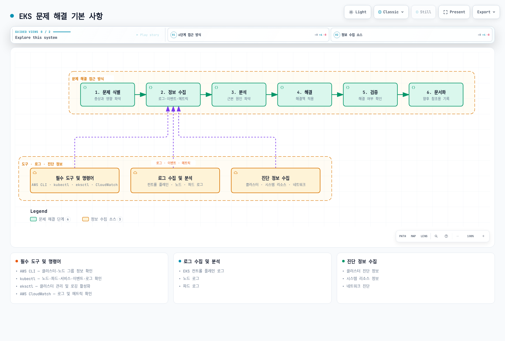
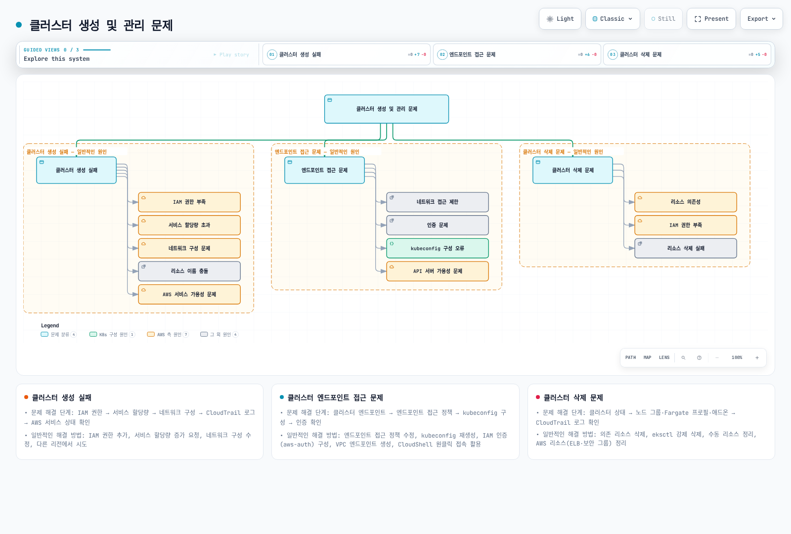
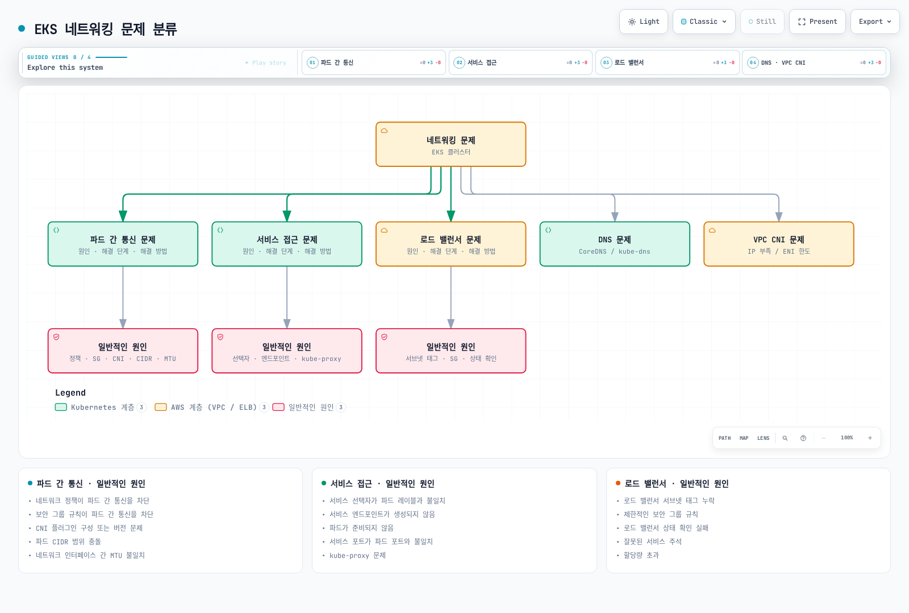
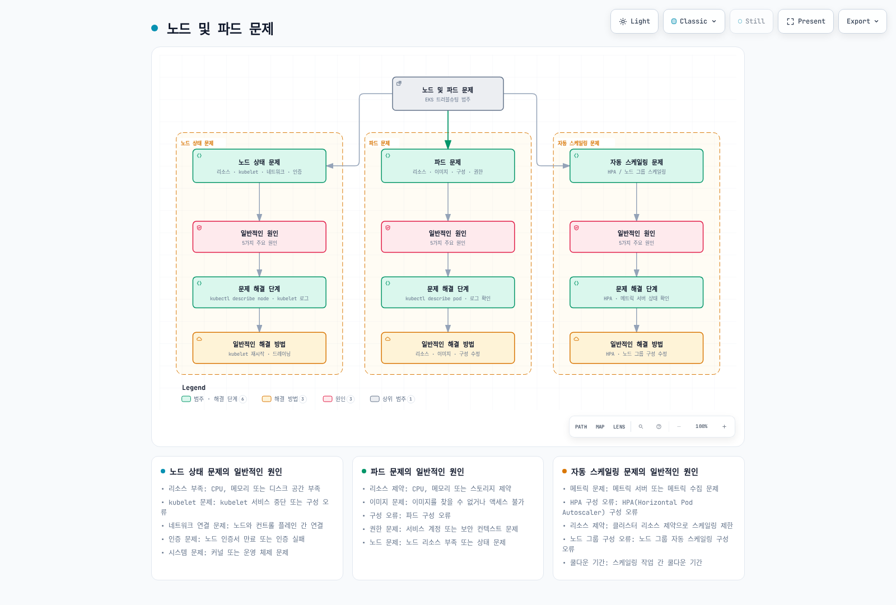
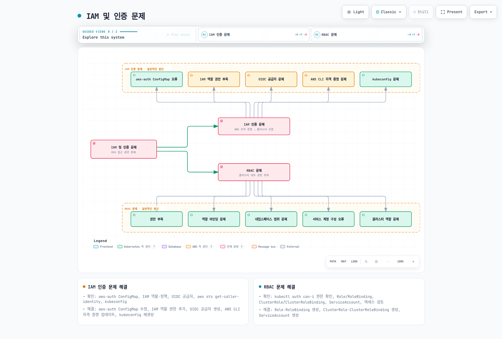
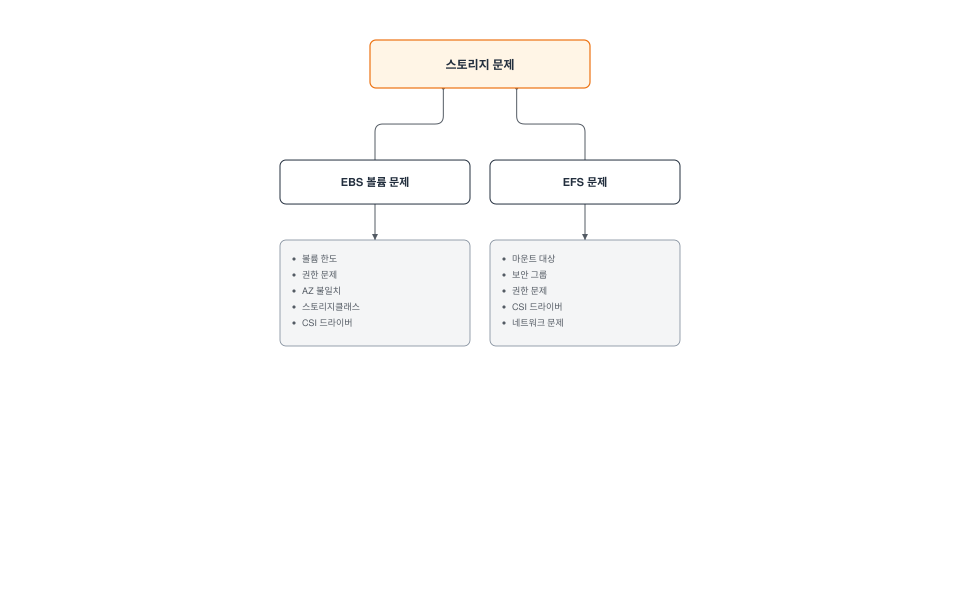
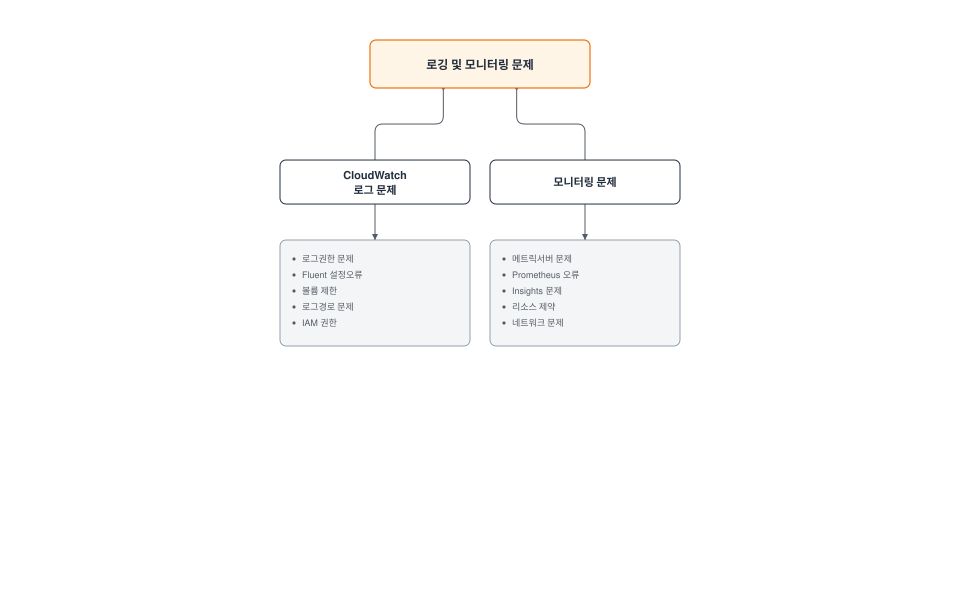
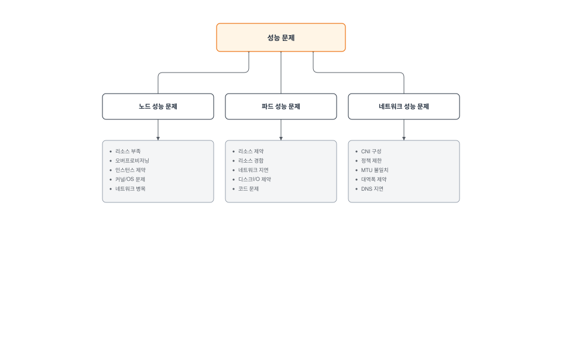
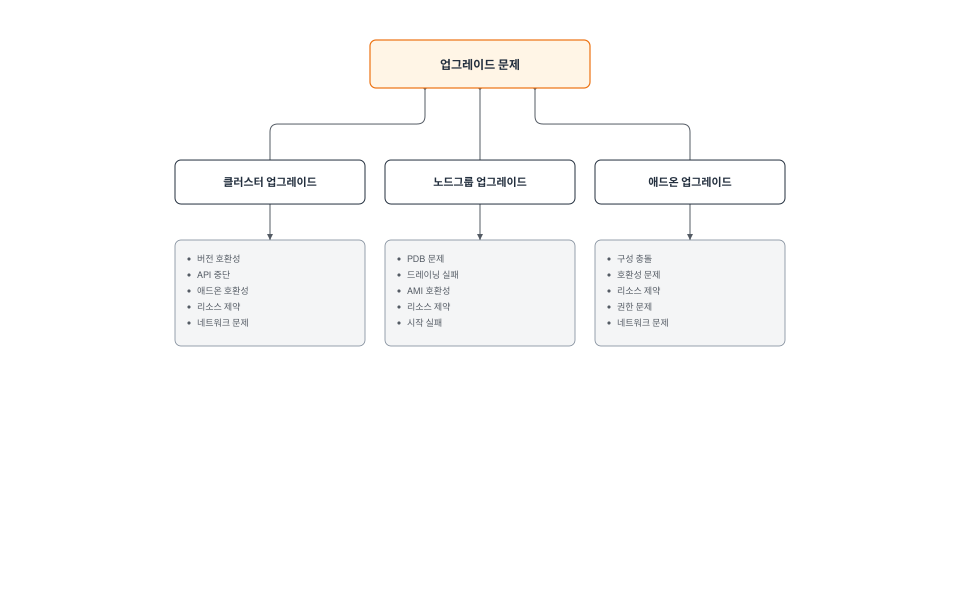
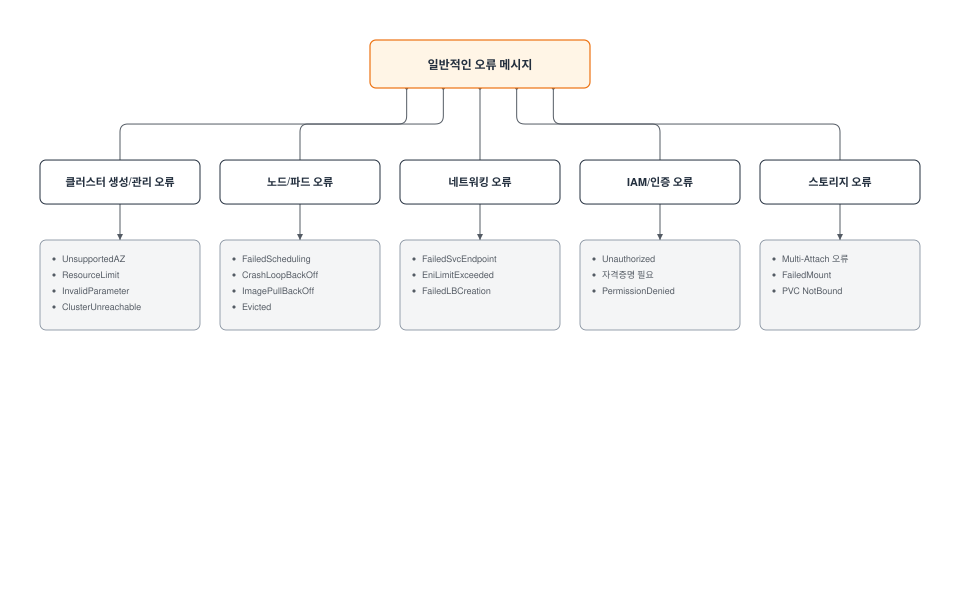

# Amazon EKS 문제 해결

> **마지막 업데이트**: 2026년 7월 3일

Amazon EKS 클러스터를 운영하다 보면 다양한 문제가 발생할 수 있습니다. 이 문서에서는 EKS 클러스터에서 발생할 수 있는 일반적인 문제와 그 해결 방법을 제공합니다.

## 목차

1. [문제 해결 기본 사항](#문제-해결-기본-사항)
2. [클러스터 생성 및 관리 문제](#클러스터-생성-및-관리-문제)
3. [네트워킹 문제](#네트워킹-문제)
4. [노드 및 파드 문제](#노드-및-파드-문제)
5. [IAM 및 인증 문제](#iam-및-인증-문제)
6. [스토리지 문제](#스토리지-문제)
7. [로깅 및 모니터링 문제](#로깅-및-모니터링-문제)
8. [성능 문제](#성능-문제)
9. [업그레이드 문제](#업그레이드-문제)
10. [일반적인 오류 메시지 및 해결 방법](#일반적인-오류-메시지-및-해결-방법)

## 문제 해결 기본 사항



[🔍 인터랙티브 다이어그램 보기](https://www.atomai.click/kubernetes-docs/archmaps/ko-eks-09-eks-troubleshooting-0.html)

### 문제 해결 접근 방식

EKS 클러스터 문제를 효과적으로 해결하기 위한 체계적인 접근 방식:

1. **문제 식별**: 문제의 증상과 영향을 명확히 파악합니다.
2. **정보 수집**: 관련 로그, 이벤트 및 메트릭을 수집합니다.
3. **분석**: 수집된 정보를 분석하여 근본 원인을 파악합니다.
4. **해결**: 적절한 해결책을 적용합니다.
5. **검증**: 문제가 해결되었는지 확인합니다.
6. **문서화**: 문제와 해결 방법을 문서화하여 향후 참조할 수 있도록 합니다.

### 필수 도구 및 명령어

EKS 문제 해결에 필요한 필수 도구 및 명령어:

#### AWS CLI

AWS CLI를 사용하여 EKS 클러스터 정보를 확인합니다:

```bash
# EKS 클러스터 목록 확인
aws eks list-clusters

# 클러스터 세부 정보 확인
aws eks describe-cluster --name my-cluster

# 노드 그룹 목록 확인
aws eks list-nodegroups --cluster-name my-cluster

# 노드 그룹 세부 정보 확인
aws eks describe-nodegroup --cluster-name my-cluster --nodegroup-name my-nodegroup
```

#### kubectl

kubectl을 사용하여 Kubernetes 리소스를 확인합니다:

```bash
# 노드 상태 확인
kubectl get nodes
kubectl describe node <node-name>

# 파드 상태 확인
kubectl get pods --all-namespaces
kubectl describe pod <pod-name> -n <namespace>

# 서비스 상태 확인
kubectl get services --all-namespaces
kubectl describe service <service-name> -n <namespace>

# 이벤트 확인
kubectl get events --all-namespaces --sort-by='.lastTimestamp'

# 로그 확인
kubectl logs <pod-name> -n <namespace>
kubectl logs <pod-name> -n <namespace> -c <container-name>
```

#### eksctl

eksctl을 사용하여 EKS 클러스터를 관리합니다:

```bash
# 클러스터 목록 확인
eksctl get clusters

# 노드 그룹 목록 확인
eksctl get nodegroup --cluster my-cluster

# 클러스터 로그 활성화
eksctl utils update-cluster-logging --enable-types all --cluster my-cluster --approve
```

#### AWS CloudWatch

CloudWatch를 사용하여 EKS 클러스터 로그 및 메트릭을 확인합니다:

```bash
# CloudWatch 로그 그룹 확인
aws logs describe-log-groups --log-group-name-prefix /aws/eks/my-cluster

# CloudWatch 로그 스트림 확인
aws logs describe-log-streams --log-group-name /aws/eks/my-cluster/cluster

# CloudWatch 로그 이벤트 확인
aws logs get-log-events --log-group-name /aws/eks/my-cluster/cluster --log-stream-name <log-stream-name>
```

### 로그 수집 및 분석

#### EKS 컨트롤 플레인 로그

EKS 컨트롤 플레인 로그를 활성화하고 확인합니다:

```bash
# 컨트롤 플레인 로그 활성화
aws eks update-cluster-config \
  --name my-cluster \
  --logging '{"clusterLogging":[{"types":["api","audit","authenticator","controllerManager","scheduler"],"enabled":true}]}'

# CloudWatch에서 로그 확인
aws logs get-log-events \
  --log-group-name /aws/eks/my-cluster/cluster \
  --log-stream-name kube-apiserver-<timestamp>
```

#### 노드 로그

노드 로그를 확인합니다:

```bash
# SSM을 사용하여 노드에 접속
aws ssm start-session --target <instance-id>

# 노드 로그 확인
sudo journalctl -u kubelet

# 컨테이너 런타임 로그 확인
sudo journalctl -u docker
sudo journalctl -u containerd
```

#### 파드 로그

파드 로그를 확인합니다:

```bash
# 파드 로그 확인
kubectl logs <pod-name> -n <namespace>

# 이전 파드의 로그 확인
kubectl logs <pod-name> -n <namespace> --previous

# 특정 컨테이너의 로그 확인
kubectl logs <pod-name> -n <namespace> -c <container-name>

# 로그 스트리밍
kubectl logs -f <pod-name> -n <namespace>
```

### 진단 정보 수집

#### 클러스터 진단 정보

클러스터 진단 정보를 수집합니다:

```bash
# 클러스터 정보 수집
kubectl cluster-info dump > cluster-info.txt

# 노드 정보 수집
kubectl describe nodes > nodes-info.txt

# 파드 정보 수집
kubectl get pods --all-namespaces -o wide > pods-info.txt
kubectl describe pods --all-namespaces > pods-desc-info.txt

# 서비스 정보 수집
kubectl get services --all-namespaces -o wide > services-info.txt
kubectl describe services --all-namespaces > services-desc-info.txt
```

#### 시스템 리소스 정보

시스템 리소스 정보를 수집합니다:

```bash
# 노드 리소스 사용량 확인
kubectl top nodes

# 파드 리소스 사용량 확인
kubectl top pods --all-namespaces

# 노드 디스크 사용량 확인
kubectl debug node/<node-name> -it --image=busybox -- df -h
```

#### 네트워크 진단

네트워크 진단 정보를 수집합니다:

```bash
# 네트워크 정책 확인
kubectl get networkpolicies --all-namespaces

# DNS 확인
kubectl run dnsutils --image=tutum/dnsutils --restart=Never -- sleep 3600
kubectl exec -it dnsutils -- nslookup kubernetes.default

# 네트워크 연결 확인
kubectl run netshoot --image=nicolaka/netshoot --restart=Never -- sleep 3600
kubectl exec -it netshoot -- ping <target-ip>
kubectl exec -it netshoot -- traceroute <target-ip>
```

## 클러스터 생성 및 관리 문제



[🔍 인터랙티브 다이어그램 보기](https://www.atomai.click/kubernetes-docs/archmaps/ko-eks-09-eks-troubleshooting-1.html)

### 클러스터 생성 실패

#### 일반적인 원인

EKS 클러스터 생성 실패의 일반적인 원인:

1. **IAM 권한 부족**: 클러스터를 생성하는 IAM 사용자 또는 역할에 필요한 권한이 없음
2. **서비스 할당량 초과**: EKS 클러스터 또는 관련 리소스(예: VPC, 서브넷)의 할당량 초과
3. **네트워크 구성 문제**: VPC, 서브넷 또는 보안 그룹 구성 오류
4. **리소스 이름 충돌**: 이미 사용 중인 클러스터 이름 또는 리소스 이름 사용
5. **AWS 서비스 가용성 문제**: EKS 또는 관련 서비스의 가용성 문제

#### 문제 해결 단계

1. **IAM 권한 확인**:

```bash
# IAM 권한 확인
aws sts get-caller-identity

# 필요한 IAM 정책 확인
aws iam list-attached-role-policies --role-name <role-name>
```

2. **서비스 할당량 확인**:

```bash
# EKS 클러스터 할당량 확인
aws service-quotas get-service-quota --service-code eks --quota-code L-1194D53C

# VPC 할당량 확인
aws service-quotas get-service-quota --service-code vpc --quota-code L-F678F1CE
```

3. **네트워크 구성 확인**:

```bash
# VPC 확인
aws ec2 describe-vpcs --vpc-ids <vpc-id>

# 서브넷 확인
aws ec2 describe-subnets --subnet-ids <subnet-id-1> <subnet-id-2>

# 라우팅 테이블 확인
aws ec2 describe-route-tables --filters "Name=vpc-id,Values=<vpc-id>"

# 보안 그룹 확인
aws ec2 describe-security-groups --group-ids <security-group-id>
```

4. **CloudTrail 로그 확인**:

```bash
# CloudTrail 이벤트 확인
aws cloudtrail lookup-events --lookup-attributes AttributeKey=EventName,AttributeValue=CreateCluster
```

5. **AWS 서비스 상태 확인**:

AWS 서비스 상태 대시보드(https://status.aws.amazon.com/)에서 EKS 및 관련 서비스의 상태를 확인합니다.

#### 일반적인 해결 방법

1. **IAM 권한 추가**:

```bash
# EKS 클러스터 관리를 위한 IAM 정책 추가
aws iam attach-role-policy \
  --role-name <role-name> \
  --policy-arn arn:aws:iam::aws:policy/AmazonEKSClusterPolicy
```

2. **서비스 할당량 증가 요청**:

```bash
# 서비스 할당량 증가 요청
aws service-quotas request-service-quota-increase \
  --service-code eks \
  --quota-code L-1194D53C \
  --desired-value <new-value>
```

3. **네트워크 구성 수정**:

```bash
# 서브넷 태그 추가
aws ec2 create-tags \
  --resources <subnet-id> \
  --tags Key=kubernetes.io/cluster/<cluster-name>,Value=shared

# 보안 그룹 규칙 추가
aws ec2 authorize-security-group-ingress \
  --group-id <security-group-id> \
  --protocol tcp \
  --port 443 \
  --cidr <cidr-block>
```

4. **다른 리전에서 시도**:

```bash
# 다른 리전에서 클러스터 생성
aws eks create-cluster \
  --region <different-region> \
  --name my-cluster \
  --role-arn <role-arn> \
  --resources-vpc-config subnetIds=<subnet-id-1>,<subnet-id-2>,securityGroupIds=<security-group-id>
```

### 클러스터 엔드포인트 접근 문제

#### 일반적인 원인

EKS 클러스터 엔드포인트 접근 문제의 일반적인 원인:

1. **네트워크 접근 제한**: 클러스터 엔드포인트에 대한 네트워크 접근 제한
2. **인증 문제**: 클러스터에 대한 인증 문제
3. **kubeconfig 구성 오류**: 잘못된 kubeconfig 구성
4. **API 서버 가용성 문제**: API 서버 가용성 문제

#### 문제 해결 단계

1. **클러스터 엔드포인트 확인**:

```bash
# 클러스터 엔드포인트 확인
aws eks describe-cluster --name my-cluster --query "cluster.endpoint"

# 엔드포인트 접근 테스트
curl -k <cluster-endpoint>
```

2. **클러스터 엔드포인트 접근 정책 확인**:

```bash
# 클러스터 엔드포인트 접근 정책 확인
aws eks describe-cluster --name my-cluster --query "cluster.resourcesVpcConfig.endpointPublicAccess"
aws eks describe-cluster --name my-cluster --query "cluster.resourcesVpcConfig.endpointPrivateAccess"
aws eks describe-cluster --name my-cluster --query "cluster.resourcesVpcConfig.publicAccessCidrs"
```

3. **kubeconfig 구성 확인**:

```bash
# kubeconfig 구성 확인
cat ~/.kube/config

# kubeconfig 업데이트
aws eks update-kubeconfig --name my-cluster --region <region>
```

4. **인증 확인**:

```bash
# AWS CLI 자격 증명 확인
aws sts get-caller-identity

# kubectl 인증 테스트
kubectl auth can-i get pods
```

#### 일반적인 해결 방법

1. **클러스터 엔드포인트 접근 정책 수정**:

```bash
# 퍼블릭 엔드포인트 접근 활성화
aws eks update-cluster-config \
  --name my-cluster \
  --resources-vpc-config endpointPublicAccess=true,publicAccessCidrs=["0.0.0.0/0"]

# 프라이빗 엔드포인트 접근 활성화
aws eks update-cluster-config \
  --name my-cluster \
  --resources-vpc-config endpointPrivateAccess=true
```

2. **kubeconfig 재생성**:

```bash
# kubeconfig 재생성
aws eks update-kubeconfig --name my-cluster --region <region>
```

3. **IAM 인증 구성**:

```bash
# aws-auth ConfigMap 확인
kubectl describe configmap aws-auth -n kube-system

# aws-auth ConfigMap 업데이트
eksctl create iamidentitymapping \
  --cluster my-cluster \
  --arn <iam-role-or-user-arn> \
  --username <username> \
  --group system:masters
```

4. **VPC 엔드포인트 생성**:

```bash
# EKS용 VPC 엔드포인트 생성
aws ec2 create-vpc-endpoint \
  --vpc-id <vpc-id> \
  --service-name com.amazonaws.<region>.eks \
  --vpc-endpoint-type Interface \
  --subnet-ids <subnet-id-1> <subnet-id-2> \
  --security-group-ids <security-group-id>
```

5. **CloudShell 원클릭 클러스터 접속 활용** (2026년 4월 30일 출시):

로컬 환경의 kubeconfig 구성이나 네트워크 접근 문제로 클러스터 접속이 막힌 경우, EKS 콘솔에서 곧바로 접속할 수 있는 대안입니다. 클러스터 목록에서 **Connect** 버튼을 클릭하면 AWS CloudShell이 자동으로 실행되고 kubectl이 해당 클러스터에 맞게 사전 구성된 상태로 즉시 사용할 수 있습니다. 로컬에 kubectl을 설치하거나 AWS CLI 자격 증명·kubeconfig를 별도로 구성할 필요가 없어, 브라우저만으로 바로 트러블슈팅을 시작할 수 있습니다. Public/Private API 엔드포인트 클러스터를 모두 지원하며, 모든 리전에서 사용 가능하고 CloudShell/EKS 기존 과금 외 추가 비용은 없습니다. (출처: [Amazon EKS one-click cluster access](https://aws.amazon.com/about-aws/whats-new/2026/04/amazon-eks-one-click-cluster-access/))

### 클러스터 삭제 문제

#### 일반적인 원인

EKS 클러스터 삭제 문제의 일반적인 원인:

1. **리소스 의존성**: 클러스터에 의존하는 리소스가 아직 존재함
2. **IAM 권한 부족**: 클러스터를 삭제하는 IAM 사용자 또는 역할에 필요한 권한이 없음
3. **리소스 삭제 실패**: 클러스터 리소스 삭제 실패

#### 문제 해결 단계

1. **클러스터 상태 확인**:

```bash
# 클러스터 상태 확인
aws eks describe-cluster --name my-cluster --query "cluster.status"
```

2. **클러스터 리소스 확인**:

```bash
# 노드 그룹 확인
aws eks list-nodegroups --cluster-name my-cluster

# Fargate 프로필 확인
aws eks list-fargate-profiles --cluster-name my-cluster

# 애드온 확인
aws eks list-addons --cluster-name my-cluster
```

3. **CloudTrail 로그 확인**:

```bash
# CloudTrail 이벤트 확인
aws cloudtrail lookup-events --lookup-attributes AttributeKey=EventName,AttributeValue=DeleteCluster
```

#### 일반적인 해결 방법

1. **의존 리소스 삭제**:

```bash
# 노드 그룹 삭제
aws eks delete-nodegroup --cluster-name my-cluster --nodegroup-name <nodegroup-name>

# Fargate 프로필 삭제
aws eks delete-fargate-profile --cluster-name my-cluster --fargate-profile-name <profile-name>

# 애드온 삭제
aws eks delete-addon --cluster-name my-cluster --addon-name <addon-name>
```

2. **강제 삭제**:

```bash
# eksctl을 사용한 강제 삭제
eksctl delete cluster --name my-cluster --force
```

3. **수동 리소스 정리**:

```bash
# 로드 밸런서 삭제
kubectl delete services --all --all-namespaces

# PVC 삭제
kubectl delete pvc --all --all-namespaces

# 네임스페이스 삭제
kubectl delete namespaces --all --ignore-not-found=true
```

4. **AWS 리소스 정리**:

```bash
# ELB 삭제
aws elb describe-load-balancers | jq -r '.LoadBalancerDescriptions[].LoadBalancerName' | xargs -I {} aws elb delete-load-balancer --load-balancer-name {}

# NLB/ALB 삭제
aws elbv2 describe-load-balancers | jq -r '.LoadBalancers[].LoadBalancerArn' | xargs -I {} aws elbv2 delete-load-balancer --load-balancer-arn {}

# 보안 그룹 삭제
aws ec2 describe-security-groups --filters "Name=tag:kubernetes.io/cluster/<cluster-name>,Values=owned" | jq -r '.SecurityGroups[].GroupId' | xargs -I {} aws ec2 delete-security-group --group-id {}
```
## 네트워킹 문제

EKS 클러스터에서 네트워킹 문제는 가장 흔하게 발생하는 문제 중 하나입니다. 이 섹션에서는 일반적인 네트워킹 문제와 그 해결 방법을 다룹니다.



[🔍 인터랙티브 다이어그램 보기](https://www.atomai.click/kubernetes-docs/archmaps/ko-eks-09-eks-troubleshooting-2.html)

### 파드 간 통신 문제

#### 일반적인 원인

파드 간 통신 문제의 일반적인 원인:

1. **네트워크 정책**: 제한적인 네트워크 정책이 파드 간 통신을 차단
2. **보안 그룹 규칙**: 제한적인 보안 그룹 규칙이 파드 간 통신을 차단
3. **CNI 플러그인 문제**: CNI 플러그인 구성 또는 버전 문제
4. **파드 CIDR 충돌**: 파드 CIDR 범위 충돌
5. **MTU 불일치**: 네트워크 인터페이스 간 MTU 불일치

#### 문제 해결 단계

1. **네트워크 정책 확인**:

```bash
# 네트워크 정책 확인
kubectl get networkpolicies --all-namespaces
kubectl describe networkpolicy <networkpolicy-name> -n <namespace>
```

2. **보안 그룹 규칙 확인**:

```bash
# 노드 보안 그룹 확인
aws ec2 describe-instances \
  --filters "Name=tag:eks:cluster-name,Values=my-cluster" \
  --query "Reservations[*].Instances[*].SecurityGroups[*]" \
  --output text

# 보안 그룹 규칙 확인
aws ec2 describe-security-group-rules \
  --filters "Name=group-id,Values=<security-group-id>"
```

3. **CNI 플러그인 확인**:

```bash
# CNI 플러그인 버전 확인
kubectl describe daemonset aws-node -n kube-system | grep Image

# CNI 플러그인 구성 확인
kubectl describe configmap aws-node -n kube-system
```

4. **파드 CIDR 확인**:

```bash
# 파드 CIDR 확인
kubectl get nodes -o jsonpath='{.items[*].spec.podCIDR}'

# 파드 IP 확인
kubectl get pods -o wide --all-namespaces
```

5. **MTU 확인**:

```bash
# 노드 MTU 확인
kubectl debug node/<node-name> -it --image=busybox -- ifconfig

# CNI MTU 확인
kubectl describe configmap aws-node -n kube-system | grep MTU
```

#### 일반적인 해결 방법

1. **네트워크 정책 수정**:

```bash
# 허용 네트워크 정책 생성
cat <<EOF | kubectl apply -f -
apiVersion: networking.k8s.io/v1
kind: NetworkPolicy
metadata:
  name: allow-all
  namespace: <namespace>
spec:
  podSelector: {}
  ingress:
  - {}
  egress:
  - {}
  policyTypes:
  - Ingress
  - Egress
EOF
```

2. **보안 그룹 규칙 수정**:

```bash
# 노드 간 통신 허용 규칙 추가
aws ec2 authorize-security-group-ingress \
  --group-id <security-group-id> \
  --protocol all \
  --source-group <security-group-id>
```

3. **CNI 플러그인 업데이트**:

```bash
# CNI 플러그인 업데이트
aws eks update-addon \
  --cluster-name my-cluster \
  --addon-name vpc-cni \
  --addon-version <latest-version> \
  --resolve-conflicts PRESERVE
```

4. **CNI 구성 수정**:

```bash
# CNI MTU 구성 수정
kubectl set env daemonset aws-node -n kube-system AWS_VPC_ENI_MTU=1500
```

5. **파드 재시작**:

```bash
# 파드 재시작
kubectl delete pod <pod-name> -n <namespace>
```

### 서비스 접근 문제

#### 일반적인 원인

서비스 접근 문제의 일반적인 원인:

1. **서비스 선택자 불일치**: 서비스 선택자가 파드 레이블과 일치하지 않음
2. **엔드포인트 문제**: 서비스 엔드포인트가 생성되지 않음
3. **파드 상태 문제**: 파드가 준비되지 않음
4. **서비스 포트 불일치**: 서비스 포트가 파드 포트와 일치하지 않음
5. **kube-proxy 문제**: kube-proxy 구성 또는 상태 문제

#### 문제 해결 단계

1. **서비스 및 파드 확인**:

```bash
# 서비스 확인
kubectl get services -n <namespace>
kubectl describe service <service-name> -n <namespace>

# 파드 확인
kubectl get pods -l <service-selector> -n <namespace>
kubectl describe pod <pod-name> -n <namespace>
```

2. **엔드포인트 확인**:

```bash
# 엔드포인트 확인
kubectl get endpoints <service-name> -n <namespace>
kubectl describe endpoints <service-name> -n <namespace>
```

3. **파드 상태 확인**:

```bash
# 파드 상태 확인
kubectl get pods -l <service-selector> -n <namespace> -o wide
kubectl describe pod <pod-name> -n <namespace>
```

4. **서비스 포트 확인**:

```bash
# 서비스 포트 확인
kubectl get service <service-name> -n <namespace> -o jsonpath='{.spec.ports[*]}'

# 파드 포트 확인
kubectl get pod <pod-name> -n <namespace> -o jsonpath='{.spec.containers[*].ports[*]}'
```

5. **kube-proxy 확인**:

```bash
# kube-proxy 상태 확인
kubectl get pods -n kube-system -l k8s-app=kube-proxy
kubectl logs -n kube-system -l k8s-app=kube-proxy
```

#### 일반적인 해결 방법

1. **서비스 선택자 수정**:

```bash
# 서비스 선택자 수정
kubectl patch service <service-name> -n <namespace> -p '{"spec":{"selector":{"app":"<app-label>"}}}'
```

2. **파드 레이블 수정**:

```bash
# 파드 레이블 수정
kubectl label pod <pod-name> -n <namespace> app=<app-label> --overwrite
```

3. **서비스 포트 수정**:

```bash
# 서비스 포트 수정
kubectl patch service <service-name> -n <namespace> -p '{"spec":{"ports":[{"port":80,"targetPort":8080}]}}'
```

4. **kube-proxy 재시작**:

```bash
# kube-proxy 재시작
kubectl delete pod -n kube-system -l k8s-app=kube-proxy
```

5. **서비스 재생성**:

```bash
# 서비스 삭제
kubectl delete service <service-name> -n <namespace>

# 서비스 생성
kubectl expose deployment <deployment-name> -n <namespace> --port=80 --target-port=8080
```
### 로드 밸런서 문제

#### 일반적인 원인

로드 밸런서 문제의 일반적인 원인:

1. **서브넷 태그 누락**: 로드 밸런서 서브넷 태그 누락
2. **보안 그룹 규칙 제한**: 제한적인 보안 그룹 규칙
3. **상태 확인 실패**: 로드 밸런서 상태 확인 실패
4. **서비스 주석 문제**: 잘못된 서비스 주석
5. **할당량 초과**: 로드 밸런서 할당량 초과

#### 문제 해결 단계

1. **서비스 상태 확인**:

```bash
# 서비스 상태 확인
kubectl get service <service-name> -n <namespace>
kubectl describe service <service-name> -n <namespace>
```

2. **로드 밸런서 상태 확인**:

```bash
# 로드 밸런서 ARN 확인
aws elbv2 describe-load-balancers \
  --query "LoadBalancers[?contains(DNSName, '<load-balancer-dns>')].LoadBalancerArn" \
  --output text

# 로드 밸런서 상태 확인
aws elbv2 describe-load-balancer-attributes \
  --load-balancer-arn <load-balancer-arn>

# 대상 그룹 상태 확인
aws elbv2 describe-target-health \
  --target-group-arn <target-group-arn>
```

3. **서브넷 태그 확인**:

```bash
# 서브넷 태그 확인
aws ec2 describe-subnets \
  --subnet-ids <subnet-id-1> <subnet-id-2> \
  --query "Subnets[*].{ID:SubnetId,Tags:Tags}"
```

4. **보안 그룹 규칙 확인**:

```bash
# 보안 그룹 규칙 확인
aws ec2 describe-security-group-rules \
  --filters "Name=group-id,Values=<security-group-id>"
```

5. **서비스 이벤트 확인**:

```bash
# 서비스 이벤트 확인
kubectl get events -n <namespace> --field-selector involvedObject.name=<service-name>
```

#### 일반적인 해결 방법

1. **서브넷 태그 추가**:

```bash
# 퍼블릭 서브넷 태그 추가
aws ec2 create-tags \
  --resources <subnet-id-1> <subnet-id-2> \
  --tags Key=kubernetes.io/role/elb,Value=1

# 프라이빗 서브넷 태그 추가
aws ec2 create-tags \
  --resources <subnet-id-1> <subnet-id-2> \
  --tags Key=kubernetes.io/role/internal-elb,Value=1
```

2. **보안 그룹 규칙 추가**:

```bash
# 인바운드 규칙 추가
aws ec2 authorize-security-group-ingress \
  --group-id <security-group-id> \
  --protocol tcp \
  --port 80 \
  --cidr 0.0.0.0/0

# 아웃바운드 규칙 추가
aws ec2 authorize-security-group-egress \
  --group-id <security-group-id> \
  --protocol tcp \
  --port 80 \
  --cidr 0.0.0.0/0
```

3. **서비스 주석 수정**:

```bash
# 내부 로드 밸런서 주석 추가
kubectl annotate service <service-name> -n <namespace> \
  service.beta.kubernetes.io/aws-load-balancer-internal="true" \
  --overwrite

# 로드 밸런서 유형 주석 추가
kubectl annotate service <service-name> -n <namespace> \
  service.beta.kubernetes.io/aws-load-balancer-type="nlb" \
  --overwrite
```

4. **서비스 재생성**:

```bash
# 서비스 백업
kubectl get service <service-name> -n <namespace> -o yaml > service-backup.yaml

# 서비스 삭제
kubectl delete service <service-name> -n <namespace>

# 서비스 생성
kubectl apply -f service-backup.yaml
```

5. **로드 밸런서 수동 생성**:

```bash
# 로드 밸런서 생성
aws elbv2 create-load-balancer \
  --name <load-balancer-name> \
  --type application \
  --subnets <subnet-id-1> <subnet-id-2> \
  --security-groups <security-group-id>
```

### DNS 문제

#### 일반적인 원인

DNS 문제의 일반적인 원인:

1. **CoreDNS 파드 문제**: CoreDNS 파드가 실행되지 않거나 준비되지 않음
2. **kube-dns 서비스 문제**: kube-dns 서비스가 올바르게 구성되지 않음
3. **DNS 정책 문제**: 파드 DNS 정책이 올바르게 구성되지 않음
4. **네트워크 정책 제한**: 네트워크 정책이 DNS 트래픽을 차단
5. **CoreDNS 구성 문제**: CoreDNS 구성 오류

#### 문제 해결 단계

1. **CoreDNS 파드 확인**:

```bash
# CoreDNS 파드 확인
kubectl get pods -n kube-system -l k8s-app=kube-dns
kubectl describe pod -n kube-system -l k8s-app=kube-dns
```

2. **kube-dns 서비스 확인**:

```bash
# kube-dns 서비스 확인
kubectl get service kube-dns -n kube-system
kubectl describe service kube-dns -n kube-system
```

3. **CoreDNS 구성 확인**:

```bash
# CoreDNS 구성 확인
kubectl get configmap coredns -n kube-system -o yaml
```

4. **DNS 해결 테스트**:

```bash
# DNS 해결 테스트 파드 생성
kubectl run dnsutils --image=tutum/dnsutils --restart=Never -- sleep 3600

# DNS 해결 테스트
kubectl exec -it dnsutils -- nslookup kubernetes.default
kubectl exec -it dnsutils -- nslookup <service-name>.<namespace>.svc.cluster.local
```

5. **DNS 디버깅**:

```bash
# DNS 디버깅 파드 생성
cat <<EOF | kubectl apply -f -
apiVersion: v1
kind: Pod
metadata:
  name: dnsutils
  namespace: default
spec:
  containers:
  - name: dnsutils
    image: tutum/dnsutils
    command:
      - sleep
      - "3600"
    imagePullPolicy: IfNotPresent
  restartPolicy: Always
EOF

# DNS 디버깅
kubectl exec -it dnsutils -- cat /etc/resolv.conf
kubectl exec -it dnsutils -- dig kubernetes.default.svc.cluster.local
```

#### 일반적인 해결 방법

1. **CoreDNS 재시작**:

```bash
# CoreDNS 파드 재시작
kubectl delete pod -n kube-system -l k8s-app=kube-dns
```

2. **CoreDNS 구성 수정**:

```bash
# CoreDNS 구성 수정
kubectl edit configmap coredns -n kube-system
```

3. **CoreDNS 스케일 업**:

```bash
# CoreDNS 스케일 업
kubectl scale deployment coredns -n kube-system --replicas=3
```

4. **DNS 정책 수정**:

```bash
# DNS 정책 수정
kubectl patch deployment <deployment-name> -n <namespace> -p '{"spec":{"template":{"spec":{"dnsPolicy":"ClusterFirst"}}}}'
```

5. **CoreDNS 업데이트**:

```bash
# CoreDNS 업데이트
aws eks update-addon \
  --cluster-name my-cluster \
  --addon-name coredns \
  --addon-version <latest-version> \
  --resolve-conflicts PRESERVE
```
### VPC CNI 문제

#### 일반적인 원인

VPC CNI 문제의 일반적인 원인:

1. **IP 주소 부족**: 노드에 할당된 IP 주소 부족
2. **ENI 한도 도달**: 노드의 ENI(Elastic Network Interface) 한도 도달
3. **CNI 버전 문제**: 오래된 또는 호환되지 않는 CNI 버전
4. **CNI 구성 오류**: 잘못된 CNI 구성
5. **권한 문제**: CNI에 필요한 IAM 권한 부족

#### 문제 해결 단계

1. **VPC CNI 파드 확인**:

```bash
# VPC CNI 파드 확인
kubectl get pods -n kube-system -l k8s-app=aws-node
kubectl describe pod -n kube-system -l k8s-app=aws-node
```

2. **VPC CNI 로그 확인**:

```bash
# VPC CNI 로그 확인
kubectl logs -n kube-system -l k8s-app=aws-node
```

3. **IP 주소 사용량 확인**:

```bash
# IP 주소 사용량 확인
kubectl exec -n kube-system -l k8s-app=aws-node -- curl -s http://localhost:61679/v1/enis | jq
```

4. **CNI 구성 확인**:

```bash
# CNI 구성 확인
kubectl describe daemonset aws-node -n kube-system | grep -A 10 Environment
```

5. **IAM 권한 확인**:

```bash
# 노드 IAM 역할 확인
aws eks describe-nodegroup \
  --cluster-name my-cluster \
  --nodegroup-name <nodegroup-name> \
  --query "nodegroup.nodeRole"

# IAM 정책 확인
aws iam list-attached-role-policies \
  --role-name <node-role-name>
```

#### 일반적인 해결 방법

1. **IP 주소 부족 해결**:

```bash
# 프리픽스 위임 활성화
kubectl set env daemonset aws-node -n kube-system ENABLE_PREFIX_DELEGATION=true

# 사용자 지정 네트워킹 활성화
kubectl set env daemonset aws-node -n kube-system AWS_VPC_K8S_CNI_CUSTOM_NETWORK_CFG=true
```

2. **ENI 한도 증가**:

```bash
# 더 큰 인스턴스 유형으로 노드 그룹 업데이트
aws eks update-nodegroup-config \
  --cluster-name my-cluster \
  --nodegroup-name <nodegroup-name> \
  --scaling-config desiredSize=<desired-size>,minSize=<min-size>,maxSize=<max-size> \
  --update-config maxUnavailable=1
```

3. **VPC CNI 업데이트**:

```bash
# VPC CNI 업데이트
aws eks update-addon \
  --cluster-name my-cluster \
  --addon-name vpc-cni \
  --addon-version <latest-version> \
  --resolve-conflicts PRESERVE
```

4. **CNI 구성 수정**:

```bash
# CNI 구성 수정
kubectl set env daemonset aws-node -n kube-system WARM_ENI_TARGET=1
kubectl set env daemonset aws-node -n kube-system WARM_IP_TARGET=5
```

5. **IAM 권한 추가**:

```bash
# IAM 정책 추가
aws iam attach-role-policy \
  --role-name <node-role-name> \
  --policy-arn arn:aws:iam::aws:policy/AmazonEKS_CNI_Policy
```

## 노드 및 파드 문제



[🔍 인터랙티브 다이어그램 보기](https://www.atomai.click/kubernetes-docs/archmaps/ko-eks-09-eks-troubleshooting-3.html)

### 노드 상태 문제

#### 일반적인 원인

노드 상태 문제의 일반적인 원인:

1. **리소스 부족**: CPU, 메모리 또는 디스크 공간 부족
2. **kubelet 문제**: kubelet 서비스 중단 또는 구성 오류
3. **네트워크 연결 문제**: 노드와 컨트롤 플레인 간 네트워크 연결 문제
4. **인증 문제**: 노드 인증서 만료 또는 인증 문제
5. **시스템 문제**: 커널 또는 운영 체제 문제

#### 문제 해결 단계

1. **노드 상태 확인**:

```bash
# 노드 상태 확인
kubectl get nodes
kubectl describe node <node-name>
```

2. **노드 리소스 확인**:

```bash
# 노드 리소스 확인
kubectl top node <node-name>

# 노드 디스크 사용량 확인
kubectl debug node/<node-name> -it --image=busybox -- df -h
```

3. **kubelet 상태 확인**:

```bash
# SSM을 사용하여 노드에 접속
aws ssm start-session --target <instance-id>

# kubelet 상태 확인
sudo systemctl status kubelet
sudo journalctl -u kubelet
```

4. **노드 이벤트 확인**:

```bash
# 노드 이벤트 확인
kubectl get events --field-selector involvedObject.name=<node-name>
```

5. **노드 인증서 확인**:

```bash
# 노드 인증서 확인
aws ssm start-session --target <instance-id>
sudo openssl x509 -in /var/lib/kubelet/pki/kubelet-client-current.pem -text | grep "Not After"
```

#### 일반적인 해결 방법

1. **kubelet 재시작**:

```bash
# kubelet 재시작
aws ssm start-session --target <instance-id>
sudo systemctl restart kubelet
```

2. **노드 드레이닝 및 재시작**:

```bash
# 노드 드레이닝
kubectl drain <node-name> --ignore-daemonsets --delete-emptydir-data

# 노드 재시작
aws ec2 reboot-instances --instance-ids <instance-id>

# 노드 uncordon
kubectl uncordon <node-name>
```

3. **디스크 공간 확보**:

```bash
# 컨테이너 로그 정리
aws ssm start-session --target <instance-id>
sudo crictl rmi --prune
sudo journalctl --vacuum-time=1d
```

4. **노드 교체**:

```bash
# 노드 드레이닝
kubectl drain <node-name> --ignore-daemonsets --delete-emptydir-data

# 노드 종료
aws ec2 terminate-instances --instance-ids <instance-id>
```

5. **노드 그룹 업데이트**:

```bash
# 노드 그룹 업데이트
aws eks update-nodegroup-version \
  --cluster-name my-cluster \
  --nodegroup-name <nodegroup-name>
```
### 파드 문제

#### 일반적인 원인

파드 문제의 일반적인 원인:

1. **리소스 제약**: CPU, 메모리 또는 스토리지 제약
2. **이미지 문제**: 이미지를 찾을 수 없거나 액세스할 수 없음
3. **구성 오류**: 파드 구성 오류
4. **권한 문제**: 서비스 계정 또는 보안 컨텍스트 문제
5. **노드 문제**: 노드 리소스 부족 또는 상태 문제

#### 문제 해결 단계

1. **파드 상태 확인**:

```bash
# 파드 상태 확인
kubectl get pods -n <namespace>
kubectl describe pod <pod-name> -n <namespace>
```

2. **파드 로그 확인**:

```bash
# 파드 로그 확인
kubectl logs <pod-name> -n <namespace>
kubectl logs <pod-name> -n <namespace> -c <container-name>
kubectl logs <pod-name> -n <namespace> --previous
```

3. **파드 이벤트 확인**:

```bash
# 파드 이벤트 확인
kubectl get events -n <namespace> --field-selector involvedObject.name=<pod-name>
```

4. **파드 리소스 사용량 확인**:

```bash
# 파드 리소스 사용량 확인
kubectl top pod <pod-name> -n <namespace>
```

5. **파드 디버깅**:

```bash
# 디버깅 컨테이너 실행
kubectl debug <pod-name> -n <namespace> -it --image=busybox --share-processes --copy-to=<pod-name>-debug
```

#### 일반적인 해결 방법

1. **파드 재시작**:

```bash
# 파드 삭제
kubectl delete pod <pod-name> -n <namespace>
```

2. **리소스 제약 조정**:

```bash
# 리소스 요청 및 제한 조정
kubectl patch deployment <deployment-name> -n <namespace> -p '{"spec":{"template":{"spec":{"containers":[{"name":"<container-name>","resources":{"requests":{"cpu":"100m","memory":"128Mi"},"limits":{"cpu":"200m","memory":"256Mi"}}}]}}}}'
```

3. **이미지 문제 해결**:

```bash
# 이미지 풀 정책 변경
kubectl patch deployment <deployment-name> -n <namespace> -p '{"spec":{"template":{"spec":{"containers":[{"name":"<container-name>","imagePullPolicy":"Always"}]}}}}'

# 이미지 풀 시크릿 추가
kubectl create secret docker-registry <secret-name> \
  --docker-server=<registry-server> \
  --docker-username=<username> \
  --docker-password=<password> \
  --docker-email=<email> \
  -n <namespace>

kubectl patch serviceaccount <service-account-name> -n <namespace> -p '{"imagePullSecrets":[{"name":"<secret-name>"}]}'
```

4. **권한 문제 해결**:

```bash
# 서비스 계정 권한 추가
kubectl create role <role-name> \
  --verb=get,list,watch \
  --resource=pods,services \
  -n <namespace>

kubectl create rolebinding <rolebinding-name> \
  --role=<role-name> \
  --serviceaccount=<namespace>:<service-account-name> \
  -n <namespace>
```

5. **노드 선택기 조정**:

```bash
# 노드 선택기 추가
kubectl patch deployment <deployment-name> -n <namespace> -p '{"spec":{"template":{"spec":{"nodeSelector":{"<key>":"<value>"}}}}}'
```

### 자동 스케일링 문제

#### 일반적인 원인

자동 스케일링 문제의 일반적인 원인:

1. **메트릭 문제**: 메트릭 서버 또는 메트릭 수집 문제
2. **HPA 구성 오류**: HPA(Horizontal Pod Autoscaler) 구성 오류
3. **리소스 제약**: 클러스터 리소스 제약으로 인한 스케일링 제한
4. **노드 그룹 구성 오류**: 노드 그룹 자동 스케일링 구성 오류
5. **쿨다운 기간**: 스케일링 작업 간 쿨다운 기간

#### 문제 해결 단계

1. **HPA 상태 확인**:

```bash
# HPA 상태 확인
kubectl get hpa -n <namespace>
kubectl describe hpa <hpa-name> -n <namespace>
```

2. **메트릭 서버 확인**:

```bash
# 메트릭 서버 상태 확인
kubectl get pods -n kube-system -l k8s-app=metrics-server
kubectl logs -n kube-system -l k8s-app=metrics-server
```

3. **노드 그룹 자동 스케일링 확인**:

```bash
# 노드 그룹 자동 스케일링 확인
aws eks describe-nodegroup \
  --cluster-name my-cluster \
  --nodegroup-name <nodegroup-name> \
  --query "nodegroup.scalingConfig"
```

4. **클러스터 자동 스케일러 로그 확인**:

```bash
# 클러스터 자동 스케일러 로그 확인
kubectl logs -n kube-system -l app=cluster-autoscaler
```

5. **메트릭 확인**:

```bash
# 파드 메트릭 확인
kubectl top pod <pod-name> -n <namespace>

# 노드 메트릭 확인
kubectl top node
```

#### 일반적인 해결 방법

1. **메트릭 서버 재시작**:

```bash
# 메트릭 서버 재시작
kubectl delete pod -n kube-system -l k8s-app=metrics-server
```

2. **HPA 구성 수정**:

```bash
# HPA 구성 수정
kubectl edit hpa <hpa-name> -n <namespace>
```

3. **클러스터 자동 스케일러 구성 수정**:

```bash
# 클러스터 자동 스케일러 구성 수정
kubectl edit deployment cluster-autoscaler -n kube-system
```

4. **노드 그룹 자동 스케일링 구성 수정**:

```bash
# 노드 그룹 자동 스케일링 구성 수정
aws eks update-nodegroup-config \
  --cluster-name my-cluster \
  --nodegroup-name <nodegroup-name> \
  --scaling-config minSize=<min-size>,maxSize=<max-size>,desiredSize=<desired-size>
```

5. **사용자 지정 메트릭 구성**:

```bash
# 사용자 지정 메트릭 HPA 생성
cat <<EOF | kubectl apply -f -
apiVersion: autoscaling/v2
kind: HorizontalPodAutoscaler
metadata:
  name: <hpa-name>
  namespace: <namespace>
spec:
  scaleTargetRef:
    apiVersion: apps/v1
    kind: Deployment
    name: <deployment-name>
  minReplicas: 1
  maxReplicas: 10
  metrics:
  - type: Resource
    resource:
      name: cpu
      target:
        type: Utilization
        averageUtilization: 50
  - type: Resource
    resource:
      name: memory
      target:
        type: Utilization
        averageUtilization: 50
EOF
```
## IAM 및 인증 문제



[🔍 인터랙티브 다이어그램 보기](https://www.atomai.click/kubernetes-docs/archmaps/ko-eks-09-eks-troubleshooting-4.html)

### IAM 인증 문제

#### 일반적인 원인

IAM 인증 문제의 일반적인 원인:

1. **aws-auth ConfigMap 오류**: aws-auth ConfigMap 구성 오류
2. **IAM 역할 권한 부족**: IAM 역할에 필요한 권한 부족
3. **OIDC 공급자 문제**: OIDC 공급자 구성 오류
4. **AWS CLI 자격 증명 문제**: AWS CLI 자격 증명 만료 또는 구성 오류
5. **kubeconfig 문제**: kubeconfig 구성 오류

#### 문제 해결 단계

1. **aws-auth ConfigMap 확인**:

```bash
# aws-auth ConfigMap 확인
kubectl get configmap aws-auth -n kube-system -o yaml
```

2. **IAM 역할 확인**:

```bash
# IAM 역할 확인
aws iam get-role --role-name <role-name>

# IAM 역할 정책 확인
aws iam list-attached-role-policies --role-name <role-name>
```

3. **OIDC 공급자 확인**:

```bash
# OIDC 공급자 확인
aws eks describe-cluster --name my-cluster --query "cluster.identity.oidc.issuer"

# OIDC 공급자 목록 확인
aws iam list-open-id-connect-providers
```

4. **AWS CLI 자격 증명 확인**:

```bash
# AWS CLI 자격 증명 확인
aws sts get-caller-identity
```

5. **kubeconfig 확인**:

```bash
# kubeconfig 확인
cat ~/.kube/config
```

#### 일반적인 해결 방법

1. **aws-auth ConfigMap 수정**:

```bash
# aws-auth ConfigMap 수정
kubectl edit configmap aws-auth -n kube-system
```

2. **IAM 역할 권한 추가**:

```bash
# IAM 역할 권한 추가
aws iam attach-role-policy \
  --role-name <role-name> \
  --policy-arn arn:aws:iam::aws:policy/AmazonEKSClusterPolicy
```

3. **OIDC 공급자 생성**:

```bash
# OIDC 공급자 생성
eksctl utils associate-iam-oidc-provider \
  --cluster my-cluster \
  --approve
```

4. **AWS CLI 자격 증명 업데이트**:

```bash
# AWS CLI 자격 증명 업데이트
aws configure
```

5. **kubeconfig 재생성**:

```bash
# kubeconfig 재생성
aws eks update-kubeconfig --name my-cluster --region <region>
```

### RBAC 문제

#### 일반적인 원인

RBAC 문제의 일반적인 원인:

1. **권한 부족**: 사용자 또는 서비스 계정에 필요한 권한 부족
2. **역할 바인딩 문제**: 역할 바인딩 구성 오류
3. **네임스페이스 범위 문제**: 네임스페이스 범위 권한 문제
4. **서비스 계정 구성 오류**: 서비스 계정 구성 오류
5. **클러스터 역할 문제**: 클러스터 역할 구성 오류

#### 문제 해결 단계

1. **권한 확인**:

```bash
# 권한 확인
kubectl auth can-i <verb> <resource> -n <namespace> --as <user>
kubectl auth can-i <verb> <resource> -n <namespace> --as system:serviceaccount:<namespace>:<serviceaccount>
```

2. **역할 및 역할 바인딩 확인**:

```bash
# 역할 확인
kubectl get roles -n <namespace>
kubectl describe role <role-name> -n <namespace>

# 역할 바인딩 확인
kubectl get rolebindings -n <namespace>
kubectl describe rolebinding <rolebinding-name> -n <namespace>
```

3. **클러스터 역할 및 클러스터 역할 바인딩 확인**:

```bash
# 클러스터 역할 확인
kubectl get clusterroles
kubectl describe clusterrole <clusterrole-name>

# 클러스터 역할 바인딩 확인
kubectl get clusterrolebindings
kubectl describe clusterrolebinding <clusterrolebinding-name>
```

4. **서비스 계정 확인**:

```bash
# 서비스 계정 확인
kubectl get serviceaccounts -n <namespace>
kubectl describe serviceaccount <serviceaccount-name> -n <namespace>
```

5. **액세스 검토**:

```bash
# 액세스 검토
kubectl get clusterrolebinding -o json | jq '.items[] | select(.subjects[].name=="<user-or-serviceaccount>")'
kubectl get rolebinding --all-namespaces -o json | jq '.items[] | select(.subjects[].name=="<user-or-serviceaccount>")'
```

#### 일반적인 해결 방법

1. **역할 생성**:

```bash
# 역할 생성
kubectl create role <role-name> \
  --verb=get,list,watch \
  --resource=pods,services \
  -n <namespace>
```

2. **역할 바인딩 생성**:

```bash
# 역할 바인딩 생성
kubectl create rolebinding <rolebinding-name> \
  --role=<role-name> \
  --user=<user> \
  -n <namespace>

# 서비스 계정에 대한 역할 바인딩 생성
kubectl create rolebinding <rolebinding-name> \
  --role=<role-name> \
  --serviceaccount=<namespace>:<serviceaccount> \
  -n <namespace>
```

3. **클러스터 역할 생성**:

```bash
# 클러스터 역할 생성
kubectl create clusterrole <clusterrole-name> \
  --verb=get,list,watch \
  --resource=nodes,namespaces
```

4. **클러스터 역할 바인딩 생성**:

```bash
# 클러스터 역할 바인딩 생성
kubectl create clusterrolebinding <clusterrolebinding-name> \
  --clusterrole=<clusterrole-name> \
  --user=<user>

# 서비스 계정에 대한 클러스터 역할 바인딩 생성
kubectl create clusterrolebinding <clusterrolebinding-name> \
  --clusterrole=<clusterrole-name> \
  --serviceaccount=<namespace>:<serviceaccount>
```

5. **서비스 계정 생성**:

```bash
# 서비스 계정 생성
kubectl create serviceaccount <serviceaccount-name> -n <namespace>
```
## 스토리지 문제



### EBS 볼륨 문제

#### 일반적인 원인

EBS 볼륨 문제의 일반적인 원인:

1. **볼륨 한도 초과**: EBS 볼륨 한도 초과
2. **권한 문제**: EBS 볼륨 생성 또는 연결 권한 부족
3. **가용 영역 불일치**: 파드와 EBS 볼륨의 가용 영역 불일치
4. **스토리지 클래스 문제**: 스토리지 클래스 구성 오류
5. **CSI 드라이버 문제**: EBS CSI 드라이버 문제

#### 문제 해결 단계

1. **PVC 상태 확인**:

```bash
# PVC 상태 확인
kubectl get pvc -n <namespace>
kubectl describe pvc <pvc-name> -n <namespace>
```

2. **PV 상태 확인**:

```bash
# PV 상태 확인
kubectl get pv
kubectl describe pv <pv-name>
```

3. **스토리지 클래스 확인**:

```bash
# 스토리지 클래스 확인
kubectl get storageclass
kubectl describe storageclass <storageclass-name>
```

4. **EBS CSI 드라이버 확인**:

```bash
# EBS CSI 드라이버 확인
kubectl get pods -n kube-system -l app=ebs-csi-controller
kubectl logs -n kube-system -l app=ebs-csi-controller -c ebs-plugin
```

5. **이벤트 확인**:

```bash
# 이벤트 확인
kubectl get events -n <namespace> --field-selector involvedObject.name=<pvc-name>
```

#### 일반적인 해결 방법

1. **EBS CSI 드라이버 설치 또는 업데이트**:

```bash
# EBS CSI 드라이버 설치
eksctl create addon \
  --name aws-ebs-csi-driver \
  --cluster my-cluster \
  --force
```

2. **IAM 역할 권한 추가**:

```bash
# IAM 역할 생성
eksctl create iamserviceaccount \
  --name ebs-csi-controller-sa \
  --namespace kube-system \
  --cluster my-cluster \
  --attach-policy-arn arn:aws:iam::aws:policy/service-role/AmazonEBSCSIDriverPolicy \
  --approve \
  --role-only \
  --role-name AmazonEKS_EBS_CSI_DriverRole
```

3. **스토리지 클래스 생성**:

```bash
# gp3 스토리지 클래스 생성
cat <<EOF | kubectl apply -f -
apiVersion: storage.k8s.io/v1
kind: StorageClass
metadata:
  name: gp3
provisioner: ebs.csi.aws.com
parameters:
  type: gp3
  encrypted: "true"
volumeBindingMode: WaitForFirstConsumer
allowVolumeExpansion: true
EOF
```

4. **PVC 재생성**:

```bash
# PVC 백업
kubectl get pvc <pvc-name> -n <namespace> -o yaml > pvc-backup.yaml

# PVC 삭제
kubectl delete pvc <pvc-name> -n <namespace>

# PVC 생성
kubectl apply -f pvc-backup.yaml
```

5. **볼륨 수동 연결**:

```bash
# 볼륨 ID 확인
aws ec2 describe-volumes \
  --filters "Name=tag:kubernetes.io/created-for/pvc/name,Values=<pvc-name>"

# 볼륨 연결
aws ec2 attach-volume \
  --volume-id <volume-id> \
  --instance-id <instance-id> \
  --device /dev/xvdf
```

### EFS 문제

#### 일반적인 원인

EFS 문제의 일반적인 원인:

1. **마운트 대상 문제**: EFS 마운트 대상 구성 오류 또는 누락
2. **보안 그룹 문제**: EFS 마운트 대상 보안 그룹 규칙 제한
3. **권한 문제**: EFS 액세스 권한 문제
4. **CSI 드라이버 문제**: EFS CSI 드라이버 문제
5. **네트워크 문제**: EFS 마운트 대상에 대한 네트워크 연결 문제

#### 문제 해결 단계

1. **PVC 및 PV 상태 확인**:

```bash
# PVC 상태 확인
kubectl get pvc -n <namespace>
kubectl describe pvc <pvc-name> -n <namespace>

# PV 상태 확인
kubectl get pv
kubectl describe pv <pv-name>
```

2. **EFS CSI 드라이버 확인**:

```bash
# EFS CSI 드라이버 확인
kubectl get pods -n kube-system -l app.kubernetes.io/name=aws-efs-csi-driver
kubectl logs -n kube-system -l app.kubernetes.io/name=aws-efs-csi-driver -c efs-plugin
```

3. **EFS 마운트 대상 확인**:

```bash
# EFS 파일 시스템 확인
aws efs describe-file-systems --file-system-id <file-system-id>

# EFS 마운트 대상 확인
aws efs describe-mount-targets --file-system-id <file-system-id>
```

4. **보안 그룹 규칙 확인**:

```bash
# 마운트 대상 보안 그룹 확인
aws efs describe-mount-target-security-groups \
  --mount-target-id <mount-target-id>

# 보안 그룹 규칙 확인
aws ec2 describe-security-group-rules \
  --filters "Name=group-id,Values=<security-group-id>"
```

5. **파드 마운트 디버깅**:

```bash
# 디버깅 파드 생성
cat <<EOF | kubectl apply -f -
apiVersion: v1
kind: Pod
metadata:
  name: efs-mount-debugger
  namespace: default
spec:
  containers:
  - name: debugger
    image: amazonlinux:2
    command: ["sleep", "3600"]
    volumeMounts:
    - name: efs-volume
      mountPath: /mnt/efs
  volumes:
  - name: efs-volume
    persistentVolumeClaim:
      claimName: <pvc-name>
EOF

# 마운트 확인
kubectl exec -it efs-mount-debugger -- df -h
```

#### 일반적인 해결 방법

1. **EFS CSI 드라이버 설치 또는 업데이트**:

```bash
# EFS CSI 드라이버 설치
eksctl create addon \
  --name aws-efs-csi-driver \
  --cluster my-cluster \
  --force
```

2. **IAM 역할 권한 추가**:

```bash
# IAM 역할 생성
eksctl create iamserviceaccount \
  --name efs-csi-controller-sa \
  --namespace kube-system \
  --cluster my-cluster \
  --attach-policy-arn arn:aws:iam::aws:policy/service-role/AmazonEFSCSIDriverPolicy \
  --approve \
  --role-only \
  --role-name AmazonEKS_EFS_CSI_DriverRole
```

3. **EFS 마운트 대상 생성**:

```bash
# 서브넷 확인
aws eks describe-cluster \
  --name my-cluster \
  --query "cluster.resourcesVpcConfig.subnetIds"

# 마운트 대상 생성
aws efs create-mount-target \
  --file-system-id <file-system-id> \
  --subnet-id <subnet-id> \
  --security-groups <security-group-id>
```

4. **보안 그룹 규칙 추가**:

```bash
# 보안 그룹 규칙 추가
aws ec2 authorize-security-group-ingress \
  --group-id <security-group-id> \
  --protocol tcp \
  --port 2049 \
  --source-group <node-security-group-id>
```

5. **스토리지 클래스 및 PV 생성**:

```bash
# 스토리지 클래스 생성
cat <<EOF | kubectl apply -f -
apiVersion: storage.k8s.io/v1
kind: StorageClass
metadata:
  name: efs-sc
provisioner: efs.csi.aws.com
parameters:
  provisioningMode: efs-ap
  fileSystemId: <file-system-id>
  directoryPerms: "700"
EOF

# PV 생성
cat <<EOF | kubectl apply -f -
apiVersion: v1
kind: PersistentVolume
metadata:
  name: efs-pv
spec:
  capacity:
    storage: 5Gi
  volumeMode: Filesystem
  accessModes:
    - ReadWriteMany
  persistentVolumeReclaimPolicy: Retain
  storageClassName: efs-sc
  csi:
    driver: efs.csi.aws.com
    volumeHandle: <file-system-id>
EOF
```
## 로깅 및 모니터링 문제



### CloudWatch 로그 문제

#### 일반적인 원인

CloudWatch 로그 문제의 일반적인 원인:

1. **로그 그룹 권한 문제**: CloudWatch 로그 그룹에 대한 권한 부족
2. **Fluent Bit 또는 Fluentd 구성 오류**: 로그 수집기 구성 오류
3. **로그 볼륨 제한**: 로그 볼륨 제한 초과
4. **컨테이너 로그 경로 문제**: 컨테이너 로그 경로 구성 오류
5. **IAM 역할 권한 문제**: 로그 수집기에 대한 IAM 역할 권한 부족

#### 문제 해결 단계

1. **클러스터 로깅 상태 확인**:

```bash
# 클러스터 로깅 상태 확인
aws eks describe-cluster \
  --name my-cluster \
  --query "cluster.logging"
```

2. **Fluent Bit 파드 확인**:

```bash
# Fluent Bit 파드 확인
kubectl get pods -n amazon-cloudwatch -l k8s-app=fluent-bit
kubectl describe pod -n amazon-cloudwatch -l k8s-app=fluent-bit
kubectl logs -n amazon-cloudwatch -l k8s-app=fluent-bit
```

3. **CloudWatch 로그 그룹 확인**:

```bash
# CloudWatch 로그 그룹 확인
aws logs describe-log-groups \
  --log-group-name-prefix /aws/containerinsights/my-cluster
```

4. **IAM 역할 권한 확인**:

```bash
# IAM 역할 확인
kubectl get serviceaccount -n amazon-cloudwatch fluent-bit -o yaml
kubectl describe serviceaccount -n amazon-cloudwatch fluent-bit
```

5. **로그 이벤트 확인**:

```bash
# 로그 이벤트 확인
aws logs get-log-events \
  --log-group-name /aws/containerinsights/my-cluster/application \
  --log-stream-name <log-stream-name>
```

#### 일반적인 해결 방법

1. **클러스터 로깅 활성화**:

```bash
# 클러스터 로깅 활성화
aws eks update-cluster-config \
  --name my-cluster \
  --logging '{"clusterLogging":[{"types":["api","audit","authenticator","controllerManager","scheduler"],"enabled":true}]}'
```

2. **Fluent Bit 설치 또는 업데이트**:

```bash
# Fluent Bit 설치
kubectl apply -f https://raw.githubusercontent.com/aws-samples/amazon-cloudwatch-container-insights/latest/k8s-deployment-manifest-templates/deployment-mode/daemonset/container-insights-monitoring/fluent-bit/fluent-bit.yaml
```

3. **IAM 역할 권한 추가**:

```bash
# IAM 역할 생성
eksctl create iamserviceaccount \
  --name fluent-bit \
  --namespace amazon-cloudwatch \
  --cluster my-cluster \
  --attach-policy-arn arn:aws:iam::aws:policy/CloudWatchAgentServerPolicy \
  --approve \
  --override-existing-serviceaccounts
```

4. **Fluent Bit 구성 수정**:

```bash
# Fluent Bit 구성 수정
kubectl edit configmap fluent-bit-config -n amazon-cloudwatch
```

5. **로그 그룹 수동 생성**:

```bash
# 로그 그룹 생성
aws logs create-log-group \
  --log-group-name /aws/containerinsights/my-cluster/application

aws logs create-log-group \
  --log-group-name /aws/containerinsights/my-cluster/host
```

### 모니터링 문제

#### 일반적인 원인

모니터링 문제의 일반적인 원인:

1. **메트릭 서버 문제**: 메트릭 서버 구성 또는 상태 문제
2. **Prometheus 구성 오류**: Prometheus 구성 오류
3. **CloudWatch Container Insights 문제**: Container Insights 구성 또는 상태 문제
4. **리소스 제약**: 모니터링 구성 요소에 대한 리소스 제약
5. **네트워크 문제**: 모니터링 구성 요소 간 네트워크 연결 문제

#### 문제 해결 단계

1. **메트릭 서버 확인**:

```bash
# 메트릭 서버 확인
kubectl get pods -n kube-system -l k8s-app=metrics-server
kubectl logs -n kube-system -l k8s-app=metrics-server
kubectl top nodes
kubectl top pods --all-namespaces
```

2. **Prometheus 확인**:

```bash
# Prometheus 파드 확인
kubectl get pods -n prometheus -l app=prometheus
kubectl logs -n prometheus -l app=prometheus-server
```

3. **CloudWatch Container Insights 확인**:

```bash
# CloudWatch Container Insights 확인
kubectl get pods -n amazon-cloudwatch
kubectl logs -n amazon-cloudwatch -l name=cloudwatch-agent
```

4. **CloudWatch 메트릭 확인**:

```bash
# CloudWatch 메트릭 확인
aws cloudwatch list-metrics \
  --namespace ContainerInsights
```

5. **대시보드 확인**:

```bash
# Grafana 확인
kubectl get pods -n grafana -l app.kubernetes.io/name=grafana
kubectl port-forward -n grafana svc/grafana 3000:80
```

#### 일반적인 해결 방법

1. **메트릭 서버 설치 또는 업데이트**:

```bash
# 메트릭 서버 설치
kubectl apply -f https://github.com/kubernetes-sigs/metrics-server/releases/latest/download/components.yaml
```

2. **Container Insights 설치**:

```bash
# Container Insights 설치
curl -s https://raw.githubusercontent.com/aws-samples/amazon-cloudwatch-container-insights/latest/k8s-deployment-manifest-templates/deployment-mode/daemonset/container-insights-monitoring/quickstart/cwagent-fluentd-quickstart.yaml | \
sed "s/{{cluster_name}}/my-cluster/;s/{{region_name}}/<region>/" | \
kubectl apply -f -
```

3. **Prometheus 설치**:

```bash
# Prometheus 네임스페이스 생성
kubectl create namespace prometheus

# Helm 저장소 추가
helm repo add prometheus-community https://prometheus-community.github.io/helm-charts
helm repo update

# Prometheus 설치
helm install prometheus prometheus-community/prometheus \
  --namespace prometheus \
  --set server.persistentVolume.storageClass=gp2
```

4. **Grafana 설치**:

```bash
# Grafana 네임스페이스 생성
kubectl create namespace grafana

# Helm 저장소 추가
helm repo add grafana https://grafana.github.io/helm-charts
helm repo update

# Grafana 설치
helm install grafana grafana/grafana \
  --namespace grafana \
  --set persistence.storageClassName=gp2 \
  --set persistence.enabled=true
```

5. **리소스 제약 조정**:

```bash
# Prometheus 리소스 제약 조정
kubectl patch deployment -n prometheus prometheus-server -p '{"spec":{"template":{"spec":{"containers":[{"name":"prometheus-server","resources":{"requests":{"cpu":"200m","memory":"512Mi"},"limits":{"cpu":"500m","memory":"1Gi"}}}]}}}}'

# Grafana 리소스 제약 조정
kubectl patch deployment -n grafana grafana -p '{"spec":{"template":{"spec":{"containers":[{"name":"grafana","resources":{"requests":{"cpu":"100m","memory":"256Mi"},"limits":{"cpu":"200m","memory":"512Mi"}}}]}}}}'
```
## 성능 문제



### 노드 성능 문제

#### 일반적인 원인

노드 성능 문제의 일반적인 원인:

1. **리소스 부족**: CPU, 메모리 또는 디스크 리소스 부족
2. **노드 오버프로비저닝**: 노드에 너무 많은 파드 배치
3. **인스턴스 유형 제약**: 워크로드에 부적합한 인스턴스 유형
4. **커널 또는 운영 체제 문제**: 커널 또는 운영 체제 구성 문제
5. **네트워크 병목 현상**: 네트워크 대역폭 또는 패킷 처리 제약

#### 문제 해결 단계

1. **노드 리소스 사용량 확인**:

```bash
# 노드 리소스 사용량 확인
kubectl top nodes
kubectl describe node <node-name> | grep -A 10 "Allocated resources"
```

2. **시스템 메트릭 확인**:

```bash
# SSM을 사용하여 노드에 접속
aws ssm start-session --target <instance-id>

# CPU 사용량 확인
top -b -n 1

# 메모리 사용량 확인
free -m

# 디스크 사용량 확인
df -h

# I/O 사용량 확인
iostat -x 1 5
```

3. **네트워크 메트릭 확인**:

```bash
# 네트워크 사용량 확인
aws ssm start-session --target <instance-id>
iftop -P

# 네트워크 연결 확인
netstat -an | grep ESTABLISHED | wc -l
```

4. **커널 파라미터 확인**:

```bash
# 커널 파라미터 확인
aws ssm start-session --target <instance-id>
sysctl -a | grep "fs.file-max\|fs.nr_open\|net.ipv4.ip_local_port_range\|net.ipv4.tcp_fin_timeout"
```

5. **kubelet 메트릭 확인**:

```bash
# kubelet 메트릭 확인
aws ssm start-session --target <instance-id>
curl -s http://localhost:10255/metrics | grep "kubelet_"
```

#### 일반적인 해결 방법

1. **노드 스케일 업**:

```bash
# 더 큰 인스턴스 유형으로 노드 그룹 업데이트
aws eks update-nodegroup-config \
  --cluster-name my-cluster \
  --nodegroup-name <nodegroup-name> \
  --launch-template id=<launch-template-id>,version=<version>
```

2. **노드 스케일 아웃**:

```bash
# 노드 그룹 스케일 아웃
aws eks update-nodegroup-config \
  --cluster-name my-cluster \
  --nodegroup-name <nodegroup-name> \
  --scaling-config desiredSize=<desired-size>,minSize=<min-size>,maxSize=<max-size>
```

3. **파드 리소스 제약 조정**:

```bash
# 파드 리소스 제약 조정
kubectl patch deployment <deployment-name> -n <namespace> -p '{"spec":{"template":{"spec":{"containers":[{"name":"<container-name>","resources":{"requests":{"cpu":"100m","memory":"128Mi"},"limits":{"cpu":"200m","memory":"256Mi"}}}]}}}}'
```

4. **커널 파라미터 조정**:

```bash
# 커널 파라미터 조정
cat <<EOF | kubectl apply -f -
apiVersion: apps/v1
kind: DaemonSet
metadata:
  name: sysctl-tuner
  namespace: kube-system
spec:
  selector:
    matchLabels:
      name: sysctl-tuner
  template:
    metadata:
      labels:
        name: sysctl-tuner
    spec:
      hostPID: true
      containers:
      - name: sysctl-tuner
        image: busybox
        securityContext:
          privileged: true
        command:
        - /bin/sh
        - -c
        - |
          sysctl -w net.ipv4.tcp_fin_timeout=15
          sysctl -w net.core.somaxconn=32768
          sysctl -w net.ipv4.tcp_max_syn_backlog=8096
          sysctl -w fs.file-max=1000000
          sleep infinity
EOF
```

5. **인스턴스 스토리지 최적화**:

```bash
# 인스턴스 스토리지 최적화
aws ec2 modify-instance-attribute \
  --instance-id <instance-id> \
  --block-device-mappings '[{"DeviceName":"/dev/xvda","Ebs":{"VolumeType":"gp3","Iops":16000,"Throughput":1000}}]'
```

### 파드 성능 문제

#### 일반적인 원인

파드 성능 문제의 일반적인 원인:

1. **리소스 제약**: CPU 또는 메모리 제약
2. **리소스 경합**: 노드에서 리소스 경합
3. **네트워크 지연 시간**: 네트워크 지연 시간 또는 대역폭 제약
4. **디스크 I/O 제약**: 디스크 I/O 제약
5. **애플리케이션 코드 문제**: 비효율적인 애플리케이션 코드

#### 문제 해결 단계

1. **파드 리소스 사용량 확인**:

```bash
# 파드 리소스 사용량 확인
kubectl top pod <pod-name> -n <namespace>
kubectl top pod <pod-name> -n <namespace> --containers
```

2. **파드 로그 확인**:

```bash
# 파드 로그 확인
kubectl logs <pod-name> -n <namespace>
kubectl logs <pod-name> -n <namespace> -c <container-name>
```

3. **파드 이벤트 확인**:

```bash
# 파드 이벤트 확인
kubectl get events -n <namespace> --field-selector involvedObject.name=<pod-name>
```

4. **파드 디버깅**:

```bash
# 디버깅 컨테이너 실행
kubectl debug <pod-name> -n <namespace> -it --image=nicolaka/netshoot --share-processes --copy-to=<pod-name>-debug
```

5. **애플리케이션 프로파일링**:

```bash
# 프로파일링 도구 설치
kubectl exec -it <pod-name> -n <namespace> -- apt-get update
kubectl exec -it <pod-name> -n <namespace> -- apt-get install -y linux-tools-common linux-tools-generic

# CPU 프로파일링
kubectl exec -it <pod-name> -n <namespace> -- perf record -F 99 -p 1 -g -- sleep 30
kubectl exec -it <pod-name> -n <namespace> -- perf report
```

#### 일반적인 해결 방법

1. **파드 리소스 제약 조정**:

```bash
# 파드 리소스 제약 조정
kubectl patch deployment <deployment-name> -n <namespace> -p '{"spec":{"template":{"spec":{"containers":[{"name":"<container-name>","resources":{"requests":{"cpu":"200m","memory":"256Mi"},"limits":{"cpu":"500m","memory":"512Mi"}}}]}}}}'
```

2. **파드 안티어피니티 구성**:

```bash
# 파드 안티어피니티 구성
kubectl patch deployment <deployment-name> -n <namespace> -p '{"spec":{"template":{"spec":{"affinity":{"podAntiAffinity":{"preferredDuringSchedulingIgnoredDuringExecution":[{"weight":100,"podAffinityTerm":{"labelSelector":{"matchExpressions":[{"key":"app","operator":"In","values":["<app-label>"]}]},"topologyKey":"kubernetes.io/hostname"}}]}}}}}}'
```

3. **노드 선택기 구성**:

```bash
# 노드 선택기 구성
kubectl patch deployment <deployment-name> -n <namespace> -p '{"spec":{"template":{"spec":{"nodeSelector":{"node.kubernetes.io/instance-type":"<instance-type>"}}}}}'
```

4. **토폴로지 분산 제약 구성**:

```bash
# 토폴로지 분산 제약 구성
kubectl patch deployment <deployment-name> -n <namespace> -p '{"spec":{"template":{"spec":{"topologySpreadConstraints":[{"maxSkew":1,"topologyKey":"topology.kubernetes.io/zone","whenUnsatisfiable":"ScheduleAnyway","labelSelector":{"matchLabels":{"app":"<app-label>"}}}]}}}}'
```

5. **HPA 구성**:

```bash
# HPA 구성
kubectl autoscale deployment <deployment-name> -n <namespace> --cpu-percent=50 --min=2 --max=10
```

### 네트워크 성능 문제

#### 일반적인 원인

네트워크 성능 문제의 일반적인 원인:

1. **CNI 구성 문제**: CNI 구성 또는 버전 문제
2. **네트워크 정책 제한**: 제한적인 네트워크 정책
3. **MTU 불일치**: 네트워크 인터페이스 간 MTU 불일치
4. **대역폭 제약**: 인스턴스 유형 또는 네트워크 인터페이스 대역폭 제약
5. **DNS 해결 지연**: DNS 해결 지연 또는 제한

#### 문제 해결 단계

1. **네트워크 성능 테스트**:

```bash
# 네트워크 성능 테스트 파드 생성
cat <<EOF | kubectl apply -f -
apiVersion: v1
kind: Pod
metadata:
  name: netperf
  namespace: default
spec:
  containers:
  - name: netperf
    image: networkstatic/iperf3
    command:
      - sleep
      - "3600"
EOF

# 서버 파드 생성
cat <<EOF | kubectl apply -f -
apiVersion: v1
kind: Pod
metadata:
  name: iperf-server
  namespace: default
spec:
  containers:
  - name: iperf-server
    image: networkstatic/iperf3
    command:
      - iperf3
      - -s
    ports:
    - containerPort: 5201
EOF

# 서버 IP 확인
SERVER_IP=$(kubectl get pod iperf-server -o jsonpath='{.status.podIP}')

# 네트워크 성능 테스트
kubectl exec -it netperf -- iperf3 -c $SERVER_IP -t 30
```

2. **CNI 구성 확인**:

```bash
# CNI 구성 확인
kubectl describe daemonset aws-node -n kube-system | grep -A 10 Environment
```

3. **MTU 확인**:

```bash
# MTU 확인
kubectl debug node/<node-name> -it --image=busybox -- ifconfig
```

4. **DNS 성능 확인**:

```bash
# DNS 성능 확인
kubectl run dnsperf --image=tutum/dnsutils --restart=Never -- sleep 3600
kubectl exec -it dnsperf -- time dig kubernetes.default.svc.cluster.local
```

5. **네트워크 정책 확인**:

```bash
# 네트워크 정책 확인
kubectl get networkpolicies --all-namespaces
```

#### 일반적인 해결 방법

1. **CNI 구성 최적화**:

```bash
# CNI MTU 구성 수정
kubectl set env daemonset aws-node -n kube-system AWS_VPC_ENI_MTU=9001
```

2. **인스턴스 유형 업그레이드**:

```bash
# 네트워크 성능이 향상된 인스턴스 유형으로 업그레이드
aws eks update-nodegroup-config \
  --cluster-name my-cluster \
  --nodegroup-name <nodegroup-name> \
  --launch-template id=<launch-template-id>,version=<version>
```

3. **향상된 네트워킹 활성화**:

```bash
# 향상된 네트워킹 활성화
aws ec2 modify-instance-attribute \
  --instance-id <instance-id> \
  --ena-support
```

4. **CoreDNS 스케일 업**:

```bash
# CoreDNS 스케일 업
kubectl scale deployment coredns -n kube-system --replicas=3
```

5. **NodeLocal DNSCache 설치**:

```bash
# NodeLocal DNSCache 설치
kubectl apply -f https://raw.githubusercontent.com/kubernetes/kubernetes/master/cluster/addons/dns/nodelocaldns/nodelocaldns.yaml
```
## 업그레이드 문제



### 클러스터 업그레이드 문제

#### 일반적인 원인

클러스터 업그레이드 문제의 일반적인 원인:

1. **버전 호환성 문제**: 컨트롤 플레인과 노드 간 버전 호환성 문제
2. **API 사용 중단**: 사용 중단된 API 사용
3. **애드온 호환성 문제**: 애드온과 새 버전 간 호환성 문제
4. **리소스 제약**: 업그레이드 중 리소스 제약
5. **네트워크 문제**: 업그레이드 중 네트워크 연결 문제

#### 문제 해결 단계

1. **클러스터 버전 확인**:

```bash
# 클러스터 버전 확인
aws eks describe-cluster --name my-cluster --query "cluster.version"

# 노드 버전 확인
kubectl get nodes -o custom-columns=NAME:.metadata.name,VERSION:.status.nodeInfo.kubeletVersion
```

2. **업그레이드 상태 확인**:

```bash
# 업그레이드 상태 확인
aws eks describe-update \
  --name my-cluster \
  --update-id <update-id>
```

3. **사용 중단된 API 확인**:

```bash
# 사용 중단된 API 확인
kubectl get -l k8s-app!=kube-dns deployments --all-namespaces -o json | jq '.items[].spec.template.spec.containers[].image' | sort | uniq

# 사용 중단된 API 사용 확인
kubectl get $(kubectl api-resources --verbs=list -o name | paste -sd, -) \
  --all-namespaces -o json | jq '.items[] | select(.apiVersion | contains("beta"))' | jq -r '.kind,.apiVersion,.metadata.name' | sort | uniq
```

4. **애드온 버전 확인**:

```bash
# 애드온 버전 확인
aws eks describe-addon \
  --cluster-name my-cluster \
  --addon-name <addon-name> \
  --query "addon.addonVersion"
```

5. **이벤트 확인**:

```bash
# 이벤트 확인
kubectl get events --all-namespaces --sort-by='.lastTimestamp'
```

#### 일반적인 해결 방법

1. **단계적 업그레이드**:

```bash
# 한 번에 한 마이너 버전씩 업그레이드
aws eks update-cluster-version \
  --name my-cluster \
  --kubernetes-version <version>
```

2. **사용 중단된 API 업데이트**:

```bash
# 사용 중단된 API 업데이트
kubectl convert -f <old-manifest.yaml> --output-version <new-api-version> > <new-manifest.yaml>
kubectl apply -f <new-manifest.yaml>
```

3. **애드온 업데이트**:

```bash
# 애드온 업데이트
aws eks update-addon \
  --cluster-name my-cluster \
  --addon-name <addon-name> \
  --addon-version <addon-version> \
  --resolve-conflicts PRESERVE
```

4. **노드 그룹 업데이트**:

```bash
# 노드 그룹 업데이트
aws eks update-nodegroup-version \
  --cluster-name my-cluster \
  --nodegroup-name <nodegroup-name>
```

5. **업그레이드 재시도**:

```bash
# 업그레이드 재시도
aws eks update-cluster-version \
  --name my-cluster \
  --kubernetes-version <version>
```

### 노드 그룹 업그레이드 문제

#### 일반적인 원인

노드 그룹 업그레이드 문제의 일반적인 원인:

1. **파드 중단 예산 문제**: 파드 중단 예산(PDB) 구성 오류
2. **드레이닝 실패**: 노드 드레이닝 실패
3. **AMI 호환성 문제**: AMI와 Kubernetes 버전 간 호환성 문제
4. **리소스 제약**: 업그레이드 중 리소스 제약
5. **인스턴스 시작 실패**: 새 인스턴스 시작 실패

#### 문제 해결 단계

1. **노드 그룹 상태 확인**:

```bash
# 노드 그룹 상태 확인
aws eks describe-nodegroup \
  --cluster-name my-cluster \
  --nodegroup-name <nodegroup-name> \
  --query "nodegroup.status"
```

2. **업그레이드 상태 확인**:

```bash
# 업그레이드 상태 확인
aws eks describe-update \
  --name my-cluster \
  --nodegroup-name <nodegroup-name> \
  --update-id <update-id>
```

3. **PDB 확인**:

```bash
# PDB 확인
kubectl get pdb --all-namespaces
kubectl describe pdb <pdb-name> -n <namespace>
```

4. **노드 상태 확인**:

```bash
# 노드 상태 확인
kubectl get nodes
kubectl describe node <node-name>
```

5. **이벤트 확인**:

```bash
# 이벤트 확인
kubectl get events --all-namespaces --sort-by='.lastTimestamp'
```

#### 일반적인 해결 방법

1. **PDB 수정**:

```bash
# PDB 수정
kubectl edit pdb <pdb-name> -n <namespace>
```

2. **노드 수동 드레이닝**:

```bash
# 노드 수동 드레이닝
kubectl drain <node-name> --ignore-daemonsets --delete-emptydir-data
```

3. **업그레이드 구성 수정**:

```bash
# 업그레이드 구성 수정
aws eks update-nodegroup-config \
  --cluster-name my-cluster \
  --nodegroup-name <nodegroup-name> \
  --update-config maxUnavailable=1
```

4. **노드 그룹 재생성**:

```bash
# 새 노드 그룹 생성
aws eks create-nodegroup \
  --cluster-name my-cluster \
  --nodegroup-name <new-nodegroup-name> \
  --subnets <subnet-id-1> <subnet-id-2> \
  --instance-types <instance-type> \
  --node-role <node-role-arn> \
  --scaling-config minSize=<min-size>,maxSize=<max-size>,desiredSize=<desired-size>

# 워크로드 마이그레이션 후 기존 노드 그룹 삭제
aws eks delete-nodegroup \
  --cluster-name my-cluster \
  --nodegroup-name <old-nodegroup-name>
```

5. **AMI ID 지정**:

```bash
# 특정 AMI ID로 노드 그룹 업데이트
aws eks update-nodegroup-config \
  --cluster-name my-cluster \
  --nodegroup-name <nodegroup-name> \
  --launch-template id=<launch-template-id>,version=<version>
```

### 애드온 업그레이드 문제

#### 일반적인 원인

애드온 업그레이드 문제의 일반적인 원인:

1. **구성 충돌**: 사용자 정의 구성과 새 버전 간 충돌
2. **호환성 문제**: 애드온과 Kubernetes 버전 간 호환성 문제
3. **리소스 제약**: 업그레이드에 필요한 리소스 부족
4. **권한 문제**: 애드온 서비스 계정 권한 문제
5. **네트워크 문제**: 애드온 구성 요소 간 네트워크 연결 문제

#### 문제 해결 단계

1. **애드온 상태 확인**:

```bash
# 애드온 상태 확인
aws eks describe-addon \
  --cluster-name my-cluster \
  --addon-name <addon-name>
```

2. **애드온 파드 확인**:

```bash
# CoreDNS 파드 확인
kubectl get pods -n kube-system -l k8s-app=kube-dns
kubectl describe pod -n kube-system -l k8s-app=kube-dns

# kube-proxy 파드 확인
kubectl get pods -n kube-system -l k8s-app=kube-proxy
kubectl describe pod -n kube-system -l k8s-app=kube-proxy

# VPC CNI 파드 확인
kubectl get pods -n kube-system -l k8s-app=aws-node
kubectl describe pod -n kube-system -l k8s-app=aws-node
```

3. **애드온 로그 확인**:

```bash
# CoreDNS 로그 확인
kubectl logs -n kube-system -l k8s-app=kube-dns

# kube-proxy 로그 확인
kubectl logs -n kube-system -l k8s-app=kube-proxy

# VPC CNI 로그 확인
kubectl logs -n kube-system -l k8s-app=aws-node
```

4. **애드온 구성 확인**:

```bash
# CoreDNS 구성 확인
kubectl get configmap coredns -n kube-system -o yaml

# kube-proxy 구성 확인
kubectl get configmap kube-proxy-config -n kube-system -o yaml

# VPC CNI 구성 확인
kubectl describe daemonset aws-node -n kube-system | grep -A 10 Environment
```

5. **이벤트 확인**:

```bash
# 이벤트 확인
kubectl get events -n kube-system --sort-by='.lastTimestamp'
```

#### 일반적인 해결 방법

1. **충돌 해결 전략 변경**:

```bash
# 충돌 해결 전략 변경
aws eks update-addon \
  --cluster-name my-cluster \
  --addon-name <addon-name> \
  --addon-version <addon-version> \
  --resolve-conflicts OVERWRITE
```

2. **애드온 재설치**:

```bash
# 애드온 삭제
aws eks delete-addon \
  --cluster-name my-cluster \
  --addon-name <addon-name>

# 애드온 설치
aws eks create-addon \
  --cluster-name my-cluster \
  --addon-name <addon-name> \
  --addon-version <addon-version>
```

3. **IAM 역할 권한 추가**:

```bash
# IAM 역할 생성
eksctl create iamserviceaccount \
  --name <serviceaccount-name> \
  --namespace kube-system \
  --cluster my-cluster \
  --attach-policy-arn <policy-arn> \
  --approve \
  --override-existing-serviceaccounts
```

4. **애드온 구성 수정**:

```bash
# 애드온 구성 수정
aws eks update-addon \
  --cluster-name my-cluster \
  --addon-name <addon-name> \
  --addon-version <addon-version> \
  --configuration-values '{"key":"value"}'
```

5. **애드온 수동 설치**:

```bash
# CoreDNS 수동 설치
kubectl apply -f https://raw.githubusercontent.com/aws/amazon-vpc-cni-k8s/master/config/master/aws-k8s-cni.yaml
```

## 일반적인 오류 메시지 및 해결 방법



### 클러스터 생성 및 관리 오류

#### `UnsupportedAvailabilityZoneException`

**원인**: 지정된 가용 영역에서 요청된 인스턴스 유형을 사용할 수 없습니다.

**해결 방법**:
- 다른 가용 영역 선택
- 다른 인스턴스 유형 선택
- 해당 가용 영역에서 사용 가능한 인스턴스 유형 확인

```bash
# 사용 가능한 인스턴스 유형 확인
aws ec2 describe-instance-type-offerings --location-type availability-zone --filters Name=location,Values=<availability-zone> --region <region>
```

#### `ResourceLimitExceeded`

**원인**: AWS 계정의 리소스 한도를 초과했습니다.

**해결 방법**:
- 사용하지 않는 리소스 정리
- 서비스 할당량 증가 요청
- 다른 리전에서 시도

```bash
# 서비스 할당량 증가 요청
aws service-quotas request-service-quota-increase \
  --service-code eks \
  --quota-code L-1194D53C \
  --desired-value <new-value>
```

#### `InvalidParameterException: Error in role params`

**원인**: 지정된 IAM 역할이 없거나 필요한 권한이 없습니다.

**해결 방법**:
- IAM 역할 생성 또는 확인
- 필요한 권한 추가

```bash
# 클러스터 역할 생성
aws iam create-role \
  --role-name AmazonEKSClusterRole \
  --assume-role-policy-document file://cluster-trust-policy.json

# 필요한 정책 연결
aws iam attach-role-policy \
  --role-name AmazonEKSClusterRole \
  --policy-arn arn:aws:iam::aws:policy/AmazonEKSClusterPolicy
```

#### `ClusterUnreachable`

**원인**: 클러스터 API 서버에 연결할 수 없습니다.

**해결 방법**:
- 네트워크 연결 확인
- 보안 그룹 규칙 확인
- kubeconfig 구성 확인

```bash
# kubeconfig 재생성
aws eks update-kubeconfig --name my-cluster --region <region>
```

### 노드 및 파드 오류

#### `FailedScheduling: 0/3 nodes are available: 3 Insufficient memory`

**원인**: 노드에 파드를 스케줄링하기 위한 충분한 메모리가 없습니다.

**해결 방법**:
- 더 큰 인스턴스 유형으로 노드 그룹 업데이트
- 노드 그룹 스케일 아웃
- 파드 리소스 요청 감소

```bash
# 파드 리소스 요청 감소
kubectl patch deployment <deployment-name> -n <namespace> -p '{"spec":{"template":{"spec":{"containers":[{"name":"<container-name>","resources":{"requests":{"memory":"128Mi"}}}]}}}}'
```

#### `CrashLoopBackOff`

**원인**: 컨테이너가 반복적으로 충돌하고 재시작됩니다.

**해결 방법**:
- 컨테이너 로그 확인
- 애플리케이션 구성 확인
- 리소스 제약 확인

```bash
# 컨테이너 로그 확인
kubectl logs <pod-name> -n <namespace>
kubectl logs <pod-name> -n <namespace> --previous
```

#### `ImagePullBackOff`

**원인**: 컨테이너 이미지를 가져올 수 없습니다.

**해결 방법**:
- 이미지 이름 및 태그 확인
- 이미지 레지스트리 접근성 확인
- 이미지 풀 시크릿 구성

```bash
# 이미지 풀 시크릿 생성
kubectl create secret docker-registry <secret-name> \
  --docker-server=<registry-server> \
  --docker-username=<username> \
  --docker-password=<password> \
  --docker-email=<email> \
  -n <namespace>

# 서비스 계정에 시크릿 추가
kubectl patch serviceaccount <service-account-name> -n <namespace> -p '{"imagePullSecrets":[{"name":"<secret-name>"}]}'
```

#### `Evicted`

**원인**: 노드 리소스 부족으로 인해 파드가 축출되었습니다.

**해결 방법**:
- 노드 리소스 확인
- 파드 리소스 요청 및 제한 조정
- 노드 그룹 스케일 아웃

```bash
# 노드 리소스 확인
kubectl describe node <node-name> | grep -A 10 "Allocated resources"
```

### 네트워킹 오류

#### `FailedCreateServiceEndpoints`

**원인**: 서비스 엔드포인트를 생성할 수 없습니다.

**해결 방법**:
- 서비스 선택자 확인
- 파드 레이블 확인
- 파드 상태 확인

```bash
# 서비스 선택자 확인
kubectl get service <service-name> -n <namespace> -o jsonpath='{.spec.selector}'

# 파드 레이블 확인
kubectl get pods -n <namespace> --show-labels
```

#### `EniLimitExceeded`

**원인**: 노드의 ENI 한도를 초과했습니다.

**해결 방법**:
- 더 큰 인스턴스 유형으로 노드 그룹 업데이트
- 프리픽스 위임 활성화
- 사용자 지정 네트워킹 활성화

```bash
# 프리픽스 위임 활성화
kubectl set env daemonset aws-node -n kube-system ENABLE_PREFIX_DELEGATION=true
```

#### `FailedLoadBalancerCreation`

**원인**: 로드 밸런서를 생성할 수 없습니다.

**해결 방법**:
- 서브넷 태그 확인
- 보안 그룹 규칙 확인
- 서비스 주석 확인

```bash
# 서브넷 태그 추가
aws ec2 create-tags \
  --resources <subnet-id-1> <subnet-id-2> \
  --tags Key=kubernetes.io/role/elb,Value=1
```

### IAM 및 인증 오류

#### `error: You must be logged in to the server (Unauthorized)`

**원인**: 클러스터에 대한 인증 문제입니다.

**해결 방법**:
- AWS CLI 자격 증명 확인
- kubeconfig 재생성
- aws-auth ConfigMap 확인

```bash
# AWS CLI 자격 증명 확인
aws sts get-caller-identity

# kubeconfig 재생성
aws eks update-kubeconfig --name my-cluster --region <region>
```

#### `error: You must be logged in to the server (the server has asked for the client to provide credentials)`

**원인**: IAM 인증 문제입니다.

**해결 방법**:
- AWS CLI 자격 증명 확인
- aws-auth ConfigMap 확인
- IAM 역할 또는 사용자 매핑 추가

```bash
# aws-auth ConfigMap 확인
kubectl get configmap aws-auth -n kube-system -o yaml

# IAM 역할 또는 사용자 매핑 추가
eksctl create iamidentitymapping \
  --cluster my-cluster \
  --arn <iam-role-or-user-arn> \
  --username <username> \
  --group system:masters
```

#### `error: error loading config file "/home/user/.kube/config": open /home/user/.kube/config: permission denied`

**원인**: kubeconfig 파일 권한 문제입니다.

**해결 방법**:
- kubeconfig 파일 권한 수정
- kubeconfig 파일 재생성

```bash
# kubeconfig 파일 권한 수정
chmod 600 ~/.kube/config

# kubeconfig 파일 재생성
aws eks update-kubeconfig --name my-cluster --region <region>
```

### 스토리지 오류

#### `FailedAttachVolume: Multi-Attach error for volume`

**원인**: 볼륨이 이미 다른 노드에 연결되어 있습니다.

**해결 방법**:
- 이전 파드 삭제
- 볼륨 수동 분리
- 노드 재시작

```bash
# 이전 파드 삭제
kubectl delete pod <old-pod-name> -n <namespace>

# 볼륨 수동 분리
aws ec2 detach-volume --volume-id <volume-id>
```

#### `FailedMount: Unable to mount volumes for pod: timeout expired waiting for volumes to attach or mount`

**원인**: 볼륨을 마운트할 수 없습니다.

**해결 방법**:
- 볼륨 상태 확인
- CSI 드라이버 확인
- 노드 재시작

```bash
# 볼륨 상태 확인
aws ec2 describe-volumes --volume-ids <volume-id>

# CSI 드라이버 확인
kubectl get pods -n kube-system -l app=ebs-csi-controller
kubectl logs -n kube-system -l app=ebs-csi-controller -c ebs-plugin
```

#### `PersistentVolumeClaim is not bound`

**원인**: PVC가 PV에 바인딩되지 않았습니다.

**해결 방법**:
- PVC 및 PV 상태 확인
- 스토리지 클래스 확인
- 볼륨 바인딩 모드 확인

```bash
# PVC 상태 확인
kubectl describe pvc <pvc-name> -n <namespace>

# PV 상태 확인
kubectl get pv

# 스토리지 클래스 확인
kubectl get storageclass
```

### 로깅 및 모니터링 오류

#### `Failed to list *v1.Pod: Unauthorized`

**원인**: 메트릭 서버에 대한 인증 문제입니다.

**해결 방법**:
- 메트릭 서버 서비스 계정 확인
- RBAC 구성 확인
- 메트릭 서버 재시작

```bash
# 메트릭 서버 재시작
kubectl delete pod -n kube-system -l k8s-app=metrics-server
```

#### `Failed to scrape node`

**원인**: 메트릭 서버가 노드 메트릭을 수집할 수 없습니다.

**해결 방법**:
- kubelet 구성 확인
- 메트릭 서버 구성 확인
- 네트워크 연결 확인

```bash
# kubelet 구성 확인
aws ssm start-session --target <instance-id>
sudo cat /etc/kubernetes/kubelet/kubelet-config.json
```

#### `Failed to list *v1.Pod: the server could not find the requested resource`

**원인**: API 서버 구성 문제입니다.

**해결 방법**:
- API 서버 구성 확인
- 클러스터 버전 확인
- 메트릭 서버 재설치

```bash
# 메트릭 서버 재설치
kubectl apply -f https://github.com/kubernetes-sigs/metrics-server/releases/latest/download/components.yaml
```

## 퀴즈

이 장에서 배운 내용을 테스트하려면 [주제 퀴즈](../quizzes/eks/09-eks-troubleshooting-quiz.md)를 풀어보세요.
