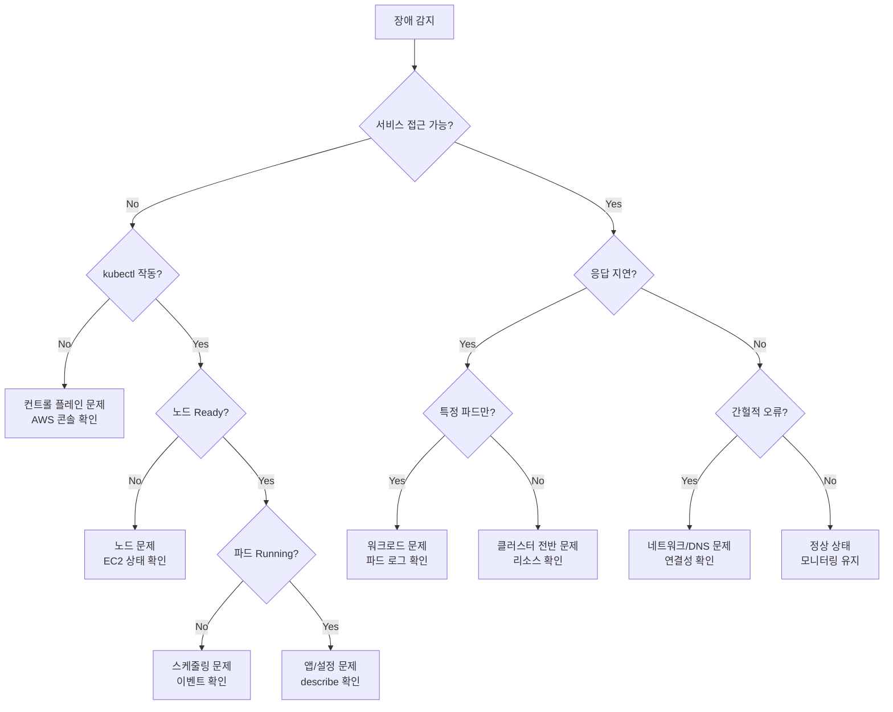
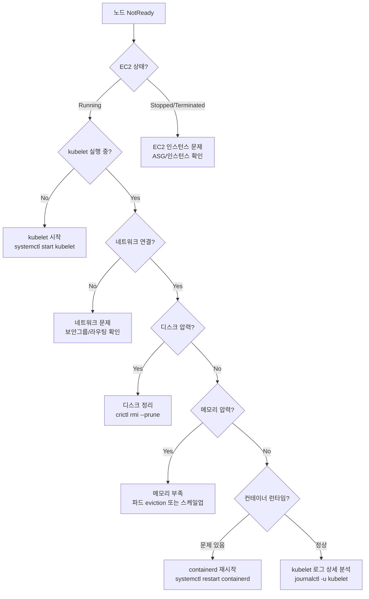
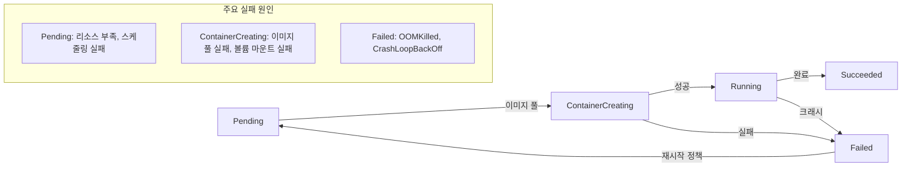

# EKS 고급 디버깅과 장애 대응

> **지원 버전**: EKS 1.28+, kubectl 1.28+
> **마지막 업데이트**: 2025년 2월

Amazon EKS 클러스터의 안정적인 운영을 위해서는 체계적인 장애 대응 프레임워크와 고급 디버깅 기술이 필수입니다. 이 문서에서는 프로덕션 환경에서 발생하는 복잡한 문제들을 신속하게 진단하고 해결하기 위한 실전 가이드를 제공합니다.

## 목차

1. [장애 대응 프레임워크](#1-장애-대응-프레임워크)
2. [컨트롤 플레인 디버깅](#2-컨트롤-플레인-디버깅)
3. [노드 레벨 문제 해결](#3-노드-레벨-문제-해결)
4. [워크로드 디버깅](#4-워크로드-디버깅)
5. [네트워킹 진단](#5-네트워킹-진단)
6. [스토리지 문제 해결](#6-스토리지-문제-해결)
7. [관측성 아키텍처](#7-관측성-아키텍처)
8. [장애 감지 아키텍처](#8-장애-감지-아키텍처)
9. [빠른 참조](#9-빠른-참조)
10. [다음 단계](#10-다음-단계)

---

## 1. 장애 대응 프레임워크

### 첫 5분 체크리스트 (Initial Triage)

장애 발생 시 첫 5분이 가장 중요합니다. 다음 체크리스트를 순서대로 수행하세요.

```bash
# 1단계: 클러스터 상태 확인 (30초)
kubectl cluster-info
kubectl get nodes -o wide
kubectl get pods -A --field-selector=status.phase!=Running

# 2단계: 최근 이벤트 확인 (30초)
kubectl get events -A --sort-by='.lastTimestamp' | tail -50

# 3단계: 핵심 시스템 파드 상태 (30초)
kubectl get pods -n kube-system
kubectl get pods -n amazon-vpc-cni-system

# 4단계: 리소스 사용량 확인 (30초)
kubectl top nodes
kubectl top pods -A --sort-by=memory | head -20

# 5단계: 영향 범위 파악 (2분)
kubectl get deployments -A | grep -v "1/1\|2/2\|3/3"
kubectl get svc -A --field-selector=spec.type=LoadBalancer
```

### 초기 진단 스크립트

```bash
#!/bin/bash
# eks-triage.sh - EKS 긴급 진단 스크립트

echo "=== EKS 긴급 진단 시작 ==="
TIMESTAMP=$(date +%Y%m%d_%H%M%S)
OUTPUT_DIR="/tmp/eks-triage-$TIMESTAMP"
mkdir -p $OUTPUT_DIR

# 클러스터 정보
echo "[1/6] 클러스터 정보 수집..."
kubectl cluster-info dump --output-directory=$OUTPUT_DIR/cluster-info 2>/dev/null

# 노드 상태
echo "[2/6] 노드 상태 확인..."
kubectl get nodes -o wide > $OUTPUT_DIR/nodes.txt
kubectl describe nodes > $OUTPUT_DIR/nodes-describe.txt

# 비정상 파드
echo "[3/6] 비정상 파드 목록..."
kubectl get pods -A --field-selector=status.phase!=Running > $OUTPUT_DIR/unhealthy-pods.txt

# 최근 이벤트
echo "[4/6] 최근 이벤트 수집..."
kubectl get events -A --sort-by='.lastTimestamp' > $OUTPUT_DIR/events.txt

# 리소스 사용량
echo "[5/6] 리소스 사용량..."
kubectl top nodes > $OUTPUT_DIR/node-resources.txt 2>/dev/null
kubectl top pods -A > $OUTPUT_DIR/pod-resources.txt 2>/dev/null

# 시스템 컴포넌트
echo "[6/6] 시스템 컴포넌트 상태..."
kubectl get pods -n kube-system -o wide > $OUTPUT_DIR/kube-system.txt

echo "=== 진단 완료: $OUTPUT_DIR ==="
tar -czf $OUTPUT_DIR.tar.gz -C /tmp eks-triage-$TIMESTAMP
echo "아카이브: $OUTPUT_DIR.tar.gz"
```

### 장애 심각도 매트릭스 (Severity Matrix)

| 심각도 | 분류 | 영향 범위 | 대응 시간 | 예시 |
|--------|------|-----------|-----------|------|
| **P1** | Critical | 전체 서비스 중단 | 15분 이내 | 컨트롤 플레인 장애, 전체 노드 NotReady |
| **P2** | High | 주요 기능 장애 | 1시간 이내 | 특정 워크로드 전체 실패, 네트워크 연결 문제 |
| **P3** | Medium | 부분적 영향 | 4시간 이내 | 일부 파드 재시작, 성능 저하 |
| **P4** | Low | 경미한 문제 | 24시간 이내 | 로그 수집 지연, 비핵심 모니터링 알림 |

### 신속한 문제 식별을 위한 의사결정 트리



---

## 2. 컨트롤 플레인 디버깅

### EKS 컨트롤 플레인 로그 유형

EKS는 5가지 컨트롤 플레인 로그를 CloudWatch Logs로 전송합니다.

| 로그 유형 | 설명 | 주요 사용 사례 |
|-----------|------|----------------|
| **api** | API 서버 로그 | API 호출 추적, 에러 분석 |
| **audit** | 감사 로그 | 보안 감사, 변경 추적 |
| **authenticator** | IAM 인증 로그 | 인증 실패 디버깅 |
| **controllerManager** | 컨트롤러 매니저 로그 | 리소스 조정 문제 |
| **scheduler** | 스케줄러 로그 | 파드 배치 문제 |

### 컨트롤 플레인 로깅 활성화

```bash
# 모든 로그 유형 활성화
aws eks update-cluster-config \
  --name my-cluster \
  --logging '{"clusterLogging":[{"types":["api","audit","authenticator","controllerManager","scheduler"],"enabled":true}]}'

# 현재 설정 확인
aws eks describe-cluster --name my-cluster \
  --query 'cluster.logging.clusterLogging'
```

### CloudWatch Logs Insights 쿼리

#### 에러 분석 쿼리

```sql
-- API 서버 에러 분석
fields @timestamp, @message
| filter @logStream like /kube-apiserver/
| filter @message like /error|Error|ERROR/
| sort @timestamp desc
| limit 100

-- 최근 1시간 에러 통계
fields @timestamp, @message
| filter @logStream like /kube-apiserver/
| filter @message like /error|Error|ERROR/
| stats count(*) as error_count by bin(5m)
| sort @timestamp desc
```

#### 인증 실패 분석

```sql
-- IAM 인증 실패 추적
fields @timestamp, @message
| filter @logStream like /authenticator/
| filter @message like /access denied|Unauthorized|forbidden/
| parse @message /user=(?<user>[^ ]+)/
| stats count(*) by user
| sort count(*) desc
| limit 20

-- 특정 사용자의 인증 이력
fields @timestamp, @message
| filter @logStream like /authenticator/
| filter @message like /arn:aws:iam::123456789012:user\/specific-user/
| sort @timestamp desc
| limit 50
```

#### API 스로틀링 감지

```sql
-- API 스로틀링 이벤트 감지
fields @timestamp, @message
| filter @logStream like /kube-apiserver/
| filter @message like /throttl|rate limit|429/
| stats count(*) as throttle_count by bin(1m)
| sort @timestamp desc

-- 과도한 API 호출 소스 식별
fields @timestamp, @message
| filter @logStream like /audit/
| parse @message /"user":{"username":"(?<username>[^"]+)"/
| parse @message /"verb":"(?<verb>[^"]+)"/
| parse @message /"resource":"(?<resource>[^"]+)"/
| stats count(*) as call_count by username, verb, resource
| sort call_count desc
| limit 50
```

### IAM 인증 문제 해결

#### aws-auth ConfigMap 확인

```bash
# aws-auth ConfigMap 조회
kubectl get configmap aws-auth -n kube-system -o yaml

# IAM 역할 매핑 예시
apiVersion: v1
kind: ConfigMap
metadata:
  name: aws-auth
  namespace: kube-system
data:
  mapRoles: |
    - rolearn: arn:aws:iam::123456789012:role/eks-node-role
      username: system:node:{{EC2PrivateDNSName}}
      groups:
        - system:bootstrappers
        - system:nodes
    - rolearn: arn:aws:iam::123456789012:role/admin-role
      username: admin
      groups:
        - system:masters
  mapUsers: |
    - userarn: arn:aws:iam::123456789012:user/developer
      username: developer
      groups:
        - system:developers
```

#### 인증 테스트

```bash
# 현재 자격 증명 확인
aws sts get-caller-identity

# EKS 클러스터 인증 테스트
aws eks get-token --cluster-name my-cluster | jq -r '.status.token' | cut -d'.' -f2 | base64 -d | jq

# kubectl 인증 상태 확인
kubectl auth can-i get pods --all-namespaces
kubectl auth whoami
```

### IRSA (IAM Roles for Service Accounts) 문제 해결

```bash
# 서비스 계정 어노테이션 확인
kubectl get sa my-service-account -n my-namespace -o yaml

# OIDC 프로바이더 확인
aws eks describe-cluster --name my-cluster \
  --query 'cluster.identity.oidc.issuer'

# IAM 역할 신뢰 정책 확인
aws iam get-role --role-name my-irsa-role \
  --query 'Role.AssumeRolePolicyDocument'
```

#### IRSA 설정 예시

```yaml
# 서비스 계정 (IRSA 활성화)
apiVersion: v1
kind: ServiceAccount
metadata:
  name: s3-access-sa
  namespace: default
  annotations:
    eks.amazonaws.com/role-arn: arn:aws:iam::123456789012:role/s3-access-role
---
# 파드에서 서비스 계정 사용
apiVersion: v1
kind: Pod
metadata:
  name: s3-access-pod
spec:
  serviceAccountName: s3-access-sa
  containers:
  - name: app
    image: amazon/aws-cli
    command: ["aws", "s3", "ls"]
```

#### IRSA 디버깅

```bash
# 파드 내부에서 자격 증명 확인
kubectl exec -it s3-access-pod -- env | grep AWS

# 토큰 마운트 확인
kubectl exec -it s3-access-pod -- cat /var/run/secrets/eks.amazonaws.com/serviceaccount/token

# STS 호출 테스트
kubectl exec -it s3-access-pod -- aws sts get-caller-identity
```

### Pod Identity 문제 해결

```bash
# Pod Identity 에이전트 상태 확인
kubectl get pods -n kube-system -l app.kubernetes.io/name=eks-pod-identity-agent

# Pod Identity 연결 확인
aws eks list-pod-identity-associations --cluster-name my-cluster

# Pod Identity 연결 생성
aws eks create-pod-identity-association \
  --cluster-name my-cluster \
  --namespace default \
  --service-account my-sa \
  --role-arn arn:aws:iam::123456789012:role/my-role
```

### 서비스 계정 토큰 만료 (1시간 기본 TTL)

```yaml
# 토큰 만료 시간 확장 (최대 24시간)
apiVersion: v1
kind: Pod
metadata:
  name: extended-token-pod
spec:
  serviceAccountName: my-sa
  containers:
  - name: app
    image: my-app
    volumeMounts:
    - name: token
      mountPath: /var/run/secrets/tokens
  volumes:
  - name: token
    projected:
      sources:
      - serviceAccountToken:
          path: token
          expirationSeconds: 86400  # 24시간
          audience: sts.amazonaws.com
```

### EKS Add-on 오류 패턴

```bash
# Add-on 상태 확인
aws eks describe-addon --cluster-name my-cluster --addon-name vpc-cni

# Add-on 건강 상태 코드
# ACTIVE: 정상 작동
# CREATE_FAILED: 생성 실패
# DEGRADED: 성능 저하
# DELETE_FAILED: 삭제 실패
# UPDATING: 업데이트 중
# DELETING: 삭제 중

# Add-on 상태 상세 조회
aws eks describe-addon --cluster-name my-cluster --addon-name vpc-cni \
  --query 'addon.{Status:status,Health:health,Issues:health.issues}'

# 문제 있는 Add-on 업데이트
aws eks update-addon \
  --cluster-name my-cluster \
  --addon-name vpc-cni \
  --resolve-conflicts OVERWRITE
```

---

## 3. 노드 레벨 문제 해결

### 노드 조인 실패 진단 (8가지 일반적인 원인)

| # | 원인 | 증상 | 해결 방법 |
|---|------|------|-----------|
| 1 | 부트스트랩 스크립트 불일치 | 노드가 클러스터에 나타나지 않음 | AMI 버전과 클러스터 버전 일치 확인 |
| 2 | 보안 그룹 설정 오류 | 노드-컨트롤플레인 통신 실패 | 443, 10250 포트 인바운드 규칙 확인 |
| 3 | VPC DNS 설정 문제 | DNS 해석 실패 | enableDnsHostnames, enableDnsSupport 활성화 |
| 4 | IAM 역할 권한 부족 | 인증 실패 | 노드 역할에 필수 정책 연결 확인 |
| 5 | 서브넷 태그 누락 | 노드 프로비저닝 실패 | kubernetes.io/cluster/\<name\> 태그 확인 |
| 6 | 프라이빗 서브넷 NAT 미설정 | 이미지 풀 실패 | NAT Gateway 또는 VPC 엔드포인트 설정 |
| 7 | 인스턴스 프로파일 미연결 | EC2 시작 실패 | Launch Template 설정 확인 |
| 8 | 사용자 데이터 스크립트 오류 | 부트스트랩 중단 | /var/log/cloud-init-output.log 확인 |

### NotReady 노드 의사결정 트리



### SSM을 통한 kubelet/containerd 디버깅

```bash
# SSM 세션 시작
aws ssm start-session --target i-1234567890abcdef0

# kubelet 상태 확인
sudo systemctl status kubelet
sudo journalctl -u kubelet -f --no-pager | tail -100

# kubelet 설정 확인
sudo cat /etc/kubernetes/kubelet/kubelet-config.json
sudo cat /var/lib/kubelet/kubeconfig

# containerd 상태 확인
sudo systemctl status containerd
sudo journalctl -u containerd -f --no-pager | tail -50

# 컨테이너 목록 확인
sudo crictl ps
sudo crictl ps -a  # 종료된 컨테이너 포함

# 컨테이너 로그 확인
sudo crictl logs <container-id>

# 이미지 목록 및 정리
sudo crictl images
sudo crictl rmi --prune  # 미사용 이미지 제거

# 디스크 사용량 확인
df -h
sudo du -sh /var/lib/containerd/*
sudo du -sh /var/log/*
```

### 리소스 압력 조건 (Resource Pressure)

```bash
# 노드 조건 확인
kubectl describe node <node-name> | grep -A 20 "Conditions:"

# 특정 압력 조건 확인
kubectl get nodes -o custom-columns=\
NAME:.metadata.name,\
DISK_PRESSURE:.status.conditions[?(@.type==\"DiskPressure\")].status,\
MEMORY_PRESSURE:.status.conditions[?(@.type==\"MemoryPressure\")].status,\
PID_PRESSURE:.status.conditions[?(@.type==\"PIDPressure\")].status
```

#### DiskPressure 해결

```bash
# SSM으로 노드 접속 후
# 로그 파일 정리
sudo journalctl --vacuum-size=500M
sudo rm -rf /var/log/*.gz
sudo rm -rf /var/log/*.[0-9]

# 컨테이너 이미지 정리
sudo crictl rmi --prune

# 종료된 컨테이너 정리
sudo crictl rm $(sudo crictl ps -a -q --state exited)
```

#### MemoryPressure 해결

```bash
# 메모리 사용량 높은 파드 식별
kubectl top pods -A --sort-by=memory | head -20

# 노드별 메모리 사용량
kubectl top nodes

# 메모리 사용량 상세 (노드 내부)
free -h
cat /proc/meminfo | grep -E "MemTotal|MemFree|MemAvailable|Buffers|Cached"
```

#### PIDPressure 해결

```bash
# 현재 PID 사용량 확인 (노드 내부)
cat /proc/sys/kernel/pid_max
ls /proc | grep -E "^[0-9]+$" | wc -l

# PID 많이 사용하는 프로세스
ps aux --sort=-nlwp | head -20
```

### Karpenter 프로비저닝 문제

```bash
# Karpenter 컨트롤러 로그 확인
kubectl logs -n karpenter -l app.kubernetes.io/name=karpenter -c controller --tail=100

# NodePool 상태 확인
kubectl get nodepools
kubectl describe nodepool default

# NodeClaim 상태 확인
kubectl get nodeclaims
kubectl describe nodeclaim <name>

# Karpenter가 노드를 생성하지 않는 경우 확인
kubectl get events -n karpenter --sort-by='.lastTimestamp'
```

#### Karpenter 설정 예시

```yaml
apiVersion: karpenter.sh/v1
kind: NodePool
metadata:
  name: default
spec:
  template:
    spec:
      requirements:
        - key: kubernetes.io/arch
          operator: In
          values: ["amd64"]
        - key: karpenter.sh/capacity-type
          operator: In
          values: ["spot", "on-demand"]
        - key: karpenter.k8s.aws/instance-category
          operator: In
          values: ["c", "m", "r"]
      nodeClassRef:
        group: karpenter.k8s.aws
        kind: EC2NodeClass
        name: default
  limits:
    cpu: 1000
    memory: 1000Gi
  disruption:
    consolidationPolicy: WhenUnderutilized
    consolidateAfter: 30s
```

### Managed Node Group 오류 코드

| 오류 코드 | 설명 | 해결 방법 |
|-----------|------|-----------|
| AccessDenied | IAM 권한 부족 | 노드 역할 정책 확인 |
| AsgInstanceLaunchFailures | ASG 인스턴스 시작 실패 | Launch Template, 서브넷 용량 확인 |
| ClusterUnreachable | 클러스터 연결 불가 | VPC 엔드포인트, 보안 그룹 확인 |
| InsufficientFreeAddresses | IP 주소 부족 | 서브넷 CIDR 확장 또는 새 서브넷 추가 |
| NodeCreationFailure | 노드 생성 실패 | EC2 서비스 한도, AMI 가용성 확인 |

```bash
# 노드 그룹 상태 확인
aws eks describe-nodegroup \
  --cluster-name my-cluster \
  --nodegroup-name my-nodegroup \
  --query 'nodegroup.{Status:status,Health:health}'

# 노드 그룹 이슈 상세
aws eks describe-nodegroup \
  --cluster-name my-cluster \
  --nodegroup-name my-nodegroup \
  --query 'nodegroup.health.issues'
```

### Node Readiness Controller (단계별 부팅 검증)

```yaml
# 커스텀 노드 준비 상태 검증
apiVersion: v1
kind: ConfigMap
metadata:
  name: node-readiness-config
  namespace: kube-system
data:
  config.yaml: |
    checks:
      - name: cni-ready
        probe:
          exec:
            command: ["test", "-f", "/etc/cni/net.d/10-aws.conflist"]
        initialDelaySeconds: 5
        periodSeconds: 2
        failureThreshold: 30
      - name: containerd-ready
        probe:
          exec:
            command: ["crictl", "info"]
        initialDelaySeconds: 10
        periodSeconds: 5
        failureThreshold: 12
```

---

## 4. 워크로드 디버깅

### 파드 상태 흐름도



### 기본 진단 명령어

```bash
# 파드 상태 및 이벤트 확인
kubectl describe pod <pod-name> -n <namespace>

# 파드 로그 확인
kubectl logs <pod-name> -n <namespace>
kubectl logs <pod-name> -n <namespace> --previous  # 이전 컨테이너 로그
kubectl logs <pod-name> -n <namespace> -c <container-name>  # 특정 컨테이너
kubectl logs <pod-name> -n <namespace> --tail=100 -f  # 실시간 추적

# 네임스페이스 이벤트 확인
kubectl get events -n <namespace> --sort-by='.lastTimestamp'

# 파드 상태 상세
kubectl get pod <pod-name> -n <namespace> -o yaml
```

### kubectl debug 기법

#### 임시 컨테이너 (Ephemeral Containers)

```bash
# 기본 디버그 컨테이너 추가
kubectl debug -it <pod-name> --image=busybox --target=<container-name>

# 네트워크 디버깅용 컨테이너
kubectl debug -it <pod-name> --image=nicolaka/netshoot --target=<container-name>

# 프로세스 네임스페이스 공유
kubectl debug -it <pod-name> --image=busybox --target=<container-name> -- sh
```

#### 파드 복사 (Pod Copying)

```bash
# 동일한 파드 복사본 생성
kubectl debug <pod-name> --copy-to=debug-pod --container=debugger --image=busybox

# 컨테이너 이미지 변경하여 복사
kubectl debug <pod-name> --copy-to=debug-pod --set-image=*=busybox

# 공유 프로세스 네임스페이스로 복사
kubectl debug <pod-name> --copy-to=debug-pod --share-processes
```

#### 노드 디버깅

```bash
# 노드에서 디버그 파드 실행
kubectl debug node/<node-name> -it --image=ubuntu

# 호스트 파일시스템 접근
kubectl debug node/<node-name> -it --image=ubuntu -- chroot /host

# 노드의 네트워크 네임스페이스에서 실행
kubectl debug node/<node-name> -it --image=nicolaka/netshoot
```

### Deployment 롤아웃 관리

```bash
# 롤아웃 상태 확인
kubectl rollout status deployment/<deployment-name> -n <namespace>

# 롤아웃 히스토리
kubectl rollout history deployment/<deployment-name> -n <namespace>

# 특정 리비전 상세
kubectl rollout history deployment/<deployment-name> --revision=2

# 롤백
kubectl rollout undo deployment/<deployment-name> -n <namespace>
kubectl rollout undo deployment/<deployment-name> --to-revision=2

# 롤아웃 일시 중지/재개
kubectl rollout pause deployment/<deployment-name>
kubectl rollout resume deployment/<deployment-name>

# 강제 롤아웃 (이미지 동일 시)
kubectl rollout restart deployment/<deployment-name>
```

### HPA/VPA 스케일링 문제

#### HPA 디버깅

```bash
# HPA 상태 확인
kubectl get hpa -n <namespace>
kubectl describe hpa <hpa-name> -n <namespace>

# 메트릭 수집 상태 확인
kubectl get --raw "/apis/metrics.k8s.io/v1beta1/pods" | jq

# HPA 이벤트 확인
kubectl get events -n <namespace> --field-selector involvedObject.name=<hpa-name>
```

#### HPA 설정 예시

```yaml
apiVersion: autoscaling/v2
kind: HorizontalPodAutoscaler
metadata:
  name: app-hpa
spec:
  scaleTargetRef:
    apiVersion: apps/v1
    kind: Deployment
    name: app
  minReplicas: 2
  maxReplicas: 10
  metrics:
  - type: Resource
    resource:
      name: cpu
      target:
        type: Utilization
        averageUtilization: 70
  - type: Resource
    resource:
      name: memory
      target:
        type: Utilization
        averageUtilization: 80
  behavior:
    scaleDown:
      stabilizationWindowSeconds: 300
      policies:
      - type: Percent
        value: 10
        periodSeconds: 60
    scaleUp:
      stabilizationWindowSeconds: 0
      policies:
      - type: Percent
        value: 100
        periodSeconds: 15
```

#### VPA 디버깅

```bash
# VPA 상태 확인
kubectl get vpa -n <namespace>
kubectl describe vpa <vpa-name> -n <namespace>

# VPA 추천값 확인
kubectl get vpa <vpa-name> -o jsonpath='{.status.recommendation}'
```

### 프로브 설정 모범 사례

```yaml
apiVersion: v1
kind: Pod
metadata:
  name: app-with-probes
spec:
  containers:
  - name: app
    image: my-app:v1
    ports:
    - containerPort: 8080

    # 시작 프로브: 앱 초기화 완료 확인
    startupProbe:
      httpGet:
        path: /healthz
        port: 8080
      initialDelaySeconds: 10
      periodSeconds: 5
      failureThreshold: 30  # 최대 150초 대기

    # 활성 프로브: 앱이 살아있는지 확인
    livenessProbe:
      httpGet:
        path: /healthz
        port: 8080
      initialDelaySeconds: 0  # startupProbe 성공 후 즉시 시작
      periodSeconds: 10
      timeoutSeconds: 5
      failureThreshold: 3

    # 준비 프로브: 트래픽 수신 가능 여부
    readinessProbe:
      httpGet:
        path: /ready
        port: 8080
      initialDelaySeconds: 0
      periodSeconds: 5
      timeoutSeconds: 3
      successThreshold: 1
      failureThreshold: 3

    resources:
      requests:
        memory: "256Mi"
        cpu: "250m"
      limits:
        memory: "512Mi"
        cpu: "500m"
```

---

## 5. 네트워킹 진단

### VPC CNI 문제 해결

```bash
# VPC CNI 버전 확인
kubectl describe daemonset aws-node -n kube-system | grep Image

# CNI 파드 상태 확인
kubectl get pods -n kube-system -l k8s-app=aws-node

# CNI 파드 로그
kubectl logs -n kube-system -l k8s-app=aws-node --tail=100

# ENI 및 IP 할당 상태 확인
kubectl get pods -o wide
aws ec2 describe-network-interfaces --filters Name=description,Values="*eks*"
```

### IP 고갈 문제 해결

#### Prefix Delegation 모드 활성화

```bash
# 환경 변수 설정
kubectl set env daemonset aws-node -n kube-system \
  ENABLE_PREFIX_DELEGATION=true \
  WARM_PREFIX_TARGET=1

# 확인
kubectl get daemonset aws-node -n kube-system -o yaml | grep -A 5 ENABLE_PREFIX
```

#### Secondary CIDR 추가

```bash
# VPC에 Secondary CIDR 추가
aws ec2 associate-vpc-cidr-block \
  --vpc-id vpc-1234567890abcdef0 \
  --cidr-block 100.64.0.0/16

# 새 서브넷 생성
aws ec2 create-subnet \
  --vpc-id vpc-1234567890abcdef0 \
  --cidr-block 100.64.0.0/24 \
  --availability-zone ap-northeast-2a

# CNI 커스텀 네트워킹 활성화
kubectl set env daemonset aws-node -n kube-system \
  AWS_VPC_K8S_CNI_CUSTOM_NETWORK_CFG=true
```

#### ENIConfig 설정

```yaml
apiVersion: crd.k8s.amazonaws.com/v1alpha1
kind: ENIConfig
metadata:
  name: ap-northeast-2a
spec:
  securityGroups:
    - sg-0123456789abcdef0
  subnet: subnet-0123456789abcdef0
---
apiVersion: crd.k8s.amazonaws.com/v1alpha1
kind: ENIConfig
metadata:
  name: ap-northeast-2c
spec:
  securityGroups:
    - sg-0123456789abcdef0
  subnet: subnet-0fedcba9876543210
```

### CoreDNS 설정 문제

```bash
# CoreDNS 파드 상태
kubectl get pods -n kube-system -l k8s-app=kube-dns

# CoreDNS 로그
kubectl logs -n kube-system -l k8s-app=kube-dns --tail=100

# CoreDNS ConfigMap 확인
kubectl get configmap coredns -n kube-system -o yaml

# DNS 해석 테스트
kubectl run dns-test --image=busybox:1.28 --rm -it --restart=Never -- nslookup kubernetes.default
```

#### ndots 문제와 해결책

```yaml
# 문제: ndots=5 기본값으로 인한 DNS 쿼리 지연
# 해결: 파드에서 ndots 값 조정

apiVersion: v1
kind: Pod
metadata:
  name: optimized-dns-pod
spec:
  dnsConfig:
    options:
      - name: ndots
        value: "2"
      - name: single-request-reopen
      - name: timeout
        value: "2"
      - name: attempts
        value: "3"
  containers:
  - name: app
    image: my-app
```

#### CoreDNS 성능 최적화

```yaml
apiVersion: v1
kind: ConfigMap
metadata:
  name: coredns
  namespace: kube-system
data:
  Corefile: |
    .:53 {
        errors
        health {
            lameduck 5s
        }
        ready
        kubernetes cluster.local in-addr.arpa ip6.arpa {
            pods insecure
            fallthrough in-addr.arpa ip6.arpa
            ttl 30
        }
        prometheus :9153
        forward . /etc/resolv.conf {
            max_concurrent 1000
        }
        cache 30
        loop
        reload
        loadbalance
    }
```

### Service Endpoint 검증

```bash
# 서비스 엔드포인트 확인
kubectl get endpoints <service-name> -n <namespace>
kubectl describe endpoints <service-name> -n <namespace>

# 서비스 연결 테스트
kubectl run curl-test --image=curlimages/curl --rm -it --restart=Never -- \
  curl -v http://<service-name>.<namespace>.svc.cluster.local:<port>

# 서비스 DNS 해석
kubectl run dns-test --image=busybox --rm -it --restart=Never -- \
  nslookup <service-name>.<namespace>.svc.cluster.local
```

### NetworkPolicy AND/OR 로직 디버깅

```yaml
# 예시: 복잡한 NetworkPolicy
apiVersion: networking.k8s.io/v1
kind: NetworkPolicy
metadata:
  name: complex-policy
  namespace: production
spec:
  podSelector:
    matchLabels:
      app: api-server
  policyTypes:
  - Ingress
  - Egress
  ingress:
  # 규칙 1: frontend 파드에서 오는 트래픽 허용
  - from:
    - podSelector:
        matchLabels:
          app: frontend
    ports:
    - port: 8080
  # 규칙 2: monitoring 네임스페이스에서 오는 트래픽 허용 (OR)
  - from:
    - namespaceSelector:
        matchLabels:
          purpose: monitoring
    ports:
    - port: 9090
  egress:
  # database에 대한 아웃바운드만 허용
  - to:
    - podSelector:
        matchLabels:
          app: database
    ports:
    - port: 5432
```

```bash
# NetworkPolicy 디버깅
kubectl get networkpolicy -n <namespace> -o yaml
kubectl describe networkpolicy <policy-name> -n <namespace>

# 연결성 테스트
kubectl exec -it <source-pod> -- nc -zv <target-service> <port>
kubectl exec -it <source-pod> -- curl -v --connect-timeout 5 http://<target>:<port>
```

### netshoot 컨테이너를 활용한 라이브 디버깅

```bash
# netshoot 디버그 파드 실행
kubectl run netshoot --image=nicolaka/netshoot -it --rm -- /bin/bash

# 내부에서 사용할 수 있는 도구들
# - curl, wget: HTTP 테스트
# - dig, nslookup: DNS 디버깅
# - tcpdump: 패킷 캡처
# - iperf3: 네트워크 성능 테스트
# - mtr, traceroute: 경로 추적
# - ss, netstat: 소켓 상태

# DNS 디버깅
dig +short kubernetes.default.svc.cluster.local
dig +trace google.com

# TCP 연결 테스트
nc -zv <service-ip> <port>

# HTTP 상세 테스트
curl -v --connect-timeout 5 http://<service>:<port>/health

# 패킷 캡처 (루트 권한 필요)
tcpdump -i any port 80 -nn

# 네트워크 성능 테스트
iperf3 -c <target-ip> -p 5201
```

---

## 6. 스토리지 문제 해결

### EBS CSI Driver 오류 패턴

```bash
# EBS CSI Driver 파드 상태 확인
kubectl get pods -n kube-system -l app.kubernetes.io/name=aws-ebs-csi-driver

# 컨트롤러 로그
kubectl logs -n kube-system -l app=ebs-csi-controller -c ebs-plugin --tail=100

# 노드 드라이버 로그
kubectl logs -n kube-system -l app=ebs-csi-node -c ebs-plugin --tail=100

# CSI 드라이버 상태
kubectl get csidrivers
kubectl describe csidriver ebs.csi.aws.com
```

#### IRSA 권한 설정

```json
{
  "Version": "2012-10-17",
  "Statement": [
    {
      "Effect": "Allow",
      "Action": [
        "ec2:CreateSnapshot",
        "ec2:AttachVolume",
        "ec2:DetachVolume",
        "ec2:ModifyVolume",
        "ec2:DescribeAvailabilityZones",
        "ec2:DescribeInstances",
        "ec2:DescribeSnapshots",
        "ec2:DescribeTags",
        "ec2:DescribeVolumes",
        "ec2:DescribeVolumesModifications",
        "ec2:CreateTags",
        "ec2:DeleteTags",
        "ec2:CreateVolume",
        "ec2:DeleteVolume",
        "ec2:DeleteSnapshot"
      ],
      "Resource": "*"
    }
  ]
}
```

### EFS Mount Target 구성 문제

```bash
# EFS CSI Driver 상태
kubectl get pods -n kube-system -l app.kubernetes.io/name=aws-efs-csi-driver

# EFS 마운트 타겟 확인
aws efs describe-mount-targets --file-system-id fs-1234567890abcdef0

# 보안 그룹 확인 (NFS 포트 2049)
aws ec2 describe-security-groups --group-ids sg-0123456789abcdef0
```

#### EFS StorageClass 및 PVC

```yaml
kind: StorageClass
apiVersion: storage.k8s.io/v1
metadata:
  name: efs-sc
provisioner: efs.csi.aws.com
parameters:
  provisioningMode: efs-ap
  fileSystemId: fs-1234567890abcdef0
  directoryPerms: "700"
  gidRangeStart: "1000"
  gidRangeEnd: "2000"
  basePath: "/dynamic_provisioning"
---
apiVersion: v1
kind: PersistentVolumeClaim
metadata:
  name: efs-claim
spec:
  accessModes:
    - ReadWriteMany
  storageClassName: efs-sc
  resources:
    requests:
      storage: 5Gi
```

### PVC/PV 상태 관리

```bash
# PVC 상태 확인
kubectl get pvc -A
kubectl describe pvc <pvc-name> -n <namespace>

# PV 상태 확인
kubectl get pv
kubectl describe pv <pv-name>

# 바인딩 문제 확인
kubectl get pvc -A -o custom-columns=\
NAME:.metadata.name,\
STATUS:.status.phase,\
VOLUME:.spec.volumeName,\
STORAGECLASS:.spec.storageClassName
```

#### Finalizer 처리

```bash
# PVC가 삭제되지 않는 경우 (Terminating 상태)
# 사용 중인 파드 확인
kubectl get pods -A -o json | jq -r '.items[] | select(.spec.volumes[]?.persistentVolumeClaim.claimName == "<pvc-name>") | .metadata.name'

# Finalizer 제거 (주의: 데이터 손실 가능)
kubectl patch pvc <pvc-name> -n <namespace> -p '{"metadata":{"finalizers":null}}'

# PV Finalizer 제거
kubectl patch pv <pv-name> -p '{"metadata":{"finalizers":null}}'
```

### WaitForFirstConsumer를 통한 AZ 매칭

```yaml
# StorageClass with WaitForFirstConsumer
apiVersion: storage.k8s.io/v1
kind: StorageClass
metadata:
  name: ebs-sc-waitforfirstconsumer
provisioner: ebs.csi.aws.com
parameters:
  type: gp3
  encrypted: "true"
volumeBindingMode: WaitForFirstConsumer  # 파드가 스케줄된 후 볼륨 생성
allowedTopologies:
- matchLabelExpressions:
  - key: topology.kubernetes.io/zone
    values:
    - ap-northeast-2a
    - ap-northeast-2c
```

```bash
# 볼륨-파드 AZ 불일치 확인
kubectl get pv -o custom-columns=\
NAME:.metadata.name,\
ZONE:.spec.nodeAffinity.required.nodeSelectorTerms[0].matchExpressions[0].values[0]

kubectl get pods -o custom-columns=\
NAME:.metadata.name,\
NODE:.spec.nodeName,\
ZONE:'{.spec.nodeAffinity}'
```

---

## 7. 관측성 아키텍처

### Container Insights 설정

```bash
# CloudWatch Agent 및 Fluent Bit 설치
aws eks create-addon \
  --cluster-name my-cluster \
  --addon-name amazon-cloudwatch-observability \
  --addon-version v1.0.0-eksbuild.1

# 또는 Helm으로 설치
helm repo add aws-observability https://aws-observability.github.io/helm-charts
helm install amazon-cloudwatch-observability \
  aws-observability/amazon-cloudwatch-observability \
  --namespace amazon-cloudwatch --create-namespace \
  --set clusterName=my-cluster \
  --set region=ap-northeast-2
```

### PromQL 쿼리 예시

#### CPU 스로틀링 감지

```promql
# CPU 스로틀링 비율
sum(rate(container_cpu_cfs_throttled_periods_total{container!=""}[5m])) by (pod, namespace)
/
sum(rate(container_cpu_cfs_periods_total{container!=""}[5m])) by (pod, namespace)
> 0.5

# CPU 스로틀링이 높은 파드 Top 10
topk(10,
  sum(rate(container_cpu_cfs_throttled_periods_total{container!=""}[5m])) by (pod, namespace)
  /
  sum(rate(container_cpu_cfs_periods_total{container!=""}[5m])) by (pod, namespace)
)
```

#### OOMKilled 이벤트 감지

```promql
# OOMKilled 발생 파드
kube_pod_container_status_last_terminated_reason{reason="OOMKilled"} == 1

# 최근 1시간 OOMKilled 횟수
sum(changes(kube_pod_container_status_restarts_total[1h])) by (pod, namespace)
* on (pod, namespace) group_left
kube_pod_container_status_last_terminated_reason{reason="OOMKilled"}

# 메모리 사용률이 높은 파드 (OOM 위험)
(
  sum(container_memory_working_set_bytes{container!=""}) by (pod, namespace)
  /
  sum(kube_pod_container_resource_limits{resource="memory"}) by (pod, namespace)
) > 0.9
```

#### 파드 재시작률

```promql
# 최근 1시간 재시작 횟수
sum(increase(kube_pod_container_status_restarts_total[1h])) by (pod, namespace) > 3

# 재시작이 많은 파드 Top 10
topk(10, sum(increase(kube_pod_container_status_restarts_total[1h])) by (pod, namespace))

# CrashLoopBackOff 상태 파드
kube_pod_container_status_waiting_reason{reason="CrashLoopBackOff"} == 1
```

### CloudWatch Logs Insights 검색 패턴

```sql
-- 에러 로그 검색
fields @timestamp, @message, kubernetes.pod_name, kubernetes.namespace_name
| filter @message like /error|Error|ERROR|exception|Exception|EXCEPTION/
| sort @timestamp desc
| limit 100

-- 특정 파드의 로그
fields @timestamp, @message
| filter kubernetes.pod_name = "my-pod-name"
| sort @timestamp desc
| limit 500

-- 응답 시간 분석 (애플리케이션 로그에 응답 시간 포함 시)
fields @timestamp, @message
| parse @message /response_time=(?<response_time>\d+)ms/
| stats avg(response_time) as avg_response, max(response_time) as max_response by bin(5m)

-- OOMKilled 이벤트 추적
fields @timestamp, @message
| filter @message like /OOMKilled|Out of memory|oom-kill/
| sort @timestamp desc
| limit 50
```

### PrometheusRule 예시

```yaml
apiVersion: monitoring.coreos.com/v1
kind: PrometheusRule
metadata:
  name: eks-alerts
  namespace: monitoring
spec:
  groups:
  - name: eks-node-alerts
    rules:
    - alert: NodeNotReady
      expr: kube_node_status_condition{condition="Ready",status="true"} == 0
      for: 5m
      labels:
        severity: critical
      annotations:
        summary: "노드 {{ $labels.node }}가 NotReady 상태입니다"
        description: "노드가 5분 이상 NotReady 상태입니다. 즉시 확인이 필요합니다."

    - alert: NodeMemoryPressure
      expr: kube_node_status_condition{condition="MemoryPressure",status="true"} == 1
      for: 5m
      labels:
        severity: warning
      annotations:
        summary: "노드 {{ $labels.node }}에 메모리 압력이 발생했습니다"

    - alert: NodeDiskPressure
      expr: kube_node_status_condition{condition="DiskPressure",status="true"} == 1
      for: 5m
      labels:
        severity: warning
      annotations:
        summary: "노드 {{ $labels.node }}에 디스크 압력이 발생했습니다"

  - name: eks-pod-alerts
    rules:
    - alert: PodCrashLooping
      expr: rate(kube_pod_container_status_restarts_total[15m]) * 60 * 15 > 3
      for: 5m
      labels:
        severity: warning
      annotations:
        summary: "파드 {{ $labels.namespace }}/{{ $labels.pod }}가 반복적으로 재시작됩니다"

    - alert: PodNotReady
      expr: |
        sum by (namespace, pod) (
          max by(namespace, pod) (kube_pod_status_phase{phase=~"Pending|Unknown"}) *
          on(namespace, pod) group_left(owner_kind)
          topk by(namespace, pod) (1, max by(namespace, pod, owner_kind) (kube_pod_owner{owner_kind!="Job"}))
        ) > 0
      for: 15m
      labels:
        severity: warning
      annotations:
        summary: "파드 {{ $labels.namespace }}/{{ $labels.pod }}가 15분 이상 Ready 상태가 아닙니다"

    - alert: ContainerOOMKilled
      expr: kube_pod_container_status_last_terminated_reason{reason="OOMKilled"} == 1
      for: 0m
      labels:
        severity: warning
      annotations:
        summary: "컨테이너 {{ $labels.namespace }}/{{ $labels.pod }}/{{ $labels.container }}가 OOMKilled되었습니다"

  - name: eks-resource-alerts
    rules:
    - alert: HighCPUThrottling
      expr: |
        sum(rate(container_cpu_cfs_throttled_periods_total{container!=""}[5m])) by (pod, namespace)
        /
        sum(rate(container_cpu_cfs_periods_total{container!=""}[5m])) by (pod, namespace)
        > 0.5
      for: 10m
      labels:
        severity: warning
      annotations:
        summary: "파드 {{ $labels.namespace }}/{{ $labels.pod }}의 CPU 스로틀링이 50%를 초과합니다"
```

### ADOT (AWS Distro for OpenTelemetry) 설정

```yaml
# ADOT Collector 설정
apiVersion: opentelemetry.io/v1alpha1
kind: OpenTelemetryCollector
metadata:
  name: adot-collector
  namespace: opentelemetry
spec:
  mode: deployment
  serviceAccount: adot-collector
  config: |
    receivers:
      otlp:
        protocols:
          grpc:
            endpoint: 0.0.0.0:4317
          http:
            endpoint: 0.0.0.0:4318
      prometheus:
        config:
          scrape_configs:
            - job_name: 'kubernetes-pods'
              kubernetes_sd_configs:
                - role: pod
              relabel_configs:
                - source_labels: [__meta_kubernetes_pod_annotation_prometheus_io_scrape]
                  action: keep
                  regex: true

    processors:
      batch:
        timeout: 30s
        send_batch_size: 8192
      memory_limiter:
        limit_mib: 500
        spike_limit_mib: 100
        check_interval: 5s

    exporters:
      awsxray:
        region: ap-northeast-2
      awsemf:
        region: ap-northeast-2
        namespace: ContainerInsights
        log_group_name: '/aws/containerinsights/{ClusterName}/performance'
      prometheusremotewrite:
        endpoint: "https://aps-workspaces.ap-northeast-2.amazonaws.com/workspaces/ws-xxxxx/api/v1/remote_write"
        auth:
          authenticator: sigv4auth
        resource_to_telemetry_conversion:
          enabled: true

    extensions:
      sigv4auth:
        region: ap-northeast-2
        service: "aps"

    service:
      extensions: [sigv4auth]
      pipelines:
        traces:
          receivers: [otlp]
          processors: [batch, memory_limiter]
          exporters: [awsxray]
        metrics:
          receivers: [otlp, prometheus]
          processors: [batch, memory_limiter]
          exporters: [awsemf, prometheusremotewrite]
```

---

## 8. 장애 감지 아키텍처

### 4계층 감지 파이프라인

```mermaid
flowchart LR
    subgraph Sources[데이터 소스]
        M[메트릭]
        L[로그]
        T[트레이스]
        E[이벤트]
    end

    subgraph Collection[수집]
        CW[CloudWatch Agent]
        FB[Fluent Bit]
        ADOT[ADOT Collector]
        PM[Prometheus]
    end

    subgraph Analysis[분석]
        CLI[CloudWatch Logs Insights]
        MA[메트릭 알림]
        AA[Anomaly Detection]
        CA[Composite Alarms]
    end

    subgraph Alerting[알림]
        SNS[SNS]
        SL[Slack]
        PD[PagerDuty]
        EB[EventBridge]
    end

    Sources --> Collection --> Analysis --> Alerting
```



### 레퍼런스 아키텍처 1: AWS 네이티브

```yaml
# Fluent Bit ConfigMap for CloudWatch
apiVersion: v1
kind: ConfigMap
metadata:
  name: fluent-bit-config
  namespace: amazon-cloudwatch
data:
  fluent-bit.conf: |
    [SERVICE]
        Flush         5
        Grace         30
        Log_Level     info
        Daemon        off
        Parsers_File  parsers.conf

    [INPUT]
        Name              tail
        Tag               kube.*
        Path              /var/log/containers/*.log
        Parser            docker
        DB                /var/fluent-bit/state/flb_kube.db
        Mem_Buf_Limit     50MB
        Skip_Long_Lines   On
        Refresh_Interval  10

    [FILTER]
        Name                kubernetes
        Match               kube.*
        Kube_URL            https://kubernetes.default.svc:443
        Kube_CA_File        /var/run/secrets/kubernetes.io/serviceaccount/ca.crt
        Kube_Token_File     /var/run/secrets/kubernetes.io/serviceaccount/token
        Kube_Tag_Prefix     kube.var.log.containers.
        Merge_Log           On
        Merge_Log_Key       log_processed
        K8S-Logging.Parser  On
        K8S-Logging.Exclude Off

    [OUTPUT]
        Name                cloudwatch_logs
        Match               kube.*
        region              ap-northeast-2
        log_group_name      /aws/eks/my-cluster/containers
        log_stream_prefix   fluentbit-
        auto_create_group   true
```

### 레퍼런스 아키텍처 2: 오픈소스 스택

```yaml
# Prometheus + Alertmanager + Grafana
---
# Alertmanager 설정
apiVersion: v1
kind: ConfigMap
metadata:
  name: alertmanager-config
  namespace: monitoring
data:
  alertmanager.yml: |
    global:
      resolve_timeout: 5m
      slack_api_url: 'https://hooks.slack.com/services/xxx/yyy/zzz'

    route:
      group_by: ['alertname', 'namespace', 'severity']
      group_wait: 30s
      group_interval: 5m
      repeat_interval: 4h
      receiver: 'default-receiver'
      routes:
        - match:
            severity: critical
          receiver: 'pagerduty-critical'
          continue: true
        - match:
            severity: warning
          receiver: 'slack-warnings'

    receivers:
      - name: 'default-receiver'
        slack_configs:
          - channel: '#alerts-default'
            send_resolved: true

      - name: 'pagerduty-critical'
        pagerduty_configs:
          - service_key: '<pagerduty-service-key>'
            severity: critical

      - name: 'slack-warnings'
        slack_configs:
          - channel: '#alerts-warnings'
            send_resolved: true
            title: '{{ .Status | toUpper }}: {{ .CommonAnnotations.summary }}'
            text: '{{ .CommonAnnotations.description }}'

    inhibit_rules:
      - source_match:
          severity: 'critical'
        target_match:
          severity: 'warning'
        equal: ['alertname', 'namespace']
```

### 감지 패턴

#### 임계값 기반 감지

```yaml
# CloudWatch Alarm
aws cloudwatch put-metric-alarm \
  --alarm-name "EKS-High-CPU-Usage" \
  --alarm-description "EKS 노드 CPU 사용률이 80%를 초과" \
  --metric-name node_cpu_utilization \
  --namespace ContainerInsights \
  --statistic Average \
  --period 300 \
  --threshold 80 \
  --comparison-operator GreaterThanThreshold \
  --dimensions Name=ClusterName,Value=my-cluster \
  --evaluation-periods 3 \
  --alarm-actions arn:aws:sns:ap-northeast-2:123456789012:eks-alerts
```

#### 이상 감지 (Anomaly Detection)

```yaml
# CloudWatch Anomaly Detection Alarm
aws cloudwatch put-anomaly-detector \
  --namespace ContainerInsights \
  --metric-name pod_cpu_utilization \
  --stat Average \
  --dimensions Name=ClusterName,Value=my-cluster

aws cloudwatch put-metric-alarm \
  --alarm-name "EKS-Anomaly-CPU" \
  --alarm-description "비정상적인 CPU 사용 패턴 감지" \
  --metrics '[
    {
      "Id": "m1",
      "MetricStat": {
        "Metric": {
          "Namespace": "ContainerInsights",
          "MetricName": "pod_cpu_utilization",
          "Dimensions": [{"Name": "ClusterName", "Value": "my-cluster"}]
        },
        "Period": 300,
        "Stat": "Average"
      }
    },
    {
      "Id": "ad1",
      "Expression": "ANOMALY_DETECTION_BAND(m1, 2)"
    }
  ]' \
  --threshold-metric-id ad1 \
  --comparison-operator LessThanLowerOrGreaterThanUpperThreshold \
  --evaluation-periods 3 \
  --alarm-actions arn:aws:sns:ap-northeast-2:123456789012:eks-anomaly-alerts
```

#### Composite Alarm

```bash
# 복합 알람 생성
aws cloudwatch put-composite-alarm \
  --alarm-name "EKS-Critical-State" \
  --alarm-description "클러스터 크리티컬 상태" \
  --alarm-rule "ALARM(EKS-High-CPU-Usage) AND ALARM(EKS-High-Memory-Usage)" \
  --alarm-actions arn:aws:sns:ap-northeast-2:123456789012:eks-critical-alerts \
  --ok-actions arn:aws:sns:ap-northeast-2:123456789012:eks-resolved
```

#### 로그 기반 메트릭

```bash
# 로그에서 메트릭 추출
aws logs put-metric-filter \
  --log-group-name "/aws/eks/my-cluster/containers" \
  --filter-name "ErrorCount" \
  --filter-pattern "[..., level=\"ERROR\", ...]" \
  --metric-transformations \
    metricName=ApplicationErrors,metricNamespace=EKS/Application,metricValue=1
```

### 성숙도 모델 (Maturity Model)

| 레벨 | 설명 | MTTD 목표 | 주요 기능 |
|------|------|-----------|-----------|
| **Level 1** | 기본 | 30분 | 기본 메트릭 알림, 수동 로그 검색 |
| **Level 2** | 반응형 | 15분 | 임계값 알림, 로그 기반 알림, 기본 대시보드 |
| **Level 3** | 선제적 | 5분 | 이상 감지, 복합 알람, 자동화된 런북 |
| **Level 4** | 예측적 | 2분 | ML 기반 예측, 자동 복구, 카오스 엔지니어링 |

### EventBridge + Lambda 자동 복구

```yaml
# EventBridge Rule
{
  "source": ["aws.cloudwatch"],
  "detail-type": ["CloudWatch Alarm State Change"],
  "detail": {
    "alarmName": ["EKS-Pod-CrashLooping"],
    "state": {
      "value": ["ALARM"]
    }
  }
}
```

```python
# Lambda 자동 복구 함수
import boto3
import json
from kubernetes import client, config

def lambda_handler(event, context):
    alarm_name = event['detail']['alarmName']

    # EKS 클러스터 자격 증명 가져오기
    eks = boto3.client('eks')
    cluster_info = eks.describe_cluster(name='my-cluster')

    # Kubernetes 클라이언트 설정
    # ... (kubeconfig 설정)

    # CrashLooping 파드 재시작
    if 'CrashLooping' in alarm_name:
        v1 = client.CoreV1Api()
        # 문제 파드 삭제 (Deployment가 재생성)
        v1.delete_namespaced_pod(
            name=extract_pod_name(event),
            namespace=extract_namespace(event),
            body=client.V1DeleteOptions()
        )

    return {
        'statusCode': 200,
        'body': json.dumps('Auto-remediation executed')
    }
```

### 심각도별 알림 채널 매트릭스

| 심각도 | Slack | PagerDuty | Email | SMS | Auto-Remediation |
|--------|-------|-----------|-------|-----|------------------|
| **P1 Critical** | #incidents | Immediate | Team Lead | On-call | Yes |
| **P2 High** | #alerts-high | 15min delay | Team | - | Conditional |
| **P3 Medium** | #alerts | - | Team | - | No |
| **P4 Low** | #alerts-low | - | Daily digest | - | No |

---

## 9. 빠른 참조

### 오류 패턴 조회 테이블

| 증상 | 원인 | 해결 방법 |
|------|------|-----------|
| **CrashLoopBackOff** | 애플리케이션 크래시, 잘못된 명령, 누락된 의존성 | `kubectl logs --previous`, 애플리케이션 코드/설정 검토 |
| **ImagePullBackOff** | 이미지 없음, 잘못된 태그, 인증 실패 | 이미지 이름 확인, `imagePullSecrets` 검토 |
| **OOMKilled** | 메모리 제한 초과 | 메모리 limit 증가, 메모리 누수 수정 |
| **CreateContainerConfigError** | ConfigMap/Secret 누락, 잘못된 참조 | `kubectl describe pod`, 참조된 리소스 존재 확인 |
| **Pending (리소스)** | CPU/메모리 요청을 충족하는 노드 없음 | 노드 스케일 업, 리소스 요청 조정 |
| **Pending (스케줄링)** | nodeSelector, affinity, taint 불일치 | `kubectl describe pod`의 Events 섹션 확인 |
| **ContainerCreating (지연)** | 볼륨 마운트 실패, 네트워크 플러그인 문제 | PVC 상태, CNI 파드 상태 확인 |
| **ErrImagePull** | 이미지 레지스트리 연결 실패 | 네트워크 연결, ECR 엔드포인트 확인 |
| **RunContainerError** | 잘못된 컨테이너 설정, securityContext 문제 | `kubectl describe pod`, securityContext 검토 |
| **PostStartHookError** | postStart 훅 실패 | 훅 명령어 검토, 타임아웃 조정 |
| **PreStopHookError** | preStop 훅 실패 | 훅 명령어 검토, terminationGracePeriodSeconds 조정 |
| **FailedScheduling** | 리소스 부족, PVC 바인딩 대기 | 노드 리소스, PVC 상태 확인 |
| **FailedMount** | 볼륨 마운트 실패, CSI 드라이버 문제 | CSI 드라이버 로그, PV/PVC 상태 확인 |
| **NetworkNotReady** | CNI 플러그인 미준비 | aws-node 파드 상태, CNI 로그 확인 |
| **NodeNotReady** | kubelet 문제, 네트워크 단절 | kubelet 로그, 노드 상태 확인 |
| **Evicted** | 노드 리소스 압력 (디스크, 메모리) | 노드 리소스 정리, 리소스 limit 조정 |
| **BackOff** | 재시도 백오프 상태 | 이전 에러 로그 확인, 근본 원인 해결 |
| **InvalidImageName** | 잘못된 이미지 이름 형식 | 이미지 이름 문법 확인 |

### 필수 kubectl 명령어 치트시트

```bash
# 클러스터 상태
kubectl cluster-info
kubectl get nodes -o wide
kubectl top nodes

# 파드 디버깅
kubectl get pods -A -o wide
kubectl describe pod <pod> -n <ns>
kubectl logs <pod> -n <ns> --tail=100 -f
kubectl logs <pod> -n <ns> --previous
kubectl exec -it <pod> -n <ns> -- /bin/sh

# 이벤트
kubectl get events -A --sort-by='.lastTimestamp'
kubectl get events -n <ns> --field-selector type=Warning

# 리소스 사용량
kubectl top pods -A --sort-by=memory
kubectl top pods -A --sort-by=cpu

# 디버그 컨테이너
kubectl debug -it <pod> --image=busybox --target=<container>
kubectl debug node/<node> -it --image=ubuntu

# 네트워크 테스트
kubectl run test --image=nicolaka/netshoot -it --rm -- /bin/bash

# 강제 삭제
kubectl delete pod <pod> -n <ns> --grace-period=0 --force

# 롤아웃
kubectl rollout status deployment/<deploy> -n <ns>
kubectl rollout undo deployment/<deploy> -n <ns>
kubectl rollout restart deployment/<deploy> -n <ns>

# 스케일링
kubectl scale deployment <deploy> -n <ns> --replicas=3

# ConfigMap/Secret
kubectl get configmap -n <ns> -o yaml
kubectl get secret -n <ns> -o yaml

# 서비스 엔드포인트
kubectl get endpoints -n <ns>
kubectl describe svc <service> -n <ns>
```

### 도구 추천

| 도구 | 용도 | 설치/사용 |
|------|------|-----------|
| **netshoot** | 네트워크 디버깅 | `kubectl run net --image=nicolaka/netshoot -it --rm` |
| **eks-node-viewer** | 노드 리소스 시각화 | `go install github.com/awslabs/eks-node-viewer/cmd/eks-node-viewer@latest` |
| **crictl** | 컨테이너 런타임 디버깅 | 노드에서 `sudo crictl ps`, `sudo crictl logs` |
| **kubeval** | YAML 검증 | `kubeval deployment.yaml` |
| **stern** | 멀티 파드 로그 | `stern <pod-pattern> -n <namespace>` |
| **k9s** | TUI 클러스터 관리 | `k9s -n <namespace>` |
| **kubectx/kubens** | 컨텍스트/네임스페이스 전환 | `kubectx <context>`, `kubens <namespace>` |

### EKS Log Collector (AWS Support용)

```bash
# EKS Log Collector 다운로드 및 실행
curl -O https://raw.githubusercontent.com/awslabs/amazon-eks-ami/master/log-collector-script/linux/eks-log-collector.sh
chmod +x eks-log-collector.sh

# 로그 수집 실행
sudo ./eks-log-collector.sh

# 수집된 로그는 /var/log/eks_i-xxxx_$(date +%Y-%m-%d_%H-%M-%S).tar.gz에 저장
# AWS Support 케이스에 첨부하여 제출
```

수집되는 정보:
- 시스템 정보 (OS, 커널, 메모리, CPU)
- kubelet 로그 및 설정
- containerd 로그 및 설정
- CNI 플러그인 로그
- 네트워크 설정 (iptables, 라우팅)
- 디스크 사용량

---

## 10. 다음 단계

### 퀴즈

이 문서에서 다룬 내용을 테스트하려면 [EKS 고급 디버깅 퀴즈](../quizzes/eks/11-eks-advanced-debugging-quiz.md)를 풀어보세요.

### 다음 문서

EKS 클러스터를 온프레미스 환경과 통합하는 방법을 알아보려면 [EKS Hybrid Nodes](../eks-hybrid-nodes/README.md)를 참조하세요.

### 추가 학습 자료

- [AWS EKS 공식 문서 - 문제 해결](https://docs.aws.amazon.com/eks/latest/userguide/troubleshooting.html)
- [Kubernetes 공식 문서 - 디버깅](https://kubernetes.io/docs/tasks/debug/)
- [AWS Well-Architected Framework - EKS 렌즈](https://docs.aws.amazon.com/wellarchitected/latest/eks-lens/welcome.html)
