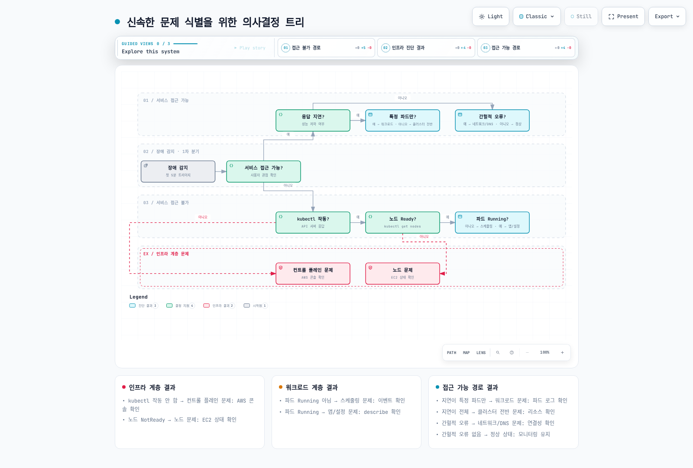
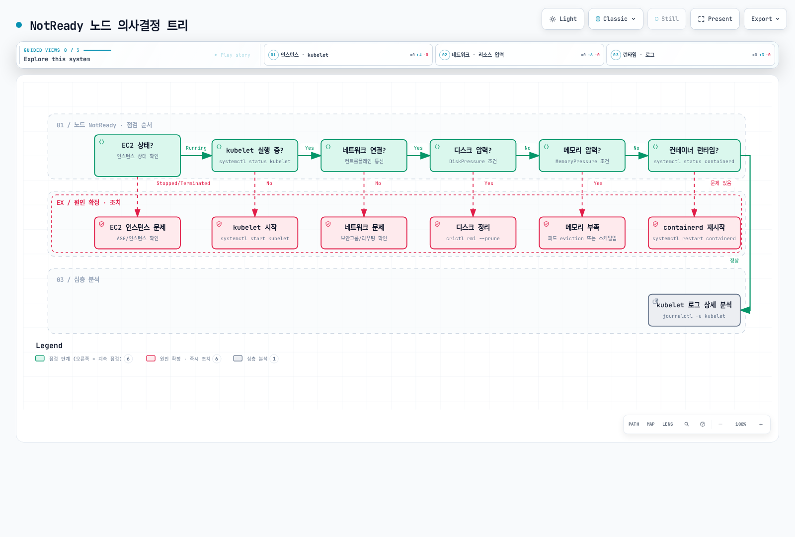
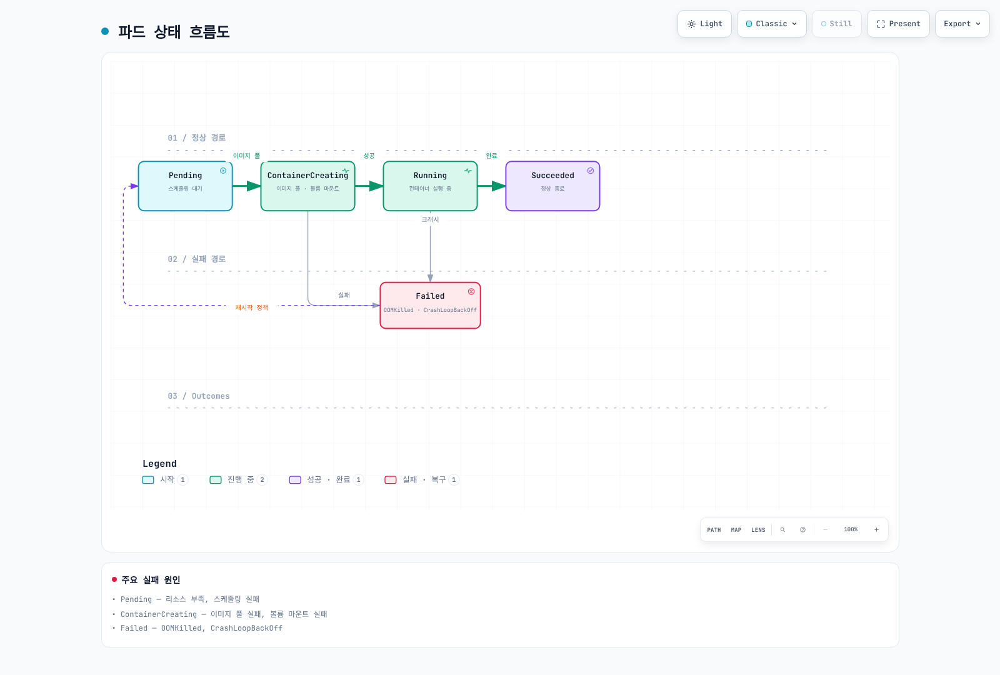
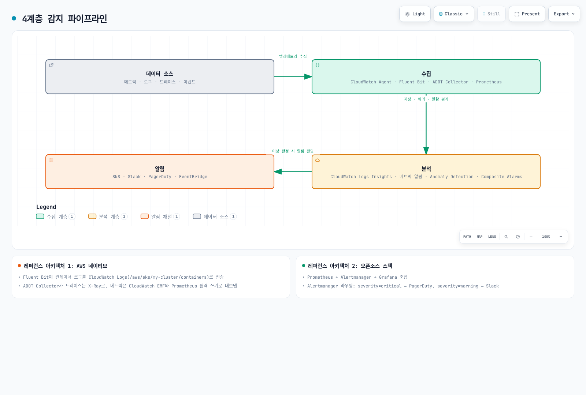

# EKS 고급 디버깅과 장애 대응

> **검토 기준**: Kubernetes 1.36 schema·kubectl 1.36.2; 현재 지원 EKS와 호환 component release 선택
> **마지막 업데이트**: 2026년 9월 12일

Amazon EKS 클러스터의 안정적인 운영을 위해서는 체계적인 장애 대응 프레임워크와 고급 디버깅 기술이 필수입니다. 이 문서에서는 프로덕션 환경에서 발생하는 복잡한 문제들을 신속하게 진단하고 해결하기 위한 실전 가이드를 제공합니다.

## 목차

1. [장애 대응 프레임워크](#1-장애-대응-프레임워크)
2. [컨트롤 플레인 디버깅](#2-컨트롤-플레인-디버깅)
3. [노드 레벨 문제 해결](#3-노드-레벨-문제-해결)
4. [워크로드 디버깅](#4-워크로드-디버깅)
5. [네트워킹 진단](#5-네트워킹-진단)
6. [스토리지 문제 해결](#6-스토리지-문제-해결)
7. [관측성 아키텍처](#7-관측성-아키텍처)
8. [장애 감지 아키텍처](#8-장애-감지-아키텍처)
9. [빠른 참조](#9-빠른-참조)
10. [다음 단계](#10-다음-단계)

---

## 1. 장애 대응 프레임워크

### 첫 5분 체크리스트 (Initial Triage)

기존 단계별 30초·영향 범위 확인 2분·전체 5분은 측정된 완료 시간이 아닌 계획 목표입니다. 고객 영향과 정확한 계정·cluster/context·namespace·최근 변경부터 확인합니다. API client 실패는 credential·authorization·DNS/network·control plane 문제일 수 있으며 실행 중인 모든 앱 중단을 뜻하지 않습니다.

Node condition·Pod/container state·controller rollout·최근 event·resource sample을 함께 봅니다. `phase!=Running`은 Running이면서 NotReady·CrashLooping인 Pod를 놓치고 정상 완료 Job은 포함합니다. Running phase가 readiness를 보장하지 않습니다. Deployment는 `1/1` 같은 화면 문자열 grep 대신 desired·updated·ready/available replica와 observed generation을 비교합니다.

표준 VPC CNI `aws-node` DaemonSet은 보통 `kube-system`에서 실행되며 `amazon-vpc-cni-system` namespace가 EKS 필수 전제는 아닙니다. 순수 Auto Mode는 networking·node system DNS를 달리 관리하므로 표준 add-on Pod 부재는 node·controller mode와 함께 해석합니다. Metrics Server는 수집된 resource sample이며 고객 가용성 신호가 아닙니다.

### 초기 진단 스크립트

선택한 workload namespace와 cluster node·system Pod 상태를 시간 제한 API 요청으로 수집해 비공개로 저장합니다. Secret data나 모든 Pod의 env·설정을 dump하지 않습니다. Log·event·오류 문구에도 앱의 민감 정보가 포함될 수 있으므로 공유 전 검사·삭제합니다. 실행 전 계정·context 입력과 기존 비공개 evidence directory를 확인합니다.

```bash
set -euo pipefail
: "${AWS_REGION:?Set the intended Region}"
: "${CLUSTER_NAME:?Set the existing cluster name}"
: "${EXPECTED_ACCOUNT_ID:?Set the intended account ID}"
: "${KUBE_CONTEXT:?Set the explicit kubectl context}"
: "${NAMESPACE:?Set the owned workload namespace}"
: "${EVIDENCE_PARENT:?Set an existing private evidence directory}"
test -d "$EVIDENCE_PARENT"
ACTUAL_ACCOUNT_ID=$(aws sts get-caller-identity --query Account --output text)
test "$ACTUAL_ACCOUNT_ID" = "$EXPECTED_ACCOUNT_ID" || { echo "Account mismatch" >&2; exit 1; }
CLUSTER_ENDPOINT=$(aws eks describe-cluster --name "$CLUSTER_NAME" --region "$AWS_REGION" \
  --query cluster.endpoint --output text)
KUBE_ENDPOINT=$(kubectl config view --context "$KUBE_CONTEXT" --minify \
  -o jsonpath='{.clusters[0].cluster.server}')
test "$CLUSTER_ENDPOINT" = "$KUBE_ENDPOINT" || { echo "Context/cluster mismatch" >&2; exit 1; }

umask 077
TRIAGE_DIR=$(mktemp -d "$EVIDENCE_PARENT/eks-triage.XXXXXXXX")
TRIAGE_FAILED=0
k() { kubectl --context "$KUBE_CONTEXT" --request-timeout=15s "$@"; }
collect() {
  local name=$1
  shift
  if "$@" > "$TRIAGE_DIR/$name.txt" 2> "$TRIAGE_DIR/$name.stderr"; then
    printf '%s\tok\n' "$name" >> "$TRIAGE_DIR/status.tsv"
  else
    local rc=$?
    TRIAGE_FAILED=$((TRIAGE_FAILED + 1))
    printf '%s\tfailed:%s\n' "$name" "$rc" >> "$TRIAGE_DIR/status.tsv"
  fi
}
node_health() {
  k get nodes -o json | jq '[.items[] | {
    name:.metadata.name,uid:.metadata.uid,providerID:.spec.providerID,
    unschedulable:.spec.unschedulable,taints:.spec.taints,conditions:.status.conditions
  }]'
}
pod_health() {
  k -n "$NAMESPACE" get pods -o json | jq '[.items[] | {
    name:.metadata.name,uid:.metadata.uid,node:.spec.nodeName,owners:.metadata.ownerReferences,
    deleting:.metadata.deletionTimestamp,phase:.status.phase,conditions:.status.conditions,
    containers:[.status.containerStatuses[]? | {name,ready,restartCount,state,lastState}],
    initContainers:[.status.initContainerStatuses[]? | {name,ready,restartCount,state,lastState}]
  }]'
}
deployment_health() {
  k -n "$NAMESPACE" get deployments -o json | jq '[.items[] | {
    name:.metadata.name,generation:.metadata.generation,observed:.status.observedGeneration,
    desired:(.spec.replicas // 1),updated:(.status.updatedReplicas // 0),
    ready:(.status.readyReplicas // 0),available:(.status.availableReplicas // 0),
    conditions:.status.conditions
  }]'
}
load_balancers() {
  k -n "$NAMESPACE" get services -o json | jq '[.items[] | select(.spec.type=="LoadBalancer") | {
    name:.metadata.name,class:.spec.loadBalancerClass,selector:.spec.selector,
    ports:.spec.ports,status:.status.loadBalancer
  }]'
}
collect nodes node_health
collect pods pod_health
collect deployments deployment_health
collect load-balancers load_balancers
collect events k -n "$NAMESPACE" get events --sort-by='.metadata.creationTimestamp'
collect system-pods k -n kube-system get pods -o wide
collect node-resources k top nodes
collect pod-resources k -n "$NAMESPACE" top pods --sort-by=memory
printf 'Private evidence: %s; failed collections: %s\n' "$TRIAGE_DIR" "$TRIAGE_FAILED"
test "$TRIAGE_FAILED" -eq 0
```

`status.tsv`와 각 실패 출력을 확인합니다. 권한 부족·metric 부재·API timeout을 수집 실패로 남기며 하나라도 실패하면 nonzero로 종료합니다. Incident가 해결되었다고 주장하지 않습니다. 완료·Pending·Running 상태를 그대로 보여 주므로 함께 해석합니다. 후속 log는 정확한 namespace·Pod UID·container와 제한한 기간·행 수를 사용합니다.

LoadBalancer 목록은 Service JSON을 로컬 filter합니다. `spec.type`은 기본 Service의 지원 field selector가 아닙니다. 초기 수집에 전체 `cluster-info dump`·자동 archive 업로드·자원 restart·delete를 포함하지 않습니다.

### 장애 심각도 매트릭스 (Severity Matrix)

| 심각도 | 분류 | 영향 범위 | 대응 시간 | 예시 |
|--------|------|-----------|-----------|------|
| **P1** | Critical | 전체 서비스 중단 | 15분 이내 | 컨트롤 플레인 장애, 전체 노드 NotReady |
| **P2** | High | 주요 기능 장애 | 1시간 이내 | 특정 워크로드 전체 실패, 네트워크 연결 문제 |
| **P3** | Medium | 부분적 영향 | 4시간 이내 | 일부 파드 재시작, 성능 저하 |
| **P4** | Low | 경미한 문제 | 24시간 이내 | 로그 수집 지연, 비핵심 모니터링 알림 |

위 심각도별 대응 시간은 조직 목표의 예시입니다. 실제 고객 영향으로 분류하며 control-plane만의 장애에서도 기존 workload traffic은 실행될 수 있습니다.

### 신속한 문제 식별을 위한 의사결정 트리

<!-- Content audit: diagram prose needs parent repair; see eks-advanced-debugging/diagram-review.json.


[🔍 인터랙티브 다이어그램 보기](https://www.atomai.click/kubernetes-docs/archmaps/ko-eks-11-eks-advanced-debugging-0.html)
-->

---

## 2. 컨트롤 플레인 디버깅

### EKS 컨트롤 플레인 로그 유형

EKS는 다섯 control-plane log 유형을 제공하며 활성화한 유형만 해당 region의 CloudWatch log group으로 전송합니다. 활성화가 누락된 과거 log를 복구하지는 않습니다. 접근·retention을 제한하고 ingestion·보관·query 비용을 고려합니다. Group·stream 부재는 logging 비활성화·미전송·잘못된 region·권한 거부일 수 있으며 control-plane 장애로 단정하지 않습니다.

| 유형 | 확인할 근거 |
| --- | --- |
| api | API server 동작·오류 |
| audit | API 요청 identity·verb·resource·응답 상태 |
| authenticator | IAM과 Kubernetes 사이 인증 |
| controllerManager | Controller 조정 |
| scheduler | Scheduling 결정·오류 |

```bash
set -euo pipefail
: "${AWS_REGION:?}"; : "${CLUSTER_NAME:?}"
LOG_GROUP="/aws/eks/$CLUSTER_NAME/cluster"
aws eks describe-cluster --region "$AWS_REGION" --name "$CLUSTER_NAME" \
  --query 'cluster.{ARN:arn,Status:status,Logging:logging}'
aws logs describe-log-streams --region "$AWS_REGION" --log-group-name "$LOG_GROUP" \
  --order-by LastEventTime --descending --max-items 10 \
  --query 'logStreams[].{Name:logStreamName,LastEvent:lastEventTimestamp}'
```
```bash
# MUTATION: review cost, retention, access and available subnet IPs first.
set -euo pipefail
UPDATE_ID=$(aws eks update-cluster-config --region "$AWS_REGION" --name "$CLUSTER_NAME" \
  --logging '{"clusterLogging":[{"types":["api","audit","authenticator","controllerManager","scheduler"],"enabled":true}]}' \
  --query update.id --output text)
test -n "$UPDATE_ID" && test "$UPDATE_ID" != None
aws eks describe-update --region "$AWS_REGION" --name "$CLUSTER_NAME" \
  --update-id "$UPDATE_ID" --query update
```
변경은 비동기입니다. 반환 update ID가 Successful인지 추적하며 Failed·Cancelled·client timeout을 성공으로 처리하지 않습니다. 이후 describe-cluster와 새 log 전송을 확인합니다. Cluster ACTIVE만으로 해당 update 완료를 알 수 없습니다. 현재 EKS logging 전제에 따라 설정한 각 cluster subnet에 최대 다섯 개의 가용 IP가 필요할 수 있습니다.

### CloudWatch Logs Insights 쿼리

각 블록을 Bash·SQL이 아닌 **별도의 Logs Insights QL query**로 실행합니다. Console·StartQuery 요청에서 정확한 log group·기간을 선택합니다. CloudWatch가 발견한 EKS JSON audit field를 사용하므로 pipeline이 형식을 바꾸면 실제 record·중첩 log parsing을 확인합니다. 검색 결과가 없다고 서비스 정상·log 전송을 증명하지는 않습니다.

#### API 오류 메시지

```text
fields @timestamp, @message
| filter @logStream like /kube-apiserver/ and @logStream not like /audit/
| filter @message like /error|Error|ERROR/
| sort @timestamp desc
| limit 100
```

#### 선택한 시간 구간의 오류 수

```text
fields @timestamp, @message
| filter @logStream like /kube-apiserver/ and @logStream not like /audit/
| filter @message like /error|Error|ERROR/
| stats count(*) as error_count by bin(5m)
```

#### 검토가 필요한 Authenticator 메시지

```text
fields @timestamp, @message
| filter @logStream like /authenticator/
| filter @message like /access denied|Unauthorized|unauthorized/
| sort @timestamp desc
| limit 50
```

#### 구조화된 audit 로그의 인증·인가 거부

```text
fields @timestamp, user.username, verb, objectRef.resource, objectRef.namespace, responseStatus.code
| filter @logStream like /kube-apiserver-audit/
| filter responseStatus.code in [401, 403]
| sort @timestamp desc
| limit 100
```

#### 검토 대상 identity의 구조화된 audit 활동

```text
fields @timestamp, user.username, verb, objectRef.resource, objectRef.namespace, responseStatus.code
| filter @logStream like /kube-apiserver-audit/
| filter user.username = "REPLACE_WITH_OBSERVED_KUBERNETES_USERNAME"
| sort @timestamp desc
| limit 50
```

#### identity와 resource별 audit 429 이벤트

```text
fields user.username, verb, objectRef.resource, responseStatus.code
| filter @logStream like /kube-apiserver-audit/
| filter responseStatus.code = 429
| stats count(*) as request_count by user.username, verb, objectRef.resource
| sort request_count desc
| limit 50
```

#### API 요청량 — throttling 발생 여부와 구분

```text
fields user.username, verb, objectRef.resource
| filter @logStream like /kube-apiserver-audit/
| stats count(*) as request_count by user.username, verb, objectRef.resource
| sort request_count desc
| limit 50
```

Audit 401·403은 요청 단위 거부이며 authenticator 문구 검색과 다릅니다. 전체 API 호출 수는 throttled 호출 수가 아니고 time-bin 집계 후에는 각 event의 @timestamp로 정렬할 수 없습니다. StartQuery의 query ID로 GetQueryResults가 Complete인지 확인하고 Failed·Cancelled·Timeout·missing-data를 보존합니다. [모니터링 장](06-eks-monitoring-logging.md)의 제한한 query·polling 절차를 참고합니다. 감사에서 live CloudWatch query는 실행하지 않았습니다.

[EKS control-plane logging](https://docs.aws.amazon.com/eks/latest/userguide/control-plane-logs.html) · [AWS audit-field examples](https://docs.aws.amazon.com/eks/latest/best-practices/auditing-and-logging.html)

### IAM 인증 문제 해결

먼저 초기 triage의 계정·context guard를 실행합니다. Kubectl을 사용하는 사람·자동화 IAM identity, node bootstrap identity, 앱 Pod 내부 AWS identity를 구분합니다. Token 생성 성공이 Kubernetes 인증·인가 성공을 증명하지는 않습니다.

k8s-aws-v1으로 시작하는 EKS IAM token은 base64url로 인코딩한 presigned STS 요청이며 **세 부분 JWT가 아닙니다.** JSON처럼 decode·출력하거나 log에 복사하지 않습니다. Kubernetes projected ServiceAccount token은 별도의 JWT credential입니다.

```bash
set -euo pipefail
: "${AWS_REGION:?}"; : "${CLUSTER_NAME:?}"; : "${KUBE_CONTEXT:?}"; : "${NAMESPACE:?}"
aws sts get-caller-identity
aws eks describe-cluster --region "$AWS_REGION" --name "$CLUSTER_NAME" \
  --query 'cluster.{ARN:arn,AuthenticationMode:accessConfig.authenticationMode}'
# Print only the credential expiry, not the bearer token.
aws eks get-token --region "$AWS_REGION" --cluster-name "$CLUSTER_NAME" \
  --query status.expirationTimestamp --output text
kubectl --context "$KUBE_CONTEXT" auth whoami
kubectl --context "$KUBE_CONTEXT" -n "$NAMESPACE" auth can-i get pods
```
AuthenticationMode에 맞춰 access를 확인합니다. API/API_AND_CONFIG_MAP은 principal의 access entry·연결 policy 범위·RBAC binding을, CONFIG_MAP은 기존 legacy mapping을 봅니다. 원인을 확인하지 않은 401·403 때문에 mode를 전환하거나 aws-auth를 교체하지 않습니다. Mode migration에는 별도 전제와 되돌릴 수 없는 전환이 있으며 IAM role path·STS session ARN을 문자열 치환으로 추정하지 않습니다.

```bash
# Run for API or API_AND_CONFIG_MAP authentication mode.
aws eks list-access-entries --region "$AWS_REGION" --cluster-name "$CLUSTER_NAME"
: "${PRINCIPAL_ARN:?Use a reviewed IAM role/user ARN, not an STS assumed-role session ARN}"
aws eks describe-access-entry --region "$AWS_REGION" --cluster-name "$CLUSTER_NAME" \
  --principal-arn "$PRINCIPAL_ARN"
aws eks list-associated-access-policies --region "$AWS_REGION" --cluster-name "$CLUSTER_NAME" \
  --principal-arn "$PRINCIPAL_ARN"
```
```bash
# Read-only legacy mapping inspection for CONFIG_MAP/API_AND_CONFIG_MAP clusters.
kubectl --context "$KUBE_CONTEXT" -n kube-system get configmap aws-auth -o yaml
```
기존 node bootstrap mapping을 보존합니다. Group명만으로 권한이 생기지 않으며 대응 binding이 필요합니다. 진단 단계에서 system:masters를 추가하지 말고 검토한 최소 권한을 사용합니다. 403은 인가 거부, 401은 유효하지 않거나 만료한 credential일 수 있으며 network·TLS 실패와 구분합니다.

### IRSA 문제 해결

IRSA에는 올바른 OIDC issuer/provider, namespace·ServiceAccount subject와 sts.amazonaws.com audience에 맞는 trust policy, web-identity credential을 사용·갱신하는 SDK가 필요합니다. 아래 annotation은 일부 설정이며 namespace·role은 placeholder입니다. 이 YAML만으로 role·provider·bucket 권한이 생성되지 않습니다.

```yaml
apiVersion: v1
kind: ServiceAccount
metadata:
  name: s3-access-sa
  namespace: diagnostics-example
  annotations:
    eks.amazonaws.com/role-arn: arn:aws:iam::123456789012:role/owned-s3-access-role
```
```bash
set -euo pipefail
: "${SERVICE_ACCOUNT:?Set the actual ServiceAccount on the Pod}"
: "${POD_NAME:?Set an owned Pod}"; : "${CONTAINER_NAME:?Set its application container}"
: "${IRSA_ROLE_NAME:?Set the reviewed IAM role name}"
kubectl --context "$KUBE_CONTEXT" -n "$NAMESPACE" get serviceaccount "$SERVICE_ACCOUNT" \
  -o jsonpath='{.metadata.annotations.eks\.amazonaws\.com/role-arn}{"\n"}'
aws eks describe-cluster --name "$CLUSTER_NAME" --region "$AWS_REGION" \
  --query cluster.identity.oidc.issuer --output text
aws iam get-role --role-name "$IRSA_ROLE_NAME" --query Role.AssumeRolePolicyDocument
kubectl --context "$KUBE_CONTEXT" -n "$NAMESPACE" get pod "$POD_NAME" -o json | jq '{
  uid:.metadata.uid,serviceAccount:.spec.serviceAccountName,
  envNames:[.spec.containers[] | {name,envNames:[.env[]?.name]}],
  projectedVolumes:[.spec.volumes[]? | select(.projected) | {name,projected}]
}'
```
Secret 값·token bytes 대신 env **이름**, token 경로·mount metadata·SDK credential chain을 확인합니다. Static credential이나 앞선 provider가 의도한 identity를 덮을 수 있습니다. 새 debug Pod·container는 identity·설정이 다를 수 있으므로 실제 앱 container를 확인합니다.

```bash
# Optional read-only identity request, only if AWS CLI is already in this container.
kubectl --context "$KUBE_CONTEXT" -n "$NAMESPACE" exec "$POD_NAME" -c "$CONTAINER_NAME" \
  -- aws sts get-caller-identity
```
STS 응답은 사용 identity를 나타내며 모든 bucket 목록·특정 object 접근 권한을 증명하지는 않습니다. Identity 검사만을 위해 계정 전체 aws s3 ls를 실행하지 않습니다.

### Pod Identity 문제 해결

```bash
aws eks list-pod-identity-associations --region "$AWS_REGION" \
  --cluster-name "$CLUSTER_NAME" --namespace "$NAMESPACE" --service-account "$SERVICE_ACCOUNT"
: "${ASSOCIATION_ID:?Use the exact matching association ID}"
aws eks describe-pod-identity-association --region "$AWS_REGION" \
  --cluster-name "$CLUSTER_NAME" --association-id "$ASSOCIATION_ID"
# Standard EC2-node setup only; Auto Mode provides the integration itself.
kubectl --context "$KUBE_CONTEXT" -n kube-system get pods \
  -l app.kubernetes.io/name=eks-pod-identity-agent
```
Association·role trust/권한·지원 SDK provider·agent/node 접근성을 확인합니다. Auto Mode에는 기능이 내장되어 agent를 중복 설치하지 않으며 Fargate는 EKS Pod Identity를 지원하지 않습니다. Association 생성·변경은 진단과 분리합니다. IRSA·Pod Identity는 token audience·credential 전달 경로가 다르며 운영자 AWS CLI identity와 기본적으로 같지 않습니다.

### ServiceAccount Token 만료와 갱신

Projected token에 보편적인 “최대 24시간” 규칙은 없습니다. 요청 기간과 API server의 설정 상한은 다릅니다. Kubelet은 TTL의 80%보다 오래되었거나 24시간이 지난 token의 갱신을 요청하며 앱은 교체된 file을 다시 읽어야 합니다. EKS는 Kubernetes API ServiceAccount token migration의 90일 호환성 연장·stale-token audit annotation을 문서화하지만 이를 안전한 cache 기간이나 IRSA·Pod Identity·임의 외부 verifier의 수명 보장으로 쓰지 않습니다.

다음 예시는 STS audience의 custom token을 한 시간으로 요청합니다. 기본 API token을 연장하거나 IRSA를 자동 구성하지 않습니다. 기존 namespace·ServiceAccount, 검토한 image, role trust, 앱 SDK·token-file 설정은 별도 전제입니다. STS audience token이 Kubernetes API에도 유효하다고 가정하지 않습니다.

```yaml
apiVersion: v1
kind: Pod
metadata:
  name: audience-token-example
  namespace: diagnostics-example
spec:
  serviceAccountName: owned-app
  automountServiceAccountToken: false
  containers:
  - name: app
    image: registry.example.com/owned/app:replace-with-reviewed-digest
    volumeMounts:
    - name: token
      mountPath: /var/run/secrets/tokens
      readOnly: true
  volumes:
  - name: token
    projected:
      sources:
      - serviceAccountToken:
          path: token
          expirationSeconds: 3600
          audience: sts.amazonaws.com
```
[EKS access entries](https://docs.aws.amazon.com/eks/latest/userguide/access-entries.html) · [EKS token migration/rotation](https://docs.aws.amazon.com/eks/latest/userguide/service-accounts.html) · [Kubernetes projected tokens](https://kubernetes.io/docs/tasks/configure-pod-container/configure-service-account/) · [IRSA](https://docs.aws.amazon.com/eks/latest/userguide/iam-roles-for-service-accounts.html) · [Pod Identity](https://docs.aws.amazon.com/eks/latest/userguide/pod-identities.html)

### EKS Add-on 오류 패턴

변경 전 설치 version·owner·configuration/identity 설정과 health.issues를 읽습니다. ACTIVE는 add-on 상태이지 모든 고객 traffic 정상의 증명이 아니며 DEGRADED는 단순 속도 저하가 아닌 health issue를 뜻합니다. CREATE_FAILED·UPDATE_FAILED·DELETE_FAILED는 실제 issue 상세를 확인합니다. Auto Mode 관리 기능에는 표준 add-on 부재가 정상일 수 있습니다.

```bash
set -euo pipefail
: "${AWS_REGION:?}"; : "${CLUSTER_NAME:?}"; : "${ADDON_NAME:?Set the existing owned add-on}"
aws eks describe-addon --region "$AWS_REGION" --cluster-name "$CLUSTER_NAME" \
  --addon-name "$ADDON_NAME" \
  --query 'addon.{Version:addonVersion,Status:status,Issues:health.issues,Configuration:configurationValues,Role:serviceAccountRoleArn,PodIdentity:podIdentityAssociations}'
CLUSTER_VERSION=$(aws eks describe-cluster --region "$AWS_REGION" --name "$CLUSTER_NAME" \
  --query cluster.version --output text)
aws eks describe-addon-versions --region "$AWS_REGION" --addon-name "$ADDON_NAME" \
  --kubernetes-version "$CLUSTER_VERSION" \
  --query 'addons[].addonVersions[].{Version:addonVersion,Architectures:architecture,ComputeTypes:computeTypes,Compatibility:compatibilities}'
```
응답 첫 version을 “최신” 또는 모든 node 유형에 자동 호환되는 값으로 선택하지 않습니다. Architecture·compute type·default 표시·configuration schema·IAM/Pod Identity·component migration 순서를 검토합니다. Configuration 출력은 민감할 수 있으므로 비공개로 취급합니다. Version update는 초기 진단이 아닌 의도한 변경입니다.

```bash
# MUTATION: use a reviewed compatible version and configuration/identity plan.
set -euo pipefail
: "${REVIEWED_ADDON_VERSION:?Choose from the compatible versions after review}"
: "${REVIEWED_ADDON_CONFIG:?Set the path to the reviewed JSON configuration file}"
test -f "$REVIEWED_ADDON_CONFIG"
aws eks describe-addon-configuration --region "$AWS_REGION" --addon-name "$ADDON_NAME" \
  --addon-version "$REVIEWED_ADDON_VERSION" --query configurationSchema --output text
# The configuration file must be checked against this version's schema before this request.
UPDATE_ID=$(aws eks update-addon --region "$AWS_REGION" --cluster-name "$CLUSTER_NAME" \
  --addon-name "$ADDON_NAME" --addon-version "$REVIEWED_ADDON_VERSION" \
  --configuration-values "file://$REVIEWED_ADDON_CONFIG" \
  --resolve-conflicts PRESERVE --query update.id --output text)
test -n "$UPDATE_ID" && test "$UPDATE_ID" != None
aws eks describe-update --region "$AWS_REGION" --name "$CLUSTER_NAME" \
  --addon-name "$ADDON_NAME" --update-id "$UPDATE_ID" --query update
```
PRESERVE는 conflict 처리에서 기존 custom 설정 보존을 요청하지만 backup이나 임의의 이전 설정이 새 release에서도 동작한다는 보장은 아닙니다. OVERWRITE는 충돌한 custom 설정을 초기화할 수 있어 별도 검토합니다. 정확한 update ID의 완료·오류와 변경 후 add-on health를 확인합니다. configurationValues·identity 변경을 조용히 생략·덮어쓰지 말고 명시적으로 검토합니다.

[Update an EKS add-on](https://docs.aws.amazon.com/eks/latest/userguide/updating-an-add-on.html)

---

## 3. 노드 레벨 문제 해결

<a id="node-join-diagnosis"></a>

### 노드 조인 실패 진단

다음은 instance·NodeClaim·bootstrap log·endpoint 접근·authentication mode로 검증할 가설이며 확정 원인 목록이 아닙니다.

| 영역 | 확인할 항목 |
| --- | --- |
| Bootstrap·AMI | 정확한 cluster명·endpoint·CA, OS별 bootstrap, architecture·호환 kubelet/AMI; 모든 경우 version이 정확히 같아야 한다는 규칙은 아님 |
| Network·보안 | Node→API TCP 443, API→kubelet TCP 10250, DNS·workload별 경로; 방향·SG membership·routing 확인 |
| VPC DNS | DNS support/hostname·DHCP resolver/domain·실제로 사용하는 endpoint |
| Identity | Node IAM role과 Kubernetes node access entry/legacy mapping; instance-profile ARN과 role ARN 구분 |
| 소유·탐색 tag | Provisioner별 node ownership tag; LB 탐색용 subnet tag와 구분 |
| Private 접근 | 검토한 endpoint·egress를 통한 EKS/ECR/S3/STS 등 필수 경로; 모든 private cluster가 NAT를 요구하지 않음 |
| Launch 설정 | 해당 provisioner의 role/profile 처리, launch-template version, capacity·subnet IP |
| 초기화 | 선택 AMI에 맞는 nodeadm·cloud-init·bootstrap 근거; AL2023·Bottlerocket·Windows·Auto Mode의 경로는 같지 않음 |

```bash
set -euo pipefail
: "${KUBE_CONTEXT:?}"; : "${NODE_NAME:?Set the exact owned node name}"
NODE_JSON=$(kubectl --context "$KUBE_CONTEXT" get node "$NODE_NAME" -o json)
printf '%s\n' "$NODE_JSON" | jq '{
  name:.metadata.name,uid:.metadata.uid,providerID:.spec.providerID,
  os:.status.nodeInfo.osImage,kernel:.status.nodeInfo.kernelVersion,
  kubelet:.status.nodeInfo.kubeletVersion,runtime:.status.nodeInfo.containerRuntimeVersion,
  labels:.metadata.labels,taints:.spec.taints,conditions:.status.conditions
}'
NODE_UID=$(printf '%s\n' "$NODE_JSON" | jq -er '.metadata.uid')
kubectl --context "$KUBE_CONTEXT" get events -A \
  --field-selector "involvedObject.uid=$NODE_UID" --sort-by='.metadata.creationTimestamp'
```
```bash
# EC2-backed nodes only: map the Node providerID to an inspected instance ID/Region.
: "${AWS_REGION:?}"; : "${INSTANCE_ID:?Use the verified EC2 ID, not a guessed node-name conversion}"
aws ec2 describe-instances --region "$AWS_REGION" --instance-ids "$INSTANCE_ID" \
  --query 'Reservations[].Instances[].{ID:InstanceId,State:State.Name,AZ:Placement.AvailabilityZone,Subnet:SubnetId,Profile:IamInstanceProfile,Groups:SecurityGroups,Image:ImageId}'
aws ec2 describe-instance-status --region "$AWS_REGION" --instance-ids "$INSTANCE_ID" \
  --include-all-instances
```
아직 등록되지 않은 instance에는 Node 객체가 없으므로 소유 managed-node-group·NodeClaim·instance 근거를 사용합니다. Ready=False와 heartbeat 부재로 인한 Ready=Unknown을 구분합니다. Resource pressure는 Ready와 함께 나타날 수 있으므로 화면 문자열 하나로 원인을 추정하지 않습니다. 신규 Auto Mode EC2 managed instance는 일반 목록에 기본 숨김일 수 있습니다. 직접 instance ID 조회·managed resource 포함과 계정 전체 visibility 변경을 구분합니다.

### NotReady 노드 의사결정 트리

<!-- Content audit: diagram prose needs parent repair; see eks-advanced-debugging/diagram-review.json.


[🔍 인터랙티브 다이어그램 보기](https://www.atomai.click/kubernetes-docs/archmaps/ko-eks-11-eks-advanced-debugging-1.html)
-->

### Host·관리 node 진단

고객이 접근 가능한 Linux node의 SSM에는 node agent·role/network 전제와 정확한 instance 접근 권한이 필요하며 session을 엽니다. EKS Auto Mode managed instance는 직접 SSH를 지원하지 않습니다. 문서화된 NodeDiagnostic·console-output 또는 지원 kubectl debug node 경로를 사용합니다. 현재 Auto Mode 가이드는 live log용 **명시적 sysadmin debug profile**을 지원합니다. 이는 privileged Pod 생성이며 SSH나 기본 debug 권한이 아닙니다. NodeDiagnostic은 민감한 log·capture를 S3에 업로드할 수 있어 별도 범위·저장 권한 검토가 필요합니다.

```bash
# Interactive host access: an operational session, not an automatic triage step.
: "${AWS_REGION:?}"; : "${INSTANCE_ID:?Use the reviewed self-managed or managed-node-group instance}"
aws ssm start-session --region "$AWS_REGION" --target "$INSTANCE_ID"
```
```bash
# Read-only Linux/systemd host checks after authorized access.
sudo systemctl show kubelet containerd --no-pager \
  -p Id -p LoadState -p ActiveState -p SubState -p ExecMainStatus
sudo journalctl -u kubelet --since "15 minutes ago" -n 200 --no-pager
sudo journalctl -u containerd --since "15 minutes ago" -n 100 --no-pager
sudo crictl info
sudo crictl ps
sudo crictl ps -a
sudo crictl images
df -h
df -i
sudo journalctl --disk-usage
```
```bash
# Exact container ID only; log content may be sensitive.
: "${CONTAINER_ID:?Use an inspected CRI container ID}"
sudo crictl logs --tail=100 "$CONTAINER_ID"
```
Systemd·CRI 명령은 선택 host에 해당 component·도구가 있다는 전제입니다. Crictl의 올바른 CRI endpoint를 확인합니다. Journal은 기간·행 수를 제한하며 journalctl -f를 tail에 연결하면 끝나지 않을 수 있습니다. Kubeconfig·client key를 출력하거나 log·종료 container·image cache를 일괄 삭제하지 않습니다. 증거이거나 kubelet GC가 관리하는 자원일 수 있습니다. Restart·drain·replacement·retention 변경은 원인 확인 뒤 별도 검토한 복구 단계입니다.

### Resource Pressure

DiskPressure는 df 용량뿐 아니라 가용 byte/inode·설정한 eviction threshold와 관련됩니다. df -h·df -i·mount·kubelet event를 함께 봅니다. Retention 정리를 허용한 경우에도 기존 journalctl --vacuum-size=500M은 정책 예시이며 필요한 증거를 먼저 확보하고 /var/log glob을 지우지 않습니다. MemoryPressure와 container OOM은 다릅니다. Limit·node 가용 memory·working set·log·pressure metric을 대조합니다. Limit·node 증가만으로 원인 해결을 증명하지 못합니다.

```bash
# Read-only host evidence, not remediation.
free -h
awk '/MemTotal|MemFree|MemAvailable|Buffers|Cached/ {print}' /proc/meminfo
cat /proc/sys/kernel/pid_max
cat /proc/sys/kernel/threads-max
ps -eLf --no-headers | wc -l
ps -eo pid,comm,nlwp --sort=-nlwp | head -20
if [ -r /proc/pressure/memory ]; then cat /proc/pressure/memory; fi
if [ -r /proc/pressure/cpu ]; then cat /proc/pressure/cpu; fi
```
/proc process directory 수는 전체 thread/task 수가 아닙니다. Ps NLWP·kernel limit는 단서이며 kubelet PID-pressure 계산·cgroup PID limit와 구분합니다. 일반 memory 사용률을 Kubernetes MemoryPressure condition이라고 표시하지 않습니다. Metric 부재는 근거 없음으로 처리합니다.

### Karpenter 프로비저닝 문제

```bash
# Self-managed Karpenter; use the actual release namespace and selected objects.
: "${KARPENTER_NAMESPACE:?Set the existing controller namespace}"
: "${NODEPOOL_NAME:?}"; : "${NODECLAIM_NAME:?}"
kubectl --context "$KUBE_CONTEXT" -n "$KARPENTER_NAMESPACE" logs \
  -l app.kubernetes.io/name=karpenter -c controller --since=15m --tail=200 --prefix
kubectl --context "$KUBE_CONTEXT" get nodepool "$NODEPOOL_NAME" -o yaml
kubectl --context "$KUBE_CONTEXT" get nodeclaim "$NODECLAIM_NAME" -o yaml
kubectl --context "$KUBE_CONTEXT" get events -A \
  --field-selector "involvedObject.name=$NODECLAIM_NAME" --sort-by='.metadata.creationTimestamp'
```
NodePool·NodeClass readiness, NodeClaim condition/event, constraints·limit·subnet IP·IAM·EC2 capacity를 확인합니다. Auto Mode는 내장 controller의 NodeClaim·NodeClass·event·audit log를 확인하며 self-managed karpenter Deployment·namespace를 기대하지 않습니다. 아래 self-managed v1 schema는 호환 release·검토한 기존 EC2NodeClass가 필요한 예시이며 기존 default pool 교체 명령이 아닙니다. CPU/memory limit는 예약 용량이 아닌 상한이고 capacity-type 목록이 Spot 전용·AZ 균형을 증명하지 않습니다.

```yaml
apiVersion: karpenter.sh/v1
kind: NodePool
metadata:
  name: reviewed-capacity-example
spec:
  template:
    spec:
      requirements:
      - key: kubernetes.io/arch
        operator: In
        values:
        - amd64
      - key: karpenter.sh/capacity-type
        operator: In
        values:
        - spot
        - on-demand
      - key: karpenter.k8s.aws/instance-category
        operator: In
        values:
        - c
        - m
        - r
      nodeClassRef:
        group: karpenter.k8s.aws
        kind: EC2NodeClass
        name: reviewed-existing-class
  limits:
    cpu: 1000
    memory: 1000Gi
  disruption:
    consolidationPolicy: WhenEmptyOrUnderutilized
    consolidateAfter: 30s
```
### Managed Node Group 오류 코드

| Issue | 의미·확인할 근거 |
| --- | --- |
| AccessDenied | Kubernetes API 인증·인가 실패; IAM뿐 아니라 node access·EKS node-manager RBAC 확인 |
| AsgInstanceLaunchFailures | ASG launch 실패; 실제 activity message·template·capacity·권한 확인 |
| ClusterUnreachable | Kubernetes API 연결·요청 처리 timeout; VPC endpoint 누락으로 단정하지 않음 |
| InsufficientFreeAddresses | 선택한 node subnet의 가용 IP 부족; 기존 subnet IPv4 CIDR은 제자리 확장 불가 |
| NodeCreationFailure | 시작한 instance 등록 실패; bootstrap·access·필수 network 경로 확인 |

```bash
set -euo pipefail
: "${AWS_REGION:?}"; : "${CLUSTER_NAME:?}"; : "${NODEGROUP_NAME:?Set the exact managed node group}"
aws eks describe-nodegroup --region "$AWS_REGION" --cluster-name "$CLUSTER_NAME" \
  --nodegroup-name "$NODEGROUP_NAME" \
  --query 'nodegroup.{Status:status,Issues:health.issues,Version:version,Release:releaseVersion,Subnets:subnets,Role:nodeRole,LaunchTemplate:launchTemplate,Repair:nodeRepairConfig}'
# For a Kubernetes authorization issue, inspect rather than blindly replace EKS-managed RBAC.
kubectl --context "$KUBE_CONTEXT" get clusterrole eks:node-manager -o yaml
kubectl --context "$KUBE_CONTEXT" get clusterrolebinding eks:node-manager -o yaml
```
각 issue의 message·resourceIds와 현재 AWS 복구 절차를 사용합니다. Troubleshooting 가이드는 managed node가 15분 안에 join하지 못하면 NodeCreationFailure가 나타날 수 있다고 설명하며 모든 boot가 그 안에 끝난다는 보장은 아닙니다. 공간이 부족하면 기존 CIDR 편집 대신 신규 주소 공간·subnet·provisioner별 migration을 계획합니다. EKS 관리 RBAC shape는 바뀔 수 있으므로 AccessDenied만 보고 이전 ClusterRole을 덮어쓰지 않습니다. Node repair·eviction은 진단과 별개이며 workload·budget·data·node 관리 mode를 고려합니다.

[EKS troubleshooting](https://docs.aws.amazon.com/eks/latest/userguide/troubleshooting.html) · [Auto Mode diagnostic paths](https://docs.aws.amazon.com/eks/latest/userguide/auto-troubleshoot.html) · [Security group paths](https://docs.aws.amazon.com/eks/latest/userguide/sec-group-reqs.html) · [Private clusters](https://docs.aws.amazon.com/eks/latest/userguide/private-clusters.html) · [Karpenter compatibility](https://karpenter.sh/docs/upgrading/compatibility/)

### Node Readiness Controller (단계별 부팅 검증)

Kubernetes SIGs Node Readiness Controller는 실제 별도 controller입니다. 검토한 v0.5.0은 cluster 범위의 `readiness.node.x-k8s.io/v1alpha1` `NodeReadinessRule`을 사용하며 EKS 내장 ConfigMap 처리기나 Node API의 GA field가 아닙니다.

Controller는 Node condition을 읽고 taint를 관리합니다. ConfigMap의 임의 `checks[].probe.exec`를 실행하지 않습니다. 기존 file 존재·containerd check에는 대응 condition을 게시하는 별도 구현·권한을 갖춘 reporter 또는 NPD custom monitor가 필요합니다. CNI 설정 file 존재만으로 CNI 준비 완료를 증명하지 못합니다. 프로젝트의 기본 reporter는 `CHECK_ENDPOINT`·`CONDITION_TYPE`·`NODE_NAME`으로 HTTP endpoint를 poll하며 이전 exec-probe 형식을 사용하지 않습니다.

아래는 명시적인 test 범위의 **taint 미리보기**입니다. 적용하면 cluster resource가 생성되고 controller가 status를 갱신하지만 `dryRun: true`는 node taint를 추가·제거하지 않습니다. 예제 condition명·node label은 EKS가 자동 공급하는 값이 아닌 custom 전제입니다.

```yaml
apiVersion: readiness.node.x-k8s.io/v1alpha1
kind: NodeReadinessRule
metadata:
  name: reviewed-bootstrap-readiness
spec:
  dryRun: true
  enforcementMode: bootstrap-only
  nodeSelector:
    matchLabels:
      audit.example.com/readiness-demo: 'true'
  conditions:
  - type: audit.example.com/CNIReady
    requiredStatus: 'True'
  - type: audit.example.com/ContainerRuntimeReady
    requiredStatus: 'True'
  taint:
    key: readiness.k8s.io/bootstrap-not-ready
    value: pending
    effect: NoSchedule
```

실제 enforcement 전에 `status.dryRunResults`·`status.nodeEvaluations`·failed node와 선택한 Node condition을 확인합니다.

```bash
# Read-only: the controller and released CRD must already be installed.
: "${KUBE_CONTEXT:?Set the verified context}"
kubectl --context "$KUBE_CONTEXT" get nodereadinessrule reviewed-bootstrap-readiness -o yaml
kubectl --context "$KUBE_CONTEXT" get nodes \
  -l audit.example.com/readiness-demo=true -o json
```

Bootstrap gate는 controller와 scheduling의 경합 전에 새 node가 일치하는 startup taint로 등록되어야 합니다. Reporter·필수 system DaemonSet은 해당 taint를 tolerate하고 API에 접근할 수 있어야 합니다. 모든 조건 충족 후 bootstrap-only는 taint를 제거하고 완료를 기록하며 이후 condition 장애에 gate를 다시 적용하지 않습니다. Continuous는 별도 정책 선택입니다.

`NoSchedule`은 taint를 tolerate하지 않는 새 Pod를 제한하며 기존 Pod를 eviction하지 않습니다. Bootstrap-only에 `defaultStatus`를 설정하는 조합은 release에서 거부합니다. 여기의 CRD 검증이 reporter health·admission webhook·모든 EKS node 유형의 운영 동작을 증명하지는 않습니다. 감사 중 node label·taint·controller·condition을 변경하지 않았습니다.

[Release v0.5.0](https://github.com/kubernetes-sigs/node-readiness-controller/releases/tag/v0.5.0) · [Enforcement and dry-run semantics](https://github.com/kubernetes-sigs/node-readiness-controller/blob/v0.5.0/docs/book/src/user-guide/concepts.md) · [Reporter configuration](https://github.com/kubernetes-sigs/node-readiness-controller/blob/v0.5.0/docs/book/src/reference/reporter-configuration.md)

---

## 4. 워크로드 디버깅

### Pod와 Container 상태

Pod phase는 Pending·Running·Succeeded·Failed·Unknown입니다. Container state는 Waiting·Running·Terminated이며 ContainerCreating·CrashLoopBackOff는 추가 Pod phase가 아닌 reason·표시 정보입니다. Running과 Ready는 다릅니다. Restart policy는 Pod 내 container를 재시작할 수 있지만 terminal Failed Pod를 Pending으로 되돌리지 않습니다. Controller가 교체한 Pod는 새로운 UID의 객체입니다.

<!-- Content audit: diagram prose needs parent repair; see eks-advanced-debugging/diagram-review.json.


[🔍 인터랙티브 다이어그램 보기](https://www.atomai.click/kubernetes-docs/archmaps/ko-eks-11-eks-advanced-debugging-2.html)
-->

```bash
set -euo pipefail
: "${KUBE_CONTEXT:?}"; : "${NAMESPACE:?}"; : "${POD_NAME:?}"; : "${CONTAINER_NAME:?}"
POD_JSON=$(kubectl --context "$KUBE_CONTEXT" -n "$NAMESPACE" get pod "$POD_NAME" -o json)
printf '%s\n' "$POD_JSON" | jq '{
  name:.metadata.name,uid:.metadata.uid,owners:.metadata.ownerReferences,node:.spec.nodeName,
  phase:.status.phase,reason:.status.reason,conditions:.status.conditions,
  containers:.status.containerStatuses,initContainers:.status.initContainerStatuses,
  ephemeralContainers:.status.ephemeralContainerStatuses
}'
POD_UID=$(printf '%s\n' "$POD_JSON" | jq -er '.metadata.uid')
kubectl --context "$KUBE_CONTEXT" -n "$NAMESPACE" get events \
  --field-selector "involvedObject.uid=$POD_UID" --sort-by='.metadata.creationTimestamp'
kubectl --context "$KUBE_CONTEXT" -n "$NAMESPACE" logs "$POD_NAME" -c "$CONTAINER_NAME" \
  --since=15m --tail=200
```
```bash
# Separate read: this can fail when no previous container log exists.
kubectl --context "$KUBE_CONTEXT" -n "$NAMESPACE" logs "$POD_NAME" -c "$CONTAINER_NAME" \
  --previous --tail=200
```
Previous log는 선택 container의 가장 최근 종료 instance에 대한 것이며 전체 restart 이력이 아닙니다. Rotation·Pod 삭제로 없어질 수 있습니다. 수집 시 UID·시간·교체 여부를 기록하고 init·sidecar·ephemeral container별 실패를 구분합니다. Log·state message에도 민감 정보가 있을 수 있으므로 비공개로 보관합니다. 진단 편의를 위해 전체 env·앱 config를 출력하지 않습니다.

### kubectl debug: 세 가지 다른 작업

Ephemeral container는 기존 Pod를 변경하고 --copy-to는 다른 Pod를, node/는 node 진단 Pod를 생성합니다. 모두 변경 작업이며 대응 RBAC·admission 권한이 필요합니다. 확인한 kubectl 1.36.2의 기본 profile은 general이며 자동 privileged를 뜻하지 않습니다. Host namespace·filesystem 접근과 privileged=true도 구분합니다.

#### Ephemeral container

```bash
# MUTATION: adds a permanent-to-this-Pod-spec ephemeral-container entry.
: "${DEBUG_IMAGE:?Use a reviewed non-root diagnostic image with a compatible shell}"
: "${DEBUG_CONTAINER_NAME:?Choose an unused container name}"
kubectl --context "$KUBE_CONTEXT" -n "$NAMESPACE" debug "$POD_NAME" -it \
  --container="$DEBUG_CONTAINER_NAME" --target="$CONTAINER_NAME" \
  --image="$DEBUG_IMAGE" --profile=restricted -- sh
```
Restricted profile은 capability를 제거하고 privilege escalation을 막으며 non-root·RuntimeDefault seccomp를 요구합니다. Image·user·shell이 이를 지원해야 하며 임의 root 전용 BusyBox가 시작된다고 보장하지 않습니다. --target은 runtime이 지원할 때 대상 process namespace를 요청할 뿐 앱 filesystem·env 복제나 권한 우회가 아닙니다. 종료해도 기존 Pod spec의 ephemeral-container entry를 삭제할 수는 없습니다.

#### Pod 복사

```bash
# MUTATION: copy only a reviewed reproduction Pod; inspect all side effects first.
: "${DEBUG_POD_NAME:?Choose a new owned Pod name in the same namespace}"
: "${DEBUG_IMAGE:?Use a reviewed diagnostic image that provides sleep}"
kubectl --context "$KUBE_CONTEXT" -n "$NAMESPACE" debug "$POD_NAME" \
  --copy-to="$DEBUG_POD_NAME" --container="$CONTAINER_NAME" --image="$DEBUG_IMAGE" \
  --keep-init-containers=false --keep-labels=false --keep-annotations=false \
  --share-processes=true --profile=general -- sleep 3600
```
Native CLI 검증에서 선택 container image·command 교체, init container 제거, ServiceAccount 유지·process namespace 공유를 확인했습니다. 다른 일반 container·env/Secret 참조·volume은 남아 실행되거나 같은 data를 사용할 수 있습니다. 복사본은 같은 namespace에 있고 다른 node에 배치될 수 있으며 격리된 data clone이 아닙니다. Admission 변경·부작용·identity·persistent volume·정리를 먼저 검토합니다. General capability가 namespace policy에 거부될 수 있으며 policy를 조용히 낮추지 않습니다.

#### Node 진단

```bash
# MUTATION: privileged host diagnostic Pod, only where this access is authorized.
: "${NODE_NAME:?Use the exact reviewed Node}"
: "${NODE_DEBUG_IMAGE:?Use a reviewed image with nsenter}"
kubectl --context "$KUBE_CONTEXT" -n "$NAMESPACE" debug "node/$NODE_NAME" -it \
  --image="$NODE_DEBUG_IMAGE" --profile=sysadmin \
  -- nsenter -t 1 -m -- journalctl -u kubelet --since "15 minutes ago" -n 200 --no-pager
```
Node debug는 /host에 host root를 mount하고 host namespace를 사용하며 명시적 sysadmin은 privileged를 추가합니다. 명령이 log 조회여도 광범위한 host 접근 권한입니다. Image에 필요한 도구가 준비되어야 합니다. Auto Mode guide는 이 경로를 지원하지만 일반 SSH 접근은 여전히 불가합니다. 다른 OS/node 유형은 지원 경로를 사용하며 kubelet/runtime/network가 고장 나면 새 debug Pod가 시작된다고 보장하지 않습니다.

실제 생성된 debug Pod명·UID를 기록하고 증거 검토 후 해당 별도 Pod만 제거합니다. Ephemeral container 정리를 이유로 application Pod를 삭제하지 않습니다.

```bash
# MUTATION: remove only the separately created debug Pod after checking its identity.
: "${DEBUG_POD_NAME:?}"; : "${EXPECTED_DEBUG_UID:?Use the UID recorded at creation}"
ACTUAL_DEBUG_UID=$(kubectl --context "$KUBE_CONTEXT" -n "$NAMESPACE" get pod "$DEBUG_POD_NAME" \
  -o jsonpath='{.metadata.uid}')
test "$ACTUAL_DEBUG_UID" = "$EXPECTED_DEBUG_UID" || { echo "Debug Pod changed; stop" >&2; exit 1; }
kubectl --context "$KUBE_CONTEXT" -n "$NAMESPACE" delete pod "$DEBUG_POD_NAME" --timeout=2m
```
UID 확인은 안전 확인이며 원자적인 delete precondition은 아닙니다. 확인과 삭제 사이 이름 재사용이 없도록 작업을 조정합니다. 감사에서 debug container·privileged workload·node 명령을 실행하지 않았으며 native CLI 검증에는 로컬 모의 API만 사용했습니다.

### Deployment 롤아웃 관리

```bash
# Read-only rollout evidence.
: "${DEPLOYMENT_NAME:?Set the owned Deployment}"
kubectl --context "$KUBE_CONTEXT" -n "$NAMESPACE" rollout status \
  "deployment/$DEPLOYMENT_NAME" --timeout=2m
kubectl --context "$KUBE_CONTEXT" -n "$NAMESPACE" rollout history "deployment/$DEPLOYMENT_NAME"
```
```bash
# MUTATION: workload revision rollback, not database/PVC/control-plane rollback.
set -euo pipefail
: "${REVIEWED_REVISION:?Set an inspected compatible revision}"
[[ "$REVIEWED_REVISION" =~ ^[1-9][0-9]*$ ]]
kubectl --context "$KUBE_CONTEXT" -n "$NAMESPACE" rollout undo \
  "deployment/$DEPLOYMENT_NAME" --to-revision="$REVIEWED_REVISION"
kubectl --context "$KUBE_CONTEXT" -n "$NAMESPACE" rollout status \
  "deployment/$DEPLOYMENT_NAME" --timeout=5m
```
Timeout·실패는 조사할 근거이지 성공이 아닙니다. GitOps·다른 reconciler와 조정하며 rollout rollback이 database·schema 변경을 복원하지는 않습니다. Deployment pause/resume은 rollout 진행을 제어하며 HPA·모든 Pod 생성을 중지하지 않습니다. Rollout restart는 같은 image 참조여도 template 변경·replacement를 일으키며 미고정 image는 다른 content로 해석될 수 있습니다. 정확한 namespace·Deployment의 검토한 계획으로 실행하고 restart·undo·scale을 triage에 묶지 않습니다.

### HPA/VPA 스케일링 문제

```bash
# Read-only: use the actual scaler names and workload namespace.
: "${HPA_NAME:?}"
kubectl --context "$KUBE_CONTEXT" -n "$NAMESPACE" get hpa "$HPA_NAME" -o yaml
kubectl --context "$KUBE_CONTEXT" -n "$NAMESPACE" describe hpa "$HPA_NAME"
kubectl --context "$KUBE_CONTEXT" -n "$NAMESPACE" top pods --containers
```
```yaml
apiVersion: autoscaling/v2
kind: HorizontalPodAutoscaler
metadata:
  name: app-hpa
  namespace: diagnostics-example
spec:
  scaleTargetRef:
    apiVersion: apps/v1
    kind: Deployment
    name: app
  minReplicas: 2
  maxReplicas: 10
  metrics:
  - type: Resource
    resource:
      name: cpu
      target:
        type: Utilization
        averageUtilization: 70
  - type: Resource
    resource:
      name: memory
      target:
        type: Utilization
        averageUtilization: 80
  behavior:
    scaleDown:
      stabilizationWindowSeconds: 300
      policies:
      - type: Percent
        value: 10
        periodSeconds: 60
    scaleUp:
      stabilizationWindowSeconds: 0
      policies:
      - type: Percent
        value: 100
        periodSeconds: 15
```
```bash
# VPA is a separately installed controller/CRD, not built into EKS.
: "${VPA_NAME:?}"
kubectl --context "$KUBE_CONTEXT" -n "$NAMESPACE" get vpa "$VPA_NAME" -o json | jq '{
  target:.spec.targetRef,updatePolicy:.spec.updatePolicy,resourcePolicy:.spec.resourcePolicy,
  recommendation:.status.recommendation,conditions:.status.conditions
}'
```
HPA 예시는 기존 Deployment·resource-metrics provider와 대상 container의 CPU/memory request가 필요합니다. Utilization은 limit가 아닌 request 대비 비율입니다. 여러 metric은 가장 큰 권장 replica를 선택하며 missing·error metric도 결정에 영향을 줍니다. Memory utilization이 leak·OOM의 보편적 해결은 아니며 scale-down 안정화·변경률 정책도 일시정지 스위치가 아닙니다.

VPA는 별도 설치합니다. 실제 recommendation·condition·update mode·지원 release를 확인합니다. 현재 안내에서 legacy Auto mode명은 deprecated이며 recommendation 전용 Off 또는 검토한 update mode를 선택합니다. HPA의 동일한 request 분모를 VPA가 변경하도록 할 때는 조정이 필요합니다.

### Probe 설정

```yaml
apiVersion: v1
kind: Pod
metadata:
  name: app-probe-example
  namespace: diagnostics-example
spec:
  containers:
  - name: app
    image: registry.example.com/owned/app:replace-with-reviewed-digest
    ports:
    - name: http
      containerPort: 8080
    startupProbe:
      httpGet:
        path: /healthz
        port: http
      initialDelaySeconds: 10
      periodSeconds: 5
      failureThreshold: 30
    livenessProbe:
      httpGet:
        path: /healthz
        port: http
      periodSeconds: 10
      timeoutSeconds: 5
      failureThreshold: 3
    readinessProbe:
      httpGet:
        path: /ready
        port: http
      periodSeconds: 5
      timeoutSeconds: 3
      successThreshold: 1
      failureThreshold: 3
    resources:
      requests:
        cpu: 250m
        memory: 256Mi
      limits:
        cpu: 500m
        memory: 512Mi
```
Placeholder image·health endpoint를 실제 앱 계약으로 교체합니다. Standalone Pod는 schema 예시이며 복제된 production workload가 아닙니다. Startup 성공 전 liveness·readiness가 억제됩니다. 5초 주기 30회와 initial delay는 대략적인 startup budget이며 정확한 150초 deadline이 아닙니다. Readiness 실패는 service routing의 readiness를 내리며 container를 재시작하지 않습니다. 외부 의존성이 느리다는 이유만으로 정상 process를 liveness가 재시작하게 하지 않습니다. Shutdown·resource pressure·실제 응답 시간을 별도 검증합니다.

[Pod lifecycle](https://kubernetes.io/docs/concepts/workloads/pods/pod-lifecycle/) · [Debug running Pods](https://kubernetes.io/docs/tasks/debug/debug-application/debug-running-pod/) · [HPA behavior](https://kubernetes.io/docs/tasks/run-application/horizontal-pod-autoscale/) · [VPA modes](https://github.com/kubernetes/autoscaler/tree/master/vertical-pod-autoscaler)

---

## 5. 네트워킹 진단

### VPC CNI·IP 할당

먼저 node·network 구현을 구분합니다. 아래 aws-node 설정은 표준 Amazon VPC CNI 경로입니다. Auto Mode는 자체 관리 networking·NodeClass 설정을 사용하므로 aws-node DaemonSet 변경이 Auto Mode node 설정은 아닙니다. Windows·Fargate·Hybrid Node의 적용 범위·진단 경로도 다릅니다. 초기 계정·context guard와 정확한 node·namespace 범위를 유지합니다.

```bash
# Standard Amazon VPC CNI on applicable nodes, not an Auto Mode control interface.
: "${KUBE_CONTEXT:?}"; : "${AWS_REGION:?}"; : "${INSTANCE_ID:?Use the inspected EC2 node ID}"
kubectl --context "$KUBE_CONTEXT" -n kube-system get daemonset aws-node -o json | jq '{
  containers:[.spec.template.spec.containers[] | {name,image,settings:[
    .env[]? | select(.name | IN("ENABLE_PREFIX_DELEGATION","WARM_PREFIX_TARGET","WARM_IP_TARGET",
      "MINIMUM_IP_TARGET","AWS_VPC_K8S_CNI_CUSTOM_NETWORK_CFG","ENI_CONFIG_LABEL_DEF"))
  ]}]
}'
kubectl --context "$KUBE_CONTEXT" -n kube-system get pods -l k8s-app=aws-node -o wide
kubectl --context "$KUBE_CONTEXT" -n kube-system logs -l k8s-app=aws-node \
  -c aws-node --since=15m --tail=100 --prefix
aws ec2 describe-network-interfaces --region "$AWS_REGION" \
  --filters "Name=attachment.instance-id,Values=$INSTANCE_ID" \
  --query 'NetworkInterfaces[].{ID:NetworkInterfaceId,Subnet:SubnetId,Description:Description,IPv4:PrivateIpAddresses[].PrivateIpAddress,IPv4Prefixes:Ipv4Prefixes,IPv6Prefixes:Ipv6Prefixes,Groups:Groups}'
```
```bash
# Read-only: use subnets actually selected by the node/provisioner, not all account subnets.
: "${SUBNET_ID:?Set an inspected subnet ID}"
aws ec2 describe-subnets --region "$AWS_REGION" --subnet-ids "$SUBNET_ID" \
  --query 'Subnets[].{ID:SubnetId,VPC:VpcId,AZ:AvailabilityZone,CIDR:CidrBlock,AvailableIPv4:AvailableIpAddressCount}'
```
ENI description은 소유권 경계가 아닙니다. 확인한 instance·subnet ID와 관련 custom-networking·Pod ENI를 사용합니다. Subnet의 free-address 수가 연속된 prefix 가용성을 증명하지 않고 VPC CIDR 추가만으로 Pod network가 설정되지 않습니다.

### Prefix Delegation

지원하는 Linux·Nitro·CNI 구성에서는 prefix delegation으로 IP 밀도·할당 동작을 개선할 수 있습니다. 연속 prefix 공간·예약, ENI/prefix limit, node maxPods·allocatable Pod와 migration 준비를 확인합니다. 실행 node에서 무조건 활성화하거나 가용 IPv4 수만으로 실제 용량을 추정하지 않습니다.

다음은 **검토용 configuration fragment**이며 실제 지원 add-on·chart 설정에 병합할 값입니다. 기존 설정 전체를 교체하는 파일이 아닙니다.

```json
{
  "env": {
    "ENABLE_PREFIX_DELEGATION": "true",
    "WARM_PREFIX_TARGET": "1"
  }
}
```
설정한 WARM_IP_TARGET·MINIMUM_IP_TARGET은 WARM_PREFIX_TARGET보다 우선합니다. Warm target은 여분 주소·prefix를 유지할 뿐 node 용량 예약이나 고갈·단편화 subnet 복구가 아닙니다. 저장 configuration·owner를 검토한 뒤 통제된 rollout을 수행하고 새 Pod·실제 IPAM 상태를 확인합니다.

### Custom Networking

CNI mode 변경 전에 겹치지 않는 VPC 주소 공간, 실제 AZ별 Pod subnet, routing·egress·SG와 migration 용량을 준비합니다. 기존 CIDR·subnet 생성 몇 줄과 env toggle은 완전한 운영 절차가 아니었습니다. 기존 subnet IPv4 CIDR은 제자리 확장할 수 없습니다. 아래 표준 ENIConfig 방식은 Auto Mode networking 제어와 구분합니다.

```json
{
  "env": {
    "AWS_VPC_K8S_CNI_CUSTOM_NETWORK_CFG": "true",
    "ENI_CONFIG_LABEL_DEF": "topology.kubernetes.io/zone"
  }
}
```
```yaml
apiVersion: crd.k8s.amazonaws.com/v1alpha1
kind: ENIConfig
metadata:
  name: ap-northeast-2a
spec:
  securityGroups:
  - sg-0123456789abcdef0
  subnet: subnet-0123456789abcdef0
```
ENIConfig는 placeholder ID를 사용하는 한 AZ 예시입니다. Zone 기반 선택이면 모든 eligible zone에 정확한 설정과 대응 node label이 필요합니다. AZ당 Pod subnet이 여러 개면 별도 선택 체계를 설계합니다. Pod용 SG 설정에 따라 적용 SG가 달라질 수 있으므로 설치 CNI의 우선순위를 확인합니다. Controller 설정·새 node rollout·Pod 배치를 검증한 뒤 이전 용량을 정리합니다. 전체 설정은 [네트워킹 가이드](03-eks-networking-part1.md)를 참고합니다.

### CoreDNS·Resolver 문맥

순수 Auto Mode node는 CoreDNS를 node system service로 실행합니다. 혼합 cluster는 non-Auto node용 Deployment를 유지해야 하며 순수 Auto에서 Deployment 부재만으로 DNS 장애라 할 수 없습니다. Deployment 기반 DNS는 다음을 확인합니다.

```bash
# CoreDNS Deployment on standard/mixed clusters; Auto Mode node-system DNS differs.
kubectl --context "$KUBE_CONTEXT" -n kube-system get pods -l k8s-app=kube-dns -o wide
kubectl --context "$KUBE_CONTEXT" -n kube-system logs -l k8s-app=kube-dns \
  --since=15m --tail=100 --prefix
kubectl --context "$KUBE_CONTEXT" -n kube-system get configmap coredns -o yaml
# Inspect the actual resolver context in an owned application container with these tools.
kubectl --context "$KUBE_CONTEXT" -n "$NAMESPACE" exec "$POD_NAME" -c "$CONTAINER_NAME" \
  -- cat /etc/resolv.conf
kubectl --context "$KUBE_CONTEXT" -n "$NAMESPACE" exec "$POD_NAME" -c "$CONTAINER_NAME" \
  -- nslookup kubernetes.default.svc.cluster.local.
```
관련 logging 설정이 없으면 CoreDNS가 모든 DNS query를 기록하지는 않습니다. 새 test Pod는 장애 workload와 namespace·node·DNS·identity·policy 경로가 다를 수 있습니다. 실제 resolver 문맥에서 절대 해석 검증에는 끝에 점이 있는 FQDN을 사용합니다.

아래 ndots=2는 지연의 보편적 해결책이 아닌 실험 값입니다. Search 동작·부분 수식 이름에 영향을 줄 수 있습니다. Libc·언어 resolver·앱 cache가 다르므로 glibc의 single-request-reopen 같은 옵션을 이식 가능한 전제로 쓰지 않습니다.

```yaml
apiVersion: v1
kind: Pod
metadata:
  name: dns-options-example
  namespace: diagnostics-example
spec:
  dnsPolicy: ClusterFirst
  dnsConfig:
    options:
    - name: ndots
      value: '2'
    - name: timeout
      value: '2'
    - name: attempts
      value: '3'
  containers:
  - name: app
    image: registry.example.com/owned/app:replace-with-reviewed-digest
```
다음 Corefile은 예시입니다. 설치 version·필수 plugin·custom zone/forwarder·managed add-on 설정과 비교하고 live ConfigMap을 통째로 덮어쓰지 않습니다. Cache·max_concurrent·lameduck 값은 traffic·health 검증이 필요합니다. Pods insecure는 Kubernetes plugin의 Pod-record mode이며 API TLS·인증을 끄는 옵션이 아닙니다.

```text
.:53 {
    errors
    health {
        lameduck 5s
    }
    ready
    kubernetes cluster.local in-addr.arpa ip6.arpa {
        pods insecure
        fallthrough in-addr.arpa ip6.arpa
        ttl 30
    }
    prometheus :9153
    forward . /etc/resolv.conf {
        max_concurrent 1000
    }
    cache 30
    loop
    reload
    loadbalance
}
```
### Service·EndpointSlice 검증

```bash
set -euo pipefail
: "${KUBE_CONTEXT:?}"; : "${NAMESPACE:?}"; : "${SERVICE_NAME:?}"
kubectl --context "$KUBE_CONTEXT" -n "$NAMESPACE" get service "$SERVICE_NAME" -o json | jq '{
  name:.metadata.name,type:.spec.type,clusterIP:.spec.clusterIP,ipFamilies:.spec.ipFamilies,
  externalName:.spec.externalName,selector:.spec.selector,ports:.spec.ports,
  trafficDistribution:.spec.trafficDistribution,externalTrafficPolicy:.spec.externalTrafficPolicy
}'
kubectl --context "$KUBE_CONTEXT" -n "$NAMESPACE" get endpointslices \
  -l "kubernetes.io/service-name=$SERVICE_NAME" -o json | jq '[.items[] | {
    name:.metadata.name,addressType,ports,
    endpoints:[.endpoints[]? | {addresses,conditions,nodeName,zone,targetRef}]
  }]'
```
현재 endpoint 검증은 EndpointSlice를 사용하며 이전 Endpoints API는 deprecated입니다. Service selector·port/targetPort·address family·endpoint ready/serving/terminating을 확인합니다. Headless·ExternalName·selectorless Service는 동작이 다릅니다. Endpoint 주소 존재가 의도한 traffic 수신을 증명하지 않으며 Service port와 container port가 항상 같지는 않습니다.

### NetworkPolicy AND/OR 로직

한 peer의 namespaceSelector·podSelector는 AND이며 별도 peer·rule은 대안입니다. PodSelector만 있는 peer는 policy namespace 안의 Pod를 선택합니다. 모든 적용 NetworkPolicy의 허용은 합집합이며 제한적인 policy가 다른 broad allow를 덮어쓰지 않습니다. Manifest를 firewall로 믿기 전에 실제 CNI·node 유형의 enforcement 지원·mode를 확인합니다.

```yaml
apiVersion: networking.k8s.io/v1
kind: NetworkPolicy
metadata:
  name: reviewed-api-policy
  namespace: diagnostics-example
spec:
  podSelector:
    matchLabels:
      app: api-server
  policyTypes:
  - Ingress
  - Egress
  ingress:
  - from:
    - podSelector:
        matchLabels:
          app: frontend
    ports:
    - protocol: TCP
      port: 8080
  - from:
    - namespaceSelector:
        matchLabels:
          kubernetes.io/metadata.name: monitoring
      podSelector:
        matchLabels:
          app.kubernetes.io/name: prometheus
    ports:
    - protocol: TCP
      port: 9090
  egress:
  - to:
    - podSelector:
        matchLabels:
          app: database
    ports:
    - protocol: TCP
      port: 5432
  - to:
    - namespaceSelector:
        matchLabels:
          kubernetes.io/metadata.name: kube-system
      podSelector:
        matchLabels:
          k8s-app: kube-dns
    ports:
    - protocol: UDP
      port: 53
    - protocol: TCP
      port: 53
```
```bash
kubectl --context "$KUBE_CONTEXT" -n "$NAMESPACE" get networkpolicies -o yaml
kubectl --context "$KUBE_CONTEXT" -n "$NAMESPACE" get pods --show-labels
kubectl --context "$KUBE_CONTEXT" get namespaces --show-labels
```
예시는 일치하는 CoreDNS Pod로 TCP·UDP DNS를 허용합니다. Database-only egress만 있으면 DNS가 빠집니다. Node-local·Auto Mode DNS는 경로가 다르므로 mode별 확인이 필요합니다. 실제 monitoring·database label·port와 검토한 외부 의존성만 적용합니다. 예시 policy이며 입증된 production allowlist가 아닙니다.

### 범위를 제한한 Network Test

```bash
# An intentional, bounded request from the actual workload context with curl installed.
: "${HEALTH_URL:?Set the owned safe health-check URL}"
kubectl --context "$KUBE_CONTEXT" -n "$NAMESPACE" exec "$POD_NAME" -c "$CONTAINER_NAME" \
  -- curl --silent --show-error --connect-timeout 5 --max-time 10 \
  --output /dev/null --write-out 'HTTP status: %{http_code}\n' "$HEALTH_URL"
```
```bash
# In an approved diagnostic context with the named tools.
: "${SERVICE_FQDN:?Set the exact owned service DNS name}"
dig +time=2 +tries=1 "$SERVICE_FQDN"
# Packet capture needs the appropriate capabilities/privileges and an owned target.
: "${TARGET_IP:?Set one reviewed peer IP}"
umask 077
timeout 30 tcpdump -i any -nn -c 100 -s 96 "host $TARGET_IP and port 443" -w owned-capture.pcap
# Separate deliberate load test: only against an agreed iperf3 server.
: "${IPERF_SERVER:?Set the owned test server}"
iperf3 -c "$IPERF_SERVER" -p 5201 -t 10 -P 1 -b 10M
```
앞의 debug 절차로 검토한 image·도구 구현을 선택합니다. Netshoot Pod 생성은 수동 관찰이 아닌 변경입니다. Packet capture는 root 사용자명만이 아니라 capability·privilege가 필요하고 범위를 제한해도 민감 header·data가 포함될 수 있어 비공개 보관·공유 전 검토가 필요합니다. Dig +trace는 workload resolver만이 아닌 직접 iterative DNS 경로를 검사합니다. Iperf3는 의도적인 traffic 생성이며 throughput은 network latency도, 이 감사의 실측 결과도 아닙니다.

[Prefix mode](https://docs.aws.amazon.com/eks/latest/best-practices/prefix-mode-linux.html) · [Custom networking](https://docs.aws.amazon.com/eks/latest/best-practices/custom-networking.html) · [NetworkPolicy semantics](https://kubernetes.io/docs/concepts/services-networking/network-policies/) · [EndpointSlices](https://kubernetes.io/docs/concepts/services-networking/endpoint-slices/)

---

## 6. 스토리지 문제 해결

### Driver·권한 식별

연결된 PV의 spec.csi.driver·volumeHandle과 StorageClass provisioner를 읽습니다. 표준 EBS는 ebs.csi.aws.com, Auto Mode는 ebs.csi.eks.amazonaws.com과 관리 controller를 사용하므로 표준 controller Deployment가 없을 수 있습니다. 아래 표준 driver log 명령은 해당 driver 설치를 전제합니다. Fargate Pod·EKS Hybrid Node에는 EBS를 mount할 수 없으며 표준 controller를 Fargate에 배치해도 data-plane 제약은 달라지지 않습니다.

```bash
# Read-only: identify the actual installed driver and workload owner first.
kubectl --context "$KUBE_CONTEXT" get csidrivers
: "${CSI_NAMESPACE:?Set the namespace of the installed standard CSI controller}"
kubectl --context "$KUBE_CONTEXT" -n "$CSI_NAMESPACE" get deployments,daemonsets,pods -o wide
: "${CSI_CONTROLLER_NAME:?Use an observed controller Deployment name}"
: "${CSI_CONTAINER_NAME:?Use the CSI plugin container name}"
kubectl --context "$KUBE_CONTEXT" -n "$CSI_NAMESPACE" logs "deployment/$CSI_CONTROLLER_NAME" \
  -c "$CSI_CONTAINER_NAME" --since=15m --tail=100
```
```bash
# Inspect only the role actually used by the standard EBS CSI controller.
: "${CSI_ROLE_NAME:?Set the reviewed role name}"
aws iam get-role --role-name "$CSI_ROLE_NAME" --query Role.AssumeRolePolicyDocument
aws iam list-attached-role-policies --role-name "$CSI_ROLE_NAME"
aws iam list-role-policies --role-name "$CSI_ROLE_NAME"
```
현재 EKS guide는 표준 driver 권한으로 AmazonEBSCSIDriverPolicyV2 검토를 권장합니다. Driver ownership tag로 volume·snapshot 관리 범위를 제한하고 CSI-migrated volume tag도 지원합니다. 이전 policy를 교체하기 전에 migration·기존 자원 tag를 확인합니다. 모든 변경 action을 Resource:*로 허용한 policy를 범용 해결책으로 붙이지 않습니다. 일부 AWS 조회 action의 wildcard 요구와 광범위한 변경 권한은 다릅니다.

실제 Pod Identity·IRSA role/trust를 확인하고 node identity로 추정하지 않습니다. 고객 KMS key에는 key policy·grant·encrypt/decrypt 권한이 필요하며 문서의 CreateGrant 조건은 kms:GrantIsForAWSResource를 포함합니다. Volume 생성 권한만으로 선택 KMS key 사용·대상 node attach를 증명하지 못합니다. 위 진단 명령은 IAM을 변경하지 않습니다.

### EFS Mount Target·Access Point

```bash
set -euo pipefail
: "${AWS_REGION:?}"; : "${FILE_SYSTEM_ID:?Use the owned EFS filesystem}"
aws efs describe-file-systems --region "$AWS_REGION" --file-system-id "$FILE_SYSTEM_ID"
aws efs describe-mount-targets --region "$AWS_REGION" --file-system-id "$FILE_SYSTEM_ID"
: "${MOUNT_TARGET_ID:?Use the relevant mount target}"
aws efs describe-mount-target-security-groups --region "$AWS_REGION" --mount-target-id "$MOUNT_TARGET_ID"
: "${EFS_SECURITY_GROUP_ID:?Use an observed mount-target security group}"
aws ec2 describe-security-groups --region "$AWS_REGION" --group-ids "$EFS_SECURITY_GROUP_ID"
```
Filesystem 유형·region·접근 가능한 mount target·DNS·TCP 2049·양방향 network를 확인합니다. Regional EFS와 One Zone은 장애 영역 동작이 다릅니다. IAM authorization·access-point POSIX identity/directory 권한·Pod security context도 별도 계층입니다. 아래는 placeholder ID를 사용하는 기존 filesystem 설정 예시이며 filesystem·role·network 전체 생성 절차가 아닙니다.

```yaml
apiVersion: storage.k8s.io/v1
kind: StorageClass
metadata:
  name: reviewed-efs
provisioner: efs.csi.aws.com
parameters:
  provisioningMode: efs-ap
  fileSystemId: fs-0123456789abcdef0
  directoryPerms: '700'
  gidRangeStart: '1000'
  gidRangeEnd: '2000'
  basePath: /diagnostics-example
mountOptions:
- tls
reclaimPolicy: Retain
```
```yaml
apiVersion: v1
kind: PersistentVolumeClaim
metadata:
  name: efs-claim
  namespace: diagnostics-example
spec:
  accessModes:
  - ReadWriteMany
  storageClassName: reviewed-efs
  resources:
    requests:
      storage: 5Gi
```
5Gi PVC 요청은 EFS가 강제하는 용량 quota가 아닙니다. Access point는 server-side POSIX identity를 강제할 수 있으므로 client Pod UID만으로 접근을 판단하거나 일괄 chmod로 해결하지 않습니다. TLS mount 암호화와 filesystem at-rest 암호화는 별도입니다. Retain이면 access-point·data 정리 계획과 잔여 비용을 고려합니다. Fargate EFS는 별도 static provisioning 경로이며 모든 node 유형에 이 dynamic 예제가 적용되지는 않습니다.

### PVC/PV 상태·삭제 보호

```bash
set -euo pipefail
: "${KUBE_CONTEXT:?}"; : "${NAMESPACE:?}"; : "${PVC_NAME:?Set the owned claim name}"
PVC_JSON=$(kubectl --context "$KUBE_CONTEXT" -n "$NAMESPACE" get pvc "$PVC_NAME" -o json)
printf '%s\n' "$PVC_JSON" | jq '{
  name:.metadata.name,namespace:.metadata.namespace,uid:.metadata.uid,
  deleting:.metadata.deletionTimestamp,finalizers:.metadata.finalizers,
  phase:.status.phase,conditions:.status.conditions,volumeName:.spec.volumeName,
  hasStorageClassName:(.spec | has("storageClassName")),
  storageClassName:.spec.storageClassName,accessModes:.spec.accessModes,resources:.spec.resources
}'
PVC_UID=$(printf '%s\n' "$PVC_JSON" | jq -er '.metadata.uid')
kubectl --context "$KUBE_CONTEXT" -n "$NAMESPACE" get events \
  --field-selector "involvedObject.uid=$PVC_UID" --sort-by='.metadata.creationTimestamp'
kubectl --context "$KUBE_CONTEXT" -n "$NAMESPACE" get pods -o json | jq --arg claim "$PVC_NAME" '[
  .items[] | select(any(.spec.volumes[]?; .persistentVolumeClaim.claimName? == $claim)) |
  {name:.metadata.name,uid:.metadata.uid,owners:.metadata.ownerReferences,
   node:.spec.nodeName,phase:.status.phase,deleting:.metadata.deletionTimestamp}
]'
PV_NAME=$(printf '%s\n' "$PVC_JSON" | jq -r '.spec.volumeName // empty')
if [ -z "$PV_NAME" ]; then
  echo "No bound PV: inspect StorageClass, consumer scheduling and provisioning events."
else
  kubectl --context "$KUBE_CONTEXT" get pv "$PV_NAME" -o json | jq '{
    name:.metadata.name,uid:.metadata.uid,claimRef:.spec.claimRef,
    deleting:.metadata.deletionTimestamp,finalizers:.metadata.finalizers,
    reclaimPolicy:.spec.persistentVolumeReclaimPolicy,csi:.spec.csi,nodeAffinity:.spec.nodeAffinity
  }'
  kubectl --context "$KUBE_CONTEXT" get volumeattachments -o json | jq --arg pv "$PV_NAME" '[
    .items[] | select(.spec.source.persistentVolumeName == $pv) |
    {name:.metadata.name,driver:.spec.attacher,node:.spec.nodeName,status:.status}
  ]'
fi
```
PVC 이름은 namespace 안에서 고유하므로 consumer도 해당 namespace에서 검색해야 합니다. Claim/PV UID·controller owner·VolumeAttachment·finalizer를 확인합니다. Deletion timestamp에 따른 Terminating 표시는 별도 PVC status.phase가 아닙니다. WaitForFirstConsumer에서는 스케줄 가능한 consumer가 생기기 전 Pending이 정상일 수 있습니다. StorageClassName 생략과 class 없음을 명시한 빈 문자열은 다릅니다.

삭제를 끝내려고 PVC/PV finalizer를 모두 null로 만들지 않습니다. PVC protection·CSI detach/delete·reclaim policy는 다른 생명주기를 보호합니다. 재생성할 수 있는 controller를 포함한 consumer·attachment·controller 오류·backup·data owner를 먼저 확인합니다. 최후의 orphan 복구는 driver별 절차와 검증한 data/attachment 상태가 필요하며 metadata 제거가 안전한 detach·data 복원이 아닙니다. Delete는 backing storage를 지울 수 있고 Retain도 backup은 아닙니다.

### WaitForFirstConsumer·Topology·암호화

```yaml
apiVersion: storage.k8s.io/v1
kind: StorageClass
metadata:
  name: reviewed-ebs-wffc
provisioner: ebs.csi.aws.com
parameters:
  type: gp3
  encrypted: 'true'
volumeBindingMode: WaitForFirstConsumer
allowVolumeExpansion: true
reclaimPolicy: Retain
```
위는 표준 EBS CSI provisioner입니다. WaitForFirstConsumer는 초기 provisioning·binding에 scheduler 제약을 반영하며 EBS를 cross-AZ로 만들거나 장애 AZ의 volume을 복구하지 않습니다. Ap-northeast-2a/2c 같은 zone으로 제한하려면 실제 CSI topology·가용 용량과 workload 배치를 맞춥니다. PV affinity 첫 expression이 항상 zone이거나 Pod가 요청한 affinity가 실제 위치라고 가정하지 않습니다.

```bash
# Use the actual consumer node, not the Pod's requested node-affinity text.
: "${NODE_NAME:?Set an observed consumer node}"
kubectl --context "$KUBE_CONTEXT" get node "$NODE_NAME" -o json | jq '{
  name:.metadata.name,providerID:.spec.providerID,
  topologyLabels:(.metadata.labels | with_entries(select(.key | contains("topology"))))
}'
kubectl --context "$KUBE_CONTEXT" get csinode "$NODE_NAME" -o json | jq '.spec.drivers'
# For an actual EBS-backed PV, inspect the volume handle and Region before this lookup.
: "${AWS_REGION:?}"; : "${EBS_VOLUME_ID:?Set the inspected EBS volume ID}"
aws ec2 describe-volumes --region "$AWS_REGION" --volume-ids "$EBS_VOLUME_ID" \
  --query 'Volumes[].{ID:VolumeId,AZ:AvailabilityZone,State:State,Encrypted:Encrypted,KMS:KmsKeyId,Attachments:Attachments}'
```
Auto Mode는 별도 provisioner·node 호환 요구를 사용합니다. **encrypted: "true"를 명시하고 실제 volume·KMS key를 확인합니다.** 현재 Auto Mode StorageClass parameter 표의 encrypted 기본값은 false입니다. Auto Mode node root/data disk 암호화가 모든 workload PVC의 암호화를 증명하지 않습니다. StorageClass 변경이 기존 volume을 소급 변경하지도 않습니다.

WaitForFirstConsumer만으로 기존 EBS를 다른 AZ에 attach할 수 없습니다. Migration·복구는 문서의 snapshot 또는 통제된 static-volume 절차, 정확한 ownership tag·IAM·앱 일관성을 고려한 data 처리가 필요하며 driver명 편집으로 끝나지 않습니다. Snapshot controller·CRD도 별도 전제이고 snapshot 생성이 restore 성공의 증명은 아닙니다. ReadWriteOnce는 한 node 기준이며 보편적으로 “Pod 하나”를 뜻하지 않습니다. Auto Mode SELinux가 추가 cross-Pod 제약을 줄 수 있으므로 data를 보존하고 원하는 접근·일관성 모델을 검토합니다.

[EBS CSI/IAM](https://docs.aws.amazon.com/eks/latest/userguide/ebs-csi.html) · [Managed-policy scopes](https://docs.aws.amazon.com/eks/latest/userguide/security-iam-awsmanpol.html) · [Auto Mode parameters](https://docs.aws.amazon.com/eks/latest/userguide/create-storage-class.html) · [PV lifecycle](https://kubernetes.io/docs/concepts/storage/persistent-volumes/) · [EFS CSI](https://github.com/kubernetes-sigs/aws-efs-csi-driver)

---

## 7. 관측성 아키텍처

### 기존 수집 상태 확인

장애 대응 중 이전 v1.0.0 add-on을 바로 설치하지 않습니다. [모니터링 설정 가이드](06-eks-monitoring-logging.md)로 현재 호환 add-on/chart와 관리 주체 하나를 선택합니다. 변경 전 IAM/Pod Identity·log/metric 설정·node 적용 범위·자동 instrumentation/restart 옵션을 확인합니다. 최근 operator는 앱 instrumentation·rollout에 영향을 줄 수 있고 두 관리 주체가 충돌할 수 있습니다.

```bash
# Read-only: inspect the installed owner/version rather than installing during triage.
: "${AWS_REGION:?}"; : "${CLUSTER_NAME:?}"; : "${KUBE_CONTEXT:?}"
aws eks describe-addon --region "$AWS_REGION" --cluster-name "$CLUSTER_NAME" \
  --addon-name amazon-cloudwatch-observability \
  --query 'addon.{Version:addonVersion,Status:status,Issues:health.issues,Configuration:configurationValues,Role:serviceAccountRoleArn,PodIdentity:podIdentityAssociations}'
kubectl --context "$KUBE_CONTEXT" -n amazon-cloudwatch get pods,deployments,daemonsets -o wide
# If Helm owns the installation, inspect that existing release instead.
helm list -n amazon-cloudwatch --kube-context "$KUBE_CONTEXT"
```
Add-on 부재는 Helm 관리 또는 미설치일 수 있습니다. Pod Running·add-on ACTIVE만으로 전송·범위·사용자 관점 정상 상태를 증명하지 못합니다. Scrape target·IAM/network/TLS·ingestion 오류·retention·비용을 확인합니다. 아래는 이를 전제로 한 예시이며 검증된 production 플랫폼이 아닙니다.

### PromQL: 지표가 측정하는 대상 정의

Query는 **단일 cluster의 올바른 label을 가진 dataset**과 diagnostics-example namespace를 전제합니다. 공유 backend에서는 실제 cluster/job selector를 추가합니다. cAdvisor·kube-state-metrics 수집이 필요하며 query를 작성한다고 series가 생기지 않습니다. 집계는 명시한 범위 안의 중복 exporter-instance label만 제거합니다. Timestamp·Pod/container identity·last-termination 지표 등 version별 제공 여부를 확인합니다.

#### 컨테이너별 throttling이 발생한 CFS period 비율

```promql
sum by (namespace,pod,container) (rate(container_cpu_cfs_throttled_periods_total{namespace="diagnostics-example",container!="",container!="POD"}[5m]))
/ on (namespace,pod,container) (sum by (namespace,pod,container) (rate(container_cpu_cfs_periods_total{namespace="diagnostics-example",container!="",container!="POD"}[5m])) > 0)
```

#### throttling period 비율이 높은 컨테이너 10개

```promql
topk(10, sum by (namespace,pod,container) (rate(container_cpu_cfs_throttled_periods_total{namespace="diagnostics-example",container!="",container!="POD"}[5m]))
/ on (namespace,pod,container) (sum by (namespace,pod,container) (rate(container_cpu_cfs_periods_total{namespace="diagnostics-example",container!="",container!="POD"}[5m])) > 0))
```

#### 마지막 종료 원인이 OOM인 상태 — 신규 이벤트 수를 의미하지 않음

```promql
max by (namespace,pod,container) (kube_pod_container_status_last_terminated_reason{namespace="diagnostics-example",reason="OOMKilled"} == 1)
```

#### 최근 재시작이 증가하고 마지막 종료 원인이 OOM인 컨테이너 — 정확한 OOM 횟수와 구분

```promql
(max by (namespace,pod,container) (increase(kube_pod_container_status_restarts_total{namespace="diagnostics-example"}[15m])) > 0)
and on (namespace,pod,container) (max by (namespace,pod,container) (kube_pod_container_status_last_terminated_reason{namespace="diagnostics-example",reason="OOMKilled"} == 1))
```

#### 컨테이너별 working set과 0보다 큰 설정 memory limit의 비율

```promql
max by (namespace,pod,container) (container_memory_working_set_bytes{namespace="diagnostics-example",container!="",container!="POD"})
/ on (namespace,pod,container)
max by (namespace,pod,container) (kube_pod_container_resource_limits{namespace="diagnostics-example",resource="memory",unit="byte"} > 0)
```

#### Pod별 일반 컨테이너의 최근 15분 재시작 증가 추정치

```promql
sum by (namespace,pod) (max by (namespace,pod,container) (increase(kube_pod_container_status_restarts_total{namespace="diagnostics-example"}[15m])))
```

#### 재시작 증가 추정치가 높은 Pod 10개

```promql
topk(10, sum by (namespace,pod) (max by (namespace,pod,container) (increase(kube_pod_container_status_restarts_total{namespace="diagnostics-example"}[15m]))))
```

#### 현재 대기 사유가 CrashLoopBackOff로 보고된 컨테이너

```promql
max by (namespace,pod,container) (kube_pod_container_status_waiting_reason{namespace="diagnostics-example",reason="CrashLoopBackOff"} == 1)
```

#### 삭제 중이 아닌 활성 Pod의 Ready=false 상태 — Running Pod 포함

```promql
((1 - max by (namespace,pod) (kube_pod_status_ready{namespace="diagnostics-example",condition="true"})) > 0)
and on (namespace,pod) (max by (namespace,pod) (kube_pod_status_phase{namespace="diagnostics-example",phase=~"Pending|Running|Unknown"} == 1))
unless on (namespace,pod) kube_pod_deletion_timestamp{namespace="diagnostics-example"}
```

Throttled CFS period는 CPU 사용률·경과 CPU 시간 비율과 다릅니다. Memory 비율은 양수 limit가 있는 container만 포함하며 limit·data 부재가 사용률 0은 아닙니다. Increase()는 reset을 고려한 외삽 추정으로 소수일 수 있고 changes(restarts_total)는 관측 값 변경 수이지 OOM 횟수가 아닙니다. 마지막 종료 원인과 restart 증가는 상관관계이지 정확한 OOM 횟수·memory leak 증명이 아닙니다. 모든 restart를 CrashLoop로 추정하지 않고 waiting reason을 확인합니다.

Readiness query는 Running-but-NotReady를 포함하고 종료·삭제 중 Pod를 제외합니다. 별도의 scrape·absent-target 감시가 필요하며 series가 없다고 workload 정상으로 판단하지 않습니다.

### CloudWatch Logs Insights

각 블록을 적절한 log group·기간에 별도로 실행합니다. Kubernetes.* field는 collector schema에 의존하므로 실제 record를 확인합니다. Error 문구·OOM keyword는 진단 단서이며 요청 오류율·전체 장애 이력이 아닙니다.

#### 오류 메시지 표본 — 요청 오류율과 구분

```text
fields @timestamp, @message, kubernetes.pod_name, kubernetes.namespace_name
| filter kubernetes.namespace_name = "diagnostics-example"
| filter @message like /error|Error|ERROR|exception|Exception|EXCEPTION/
| sort @timestamp desc
| limit 100
```

#### 선택한 namespace의 특정 Pod

```text
fields @timestamp, @message
| filter kubernetes.namespace_name = "diagnostics-example" and kubernetes.pod_name = "REPLACE_WITH_OBSERVED_POD"
| sort @timestamp desc
| limit 100
```

#### 로그 형식에 정의된 경우에만 사용하는 애플리케이션 응답 시간 필드

```text
fields @timestamp, @message
| filter kubernetes.namespace_name = "diagnostics-example"
| parse @message /response_time=(?<response_time>\d+)ms/
| filter ispresent(response_time)
| stats avg(response_time) as avg_response_ms, max(response_time) as max_response_ms by bin(5m)
```

#### 다른 지표와 함께 확인해야 하는 OOM 관련 로그 메시지

```text
fields @timestamp, @message
| filter @message like /OOMKilled|Out of memory|oom-kill/
| sort @timestamp desc
| limit 50
```

### PrometheusRule 선택·알림

Release label을 대상 Prometheus ruleSelector에 맞는 값으로 바꾸고 ruleNamespaceSelector를 확인합니다. CRD 접수만으로 rule loading·알림 전송을 증명하지 못합니다. Threshold·기간은 workload SLO에 맞출 예시이며 alert가 자동 삭제·restart를 승인하지 않습니다.

```yaml
apiVersion: monitoring.coreos.com/v1
kind: PrometheusRule
metadata:
  name: reviewed-eks-diagnostics
  namespace: monitoring
  labels:
    release: REPLACE_WITH_SELECTED_PROMETHEUS_RELEASE
spec:
  groups:
  - name: reviewed-eks-diagnostics
    rules:
    - alert: NodeNotReady
      expr: kube_node_status_condition{condition="Ready",status="true"} == 0
      for: 5m
      labels:
        severity: critical
      annotations:
        summary: Node {{ $labels.node }} reports Ready=false/unknown; inspect the
          node condition and heartbeat.
    - alert: NodeMemoryPressure
      expr: kube_node_status_condition{condition="MemoryPressure",status="true"} ==
        1
      for: 5m
      labels:
        severity: warning
      annotations:
        summary: Node {{ $labels.node }} reports MemoryPressure.
    - alert: NodeDiskPressure
      expr: kube_node_status_condition{condition="DiskPressure",status="true"} ==
        1
      for: 5m
      labels:
        severity: warning
      annotations:
        summary: Node {{ $labels.node }} reports DiskPressure.
    - alert: PodCrashLooping
      expr: max by (namespace,pod,container) (kube_pod_container_status_waiting_reason{namespace="diagnostics-example",reason="CrashLoopBackOff"}
        == 1)
      for: 5m
      labels:
        severity: warning
      annotations:
        summary: '{{ $labels.namespace }}/{{ $labels.pod }}/{{ $labels.container }}
          reports CrashLoopBackOff.'
    - alert: ActivePodNotReady
      expr: '((1 - max by (namespace,pod) (kube_pod_status_ready{namespace="diagnostics-example",condition="true"}))
        > 0)

        and on (namespace,pod) (max by (namespace,pod) (kube_pod_status_phase{namespace="diagnostics-example",phase=~"Pending|Running|Unknown"}
        == 1))

        unless on (namespace,pod) kube_pod_deletion_timestamp{namespace="diagnostics-example"}'
      for: 15m
      labels:
        severity: warning
      annotations:
        summary: Active Pod {{ $labels.namespace }}/{{ $labels.pod }} is not Ready.
    - alert: ContainerRecentOOM
      expr: '(max by (namespace,pod,container) (increase(kube_pod_container_status_restarts_total{namespace="diagnostics-example"}[15m]))
        > 0)

        and on (namespace,pod,container) (max by (namespace,pod,container) (kube_pod_container_status_last_terminated_reason{namespace="diagnostics-example",reason="OOMKilled"}
        == 1))'
      for: 0m
      labels:
        severity: warning
      annotations:
        summary: Recent restart and last reported OOM for {{ $labels.namespace }}/{{
          $labels.pod }}/{{ $labels.container }}; verify events.
    - alert: HighCPUThrottling
      expr: '(sum by (namespace,pod,container) (rate(container_cpu_cfs_throttled_periods_total{namespace="diagnostics-example",container!="",container!="POD"}[5m]))

        / on (namespace,pod,container) (sum by (namespace,pod,container) (rate(container_cpu_cfs_periods_total{namespace="diagnostics-example",container!="",container!="POD"}[5m]))
        > 0)) > 0.5'
      for: 10m
      labels:
        severity: warning
      annotations:
        summary: More than 50% of CFS periods were throttled for {{ $labels.namespace
          }}/{{ $labels.pod }}/{{ $labels.container }}.
```
```bash
# Read-only: this rule must be selected by the intended Prometheus instance.
kubectl --context "$KUBE_CONTEXT" -n monitoring get prometheus -o json | jq '[
  .items[] | {name:.metadata.name,ruleSelector:.spec.ruleSelector,ruleNamespaceSelector:.spec.ruleNamespaceSelector}
]'
kubectl --context "$KUBE_CONTEXT" -n monitoring get prometheusrule reviewed-eks-diagnostics -o yaml
```
### ADOT Collector: 명시적 Pipeline·전제

예시는 검토한 Operator 0.158.0의 v1beta1 object config와 ADOT 0.50.0 component를 사용합니다. Namespace·Operator/CRD·receiver TLS Secret·client CA 신뢰·적절한 ServiceAccount AWS identity를 준비합니다. 아래 Role은 Kubernetes Pod discovery 권한이며 X-Ray·CloudWatch Logs·AMP 권한이 아닙니다. 배포 전 exporter IAM·실제 region/log-group/workspace 입력을 검토합니다. 실행하거나 production 준비 완료라고 주장하지 않습니다.

```yaml
apiVersion: v1
kind: ServiceAccount
metadata:
  name: adot-diagnostics
  namespace: diagnostics-example
```
```yaml
apiVersion: rbac.authorization.k8s.io/v1
kind: Role
metadata:
  name: adot-pod-discovery
  namespace: diagnostics-example
rules:
- apiGroups:
  - ''
  resources:
  - pods
  verbs:
  - get
  - list
  - watch
```
```yaml
apiVersion: rbac.authorization.k8s.io/v1
kind: RoleBinding
metadata:
  name: adot-pod-discovery
  namespace: diagnostics-example
roleRef:
  apiGroup: rbac.authorization.k8s.io
  kind: Role
  name: adot-pod-discovery
subjects:
- kind: ServiceAccount
  name: adot-diagnostics
  namespace: diagnostics-example
```
```yaml
apiVersion: opentelemetry.io/v1beta1
kind: OpenTelemetryCollector
metadata:
  name: adot-diagnostics
  namespace: diagnostics-example
spec:
  mode: deployment
  replicas: 1
  image: public.ecr.aws/aws-observability/aws-otel-collector:v0.50.0
  serviceAccount: adot-diagnostics
  env:
  - name: AWS_REGION
    value: us-west-2
  - name: AWS_EC2_METADATA_DISABLED
    value: 'true'
  resources:
    requests:
      cpu: 100m
      memory: 128Mi
    limits:
      cpu: '1'
      memory: 512Mi
  volumes:
  - name: receiver-tls
    secret:
      secretName: otel-receiver-tls
  volumeMounts:
  - name: receiver-tls
    mountPath: /etc/otel/tls
    readOnly: true
  config:
    receivers:
      otlp:
        protocols:
          grpc:
            endpoint: 0.0.0.0:4317
            tls:
              cert_file: /etc/otel/tls/tls.crt
              key_file: /etc/otel/tls/tls.key
          http:
            endpoint: 0.0.0.0:4318
            tls:
              cert_file: /etc/otel/tls/tls.crt
              key_file: /etc/otel/tls/tls.key
      prometheus:
        config:
          scrape_configs:
          - job_name: owned-pod-metrics
            scrape_interval: 30s
            kubernetes_sd_configs:
            - role: pod
              namespaces:
                names:
                - diagnostics-example
            relabel_configs:
            - source_labels:
              - __meta_kubernetes_pod_annotation_prometheus_io_scrape
              action: keep
              regex: 'true'
            - source_labels:
              - __meta_kubernetes_pod_phase
              action: keep
              regex: Running
            - source_labels:
              - __meta_kubernetes_pod_container_port_name
              action: keep
              regex: metrics
            - source_labels:
              - __meta_kubernetes_pod_container_port_protocol
              action: keep
              regex: TCP
            - source_labels:
              - __meta_kubernetes_pod_annotation_prometheus_io_path
              action: replace
              target_label: __metrics_path__
              regex: (.+)
            - source_labels:
              - __meta_kubernetes_namespace
              target_label: namespace
            - source_labels:
              - __meta_kubernetes_pod_name
              target_label: pod
            - source_labels:
              - __meta_kubernetes_pod_container_name
              target_label: container
    processors:
      memory_limiter:
        check_interval: 1s
        limit_percentage: 75
        spike_limit_percentage: 15
      batch:
        timeout: 30s
        send_batch_size: 8192
    exporters:
      awsxray:
        region: us-west-2
        local_mode: true
        no_verify_ssl: false
        index_all_attributes: false
        telemetry:
          enabled: false
      awsemf:
        region: us-west-2
        namespace: EKS/DiagnosticsExample
        log_group_name: /aws/eks/REPLACE_WITH_CLUSTER/otel-metrics
        log_stream_name: adot-diagnostics
        dimension_rollup_option: NoDimensionRollup
        resource_to_telemetry_conversion:
          enabled: false
      prometheusremotewrite:
        endpoint: https://aps-workspaces.us-west-2.amazonaws.com/workspaces/REPLACE_WITH_WORKSPACE_ID/api/v1/remote_write
        auth:
          authenticator: sigv4auth
        resource_to_telemetry_conversion:
          enabled: false
    extensions:
      sigv4auth:
        region: us-west-2
        service: aps
      health_check:
        endpoint: 0.0.0.0:13133
    service:
      extensions:
      - sigv4auth
      - health_check
      pipelines:
        traces:
          receivers:
          - otlp
          processors:
          - memory_limiter
          - batch
          exporters:
          - awsxray
        metrics:
          receivers:
          - otlp
          - prometheus
          processors:
          - memory_limiter
          - batch
          exporters:
          - awsemf
          - prometheusremotewrite
```
```yaml
apiVersion: networking.k8s.io/v1
kind: NetworkPolicy
metadata:
  name: adot-otlp-ingress
  namespace: diagnostics-example
spec:
  podSelector:
    matchLabels:
      app.kubernetes.io/managed-by: opentelemetry-operator
      app.kubernetes.io/instance: diagnostics-example.adot-diagnostics
  policyTypes:
  - Ingress
  ingress:
  - from:
    - podSelector:
        matchLabels:
          telemetry-client: 'true'
    ports:
    - protocol: TCP
      port: 4317
    - protocol: TCP
      port: 4318
```
OTLP client는 certificate를 신뢰하고 생성 Service·protocol·4317/4318 port를 일치시켜야 합니다. NetworkPolicy enforcement가 필요하며 policy는 Collector Pod만 선택하고 같은 namespace의 label을 가진 client를 허용합니다. 필요한 metrics-target TLS/auth·workload ingress도 설정합니다. Prometheus discovery는 한 namespace에서 annotation으로 선택한 Running Pod의 metrics라는 TCP port만 사용합니다. 실제 endpoint port를 사용해 잘못된 annotation-port rewrite를 피합니다.

예시 replica 하나는 모든 scrape 중복을 피하기 위한 값이며 확장에는 target sharding/allocator 설계가 필요합니다. Memory_limiter를 batch 앞에 두어도 memory/batch 값이 무손실을 보장하지 않습니다. X-Ray는 trace, awsemf는 CloudWatch Logs 경유 metric, AMP는 SigV4 remote write를 받습니다. Custom EKS/DiagnosticsExample 지표가 자동으로 Container Insights schema/dashboard가 되지는 않습니다. 고정 log명은 {ClusterName}이 undefined로 치환되는 문제를 피하지만 resource attribute가 routing에 영향을 줄 수 있어 producer data·IAM을 제한합니다. Cardinality 검토 없이 모든 resource attribute를 metric label로 변환하지 않습니다.

앱 service identity·propagation을 유지합니다. Collector만으로 모든 요청을 instrument하거나 sampling 누락을 해결하지 못합니다. 사용하지 않는 exporter는 pipeline 참조와 함께 제거합니다. 감사에서 AWS telemetry 전송·앱 restart·Collector/Operator 설치는 하지 않았습니다.

[CloudWatch setup](https://docs.aws.amazon.com/AmazonCloudWatch/latest/monitoring/install-CloudWatch-Observability-EKS-addon.html) · [Pod metrics](https://github.com/kubernetes/kube-state-metrics/blob/main/docs/metrics/workload/pod-metrics.md) · [Operator API](https://github.com/open-telemetry/opentelemetry-operator/releases/tag/v0.158.0) · [ADOT component versions](https://github.com/aws-observability/aws-otel-collector/blob/v0.50.0/go.mod) · [Prometheus receiver](https://github.com/open-telemetry/opentelemetry-collector-contrib/tree/v0.158.0/receiver/prometheusreceiver) · [EMF exporter](https://github.com/open-telemetry/opentelemetry-collector-contrib/tree/v0.158.0/exporter/awsemfexporter)

---

## 8. 장애 감지 아키텍처

### 4계층 감지 Pipeline



[🔍 인터랙티브 다이어그램 보기](https://www.atomai.click/kubernetes-docs/archmaps/ko-eks-11-eks-advanced-debugging-3.html)

그림은 개념적 대안이며 완성된 연결 배포가 아닙니다. 수집·저장/조회·alarm 평가·알림마다 설정·identity·network와 전송 근거가 필요합니다. Trace 분석에는 설정한 trace backend도 필요하며 Logs Insights가 모든 trace를 자동 alarm으로 바꾸지 않습니다.

### AWS 기반 Log 수집: 설정 전제

아래는 검토한 Linux node용 Fluent Bit 설정 예시이지 설치된 DaemonSet이 아닙니다. 기존 관리 주체 또는 [완전한 모니터링 설정](06-eks-monitoring-logging.md)을 사용하고 중복 collector를 설치하지 않습니다. Read-only host log mount, Kubernetes metadata RBAC, AWS identity, 쓰기 가능한 **별도** checkpoint/buffer directory가 필요합니다. AWS_REGION·CLUSTER_NAME·NODE_NAME을 배포/Downward API로 설정합니다. Auto_create_group이 false이므로 대상 log group을 사전 생성·인가합니다.

```text
[SERVICE]
    Flush                   5
    Grace                   30
    Log_Level               info
    Daemon                  off
    storage.path            /var/fluent-bit/buffer
    storage.sync            normal
    storage.checksum        on
    storage.max_chunks_up   32

[INPUT]
    Name                    tail
    Tag                     kube.*
    Path                    /var/log/containers/*.log
    Exclude_Path            /var/log/containers/*_amazon-cloudwatch_*.log
    multiline.parser        cri
    DB                      /var/fluent-bit/state/containers.db
    Mem_Buf_Limit           50MB
    Skip_Long_Lines         On
    Refresh_Interval        10
    storage.type            filesystem

[FILTER]
    Name                    kubernetes
    Match                   kube.*
    Kube_URL                https://kubernetes.default.svc:443
    Kube_CA_File            /var/run/secrets/kubernetes.io/serviceaccount/ca.crt
    Kube_Token_File         /var/run/secrets/kubernetes.io/serviceaccount/token
    Kube_Tag_Prefix         kube.var.log.containers.
    Merge_Log               On
    Merge_Log_Key           log_processed
    K8S-Logging.Exclude      Off

[OUTPUT]
    Name                    cloudwatch_logs
    Match                   kube.*
    region                  ${AWS_REGION}
    log_group_name          /aws/eks/${CLUSTER_NAME}/containers
    log_stream_name         ${NODE_NAME}
    auto_create_group       false
    storage.total_limit_size 100M
```
내장 cri multiline parser는 containerd의 CRI stream/partial-record 형식을 처리하며 Docker JSON parser와 다릅니다. 실제 agent namespace에 맞춰 자기 log 제외를 조정합니다. Log_processed에는 병합한 앱 JSON이 들어가며 아래 metric filter의 전제입니다. Filesystem buffer와 DB checkpoint는 서로 다른 문제를 해결하고 무손실·exactly-once를 보장하지 않습니다. Output queue가 가득 차면 오래된 chunk를 버리고 긴 line 생략·container/node rotation도 손실을 만들 수 있습니다. 크기·retention·disk·IAM/KMS 실패를 감시합니다. Fargate·Auto Mode·Windows는 지원 경로가 다르므로 host mount 예제를 보편적으로 적용하지 않습니다.

### Alertmanager: 실제로 읽히는 설정·Secret File

Prometheus Operator에서는 alertmanager.yaml key가 있는 Secret을 기존 Alertmanager의 spec.configSecret으로 지정합니다. Alertmanager-config라는 ConfigMap만 만들어도 자동으로 읽히지 않습니다. 다음은 검토한 Helm/operator 관리 설정에 통합할 **spec fragment**이며 새로운 완전한 배포가 아닙니다. 별도 Secret은 url/key entry를 제공하고 `/etc/alertmanager/secrets/<secret-name>/` 아래 mount되어야 합니다.

```yaml
spec:
  configSecret: alertmanager-reviewed
  secrets:
  - alertmanager-slack
  - alertmanager-pagerduty
```
```yaml
global:
  resolve_timeout: 5m
  slack_api_url_file: /etc/alertmanager/secrets/alertmanager-slack/url
route:
  receiver: default
  group_by:
  - alertname
  - cluster
  - namespace
  - pod
  - node
  - severity
  group_wait: 30s
  group_interval: 5m
  repeat_interval: 4h
  routes:
  - matchers:
    - severity="critical"
    receiver: critical
  - matchers:
    - severity="warning"
    receiver: warnings
receivers:
- name: default
  slack_configs:
  - channel: '#alerts-default'
    send_resolved: true
- name: critical
  slack_configs:
  - channel: '#incidents'
    send_resolved: true
  pagerduty_configs:
  - routing_key_file: /etc/alertmanager/secrets/alertmanager-pagerduty/key
    severity: critical
- name: warnings
  slack_configs:
  - channel: '#alerts-warnings'
    send_resolved: true
    title: '{{ .Status | toUpper }}: {{ .CommonAnnotations.summary }}'
    text: '{{ .CommonAnnotations.description }}'
inhibit_rules:
- source_matchers:
  - severity="critical"
  target_matchers:
  - severity="warning"
  equal:
  - alertname
  - cluster
  - namespace
  - pod
  - container
  - node
```
이 설정은 critical을 한 receiver에서 Slack·PagerDuty 둘 다로, warning을 Slack으로, 나머지를 default로 보냅니다. Child가 일치한 뒤 continue:true가 parent/default receiver도 호출하는 것은 아닙니다. 현재 matchers·source_matchers·target_matchers를 사용합니다. Inhibition의 equal에는 자원 identity를 포함하며 없는 label은 빈 값으로 비교되므로 다른 Pod/node를 억제하지 않도록 실제 label 계약을 확인합니다. Loaded config·route·transport를 따로 검증합니다. Parser·합성 route 통과는 Slack/PagerDuty 수신 증명이 아니며 email/SMS는 추가 연결이 필요합니다.

### CloudWatch Threshold·Anomaly·Composite Alarm

실제 metric dimension·단위·statistic을 사용합니다. List-metrics filter보다 많은 dimension의 series가 반환될 수 있으므로 게시된 **완전한** dimension 집합 하나를 선택합니다. Container Insights 설정이 필요하며 앞 절의 custom ADOT namespace가 대체하지 않습니다. Node_cpu_utilization은 Pod CPU/request/limit 비율과 다릅니다. 아래 alarm명·topic ARN·cluster 값은 예시이며 기존 이름의 설정을 교체할 수 있는 명령 전에 확인합니다. Topic·접근/KMS policy·recipient는 별도 준비합니다.

```bash
# Read-only: select an actual published metric and its complete dimension set.
: "${AWS_REGION:?}"; : "${CLUSTER_NAME:?}"
aws cloudwatch list-metrics --region "$AWS_REGION" --namespace ContainerInsights \
  --metric-name node_cpu_utilization --dimensions "Name=ClusterName,Value=$CLUSTER_NAME" \
  --query 'Metrics[].{Name:MetricName,Namespace:Namespace,Dimensions:Dimensions}'
```
```bash
# MUTATION: creates/replaces this named alarm and can trigger configured notifications.
: "${AWS_REGION:?}"; : "${SNS_TOPIC_ARN:?Use the owned topic ARN}"
: "${METRIC_DIMENSIONS_FILE:?JSON array containing one reviewed complete dimension set}"
aws cloudwatch put-metric-alarm --region "$AWS_REGION" \
  --alarm-name owned-eks-high-cpu --alarm-description "Example node CPU utilization threshold" \
  --namespace ContainerInsights --metric-name node_cpu_utilization \
  --dimensions "file://$METRIC_DIMENSIONS_FILE" --statistic Average \
  --period 300 --evaluation-periods 3 --datapoints-to-alarm 3 \
  --threshold 80 --comparison-operator GreaterThanThreshold \
  --treat-missing-data missing --alarm-actions "$SNS_TOPIC_ARN"
```
예시는 300초 period 세 개와 breach datapoint 세 개, 즉 15분 평가 window이며 2분 감지 보장이 아닙니다. TreatMissingData=missing은 data 부재 상태를 보존합니다. 다른 정책은 지표 의미에 맞을 때만 선택합니다. 생성 성공만 믿지 말고 초기 INSUFFICIENT_DATA·상태 전환을 확인합니다.

Anomaly 예시는 API의 metric/band 구조를 따릅니다. M1은 관측 series, ad1은 ThresholdMetricId가 선택하는 band이며 model·period·statistic·dimension이 일치해야 합니다. 적절한 data·학습이 필요하고 장애 예측 보장이 아닙니다. JSON의 예시 dimension을 검토한 dimensions file과 일치하도록 교체한 뒤 사용합니다.

```json
{
  "AlarmName": "owned-eks-anomaly-cpu",
  "AlarmDescription": "Example anomaly model for an observed Container Insights metric",
  "Metrics": [
    {
      "Id": "m1",
      "ReturnData": true,
      "MetricStat": {
        "Metric": {
          "Namespace": "ContainerInsights",
          "MetricName": "node_cpu_utilization",
          "Dimensions": [
            {
              "Name": "ClusterName",
              "Value": "REPLACE_WITH_CLUSTER"
            }
          ]
        },
        "Period": 300,
        "Stat": "Average"
      }
    },
    {
      "Id": "ad1",
      "Expression": "ANOMALY_DETECTION_BAND(m1, 2)"
    }
  ],
  "EvaluationPeriods": 3,
  "ThresholdMetricId": "ad1",
  "ComparisonOperator": "LessThanLowerOrGreaterThanUpperThreshold",
  "TreatMissingData": "missing",
  "AlarmActions": [
    "arn:aws:sns:us-west-2:123456789012:owned-eks-alerts"
  ]
}
```
```bash
# MUTATIONS: same observed metric/statistic/dimensions as the reviewed model.
aws cloudwatch put-anomaly-detector --region "$AWS_REGION" \
  --namespace ContainerInsights --metric-name node_cpu_utilization --stat Average \
  --dimensions "file://$METRIC_DIMENSIONS_FILE"
# Replace the example cluster/topic/metric dimensions in the JSON before this request.
aws cloudwatch put-metric-alarm --region "$AWS_REGION" --cli-input-json file://anomaly-alarm-reviewed.json
```
```bash
# Read-only prerequisites: both named alarms must exist and have understood state.
aws cloudwatch describe-alarms --region "$AWS_REGION" \
  --alarm-names owned-eks-high-cpu owned-eks-high-memory
# MUTATION: the AND policy requires both alarms to be ALARM.
aws cloudwatch put-composite-alarm --region "$AWS_REGION" \
  --alarm-name owned-eks-combined-resource \
  --alarm-rule 'ALARM("owned-eks-high-cpu") AND ALARM("owned-eks-high-memory")' \
  --alarm-actions "$SNS_TOPIC_ARN"
```
Composite 예시는 참조한 두 alarm이 해당 계정·region에 존재하고 둘 다 ALARM일 때만 동작하는 정책입니다. AND·OR는 다른 장애 정책이며 같은 복원력 보장이 아닙니다. PutMetricAlarm 문서에 따라 anomaly-model alarm에는 Auto Scaling action을 둘 수 없습니다.

### Log 기반 Metric

다음 pattern은 Fluent Bit이 병합한 JSON의 log_processed.level을 전제합니다. 실제 record와 metric filter 지원 log-group class에 맞추며 여러 ellipsis가 있는 space-delimited pattern을 복사하지 않습니다. Filter는 생성 이후 일치한 log event를 세며 과거 요청·고유 오류 수가 아닙니다. Event가 들어오지 않을 때 defaultValue=0만으로 전송을 증명하지 못합니다.

```bash
# MUTATION: structured JSON must actually contain log_processed.level.
aws logs put-metric-filter --region "$AWS_REGION" \
  --log-group-name "/aws/eks/$CLUSTER_NAME/containers" \
  --filter-name OwnedApplicationErrors \
  --filter-pattern '{ $.log_processed.level = "ERROR" }' \
  --metric-transformations "metricName=ApplicationErrors,metricNamespace=EKS/$CLUSTER_NAME/Application,metricValue=1,defaultValue=0,unit=Count"
```
### 성숙도 목표·자동화 경계

기존 MTTD 30/15/5/2분은 검증하지 않은 계획 목표로 보존합니다. 여기 설정이 그 결과를 증명하지는 않습니다. Incident마다 발생·감지·복원 timestamp를 같은 기준으로 측정합니다. ML/anomaly detection만으로 예측 정확도·복구 권한이 생기지 않습니다.

| 단계 | 기존 MTTD 목표 예시 | 확인할 역량 |
| --- | --- | --- |
| 기본 | 30분 | 기본 metrics와 수동 log 조사 |
| 반응형 | 15분 | 조정된 임계값, log 기반 metrics와 대시보드 |
| 선제형 | 5분 | 연관 분석한 alarm과 검토된 runbook |
| 예측형 설계 목표 | 2분 | 검증된 예측, 범위를 제한한 자동화와 통제된 훈련 |

### EventBridge → Lambda 진단 접수

정확한 계정·region·alarm rule과 명시적 target 호출 권한을 사용합니다. 예시는 event를 분류하고 작은 진단 요청을 log로 남기며 Kubernetes/AWS 변경 client가 없습니다. 집계 alarm에서 Pod명·namespace·UID를 신뢰성 있게 얻을 수 없으므로 추정 Pod 삭제를 기본 CrashLoopBackOff 해결로 삼지 않습니다.

```json
{
  "source": [
    "aws.cloudwatch"
  ],
  "detail-type": [
    "CloudWatch Alarm State Change"
  ],
  "account": [
    "123456789012"
  ],
  "region": [
    "us-west-2"
  ],
  "resources": [
    "arn:aws:cloudwatch:us-west-2:123456789012:alarm:owned-eks-pod-crashlooping"
  ],
  "detail": {
    "alarmName": [
      "owned-eks-pod-crashlooping"
    ],
    "state": {
      "value": [
        "ALARM"
      ]
    }
  }
}
```
```python
"""EventBridge alarm intake example: classification/logging only, no AWS or Kubernetes client."""
import datetime
import json
import os

def classify_alarm(event, expected_alarm_arn, now):
    parts=expected_alarm_arn.split(':',5)
    if len(parts)!=6 or parts[2]!='cloudwatch' or not parts[5].startswith('alarm:'):
        raise ValueError('Configure one exact CloudWatch alarm ARN')
    if not isinstance(event,dict):
        return {'status':'ignored','reason':'invalid event'}
    detail=event.get('detail')
    state=detail.get('state') if isinstance(detail,dict) else None
    resources=event.get('resources')
    if (event.get('source')!='aws.cloudwatch'
        or event.get('detail-type')!='CloudWatch Alarm State Change'
        or event.get('account')!=parts[4] or event.get('region')!=parts[3]
        or not isinstance(resources,list) or expected_alarm_arn not in resources
        or not isinstance(state,dict) or state.get('value')!='ALARM'
        or detail.get('alarmName')!=parts[5][len('alarm:'):]):
        return {'status':'ignored','reason':'outside configured alarm/state'}
    event_id=event.get('id')
    if not isinstance(event_id,str) or not 1<=len(event_id)<=128:
        return {'status':'ignored','reason':'missing or invalid event ID'}
    try:
        changed=datetime.datetime.fromisoformat(state['timestamp'].replace('Z','+00:00'))
        if changed.tzinfo is None or now.tzinfo is None:
            raise ValueError('Timezone required')
        age=(now-changed).total_seconds()
    except (KeyError,TypeError,ValueError,AttributeError):
        return {'status':'ignored','reason':'invalid timestamp'}
    if age < -300 or age > 3600:
        return {'status':'ignored','reason':'outside example event-age window'}
    return {'status':'diagnostic_request','event_id':event_id,
            'alarm_arn':expected_alarm_arn,'state_changed_at':changed.isoformat(),
            'action':'inspect evidence and select a reviewed runbook'}

def lambda_handler(event,context):
    result=classify_alarm(event,os.environ['EXPECTED_ALARM_ARN'],
                          datetime.datetime.now(datetime.timezone.utc))
    print(json.dumps(result))
    return result
```
EXPECTED_ALARM_ARN에는 정확한 소유 alarm을 지정합니다. 한 시간 age window·미래 5분 허용은 정책 예시입니다. 실제 Lambda invoker를 제한하며 event field 확인이 암호학적 발신자 검증은 아닙니다. EventBridge 비동기 호출은 반환 dictionary를 다음 action으로 전달하지 않습니다. 실제 진단 queue/workflow는 별도 연결해야 하며 선택 내용을 log로 남기는 것이 “자동 복구 실행”은 아닙니다.

변경 runbook을 활성화하기 전에 identity/UID 재확인, 영구 event-id 중복 제거, rate limit, 최소 권한, 동시성 제어, workload/data/PDB 확인, rollback·사후 검증을 구현합니다. Retry·중복 event가 반복 삭제를 일으키면 안 됩니다. 이 classifier가 해당 production 변경 제어를 구현했다고 주장하지 않습니다.

| 심각도 예시 | Slack | PagerDuty | 기타 채널 | 변경 실행 정책 |
| --- | --- | --- | --- | --- |
| P1 치명 | 사고 알림 | 즉시 호출 정책 | 연동된 경우 팀장·온콜 이메일 또는 SMS | 검토되고 범위가 제한된 runbook만 실행 |
| P2 높음 | 높은 우선순위 알림 | 15분 후 에스컬레이션 예시 | 연동된 경우 팀 이메일 | 조건부 검토 |
| P3 중간 | 알림 | 선택 사항 | 연동된 경우 팀 이메일 | 기본적으로 자동 변경 없음 |
| P4 낮음 | 낮은 우선순위 알림 | 없음 | 일일 요약 예시 | 자동 변경 없음 |

이는 routing 정책 예시이며 모든 channel의 배포·정시 전송 증명이 아닙니다. 감사에서 alarm·topic·policy·Lambda·cloud 자원을 생성하거나 알림·복구를 실행하지 않았습니다.

[Fluent Bit CRI parsing](https://docs.fluentbit.io/manual/administration/configuring-fluent-bit/multiline-parsing) · [Buffering limits](https://docs.fluentbit.io/manual/administration/buffering-and-storage) · [CloudWatch output](https://docs.fluentbit.io/manual/pipeline/outputs/cloudwatch) · [Alertmanager0.34 configuration](https://github.com/prometheus/alertmanager/blob/v0.34.0/docs/configuration.md) · [PutMetricAlarm examples](https://docs.aws.amazon.com/AmazonCloudWatch/latest/APIReference/API_PutMetricAlarm.html) · [Metric dimensions](https://docs.aws.amazon.com/AmazonCloudWatch/latest/monitoring/Container-Insights-metrics-EKS.html)

---

## 9. 빠른 참조

### 증상 해석 후 변경 선택

| 증상 | 근거·해석 |
| --- | --- |
| CrashLoopBackOff | Container 종료·재시작 반복의 backoff; exit code·last state·probe·현재/이전 log 확인. RestartAlways에서는 exit0도 반복 가능 |
| ImagePullBackOff | Pull 실패 뒤 retry 지연; 선행 오류·image/tag/digest·platform·pull identity·registry/network/CA/rate limit 확인 |
| ErrImagePull | Pull 시도 실패이며 network 문제나 앱 IRSA 문제로 단정하지 않음 |
| OOMKilled | Runtime reason·memory limit/working set·node 근거 대조; exit137 또는 높은 사용량만으로 leak을 증명하지 못함 |
| CreateContainerConfigError | ConfigMap/Secret/volume·namespace/key 참조 확인; credential 값 dump 금지 |
| Pending: resource | Requests·init/Pod overhead·allocatable·Pod limit·실제 event를 비교한 뒤 provisioning 판단 |
| Pending: placement | Selector/affinity/taint/topology/storage 확인; 의도된 Pending일 수 있음 |
| ContainerCreating | Pod phase가 아닌 container reason/표시; runtime·image·CNI·volume 설정 확인 |
| RunContainerError | 실제 runtime/security/command 오류 확인; 보편적인 restart 해결은 없음 |
| postStart hook 실패 | Handler·앱 초기화 확인. ENTRYPOINT보다 먼저 끝나는 순서 보장이 없고 일반 timeoutSeconds field도 없음 |
| preStop hook 실패 | Hook 시간을 포함한 grace period·handler 오류 확인; 강제 종료는 정상 draining이 아님 |
| FailedScheduling | PVC/affinity/resource 등 전체 message 확인; CPU 부족으로 단정하지 않음 |
| FailedMount | CSI owner·claim·attachment/topology·권한·backend/network 확인; finalizer 일괄 제거 금지 |
| NetworkNotReady | 실제 node networking 구현·readiness 확인; 표준 aws-node 명령은 mode별 적용 |
| NodeNotReady | Ready=False와 heartbeat 부재 Unknown을 구분하고 node/EC2/runtime/network 근거 확인 |
| Evicted | Node pressure·ephemeral storage·Pod reason 확인; limit 증가·log 삭제가 자동 해결은 아님 |
| BackOff | Retry 동작이며 조사 대상은 선행 실패 원인 |
| InvalidImageName | Image reference 문법 확인; 정상 registry 해석 이전 실패 |

### 범위를 지정한 조회 명령

```bash
# Use the account/context guard and the actual namespace/Pod/container from triage.
set -euo pipefail
: "${KUBE_CONTEXT:?}"; : "${NAMESPACE:?}"; : "${POD_NAME:?}"; : "${CONTAINER_NAME:?}"
kubectl --context "$KUBE_CONTEXT" get nodes -o wide
kubectl --context "$KUBE_CONTEXT" -n "$NAMESPACE" get pods -o wide
kubectl --context "$KUBE_CONTEXT" -n "$NAMESPACE" get events --field-selector type=Warning
kubectl --context "$KUBE_CONTEXT" -n "$NAMESPACE" top pods --containers
kubectl --context "$KUBE_CONTEXT" -n "$NAMESPACE" logs "$POD_NAME" -c "$CONTAINER_NAME" --since=15m --tail=100
# Run separately: previous-container logs may not exist.
kubectl --context "$KUBE_CONTEXT" -n "$NAMESPACE" logs "$POD_NAME" -c "$CONTAINER_NAME" --previous --tail=100
```
```bash
# Authorized reads; print names/keys only, not configuration or Secret values.
: "${CONFIGMAP_NAME:?Set one relevant ConfigMap}"
kubectl --context "$KUBE_CONTEXT" -n "$NAMESPACE" get configmap "$CONFIGMAP_NAME" -o json | jq '{
  name:.metadata.name,textKeys:(.data // {} | keys),binaryKeys:(.binaryData // {} | keys)
}'
: "${SECRET_NAME:?Set one Secret whose read permission is explicitly authorized}"
kubectl --context "$KUBE_CONTEXT" -n "$NAMESPACE" get secret "$SECRET_NAME" -o json | jq '{
  name:.metadata.name,type:.type,keyNames:(.data // {} | keys)
}'
```
Secret 명령은 표시만 줄이며 API에서 Secret을 요청하므로 Secret-read 권한이 필요합니다. 인가 경계가 아닙니다. Event timestamp는 집계된 발생을 나타낼 수 있고 top은 과거 전체·순간의 진실이 아닌 최근 sample입니다. Endpoint는 앞의 EndpointSlice 절차로 확인합니다.

Pod 생성/debug/exec·rollout undo/restart·scale·drain/repair·delete는 별도로 검토한 운영 단계에 둡니다. Force delete는 API 객체를 지우지만 이전 process 종료를 증명하지 않아 중복 writer를 만들 수 있습니다. 이를 기본 triage에 넣거나 data/eviction 보호를 우회하지 않습니다.

### 도구 선택

| Tool | Use and boundary |
| --- | --- |
| netshoot | Reviewed diagnostic image/toolbox; creating a Pod and sending traffic require the scoped workflow above |
| eks-node-viewer | Scheduled Pod requests versus node allocatable capacity, not actual Pod CPU/memory usage; review release and cluster/AWS access |
| crictl | CRI state/log inspection on an authorized compatible host and configured runtime endpoint |
| kubeconform | Pin the Kubernetes schema version and provide CRD schemas; missing/skipped schemas are not successful validation |
| stern | Multi-Pod log inspection with explicit context/namespace/selectors and bounded output |
| k9s | Interactive TUI; use documented readonly mode and appropriate RBAC when inspection is intended |
| kubectx/kubens | Change local default context/namespace; explicit context flags are safer for shared diagnostic procedures |

장애 전에 검토한 release를 준비하고 unpinned go install @latest를 복구 절차로 실행하지 않습니다. Kubeconform은 로컬·오프라인 schema를 지원하지만 admission webhook·runtime을 실행해 검증하지는 않습니다. Server-side dry-run은 대상 API에 접속하며 offline check와 다릅니다. K9s는 --readonly를 지원하지만 기본이 read-only는 아닙니다. 감사에서 도구 benchmark·interactive session을 실행하지 않았습니다.

### 소유 Support Case용 EKS Log Collector

공식 EKS log-collector 경로는 이번 검토에서 접근 가능했습니다. Repository가 옮겨졌다고 추정해 바꾸지 않습니다. Host/system/runtime/network 정보를 수집하고 archive를 쓰므로 호환·인가된 node에서 현재 공식 절차와 검토한 revision을 사용합니다. Auto Mode는 NodeDiagnostic·문서화된 debug-container 경로를 사용하며 일반 직접 SSH가 아닙니다.

```bash
# Download only; do not automatically execute a newly downloaded host script.
set -euo pipefail
: "${EVIDENCE_PARENT:?Set an existing private evidence directory}"
: "${COLLECTOR_REF:?Set a reviewed full 40-character commit SHA from the official repository}"
[[ "$COLLECTOR_REF" =~ ^[0-9a-fA-F]{40}$ ]]
test -d "$EVIDENCE_PARENT"
umask 077
COLLECTOR_DIR=$(mktemp -d "$EVIDENCE_PARENT/eks-support.XXXXXXXX")
curl --fail --location --silent --show-error --connect-timeout 5 --max-time 30 \
  "https://raw.githubusercontent.com/awslabs/amazon-eks-ami/$COLLECTOR_REF/log-collector-script/linux/eks-log-collector.sh" \
  --output "$COLLECTOR_DIR/eks-log-collector.sh"
sha256sum "$COLLECTOR_DIR/eks-log-collector.sh"
```
Digest는 별도로 검토한 artifact 기록과 비교합니다. Sha256sum 출력만으로 인증된 것은 아닙니다. Collector 실행은 disk/CPU·민감 정보 영향을 고려한 별도 인가 host 작업입니다. Archive를 검사·삭제 처리한 뒤 소유 AWS Support case에 수동 첨부합니다. Kubeconfig/key·앱 log·endpoint·env 정보가 공개 공유에 안전하다고 가정하지 않습니다. 감사에서 support archive를 생성·업로드하지 않았습니다.

[Kubeconform](https://github.com/yannh/kubeconform) · [K9s](https://github.com/derailed/k9s) · [eks-node-viewer](https://github.com/awslabs/eks-node-viewer) · [EKS troubleshooting](https://docs.aws.amazon.com/eks/latest/userguide/troubleshooting.html)

---

## 10. 다음 단계

### 퀴즈

이 문서에서 다룬 내용을 테스트하려면 [EKS 고급 디버깅 퀴즈](../quizzes/eks/11-eks-advanced-debugging-quiz.md)를 풀어보세요.

### 다음 문서

다음 version 계획 주제는 [Kubernetes version roadmap](12-kubernetes-version-roadmap.md)에서 확인합니다.

EKS 클러스터를 온프레미스 환경과 통합하는 방법을 알아보려면 [EKS Hybrid Nodes](../eks-hybrid-nodes/README.md)를 참조하세요.

### 추가 학습 자료

- [AWS EKS 공식 문서 - 문제 해결](https://docs.aws.amazon.com/eks/latest/userguide/troubleshooting.html)
- [Kubernetes 공식 문서 - 디버깅](https://kubernetes.io/docs/tasks/debug/)
- [Amazon EKS Best Practices Guide](https://docs.aws.amazon.com/eks/latest/best-practices/introduction.html)
