# Kubernetes 버전별 신규 기능과 로드맵

> **기능 이력 범위**: Kubernetes 1.29~1.36; 현재 EKS 지원 범위는 별도 표 참고
> **마지막 업데이트**: 2026년 7월 15일

Kubernetes는 연 3회 릴리스 주기를 통해 빠르게 진화하고 있으며, 각 버전마다 중요한 기능이 추가되거나 졸업(GA)합니다. 기업 환경에서 EKS 클러스터를 운영하는 팀에게 버전별 변경 사항을 체계적으로 파악하는 것은 안정적인 업그레이드 계획 수립과 새로운 기능의 적시 채택을 위해 필수적입니다.

이 문서에서는 Kubernetes 1.29부터 1.36까지의 주요 기능, 졸업 타임라인, Deprecation 정책, Amazon EKS의 버전 지원 체계, 그리고 향후 로드맵을 종합적으로 다룹니다.

## 목차

1. [개요 및 학습 목표](#1-개요-및-학습-목표)
2. [Kubernetes 릴리스 사이클](#2-kubernetes-릴리스-사이클)
3. [EKS 버전 지원 매트릭스](#3-eks-버전-지원-매트릭스)
4. [버전별 주요 기능 가이드](#4-버전별-주요-기능-가이드)
5. [주요 기능 졸업 타임라인](#5-주요-기능-졸업-타임라인)
6. [Deprecation 및 제거 사항](#6-deprecation-및-제거-사항)
7. [EKS 특화 고려사항](#7-eks-특화-고려사항)
8. [버전 업그레이드 계획](#8-버전-업그레이드-계획)
9. [향후 전망](#9-향후-전망)
10. [참고 자료](#10-참고-자료)

---

## 1. 개요 및 학습 목표

### 이 문서의 목적

Kubernetes 생태계는 빠르게 변화하고 있으며, 매 릴리스마다 수십 개의 Enhancement가 포함됩니다. 기업 운영 환경에서는 다음과 같은 질문에 대한 명확한 답이 필요합니다.

- 현재 사용 중인 버전에서 어떤 기능이 GA(Generally Available)인가?
- 다음 업그레이드 시 활용할 수 있는 새로운 기능은 무엇인가?
- 어떤 API나 기능이 Deprecated/Removed 되었는가?
- EKS에서 해당 버전과 기능을 언제부터 사용할 수 있는가?
- 장기적으로 어떤 방향으로 발전하고 있는가?

### 학습 목표

이 문서를 통해 다음을 이해할 수 있습니다.

| 목표 | 설명 |
|------|------|
| 릴리스 사이클 이해 | Kubernetes의 연 3회 릴리스 주기와 alpha/beta/GA 성숙도 모델 |
| 버전별 핵심 기능 파악 | 1.29~1.36 각 버전의 주요 Enhancement와 그 실무 영향 |
| 졸업 타임라인 추적 | 핵심 기능의 alpha → beta → GA 진행 경로 |
| EKS 지원 매트릭스 | Standard/Extended Support 체계와 비용 구조 |
| Deprecation 대응 | 제거 예정 기능에 대한 선제적 마이그레이션 계획 |
| 업그레이드 전략 수립 | Feature Gate 테스트, 호환성 검증, 롤백 계획 |

### 대상 독자

- EKS 클러스터를 운영하는 플랫폼 엔지니어링 팀
- Kubernetes 업그레이드 계획을 수립하는 인프라 아키텍트
- 새로운 기능 채택 시점을 결정하는 DevOps 리드
- 버전 지원 정책을 관리하는 운영팀

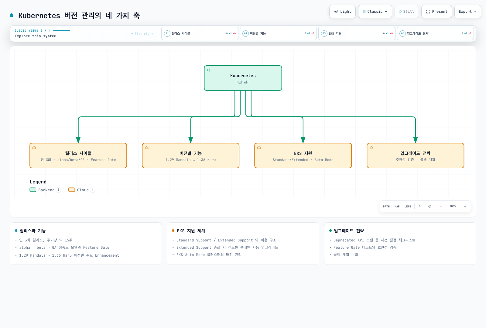

[🔍 인터랙티브 다이어그램 보기](https://www.atomai.click/kubernetes-docs/archmaps/ko-eks-12-kubernetes-version-roadmap-0.html)

---

## 2. Kubernetes 릴리스 사이클

### 릴리스 주기와 단계

Kubernetes는 보통 약 4개월 간격으로 연 3회 **마이너** 버전을 릴리스합니다. Patch release는 별도로 보통 월 단위로 진행됩니다. Upstream patch branch는 약 14개월 동안 지원되며, 일반 유지보수 약 12개월과 CVE·중대한 오류를 위한 maintenance 약 2개월로 나뉩니다. EKS 출시일부터 계산하는 EKS의 14개월 standard support와는 별개의 기간입니다.

Release team은 enhancement 포함, code freeze, 안정화, release candidate의 일정을 공지합니다. 기존 그림의 “Week 15”는 개략적인 주기이며 고정 일정이나 모든 릴리스에 공통인 주차표가 아닙니다. 대상 릴리스의 일정과 예외 승인 절차를 따릅니다.

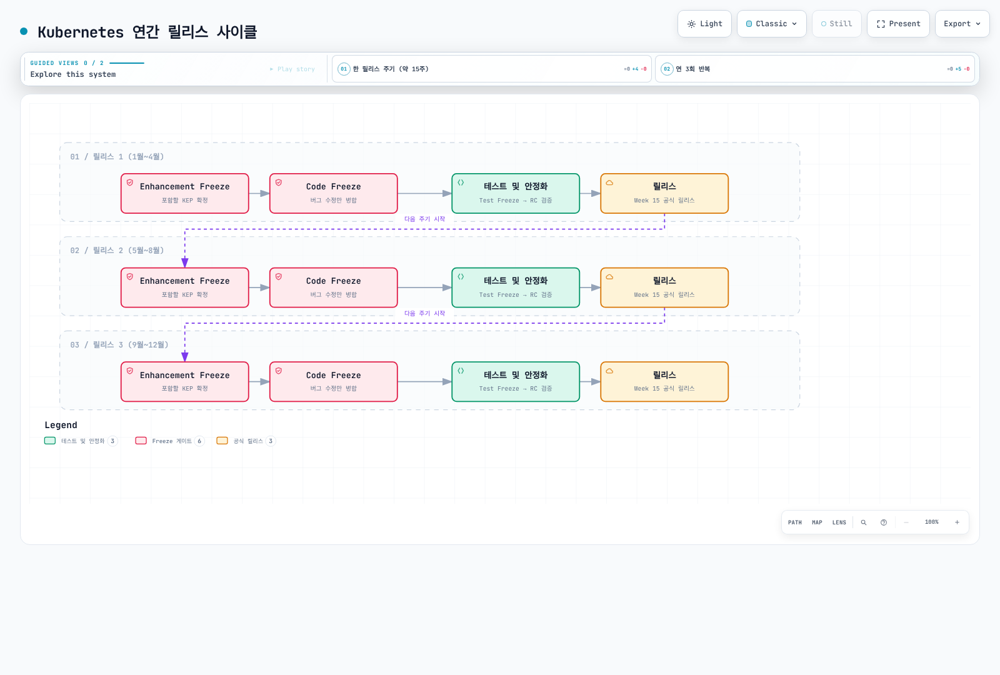

[🔍 인터랙티브 다이어그램 보기](https://www.atomai.click/kubernetes-docs/archmaps/ko-eks-12-kubernetes-version-roadmap-1.html)

### 기능 성숙도·API 안정성·Feature Gate

| 단계 | 해석 |
|---|---|
| Alpha | 보통 기본 비활성화이며 동작·API가 바뀌거나 제거될 수 있습니다. 실제 gate와 전제 조건을 확인합니다. |
| Beta | 검증 범위가 넓어지지만 기본값·호환성은 기능과 버전에 따릅니다. 비활성화 상태로 남는 beta gate도 있습니다. |
| Stable / GA | API 안정성 정책을 적용합니다. 특정 workload·driver·OS·배포의 안전성을 인증하는 것은 아닙니다. |

1.24부터 **새 beta API**는 기본 비활성화되지만, 기존에 활성화된 beta API와 그 새 버전은 다르게 취급합니다. API serving 설정과 feature gate는 관련되어 있지만 같은 개념은 아닙니다. 모든 beta 기능에 opt-in이 필요하거나 stable 기능은 workload 설정 없이 사용할 수 있다고 가정하지 않습니다.

GA API version은 같은 Kubernetes major version 안에서 제거할 수 없습니다. Feature gate 제거 규칙은 별개이며 beta→GA gate의 최소 유예 기간은 6개월 또는 2회 릴리스 중 더 긴 쪽입니다. 실제 제거 버전은 따로 확인해야 합니다. 잠기거나 제거된 gate를 지원되는 비활성화 수단으로 보지 않습니다. 예를 들어 출시된 1.36.2 소스에도 잠긴 `SidecarContainers` gate가 남아 있으므로 1.33 GA가 1.35 제거를 증명하지는 않습니다.

다음은 **과거 버전의 설정 조각**으로, 완전한 KubeletConfiguration이나 EKS 컨트롤 플레인 변경이 아닙니다. 현재 노드에는 해당 버전이 지원하는 설정을 사용하며 제거된 gate를 새 bootstrap 파일에 복사하지 않습니다.

```yaml
# Historical fragment for a self-managed Kubernetes 1.33 test node.
# Merge through the supported node bootstrap/configuration mechanism.
featureGates:
  InPlacePodVerticalScaling: true
  UserNamespacesSupport: true
```

EKS 컨트롤 플레인 설정은 AWS가 관리하므로 고객이 kube-apiserver static Pod를 편집하거나 임의 server flag를 넣을 수 없습니다. EKS version FAQ는 alpha 기능을 지원하지 않는다고 명시합니다. Self-managed node의 gate를 바꿔도 제공되지 않는 컨트롤 플레인 API가 활성화되지는 않습니다. AWS의 기능별 안내와 node runtime·OS 조건을 확인합니다.

Node `configz`는 선택한 kubelet의 설정을 보여 주며 생략된 기본값이나 컨트롤 플레인의 동작을 입증하지 않습니다. `/metrics`에는 적절한 non-resource URL 인가가 필요하고 feature metric이 제공되지 않거나 추가 label을 가질 수 있습니다. 출력 부재·접근 오류를 “비활성화”로 해석하지 않습니다.

```bash
# Authorized, read-only diagnostics; these endpoints may be restricted.
: "${KUBE_CONTEXT:?}"; : "${NODE_NAME:?Choose the actual node}"
kubectl --context "$KUBE_CONTEXT" --request-timeout=15s \
  get --raw="/api/v1/nodes/$NODE_NAME/proxy/configz" | jq '.kubeletconfig.featureGates'
```

```bash
# Run separately; absence of a metric is not proof that a feature is disabled.
: "${KUBE_CONTEXT:?}"
kubectl --context "$KUBE_CONTEXT" --request-timeout=15s get --raw='/metrics' \
  | awk '/^kubernetes_feature_enabled/ { print }'
```

### SIG와 Enhancement Proposal

SIG는 관련 영역을 담당합니다. Node는 runtime·lifecycle, Auth는 인증·인가, Network는 Service routing, Storage는 CSI·volume을 맡으며 Scheduling·Apps·API Machinery·Instrumentation·Autoscaling 등의 SIG가 있습니다. 주요 enhancement의 KEP에는 동기·설계·졸업 기준·테스트·production-readiness 검토가 포함됩니다. 계획한 milestone은 출시 확약이 아니므로 실제 릴리스 API와 gate 이력을 확인합니다.

[Upstream patch policy](https://kubernetes.io/releases/patch-releases/) · [Feature gates](https://kubernetes.io/docs/reference/command-line-tools-reference/feature-gates/) · [Deprecation policy](https://kubernetes.io/docs/reference/deprecation-policy/) · [Kubernetes 1.36.2 gate implementation](https://github.com/kubernetes/kubernetes/blob/v1.36.2/pkg/features/kube_features.go)

---

## 3. EKS 버전 지원 매트릭스

### 지원 기간과 비용 기준

| 구분 | EKS 출시일부터의 기간 | 버전 지원 요금 |
|---|---|---|
| Standard | 첫 14개월 | 클러스터 시간당 $0.10 |
| Extended | 이후 12개월 | 클러스터 시간당 총 $0.60 ($0.10 + $0.50) |

이는 공시된 버전 지원 요금이며 전체 클러스터 운영 비용이 아닙니다. Provisioned Control Plane tier·compute·Auto Mode/Hybrid Nodes·다른 capability·storage·network 비용이 추가될 수 있습니다. 동일 요율로 365일 운영하면 클러스터당 $876과 $5,256이며 차액은 $4,380입니다. 월 730시간 예시에서는 $73과 $438입니다. 실제 청구 측정값이 아닌 산술 예시입니다.

### 확인한 지원 일정 — 2026년 9월 12일 기준 (UTC)

| 버전 | Upstream 출시 | EKS 출시 | Standard 종료 | Extended 종료 | 검토일 상태 |
|---|---|---|---|---|---|
| 1.31 | 2024-08-13 | 2024-09-26 | 2025-11-26 | 2026-11-26 | Extended |
| 1.32 | 2024-12-11 | 2025-01-23 | 2026-03-23 | 2027-03-23 | Extended |
| 1.33 | 2025-04-23 | 2025-05-29 | 2026-07-29 | 2027-07-29 | Extended |
| 1.34 | 2025-08-27 | 2025-10-02 | 2026-12-02 | 2027-12-02 | Standard |
| 1.35 | 2025-12-17 | 2026-01-27 | 2027-03-27 | 2028-03-27 | Standard |
| 1.36 | 2026-04-22 | 2026-06-02 | 2027-08-02 | 2028-08-02 | Standard |

현재 AWS 일정은 1.31~1.36을 제공합니다. 본문의 1.29·1.30은 과거 기능 이력이며 지원되는 배포 대상이 아닙니다. Upstream 1.37 출시만으로 EKS 지원을 추론하지 않습니다. Extended 요금은 표의 standard 종료일 UTC 0시부터 적용됩니다. 변경 전에 실제 일정·API를 다시 확인하며 AWS가 월 단위로만 공지한 향후 날짜는 추정입니다.

일정상 EKS 1.35 출시는 **2026년 1월 27일**, 1.36은 **2026년 6월 2일**입니다. EKS Distro 발표일은 별개의 출시 이벤트이므로 기존의 1월 28일 통합 표기로 EKS 일정을 대신하지 않습니다. 기능별 runtime·admission 조건은 아래 해당 버전 섹션을 참고합니다. EKS 버전 롤백과 컨트롤 플레인 scaling·SLA는 [EKS 업그레이드](08-eks-upgrades.md)에서 다룹니다.

```bash
# Read-only when executed with your normal authorized AWS identity.
: "${AWS_REGION:?Choose the intended Region}"
aws eks describe-cluster-versions --region "$AWS_REGION" --no-cli-pager \
  --query clusterVersions --output json
```

첫 배열 원소를 최신 버전으로 가정하거나 과거 예시의 status를 재사용하지 않고 서비스가 반환하는 버전 기록을 조회합니다. 감사에서는 AWS query를 실행하지 않았습니다.

### Upgrade policy와 자동 업그레이드

기본 cluster upgrade policy는 `EXTENDED`입니다. `STANDARD`를 선택하면 standard support 종료 후 자동 업그레이드될 수 있으므로 extended까지 유지할지는 비용·수명주기 관점에서 결정합니다. Extended 종료 후 EKS는 남은 컨트롤 플레인을 지원 버전으로 점진적으로 업그레이드합니다. AWS는 정확한 실행 시점을 약속하지 않으며 해당 자동 업데이트 직전 알림도 제공하지 않는다고 명시합니다. 최소 60일 전 고지는 **standard support 종료일**에 대한 고지이지 extended 종료 후 새 60일 유예나 60/30/7일 순차 알림 보장이 아닙니다.

Managed node group·self-managed node·Fargate Pod·Hybrid Node는 각각의 업데이트·교체 절차가 필요합니다. Auto Mode node는 자동 갱신될 수 있으며 일반적으로 설치한 add-on은 호환성과 소유권을 별도로 검토합니다. 지원 가능한 최대 skew를 목표로 삼지 말고 가능한 한 node와 컨트롤 플레인 버전을 맞춥니다. 컨트롤 플레인 버전 문자열뿐 아니라 실제 update 상태와 workload readiness를 확인합니다. Extended 종료로 자동 업그레이드된 클러스터에는 EKS의 7일 native rollback을 사용할 수 없습니다. 자격 조건과 node-first rollback 순서는 업그레이드 문서를 따릅니다.

[EKS support calendar and FAQ](https://docs.aws.amazon.com/eks/latest/userguide/kubernetes-versions.html) · [EKS pricing](https://aws.amazon.com/eks/pricing/)

<!-- Parent diagram repair pending: stage/default guarantees and support status/notification timing are stale.
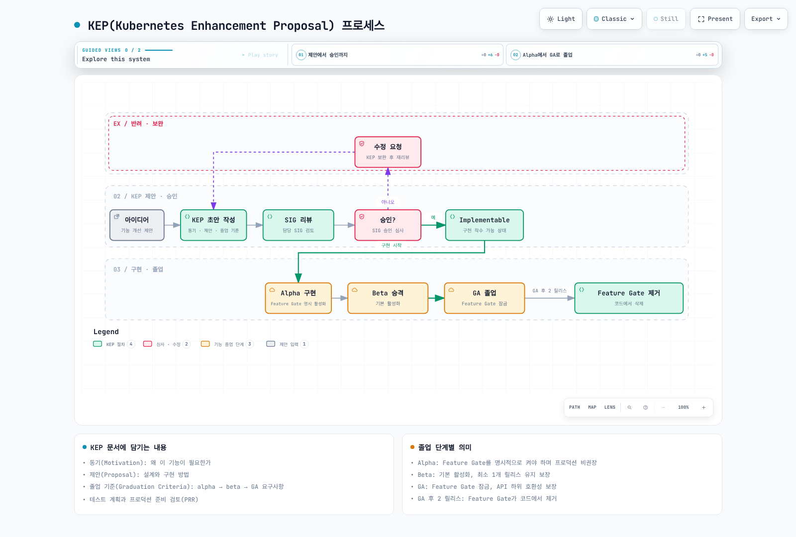

[🔍 인터랙티브 다이어그램 보기](https://www.atomai.click/kubernetes-docs/archmaps/ko-eks-12-kubernetes-version-roadmap-2.html)

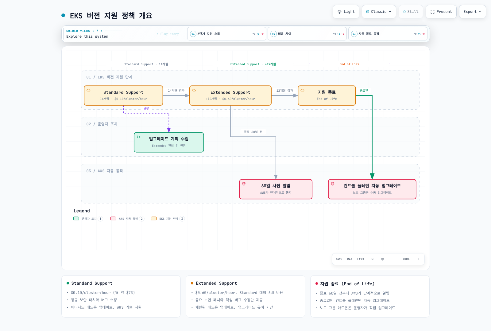

[🔍 인터랙티브 다이어그램 보기](https://www.atomai.click/kubernetes-docs/archmaps/ko-eks-12-kubernetes-version-roadmap-3.html)

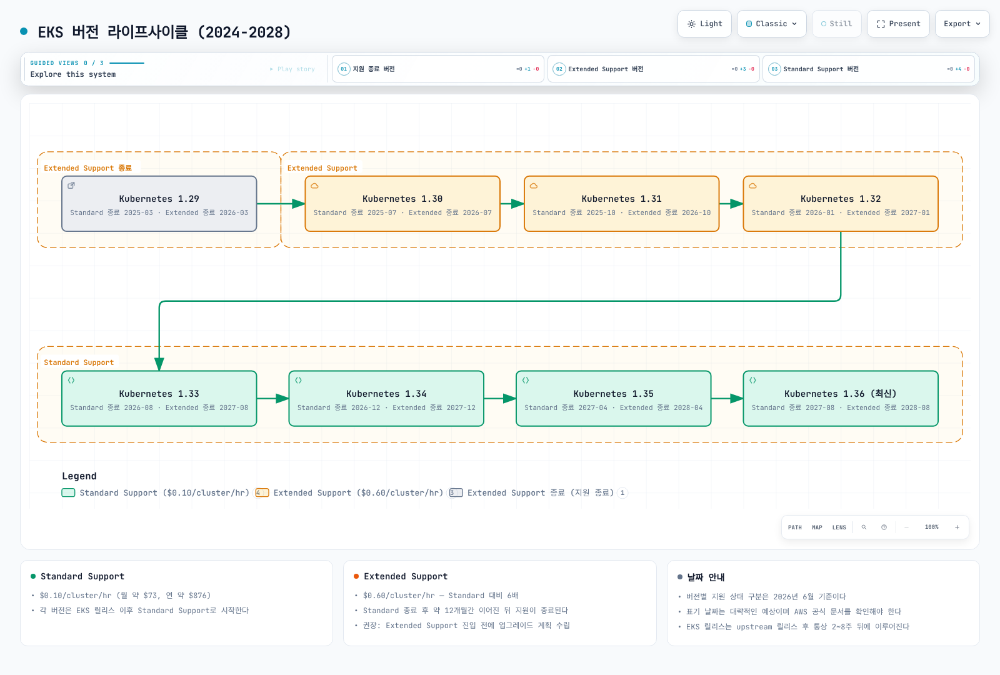

[🔍 인터랙티브 다이어그램 보기](https://www.atomai.click/kubernetes-docs/archmaps/ko-eks-12-kubernetes-version-roadmap-4.html)

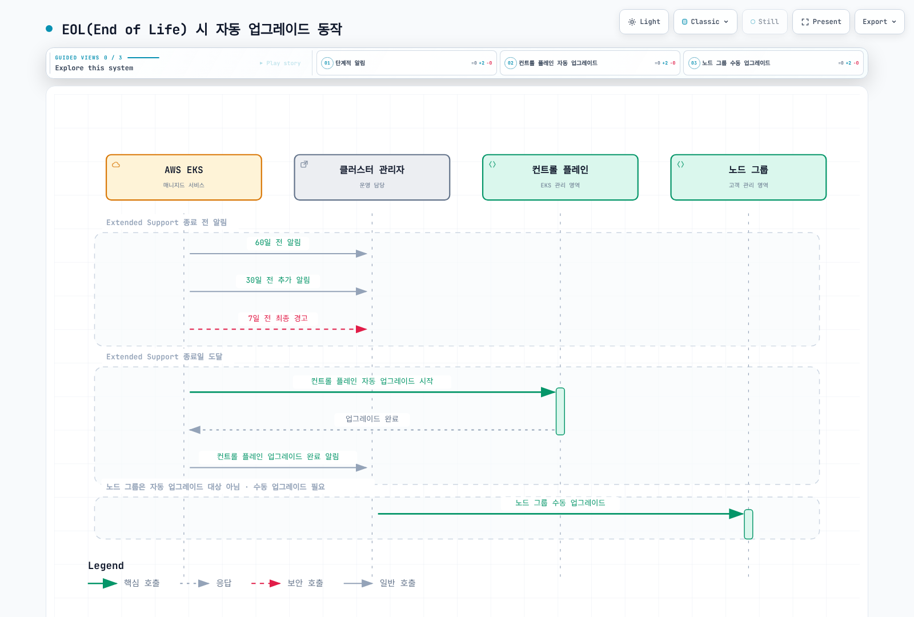

[🔍 인터랙티브 다이어그램 보기](https://www.atomai.click/kubernetes-docs/archmaps/ko-eks-12-kubernetes-version-roadmap-5.html)

-->

---

## 4. 버전별 주요 기능 가이드

이 섹션은 Kubernetes 1.29부터 1.36까지 각 버전의 핵심 Enhancement를 상세히 다룹니다. 각 기능에 대해 실무적 관점에서의 영향과 활용법을 함께 설명합니다.

### 4.1 Kubernetes 1.29 "Mandala" (2023년 12월)

2023년 12월 13일 릴리스 발표의 수치는 **49개 enhancement: stable 11개, beta 19개, alpha 19개**입니다. 과거 릴리스 통계이며 EKS 1.29가 현재 지원된다는 뜻이 아닙니다. 그림의 기본값·production 표기는 일반화된 설명이므로 위의 기능별 gate 이력과 runtime 조건을 함께 확인합니다.

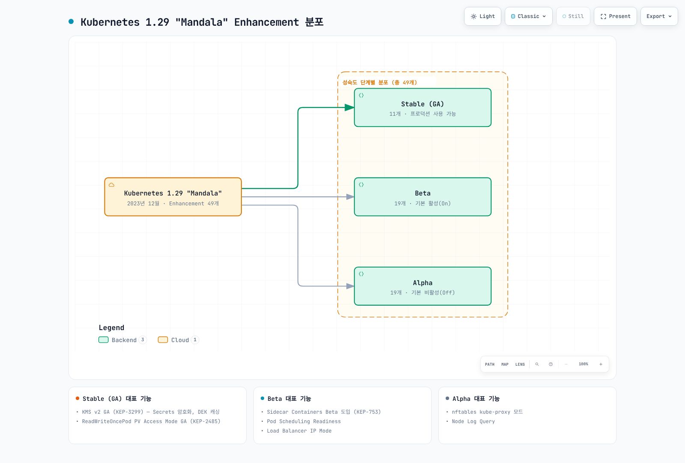

[🔍 인터랙티브 다이어그램 보기](https://www.atomai.click/kubernetes-docs/archmaps/ko-eks-12-kubernetes-version-roadmap-6.html)

#### KMS v2 저장 시 암호화 — GA

KMS v2는 secret seed에서 일회용 data encryption key를 파생하고 seed 보호·교체 시 KMS plugin을 사용하여 매 object 쓰기마다 원격 암호화를 요구하지 않도록 envelope encryption 성능을 개선합니다. Envelope encryption의 data-encryption·key-encryption 계층은 v1에도 있으므로 v1을 “단일 계층”으로 설명하면 안 됩니다. 개선이 일정한 latency를 보장하지는 않습니다.

KMS v1은 1.28에서 deprecated, 1.29에서 기본 비활성화되었습니다. 현재 upstream KMS 문서에도 legacy 구현이 설명되어 있으므로 기존의 “1.31에서 제거”는 잘못된 설명입니다. 지원되는 v2 마이그레이션 경로를 우선합니다.

아래는 관리자가 운영하는 upstream API server에 검토한 v2 plugin을 지정한 socket으로 설치한 경우의 설정이며 **EKS 컨트롤 플레인 매니페스트가 아닙니다**. V2는 `cachesize`를 받지 않습니다. 마지막 `identity` provider는 마이그레이션 중 기존 평문을 읽기 위한 것으로, 첫 provider의 쓰기 암호화 실패 시 평문 fallback이 아닙니다. 암호화 마이그레이션을 검토하고 완료를 검증한 뒤 평문 읽기 허용을 제거합니다.

```yaml
apiVersion: apiserver.config.k8s.io/v1
kind: EncryptionConfiguration
resources:
- resources:
  - secrets
  providers:
  - kms:
      apiVersion: v2
      name: reviewed-kms-provider
      endpoint: unix:///var/run/kmsplugin/socket.sock
      timeout: 3s
  - identity: {}
```

**EKS 구분:** 현재 AWS 안내는 EKS 1.28 이상에서 모든 Kubernetes API data에 KMS v2 envelope encryption을 기본 제공하며 customer-managed key를 설정하지 않으면 AWS-owned key를 사용합니다. Secrets·ConfigMaps 같은 API data에 적용되고 node나 EBS volume의 임의 data까지 암호화하는 것은 아닙니다. EKS 1.29부터 시작한다고 추론하거나 위 upstream 설정을 EKS에 적용하지 않습니다.

#### ReadWriteOncePod — GA

`ReadWriteOncePod`는 클러스터 전체에서 PVC를 한 Pod로 제한합니다. `ReadWriteOnce`는 한 node의 여러 Pod가 접근할 수 있습니다. RWOP에는 호환되는 CSI volume·driver가 필요하며 upstream 최소 sidecar는 csi-provisioner 3.0.0, csi-attacher 3.3.0, csi-resizer 1.3.0입니다. 이는 기능 최소 조건이지 현재 권장 release가 아닙니다. 실제 클러스터와 provisioner가 지원하는 버전을 선택합니다.

예시는 기존 `version-lab` namespace와 적합한 `reviewed-csi-class`를 필요로 합니다. Access mode 조정은 privileged host 접근을 막는 kernel 보안 경계나 DB leader election이 아니며 앱 fencing·backup을 대신하지 않습니다.

```yaml
apiVersion: v1
kind: PersistentVolumeClaim
metadata:
  name: database-pvc
  namespace: version-lab
spec:
  accessModes:
  - ReadWriteOncePod
  storageClassName: reviewed-csi-class
  resources:
    requests:
      storage: 100Gi
```

#### 주요 beta·alpha 기능

| 기능 | 1.29 상태 | 의미 |
|---|---|---|
| SidecarContainers | Beta, 기본 활성화 | 재시작 가능한 init container. Alpha는 1.28, GA는 1.33 |
| NFTablesProxyMode | Alpha, 기본 비활성화 | Linux Service proxy backend. Kernel·CNI·NodePort 동작 확인 필요 |
| LoadBalancerIPMode | Alpha | Controller가 보고하는 LoadBalancer ingress status mode이며 임의 Pod 필드가 아님 |
| PodSchedulingReadiness | Beta | Scheduling gate로 scheduler의 검토를 보류 |
| NodeLogQuery | Alpha | 해당 kubelet 설정·접근 권한 필요 |
| KubeletTracing | Beta | 1.29 GA가 아니며 GA는 1.34 |
| MinDomainsInPodTopologySpread | Beta | 1.30에서 GA |

Native sidecar는 아래 **Pod spec 조각**처럼 정의합니다. 예시 image를 검토한 구현으로 바꾸고 실제 log pipeline을 설정해야 합니다. 설치된 Fluent Bit 배포가 아닙니다. Sidecar 시작과, 있을 경우 startup probe 성공 후 다음 시작 단계로 진행합니다. Readiness·정상 종료에는 적절한 probe·앱 동작·충분한 termination budget이 필요합니다.

```yaml
initContainers:
- name: log-helper
  image: example.invalid/version-lab/log-helper:reviewed
  restartPolicy: Always
```

이 릴리스에서 CSI `NodeExpandSecret`도 GA가 되어 driver의 node-side 확장 요청에 적절한 credential을 전달할 수 있습니다. Deprecated `flowcontrol.apiserver.k8s.io/v1beta2` endpoint는 1.29에서 serving이 중단되었으므로 stable `v1` API와 필드 변경을 검토합니다. `SecurityContextDeny`는 그 전에 deprecated되었고 1.30에서 제거되었으며 1.29에서 새로 deprecated된 것이 아닙니다. 여기서 모든 환경에 공통인 “Service 5,000개” 성능 경계나 proxy benchmark를 측정하지 않았습니다.

[Kubernetes 1.29 release](https://kubernetes.io/blog/2023/12/13/kubernetes-v1-29-release/) · [KMS provider](https://kubernetes.io/docs/tasks/administer-cluster/kms-provider/) · [EKS envelope encryption](https://docs.aws.amazon.com/eks/latest/userguide/envelope-encryption.html) · [Persistent volumes and RWOP](https://kubernetes.io/docs/concepts/storage/persistent-volumes/) · [API migration guide](https://kubernetes.io/docs/reference/using-api/deprecation-guide/)

---

### 4.2 Kubernetes 1.30 "Uwubernetes" (2024년 4월)

Kubernetes 1.30은 커뮤니티 문화를 반영한 유머러스한 코드네임 "Uwubernetes"로 릴리스되었습니다. 45개의 Enhancement가 포함되며, 특히 보안과 스케줄링 영역에서 중요한 기능들이 GA로 졸업했습니다.

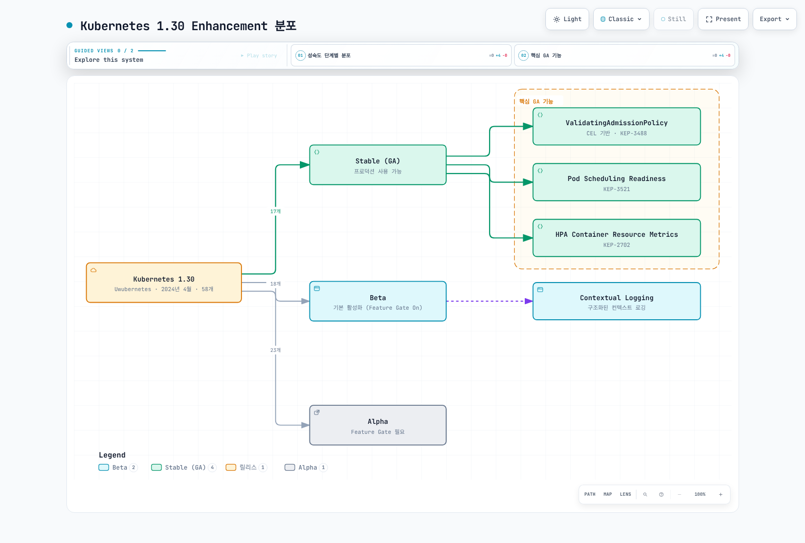

[🔍 인터랙티브 다이어그램 보기](https://www.atomai.click/kubernetes-docs/archmaps/ko-eks-12-kubernetes-version-roadmap-7.html)

#### 핵심 GA 기능

##### ValidatingAdmissionPolicy (CEL 기반) GA (KEP-3488)

OPA/Gatekeeper 같은 외부 webhook 없이도 CEL(Common Expression Language)을 사용해 API 서버 내에서 직접 Admission 검증을 수행할 수 있습니다.

```yaml
# 1. ValidatingAdmissionPolicy 정의
apiVersion: admissionregistration.k8s.io/v1
kind: ValidatingAdmissionPolicy
metadata:
  name: "require-resource-limits"
spec:
  failurePolicy: Fail
  matchConstraints:
    resourceRules:
      - apiGroups: [""]
        apiVersions: ["v1"]
        operations: ["CREATE", "UPDATE"]
        resources: ["pods"]
  validations:
    - expression: >-
        object.spec.containers.all(c,
          has(c.resources) &&
          has(c.resources.limits) &&
          has(c.resources.limits.cpu) &&
          has(c.resources.limits.memory)
        )
      message: "모든 컨테이너에 CPU와 메모리 limits를 설정해야 합니다."
      reason: Invalid
---
# 2. ValidatingAdmissionPolicyBinding으로 정책 적용
apiVersion: admissionregistration.k8s.io/v1
kind: ValidatingAdmissionPolicyBinding
metadata:
  name: "require-resource-limits-binding"
spec:
  policyName: "require-resource-limits"
  validationActions: [Deny]
  matchResources:
    namespaceSelector:
      matchLabels:
        env: production
```

**ValidatingAdmissionPolicy vs Webhook 기반 솔루션 비교:**

| 항목 | ValidatingAdmissionPolicy | Webhook (OPA/Kyverno) |
|------|--------------------------|----------------------|
| 런타임 의존성 | 없음 (API 서버 내장) | 외부 서비스 필요 |
| 지연시간 | 매우 낮음 | 네트워크 호출 오버헤드 |
| 장애 영향 | 없음 | webhook 서비스 장애 시 영향 |
| 표현력 | CEL (제한적이나 대부분 충분) | Rego/CEL/YAML (더 풍부) |
| 외부 데이터 참조 | 제한적 | 가능 |
| 뮤테이션 지원 | 미지원 (검증만) | 지원 |

**CEL 표현식 예시 모음:**

```yaml
# 이미지 레지스트리 제한
- expression: >-
    object.spec.containers.all(c,
      c.image.startsWith('123456789012.dkr.ecr.ap-northeast-2.amazonaws.com/')
    )
  message: "ECR 레지스트리의 이미지만 사용할 수 있습니다."

# 루트 실행 금지
- expression: >-
    object.spec.containers.all(c,
      has(c.securityContext) &&
      has(c.securityContext.runAsNonRoot) &&
      c.securityContext.runAsNonRoot == true
    )
  message: "컨테이너는 root가 아닌 사용자로 실행해야 합니다."

# 레이블 필수
- expression: >-
    has(object.metadata.labels) &&
    has(object.metadata.labels['app.kubernetes.io/name']) &&
    has(object.metadata.labels['app.kubernetes.io/version'])
  message: "app.kubernetes.io/name 및 version 레이블이 필수입니다."
```

##### Pod Scheduling Readiness GA (KEP-3521)

Pod에 `schedulingGates`를 설정하여 특정 조건이 충족될 때까지 스케줄링을 보류할 수 있습니다.

```yaml
apiVersion: v1
kind: Pod
metadata:
  name: gated-pod
spec:
  schedulingGates:
    - name: "example.com/gpu-quota-approved"
    - name: "example.com/security-scan-passed"
  containers:
    - name: ml-training
      image: training:v1.0
      resources:
        limits:
          nvidia.com/gpu: 4
```

```bash
# 스케줄링 게이트 제거 (외부 컨트롤러 또는 수동)
kubectl patch pod gated-pod --type='json' \
  -p='[{"op": "remove", "path": "/spec/schedulingGates/0"}]'
```

**활용 시나리오:**
- GPU 쿼터 승인 프로세스 연동
- 보안 스캔 완료 후 배포
- 외부 리소스(라이센스, 외부 서비스) 준비 대기
- 배치 작업의 동시 스케줄링 조율

##### HPA Container Resource Metrics GA (KEP-2702)

HPA(Horizontal Pod Autoscaler)에서 Pod 전체가 아닌 특정 컨테이너의 리소스 사용량을 기준으로 스케일링할 수 있습니다.

```yaml
apiVersion: autoscaling/v2
kind: HorizontalPodAutoscaler
metadata:
  name: app-hpa
spec:
  scaleTargetRef:
    apiVersion: apps/v1
    kind: Deployment
    name: web-app
  minReplicas: 2
  maxReplicas: 20
  metrics:
    - type: ContainerResource
      containerResource:
        name: cpu
        container: web-server    # 특정 컨테이너 지정
        target:
          type: Utilization
          averageUtilization: 70
    # Sidecar 컨테이너의 리소스는 무시하고
    # main 컨테이너 기준으로만 스케일링
```

**실무 중요성:** Sidecar 패턴(Envoy proxy, log collector 등)이 보편화됨에 따라, sidecar의 리소스 사용이 HPA 결정에 왜곡을 줄 수 있습니다. Container Resource Metrics를 사용하면 실제 애플리케이션 컨테이너의 부하만을 기준으로 정확한 스케일링이 가능합니다.

#### 기타 주요 변경 사항 (1.30)

| 기능 | 단계 | 설명 |
|------|------|------|
| Bound Service Account Token Improvements | GA | SA 토큰의 audience, expiration 세분화 |
| Min Domains in PodTopologySpread | GA | TopologySpreadConstraints의 최소 도메인 수 |
| Go Workspaces | 내부 | Kubernetes 코드 베이스가 Go workspaces로 전환 |
| contextual logging | Beta | 구조화된 컨텍스트 로깅 |
| Recursive Read-only Mounts | Alpha | 마운트 포인트의 재귀적 읽기 전용 설정 |

---

### 4.3 Kubernetes 1.31 "Elli" (2024년 8월)

Kubernetes 1.31 "Elli"는 보안 강화에 중점을 둔 릴리스로, 45개의 Enhancement를 포함합니다.

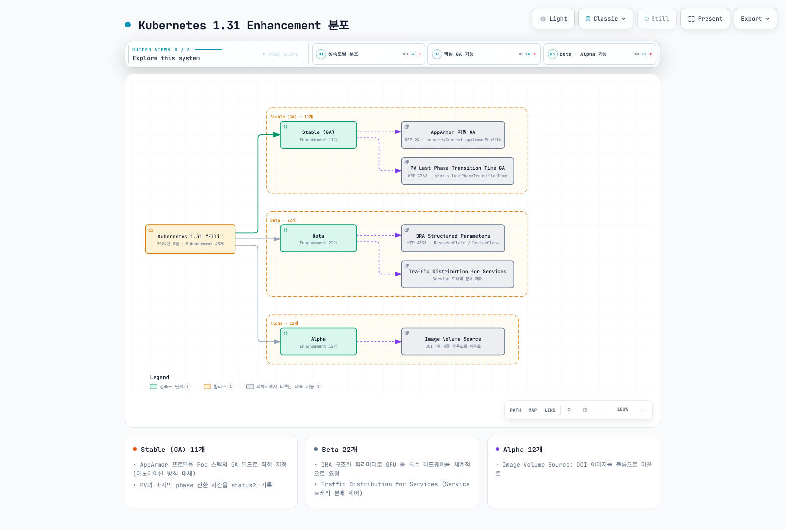

[🔍 인터랙티브 다이어그램 보기](https://www.atomai.click/kubernetes-docs/archmaps/ko-eks-12-kubernetes-version-roadmap-8.html)

#### 핵심 GA 기능

##### AppArmor 지원 GA (KEP-24)

Pod 스펙에서 직접 AppArmor 프로필을 지정할 수 있게 되었습니다. 기존의 어노테이션 기반 방식이 GA 필드로 전환되었습니다.

```yaml
# 기존 방식 (어노테이션 기반 - Deprecated)
# metadata:
#   annotations:
#     container.apparmor.security.beta.kubernetes.io/app: runtime/default

# 새로운 방식 (GA 필드)
apiVersion: v1
kind: Pod
metadata:
  name: secured-pod
spec:
  containers:
    - name: app
      image: my-app:v1.0
      securityContext:
        appArmorProfile:
          type: RuntimeDefault   # 또는 Localhost, Unconfined
          # type: Localhost
          # localhostProfile: "my-custom-profile"
```

**AppArmor 프로필 유형:**

| 유형 | 설명 | 사용 사례 |
|------|------|----------|
| `RuntimeDefault` | 컨테이너 런타임의 기본 프로필 | 대부분의 워크로드에 적합 |
| `Localhost` | 노드에 설치된 커스텀 프로필 | 특수 보안 요구사항 |
| `Unconfined` | AppArmor 제한 없음 | 디버깅, 특권 워크로드 |

##### PersistentVolume Last Phase Transition Time GA (KEP-3762)

PV의 마지막 phase 전환 시간을 추적하여 스토리지 모니터링과 디버깅을 개선합니다.

```bash
# PV phase 전환 시간 확인
kubectl get pv my-pv -o jsonpath='{.status.lastPhaseTransitionTime}'
# 출력: 2024-08-15T10:30:00Z
```

#### 핵심 Beta 기능

##### DRA (Dynamic Resource Allocation) Structured Parameters Beta (KEP-4381)

DRA의 구조화된 파라미터 모델이 beta로 승격되었습니다. 이를 통해 GPU, FPGA 등 특수 하드웨어 리소스를 보다 체계적으로 요청하고 할당할 수 있습니다.

```yaml
# ResourceClaim 정의 (DRA 구조화 파라미터)
apiVersion: resource.k8s.io/v1beta1
kind: ResourceClaim
metadata:
  name: gpu-claim
spec:
  devices:
    requests:
      - name: gpu-request
        deviceClassName: gpu.nvidia.com
        selectors:
          - cel:
              expression: >-
                device.attributes["gpu.nvidia.com"].model == "A100" &&
                device.capacity["gpu.nvidia.com"].memory.compareTo(quantity("80Gi")) >= 0
---
apiVersion: v1
kind: Pod
metadata:
  name: ml-training
spec:
  containers:
    - name: trainer
      image: ml-training:v1.0
      resources:
        claims:
          - name: gpu-claim
  resourceClaims:
    - name: gpu-claim
      resourceClaimName: gpu-claim
```

#### 기타 주요 변경 사항 (1.31)

| 기능 | 단계 | 설명 |
|------|------|------|
| nftables kube-proxy | Beta | nftables 기반 프록시 모드 |
| Traffic Distribution for Services | Beta | Service 트래픽 분배 제어 |
| Multiple Service CIDRs | Beta | 서비스 IP 범위 동적 관리 |
| Image Volume Source | Alpha | OCI 이미지를 볼륨으로 마운트 |
| Auto-remove PVC protection finalizer | Beta | PVC 삭제 보호 자동 해제 |

---

### 4.4 Kubernetes 1.32 "Penelope" (2024년 12월)

Kubernetes 1.32 "Penelope"는 인가(Authorization)와 스토리지 관리에 중요한 발전이 있었습니다. 44개의 Enhancement가 포함됩니다.

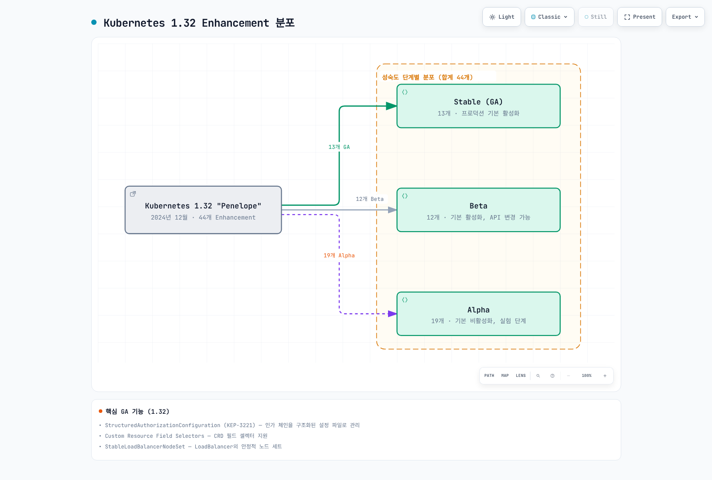

[🔍 인터랙티브 다이어그램 보기](https://www.atomai.click/kubernetes-docs/archmaps/ko-eks-12-kubernetes-version-roadmap-9.html)

#### 핵심 GA 기능

##### StructuredAuthorizationConfiguration GA (KEP-3221)

API 서버의 인가 체인(authorization chain)을 구조화된 설정 파일로 관리할 수 있게 되었습니다. 기존의 --authorization-mode 플래그를 대체합니다.

```yaml
# AuthorizationConfiguration 예시
apiVersion: apiserver.config.k8s.io/v1
kind: AuthorizationConfiguration
authorizers:
  # 1순위: 커스텀 Webhook 인가
  - type: Webhook
    name: custom-authorizer
    webhook:
      timeout: 3s
      failurePolicy: Deny
      subjectAccessReviewVersion: v1
      matchConditionSubjectAccessReviewVersion: v1
      authorizedTTL: 5m
      unauthorizedTTL: 30s
      connectionInfo:
        type: KubeConfigFile
        kubeConfigFile: /etc/kubernetes/webhook-config.yaml
      matchConditions:
        # GPU 네임스페이스 접근만 이 webhook으로 라우팅
        - expression: >-
            has(request.namespace) &&
            request.namespace.startsWith('gpu-')
  
  # 2순위: RBAC
  - type: RBAC
    name: rbac
  
  # 3순위: Node 인가
  - type: Node
    name: node
```

**기존 방식과의 비교:**

```bash
# 기존 (플래그 기반)
kube-apiserver --authorization-mode=Node,RBAC,Webhook \
               --authorization-webhook-config-file=...

# 새로운 방식 (구조화된 설정 파일)
kube-apiserver --authorization-config=/etc/kubernetes/auth-config.yaml
```

**장점:**
- 인가 체인의 순서와 조건을 세밀하게 제어
- CEL 기반 matchConditions로 특정 요청만 webhook으로 라우팅
- TTL 설정으로 인가 캐싱 최적화
- Hot-reload 지원 (API 서버 재시작 불필요)

##### Volume Attribute Class GA (KEP-3751)

VolumeAttributesClass를 통해 볼륨의 성능 속성(IOPS, throughput 등)을 동적으로 변경할 수 있습니다.

```yaml
# VolumeAttributesClass 정의
apiVersion: storage.k8s.io/v1beta1
kind: VolumeAttributesClass
metadata:
  name: high-performance
driverName: ebs.csi.aws.com
parameters:
  iops: "16000"
  throughput: "1000"
---
apiVersion: storage.k8s.io/v1beta1
kind: VolumeAttributesClass
metadata:
  name: standard
driverName: ebs.csi.aws.com
parameters:
  iops: "3000"
  throughput: "125"
---
# PVC에서 VolumeAttributesClass 참조
apiVersion: v1
kind: PersistentVolumeClaim
metadata:
  name: database-pvc
spec:
  accessModes: [ReadWriteOnce]
  resources:
    requests:
      storage: 500Gi
  storageClassName: gp3-csi
  volumeAttributesClassName: high-performance  # 성능 클래스 지정
```

```bash
# 볼륨 성능 클래스 동적 변경 (다운타임 없이)
kubectl patch pvc database-pvc \
  -p '{"spec":{"volumeAttributesClassName":"standard"}}'
```

**EKS에서의 활용:** EBS gp3 볼륨의 IOPS/throughput을 PVC 수정만으로 동적 변경 가능. 피크 시간에 성능을 올리고, 비피크 시간에 낮추는 비용 최적화 패턴 구현 가능.

#### 기타 주요 변경 사항 (1.32)

| 기능 | 단계 | 설명 |
|------|------|------|
| Recursive Read-only Mounts | Beta | 재귀적 읽기 전용 마운트 |
| Automatic Retry of Failed Pod Disruption | Beta | PDB 준수 실패 시 자동 재시도 |
| Job Managed-by Field | GA | 외부 컨트롤러에 의한 Job 관리 |
| Custom Resource Field Selectors | GA | CRD에 대한 필드 셀렉터 지원 |
| StableLoadBalancerNodeSet | GA | LoadBalancer의 안정적 노드 세트 |

---

### 4.5 Kubernetes 1.33 "Octarine" (2025년 4월)

Kubernetes 1.33 "Octarine"은 Terry Pratchett의 Discworld에서 영감을 받은 코드네임으로, **64개의 Enhancement**를 포함하는 대형 릴리스입니다. Sidecar Containers GA, In-Place Pod Resize beta 등 오랫동안 기다려온 기능들이 포함되어 있습니다.

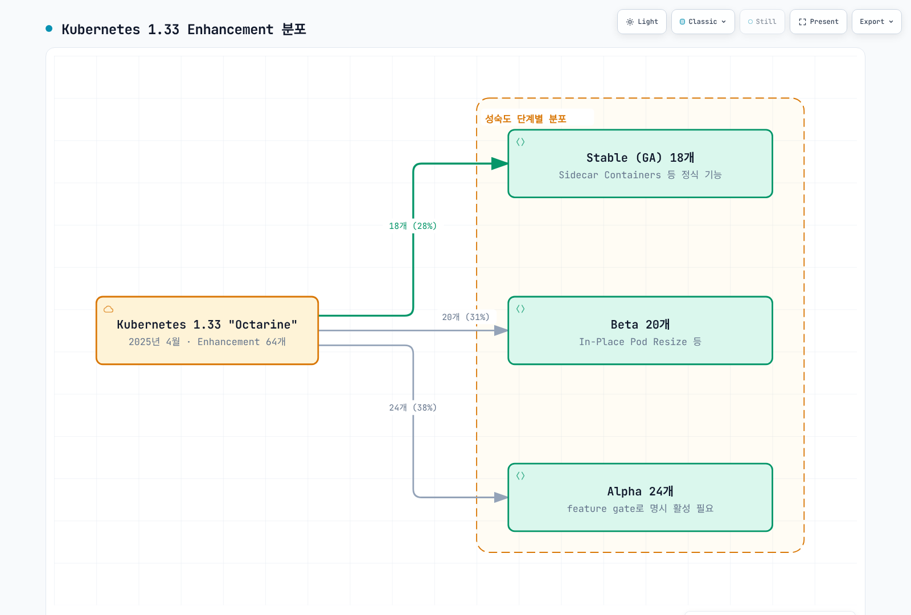

[🔍 인터랙티브 다이어그램 보기](https://www.atomai.click/kubernetes-docs/archmaps/ko-eks-12-kubernetes-version-roadmap-10.html)

> **중요**: 1.33은 2024-2025년 릴리스 중 가장 많은 Enhancement를 포함하며, 운영 환경에 미치는 영향이 큰 릴리스입니다.

#### 핵심 GA 기능

##### Sidecar Containers GA (KEP-753)

**졸업 경로: Alpha 1.28 → Beta 1.29 → GA 1.33**

Native Sidecar Containers가 드디어 GA로 졸업했습니다. Init container에 `restartPolicy: Always`를 설정하여 Pod 수명 동안 지속적으로 실행되는 sidecar를 정의할 수 있습니다.

```yaml
apiVersion: v1
kind: Pod
metadata:
  name: production-app
spec:
  initContainers:
    # Sidecar 1: Istio Envoy 프록시
    - name: istio-proxy
      image: istio/proxyv2:1.22.0
      restartPolicy: Always
      ports:
        - containerPort: 15090
          name: http-envoy-prom
      resources:
        requests:
          cpu: 100m
          memory: 128Mi
        limits:
          cpu: 500m
          memory: 512Mi
      securityContext:
        runAsNonRoot: true
    
    # Sidecar 2: 로그 수집기
    - name: fluent-bit
      image: fluent/fluent-bit:3.0
      restartPolicy: Always
      volumeMounts:
        - name: app-logs
          mountPath: /var/log/app
      resources:
        requests:
          cpu: 50m
          memory: 64Mi
    
    # 일반 init container (한 번 실행 후 종료)
    - name: db-migration
      image: migration-tool:v2.0
      command: ["migrate", "--target", "latest"]
  
  containers:
    - name: web-app
      image: my-app:v3.0
      volumeMounts:
        - name: app-logs
          mountPath: /var/log/app
  
  volumes:
    - name: app-logs
      emptyDir: {}
```

**Sidecar Container의 수명 주기:**

```
┌──────────────────────────────────────────────────────────────────────┐
│                      Pod 수명 주기                                    │
│                                                                      │
│  시작 ──────────────────────────────────────────────────────── 종료   │
│                                                                      │
│  ┌─ Sidecar (restartPolicy: Always) ─────────────────────────────┐  │
│  │  istio-proxy: ████████████████████████████████████████████████ │  │
│  └───────────────────────────────────────────────────────────────┘  │
│                                                                      │
│  ┌─ Sidecar (restartPolicy: Always) ─────────────────────────────┐  │
│  │  fluent-bit:  ████████████████████████████████████████████████ │  │
│  └───────────────────────────────────────────────────────────────┘  │
│                                                                      │
│  ┌─ Init Container ──┐                                              │
│  │  db-migration: ███ │                                              │
│  └───────────────────┘                                              │
│                                                                      │
│                        ┌─ Main Container ────────────────────────┐  │
│                        │  web-app: ██████████████████████████████ │  │
│                        └─────────────────────────────────────────┘  │
│                                                                      │
│  실행 순서:                                                           │
│  1. Sidecar 시작 → 2. Init 실행/완료 → 3. Main 시작                   │
│  종료 순서:                                                           │
│  1. Main 종료 → 2. Sidecar 종료 (역순)                                │
└──────────────────────────────────────────────────────────────────────┘
```

**GA 이전 대비 해결된 문제점:**
- Job 완료 문제: 기존에는 sidecar가 종료되지 않아 Job이 완료 상태로 전환되지 않음 → GA에서는 main container 종료 시 sidecar도 정상 종료
- 시작 순서 보장: Sidecar가 먼저 시작된 후 main container가 실행됨
- 리소스 계산: Sidecar 리소스가 Pod의 리소스 요청/제한에 올바르게 포함
- Probe 지원: Sidecar에 대한 liveness, readiness, startup probe 지원

##### In-Place Pod Vertical Scaling Beta (KEP-1287)

**졸업 경로: Alpha 1.27 → Beta 1.33**

Pod를 재시작하지 않고 CPU/메모리 리소스를 동적으로 변경할 수 있습니다. VPA(Vertical Pod Autoscaler)와의 연동을 통해 자동 수직 스케일링이 가능해집니다.

```yaml
apiVersion: v1
kind: Pod
metadata:
  name: resizable-app
spec:
  containers:
    - name: app
      image: my-app:v1.0
      resources:
        requests:
          cpu: 500m
          memory: 256Mi
        limits:
          cpu: "1"
          memory: 512Mi
      # 리사이즈 정책: CPU는 재시작 없이, 메모리는 재시작 필요
      resizePolicy:
        - resourceName: cpu
          restartPolicy: NotRequired   # CPU 변경 시 재시작 불필요
        - resourceName: memory
          restartPolicy: RestartContainer  # 메모리 변경 시 재시작 필요
```

```bash
# Pod 리소스 동적 변경 (kubectl patch)
kubectl patch pod resizable-app --subresource resize --patch \
  '{"spec":{"containers":[{"name":"app","resources":{"requests":{"cpu":"1"},"limits":{"cpu":"2"}}}]}}'

# 리사이즈 상태 확인
kubectl get pod resizable-app -o jsonpath='{.status.resize}'
# 가능한 값: Proposed, InProgress, Deferred, Infeasible
```

**리사이즈 상태 설명:**

| 상태 | 설명 |
|------|------|
| `Proposed` | 리사이즈 요청이 제출됨 |
| `InProgress` | 리사이즈가 진행 중 |
| `Deferred` | 노드 리소스 부족으로 연기됨 |
| `Infeasible` | 현재 노드에서 리사이즈 불가능 |
| (비어 있음) | 리사이즈 완료 |

**실무 활용 시나리오:**

```yaml
# VPA와 연동한 자동 수직 스케일링 (1.33+)
apiVersion: autoscaling.k8s.io/v1
kind: VerticalPodAutoscaler
metadata:
  name: app-vpa
spec:
  targetRef:
    apiVersion: apps/v1
    kind: Deployment
    name: web-app
  updatePolicy:
    updateMode: "InPlace"    # In-Place 업데이트 모드 (재시작 없이)
  resourcePolicy:
    containerPolicies:
      - containerName: app
        minAllowed:
          cpu: 250m
          memory: 128Mi
        maxAllowed:
          cpu: "4"
          memory: 4Gi
```

##### ServiceCIDR 및 IPAddress API GA (KEP-1880)

서비스 IP 범위를 동적으로 관리할 수 있는 ServiceCIDR과 IPAddress API가 GA로 졸업했습니다.

```yaml
# 추가 ServiceCIDR 정의
apiVersion: networking.k8s.io/v1
kind: ServiceCIDR
metadata:
  name: secondary-service-cidr
spec:
  cidrs:
    - "10.200.0.0/16"    # 추가 서비스 IP 범위
```

```bash
# 현재 ServiceCIDR 확인
kubectl get servicecidr
# NAME                    CIDRS            AGE
# kubernetes              10.96.0.0/12     365d
# secondary-service-cidr  10.200.0.0/16    1d

# 할당된 IP 주소 확인
kubectl get ipaddress
```

**실무 영향:** 대규모 클러스터에서 서비스 IP 주소가 부족해지는 문제를 해결할 수 있습니다. 기존 클러스터를 중단하지 않고 서비스 CIDR 범위를 확장할 수 있습니다.

##### Topology Aware Routing GA (KEP-2433)

서비스 트래픽을 동일 토폴로지(존, 리전) 내의 엔드포인트로 우선 라우팅하여 네트워크 비용을 절감하고 지연시간을 줄입니다.

```yaml
apiVersion: v1
kind: Service
metadata:
  name: api-service
  annotations:
    service.kubernetes.io/topology-mode: Auto    # GA에서의 설정 방법
spec:
  selector:
    app: api
  ports:
    - port: 80
      targetPort: 8080
```

**Topology Aware Routing 동작 원리:**

```
┌─────────────────────────────────────────────────────────────────┐
│                    ap-northeast-2 리전                            │
│                                                                   │
│  ┌─── AZ-a ──────────┐  ┌─── AZ-b ──────────┐  ┌─── AZ-c ───┐ │
│  │                    │  │                    │  │              │ │
│  │  Client Pod ───────┼──┼───── 크로스존 ──────┼──┼── Pod C     │ │
│  │       │            │  │     트래픽 (비용↑)   │  │              │ │
│  │       │ 동일 존    │  │                    │  │              │ │
│  │       │ 트래픽 우선  │  │  Pod B             │  │              │ │
│  │       ↓            │  │                    │  │              │ │
│  │  Pod A ✓           │  │                    │  │              │ │
│  │                    │  │                    │  │              │ │
│  └────────────────────┘  └────────────────────┘  └──────────────┘│
│                                                                   │
│  topology-mode: Auto 설정 시:                                      │
│  1. 동일 AZ 엔드포인트가 충분하면 → 동일 AZ로 라우팅                    │
│  2. 동일 AZ가 부족하면 → 크로스 AZ도 포함                             │
└─────────────────────────────────────────────────────────────────┘
```

**EKS 비용 영향:** AWS에서 크로스-AZ 트래픽은 GB당 $0.01이 부과됩니다. Topology Aware Routing을 활성화하면 대부분의 서비스 트래픽이 동일 AZ 내에서 처리되어 상당한 비용 절감이 가능합니다.

##### Job Success Policy GA (KEP-3998)

Job의 성공 조건을 세밀하게 제어할 수 있습니다. 특정 인덱스의 Pod가 성공하면 전체 Job을 성공으로 처리할 수 있습니다.

```yaml
apiVersion: batch/v1
kind: Job
metadata:
  name: distributed-training
spec:
  completionMode: Indexed
  completions: 10
  parallelism: 10
  # 리더 Pod(인덱스 0)가 성공하면 전체 Job 성공
  successPolicy:
    rules:
      - succeededIndexes: "0"     # 리더 인덱스
        succeededCount: 1
  template:
    spec:
      containers:
        - name: trainer
          image: ml-training:v2.0
          env:
            - name: JOB_COMPLETION_INDEX
              valueFrom:
                fieldRef:
                  fieldPath: metadata.annotations['batch.kubernetes.io/job-completion-index']
```

**활용 시나리오:**
- 분산 학습: 리더 워커가 완료되면 나머지 워커도 종료
- 맵리듀스: 리듀서가 완료되면 Job 성공
- 헬스체크 Job: 특정 수의 체크가 성공하면 전체 성공

#### 기타 주요 변경 사항 (1.33)

| 기능 | 단계 | 설명 |
|------|------|------|
| PodLifecycleSleepAction | GA | Pod 라이프사이클 훅에 sleep 액션 추가 |
| Node Log Query API | Beta | kubelet을 통한 노드 로그 조회 |
| DRA: Scalable Device Configuration | Beta | DRA 디바이스 설정 확장성 개선 |
| User Namespaces | Beta | Linux user namespace를 사용한 Pod 격리 |
| CBORSerializer | Alpha | CBOR 직렬화 포맷 지원 |
| Streaming List | Alpha | 대규모 리스트의 스트리밍 응답 |
| In-Place Pod Resize for StatefulSets | Alpha | StatefulSet의 In-Place 리사이즈 지원 |
| Pod-level cgroups | Alpha | Pod 레벨 cgroup 리소스 관리 |

---

### 4.6 Kubernetes 1.34 "Of Wind & Will" (2025년 8월)

Kubernetes 1.34는 DRA(Dynamic Resource Allocation)의 Core API가 GA로 졸업한 중요한 릴리스입니다. AI/ML 워크로드를 위한 GPU 자원 관리의 기반이 완성됩니다.

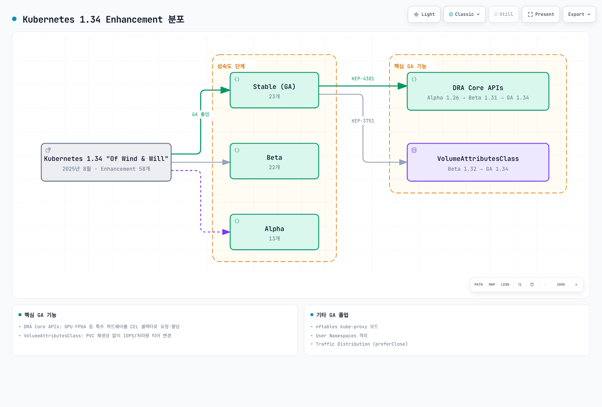

[🔍 인터랙티브 다이어그램 보기](https://www.atomai.click/kubernetes-docs/archmaps/ko-eks-12-kubernetes-version-roadmap-11.html)

#### 핵심 GA 기능

##### DRA (Dynamic Resource Allocation) Core APIs GA (KEP-4381)

**졸업 경로: Alpha 1.26 → Beta 1.31 → GA 1.34**

GPU, FPGA, 네트워크 디바이스 등 특수 하드웨어 리소스를 Kubernetes 네이티브 방식으로 요청하고 할당할 수 있는 DRA Core API가 GA로 졸업했습니다.

```yaml
# DeviceClass 정의 (클러스터 관리자)
apiVersion: resource.k8s.io/v1
kind: DeviceClass
metadata:
  name: gpu-nvidia-a100
spec:
  selectors:
    - cel:
        expression: >-
          device.driver == "gpu.nvidia.com" &&
          device.attributes["gpu.nvidia.com"].productName == "A100"
  config:
    - opaque:
        driver: gpu.nvidia.com
        parameters:
          raw: '{"sharing": {"timeSlicing": {"replicas": 2}}}'
---
# ResourceClaim (사용자/개발자)
apiVersion: resource.k8s.io/v1
kind: ResourceClaim
metadata:
  name: training-gpus
spec:
  devices:
    requests:
      - name: gpu
        deviceClassName: gpu-nvidia-a100
        count: 4    # A100 GPU 4장 요청
    constraints:
      - requests: ["gpu"]
        matchAttribute: "gpu.nvidia.com/numa-node"
        # 동일 NUMA 노드의 GPU를 선호
---
# ResourceClaimTemplate (Deployment에서 사용)
apiVersion: resource.k8s.io/v1
kind: ResourceClaimTemplate
metadata:
  name: gpu-claim-template
spec:
  spec:
    devices:
      requests:
        - name: gpu
          deviceClassName: gpu-nvidia-a100
          count: 1
---
# Pod에서 ResourceClaim 사용
apiVersion: v1
kind: Pod
metadata:
  name: ml-inference
spec:
  containers:
    - name: inference
      image: vllm:v0.5.0
      resources:
        claims:
          - name: model-gpu
  resourceClaims:
    - name: model-gpu
      resourceClaimTemplateName: gpu-claim-template
```

**DRA vs Device Plugin 비교:**

| 항목 | DRA (1.34 GA) | Device Plugin (기존) |
|------|--------------|---------------------|
| 디바이스 선택 | CEL 표현식으로 세밀한 선택 | 단순 수량 기반 |
| 디바이스 공유 | 네이티브 지원 (time-slicing, MPS, MIG) | 플러그인별 구현 |
| 토폴로지 인식 | NUMA, PCIe 토폴로지 지원 | 제한적 |
| 디바이스 속성 조회 | 표준화된 attribute/capacity API | 비표준 |
| 다중 디바이스 조합 | 단일 claim에서 여러 디바이스 조합 | 불가 |
| 스케줄러 통합 | 네이티브 통합 | 제한적 |

**EKS에서의 AI/ML 활용:**

```yaml
# EKS에서 DRA를 활용한 GPU 워크로드 예시
apiVersion: apps/v1
kind: Deployment
metadata:
  name: vllm-serving
spec:
  replicas: 3
  selector:
    matchLabels:
      app: vllm
  template:
    metadata:
      labels:
        app: vllm
    spec:
      containers:
        - name: vllm
          image: vllm/vllm-openai:latest
          args:
            - "--model"
            - "meta-llama/Llama-3.1-70B"
            - "--tensor-parallel-size"
            - "4"
          resources:
            claims:
              - name: training-gpus
      resourceClaims:
        - name: training-gpus
          resourceClaimTemplateName: gpu-claim-template
```

##### VolumeAttributesClass GA (KEP-3751)

1.32에서 beta였던 VolumeAttributesClass가 GA로 졸업했습니다.

```yaml
# GA 버전 API
apiVersion: storage.k8s.io/v1
kind: VolumeAttributesClass
metadata:
  name: io-intensive
driverName: ebs.csi.aws.com
parameters:
  iops: "64000"
  throughput: "4000"
---
apiVersion: storage.k8s.io/v1
kind: VolumeAttributesClass
metadata:
  name: throughput-optimized
driverName: ebs.csi.aws.com
parameters:
  iops: "3000"
  throughput: "750"
```

**자동 성능 조절 패턴 (CronJob 활용):**

```yaml
# 피크 시간 전 성능 상향
apiVersion: batch/v1
kind: CronJob
metadata:
  name: scale-up-iops
spec:
  schedule: "0 8 * * 1-5"    # 평일 오전 8시
  jobTemplate:
    spec:
      template:
        spec:
          containers:
            - name: scaler
              image: bitnami/kubectl:latest
              command:
                - /bin/sh
                - -c
                - |
                  kubectl patch pvc database-pvc \
                    -p '{"spec":{"volumeAttributesClassName":"io-intensive"}}'
          restartPolicy: OnFailure
---
# 비피크 시간 성능 하향
apiVersion: batch/v1
kind: CronJob
metadata:
  name: scale-down-iops
spec:
  schedule: "0 22 * * 1-5"   # 평일 오후 10시
  jobTemplate:
    spec:
      template:
        spec:
          containers:
            - name: scaler
              image: bitnami/kubectl:latest
              command:
                - /bin/sh
                - -c
                - |
                  kubectl patch pvc database-pvc \
                    -p '{"spec":{"volumeAttributesClassName":"throughput-optimized"}}'
          restartPolicy: OnFailure
```

#### 핵심 Alpha 기능

##### KYAML Alpha (KEP-4222)

Kubernetes에 내장된 새로운 YAML/JSON 처리 라이브러리인 KYAML이 Alpha로 도입되었습니다. 기존의 go-yaml/yaml.v2 라이브러리를 대체하여 YAML 처리의 정확성과 보안성을 향상시킵니다.

**KYAML의 목표:**
- YAML 1.2 스펙 완전 준수 (기존은 YAML 1.1 기반)
- 일관된 에러 메시지와 위치 정보
- 보안 강화: YAML bomb 등 악의적 입력 방어
- kubectl, API 서버, CRD 처리 등 전반에 걸쳐 통일된 YAML 처리

```yaml
# YAML 1.1 vs 1.2 차이점 예시
# YAML 1.1: "yes", "no", "on", "off"가 boolean으로 해석
# YAML 1.2: "true", "false"만 boolean

# 기존 (YAML 1.1 - 주의 필요)
data:
  norway: no     # boolean false로 해석될 수 있음!
  
# KYAML (YAML 1.2 - 명확)
data:
  norway: "no"   # 문자열로 명확히 처리
```

#### 기타 주요 변경 사항 (1.34)

| 기능 | 단계 | 설명 |
|------|------|------|
| nftables kube-proxy | GA | nftables 기반 프록시 모드 GA 졸업 |
| User Namespaces | GA | Pod의 Linux user namespace 격리 |
| Node Log Query | GA | kubelet API를 통한 노드 로그 조회 |
| Traffic Distribution (preferClose) | GA | Service의 근접 트래픽 분배 |
| PodHealthyPolicy for PDB | GA | PDB의 unhealthy pod 처리 정책 |
| Recursive Read-only Mounts | GA | 재귀적 읽기 전용 마운트 |
| Image Pull Policy: IfNotPresentOrNewer | Alpha | 이미지가 없거나 새 버전이면 pull |
| Portforward over WebSocket | GA | WebSocket을 통한 포트 포워딩 |

---

### 4.7 Kubernetes 1.35 "Timbernetes" (2025년 12월)

Kubernetes 1.35 "Timbernetes"는 In-Place Pod Resize GA를 포함하여 워크로드 관리의 큰 진전을 이룬 릴리스입니다.

**릴리스 통계**: Enhancement 60개 -- Stable 17개, Beta 19개, Alpha 22개

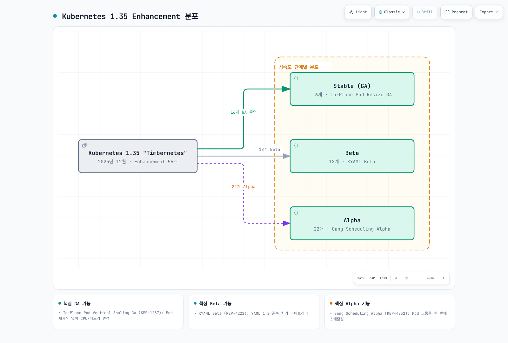

[🔍 인터랙티브 다이어그램 보기](https://www.atomai.click/kubernetes-docs/archmaps/ko-eks-12-kubernetes-version-roadmap-12.html)

#### 핵심 GA 기능

##### In-Place Pod Vertical Scaling GA (KEP-1287)

**졸업 경로: Alpha 1.27 → Beta 1.33 → GA 1.35**

Pod를 재시작하지 않고 CPU/메모리 리소스를 변경하는 기능이 드디어 GA로 졸업했습니다. VPA(Vertical Pod Autoscaler)의 실질적인 활용도가 크게 향상됩니다.

```yaml
# GA 버전에서의 In-Place Pod Resize
apiVersion: v1
kind: Pod
metadata:
  name: production-api
spec:
  containers:
    - name: api-server
      image: api:v4.0
      resources:
        requests:
          cpu: "1"
          memory: 1Gi
        limits:
          cpu: "2"
          memory: 2Gi
      resizePolicy:
        - resourceName: cpu
          restartPolicy: NotRequired
        - resourceName: memory
          restartPolicy: NotRequired    # GA에서는 메모리도 재시작 없이 가능한 케이스 확대
```

**Deployment에서의 In-Place Resize 전략:**

```yaml
apiVersion: apps/v1
kind: Deployment
metadata:
  name: web-service
spec:
  replicas: 10
  selector:
    matchLabels:
      app: web
  template:
    metadata:
      labels:
        app: web
    spec:
      containers:
        - name: web
          image: web:v5.0
          resources:
            requests:
              cpu: 500m
              memory: 512Mi
            limits:
              cpu: "2"
              memory: 2Gi
          resizePolicy:
            - resourceName: cpu
              restartPolicy: NotRequired
            - resourceName: memory
              restartPolicy: NotRequired
---
# VPA 연동 (In-Place 모드)
apiVersion: autoscaling.k8s.io/v1
kind: VerticalPodAutoscaler
metadata:
  name: web-vpa
spec:
  targetRef:
    apiVersion: apps/v1
    kind: Deployment
    name: web-service
  updatePolicy:
    updateMode: "InPlace"
  resourcePolicy:
    containerPolicies:
      - containerName: web
        minAllowed:
          cpu: 250m
          memory: 256Mi
        maxAllowed:
          cpu: "4"
          memory: 8Gi
        controlledResources: ["cpu", "memory"]
```

**GA에서 해결된 제약 사항:**

| 항목 | Beta (1.33) | GA (1.35) |
|------|-------------|-----------|
| CPU 리사이즈 | 재시작 불필요 | 재시작 불필요 |
| 메모리 리사이즈 | 대부분 재시작 필요 | 재시작 없이 가능한 케이스 확대 |
| StatefulSet 지원 | Alpha (1.33) | Beta (1.35) |
| Deployment 롤링 리사이즈 | 미지원 | 지원 |
| VPA In-Place 모드 | 실험적 | 안정적 |
| QoS 클래스 변경 | 불가 | 불가 (설계상 제한) |

**In-Place Resize 모니터링:**

```bash
# Pod 리사이즈 이벤트 모니터링
kubectl get events --field-selector reason=PodResizeSucceeded -w

# Pod 현재 리소스 할당 상태 확인
kubectl get pod production-api -o jsonpath='{
  .status.containerStatuses[*].allocatedResources}'

# 리사이즈 조건 확인
kubectl get pod production-api -o jsonpath='{.status.conditions}' | jq '.[] | select(.type=="PodResizeInProgress")'
```

##### KYAML Beta (KEP-4222)

KYAML이 Beta로 승격되어 기본 활성화됩니다.

**마이그레이션 고려사항:**
- YAML 1.1에서 1.2로의 전환으로 인해 일부 매니페스트의 동작이 변경될 수 있음
- 특히 `yes/no`, `on/off`, `y/n` 같은 값이 boolean이 아닌 문자열로 처리됨
- 0으로 시작하는 숫자가 더 이상 8진수로 해석되지 않음

```bash
# KYAML 호환성 검증 도구
kubectl apply --dry-run=server --validate=strict -f my-manifest.yaml

# KYAML Feature Gate 비활성화 (호환성 문제 발생 시)
# EKS에서는 직접 설정 불가 - AWS 지원 티켓 필요
```

#### 핵심 Alpha 기능

##### Gang Scheduling Alpha (KEP-4832)

여러 Pod가 동시에 스케줄링되어야 하는 "all-or-nothing" 스케줄링을 지원합니다. 분산 학습, 빅데이터 처리 등에서 필수적인 기능입니다.

```yaml
# Gang Scheduling 예시 (1.35 Alpha)
apiVersion: batch/v1
kind: Job
metadata:
  name: distributed-training
spec:
  completionMode: Indexed
  completions: 8
  parallelism: 8
  template:
    metadata:
      labels:
        gang: training-group-1
    spec:
      schedulingGates:
        - name: "scheduling.k8s.io/gang-scheduling"
      # 8개 Pod가 모두 스케줄 가능해야만 배치 시작
      containers:
        - name: worker
          image: horovod-training:v1.0
          resources:
            limits:
              nvidia.com/gpu: 4
```

**Gang Scheduling의 필요성:**

```
┌─────────────────────────────────────────────────────────────┐
│                  Gang Scheduling 없이                        │
│                                                               │
│  Worker 0: ████ (GPU 할당됨, 대기 중)                         │
│  Worker 1: ████ (GPU 할당됨, 대기 중)                         │
│  Worker 2: ████ (GPU 할당됨, 대기 중)                         │
│  Worker 3: .... (GPU 부족으로 Pending)                        │
│                                                               │
│  → 3개 Worker의 GPU가 낭비됨 (데드락 위험)                      │
├─────────────────────────────────────────────────────────────┤
│                  Gang Scheduling 사용 시                      │
│                                                               │
│  4개 GPU 모두 사용 가능? → Yes → 4개 Worker 동시 배치          │
│                          → No  → 모든 Worker Pending (리소스 미점유) │
│                                                               │
│  → 데드락 방지, 리소스 효율성 향상                               │
└─────────────────────────────────────────────────────────────┘
```

#### 기타 주요 변경 사항 (1.35)

| 기능 | 단계 | 설명 |
|------|------|------|
| CBORSerializer | Beta | CBOR 직렬화 포맷 지원 (더 작고 빠름) |
| Streaming List | Beta | 대규모 리스트의 스트리밍 응답 |
| Pod-level Resource Limits | Beta | Pod 레벨에서의 리소스 제한 |
| Image Pull Policy IfNotPresentOrNewer | Beta | 새 이미지 자동 감지 pull |
| DRA: Device Taints | Alpha | DRA 디바이스에 taint 설정 |
| Node Maintenance Mode | Alpha | 노드 유지보수 모드 |

---

### 4.8 Kubernetes 1.36 "ハル (Haru)" (2026년 4월)

Kubernetes 1.36은 일본어 "ハル"(봄, Haru)을 코드네임으로 사용한 릴리스입니다. **보안 강화, AI/ML 워크로드 지원, API 확장성**을 핵심 테마로, 18개 Stable(GA) / 25개 Beta / 25개 Alpha 기능이 포함되었습니다. EKS는 GovCloud(US)를 포함한 모든 가용 리전에서 1.36을 지원합니다.

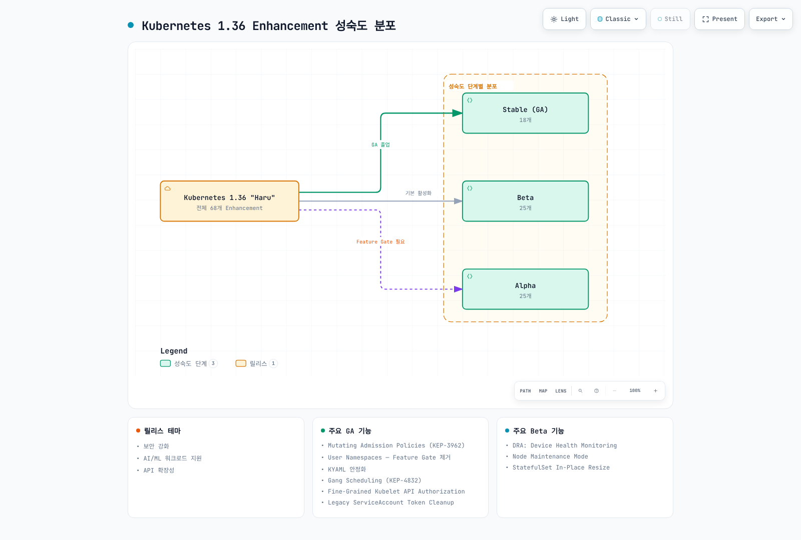

[🔍 인터랙티브 다이어그램 보기](https://www.atomai.click/kubernetes-docs/archmaps/ko-eks-12-kubernetes-version-roadmap-13.html)

#### 한눈에 보기

| 기능 | 단계 | 핵심 가치 |
|------|------|-----------|
| Mutating Admission Policies | **GA** | Webhook 서버 제거 → 운영 단순화·성능·가용성 |
| In-Place Pod Vertical Scaling | **확장** | 무중단 리소스 조정 → 비용 효율·SLA 보호 |
| User Namespaces | **GA** | 컨테이너 root ≠ 노드 root → 권한 격리 강화 |
| Fine-Grained Kubelet API Authorization | **GA** | kubelet 접근 최소권한화 |
| Legacy ServiceAccount Token Cleanup | **GA** | 미사용 토큰 자동 정리 → 공격면 축소 |
| Resource Health Status (DRA) | 개선 | GPU 등 디바이스 헬스 → 장애 원인 식별 |

#### 핵심 기능 심층

##### Mutating Admission Policies GA (KEP-3962)

CEL(Common Expression Language) 기반 mutation 로직을 네이티브 Kubernetes 객체로 선언할 수 있습니다. 별도 webhook 서버 없이 API Server 내부에서 mutation이 처리됩니다.

**핵심 장점:**

- **API Server 내부 처리** — webhook 네트워크 왕복 제거로 latency 감소
- **운영 복잡성 감소** — webhook 서버의 인증서 관리, HA 구성, 스케일링 부담 제거
- **멱등성 보장** — CEL 표현식은 동일 입력에 항상 동일 결과를 반환
- **제약사항** — 외부 API 호출이 필요한 mutation은 여전히 webhook 필요

**MutatingAdmissionPolicy 예시 — resizePolicy 자동 주입:**

```yaml
apiVersion: admissionregistration.k8s.io/v1
kind: MutatingAdmissionPolicy
metadata:
  name: inject-resizepolicy
spec:
  failurePolicy: Fail
  reinvocationPolicy: Never
  matchConstraints:
    resourceRules:
      - apiGroups: [""]
        apiVersions: ["v1"]
        operations: ["CREATE"]
        resources: ["pods"]
  matchConditions:
    - name: only-resize-enabled
      expression: >-
        has(object.metadata.annotations) &&
        ("resize.example.com/enabled" in object.metadata.annotations) &&
        object.metadata.annotations["resize.example.com/enabled"] == "true"
  mutations:
    - patchType: JSONPatch
      jsonPatch:
        expression: >-
          object.spec.containers.map(c, JSONPatch{
            op: "add",
            path: "/spec/containers/" + string(object.spec.containers.indexOf(c)) + "/resizePolicy",
            value: [
              {"resourceName": "cpu",    "restartPolicy": "NotRequired"},
              {"resourceName": "memory", "restartPolicy": "RestartContainer"}
            ]
          })
---
apiVersion: admissionregistration.k8s.io/v1
kind: MutatingAdmissionPolicyBinding
metadata:
  name: inject-resizepolicy-binding
spec:
  policyName: inject-resizepolicy
  matchResources:
    namespaceSelector:
      matchLabels:
        map-demo: "true"
```

> **안전 참고**: MAP의 `jsonPatch` 표현식은 **atomic list**(예: `resizePolicy`)에 대해 전체 교체를 수행합니다. 기존 값이 있을 경우 덮어씌워지므로, `matchConditions`으로 대상을 정확히 한정하는 것이 중요합니다. Strategic Merge Patch는 atomic list에서는 merge가 아닌 replace 동작을 하므로, JSONPatch를 사용하여 명시적으로 경로를 지정하는 방식이 권장됩니다.

**실측 결과 (EKS 1.36.1)** — `admissionregistration.k8s.io/v1`(GA)로 서빙되는 클러스터에서 위 매니페스트를 그대로 적용해 검증한 결과입니다:

| 케이스 | annotation | 주입된 resizePolicy | 판정 |
|--------|-----------|-------------------|------|
| with-annotation | 有 | `[{cpu:NotRequired},{memory:RestartContainer}]` | ✅ 주입됨 (webhook 없이) |
| without-annotation | 無 | `[]` (없음) | ✅ 주입 안 됨 (matchCondition 동작) |

```bash
kubectl -n map-demo get pod with-annotation -o jsonpath='{.spec.containers[0].resizePolicy}'
# → [{"resourceName":"cpu","restartPolicy":"NotRequired"},{"resourceName":"memory","restartPolicy":"RestartContainer"}]
```

테스트 Pod 매니페스트엔 `resizePolicy`가 없는데도 생성된 Pod에는 나타납니다 — admission 시점에 MAP가 주입했다는 증거입니다(webhook 서버 없음).

> **주의**: `matchResources.namespaceSelector`로 대상 네임스페이스를 한정하지 않으면 클러스터 전역 Pod 생성에 개입합니다. `failurePolicy: Fail`은 범위를 좁힌 뒤에만 안전합니다. 또한 정책 생성/수정 직후에는 재컴파일·전파에 수초가 걸리므로, 정책을 먼저 적용하고 잠시 후 워크로드를 생성하는 것이 안전합니다.

##### In-Place Pod Vertical Scaling 확장

1.35에서 GA로 졸업한 In-Place Pod Resize가 1.36에서 추가 확장되었습니다.

**1.36에서 추가된 개선 사항:**

- **Pod-level 공유 예산 리사이즈** — Pod 레벨의 aggregate 리소스 제한을 동적으로 변경 가능
- **CPUManager 체크포인트 개선** — 원본 할당과 리사이즈 할당을 모두 추적하여 NUMA 정렬 유지
- **리사이즈 정책** — CPU: `NotRequired` (무중단), Memory: 축소 시 `RestartContainer` 가능

##### User Namespaces (Feature Gate 제거)

컨테이너 내부의 UID 0(root)을 호스트의 비특권 UID로 매핑하여 보안 격리를 강화합니다. 1.34에서 GA로 졸업했으며, **1.36에서 feature gate가 완전히 제거**되어 프로덕션 레디 상태입니다. 더 이상 feature gate로 비활성화할 수 없으므로, 모든 클러스터에서 기본 동작으로 포함됩니다.

##### KYAML 안정화 (GA)

KYAML이 **GA로 승격**되어 YAML 1.2 기반 처리가 모든 Kubernetes 컴포넌트에서 기본으로 사용됩니다. KYAML 검증은 이제 위험한 YAML 패턴(anchors, merge keys, 암시적 boolean 등)을 기본적으로 거부합니다.

```bash
# KYAML은 이제 기본 적용
$ kubectl apply -f bad-manifest.yaml
Error from server: error parsing bad-manifest.yaml: KYAML validation failed:
  line 5: YAML anchors are not permitted
  line 12: implicit boolean value "yes" is not permitted; use "true" or "false"
```

**마이그레이션 고려사항:**
- `yes/no`, `on/off`, `y/n` 같은 값이 boolean이 아닌 문자열로 처리됩니다
- 0으로 시작하는 숫자가 더 이상 8진수로 해석되지 않습니다
- 기존 매니페스트의 호환성을 `kubectl apply --dry-run=server --validate=strict`로 사전 검증하는 것이 좋습니다

##### Gang Scheduling GA (KEP-4832)

1.35에서 Alpha로 도입된 Gang Scheduling이 **GA로 졸업**하여 기본 활성화됩니다. 여러 Pod가 동시에 스케줄링되어야 하는 "all-or-nothing" 스케줄링을 지원합니다.

```yaml
# GA-level Gang Scheduling
apiVersion: scheduling.k8s.io/v1
kind: PodGroup
metadata:
  name: mpi-job
spec:
  minMember: 8
  scheduleTimeoutSeconds: 600
  priorityClassName: high-priority
```

**기타 GA 기능:**
- `AnonymousAuthConfigurableEndpoints` — 엔드포인트별 익명 인증 제어
- `SELinuxMount` — 볼륨의 SELinux 레이블 관리
- `NodeInclusionPolicyInPodTopologySpread` — 토폴로지 스프레드 노드 포함 정책
- `RecoverVolumeExpansionFailure` — 볼륨 확장 실패 시 자동 복구

#### 활용 시나리오 — Phase-Aware 리소스 관리 (annotation 기반)

##### 문제 정의

같은 컨테이너의 lifecycle에서 **startup 단계**와 **steady-state 단계**는 모두 `Running` 상태입니다. `resources` 필드는 하나뿐이며, probe 상태에 연동한 자동 리소스 전환 메커니즘이 Kubernetes에 내장되어 있지 않습니다.

대표적인 워크로드 예시:
- **JVM 애플리케이션** — JIT 컴파일 시 높은 CPU 필요, 이후 안정화
- **LLM 모델 서빙** — 모델 로딩 시 대량 메모리/CPU, 추론 시 감소
- **데이터베이스** — 인덱스/캐시 프리필 시 높은 CPU, 이후 쿼리 처리로 전환

##### 동작 흐름

```
Pod 생성 (startup용 큰 CPU로 시작)
  → controller가 pod.status.containerStatuses[].started 를 watch
  → started: true 감지 (= startup probe 통과)
  → resize subresource로 steady-state CPU 값으로 in-place patch (무중단)
```

##### 핵심 가치 — QoS 보존

QoS 클래스는 Pod 생성 시 확정되고 **resize로 변경이 불가능**합니다 (KEP-1287 설계상 제한). startup 단계와 steady-state 단계 양쪽 모두 `requests == limits`를 유지하면 **Guaranteed QoS가 보존**됩니다. memory는 고정하고 CPU만 축소하는 전략이 가장 안전합니다.

##### Annotation 방식 — CRD 불필요

별도의 CRD를 정의하지 않고, **annotation만으로 리사이즈 정책을 선언**합니다.

```yaml
spec:
  template:
    metadata:
      annotations:
        resize.example.com/enabled:          "true"
        resize.example.com/trigger:          "StartupProbePassed"
        resize.example.com/steady-resources: |
          {"app":{"requests":{"cpu":"50m"},"limits":{"cpu":"50m"}}}
    spec:
      containers:
        - name: app
          resizePolicy:
            - { resourceName: cpu, restartPolicy: NotRequired }
            - { resourceName: memory, restartPolicy: RestartContainer }
          resources:
            requests: { cpu: "200m", memory: 64Mi }
            limits:   { cpu: "200m", memory: 64Mi }
```

##### 컨트롤러 전체 코드 (main.go)

```go
// pod-resizer — annotation 기반 무중단 in-place 다운스케일 컨트롤러.
// 워크로드 종류(Deployment/StatefulSet/DaemonSet/Rollout)를 알 필요가 없다.
// Pod 만 watch 하다, startup 통과 시점에 pods/resize 서브리소스로 steady 리소스로
// 무중단 패치한다. req==limit 을 양쪽 단계에서 유지하면 Guaranteed QoS 가 보존된다(KEP-1287).
package main

import (
	"context"
	"encoding/json"
	"fmt"
	"log"
	"strconv"
	"sync"
	"time"

	corev1 "k8s.io/api/core/v1"
	metav1 "k8s.io/apimachinery/pkg/apis/meta/v1"
	"k8s.io/apimachinery/pkg/types"
	"k8s.io/client-go/informers"
	"k8s.io/client-go/kubernetes"
	"k8s.io/client-go/rest"
	"k8s.io/client-go/tools/cache"
)

const (
	annEnabled = "resize.example.com/enabled"
	annTrigger = "resize.example.com/trigger"
	annDelay   = "resize.example.com/delay-seconds"
	annSteady  = "resize.example.com/steady-resources"
	annResized = "resize.example.com/resized"
)

type resVals struct {
	Requests map[string]string `json:"requests,omitempty"`
	Limits   map[string]string `json:"limits,omitempty"`
}

var clientset *kubernetes.Clientset
var processed sync.Map

func main() {
	cfg, err := rest.InClusterConfig()
	if err != nil {
		log.Fatalf("in-cluster config: %v", err)
	}
	clientset, err = kubernetes.NewForConfig(cfg)
	if err != nil {
		log.Fatalf("clientset: %v", err)
	}

	factory := informers.NewSharedInformerFactory(clientset, 15*time.Second)
	podInformer := factory.Core().V1().Pods().Informer()
	podInformer.AddEventHandler(cache.ResourceEventHandlerFuncs{
		AddFunc:    func(obj interface{}) { handle(obj) },
		UpdateFunc: func(_, obj interface{}) { handle(obj) },
	})

	stop := make(chan struct{})
	defer close(stop)
	log.Printf("pod-resizer starting; watching pods annotated %s=true", annEnabled)
	factory.Start(stop)
	factory.WaitForCacheSync(stop)
	log.Printf("informer cache synced; ready")
	select {}
}

func handle(obj interface{}) {
	pod, ok := obj.(*corev1.Pod)
	if !ok {
		return
	}
	a := pod.Annotations
	if a == nil || a[annEnabled] != "true" || a[annResized] == "true" {
		return
	}
	if pod.DeletionTimestamp != nil || pod.Status.Phase != corev1.PodRunning {
		return
	}

	trigger := a[annTrigger]
	if trigger == "" {
		trigger = "StartupProbePassed"
	}
	if !triggerMet(pod, trigger, a[annDelay]) {
		return
	}

	steady := map[string]resVals{}
	if err := json.Unmarshal([]byte(a[annSteady]), &steady); err != nil {
		log.Printf("ERROR %s/%s: bad %s: %v", pod.Namespace, pod.Name, annSteady, err)
		return
	}
	patch := buildResizePatch(steady)
	if patch == nil {
		return
	}
	pb, _ := json.Marshal(patch)

	key := string(pod.UID)
	if _, loaded := processed.LoadOrStore(key, true); loaded {
		return
	}

	if _, err := clientset.CoreV1().Pods(pod.Namespace).Patch(
		context.TODO(), pod.Name, types.StrategicMergePatchType, pb,
		metav1.PatchOptions{}, "resize"); err != nil {
		processed.Delete(key)
		log.Printf("ERROR %s/%s: resize patch failed: %v", pod.Namespace, pod.Name, err)
		return
	}
	log.Printf("RESIZED %s/%s [%s] trigger=%s patch=%s",
		pod.Namespace, pod.Name, ownerKind(pod), trigger, string(pb))

	mark := []byte(fmt.Sprintf(`{"metadata":{"annotations":{%q:"true"}}}`, annResized))
	if _, err := clientset.CoreV1().Pods(pod.Namespace).Patch(
		context.TODO(), pod.Name, types.MergePatchType, mark, metav1.PatchOptions{}); err != nil {
		log.Printf("WARN %s/%s: marker patch failed: %v", pod.Namespace, pod.Name, err)
	}
}

func triggerMet(pod *corev1.Pod, trigger, delayStr string) bool {
	switch trigger {
	case "Ready":
		for _, c := range pod.Status.Conditions {
			if c.Type == corev1.PodReady {
				return c.Status == corev1.ConditionTrue
			}
		}
		return false
	case "Delay":
		delay, _ := strconv.Atoi(delayStr)
		for _, cs := range pod.Status.ContainerStatuses {
			if cs.State.Running != nil {
				return time.Since(cs.State.Running.StartedAt.Time) >= time.Duration(delay)*time.Second
			}
		}
		return false
	default:
		if len(pod.Status.ContainerStatuses) == 0 {
			return false
		}
		for _, cs := range pod.Status.ContainerStatuses {
			if cs.Started == nil || !*cs.Started {
				return false
			}
		}
		return true
	}
}

func buildResizePatch(steady map[string]resVals) map[string]interface{} {
	var containers []map[string]interface{}
	for name, rv := range steady {
		res := map[string]interface{}{}
		if len(rv.Requests) > 0 {
			res["requests"] = rv.Requests
		}
		if len(rv.Limits) > 0 {
			res["limits"] = rv.Limits
		}
		containers = append(containers, map[string]interface{}{"name": name, "resources": res})
	}
	if len(containers) == 0 {
		return nil
	}
	return map[string]interface{}{"spec": map[string]interface{}{"containers": containers}}
}

func ownerKind(pod *corev1.Pod) string {
	if len(pod.OwnerReferences) > 0 {
		return pod.OwnerReferences[0].Kind
	}
	return "Pod"
}
```

##### RBAC 매니페스트

컨트롤러가 `pods/resize` 서브리소스에 접근하기 위한 RBAC 설정입니다. `pods/resize`는 Pod의 리소스를 in-place로 변경하는 핵심 서브리소스입니다.

```yaml
apiVersion: v1
kind: ServiceAccount
metadata:
  name: pod-resizer
  namespace: pod-resizer
---
apiVersion: rbac.authorization.k8s.io/v1
kind: ClusterRole
metadata:
  name: pod-resizer
rules:
  - apiGroups: [""]
    resources: ["pods"]
    verbs: ["get", "list", "watch", "patch"]
  - apiGroups: [""]
    resources: ["pods/resize"]
    verbs: ["patch"]
---
apiVersion: rbac.authorization.k8s.io/v1
kind: ClusterRoleBinding
metadata:
  name: pod-resizer
subjects:
  - kind: ServiceAccount
    name: pod-resizer
    namespace: pod-resizer
roleRef:
  apiGroup: rbac.authorization.k8s.io
  kind: ClusterRole
  name: pod-resizer
```

##### 데모 워크로드 — Deployment 예시

annotation이 설정된 Deployment를 배포하면, 컨트롤러가 startup probe 통과 후 자동으로 CPU를 축소합니다.

```yaml
apiVersion: apps/v1
kind: Deployment
metadata:
  name: demo-resize
  namespace: resize-demo
spec:
  replicas: 2
  selector:
    matchLabels:
      app: demo-resize
  template:
    metadata:
      labels:
        app: demo-resize
      annotations:
        resize.example.com/enabled:          "true"
        resize.example.com/trigger:          "StartupProbePassed"
        resize.example.com/steady-resources: |
          {"app":{"requests":{"cpu":"50m"},"limits":{"cpu":"50m"}}}
    spec:
      containers:
        - name: app
          image: nginx:1.27
          resizePolicy:
            - { resourceName: cpu,    restartPolicy: NotRequired }
            - { resourceName: memory, restartPolicy: RestartContainer }
          resources:
            requests: { cpu: "200m", memory: 64Mi }
            limits:   { cpu: "200m", memory: 64Mi }
          startupProbe:
            httpGet:
              path: /
              port: 80
            initialDelaySeconds: 1
            periodSeconds: 2
            failureThreshold: 5
```

##### Argo Rollouts 호환성

Argo Rollouts의 구조는 `Rollout → ReplicaSet → Pod`입니다. 본 컨트롤러는 **Pod만 watch**하므로, 상위 리소스가 Deployment인지 Rollout인지 구분 없이 동일하게 동작합니다. `ownerReferences`에서 `ReplicaSet`을 확인하며, 로그에는 `[ReplicaSet]`으로 표시됩니다.

##### 실측 결과 (EKS 1.36.1)

**테스트 환경:**
- EKS v1.36.1 노드, containerd 2.2.3
- Amazon Linux 2023 (cgroup v2, arm64/Graviton)

**컨트롤러 로그:**

```
RESIZED resize-demo/demo-deploy-xxxxx-aaaaa [ReplicaSet] trigger=StartupProbePassed patch={"spec":{"containers":[{"name":"app","resources":{"limits":{"cpu":"50m"},"requests":{"cpu":"50m"}}}]}}
RESIZED resize-demo/demo-deploy-xxxxx-bbbbb [ReplicaSet] trigger=StartupProbePassed patch={"spec":{"containers":[{"name":"app","resources":{"limits":{"cpu":"50m"},"requests":{"cpu":"50m"}}}]}}
RESIZED resize-demo/demo-ds-yyyyy [DaemonSet] trigger=StartupProbePassed patch={"spec":{"containers":[{"name":"app","resources":{"limits":{"cpu":"50m"},"requests":{"cpu":"50m"}}}]}}
RESIZED resize-demo/demo-sts-0 [StatefulSet] trigger=StartupProbePassed patch={"spec":{"containers":[{"name":"app","resources":{"limits":{"cpu":"50m"},"requests":{"cpu":"50m"}}}]}}
```

**BEFORE → AFTER 결과:**

| 워크로드 | QoS | CPU (req/lim) | restartCount | containerID |
|----------|-----|---------------|--------------|-------------|
| Deployment (x2) | Guaranteed → **Guaranteed** | 200m → **50m** | 0 → **0** | **동일(IDENTICAL)** |
| DaemonSet | Guaranteed → **Guaranteed** | 200m → **50m** | 0 → **0** | **동일(IDENTICAL)** |
| StatefulSet | Guaranteed → **Guaranteed** | 200m → **50m** | 0 → **0** | **동일(IDENTICAL)** |

**결정적 근거:** `restartCount` 0 유지 + `containerID` 동일 → 컨테이너 재생성 없이 cgroup CPU 할당만 변경된 **진짜 무중단 in-place resize**입니다.

##### MAP 주입 테스트 결과

MutatingAdmissionPolicy(MAP)를 활용한 `resizePolicy` 자동 주입 테스트 결과입니다.

| 케이스 | annotation | 주입된 resizePolicy | 판정 |
|--------|-----------|-------------------|------|
| with-annotation | 有 | `[{cpu:NotRequired},{memory:RestartContainer}]` | ✅ 주입됨 (webhook 없이) |
| without-annotation | 無 | `[]` (없음) | ✅ 주입 안 됨 (matchCondition 동작) |

##### annotation 방식의 이점

| 항목 | annotation 방식의 이점 |
|------|----------------------|
| 운영 부담 | CRD/CR 설치·관리 없이 기존 워크로드에 annotation만 추가 |
| 워크로드 범용성 | 컨트롤러가 Pod만 watch → Deployment/STS/DS/Rollout 구분 없이 동일 적용 |
| 코드 복잡도 | type 분기·child 생성·owner-reference 모두 불필요 |
| 기존 워크로드 적용 | 운영 중인 워크로드에 annotation patch만으로 적용 (재작성 불필요) |
| resizePolicy 자동화 | MAP(GA)로 생성 시 자동 주입 → webhook 서버 없이 완전 자동화 |

##### 주의사항

- **CPU만 무중단 전환이 안전합니다.** memory 축소는 `RestartContainer` 정책에 따라 재시작이 동반될 수 있습니다.
- **kubectl ≥ 1.32 필요 (디버깅용).** 컨트롤러 자체는 client-go를 사용하므로 kubectl 버전과 무관하게 동작합니다.
- **HPA / CPUManager NUMA 정렬 상호작용**은 워크로드별로 검증이 필요합니다. 특히 NUMA-aware 토폴로지를 사용하는 환경에서는 resize 후 CPU 배치를 확인하는 것이 좋습니다.
- **운영 환경에서는 leader election 추가를 권장합니다.** 컨트롤러 다중 인스턴스 실행 시 중복 패치를 방지합니다.

#### 보안·운영 추가 기능

##### Fine-Grained Kubelet API Authorization (GA)

kubelet API에 대한 세분화된 권한 제어가 GA로 졸업했습니다. 기존에는 kubelet API 접근이 노드 단위로 제어되었으나, 이제 개별 API 엔드포인트별로 권한을 설정할 수 있습니다. 이를 통해 모니터링 시스템이 `/metrics`에만 접근하고, 디버깅 도구가 `/logs`에만 접근하는 등 최소 권한 원칙을 적용할 수 있습니다.

##### Legacy ServiceAccount Token Cleanup (GA)

Secret 기반 미사용 ServiceAccount 토큰을 자동으로 정리하는 기능이 GA로 졸업했습니다. Kubernetes 1.24 이전에 생성된 Secret 기반 SA 토큰 중, 사용되지 않는 토큰을 자동으로 감지하고 삭제하여 공격면을 축소합니다.

##### Resource Health Status (DRA) 개선

DRA(Dynamic Resource Allocation)에서 GPU 등 디바이스의 헬스 상태를 Pod status에 보고하는 기능이 개선되었습니다. 디바이스 장애 시 원인을 신속하게 식별할 수 있으며, `pod.status.resourceClaimStatuses`를 통해 디바이스 상태를 확인할 수 있습니다.

#### 업그레이드 시 점검 사항

- **Ingress-NGINX 은퇴 (2026-03-24)**: 공식 보안 패치가 중단되었습니다. Gateway API 호환 컨트롤러(예: Envoy Gateway, Istio Gateway, Cilium Gateway API)로 마이그레이션을 계획하는 것이 좋습니다.
- **IPVS 모드 / externalIPs 서비스 감사 권장**: kube-proxy IPVS 모드 사용 시 보안 설정을 점검하고, `externalIPs`를 사용하는 서비스의 접근 제어를 확인하는 것이 좋습니다.
- **EKS Cluster Insights**: EKS 콘솔의 Cluster Insights 기능을 활용하여 업그레이드 전 호환성 이슈를 사전에 점검할 수 있습니다. deprecated API 사용, 애드온 호환성 등을 자동으로 감지합니다.

#### 기타 주요 변경 사항 (1.36)

| 기능 | 단계 | 설명 |
|------|------|------|
| Mutating Admission Policies | GA | CEL 기반 네이티브 mutation, webhook 서버 불필요 |
| User Namespaces (Gate 제거) | GA | Feature gate 제거, 프로덕션 레디 |
| Fine-Grained Kubelet API Auth | GA | kubelet API 최소권한 접근 제어 |
| Legacy SA Token Cleanup | GA | 미사용 Secret 기반 SA 토큰 자동 정리 |
| KYAML | GA | YAML 1.2 기반 처리 안정화 |
| DRA: Device Health Monitoring | Beta | DRA 디바이스 상태 모니터링 |
| Node Maintenance Mode | Beta | 노드 유지보수 모드 |
| Streaming List | GA | 대규모 리스트의 스트리밍 응답 |
| CBORSerializer | GA 진행 중 | CBOR 직렬화 안정화 |
| Pod Disruption Conditions | GA | Pod 중단 조건 세분화 |
| Aggregated Discovery | GA | API Discovery 성능 최적화 |
| StatefulSet In-Place Resize | Beta | StatefulSet의 In-Place 리사이즈 |

---

## 5. 주요 기능 졸업 타임라인

이 섹션은 Kubernetes 1.29~1.36에서 주요 기능들의 성숙도 변화를 종합적으로 보여줍니다. 업그레이드 계획 수립 시 핵심 참고 자료로 활용하세요.

### 5.1 핵심 기능 졸업 추적표

| 기능 | KEP | Alpha | Beta | GA | 영향 범위 |
|:-----|:---:|:-----:|:----:|:--:|:---------|
| **Sidecar Containers** | 753 | 1.28 | 1.29 | **1.33** | 모든 sidecar 패턴 워크로드 |
| **In-Place Pod Resize** | 1287 | 1.27 | 1.33 | **1.35** | VPA, 리소스 최적화 |
| **DRA Core APIs** | 4381 | 1.26 | 1.31 | **1.34** | GPU/특수 하드웨어 워크로드 |
| **ValidatingAdmissionPolicy** | 3488 | 1.26 | 1.28 | **1.30** | 보안 정책 관리 |
| **KMS v2** | 3299 | 1.25 | 1.27 | **1.29** | Secrets 암호화 |
| **ReadWriteOncePod** | 2485 | 1.22 | 1.27 | **1.29** | 데이터베이스 워크로드 |
| **Pod Scheduling Readiness** | 3521 | 1.26 | 1.27 | **1.30** | 배치 스케줄링, GPU 쿼터 |
| **AppArmor GA** | 24 | - | 1.4 | **1.31** | 보안 프로필 관리 |
| **ServiceCIDR/IPAddress** | 1880 | 1.27 | 1.31 | **1.33** | 대규모 클러스터 네트워킹 |
| **Topology Aware Routing** | 2433 | 1.21 | 1.23 | **1.33** | 네트워크 비용 최적화 |
| **Job Success Policy** | 3998 | 1.28 | 1.31 | **1.33** | 분산 배치 작업 |
| **StructuredAuthzConfig** | 3221 | 1.29 | 1.30 | **1.32** | 인가 체계 고도화 |
| **VolumeAttributesClass** | 3751 | 1.29 | 1.31 | **1.34** | 스토리지 성능 관리 |
| **HPA Container Resource** | 2702 | 1.20 | 1.27 | **1.30** | Sidecar 환경의 HPA |
| **User Namespaces** | 127 | 1.25 | 1.28 | **1.34** | Pod 보안 격리 |
| **KYAML** | 4222 | 1.34 | 1.35 | 진행 중 | 매니페스트 처리 |
| **Gang Scheduling** | 4832 | 1.35 | 1.36 | 예정 | 분산 학습, 빅데이터 |
| **nftables kube-proxy** | 3866 | 1.29 | 1.31 | **1.34** | 네트워크 성능 |
| **Node Log Query** | 2258 | 1.27 | 1.33 | **1.34** | 노드 디버깅 |
| **Pod-level Resources** | 2837 | 1.32 | 1.36 | 예정 | 리소스 공유 최적화 |

### 5.2 버전별 GA 기능 요약

```
┌────────────────────────────────────────────────────────────────────────────┐
│                    버전별 주요 GA 졸업 기능                                   │
├───────┬────────────────────────────────────────────────────────────────────┤
│ 1.29  │ KMS v2, ReadWriteOncePod                                         │
├───────┼────────────────────────────────────────────────────────────────────┤
│ 1.30  │ ValidatingAdmissionPolicy, Pod Scheduling Readiness,             │
│       │ HPA Container Resource Metrics                                    │
├───────┼────────────────────────────────────────────────────────────────────┤
│ 1.31  │ AppArmor                                                         │
├───────┼────────────────────────────────────────────────────────────────────┤
│ 1.32  │ StructuredAuthorizationConfiguration                              │
├───────┼────────────────────────────────────────────────────────────────────┤
│ 1.33  │ ★ Sidecar Containers, ServiceCIDR/IPAddress,                     │
│       │   Topology Aware Routing, Job Success Policy                      │
├───────┼────────────────────────────────────────────────────────────────────┤
│ 1.34  │ ★ DRA Core APIs, VolumeAttributesClass, User Namespaces,         │
│       │   nftables kube-proxy, Node Log Query                             │
├───────┼────────────────────────────────────────────────────────────────────┤
│ 1.35  │ ★ In-Place Pod Resize                                            │
├───────┼────────────────────────────────────────────────────────────────────┤
│ 1.36  │ ★ Mutating Admission Policies, KYAML, Gang Scheduling,           │
│       │   Streaming List, Pod Disruption Conditions                      │
├───────┴────────────────────────────────────────────────────────────────────┤
│ ★ = 특히 운영 영향이 큰 기능                                                │
└────────────────────────────────────────────────────────────────────────────┘
```

### 5.3 기능 성숙도 진행 시각화

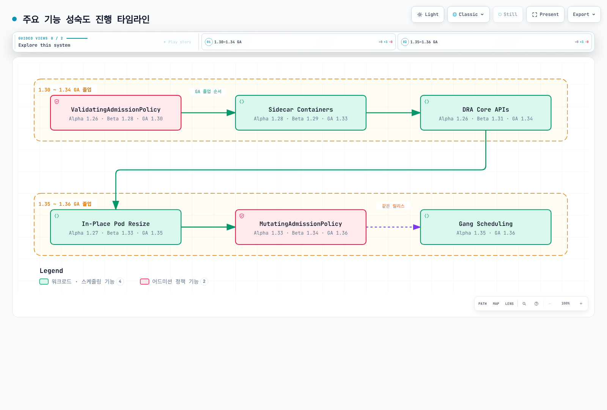

[🔍 인터랙티브 다이어그램 보기](https://www.atomai.click/kubernetes-docs/archmaps/ko-eks-12-kubernetes-version-roadmap-14.html)

---

## 6. Deprecation 및 제거 사항

### 6.1 Kubernetes API Deprecation 정책

Kubernetes는 명확한 Deprecation 정책을 따릅니다.

```
┌─────────────────────────────────────────────────────────────────────┐
│                   API Deprecation 정책 요약                          │
├────────────────┬────────────────────────────────────────────────────┤
│ API 안정성       │ 최소 지원 기간                                      │
├────────────────┼────────────────────────────────────────────────────┤
│ GA (v1)        │ 12개월 또는 3회 릴리스 (더 긴 쪽)                     │
│ Beta (v1beta1) │ 9개월 또는 3회 릴리스 (더 긴 쪽)                      │
│ Alpha (v1alpha1)│ 즉시 제거 가능                                     │
├────────────────┴────────────────────────────────────────────────────┤
│ ※ Deprecated API는 해당 버전의 지원이 끝날 때까지 작동하지만,            │
│   마이그레이션을 강력히 권장합니다.                                      │
└─────────────────────────────────────────────────────────────────────┘
```

### 6.2 버전별 주요 Deprecation 및 제거 사항

#### 1.29에서의 변경

| 항목 | 상태 | 마이그레이션 |
|------|------|------------|
| KMS v1 API | Deprecated | KMS v2로 마이그레이션 |
| flowcontrol.apiserver.k8s.io/v1beta2 | Deprecated | v1beta3 또는 v1 사용 |
| `in-tree` cloud provider 코드 | 진행 중 Deprecated | external cloud provider 사용 |

#### 1.30에서의 변경

| 항목 | 상태 | 마이그레이션 |
|------|------|------------|
| SecurityContextDeny admission plugin | Removed | Pod Security Admission 사용 |
| v1beta2 FlowSchema/PriorityLevelConfiguration | Removed | v1 API 사용 |
| CephFS 인트리 볼륨 플러그인 | Deprecated | CSI 드라이버 사용 |
| RBD 인트리 볼륨 플러그인 | Deprecated | CSI 드라이버 사용 |

#### 1.31에서의 변경

| 항목 | 상태 | 마이그레이션 |
|------|------|------------|
| KMS v1 | Removed | KMS v2 필수 |
| AppArmor 어노테이션 기반 설정 | Deprecated | `securityContext.appArmorProfile` 필드 사용 |
| CephFS/RBD 인트리 플러그인 | Removed | CSI 드라이버 필수 |
| `status.nodeInfo.kubeProxyVersion` | Removed | 별도 조회 방법 사용 |

#### 1.32에서의 변경

| 항목 | 상태 | 마이그레이션 |
|------|------|------------|
| flowcontrol.apiserver.k8s.io/v1beta3 | Removed | v1 API 사용 |
| Azure File/Disk 인트리 플러그인 | Removed | CSI 드라이버 필수 |
| `host` 네트워크 기반 kube-proxy | Deprecated | nftables 또는 eBPF 기반 권장 |

#### 1.33에서의 변경

| 항목 | 상태 | 마이그레이션 |
|------|------|------------|
| 레거시 ServiceAccount 토큰 자동 생성 | Removed | Bound ServiceAccount Token 사용 |
| iptables kube-proxy 모드 | Deprecated | nftables 모드 마이그레이션 권장 |
| `kubectl run --restart=Never` 기본 동작 변경 | 변경 | 명시적으로 지정 필요 |

#### 1.34에서의 변경

| 항목 | 상태 | 마이그레이션 |
|------|------|------------|
| iptables kube-proxy 모드 | Removed | nftables 모드 필수 (EKS에서는 유예) |
| DRA v1alpha2 API | Removed | v1 API 사용 |
| resource.k8s.io/v1beta1 일부 | Deprecated | v1 API 사용 |

#### 1.35~1.36에서의 변경

| 항목 | 버전 | 상태 | 마이그레이션 |
|------|------|------|------------|
| YAML 1.1 호환 모드 | 1.35 | Deprecated | YAML 1.2 준수 매니페스트로 전환 |
| 레거시 Feature Gate 다수 | 1.35 | Removed | GA된 Feature Gate 코드 제거 |
| `kubectl get --export` | 1.35 | Removed | `kubectl get -o yaml`에서 수동 정리 |

### 6.3 인트리 볼륨 플러그인 제거 타임라인

인트리(in-tree) 볼륨 플러그인의 CSI 마이그레이션은 오랫동안 진행되어 왔으며, 1.29~1.36 사이에 대부분이 완료됩니다.

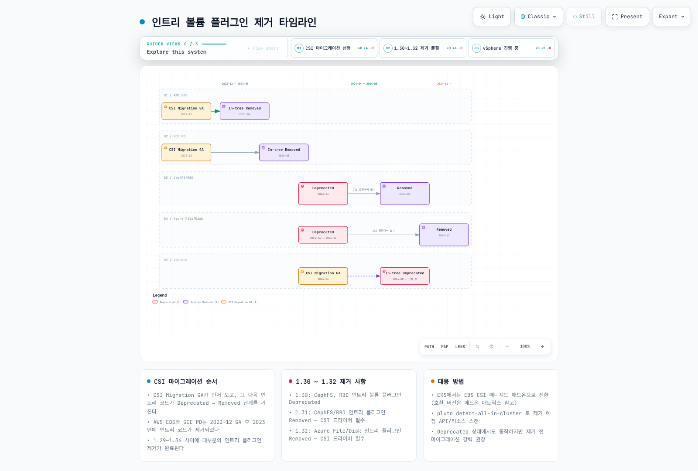

[🔍 인터랙티브 다이어그램 보기](https://www.atomai.click/kubernetes-docs/archmaps/ko-eks-12-kubernetes-version-roadmap-15.html)

### 6.4 Deprecation 대응 체크리스트

```bash
# 1. 현재 클러스터에서 사용 중인 Deprecated API 확인
kubectl get --raw /metrics | grep apiserver_requested_deprecated_apis

# 2. API 사용 현황 상세 확인
kubectl get apiservices | grep -v "v1\." | sort

# 3. 제거 예정 API를 사용하는 리소스 검색
# pluto: Kubernetes deprecated API 스캐너
# 설치: brew install FairwindsOps/tap/pluto
pluto detect-all-in-cluster

# 4. Helm 차트에서 Deprecated API 검색
pluto detect-helm -o wide

# 5. 매니페스트 파일에서 Deprecated API 검색
pluto detect-files -d ./manifests/ -o wide

# 출력 예시:
# NAME                KIND                VERSION          REPLACEMENT              REMOVED   DEPRECATED
# my-ingress          Ingress   networking.k8s.io/v1beta1   networking.k8s.io/v1     true      true
```

---

## 7. EKS 특화 고려사항

### 7.1 EKS vs Upstream Kubernetes 버전 차이

Amazon EKS는 upstream Kubernetes를 기반으로 하지만, 매니지드 서비스 특성상 몇 가지 차이가 있습니다.

| 항목 | Upstream Kubernetes | Amazon EKS |
|------|-------------------|------------|
| **릴리스 시점** | upstream 릴리스 즉시 | 2~8주 후 (검증 후) |
| **Feature Gate 제어** | 자유롭게 설정 가능 | AWS가 관리 (Alpha 기능 대부분 비활성) |
| **컨트롤 플레인 접근** | 완전한 접근 | 제한된 접근 (API 서버 endpoint만) |
| **etcd 관리** | 직접 관리 | AWS 관리 (접근 불가) |
| **Cloud Provider 통합** | 별도 설정 필요 | 기본 통합 |
| **CNI** | 선택 가능 | VPC CNI 기본 (다른 CNI 사용 가능) |
| **IAM 통합** | 미지원 | IRSA, EKS Pod Identity |
| **패치 적용** | 수동 | AWS 자동 (컨트롤 플레인) |

### 7.2 EKS에서의 Feature Gate 사용 가능 여부

```
┌──────────────────────────────────────────────────────────────────────┐
│                  EKS Feature Gate 정책                                │
├──────────────────────────────────────────────────────────────────────┤
│                                                                      │
│  ✅ GA 기능: 항상 활성화 (Feature Gate locked)                        │
│  ✅ Beta 기능: 기본 활성화 (대부분 사용 가능)                           │
│  ⚠️ Beta (일부): AWS 검증 후 활성화 (upstream보다 늦을 수 있음)         │
│  ❌ Alpha 기능: 일반적으로 비활성화 (사용 불가)                         │
│                                                                      │
│  ※ Alpha 기능이 필요한 경우:                                          │
│     - self-managed 노드에서 kubelet Feature Gate 설정 가능              │
│     - API 서버 Feature Gate는 변경 불가                                │
│     - 테스트 목적이라면 kOps/kubeadm 클러스터 권장                      │
│                                                                      │
└──────────────────────────────────────────────────────────────────────┘
```

### 7.3 매니지드 애드온 호환성 매트릭스

EKS 매니지드 애드온은 각 Kubernetes 버전에 대해 지원되는 버전이 정해져 있습니다.

| 애드온 | 1.29 | 1.30 | 1.31 | 1.32 | 1.33 | 1.34 | 1.35 | 1.36 |
|:------|:----:|:----:|:----:|:----:|:----:|:----:|:----:|:----:|
| **VPC CNI** | 1.16+ | 1.17+ | 1.18+ | 1.19+ | 1.19+ | 1.20+ | 1.20+ | 1.21+ |
| **CoreDNS** | 1.11.1+ | 1.11.1+ | 1.11.3+ | 1.11.3+ | 1.12+ | 1.12+ | 1.12+ | 1.13+ |
| **kube-proxy** | 1.29.x | 1.30.x | 1.31.x | 1.32.x | 1.33.x | 1.34.x | 1.35.x | 1.36.x |
| **EBS CSI** | 1.28+ | 1.30+ | 1.32+ | 1.33+ | 1.34+ | 1.35+ | 1.36+ | 1.37+ |
| **EFS CSI** | 2.0+ | 2.0+ | 2.0+ | 2.1+ | 2.1+ | 2.2+ | 2.2+ | 2.3+ |
| **Mountpoint S3** | 1.4+ | 1.5+ | 1.6+ | 1.7+ | 1.7+ | 1.8+ | 1.8+ | 1.9+ |

> **참고**: 위 버전은 예시이며 실제 지원 버전은 AWS 공식 문서를 참조하세요.

```bash
# 현재 클러스터의 애드온 호환 버전 확인
aws eks describe-addon-versions \
  --kubernetes-version 1.36 \
  --addon-name vpc-cni \
  --query 'addons[].addonVersions[].addonVersion' \
  --output table

# 모든 매니지드 애드온 현재 버전 확인
aws eks list-addons --cluster-name my-cluster --output table
aws eks describe-addon --cluster-name my-cluster --addon-name vpc-cni \
  --query 'addon.{name:addonName,version:addonVersion,status:status}'

# 매니지드 애드온 업데이트
aws eks update-addon \
  --cluster-name my-cluster \
  --addon-name vpc-cni \
  --addon-version v1.21.0-eksbuild.1 \
  --resolve-conflicts OVERWRITE
```

### 7.4 EKS Auto Mode와 버전 관리

EKS Auto Mode는 노드 그룹 관리를 자동화하므로, 버전 업그레이드에서도 특별한 고려가 필요합니다.

```yaml
# EKS Auto Mode 클러스터 업그레이드 설정
# Auto Mode에서는 노드 업그레이드가 자동으로 처리됨
apiVersion: eksctl.io/v1alpha5
kind: ClusterConfig

metadata:
  name: auto-mode-cluster
  region: ap-northeast-2
  version: "1.36"         # 대상 버전

autoModeConfig:
  enabled: true

# Auto Mode 클러스터의 업그레이드 프로세스:
# 1. 컨트롤 플레인 업그레이드: aws eks update-cluster-version
# 2. 노드 자동 교체: Auto Mode가 자동으로 새 버전 노드로 교체
# 3. PDB 준수: 워크로드의 PDB를 준수하면서 점진적 교체
```

**Auto Mode 업그레이드 시 주의사항:**

| 항목 | 설명 |
|------|------|
| 컨트롤 플레인 | 수동으로 버전 업그레이드 요청 필요 |
| 노드 | Auto Mode가 자동으로 새 버전 노드로 교체 |
| PDB | PodDisruptionBudget 설정 필수 (안전한 교체 보장) |
| 애드온 | 매니지드 애드온 호환 버전 확인 필요 |
| 커스텀 AMI | Auto Mode에서는 커스텀 AMI 사용 불가 |
| 교체 속도 | NodePool의 `disruption.budgets` 설정으로 제어 |

### 7.5 Extended Support 비용 최적화 전략

Extended Support는 Standard 대비 6배의 비용이 발생하므로, 체계적인 업그레이드 계획이 필수입니다.

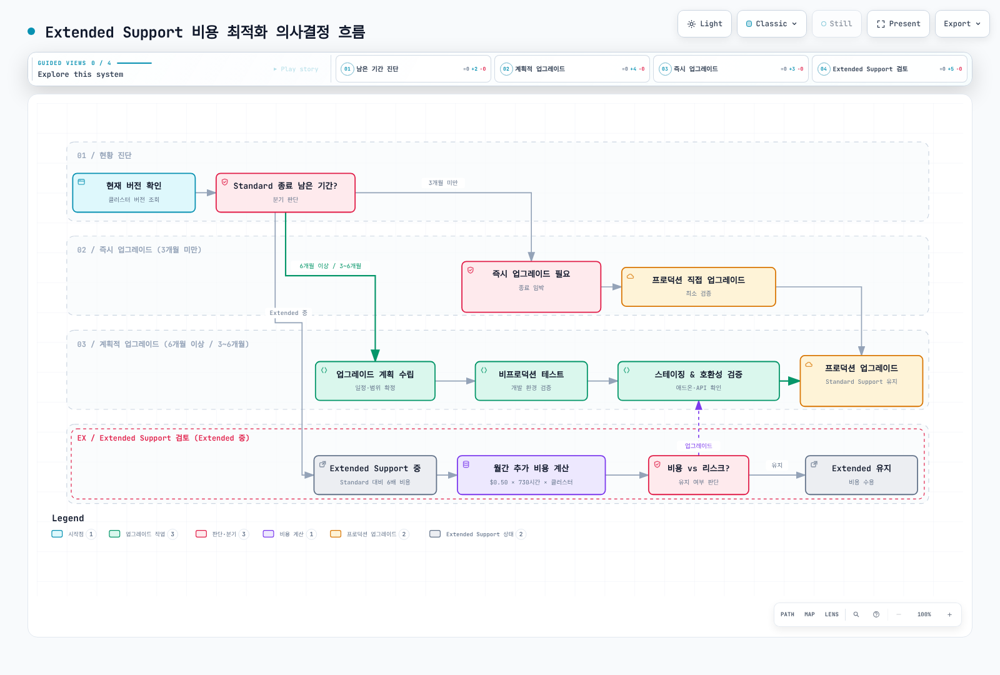

[🔍 인터랙티브 다이어그램 보기](https://www.atomai.click/kubernetes-docs/archmaps/ko-eks-12-kubernetes-version-roadmap-16.html)

**월간 비용 계산 예시:**

```bash
# Extended Support 비용 계산
# Standard: $0.10/cluster/hour
# Extended: $0.60/cluster/hour
# 차이: $0.50/cluster/hour

# 클러스터 수별 월간 추가 비용
# 1 클러스터:  $0.50 × 730시간 = $365/월
# 5 클러스터:  $0.50 × 730시간 × 5 = $1,825/월
# 10 클러스터: $0.50 × 730시간 × 10 = $3,650/월
# 50 클러스터: $0.50 × 730시간 × 50 = $18,250/월

# 1년 Extended Support 유지 시 추가 비용
# 10 클러스터: $3,650 × 12 = $43,800/년
# 50 클러스터: $18,250 × 12 = $219,000/년
```

---

## 8. 버전 업그레이드 계획

### 8.1 업그레이드 사전 점검 체크리스트

```yaml
# 업그레이드 사전 점검 체크리스트
pre_upgrade_checklist:
  
  api_compatibility:
    - name: "Deprecated API 스캔"
      command: "pluto detect-all-in-cluster --target-versions k8s=v1.XX"
      severity: critical
    
    - name: "Helm 차트 Deprecated API 스캔"
      command: "pluto detect-helm --target-versions k8s=v1.XX"
      severity: critical
    
    - name: "CRD apiVersion 확인"
      command: "kubectl get crd -o jsonpath='{range .items[*]}{.metadata.name}: {.spec.versions[*].name}{\"\\n\"}{end}'"
      severity: high
    
    - name: "Admission Webhook 호환성"
      command: "kubectl get validatingwebhookconfigurations,mutatingwebhookconfigurations -o yaml"
      severity: high

  feature_gate_impact:
    - name: "새 버전 기본 활성화 Feature Gate 확인"
      description: "Beta에서 GA로 졸업하는 기능은 동작 변경을 유발할 수 있음"
      severity: medium
    
    - name: "제거되는 Feature Gate 확인"
      description: "GA 후 2 릴리스 지나면 Feature Gate가 코드에서 제거됨"
      severity: low

  addon_compatibility:
    - name: "매니지드 애드온 호환 버전 확인"
      command: "aws eks describe-addon-versions --kubernetes-version 1.XX"
      severity: critical
    
    - name: "자체 설치 애드온 호환성"
      items:
        - "Istio/Linkerd 서비스 메시"
        - "Prometheus/Grafana 모니터링 스택"
        - "ArgoCD/Flux GitOps"
        - "Cert-manager"
        - "External DNS"
        - "Ingress Controller (ALB/Nginx)"
      severity: critical

  workload_readiness:
    - name: "PodDisruptionBudget 설정 확인"
      command: "kubectl get pdb --all-namespaces"
      severity: high
    
    - name: "Pod Anti-Affinity 규칙 확인"
      description: "단일 노드에 모든 복제본이 배치되어 있지 않은지 확인"
      severity: medium
    
    - name: "리소스 requests/limits 설정 확인"
      description: "새 버전에서 스케줄링 동작 변경 가능"
      severity: medium

  infrastructure:
    - name: "노드 그룹 AMI 호환성"
      command: "aws ssm get-parameter --name /aws/service/eks/optimized-ami/1.XX/amazon-linux-2023/recommended/image_id"
      severity: critical
    
    - name: "클러스터 오토스케일러 / Karpenter 호환성"
      severity: high
    
    - name: "백업 및 복구 계획"
      items:
        - "etcd 스냅샷 (self-managed인 경우)"
        - "Velero 백업"
        - "GitOps 리포지토리 상태 확인"
      severity: critical
```

### 8.2 단계별 업그레이드 프로세스

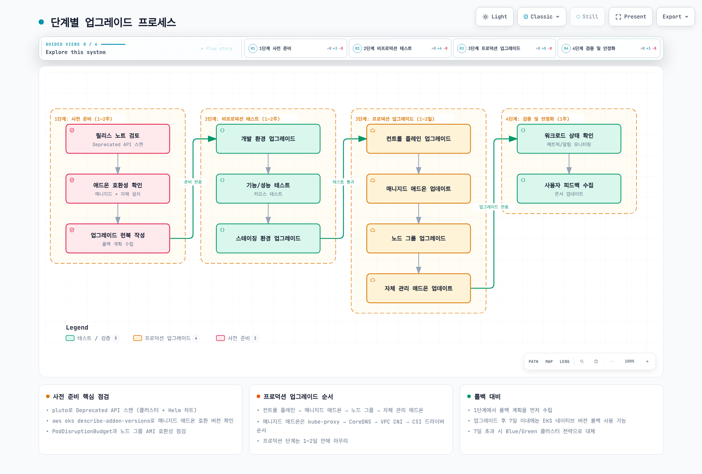

[🔍 인터랙티브 다이어그램 보기](https://www.atomai.click/kubernetes-docs/archmaps/ko-eks-12-kubernetes-version-roadmap-17.html)

### 8.3 Feature Gate 테스트 방법

새 버전에서 기본 활성화되는 Feature Gate의 영향을 사전에 테스트하는 방법입니다.

```bash
# 1. 현재 버전에서 다음 버전의 기본 활성화 기능 목록 확인
# Kubernetes 릴리스 노트의 Feature Gate 변경 사항 확인
# https://kubernetes.io/docs/reference/command-line-tools-reference/feature-gates/

# 2. kubelet Feature Gate 테스트 (self-managed 노드)
# /etc/kubernetes/kubelet-config.yaml
apiVersion: kubelet.config.k8s.io/v1beta1
kind: KubeletConfiguration
featureGates:
  InPlacePodVerticalScaling: true    # 사전 테스트할 기능
  SidecarContainers: true

# 3. 테스트 워크로드 배포 후 동작 확인
kubectl apply -f test-workloads/
kubectl get events --watch

# 4. Feature Gate 비활성화 테스트 (특정 기능 문제 시)
# kubelet-config.yaml에서 해당 Feature Gate를 false로 설정
# 주의: EKS에서 API 서버 Feature Gate는 변경 불가
```

### 8.4 API 호환성 검증 스크립트

```bash
#!/bin/bash
# api-compatibility-check.sh
# Kubernetes 업그레이드 전 API 호환성 검증 스크립트

TARGET_VERSION="${1:-1.36}"
echo "=== Kubernetes ${TARGET_VERSION} 업그레이드 API 호환성 검증 ==="

# 1. Deprecated API 스캔
echo ""
echo "--- [1/5] Deprecated API 스캔 ---"
if command -v pluto &> /dev/null; then
    pluto detect-all-in-cluster --target-versions "k8s=v${TARGET_VERSION}" -o wide
else
    echo "pluto가 설치되어 있지 않습니다. 설치: brew install FairwindsOps/tap/pluto"
fi

# 2. 클러스터 내 API 사용 현황
echo ""
echo "--- [2/5] API 사용 현황 ---"
kubectl get --raw /metrics 2>/dev/null | grep apiserver_requested_deprecated_apis | head -20

# 3. Webhook 호환성 확인
echo ""
echo "--- [3/5] Admission Webhook 확인 ---"
echo "ValidatingWebhookConfigurations:"
kubectl get validatingwebhookconfigurations -o custom-columns=NAME:.metadata.name,WEBHOOKS:.webhooks[*].name
echo ""
echo "MutatingWebhookConfigurations:"
kubectl get mutatingwebhookconfigurations -o custom-columns=NAME:.metadata.name,WEBHOOKS:.webhooks[*].name

# 4. CRD API 버전 확인
echo ""
echo "--- [4/5] CRD API 버전 ---"
kubectl get crd -o custom-columns=NAME:.metadata.name,VERSIONS:.spec.versions[*].name | head -30

# 5. 매니지드 애드온 상태
echo ""
echo "--- [5/5] 매니지드 애드온 상태 ---"
CLUSTER_NAME=$(kubectl config current-context | sed 's/.*:cluster\///')
if [ -n "$CLUSTER_NAME" ]; then
    aws eks list-addons --cluster-name "$CLUSTER_NAME" --output text | while read addon; do
        version=$(aws eks describe-addon --cluster-name "$CLUSTER_NAME" --addon-name "$addon" --query 'addon.addonVersion' --output text 2>/dev/null)
        echo "  $addon: $version"
    done
fi

echo ""
echo "=== 검증 완료 ==="
```

### 8.5 애드온 업그레이드 순서

버전 업그레이드 시 애드온의 올바른 업데이트 순서입니다.

```
┌──────────────────────────────────────────────────────────────────────┐
│                   애드온 업그레이드 순서                                │
│                                                                      │
│  ┌─── Phase 1: 컨트롤 플레인 ────────────────────────────────────┐  │
│  │ 1. EKS 컨트롤 플레인 업그레이드                                  │  │
│  │    aws eks update-cluster-version --name my-cluster              │  │
│  │    --kubernetes-version 1.36                                     │  │
│  └──────────────────────────────────────────────────────────────┘  │
│                          ↓                                          │
│  ┌─── Phase 2: 매니지드 애드온 (순서 중요) ────────────────────────┐  │
│  │ 2. kube-proxy (먼저)                                            │  │
│  │ 3. CoreDNS                                                       │  │
│  │ 4. VPC CNI                                                       │  │
│  │ 5. EBS CSI Driver                                                │  │
│  │ 6. 기타 CSI 드라이버 (EFS, S3)                                   │  │
│  └──────────────────────────────────────────────────────────────┘  │
│                          ↓                                          │
│  ┌─── Phase 3: 노드 그룹 ──────────────────────────────────────┐  │
│  │ 7. Managed Node Group 업그레이드                                │  │
│  │    또는 새 노드 그룹 생성 후 마이그레이션                          │  │
│  └──────────────────────────────────────────────────────────────┘  │
│                          ↓                                          │
│  ┌─── Phase 4: 자체 관리 애드온 ────────────────────────────────┐  │
│  │ 8. Ingress Controller                                            │  │
│  │ 9. Service Mesh (Istio/Linkerd)                                  │  │
│  │ 10. GitOps (ArgoCD/Flux)                                         │  │
│  │ 11. Monitoring (Prometheus/Grafana)                               │  │
│  │ 12. 기타 (cert-manager, external-dns 등)                         │  │
│  └──────────────────────────────────────────────────────────────┘  │
│                          ↓                                          │
│  ┌─── Phase 5: 검증 ───────────────────────────────────────────┐  │
│  │ 13. 워크로드 상태 확인                                          │  │
│  │ 14. 네트워킹 연결성 테스트                                       │  │
│  │ 15. 모니터링 대시보드 확인                                       │  │
│  └──────────────────────────────────────────────────────────────┘  │
└──────────────────────────────────────────────────────────────────────┘
```

### 8.6 롤백 전략

> **2026-07-01 업데이트**: Amazon EKS가 Kubernetes 버전 롤백 기능을 발표했습니다. 업그레이드 후 7일 이내라면 컨트롤 플레인을 이전 마이너 버전으로 롤백할 수 있으며, 롤백 전 API 호환성·version skew·애드온 호환성·클러스터 상태를 점검하는 Rollback Readiness 검사가 자동으로 수행됩니다. EKS Auto Mode는 워커 노드 자동 롤백과 컨트롤 플레인 순차 복원을 포함한 완전 자동 롤백을 지원하며, 추가 비용 없이 모든 리전에서 사용할 수 있습니다. 아래 전략은 7일이 지났거나 이 기능을 사용할 수 없는 경우의 대안입니다. (출처: [Amazon EKS 버전 롤백 발표](https://aws.amazon.com/about-aws/whats-new/2026/07/amazon-eks-version-rollback))

```yaml
# 업그레이드 롤백 전략
rollback_strategy:
  
  control_plane:
    note: "7일 이내: EKS 네이티브 버전 롤백 / 7일 초과: Blue-Green 클러스터 전략"
    mitigation:
      - "EKS 버전 롤백 기능으로 이전 마이너 버전으로 즉시 복원 (7일 이내, 추가 비용 없음)"
      - "7일 초과 시 업그레이드 전 Blue/Green 클러스터 전략 사용"
      - "Route 53 가중치 기반 라우팅으로 트래픽 전환"
      - "새 클러스터로 워크로드 마이그레이션"
    
  node_groups:
    strategy: "새 노드 그룹 생성 + 이전 노드 그룹 유지"
    steps:
      - "이전 버전 노드 그룹을 즉시 삭제하지 않음"
      - "문제 발생 시 이전 노드 그룹에 taint 제거"
      - "새 노드 그룹에 taint 추가하여 트래픽 전환"
    
  workloads:
    strategy: "GitOps 기반 롤백"
    steps:
      - "ArgoCD/Flux에서 이전 커밋으로 롤백"
      - "Helm rollback 실행"
    
  addons:
    strategy: "이전 버전으로 다운그레이드"
    command: |
      aws eks update-addon \
        --cluster-name my-cluster \
        --addon-name vpc-cni \
        --addon-version <previous-version> \
        --resolve-conflicts OVERWRITE
```

### 8.7 업그레이드 자동화 (Terraform 예시)

```hcl
# EKS 클러스터 버전 업그레이드 (Terraform)
resource "aws_eks_cluster" "main" {
  name     = "production-cluster"
  version  = "1.36"    # 대상 버전
  role_arn = aws_iam_role.cluster.arn

  vpc_config {
    subnet_ids = var.subnet_ids
  }

  # 업그레이드 정책
  upgrade_policy {
    support_type = "STANDARD"    # 또는 "EXTENDED"
  }
}

# 매니지드 노드 그룹 (버전 자동 추적)
resource "aws_eks_node_group" "main" {
  cluster_name    = aws_eks_cluster.main.name
  node_group_name = "main-ng"
  version         = aws_eks_cluster.main.version    # 클러스터 버전 추적

  scaling_config {
    desired_size = 3
    max_size     = 10
    min_size     = 2
  }

  update_config {
    max_unavailable_percentage = 33    # 한 번에 33%까지만 업데이트
  }
}

# 매니지드 애드온 (버전 호환성 관리)
resource "aws_eks_addon" "vpc_cni" {
  cluster_name                = aws_eks_cluster.main.name
  addon_name                  = "vpc-cni"
  addon_version               = "v1.21.0-eksbuild.1"
  resolve_conflicts_on_update = "OVERWRITE"
  
  # 클러스터 업그레이드 후 애드온 업데이트
  depends_on = [aws_eks_cluster.main]
}

resource "aws_eks_addon" "kube_proxy" {
  cluster_name                = aws_eks_cluster.main.name
  addon_name                  = "kube-proxy"
  addon_version               = "v1.36.0-eksbuild.1"
  resolve_conflicts_on_update = "OVERWRITE"
  depends_on                  = [aws_eks_cluster.main]
}

resource "aws_eks_addon" "coredns" {
  cluster_name                = aws_eks_cluster.main.name
  addon_name                  = "coredns"
  addon_version               = "v1.13.0-eksbuild.1"
  resolve_conflicts_on_update = "OVERWRITE"
  depends_on                  = [aws_eks_cluster.main]
}
```

---

## 9. 향후 전망

### 9.1 개발 중인 주요 기능

다음은 현재 개발 중이거나 초기 단계에 있는 기능들로, 향후 릴리스에서 등장할 것으로 예상됩니다.

| 기능 | 현재 상태 | 예상 영향 | 대상 SIG |
|------|----------|----------|----------|
| **Gang Scheduling** | Beta (1.36) | AI/ML 분산 학습의 효율성 대폭 향상 | SIG Scheduling |
| **Pod-level Resources GA** | Beta (1.36) | Sidecar 패턴의 리소스 효율성 향상 | SIG Node |
| **KYAML GA** | Beta (1.35) | YAML 처리 통일 및 보안 강화 | SIG API Machinery |
| **In-Place Resize for DaemonSet** | 논의 중 | DaemonSet 업데이트 시 재시작 감소 | SIG Apps |
| **Multi-Cluster Services** | Alpha | 클러스터 간 서비스 디스커버리 표준화 | SIG Multicluster |
| **Gateway API 1.2+** | GA (별도 CRD) | Ingress를 대체하는 차세대 API | SIG Network |
| **Device Taints/Tolerations** | Alpha (1.35) | DRA 디바이스의 상태 기반 스케줄링 | SIG Node |
| **Mutable Pod Scheduling Directives** | 논의 중 | Pod의 nodeSelector/affinity 동적 변경 | SIG Scheduling |

### 9.2 CNCF 생태계 트렌드

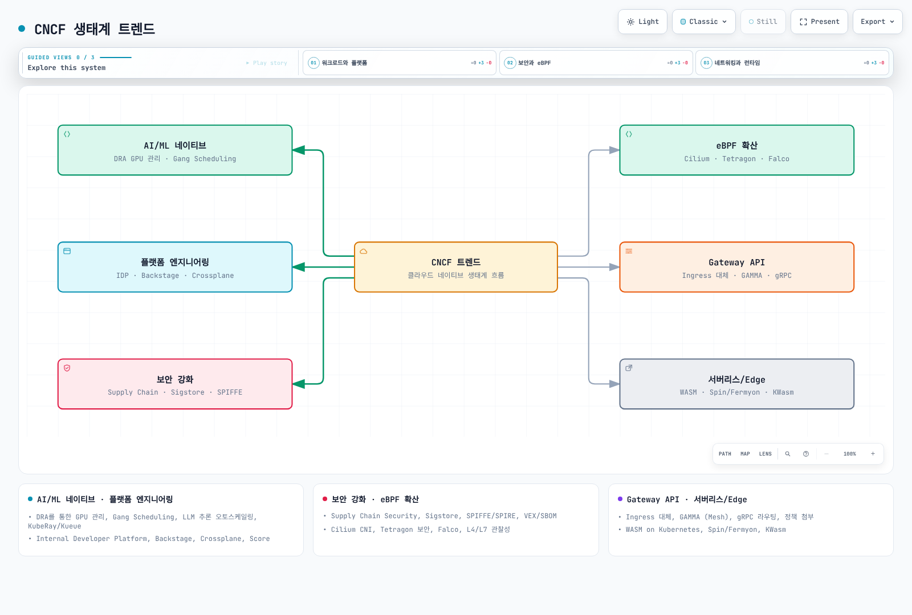

[🔍 인터랙티브 다이어그램 보기](https://www.atomai.click/kubernetes-docs/archmaps/ko-eks-12-kubernetes-version-roadmap-18.html)

### 9.3 AI/ML 워크로드를 위한 Kubernetes 진화 방향

AI/ML 워크로드가 Kubernetes의 핵심 사용 사례로 부상하면서, 관련 기능 개발이 가속화되고 있습니다.

```
┌──────────────────────────────────────────────────────────────────────┐
│              AI/ML을 위한 Kubernetes 진화 로드맵                       │
├──────────────────────────────────────────────────────────────────────┤
│                                                                      │
│  2024-2025: 기반 구축                                                │
│  ├─ DRA Core APIs GA (1.34): GPU 할당 표준화                         │
│  ├─ Gang Scheduling Alpha/Beta (1.35-1.36): 분산 학습 지원            │
│  └─ In-Place Pod Resize GA (1.35): 추론 서버 동적 스케일링            │
│                                                                      │
│  2026: 성숙 단계                                                      │
│  ├─ Gang Scheduling GA (예상 1.37)                                   │
│  ├─ Device Taints GA: GPU 장애 자동 감지 및 회피                      │
│  ├─ Multi-NIC 지원 강화: RDMA/InfiniBand 네이티브 지원               │
│  └─ Topology-Aware Scheduling 고도화: GPU-GPU 토폴로지 최적화         │
│                                                                      │
│  2027+: 전망                                                          │
│  ├─ ML-Aware Scheduler: 학습/추론 워크로드 전용 스케줄러               │
│  ├─ Federated Training: 멀티 클러스터 분산 학습                        │
│  └─ LLM-Native Autoscaling: 토큰/요청 기반 자동 스케일링              │
│                                                                      │
└──────────────────────────────────────────────────────────────────────┘
```

### 9.4 업그레이드 로드맵 계획 템플릿

현재 운영 중인 클러스터의 업그레이드 계획을 수립하기 위한 템플릿입니다.

```yaml
# 업그레이드 로드맵 계획 템플릿
upgrade_roadmap:
  current_state:
    cluster_version: "1.33"
    node_count: 50
    workload_count: 200
    critical_addons:
      - name: "istio"
        version: "1.22"
      - name: "argocd"
        version: "2.11"
      - name: "prometheus-stack"
        version: "60.0"
  
  target_version: "1.36"
  upgrade_path: "1.33 → 1.34 → 1.35 → 1.36"
  # 주의: 건너뛰기 업그레이드(skip version)는 지원되지 않음
  
  phase_1:  # 1.33 → 1.34
    target: "1.34"
    timeline: "2025년 11월"
    key_changes:
      - "DRA Core APIs GA 활용 시작"
      - "VolumeAttributesClass GA 활용"
      - "nftables kube-proxy 기본 전환"
    risks:
      - "iptables → nftables 전환 시 네트워크 정책 검증 필요"
      - "DRA 관련 CRD 설치/업데이트 필요"
    
  phase_2:  # 1.34 → 1.35
    target: "1.35"
    timeline: "2026년 3월"
    key_changes:
      - "In-Place Pod Resize GA 활용"
      - "VPA In-Place 모드 도입"
      - "KYAML Beta 영향 검증"
    risks:
      - "KYAML로 인한 매니페스트 파싱 변경 확인"
      - "In-Place Resize가 기존 리소스 관리와 충돌하지 않는지 확인"
    
  phase_3:  # 1.35 → 1.36
    target: "1.36"
    timeline: "2026년 7월"
    key_changes:
      - "Pod-level Resources Beta 테스트"
      - "Gang Scheduling Beta 활용"
    risks:
      - "Pod-level Resources와 기존 LimitRange/ResourceQuota 상호작용 검증"
```

---

## 10. 참고 자료

### 공식 문서

| 자료 | URL | 설명 |
|------|-----|------|
| Kubernetes 릴리스 | https://kubernetes.io/releases/ | 릴리스 일정 및 이력 |
| 변경 로그 | https://github.com/kubernetes/kubernetes/blob/master/CHANGELOG/ | 상세 변경 로그 |
| Feature Gates | https://kubernetes.io/docs/reference/command-line-tools-reference/feature-gates/ | Feature Gate 전체 목록 |
| API Deprecation 정책 | https://kubernetes.io/docs/reference/using-api/deprecation-policy/ | Deprecation 규칙 |
| KEP 목록 | https://github.com/kubernetes/enhancements/tree/master/keps | Enhancement 제안 |

### Amazon EKS 문서

| 자료 | URL | 설명 |
|------|-----|------|
| EKS 버전 정책 | https://docs.aws.amazon.com/eks/latest/userguide/kubernetes-versions.html | EKS 지원 버전 |
| EKS 릴리스 노트 | https://docs.aws.amazon.com/eks/latest/userguide/kubernetes-versions-release-notes.html | 버전별 릴리스 노트 |
| EKS 업그레이드 | https://docs.aws.amazon.com/eks/latest/userguide/update-cluster.html | 업그레이드 가이드 |
| Extended Support | https://docs.aws.amazon.com/eks/latest/userguide/extended-support.html | Extended Support 상세 |
| 매니지드 애드온 | https://docs.aws.amazon.com/eks/latest/userguide/eks-add-ons.html | 애드온 관리 |

### 커뮤니티 도구

| 도구 | URL | 용도 |
|------|-----|------|
| pluto | https://github.com/FairwindsOps/pluto | Deprecated API 스캐너 |
| kubent | https://github.com/doitintl/kube-no-trouble | Deprecated API 탐지 |
| kube-score | https://github.com/zegl/kube-score | 매니페스트 품질 검사 |
| nova | https://github.com/FairwindsOps/nova | Helm 차트 업데이트 감지 |
| kubectl-convert | https://kubernetes.io/docs/tasks/tools/install-kubectl/ | API 버전 변환 |

### 버전별 블로그 포스트

| 버전 | 공식 블로그 |
|------|-----------|
| 1.29 | https://kubernetes.io/blog/2023/12/13/kubernetes-v1-29-release/ |
| 1.30 | https://kubernetes.io/blog/2024/04/17/kubernetes-v1-30-release/ |
| 1.31 | https://kubernetes.io/blog/2024/08/13/kubernetes-v1-31-release/ |
| 1.32 | https://kubernetes.io/blog/2024/12/11/kubernetes-v1-32-release/ |
| 1.33 | https://kubernetes.io/blog/2025/04/23/kubernetes-v1-33-release/ |
| 1.34 | https://kubernetes.io/blog/2025/08/kubernetes-v1-34-release/ |
| 1.35 | https://kubernetes.io/blog/2025/12/kubernetes-v1-35-release/ |
| 1.36 | https://kubernetes.io/blog/2026/04/kubernetes-v1-36-release/ |

---

## 다음 단계

- [EKS 업그레이드](08-eks-upgrades.md): EKS 클러스터 업그레이드 실전 가이드
- [EKS 문제 해결](09-eks-troubleshooting.md): 업그레이드 중 발생하는 문제 해결
- [EKS 고급 디버깅](11-eks-advanced-debugging.md): 업그레이드 후 디버깅 기법
- [EKS 비용 최적화](07-eks-cost-optimization.md): Extended Support 비용 관리 전략
