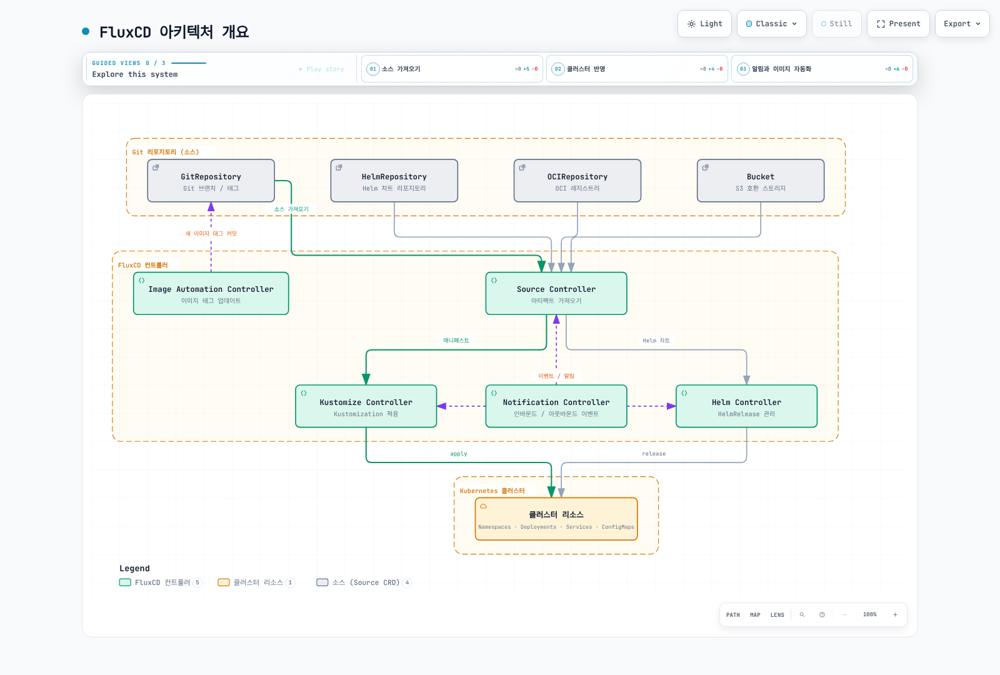

# FluxCD

> **지원 버전**: FluxCD v2.2+
> **마지막 업데이트**: 2026년 2월 22일

FluxCD는 Kubernetes를 위한 개방적이고 확장 가능한 지속적 배포 및 점진적 배포 솔루션 세트입니다. FluxCD는 2022년 11월에 CNCF를 졸업하여 클라우드 네이티브 생태계에서 가장 성숙한 GitOps 도구 중 하나가 되었습니다.

## 소개

FluxCD는 Git 리포지토리를 Kubernetes 클러스터의 원하는 상태를 정의하는 신뢰할 수 있는 소스로 사용하여 GitOps 원칙을 구현합니다. 클러스터의 상태가 Git의 구성과 일치하도록 자동으로 보장합니다.

### 주요 기능

- **GitOps 네이티브**: GitOps 워크플로우를 위해 처음부터 구축됨
- **멀티 테넌시**: 격리된 구성으로 여러 팀 지원
- **멀티 클러스터**: 단일 Git 리포지토리에서 여러 클러스터 관리
- **확장성**: 전문화된 컨트롤러를 갖춘 모듈식 아키텍처
- **Kubernetes 네이티브**: 구성에 Custom Resource Definitions (CRDs) 사용

## 아키텍처 개요

FluxCD는 GitOps 워크플로우를 구현하기 위해 함께 작동하는 전문화된 컨트롤러 세트로 구성됩니다:



[🔍 인터랙티브 다이어그램 보기](https://www.atomai.click/kubernetes-docs/archmaps/ko-gitops-02-fluxcd-0.html)

## 핵심 컴포넌트

### Source Controller

Source Controller는 외부 소스에서 아티팩트를 가져오는 역할을 합니다. 여러 소스 유형을 지원합니다:

#### GitRepository

Git 리포지토리를 추적하고 다른 컨트롤러에서 사용할 수 있도록 합니다:

```yaml
apiVersion: source.toolkit.fluxcd.io/v1
kind: GitRepository
metadata:
  name: my-app
  namespace: flux-system
spec:
  interval: 1m
  url: https://github.com/my-org/my-app
  ref:
    branch: main
  secretRef:
    name: git-credentials
```

#### HelmRepository

Helm 차트 리포지토리를 추적합니다:

```yaml
apiVersion: source.toolkit.fluxcd.io/v1
kind: HelmRepository
metadata:
  name: bitnami
  namespace: flux-system
spec:
  interval: 1h
  url: https://charts.bitnami.com/bitnami
```

#### OCIRepository

OCI 호환 레지스트리(컨테이너 레지스트리 포함)에 저장된 아티팩트를 추적합니다:

```yaml
apiVersion: source.toolkit.fluxcd.io/v1beta2
kind: OCIRepository
metadata:
  name: my-artifacts
  namespace: flux-system
spec:
  interval: 5m
  url: oci://ghcr.io/my-org/my-artifacts
  ref:
    tag: latest
```

#### Bucket

S3 호환 스토리지에 저장된 아티팩트를 추적합니다:

```yaml
apiVersion: source.toolkit.fluxcd.io/v1beta2
kind: Bucket
metadata:
  name: my-bucket
  namespace: flux-system
spec:
  interval: 5m
  provider: aws
  bucketName: my-flux-bucket
  endpoint: s3.amazonaws.com
  region: us-east-1
  secretRef:
    name: aws-credentials
```

### Kustomize Controller

Kustomize Controller는 소스에서 Kustomize 오버레이와 일반 Kubernetes 매니페스트를 적용합니다.

#### Kustomization CRD

```yaml
apiVersion: kustomize.toolkit.fluxcd.io/v1
kind: Kustomization
metadata:
  name: my-app
  namespace: flux-system
spec:
  interval: 10m
  targetNamespace: production
  sourceRef:
    kind: GitRepository
    name: my-app
  path: ./deploy/production
  prune: true
  healthChecks:
    - apiVersion: apps/v1
      kind: Deployment
      name: my-app
      namespace: production
  timeout: 2m
```

#### 변수 치환

FluxCD는 `postBuild`를 사용한 변수 치환을 지원합니다:

```yaml
apiVersion: kustomize.toolkit.fluxcd.io/v1
kind: Kustomization
metadata:
  name: my-app
  namespace: flux-system
spec:
  interval: 10m
  sourceRef:
    kind: GitRepository
    name: my-app
  path: ./deploy
  postBuild:
    substitute:
      ENVIRONMENT: production
      REPLICAS: "3"
    substituteFrom:
      - kind: ConfigMap
        name: cluster-config
      - kind: Secret
        name: cluster-secrets
```

#### 헬스 체크

배포된 리소스에 대한 커스텀 헬스 체크를 정의합니다:

```yaml
spec:
  healthChecks:
    - apiVersion: apps/v1
      kind: Deployment
      name: frontend
      namespace: production
    - apiVersion: apps/v1
      kind: StatefulSet
      name: database
      namespace: production
  timeout: 5m
```

### Helm Controller

Helm Controller는 Helm 차트 릴리스를 선언적으로 관리합니다.

#### HelmRelease CRD

```yaml
apiVersion: helm.toolkit.fluxcd.io/v2
kind: HelmRelease
metadata:
  name: nginx
  namespace: flux-system
spec:
  interval: 5m
  chart:
    spec:
      chart: nginx
      version: ">=15.0.0"
      sourceRef:
        kind: HelmRepository
        name: bitnami
        namespace: flux-system
  targetNamespace: web
  install:
    createNamespace: true
    remediation:
      retries: 3
  upgrade:
    remediation:
      retries: 3
  values:
    replicaCount: 2
    service:
      type: LoadBalancer
```

#### Values 오버라이드

여러 소스에서 Helm values를 오버라이드합니다:

```yaml
spec:
  valuesFrom:
    - kind: ConfigMap
      name: nginx-values
      valuesKey: values.yaml
    - kind: Secret
      name: nginx-secrets
      valuesKey: credentials.yaml
  values:
    replicaCount: 3
```

#### 드리프트 감지

배포된 리소스가 원하는 상태와 일치하는지 확인하기 위해 드리프트 감지를 활성화합니다:

```yaml
spec:
  driftDetection:
    mode: enabled
    ignore:
      - paths: ["/spec/replicas"]
        target:
          kind: Deployment
```

### Notification Controller

Notification Controller는 인바운드 및 아웃바운드 이벤트를 처리합니다.

#### Providers

알림을 위한 프로바이더를 구성합니다:

```yaml
apiVersion: notification.toolkit.fluxcd.io/v1beta3
kind: Provider
metadata:
  name: slack
  namespace: flux-system
spec:
  type: slack
  channel: flux-alerts
  secretRef:
    name: slack-webhook
```

지원되는 프로바이더:
- Slack
- Microsoft Teams
- Discord
- PagerDuty
- Opsgenie
- GitHub
- GitLab
- Grafana
- 일반 웹훅

#### Alerts

FluxCD 이벤트에 대한 알림을 정의합니다:

```yaml
apiVersion: notification.toolkit.fluxcd.io/v1beta3
kind: Alert
metadata:
  name: on-call
  namespace: flux-system
spec:
  summary: "클러스터 알림"
  providerRef:
    name: slack
  eventSeverity: error
  eventSources:
    - kind: GitRepository
      name: '*'
    - kind: Kustomization
      name: '*'
    - kind: HelmRelease
      name: '*'
```

#### Receivers (웹훅)

외부 이벤트를 위한 웹훅을 구성합니다:

```yaml
apiVersion: notification.toolkit.fluxcd.io/v1
kind: Receiver
metadata:
  name: github-receiver
  namespace: flux-system
spec:
  type: github
  events:
    - ping
    - push
  secretRef:
    name: github-webhook-token
  resources:
    - kind: GitRepository
      name: my-app
```

### Image Automation

FluxCD는 Git 리포지토리의 컨테이너 이미지 태그를 자동으로 업데이트할 수 있습니다.

#### ImageRepository

컨테이너 레지스트리에서 새 태그를 스캔합니다:

```yaml
apiVersion: image.toolkit.fluxcd.io/v1beta2
kind: ImageRepository
metadata:
  name: my-app
  namespace: flux-system
spec:
  image: ghcr.io/my-org/my-app
  interval: 1m
  secretRef:
    name: registry-credentials
```

#### ImagePolicy

이미지 태그 선택을 위한 정책을 정의합니다:

```yaml
apiVersion: image.toolkit.fluxcd.io/v1beta2
kind: ImagePolicy
metadata:
  name: my-app
  namespace: flux-system
spec:
  imageRepositoryRef:
    name: my-app
  policy:
    semver:
      range: ">=1.0.0"
```

#### ImageUpdateAutomation

새 이미지가 감지되면 Git 커밋을 자동화합니다:

```yaml
apiVersion: image.toolkit.fluxcd.io/v1beta2
kind: ImageUpdateAutomation
metadata:
  name: my-app
  namespace: flux-system
spec:
  interval: 30m
  sourceRef:
    kind: GitRepository
    name: my-app
  git:
    checkout:
      ref:
        branch: main
    commit:
      author:
        email: flux@my-org.com
        name: Flux
      messageTemplate: |
        자동 이미지 업데이트

        Automation: {{ .AutomationObject }}

        파일:
        {{ range $filename, $_ := .Changed.FileChanges -}}
        - {{ $filename }}
        {{ end -}}

        오브젝트:
        {{ range $resource, $changes := .Changed.Objects -}}
        - {{ $resource.Kind }} {{ $resource.Name }}
          {{- range $_, $change := $changes }}
          {{ $change.OldValue }} -> {{ $change.NewValue }}
          {{- end }}
        {{ end -}}
    push:
      branch: main
  update:
    path: ./deploy
    strategy: Setters
```

## 설치

### Flux CLI 사용

Flux CLI를 설치합니다:

```bash
# macOS
brew install fluxcd/tap/flux

# Linux
curl -s https://fluxcd.io/install.sh | sudo bash

# Windows (Chocolatey)
choco install flux
```

### 부트스트랩

클러스터에 FluxCD를 부트스트랩합니다:

```bash
# GitHub로 부트스트랩
flux bootstrap github \
  --owner=my-org \
  --repository=fleet-infra \
  --branch=main \
  --path=clusters/production \
  --personal

# GitLab으로 부트스트랩
flux bootstrap gitlab \
  --owner=my-org \
  --repository=fleet-infra \
  --branch=main \
  --path=clusters/production
```

### 설치 확인

```bash
# Flux 컴포넌트 확인
flux check

# 모든 Flux 리소스 가져오기
flux get all

# 변경 사항 감시
flux get kustomizations --watch
```

## Flux로 멀티 클러스터 관리

FluxCD는 단일 리포지토리에서 여러 클러스터를 관리하는 것을 지원합니다.

### Fleet 리포지토리 구조

```
fleet-infra/
├── clusters/
│   ├── production/
│   │   ├── flux-system/
│   │   │   └── gotk-sync.yaml
│   │   └── apps.yaml
│   ├── staging/
│   │   ├── flux-system/
│   │   │   └── gotk-sync.yaml
│   │   └── apps.yaml
│   └── development/
│       ├── flux-system/
│       │   └── gotk-sync.yaml
│       └── apps.yaml
├── infrastructure/
│   ├── base/
│   │   ├── cert-manager/
│   │   ├── ingress-nginx/
│   │   └── monitoring/
│   └── overlays/
│       ├── production/
│       └── staging/
└── apps/
    ├── base/
    │   ├── frontend/
    │   └── backend/
    └── overlays/
        ├── production/
        └── staging/
```

### 클러스터 간 의존성

```yaml
apiVersion: kustomize.toolkit.fluxcd.io/v1
kind: Kustomization
metadata:
  name: infrastructure
  namespace: flux-system
spec:
  interval: 1h
  sourceRef:
    kind: GitRepository
    name: fleet-infra
  path: ./infrastructure/overlays/production
  prune: true
---
apiVersion: kustomize.toolkit.fluxcd.io/v1
kind: Kustomization
metadata:
  name: apps
  namespace: flux-system
spec:
  dependsOn:
    - name: infrastructure
  interval: 10m
  sourceRef:
    kind: GitRepository
    name: fleet-infra
  path: ./apps/overlays/production
  prune: true
```

## Amazon EKS에서 FluxCD

### IRSA 통합

FluxCD를 위한 IAM Roles for Service Accounts (IRSA) 구성:

```yaml
apiVersion: v1
kind: ServiceAccount
metadata:
  name: source-controller
  namespace: flux-system
  annotations:
    eks.amazonaws.com/role-arn: arn:aws:iam::ACCOUNT_ID:role/flux-source-controller
```

ECR 접근을 위한 IAM 정책:

```json
{
  "Version": "2012-10-17",
  "Statement": [
    {
      "Effect": "Allow",
      "Action": [
        "ecr:GetAuthorizationToken",
        "ecr:BatchCheckLayerAvailability",
        "ecr:GetDownloadUrlForLayer",
        "ecr:BatchGetImage"
      ],
      "Resource": "*"
    }
  ]
}
```

### ECR 통합

Amazon ECR에서 이미지를 가져오도록 FluxCD 구성:

```yaml
apiVersion: source.toolkit.fluxcd.io/v1beta2
kind: OCIRepository
metadata:
  name: my-app
  namespace: flux-system
spec:
  interval: 5m
  url: oci://ACCOUNT_ID.dkr.ecr.us-east-1.amazonaws.com/my-app
  ref:
    tag: latest
  provider: aws
```

### S3 버킷 소스

S3를 아티팩트 소스로 사용:

```yaml
apiVersion: source.toolkit.fluxcd.io/v1beta2
kind: Bucket
metadata:
  name: artifacts
  namespace: flux-system
spec:
  interval: 5m
  provider: aws
  bucketName: my-flux-artifacts
  endpoint: s3.us-east-1.amazonaws.com
  region: us-east-1
```

### CodeCommit 통합

AWS CodeCommit으로 FluxCD 부트스트랩:

```bash
flux bootstrap git \
  --url=ssh://git-codecommit.us-east-1.amazonaws.com/v1/repos/fleet-infra \
  --branch=main \
  --path=clusters/production \
  --ssh-key-algorithm=rsa \
  --ssh-rsa-bits=4096
```

## 모범 사례

### 리포지토리 구조

- 소규모 팀에는 모노레포 사용
- 대규모 조직에서는 인프라와 애플리케이션을 위한 별도 리포지토리 사용
- Kustomize로 환경별 오버레이 구현

### 보안

- sealed secrets 또는 외부 secret 연산자 사용
- 멀티 테넌트 시나리오에서 RBAC 구현
- receivers에 대한 웹훅 검증 활성화

### 모니터링

- 재조정 실패에 대한 알림 구성
- Prometheus로 메트릭 내보내기
- Flux 컴포넌트를 위한 대시보드 설정

### 성능

- 변경 빈도에 따라 재조정 간격 조정
- Helm 리포지토리에 캐싱 사용
- 적절한 타임아웃으로 헬스 체크 구현

## 퀴즈

이 장에서 배운 내용을 테스트하려면 [FluxCD 퀴즈](../quizzes/gitops/02-fluxcd-quiz.md)를 풀어보세요.
