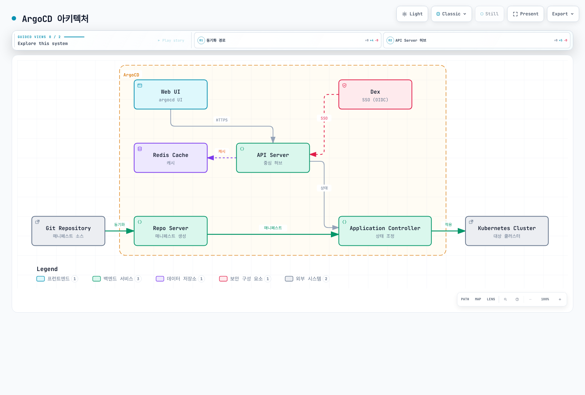
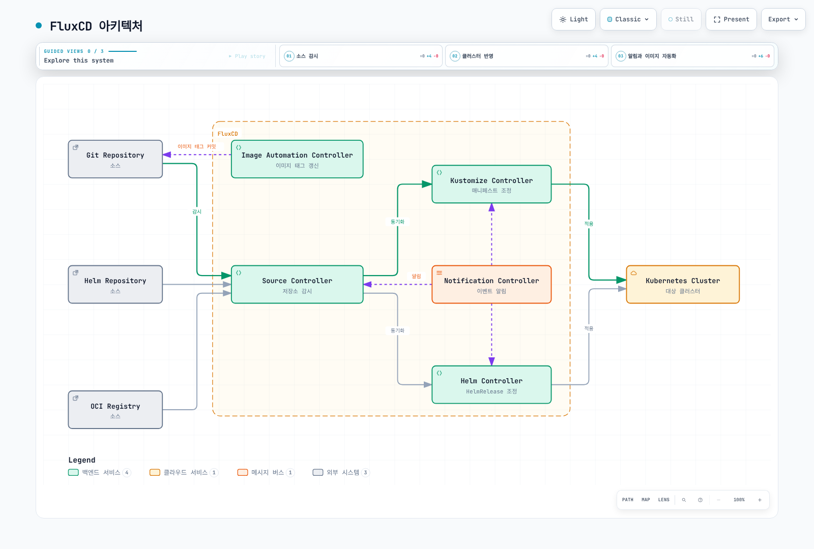

# GitOps 도구 비교

> **마지막 업데이트**: 2026년 2월 22일

이 가이드는 Kubernetes 생태계에서 가장 인기 있는 두 가지 선택인 ArgoCD와 FluxCD를 중심으로 GitOps 도구에 대한 포괄적인 비교를 제공합니다.

## 개요

GitOps는 애플리케이션 개발에 사용되는 DevOps 모범 사례를 인프라 자동화에 적용하는 운영 프레임워크입니다. CNCF 생태계에서 두 가지 주요 GitOps 도구는 다음과 같습니다:

- **ArgoCD**: Kubernetes를 위한 선언적 GitOps 지속적 배포 도구
- **FluxCD**: Kubernetes를 위한 지속적 배포 및 점진적 배포 솔루션 세트

둘 다 CNCF 졸업 프로젝트로, 성숙도와 광범위한 채택을 나타냅니다.

## ArgoCD vs FluxCD: 상세 비교

### 철학과 설계

| 측면 | ArgoCD | FluxCD |
|------|--------|--------|
| **아키텍처** | UI가 포함된 모놀리식 애플리케이션 | 컨트롤러의 모듈식 툴킷 |
| **구성** | 애플리케이션 중심 CRDs | 소스 중심 CRDs |
| **사용자 인터페이스** | 풍부한 Web UI 포함 | CLI 우선, 내장 UI 없음 |
| **학습 곡선** | 초보자에게 더 완만함 | 더 가파르지만 유연함 |
| **배포 모델** | 풀 기반 GitOps | 풀 기반 GitOps |

### 기능 비교

| 기능 | ArgoCD | FluxCD |
|------|--------|--------|
| **Web UI** | 내장, 기능 풍부 | 미포함 (Weave GitOps 사용) |
| **CLI** | `argocd` CLI | `flux` CLI |
| **멀티 테넌시** | RBAC가 있는 Projects | 네임스페이스 격리 |
| **멀티 클러스터** | 네이티브 지원 | 네이티브 지원 |
| **Helm 지원** | 완전 지원 | Helm Controller를 통한 완전 지원 |
| **Kustomize 지원** | 완전 지원 | Kustomize Controller를 통한 완전 지원 |
| **OCI 지원** | Helm 차트만 | 전체 OCI 아티팩트 지원 |
| **알림** | 내장 알림 시스템 | Notification Controller |
| **RBAC** | 포괄적인 RBAC | Kubernetes 네이티브 RBAC |
| **SSO 통합** | OIDC, SAML, LDAP | Kubernetes 인증 |
| **헬스 체크** | 내장 리소스 헬스 | 커스텀 헬스 체크 |
| **점진적 배포** | Argo Rollouts를 통해 | Flagger를 통해 |
| **이미지 자동화** | Argo Image Updater를 통해 | 내장 Image Automation |
| **Diff 미리보기** | UI에서 시각적 diff | CLI diff |
| **Sync Waves** | 네이티브 지원 | 의존성을 통해 |
| **Hooks** | PreSync, Sync, PostSync | 네이티브 아님 (Jobs 사용) |

### 아키텍처 비교

#### ArgoCD 아키텍처



[🔍 인터랙티브 다이어그램 보기](https://www.atomai.click/kubernetes-docs/archmaps/ko-gitops-03-gitops-comparison-0.html)

#### FluxCD 아키텍처



[🔍 인터랙티브 다이어그램 보기](https://www.atomai.click/kubernetes-docs/archmaps/ko-gitops-03-gitops-comparison-1.html)

### 커뮤니티와 생태계

| 지표 | ArgoCD | FluxCD |
|------|--------|--------|
| **GitHub Stars** | ~17,000+ | ~6,500+ |
| **CNCF 상태** | 졸업 (2022년 12월) | 졸업 (2022년 11월) |
| **첫 릴리스** | 2018 | 2016 (v1), 2020 (v2) |
| **주요 메인테이너** | Intuit, Red Hat | Weaveworks, CNCF |
| **생태계 도구** | Argo Workflows, Rollouts, Events | Flagger, Weave GitOps |

## ArgoCD를 선택해야 할 때

ArgoCD는 다음이 필요할 때 이상적입니다:

### 사용 사례

1. **시각적 관리**: 배포 관리를 위한 그래픽 인터페이스를 선호하는 팀
2. **중앙 집중식 제어**: 여러 클러스터를 위한 단일 관리 창을 원하는 조직
3. **포괄적인 RBAC**: 팀 전체에 걸친 복잡한 접근 제어 요구 사항
4. **SSO 통합**: OIDC/SAML 인증이 필요한 엔터프라이즈 환경
5. **Sync Waves와 Hooks**: 순서 요구 사항이 있는 복잡한 배포 오케스트레이션

### 장점

- **풍부한 Web UI**: 배포 관리를 위한 직관적인 시각적 인터페이스
- **애플리케이션 중심**: 개발자가 배포에 대해 생각하는 방식에 자연스럽게 매핑
- **성숙한 생태계**: Argo Workflows, Rollouts, Events와의 긴밀한 통합
- **엔터프라이즈 기능**: 기본 제공되는 SSO, RBAC, 감사 로깅
- **쉬운 디버깅**: UI에서 시각적 diff와 동기화 상태

### 예제 시나리오

```
시나리오: 50개 이상의 마이크로서비스를 가진 엔터프라이즈
- 여러 팀이 셀프 서비스 배포 필요
- 보안 팀이 감사 로그와 RBAC 요구
- 개발자가 동기화 상태에 대한 시각적 피드백 원함
- 기업 ID 제공자와의 SSO 통합 필요

권장: ArgoCD
- 역할 기반 접근이 있는 팀별 Projects
- 템플릿 기반 배포를 위한 Application Sets
- 개발자 셀프 서비스를 위한 Web UI
- SSO를 위한 Dex 통합
```

## FluxCD를 선택해야 할 때

FluxCD는 다음이 필요할 때 이상적입니다:

### 사용 사례

1. **모듈식 아키텍처**: 필요한 컨트롤러만 선택
2. **CLI 우선 워크플로우**: UI 의존성 없는 GitOps 네이티브 워크플로우
3. **이미지 자동화**: Git에서 자동 컨테이너 이미지 업데이트
4. **OCI 아티팩트**: OCI 레지스트리에서 저장 및 배포
5. **경량 풋프린트**: 최소한의 리소스 소비

### 장점

- **모듈식 설계**: 필요한 것만 사용
- **네이티브 이미지 자동화**: 내장 컨테이너 이미지 업데이트
- **OCI 지원**: OCI 아티팩트에 대한 일급 지원
- **Kubernetes 네이티브**: 표준 Kubernetes RBAC 사용
- **낮은 리소스 사용량**: 더 작은 메모리 및 CPU 풋프린트

### 예제 시나리오

```
시나리오: 내부 개발자 플랫폼을 구축하는 플랫폼 팀
- CI가 새 버전을 빌드할 때 자동 이미지 업데이트 필요
- 컨테이너 레지스트리에 배포 아티팩트 저장 원함
- CLI 기반 GitOps 워크플로우 선호
- 다른 구성을 가진 여러 클러스터

권장: FluxCD
- 지속적 배포를 위한 이미지 자동화
- 아티팩트 저장을 위한 OCI 리포지토리
- 환경 차이를 위한 Kustomize 오버레이
- fleet 리포지토리를 사용한 멀티 클러스터 관리
```

## 함께 사용할 수 있을까?

네, ArgoCD와 FluxCD는 상호 보완적인 패턴으로 함께 사용할 수 있습니다:

### 패턴 1: 인프라에 FluxCD, 애플리케이션에 ArgoCD

```
Git Repository
├── infrastructure/     # FluxCD가 관리
│   ├── cert-manager/
│   ├── ingress-nginx/
│   └── monitoring/
└── applications/       # ArgoCD가 관리
    ├── app-a/
    ├── app-b/
    └── app-c/
```

- FluxCD가 클러스터 인프라(연산자, 컨트롤러) 관리
- ArgoCD가 개발자 UI로 애플리케이션 배포 관리

### 패턴 2: FluxCD 이미지 자동화와 ArgoCD 배포

```
1. CI가 새 이미지 빌드 → 레지스트리에 푸시
2. FluxCD Image Automation이 새 태그 감지
3. FluxCD가 업데이트된 매니페스트를 Git에 커밋
4. ArgoCD가 변경 사항을 클러스터에 동기화
```

### 패턴 3: 다른 클러스터, 다른 도구

- 프로덕션 클러스터: ArgoCD (UI 및 감사 요구 사항용)
- 개발 클러스터: FluxCD (빠른 반복용)

## 마이그레이션 고려 사항

### FluxCD에서 ArgoCD로

1. FluxCD Kustomizations를 ArgoCD Applications로 내보내기
2. FluxCD 소스를 ArgoCD 리포지토리에 매핑
3. HelmReleases를 ArgoCD Helm Applications로 변환
4. ArgoCD에서 RBAC 및 SSO 구성

### ArgoCD에서 FluxCD로

1. ArgoCD Applications를 Kustomizations/HelmReleases로 변환
2. Git/Helm 리포지토리로 Source Controller 설정
3. 알림을 위한 Notification Controller 구성
4. 필요시 Image Automation 구현

## 기타 GitOps 도구

ArgoCD와 FluxCD가 GitOps 환경을 지배하지만, 다른 도구도 존재합니다:

### Jenkins X

- CI/CD 파이프라인 자동화에 중점
- 내장 미리보기 환경
- Tekton 기반 파이프라인
- 적합한 경우: GitOps와 통합된 CI/CD를 원하는 팀

### Rancher Fleet

- 수천 개의 클러스터 관리를 위해 설계
- 대규모 GitOps
- Rancher와 통합
- 적합한 경우: 대규모 엣지 배포

### Weave GitOps

- FluxCD를 기반으로 한 상용 제품
- Flux에 UI와 엔터프라이즈 기능 추가
- 적합한 경우: UI를 원하는 FluxCD 사용자

## 결정 매트릭스

| 요구 사항 | 최선의 선택 |
|-----------|-------------|
| Web UI 필요 | ArgoCD |
| CLI 우선 워크플로우 | FluxCD |
| 이미지 자동화 | FluxCD |
| 복잡한 RBAC | ArgoCD |
| SSO 통합 | ArgoCD |
| 최소한의 리소스 | FluxCD |
| OCI 아티팩트 | FluxCD |
| Sync waves/hooks | ArgoCD |
| 시각적 diff | ArgoCD |
| 모듈식 배포 | FluxCD |
| 엔터프라이즈 감사 | ArgoCD |
| 대규모 멀티 클러스터 | 둘 다 |

## 결론

ArgoCD와 FluxCD 모두 GitOps를 구현하기 위한 훌륭한 선택입니다. 결정은 종종 다음으로 귀결됩니다:

- 풍부한 UI, 엔터프라이즈 기능, 애플리케이션 중심 관리를 중요시하면 **ArgoCD 선택**
- 모듈성, CLI 워크플로우, 내장 이미지 자동화를 선호하면 **FluxCD 선택**

많은 조직이 두 도구를 다른 목적으로 성공적으로 사용하여 각 도구의 강점을 가장 중요한 곳에서 활용합니다.

## 퀴즈

이 장에서 배운 내용을 테스트하려면 [GitOps 도구 비교 퀴즈](../quizzes/gitops/03-gitops-comparison-quiz.md)를 풀어보세요.
