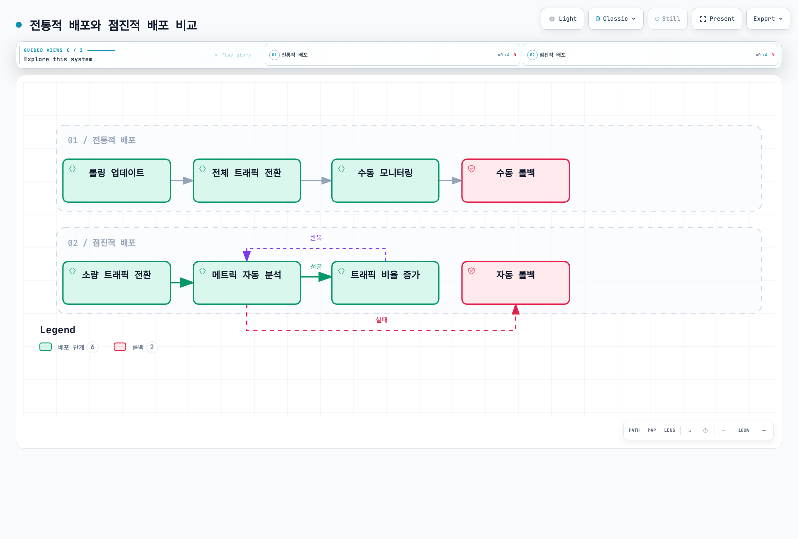
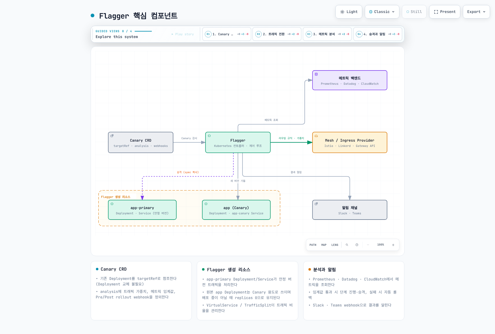
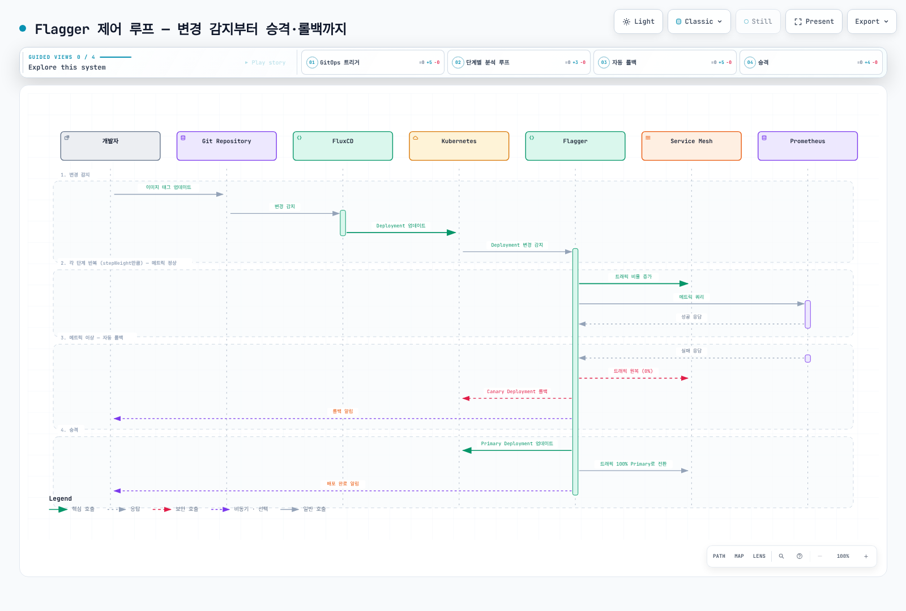
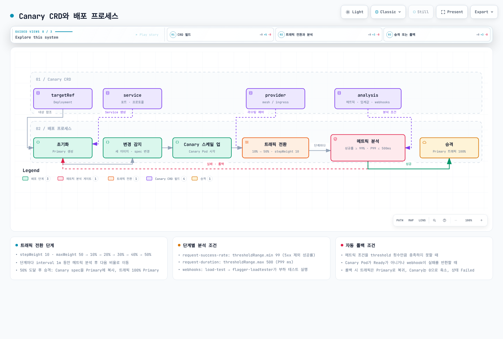
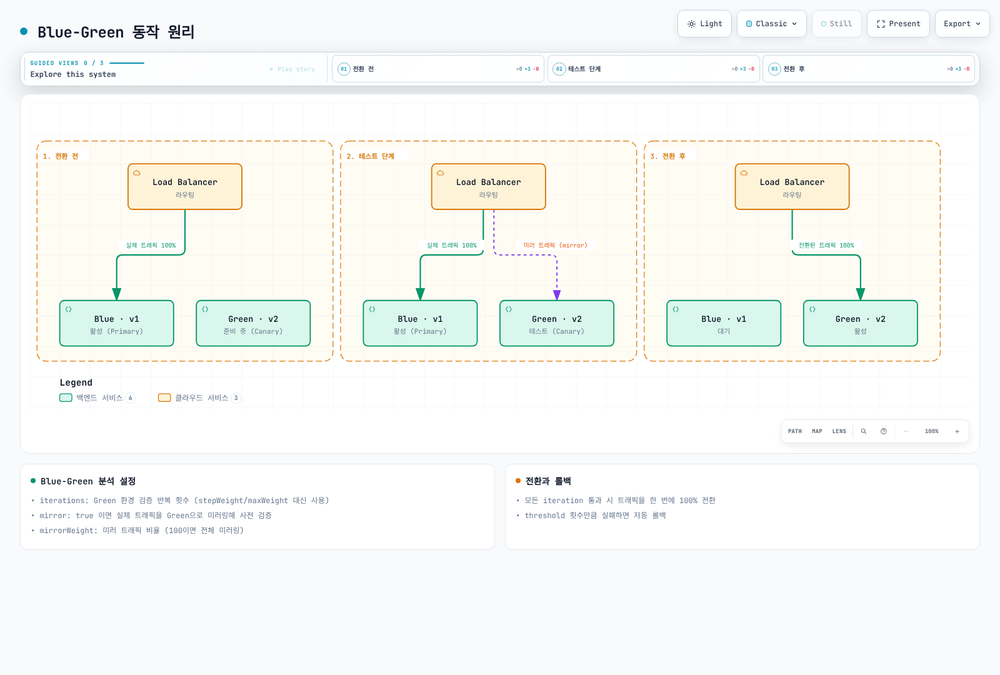
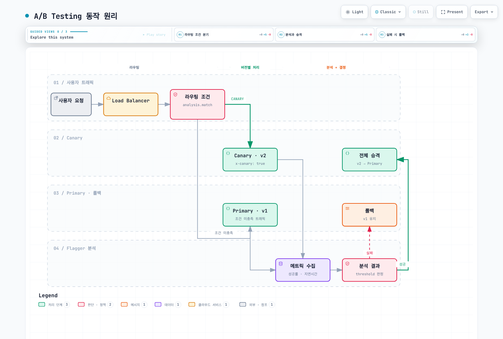
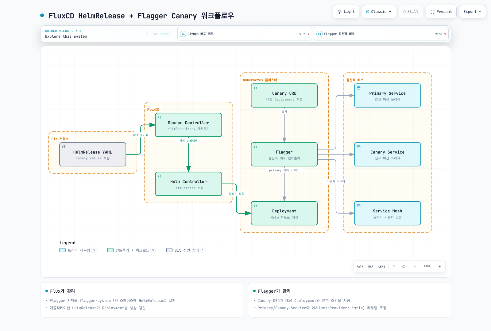
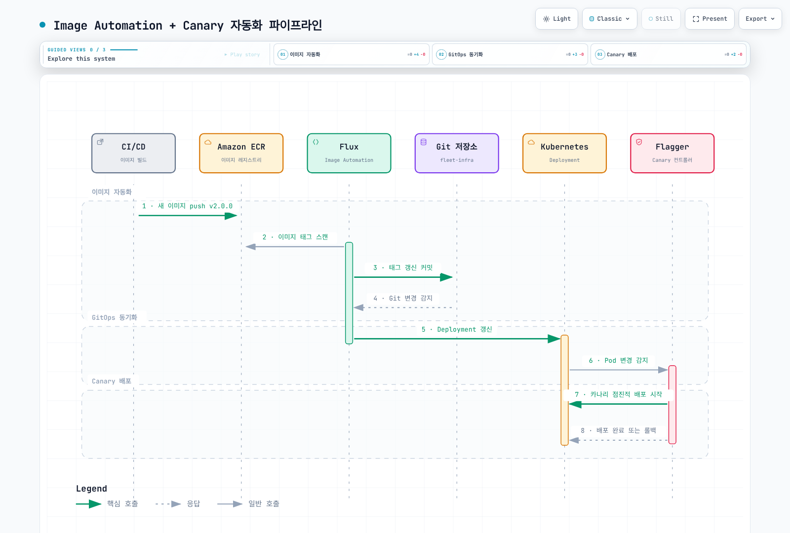
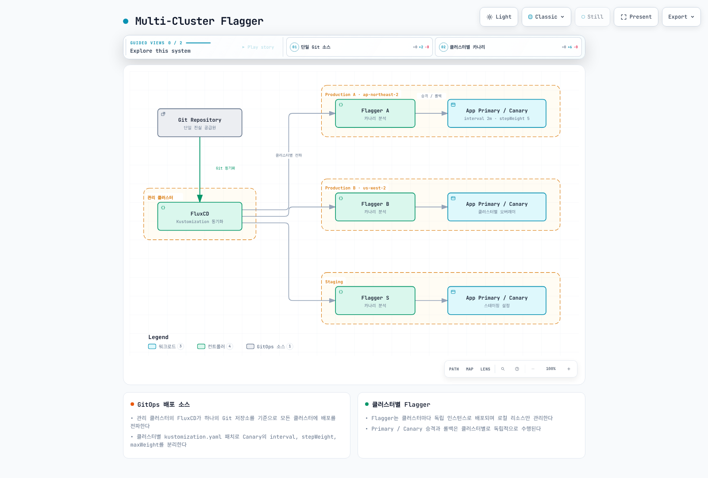

# Flagger Progressive Delivery

> **지원 버전**: Flagger v1.38+, Flux v2.4+
> **마지막 업데이트**: 2025년 6월

Flagger는 Kubernetes를 위한 점진적 배포(Progressive Delivery) 도구로, Canary 배포, Blue-Green 배포, A/B Testing 전략을 자동화합니다. Flux 에코시스템의 핵심 컴포넌트로서 CNCF 프로젝트이며, 메트릭 분석 기반의 자동 롤백과 승격을 지원합니다.

## 목차

- [개요 및 학습 목표](#개요-및-학습-목표)
- [Flagger 아키텍처](#flagger-아키텍처)
- [EKS 설치 및 구성](#eks-설치-및-구성)
- [Canary 배포 전략](#canary-배포-전략)
- [Blue-Green 배포 전략](#blue-green-배포-전략)
- [A/B Testing 전략](#ab-testing-전략)
- [Custom Metrics 및 Webhook](#custom-metrics-및-webhook)
- [GitOps 통합 (Flux + Flagger)](#gitops-통합-flux--flagger)
- [Observability 및 알림](#observability-및-알림)
- [프로덕션 모범 사례](#프로덕션-모범-사례)
- [참고 문서](#참고-문서)

---

## 개요 및 학습 목표

### Progressive Delivery란?

Progressive Delivery는 기존의 롤링 업데이트를 넘어서, 새로운 버전을 소수의 사용자에게 먼저 노출한 후 메트릭을 분석하여 점진적으로 트래픽을 확장하는 배포 방법론입니다. 배포 과정에서 문제가 감지되면 자동으로 롤백이 수행됩니다.



[🔍 인터랙티브 다이어그램 보기](https://www.atomai.click/kubernetes-docs/archmaps/ko-gitops-04-flagger-0.html)

### 주요 배포 전략 비교

| 전략 | 트래픽 제어 | 롤백 속도 | 리소스 사용 | 적합한 시나리오 |
|------|------------|----------|------------|---------------|
| **Canary** | 비율 기반 점진적 전환 | 빠름 | 낮음 | 대부분의 서비스 업데이트 |
| **Blue-Green** | 전체 전환 (0% → 100%) | 즉시 | 높음 (2배) | 데이터베이스 마이그레이션, 주요 변경 |
| **A/B Testing** | 헤더/쿠키 기반 선택적 라우팅 | 빠름 | 낮음 | 사용자 경험 실험, 기능 검증 |

### Flagger vs Argo Rollouts 비교

| 기능 | Flagger | Argo Rollouts |
|------|---------|---------------|
| **GitOps 도구 연동** | Flux 네이티브 | ArgoCD 네이티브 |
| **CRD 방식** | 별도 Canary CRD (Deployment 참조) | Rollout CRD (Deployment 대체) |
| **Service Mesh 지원** | Istio, Linkerd, AWS App Mesh, Contour 등 | Istio, Linkerd, SMI |
| **Gateway API** | 지원 | 지원 |
| **메트릭 분석** | Prometheus, Datadog, CloudWatch 등 | Prometheus, Datadog, Wavefront 등 |
| **Webhook** | Pre/Post rollout, Rollback, Confirm | Analysis 기반 |
| **설치 방식** | Helm, Flux bootstrap | Helm, kubectl |
| **커뮤니티** | CNCF (Flux 생태계) | CNCF (Argo 생태계) |
| **리소스 변경** | 기존 Deployment 유지 | Rollout 리소스로 교체 필요 |

### 학습 목표

이 문서를 학습한 후 다음을 수행할 수 있습니다:

- Flagger의 아키텍처와 제어 루프를 이해하고 설명할 수 있다
- EKS 환경에서 Flagger를 설치하고 Mesh/Ingress provider와 연동할 수 있다
- Canary, Blue-Green, A/B Testing 배포 전략을 구성하고 실행할 수 있다
- Custom Metrics와 Webhook을 활용한 고급 배포 파이프라인을 구축할 수 있다
- Flux와 Flagger를 통합한 완전한 GitOps 자동화 파이프라인을 운영할 수 있다

---

## Flagger 아키텍처

### 핵심 컴포넌트

Flagger는 Kubernetes 컨트롤러로 동작하며, Canary Custom Resource를 감시하고 배포 프로세스를 자동으로 관리합니다.



[🔍 인터랙티브 다이어그램 보기](https://www.atomai.click/kubernetes-docs/archmaps/ko-gitops-04-flagger-1.html)

### 제어 루프 (Control Loop)

Flagger의 핵심은 지속적으로 실행되는 제어 루프입니다. 새로운 배포가 감지되면 다음 순서로 점진적 배포를 수행합니다:



[🔍 인터랙티브 다이어그램 보기](https://www.atomai.click/kubernetes-docs/archmaps/ko-gitops-04-flagger-2.html)

### Flagger가 생성하는 리소스

Flagger는 Canary CRD를 기반으로 다음 리소스를 자동 생성합니다:

| 원본 리소스 | Flagger 생성 리소스 | 역할 |
|------------|-------------------|------|
| `app` (Deployment) | `app-primary` (Deployment) | 안정 버전 트래픽 처리 |
| - | `app` (Deployment, 스케일 0) | Canary 버전 대기 |
| `app` (Service) | `app-primary` (Service) | Primary Pod 라우팅 |
| - | `app-canary` (Service) | Canary Pod 라우팅 |
| - | VirtualService / TrafficSplit | 트래픽 비율 관리 |

Flagger는 원본 Deployment를 Canary 용도로 사용하고, `-primary` 접미사가 붙은 새로운 Deployment를 생성하여 안정 버전의 트래픽을 처리합니다. 배포 과정이 아닐 때 Canary Deployment는 0개의 레플리카로 유지됩니다.

### Mesh/Ingress Provider 지원

Flagger는 다양한 트래픽 관리 레이어와 통합됩니다:

| Provider | 트래픽 라우팅 방식 | Canary | Blue-Green | A/B Testing |
|----------|-----------------|--------|------------|-------------|
| **Istio** | VirtualService | 지원 | 지원 | 지원 |
| **Linkerd** | TrafficSplit (SMI) | 지원 | 지원 | 미지원 |
| **AWS App Mesh** | VirtualRouter | 지원 | 지원 | 지원 |
| **Contour** | HTTPProxy | 지원 | 지원 | 지원 |
| **Nginx Ingress** | Canary annotations | 지원 | 미지원 | 지원 |
| **Gateway API** | HTTPRoute | 지원 | 지원 | 지원 |
| **Gloo Edge** | RouteTable | 지원 | 지원 | 미지원 |

---

## EKS 설치 및 구성

### 사전 요구 사항

- Amazon EKS 클러스터 (v1.27+)
- kubectl 및 Helm v3 설치
- FluxCD 설치 (권장, [FluxCD 문서](02-fluxcd.md) 참조)
- Prometheus 설치 (메트릭 분석용)

### Helm을 사용한 Flagger 설치

#### 기본 설치 (Prometheus 포함)

```bash
# Flagger Helm 리포지토리 추가
helm repo add flagger https://flagger.app
helm repo update

# flagger 네임스페이스 생성
kubectl create namespace flagger-system

# Flagger 설치 (Prometheus 포함)
helm upgrade -i flagger flagger/flagger \
  --namespace flagger-system \
  --set prometheus.install=true \
  --set meshProvider=istio
```

#### Istio Provider 구성

Istio가 설치된 EKS 환경에서 Flagger를 구성합니다:

```bash
# Istio가 이미 설치되어 있는 경우
helm upgrade -i flagger flagger/flagger \
  --namespace istio-system \
  --set meshProvider=istio \
  --set metricsServer=http://prometheus.istio-system:9090 \
  --set prometheus.install=false
```

```yaml
# values-istio.yaml
meshProvider: istio
metricsServer: http://prometheus.istio-system:9090
prometheus:
  install: false
# Istio의 자체 Prometheus를 사용하는 경우 별도 설치 불필요

# 선택적: Slack 알림 활성화
slack:
  url: https://hooks.slack.com/services/YOUR/SLACK/WEBHOOK
  channel: deployments
  user: flagger
```

```bash
helm upgrade -i flagger flagger/flagger \
  --namespace istio-system \
  -f values-istio.yaml
```

#### Gateway API Provider 구성

Kubernetes Gateway API를 사용하는 환경에서의 설정입니다:

```bash
# Gateway API CRD 설치 (아직 없는 경우)
kubectl apply -f https://github.com/kubernetes-sigs/gateway-api/releases/download/v1.1.0/standard-install.yaml

# Flagger를 Gateway API provider로 설치
helm upgrade -i flagger flagger/flagger \
  --namespace flagger-system \
  --set meshProvider=gatewayapi \
  --set metricsServer=http://prometheus.monitoring:9090
```

Gateway 리소스 예제:

```yaml
apiVersion: gateway.networking.k8s.io/v1
kind: Gateway
metadata:
  name: main-gateway
  namespace: default
spec:
  gatewayClassName: istio  # 또는 envoy, contour 등
  listeners:
    - name: http
      protocol: HTTP
      port: 80
      allowedRoutes:
        namespaces:
          from: Same
```

### Flagger Loadtester 설치

Flagger Loadtester는 Canary 분석 중 부하 테스트를 자동으로 수행하는 도구입니다:

```bash
helm upgrade -i flagger-loadtester flagger/loadtester \
  --namespace flagger-system \
  --set cmd.timeout=1h
```

### Slack/Teams Webhook 알림 설정

#### Slack 알림

```yaml
# Flagger AlertProvider CRD를 사용한 Slack 알림
apiVersion: flagger.app/v1beta1
kind: AlertProvider
metadata:
  name: slack
  namespace: default
spec:
  type: slack
  channel: kubernetes-deployments
  username: flagger
  # Kubernetes Secret에서 webhook URL 참조
  secretRef:
    name: slack-webhook
---
apiVersion: v1
kind: Secret
metadata:
  name: slack-webhook
  namespace: default
stringData:
  address: https://hooks.slack.com/services/YOUR/SLACK/WEBHOOK
```

#### Microsoft Teams 알림

```yaml
apiVersion: flagger.app/v1beta1
kind: AlertProvider
metadata:
  name: msteams
  namespace: default
spec:
  type: msteams
  secretRef:
    name: msteams-webhook
---
apiVersion: v1
kind: Secret
metadata:
  name: msteams-webhook
  namespace: default
stringData:
  address: https://outlook.office.com/webhook/YOUR/TEAMS/WEBHOOK
```

---

## Canary 배포 전략

Canary 배포는 Flagger의 가장 기본적이고 널리 사용되는 점진적 배포 전략입니다. 새로운 버전으로 소량의 트래픽을 전환하고, 메트릭을 분석한 뒤 점진적으로 트래픽 비율을 증가시킵니다.

### Canary CRD 상세 설명



[🔍 인터랙티브 다이어그램 보기](https://www.atomai.click/kubernetes-docs/archmaps/ko-gitops-04-flagger-3.html)

### 완전한 Canary YAML 예제

다음은 프로덕션 환경에서 사용할 수 있는 완전한 Canary 배포 구성입니다:

```yaml
apiVersion: flagger.app/v1beta1
kind: Canary
metadata:
  name: podinfo
  namespace: default
spec:
  # 대상 Deployment 참조
  targetRef:
    apiVersion: apps/v1
    kind: Deployment
    name: podinfo

  # HPA 참조 (선택적)
  autoscalerRef:
    apiVersion: autoscaling/v2
    kind: HorizontalPodAutoscaler
    name: podinfo

  # Service 설정
  service:
    port: 9898
    targetPort: 9898
    # Istio traffic policy
    trafficPolicy:
      tls:
        mode: ISTIO_MUTUAL
    # Istio 재시도 설정
    retries:
      attempts: 3
      perTryTimeout: 1s
      retryOn: "gateway-error,connect-failure,refused-stream"

  # 점진적 배포 분석 설정
  analysis:
    # 분석 간격 (1분마다 메트릭 확인)
    interval: 1m
    # 승격까지 필요한 임계값 도달 횟수
    threshold: 5
    # 최대 트래픽 비율
    maxWeight: 50
    # 각 단계별 트래픽 증가량
    stepWeight: 10
    # 메트릭 분석 조건
    metrics:
      # 요청 성공률 (5xx 에러 비율 기반)
      - name: request-success-rate
        # 99% 이상의 요청 성공률 요구
        thresholdRange:
          min: 99
        interval: 1m
      # 요청 응답 시간 (P99 지연 시간)
      - name: request-duration
        # P99 응답 시간이 500ms 미만이어야 함
        thresholdRange:
          max: 500
        interval: 1m
    # Webhook (부하 테스트)
    webhooks:
      - name: load-test
        type: rollout
        url: http://flagger-loadtester.flagger-system/
        timeout: 5s
        metadata:
          cmd: "hey -z 1m -q 10 -c 2 http://podinfo-canary.default:9898/"

  # 알림 설정
  alerting:
    - name: "slack"
      severity: info
      providerRef:
        name: slack
```

### 단계별 트래픽 Shifting 이해

위 설정에서 `stepWeight: 10`과 `maxWeight: 50`은 다음과 같은 단계를 의미합니다:

| 단계 | Canary 트래픽 | Primary 트래픽 | 소요 시간 | 동작 |
|------|-------------|---------------|----------|------|
| 1 | 0% | 100% | - | 변경 감지, Canary Pod 시작 |
| 2 | 10% | 90% | 1분 | 메트릭 분석 |
| 3 | 20% | 80% | 1분 | 메트릭 분석 |
| 4 | 30% | 70% | 1분 | 메트릭 분석 |
| 5 | 40% | 60% | 1분 | 메트릭 분석 |
| 6 | 50% | 50% | 1분 | 최대 비율 도달, 승격 시작 |
| 7 | 0% | 100% | - | Primary를 새 버전으로 업데이트 |

### 메트릭 분석 상세

#### 내장 메트릭

Flagger는 메시/인그레스 provider별 내장 메트릭을 제공합니다:

```yaml
# Istio 내장 메트릭
metrics:
  - name: request-success-rate
    # istio_requests_total 메트릭 기반
    # response_code != 5xx 비율 계산
    thresholdRange:
      min: 99
    interval: 1m
  - name: request-duration
    # istio_request_duration_milliseconds 히스토그램 기반
    # P99 레이턴시 계산
    thresholdRange:
      max: 500
    interval: 1m
```

#### 자동 롤백 조건

다음 조건 중 하나라도 충족되면 Flagger는 자동으로 롤백을 수행합니다:

- **메트릭 임계값 미달**: 설정된 `threshold` 횟수만큼 연속으로 메트릭 조건을 충족하지 못할 때
- **Canary Pod 비정상**: Canary Deployment의 Pod가 Ready 상태가 아닐 때
- **Webhook 실패**: Pre/Post rollout webhook이 실패를 반환할 때
- **수동 롤백**: `kubectl annotate canary/podinfo flagger.app/rollback="true"` 실행 시

```bash
# Canary 상태 확인
kubectl get canary podinfo -n default

# Canary 이벤트 확인
kubectl describe canary podinfo -n default

# 수동 롤백 트리거
kubectl annotate canary/podinfo flagger.app/rollback="true" -n default
```

### Canary 상태 확인

```bash
# Canary 리소스 목록
kubectl get canaries --all-namespaces

# 상태 확인 (STATUS 컬럼)
# Initialized - 초기화 완료
# Progressing - 점진적 배포 진행 중
# Promoting  - Primary 승격 중
# Finalising - 마무리 중
# Succeeded  - 배포 성공
# Failed     - 배포 실패, 롤백 완료

# 상세 이벤트 로그
kubectl -n default describe canary/podinfo

# Flagger 로그 확인
kubectl -n flagger-system logs deployment/flagger -f
```

---

## Blue-Green 배포 전략

Blue-Green 배포는 새로운 버전(Green)을 완전히 준비한 후, 트래픽을 한 번에 전환하는 전략입니다. Flagger에서는 Canary CRD의 `analysis` 설정을 통해 Blue-Green 배포를 구현합니다.

### Blue-Green 동작 원리



[🔍 인터랙티브 다이어그램 보기](https://www.atomai.click/kubernetes-docs/archmaps/ko-gitops-04-flagger-4.html)

### 완전한 Blue-Green YAML 예제

```yaml
apiVersion: flagger.app/v1beta1
kind: Canary
metadata:
  name: podinfo
  namespace: default
spec:
  targetRef:
    apiVersion: apps/v1
    kind: Deployment
    name: podinfo

  autoscalerRef:
    apiVersion: autoscaling/v2
    kind: HorizontalPodAutoscaler
    name: podinfo

  service:
    port: 9898
    targetPort: 9898
    trafficPolicy:
      tls:
        mode: ISTIO_MUTUAL

  analysis:
    # Blue-Green 배포: iteration 기반 분석
    # stepWeight 대신 iterations 사용
    interval: 1m
    threshold: 2
    # iterations: Green 환경 검증 반복 횟수
    iterations: 10

    # Mirror 트래픽 (선택적)
    # 실제 트래픽을 Green 환경으로 미러링하여 사전 검증
    mirror: true
    # 미러 트래픽 비율 (%)
    mirrorWeight: 100

    metrics:
      - name: request-success-rate
        thresholdRange:
          min: 99
        interval: 1m
      - name: request-duration
        thresholdRange:
          max: 500
        interval: 1m

    webhooks:
      # 배포 전 통합 테스트 실행
      - name: integration-tests
        type: pre-rollout
        url: http://flagger-loadtester.flagger-system/
        timeout: 60s
        metadata:
          type: bash
          cmd: "curl -s http://podinfo-canary.default:9898/healthz | grep ok"
      # 부하 테스트
      - name: load-test
        type: rollout
        url: http://flagger-loadtester.flagger-system/
        timeout: 5s
        metadata:
          cmd: "hey -z 1m -q 10 -c 2 http://podinfo-canary.default:9898/"
```

### Blue-Green 핵심 설정 항목

| 설정 | 설명 | Canary와의 차이 |
|------|------|----------------|
| `iterations` | 검증 반복 횟수 | `stepWeight`/`maxWeight` 대신 사용 |
| `mirror` | 미러 트래픽 활성화 | Blue-Green 전용 옵션 |
| `mirrorWeight` | 미러 트래픽 비율 | 100이면 전체 트래픽 미러링 |
| `threshold` | 롤백 임계값 | 동일하게 적용 |

### 수동 승인 (Manual Gating)

프로덕션 환경에서 자동 승격 전에 수동 승인 단계를 추가할 수 있습니다:

```yaml
analysis:
  webhooks:
    # 수동 승인 게이트
    - name: manual-gate
      type: confirm-rollout
      url: http://flagger-loadtester.flagger-system/gate/check
```

수동 승인을 위한 게이트 조작:

```bash
# 배포 승인 (게이트 열기)
kubectl -n flagger-system exec deploy/flagger-loadtester -- \
  curl -s -X POST http://localhost:8080/gate/open

# 배포 거부 (게이트 닫기)
kubectl -n flagger-system exec deploy/flagger-loadtester -- \
  curl -s -X POST http://localhost:8080/gate/close

# 게이트 상태 확인
kubectl -n flagger-system exec deploy/flagger-loadtester -- \
  curl -s http://localhost:8080/gate/check
```

---

## A/B Testing 전략

A/B Testing은 특정 조건(HTTP 헤더, 쿠키, 쿼리 파라미터 등)에 따라 사용자를 새로운 버전으로 라우팅하는 전략입니다. 사용자 경험 실험이나 특정 그룹 대상 기능 검증에 적합합니다.

### A/B Testing 동작 원리



[🔍 인터랙티브 다이어그램 보기](https://www.atomai.click/kubernetes-docs/archmaps/ko-gitops-04-flagger-5.html)

### Header/Cookie 기반 라우팅

A/B Testing은 `analysis.match` 필드를 사용하여 라우팅 조건을 정의합니다:

```yaml
apiVersion: flagger.app/v1beta1
kind: Canary
metadata:
  name: podinfo
  namespace: default
spec:
  targetRef:
    apiVersion: apps/v1
    kind: Deployment
    name: podinfo

  service:
    port: 9898
    targetPort: 9898

  analysis:
    interval: 1m
    threshold: 10
    iterations: 10
    # A/B Testing 라우팅 조건
    match:
      # HTTP 헤더 기반 라우팅
      - headers:
          x-canary:
            exact: "true"
      # 쿠키 기반 라우팅
      - headers:
          cookie:
            regex: "^(.*?;)?(canary=always)(;.*)?$"
      # 소스 IP 기반 (특정 내부 네트워크)
      - sourceLabels:
          app.kubernetes.io/name: internal-gateway

    metrics:
      - name: request-success-rate
        thresholdRange:
          min: 99
        interval: 1m
      - name: request-duration
        thresholdRange:
          max: 500
        interval: 1m

    webhooks:
      - name: load-test
        type: rollout
        url: http://flagger-loadtester.flagger-system/
        timeout: 5s
        metadata:
          cmd: "hey -z 1m -q 10 -c 2 -H 'x-canary: true' http://podinfo-canary.default:9898/"
```

### Istio VirtualService 연동

Flagger는 A/B Testing 설정을 기반으로 Istio VirtualService를 자동 생성합니다. 아래는 Flagger가 생성하는 VirtualService의 구조입니다:

```yaml
# Flagger가 자동 생성하는 VirtualService (참고용)
apiVersion: networking.istio.io/v1beta1
kind: VirtualService
metadata:
  name: podinfo
  namespace: default
  ownerReferences:
    - apiVersion: flagger.app/v1beta1
      kind: Canary
      name: podinfo
spec:
  hosts:
    - podinfo
  http:
    # A/B Testing 조건에 해당하는 트래픽 → Canary
    - match:
        - headers:
            x-canary:
              exact: "true"
      route:
        - destination:
            host: podinfo-canary
    # 나머지 트래픽 → Primary
    - route:
        - destination:
            host: podinfo-primary
```

### A/B Testing 테스트 방법

```bash
# 일반 요청 (Primary로 라우팅)
curl http://podinfo.default:9898/version
# 결과: {"version":"1.0.0"}

# A/B 테스트 헤더 포함 요청 (Canary로 라우팅)
curl -H "x-canary: true" http://podinfo.default:9898/version
# 결과: {"version":"2.0.0"}

# 쿠키 기반 라우팅 테스트
curl -b "canary=always" http://podinfo.default:9898/version
# 결과: {"version":"2.0.0"}
```

---

## Custom Metrics 및 Webhook

### Prometheus Custom 메트릭 쿼리

Flagger의 내장 메트릭 외에 사용자 정의 Prometheus 쿼리를 사용할 수 있습니다:

```yaml
apiVersion: flagger.app/v1beta1
kind: MetricTemplate
metadata:
  name: error-rate
  namespace: default
spec:
  provider:
    type: prometheus
    address: http://prometheus.monitoring:9090
  query: |
    100 - sum(
      rate(
        http_requests_total{
          namespace="{{ namespace }}",
          pod=~"{{ target }}-[0-9a-zA-Z]+(-[0-9a-zA-Z]+)",
          status!~"5.*"
        }[{{ interval }}]
      )
    )
    /
    sum(
      rate(
        http_requests_total{
          namespace="{{ namespace }}",
          pod=~"{{ target }}-[0-9a-zA-Z]+(-[0-9a-zA-Z]+)"
        }[{{ interval }}]
      )
    ) * 100
```

MetricTemplate에서 사용할 수 있는 변수:

| 변수 | 설명 |
|------|------|
| <code v-pre>{{ namespace }}</code> | Canary 리소스의 네임스페이스 |
| <code v-pre>{{ target }}</code> | 대상 Deployment 이름 |
| <code v-pre>{{ interval }}</code> | 메트릭 분석 간격 |
| <code v-pre>{{ variables.key }}</code> | Canary에서 전달하는 사용자 정의 변수 |

Canary에서 MetricTemplate 참조:

```yaml
analysis:
  metrics:
    - name: "custom-error-rate"
      templateRef:
        name: error-rate
        namespace: default
      thresholdRange:
        max: 1
      interval: 1m
    - name: "custom-latency"
      templateRef:
        name: latency
        namespace: default
      templateVariables:
        percentile: "99"
      thresholdRange:
        max: 500
      interval: 1m
```

### Datadog 메트릭 Provider

```yaml
apiVersion: flagger.app/v1beta1
kind: MetricTemplate
metadata:
  name: datadog-request-duration
  namespace: default
spec:
  provider:
    type: datadog
    secretRef:
      name: datadog-api
  query: |
    avg:trace.http.request.duration{
      service:{{ target }}.{{ namespace }}
    }.rollup(avg, {{ interval }})
---
apiVersion: v1
kind: Secret
metadata:
  name: datadog-api
  namespace: default
stringData:
  datadog_api_key: YOUR_DATADOG_API_KEY
  datadog_application_key: YOUR_DATADOG_APP_KEY
  datadog_site: datadoghq.com
```

### CloudWatch 메트릭 Provider

EKS 환경에서 CloudWatch 메트릭을 활용할 수 있습니다:

```yaml
apiVersion: flagger.app/v1beta1
kind: MetricTemplate
metadata:
  name: cloudwatch-error-rate
  namespace: default
spec:
  provider:
    type: cloudwatch
    region: ap-northeast-2  # 서울 리전
  query: |
    [
      {
        "Id": "e1",
        "Expression": "m1 / m2 * 100",
        "Label": "ErrorRate"
      },
      {
        "Id": "m1",
        "MetricStat": {
          "Metric": {
            "Namespace": "MyApp",
            "MetricName": "5xxErrors",
            "Dimensions": [
              {
                "Name": "Service",
                "Value": "{{ target }}"
              }
            ]
          },
          "Period": 60,
          "Stat": "Sum"
        },
        "ReturnData": false
      },
      {
        "Id": "m2",
        "MetricStat": {
          "Metric": {
            "Namespace": "MyApp",
            "MetricName": "TotalRequests",
            "Dimensions": [
              {
                "Name": "Service",
                "Value": "{{ target }}"
              }
            ]
          },
          "Period": 60,
          "Stat": "Sum"
        },
        "ReturnData": false
      }
    ]
```

CloudWatch 메트릭을 사용하려면 Flagger Pod에 적절한 IAM 권한이 필요합니다. EKS에서는 IRSA(IAM Roles for Service Accounts)를 사용합니다:

```yaml
# CloudWatch 읽기 권한 IAM 정책
{
  "Version": "2012-10-17",
  "Statement": [
    {
      "Effect": "Allow",
      "Action": [
        "cloudwatch:GetMetricData",
        "cloudwatch:GetMetricStatistics",
        "cloudwatch:ListMetrics"
      ],
      "Resource": "*"
    }
  ]
}
```

### Pre/Post Rollout Webhook

Webhook을 사용하면 배포 프로세스의 각 단계에서 외부 서비스를 호출할 수 있습니다:

```yaml
analysis:
  webhooks:
    # 배포 시작 전 실행 (실패 시 배포 중단)
    - name: smoke-test
      type: pre-rollout
      url: http://flagger-loadtester.flagger-system/
      timeout: 60s
      metadata:
        type: bash
        cmd: |
          curl -s http://podinfo-canary.default:9898/healthz | grep ok && \
          curl -s http://podinfo-canary.default:9898/readyz | grep ok

    # 각 분석 단계마다 실행
    - name: load-test
      type: rollout
      url: http://flagger-loadtester.flagger-system/
      timeout: 5s
      metadata:
        cmd: "hey -z 1m -q 10 -c 2 http://podinfo-canary.default:9898/"

    # 승격 완료 후 실행
    - name: post-deploy-notification
      type: post-rollout
      url: http://notification-service.default/
      timeout: 15s
      metadata:
        message: "podinfo has been promoted to version {{ .Version }}"

    # 롤백 시 실행
    - name: rollback-notification
      type: rollback
      url: http://notification-service.default/
      timeout: 15s
      metadata:
        message: "podinfo rollback triggered for version {{ .Version }}"

    # 수동 승인 (Blue-Green과 동일)
    - name: manual-approval
      type: confirm-rollout
      url: http://approval-service.default/gate/check
```

#### Webhook 유형 정리

| 유형 | 실행 시점 | 실패 시 동작 |
|------|----------|------------|
| `confirm-rollout` | 배포 시작 전 | 대기 (재시도) |
| `pre-rollout` | 트래픽 전환 전 | 즉시 롤백 |
| `rollout` | 각 분석 단계 | threshold 카운트 증가 |
| `confirm-promotion` | 승격 직전 | 대기 (재시도) |
| `post-rollout` | 승격 완료 후 | 무시 (이미 완료) |
| `rollback` | 롤백 발생 시 | 무시 |
| `event` | 모든 상태 변경 시 | 무시 |

---

## GitOps 통합 (Flux + Flagger)

Flagger는 Flux 에코시스템의 핵심 도구로, FluxCD와 결합하면 완전한 GitOps 기반 점진적 배포 파이프라인을 구축할 수 있습니다.

### FluxCD HelmRelease + Flagger Canary 워크플로우



[🔍 인터랙티브 다이어그램 보기](https://www.atomai.click/kubernetes-docs/archmaps/ko-gitops-04-flagger-6.html)

#### Flux로 Flagger 자체 설치

```yaml
# flagger-system/namespace.yaml
apiVersion: v1
kind: Namespace
metadata:
  name: flagger-system
---
# flagger-system/helmrepository.yaml
apiVersion: source.toolkit.fluxcd.io/v1
kind: HelmRepository
metadata:
  name: flagger
  namespace: flagger-system
spec:
  interval: 1h
  url: https://flagger.app
---
# flagger-system/helmrelease.yaml
apiVersion: helm.toolkit.fluxcd.io/v2
kind: HelmRelease
metadata:
  name: flagger
  namespace: flagger-system
spec:
  interval: 1h
  chart:
    spec:
      chart: flagger
      version: ">=1.38.0"
      sourceRef:
        kind: HelmRepository
        name: flagger
      interval: 1h
  values:
    meshProvider: istio
    metricsServer: http://prometheus.monitoring:9090
    prometheus:
      install: false
---
# flagger-system/loadtester.yaml
apiVersion: helm.toolkit.fluxcd.io/v2
kind: HelmRelease
metadata:
  name: loadtester
  namespace: flagger-system
spec:
  interval: 1h
  chart:
    spec:
      chart: loadtester
      version: ">=0.30.0"
      sourceRef:
        kind: HelmRepository
        name: flagger
      interval: 1h
```

#### 애플리케이션 배포 (HelmRelease + Canary)

```yaml
# apps/podinfo/helmrelease.yaml
apiVersion: helm.toolkit.fluxcd.io/v2
kind: HelmRelease
metadata:
  name: podinfo
  namespace: default
spec:
  interval: 5m
  chart:
    spec:
      chart: podinfo
      version: ">=6.0.0"
      sourceRef:
        kind: HelmRepository
        name: podinfo
      interval: 1h
  values:
    replicaCount: 2
    image:
      repository: ghcr.io/stefanprodan/podinfo
      tag: 6.5.0  # 이 값을 변경하면 Flagger가 Canary 배포 시작
    resources:
      limits:
        memory: 256Mi
      requests:
        cpu: 100m
        memory: 64Mi
---
# apps/podinfo/canary.yaml
apiVersion: flagger.app/v1beta1
kind: Canary
metadata:
  name: podinfo
  namespace: default
spec:
  targetRef:
    apiVersion: apps/v1
    kind: Deployment
    name: podinfo
  service:
    port: 9898
  analysis:
    interval: 1m
    threshold: 5
    maxWeight: 50
    stepWeight: 10
    metrics:
      - name: request-success-rate
        thresholdRange:
          min: 99
        interval: 1m
```

### Kustomization 기반 배포

Flux Kustomization을 사용한 환경별 배포 구성입니다:

```
# 디렉토리 구조
clusters/
├── production/
│   └── apps.yaml          # Flux Kustomization
├── staging/
│   └── apps.yaml
apps/
├── base/
│   ├── kustomization.yaml
│   ├── deployment.yaml
│   ├── service.yaml
│   └── canary.yaml
├── production/
│   ├── kustomization.yaml
│   └── canary-patch.yaml  # 프로덕션 전용 Canary 설정
└── staging/
    ├── kustomization.yaml
    └── canary-patch.yaml  # 스테이징 전용 Canary 설정
```

```yaml
# apps/base/kustomization.yaml
apiVersion: kustomize.config.k8s.io/v1beta1
kind: Kustomization
resources:
  - deployment.yaml
  - service.yaml
  - canary.yaml
```

```yaml
# apps/base/canary.yaml
apiVersion: flagger.app/v1beta1
kind: Canary
metadata:
  name: myapp
spec:
  targetRef:
    apiVersion: apps/v1
    kind: Deployment
    name: myapp
  service:
    port: 8080
  analysis:
    interval: 1m
    threshold: 5
    maxWeight: 50
    stepWeight: 10
    metrics:
      - name: request-success-rate
        thresholdRange:
          min: 99
        interval: 1m
```

```yaml
# apps/production/kustomization.yaml
apiVersion: kustomize.config.k8s.io/v1beta1
kind: Kustomization
resources:
  - ../base
patches:
  - path: canary-patch.yaml
```

```yaml
# apps/production/canary-patch.yaml
# 프로덕션: 더 보수적인 Canary 설정
apiVersion: flagger.app/v1beta1
kind: Canary
metadata:
  name: myapp
spec:
  analysis:
    interval: 2m          # 분석 간격 증가
    threshold: 3           # 더 낮은 실패 허용치
    maxWeight: 30          # 최대 트래픽 비율 제한
    stepWeight: 5          # 더 작은 단계별 증가
    metrics:
      - name: request-success-rate
        thresholdRange:
          min: 99.5        # 더 높은 성공률 요구
        interval: 2m
```

```yaml
# apps/staging/canary-patch.yaml
# 스테이징: 빠른 검증용 Canary 설정
apiVersion: flagger.app/v1beta1
kind: Canary
metadata:
  name: myapp
spec:
  analysis:
    interval: 30s
    threshold: 10
    maxWeight: 80
    stepWeight: 20
    metrics:
      - name: request-success-rate
        thresholdRange:
          min: 95
        interval: 30s
```

### Image Automation + Canary 자동화 파이프라인

Flux Image Automation과 Flagger를 결합하면, 컨테이너 이미지가 업데이트될 때 자동으로 Git 리포지토리를 업데이트하고 Canary 배포를 트리거하는 완전 자동화 파이프라인을 구축할 수 있습니다:



[🔍 인터랙티브 다이어그램 보기](https://www.atomai.click/kubernetes-docs/archmaps/ko-gitops-04-flagger-7.html)

```yaml
# Image automation 설정
apiVersion: image.toolkit.fluxcd.io/v1beta2
kind: ImageRepository
metadata:
  name: podinfo
  namespace: flux-system
spec:
  image: 123456789012.dkr.ecr.ap-northeast-2.amazonaws.com/podinfo
  interval: 5m
  provider: aws
---
apiVersion: image.toolkit.fluxcd.io/v1beta2
kind: ImagePolicy
metadata:
  name: podinfo
  namespace: flux-system
spec:
  imageRepositoryRef:
    name: podinfo
  policy:
    semver:
      range: ">=6.0.0"
---
apiVersion: image.toolkit.fluxcd.io/v1beta2
kind: ImageUpdateAutomation
metadata:
  name: podinfo
  namespace: flux-system
spec:
  interval: 5m
  sourceRef:
    kind: GitRepository
    name: fleet-infra
  git:
    checkout:
      ref:
        branch: main
    commit:
      author:
        email: flux@example.com
        name: Flux
      messageTemplate: "chore: update podinfo to {{.NewTag}}"
    push:
      branch: main
  update:
    path: ./apps
    strategy: Setters
```

Deployment에서 Image Policy 마커를 사용합니다:

```yaml
# apps/base/deployment.yaml
apiVersion: apps/v1
kind: Deployment
metadata:
  name: podinfo
spec:
  template:
    spec:
      containers:
        - name: podinfo
          image: 123456789012.dkr.ecr.ap-northeast-2.amazonaws.com/podinfo:6.5.0 # {"$imagepolicy": "flux-system:podinfo"}
```

---

## Observability 및 알림

### Flagger 메트릭

Flagger는 Prometheus 형식의 메트릭을 노출합니다. 주요 메트릭은 다음과 같습니다:

| 메트릭 이름 | 유형 | 설명 |
|------------|------|------|
| `flagger_canary_status` | Gauge | Canary 상태 (0=초기화, 1=진행중, 2=대기) |
| `flagger_canary_weight` | Gauge | 현재 Canary 트래픽 비율 |
| `flagger_canary_iterations` | Gauge | 현재 반복 횟수 (Blue-Green) |
| `flagger_canary_total` | Counter | 전체 Canary 분석 횟수 |
| `flagger_canary_duration_seconds` | Histogram | Canary 배포 소요 시간 |
| `flagger_canary_metric_analysis` | Counter | 메트릭 분석 결과 (성공/실패) |

### Grafana 대시보드 구성

Flagger는 공식 Grafana 대시보드를 제공합니다:

```bash
# Grafana 대시보드 ConfigMap 생성
kubectl apply -f https://raw.githubusercontent.com/fluxcd/flagger/main/charts/grafana/dashboards/canary-analysis.json
```

Flux를 통한 Grafana 대시보드 자동 배포:

```yaml
apiVersion: v1
kind: ConfigMap
metadata:
  name: flagger-grafana-dashboard
  namespace: monitoring
  labels:
    grafana_dashboard: "1"
data:
  flagger-canary.json: |
    {
      "dashboard": {
        "title": "Flagger Canary Analysis",
        "panels": [
          {
            "title": "Canary Status",
            "targets": [
              {
                "expr": "flagger_canary_status{namespace=\"$namespace\", name=\"$canary\"}"
              }
            ]
          },
          {
            "title": "Canary Weight",
            "targets": [
              {
                "expr": "flagger_canary_weight{namespace=\"$namespace\", name=\"$canary\"}"
              }
            ]
          },
          {
            "title": "Request Success Rate",
            "targets": [
              {
                "expr": "sum(rate(istio_requests_total{destination_workload=\"$canary\",response_code!~\"5.*\"}[1m])) / sum(rate(istio_requests_total{destination_workload=\"$canary\"}[1m])) * 100"
              }
            ]
          },
          {
            "title": "Request Duration P99",
            "targets": [
              {
                "expr": "histogram_quantile(0.99, sum(rate(istio_request_duration_milliseconds_bucket{destination_workload=\"$canary\"}[1m])) by (le))"
              }
            ]
          }
        ]
      }
    }
```

### Prometheus 알림 규칙

```yaml
apiVersion: monitoring.coreos.com/v1
kind: PrometheusRule
metadata:
  name: flagger-alerts
  namespace: monitoring
spec:
  groups:
    - name: flagger
      rules:
        # Canary 배포 실패 알림
        - alert: CanaryDeploymentFailed
          expr: |
            flagger_canary_status{status="failed"} == 1
          for: 1m
          labels:
            severity: critical
          annotations:
            summary: "Canary 배포 실패: {{ $labels.name }}"
            description: "{{ $labels.namespace }}/{{ $labels.name }} Canary 배포가 실패하여 롤백되었습니다."

        # Canary 배포 장시간 진행 알림
        - alert: CanaryDeploymentStuck
          expr: |
            flagger_canary_status{status="progressing"} == 1
            and
            time() - flagger_canary_duration_seconds > 3600
          for: 5m
          labels:
            severity: warning
          annotations:
            summary: "Canary 배포 정체: {{ $labels.name }}"
            description: "{{ $labels.namespace }}/{{ $labels.name }} Canary 배포가 1시간 이상 진행 중입니다."

        # 메트릭 분석 연속 실패 알림
        - alert: CanaryMetricAnalysisFailing
          expr: |
            increase(flagger_canary_metric_analysis{result="failed"}[10m]) > 5
          for: 2m
          labels:
            severity: warning
          annotations:
            summary: "Canary 메트릭 분석 실패: {{ $labels.name }}"
            description: "{{ $labels.namespace }}/{{ $labels.name }}에서 메트릭 분석이 반복적으로 실패하고 있습니다."
```

### Slack/Teams 알림 구성 상세

AlertProvider를 사용한 다중 채널 알림 설정:

```yaml
# 심각도별 알림 분리
apiVersion: flagger.app/v1beta1
kind: AlertProvider
metadata:
  name: slack-info
  namespace: default
spec:
  type: slack
  channel: deployments-info
  username: flagger
  secretRef:
    name: slack-webhook
---
apiVersion: flagger.app/v1beta1
kind: AlertProvider
metadata:
  name: slack-critical
  namespace: default
spec:
  type: slack
  channel: deployments-alerts
  username: flagger
  secretRef:
    name: slack-webhook
```

Canary에서 심각도별 알림 설정:

```yaml
spec:
  alerting:
    - name: "info-alerts"
      severity: info          # 배포 시작, 진행, 완료
      providerRef:
        name: slack-info
    - name: "critical-alerts"
      severity: error         # 배포 실패, 롤백
      providerRef:
        name: slack-critical
```

### 배포 이력 추적

Flagger 이벤트를 통해 배포 이력을 추적할 수 있습니다:

```bash
# 특정 Canary의 이벤트 이력
kubectl -n default describe canary/podinfo | grep -A 50 "Events:"

# Flagger 전체 이벤트 (타입별 필터)
kubectl get events --field-selector reason=Synced -n default
kubectl get events --field-selector reason=PromotionCompleted -n default

# 최근 배포 상태 확인
kubectl get canaries -A -o custom-columns=\
NAME:.metadata.name,\
NAMESPACE:.metadata.namespace,\
STATUS:.status.phase,\
WEIGHT:.status.canaryWeight,\
LAST-TRANSITION:.status.lastTransitionTime
```

---

## 프로덕션 모범 사례

### 점진적 도입 전략

프로덕션 환경에 Flagger를 도입할 때는 다음 순서를 권장합니다:

1. **비핵심 서비스부터 시작**: 내부 도구나 개발자 대시보드 등에 먼저 적용
2. **넉넉한 임계값 설정**: 초기에는 `threshold`를 높게, `stepWeight`를 크게 설정하여 빠른 피드백 확보
3. **메트릭 튜닝 기간 확보**: 2-3주간 메트릭 기준값을 수집하고 분석한 후 임계값 조정
4. **팀 교육**: 모든 팀원이 Canary 상태 확인 및 수동 개입 방법을 숙지
5. **핵심 서비스 확대**: 검증이 완료된 설정을 점진적으로 핵심 서비스에 적용

### 메트릭 임계값 튜닝

| 환경 | interval | threshold | stepWeight | maxWeight | success-rate | duration (P99) |
|------|----------|-----------|------------|-----------|-------------|----------------|
| **개발** | 30s | 10 | 20 | 80 | 95% | 1000ms |
| **스테이징** | 1m | 5 | 10 | 50 | 99% | 500ms |
| **프로덕션** | 2m | 3 | 5 | 30 | 99.5% | 300ms |
| **금융/결제** | 5m | 2 | 2 | 20 | 99.9% | 200ms |

> 프로덕션에서는 보수적인 설정이 안전합니다. 트래픽 증가 속도를 늦추고 분석 간격을 늘려 잠재적 문제를 조기에 감지할 수 있도록 합니다.

### 롤백 전략

#### 자동 롤백 최적화

```yaml
analysis:
  # 실패 허용 횟수 (낮을수록 빠른 롤백)
  threshold: 3
  # 각 단계 분석 간격 (길수록 정밀한 분석)
  interval: 2m
  metrics:
    - name: request-success-rate
      thresholdRange:
        min: 99.5
      interval: 2m
    - name: request-duration
      thresholdRange:
        max: 300
      interval: 2m
    # Custom 메트릭: 비즈니스 메트릭 추가
    - name: "conversion-rate"
      templateRef:
        name: conversion-rate
      thresholdRange:
        min: 2.0  # 전환율 2% 이상 유지
      interval: 5m
```

#### 수동 개입 방법

```bash
# 긴급 롤백 (즉시)
kubectl annotate canary/podinfo flagger.app/rollback="true" -n default

# 배포 일시 중지
kubectl annotate canary/podinfo flagger.app/suspend="true" -n default

# 배포 재개
kubectl annotate canary/podinfo flagger.app/suspend- -n default
```

### Multi-Cluster Flagger

여러 EKS 클러스터에서 Flagger를 운영하는 패턴입니다:



[🔍 인터랙티브 다이어그램 보기](https://www.atomai.click/kubernetes-docs/archmaps/ko-gitops-04-flagger-8.html)

클러스터별 Canary 설정 분리:

```yaml
# clusters/production-a/kustomization.yaml
apiVersion: kustomize.config.k8s.io/v1beta1
kind: Kustomization
resources:
  - ../../apps/base
patches:
  - target:
      kind: Canary
      name: myapp
    patch: |
      - op: replace
        path: /spec/analysis/interval
        value: "2m"
      - op: replace
        path: /spec/analysis/stepWeight
        value: 5
      - op: replace
        path: /spec/analysis/maxWeight
        value: 30
```

### 주의사항

- **HPA와의 상호작용**: Flagger는 HPA를 자동으로 관리합니다. `autoscalerRef`를 설정하면 Canary 배포 중 HPA 스케일링이 올바르게 동작합니다
- **PodDisruptionBudget**: Canary 배포 중에도 PDB가 존중됩니다. Primary와 Canary 모두에 적절한 PDB를 설정하세요
- **ConfigMap/Secret 변경**: Flagger는 ConfigMap이나 Secret 변경만으로는 Canary 배포를 트리거하지 않습니다. `flagger.app/config-tracking: enabled` 어노테이션을 사용하세요
- **네임스페이스 격리**: 멀티 테넌트 환경에서는 네임스페이스별로 AlertProvider와 MetricTemplate을 분리하여 관리하세요

---

## 참고 문서

### 공식 문서

- [Flagger 공식 문서](https://docs.flagger.app/)
- [Flagger GitHub 리포지토리](https://github.com/fluxcd/flagger)
- [Flux 공식 문서](https://fluxcd.io/docs/)
- [Flagger FAQ](https://docs.flagger.app/faq)

### 관련 내부 문서

| 문서 | 설명 |
|------|------|
| [FluxCD](./02-fluxcd.md) | FluxCD 소개 및 아키텍처 |
| [GitOps 도구 비교](./03-gitops-comparison.md) | ArgoCD vs FluxCD 비교 |
| [ArgoCD 트래픽 관리](./argocd/05-traffic-management.md) | Argo Rollouts 기반 점진적 배포 |
| [GitOps 개요](./README.md) | GitOps 원칙 및 개요 |

---

[이전: GitOps 도구 비교](./03-gitops-comparison.md) | [다음: 없음](./README.md) | [목록으로](./README.md)

---

## 퀴즈

이 장에서 배운 내용을 테스트하려면 [Flagger Progressive Delivery 퀴즈](../quizzes/gitops/04-flagger-quiz.md)를 풀어보세요.
