# Feature Flags와 OpenFeature

> **지원 버전**: OpenFeature SDK v1.x, flagd v0.11+
> **마지막 업데이트**: 2025년 6월

Feature Flag는 코드 배포와 기능 릴리스를 분리하여 프로덕션 환경에서 기능을 안전하게 제어할 수 있게 하는 핵심 기술입니다. 이 문서에서는 CNCF 프로젝트인 OpenFeature 표준과 Kubernetes 네이티브 Feature Flag 관리 방법을 다룹니다.

## 목차

- [개요 및 학습 목표](#개요-및-학습-목표)
- [OpenFeature 아키텍처](#openfeature-아키텍처)
- [flagd on Kubernetes](#flagd-on-kubernetes)
- [OpenFeature Operator](#openfeature-operator)
- [애플리케이션 통합](#애플리케이션-통합)
- [Canary Release와 Feature Flag 조합](#canary-release와-feature-flag-조합)
- [GitOps 통합](#gitops-통합)
- [Observability](#observability)
- [프로덕션 모범 사례](#프로덕션-모범-사례)
- [참고 문서](#참고-문서)

---

## 개요 및 학습 목표

### 학습 목표

이 문서를 학습하면 다음을 수행할 수 있습니다:

- Feature Flag의 핵심 개념과 Progressive Delivery에서의 역할을 이해한다
- OpenFeature 표준 아키텍처를 설명하고 Provider 모델을 구현한다
- Kubernetes 클러스터에 flagd와 OpenFeature Operator를 배포한다
- 다양한 언어 SDK로 Feature Flag를 애플리케이션에 통합한다
- Canary Release와 Feature Flag를 조합한 고급 배포 전략을 설계한다
- GitOps 워크플로우에 Feature Flag를 통합하여 코드로서의 Flag를 관리한다

### Feature Flag란?

Feature Flag(Feature Toggle)는 코드 변경 없이 런타임에 소프트웨어 기능의 동작을 제어할 수 있는 소프트웨어 설계 패턴입니다. 코드 배포(Deployment)와 기능 릴리스(Release)를 분리함으로써, 개발팀은 불완전한 기능을 안전하게 프로덕션에 배포하고 원하는 시점에 사용자에게 노출할 수 있습니다.

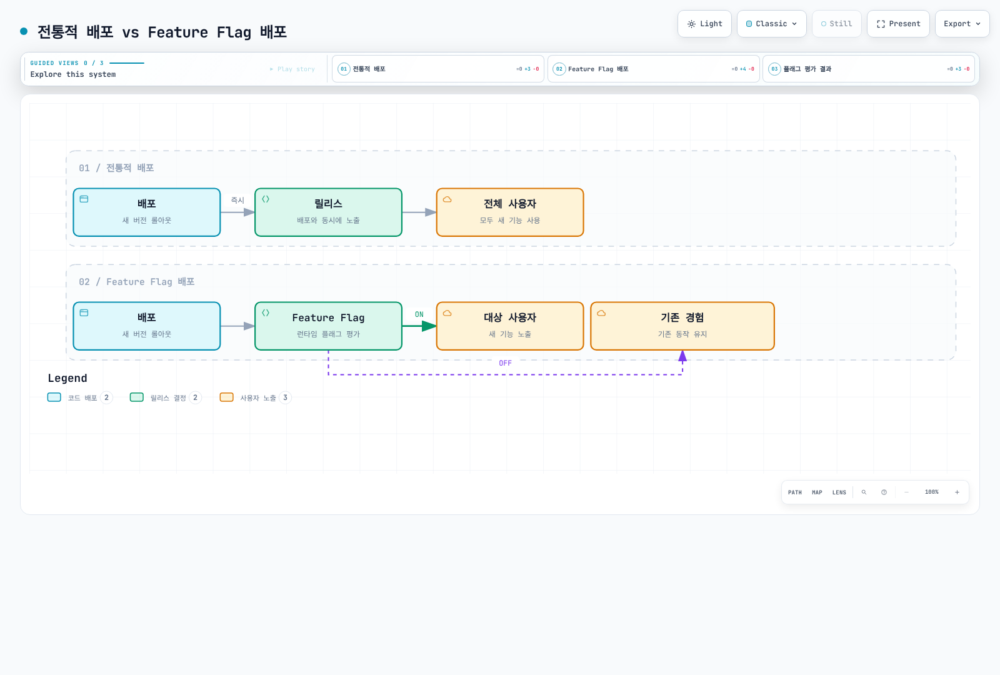

[🔍 인터랙티브 다이어그램 보기](https://www.atomai.click/kubernetes-docs/archmaps/ko-gitops-05-feature-flags-0.html)

### Feature Flag의 유형

| 유형 | 수명 | 목적 | 예시 |
|------|------|------|------|
| **Release Flag** | 단기 (일~주) | 불완전한 기능 숨기기 | 새 결제 시스템 개발 중 숨기기 |
| **Experiment Flag** | 중기 (주~월) | A/B 테스트, 사용자 행동 분석 | 체크아웃 UI 변형 테스트 |
| **Ops Flag** | 장기 | 운영 제어, 서킷 브레이커 | 외부 API 호출 비활성화 |
| **Permission Flag** | 영구적 | 사용자별 기능 접근 제어 | 프리미엄 기능 관리 |

### Progressive Delivery에서의 역할

Progressive Delivery는 기능을 점진적으로 사용자에게 노출하는 배포 전략입니다. Feature Flag는 이 전략의 핵심 구현 수단입니다.

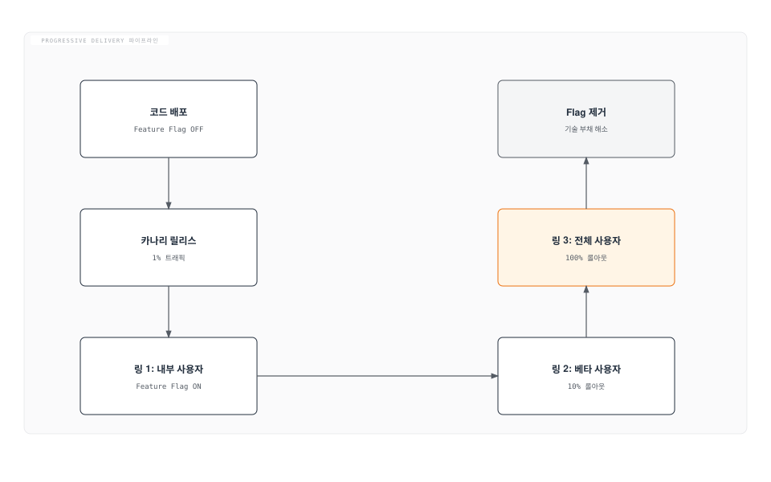

### Feature Flag 도구 비교

| 도구 | 유형 | 오픈소스 | Kubernetes 네이티브 | OpenFeature 지원 | 가격 | 특징 |
|------|------|----------|---------------------|------------------|------|------|
| **flagd** | 경량 평가 엔진 | O | O (CRD) | O (공식) | 무료 | CNCF, 사이드카/독립형 |
| **LaunchDarkly** | SaaS | X | X (SDK) | O (Provider) | 유료 | 엔터프라이즈, 분석 내장 |
| **Flagsmith** | Self-hosted/SaaS | O | 부분적 | O (Provider) | 프리미엄 | 세그먼트, 원격 구성 |
| **Split.io** | SaaS | X | X (SDK) | O (Provider) | 유료 | 실험, 데이터 기반 |
| **Unleash** | Self-hosted/SaaS | O | X (SDK) | O (Provider) | 프리미엄 | 전략 기반, GitOps |
| **CloudBees** | 엔터프라이즈 | X | X (SDK) | O (Provider) | 유료 | CI/CD 통합 |

### OpenFeature 표준

OpenFeature는 CNCF Incubating 프로젝트로, Feature Flag 관리를 위한 벤더 중립적 표준 API를 제공합니다. 특정 벤더에 종속되지 않고 Feature Flag 시스템을 교체하거나 병행 사용할 수 있는 유연성을 제공합니다.

**OpenFeature의 핵심 가치:**

- **벤더 중립성**: Provider 패턴으로 백엔드 교체 가능
- **표준 API**: 언어별 일관된 SDK 인터페이스
- **확장성**: Hooks를 통한 횡단 관심사 처리
- **Kubernetes 네이티브**: CRD와 Operator를 통한 선언적 관리

---

## OpenFeature 아키텍처

### SDK 구조

OpenFeature SDK는 애플리케이션과 Feature Flag 백엔드 사이의 추상화 계층을 제공합니다. 아래 다이어그램은 SDK의 핵심 컴포넌트와 상호작용을 보여줍니다.

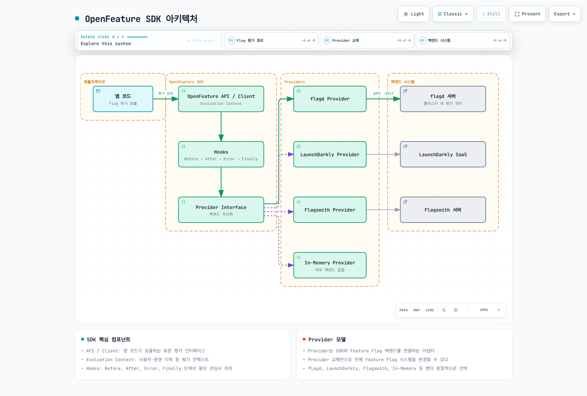

[🔍 인터랙티브 다이어그램 보기](https://www.atomai.click/kubernetes-docs/archmaps/ko-gitops-05-feature-flags-1.html)

### Provider 모델

Provider는 OpenFeature SDK와 구체적인 Feature Flag 백엔드를 연결하는 어댑터입니다. Provider를 교체하는 것만으로 전체 Feature Flag 시스템을 변경할 수 있습니다.

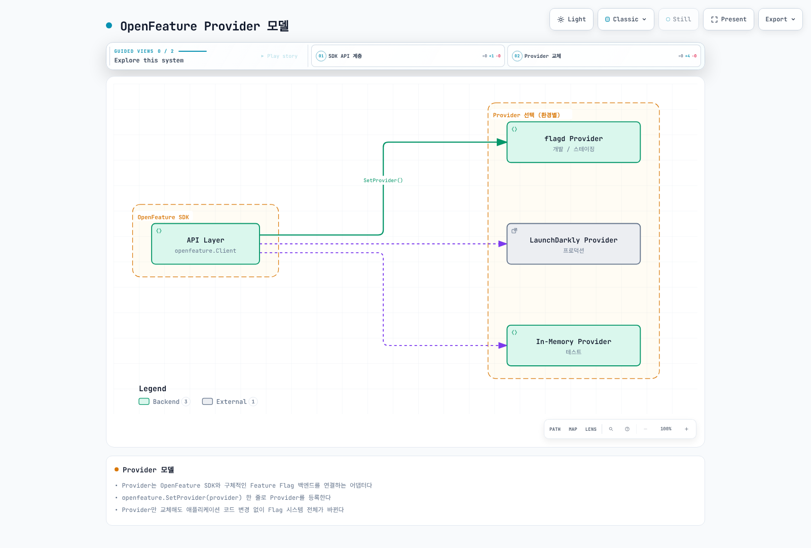

[🔍 인터랙티브 다이어그램 보기](https://www.atomai.click/kubernetes-docs/archmaps/ko-gitops-05-feature-flags-2.html)

**Provider 설정 예시 (Go):**

```go
package main

import (
    "context"
    "github.com/open-feature/go-sdk/openfeature"
    flagd "github.com/open-feature/go-sdk-contrib/providers/flagd/pkg"
)

func main() {
    // flagd Provider 설정
    provider := flagd.NewProvider(
        flagd.WithHost("localhost"),
        flagd.WithPort(8013),
    )

    // OpenFeature에 Provider 등록
    openfeature.SetProvider(provider)

    // Client 생성
    client := openfeature.NewClient("my-service")

    // Feature Flag 평가
    ctx := context.Background()
    value, err := client.BooleanValue(ctx, "new-checkout", false, openfeature.EvaluationContext{})
    if err != nil {
        // 기본값 사용
    }
}
```

### Evaluation Context

Evaluation Context는 Flag 평가 시 사용되는 컨텍스트 정보를 담고 있습니다. 이를 통해 사용자, 환경, 지역 등에 따라 다른 Flag 값을 반환할 수 있습니다.

```go
// Evaluation Context 설정
evalCtx := openfeature.NewEvaluationContext(
    "user-123",  // targeting key
    map[string]interface{}{
        "email":   "user@example.com",
        "region":  "ap-northeast-2",
        "env":     "production",
        "tier":    "premium",
        "version": "2.1.0",
    },
)

// 컨텍스트 기반 Flag 평가
value, _ := client.StringValue(ctx, "banner-color", "blue", evalCtx)
```

### Hooks

Hooks는 Flag 평가 라이프사이클의 각 단계에서 실행되는 콜백입니다. 로깅, 메트릭 수집, 검증 등 횡단 관심사를 처리합니다.

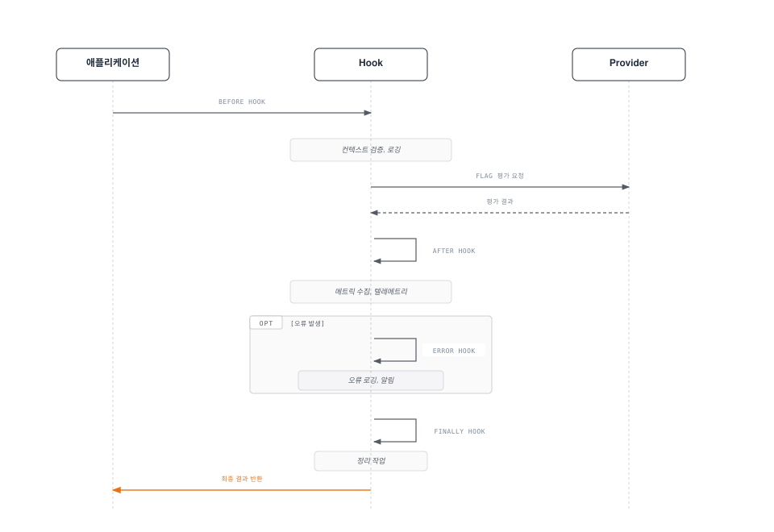

**커스텀 Hook 구현 예시 (Go):**

```go
type MetricsHook struct{}

func (h *MetricsHook) Before(ctx context.Context, hookCtx openfeature.HookContext,
    hints openfeature.HookHints) (*openfeature.EvaluationContext, error) {
    // 평가 시작 시간 기록
    log.Printf("Flag 평가 시작: %s", hookCtx.FlagKey())
    return nil, nil
}

func (h *MetricsHook) After(ctx context.Context, hookCtx openfeature.HookContext,
    details openfeature.InterfaceEvaluationDetails, hints openfeature.HookHints) error {
    // 메트릭 기록
    flagEvaluationCounter.WithLabelValues(
        hookCtx.FlagKey(),
        fmt.Sprintf("%v", details.Value),
        string(details.Reason),
    ).Inc()
    return nil
}

func (h *MetricsHook) Error(ctx context.Context, hookCtx openfeature.HookContext,
    err error, hints openfeature.HookHints) {
    // 오류 메트릭 기록
    flagEvaluationErrors.WithLabelValues(hookCtx.FlagKey()).Inc()
}

func (h *MetricsHook) Finally(ctx context.Context, hookCtx openfeature.HookContext,
    hints openfeature.HookHints) {
    // 정리 작업
}
```

---

## flagd on Kubernetes

### flagd 아키텍처

flagd는 OpenFeature 호환 Feature Flag 평가 엔진으로, 경량이며 Kubernetes 환경에 최적화되어 있습니다. CNCF OpenFeature 프로젝트의 일부로 개발되었습니다.

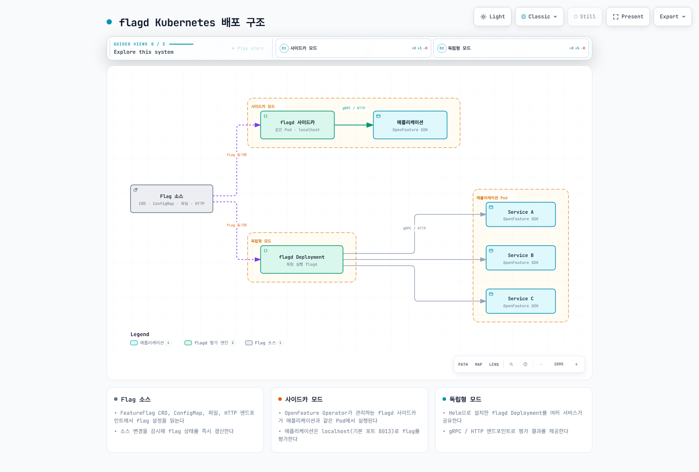

[🔍 인터랙티브 다이어그램 보기](https://www.atomai.click/kubernetes-docs/archmaps/ko-gitops-05-feature-flags-3.html)

### Helm 설치

flagd와 OpenFeature Operator를 Helm으로 설치합니다.

```bash
# OpenFeature Operator Helm 리포지토리 추가
helm repo add openfeature https://open-feature.github.io/open-feature-operator/
helm repo update

# OpenFeature Operator 설치 (flagd 포함)
helm install open-feature-operator openfeature/open-feature-operator \
  --namespace open-feature-operator-system \
  --create-namespace \
  --version 0.7.2 \
  --set flagdProxyConfig.port=8015 \
  --set controllerManager.manager.resources.requests.cpu=100m \
  --set controllerManager.manager.resources.requests.memory=128Mi \
  --set controllerManager.manager.resources.limits.cpu=500m \
  --set controllerManager.manager.resources.limits.memory=512Mi
```

**Helm values 커스터마이징:**

```yaml
# values.yaml
controllerManager:
  manager:
    resources:
      requests:
        cpu: 100m
        memory: 128Mi
      limits:
        cpu: 500m
        memory: 512Mi
    env:
      - name: FLAGD_LOG_LEVEL
        value: "info"

flagdProxyConfig:
  port: 8015
  managementPort: 8016
  debugLogging: false

# Sidecar 기본 설정
sidecarConfig:
  port: 8013
  managementPort: 8014
  image:
    repository: ghcr.io/open-feature/flagd
    tag: v0.11.1
  resources:
    requests:
      cpu: 50m
      memory: 64Mi
    limits:
      cpu: 200m
      memory: 256Mi
```

```bash
# 커스텀 values로 설치
helm install open-feature-operator openfeature/open-feature-operator \
  --namespace open-feature-operator-system \
  --create-namespace \
  -f values.yaml
```

### FeatureFlag CRD

OpenFeature Operator는 `FeatureFlag` CRD를 통해 Kubernetes 네이티브 방식으로 Feature Flag를 정의합니다.

**완전한 FeatureFlag CR YAML 예제:**

```yaml
apiVersion: core.openfeature.dev/v1beta1
kind: FeatureFlag
metadata:
  name: product-flags
  namespace: default
  labels:
    app.kubernetes.io/part-of: product-service
    environment: production
spec:
  flagSpec:
    # Flag 정의
    flags:
      # Boolean Flag - 새로운 결제 시스템
      new-checkout:
        state: ENABLED
        variants:
          "on": true
          "off": false
        defaultVariant: "off"
        targeting:
          # 프리미엄 사용자에게만 활성화
          if:
            - in:
                - var: tier
                - ["premium", "enterprise"]
            - "on"
            - "off"

      # String Flag - 배너 색상
      banner-color:
        state: ENABLED
        variants:
          red: "#FF0000"
          blue: "#0000FF"
          green: "#00FF00"
        defaultVariant: blue
        targeting:
          # 지역별 배너 색상
          if:
            - "=="
              - var: region
              - "ap-northeast-2"
            - red
            - if:
                - "=="
                  - var: region
                  - "us-east-1"
                - green
                - blue

      # Number Flag - API 요청 제한
      rate-limit:
        state: ENABLED
        variants:
          low: 100
          medium: 500
          high: 1000
        defaultVariant: medium
        targeting:
          if:
            - in:
                - var: tier
                - ["enterprise"]
            - high
            - if:
                - in:
                    - var: tier
                    - ["premium"]
                - medium
                - low

      # Object Flag - 기능 구성
      feature-config:
        state: ENABLED
        variants:
          basic:
            maxUploadSize: 10485760
            allowedFormats: ["jpg", "png"]
            enableOCR: false
          advanced:
            maxUploadSize: 104857600
            allowedFormats: ["jpg", "png", "pdf", "webp"]
            enableOCR: true
        defaultVariant: basic
        targeting:
          if:
            - in:
                - var: tier
                - ["premium", "enterprise"]
            - advanced
            - basic

      # 점진적 롤아웃 Flag
      new-recommendation-engine:
        state: ENABLED
        variants:
          "on": true
          "off": false
        defaultVariant: "off"
        targeting:
          # 30% 사용자에게 점진적 롤아웃
          fractional:
            - - "on"
              - 30
            - - "off"
              - 70
```

### Sidecar Injection vs Standalone Deployment

flagd는 두 가지 배포 모드를 지원합니다. 각 모드의 특징과 적합한 사용 사례를 비교합니다.

| 특성 | Sidecar 모드 | Standalone 모드 |
|------|-------------|----------------|
| **배포 방식** | Pod당 사이드카 컨테이너 | 별도의 Deployment |
| **네트워크 지연** | 최소 (localhost) | Pod 간 네트워크 통신 |
| **리소스 사용** | Pod마다 추가 리소스 | 중앙 집중형 리소스 |
| **확장성** | Pod 수에 비례 | 독립적 확장 |
| **장애 격리** | 높음 (Pod 단위) | 낮음 (단일 장애점) |
| **적합 환경** | 지연에 민감한 서비스 | 마이크로서비스가 많은 환경 |

**Sidecar 모드 구성:**

```yaml
apiVersion: apps/v1
kind: Deployment
metadata:
  name: my-app
  namespace: default
spec:
  replicas: 3
  selector:
    matchLabels:
      app: my-app
  template:
    metadata:
      labels:
        app: my-app
      annotations:
        # OpenFeature Operator가 flagd 사이드카 자동 주입
        openfeature.dev/enabled: "true"
        openfeature.dev/flagsourceconfiguration: "flag-source-config"
    spec:
      containers:
        - name: my-app
          image: my-app:v1.0.0
          ports:
            - containerPort: 8080
          env:
            # flagd 사이드카 연결 정보
            - name: FLAGD_HOST
              value: "localhost"
            - name: FLAGD_PORT
              value: "8013"
```

**Standalone 모드 구성:**

```yaml
apiVersion: apps/v1
kind: Deployment
metadata:
  name: flagd-standalone
  namespace: flag-system
spec:
  replicas: 3
  selector:
    matchLabels:
      app: flagd
  template:
    metadata:
      labels:
        app: flagd
    spec:
      containers:
        - name: flagd
          image: ghcr.io/open-feature/flagd:v0.11.1
          ports:
            - containerPort: 8013
              name: flag-eval
            - containerPort: 8014
              name: management
          args:
            - start
            - --uri
            - core.openfeature.dev/product-flags
          resources:
            requests:
              cpu: 100m
              memory: 128Mi
            limits:
              cpu: 500m
              memory: 512Mi
          readinessProbe:
            httpGet:
              path: /readyz
              port: 8014
            initialDelaySeconds: 5
            periodSeconds: 10
          livenessProbe:
            httpGet:
              path: /healthz
              port: 8014
            initialDelaySeconds: 10
            periodSeconds: 15
---
apiVersion: v1
kind: Service
metadata:
  name: flagd
  namespace: flag-system
spec:
  selector:
    app: flagd
  ports:
    - name: flag-eval
      port: 8013
      targetPort: 8013
    - name: management
      port: 8014
      targetPort: 8014
```

---

## OpenFeature Operator

### CRD 기반 Feature Flag 관리

OpenFeature Operator는 Kubernetes 클러스터에서 Feature Flag를 선언적으로 관리하기 위한 컨트롤러입니다. CRD를 통해 Flag 정의, 소스 구성, 자동 사이드카 주입을 처리합니다.

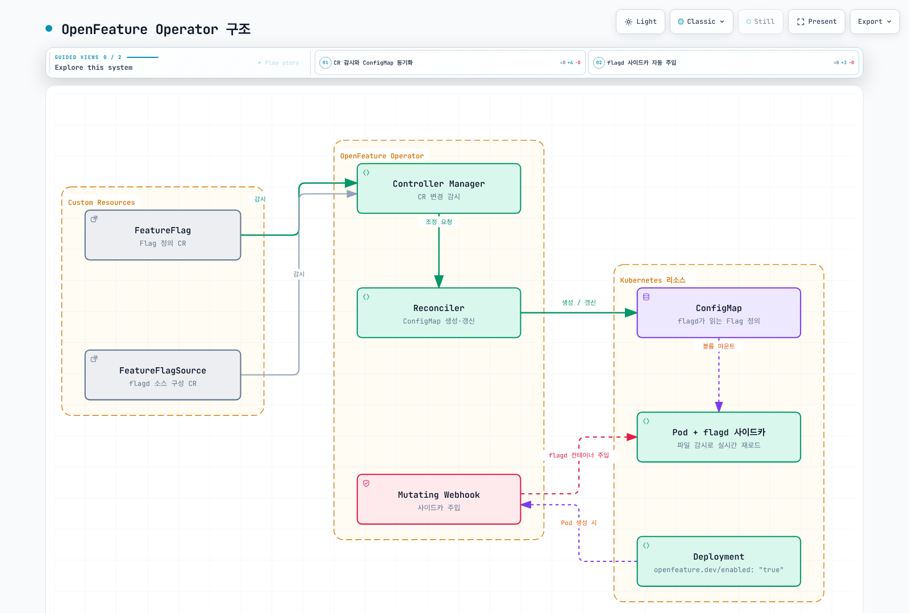

[🔍 인터랙티브 다이어그램 보기](https://www.atomai.click/kubernetes-docs/archmaps/ko-gitops-05-feature-flags-6.html)

### FeatureFlagSource CRD

`FeatureFlagSource`는 flagd가 Flag 정의를 가져올 소스를 지정하는 CRD입니다.

```yaml
apiVersion: core.openfeature.dev/v1beta1
kind: FeatureFlagSource
metadata:
  name: flag-source-config
  namespace: default
spec:
  sources:
    # CRD 기반 소스 (FeatureFlag CR에서 로드)
    - source: default/product-flags
      provider: kubernetes

    # HTTP 엔드포인트 소스
    - source: http://flag-config-service:8080/flags
      provider: http
      httpSyncBearerToken: "token-secret"

    # gRPC 소스
    - source: grpc://flag-sync-service:8015
      provider: grpc
      certPath: /certs/ca.crt
      
  # flagd 사이드카 포트 설정
  port: 8013
  managementPort: 8014
  
  # 평가 캐시 설정
  evaluator: json
  
  # 동기화 주기
  syncProviderArgs:
    - --sync-provider-args
    - "interval=10"

  # 리소스 제한
  resources:
    requests:
      cpu: 50m
      memory: 64Mi
    limits:
      cpu: 200m
      memory: 256Mi
```

### Pod 자동 Injection

OpenFeature Operator의 Mutating Webhook은 특정 어노테이션이 있는 Pod에 flagd 사이드카를 자동 주입합니다.

**Namespace 레벨 활성화:**

```yaml
apiVersion: v1
kind: Namespace
metadata:
  name: feature-flag-apps
  labels:
    # Namespace 전체에 flagd 사이드카 주입 활성화 (선택적)
    openfeature.dev/enabled: "true"
```

**Deployment 레벨 활성화:**

```yaml
apiVersion: apps/v1
kind: Deployment
metadata:
  name: order-service
  namespace: feature-flag-apps
spec:
  replicas: 3
  selector:
    matchLabels:
      app: order-service
  template:
    metadata:
      labels:
        app: order-service
      annotations:
        # flagd 사이드카 주입 활성화
        openfeature.dev/enabled: "true"
        # 사용할 FeatureFlagSource 지정
        openfeature.dev/flagsourceconfiguration: "flag-source-config"
    spec:
      serviceAccountName: order-service
      containers:
        - name: order-service
          image: order-service:v2.0.0
          ports:
            - containerPort: 8080
          env:
            - name: FLAGD_HOST
              value: "localhost"
            - name: FLAGD_PORT
              value: "8013"
          resources:
            requests:
              cpu: 250m
              memory: 256Mi
            limits:
              cpu: 500m
              memory: 512Mi
```

주입 후 Pod 사양은 아래와 같이 자동 변환됩니다:

```yaml
# Webhook이 주입한 결과 (kubectl get pod -o yaml)
spec:
  containers:
    - name: order-service
      image: order-service:v2.0.0
      # ... 기존 설정 유지
    - name: flagd
      image: ghcr.io/open-feature/flagd:v0.11.1
      ports:
        - containerPort: 8013
        - containerPort: 8014
      args:
        - start
        - --uri
        - core.openfeature.dev/default/product-flags
      resources:
        requests:
          cpu: 50m
          memory: 64Mi
        limits:
          cpu: 200m
          memory: 256Mi
```

### ConfigMap/CRD 동기화

OpenFeature Operator는 FeatureFlag CRD를 ConfigMap으로 변환하여 flagd가 읽을 수 있도록 합니다. CRD가 변경되면 ConfigMap이 자동 업데이트되고, flagd는 파일 시스템 감시를 통해 실시간으로 변경을 감지합니다.

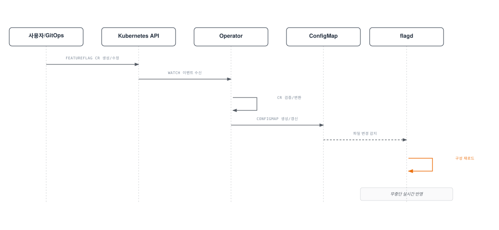

---

## 애플리케이션 통합

### Go SDK

```go
package main

import (
    "context"
    "fmt"
    "log"
    "net/http"

    "github.com/open-feature/go-sdk/openfeature"
    flagd "github.com/open-feature/go-sdk-contrib/providers/flagd/pkg"
)

func main() {
    // Provider 초기화
    provider := flagd.NewProvider(
        flagd.WithHost("localhost"),
        flagd.WithPort(8013),
        flagd.WithResolverType(flagd.RPC),
    )
    openfeature.SetProvider(provider)
    defer openfeature.Shutdown()

    // 글로벌 Hook 등록
    openfeature.AddHooks(&MetricsHook{})

    // Client 생성
    client := openfeature.NewClient("order-service")

    http.HandleFunc("/checkout", func(w http.ResponseWriter, r *http.Request) {
        ctx := r.Context()

        // Evaluation Context 구성
        evalCtx := openfeature.NewEvaluationContext(
            r.Header.Get("X-User-ID"),
            map[string]interface{}{
                "region": r.Header.Get("X-Region"),
                "tier":   r.Header.Get("X-User-Tier"),
                "env":    "production",
            },
        )

        // Boolean Flag 평가
        useNewCheckout, _ := client.BooleanValue(ctx, "new-checkout", false, evalCtx)

        if useNewCheckout {
            handleNewCheckout(w, r)
        } else {
            handleLegacyCheckout(w, r)
        }
    })

    http.HandleFunc("/api/config", func(w http.ResponseWriter, r *http.Request) {
        ctx := r.Context()
        evalCtx := openfeature.NewEvaluationContext(
            r.Header.Get("X-User-ID"),
            map[string]interface{}{"tier": r.Header.Get("X-User-Tier")},
        )

        // Number Flag 평가
        rateLimit, _ := client.FloatValue(ctx, "rate-limit", 100, evalCtx)

        // Object Flag 평가
        featureConfig, _ := client.ObjectValue(ctx, "feature-config", map[string]interface{}{
            "maxUploadSize":  10485760,
            "allowedFormats": []string{"jpg", "png"},
            "enableOCR":      false,
        }, evalCtx)

        fmt.Fprintf(w, "Rate Limit: %.0f, Config: %v", rateLimit, featureConfig)
    })

    log.Fatal(http.ListenAndServe(":8080", nil))
}
```

### Java SDK

```java
import dev.openfeature.sdk.*;
import dev.openfeature.contrib.providers.flagd.FlagdProvider;
import dev.openfeature.contrib.providers.flagd.FlagdOptions;

@Service
public class FeatureFlagService {

    private final Client client;

    public FeatureFlagService() {
        // flagd Provider 설정
        FlagdProvider provider = new FlagdProvider(
            FlagdOptions.builder()
                .host("localhost")
                .port(8013)
                .resolverType(FlagdOptions.ResolverType.RPC)
                .build()
        );

        OpenFeatureAPI api = OpenFeatureAPI.getInstance();
        api.setProvider(provider);

        // Client 생성
        this.client = api.getClient("order-service");
    }

    public boolean isNewCheckoutEnabled(String userId, String region, String tier) {
        // Evaluation Context 구성
        MutableContext ctx = new MutableContext(userId);
        ctx.add("region", region);
        ctx.add("tier", tier);
        ctx.add("env", "production");

        // Boolean Flag 평가
        return client.getBooleanValue("new-checkout", false, ctx);
    }

    public String getBannerColor(String userId, String region) {
        MutableContext ctx = new MutableContext(userId);
        ctx.add("region", region);

        // String Flag 평가
        return client.getStringValue("banner-color", "#0000FF", ctx);
    }

    public int getRateLimit(String userId, String tier) {
        MutableContext ctx = new MutableContext(userId);
        ctx.add("tier", tier);

        // Number Flag 평가
        return client.getIntegerValue("rate-limit", 100, ctx);
    }

    public Value getFeatureConfig(String userId, String tier) {
        MutableContext ctx = new MutableContext(userId);
        ctx.add("tier", tier);

        // Object Flag 평가
        return client.getObjectValue("feature-config",
            new Value(Map.of(
                "maxUploadSize", new Value(10485760),
                "enableOCR", new Value(false)
            )),
            ctx
        );
    }
}
```

### Python SDK

```python
from openfeature import api
from openfeature.contrib.provider.flagd import FlagdProvider
from openfeature.evaluation_context import EvaluationContext

# Provider 초기화
provider = FlagdProvider(
    host="localhost",
    port=8013,
    resolver_type="rpc",
)
api.set_provider(provider)

# Client 생성
client = api.get_client("order-service")


def check_new_checkout(user_id: str, region: str, tier: str) -> bool:
    """새로운 체크아웃 기능 활성화 여부 확인"""
    ctx = EvaluationContext(
        targeting_key=user_id,
        attributes={
            "region": region,
            "tier": tier,
            "env": "production",
        },
    )
    return client.get_boolean_value("new-checkout", default_value=False, evaluation_context=ctx)


def get_rate_limit(user_id: str, tier: str) -> int:
    """사용자 등급별 API 요청 제한 조회"""
    ctx = EvaluationContext(
        targeting_key=user_id,
        attributes={"tier": tier},
    )
    return client.get_integer_value("rate-limit", default_value=100, evaluation_context=ctx)


def get_feature_config(user_id: str, tier: str) -> dict:
    """기능 구성 객체 조회"""
    ctx = EvaluationContext(
        targeting_key=user_id,
        attributes={"tier": tier},
    )
    default_config = {
        "maxUploadSize": 10485760,
        "allowedFormats": ["jpg", "png"],
        "enableOCR": False,
    }
    return client.get_object_value("feature-config", default_value=default_config, evaluation_context=ctx)


# FastAPI 연동 예시
from fastapi import FastAPI, Request

app = FastAPI()


@app.get("/checkout")
async def checkout(request: Request):
    user_id = request.headers.get("X-User-ID", "anonymous")
    region = request.headers.get("X-Region", "us-east-1")
    tier = request.headers.get("X-User-Tier", "free")

    if check_new_checkout(user_id, region, tier):
        return {"checkout": "new", "message": "새로운 결제 시스템"}
    else:
        return {"checkout": "legacy", "message": "기존 결제 시스템"}
```

### Node.js SDK

```typescript
import { OpenFeature, EvaluationContext } from '@openfeature/server-sdk';
import { FlagdProvider } from '@openfeature/flagd-provider';
import express from 'express';

// Provider 초기화
const provider = new FlagdProvider({
  host: 'localhost',
  port: 8013,
  resolverType: 'rpc',
});

OpenFeature.setProvider(provider);
const client = OpenFeature.getClient('order-service');

const app = express();

app.get('/checkout', async (req, res) => {
  const evalCtx: EvaluationContext = {
    targetingKey: req.headers['x-user-id'] as string || 'anonymous',
    region: req.headers['x-region'] as string || 'us-east-1',
    tier: req.headers['x-user-tier'] as string || 'free',
    env: 'production',
  };

  // Boolean Flag 평가
  const useNewCheckout = await client.getBooleanValue('new-checkout', false, evalCtx);

  // String Flag 평가
  const bannerColor = await client.getStringValue('banner-color', '#0000FF', evalCtx);

  // Number Flag 평가
  const rateLimit = await client.getNumberValue('rate-limit', 100, evalCtx);

  // Object Flag 평가
  const featureConfig = await client.getObjectValue('feature-config', {
    maxUploadSize: 10485760,
    allowedFormats: ['jpg', 'png'],
    enableOCR: false,
  }, evalCtx);

  if (useNewCheckout) {
    res.json({
      checkout: 'new',
      bannerColor,
      rateLimit,
      features: featureConfig,
    });
  } else {
    res.json({
      checkout: 'legacy',
      bannerColor,
      rateLimit,
      features: featureConfig,
    });
  }
});

app.listen(8080, () => {
  console.log('Order service listening on port 8080');
});
```

### Targeting Rules

Targeting Rule은 특정 조건에 따라 다른 Flag 값을 반환하는 규칙입니다. flagd는 JSON Logic 기반의 표현식을 사용합니다.

```yaml
apiVersion: core.openfeature.dev/v1beta1
kind: FeatureFlag
metadata:
  name: targeting-examples
  namespace: default
spec:
  flagSpec:
    flags:
      # 사용자 세그먼트 기반 타겟팅
      premium-feature:
        state: ENABLED
        variants:
          "on": true
          "off": false
        defaultVariant: "off"
        targeting:
          if:
            - or:
                - in:
                    - var: email
                    - ["admin@company.com", "beta@company.com"]
                - and:
                    - "=="
                      - var: tier
                      - "enterprise"
                    - ">="
                      - var: account_age_days
                      - 30
            - "on"
            - "off"

      # 점진적 비율 기반 롤아웃
      new-search-algo:
        state: ENABLED
        variants:
          "on": true
          "off": false
        defaultVariant: "off"
        targeting:
          fractional:
            - - "on"
              - 20    # 20% 사용자에게 활성화
            - - "off"
              - 80

      # 날짜/시간 기반 타겟팅 (semver 비교)
      api-v2:
        state: ENABLED
        variants:
          "on": true
          "off": false
        defaultVariant: "off"
        targeting:
          if:
            - sem_ver:
                - var: app_version
                - ">="
                - "2.0.0"
            - "on"
            - "off"
```

---

## Canary Release와 Feature Flag 조합

### Flagger + Feature Flag 워크플로우

Flagger(또는 Argo Rollouts)와 Feature Flag를 결합하면, 인프라 수준의 트래픽 분할과 애플리케이션 수준의 기능 제어를 함께 활용하여 더욱 정교한 배포 전략을 구현할 수 있습니다.

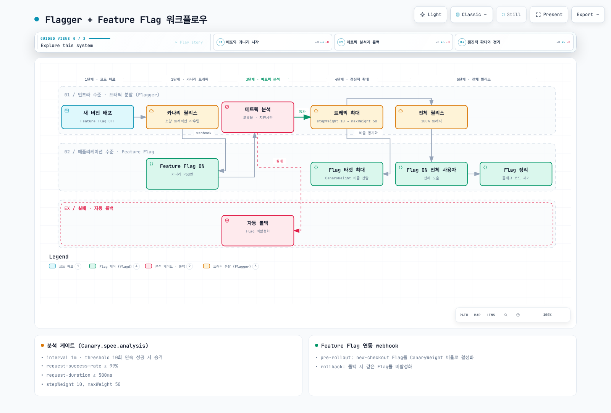

[🔍 인터랙티브 다이어그램 보기](https://www.atomai.click/kubernetes-docs/archmaps/ko-gitops-05-feature-flags-7.html)

**Flagger Canary + FeatureFlag 조합 예시:**

```yaml
# Flagger Canary 리소스
apiVersion: flagger.app/v1beta1
kind: Canary
metadata:
  name: order-service
  namespace: default
spec:
  targetRef:
    apiVersion: apps/v1
    kind: Deployment
    name: order-service
  progressDeadlineSeconds: 600
  service:
    port: 8080
    targetPort: 8080
  analysis:
    # 분석 간격
    interval: 1m
    # 승격까지 필요한 성공 횟수
    threshold: 10
    # 최대 카나리 트래픽 비율
    maxWeight: 50
    # 단계별 증가량
    stepWeight: 10
    metrics:
      - name: request-success-rate
        thresholdRange:
          min: 99
        interval: 1m
      - name: request-duration
        thresholdRange:
          max: 500
        interval: 1m
    # Feature Flag 연동 Webhook
    webhooks:
      - name: enable-feature-flag
        type: pre-rollout
        url: http://flag-controller.flag-system/api/v1/flags/new-checkout/enable
        timeout: 30s
        metadata:
          type: "canary"
          percentage: "{{.CanaryWeight}}"
      - name: disable-feature-flag-on-rollback
        type: rollback
        url: http://flag-controller.flag-system/api/v1/flags/new-checkout/disable
        timeout: 30s
```

### A/B 테스트 시나리오

Feature Flag를 활용한 A/B 테스트는 동일한 인프라에서 서로 다른 기능 변형을 사용자에게 노출합니다.

```yaml
apiVersion: core.openfeature.dev/v1beta1
kind: FeatureFlag
metadata:
  name: ab-test-checkout
  namespace: default
spec:
  flagSpec:
    flags:
      # A/B 테스트: 체크아웃 UI 변형
      checkout-variant:
        state: ENABLED
        variants:
          control: "classic"         # 기존 UI (대조군)
          variant-a: "streamlined"   # 간소화된 UI
          variant-b: "one-click"     # 원클릭 구매
        defaultVariant: control
        targeting:
          # 사용자를 균등하게 3개 그룹으로 분배
          fractional:
            - - control
              - 34
            - - variant-a
              - 33
            - - variant-b
              - 33
```

```go
// A/B 테스트 애플리케이션 코드
func handleCheckout(w http.ResponseWriter, r *http.Request) {
    ctx := r.Context()
    evalCtx := openfeature.NewEvaluationContext(
        r.Header.Get("X-User-ID"),
        map[string]interface{}{},
    )

    // Flag 평가 - 상세 결과 포함
    details, _ := client.StringValueDetails(ctx, "checkout-variant", "classic", evalCtx)

    // 메트릭 기록 (어떤 변형이 사용되었는지)
    abTestMetric.WithLabelValues(
        "checkout-variant",
        details.Value,
        string(details.Reason),
    ).Inc()

    switch details.Value {
    case "streamlined":
        renderStreamlinedCheckout(w, r)
    case "one-click":
        renderOneClickCheckout(w, r)
    default:
        renderClassicCheckout(w, r)
    }
}
```

### 다크 런칭 (Dark Launch) 패턴

다크 런칭은 사용자에게 노출하지 않으면서 프로덕션 트래픽으로 새로운 기능을 검증하는 패턴입니다.

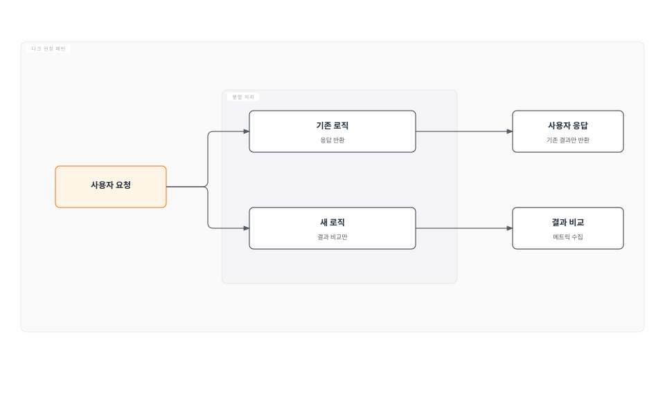

```go
// 다크 런칭 구현 예시
func handleSearch(w http.ResponseWriter, r *http.Request) {
    ctx := r.Context()
    query := r.URL.Query().Get("q")
    evalCtx := openfeature.NewEvaluationContext(r.Header.Get("X-User-ID"), nil)

    // 다크 런칭 Flag 확인
    darkLaunchEnabled, _ := client.BooleanValue(ctx, "dark-launch-new-search", false, evalCtx)

    // 기존 검색 실행 (항상 사용자에게 반환)
    oldResults := legacySearch(ctx, query)

    if darkLaunchEnabled {
        // 새 검색 엔진을 비동기로 실행 (사용자에게는 보이지 않음)
        go func() {
            newResults := newSearchEngine(ctx, query)
            
            // 결과 비교 및 메트릭 수집
            compareResults(query, oldResults, newResults)
        }()
    }

    // 기존 결과만 반환
    json.NewEncoder(w).Encode(oldResults)
}

func compareResults(query string, old, new []SearchResult) {
    // 정확도 비교
    overlap := calculateOverlap(old, new)
    darkLaunchAccuracy.WithLabelValues("search").Observe(overlap)

    // 결과 수 차이
    darkLaunchResultDiff.WithLabelValues("search").Observe(
        float64(len(new) - len(old)),
    )
}
```

### 메트릭 기반 자동 롤아웃

Prometheus 메트릭을 기반으로 Feature Flag를 자동으로 점진적 롤아웃하는 패턴입니다.

```yaml
# 자동 롤아웃 컨트롤러 ConfigMap
apiVersion: v1
kind: ConfigMap
metadata:
  name: auto-rollout-config
  namespace: flag-system
data:
  rollout-policy.yaml: |
    flags:
      new-recommendation-engine:
        stages:
          - percentage: 5
            duration: 30m
            successCriteria:
              - metric: "flag_evaluation_error_rate{flag='new-recommendation-engine'}"
                threshold: 0.01
                operator: "<"
              - metric: "http_request_duration_seconds{handler='recommendations',quantile='0.99'}"
                threshold: 2.0
                operator: "<"
          - percentage: 25
            duration: 2h
            successCriteria:
              - metric: "flag_evaluation_error_rate{flag='new-recommendation-engine'}"
                threshold: 0.01
                operator: "<"
          - percentage: 50
            duration: 4h
            successCriteria:
              - metric: "recommendation_click_rate"
                threshold: 0.05
                operator: ">="
          - percentage: 100
            duration: 0
        rollbackCriteria:
          - metric: "http_server_errors_total{handler='recommendations'}"
            threshold: 50
            operator: ">="
            window: 5m
```

---

## GitOps 통합

### Feature Flag as Code (Git 관리)

Feature Flag를 Git 저장소에서 코드처럼 관리하면 변경 이력 추적, 코드 리뷰, 자동 배포 등 GitOps의 이점을 모두 활용할 수 있습니다.

**권장 디렉토리 구조:**

```
gitops-repo/
├── base/
│   └── feature-flags/
│       ├── kustomization.yaml
│       ├── product-flags.yaml       # 제품 관련 Flag
│       ├── experiment-flags.yaml    # 실험용 Flag
│       └── ops-flags.yaml           # 운영용 Flag
├── overlays/
│   ├── dev/
│   │   └── feature-flags/
│   │       ├── kustomization.yaml
│   │       └── patches/
│   │           └── enable-all-flags.yaml  # 개발환경: 모든 Flag ON
│   ├── staging/
│   │   └── feature-flags/
│   │       ├── kustomization.yaml
│   │       └── patches/
│   │           └── staging-rollout.yaml   # 스테이징: 50% 롤아웃
│   └── production/
│       └── feature-flags/
│           ├── kustomization.yaml
│           └── patches/
│               └── prod-rollout.yaml      # 프로덕션: 점진적 롤아웃
```

**base/feature-flags/kustomization.yaml:**

```yaml
apiVersion: kustomize.config.k8s.io/v1beta1
kind: Kustomization
resources:
  - product-flags.yaml
  - experiment-flags.yaml
  - ops-flags.yaml
```

**overlays/production/feature-flags/patches/prod-rollout.yaml:**

```yaml
apiVersion: core.openfeature.dev/v1beta1
kind: FeatureFlag
metadata:
  name: product-flags
  namespace: default
spec:
  flagSpec:
    flags:
      new-checkout:
        state: ENABLED
        targeting:
          # 프로덕션: 10%만 점진적 롤아웃
          fractional:
            - - "on"
              - 10
            - - "off"
              - 90
```

### ArgoCD로 FeatureFlag CR 배포

ArgoCD Application으로 Feature Flag를 관리하는 예시입니다.

```yaml
apiVersion: argoproj.io/v1alpha1
kind: Application
metadata:
  name: feature-flags
  namespace: argocd
  labels:
    app.kubernetes.io/part-of: feature-management
  annotations:
    # Slack 알림 설정
    notifications.argoproj.io/subscribe.on-sync-succeeded.slack: feature-flag-changes
    notifications.argoproj.io/subscribe.on-sync-failed.slack: platform-alerts
spec:
  project: platform
  source:
    repoURL: https://github.com/my-org/gitops-config
    targetRevision: main
    path: overlays/production/feature-flags
  destination:
    server: https://kubernetes.default.svc
    namespace: default
  syncPolicy:
    automated:
      prune: true
      selfHeal: true
    syncOptions:
      - CreateNamespace=true
      - ApplyOutOfSyncOnly=true
    retry:
      limit: 3
      backoff:
        duration: 5s
        factor: 2
        maxDuration: 3m
```

### Flux로 FeatureFlag CR 배포

FluxCD를 사용한 Feature Flag 배포 구성입니다.

```yaml
# GitRepository 소스 정의
apiVersion: source.toolkit.fluxcd.io/v1
kind: GitRepository
metadata:
  name: feature-flags
  namespace: flux-system
spec:
  interval: 1m
  url: https://github.com/my-org/gitops-config
  ref:
    branch: main
  secretRef:
    name: git-credentials
---
# Kustomization으로 Feature Flag 배포
apiVersion: kustomize.toolkit.fluxcd.io/v1
kind: Kustomization
metadata:
  name: feature-flags-production
  namespace: flux-system
spec:
  interval: 5m
  sourceRef:
    kind: GitRepository
    name: feature-flags
  path: ./overlays/production/feature-flags
  prune: true
  healthChecks:
    - apiVersion: core.openfeature.dev/v1beta1
      kind: FeatureFlag
      name: product-flags
      namespace: default
  # 의존성: OpenFeature Operator가 먼저 배포되어야 함
  dependsOn:
    - name: openfeature-operator
```

### PR 기반 Flag 변경 워크플로우

Feature Flag 변경을 PR(Pull Request) 기반으로 관리하면 코드 리뷰, 승인 프로세스, 자동 테스트를 통해 안전하게 Flag를 제어할 수 있습니다.

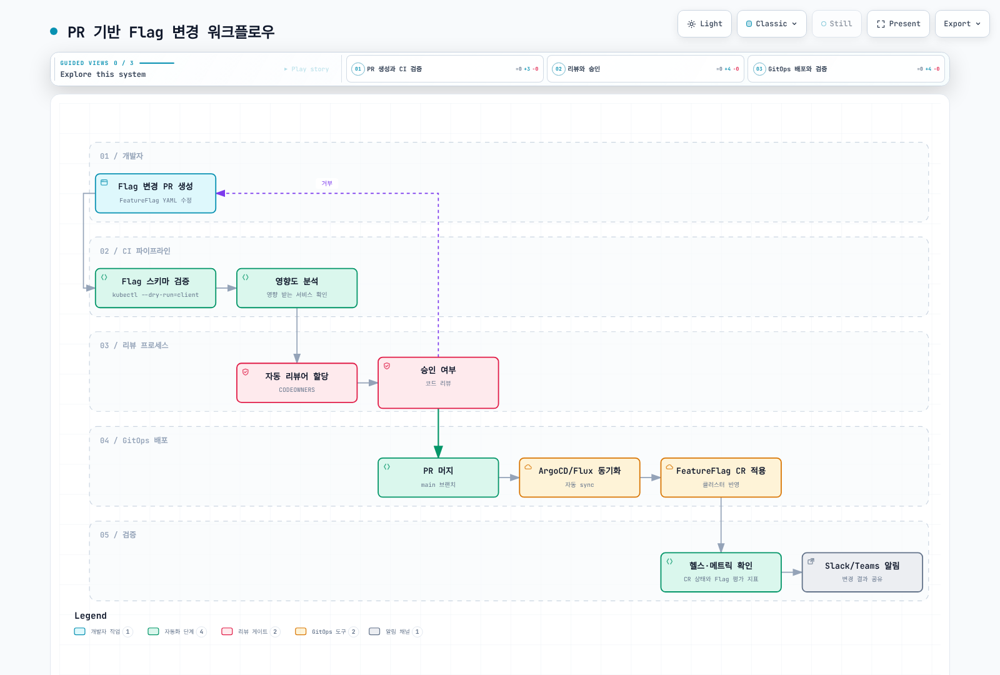

[🔍 인터랙티브 다이어그램 보기](https://www.atomai.click/kubernetes-docs/archmaps/ko-gitops-05-feature-flags-8.html)

**GitHub Actions CI 파이프라인 예시:**

```yaml
# .github/workflows/feature-flag-ci.yaml
name: Feature Flag Validation

on:
  pull_request:
    paths:
      - 'overlays/**/feature-flags/**'
      - 'base/feature-flags/**'

jobs:
  validate:
    runs-on: ubuntu-latest
    steps:
      - uses: actions/checkout@v4

      - name: Flag 스키마 검증
        run: |
          # FeatureFlag CRD 스키마 검증
          for file in $(find . -name '*-flags.yaml' -path '*/feature-flags/*'); do
            echo "Validating: $file"
            kubectl apply --dry-run=client -f "$file" 2>&1 || exit 1
          done

      - name: Flag 이름 규칙 검증
        run: |
          # Flag 이름이 kebab-case인지 확인
          python3 scripts/validate-flag-names.py

      - name: 영향도 분석
        run: |
          # 변경된 Flag 목록과 영향 받는 서비스 확인
          python3 scripts/analyze-flag-impact.py \
            --changed-files "${{ steps.changed.outputs.files }}" \
            --output-format markdown >> $GITHUB_STEP_SUMMARY

      - name: PR 코멘트에 변경 요약 추가
        uses: actions/github-script@v7
        with:
          script: |
            const summary = `## Feature Flag 변경 요약
            
            | Flag | 변경 유형 | 영향 서비스 |
            |------|-----------|------------|
            | new-checkout | 롤아웃 비율 변경 (10% → 30%) | order-service, payment-service |
            
            **검증 결과**: 스키마 검증 통과, 네이밍 규칙 준수`;
            
            github.rest.issues.createComment({
              issue_number: context.issue.number,
              owner: context.repo.owner,
              repo: context.repo.repo,
              body: summary
            });
```

---

## Observability

### Flag 평가 메트릭 (Prometheus)

Feature Flag 평가 결과를 Prometheus 메트릭으로 수집하여 모니터링합니다.

```yaml
# flagd ServiceMonitor
apiVersion: monitoring.coreos.com/v1
kind: ServiceMonitor
metadata:
  name: flagd-metrics
  namespace: monitoring
  labels:
    app: flagd
spec:
  selector:
    matchLabels:
      app: flagd
  endpoints:
    - port: management
      path: /metrics
      interval: 15s
  namespaceSelector:
    matchNames:
      - default
      - flag-system
```

**flagd가 노출하는 주요 메트릭:**

| 메트릭 이름 | 유형 | 설명 |
|-------------|------|------|
| `flagd_impressions_total` | Counter | Flag 평가 총 횟수 |
| `flagd_reasons_total` | Counter | 평가 이유별 횟수 (TARGETING_MATCH, DEFAULT 등) |
| `flagd_evaluation_requests_total` | Counter | 평가 요청 총 횟수 |
| `flagd_evaluation_errors_total` | Counter | 평가 오류 횟수 |
| `flagd_sync_requests_total` | Counter | Flag 동기화 요청 횟수 |
| `flagd_http_request_duration_seconds` | Histogram | HTTP 요청 처리 시간 |

**애플리케이션 레벨 커스텀 메트릭:**

```go
import (
    "github.com/prometheus/client_golang/prometheus"
    "github.com/prometheus/client_golang/prometheus/promauto"
)

var (
    // Flag 평가 결과 카운터
    flagEvaluationTotal = promauto.NewCounterVec(
        prometheus.CounterOpts{
            Name: "app_feature_flag_evaluation_total",
            Help: "Feature flag 평가 결과 카운터",
        },
        []string{"flag_key", "variant", "reason"},
    )

    // Flag 평가 지연시간
    flagEvaluationDuration = promauto.NewHistogramVec(
        prometheus.HistogramOpts{
            Name:    "app_feature_flag_evaluation_duration_seconds",
            Help:    "Feature flag 평가 소요 시간",
            Buckets: prometheus.DefBuckets,
        },
        []string{"flag_key"},
    )

    // A/B 테스트 전환율
    abTestConversion = promauto.NewCounterVec(
        prometheus.CounterOpts{
            Name: "app_ab_test_conversion_total",
            Help: "A/B 테스트 전환 횟수",
        },
        []string{"experiment", "variant", "action"},
    )
)
```

### Grafana 대시보드

Feature Flag 모니터링을 위한 Grafana 대시보드 구성입니다.

```yaml
# Grafana Dashboard ConfigMap
apiVersion: v1
kind: ConfigMap
metadata:
  name: feature-flag-dashboard
  namespace: monitoring
  labels:
    grafana_dashboard: "1"
data:
  feature-flag-dashboard.json: |
    {
      "dashboard": {
        "title": "Feature Flag Overview",
        "panels": [
          {
            "title": "Flag 평가 총 횟수 (시간당)",
            "type": "timeseries",
            "targets": [
              {
                "expr": "sum(rate(flagd_impressions_total[5m])) by (flag_key)",
                "legendFormat": "{{flag_key}}"
              }
            ]
          },
          {
            "title": "Flag 변형 분포",
            "type": "piechart",
            "targets": [
              {
                "expr": "sum(flagd_impressions_total) by (flag_key, variant)",
                "legendFormat": "{{flag_key}} - {{variant}}"
              }
            ]
          },
          {
            "title": "Flag 평가 오류율",
            "type": "stat",
            "targets": [
              {
                "expr": "sum(rate(flagd_evaluation_errors_total[5m])) / sum(rate(flagd_evaluation_requests_total[5m])) * 100",
                "legendFormat": "오류율 (%)"
              }
            ]
          },
          {
            "title": "Flag 평가 지연시간 (P99)",
            "type": "timeseries",
            "targets": [
              {
                "expr": "histogram_quantile(0.99, sum(rate(flagd_http_request_duration_seconds_bucket[5m])) by (le))",
                "legendFormat": "P99 Latency"
              }
            ]
          }
        ]
      }
    }
```

**유용한 PromQL 쿼리:**

```promql
# Flag별 평가 빈도 (분당)
sum(rate(flagd_impressions_total[5m])) by (flag_key) * 60

# 특정 Flag의 변형 분포 비율
sum(flagd_impressions_total{flag_key="new-checkout"}) by (variant)
  / ignoring(variant)
sum(flagd_impressions_total{flag_key="new-checkout"})

# Flag 평가 오류율
sum(rate(flagd_evaluation_errors_total[5m]))
  / sum(rate(flagd_evaluation_requests_total[5m])) * 100

# Flag 동기화 실패 감지
increase(flagd_sync_requests_total{status="error"}[10m]) > 0
```

### 변경 이력 추적

Feature Flag 변경을 Kubernetes 이벤트와 감사 로그를 통해 추적합니다.

```yaml
# RBAC - FeatureFlag 변경 감사 정책
apiVersion: audit.k8s.io/v1
kind: Policy
rules:
  # FeatureFlag CR 변경 감사
  - level: RequestResponse
    resources:
      - group: "core.openfeature.dev"
        resources: ["featureflags", "featureflagsources"]
    verbs: ["create", "update", "patch", "delete"]
    omitStages:
      - "RequestReceived"
```

### 감사 로그

Flag 변경 이벤트를 외부 시스템에 기록하는 알림 설정입니다.

```yaml
# ArgoCD Notification - Flag 변경 Slack 알림
apiVersion: v1
kind: ConfigMap
metadata:
  name: argocd-notifications-cm
  namespace: argocd
data:
  template.feature-flag-change: |
    message: |
      :triangular_flag_on_post: *Feature Flag 변경 알림*
      애플리케이션: {{.app.metadata.name}}
      변경자: {{.app.status.operationState.operation.initiatedBy.username}}
      시간: {{.app.status.operationState.finishedAt}}
      상태: {{.app.status.sync.status}}
      리비전: {{.app.status.sync.revision}}
  trigger.on-flag-sync: |
    - when: app.metadata.labels['app.kubernetes.io/part-of'] == 'feature-management'
      send: [feature-flag-change]
```

---

## 프로덕션 모범 사례

### Flag 생명주기 관리

Feature Flag는 명확한 생명주기를 가져야 합니다. 목적을 달성한 Flag는 반드시 제거하여 기술 부채를 방지합니다.

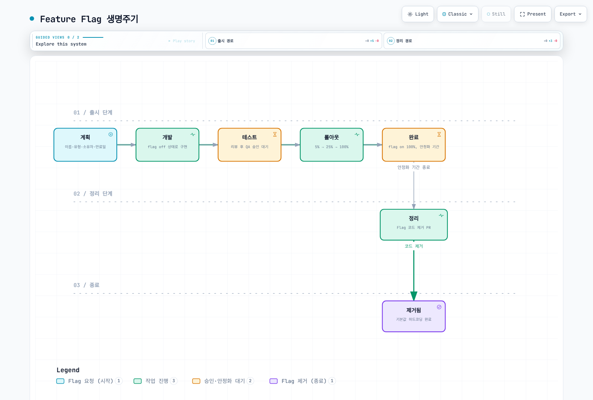

[🔍 인터랙티브 다이어그램 보기](https://www.atomai.click/kubernetes-docs/archmaps/ko-gitops-05-feature-flags-9.html)

**Flag 메타데이터 관리:**

```yaml
apiVersion: core.openfeature.dev/v1beta1
kind: FeatureFlag
metadata:
  name: product-flags
  namespace: default
  labels:
    # 소유 팀
    team: checkout-team
    # Flag 유형
    flag-type: release
    # 만료일 (기술 부채 방지)
    expiry-date: "2025-09-30"
  annotations:
    # Flag 설명
    description: "새로운 결제 시스템 점진적 롤아웃"
    # 관련 Jira 티켓
    jira-ticket: "CHECKOUT-1234"
    # 소유자
    owner: "checkout-team@company.com"
    # 영향 서비스
    affected-services: "order-service,payment-service,notification-service"
```

### 기술 부채 방지

만료된 Flag를 자동으로 감지하는 CronJob을 구성합니다.

```yaml
apiVersion: batch/v1
kind: CronJob
metadata:
  name: flag-expiry-checker
  namespace: flag-system
spec:
  schedule: "0 9 * * 1"  # 매주 월요일 09:00
  jobTemplate:
    spec:
      template:
        spec:
          containers:
            - name: checker
              image: bitnami/kubectl:latest
              command:
                - /bin/sh
                - -c
                - |
                  TODAY=$(date +%Y-%m-%d)
                  echo "=== 만료된 Feature Flag 점검 (${TODAY}) ==="
                  
                  # 만료일이 지난 Flag 검색
                  kubectl get featureflags --all-namespaces \
                    -l "expiry-date" \
                    -o jsonpath='{range .items[*]}{.metadata.namespace}/{.metadata.name}: expiry={.metadata.labels.expiry-date}, team={.metadata.labels.team}{"\n"}{end}' \
                  | while read line; do
                    EXPIRY=$(echo "$line" | grep -oP 'expiry=\K[^ ,]+')
                    if [[ "$EXPIRY" < "$TODAY" ]]; then
                      echo "[만료됨] $line"
                    fi
                  done
          restartPolicy: OnFailure
```

### 긴급 킬 스위치

긴급 상황에서 특정 기능을 즉시 비활성화할 수 있는 킬 스위치 패턴입니다.

```yaml
apiVersion: core.openfeature.dev/v1beta1
kind: FeatureFlag
metadata:
  name: kill-switches
  namespace: default
  labels:
    flag-type: ops
    priority: critical
spec:
  flagSpec:
    flags:
      # 외부 결제 서비스 킬 스위치
      external-payment-enabled:
        state: ENABLED
        variants:
          "on": true
          "off": false
        defaultVariant: "on"

      # 추천 엔진 킬 스위치
      recommendation-engine-enabled:
        state: ENABLED
        variants:
          "on": true
          "off": false
        defaultVariant: "on"

      # 알림 서비스 킬 스위치
      notification-service-enabled:
        state: ENABLED
        variants:
          "on": true
          "off": false
        defaultVariant: "on"
```

**긴급 비활성화 스크립트:**

```bash
#!/bin/bash
# emergency-kill-switch.sh
# 사용법: ./emergency-kill-switch.sh <flag-name> <on|off>

FLAG_NAME=$1
ACTION=$2

if [[ -z "$FLAG_NAME" || -z "$ACTION" ]]; then
  echo "사용법: $0 <flag-name> <on|off>"
  exit 1
fi

if [[ "$ACTION" == "off" ]]; then
  DEFAULT_VARIANT="off"
  echo "긴급 비활성화: ${FLAG_NAME}"
else
  DEFAULT_VARIANT="on"
  echo "기능 재활성화: ${FLAG_NAME}"
fi

# FeatureFlag CR 패치
kubectl patch featureflag kill-switches \
  --type=json \
  -p="[{
    \"op\": \"replace\",
    \"path\": \"/spec/flagSpec/flags/${FLAG_NAME}/defaultVariant\",
    \"value\": \"${DEFAULT_VARIANT}\"
  }]"

echo "완료: ${FLAG_NAME} → ${DEFAULT_VARIANT}"
echo "시간: $(date -u +%Y-%m-%dT%H:%M:%SZ)"
```

### 점진적 롤아웃 전략

안전한 점진적 롤아웃을 위한 권장 단계별 전략입니다.

| 단계 | 대상 | 비율 | 기간 | 검증 항목 |
|------|------|------|------|-----------|
| 1 | 내부 직원 | 100% (내부) | 1-2일 | 기능 동작, UX 피드백 |
| 2 | 베타 사용자 | 5% | 1-3일 | 오류율, 지연시간 |
| 3 | 초기 사용자 | 25% | 3-5일 | 비즈니스 메트릭, 전환율 |
| 4 | 확장 | 50% | 3-5일 | 성능, 안정성 |
| 5 | 전체 | 100% | - | 최종 검증 |
| 6 | 정리 | - | 1-2주 후 | Flag 코드 제거 |

### 성능 영향 최소화

Feature Flag 시스템이 애플리케이션 성능에 미치는 영향을 최소화하기 위한 가이드입니다.

**캐싱 전략:**

```go
// 인메모리 캐시를 활용한 Flag 평가
type CachedFlagClient struct {
    client  *openfeature.Client
    cache   sync.Map
    ttl     time.Duration
}

type cachedValue struct {
    value     interface{}
    expiresAt time.Time
}

func (c *CachedFlagClient) BooleanValue(ctx context.Context, flag string,
    defaultVal bool, evalCtx openfeature.EvaluationContext) bool {

    cacheKey := fmt.Sprintf("%s:%s", flag, evalCtx.TargetingKey())

    // 캐시 확인
    if cached, ok := c.cache.Load(cacheKey); ok {
        cv := cached.(*cachedValue)
        if time.Now().Before(cv.expiresAt) {
            return cv.value.(bool)
        }
    }

    // 캐시 미스 - Provider에서 평가
    value, _ := c.client.BooleanValue(ctx, flag, defaultVal, evalCtx)

    // 캐시 저장
    c.cache.Store(cacheKey, &cachedValue{
        value:     value,
        expiresAt: time.Now().Add(c.ttl),
    })

    return value
}
```

**성능 최적화 체크리스트:**

- flagd 사이드카 모드로 네트워크 지연 최소화 (localhost 통신)
- 빈번히 평가되는 Flag에 클라이언트 측 캐싱 적용 (TTL 5-30초)
- Bulk 평가 API 사용으로 네트워크 왕복 횟수 감소
- 기본값(default)을 항상 설정하여 Provider 장애 시 서비스 지속
- Flag 평가 지연시간 모니터링 (P99 < 5ms 목표)
- 불필요한 Evaluation Context 데이터 최소화

---

## 참고 문서

### 공식 문서

- [OpenFeature 공식 사이트](https://openfeature.dev/)
- [OpenFeature 명세](https://openfeature.dev/specification/)
- [flagd GitHub](https://github.com/open-feature/flagd)
- [OpenFeature Operator](https://github.com/open-feature/open-feature-operator)
- [OpenFeature SDK (Go)](https://github.com/open-feature/go-sdk)
- [OpenFeature SDK (Java)](https://github.com/open-feature/java-sdk)
- [OpenFeature SDK (Python)](https://github.com/open-feature/python-sdk)
- [OpenFeature SDK (Node.js)](https://github.com/open-feature/js-sdk)

### CNCF 관련 자료

- [CNCF OpenFeature 프로젝트](https://www.cncf.io/projects/openfeature/)
- [CNCF Landscape - Feature Management](https://landscape.cncf.io/)
- [Flagger - Progressive Delivery](https://flagger.app/)

### 관련 내부 문서

- [GitOps 개요](./README.md)
- [ArgoCD 설치 및 구성](./argocd/01-installation.md)
- [ArgoCD 동기화 전략](./argocd/03-sync-strategies.md)
- [FluxCD](./02-fluxcd.md)
- [Argo Rollouts 통합](../service-mesh/istio/advanced/08-argo-rollouts.md)
- [Prometheus](../observability/metrics/01-prometheus.md)
- [Grafana](../observability/grafana/README.md)
- [KEDA](../autoscaling/01-keda.md)
