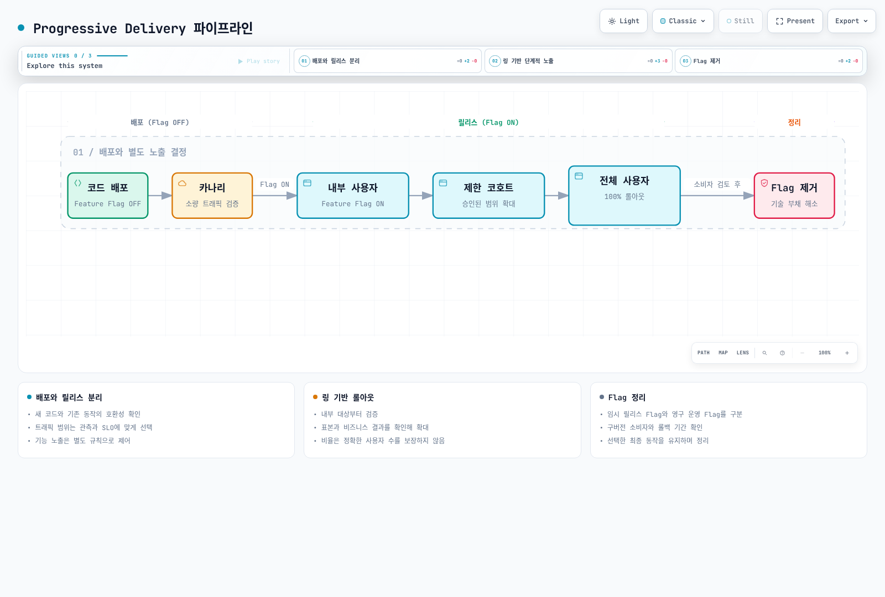
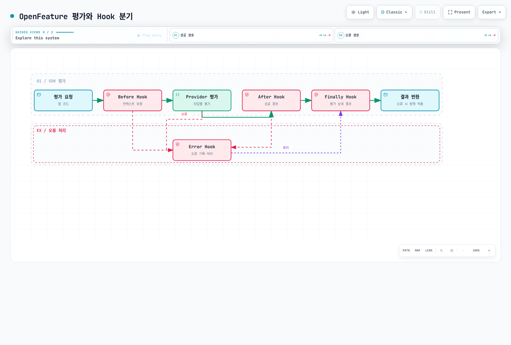
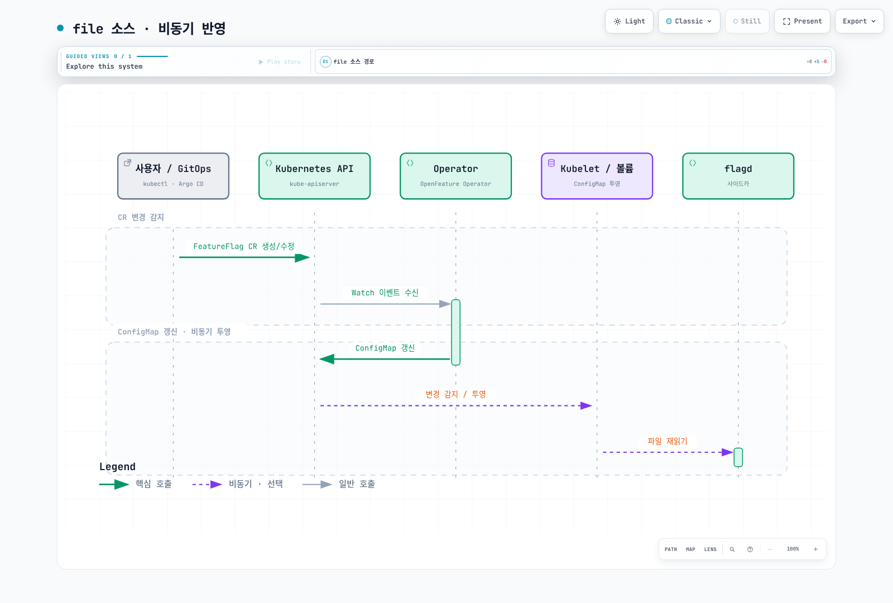
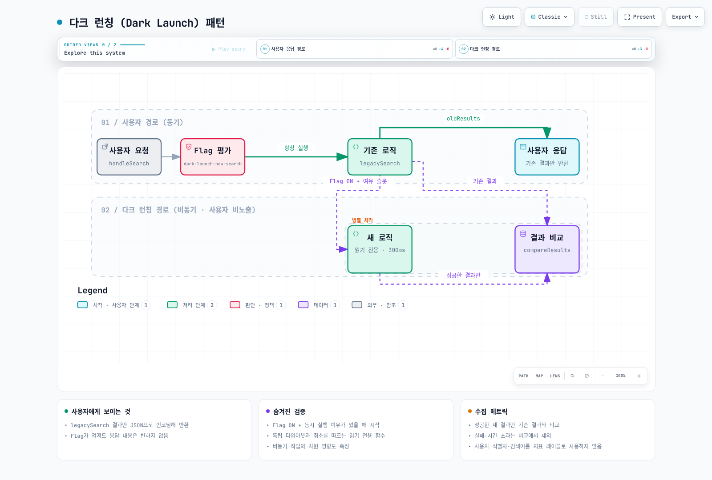

# Feature Flags와 OpenFeature

> **검토 기준**: flagd 0.16.3, OpenFeature Operator 0.9.3, Flagger 1.45.0 — SDK별 버전은 예제 절에 명시
> **마지막 업데이트**: 2026년 9월 11일

Feature Flag는 코드 배포와 기능 릴리스를 분리하여 프로덕션 환경에서 기능을 안전하게 제어할 수 있게 하는 핵심 기술입니다. 이 문서에서는 CNCF 프로젝트인 OpenFeature 표준과 Kubernetes 네이티브 Feature Flag 관리 방법을 다룹니다.

## 목차

- [개요 및 학습 목표](#개요-및-학습-목표)
- [OpenFeature 아키텍처](#openfeature-아키텍처)
- [flagd on Kubernetes](#flagd-on-kubernetes)
- [OpenFeature Operator](#openfeature-operator)
- [애플리케이션 통합](#애플리케이션-통합)
- [Canary Release와 Feature Flag 조합](#canary-release와-feature-flag-조합)
- [GitOps 통합](#gitops-통합)
- [Observability](#observability)
- [프로덕션 모범 사례](#프로덕션-모범-사례)
- [참고 문서](#참고-문서)

검증 범위: 네 언어의 SDK 예제는 로컬 파일 모드로 컴파일·실행했고, flagd HTTP 평가와
Prometheus 지표는 외부 연결이 없는 테스트 네트워크에서 확인했습니다. Helm/Kustomize와
스키마·스크립트도 검사했습니다. 실제 EKS 배포, 애플리케이션 이미지, 모든 RPC/TLS 경로와
운영 부하는 이 검증에 포함하지 않았습니다. 배포 템플릿의 주소·이미지·정책을 환경에 맞춥니다.

---

## 개요 및 학습 목표

### 학습 목표

이 문서를 학습하면 다음을 수행할 수 있습니다:

- Feature Flag의 핵심 개념과 Progressive Delivery에서의 역할을 이해한다
- OpenFeature 표준 아키텍처를 설명하고 Provider 모델을 구현한다
- Kubernetes 클러스터에 flagd와 OpenFeature Operator를 배포한다
- 다양한 언어 SDK로 Feature Flag를 애플리케이션에 통합한다
- Canary Release와 Feature Flag를 조합한 고급 배포 전략을 설계한다
- GitOps 워크플로우에 Feature Flag를 통합하여 코드로서의 Flag를 관리한다

### Feature Flag란?

Feature Flag(Feature Toggle)는 코드 변경 없이 런타임에 소프트웨어 기능의 동작을 제어할 수 있는 소프트웨어 설계 패턴입니다. 코드 배포(Deployment)와 기능 릴리스(Release)를 분리함으로써, 개발팀은 불완전한 기능을 안전하게 프로덕션에 배포하고 원하는 시점에 사용자에게 노출할 수 있습니다.


[🔍 인터랙티브 다이어그램 보기](https://www.atomai.click/kubernetes-docs/archmaps/ko-gitops-05-feature-flags-0.html)

### Feature Flag의 유형

| 유형 | 수명 | 목적 | 예시 |
|------|------|------|------|
| **Release Flag** | 단기 (일~주) | 불완전한 기능 숨기기 | 새 결제 시스템 개발 중 숨기기 |
| **Experiment Flag** | 중기 (주~월) | A/B 테스트, 사용자 행동 분석 | 체크아웃 UI 변형 테스트 |
| **Ops Flag** | 장기 | 운영 제어, 서킷 브레이커 | 외부 API 호출 비활성화 |
| **Permission Flag** | 영구적 | 사용자별 기능 접근 제어 | 프리미엄 기능 관리 |

플래그로 기능 노출을 제어하더라도 인증·인가는 별도로 검증해야 합니다.
OFF 상태의 코드도 이미지에 포함될 수 있으며, 플래그는 비밀 보관소나 접근 제어 경계를
대체하지 않습니다.

### Progressive Delivery에서의 역할

Progressive Delivery는 기능을 점진적으로 사용자에게 노출하는 배포 전략입니다. Feature Flag는 이 전략의 핵심 구현 수단입니다.



[🔍 인터랙티브 다이어그램 보기](https://www.atomai.click/kubernetes-docs/archmaps/ko-gitops-05-feature-flags-10.html)

### Feature Flag 도구 비교

선택 시 관리 기능과 런타임 평가, SDK별 지원 범위를 함께 봅니다. Provider가 존재한다는
사실만으로 모든 언어·훅·이벤트·타겟팅 의미가 같아지는 것은 아닙니다. 가격과 계약 기능은
공급자의 현재 문서에서 확인하며, 아래 표는 연결과 운영 책임에 초점을 둡니다.

| 도구 | 역할 | 연결·운영 시 확인할 점 |
|------|------|-----------------------|
| flagd | 직접 운영하는 평가·규칙 동기화 서비스 | 소스, RPC/인프로세스, Operator, 가용성과 관측을 운영자가 구성 |
| [LaunchDarkly](https://launchdarkly.com/docs/sdk/openfeature) | 관리형 플래그 서비스 | 언어별 Provider, 컨텍스트·이벤트 매핑과 기존 SDK 기능 확인 |
| [Flagsmith](https://docs.flagsmith.com/integrating-with-flagsmith/openfeature) | 관리형 또는 직접 운영하는 플래그 플랫폼 | 서버/웹 Provider와 언어별 지원 기능 확인 |
| [Harness FME](https://github.com/harness/developer-hub/tree/main/docs/feature-management-experimentation) | 플래그 관리와 실험 기능 | 기존 Split 사용 환경의 이관 경로, Provider와 실험 데이터 연결 확인 |
| [Unleash](https://github.com/Unleash/unleash-openfeature-node-provider) | Unleash SDK를 연결하는 Provider 생태계 | 컨텍스트 변환·stickiness·선택 기능을 확인; Node Provider는 tracking API를 구현하지 않음 |

이 문서는 flagd 경로를 직접 검증합니다. 상용 백엔드의 계정 연결이나 모든 Provider의
기능 동등성까지 테스트한 것은 아닙니다.

### OpenFeature 표준

OpenFeature는 CNCF Incubating 프로젝트로, Feature Flag 관리를 위한 벤더 중립적 표준 API를 제공합니다. 특정 벤더에 종속되지 않고 Feature Flag 시스템을 교체하거나 병행 사용할 수 있는 유연성을 제공합니다.

**OpenFeature의 핵심 가치:**

- **벤더 중립성**: Provider 패턴으로 백엔드 교체 가능
- **표준 API**: 언어별 일관된 SDK 인터페이스
- **확장성**: Hooks를 통한 횡단 관심사 처리
- **Kubernetes 네이티브**: CRD와 Operator를 통한 선언적 관리

---

## OpenFeature 아키텍처

### SDK 구조

OpenFeature SDK는 애플리케이션과 Feature Flag 백엔드 사이의 추상화 계층을 제공합니다. 아래 다이어그램은 SDK의 핵심 컴포넌트와 상호작용을 보여줍니다.


[🔍 인터랙티브 다이어그램 보기](https://www.atomai.click/kubernetes-docs/archmaps/ko-gitops-05-feature-flags-1.html)

### Provider 모델

Provider는 SDK와 백엔드를 연결합니다. 평가 API의 결합을 줄이지만 플래그 키·변형·타겟팅 규칙·인증·컨텍스트 의미와 운영 설정까지 자동 이관하지는 않습니다. 환경별 선택은 예시이며 flagd도 프로덕션에서 사용할 수 있습니다.


[🔍 인터랙티브 다이어그램 보기](https://www.atomai.click/kubernetes-docs/archmaps/ko-gitops-05-feature-flags-2.html)

Provider별 생성자와 자격 증명을 준비하고, 초기화 완료를 확인한 뒤 Client를 재사용합니다.
기본값·오류 처리를 정의하고 종료 시 Provider를 정리합니다. 현재 버전으로 실행 가능한
예제는 아래 [Go SDK](#go-sdk) 절에 있습니다.

### Evaluation Context

Evaluation Context는 Flag 평가 시 사용되는 컨텍스트 정보를 담고 있습니다. 이를 통해 사용자, 환경, 지역 등에 따라 다른 Flag 값을 반환할 수 있습니다.

다음은 컨텍스트 생성 코드 조각입니다. 사용자 키와 요금제 같은 값은 인증된 앱 상태에서
가져오고, 사용하는 규칙과 속성 이름을 일치시킵니다.

```go
evalCtx := openfeature.NewEvaluationContext(
    "synthetic-user",
    map[string]interface{}{
        "region": "ap-northeast-2",
        "environment": "production",
        "tier": "premium",
        "app_version": "2.1.0",
    },
)
```

이 컨텍스트를 아래 SDK 예제의 평가 호출에 전달하고, 값과 오류·이유를 함께 확인합니다.


### Hooks

Hooks는 Flag 평가 라이프사이클의 각 단계에서 실행되는 콜백입니다. 로깅, 메트릭 수집, 검증 등 횡단 관심사를 처리합니다.



[🔍 인터랙티브 다이어그램 보기](https://www.atomai.click/kubernetes-docs/archmaps/ko-gitops-05-feature-flags-11.html)

**커스텀 Hook 구현 예시 (Go SDK 1.18.0):**

동일한 Go 패키지에 `context`, `log`, OpenFeature SDK를 가져와 사용하는 코드 조각입니다.
`UnimplementedHook`이 사용하지 않는 콜백을 제공합니다. 직접 `Finally`를 구현하면
현재 인터페이스의 평가 상세 결과 인수도 포함해야 합니다. 플래그 값이나 사용자 컨텍스트를
로그·지표 레이블에 그대로 넣지 않습니다. 고빈도 호출에는 로그 샘플링이나 집계 지표를 사용합니다.

```go
type DecisionHook struct {
    openfeature.UnimplementedHook
}

var _ openfeature.Hook = DecisionHook{}

func (DecisionHook) After(ctx context.Context, hook openfeature.HookContext,
    details openfeature.InterfaceEvaluationDetails, hints openfeature.HookHints) error {
    log.Printf("flag=%s variant=%s reason=%s", hook.FlagKey(), details.Variant, details.Reason)
    return nil
}

func (DecisionHook) Error(ctx context.Context, hook openfeature.HookContext,
    err error, hints openfeature.HookHints) {
    log.Printf("flag=%s evaluation_failed", hook.FlagKey())
}
```

초기화 시 한 번 등록합니다.

```go
openfeature.AddHooks(DecisionHook{})
```

---

## flagd on Kubernetes

### flagd 아키텍처

flagd는 OpenFeature 호환 Feature Flag 평가 엔진으로, 경량이며 Kubernetes 환경에 최적화되어 있습니다. CNCF OpenFeature 프로젝트의 일부로 개발되었습니다.


[🔍 인터랙티브 다이어그램 보기](https://www.atomai.click/kubernetes-docs/archmaps/ko-gitops-05-feature-flags-3.html)

### Helm 설치

공식 저장소의 차트는 `open-feature-operator`입니다. 별도 `openfeature/flagd` 차트가
있는 것으로 가정하지 않습니다. Operator 설치 후 Pod 주입이나 `Flagd` 리소스로
평가 서비스를 구성합니다. webhook 인증서에 필요한 [cert-manager](../security/10-cert-manager.md)를
먼저 준비합니다.

`openfeature-values.yaml`을 저장합니다. Operator `v0.9.3`의 기본 flagd는 `v0.16.2`이므로
이 예제에서는 sidecar와 공유 배포 이미지 설정을 각각 `v0.16.3`으로 고정합니다.
리소스 값은 실습 출발점이며 실제 플래그 수·호출량을 기준으로 측정해 조정합니다.

```yaml
sidecarConfiguration:
  image:
    repository: ghcr.io/open-feature/flagd
    tag: v0.16.3
  resources:
    requests:
      cpu: 50m
      memory: 64Mi
    limits:
      cpu: 200m
      memory: 256Mi
flagdConfiguration:
  image:
    repository: ghcr.io/open-feature/flagd
    tag: v0.16.3
```

```bash
helm repo add openfeature https://open-feature.github.io/open-feature-operator/
helm repo update
helm upgrade --install open-feature-operator openfeature/open-feature-operator \
  --version v0.9.3 \
  --namespace open-feature-operator-system --create-namespace \
  -f openfeature-values.yaml --wait --timeout 5m
```

`sidecarConfiguration`과 `flagdConfiguration`은 서로 다른 설정입니다.
이전 예제의 `sidecarConfig`, `flagdProxyConfig`, `controllerManager.manager.env`는
이 차트의 해당 구성 경로가 아닙니다. 기본 webhook `failurePolicy`는 `Ignore`여서
webhook 장애 시 Pod가 sidecar 없이 생성될 수 있습니다. `Fail`로 바꾸기 전에는
적용 대상과 장애 영향을 제한하고 앱의 Provider 초기화·기본값 정책을 점검합니다.

### FeatureFlag CRD

OpenFeature Operator는 `FeatureFlag` CRD를 통해 Kubernetes 네이티브 방식으로 Feature Flag를 정의합니다.

**완전한 FeatureFlag CR YAML 예제:**

```yaml
apiVersion: v1
kind: Namespace
metadata:
  name: flag-demo
---
apiVersion: core.openfeature.dev/v1beta1
kind: FeatureFlag
metadata:
  name: product-flags
  namespace: flag-demo
spec:
  flagSpec:
    flags:
      new-checkout:
        state: ENABLED
        variants:
          'on': true
          'off': false
        defaultVariant: 'off'
        targeting:
          if:
          - ==:
            - var: tier
            - internal
          - 'on'
          - fractional:
            - - 'on'
              - 10
            - - 'off'
              - 90
      banner-color:
        state: ENABLED
        variants:
          blue: '#0055ff'
          green: '#008855'
        defaultVariant: blue
        targeting:
          if:
          - ==:
            - var: tier
            - enterprise
          - green
          - blue
      rate-limit:
        state: ENABLED
        variants:
          standard: 100
          premium: 500
        defaultVariant: standard
        targeting:
          if:
          - in:
            - var: tier
            - - premium
              - enterprise
          - premium
          - standard
      feature-config:
        state: ENABLED
        variants:
          default:
            maxUploadBytes: 10485760
            enableOCR: false
          enhanced:
            maxUploadBytes: 52428800
            enableOCR: true
        defaultVariant: default
        targeting:
          if:
          - and:
            - ==:
              - var: environment
              - production
            - in:
              - var: tier
              - - premium
                - enterprise
          - enhanced
          - default
```

### Sidecar Injection vs Standalone Deployment

flagd는 두 가지 배포 모드를 지원합니다. 각 모드의 특징과 적합한 사용 사례를 비교합니다.

| 특성 | Sidecar 모드 | Standalone 모드 |
|------|-------------|----------------|
| **배포 방식** | Pod당 사이드카 컨테이너 | 별도의 Deployment |
| **네트워크 지연** | 최소 (localhost) | Pod 간 네트워크 통신 |
| **리소스 사용** | Pod마다 추가 리소스 | 중앙 집중형 리소스 |
| **확장성** | Pod 수에 비례 | 독립적 확장 |
| **장애 격리** | 높음 (Pod 단위) | 낮음 (단일 장애점) |
| **적합 환경** | 지연에 민감한 서비스 | 마이크로서비스가 많은 환경 |

**Sidecar 모드 구성:**

```yaml
apiVersion: apps/v1
kind: Deployment
metadata:
  name: my-app
  namespace: flag-demo
spec:
  replicas: 3
  selector:
    matchLabels:
      app: my-app
  template:
    metadata:
      labels:
        app: my-app
      annotations:
        # OpenFeature Operator가 flagd 사이드카 자동 주입
        openfeature.dev/enabled: "true"
        openfeature.dev/featureflagsource: "product-flags-source"
    spec:
      containers:
        - name: my-app
          image: my-app:v1.0.0
          ports:
            - containerPort: 8080
              name: http
          env:
            # flagd 사이드카 연결 정보
            - name: FLAGD_HOST
              value: "localhost"
            - name: FLAGD_PORT
              value: "8013"
```

**Standalone 모드 구성:**

`FeatureFlag`와 아래 절의 `FeatureFlagSource`를 먼저 적용한 뒤 다음 `Flagd`를
적용합니다. Operator가 Deployment와 ClusterIP Service를 관리합니다. file 소스이므로
전용 ServiceAccount에는 API 토큰을 자동 마운트하지 않습니다. 공유 서비스 DNS는
`flagd.flag-demo.svc.cluster.local`이며 RPC 포트는 8013입니다.

```yaml
apiVersion: v1
kind: ServiceAccount
metadata:
  name: flagd-demo
  namespace: flag-demo
automountServiceAccountToken: false
---
apiVersion: core.openfeature.dev/v1beta1
kind: Flagd
metadata:
  name: flagd
  namespace: flag-demo
spec:
  replicas: 2
  serviceType: ClusterIP
  serviceAccountName: flagd-demo
  featureFlagSource: product-flags-source
```

---

## OpenFeature Operator

### CRD 기반 Feature Flag 관리

OpenFeature Operator는 Kubernetes 클러스터에서 Feature Flag를 선언적으로 관리하기 위한 컨트롤러입니다. CRD를 통해 Flag 정의, 소스 구성, 자동 사이드카 주입을 처리합니다.


[🔍 인터랙티브 다이어그램 보기](https://www.atomai.click/kubernetes-docs/archmaps/ko-gitops-05-feature-flags-6.html)

### FeatureFlagSource CRD

`FeatureFlagSource`는 주입하거나 공유 배포할 flagd의 소스와 설정을 정의합니다.
아래 기본 예제는 `file` 소스로 `flag-demo/product-flags`를 참조합니다. Operator가
플래그 정의를 ConfigMap 볼륨으로 제공하므로 flagd 컨테이너가 Kubernetes API를
직접 감시할 필요가 없습니다. `flag-demo/product-flags` FeatureFlag를 먼저 준비합니다.

```yaml
apiVersion: core.openfeature.dev/v1beta1
kind: FeatureFlagSource
metadata:
  name: product-flags-source
  namespace: flag-demo
spec:
  sources:
  - source: flag-demo/product-flags
    provider: file
  port: 8013
  managementPort: 8014
  evaluator: json
  logFormat: json
  probesEnabled: true
```

| 소스 | `source` 형태 | 준비할 사항 |
|------|---------------|-------------|
| `file` | `namespace/FeatureFlag-name` | Operator가 제공하는 ConfigMap 볼륨 |
| `kubernetes` | `namespace/FeatureFlag-name` | flagd의 Kubernetes API 접근 권한과 토큰 |
| `flagd-proxy` | Operator 문서의 proxy 소스 설정 | proxy 서비스와 접근 경계 |
| `http` | 실제 HTTPS JSON 엔드포인트 | 네트워크·인증·서버 신뢰 구성 |
| `grpc` | 실제 `host:port` | 동기화 서버, TLS와 필요한 인증 구성 |

여러 소스를 나열하면 모든 참조가 실제로 준비되어 있어야 합니다. 위 URI는
FeatureFlagSource 설정이며, flagd CLI의 `--uri` 자동 감지 형식과 구분합니다.
CLI에서는 `core.openfeature.dev/flag-demo/product-flags`가 유효한 Kubernetes 형식입니다.
인증 토큰을 Git의 CR에 그대로 넣지 않습니다. `evaluator: json`은 평가 엔진 선택이며
캐시나 모든 평가의 감사 로깅을 켜는 옵션이 아닙니다.

별도 FeatureFlag CR 예제를 추가하면 그 CR도 FeatureFlagSource에 명시하거나,
기존 `product-flags`의 `flags` 맵에 병합해야 합니다. CR을 만들었다는 사실만으로
모든 flagd와 SDK가 해당 플래그를 읽는 것은 아닙니다.

### Pod 자동 Injection

OpenFeature Operator의 Mutating Webhook은 특정 어노테이션이 있는 Pod에 flagd 사이드카를 자동 주입합니다.

Namespace 라벨만으로 주입이 활성화되지는 않습니다. 실제 대상 Pod의
`spec.template.metadata.annotations`에 두 어노테이션을 지정합니다. 아래는
SDK를 통합하고 HTTP 8080을 제공하는 실제 앱 이미지가 필요한 배포 템플릿입니다.
파일 소스의 sidecar는 Kubernetes API 토큰을 사용하지 않습니다.

**Deployment 레벨 활성화:**

```yaml
apiVersion: v1
kind: ServiceAccount
metadata:
  name: order-service
  namespace: flag-demo
automountServiceAccountToken: false
---
apiVersion: apps/v1
kind: Deployment
metadata:
  name: order-service
  namespace: flag-demo
spec:
  replicas: 3
  selector:
    matchLabels:
      app: order-service
  template:
    metadata:
      labels:
        app: order-service
      annotations:
        # flagd 사이드카 주입 활성화
        openfeature.dev/enabled: "true"
        # 사용할 FeatureFlagSource 지정
        openfeature.dev/featureflagsource: "product-flags-source"
    spec:
      serviceAccountName: order-service
      automountServiceAccountToken: false
      containers:
        - name: order-service
          image: order-service:v2.0.0
          ports:
            - containerPort: 8080
              name: http
          env:
            - name: FLAGD_HOST
              value: "localhost"
            - name: FLAGD_PORT
              value: "8013"
          resources:
            requests:
              cpu: 250m
              memory: 256Mi
            limits:
              cpu: 500m
              memory: 512Mi
```

주입 후 Pod 사양은 아래와 같이 자동 변환됩니다:

주입 성공 여부는 실제 Pod에서 확인합니다. webhook 장애나 참조 오류를 단순히
Pod가 실행 중이라는 사실만으로 판단하지 않습니다.

```bash
kubectl get pods -n flag-demo -l app=order-service
APP_POD="replace-with-your-pod-name"
kubectl get pod "$APP_POD" -n flag-demo -o jsonpath='{.spec.containers[*].name}'
kubectl get pod "$APP_POD" -n flag-demo -o yaml
```

### ConfigMap/CRD 동기화

이 절의 file 소스에서는 Operator가 FeatureFlag 정의를 ConfigMap 볼륨으로 제공하고 flagd가 파일 변경을 읽습니다. Kubernetes 직접 감시나 proxy 소스는 다른 경로입니다. ConfigMap 볼륨 반영과 파일 읽기에는 지연이 있으므로 즉시 반영을 보장하지 않습니다. 이미지·소스 구성 변경은 배포된 Pod 설정과 필요한 롤아웃을 별도로 확인합니다.



[🔍 인터랙티브 다이어그램 보기](https://www.atomai.click/kubernetes-docs/archmaps/ko-gitops-05-feature-flags-12.html)

---

## 애플리케이션 통합

### Go SDK

Go 1.25 이상, OpenFeature Go SDK `v1.18.0`, flagd Provider `v0.6.0` 기준입니다.
`NewProvider`는 Provider와 오류를 함께 반환하며, 현재 로컬 파일 모드는
`WithFileResolver`와 `WithOfflineFilePath`로 선택합니다. `WithResolverType`이나
`flagd.GRPC`를 사용하는 이전 예제와 구분합니다.

먼저 `flags.json`에 Kubernetes 리소스 전체가 아닌 `spec.flagSpec`의 JSON 객체를
저장합니다. 파일에는 아래 코드가 읽는 네 가지 플래그가 있어야 합니다.
클러스터의 기존 리소스에서 가져올 때는 실제 네임스페이스를 지정합니다.

```bash
kubectl get featureflag product-flags -n flag-demo -o json | jq '.spec.flagSpec' > flags.json
mkdir go-flag-demo
cp flags.json go-flag-demo/
cd go-flag-demo
go mod init example.com/go-flag-demo
go get github.com/open-feature/go-sdk@v1.18.0
go get github.com/open-feature/go-sdk-contrib/providers/flagd@v0.6.0
# 아래 코드를 main.go로 저장한 뒤 실행
go run . flags.json
```

파일 모드는 로컬 검증용이며 Kubernetes API나 flagd 서버에 접속하지 않습니다.
프로덕션의 `tier` 같은 속성은 인증된 서버 정보에서 가져옵니다. 클라이언트가 임의로
보낸 헤더를 요금제·권한 판단의 근거로 신뢰하지 않습니다.

```go
package main

import (
    "context"
    "encoding/json"
    "errors"
    "log"
    "os"
    "time"

    "github.com/open-feature/go-sdk/openfeature"
    flagd "github.com/open-feature/go-sdk-contrib/providers/flagd/pkg"
)

func run(flagFile string) error {
    provider, err := flagd.NewProvider(
        flagd.WithFileResolver(),
        flagd.WithOfflineFilePath(flagFile),
    )
    if err != nil {
        return err
    }
    if err := openfeature.SetProviderAndWait(provider); err != nil {
        return err
    }
    defer openfeature.Shutdown()

    client := openfeature.NewClient("docs-demo")
    ctx, cancel := context.WithTimeout(context.Background(), time.Second)
    defer cancel()
    evaluation := openfeature.NewEvaluationContext("synthetic-user", map[string]interface{}{
        "tier": "internal",
        "region": "ap-northeast-2",
        "environment": "development",
    })

    enabled, errBool := client.BooleanValue(ctx, "new-checkout", false, evaluation)
    color, errString := client.StringValue(ctx, "banner-color", "#000000", evaluation)
    limit, errInteger := client.IntValue(ctx, "rate-limit", 10, evaluation)
    config, errObject := client.ObjectValue(ctx, "feature-config", map[string]interface{}{}, evaluation)
    if err := errors.Join(errBool, errString, errInteger, errObject); err != nil {
        return err
    }
    return json.NewEncoder(os.Stdout).Encode(map[string]interface{}{
        "enabled": enabled,
        "color": color,
        "limit": limit,
        "config": config,
    })
}

func main() {
    if len(os.Args) != 2 {
        log.Fatal("usage: go run . flags.json")
    }
    if err := run(os.Args[1]); err != nil {
        log.Fatal(err)
    }
}
```

Pod의 flagd 사이드카에 RPC로 연결할 때는 생성 부분을 다음으로 바꿉니다.
`SetProviderAndWait`, 평가 오류 처리와 종료 처리는 유지합니다. 공유 `Flagd` 서비스라면
호스트를 해당 Service DNS로 지정합니다. 네트워크/TLS 설정은 실제 배포와 맞춰야 합니다.

```go
provider, err := flagd.NewProvider(
    flagd.WithHost("127.0.0.1"),
    flagd.WithPort(8013),
)
```

### Java SDK

이 예제는 JDK 21, Maven 3.9, OpenFeature Java SDK `1.22.1`, flagd Provider `0.14.1`
기준입니다. Resolver는 `FlagdOptions.ResolverType`이 아니라 `Config.Resolver`로
지정합니다. `MutableContext.add`는 문자열·정수·불리언 등의 오버로드를 지원합니다.

새 프로젝트에 `pom.xml`을 저장합니다.

```xml
<project xmlns="http://maven.apache.org/POM/4.0.0" xmlns:xsi="http://www.w3.org/2001/XMLSchema-instance" xsi:schemaLocation="http://maven.apache.org/POM/4.0.0 https://maven.apache.org/xsd/maven-4.0.0.xsd">
  <modelVersion>4.0.0</modelVersion>
  <groupId>example.docs</groupId><artifactId>flag-demo</artifactId><version>1.0.0</version>
  <properties><maven.compiler.release>21</maven.compiler.release><project.build.sourceEncoding>UTF-8</project.build.sourceEncoding></properties>
  <dependencies>
    <dependency><groupId>dev.openfeature</groupId><artifactId>sdk</artifactId><version>1.22.1</version></dependency>
    <dependency><groupId>dev.openfeature.contrib.providers</groupId><artifactId>flagd</artifactId><version>0.14.1</version></dependency>
  </dependencies>
  <build><plugins><plugin><groupId>org.apache.maven.plugins</groupId><artifactId>maven-compiler-plugin</artifactId><version>3.14.1</version></plugin></plugins></build>
</project>
```

다음 코드를 `src/main/java/FlagDemo.java`에 저장하고 같은 `flags.json`을 프로젝트
루트에 둡니다. 파일 모드는 서버 접속 없이 플래그를 평가합니다.

```java
import dev.openfeature.contrib.providers.flagd.Config;
import dev.openfeature.contrib.providers.flagd.FlagdOptions;
import dev.openfeature.contrib.providers.flagd.FlagdProvider;
import dev.openfeature.sdk.Client;
import dev.openfeature.sdk.FlagEvaluationDetails;
import dev.openfeature.sdk.MutableContext;
import dev.openfeature.sdk.MutableStructure;
import dev.openfeature.sdk.OpenFeatureAPI;
import dev.openfeature.sdk.Value;
import java.nio.file.Path;
import java.util.List;

public class FlagDemo {
    public static void main(String[] args) {
        if (args.length != 1) throw new IllegalArgumentException("usage: FlagDemo flags.json");
        OpenFeatureAPI api = OpenFeatureAPI.getInstance();
        FlagdOptions options = FlagdOptions.builder()
                .resolverType(Config.Resolver.FILE)
                .offlineFlagSourcePath(Path.of(args[0]).toAbsolutePath().toString())
                .build();
        try {
            api.setProviderAndWait(new FlagdProvider(options));
            Client client = api.getClient("docs-demo");
            MutableContext context = new MutableContext("synthetic-user");
            context.add("tier", "internal");
            FlagEvaluationDetails<Boolean> enabled = client.getBooleanDetails("new-checkout", false, context);
            FlagEvaluationDetails<String> color = client.getStringDetails("banner-color", "#000000", context);
            FlagEvaluationDetails<Integer> limit = client.getIntegerDetails("rate-limit", 10, context);
            Value fallback = new Value(new MutableStructure().add("maxUploadBytes", 0).add("enableOCR", false));
            FlagEvaluationDetails<Value> config = client.getObjectDetails("feature-config", fallback, context);
            for (FlagEvaluationDetails<?> result : List.of(enabled, color, limit, config)) {
                if (result.getErrorCode() != null) throw new IllegalStateException(result.getErrorCode().toString());
            }
            System.out.printf("enabled=%s color=%s limit=%d config=%s%n", enabled.getValue(), color.getValue(), limit.getValue(), config.getValue().asStructure().asObjectMap());
        } finally {
            api.shutdown();
        }
    }
}
```

```bash
mvn compile org.apache.maven.plugins:maven-dependency-plugin:3.8.1:build-classpath \
  -Dmdep.outputFile=classpath.txt
java -cp "target/classes:$(cat classpath.txt)" FlagDemo flags.json
```

RPC를 사용하려면 `Config.Resolver.RPC`와 `host`, `port`, `deadline`을 설정하고
`offlineFlagSourcePath`를 제거합니다. 서버가 준비된 뒤 `setProviderAndWait`를 호출하며,
종료 시 `shutdown`을 호출합니다. 독립 실행 예제에는 로깅 구현체를 추가하지 않았으므로
SLF4J의 NOP 로거 경고가 나올 수 있습니다. 실제 앱에서는 기존 SLF4J 로깅 설정을 사용합니다.

### Python SDK

Python 3.10 이상, `openfeature-sdk==0.10.0`, `openfeature-provider-flagd==0.5.2`
기준입니다. 아래는 같은 `flags.json`을 로컬에서 평가하는 완전한 프로그램입니다.
공개 생성자의 인수 이름은 `resolver_type`이며 값은 `ResolverType.FILE` 같은
열거형입니다. `ResolverType.GRPC`나 문자열 `"rpc"`를 쓰는 예제와 구분합니다.

```bash
python -m venv python-flag-demo/.venv
python-flag-demo/.venv/bin/python -m pip install \
  openfeature-sdk==0.10.0 openfeature-provider-flagd==0.5.2
# 아래 코드를 python-flag-demo/main.py로 저장
python-flag-demo/.venv/bin/python python-flag-demo/main.py flags.json
```

```python
import json
import sys
from pathlib import Path

from openfeature import api
from openfeature.contrib.provider.flagd import FlagdProvider
from openfeature.contrib.provider.flagd.config import ResolverType
from openfeature.evaluation_context import EvaluationContext

if len(sys.argv) != 2:
    raise SystemExit("usage: python main.py flags.json")

provider = FlagdProvider(
    resolver_type=ResolverType.FILE,
    offline_flag_source_path=str(Path(sys.argv[1]).resolve()),
)
try:
    api.set_provider_and_wait(provider)
    client = api.get_client("docs-demo")
    context = EvaluationContext(targeting_key="synthetic-user", attributes={"tier": "internal"})
    results = {
        "enabled": client.get_boolean_details("new-checkout", False, context),
        "color": client.get_string_details("banner-color", "#000000", context),
        "limit": client.get_integer_details("rate-limit", 10, context),
        "config": client.get_object_details("feature-config", {"maxUploadBytes": 0, "enableOCR": False}, context),
    }
    for name, result in results.items():
        if result.error_code is not None:
            raise RuntimeError(f"{name}: {result.error_code}")
    print(json.dumps({name: result.value for name, result in results.items()}))
finally:
    api.shutdown()
```

RPC 연결이 필요하면 생성자를 `FlagdProvider(host="127.0.0.1", port=8013,
resolver_type=ResolverType.RPC, deadline_ms=500)`로 바꿉니다. 파일 경로 옵션은
제거하고, 실제 flagd 서버가 준비된 상태에서 초기화합니다. `set_provider_and_wait`와
`shutdown`을 사용하며, 기본값과 정상 평가를 구분해야 할 때는 위처럼 상세 결과의
`error_code`도 확인합니다.

### Node.js SDK

Node.js 22, `@openfeature/server-sdk@1.23.0`, `@openfeature/flagd-provider@0.16.1`
기준 TypeScript 예제입니다. `resolverType`은 `rpc` 또는 `in-process`이며 `grpc`가
아닙니다. 이 SDK에서는 `in-process`에 `offlineFlagSourcePath`를 지정하면 네트워크
동기화 대신 로컬 파일을 사용합니다.

```bash
mkdir node-flag-demo
cp flags.json node-flag-demo/
cd node-flag-demo
npm init -y
npm pkg set type=module
npm install @openfeature/server-sdk@1.23.0 @openfeature/flagd-provider@0.16.1
npm install --save-dev typescript@5.9.3 @types/node@22.19.0
# 아래 코드를 main.ts로 저장
npx tsc main.ts --target ES2022 --module NodeNext --moduleResolution NodeNext \
  --strict --skipLibCheck --outDir dist
node dist/main.js flags.json
```

```typescript
import { OpenFeature, type EvaluationContext } from '@openfeature/server-sdk';
import { FlagdProvider } from '@openfeature/flagd-provider';

const flagFile = process.argv[2];
if (!flagFile) throw new Error('usage: node dist/main.js flags.json');
const provider = new FlagdProvider({
  resolverType: 'in-process',
  offlineFlagSourcePath: flagFile,
});
try {
  await OpenFeature.setProviderAndWait(provider);
  const client = OpenFeature.getClient('docs-demo');
  const context: EvaluationContext = {targetingKey: 'synthetic-user', tier: 'internal'};
  const results = {
    enabled: await client.getBooleanDetails('new-checkout', false, context),
    color: await client.getStringDetails('banner-color', '#000000', context),
    limit: await client.getNumberDetails('rate-limit', 10, context),
    config: await client.getObjectDetails('feature-config', {maxUploadBytes: 0, enableOCR: false}, context),
  };
  for (const [name, result] of Object.entries(results)) {
    if (result.errorCode) throw new Error(`${name}: ${result.errorCode}`);
  }
  console.log(JSON.stringify(Object.fromEntries(Object.entries(results).map(([name, result]) => [name, result.value]))));
} finally {
  await OpenFeature.clearProviders();
}
```

RPC 모드에서는 `resolverType: 'rpc'`, `host`, `port: 8013`을 설정하고
`offlineFlagSourcePath`를 제거합니다. `setProviderAndWait`를 기다린 뒤 요청을 받으며,
애플리케이션 종료 시 `clearProviders`를 기다립니다. Provider를 요청마다 새로
만들지 않습니다. 위 파일 모드 검증은 실제 RPC 연결 검증과는 별도입니다.

### Targeting Rules

`targeting`은 최종적으로 `variants`에 존재하는 **변형 이름**을 반환해야 합니다.
`fractional`도 사용자 목록이 아니라 변형 이름을 반환하므로 그 결과에 사용자 키의
`in` 검사를 적용하지 않습니다. 조건부 규칙과 비율 분기를 합칠 때는 기본 예제처럼
`if: [내부 사용자 조건, on, fractional 규칙]`으로 표현합니다.

아래 추가 CR은 소스에 명시하거나 기본 `flags` 맵에 병합해야 사용할 수 있습니다.
속성은 서버가 검증한 값이어야 하며, `app_version`은 의미 있는 SemVer 값으로 정규화합니다.

```yaml
apiVersion: core.openfeature.dev/v1beta1
kind: FeatureFlag
metadata:
  name: targeting-examples
  namespace: flag-demo
spec:
  flagSpec:
    flags:
      premium-feature:
        state: ENABLED
        variants:
          'on': true
          'off': false
        defaultVariant: 'off'
        targeting:
          if:
          - and:
            - ==:
              - var: tier
              - enterprise
            - '>=':
              - var: account_age_days
              - 30
          - 'on'
          - 'off'
      new-search-algo:
        state: ENABLED
        variants:
          'on': true
          'off': false
        defaultVariant: 'off'
        targeting:
          fractional:
          - - 'on'
            - 20
          - - 'off'
            - 80
      api-v2:
        state: ENABLED
        variants:
          'on': true
          'off': false
        defaultVariant: 'off'
        targeting:
          if:
          - sem_ver:
            - var: app_version
            - '>='
            - 2.0.0
          - 'on'
          - 'off'
```

`fractional`의 정수 가중치는 상대값입니다. 예제의 20/80은 해시 공간을 20%/80%로
나누지만 실제 사용자·요청 수가 정확히 그 비율이 되지는 않습니다. 기본 버킷 키는
플래그 키와 `targetingKey`를 결합합니다. 비어 있지 않은 안정적인 키를 사용하고,
모든 익명 사용자에게 같은 키를 주지 않습니다. 같은 규칙과 키에 대한 반복 평가는
안정적이지만 가중치·키·평가 구현을 바꾸면 배정이 달라질 수 있습니다.

타겟팅이 값을 만들지 못할 때 사용하는 플래그의 `defaultVariant`와 SDK 호출자의
기본값은 서로 다릅니다. 검증한 Go flagd Provider에서는 `DISABLED`도 오류 없이
호출자의 기본값을 반환하고 이유를 `DISABLED`로 표시합니다. 비활성화가 곧 false를
뜻하지는 않습니다. 킬 스위치는 `ENABLED` 상태에서 명시적으로 off 변형을 선택하도록
설계하고, 값·오류·이유와 실제 소비자의 반영 상태를 함께 확인합니다.

---

## Canary Release와 Feature Flag 조합

이 순서 예시는 기존 v1 primary가 초기화되어 정상 서비스 중인 상태를 전제로 합니다.
Canary 최초 등록의 초기화와 이후 버전 변경 분석을 구분합니다. 새 버전의 초기 OFF는
`defaultVariant`뿐 아니라 targeting까지 포함한 실제 평가 결과로 확인합니다.

이 절은 [Flagger](./04-flagger.md) 1.45의 Istio 통합 템플릿입니다. Controller가
`flag-demo`를 감시하고 대상 Deployment·Istio·Prometheus 지표가 준비되어 있어야 합니다.
앱 이미지는 SDK를 실제로 통합해야 합니다. `threshold: 5`는 성공 횟수가 아니라 해당
분석의 누적 실패 검사 한도입니다. 수치는 예시 정책이며 실제 SLO에 맞게 설정합니다.

플래그의 새 기능 대상은 앱이 제공하는 신뢰할 수 있는 `release_id` 같은 속성으로
구분할 수 있습니다. Pod의 canary 역할과 앱 릴리스 ID를 혼동하지 않습니다. Flagger가
워크로드를 승격해도 플래그 비율을 자동으로 100%로 바꾸지는 않습니다. 플래그 확대와
복원은 별도의 승인·Git 변경·구현된 자동화가 필요합니다.

### Flagger + Feature Flag 워크플로우

Flagger(또는 Argo Rollouts)와 Feature Flag를 결합하면, 인프라 수준의 트래픽 분할과 애플리케이션 수준의 기능 제어를 함께 활용하여 더욱 정교한 배포 전략을 구현할 수 있습니다.


[🔍 인터랙티브 다이어그램 보기](https://www.atomai.click/kubernetes-docs/archmaps/ko-gitops-05-feature-flags-7.html)

**Flagger Canary + FeatureFlag 조합 예시:**

```yaml
apiVersion: flagger.app/v1beta1
kind: Canary
metadata:
  name: order-service
  namespace: flag-demo
spec:
  targetRef:
    apiVersion: apps/v1
    kind: Deployment
    name: order-service
  progressDeadlineSeconds: 600
  service:
    port: 8080
    targetPort: 8080
  analysis:
    interval: 1m
    threshold: 5
    maxWeight: 50
    stepWeight: 10
    metrics:
    - name: request-success-rate
      thresholdRange:
        min: 99
      interval: 1m
    - name: request-duration
      thresholdRange:
        max: 500
      interval: 1m
```

### A/B 테스트 시나리오

같은 안정적인 타겟팅 키와 규칙은 같은 변형에 배정됩니다. 다음 CR을 소스에 추가하거나
기존 플래그 맵에 병합합니다. 가중치 34/33/33은 정확한 사용자 수를 보장하는 할당량이 아닙니다.

```yaml
apiVersion: core.openfeature.dev/v1beta1
kind: FeatureFlag
metadata:
  name: ab-test-checkout
  namespace: flag-demo
spec:
  flagSpec:
    flags:
      checkout-variant:
        state: ENABLED
        variants:
          control: classic
          variant-a: streamlined
          variant-b: one-click
        defaultVariant: control
        targeting:
          fractional:
          - - control
            - 34
          - - variant-a
            - 33
          - - variant-b
            - 33
```

SDK의 문자열 상세 평가 결과로 값·변형·오류를 확인하고, 정상적으로 선택한 화면이 실제로
노출됐을 때 노출을 기록합니다. 평가 횟수만으로 사용자 노출이나 전환을 추정하지 않습니다.
전환 이벤트와 표본 수, 실험 기간, 지표 정의를 별도로 설계해야 합니다. 요청이 구버전과
신버전 앱을 오가거나 서로 다른 규칙을 읽는 경우까지 동일한 경험을 보장하지는 않습니다.

### 다크 런칭 (Dark Launch) 패턴

다크 런칭은 사용자에게 노출하지 않으면서 프로덕션 트래픽으로 새로운 기능을 검증하는 패턴입니다.



[🔍 인터랙티브 다이어그램 보기](https://www.atomai.click/kubernetes-docs/archmaps/ko-gitops-05-feature-flags-13.html)

다음 추가 CR을 소스에 연결한 뒤, 검증 기간에 Git 변경으로 `defaultVariant`를
on으로 전환합니다. 초기 상태는 off입니다. 사용자에게 반환할 결과를 바꾸는 플래그가
아니며 읽기 전용 검증을 실행할지를 제어합니다.

```yaml
apiVersion: core.openfeature.dev/v1beta1
kind: FeatureFlag
metadata:
  name: shadow-search
  namespace: flag-demo
spec:
  flagSpec:
    flags:
      dark-launch-new-search:
        state: ENABLED
        variants:
          'on': true
          'off': false
        defaultVariant: 'off'
```

아래는 애플리케이션 함수와 지표를 연결하는 코드 조각입니다. 검색과 비교 함수는
읽기 전용이어야 하며, 결과를 변경하거나 원문 검색어를 지표 레이블에 넣지 않습니다.
결제·주문 저장·알림 발송 같은 작업을 구버전과 신버전에서 각각 실행하면 부작용이
두 번 발생할 수 있으므로, 그런 작업은 읽기 전용 계산이나 격리된 재생 환경으로 검증합니다.

Go 1.21 이상의 `context.WithoutCancel`로 요청 종료에 따른 취소를 분리하되,
별도의 타임아웃과 동시 실행 한도를 둡니다. 호출하는 함수도 취소를 따라야 합니다.
한도에 도달하면 그림자 검증을 건너뛰고 기존 응답을 반환합니다.

```go
// 프로세스 전체의 그림자 검증 동시 실행 한도
var shadowSlots = make(chan struct{}, 8)

// 다크 런칭 통합 코드 조각
func handleSearch(w http.ResponseWriter, r *http.Request) {
    ctx := r.Context()
    query := r.URL.Query().Get("q")
    evalCtx := openfeature.NewEvaluationContext(r.Header.Get("X-User-ID"), nil)

    // 다크 런칭 Flag 확인
    darkLaunchEnabled, flagErr := client.BooleanValue(ctx, "dark-launch-new-search", false, evalCtx)

    // 기존 검색 실행 (항상 사용자에게 반환)
    oldResults := legacySearch(ctx, query)

    if flagErr == nil && darkLaunchEnabled {
        select {
        case shadowSlots <- struct{}{}:
            go func() {
                defer func() { <-shadowSlots }()
                shadowCtx, cancel := context.WithTimeout(
                    context.WithoutCancel(ctx), 300*time.Millisecond,
                )
                defer cancel()
                newResults, err := newSearchEngine(shadowCtx, query)
                if err == nil && shadowCtx.Err() == nil {
                    compareResults(oldResults, newResults)
                }
            }()
        default:
            // 포화 상태에서는 사용자 요청을 지연시키지 않음
        }
    }

    // 기존 결과만 반환
    json.NewEncoder(w).Encode(oldResults)
}

func compareResults(old, new []SearchResult) {
    // 정확도 비교
    overlap := calculateOverlap(old, new)
    darkLaunchAccuracy.WithLabelValues("search").Observe(overlap)

    // 결과 수 차이
    darkLaunchResultDiff.WithLabelValues("search").Observe(
        float64(len(new) - len(old)),
    )
}
```

### 메트릭 기반 자동 롤아웃

플래그 확대 정책을 ConfigMap에 적는 것만으로 자동 조정이 시작되지는 않습니다.
SDK 평가·오류·노출·전환 지표를 실제로 수집하고, 샘플 수와 측정 기간을 정한 뒤
각 단계의 Git 변경을 승인하거나 정책을 실행하는 컨트롤러를 별도로 구현합니다.

| 단계 | 확인할 내용 |
|------|-------------|
| 새 릴리스 배포 | 기본 OFF와 구버전 호환성, Provider 준비 상태 |
| 제한된 대상 노출 | 신뢰할 수 있는 릴리스/사용자 속성, 오류와 지연 |
| 범위 확대 | 충분한 표본, 실제 기능 노출과 비즈니스 지표 |
| 되돌리기 | 워크로드와 플래그 설정을 각각 복원하고 소비자 반영 확인 |

Flagger 웹훅을 연결할 때는 실제 수신기와 인증·재시도·버전 확인이 필요합니다.
`rollback` 훅은 롤백 후 알림이 아니라 **성공 응답이 롤백을 요청하는 검사**입니다.
`post-rollout`은 성공·실패 경로 모두에서 호출될 수 있으므로 수신기가 상태를 구분해야
합니다. metadata 문자열은 Go 템플릿으로 확장되지 않으므로 `{{.CanaryWeight}}`가
실제 가중치로 치환된다고 가정하지 않습니다. 이 문서는 별도 flag-controller 서비스를
설치하지 않습니다.

[Observability](#observability)의 앱 계측과 PodMonitor가 준비되어 있다면 다음 템플릿을
사용할 수 있습니다. `app` 레이블이 target을 식별하고 primary를 제외해야 하며,
Prometheus 주소는 실제 서비스로 바꿉니다. 공유 flagd 서버 지표만으로 특정 canary의
평가 오류를 판정하지 않습니다.

```yaml
apiVersion: flagger.app/v1beta1
kind: MetricTemplate
metadata:
  name: app-flag-errors
  namespace: flag-demo
spec:
  provider:
    type: prometheus
    address: http://prometheus.monitoring.svc:9090
  query: |-
    100 * (
      sum(rate(app_feature_flag_evaluations_total{namespace="{{ namespace }}",app="{{ target }}",flag_key="new-checkout",reason="ERROR"}[{{ interval }}]))
      or vector(0)
    ) / sum(rate(app_feature_flag_evaluations_total{namespace="{{ namespace }}",app="{{ target }}",flag_key="new-checkout"}[{{ interval }}]))
---
apiVersion: flagger.app/v1beta1
kind: MetricTemplate
metadata:
  name: app-flag-samples
  namespace: flag-demo
spec:
  provider:
    type: prometheus
    address: http://prometheus.monitoring.svc:9090
  query: sum(increase(app_feature_flag_evaluations_total{namespace="{{ namespace }}",app="{{
    target }}",flag_key="new-checkout"}[{{ interval }}]))
```

시계열을 확인한 뒤 기존 Canary의 `spec.analysis.metrics` 목록에 다음 항목을 추가합니다.
1분 100회 평가와 오류율 1%는 예시 정책이며 고유 사용자 수나 비즈니스 품질을 뜻하지
않습니다. DISABLED·기본값 반환은 별도로 관찰합니다. 데이터 없음이나 NaN을 성공으로
처리하지 않습니다.

```yaml
- name: app-flag-error-rate
  templateRef:
    name: app-flag-errors
  thresholdRange:
    max: 1
  interval: 1m
- name: app-flag-evaluation-count
  templateRef:
    name: app-flag-samples
  thresholdRange:
    min: 100
  interval: 1m
```

---

## GitOps 통합

### Feature Flag as Code (Git 관리)

위에서 검증한 리소스를 다음 파일로 관리합니다. `product-flags.yaml`에는 Namespace와
FeatureFlag, `feature-source.yaml`에는 file 소스의 FeatureFlagSource, `flagd.yaml`에는
공유 서비스의 ServiceAccount와 Flagd를 저장합니다. Operator와 cert-manager는 먼저
설치되어 있어야 합니다. 저장소 주소는 실제 주소로 바꾸고 필요한 저장소 인증을 구성합니다.

```text
gitops-config/
├── base/feature-flags/
│   ├── kustomization.yaml
│   ├── product-flags.yaml
│   ├── feature-source.yaml
│   └── flagd.yaml
├── overlays/dev/feature-flags/kustomization.yaml
├── overlays/production/feature-flags/kustomization.yaml
├── validate-flags.py
└── .github/workflows/feature-flags.yml
```

`base/feature-flags/kustomization.yaml`:

```yaml
apiVersion: kustomize.config.k8s.io/v1beta1
kind: Kustomization
resources:
- product-flags.yaml
- feature-source.yaml
- flagd.yaml
```

### 환경별 Kustomize 구성

아래는 **Kustomization에 포함하는 패치**이며 불완전한 FeatureFlag를 직접 apply하는
예제가 아닙니다. 개발 환경에서 전체 ON으로 만들려면 기존 targeting도 제거해야 합니다.
`defaultVariant`만 바꾸면 targeting이 우선할 수 있습니다. 다른 세 플래그는 유지됩니다.

`overlays/dev/feature-flags/kustomization.yaml`:

```yaml
apiVersion: kustomize.config.k8s.io/v1beta1
kind: Kustomization
resources:
- ../../../base/feature-flags
patches:
- target:
    group: core.openfeature.dev
    version: v1beta1
    kind: FeatureFlag
    name: product-flags
  patch: |
    - op: remove
      path: /spec/flagSpec/flags/new-checkout/targeting
    - op: replace
      path: /spec/flagSpec/flags/new-checkout/defaultVariant
      value: 'on'
```

`overlays/production/feature-flags/kustomization.yaml`:

```yaml
apiVersion: kustomize.config.k8s.io/v1beta1
kind: Kustomization
resources:
- ../../../base/feature-flags
patches:
- target:
    group: core.openfeature.dev
    version: v1beta1
    kind: FeatureFlag
    name: product-flags
  patch: |
    - op: replace
      path: /spec/flagSpec/flags/new-checkout/targeting
      value:
        if:
        - ==:
          - var: tier
          - internal
        - 'on'
        - fractional:
          - - 'on'
            - 5
          - - 'off'
            - 95
```

Kustomize 5.8.1에서 두 구성을 렌더링해 확인합니다. 실제 배포 전 출력 전체를 검토합니다.

```bash
kustomize build overlays/dev/feature-flags
kustomize build overlays/production/feature-flags
```

### ArgoCD로 FeatureFlag CR 배포

`platform` AppProject가 실제 저장소와 `flag-demo` 목적지를 허용해야 합니다. 이 경로에
포함된 Namespace, ServiceAccount와 OpenFeature 리소스 종류도 정책에 허용되어 있어야
합니다. Sync 성공만으로 Operator가 생성한 Deployment나 모든 SDK가 최신 플래그를
읽었다고 판단하지 않습니다.

```yaml
apiVersion: argoproj.io/v1alpha1
kind: Application
metadata:
  name: feature-flags
  namespace: argocd
spec:
  project: platform
  source:
    repoURL: https://github.com/YOUR_ORG/gitops-config.git
    targetRevision: main
    path: overlays/production/feature-flags
  destination:
    server: https://kubernetes.default.svc
    namespace: flag-demo
  syncPolicy:
    automated:
      prune: true
      selfHeal: true
    retry:
      limit: 3
      backoff:
        duration: 5s
        factor: 2
        maxDuration: 1m
```

### Flux로 FeatureFlag CR 배포

이 예제는 기존 Operator 설치를 전제로 하므로 존재하지 않는 Kustomization에
`dependsOn`을 걸지 않습니다. Operator도 Flux로 관리한다면 실제 의존 리소스 이름을
사용합니다. 헬스 검사는 Operator가 생성한 `flagd` Deployment의 초기 준비 상태를
확인하며, 지속적인 플래그 신선도를 보장하지 않습니다.

```yaml
apiVersion: source.toolkit.fluxcd.io/v1
kind: GitRepository
metadata:
  name: feature-flags
  namespace: flux-system
spec:
  interval: 1m
  url: https://github.com/YOUR_ORG/gitops-config.git
  ref:
    branch: main
---
apiVersion: kustomize.toolkit.fluxcd.io/v1
kind: Kustomization
metadata:
  name: feature-flags-production
  namespace: flux-system
spec:
  interval: 5m
  sourceRef:
    kind: GitRepository
    name: feature-flags
  path: ./overlays/production/feature-flags
  prune: true
  timeout: 3m
  healthChecks:
  - apiVersion: apps/v1
    kind: Deployment
    name: flagd
    namespace: flag-demo
```

### PR 기반 Flag 변경 워크플로우


[🔍 인터랙티브 다이어그램 보기](https://www.atomai.click/kubernetes-docs/archmaps/ko-gitops-05-feature-flags-8.html)

다음 `.github/workflows/feature-flags.yml`은 렌더링된 플래그 정의를 검사합니다.
도구와 스키마 버전을 고정하고 체크섬을 확인합니다. 클러스터나 비밀 정보, PR 댓글 작성
권한은 사용하지 않습니다. CODEOWNERS와 필수 리뷰는 저장소 보호 규칙으로 별도 설정합니다.

```yaml
name: Validate Feature Flags
'on':
  pull_request:
    paths:
    - base/feature-flags/**
    - overlays/**/feature-flags/**
    - validate-flags.py
    - .github/workflows/feature-flags.yml
permissions:
  contents: read
jobs:
  validate:
    runs-on: ubuntu-24.04
    steps:
    - uses: actions/checkout@3d3c42e5aac5ba805825da76410c181273ba90b1
    - uses: actions/setup-python@ece7cb06caefa5fff74198d8649806c4678c61a1
      with:
        python-version: '3.12'
    - name: Install pinned tools and schemas
      run: |
        curl -fsSL https://github.com/kubernetes-sigs/kustomize/releases/download/kustomize%2Fv5.8.1/kustomize_v5.8.1_linux_amd64.tar.gz -o kustomize.tgz
        echo '029a7f0f4e1932c52a0476cf02a0fd855c0bb85694b82c338fc648dcb53a819d  kustomize.tgz' | sha256sum --check
        tar -xzf kustomize.tgz kustomize
        mkdir -p .flag-schemas rendered
        curl -fsSL https://raw.githubusercontent.com/open-feature/flagd-schemas/v0.2.13/json/flags.json -o .flag-schemas/flags.json
        curl -fsSL https://raw.githubusercontent.com/open-feature/flagd-schemas/v0.2.13/json/targeting.json -o .flag-schemas/targeting.json
        echo 'a9b065cc3e140d10a5e139a3f2bbd2f24d4fe8a728ce824a5f2a1231ed60680b  .flag-schemas/flags.json' | sha256sum --check
        echo 'fb94d3d24f0edab22b28d1895ee045c698eed0ff8d4c151c791a92a07738a605  .flag-schemas/targeting.json' | sha256sum --check
        python -m pip install PyYAML==6.0.3 jsonschema==4.26.0
    - name: Validate rendered definitions
      run: |
        for environment in dev production; do
          ./kustomize build "overlays/${environment}/feature-flags" > "rendered/${environment}.yaml"
        done
        python validate-flags.py rendered .flag-schemas
```

저장소 루트의 `validate-flags.py` 전체 내용입니다. 중복 YAML 키, 없는 기본 변형,
잘못된 정의와 검사 대상이 0개인 상황을 거부합니다. kebab-case는 이 예제의 팀 규칙이며
OpenFeature 전체의 필수 규칙은 아닙니다. 이 검사는 Kubernetes admission/CEL, 참조의
실제 존재 여부, 타겟팅의 비즈니스 의도를 대신 검증하지 않습니다. 대표 컨텍스트의
SDK 평가 테스트와 배포 후 확인을 함께 수행합니다.

```python
import json
import re
import sys
from pathlib import Path
from urllib.parse import urljoin

import jsonschema
import yaml
from referencing import Registry, Resource


class UniqueKeys(yaml.SafeLoader):
    pass


def unique_mapping(loader, node, deep=False):
    loader.flatten_mapping(node)
    result = {}
    for key_node, value_node in node.value:
        key = loader.construct_object(key_node, deep=deep)
        if key in result:
            raise ValueError(f"duplicate YAML key: {key}")
        result[key] = loader.construct_object(value_node, deep=deep)
    return result


UniqueKeys.add_constructor(yaml.resolver.BaseResolver.DEFAULT_MAPPING_TAG, unique_mapping)
rendered, schema_dir = map(Path, sys.argv[1:3])
registry, schemas = Registry(), {}
for name in ("flags.json", "targeting.json"):
    uri = f"https://flagd.dev/schema/v0/{name}"
    schema = json.loads((schema_dir / name).read_text())
    schema["$id"] = uri

    def normalize_refs(value):
        if isinstance(value, dict):
            for key, item in list(value.items()):
                if key == "$ref" and isinstance(item, str) and not item.startswith("#"):
                    value[key] = urljoin(uri, item)
                else:
                    normalize_refs(item)
        elif isinstance(value, list):
            for item in value:
                normalize_refs(item)

    normalize_refs(schema)
    schemas[name] = schema
    registry = registry.with_resource(uri, Resource.from_contents(schema))
validator = jsonschema.Draft7Validator(schemas["flags.json"], registry=registry)
checked = 0
for path in sorted(rendered.glob("*.yaml")):
    for resource in yaml.load_all(path.read_text(), Loader=UniqueKeys):
        if not isinstance(resource, dict) or resource.get("kind") != "FeatureFlag":
            continue
        definition = resource["spec"]["flagSpec"]
        validator.validate(definition)
        for key, flag in definition["flags"].items():
            if not re.fullmatch(r"[a-z0-9]+(?:-[a-z0-9]+)*", key):
                raise ValueError(f"example naming policy failed: {key}")
            if flag["defaultVariant"] not in flag["variants"]:
                raise ValueError(f"default variant missing: {key}")
        checked += 1
if checked == 0:
    raise ValueError("no rendered FeatureFlag resources were checked")
print(f"validated {checked} rendered FeatureFlag resources")
```
---

## Observability

### Flag 평가 메트릭 (Prometheus)

flagd 0.16.3의 기본 Prometheus exporter에서 실제 합성 요청으로 확인한 이름입니다.
포트 8014의 `/metrics`를 수집합니다. OTLP 이름과 Prometheus 이름을 혼용하지 않습니다.

| 지표 | 의미와 한계 |
|------|-------------|
| `feature_flag_flagd_impression_total` | 성공한 평가의 플래그·변형 정보. 오류율의 전체 분모로 사용하지 않음 |
| `feature_flag_flagd_result_reason_total` | 성공/오류 등의 이유별 평가 수. 오류 시 `feature_flag_key`가 없는 경우가 있음 |
| `http_server_request_duration_seconds` | HTTP 처리 시간 히스토그램. 모든 SDK/전송 방식의 종단 지연을 뜻하지 않음 |

검사에서 없는 플래그 요청은 HTTP 404를 반환했지만 HTTP 지연 지표의 상태 레이블은
200으로 기록됐습니다. 이 버전에서 HTTP 상태 레이블을 플래그 오류 판정의 근거로
사용하지 않습니다. 성공 변형 정보와 오류 이유는 서로 다른 카운터에 기록될 수 있습니다.

이 예제의 공유 Flagd Service는 `app: flagd`, Service 포트 이름 `metrics`를 사용합니다.
Prometheus Operator가 설치되어 있고 `release` 라벨 및 namespace 선택자가 이
ServiceMonitor를 선택하도록 구성되어 있어야 합니다.

```yaml
apiVersion: monitoring.coreos.com/v1
kind: ServiceMonitor
metadata:
  name: flagd
  namespace: flag-demo
  labels:
    release: prometheus
spec:
  selector:
    matchLabels:
      app: flagd
  namespaceSelector:
    matchNames:
    - flag-demo
  endpoints:
  - port: metrics
    path: /metrics
    interval: 15s
```

flagd sidecar를 PodMonitor로 수집한다면 실제 Pod의 이름 있는 `management` 포트를
참조합니다. 문자열 `"8014"`는 포트 번호가 아니라 포트 이름으로 해석될 수 있으므로
이름 있는 포트를 확인합니다. 앱이 인프로세스로 평가하면 원격 flagd의 평가 카운터에
그 호출이 자동으로 기록되지 않습니다.

### 애플리케이션 평가 계측

Go SDK 1.18.0과 `github.com/prometheus/client_golang@v1.24.1`로 검증한 코드입니다.
SDK 호출을 아래 래퍼로 연결하고 실제 HTTP 서버의 `/metrics`에 레지스트리를 노출해야
합니다. SDK 설치나 변수 선언만으로 이 지표가 자동 생성되지는 않습니다. 사용자 ID와
플래그의 실제 값을 레이블로 사용하지 않습니다. 플래그 키는 앱에서 통제하는 집합이어야 합니다.

```go
package main

import (
    "context"
    "time"
    "github.com/open-feature/go-sdk/openfeature"
    "github.com/prometheus/client_golang/prometheus"
)

type FlagMetrics struct {
    evaluations *prometheus.CounterVec
    duration *prometheus.HistogramVec
}

func NewFlagMetrics(reg prometheus.Registerer) *FlagMetrics {
    m := &FlagMetrics{
        evaluations: prometheus.NewCounterVec(prometheus.CounterOpts{
            Name: "app_feature_flag_evaluations_total",
            Help: "SDK evaluations, including explicit fallback reasons.",
        }, []string{"flag_key", "variant", "reason"}),
        duration: prometheus.NewHistogramVec(prometheus.HistogramOpts{
            Name: "app_feature_flag_evaluation_duration_seconds",
            Help: "SDK evaluation duration including local or remote resolution.",
            Buckets: prometheus.DefBuckets,
        }, []string{"flag_key"}),
    }
    reg.MustRegister(m.evaluations, m.duration)
    return m
}

func (m *FlagMetrics) Boolean(ctx context.Context, client *openfeature.Client,
    key string, fallback bool, evaluation openfeature.EvaluationContext) (bool, error) {
    start := time.Now()
    result, err := client.BooleanValueDetails(ctx, key, fallback, evaluation)
    reason, variant := string(result.Reason), result.Variant
    if err != nil { reason = "ERROR" }
    if variant == "" { variant = "fallback" }
    m.evaluations.WithLabelValues(key, variant, reason).Inc()
    m.duration.WithLabelValues(key).Observe(time.Since(start).Seconds())
    return result.Value, err
}
```

애플리케이션 초기화/호출 시 연결하는 코드 조각입니다. `promhttp`도 같은 Prometheus
클라이언트 모듈의 패키지입니다. HTTP 서버는 기존 앱의 수명주기에서 실행합니다.

```go
registry := prometheus.NewRegistry()
flagMetrics := NewFlagMetrics(registry)
http.Handle("/metrics", promhttp.HandlerFor(registry, promhttp.HandlerOpts{}))
value, err := flagMetrics.Boolean(ctx, client, "new-checkout", false, evaluation)
```

정상 평가, ERROR, DISABLED를 구분해 기록합니다. DISABLED는 오류가 없더라도 SDK 기본값을
사용할 수 있습니다. 위 지연 히스토그램은 SDK 호출 시간이며 전체 사용자 요청 시간은 아닙니다.

다음 PodMonitor는 앱이 HTTP 포트 이름 `http`에서 지표를 제공한다는 전제입니다.
`app` 라벨을 함께 수집해 Flagger target과 primary를 구분합니다. 실제 Prometheus 시계열에
`namespace`와 `app` 레이블이 있는지 먼저 확인합니다.

```yaml
apiVersion: monitoring.coreos.com/v1
kind: PodMonitor
metadata:
  name: order-service-flags
  namespace: flag-demo
  labels:
    release: prometheus
spec:
  namespaceSelector:
    matchNames:
    - flag-demo
  selector:
    matchExpressions:
    - key: app
      operator: In
      values:
      - order-service
      - order-service-primary
  podTargetLabels:
  - app
  podMetricsEndpoints:
  - port: http
    path: /metrics
    interval: 15s
```

### Grafana 대시보드

다음 쿼리로 패널을 만들고 시간 범위·단위·데이터 소스를 설정합니다. 서버 오류율은 공유
flagd 전체의 지표이며 특정 canary 앱의 오류율로 해석하지 않습니다. Grafana UI에서 검증한
대시보드를 내보내 프로비저닝합니다. API 요청용 `{"dashboard": ...}` 래퍼를 파일
프로비저닝 JSON으로 그대로 사용하지 않습니다.

서버 전체 평가 오류율(%):

```promql
100 * (
  sum(rate(feature_flag_flagd_result_reason_total{namespace="flag-demo",feature_flag_reason="ERROR"}[5m]))
  or vector(0)
) / sum(rate(feature_flag_flagd_result_reason_total{namespace="flag-demo"}[5m]))
```

성공한 평가의 변형 비율(%), 실제 사용자 노출/전환율과 구분:

```promql
100 * sum by (feature_flag_result_variant) (
  rate(feature_flag_flagd_impression_total{namespace="flag-demo",feature_flag_key="new-checkout"}[5m])
) / scalar(sum(rate(feature_flag_flagd_impression_total{namespace="flag-demo",feature_flag_key="new-checkout"}[5m])))
```

앱 target의 플래그 오류율(%):

```promql
100 * (
  sum(rate(app_feature_flag_evaluations_total{namespace="flag-demo",app="order-service",flag_key="new-checkout",reason="ERROR"}[5m]))
  or vector(0)
) / sum(rate(app_feature_flag_evaluations_total{namespace="flag-demo",app="order-service",flag_key="new-checkout"}[5m]))
```

앱 SDK 평가 P99(초):

```promql
histogram_quantile(0.99, sum by (le) (
  rate(app_feature_flag_evaluation_duration_seconds_bucket{namespace="flag-demo",app="order-service",flag_key="new-checkout"}[5m])
))
```

관측값이 없거나 평가가 0건이면 결과가 없거나 NaN일 수 있습니다. 이를 건강한 0% 오류로
치환하지 않습니다. 배포 판정에는 충분한 표본과 실제 기능 노출·비즈니스 지표도 필요합니다.

### 변경 이력 추적

Git 작성자, Kubernetes API 요청자, ArgoCD/Flux 조정 주체는 서로 다른 신원일 수 있습니다.
Git 변경 이력과 배포 리비전, API 감사 로그를 연결해서 확인합니다. 임의의
`FlagConfigurationUpdated` 이벤트가 항상 발생한다고 가정하지 않습니다.

```bash
kubectl get events -n flag-demo --sort-by='.metadata.creationTimestamp'
```

Kubernetes Event는 단기 운영 신호이며 영구 감사 기록이 아닙니다. `/readyz`도 모든 소스가
한 번 동기화된 뒤 200으로 유지되므로 이후의 신선도를 보장하지 않습니다. 메타데이터의
리비전과 실제 SDK 응답, 소스/Provider 상태를 따로 확인합니다.

### 감사 로그

자체 관리 Kubernetes의 감사 정책 파일은 API 서버 설정이며 일반 리소스처럼 apply하는
대상이 아닙니다. EKS에서는 지원되는 control-plane audit 로그 설정을 사용합니다.
보존 기간과 접근 권한은 팀 정책으로 정합니다. `evaluator: json`이나 `logFormat: json`이
모든 평가의 감사 기록을 보장하지 않습니다.

알림은 [ArgoCD 알림](./argocd/08-notifications.md)의 검증된 서비스·트리거·템플릿 구성으로
연결합니다. 기존 notifications ConfigMap을 별도의 축약 예제로 덮어쓰지 않습니다.
---

## 프로덕션 모범 사례

### Flag 생명주기 관리

릴리스·실험용 플래그에는 소유자와 검토 시점을 정합니다. 운영 킬 스위치처럼 장기적으로
유지할 플래그와 구분합니다. 모든 앱 버전과 다른 소비자, 롤백 가능 기간을 확인한 뒤
분기 코드와 정의를 정리합니다. 코드가 아직 키를 참조하는데 정의부터 지우지 않습니다.


[🔍 인터랙티브 다이어그램 보기](https://www.atomai.click/kubernetes-docs/archmaps/ko-gitops-05-feature-flags-9.html)

### 기술 부채 방지

다음은 **기존 FeatureFlag에 추가할 metadata 조각**입니다. 하나의 CR에 여러 플래그가
있으면 이 메타데이터는 CR 전체에 적용됩니다. 팀이 정한 검토일이며 Operator가 날짜에
맞춰 플래그를 자동으로 삭제하거나 비활성화하는 기능은 아닙니다.

```yaml
metadata:
  annotations:
    example.com/owner: checkout-team
    example.com/review-on: "2026-12-31"
```

아래 읽기 전용 CronJob은 UTC 기준 오늘까지 검토 예정인 CR과 잘못된 날짜를 출력합니다.
자신의 namespace에서 FeatureFlag를 list할 권한만 부여하고 페이지 나눔을 처리합니다.
API 인증을 위해 해당 ServiceAccount 토큰을 사용합니다. 플래그를 변경하거나 삭제하지
않으며 Job 성공은 검토 완료를 의미하지 않습니다. 로그 확인이나 알림 연결은 별도입니다.

```yaml
apiVersion: v1
kind: ServiceAccount
metadata:
  name: flag-review
  namespace: flag-demo
---
apiVersion: rbac.authorization.k8s.io/v1
kind: Role
metadata:
  name: flag-review
  namespace: flag-demo
rules:
- apiGroups:
  - core.openfeature.dev
  resources:
  - featureflags
  verbs:
  - list
---
apiVersion: rbac.authorization.k8s.io/v1
kind: RoleBinding
metadata:
  name: flag-review
  namespace: flag-demo
subjects:
- kind: ServiceAccount
  name: flag-review
  namespace: flag-demo
roleRef:
  apiGroup: rbac.authorization.k8s.io
  kind: Role
  name: flag-review
---
apiVersion: batch/v1
kind: CronJob
metadata:
  name: flag-review
  namespace: flag-demo
spec:
  schedule: 0 9 * * 1
  timeZone: Etc/UTC
  concurrencyPolicy: Forbid
  successfulJobsHistoryLimit: 1
  failedJobsHistoryLimit: 1
  jobTemplate:
    spec:
      backoffLimit: 1
      activeDeadlineSeconds: 60
      template:
        spec:
          serviceAccountName: flag-review
          restartPolicy: Never
          securityContext:
            runAsNonRoot: true
            runAsUser: 65532
            seccompProfile:
              type: RuntimeDefault
          containers:
          - name: review
            image: python:3.12.13-slim@sha256:229a2c5bfa27522db7815ea81f9bed70af17ccb9de9fc7ad142b1877b5830d36
            command:
            - python
            - -I
            - -B
            - -c
            - |
              import datetime
              import json
              import re
              import ssl
              import urllib.parse
              import urllib.request
              from pathlib import Path

              ANNOTATION = "example.com/review-on"


              def review_dates(items, today):
                  results = []
                  for item in items:
                      metadata = item.get("metadata", {})
                      value = metadata.get("annotations", {}).get(ANNOTATION)
                      if value is None:
                          continue
                      identity = {"namespace": metadata.get("namespace"), "name": metadata.get("name")}
                      try:
                          if not re.fullmatch(r"\d{4}-\d{2}-\d{2}", value):
                              raise ValueError("expected YYYY-MM-DD")
                          due = datetime.date.fromisoformat(value)
                      except (ValueError, TypeError):
                          results.append({**identity, "status": "invalid-review-date"})
                          continue
                      if due <= today:
                          results.append({**identity, "status": "review-due", "reviewOn": due.isoformat()})
                  return results


              def fetch_flags(namespace, token, tls_context, open_url=urllib.request.urlopen):
                  endpoint = (
                      "https://kubernetes.default.svc/apis/core.openfeature.dev/v1beta1/namespaces/"
                      + urllib.parse.quote(namespace, safe="") + "/featureflags"
                  )
                  items, cursor = [], ""
                  while True:
                      query = urllib.parse.urlencode({"limit": 500, "continue": cursor})
                      request = urllib.request.Request(endpoint + "?" + query, headers={
                          "Authorization": "Bearer " + token, "Accept": "application/json"
                      })
                      with open_url(request, context=tls_context, timeout=10) as response:
                          page = json.load(response)
                      items.extend(page.get("items", []))
                      cursor = page.get("metadata", {}).get("continue", "")
                      if not cursor:
                          return items


              if __name__ == "__main__":
                  service_account = Path("/var/run/secrets/kubernetes.io/serviceaccount")
                  namespace = (service_account / "namespace").read_text().strip()
                  token = (service_account / "token").read_text().strip()
                  tls_context = ssl.create_default_context(cafile=str(service_account / "ca.crt"))
                  today = datetime.datetime.now(datetime.timezone.utc).date()
                  for result in review_dates(fetch_flags(namespace, token, tls_context), today):
                      print(json.dumps(result))
            resources:
              requests:
                cpu: 50m
                memory: 64Mi
              limits:
                cpu: 200m
                memory: 128Mi
            securityContext:
              allowPrivilegeEscalation: false
              readOnlyRootFilesystem: true
              capabilities:
                drop:
                - ALL
        metadata:
          annotations:
            sidecar.istio.io/inject: 'false'
```

### 긴급 킬 스위치

킬 스위치는 Boolean 값을 명시적으로 선택하도록 설계합니다. 다음 예제는 `ENABLED`를
유지하고 targeting 없이 `defaultVariant`를 on/off로 바꿉니다. `DISABLED`는 SDK 호출자의
기본값을 반환할 수 있으므로 false를 보장하는 방법이 아닙니다.

```yaml
apiVersion: core.openfeature.dev/v1beta1
kind: FeatureFlag
metadata:
  name: kill-switches
  namespace: flag-demo
spec:
  flagSpec:
    flags:
      external-payment-enabled:
        state: ENABLED
        variants:
          'on': true
          'off': false
        defaultVariant: 'on'
      recommendation-enabled:
        state: ENABLED
        variants:
          'on': true
          'off': false
        defaultVariant: 'on'
      notification-enabled:
        state: ENABLED
        variants:
          'on': true
          'off': false
        defaultVariant: 'on'
```

이 추가 CR을 FeatureFlagSource에 연결하거나 기존 플래그 맵에 병합해야 소비자가 읽을
수 있습니다. 수동 변경 전에 해당 리소스의 GitOps 소유권과 self-heal을 조정하고,
변경 내용을 Git에도 반영할 절차를 준비합니다. 무관한 애플리케이션 전체를 중지하지 않습니다.

Bash와 jq를 사용하는 아래 스크립트는 잘못된 동작 이름, targeting이 있는 플래그,
불일치하는 Boolean 변형을 거부합니다. resourceVersion 검사를 같은 JSON Patch에 넣어
동시 변경을 덮어쓰지 않습니다. 충돌하면 최신 상태와 의도를 다시 확인합니다.

```bash
#!/usr/bin/env bash
set -euo pipefail
FLAG_NAME="${1:?usage: emergency-kill-switch.sh FLAG on|off}"
FLAG_ACTION="${2:?usage: emergency-kill-switch.sh FLAG on|off}"
case "$FLAG_ACTION" in on|off) ;; *) echo 'action must be on or off' >&2; exit 2 ;; esac
[[ "$FLAG_NAME" =~ ^[a-z0-9]+(-[a-z0-9]+)*$ ]] || { echo 'invalid flag name' >&2; exit 2; }
FLAG_OBJECT_JSON="$(kubectl get featureflag kill-switches -n flag-demo -o json)"
jq -e --arg flag "$FLAG_NAME" '
  .spec.flagSpec.flags[$flag] as $f |
  ($f != null) and ($f.state == "ENABLED") and
  ($f.variants.on == true) and ($f.variants.off == false) and
  (($f | has("targeting")) | not)
' <<< "$FLAG_OBJECT_JSON" >/dev/null || { echo 'expected an ENABLED boolean kill switch without targeting' >&2; exit 2; }
FLAG_RESOURCE_VERSION="$(jq -er '.metadata.resourceVersion' <<< "$FLAG_OBJECT_JSON")"
FLAG_PATCH="$(jq -nc --arg version "$FLAG_RESOURCE_VERSION" --arg flag "$FLAG_NAME" --arg action "$FLAG_ACTION" '
  [ {op:"test", path:"/metadata/resourceVersion", value:$version},
    {op:"replace", path:("/spec/flagSpec/flags/" + $flag + "/defaultVariant"), value:$action} ]
')"
kubectl patch featureflag kill-switches -n flag-demo --type=json -p "$FLAG_PATCH"
echo 'Configuration updated; verify GitOps reconciliation and actual consumer behavior.'
```

반환된 Kubernetes 성공 응답은 설정 변경의 성공입니다. 캐시·동기화가 지연되거나
오래된 규칙을 유지하는 소비자가 있을 수 있으므로 실제 앱 동작과 리비전도 확인합니다.
플래그 변경과 워크로드 롤백이 자동으로 하나의 트랜잭션이 되는 것은 아닙니다.

### 점진적 롤아웃 전략

대상·관측 기간·승격 조건은 팀의 SLO와 표본 크기에 맞게 정합니다. 다음은 순서의 예시입니다.

| 단계 | 핵심 확인 |
|------|-----------|
| 내부 대상 | 기능 동작, 구버전 호환성, SDK 준비/기본값 정책 |
| 제한된 코호트 | 오류, 지연, 실제 노출과 전환 지표 |
| 범위 확대 | 충분한 표본, 서비스 용량과 비즈니스 결과 |
| 전체 대상 | 플래그/워크로드의 실제 반영과 롤백 계획 |
| 정리 | 남은 소비자와 롤백 기간을 확인한 뒤 코드·정의 정리 |

비율은 검증된 Kustomize/Git 변경 경로에서 수정합니다. 사용자별 해시 배분을 트래픽의
정확한 비율로 해석하거나, 평가 횟수를 고유 사용자 수로 해석하지 않습니다.

### 성능 영향 최소화

- RPC와 인프로세스의 지연·CPU·메모리·동기화 지연을 실제 환경에서 비교합니다. 보편적인
  20MB 메모리나 5ms 지연을 보장하지 않습니다.
- 문서화된 Provider 캐시와 무효화 정책을 확인합니다. 컨텍스트가 같은 한 요청 안에서는
  평가 결과를 재사용할 수 있습니다. 플래그 키와 사용자 ID만으로 장기 캐시하면 다른
  속성·규칙 변경·Provider 전환·기본값을 놓칠 수 있습니다.
- 인프로세스는 규칙을 로컬에서 평가합니다. 연결 단절 시 이전 규칙을 유지할지 오류/기본값을
  사용할지는 Provider 상태와 설정에 따라 달라지므로 킬 스위치의 신선도와 함께 검증합니다.
- 호출 데드라인과 앱의 기본값 정책을 정하고 오류뿐 아니라 DISABLED·DEFAULT 등의 이유도
  관찰합니다. 초기 readiness만으로 최신 규칙을 보장하지 않습니다.
- 일괄 평가와 네트워크 최적화는 제품·Provider별 기능입니다. 모든 OpenFeature SDK가 같은
  bulk API를 제공한다고 가정하지 않습니다.
---

## 참고 문서

### 공식 문서

- [flagd 정의 스키마와 타겟팅](https://flagd.dev/reference/flag-definitions/)
- [flagd 모니터링과 초기 readiness](https://flagd.dev/reference/monitoring/)
- [Operator 0.9.3 구성과 CRD](https://github.com/open-feature/open-feature-operator/tree/v0.9.3/docs)

- [OpenFeature 공식 사이트](https://openfeature.dev/)
- [OpenFeature 명세](https://openfeature.dev/specification/)
- [flagd GitHub](https://github.com/open-feature/flagd)
- [OpenFeature Operator](https://github.com/open-feature/open-feature-operator)
- [OpenFeature SDK (Go)](https://github.com/open-feature/go-sdk)
- [OpenFeature SDK (Java)](https://github.com/open-feature/java-sdk)
- [OpenFeature SDK (Python)](https://github.com/open-feature/python-sdk)
- [OpenFeature SDK (Node.js)](https://github.com/open-feature/js-sdk)

### CNCF 관련 자료

- [CNCF OpenFeature 프로젝트](https://www.cncf.io/projects/openfeature/)
- [CNCF Landscape - Feature Management](https://landscape.cncf.io/)
- [Flagger - Progressive Delivery](https://flagger.app/)

### 관련 내부 문서

- [GitOps 개요](./README.md)
- [ArgoCD 설치 및 구성](./argocd/01-installation.md)
- [ArgoCD 동기화 전략](./argocd/03-sync-strategies.md)
- [FluxCD](./02-fluxcd.md)
- [Argo Rollouts 통합](../service-mesh/istio/advanced/08-argo-rollouts.md)
- [Prometheus](../observability/metrics/01-prometheus.md)
- [Grafana](../observability/grafana/README.md)
- [KEDA](../autoscaling/01-keda.md)
