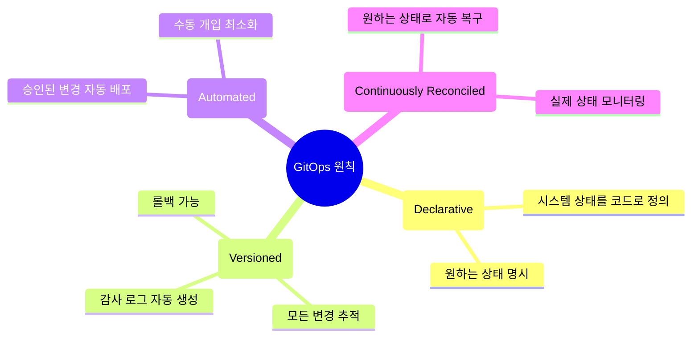
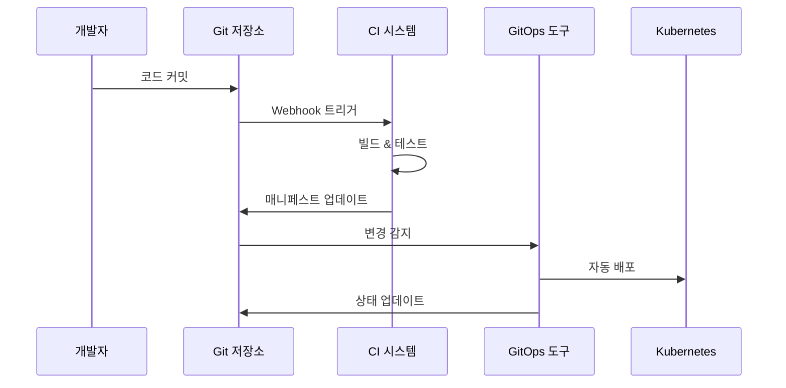
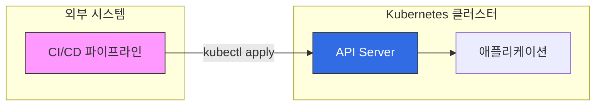
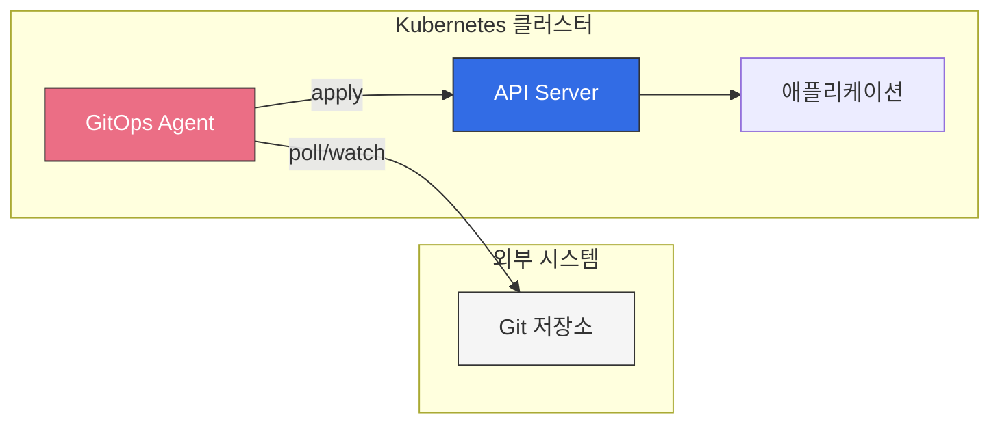
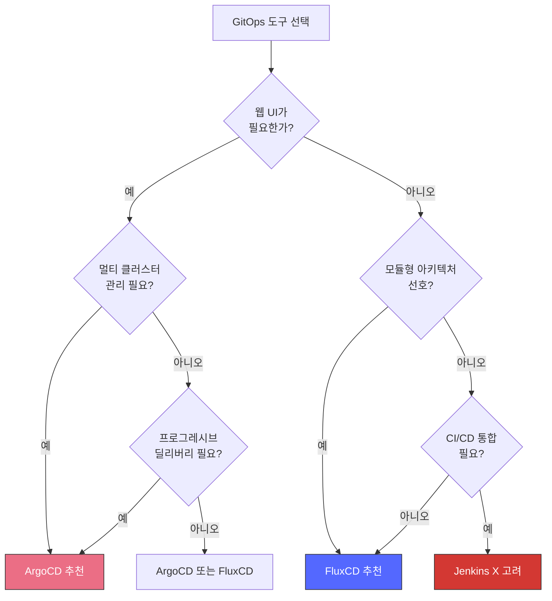
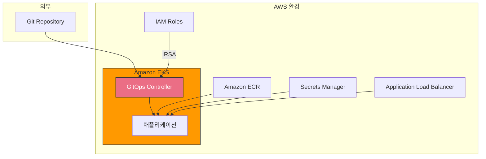

# GitOps

> **마지막 업데이트**: 2025년 2월 21일

## 목차

- [GitOps란?](#gitops란)
- [GitOps의 핵심 원칙](#gitops의-핵심-원칙)
- [Push vs Pull 모델](#push-vs-pull-모델)
- [GitOps 도구 개요](#gitops-도구-개요)
- [도구 선택 가이드](#도구-선택-가이드)
- [Amazon EKS에서의 GitOps](#amazon-eks에서의-gitops)
- [하위 섹션](#하위-섹션)

## GitOps란?

GitOps는 클라우드 네이티브 애플리케이션의 지속적 배포(Continuous Deployment)를 위한 운영 모델입니다. Git 저장소를 "진실의 원천(Single Source of Truth)"으로 사용하여 인프라와 애플리케이션 구성을 선언적으로 정의하고 관리합니다.

### 역사와 배경

GitOps 개념은 2017년 Weaveworks에서 처음 소개되었습니다. Kubernetes의 선언적 특성과 Git의 버전 관리 기능을 결합하여, 인프라를 코드로 관리(Infrastructure as Code)하는 방식을 한 단계 발전시켰습니다.

2021년 CNCF(Cloud Native Computing Foundation)는 GitOps Working Group을 구성하여 GitOps의 표준 원칙과 정의를 수립했습니다.

### CNCF GitOps 정의

CNCF OpenGitOps 프로젝트에서 정의한 GitOps 원칙:



## GitOps의 핵심 원칙

### 1. 선언적 구성 (Declarative Configuration)

시스템의 원하는 상태(Desired State)를 선언적으로 정의합니다. "어떻게(How)"가 아닌 "무엇(What)"을 정의합니다.

```yaml
# 선언적 구성 예시
apiVersion: apps/v1
kind: Deployment
metadata:
  name: my-application
spec:
  replicas: 3  # 원하는 상태: 3개의 레플리카
  selector:
    matchLabels:
      app: my-application
  template:
    metadata:
      labels:
        app: my-application
    spec:
      containers:
      - name: app
        image: my-app:v1.2.3
        resources:
          requests:
            memory: "128Mi"
            cpu: "250m"
          limits:
            memory: "256Mi"
            cpu: "500m"
```

### 2. 버전 제어 (Version Controlled)

모든 구성은 Git에서 버전 관리됩니다:

- **변경 이력 추적**: 누가, 언제, 무엇을 변경했는지 기록
- **코드 리뷰**: Pull Request를 통한 변경 검토
- **롤백**: 이전 버전으로 쉽게 복구
- **감사 추적**: 규정 준수를 위한 자동 감사 로그

### 3. 자동화된 배포 (Automated Delivery)

승인된 변경 사항은 자동으로 시스템에 적용됩니다:



### 4. 지속적 조정 (Continuous Reconciliation)

GitOps 에이전트는 지속적으로 실제 상태와 원하는 상태를 비교하고 조정합니다:

- **드리프트 감지**: 수동 변경이나 오류로 인한 상태 차이 감지
- **자체 치유**: 원하는 상태로 자동 복구
- **알림**: 상태 불일치 시 관리자에게 알림

## Push vs Pull 모델

GitOps 구현에는 두 가지 주요 배포 모델이 있습니다:

### Push 모델



**특징:**
- CI/CD 시스템이 클러스터에 직접 배포
- 클러스터 자격 증명이 외부에 노출
- Jenkins, GitHub Actions 등 전통적인 CI/CD 방식

**장점:**
- 단순한 구현
- 기존 CI/CD 파이프라인과 쉬운 통합

**단점:**
- 보안 위험 (자격 증명 노출)
- 드리프트 감지 어려움
- 자체 치유 기능 없음

### Pull 모델 (GitOps 권장)



**특징:**
- 클러스터 내부의 에이전트가 Git을 모니터링
- 자격 증명이 클러스터 내부에만 존재
- ArgoCD, FluxCD가 대표적인 Pull 기반 도구

**장점:**
- 향상된 보안
- 자동 드리프트 감지 및 수정
- 자체 치유 기능
- 감사 추적

**단점:**
- 추가 인프라 필요 (GitOps 에이전트)
- 학습 곡선

## GitOps 도구 개요

### ArgoCD

CNCF Graduated 프로젝트로, Kubernetes를 위한 선언적 GitOps CD 도구입니다.

**주요 특징:**
- 직관적인 웹 UI
- 다중 클러스터 지원
- SSO 통합 (OIDC, SAML, LDAP)
- Helm, Kustomize, Jsonnet 지원
- ApplicationSet을 통한 대규모 배포
- Argo Rollouts와 통합된 프로그레시브 딜리버리

### FluxCD

CNCF Graduated 프로젝트로, Kubernetes를 위한 GitOps 도구 세트입니다.

**주요 특징:**
- 모듈형 아키텍처 (컴포넌트별 분리)
- Helm Controller, Kustomize Controller 분리
- Image Automation Controller
- Notification Controller
- 멀티테넌시 지원
- OCI 아티팩트 지원

### 기타 도구

| 도구 | 설명 | 특징 |
|------|------|------|
| **Jenkins X** | Kubernetes 네이티브 CI/CD | Preview 환경, ChatOps |
| **Rancher Fleet** | 대규모 클러스터 관리 | 엣지 컴퓨팅, 수천 클러스터 |
| **Weave GitOps** | FluxCD 기반 엔터프라이즈 | 상용 지원, UI 대시보드 |
| **Codefresh** | GitOps + CI/CD 통합 | 상용 솔루션, 엔터프라이즈 기능 |

## 도구 선택 가이드

### 결정 매트릭스

| 요구사항 | ArgoCD | FluxCD | Jenkins X |
|----------|--------|--------|-----------|
| **웹 UI** | ★★★★★ | ★★☆☆☆ | ★★★☆☆ |
| **CLI 중심** | ★★★★☆ | ★★★★★ | ★★★☆☆ |
| **멀티 클러스터** | ★★★★★ | ★★★★☆ | ★★★☆☆ |
| **Helm 지원** | ★★★★★ | ★★★★★ | ★★★★★ |
| **학습 용이성** | ★★★★☆ | ★★★☆☆ | ★★☆☆☆ |
| **커뮤니티 규모** | ★★★★★ | ★★★★☆ | ★★★☆☆ |
| **엔터프라이즈 기능** | ★★★★★ | ★★★★☆ | ★★★★☆ |
| **리소스 사용량** | ★★★☆☆ | ★★★★★ | ★★☆☆☆ |

### 선택 가이드



### ArgoCD 선택 시나리오

- 직관적인 UI로 배포 상태를 시각화하고 싶을 때
- 다중 클러스터를 중앙에서 관리해야 할 때
- SSO 통합 및 세분화된 RBAC이 필요할 때
- Argo Rollouts를 통한 블루/그린, 카나리 배포가 필요할 때
- ApplicationSet으로 대규모 애플리케이션을 관리할 때

### FluxCD 선택 시나리오

- CLI 중심의 경량 솔루션을 원할 때
- 모듈형 아키텍처로 필요한 컴포넌트만 사용하고 싶을 때
- 이미지 자동 업데이트가 중요할 때
- 리소스 사용량을 최소화해야 할 때
- Kubernetes API 스타일의 CRD를 선호할 때

## Amazon EKS에서의 GitOps

### EKS 환경 고려사항

Amazon EKS에서 GitOps를 구현할 때 고려해야 할 사항:



### IRSA (IAM Roles for Service Accounts)

GitOps 도구가 AWS 서비스에 접근할 때 IRSA를 사용하여 보안을 강화합니다:

```yaml
apiVersion: v1
kind: ServiceAccount
metadata:
  name: argocd-application-controller
  namespace: argocd
  annotations:
    eks.amazonaws.com/role-arn: arn:aws:iam::123456789012:role/ArgoCD-Controller-Role
```

### AWS 통합 포인트

| AWS 서비스 | GitOps 활용 |
|------------|-------------|
| **Amazon ECR** | 컨테이너 이미지 저장소 |
| **AWS Secrets Manager** | 시크릿 관리 (External Secrets) |
| **AWS CodeCommit** | Git 저장소 |
| **Application Load Balancer** | Ingress Controller |
| **Amazon CloudWatch** | 로깅 및 모니터링 |
| **AWS IAM Identity Center** | SSO 통합 |

### EKS Blueprints

AWS EKS Blueprints는 GitOps 패턴을 포함한 EKS 클러스터 프로비저닝 프레임워크입니다:

```hcl
# Terraform EKS Blueprints with ArgoCD
module "eks_blueprints_addons" {
  source = "aws-ia/eks-blueprints-addons/aws"

  cluster_name      = module.eks.cluster_name
  cluster_endpoint  = module.eks.cluster_endpoint
  cluster_version   = module.eks.cluster_version
  oidc_provider_arn = module.eks.oidc_provider_arn

  enable_argocd = true
  argocd = {
    values = [templatefile("${path.module}/argocd-values.yaml", {})]
  }
}
```

## 하위 섹션

이 GitOps 가이드는 다음 하위 섹션으로 구성되어 있습니다:

### ArgoCD

| 가이드 | 설명 |
|--------|------|
| [ArgoCD 개요](argocd/README.md) | ArgoCD 소개 및 아키텍처 |
| [설치 및 구성](argocd/01-installation.md) | ArgoCD 설치 방법 |
| [Application 심층 분석](argocd/02-applications.md) | Application CRD 상세 |
| [동기화 전략](argocd/03-sync-strategies.md) | 동기화 정책 및 옵션 |
| [ApplicationSets](argocd/04-applicationsets.md) | 대규모 배포 자동화 |
| [트래픽 관리](argocd/05-traffic-management.md) | Argo Rollouts 연동 |
| [프로젝트와 RBAC](argocd/06-projects-rbac.md) | 접근 제어 구성 |
| [보안](argocd/07-security.md) | 보안 설정 및 시크릿 관리 |
| [알림](argocd/08-notifications.md) | 알림 시스템 구성 |
| [모범 사례](argocd/09-best-practices.md) | 프로덕션 권장 사항 |

### FluxCD

| 가이드 | 설명 |
|--------|------|
| [FluxCD 개요](02-fluxcd.md) | FluxCD 소개 및 아키텍처 |

### 비교 및 마이그레이션

| 가이드 | 설명 |
|--------|------|
| [ArgoCD vs FluxCD](03-gitops-comparison.md) | 상세 비교 분석 |

## 다음 단계

1. **ArgoCD 시작하기**: [ArgoCD 개요](argocd/README.md)로 이동하여 ArgoCD의 아키텍처와 주요 개념을 학습하세요.

2. **FluxCD 시작하기**: [FluxCD 개요](02-fluxcd.md)로 이동하여 FluxCD의 모듈형 아키텍처를 살펴보세요.

3. **도구 비교**: [ArgoCD vs FluxCD 비교](03-gitops-comparison.md)를 통해 프로젝트에 적합한 도구를 선택하세요.

## 참고 자료

- [CNCF GitOps Working Group](https://opengitops.dev/)
- [GitOps Principles](https://www.gitops.tech/)
- [ArgoCD 공식 문서](https://argo-cd.readthedocs.io/)
- [FluxCD 공식 문서](https://fluxcd.io/docs/)
- [AWS EKS Blueprints](https://aws-ia.github.io/terraform-aws-eks-blueprints/)

## 퀴즈

이 장에서 배운 내용을 테스트하려면 다음 퀴즈를 풀어보세요:
- [ArgoCD 퀴즈](../quizzes/gitops/01-argocd-quiz.md)
- [FluxCD 퀴즈](../quizzes/gitops/02-fluxcd-quiz.md)
- [GitOps 비교 퀴즈](../quizzes/gitops/03-gitops-comparison-quiz.md)
