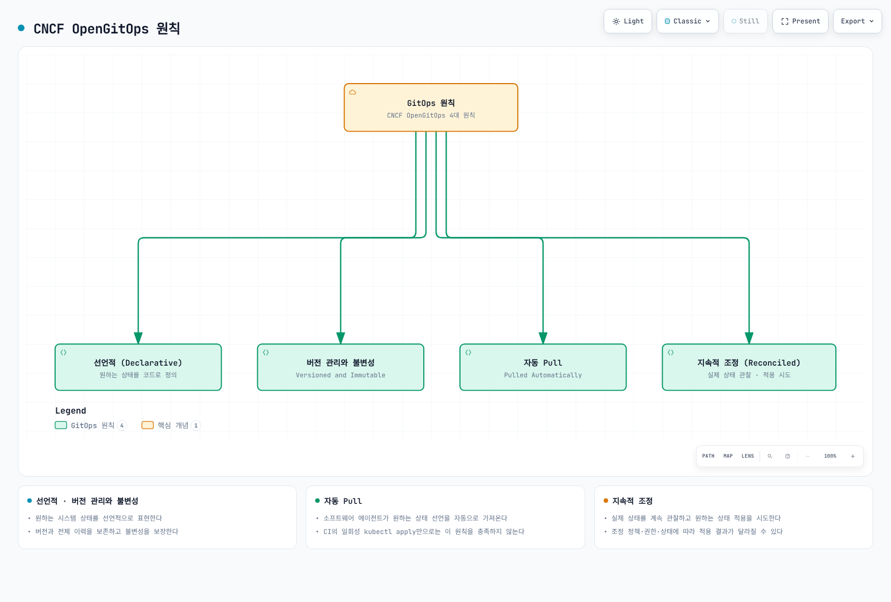
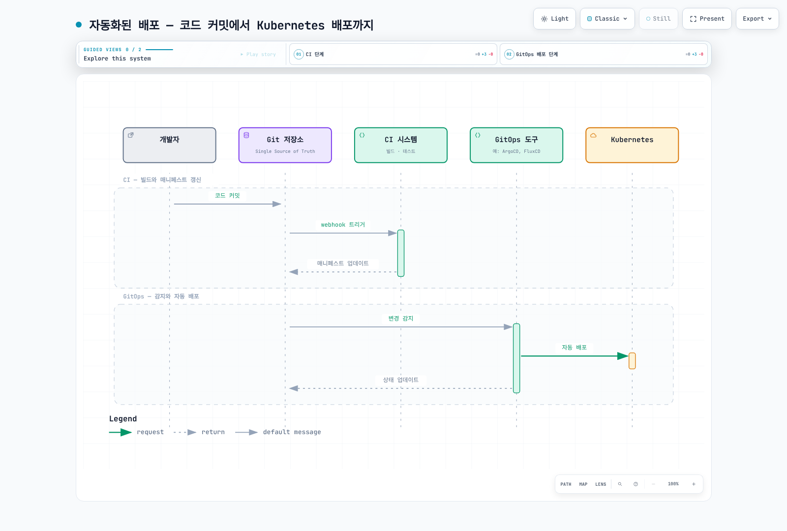
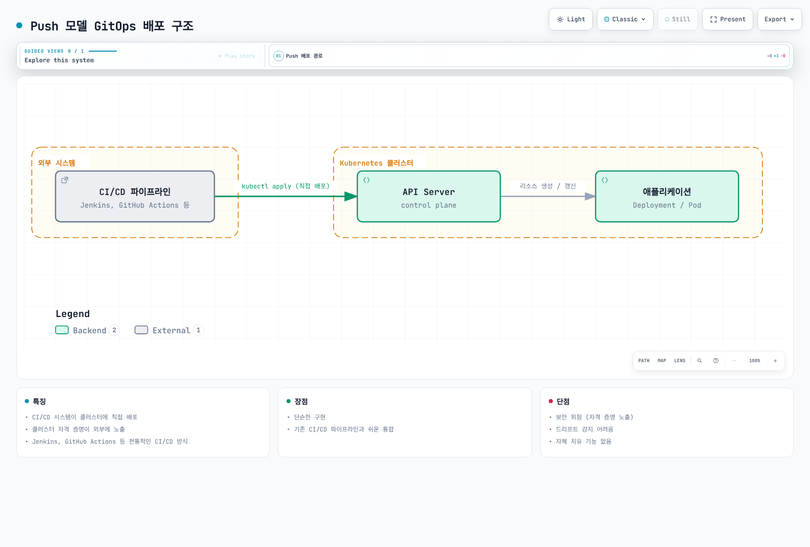
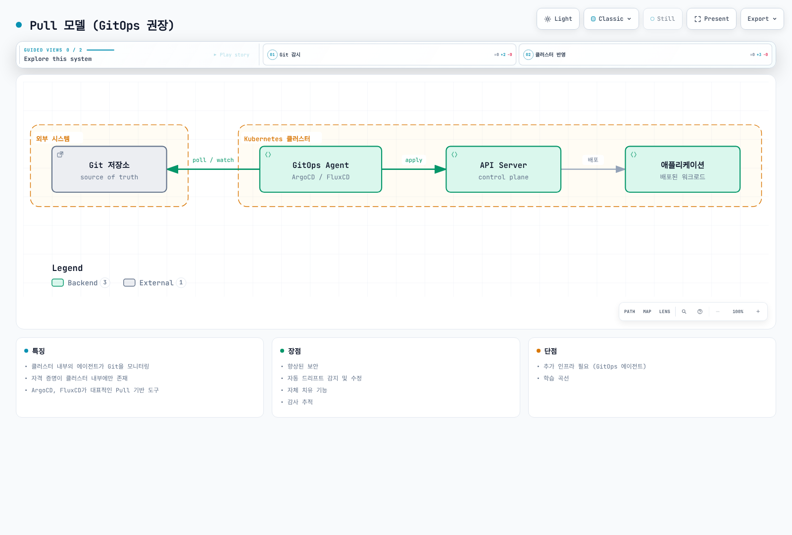
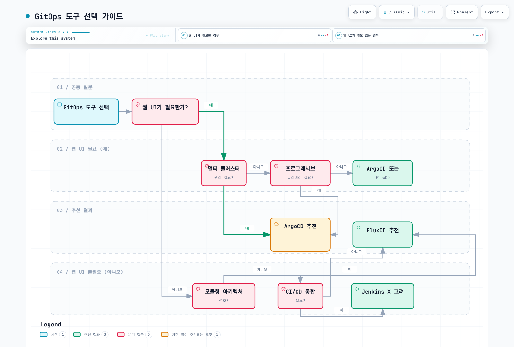
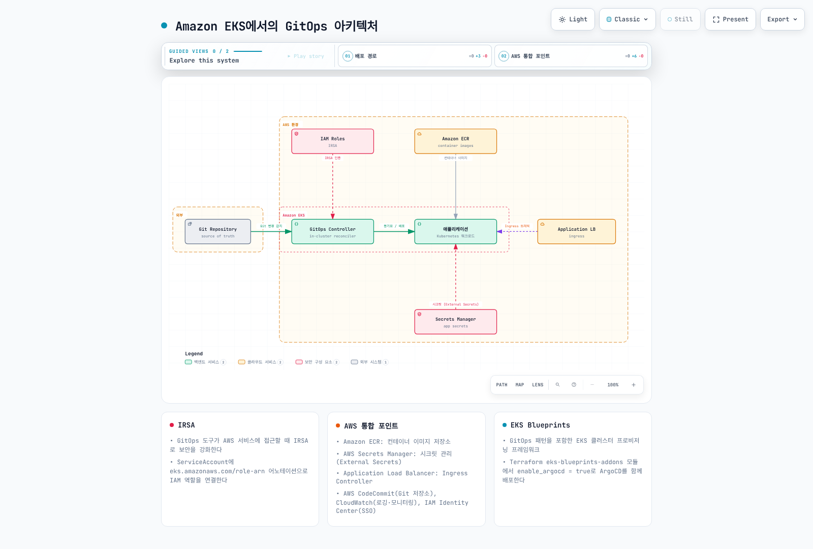

# GitOps

> **마지막 업데이트**: 2026년 9월 11일

## 목차

- [GitOps란?](#gitops란)
- [GitOps의 핵심 원칙](#gitops의-핵심-원칙)
- [Push vs Pull 모델](#push-vs-pull-모델)
- [GitOps 도구 개요](#gitops-도구-개요)
- [도구 선택 가이드](#도구-선택-가이드)
- [Amazon EKS에서의 GitOps](#amazon-eks에서의-gitops)
- [하위 섹션](#하위-섹션)

## GitOps란?

GitOps는 클라우드 네이티브 애플리케이션의 지속적 배포(Continuous Deployment)를 위한 운영 모델입니다. Git 저장소를 "진실의 원천(Single Source of Truth)"으로 사용하여 인프라와 애플리케이션 구성을 선언적으로 정의하고 관리합니다.

### 역사와 배경

GitOps 개념은 2017년 Weaveworks에서 처음 소개되었습니다. Kubernetes의 선언적 특성과 Git의 버전 관리 기능을 결합하여, 인프라를 코드로 관리(Infrastructure as Code)하는 방식을 한 단계 발전시켰습니다.

OpenGitOps는 GitOps의 원칙을 명문화합니다. Git 저장소를 쓰는 것만으로 모든 원칙을 충족하는 것은 아닙니다.

### CNCF GitOps 정의

CNCF OpenGitOps 프로젝트에서 정의한 GitOps 원칙:



[🔍 인터랙티브 다이어그램 보기](https://www.atomai.click/kubernetes-docs/archmaps/ko-gitops-readme-0.html)

## GitOps의 핵심 원칙

Git 이력은 원하는 구성의 이력입니다. Git revert만으로 데이터베이스 마이그레이션·삭제된 데이터·외부 상태가 복구되지는 않습니다. Argo CD의 자동 sync, prune, selfHeal도 각각 설정해야 하며 GitOps는 적용을 시도하는 제어 루프입니다.

### 1. 선언적 구성 (Declarative Configuration)

시스템의 원하는 상태(Desired State)를 선언적으로 정의합니다. "어떻게(How)"가 아닌 "무엇(What)"을 정의합니다.

```yaml
# 선언적 구성 예시
apiVersion: apps/v1
kind: Deployment
metadata:
  name: my-application
spec:
  replicas: 3  # 원하는 상태: 3개의 레플리카
  selector:
    matchLabels:
      app: my-application
  template:
    metadata:
      labels:
        app: my-application
    spec:
      containers:
      - name: app
        image: my-app:v1.2.3
        resources:
          requests:
            memory: "128Mi"
            cpu: "250m"
          limits:
            memory: "256Mi"
            cpu: "500m"
```

### 2. 버전 관리와 불변성 (Versioned and Immutable)

원하는 상태의 버전과 전체 이력을 보존하고 불변성을 보장해야 합니다. Git을 쓴다면 이력 보존·force-push 제한·검토 정책을 함께 설정합니다:

- **변경 이력 추적**: 누가, 언제, 무엇을 변경했는지 기록
- **코드 리뷰**: Pull Request를 통한 변경 검토
- **롤백**: 이전 버전으로 쉽게 복구
- **감사 추적**: 구성 변경 이력; 런타임/API 감사 로그는 별도 수집

### 3. 자동 Pull (Pulled Automatically)

소프트웨어 에이전트가 소스에서 원하는 상태 선언을 자동으로 가져옵니다. 다음 CI·배포 흐름에서 CI는 아티팩트와 선언을 갱신하고 reconciler가 이를 가져와 적용을 시도합니다:



[🔍 인터랙티브 다이어그램 보기](https://www.atomai.click/kubernetes-docs/archmaps/ko-gitops-readme-1.html)

### 4. 지속적 조정 (Continuous Reconciliation)

GitOps 에이전트는 지속적으로 실제 상태와 원하는 상태를 비교하고 조정합니다:

- **드리프트 감지**: 수동 변경이나 오류로 인한 상태 차이 감지
- **자체 치유**: 구성된 정책과 권한 범위에서 원하는 상태 적용 시도
- **알림**: 상태 불일치 시 관리자에게 알림

## Push vs Pull 모델

전통적 push 배포와 GitOps의 pull 기반 조정을 비교합니다. CI가 `kubectl apply`만 수행하는 구성은 자동 Pull·지속 조정이라는 OpenGitOps 원칙을 충족하지 않습니다:

### Push 모델



[🔍 인터랙티브 다이어그램 보기](https://www.atomai.click/kubernetes-docs/archmaps/ko-gitops-readme-2.html)

**특징:**
- CI/CD 시스템이 클러스터에 직접 배포
- CI 실행 환경에 클러스터 접근 권한이 필요 (자동 공개를 뜻하지 않음)
- Jenkins, GitHub Actions 등 전통적인 CI/CD 방식

**장점:**
- 단순한 구현
- 기존 CI/CD 파이프라인과 쉬운 통합

**단점:**
- CI의 권한 범위·자격 증명 수명 관리 필요
- 드리프트 감지 어려움
- 자체 치유 기능 없음

### Pull 모델 (GitOps 권장)



[🔍 인터랙티브 다이어그램 보기](https://www.atomai.click/kubernetes-docs/archmaps/ko-gitops-readme-3.html)

**특징:**
- 대상 클러스터 또는 관리 클러스터의 에이전트가 소스를 모니터링
- 에이전트가 Git/Registry/대상 API 접근 권한을 관리; 원격 클러스터 인증도 필요할 수 있음
- ArgoCD, FluxCD가 대표적인 Pull 기반 도구

**장점:**
- CI의 대상 클러스터 직접 권한을 줄일 수 있음
- 자동 드리프트 감지 및 수정
- 자체 치유 기능
- 감사 추적

**단점:**
- 추가 인프라 필요 (GitOps 에이전트)
- 학습 곡선

## GitOps 도구 개요

### ArgoCD

CNCF Graduated 프로젝트인 Argo에 포함된 Kubernetes GitOps CD 도구입니다.

**주요 특징:**
- 직관적인 웹 UI
- 다중 클러스터 지원
- SSO: OIDC 직접 연동 또는 Dex 등의 지원 커넥터를 통한 SAML/LDAP 연동
- Helm, Kustomize, Jsonnet 지원
- ApplicationSet을 통한 대규모 배포
- Argo Rollouts와 통합된 프로그레시브 딜리버리

### FluxCD

CNCF Graduated 프로젝트로, Kubernetes를 위한 GitOps 도구 세트입니다.

**주요 특징:**
- 모듈형 아키텍처 (컴포넌트별 분리)
- Helm Controller, Kustomize Controller 분리
- Image Automation Controller
- Notification Controller
- 멀티테넌시 지원
- OCI 아티팩트 지원

### 기타 도구

| 도구 | 설명 | 특징 |
|------|------|------|
| **Jenkins X / JayeX** | Kubernetes 네이티브 CI/CD | Preview 환경, ChatOps |
| **Rancher Fleet** | 대규모 클러스터 관리 | 엣지 컴퓨팅, 수천 클러스터 |
| **Weave GitOps** | Flux 기반 UI 프로젝트 | OSS 배포판과 상용 지원 제공자를 별도로 확인 |
| **Codefresh** | GitOps + CI/CD 통합 | 상용 솔루션, 엔터프라이즈 기능 |

## 도구 선택 가이드

### 결정 매트릭스

| 확인할 요구사항 | Argo CD | Flux |
|---|---|---|
| 기본 UI | 내장 Web UI와 CLI | 핵심 컨트롤러/CLI, 별도 생태계 UI 선택 |
| Helm 처리 | helm template 후 Argo CD가 리소스 수명주기 관리 | Helm Controller가 Helm release 수명주기 관리 |
| 이미지 갱신 | 별도 Argo CD Image Updater | 선택 설치하는 Image Reflector/Automation |
| 멀티테넌시 | AppProject·RBAC·목적지/소스 제한 | Kubernetes RBAC·ServiceAccount impersonation·cross-namespace 제한 |
| OCI 소스 | 일반 OCI/Helm 소스; 지원 layer/media type 확인 | OCIRepository 및 Helm 소스; 검증·layer 설정 확인 |
| 용량 계획 | 애플리케이션/클러스터 수와 reconcile 부하로 측정 | 설치 컨트롤러·소스 수·reconcile 부하로 측정 |

### 선택 가이드

다이어그램은 선택 질문의 예시입니다. 한 기능을 특정 도구만 지원한다는 뜻이 아니며, 현재 기능·권한 모델·운영 부담을 위 표와 실제 검증으로 비교합니다.



[🔍 인터랙티브 다이어그램 보기](https://www.atomai.click/kubernetes-docs/archmaps/ko-gitops-readme-4.html)

### ArgoCD 선택 시나리오

- 직관적인 UI로 배포 상태를 시각화하고 싶을 때
- 다중 클러스터를 중앙에서 관리해야 할 때
- SSO 통합 및 세분화된 RBAC이 필요할 때
- Argo Rollouts를 통한 블루/그린, 카나리 배포가 필요할 때
- ApplicationSet으로 대규모 애플리케이션을 관리할 때

### FluxCD 선택 시나리오

- CLI 중심의 경량 솔루션을 원할 때
- 모듈형 아키텍처로 필요한 컴포넌트만 사용하고 싶을 때
- 이미지 자동 업데이트가 중요할 때
- 리소스 사용량을 최소화해야 할 때
- Kubernetes API 스타일의 CRD를 선호할 때

## Amazon EKS에서의 GitOps

### EKS 환경 고려사항

Amazon EKS에서 GitOps를 구현할 때 고려해야 할 사항:



[🔍 인터랙티브 다이어그램 보기](https://www.atomai.click/kubernetes-docs/archmaps/ko-gitops-readme-5.html)

### IRSA (IAM Roles for Service Accounts)

ServiceAccount annotation만으로 IAM 연결이 완성되지는 않습니다. IRSA의 OIDC provider·신뢰 정책·SDK 지원 또는 별도 EKS Pod Identity 연결이 필요합니다. AWS API 권한과 대상 Kubernetes API의 인증·RBAC는 구분해서 설정합니다.

GitOps 도구가 AWS 서비스에 접근할 때 IRSA를 사용하여 보안을 강화합니다:

```yaml
apiVersion: v1
kind: ServiceAccount
metadata:
  name: argocd-application-controller
  namespace: argocd
  annotations:
    eks.amazonaws.com/role-arn: arn:aws:iam::123456789012:role/ArgoCD-Controller-Role
```

### AWS 통합 포인트

| AWS 서비스 | GitOps 활용 |
|------------|-------------|
| **Amazon ECR** | 컨테이너 이미지 저장소 |
| **AWS Secrets Manager** | 시크릿 관리 (External Secrets) |
| **AWS CodeCommit** | Git 저장소 |
| **Application Load Balancer** | AWS Load Balancer Controller가 Ingress 등을 reconcile하여 생성하는 로드 밸런서 |
| **Amazon CloudWatch** | 로깅 및 모니터링 |
| **AWS IAM Identity Center** | SSO 통합 |

### EKS Blueprints

AWS EKS Blueprints는 GitOps 패턴을 포함한 EKS 클러스터 프로비저닝 프레임워크입니다:

기존 `module.eks`와 `argocd-values.yaml`이 있는 Terraform 프로젝트의 부분 예제입니다. 실제 적용 시 모듈·Chart 버전을 고정하고 지원 조합을 검증합니다.

```hcl
# Terraform EKS Blueprints with ArgoCD
module "eks_blueprints_addons" {
  source = "aws-ia/eks-blueprints-addons/aws"

  cluster_name      = module.eks.cluster_name
  cluster_endpoint  = module.eks.cluster_endpoint
  cluster_version   = module.eks.cluster_version
  oidc_provider_arn = module.eks.oidc_provider_arn

  enable_argocd = true
  argocd = {
    values = [templatefile("${path.module}/argocd-values.yaml", {})]
  }
}
```

## 하위 섹션

이 GitOps 가이드는 다음 하위 섹션으로 구성되어 있습니다:

### ArgoCD

| 가이드 | 설명 |
|--------|------|
| [ArgoCD 개요](argocd/README.md) | ArgoCD 소개 및 아키텍처 |
| [설치 및 구성](argocd/01-installation.md) | ArgoCD 설치 방법 |
| [Application 심층 분석](argocd/02-applications.md) | Application CRD 상세 |
| [동기화 전략](argocd/03-sync-strategies.md) | 동기화 정책 및 옵션 |
| [ApplicationSets](argocd/04-applicationsets.md) | 대규모 배포 자동화 |
| [트래픽 관리](argocd/05-traffic-management.md) | Argo Rollouts 연동 |
| [프로젝트와 RBAC](argocd/06-projects-rbac.md) | 접근 제어 구성 |
| [보안](argocd/07-security.md) | 보안 설정 및 시크릿 관리 |
| [알림](argocd/08-notifications.md) | 알림 시스템 구성 |
| [모범 사례](argocd/09-best-practices.md) | 프로덕션 권장 사항 |

### FluxCD

| 가이드 | 설명 |
|--------|------|
| [FluxCD 개요](02-fluxcd.md) | FluxCD 소개 및 아키텍처 |

### 비교 및 마이그레이션

| 가이드 | 설명 |
|--------|------|
| [ArgoCD vs FluxCD](03-gitops-comparison.md) | 상세 비교 분석 |

### Feature Flag

| 가이드 | 설명 |
|--------|------|
| [Feature Flags와 OpenFeature](05-feature-flags.md) | OpenFeature 표준, flagd, Kubernetes 네이티브 Feature Flag 관리 |

## 다음 단계

1. **ArgoCD 시작하기**: [ArgoCD 개요](argocd/README.md)로 이동하여 ArgoCD의 아키텍처와 주요 개념을 학습하세요.

2. **FluxCD 시작하기**: [FluxCD 개요](02-fluxcd.md)로 이동하여 FluxCD의 모듈형 아키텍처를 살펴보세요.

3. **도구 비교**: [ArgoCD vs FluxCD 비교](03-gitops-comparison.md)를 통해 프로젝트에 적합한 도구를 선택하세요.

## 참고 자료

- [CNCF GitOps Working Group](https://opengitops.dev/)
- [GitOps Principles](https://www.gitops.tech/)
- [ArgoCD 공식 문서](https://argo-cd.readthedocs.io/)
- [FluxCD 공식 문서](https://fluxcd.io/docs/)
- [AWS EKS Blueprints](https://aws-ia.github.io/terraform-aws-eks-blueprints/)

## 퀴즈

이 장에서 배운 내용을 테스트하려면 다음 퀴즈를 풀어보세요:
- [ArgoCD 퀴즈](../quizzes/gitops/01-argocd-quiz.md)
- [FluxCD 퀴즈](../quizzes/gitops/02-fluxcd-quiz.md)
- [GitOps 비교 퀴즈](../quizzes/gitops/03-gitops-comparison-quiz.md)

### 검토 근거

- [OpenGitOps principles](https://github.com/open-gitops/documents/blob/v1.0.0/PRINCIPLES.md)
- [Argo project maturity](https://www.cncf.io/projects/argo/)
- [Flux project maturity](https://www.cncf.io/projects/flux/)
- [Argo CD OCI sources](https://argo-cd.readthedocs.io/en/stable/user-guide/oci/)
- [Argo CD automated sync](https://argo-cd.readthedocs.io/en/stable/user-guide/auto_sync/)
- [Flux multi-tenancy](https://fluxcd.io/flux/installation/configuration/multitenancy/)
- [Flux ecosystem](https://fluxcd.io/ecosystem/)
- [JayeX project](https://jayex.io/v3/about/)
