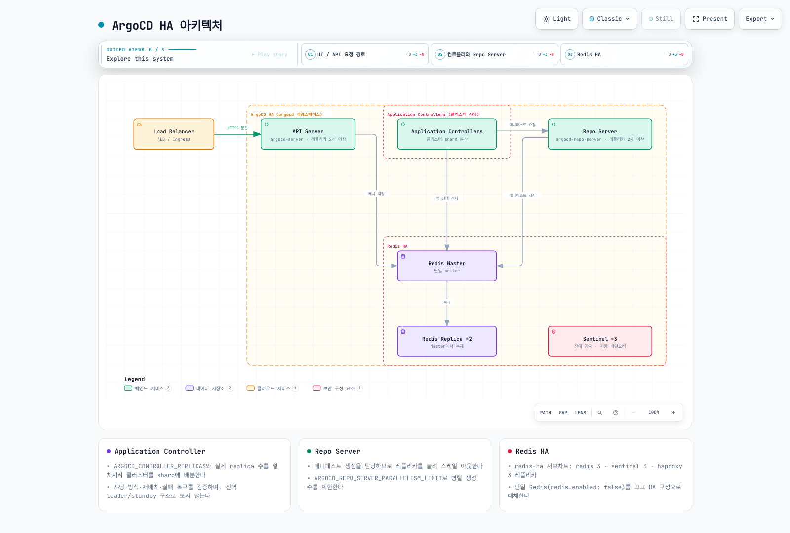

# ArgoCD 설치 및 구성

> **지원 버전**: Argo CD 3.5.2 / Helm Chart 10.8.4
> **마지막 업데이트**: 2026년 9월 11일

## 목차

- [사전 요구 사항](#사전-요구-사항)
- [설치 방법](#설치-방법)
- [CLI 설치](#cli-설치)
- [초기 접근](#초기-접근)
- [고가용성 설정](#고가용성-설정)
- [Amazon EKS 통합](#amazon-eks-통합)
- [선언적 설정](#선언적-설정)

## 사전 요구 사항

이 가이드는 자체 설치용입니다. EKS 관리형 Argo CD capability는 별도 생성·권한·설정 절차를 사용하며 여기에 self-managed 설치를 겹치지 않습니다. [개요의 호환성 표](README.md)에서 테스트된 Kubernetes 조합과 EKS 지원 기간을 확인합니다. Chart 최소 kubeVersion 조건은 테스트·지원 보장과 다릅니다.

namespace 생성 권한 하나로 CRD·ClusterRole·ClusterRoleBinding 설치 권한 전체가 확인되지는 않습니다. 실제 context와 권한을 확인합니다. HA 번들은 anti-affinity 때문에 최소 3개 노드가 필요합니다. CPU/메모리는 앱·클러스터·리포지토리 규모에 맞춰 측정하며 Redis 캐시에 무조건 10/50GB PVC가 필요한 것은 아닙니다.

```bash
kubectl version --client
kubectl config current-context
kubectl cluster-info
kubectl auth can-i create customresourcedefinitions.apiextensions.k8s.io
kubectl auth can-i create clusterrolebindings.rbac.authorization.k8s.io
```

## 설치 방법

manifest·Helm·Kustomize 중 하나를 관리 주체로 선택합니다. 아래 non-HA/HA 설치도 대안이며 순서대로 모두 적용하는 절차가 아닙니다. 다른 namespace를 선택하면 ClusterRoleBinding의 ServiceAccount namespace도 조정해야 합니다.

### 방법 1: 일반 매니페스트 (권장)

가장 간단한 설치 방법입니다:

```bash
# 네임스페이스 생성
kubectl create namespace argocd

# ArgoCD 설치 (일반)
kubectl apply --server-side -n argocd -f https://raw.githubusercontent.com/argoproj/argo-cd/v3.5.2/manifests/install.yaml

```

**HA 모드 설치:**

```bash
kubectl apply --server-side -n argocd -f https://raw.githubusercontent.com/argoproj/argo-cd/v3.5.2/manifests/ha/install.yaml
```

**설치 확인:**

```bash
# Pod 상태 확인
kubectl get pods -n argocd

# 예상 출력:
# NAME                                               READY   STATUS    RESTARTS   AGE
# argocd-application-controller-0                   1/1     Running   0          2m
# argocd-applicationset-controller-xxx              1/1     Running   0          2m
# argocd-dex-server-xxx                             1/1     Running   0          2m
# argocd-notifications-controller-xxx              1/1     Running   0          2m
# argocd-redis-xxx                                  1/1     Running   0          2m
# argocd-repo-server-xxx                            1/1     Running   0          2m
# argocd-server-xxx                                 1/1     Running   0          2m

# 서비스 확인
kubectl get svc -n argocd
```

### 방법 2: Helm 차트

Helm을 통한 설치는 커스터마이징이 용이합니다:

```bash
# Helm 저장소 추가
helm repo add argo https://argoproj.github.io/argo-helm
helm repo update

# 기본 설치
helm install argocd argo/argo-cd --version 10.8.4 \
  --namespace argocd \
  --create-namespace

# 커스텀 values 파일로 설치
helm install argocd argo/argo-cd --version 10.8.4 \
  --namespace argocd \
  --create-namespace \
  -f values.yaml
```

**values.yaml 예시:**

아래 값은 HA 시작 예시이며 실제 부하로 리소스를 조정합니다. Chart가 controller shard 수와 ApplicationSet leader election을 설정합니다. Dex는 기본 1개입니다. 기본 설치와 커스텀 설치 명령 중 하나만 선택합니다. 먼저 `helm template`로 렌더링을 검토하고, ServiceMonitor는 Operator CRD가 있을 때만 켭니다.

```yaml
fullnameOverride: argocd
global:
  domain: argocd.example.com
configs:
  params:
    server.insecure: false
  cm:
    url: https://argocd.example.com
    users.anonymous.enabled: 'false'
    exec.enabled: 'false'
controller:
  replicas: 2
  resources:
    requests:
      cpu: 250m
      memory: 512Mi
    limits:
      cpu: '1'
      memory: 2Gi
  pdb:
    enabled: true
    minAvailable: 1
server:
  replicas: 2
  service:
    type: ClusterIP
  ingress:
    enabled: false
  resources:
    requests:
      cpu: 100m
      memory: 128Mi
    limits:
      cpu: 500m
      memory: 512Mi
  pdb:
    enabled: true
    minAvailable: 1
repoServer:
  replicas: 2
  resources:
    requests:
      cpu: 100m
      memory: 256Mi
    limits:
      cpu: '1'
      memory: 1Gi
  pdb:
    enabled: true
    minAvailable: 1
applicationSet:
  replicas: 2
  pdb:
    enabled: true
    minAvailable: 1
notifications:
  enabled: true
redis:
  enabled: false
redis-ha:
  enabled: true
  replicas: 3
  persistentVolume:
    enabled: false
  haproxy:
    enabled: true
    replicas: 3
```

### 방법 3: Kustomize

Kustomize를 사용하면 기본 매니페스트를 패치할 수 있습니다:

```yaml
# kustomization.yaml
apiVersion: kustomize.config.k8s.io/v1beta1
kind: Kustomization

namespace: argocd

resources:
  - https://raw.githubusercontent.com/argoproj/argo-cd/v3.5.2/manifests/install.yaml

patches:
  # API Server 레플리카 증가
  - target:
      kind: Deployment
      name: argocd-server
    patch: |-
      - op: replace
        path: /spec/replicas
        value: 2

  # Repo Server 리소스 조정
  - target:
      kind: Deployment
      name: argocd-repo-server
    patch: |-
      - op: replace
        path: /spec/template/spec/containers/0/resources
        value:
          requests:
            cpu: 200m
            memory: 512Mi
          limits:
            cpu: 1000m
            memory: 2Gi

configMapGenerator:
  - name: argocd-cmd-params-cm
    behavior: merge
    literals:
      - server.insecure=false
```

**적용:**

```bash
kubectl apply --server-side -k .
```

## CLI 설치

### Linux / macOS

다음을 스크립트 파일로 저장해 실행합니다. CPU 아키텍처와 서버 버전을 맞추고 공식 릴리스 체크섬을 검증합니다. macOS는 `brew install argocd`도 가능하지만 설치된 버전을 확인합니다.

```bash
#!/usr/bin/env bash
set -euo pipefail
ARGOCD_VERSION=v3.5.2
case "$(uname -s)" in
  Linux) ARGOCD_OS=linux ;;
  Darwin) ARGOCD_OS=darwin ;;
  *) echo 'Select the release package for your OS' >&2; exit 1 ;;
esac
case "$(uname -m)" in
  x86_64) ARGOCD_ARCH=amd64 ;;
  arm64|aarch64) ARGOCD_ARCH=arm64 ;;
  *) echo 'Select a supported release architecture' >&2; exit 1 ;;
esac
ARGOCD_BINARY="argocd-${ARGOCD_OS}-${ARGOCD_ARCH}"
ARGOCD_INSTALL_TMP=$(mktemp -d)
trap 'rm -rf -- "$ARGOCD_INSTALL_TMP"' EXIT
cd "$ARGOCD_INSTALL_TMP"
curl --fail --location --remote-name \
  "https://github.com/argoproj/argo-cd/releases/download/${ARGOCD_VERSION}/${ARGOCD_BINARY}"
curl --fail --location --remote-name \
  "https://github.com/argoproj/argo-cd/releases/download/${ARGOCD_VERSION}/cli_checksums.txt"
EXPECTED=$(awk -v name="$ARGOCD_BINARY" '$2 == name || $2 == "*" name {print $1}' cli_checksums.txt)
[[ "$EXPECTED" =~ ^[a-f0-9]{64}$ ]]
if command -v sha256sum >/dev/null; then
  ACTUAL=$(sha256sum "$ARGOCD_BINARY" | awk '{print $1}')
else
  ACTUAL=$(shasum -a 256 "$ARGOCD_BINARY" | awk '{print $1}')
fi
[[ "$ACTUAL" == "$EXPECTED" ]]
sudo install -m 0755 "$ARGOCD_BINARY" /usr/local/bin/argocd
argocd version --client
```

### Windows

공식 v3.5.2 릴리스의 `argocd-windows-amd64.exe`와 `cli_checksums.txt`를 다운로드하고 PowerShell `Get-FileHash -Algorithm SHA256` 값이 일치하는지 확인합니다. 사용자 소유 디렉터리에 설치해 사용자 PATH에 추가합니다. System32를 기본 설치 위치로 사용하지 않습니다.

### 자동 완성

```bash
# Bash session
source <(argocd completion bash)
# Zsh alternative:
# source <(argocd completion zsh)
```

## 초기 접근

### 포트 포워딩 (개발/테스트)

```bash
# 백그라운드에서 포트 포워딩
kubectl port-forward svc/argocd-server -n argocd 8080:443 &

# 웹 UI 접근: https://localhost:8080
```

### Ingress 설정

운영 접근에는 유지보수 중인 Controller와 유효한 인증서·접근 범위를 구성합니다. community ingress-nginx는 2026-03 유지보수가 종료되어 새 기본 예제에서 제외합니다. 아래 Amazon EKS 절에 사설 ALB와 HTTPS 백엔드를 일관되게 구성하는 예제가 있습니다. 다른 제품의 TLS passthrough/gRPC 설정은 해당 제품 문서를 따릅니다.

### 초기 비밀번호 가져오기

```bash
# 초기 admin 비밀번호 가져오기
argocd admin initial-password -n argocd

# 또는 직접 Secret에서 가져오기
kubectl -n argocd get secret argocd-initial-admin-secret -o jsonpath="{.data.password}" | base64 -d; echo
```

### 로그인

```bash
# CLI 로그인
argocd login localhost:8080

# 또는 도메인으로 로그인
argocd login argocd.example.com

# 비밀번호 변경 (권장)
argocd account update-password
```

### 초기 비밀번호 Secret 삭제

보안을 위해 초기 비밀번호를 변경한 후 Secret을 삭제합니다:

```bash
kubectl -n argocd delete secret argocd-initial-admin-secret
```

## 고가용성 설정

### HA 아키텍처



[🔍 인터랙티브 다이어그램 보기](https://www.atomai.click/kubernetes-docs/archmaps/ko-gitops-argocd-01-installation-0.html)

위 Helm 예제에서 확인할 사항은 다음과 같습니다.

- Application Controller는 전역 leader 하나와 standby들이 아니라 클러스터를 shard에 분산합니다. Chart가 replica 수와 `ARGOCD_CONTROLLER_REPLICAS`를 맞춥니다. 알고리즘·재배치·실패 복구를 검증하고, 별도 기능인 dynamic distribution을 replica 증가와 혼동하지 않습니다.
- ApplicationSet의 leader election과 Application Controller sharding은 다릅니다. 이 Chart는 ApplicationSet replica가 여러 개이면 leader election을 설정합니다.
- Dex는 번들 in-memory 저장소를 쓰므로 replica만 늘리면 데이터 불일치가 생길 수 있습니다. 기본 1개를 유지하고 별도 HA 요구는 지원 구성을 확인합니다.
- Redis는 폐기 가능한 캐시이고 Argo 설정은 Kubernetes 객체에 저장됩니다. Redis HA subchart의 replica 수는 `redis-ha.replicas`이며 `redis-ha.redis.replicas`가 아닙니다. 번들은 Redis/Sentinel 3개 모델을 사용합니다.
- PDB는 자발적 eviction을 제한할 뿐 노드 장애와 모든 rollout을 막지 않습니다. Pod 분산·readiness·데이터 계층·재조정 시간까지 시험합니다.
- Repo Server 병렬성·HPA·CPU limit은 실제 매니페스트 생성량과 메모리를 보고 조정합니다. “100개 앱이면 shard 2개” 같은 고정 임계값은 없습니다.

## Amazon EKS 통합

### ALB와 TLS

이 예제는 사설 ALB입니다. AWS Load Balancer Controller, subnet/tag·보안 그룹, DNS와 같은 리전의 유효한 ACM 인증서를 준비합니다. `REPLACE_WITH_ACM_CERTIFICATE_ARN`과 예시 호스트를 실제 값으로 바꾸고 관리 단말이 ALB에 접근할 네트워크 경로를 확인합니다.

```yaml
apiVersion: networking.k8s.io/v1
kind: Ingress
metadata:
  name: argocd-server
  namespace: argocd
  annotations:
    alb.ingress.kubernetes.io/scheme: internal
    alb.ingress.kubernetes.io/target-type: ip
    alb.ingress.kubernetes.io/backend-protocol: HTTPS
    alb.ingress.kubernetes.io/healthcheck-protocol: HTTPS
    alb.ingress.kubernetes.io/healthcheck-path: /healthz
    alb.ingress.kubernetes.io/listen-ports: '[{"HTTPS":443}]'
    alb.ingress.kubernetes.io/certificate-arn: REPLACE_WITH_ACM_CERTIFICATE_ARN
    alb.ingress.kubernetes.io/ssl-policy: ELBSecurityPolicy-TLS13-1-2-2021-06
spec:
  ingressClassName: alb
  rules:
  - host: argocd.example.com
    http:
      paths:
      - path: /
        pathType: Prefix
        backend:
          service:
            name: argocd-server
            port:
              number: 443
```

백엔드가 HTTPS이므로 `server.insecure=false`를 유지합니다. 이 단일 HTTP target group을 통한 CLI는 `--grpc-web`을 사용합니다. native gRPC가 필요하면 별도 gRPC target group과 라우팅 조건을 공식 가이드대로 추가합니다.

```bash
argocd login argocd.example.com --grpc-web
```

### IRSA와 기능별 권한

IAM annotation만으로 AWS 연동이나 토큰 갱신이 자동 구성되지는 않습니다. 기능별 주체를 구분합니다.

| 작업 | 권한 주체 |
|---|---|
| 다른 EKS API에 배포 | Application Controller와 필요한 ApplicationSet/Server의 관리 역할 → 대상 역할 AssumeRole → EKS Access Entry/RBAC |
| OCI/Helm source 읽기 | Repo Server의 실제 Registry 인증·credential provider·토큰 갱신 방식 |
| 이미지 검색·Git 갱신 | 별도 Image Updater |
| Secrets Manager 조회 | 실제 AWS API를 호출하는 External Secrets 등의 역할 |
| Pod 이미지 pull | 노드 역할 또는 Fargate execution role |

IRSA에는 OIDC provider·aud/sub 신뢰 조건이, Pod Identity에는 Agent·association·지원 SDK가 필요합니다. 대상 역할은 의도한 관리 역할만 신뢰하고, 관리 역할의 AssumeRole 대상도 정확한 ARN으로 제한합니다. 대상 EKS의 Access Entry, namespace별 권한과 API endpoint 접근을 별도로 준비합니다. 역할 연결을 변경하면 영향을 받는 Pod를 재생성해야 할 수 있습니다.

### 선언적 EKS 클러스터 등록

위 역할·권한을 구성한 다음 실제 endpoint와 CA를 조회해 등록합니다. kubeconfig context는 관리 클러스터를 명시합니다.

```bash
# IAM roles, trust relationships and target EKS access/RBAC must already exist.
set -euo pipefail
: "${ARGOCD_CONTEXT:?Set the management cluster kubeconfig context}"
: "${TARGET_EKS_NAME:?Set the target EKS cluster name}"
: "${TARGET_AWS_REGION:?Set the target region}"
: "${TARGET_ROLE_ARN:?Set the authorized target-cluster IAM role}"
umask 077
aws eks describe-cluster --name "$TARGET_EKS_NAME" --region "$TARGET_AWS_REGION" \
  --query 'cluster.{name:name,server:endpoint,ca:certificateAuthority.data}' \
  --output json > target-eks.json
jq --arg role "$TARGET_ROLE_ARN" '{
  apiVersion:"v1", kind:"Secret",
  metadata:{name:"target-eks",namespace:"argocd",
    labels:{"argocd.argoproj.io/secret-type":"cluster"}},
  type:"Opaque",
  data:{name:(.name|@base64),server:(.server|@base64),config:({
    awsAuthConfig:{clusterName:.name,roleARN:$role},
    tlsClientConfig:{insecure:false,caData:.ca}
  }|tojson|@base64)}
}' target-eks.json > target-cluster-secret.json
kubectl --context "$ARGOCD_CONTEXT" apply -f target-cluster-secret.json
argocd cluster list
```

명령형 `argocd cluster add`는 kubeconfig context 이름을 받습니다. EKS 기본 context가 ARN일 수는 있지만 임의의 ARN을 받는 AWS 등록 API는 아닙니다. 이 명령은 대상 클러스터에 ServiceAccount/RBAC를 만들 수 있으므로 필요한 namespace·권한 범위로 제한합니다.

## 선언적 설정

Helm 설치는 `configs.cm`·`configs.params` 값으로, manifest 설치는 아래 ConfigMap의 필요한 키를 기존 설정에 병합해 관리합니다. Helm과 별도 kubectl 관리자가 같은 필드를 경쟁 관리하지 않도록 합니다.

```yaml
apiVersion: v1
kind: ConfigMap
metadata:
  name: argocd-cm
  namespace: argocd
  labels:
    app.kubernetes.io/part-of: argocd
data:
  url: https://argocd.example.com
  users.anonymous.enabled: "false"
  exec.enabled: "false"
---
apiVersion: v1
kind: ConfigMap
metadata:
  name: argocd-cmd-params-cm
  namespace: argocd
  labels:
    app.kubernetes.io/part-of: argocd
data:
  server.insecure: "false"
```

`admin.enabled=false`는 SSO 사용자·권한과 복구 경로를 확인한 뒤 적용합니다. `/argocd` 같은 subpath는 실제 Ingress 경로·server.rootpath/basehref와 함께 설계하며 기본 예제에는 넣지 않습니다. 명령행/환경 변수 기반 설정 변경은 해당 컴포넌트의 rollout이 필요할 수 있습니다.

Rollout 등 지원 리소스의 내장 헬스 체크를 먼저 사용합니다. 사용자 정의 Lua는 status가 없을 때도 유효한 상태를 반환해야 하며, “알 수 없음”을 임의로 Healthy로 처리하지 않습니다. custom Kustomize는 `kustomize.path.<version>`과 해당 실행 파일을 실제로 제공해야 합니다. 구 `repositories`·`repository.credentials` ConfigMap 필드 대신 아래 Secret 방식을 사용합니다.

### 저장소 자격 증명

아래는 보호된 파일에서 Secret을 생성하는 초기 설정 예제입니다. 실제 사용자·저장소·App ID로 바꾸고 필요한 읽기 권한만 부여합니다. 토큰·개인키 또는 base64 Secret을 Git에 커밋하지 않습니다. 반복 갱신은 External Secrets 등 하나의 관리 주체로 처리합니다.

#### HTTPS credential template

```bash
set -euo pipefail
# Bootstrap one credential method; use an external secret manager for rotation.
# Credential files must contain only their value, without an accidental trailing newline.
kubectl -n argocd create secret generic github-repo-creds \
  --from-literal=url=https://github.com/myorg/ \
  --from-file=username=/secure/path/github-user \
  --from-file=password=/secure/path/github-token
kubectl -n argocd label secret github-repo-creds \
  argocd.argoproj.io/secret-type=repo-creds
```

`repo-creds`는 URL prefix에 맞는 저장소에 적용하는 자격 증명 템플릿입니다. `repository`는 특정 저장소 등록용입니다. 다른 자격 증명이 이미 있는 저장소와의 우선순위도 확인합니다.

#### SSH

```bash
set -euo pipefail
kubectl -n argocd create secret generic private-repo-ssh \
  --from-literal=type=git \
  --from-literal=url=git@github.com:myorg/private-repo.git \
  --from-file=sshPrivateKey=/secure/path/id_ed25519
kubectl -n argocd label secret private-repo-ssh \
  argocd.argoproj.io/secret-type=repository
```

SSH 서버의 host key는 신뢰 가능한 경로로 확인해 known hosts에 등록합니다. key scan 결과를 검증 없이 신뢰하지 않습니다.

#### GitHub App

```bash
set -euo pipefail
kubectl -n argocd create secret generic github-app-creds \
  --from-literal=url=https://github.com/myorg/ \
  --from-literal=githubAppID=123456 \
  --from-literal=githubAppInstallationID=12345678 \
  --from-file=githubAppPrivateKey=/secure/path/github-app.pem
kubectl -n argocd label secret github-app-creds \
  argocd.argoproj.io/secret-type=repo-creds
```

## 업그레이드

현재 버전부터 목표 버전까지 각 breaking change와 업그레이드 가이드를 확인하고 검증 환경에서 시험합니다. Helm은 Chart와 앱 버전을 구분해 같은 관리 방식으로 업그레이드하며, 2.x에서 3.5로 버전 문자열만 바꾸면 안전하다고 가정하지 않습니다.

Application, ApplicationSet, AppProject, ConfigMap·Secret, 설치 values/버전, 대상 클러스터 권한과 선언 소스를 백업합니다. Secret 백업은 암호화·접근 통제된 위치에 보관하고 Git에 넣지 않습니다. 설정 복구와 애플리케이션 데이터베이스 복구는 별개입니다.

```bash
# After reviewing and testing the target chart and values:
helm upgrade argocd argo/argo-cd --version 10.8.4 \
  --namespace argocd --values values.yaml --wait --timeout 15m
kubectl rollout status deployment/argocd-server -n argocd
kubectl rollout status deployment/argocd-repo-server -n argocd
kubectl rollout status statefulset/argocd-application-controller -n argocd
```

## 설치 검증

```bash
# 모든 컴포넌트 상태 확인
kubectl get all -n argocd

# ArgoCD 버전 확인
argocd version

# 클러스터 연결 확인
argocd cluster list

# 저장소 연결 확인
argocd repo list

# 헬스 체크
kubectl get pods -n argocd -o wide
kubectl logs -n argocd -l app.kubernetes.io/name=argocd-server --tail=100
```

## 다음 단계

1. **[Application 심층 분석](02-applications.md)**: Application CRD를 사용하여 첫 번째 애플리케이션을 배포하세요.

2. **[동기화 전략](03-sync-strategies.md)**: 자동 동기화와 동기화 정책을 구성하세요.

3. **[보안](07-security.md)**: SSO를 설정하고 비밀번호 기반 인증에서 전환하세요.

## 참고 자료

- [ArgoCD 설치 문서](https://argo-cd.readthedocs.io/en/stable/operator-manual/installation/)
- [ArgoCD HA 가이드](https://argo-cd.readthedocs.io/en/stable/operator-manual/high_availability/)
- [EKS Blueprints - ArgoCD](https://github.com/aws-ia/terraform-aws-eks-blueprints-addons)

## 퀴즈

이 장에서 배운 내용을 테스트하려면 [설치 및 구성 퀴즈](../../quizzes/gitops/argocd/01-installation-quiz.md)를 풀어보세요.

### 검토 근거

- [Argo CD 3.5.2 installation](https://github.com/argoproj/argo-cd/blob/v3.5.2/docs/operator-manual/installation.md)
- [Argo CD HA](https://github.com/argoproj/argo-cd/blob/v3.5.2/docs/operator-manual/high_availability.md)
- [EKS and repository setup](https://github.com/argoproj/argo-cd/blob/v3.5.2/docs/operator-manual/declarative-setup.md)
- [Ingress and gRPC](https://github.com/argoproj/argo-cd/blob/v3.5.2/docs/operator-manual/ingress.md)
- [Chart 10.8.4](https://github.com/argoproj/argo-helm/releases/tag/argo-cd-10.8.4)
- [Ingress NGINX retirement](https://kubernetes.io/blog/2025/11/11/ingress-nginx-retirement/)
