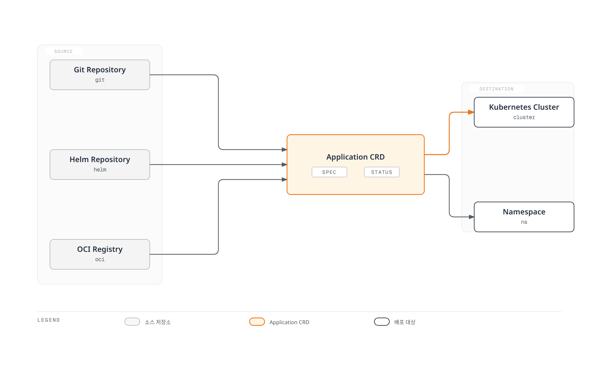
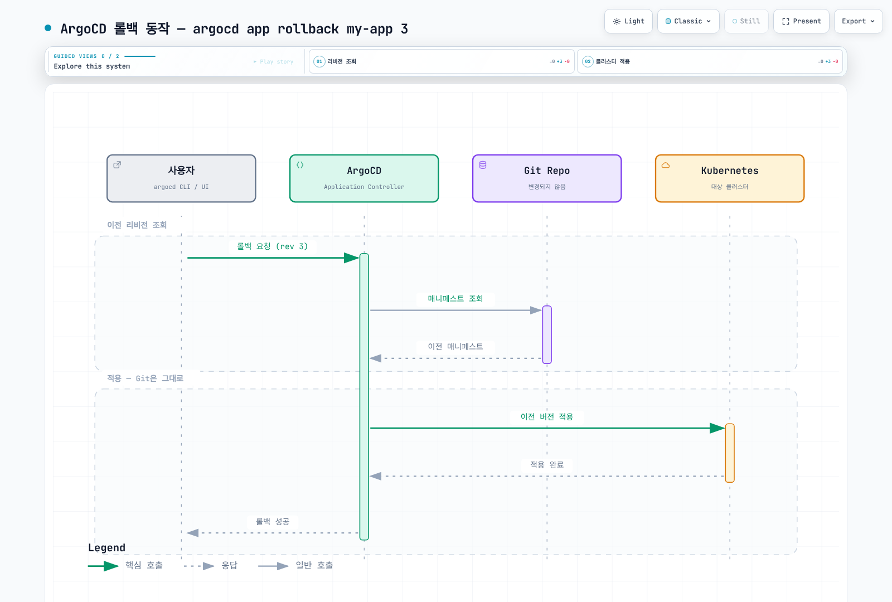
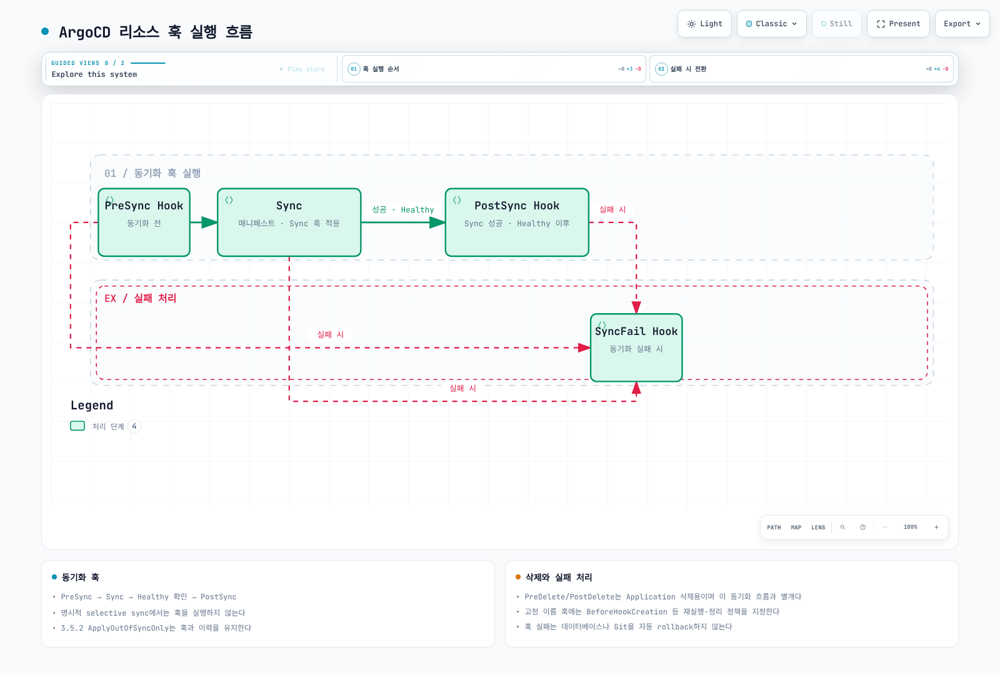
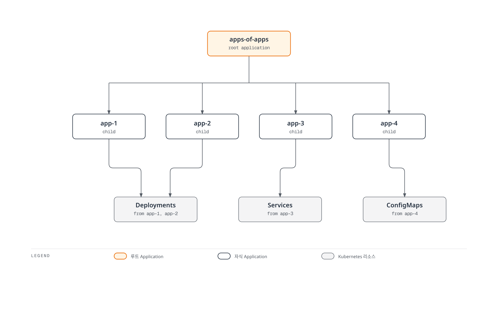

# ArgoCD Application 심층 분석

> **지원 버전**: Argo CD 3.5.2
> **마지막 업데이트**: 2026년 9월 11일

## 목차

- [Application CRD 개요](#application-crd-개요)
- [전체 스펙 해설](#전체-스펙-해설)
- [소스 유형](#소스-유형)
- [다중 소스](#다중-소스)
- [대상 구성](#대상-구성)
- [리비전 히스토리와 롤백](#리비전-히스토리와-롤백)
- [헬스 체크](#헬스-체크)
- [리소스 훅](#리소스-훅)
- [차이 무시 구성](#차이-무시-구성)
- [App of Apps 패턴](#app-of-apps-패턴)

## Application CRD 개요

예제는 독립적인 설정입니다. myorg·계정·클러스터·경로는 실제 소스와 권한으로 대체합니다. source/sources와 렌더러, destination.server/name은 사용 방식에 맞게 선택하며 모든 선택지를 동시에 활성화하지 않습니다.

Application은 ArgoCD의 핵심 Custom Resource입니다. Git 저장소의 매니페스트를 특정 Kubernetes 클러스터와 네임스페이스에 배포하는 방법을 정의합니다.



[🔍 인터랙티브 다이어그램 보기](https://www.atomai.click/kubernetes-docs/archmaps/ko-gitops-argocd-02-applications-0.html)

### 기본 구조

status.sync·status.health·history 등은 컨트롤러가 기록하는 관측값이므로 원하는 상태의 입력으로 작성하지 않습니다. 다른 namespace의 Application은 controller/server의 application.namespaces와 AppProject.sourceNamespaces 등 관리자 설정을 모두 만족해야 합니다.

```yaml
apiVersion: argoproj.io/v1alpha1
kind: Application
metadata:
  name: my-application
  namespace: argocd  # 기본 설치 namespace; 다른 namespace는 관리자 설정 필요
  labels:
    app.kubernetes.io/name: my-application
    environment: production
  annotations:
    notifications.argoproj.io/subscribe.on-sync-succeeded.slack: my-channel
  finalizers:
    - resources-finalizer.argocd.argoproj.io  # 삭제 시 리소스도 함께 삭제
spec:
  project: default  # AppProject 참조
  source:
    repoURL: https://github.com/argoproj/argocd-example-apps.git
    targetRevision: HEAD
    path: guestbook
  destination:
    server: https://kubernetes.default.svc
    namespace: guestbook
  syncPolicy:
    syncOptions: [CreateNamespace=true]
  ignoreDifferences: []  # 무시할 차이점
  info: []          # 추가 정보
```

## 전체 스펙 해설

### project

Application이 속한 AppProject를 지정합니다:

```yaml
spec:
  project: default  # 기본 프로젝트
  # 또는
  # project: production  # 위 값 대신 선택할 커스텀 프로젝트
```

### source

매니페스트 소스를 정의합니다:

```yaml
spec:
  source:
    # Git 저장소 URL (필수)
    repoURL: https://github.com/myorg/myapp.git

    # 리비전 (브랜치, 태그, 커밋 해시)
    targetRevision: HEAD  # 또는 main, v1.0.0, abc1234

    # 매니페스트 경로 (Git 저장소 내)
    path: manifests/production

    # 또는 Helm 차트 이름 (Helm 저장소 사용 시)
    # chart: my-chart  # Git path 대신 Helm repository를 사용할 때

    # 디렉토리 옵션
    directory:
      recurse: true  # 하위 디렉토리 포함
      jsonnet: {}    # Jsonnet 옵션
      exclude: '*.md'  # 제외 패턴
      include: '*.yaml'  # 포함 패턴

    # Helm 옵션
    # helm: {}  # directory와 함께 활성화하지 않음

    # Kustomize 옵션
    # kustomize: {}

    # 플러그인
    # plugin: {}
```

### destination

배포 대상을 정의합니다:

```yaml
spec:
  destination:
    # 클러스터 지정 (둘 중 하나 필수)
    server: https://kubernetes.default.svc  # 클러스터 URL
    # 또는
    # name: in-cluster  # server 대신 선택하는 등록된 클러스터 이름

    # 네임스페이스 (선택)
    namespace: production
```

### syncPolicy

동기화 정책을 정의합니다:

```yaml
spec:
  syncPolicy:
    # 자동 동기화
    automated:
      prune: true       # Git에 없는 리소스 삭제
      selfHeal: true    # 드리프트 자동 수정
      allowEmpty: false # 빈 소스 허용 여부

    # 동기화 옵션
    syncOptions:
      - CreateNamespace=true      # 네임스페이스 자동 생성
      - PrunePropagationPolicy=foreground  # 삭제 정책
      - PruneLast=true           # 마지막에 프루닝
      - Validate=true            # 매니페스트 검증
      - ApplyOutOfSyncOnly=true  # 변경된 리소스만 적용
      - ServerSideApply=true     # 서버 사이드 어플라이
      - RespectIgnoreDifferences=true  # ignoreDifferences 존중

    # 재시도 정책
    retry:
      limit: 5  # 최대 재시도 횟수
      backoff:
        duration: 5s      # 초기 대기 시간
        factor: 2         # 증가 배수
        maxDuration: 3m   # 최대 대기 시간

    # 관리 네임스페이스 메타데이터
    managedNamespaceMetadata:
      labels:
        env: production
      annotations:
        team: platform
```

### ignoreDifferences

특정 필드의 차이를 무시합니다:

```yaml
spec:
  ignoreDifferences:
    - group: apps
      kind: Deployment
      jsonPointers:
        - /spec/replicas  # HPA가 관리하는 필드

    - group: ""
      kind: Service
      jqPathExpressions:
        - .spec.clusterIP  # 자동 할당되는 필드

    - group: admissionregistration.k8s.io
      kind: MutatingWebhookConfiguration
      jsonPointers:
        - /webhooks/0/clientConfig/caBundle
```

### info

추가 정보를 저장합니다:

```yaml
spec:
  info:
    - name: owner
      value: platform-team
    - name: documentation
      value: https://wiki.example.com/my-app
    - name: slack
      value: '#my-app-alerts'
```

## 소스 유형

### 1. 일반 디렉토리 (Plain YAML/JSON)

가장 기본적인 형태로, 디렉토리 내의 모든 YAML/JSON 파일을 적용합니다:

```yaml
apiVersion: argoproj.io/v1alpha1
kind: Application
metadata:
  name: plain-manifests
  namespace: argocd
spec:
  project: default
  source:
    repoURL: https://github.com/myorg/k8s-manifests.git
    targetRevision: main
    path: apps/my-app
    directory:
      recurse: true  # 하위 디렉토리 포함
      exclude: '{*.md,*.txt}'  # Markdown, 텍스트 파일 제외
      include: '*.yaml'  # YAML 파일만 포함
  destination:
    server: https://kubernetes.default.svc
    namespace: my-app
```

### 2. Helm 차트

#### 저장소의 차트

버전이 고정된 작은 podinfo Chart로 소스 형식을 설명합니다. 최종 replicaCount는 parameters가 valuesObject보다 우선하여 3입니다. valuesObject는 구조화된 인라인 값이며 환경 변수에서 자동으로 값을 읽는 기능이 아닙니다.

```yaml
apiVersion: argoproj.io/v1alpha1
kind: Application
metadata:
  name: podinfo-helm
  namespace: argocd
spec:
  project: default
  source:
    repoURL: https://stefanprodan.github.io/podinfo
    chart: podinfo
    targetRevision: 6.15.0
    helm:
      valuesObject:
        replicaCount: 2
        service:
          type: ClusterIP
        ui:
          message: "Managed by Argo CD"
      parameters:
      - name: replicaCount
        value: "3"
      passCredentials: false
      skipCrds: false
  destination:
    server: https://kubernetes.default.svc
    namespace: podinfo-demo
  syncPolicy:
    syncOptions: [CreateNamespace=true]
```

우선순위는 parameters → valuesObject → values → valueFiles → Chart 기본값입니다. 인라인 값은 valuesObject 또는 values 중 하나로 관리하는 편이 명확하며, valuesObject가 있으면 그것을 인라인 값으로 사용합니다. passCredentials는 다른 도메인에도 인증을 전달할 수 있어 필요한 경우에만 켭니다. 이 기준 버전은 번들 Helm 4를 사용하므로 v2/v3를 임의로 지정하지 않습니다.

#### Git 저장소의 차트

```yaml
apiVersion: argoproj.io/v1alpha1
kind: Application
metadata:
  name: helm-git-app
  namespace: argocd
spec:
  project: default
  source:
    repoURL: https://github.com/myorg/helm-charts.git
    targetRevision: main
    path: charts/my-app
    helm:
      # Git 저장소 내 values 파일 참조
      valueFiles:
        - values.yaml
        - values-production.yaml

      # 파라미터 오버라이드
      parameters:
        - name: image.repository
          value: 123456789012.dkr.ecr.ap-northeast-2.amazonaws.com/my-app
        - name: image.tag
          value: v1.2.3

      # 파일 파라미터 (파일 내용을 값으로 사용)
      fileParameters:
        - name: config
          path: files/config.json
  destination:
    server: https://kubernetes.default.svc
    namespace: my-app
```

### 3. Kustomize

```yaml
apiVersion: argoproj.io/v1alpha1
kind: Application
metadata:
  name: kustomize-app
  namespace: argocd
spec:
  project: default
  source:
    repoURL: https://github.com/myorg/k8s-manifests.git
    targetRevision: main
    path: overlays/production
    kustomize:
      # 이미지 오버라이드
      images:
        - my-app=123456789012.dkr.ecr.ap-northeast-2.amazonaws.com/my-app:v1.2.3
        - sidecar=docker.io/library/busybox:1.37.0

      # 네임 프리픽스/서픽스
      namePrefix: prod-
      nameSuffix: -v1

      # 공통 레이블
      labelWithoutSelector: true
      labelIncludeTemplates: true
      commonLabels:
        app.kubernetes.io/environment: production
        app.kubernetes.io/version: v1.2.3

      # 공통 어노테이션
      commonAnnotations:
        team: platform

      # Kustomize 버전 (커스텀 버전 사용 시)
      # version: select only a version installed and configured in repo-server

      # 복제본 수 오버라이드
      replicas:
        - name: my-deployment
          count: 5

      # 패치 (인라인)
      patches:
        - target:
            kind: Deployment
            name: my-deployment
          patch: |-
            - op: add
              path: /spec/progressDeadlineSeconds
              value: 600
  destination:
    server: https://kubernetes.default.svc
    namespace: production
```

### 4. OCI 아티팩트

일반 OCI 소스는 oci:// URI와 펼친 아티팩트 내부 path를 사용합니다. 다음 계정/repository/tag는 실제로 게시한 아티팩트로 바꿉니다. 일반 컨테이너 이미지를 그대로 매니페스트 소스로 지정하는 예제가 아닙니다.

```yaml
apiVersion: argoproj.io/v1alpha1
kind: Application
metadata:
  name: oci-manifests
  namespace: argocd
spec:
  project: default
  source:
    repoURL: oci://123456789012.dkr.ecr.ap-northeast-2.amazonaws.com/my-manifests
    targetRevision: v1.0.0
    path: .
  destination:
    server: https://kubernetes.default.svc
    namespace: my-app
  syncPolicy:
    syncOptions: [CreateNamespace=true]
```

Argo CD 3.5.2는 하나의 layer와 지원 media type을 요구합니다. 기본 layer type은 application/vnd.oci.image.layer.v1.tar+gzip 또는 Helm chart content tar+gzip입니다. 다른 타입은 Repo Server의 ARGOCD_REPO_SERVER_OCI_LAYER_MEDIA_TYPES 설정과 아티팩트 구조를 함께 검증합니다.

기존 Helm OCI 방식은 chart 필드와 **oci://를 제외한** repository URL을 사용합니다. 아래는 Application.spec에 넣을 source 조각입니다.

```yaml
source:
  repoURL: ghcr.io/stefanprodan/charts
  chart: podinfo
  targetRevision: 6.15.0
  helm:
    valuesObject:
      replicaCount: 2
```

인증도 타입을 맞춥니다. 일반 OCI repository Secret은 type: oci와 oci:// URL을, Helm OCI Secret은 type: helm, enableOCI: "true", scheme 없는 URL을 사용합니다. ECR은 필요한 Registry 권한과 12시간 토큰의 재발급/적용 절차가 필요하며 IRSA 권한 부여만으로 Secret이 갱신되지는 않습니다.

### 5. Jsonnet

```yaml
apiVersion: argoproj.io/v1alpha1
kind: Application
metadata:
  name: jsonnet-app
  namespace: argocd
spec:
  project: default
  source:
    repoURL: https://github.com/myorg/jsonnet-manifests.git
    targetRevision: main
    path: environments/production
    directory:
      jsonnet:
        # 외부 변수
        extVars:
          - name: environment
            value: production
          - name: replicas
            value: "3"
            code: true

        # Top-level 인자
        tlas:
          - name: config
            value: '{"debug": false}'
            code: true

        # 추가 라이브러리 경로
        libs:
          - vendor
          - lib
  destination:
    server: https://kubernetes.default.svc
    namespace: production
```

## 다중 소스

sources를 지정하면 단수 source는 무시됩니다. 관련된 한 애플리케이션의 구성(예: Chart와 별도 values 저장소)을 합치는 기능이며, 서로 독립적인 플랫폼 스택의 묶음에는 ApplicationSet/App of Apps를 사용합니다.

```yaml
apiVersion: argoproj.io/v1alpha1
kind: Application
metadata:
  name: podinfo-with-values
  namespace: argocd
spec:
  project: default
  sources:
  - repoURL: https://stefanprodan.github.io/podinfo
    chart: podinfo
    targetRevision: 6.15.0
    helm:
      valueFiles:
      - $values/environments/production/podinfo-values.yaml
  - repoURL: https://github.com/myorg/helm-values.git
    targetRevision: main
    ref: values
  destination:
    server: https://kubernetes.default.svc
    namespace: podinfo-demo
  syncPolicy:
    syncOptions: [CreateNamespace=true]
```

ref: values가 $values를 해당 Git 저장소 루트로 연결합니다. path를 생략하면 값 파일만 사용하고, path를 추가하면 그 경로의 매니페스트도 생성합니다. ref source에는 chart를 함께 넣지 않습니다. 같은 group/kind/name/namespace 리소스가 중복되면 마지막 소스가 우선하고 RepeatedResourceWarning이 발생합니다. 이는 필드별 자동 병합이 아니므로 의도한 override인지 확인합니다.

## 대상 구성

server와 name 중 하나로 등록된 대상을 지정합니다. destination.namespace는 namespace가 없는 namespaced 리소스의 기본값이며, CreateNamespace는 이 대상 namespace만 생성합니다. Chart에 명시된 모든 namespace를 만들어 주지는 않습니다. managedNamespaceMetadata는 생성 옵션과 함께 사용하며 기존 namespace를 덮어쓰기 전에 소유권을 확인합니다.

### 클러스터 지정 방법

**서버 URL 사용:**

```yaml
destination:
  server: https://kubernetes.default.svc  # 동일 클러스터
  # 또는
  # server: https://eks-cluster.ap-northeast-2.eks.amazonaws.com  # 위 값 대신 실제 endpoint 사용
```

**클러스터 이름 사용:**

```yaml
destination:
  name: production-cluster  # argocd cluster add로 등록한 이름
```

### 네임스페이스 설정

```yaml
destination:
  server: https://kubernetes.default.svc
  namespace: my-namespace  # 대상 네임스페이스

# 네임스페이스 자동 생성
syncPolicy:
  syncOptions:
    - CreateNamespace=true
  managedNamespaceMetadata:
    labels:
      istio-injection: enabled
    annotations:
      owner: platform-team
```

## 리비전 히스토리와 롤백

CLI history rollback은 자동 sync가 활성화된 Application에서 사용할 수 없습니다. 실제 소유자인 Git/ApplicationSet 정책을 먼저 검토합니다. rollback은 Git을 수정하지 않으므로 이후 자동 조정이 원래 Git 상태로 되돌릴 수 있습니다. 지속할 변경은 Git의 승인된 revert/리비전 변경으로 남기고, DB·외부 상태 복구는 따로 준비합니다.

### 리비전 히스토리 제한

```yaml
spec:
  revisionHistoryLimit: 10  # 유지할 히스토리 수 (기본값: 10)
```

### CLI를 통한 롤백

ID는 현재 history 결과에서 선택합니다. 이전 manifest 적용과 불필요한 리소스 삭제(prune)는 별도 결정입니다.

```bash
# 히스토리 확인
argocd app history my-app

# 특정 리비전으로 롤백
argocd app rollback my-app 3

# 이전 버전으로 롤백
argocd app rollback my-app
```

### 롤백 동작



[🔍 인터랙티브 다이어그램 보기](https://www.atomai.click/kubernetes-docs/archmaps/ko-gitops-argocd-02-applications-1.html)

## 헬스 체크

Synced는 비교 대상 필드가 원하는 상태와 맞는다는 뜻이며 서비스가 실제로 요청을 처리한다는 증명은 아닙니다. Healthy도 구성된 리소스별 판정에 따릅니다. 헬스 체크가 없는 CR은 앱 집계에서 제외될 수 있어 별도 정의가 필요합니다.

### 내장 헬스 체크

아래는 3.5.2 구현의 주요 기준을 요약한 것으로, replica 수 하나만 비교하는 완전한 판정식이 아닙니다.

| 리소스 | 주요 판정 |
|---|---|
| Deployment | 관찰된 generation, rollout 진행/실패 조건, 갱신·가용 replica |
| StatefulSet | generation, update 전략·partition, revision과 replica 상태 |
| DaemonSet | generation, 갱신·가용 Pod 수와 원하는 수 |
| Pod | phase, readiness, 컨테이너 종료/실패 상태 |
| Service | LoadBalancer는 주소 할당을 기다림; 다른 유형은 endpoint 존재를 검증하지 않음 |
| Ingress | loadBalancer 주소 상태 등 Controller가 보고하는 값 |
| PVC | Bound 여부 |
| Job | 미완료는 Progressing, 실패는 Degraded, 완료는 Healthy, 중지는 Suspended |

### 커스텀 헬스 체크

기본 제공되는 Rollout·cert-manager Certificate 체크를 간단한 phase 비교로 덮어쓰지 않습니다. Certificate의 API 그룹은 cert-manager.io이며, 내장 체크는 Issuing 상태를 Ready보다 먼저 처리합니다. 아래 ACK 예제는 상태·조건이 없으면 Progressing이고 ARN 존재만으로 Healthy라고 하지 않습니다. 설치한 ACK 버전이 제공하는 Ready/ACK.ResourceSynced와 오류 조건을 확인합니다. 아래는 Ready가 있으면 우선하고, 없는 버전에서는 ACK.ResourceSynced를 사용합니다.

```yaml
apiVersion: v1
kind: ConfigMap
metadata:
  name: argocd-cm
  namespace: argocd
  labels:
    app.kubernetes.io/part-of: argocd
data:
  resource.customizations.health.s3.services.k8s.aws_Bucket: |
    local hs = {status = "Progressing", message = "Waiting for ACK reconciliation"}
    local conditions = {}
    if obj.status ~= nil and obj.status.conditions ~= nil then
      conditions = obj.status.conditions
    end
    for _, condition in ipairs(conditions) do
      if condition.type == "ACK.Terminal" and condition.status == "True" then
        hs.status = "Degraded"
        hs.message = condition.message or "ACK reported a terminal error"
        return hs
      end
    end
    for _, condition in ipairs(conditions) do
      if condition.type == "ACK.Recoverable" and condition.status == "True" then
        hs.message = condition.message or "ACK is retrying a recoverable error"
        return hs
      end
    end
    local synchronized = nil
    local ready = nil
    for _, condition in ipairs(conditions) do
      if condition.type == "ACK.ResourceSynced" then synchronized = condition end
      if condition.type == "Ready" then ready = condition end
    end
    local reported = ready or synchronized
    if reported ~= nil then
      hs.message = reported.message or hs.message
      if reported.status == "True" then
        hs.status = "Healthy"
        hs.message = reported.message or "ACK reports the resource synchronized"
      end
    end
    return hs
```

이 예제는 controller가 보고한 상태를 해석하며 AWS 리소스를 직접 조회하지 않습니다. 기존 argocd-cm에 키를 병합하고 nil/대기/준비/오류/새 spec 변경을 실제 CR로 시험합니다. EKS 관리형 Argo CD는 ACK/kro 기본 체크를 제공하므로 지원 설정 범위와 기존 체크를 먼저 확인합니다.

## 리소스 훅

PostSync는 Sync 성공과 관련 리소스의 Healthy 상태를 기다립니다. 명시적으로 일부 리소스만 고르는 selective sync에서는 훅이 실행되지 않습니다. 반면 3.5.2의 ApplyOutOfSyncOnly 옵션은 훅을 실행하고 이력도 남깁니다. SyncFail은 실행 가능한 동기화 실패 경로의 정리 수단이며, manifest 해석 오류를 포함한 모든 오류에서 반드시 실행되는 백업 수단으로 취급하지 않습니다.

리소스 훅은 동기화 과정의 특정 시점에 실행되는 작업입니다:



[🔍 인터랙티브 다이어그램 보기](https://www.atomai.click/kubernetes-docs/archmaps/ko-gitops-argocd-02-applications-2.html)

### 훅 유형

| 훅 | 실행 시점 | 용도 |
|----|-----------|------|
| **PreSync** | 동기화 전 | DB 마이그레이션, 백업 |
| **Sync** | 동기화 중 | 특정 순서 리소스 |
| **PostSync** | Sync 성공 및 Healthy 확인 후 | 테스트, 알림 |
| **SyncFail** | 동기화 실패 시 | 정리, 알림 |
| **Skip** | 적용 생략 | 해당 manifest를 적용하지 않음 |
| **PreDelete** | Application 전체 삭제 전 | 삭제 전 처리 |
| **PostDelete** | Application 리소스 삭제 후 | 정리·알림 |

### 훅 어노테이션

```yaml
apiVersion: batch/v1
kind: Job
metadata:
  name: db-migration
  annotations:
    # 훅 유형
    argocd.argoproj.io/hook: PreSync

    # 훅 삭제 정책
    argocd.argoproj.io/hook-delete-policy: BeforeHookCreation,HookSucceeded
    # 옵션: HookSucceeded, HookFailed, BeforeHookCreation
spec:
  template:
    spec:
      containers:
        - name: migrate
          image: my-app:v1.2.3
          command: ["./migrate.sh"]
      restartPolicy: Never
  backoffLimit: 3
```

### PreSync 훅 예시: 데이터베이스 마이그레이션

```yaml
apiVersion: batch/v1
kind: Job
metadata:
  name: db-migration
  annotations:
    argocd.argoproj.io/hook: PreSync
    argocd.argoproj.io/hook-delete-policy: BeforeHookCreation
    argocd.argoproj.io/sync-wave: "-5"  # 다른 PreSync보다 먼저 실행
spec:
  template:
    metadata:
      labels:
        app: db-migration
    spec:
      serviceAccountName: migration-sa
      containers:
        - name: migrate
          image: 123456789012.dkr.ecr.ap-northeast-2.amazonaws.com/my-app:v1.2.3
          command:
            - /bin/sh
            - -c
            - |
              set -eu
              echo "Running database migrations..."
              ./manage.py migrate --no-input
              echo "Migrations completed successfully"
          env:
            - name: DATABASE_URL
              valueFrom:
                secretKeyRef:
                  name: db-credentials
                  key: url
          resources:
            requests:
              cpu: 100m
              memory: 256Mi
            limits:
              cpu: 500m
              memory: 512Mi
      restartPolicy: Never
  backoffLimit: 3
  ttlSecondsAfterFinished: 3600  # 1시간 후 자동 삭제
```

### PostSync 훅 예시: 스모크 테스트

```yaml
apiVersion: batch/v1
kind: Job
metadata:
  name: smoke-test
  annotations:
    argocd.argoproj.io/hook: PostSync
    argocd.argoproj.io/hook-delete-policy: BeforeHookCreation,HookSucceeded
spec:
  template:
    spec:
      containers:
        - name: test
          image: curlimages/curl:8.22.0
          command:
            - /bin/sh
            - -c
            - |
              echo "Running smoke tests..."
              for i in 1 2 3 4 5; do
                if curl --fail --show-error --silent --connect-timeout 3 --max-time 10 http://my-app-service:8080/health; then
                  echo "Health check passed"
                  exit 0
                fi
                echo "Attempt $i failed, retrying..."
                sleep 5
              done
              echo "Smoke test failed"
              exit 1
      restartPolicy: Never
  backoffLimit: 1
```

### SyncFail 훅 예시: Slack 알림

```yaml
apiVersion: batch/v1
kind: Job
metadata:
  name: sync-fail-notification
  annotations:
    argocd.argoproj.io/hook: SyncFail
    argocd.argoproj.io/hook-delete-policy: BeforeHookCreation,HookSucceeded
spec:
  template:
    spec:
      containers:
        - name: notify
          image: curlimages/curl:8.22.0
          command:
            - /bin/sh
            - -c
            - |
              curl --fail --show-error --silent --connect-timeout 5 --max-time 20 -X POST "$SLACK_WEBHOOK_URL" \
                -H 'Content-Type: application/json' \
                -d '{
                  "text": "🚨 ArgoCD Sync Failed",
                  "attachments": [{
                    "color": "danger",
                    "fields": [{
                      "title": "Application",
                      "value": "my-app",
                      "short": true
                    }]
                  }]
                }'
          env:
            - name: SLACK_WEBHOOK_URL
              valueFrom:
                secretKeyRef:
                  name: slack-webhook
                  key: url
      restartPolicy: Never
```

고정 이름의 Job은 재실행 시 BeforeHookCreation 등 수명주기 정책이 필요합니다. 실패 로그를 외부에 보존한 뒤 정리하며, 이전 HookSucceeded Job이 언제 지워지는지는 Argo sync phase/result에 따릅니다. DB migration은 사용하는 이미지·DB Secret·ServiceAccount를 준비하고 멱등성·잠금·롤백 호환성을 별도로 검증합니다. 훅 실패가 DB나 기존 Deployment를 자동으로 이전 상태로 되돌리지는 않습니다. PreDelete/PostDelete는 Application 삭제용이며 일반 sync의 prune과 구분합니다.

## 차이 무시 구성

알고 있는 별도 controller가 관리하는 특정 필드만 좁게 제외합니다. 예를 들어 아래는 production의 my-deployment에서 HPA가 관리하는 replicas만 제외하는 Application.spec 조각입니다.

```yaml
spec:
  ignoreDifferences:
  - group: apps
    kind: Deployment
    name: my-deployment
    namespace: production
    jsonPointers:
    - /spec/replicas
  syncPolicy:
    syncOptions:
    - RespectIgnoreDifferences=true
```

ignoreDifferences는 기본적으로 비교에만 적용됩니다. 동기화에서도 유지하려면 RespectIgnoreDifferences=true가 필요하지만, 아직 live 리소스가 없는 첫 생성에서는 desired manifest가 그대로 적용됩니다. 이미지·시크릿·전체 resources·모든 manager를 일괄 무시하면 중요한 드리프트를 숨길 수 있습니다.

JQ로 webhook 배열을 지정할 때는 고정 인덱스 0/1 대신 이름으로 선택하고 리소스 이름도 제한합니다. 이 예제는 실제 CA 주입 controller와 webhook 이름을 알고 있을 때만 사용합니다.

```yaml
spec:
  ignoreDifferences:
  - group: admissionregistration.k8s.io
    kind: MutatingWebhookConfiguration
    name: my-webhook
    jqPathExpressions:
    - '.webhooks[]? | select(.name == "admission.example.com") | .clientConfig.caBundle'
```

전역 resource.customizations.ignoreDifferences 설정은 모든 Application에 영향을 줍니다. 가능하면 Application 단위 규칙을 사용하고, managedFieldsManagers 규칙은 실제 managedFields에서 그 주체가 어떤 필드를 소유하는지 확인한 뒤 선택합니다.

## App of Apps 패턴

App of Apps는 관리자 수준의 bootstrap 패턴입니다. 부모 소스의 작성자는 관리 namespace의 Application·AppProject를 통해 강한 권한에 영향을 줄 수 있어 저장소 쓰기·리뷰·대상을 제한합니다. 부모/자식 finalizer와 prune은 연쇄 삭제를 만들 수 있습니다. child Application의 생성 순서만으로 child workload의 readiness가 보장되지는 않으므로 Application 헬스 전달·자동 sync 정책·wave 동작을 함께 검증합니다.

App of Apps 패턴은 여러 Application을 관리하는 상위 Application을 생성하는 패턴입니다:



[🔍 인터랙티브 다이어그램 보기](https://www.atomai.click/kubernetes-docs/archmaps/ko-gitops-argocd-02-applications-3.html)

### 구현 예시

**저장소 구조:**

```
gitops-repo/
├── apps/
│   ├── root-app.yaml           # Root Application
│   └── children/
│       ├── app-1.yaml          # Child Application 1
│       ├── app-2.yaml          # Child Application 2
│       └── app-3.yaml          # Child Application 3
└── manifests/
    ├── app-1/
    │   ├── deployment.yaml
    │   └── service.yaml
    ├── app-2/
    │   └── ...
    └── app-3/
        └── ...
```

**Root Application:**

```yaml
# apps/root-app.yaml
apiVersion: argoproj.io/v1alpha1
kind: Application
metadata:
  name: root-app
  namespace: argocd
  finalizers:
    - resources-finalizer.argocd.argoproj.io
spec:
  project: default
  source:
    repoURL: https://github.com/myorg/gitops-repo.git
    targetRevision: main
    path: apps/children
  destination:
    server: https://kubernetes.default.svc
    namespace: argocd  # Application 리소스는 argocd 네임스페이스에 생성
  syncPolicy:
    automated:
      prune: true
      selfHeal: true
```

**Child Application:**

```yaml
# apps/children/app-1.yaml
apiVersion: argoproj.io/v1alpha1
kind: Application
metadata:
  name: app-1
  namespace: argocd
  finalizers:
    - resources-finalizer.argocd.argoproj.io
spec:
  project: default
  source:
    repoURL: https://github.com/myorg/gitops-repo.git
    targetRevision: main
    path: manifests/app-1
  destination:
    server: https://kubernetes.default.svc
    namespace: app-1
  syncPolicy:
    automated:
      prune: true
      selfHeal: true
    syncOptions:
      - CreateNamespace=true
```

### Helm을 사용한 App of Apps

charts/root-app에는 유효한 Chart.yaml이 필요합니다. 아래 values가 템플릿의 repoURL·targetRevision·applications를 모두 제공합니다.

```yaml
# apps/root-app.yaml
apiVersion: argoproj.io/v1alpha1
kind: Application
metadata:
  name: root-app
  namespace: argocd
spec:
  project: default
  source:
    repoURL: https://github.com/myorg/gitops-repo.git
    targetRevision: main
    path: charts/root-app
    helm:
      values: |
        repoURL: https://github.com/myorg/gitops-repo.git
        targetRevision: main
        applications:
          - name: frontend
            namespace: frontend
            path: manifests/frontend
          - name: backend
            namespace: backend
            path: manifests/backend
          - name: database
            namespace: database
            path: manifests/database
  destination:
    server: https://kubernetes.default.svc
    namespace: argocd
```

**Helm 템플릿:**

```yaml
# charts/root-app/templates/application.yaml
{{- range .Values.applications }}
---
apiVersion: argoproj.io/v1alpha1
kind: Application
metadata:
  name: {{ .name }}
  namespace: argocd
  finalizers:
    - resources-finalizer.argocd.argoproj.io
spec:
  project: default
  source:
    repoURL: {{ required "repoURL is required" $.Values.repoURL | quote }}
    targetRevision: {{ required "targetRevision is required" $.Values.targetRevision | quote }}
    path: {{ .path }}
  destination:
    server: https://kubernetes.default.svc
    namespace: {{ .namespace }}
  syncPolicy:
    automated:
      prune: true
      selfHeal: true
    syncOptions:
      - CreateNamespace=true
{{- end }}
```

## 다음 단계

1. **[동기화 전략](03-sync-strategies.md)**: 자동 동기화, 동기화 웨이브, 동기화 윈도우를 구성하세요.

2. **[ApplicationSets](04-applicationsets.md)**: 대규모 배포를 위한 ApplicationSet 생성기를 학습하세요.

3. **[트래픽 관리](05-traffic-management.md)**: Argo Rollouts를 통한 블루/그린, 카나리 배포를 구현하세요.

## 참고 자료

- [ArgoCD Application Specification](https://argo-cd.readthedocs.io/en/stable/user-guide/application-specification/)
- [ArgoCD 소스 유형](https://argo-cd.readthedocs.io/en/stable/user-guide/application_sources/)
- [리소스 훅](https://argo-cd.readthedocs.io/en/stable/user-guide/resource_hooks/)
- [App of Apps 패턴](https://argo-cd.readthedocs.io/en/stable/operator-manual/cluster-bootstrapping/)

## 퀴즈

이 장에서 배운 내용을 테스트하려면 [Application 퀴즈](../../quizzes/gitops/argocd/02-applications-quiz.md)를 풀어보세요.

### 버전별 검토 근거

- [3.5.2 sources and Helm](https://github.com/argoproj/argo-cd/blob/v3.5.2/docs/user-guide/helm.md)
- [Multiple sources](https://github.com/argoproj/argo-cd/blob/v3.5.2/docs/user-guide/multiple_sources.md)
- [OCI source rules](https://github.com/argoproj/argo-cd/blob/v3.5.2/docs/user-guide/oci.md)
- [Sync options](https://github.com/argoproj/argo-cd/blob/v3.5.2/docs/user-guide/sync-options.md)
- [Phases, waves and hooks](https://github.com/argoproj/argo-cd/blob/v3.5.2/docs/user-guide/sync-waves.md)
- [Service health implementation](https://github.com/argoproj/argo-cd/blob/v3.5.2/gitops-engine/pkg/health/health_service.go)
- [ACK condition definitions](https://github.com/aws-controllers-k8s/runtime/blob/main/apis/core/v1alpha1/conditions.go)
