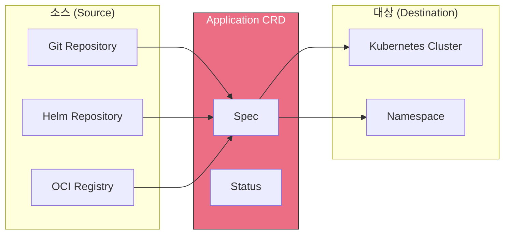
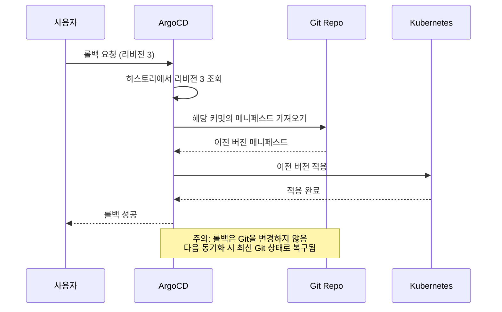
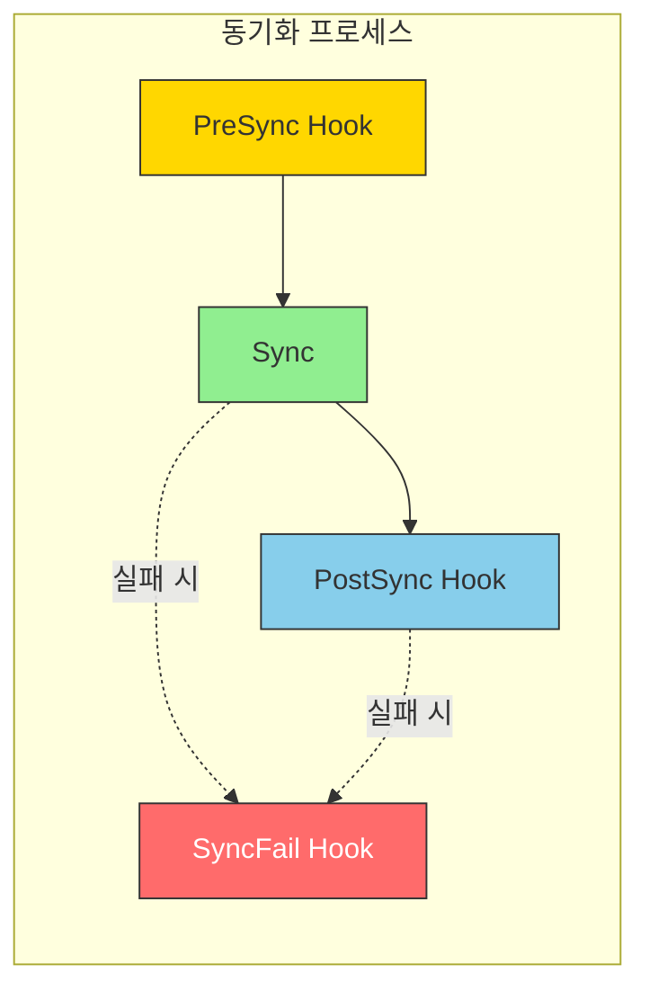
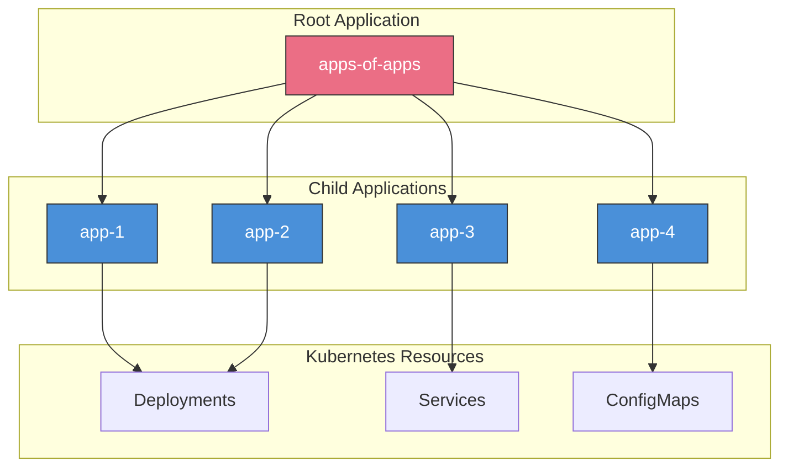

# ArgoCD Application 심층 분석

> **지원 버전**: ArgoCD v2.9+
> **마지막 업데이트**: 2025년 2월 21일

## 목차

- [Application CRD 개요](#application-crd-개요)
- [전체 스펙 해설](#전체-스펙-해설)
- [소스 유형](#소스-유형)
- [다중 소스](#다중-소스)
- [대상 구성](#대상-구성)
- [리비전 히스토리와 롤백](#리비전-히스토리와-롤백)
- [헬스 체크](#헬스-체크)
- [리소스 훅](#리소스-훅)
- [차이 무시 구성](#차이-무시-구성)
- [App of Apps 패턴](#app-of-apps-패턴)

## Application CRD 개요

Application은 ArgoCD의 핵심 Custom Resource입니다. Git 저장소의 매니페스트를 특정 Kubernetes 클러스터와 네임스페이스에 배포하는 방법을 정의합니다.



### 기본 구조

```yaml
apiVersion: argoproj.io/v1alpha1
kind: Application
metadata:
  name: my-application
  namespace: argocd  # Application은 항상 argocd 네임스페이스에 생성
  labels:
    app.kubernetes.io/name: my-application
    environment: production
  annotations:
    notifications.argoproj.io/subscribe.on-sync-succeeded.slack: my-channel
  finalizers:
    - resources-finalizer.argocd.argoproj.io  # 삭제 시 리소스도 함께 삭제
spec:
  project: default  # AppProject 참조
  source: {}        # 소스 정의
  destination: {}   # 대상 정의
  syncPolicy: {}    # 동기화 정책
  ignoreDifferences: []  # 무시할 차이점
  info: []          # 추가 정보
status:
  sync: {}          # 동기화 상태
  health: {}        # 헬스 상태
  history: []       # 배포 이력
  resources: []     # 관리되는 리소스 목록
```

## 전체 스펙 해설

### project

Application이 속한 AppProject를 지정합니다:

```yaml
spec:
  project: default  # 기본 프로젝트
  # 또는
  project: production  # 커스텀 프로젝트
```

### source

매니페스트 소스를 정의합니다:

```yaml
spec:
  source:
    # Git 저장소 URL (필수)
    repoURL: https://github.com/myorg/myapp.git

    # 리비전 (브랜치, 태그, 커밋 해시)
    targetRevision: HEAD  # 또는 main, v1.0.0, abc1234

    # 매니페스트 경로 (Git 저장소 내)
    path: manifests/production

    # 또는 Helm 차트 이름 (Helm 저장소 사용 시)
    chart: my-chart

    # 디렉토리 옵션
    directory:
      recurse: true  # 하위 디렉토리 포함
      jsonnet: {}    # Jsonnet 옵션
      exclude: '*.md'  # 제외 패턴
      include: '*.yaml'  # 포함 패턴

    # Helm 옵션
    helm: {}

    # Kustomize 옵션
    kustomize: {}

    # 플러그인
    plugin: {}
```

### destination

배포 대상을 정의합니다:

```yaml
spec:
  destination:
    # 클러스터 지정 (둘 중 하나 필수)
    server: https://kubernetes.default.svc  # 클러스터 URL
    # 또는
    name: in-cluster  # 클러스터 이름 (argocd cluster add로 등록)

    # 네임스페이스 (선택)
    namespace: production
```

### syncPolicy

동기화 정책을 정의합니다:

```yaml
spec:
  syncPolicy:
    # 자동 동기화
    automated:
      prune: true       # Git에 없는 리소스 삭제
      selfHeal: true    # 드리프트 자동 수정
      allowEmpty: false # 빈 소스 허용 여부

    # 동기화 옵션
    syncOptions:
      - CreateNamespace=true      # 네임스페이스 자동 생성
      - PrunePropagationPolicy=foreground  # 삭제 정책
      - PruneLast=true           # 마지막에 프루닝
      - Validate=true            # 매니페스트 검증
      - ApplyOutOfSyncOnly=true  # 변경된 리소스만 적용
      - ServerSideApply=true     # 서버 사이드 어플라이
      - RespectIgnoreDifferences=true  # ignoreDifferences 존중

    # 재시도 정책
    retry:
      limit: 5  # 최대 재시도 횟수
      backoff:
        duration: 5s      # 초기 대기 시간
        factor: 2         # 증가 배수
        maxDuration: 3m   # 최대 대기 시간

    # 관리 네임스페이스 메타데이터
    managedNamespaceMetadata:
      labels:
        env: production
      annotations:
        team: platform
```

### ignoreDifferences

특정 필드의 차이를 무시합니다:

```yaml
spec:
  ignoreDifferences:
    - group: apps
      kind: Deployment
      jsonPointers:
        - /spec/replicas  # HPA가 관리하는 필드

    - group: ""
      kind: Service
      jqPathExpressions:
        - .spec.clusterIP  # 자동 할당되는 필드

    - group: admissionregistration.k8s.io
      kind: MutatingWebhookConfiguration
      jsonPointers:
        - /webhooks/0/clientConfig/caBundle
```

### info

추가 정보를 저장합니다:

```yaml
spec:
  info:
    - name: owner
      value: platform-team
    - name: documentation
      value: https://wiki.example.com/my-app
    - name: slack
      value: '#my-app-alerts'
```

## 소스 유형

### 1. 일반 디렉토리 (Plain YAML/JSON)

가장 기본적인 형태로, 디렉토리 내의 모든 YAML/JSON 파일을 적용합니다:

```yaml
apiVersion: argoproj.io/v1alpha1
kind: Application
metadata:
  name: plain-manifests
  namespace: argocd
spec:
  project: default
  source:
    repoURL: https://github.com/myorg/k8s-manifests.git
    targetRevision: main
    path: apps/my-app
    directory:
      recurse: true  # 하위 디렉토리 포함
      exclude: '{*.md,*.txt}'  # Markdown, 텍스트 파일 제외
      include: '*.yaml'  # YAML 파일만 포함
  destination:
    server: https://kubernetes.default.svc
    namespace: my-app
```

### 2. Helm 차트

#### 저장소의 차트

```yaml
apiVersion: argoproj.io/v1alpha1
kind: Application
metadata:
  name: helm-chart-app
  namespace: argocd
spec:
  project: default
  source:
    repoURL: https://charts.bitnami.com/bitnami
    chart: nginx
    targetRevision: 15.0.0
    helm:
      # values 파일 내용 (인라인)
      values: |
        replicaCount: 3
        service:
          type: LoadBalancer
        resources:
          requests:
            cpu: 100m
            memory: 128Mi
          limits:
            cpu: 500m
            memory: 512Mi

      # 개별 파라미터 오버라이드
      parameters:
        - name: image.tag
          value: "1.25.0"
        - name: service.port
          value: "8080"

      # 환경 변수로부터 값 설정
      valuesObject:
        ingress:
          enabled: true
          hostname: nginx.example.com

      # Helm 옵션
      releaseName: my-nginx  # 릴리스 이름 (기본값: Application 이름)
      passCredentials: false  # 차트 의존성에 자격 증명 전달
      skipCrds: false         # CRD 설치 스킵
      version: v3             # Helm 버전 (v2 또는 v3)
  destination:
    server: https://kubernetes.default.svc
    namespace: nginx
```

#### Git 저장소의 차트

```yaml
apiVersion: argoproj.io/v1alpha1
kind: Application
metadata:
  name: helm-git-app
  namespace: argocd
spec:
  project: default
  source:
    repoURL: https://github.com/myorg/helm-charts.git
    targetRevision: main
    path: charts/my-app
    helm:
      # Git 저장소 내 values 파일 참조
      valueFiles:
        - values.yaml
        - values-production.yaml

      # 파라미터 오버라이드
      parameters:
        - name: image.repository
          value: 123456789012.dkr.ecr.ap-northeast-2.amazonaws.com/my-app
        - name: image.tag
          value: v1.2.3

      # 파일 파라미터 (파일 내용을 값으로 사용)
      fileParameters:
        - name: config
          path: files/config.json
  destination:
    server: https://kubernetes.default.svc
    namespace: my-app
```

### 3. Kustomize

```yaml
apiVersion: argoproj.io/v1alpha1
kind: Application
metadata:
  name: kustomize-app
  namespace: argocd
spec:
  project: default
  source:
    repoURL: https://github.com/myorg/k8s-manifests.git
    targetRevision: main
    path: overlays/production
    kustomize:
      # 이미지 오버라이드
      images:
        - my-app=123456789012.dkr.ecr.ap-northeast-2.amazonaws.com/my-app:v1.2.3
        - sidecar=docker.io/library/busybox:1.36

      # 네임 프리픽스/서픽스
      namePrefix: prod-
      nameSuffix: -v1

      # 공통 레이블
      commonLabels:
        app.kubernetes.io/environment: production
        app.kubernetes.io/version: v1.2.3

      # 공통 어노테이션
      commonAnnotations:
        team: platform

      # Kustomize 버전 (커스텀 버전 사용 시)
      version: v5.0.0

      # 복제본 수 오버라이드
      replicas:
        - name: my-deployment
          count: 5

      # 패치 (인라인)
      patches:
        - target:
            kind: Deployment
            name: my-deployment
          patch: |-
            - op: replace
              path: /spec/replicas
              value: 10
  destination:
    server: https://kubernetes.default.svc
    namespace: production
```

### 4. OCI 아티팩트

OCI 레지스트리에 저장된 Helm 차트나 매니페스트를 사용합니다:

```yaml
apiVersion: argoproj.io/v1alpha1
kind: Application
metadata:
  name: oci-helm-app
  namespace: argocd
spec:
  project: default
  source:
    # OCI 레지스트리 URL
    repoURL: oci://123456789012.dkr.ecr.ap-northeast-2.amazonaws.com
    chart: my-helm-chart
    targetRevision: 1.0.0
    helm:
      values: |
        replicaCount: 2
  destination:
    server: https://kubernetes.default.svc
    namespace: my-app
```

**ECR OCI 저장소 등록:**

```yaml
apiVersion: v1
kind: Secret
metadata:
  name: ecr-oci-creds
  namespace: argocd
  labels:
    argocd.argoproj.io/secret-type: repository
type: Opaque
stringData:
  type: helm
  url: oci://123456789012.dkr.ecr.ap-northeast-2.amazonaws.com
  enableOCI: "true"
  username: AWS
  password: <ecr-login-token>  # aws ecr get-login-password
```

### 5. Jsonnet

```yaml
apiVersion: argoproj.io/v1alpha1
kind: Application
metadata:
  name: jsonnet-app
  namespace: argocd
spec:
  project: default
  source:
    repoURL: https://github.com/myorg/jsonnet-manifests.git
    targetRevision: main
    path: environments/production
    directory:
      jsonnet:
        # 외부 변수
        extVars:
          - name: environment
            value: production
          - name: replicas
            value: "3"

        # Top-level 인자
        tlas:
          - name: config
            value: '{"debug": false}'

        # 추가 라이브러리 경로
        libs:
          - vendor
          - lib
  destination:
    server: https://kubernetes.default.svc
    namespace: production
```

## 다중 소스

ArgoCD v2.6+에서는 여러 소스를 결합할 수 있습니다:

```yaml
apiVersion: argoproj.io/v1alpha1
kind: Application
metadata:
  name: multi-source-app
  namespace: argocd
spec:
  project: default
  sources:
    # Helm 차트 (첫 번째 소스)
    - repoURL: https://charts.bitnami.com/bitnami
      chart: postgresql
      targetRevision: 12.0.0
      helm:
        releaseName: my-postgres
        valueFiles:
          - $values/postgresql/values-production.yaml

    # Values 파일 저장소 (두 번째 소스, 참조용)
    - repoURL: https://github.com/myorg/helm-values.git
      targetRevision: main
      ref: values  # 참조 이름 ($values)

    # 추가 매니페스트 (세 번째 소스)
    - repoURL: https://github.com/myorg/k8s-manifests.git
      targetRevision: main
      path: extras/monitoring
  destination:
    server: https://kubernetes.default.svc
    namespace: database
```

### 다중 소스 활용 사례

**1. Helm 차트 + 커스텀 리소스:**

```yaml
sources:
  # 기본 Helm 차트
  - repoURL: https://charts.example.com
    chart: my-app
    targetRevision: 2.0.0
    helm:
      values: |
        service:
          type: ClusterIP

  # 추가 커스텀 리소스 (ServiceMonitor, PodMonitor 등)
  - repoURL: https://github.com/myorg/custom-resources.git
    path: monitoring/my-app
    targetRevision: main
```

**2. 여러 Helm 차트 결합:**

```yaml
sources:
  - repoURL: https://charts.bitnami.com/bitnami
    chart: redis
    targetRevision: 17.0.0
    helm:
      releaseName: cache
      values: |
        architecture: standalone

  - repoURL: https://charts.bitnami.com/bitnami
    chart: postgresql
    targetRevision: 12.0.0
    helm:
      releaseName: database
      values: |
        architecture: standalone
```

## 대상 구성

### 클러스터 지정 방법

**서버 URL 사용:**

```yaml
destination:
  server: https://kubernetes.default.svc  # 동일 클러스터
  # 또는
  server: https://eks-cluster.ap-northeast-2.eks.amazonaws.com  # 외부 클러스터
```

**클러스터 이름 사용:**

```yaml
destination:
  name: production-cluster  # argocd cluster add로 등록한 이름
```

### 네임스페이스 설정

```yaml
destination:
  server: https://kubernetes.default.svc
  namespace: my-namespace  # 대상 네임스페이스

# 네임스페이스 자동 생성
syncPolicy:
  syncOptions:
    - CreateNamespace=true
  managedNamespaceMetadata:
    labels:
      istio-injection: enabled
    annotations:
      scheduler.alpha.kubernetes.io/defaultTolerations: '[{"key":"reserved","operator":"Equal","value":"platform","effect":"NoSchedule"}]'
```

## 리비전 히스토리와 롤백

### 리비전 히스토리 제한

```yaml
spec:
  revisionHistoryLimit: 10  # 유지할 히스토리 수 (기본값: 10)
```

### CLI를 통한 롤백

```bash
# 히스토리 확인
argocd app history my-app

# 특정 리비전으로 롤백
argocd app rollback my-app 3

# 이전 버전으로 롤백
argocd app rollback my-app
```

### 롤백 동작



## 헬스 체크

### 내장 헬스 체크

ArgoCD는 Kubernetes 리소스에 대한 내장 헬스 체크를 제공합니다:

| 리소스 | 헬스 기준 |
|--------|-----------|
| Deployment | availableReplicas >= replicas |
| StatefulSet | readyReplicas >= replicas |
| DaemonSet | numberReady >= desiredNumberScheduled |
| ReplicaSet | availableReplicas >= replicas |
| Pod | 모든 컨테이너 Ready |
| Service | 엔드포인트 존재 |
| Ingress | 로드밸런서 IP/호스트 할당 |
| PersistentVolumeClaim | Bound 상태 |
| Job | succeeded > 0 또는 active > 0 |

### 커스텀 헬스 체크 (Lua)

```yaml
# argocd-cm ConfigMap
apiVersion: v1
kind: ConfigMap
metadata:
  name: argocd-cm
  namespace: argocd
data:
  resource.customizations.health.argoproj.io_Rollout: |
    hs = {}
    if obj.status ~= nil then
      if obj.status.phase == "Healthy" then
        hs.status = "Healthy"
        hs.message = "Rollout is healthy"
      elseif obj.status.phase == "Paused" then
        hs.status = "Suspended"
        hs.message = obj.status.message
      elseif obj.status.phase == "Progressing" then
        hs.status = "Progressing"
        hs.message = "Rollout is progressing"
      elseif obj.status.phase == "Degraded" then
        hs.status = "Degraded"
        hs.message = obj.status.message
      else
        hs.status = "Unknown"
      end
    end
    return hs

  resource.customizations.health.kafka.strimzi.io_Kafka: |
    hs = {}
    if obj.status ~= nil then
      for i, condition in ipairs(obj.status.conditions) do
        if condition.type == "Ready" and condition.status == "True" then
          hs.status = "Healthy"
          hs.message = "Kafka cluster is ready"
          return hs
        end
      end
      hs.status = "Progressing"
      hs.message = "Kafka cluster is not ready"
    end
    return hs
```

### CRD 헬스 체크 예시

```yaml
# Argo Rollout 헬스 체크
resource.customizations.health.argoproj.io_Rollout: |
  hs = {}
  if obj.status ~= nil then
    if obj.status.phase == "Healthy" then
      hs.status = "Healthy"
      hs.message = "Rollout is healthy"
    elseif obj.status.phase == "Paused" then
      hs.status = "Suspended"
      hs.message = "Rollout is paused: " .. (obj.status.message or "")
    elseif obj.status.phase == "Progressing" then
      hs.status = "Progressing"
      hs.message = "Rollout is progressing"
    else
      hs.status = "Degraded"
      hs.message = obj.status.message or "Rollout is degraded"
    end
  else
    hs.status = "Progressing"
    hs.message = "Waiting for rollout status"
  end
  return hs

# Cert-Manager Certificate 헬스 체크
resource.customizations.health.cert-manager.io_Certificate: |
  hs = {}
  if obj.status ~= nil then
    for i, condition in ipairs(obj.status.conditions or {}) do
      if condition.type == "Ready" then
        if condition.status == "True" then
          hs.status = "Healthy"
          hs.message = "Certificate is ready"
        else
          hs.status = "Degraded"
          hs.message = condition.message
        end
        return hs
      end
    end
  end
  hs.status = "Progressing"
  hs.message = "Waiting for certificate"
  return hs
```

## 리소스 훅

리소스 훅은 동기화 과정의 특정 시점에 실행되는 작업입니다:



### 훅 유형

| 훅 | 실행 시점 | 용도 |
|----|-----------|------|
| **PreSync** | 동기화 전 | DB 마이그레이션, 백업 |
| **Sync** | 동기화 중 | 특정 순서 리소스 |
| **PostSync** | 동기화 후 | 테스트, 알림 |
| **SyncFail** | 동기화 실패 시 | 정리, 알림 |
| **Skip** | 동기화 제외 | 수동 관리 리소스 |

### 훅 어노테이션

```yaml
apiVersion: batch/v1
kind: Job
metadata:
  name: db-migration
  annotations:
    # 훅 유형
    argocd.argoproj.io/hook: PreSync

    # 훅 삭제 정책
    argocd.argoproj.io/hook-delete-policy: HookSucceeded
    # 옵션: HookSucceeded, HookFailed, BeforeHookCreation
spec:
  template:
    spec:
      containers:
        - name: migrate
          image: my-app:latest
          command: ["./migrate.sh"]
      restartPolicy: Never
  backoffLimit: 3
```

### PreSync 훅 예시: 데이터베이스 마이그레이션

```yaml
apiVersion: batch/v1
kind: Job
metadata:
  name: db-migration
  annotations:
    argocd.argoproj.io/hook: PreSync
    argocd.argoproj.io/hook-delete-policy: BeforeHookCreation
    argocd.argoproj.io/sync-wave: "-5"  # 다른 PreSync보다 먼저 실행
spec:
  template:
    metadata:
      labels:
        app: db-migration
    spec:
      serviceAccountName: migration-sa
      containers:
        - name: migrate
          image: 123456789012.dkr.ecr.ap-northeast-2.amazonaws.com/my-app:v1.2.3
          command:
            - /bin/sh
            - -c
            - |
              echo "Running database migrations..."
              ./manage.py migrate --no-input
              echo "Migrations completed successfully"
          env:
            - name: DATABASE_URL
              valueFrom:
                secretKeyRef:
                  name: db-credentials
                  key: url
          resources:
            requests:
              cpu: 100m
              memory: 256Mi
            limits:
              cpu: 500m
              memory: 512Mi
      restartPolicy: Never
  backoffLimit: 3
  ttlSecondsAfterFinished: 3600  # 1시간 후 자동 삭제
```

### PostSync 훅 예시: 스모크 테스트

```yaml
apiVersion: batch/v1
kind: Job
metadata:
  name: smoke-test
  annotations:
    argocd.argoproj.io/hook: PostSync
    argocd.argoproj.io/hook-delete-policy: HookSucceeded
spec:
  template:
    spec:
      containers:
        - name: test
          image: curlimages/curl:8.1.0
          command:
            - /bin/sh
            - -c
            - |
              echo "Running smoke tests..."
              for i in 1 2 3 4 5; do
                if curl -sf http://my-app-service:8080/health; then
                  echo "Health check passed"
                  exit 0
                fi
                echo "Attempt $i failed, retrying..."
                sleep 5
              done
              echo "Smoke test failed"
              exit 1
      restartPolicy: Never
  backoffLimit: 1
```

### SyncFail 훅 예시: Slack 알림

```yaml
apiVersion: batch/v1
kind: Job
metadata:
  name: sync-fail-notification
  annotations:
    argocd.argoproj.io/hook: SyncFail
    argocd.argoproj.io/hook-delete-policy: HookSucceeded
spec:
  template:
    spec:
      containers:
        - name: notify
          image: curlimages/curl:8.1.0
          command:
            - /bin/sh
            - -c
            - |
              curl -X POST "$SLACK_WEBHOOK_URL" \
                -H 'Content-Type: application/json' \
                -d '{
                  "text": "🚨 ArgoCD Sync Failed",
                  "attachments": [{
                    "color": "danger",
                    "fields": [{
                      "title": "Application",
                      "value": "my-app",
                      "short": true
                    }]
                  }]
                }'
          env:
            - name: SLACK_WEBHOOK_URL
              valueFrom:
                secretKeyRef:
                  name: slack-webhook
                  key: url
      restartPolicy: Never
```

## 차이 무시 구성

### 기본 사용법

```yaml
spec:
  ignoreDifferences:
    # JSON Pointer 사용
    - group: apps
      kind: Deployment
      jsonPointers:
        - /spec/replicas

    # JQ 표현식 사용
    - group: ""
      kind: ConfigMap
      jqPathExpressions:
        - '.data["config.yaml"]'

    # 특정 이름의 리소스만
    - group: apps
      kind: Deployment
      name: my-deployment
      jsonPointers:
        - /spec/template/spec/containers/0/image
```

### 일반적인 무시 패턴

```yaml
spec:
  ignoreDifferences:
    # HPA가 관리하는 레플리카
    - group: apps
      kind: Deployment
      jsonPointers:
        - /spec/replicas

    # 자동 생성되는 Service clusterIP
    - group: ""
      kind: Service
      jsonPointers:
        - /spec/clusterIP
        - /spec/clusterIPs

    # Webhook CA 번들
    - group: admissionregistration.k8s.io
      kind: MutatingWebhookConfiguration
      jsonPointers:
        - /webhooks/0/clientConfig/caBundle
        - /webhooks/1/clientConfig/caBundle
    - group: admissionregistration.k8s.io
      kind: ValidatingWebhookConfiguration
      jsonPointers:
        - /webhooks/0/clientConfig/caBundle

    # ServiceAccount 토큰
    - group: ""
      kind: ServiceAccount
      jsonPointers:
        - /secrets

    # 자동 생성 레이블
    - group: apps
      kind: Deployment
      jqPathExpressions:
        - .spec.template.metadata.labels["pod-template-hash"]
```

### 전역 무시 설정

모든 Application에 적용되는 전역 설정:

```yaml
# argocd-cm ConfigMap
apiVersion: v1
kind: ConfigMap
metadata:
  name: argocd-cm
  namespace: argocd
data:
  resource.compareoptions: |
    ignoreAggregatedRoles: true

  resource.customizations.ignoreDifferences.all: |
    managedFieldsManagers:
      - kube-controller-manager
      - helm
    jsonPointers:
      - /metadata/annotations/kubectl.kubernetes.io~1last-applied-configuration

  resource.customizations.ignoreDifferences.admissionregistration.k8s.io_MutatingWebhookConfiguration: |
    jsonPointers:
      - /webhooks/0/clientConfig/caBundle
```

## App of Apps 패턴

App of Apps 패턴은 여러 Application을 관리하는 상위 Application을 생성하는 패턴입니다:



### 구현 예시

**저장소 구조:**

```
gitops-repo/
├── apps/
│   ├── root-app.yaml           # Root Application
│   └── children/
│       ├── app-1.yaml          # Child Application 1
│       ├── app-2.yaml          # Child Application 2
│       └── app-3.yaml          # Child Application 3
└── manifests/
    ├── app-1/
    │   ├── deployment.yaml
    │   └── service.yaml
    ├── app-2/
    │   └── ...
    └── app-3/
        └── ...
```

**Root Application:**

```yaml
# apps/root-app.yaml
apiVersion: argoproj.io/v1alpha1
kind: Application
metadata:
  name: root-app
  namespace: argocd
  finalizers:
    - resources-finalizer.argocd.argoproj.io
spec:
  project: default
  source:
    repoURL: https://github.com/myorg/gitops-repo.git
    targetRevision: main
    path: apps/children
  destination:
    server: https://kubernetes.default.svc
    namespace: argocd  # Application 리소스는 argocd 네임스페이스에 생성
  syncPolicy:
    automated:
      prune: true
      selfHeal: true
```

**Child Application:**

```yaml
# apps/children/app-1.yaml
apiVersion: argoproj.io/v1alpha1
kind: Application
metadata:
  name: app-1
  namespace: argocd
  finalizers:
    - resources-finalizer.argocd.argoproj.io
spec:
  project: default
  source:
    repoURL: https://github.com/myorg/gitops-repo.git
    targetRevision: main
    path: manifests/app-1
  destination:
    server: https://kubernetes.default.svc
    namespace: app-1
  syncPolicy:
    automated:
      prune: true
      selfHeal: true
    syncOptions:
      - CreateNamespace=true
```

### Helm을 사용한 App of Apps

```yaml
# apps/root-app.yaml
apiVersion: argoproj.io/v1alpha1
kind: Application
metadata:
  name: root-app
  namespace: argocd
spec:
  project: default
  source:
    repoURL: https://github.com/myorg/gitops-repo.git
    targetRevision: main
    path: charts/root-app
    helm:
      values: |
        applications:
          - name: frontend
            namespace: frontend
            path: manifests/frontend
          - name: backend
            namespace: backend
            path: manifests/backend
          - name: database
            namespace: database
            path: manifests/database
  destination:
    server: https://kubernetes.default.svc
    namespace: argocd
```

**Helm 템플릿:**

```yaml
# charts/root-app/templates/application.yaml
{{- range .Values.applications }}
---
apiVersion: argoproj.io/v1alpha1
kind: Application
metadata:
  name: {{ .name }}
  namespace: argocd
  finalizers:
    - resources-finalizer.argocd.argoproj.io
spec:
  project: default
  source:
    repoURL: {{ $.Values.repoURL }}
    targetRevision: {{ $.Values.targetRevision }}
    path: {{ .path }}
  destination:
    server: https://kubernetes.default.svc
    namespace: {{ .namespace }}
  syncPolicy:
    automated:
      prune: true
      selfHeal: true
    syncOptions:
      - CreateNamespace=true
{{- end }}
```

## 다음 단계

1. **[동기화 전략](03-sync-strategies.md)**: 자동 동기화, 동기화 웨이브, 동기화 윈도우를 구성하세요.

2. **[ApplicationSets](04-applicationsets.md)**: 대규모 배포를 위한 ApplicationSet 생성기를 학습하세요.

3. **[트래픽 관리](05-traffic-management.md)**: Argo Rollouts를 통한 블루/그린, 카나리 배포를 구현하세요.

## 참고 자료

- [ArgoCD Application Specification](https://argo-cd.readthedocs.io/en/stable/user-guide/application-specification/)
- [ArgoCD 소스 유형](https://argo-cd.readthedocs.io/en/stable/user-guide/application_sources/)
- [리소스 훅](https://argo-cd.readthedocs.io/en/stable/user-guide/resource_hooks/)
- [App of Apps 패턴](https://argo-cd.readthedocs.io/en/stable/operator-manual/cluster-bootstrapping/)

## 퀴즈

이 장에서 배운 내용을 테스트하려면 [Application 퀴즈](../../quizzes/gitops/argocd/02-applications-quiz.md)를 풀어보세요.
