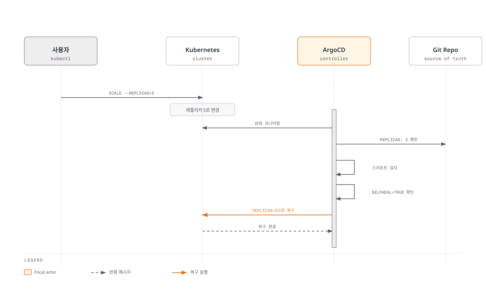
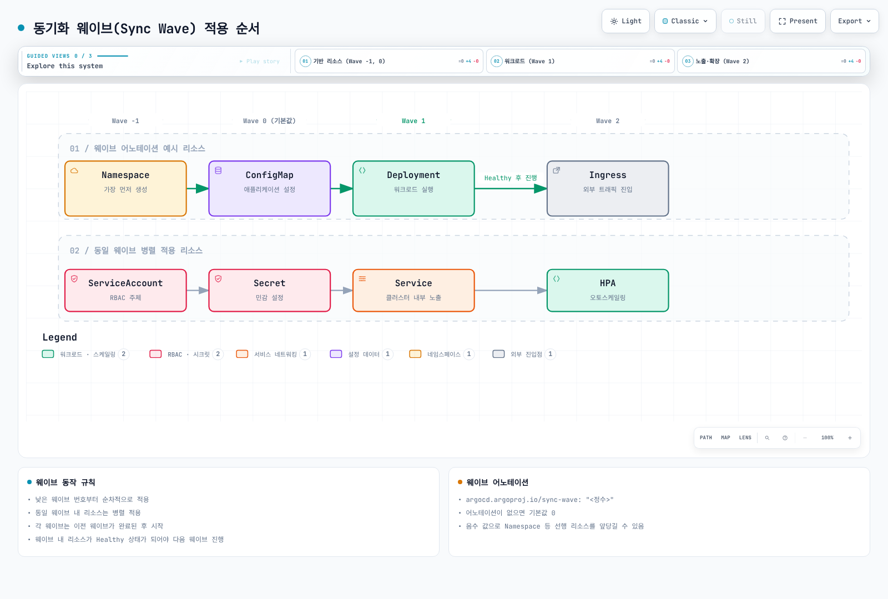
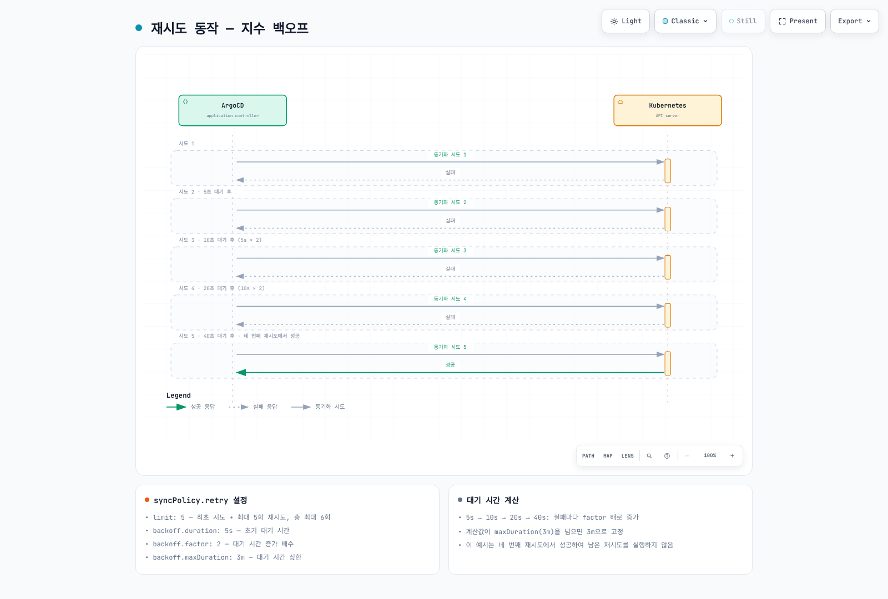

# ArgoCD 동기화 전략

> **지원 버전**: Argo CD 3.5.2
> **마지막 업데이트**: 2026년 9월 11일

## 목차

- [동기화 개요](#동기화-개요)
- [수동 vs 자동 동기화](#수동-vs-자동-동기화)
- [자동 동기화 정책](#자동-동기화-정책)
- [동기화 옵션](#동기화-옵션)
- [동기화 웨이브와 단계](#동기화-웨이브와-단계)
- [리소스 훅](#리소스-훅)
- [동기화 윈도우](#동기화-윈도우)
- [디핑 커스터마이징](#디핑-커스터마이징)
- [재시도 정책](#재시도-정책)
- [선택적 동기화](#선택적-동기화)

## 동기화 개요

예제는 독립적인 정책 조각입니다. 실제 Application의 source·destination·project를 유지하고 필요한 옵션만 선택합니다. Sync는 적용 작업이고 Refresh는 소스/캐시를 조회해 비교 상태를 갱신합니다. Synced와 서비스 가용성(Healthy/실제 통신)은 구분합니다.

동기화(Sync)는 Git 저장소의 원하는 상태(Desired State)를 Kubernetes 클러스터의 실제 상태(Live State)와 일치시키는 과정입니다.


[🔍 인터랙티브 다이어그램 보기](https://www.atomai.click/kubernetes-docs/archmaps/ko-gitops-argocd-03-sync-strategies-0.html)

### 동기화 상태

| 상태 | 설명 |
|------|------|
| **Synced** | Git과 클러스터 상태 일치 |
| **OutOfSync** | Git과 클러스터 상태 불일치 |
| **Unknown** | 상태 확인 불가 |

### 동기화 결과

| 결과 | 설명 |
|------|------|
| **Succeeded** | 동기화 성공 |
| **Failed** | 동기화 실패 |
| **Error** | 동기화 작업 오류 |

`Pruned`는 개별 리소스 결과이며 Succeeded/Failed 같은 operation phase와 구분합니다.

## 수동 vs 자동 동기화

### 수동 동기화

기본적으로 ArgoCD Application은 수동 동기화 모드입니다:

```yaml
apiVersion: argoproj.io/v1alpha1
kind: Application
metadata:
  name: manual-sync-app
  namespace: argocd
spec:
  project: default
  source:
    repoURL: https://github.com/myorg/myapp.git
    targetRevision: main
    path: manifests
  destination:
    server: https://kubernetes.default.svc
    namespace: my-app
  # syncPolicy 없음 = 수동 동기화
```

**CLI로 수동 동기화:**

```bash
# 기본 동기화
argocd app sync my-app

# 드라이런
argocd app sync my-app --dry-run

# 강제 적용은 삭제/재생성을 유발할 수 있으므로 영향 검토 후에만 선택
# argocd app sync my-app --force

# 프루닝 포함
argocd app sync my-app --prune

# 특정 리소스만 동기화
argocd app sync my-app --resource apps:Deployment:my-deployment

# 특정 레이블의 리소스만 동기화
argocd app sync my-app --label app=frontend
```

### 자동 동기화

Git 변경 시 자동으로 동기화합니다:

```yaml
apiVersion: argoproj.io/v1alpha1
kind: Application
metadata:
  name: auto-sync-app
  namespace: argocd
spec:
  project: default
  source:
    repoURL: https://github.com/myorg/myapp.git
    targetRevision: main
    path: manifests
  destination:
    server: https://kubernetes.default.svc
    namespace: my-app
  syncPolicy:
    automated: {}  # 기본 자동 동기화 활성화
```

### 비교

| 특성 | 수동 동기화 | 자동 동기화 |
|------|-------------|-------------|
| **배포 제어** | 명시적 승인 필요 | 자동 배포 |
| **사용 사례** | 운영자가 적용 시점을 직접 선택 | 검토·검증된 Git 변경을 자동 반영 (운영도 가능) |
| **드리프트 처리** | 수동 복구 | 자동 복구 (selfHeal) |
| **Git 변경 반영** | sync 실행 필요 | 설정된 자동 정책에 따라 적용 |

## 자동 동기화 정책

automated: {} 또는 enabled 생략/null은 자동 sync 활성화이며 enabled: false는 이를 끕니다. live-only 드리프트 수정에는 selfHeal이 필요하고 prune은 별도 옵션입니다. 같은 commit/파라미터의 실패를 기본적으로 무한 재시도하지 않으며 retry 정책을 따로 구성합니다. ApplicationSet이 소유한 Application은 원본 템플릿 정책을 수정해야 합니다.

### prune

Git에서 삭제된 리소스를 클러스터에서도 삭제합니다:

```yaml
syncPolicy:
  automated:
    prune: true  # Git에 없는 리소스 삭제
```

**동작 예시:**


[🔍 인터랙티브 다이어그램 보기](https://www.atomai.click/kubernetes-docs/archmaps/ko-gitops-argocd-03-sync-strategies-1.html)

### selfHeal

클러스터의 드리프트를 자동으로 수정합니다:

```yaml
syncPolicy:
  automated:
    selfHeal: true  # 드리프트 자동 복구
```

**동작 예시:**



[🔍 인터랙티브 다이어그램 보기](https://www.atomai.click/kubernetes-docs/archmaps/ko-gitops-argocd-03-sync-strategies-2.html)

### allowEmpty

렌더링 결과가 비었을 때 자동 prune의 전체 삭제 방지 장치를 완화합니다:

```yaml
syncPolicy:
  automated:
    prune: true
    selfHeal: true
    allowEmpty: true  # 빈 소스 허용 (모든 리소스 삭제 가능)
```

**주의**: `allowEmpty: true`와 `prune: true`를 함께 사용하면 모든 리소스가 삭제될 수 있습니다.

### 전체 예시

```yaml
apiVersion: argoproj.io/v1alpha1
kind: Application
metadata:
  name: full-auto-sync-app
  namespace: argocd
spec:
  project: default
  source:
    repoURL: https://github.com/myorg/myapp.git
    targetRevision: main
    path: manifests
  destination:
    server: https://kubernetes.default.svc
    namespace: my-app
  syncPolicy:
    automated:
      prune: true       # Git에 없는 리소스 삭제
      selfHeal: true    # 드리프트 자동 복구
      allowEmpty: false # 빈 소스 허용 안함
```

## 동기화 옵션

### syncOptions 목록

```yaml
syncPolicy:
  syncOptions:
    - Validate=true              # 매니페스트 유효성 검사
    - CreateNamespace=true       # 네임스페이스 자동 생성
    - PrunePropagationPolicy=foreground  # 삭제 전파 정책
    - PruneLast=true             # 마지막에 프루닝
    - ApplyOutOfSyncOnly=true    # 변경된 리소스만 적용
    - ServerSideApply=true       # 서버 사이드 어플라이
    - Replace=false              # 리소스 대체 대신 패치
    - FailOnSharedResource=true  # 공유 리소스 충돌 시 실패
    - RespectIgnoreDifferences=true  # ignoreDifferences 존중
```

### Validate

매니페스트의 유효성을 검사합니다:

```yaml
syncOptions:
  - Validate=true   # kubectl apply --validate=true (기본값)
  # - Validate=false  # 필요한 경우 위 값 대신 선택; 알 수 없는 CRD 처리와는 다름
```

`Validate=false`는 적용 시 스키마 검증을 생략하는 옵션이며, CRD 자체가 없는 문제를 해결하지 않습니다. 같은 동기화에서 CRD를 설치하면 Argo CD가 해당 CR의 dry-run을 자동으로 건너뜁니다. 외부 컨트롤러가 CRD를 생성하는 등 필요한 경우에만 `SkipDryRunOnMissingResource=true`를 사용하고 실제 CRD 존재를 확인합니다.

### CreateNamespace

대상 네임스페이스를 자동으로 생성합니다:

```yaml
syncPolicy:
  syncOptions:
    - CreateNamespace=true
  managedNamespaceMetadata:
    labels:
      istio-injection: enabled
      environment: production
    annotations:
      owner: platform-team
```

### PrunePropagationPolicy

삭제 시 전파 정책을 설정합니다:

```yaml
syncOptions:
  - PrunePropagationPolicy=foreground  # 자식 리소스 먼저 삭제 (기본값)
  # - PrunePropagationPolicy=background  # 백그라운드에서 삭제
  # - PrunePropagationPolicy=orphan      # 자식 리소스 유지
```

### PruneLast

다른 리소스가 배포되고 Healthy 상태가 된 뒤, 마지막 암묵적 wave에서 프루닝을 수행합니다. 삭제로 인한 데이터 손실을 방지하거나 백업을 대신하는 옵션은 아닙니다:

```yaml
syncOptions:
  - PruneLast=true  # 모든 리소스 적용 후 프루닝
```

### ApplyOutOfSyncOnly

OutOfSync 상태인 리소스만 적용합니다 (성능 최적화):

```yaml
syncOptions:
  - ApplyOutOfSyncOnly=true
```

### ServerSideApply

Argo CD 3.5.2는 --server-side --force-conflicts로 적용합니다. 필드 소유권을 추적하지만 충돌을 무조건 거부하는 안전장치는 아니며, 다른 controller가 소유한 필드를 인수할 수 있어 소유권을 검토합니다.

Kubernetes Server-Side Apply를 사용합니다:

```yaml
syncOptions:
  - ServerSideApply=true
```

**장점:**
- 필드 소유권 추적
- 대규모 매니페스트 지원
- 필드 관리 방식이 명시적이나 강제 충돌 해결 범위를 확인해야 함

### Replace

리소스를 패치 대신 대체합니다:

```yaml
syncOptions:
  - Replace=true  # kubectl replace 사용
```

Replace는 kubectl replace/create를 선택하며 immutable 필드 제한을 자동으로 우회하지 않습니다. Force=true와 Replace=true의 조합은 delete/create로 중단·데이터 손실을 유발할 수 있습니다. PVC storageClass 변경 방법으로 권장하지 않습니다. Replace는 ServerSideApply보다 우선합니다.

### FailOnSharedResource

다른 Argo CD Application이 추적하는 리소스 발견 시 실패합니다. 모든 Kubernetes 컨트롤러나 Flux와의 소유권 충돌까지 탐지하는 옵션은 아닙니다:

```yaml
syncOptions:
  - FailOnSharedResource=true
```

### RespectIgnoreDifferences

`ignoreDifferences` 설정을 동기화 시에도 존중합니다:

```yaml
spec:
  ignoreDifferences:
    - group: apps
      kind: Deployment
      jsonPointers:
        - /spec/replicas
  syncPolicy:
    syncOptions:
      - RespectIgnoreDifferences=true
```

## 동기화 웨이브와 단계

### 동기화 웨이브

동기화 웨이브(Sync Wave)는 리소스의 적용 순서를 제어합니다:



[🔍 인터랙티브 다이어그램 보기](https://www.atomai.click/kubernetes-docs/archmaps/ko-gitops-argocd-03-sync-strategies-3.html)

### 웨이브 어노테이션

아래는 완전한 리소스 manifest의 metadata에 합칠 조각입니다. 전체 예제는 다음 절을 참고합니다.

```yaml
metadata:
  annotations:
    argocd.argoproj.io/sync-wave: "-1"
```

### 웨이브 동작

정렬은 phase → wave → kind → name 순서입니다. 음수 Sync wave도 PreSync보다 먼저 실행되지는 않습니다. 다음 wave 진행은 현재 wave의 sync/health에 의존하며, 같은 wave의 물리적 병렬 처리에 의존성을 맡기지 않습니다. 헬스 체크가 없는 CR에는 실제 준비 상태를 전달하는 체크가 필요합니다.

### 최소 구동 예제

아래는 같은 Sync phase에서 Namespace → ConfigMap → Service → readiness가 있는 Deployment를 배포하는 최소 예제입니다. Service 객체가 Healthy여도 endpoint가 준비됐다는 뜻은 아니며 실제 준비 상태는 Deployment의 probe로 확인합니다. Argo Project/RBAC와 이미지 registry 접근을 준비합니다.

```yaml
apiVersion: v1
kind: Namespace
metadata:
  name: wave-demo
  annotations:
    argocd.argoproj.io/sync-wave: "-2"
---
apiVersion: v1
kind: ConfigMap
metadata:
  name: wave-demo-config
  namespace: wave-demo
  annotations:
    argocd.argoproj.io/sync-wave: "-1"
data:
  DEMO_ENVIRONMENT: demo
---
apiVersion: v1
kind: Service
metadata:
  name: wave-demo
  namespace: wave-demo
  annotations:
    argocd.argoproj.io/sync-wave: "0"
spec:
  type: ClusterIP
  selector:
    app: wave-demo
  ports:
  - name: http
    port: 80
    targetPort: http
---
apiVersion: apps/v1
kind: Deployment
metadata:
  name: wave-demo
  namespace: wave-demo
  annotations:
    argocd.argoproj.io/sync-wave: "1"
spec:
  replicas: 2
  selector:
    matchLabels:
      app: wave-demo
  template:
    metadata:
      labels:
        app: wave-demo
    spec:
      automountServiceAccountToken: false
      securityContext:
        runAsNonRoot: true
        runAsUser: 10001
        seccompProfile:
          type: RuntimeDefault
      containers:
      - name: podinfo
        image: ghcr.io/stefanprodan/podinfo:6.15.0
        ports:
        - name: http
          containerPort: 9898
        envFrom:
        - configMapRef:
            name: wave-demo-config
        readinessProbe:
          httpGet:
            path: /readyz
            port: http
        resources:
          requests: {cpu: 100m, memory: 64Mi}
          limits: {cpu: 500m, memory: 128Mi}
        securityContext:
          allowPrivilegeEscalation: false
          capabilities:
            drop: [ALL]
```

데이터베이스를 추가한다면 인증·PVC·Service·실제 readiness를 갖춘 배포를 먼저 준비합니다. HPA에는 CPU requests와 metrics-server 등이 필요합니다. 의존성 Service나 ConfigMap이 readiness에 필요하면 늦은 wave로 미루지 않습니다.

## 리소스 훅

리소스 훅은 [Application 심층 분석](02-applications.md#리소스-훅)에서 자세히 다룹니다.

### 훅과 웨이브 조합

PreSync는 모든 일반 Sync wave보다 먼저 실행됩니다. 아래 existing 서비스·namespace·DB Secret과 migration 이미지는 미리 준비되어 있어야 합니다. 같은 sync의 이후 wave에서 생성할 DB를 PreSync가 사용할 수 있다고 가정하지 않습니다.

```yaml
apiVersion: batch/v1
kind: Job
metadata:
  name: dependency-preflight
  annotations:
    argocd.argoproj.io/hook: PreSync
    argocd.argoproj.io/sync-wave: "-5"
    argocd.argoproj.io/hook-delete-policy: BeforeHookCreation,HookSucceeded
spec:
  backoffLimit: 0
  activeDeadlineSeconds: 60
  template:
    spec:
      restartPolicy: Never
      automountServiceAccountToken: false
      containers:
      - name: check
        image: curlimages/curl:8.22.0
        command: ["curl"]
        args: ["--fail", "--show-error", "--silent", "--connect-timeout", "5", "--max-time", "20", "http://existing-data-service:8080/health"]
---
apiVersion: batch/v1
kind: Job
metadata:
  name: db-migration
  annotations:
    argocd.argoproj.io/hook: PreSync
    argocd.argoproj.io/sync-wave: "-3"
    argocd.argoproj.io/hook-delete-policy: BeforeHookCreation,HookSucceeded
spec:
  backoffLimit: 0
  activeDeadlineSeconds: 300
  template:
    spec:
      restartPolicy: Never
      containers:
      - name: migrate
        image: myapp/migrations:v1.0.0
        command: ["./migrate.sh"]
        env:
        - name: DATABASE_URL
          valueFrom:
            secretKeyRef:
              name: existing-db-credentials
              key: url
```

pg_dump를 stdout에만 출력하는 Job은 복구 가능한 백업 절차가 아닙니다. 백업은 지속 저장·암호화·완료 검증·복구 시험을 갖춘 별도 절차로 수행합니다. migration의 멱등성·잠금·실패 시 데이터 복구를 검증하고, PostSync 실패가 자동 rollback을 뜻하지 않음을 구분합니다.

## 동기화 윈도우

다음은 production 프로젝트의 prod-* 앱에 일요일 KST 02–06시를 허용하되 03–04시를 차단하는 정책 예제입니다. 저장소와 대상은 실제 허용 범위로 바꿉니다.

```yaml
apiVersion: argoproj.io/v1alpha1
kind: AppProject
metadata:
  name: production
  namespace: argocd
spec:
  sourceRepos:
  - https://github.com/myorg/myapp.git
  destinations:
  - server: https://kubernetes.default.svc
    namespace: production
  syncWindows:
  - kind: allow
    description: Example Sunday maintenance window
    schedule: '0 2 * * 0'
    duration: 4h
    timeZone: Asia/Seoul
    applications: ['prod-*']
    namespaces: [production]
    andOperator: true
    manualSync: false
    syncOverrun: false
  - kind: deny
    description: Example freeze within the maintenance window
    schedule: '0 3 * * 0'
    duration: 1h
    timeZone: Asia/Seoul
    applications: ['prod-*']
    namespaces: [production]
    andOperator: true
    manualSync: false
    syncOverrun: false
```

새 자동 sync 요청의 판정은 다음과 같습니다.

1. 이 앱에 매칭되는 window가 없으면 window 정책상 허용됩니다.
2. 매칭된 활성 deny가 있으면 차단됩니다.
3. 활성 allow가 있으면 허용됩니다.
4. 매칭된 allow가 있지만 모두 비활성이면 차단됩니다.
5. allow가 없고 매칭 deny도 비활성이면 허용됩니다.

applications/namespaces/clusters 선택자는 기본 OR이며 구체성 우선순위는 없습니다. 함께 만족해야 하면 andOperator: true를 사용합니다. timeZone을 생략하면 UTC이며 KST라는 주석만으로 시간대가 바뀌지 않습니다.

수동 예외는 관련 차단 window 모두의 manualSync 설정과 사용자의 sync 권한으로 결정됩니다. --force는 이를 우회하지 않습니다. 항상 켜진 24h allow를 “수동 활성화용”으로 추가하면 자동 sync까지 상시 허용할 수 있습니다. 진행 중 작업의 window 초과 실행은 syncOverrun과 시작 시점·관련 window 조건에 따라 달라지며, 완료·rollback을 보장하는 설정은 아닙니다.

```bash
argocd proj windows list production -o yaml
argocd app get my-app
```


[🔍 인터랙티브 다이어그램 보기](https://www.atomai.click/kubernetes-docs/archmaps/ko-gitops-argocd-03-sync-strategies-4.html)

## 디핑 커스터마이징

외부 controller가 관리하는 실제 필드만 이름/namespace로 좁혀 무시합니다. 예를 들어 HPA가 관리하는 한 Deployment의 replicas를 제외할 수 있습니다. 이미지·전체 annotation·resources 또는 모든 manager를 일괄 무시하는 것을 기본값으로 삼지 않습니다.

```yaml
spec:
  ignoreDifferences:
  - group: apps
    kind: Deployment
    name: my-deployment
    namespace: production
    jsonPointers:
    - /spec/replicas
  syncPolicy:
    syncOptions: [RespectIgnoreDifferences=true]
```

ignoreDifferences는 비교 동작입니다. RespectIgnoreDifferences는 sync에도 적용하지만 live 객체가 없는 첫 생성에서는 desired manifest가 사용됩니다. managedFieldsManagers는 실제 소유 필드를 확인하고 선택합니다. 전역 설정과 status 비교 제외는 리소스의 health 판정을 끄거나 이미지 변조를 허용하는 정책으로 쓰지 않습니다.

상세 필드 예시는 [Application 차이 무시 구성](02-applications.md#차이-무시-구성)을 참고합니다.

## 재시도 정책

limit: 5는 초기 시도 뒤 최대 5회 재시도, 즉 최대 6회 시도를 의미합니다. 지연은 5s, 10s, 20s, 40s, 80s 순으로 시작하고 maxDuration은 각각의 backoff 상한입니다. 전체 sync나 훅의 timeout은 아닙니다. retry와 Job.backoffLimit/activeDeadlineSeconds는 서로 다른 계층입니다.

동기화 실패 시 자동 재시도를 구성합니다:

```yaml
syncPolicy:
  retry:
    limit: 5           # 최대 재시도 횟수 (-1은 무제한)
    backoff:
      duration: 5s     # 초기 대기 시간
      factor: 2        # 대기 시간 증가 배수
      maxDuration: 3m  # 최대 대기 시간
```

### 재시도 동작



[🔍 인터랙티브 다이어그램 보기](https://www.atomai.click/kubernetes-docs/archmaps/ko-gitops-argocd-03-sync-strategies-5.html)

## 선택적 동기화

--resource/--label로 일부 리소스를 명시 선택하는 sync는 훅을 실행하지 않고 이력도 남기지 않습니다. ApplyOutOfSyncOnly/--apply-out-of-sync-only는 3.5.2에서 훅·이력을 유지합니다. --label은 리소스 선택, --selector(-l)는 Application 선택이므로 혼동하지 않습니다.

### 특정 리소스만 동기화

```bash
# Deployment만 동기화
argocd app sync my-app --resource apps:Deployment:my-deployment

# 여러 리소스 동기화
argocd app sync my-app \
  --resource apps:Deployment:frontend \
  --resource apps:Deployment:backend \
  --resource :Service:frontend-svc

# 레이블로 선택
argocd app sync my-app --label app.kubernetes.io/component=frontend
```

### 선택적 동기화 옵션

```bash
# 프루닝 없이 동기화
argocd app sync my-app --prune=false

# 드라이런
argocd app sync my-app --dry-run

# 강제 적용은 삭제/재생성을 유발할 수 있으므로 영향 검토 후에만 선택
# argocd app sync my-app --force

# 특정 리비전으로 동기화
argocd app sync my-app --revision v1.2.3

# 로컬 매니페스트로 동기화 (테스트용)
argocd app sync my-app --local ./manifests
```

### 전체 Sync 상태에서 제외

IgnoreExtraneous는 전체 sync 상태 계산에서 제외할 뿐 health나 prune을 면제하지 않습니다. 리소스를 보존하려면 별도의 Prune=false 같은 정책과 소유권을 검토합니다.

```yaml
metadata:
  annotations:
    argocd.argoproj.io/compare-options: IgnoreExtraneous
```

## 다음 단계

1. **[ApplicationSets](04-applicationsets.md)**: 대규모 배포를 위한 ApplicationSet 생성기를 학습하세요.

2. **[트래픽 관리](05-traffic-management.md)**: Argo Rollouts를 통한 블루/그린, 카나리 배포를 구현하세요.

3. **[프로젝트와 RBAC](06-projects-rbac.md)**: 동기화 윈도우와 RBAC을 결합하여 배포를 제어하세요.

## 참고 자료

- [ArgoCD 동기화 문서](https://argo-cd.readthedocs.io/en/stable/user-guide/sync-options/)
- [동기화 웨이브](https://argo-cd.readthedocs.io/en/stable/user-guide/sync-waves/)
- [리소스 훅](https://argo-cd.readthedocs.io/en/stable/user-guide/resource_hooks/)
- [디핑 커스터마이징](https://argo-cd.readthedocs.io/en/stable/user-guide/diffing/)

## 퀴즈

이 장에서 배운 내용을 테스트하려면 [동기화 전략 퀴즈](../../quizzes/gitops/argocd/03-sync-strategies-quiz.md)를 풀어보세요.

### 버전별 검토 근거

- [3.5.2 sync options](https://github.com/argoproj/argo-cd/blob/v3.5.2/docs/user-guide/sync-options.md)
- [Sync windows](https://github.com/argoproj/argo-cd/blob/v3.5.2/docs/user-guide/sync_windows.md)
- [Window matching and CanSync](https://github.com/argoproj/argo-cd/blob/v3.5.2/pkg/apis/application/v1alpha1/types.go)
- [Phases and waves](https://github.com/argoproj/argo-cd/blob/v3.5.2/docs/user-guide/sync-waves.md)
- [CLI resource/app selectors](https://github.com/argoproj/argo-cd/blob/v3.5.2/docs/user-guide/commands/argocd_app_sync.md)
