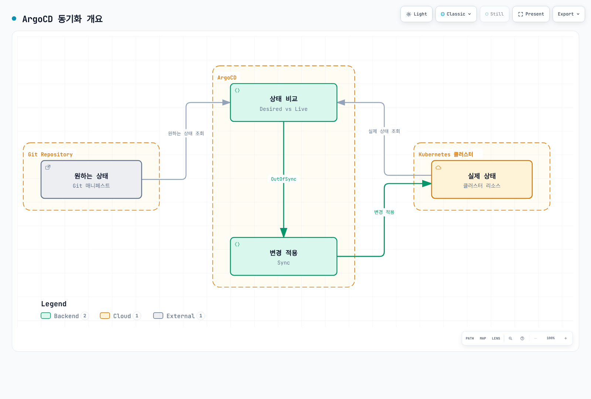
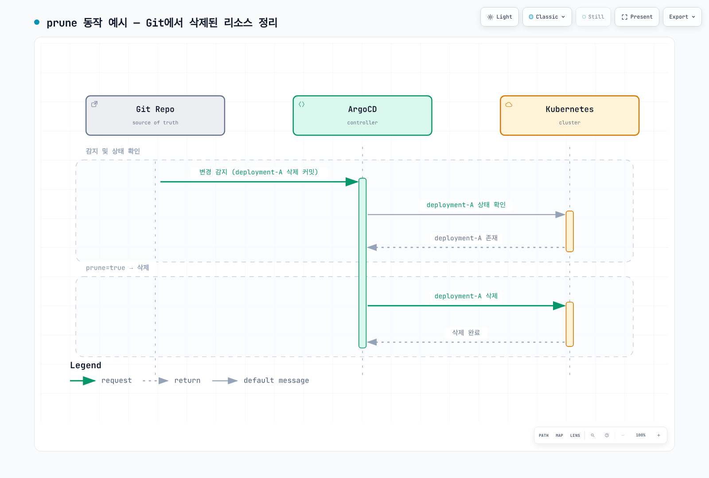
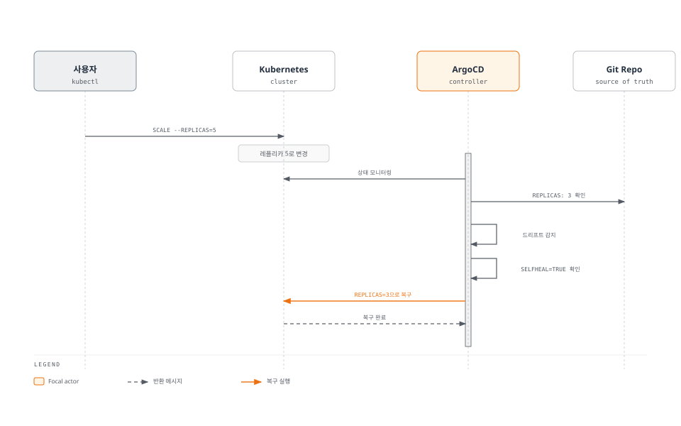
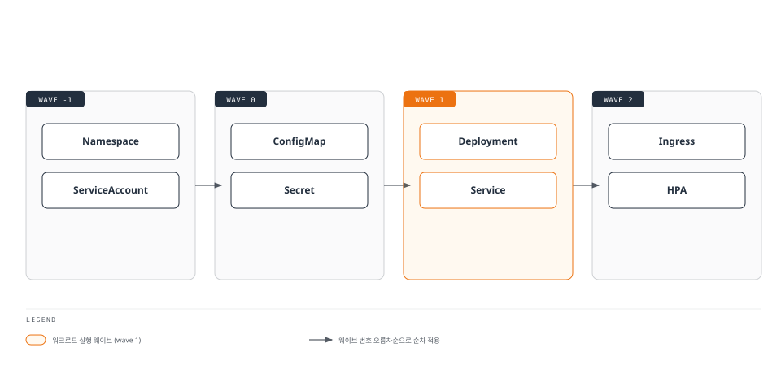
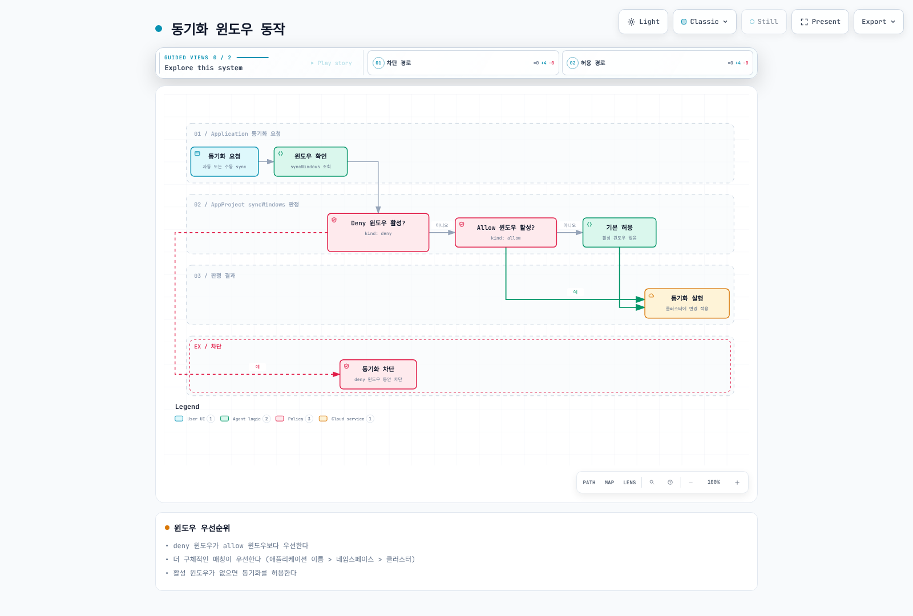
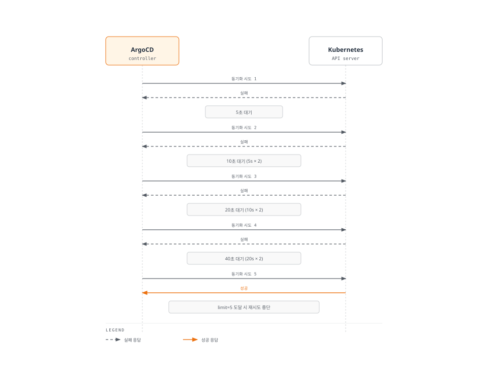

# ArgoCD 동기화 전략

> **지원 버전**: ArgoCD v2.9+
> **마지막 업데이트**: 2026년 2월 22일

## 목차

- [동기화 개요](#동기화-개요)
- [수동 vs 자동 동기화](#수동-vs-자동-동기화)
- [자동 동기화 정책](#자동-동기화-정책)
- [동기화 옵션](#동기화-옵션)
- [동기화 웨이브와 단계](#동기화-웨이브와-단계)
- [리소스 훅](#리소스-훅)
- [동기화 윈도우](#동기화-윈도우)
- [디핑 커스터마이징](#디핑-커스터마이징)
- [재시도 정책](#재시도-정책)
- [선택적 동기화](#선택적-동기화)

## 동기화 개요

동기화(Sync)는 Git 저장소의 원하는 상태(Desired State)를 Kubernetes 클러스터의 실제 상태(Live State)와 일치시키는 과정입니다.



[🔍 인터랙티브 다이어그램 보기](https://www.atomai.click/kubernetes-docs/archmaps/ko-gitops-argocd-03-sync-strategies-0.html)

### 동기화 상태

| 상태 | 설명 |
|------|------|
| **Synced** | Git과 클러스터 상태 일치 |
| **OutOfSync** | Git과 클러스터 상태 불일치 |
| **Unknown** | 상태 확인 불가 |

### 동기화 결과

| 결과 | 설명 |
|------|------|
| **Succeeded** | 동기화 성공 |
| **Failed** | 동기화 실패 |
| **Pruned** | 리소스 삭제됨 |

## 수동 vs 자동 동기화

### 수동 동기화

기본적으로 ArgoCD Application은 수동 동기화 모드입니다:

```yaml
apiVersion: argoproj.io/v1alpha1
kind: Application
metadata:
  name: manual-sync-app
  namespace: argocd
spec:
  project: default
  source:
    repoURL: https://github.com/myorg/myapp.git
    targetRevision: main
    path: manifests
  destination:
    server: https://kubernetes.default.svc
    namespace: my-app
  # syncPolicy 없음 = 수동 동기화
```

**CLI로 수동 동기화:**

```bash
# 기본 동기화
argocd app sync my-app

# 드라이런
argocd app sync my-app --dry-run

# 강제 동기화 (리소스 대체)
argocd app sync my-app --force

# 프루닝 포함
argocd app sync my-app --prune

# 특정 리소스만 동기화
argocd app sync my-app --resource apps:Deployment:my-deployment

# 특정 레이블의 리소스만 동기화
argocd app sync my-app --label app=frontend
```

### 자동 동기화

Git 변경 시 자동으로 동기화합니다:

```yaml
apiVersion: argoproj.io/v1alpha1
kind: Application
metadata:
  name: auto-sync-app
  namespace: argocd
spec:
  project: default
  source:
    repoURL: https://github.com/myorg/myapp.git
    targetRevision: main
    path: manifests
  destination:
    server: https://kubernetes.default.svc
    namespace: my-app
  syncPolicy:
    automated: {}  # 기본 자동 동기화 활성화
```

### 비교

| 특성 | 수동 동기화 | 자동 동기화 |
|------|-------------|-------------|
| **배포 제어** | 명시적 승인 필요 | 자동 배포 |
| **사용 사례** | 프로덕션, 승인 필요 환경 | 개발, 스테이징 |
| **드리프트 처리** | 수동 복구 | 자동 복구 (selfHeal) |
| **Git 롤백** | 수동 | 자동 |

## 자동 동기화 정책

### prune

Git에서 삭제된 리소스를 클러스터에서도 삭제합니다:

```yaml
syncPolicy:
  automated:
    prune: true  # Git에 없는 리소스 삭제
```

**동작 예시:**



[🔍 인터랙티브 다이어그램 보기](https://www.atomai.click/kubernetes-docs/archmaps/ko-gitops-argocd-03-sync-strategies-1.html)

### selfHeal

클러스터의 드리프트를 자동으로 수정합니다:

```yaml
syncPolicy:
  automated:
    selfHeal: true  # 드리프트 자동 복구
```

**동작 예시:**



### allowEmpty

소스 디렉토리가 비어있어도 동기화를 허용합니다:

```yaml
syncPolicy:
  automated:
    prune: true
    selfHeal: true
    allowEmpty: true  # 빈 소스 허용 (모든 리소스 삭제 가능)
```

**주의**: `allowEmpty: true`와 `prune: true`를 함께 사용하면 모든 리소스가 삭제될 수 있습니다.

### 전체 예시

```yaml
apiVersion: argoproj.io/v1alpha1
kind: Application
metadata:
  name: full-auto-sync-app
  namespace: argocd
spec:
  project: default
  source:
    repoURL: https://github.com/myorg/myapp.git
    targetRevision: main
    path: manifests
  destination:
    server: https://kubernetes.default.svc
    namespace: my-app
  syncPolicy:
    automated:
      prune: true       # Git에 없는 리소스 삭제
      selfHeal: true    # 드리프트 자동 복구
      allowEmpty: false # 빈 소스 허용 안함
```

## 동기화 옵션

### syncOptions 목록

```yaml
syncPolicy:
  syncOptions:
    - Validate=true              # 매니페스트 유효성 검사
    - CreateNamespace=true       # 네임스페이스 자동 생성
    - PrunePropagationPolicy=foreground  # 삭제 전파 정책
    - PruneLast=true             # 마지막에 프루닝
    - ApplyOutOfSyncOnly=true    # 변경된 리소스만 적용
    - ServerSideApply=true       # 서버 사이드 어플라이
    - Replace=false              # 리소스 대체 대신 패치
    - FailOnSharedResource=true  # 공유 리소스 충돌 시 실패
    - RespectIgnoreDifferences=true  # ignoreDifferences 존중
```

### Validate

매니페스트의 유효성을 검사합니다:

```yaml
syncOptions:
  - Validate=true   # kubectl apply --validate=true (기본값)
  - Validate=false  # 검증 비활성화 (CRD 먼저 설치 시 유용)
```

### CreateNamespace

대상 네임스페이스를 자동으로 생성합니다:

```yaml
syncPolicy:
  syncOptions:
    - CreateNamespace=true
  managedNamespaceMetadata:
    labels:
      istio-injection: enabled
      environment: production
    annotations:
      owner: platform-team
```

### PrunePropagationPolicy

삭제 시 전파 정책을 설정합니다:

```yaml
syncOptions:
  - PrunePropagationPolicy=foreground  # 자식 리소스 먼저 삭제 (기본값)
  - PrunePropagationPolicy=background  # 백그라운드에서 삭제
  - PrunePropagationPolicy=orphan      # 자식 리소스 유지
```

### PruneLast

동기화의 마지막 단계에서 프루닝을 수행합니다:

```yaml
syncOptions:
  - PruneLast=true  # 모든 리소스 적용 후 프루닝
```

### ApplyOutOfSyncOnly

OutOfSync 상태인 리소스만 적용합니다 (성능 최적화):

```yaml
syncOptions:
  - ApplyOutOfSyncOnly=true
```

### ServerSideApply

Kubernetes Server-Side Apply를 사용합니다:

```yaml
syncOptions:
  - ServerSideApply=true
```

**장점:**
- 필드 소유권 추적
- 대규모 매니페스트 지원
- 충돌 감지 개선

### Replace

리소스를 패치 대신 대체합니다:

```yaml
syncOptions:
  - Replace=true  # kubectl replace 사용
```

**주의**: 리소스가 완전히 대체되므로 주의해서 사용하세요.

### FailOnSharedResource

다른 Application이 관리하는 리소스 발견 시 실패합니다:

```yaml
syncOptions:
  - FailOnSharedResource=true
```

### RespectIgnoreDifferences

`ignoreDifferences` 설정을 동기화 시에도 존중합니다:

```yaml
spec:
  ignoreDifferences:
    - group: apps
      kind: Deployment
      jsonPointers:
        - /spec/replicas
  syncPolicy:
    syncOptions:
      - RespectIgnoreDifferences=true
```

## 동기화 웨이브와 단계

### 동기화 웨이브

동기화 웨이브(Sync Wave)는 리소스의 적용 순서를 제어합니다:



### 웨이브 어노테이션

```yaml
apiVersion: v1
kind: Namespace
metadata:
  name: my-app
  annotations:
    argocd.argoproj.io/sync-wave: "-1"  # 가장 먼저 생성
---
apiVersion: v1
kind: ConfigMap
metadata:
  name: app-config
  annotations:
    argocd.argoproj.io/sync-wave: "0"  # 두 번째 (기본값)
---
apiVersion: apps/v1
kind: Deployment
metadata:
  name: my-app
  annotations:
    argocd.argoproj.io/sync-wave: "1"  # 세 번째
---
apiVersion: networking.k8s.io/v1
kind: Ingress
metadata:
  name: my-app
  annotations:
    argocd.argoproj.io/sync-wave: "2"  # 마지막
```

### 웨이브 동작

1. 낮은 웨이브 번호부터 순차적으로 적용
2. 동일 웨이브 내 리소스는 병렬 적용
3. 각 웨이브는 이전 웨이브가 완료된 후 시작
4. 웨이브 내 리소스가 Healthy 상태가 되어야 다음 웨이브 진행

### 실제 예시: 전체 스택 배포

```yaml
# Wave -2: 네임스페이스
apiVersion: v1
kind: Namespace
metadata:
  name: my-app
  annotations:
    argocd.argoproj.io/sync-wave: "-2"
---
# Wave -1: RBAC
apiVersion: v1
kind: ServiceAccount
metadata:
  name: my-app
  namespace: my-app
  annotations:
    argocd.argoproj.io/sync-wave: "-1"
---
apiVersion: rbac.authorization.k8s.io/v1
kind: Role
metadata:
  name: my-app
  namespace: my-app
  annotations:
    argocd.argoproj.io/sync-wave: "-1"
---
# Wave 0: 설정
apiVersion: v1
kind: ConfigMap
metadata:
  name: my-app-config
  namespace: my-app
  annotations:
    argocd.argoproj.io/sync-wave: "0"
data:
  app.yaml: |
    server:
      port: 8080
---
apiVersion: v1
kind: Secret
metadata:
  name: my-app-secret
  namespace: my-app
  annotations:
    argocd.argoproj.io/sync-wave: "0"
type: Opaque
stringData:
  api-key: "xxx"
---
# Wave 1: 데이터베이스
apiVersion: apps/v1
kind: StatefulSet
metadata:
  name: postgres
  namespace: my-app
  annotations:
    argocd.argoproj.io/sync-wave: "1"
spec:
  serviceName: postgres
  replicas: 1
  selector:
    matchLabels:
      app: postgres
  template:
    metadata:
      labels:
        app: postgres
    spec:
      containers:
        - name: postgres
          image: postgres:15
          ports:
            - containerPort: 5432
---
# Wave 2: 애플리케이션
apiVersion: apps/v1
kind: Deployment
metadata:
  name: my-app
  namespace: my-app
  annotations:
    argocd.argoproj.io/sync-wave: "2"
spec:
  replicas: 3
  selector:
    matchLabels:
      app: my-app
  template:
    metadata:
      labels:
        app: my-app
    spec:
      containers:
        - name: app
          image: my-app:v1.0.0
          ports:
            - containerPort: 8080
---
# Wave 3: 서비스 노출
apiVersion: v1
kind: Service
metadata:
  name: my-app
  namespace: my-app
  annotations:
    argocd.argoproj.io/sync-wave: "3"
spec:
  selector:
    app: my-app
  ports:
    - port: 80
      targetPort: 8080
---
apiVersion: networking.k8s.io/v1
kind: Ingress
metadata:
  name: my-app
  namespace: my-app
  annotations:
    argocd.argoproj.io/sync-wave: "3"
spec:
  rules:
    - host: my-app.example.com
      http:
        paths:
          - path: /
            pathType: Prefix
            backend:
              service:
                name: my-app
                port:
                  number: 80
---
# Wave 4: 오토스케일링
apiVersion: autoscaling/v2
kind: HorizontalPodAutoscaler
metadata:
  name: my-app
  namespace: my-app
  annotations:
    argocd.argoproj.io/sync-wave: "4"
spec:
  scaleTargetRef:
    apiVersion: apps/v1
    kind: Deployment
    name: my-app
  minReplicas: 3
  maxReplicas: 10
  metrics:
    - type: Resource
      resource:
        name: cpu
        target:
          type: Utilization
          averageUtilization: 70
```

## 리소스 훅

리소스 훅은 [Application 심층 분석](02-applications.md#리소스-훅)에서 자세히 다룹니다.

### 훅과 웨이브 조합

```yaml
# PreSync 훅 (Wave -5): DB 백업
apiVersion: batch/v1
kind: Job
metadata:
  name: db-backup
  annotations:
    argocd.argoproj.io/hook: PreSync
    argocd.argoproj.io/sync-wave: "-5"
    argocd.argoproj.io/hook-delete-policy: BeforeHookCreation
spec:
  template:
    spec:
      containers:
        - name: backup
          image: postgres:15
          command: ["pg_dump", "-h", "postgres", "-U", "admin", "-d", "mydb"]
      restartPolicy: Never
---
# PreSync 훅 (Wave -3): DB 마이그레이션
apiVersion: batch/v1
kind: Job
metadata:
  name: db-migration
  annotations:
    argocd.argoproj.io/hook: PreSync
    argocd.argoproj.io/sync-wave: "-3"
    argocd.argoproj.io/hook-delete-policy: BeforeHookCreation
spec:
  template:
    spec:
      containers:
        - name: migrate
          image: my-app:v1.0.0
          command: ["./migrate.sh"]
      restartPolicy: Never
---
# PostSync 훅: 스모크 테스트
apiVersion: batch/v1
kind: Job
metadata:
  name: smoke-test
  annotations:
    argocd.argoproj.io/hook: PostSync
    argocd.argoproj.io/hook-delete-policy: HookSucceeded
spec:
  template:
    spec:
      containers:
        - name: test
          image: curlimages/curl:8.1.0
          command:
            - /bin/sh
            - -c
            - |
              curl -sf http://my-app/health || exit 1
      restartPolicy: Never
```

## 동기화 윈도우

동기화 윈도우는 특정 시간대에만 동기화를 허용하거나 차단합니다.

### AppProject에서 설정

```yaml
apiVersion: argoproj.io/v1alpha1
kind: AppProject
metadata:
  name: production
  namespace: argocd
spec:
  description: Production applications
  sourceRepos:
    - '*'
  destinations:
    - namespace: '*'
      server: '*'

  # 동기화 윈도우
  syncWindows:
    # 유지보수 윈도우: 매주 일요일 02:00-06:00 (KST) 동안만 동기화 허용
    - kind: allow
      schedule: '0 2 * * 0'  # Cron 표현식
      duration: 4h
      applications:
        - '*'
      namespaces:
        - production
      clusters:
        - '*'
      manualSync: true  # 수동 동기화 허용

    # 비즈니스 시간 차단: 월-금 09:00-18:00 동기화 차단
    - kind: deny
      schedule: '0 9 * * 1-5'
      duration: 9h
      applications:
        - 'prod-*'
      manualSync: false  # 수동 동기화도 차단

    # 특정 애플리케이션 항상 허용
    - kind: allow
      schedule: '* * * * *'  # 항상
      duration: 24h
      applications:
        - 'monitoring'
        - 'logging'
```

### 동기화 윈도우 동작



[🔍 인터랙티브 다이어그램 보기](https://www.atomai.click/kubernetes-docs/archmaps/ko-gitops-argocd-03-sync-strategies-4.html)

### 윈도우 우선순위

1. `deny` 윈도우가 `allow`보다 우선
2. 더 구체적인 매칭이 우선 (애플리케이션 이름 > 네임스페이스 > 클러스터)
3. 활성 윈도우가 없으면 동기화 허용

### CLI로 윈도우 상태 확인

```bash
# 프로젝트 윈도우 목록
argocd proj windows list production

# 활성 윈도우 확인
argocd proj windows list production --active
```

## 디핑 커스터마이징

### ignoreDifferences

특정 필드의 차이를 무시합니다:

```yaml
spec:
  ignoreDifferences:
    # JSON Pointer
    - group: apps
      kind: Deployment
      jsonPointers:
        - /spec/replicas
        - /spec/template/spec/containers/0/resources

    # JQ 표현식
    - group: ""
      kind: ConfigMap
      jqPathExpressions:
        - '.data["generated-config"]'

    # 특정 리소스
    - group: apps
      kind: Deployment
      name: my-app
      namespace: production
      jsonPointers:
        - /metadata/annotations/deployment.kubernetes.io~1revision
```

### managedFields 무시

```yaml
# argocd-cm ConfigMap
apiVersion: v1
kind: ConfigMap
metadata:
  name: argocd-cm
  namespace: argocd
data:
  resource.compareoptions: |
    ignoreAggregatedRoles: true

  resource.customizations.ignoreDifferences.all: |
    managedFieldsManagers:
      - kube-controller-manager
      - kube-scheduler
      - kubectl-client-side-apply
```

### 전역 무시 설정

```yaml
# argocd-cm ConfigMap
apiVersion: v1
kind: ConfigMap
metadata:
  name: argocd-cm
  namespace: argocd
data:
  # 모든 Deployment의 replicas 무시
  resource.customizations.ignoreDifferences.apps_Deployment: |
    jsonPointers:
      - /spec/replicas

  # 모든 Service의 clusterIP 무시
  resource.customizations.ignoreDifferences._Service: |
    jsonPointers:
      - /spec/clusterIP
      - /spec/clusterIPs

  # 모든 리소스의 특정 어노테이션 무시
  resource.customizations.ignoreDifferences.all: |
    jsonPointers:
      - /metadata/annotations/kubectl.kubernetes.io~1last-applied-configuration
```

## 재시도 정책

동기화 실패 시 자동 재시도를 구성합니다:

```yaml
syncPolicy:
  retry:
    limit: 5           # 최대 재시도 횟수 (-1은 무제한)
    backoff:
      duration: 5s     # 초기 대기 시간
      factor: 2        # 대기 시간 증가 배수
      maxDuration: 3m  # 최대 대기 시간
```

### 재시도 동작



## 선택적 동기화

### 특정 리소스만 동기화

```bash
# Deployment만 동기화
argocd app sync my-app --resource apps:Deployment:my-deployment

# 여러 리소스 동기화
argocd app sync my-app \
  --resource apps:Deployment:frontend \
  --resource apps:Deployment:backend \
  --resource :Service:frontend-svc

# 레이블로 선택
argocd app sync my-app --label app.kubernetes.io/component=frontend
```

### 선택적 동기화 옵션

```bash
# 프루닝 없이 동기화
argocd app sync my-app --prune=false

# 드라이런
argocd app sync my-app --dry-run

# 강제 동기화 (리소스 대체)
argocd app sync my-app --force

# 특정 리비전으로 동기화
argocd app sync my-app --revision v1.2.3

# 로컬 매니페스트로 동기화 (테스트용)
argocd app sync my-app --local ./manifests
```

### 리소스 제외

```yaml
metadata:
  annotations:
    argocd.argoproj.io/compare-options: IgnoreExtraneous
```

## 다음 단계

1. **[ApplicationSets](04-applicationsets.md)**: 대규모 배포를 위한 ApplicationSet 생성기를 학습하세요.

2. **[트래픽 관리](05-traffic-management.md)**: Argo Rollouts를 통한 블루/그린, 카나리 배포를 구현하세요.

3. **[프로젝트와 RBAC](06-projects-rbac.md)**: 동기화 윈도우와 RBAC을 결합하여 배포를 제어하세요.

## 참고 자료

- [ArgoCD 동기화 문서](https://argo-cd.readthedocs.io/en/stable/user-guide/sync-options/)
- [동기화 웨이브](https://argo-cd.readthedocs.io/en/stable/user-guide/sync-waves/)
- [리소스 훅](https://argo-cd.readthedocs.io/en/stable/user-guide/resource_hooks/)
- [디핑 커스터마이징](https://argo-cd.readthedocs.io/en/stable/user-guide/diffing/)

## 퀴즈

이 장에서 배운 내용을 테스트하려면 [동기화 전략 퀴즈](../../quizzes/gitops/argocd/03-sync-strategies-quiz.md)를 풀어보세요.
