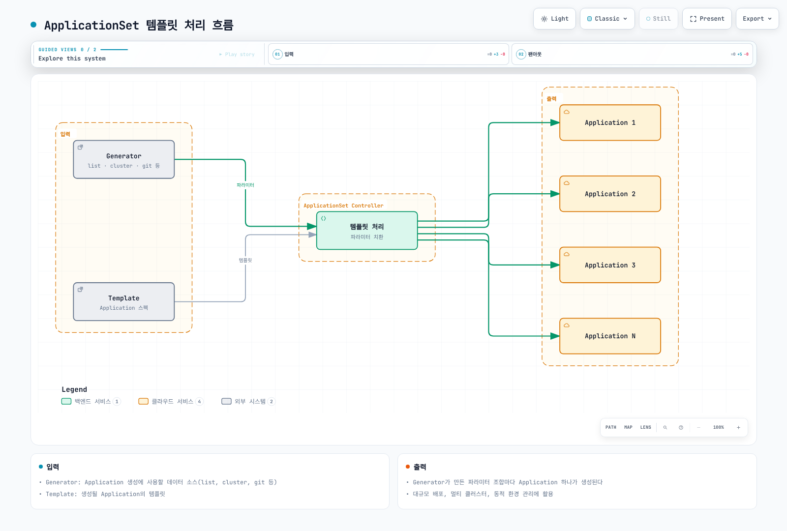
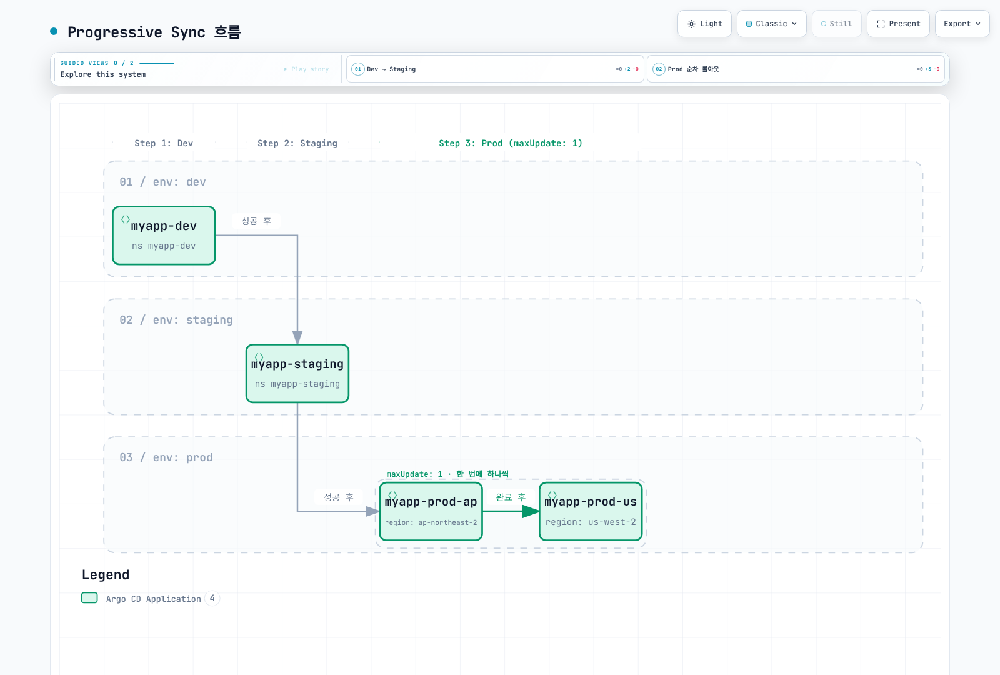
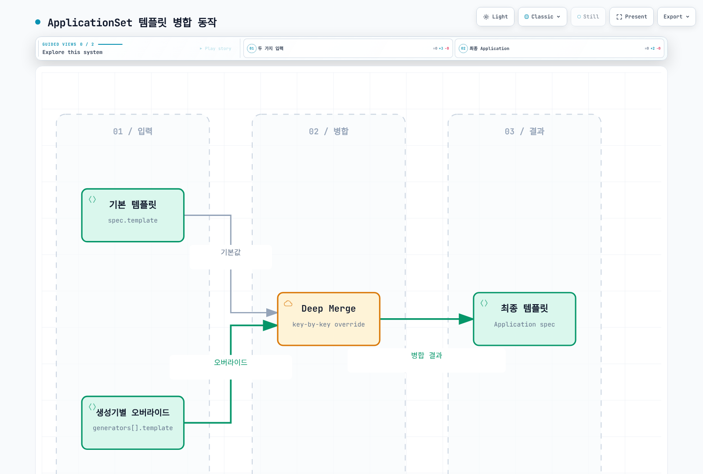

# ArgoCD ApplicationSets

> **지원 버전**: ArgoCD v2.9+
> **마지막 업데이트**: 2026년 2월 22일

## 목차

- [ApplicationSet 개요](#applicationset-개요)
- [생성기 (Generators)](#생성기-generators)
- [Go 템플릿](#go-템플릿)
- [Progressive Syncs](#progressive-syncs)
- [멀티 클러스터 배포 패턴](#멀티-클러스터-배포-패턴)
- [템플릿 오버라이드](#템플릿-오버라이드)

## ApplicationSet 개요

ApplicationSet은 템플릿을 사용하여 여러 ArgoCD Application을 자동으로 생성하는 컨트롤러입니다. 대규모 배포, 멀티 클러스터 환경, 동적 환경 관리에 유용합니다.



[🔍 인터랙티브 다이어그램 보기](https://www.atomai.click/kubernetes-docs/archmaps/ko-gitops-argocd-04-applicationsets-0.html)

### 기본 구조

```yaml
apiVersion: argoproj.io/v1alpha1
kind: ApplicationSet
metadata:
  name: my-applicationset
  namespace: argocd
spec:
  # 생성기: Application 생성에 사용할 데이터 소스
  generators:
    - list:
        elements:
          - name: dev
            namespace: dev
          - name: staging
            namespace: staging

  # 템플릿: 생성될 Application의 템플릿
  template:
    metadata:
      name: 'myapp-{{name}}'
    spec:
      project: default
      source:
        repoURL: https://github.com/myorg/myapp.git
        targetRevision: main
        path: 'environments/{{name}}'
      destination:
        server: https://kubernetes.default.svc
        namespace: '{{namespace}}'
      syncPolicy:
        automated:
          prune: true
          selfHeal: true

  # 동기화 정책
  syncPolicy:
    preserveResourcesOnDeletion: false  # ApplicationSet 삭제 시 Application도 삭제

  # 전략
  strategy:
    type: RollingSync
    rollingSync:
      steps:
        - matchExpressions:
            - key: env
              operator: In
              values:
                - dev
        - matchExpressions:
            - key: env
              operator: In
              values:
                - staging
```

## 생성기 (Generators)

ApplicationSet은 9가지 생성기를 지원합니다.

### 1. List Generator

정적 목록에서 Application을 생성합니다:

```yaml
apiVersion: argoproj.io/v1alpha1
kind: ApplicationSet
metadata:
  name: list-generator-example
  namespace: argocd
spec:
  generators:
    - list:
        elements:
          - name: dev
            namespace: dev-ns
            cluster: https://dev-cluster.example.com
            values:
              replicas: "1"
              environment: development
          - name: staging
            namespace: staging-ns
            cluster: https://staging-cluster.example.com
            values:
              replicas: "2"
              environment: staging
          - name: prod
            namespace: prod-ns
            cluster: https://prod-cluster.example.com
            values:
              replicas: "5"
              environment: production
  template:
    metadata:
      name: 'myapp-{{name}}'
      labels:
        environment: '{{values.environment}}'
    spec:
      project: default
      source:
        repoURL: https://github.com/myorg/myapp.git
        targetRevision: main
        path: 'k8s/{{name}}'
        helm:
          parameters:
            - name: replicaCount
              value: '{{values.replicas}}'
      destination:
        server: '{{cluster}}'
        namespace: '{{namespace}}'
```

### 2. Cluster Generator

ArgoCD에 등록된 클러스터에서 Application을 생성합니다:

```yaml
apiVersion: argoproj.io/v1alpha1
kind: ApplicationSet
metadata:
  name: cluster-generator-example
  namespace: argocd
spec:
  generators:
    - clusters:
        # 모든 클러스터
        selector: {}
        # 또는 레이블 셀렉터
        # selector:
        #   matchLabels:
        #     environment: production
        #   matchExpressions:
        #     - key: region
        #       operator: In
        #       values:
        #         - ap-northeast-2
        #         - us-west-2
        values:
          helmVersion: "3"
  template:
    metadata:
      name: 'cluster-addons-{{name}}'
      labels:
        cluster: '{{name}}'
    spec:
      project: default
      source:
        repoURL: https://github.com/myorg/cluster-addons.git
        targetRevision: main
        path: addons
        helm:
          valueFiles:
            - 'values-{{metadata.labels.environment}}.yaml'
      destination:
        server: '{{server}}'
        namespace: kube-system
```

**클러스터 Secret에 레이블 추가:**

```yaml
apiVersion: v1
kind: Secret
metadata:
  name: prod-cluster-secret
  namespace: argocd
  labels:
    argocd.argoproj.io/secret-type: cluster
    environment: production
    region: ap-northeast-2
type: Opaque
stringData:
  name: prod-cluster
  server: https://prod-cluster.example.com
  config: |
    {
      "bearerToken": "...",
      "tlsClientConfig": {
        "insecure": false,
        "caData": "..."
      }
    }
```

### 3. Git Generator - Directory

Git 저장소의 디렉토리 구조에서 Application을 생성합니다:

```yaml
apiVersion: argoproj.io/v1alpha1
kind: ApplicationSet
metadata:
  name: git-directory-generator
  namespace: argocd
spec:
  generators:
    - git:
        repoURL: https://github.com/myorg/gitops-repo.git
        revision: main
        directories:
          # 포함할 디렉토리
          - path: apps/*
          # 제외할 디렉토리
          - path: apps/excluded-app
            exclude: true
  template:
    metadata:
      name: '{{path.basename}}'
    spec:
      project: default
      source:
        repoURL: https://github.com/myorg/gitops-repo.git
        targetRevision: main
        path: '{{path}}'
      destination:
        server: https://kubernetes.default.svc
        namespace: '{{path.basename}}'
      syncPolicy:
        automated:
          prune: true
          selfHeal: true
        syncOptions:
          - CreateNamespace=true
```

**저장소 구조:**

```
gitops-repo/
├── apps/
│   ├── frontend/
│   │   ├── deployment.yaml
│   │   └── service.yaml
│   ├── backend/
│   │   ├── deployment.yaml
│   │   └── service.yaml
│   ├── database/
│   │   └── statefulset.yaml
│   └── excluded-app/    # 제외됨
│       └── ...
```

### 4. Git Generator - File

Git 저장소의 JSON/YAML 파일에서 Application을 생성합니다:

```yaml
apiVersion: argoproj.io/v1alpha1
kind: ApplicationSet
metadata:
  name: git-file-generator
  namespace: argocd
spec:
  generators:
    - git:
        repoURL: https://github.com/myorg/gitops-config.git
        revision: main
        files:
          - path: 'environments/*/config.json'
  template:
    metadata:
      name: '{{name}}-app'
      labels:
        environment: '{{environment}}'
        region: '{{region}}'
    spec:
      project: '{{project}}'
      source:
        repoURL: '{{repoURL}}'
        targetRevision: '{{targetRevision}}'
        path: '{{path}}'
        helm:
          valueFiles:
            - 'values-{{environment}}.yaml'
          parameters:
            - name: image.tag
              value: '{{imageTag}}'
      destination:
        server: '{{cluster}}'
        namespace: '{{namespace}}'
```

**config.json 파일 예시:**

```json
{
  "name": "myapp-dev",
  "environment": "dev",
  "region": "ap-northeast-2",
  "project": "development",
  "repoURL": "https://github.com/myorg/myapp.git",
  "targetRevision": "develop",
  "path": "helm/myapp",
  "cluster": "https://dev-cluster.example.com",
  "namespace": "myapp-dev",
  "imageTag": "dev-latest"
}
```

### 5. Matrix Generator

두 생성기의 조합을 생성합니다 (카테시안 곱):

```yaml
apiVersion: argoproj.io/v1alpha1
kind: ApplicationSet
metadata:
  name: matrix-generator-example
  namespace: argocd
spec:
  generators:
    - matrix:
        generators:
          # 첫 번째 생성기: 클러스터
          - clusters:
              selector:
                matchLabels:
                  environment: production
          # 두 번째 생성기: 애플리케이션 목록
          - list:
              elements:
                - app: frontend
                  port: "80"
                - app: backend
                  port: "8080"
                - app: api-gateway
                  port: "443"
  template:
    metadata:
      name: '{{name}}-{{app}}'
      labels:
        cluster: '{{name}}'
        app: '{{app}}'
    spec:
      project: default
      source:
        repoURL: https://github.com/myorg/apps.git
        targetRevision: main
        path: '{{app}}'
        helm:
          parameters:
            - name: clusterName
              value: '{{name}}'
            - name: service.port
              value: '{{port}}'
      destination:
        server: '{{server}}'
        namespace: '{{app}}'
```

**결과 예시** (3 클러스터 × 3 앱 = 9 Application):
- prod-ap-northeast-2-frontend
- prod-ap-northeast-2-backend
- prod-ap-northeast-2-api-gateway
- prod-us-west-2-frontend
- prod-us-west-2-backend
- prod-us-west-2-api-gateway
- ...

### 6. Merge Generator

여러 생성기의 출력을 병합합니다:

```yaml
apiVersion: argoproj.io/v1alpha1
kind: ApplicationSet
metadata:
  name: merge-generator-example
  namespace: argocd
spec:
  generators:
    - merge:
        mergeKeys:
          - name  # 병합 키
        generators:
          # 기본 설정
          - list:
              elements:
                - name: dev
                  replicas: "1"
                  resources: small
                - name: staging
                  replicas: "2"
                  resources: medium
                - name: prod
                  replicas: "5"
                  resources: large
          # 환경별 오버라이드
          - list:
              elements:
                - name: dev
                  cluster: https://dev-cluster.example.com
                  namespace: dev-ns
                - name: staging
                  cluster: https://staging-cluster.example.com
                  namespace: staging-ns
                - name: prod
                  cluster: https://prod-cluster.example.com
                  namespace: prod-ns
                  replicas: "10"  # prod만 오버라이드
  template:
    metadata:
      name: 'myapp-{{name}}'
    spec:
      project: default
      source:
        repoURL: https://github.com/myorg/myapp.git
        targetRevision: main
        path: helm
        helm:
          parameters:
            - name: replicaCount
              value: '{{replicas}}'
            - name: resources
              value: '{{resources}}'
      destination:
        server: '{{cluster}}'
        namespace: '{{namespace}}'
```

### 7. SCM Provider Generator

GitHub, GitLab 등의 조직/그룹을 스캔하여 Application을 생성합니다:

```yaml
apiVersion: argoproj.io/v1alpha1
kind: ApplicationSet
metadata:
  name: scm-provider-generator
  namespace: argocd
spec:
  generators:
    - scmProvider:
        # GitHub
        github:
          organization: myorg
          api: https://api.github.com/
          tokenRef:
            secretName: github-token
            key: token
          # 필터
          filters:
            - repositoryMatch: '^k8s-.*'  # k8s-로 시작하는 저장소
              branchMatch: main
            - labelMatch: argocd-enabled  # 토픽 레이블
          # 또는 GitLab
          # gitlab:
          #   group: mygroup
          #   includeSubgroups: true
          # 또는 Bitbucket
          # bitbucketServer:
          #   project: MYPROJ
  template:
    metadata:
      name: '{{repository}}'
    spec:
      project: default
      source:
        repoURL: '{{url}}'
        targetRevision: '{{branch}}'
        path: k8s
      destination:
        server: https://kubernetes.default.svc
        namespace: '{{repository}}'
      syncPolicy:
        automated:
          prune: true
        syncOptions:
          - CreateNamespace=true
```

### 8. Pull Request Generator

Pull Request를 기반으로 Preview 환경을 생성합니다:

```yaml
apiVersion: argoproj.io/v1alpha1
kind: ApplicationSet
metadata:
  name: pr-generator-example
  namespace: argocd
spec:
  generators:
    - pullRequest:
        github:
          owner: myorg
          repo: myapp
          tokenRef:
            secretName: github-token
            key: token
          # 레이블 필터
          labels:
            - preview
            - deploy-preview
        # 재확인 간격
        requeueAfterSeconds: 60
  template:
    metadata:
      name: 'myapp-pr-{{number}}'
      labels:
        app: myapp
        pr: '{{number}}'
    spec:
      project: default
      source:
        repoURL: https://github.com/myorg/myapp.git
        targetRevision: '{{head_sha}}'
        path: k8s
        kustomize:
          namePrefix: 'pr-{{number}}-'
          commonLabels:
            pr: '{{number}}'
      destination:
        server: https://kubernetes.default.svc
        namespace: 'preview-pr-{{number}}'
      syncPolicy:
        automated:
          prune: true
          selfHeal: true
        syncOptions:
          - CreateNamespace=true
```

**PR이 병합/닫히면 Application이 자동 삭제됩니다.**

### 9. Cluster Decision Resource Generator

외부 리소스(예: Placement)를 기반으로 클러스터를 선택합니다:

```yaml
apiVersion: argoproj.io/v1alpha1
kind: ApplicationSet
metadata:
  name: cluster-decision-resource-generator
  namespace: argocd
spec:
  generators:
    - clusterDecisionResource:
        # Duck-typing을 통한 리소스 참조
        configMapRef: cluster-decisions
        name: my-placement
        requeueAfterSeconds: 180
        labelSelector:
          matchLabels:
            environment: production
        # 또는 values 추출
        values:
          region: '{{metadata.labels.region}}'
  template:
    metadata:
      name: 'addon-{{name}}'
    spec:
      project: default
      source:
        repoURL: https://github.com/myorg/cluster-addons.git
        targetRevision: main
        path: addons
      destination:
        server: '{{clusterName}}'
        namespace: kube-system
```

### 10. Plugin Generator

외부 서비스를 호출하여 Application을 생성합니다:

```yaml
apiVersion: argoproj.io/v1alpha1
kind: ApplicationSet
metadata:
  name: plugin-generator-example
  namespace: argocd
spec:
  generators:
    - plugin:
        configMapRef: my-plugin
        input:
          parameters:
            environment: production
            region: ap-northeast-2
        requeueAfterSeconds: 300
  template:
    metadata:
      name: '{{name}}'
    spec:
      project: default
      source:
        repoURL: '{{repoURL}}'
        targetRevision: '{{revision}}'
        path: '{{path}}'
      destination:
        server: '{{cluster}}'
        namespace: '{{namespace}}'
```

**Plugin ConfigMap:**

```yaml
apiVersion: v1
kind: ConfigMap
metadata:
  name: my-plugin
  namespace: argocd
data:
  token: "$plugin.token"  # Secret 참조
  baseUrl: "https://api.example.com/applications"
```

## Go 템플릿

ApplicationSet은 Go 템플릿을 지원합니다:

```yaml
apiVersion: argoproj.io/v1alpha1
kind: ApplicationSet
metadata:
  name: go-template-example
  namespace: argocd
spec:
  goTemplate: true  # Go 템플릿 활성화
  goTemplateOptions: ["missingkey=error"]  # 누락된 키 오류 처리
  generators:
    - list:
        elements:
          - name: dev
            replicas: 1
            features:
              - logging
              - monitoring
          - name: prod
            replicas: 5
            features:
              - logging
              - monitoring
              - alerting
  template:
    metadata:
      name: 'myapp-{{ .name }}'
      annotations:
        # 조건부 어노테이션
        {{- if eq .name "prod" }}
        notifications.argoproj.io/subscribe.on-sync-failed.slack: production-alerts
        {{- end }}
    spec:
      project: default
      source:
        repoURL: https://github.com/myorg/myapp.git
        targetRevision: main
        path: helm
        helm:
          values: |
            replicaCount: {{ .replicas }}
            features:
            {{- range .features }}
              - {{ . }}
            {{- end }}
      destination:
        server: https://kubernetes.default.svc
        namespace: 'myapp-{{ .name }}'
```

### Go 템플릿 함수

```yaml
# 문자열 조작
name: '{{ .name | upper }}'           # 대문자
name: '{{ .name | lower }}'           # 소문자
name: '{{ .name | title }}'           # 타이틀 케이스
name: '{{ .name | replace "-" "_" }}' # 대체

# 조건
{{- if eq .environment "prod" }}
replicas: 5
{{- else }}
replicas: 1
{{- end }}

# 기본값
namespace: '{{ .namespace | default "default" }}'

# 반복
{{- range .items }}
  - {{ . }}
{{- end }}

# 인덱스
value: '{{ index .values "key-with-dash" }}'
```

## Progressive Syncs

Progressive Syncs를 사용하면 Application을 단계적으로 롤아웃할 수 있습니다:

```yaml
apiVersion: argoproj.io/v1alpha1
kind: ApplicationSet
metadata:
  name: progressive-sync-example
  namespace: argocd
spec:
  generators:
    - list:
        elements:
          - name: dev
            env: dev
          - name: staging
            env: staging
          - name: prod-ap
            env: prod
            region: ap-northeast-2
          - name: prod-us
            env: prod
            region: us-west-2
  strategy:
    type: RollingSync
    rollingSync:
      steps:
        # Step 1: dev 먼저
        - matchExpressions:
            - key: env
              operator: In
              values:
                - dev
          # 최대 동시 업데이트 수
          maxUpdate: 100%  # 또는 숫자 (예: 1)
        # Step 2: staging
        - matchExpressions:
            - key: env
              operator: In
              values:
                - staging
        # Step 3: prod (한 번에 하나씩)
        - matchExpressions:
            - key: env
              operator: In
              values:
                - prod
          maxUpdate: 1
  template:
    metadata:
      name: 'myapp-{{name}}'
      labels:
        env: '{{env}}'
        {{- if .region }}
        region: '{{region}}'
        {{- end }}
    spec:
      project: default
      source:
        repoURL: https://github.com/myorg/myapp.git
        targetRevision: main
        path: 'envs/{{env}}'
      destination:
        server: https://kubernetes.default.svc
        namespace: 'myapp-{{name}}'
```

### Progressive Sync 흐름



[🔍 인터랙티브 다이어그램 보기](https://www.atomai.click/kubernetes-docs/archmaps/ko-gitops-argocd-04-applicationsets-1.html)

## 멀티 클러스터 배포 패턴

### 패턴 1: 환경별 배포

```yaml
apiVersion: argoproj.io/v1alpha1
kind: ApplicationSet
metadata:
  name: multi-env-deployment
  namespace: argocd
spec:
  generators:
    - matrix:
        generators:
          - list:
              elements:
                - env: dev
                  cluster: https://dev.example.com
                  revision: develop
                - env: staging
                  cluster: https://staging.example.com
                  revision: release
                - env: prod
                  cluster: https://prod.example.com
                  revision: main
          - git:
              repoURL: https://github.com/myorg/apps.git
              revision: main
              directories:
                - path: apps/*
  template:
    metadata:
      name: '{{env}}-{{path.basename}}'
    spec:
      project: '{{env}}'
      source:
        repoURL: https://github.com/myorg/apps.git
        targetRevision: '{{revision}}'
        path: '{{path}}'
        kustomize:
          namePrefix: '{{env}}-'
      destination:
        server: '{{cluster}}'
        namespace: '{{path.basename}}'
```

### 패턴 2: 리전별 배포

```yaml
apiVersion: argoproj.io/v1alpha1
kind: ApplicationSet
metadata:
  name: multi-region-deployment
  namespace: argocd
spec:
  generators:
    - clusters:
        selector:
          matchLabels:
            environment: production
        values:
          helmRepo: https://charts.example.com
  strategy:
    type: RollingSync
    rollingSync:
      steps:
        # AP 리전 먼저
        - matchExpressions:
            - key: region
              operator: In
              values:
                - ap-northeast-2
                - ap-southeast-1
        # US 리전
        - matchExpressions:
            - key: region
              operator: In
              values:
                - us-west-2
                - us-east-1
        # EU 리전 마지막
        - matchExpressions:
            - key: region
              operator: In
              values:
                - eu-west-1
  template:
    metadata:
      name: '{{name}}-platform-services'
      labels:
        cluster: '{{name}}'
        region: '{{metadata.labels.region}}'
    spec:
      project: platform
      source:
        repoURL: '{{values.helmRepo}}'
        chart: platform-services
        targetRevision: 2.0.0
        helm:
          valueFiles:
            - 'values-{{metadata.labels.region}}.yaml'
      destination:
        server: '{{server}}'
        namespace: platform
```

### 패턴 3: 테넌트별 배포

```yaml
apiVersion: argoproj.io/v1alpha1
kind: ApplicationSet
metadata:
  name: tenant-deployment
  namespace: argocd
spec:
  generators:
    - git:
        repoURL: https://github.com/myorg/tenant-config.git
        revision: main
        files:
          - path: 'tenants/*/config.yaml'
  template:
    metadata:
      name: 'tenant-{{tenant.name}}'
      labels:
        tenant: '{{tenant.name}}'
        tier: '{{tenant.tier}}'
    spec:
      project: tenants
      source:
        repoURL: https://github.com/myorg/tenant-app.git
        targetRevision: main
        path: helm
        helm:
          values: |
            tenant:
              name: {{ tenant.name }}
              tier: {{ tenant.tier }}
            resources:
              {{- if eq tenant.tier "enterprise" }}
              requests:
                cpu: "2"
                memory: "4Gi"
              {{- else }}
              requests:
                cpu: "500m"
                memory: "1Gi"
              {{- end }}
      destination:
        server: '{{cluster}}'
        namespace: 'tenant-{{tenant.name}}'
```

## 템플릿 오버라이드

### 생성기별 템플릿 오버라이드

```yaml
apiVersion: argoproj.io/v1alpha1
kind: ApplicationSet
metadata:
  name: template-override-example
  namespace: argocd
spec:
  generators:
    - list:
        elements:
          - name: dev
            env: development
          - name: prod
            env: production
        # 이 생성기의 결과에만 적용되는 템플릿 오버라이드
        template:
          metadata:
            annotations:
              custom-annotation: 'from-list-generator'
    - clusters:
        selector:
          matchLabels:
            environment: staging
        # 이 생성기의 결과에만 적용
        template:
          spec:
            syncPolicy:
              automated:
                prune: false  # staging은 prune 비활성화
  # 기본 템플릿
  template:
    metadata:
      name: 'app-{{name}}'
    spec:
      project: default
      source:
        repoURL: https://github.com/myorg/myapp.git
        targetRevision: main
        path: manifests
      destination:
        server: https://kubernetes.default.svc
        namespace: '{{name}}'
      syncPolicy:
        automated:
          prune: true
          selfHeal: true
```

### 템플릿 병합 동작



[🔍 인터랙티브 다이어그램 보기](https://www.atomai.click/kubernetes-docs/archmaps/ko-gitops-argocd-04-applicationsets-2.html)

## 다음 단계

1. **[트래픽 관리](05-traffic-management.md)**: Argo Rollouts를 통한 블루/그린, 카나리 배포를 구현하세요.

2. **[프로젝트와 RBAC](06-projects-rbac.md)**: ApplicationSet과 함께 프로젝트를 사용하여 접근을 제어하세요.

3. **[모범 사례](09-best-practices.md)**: ApplicationSet 사용 시 권장 패턴을 학습하세요.

## 참고 자료

- [ApplicationSet 문서](https://argo-cd.readthedocs.io/en/stable/operator-manual/applicationset/)
- [생성기 가이드](https://argo-cd.readthedocs.io/en/stable/operator-manual/applicationset/Generators/)
- [Progressive Syncs](https://argo-cd.readthedocs.io/en/stable/operator-manual/applicationset/Progressive-Syncs/)
- [Go 템플릿](https://argo-cd.readthedocs.io/en/stable/operator-manual/applicationset/GoTemplate/)

## 퀴즈

이 장에서 배운 내용을 테스트하려면 [ApplicationSets 퀴즈](../../quizzes/gitops/argocd/04-applicationsets-quiz.md)를 풀어보세요.
