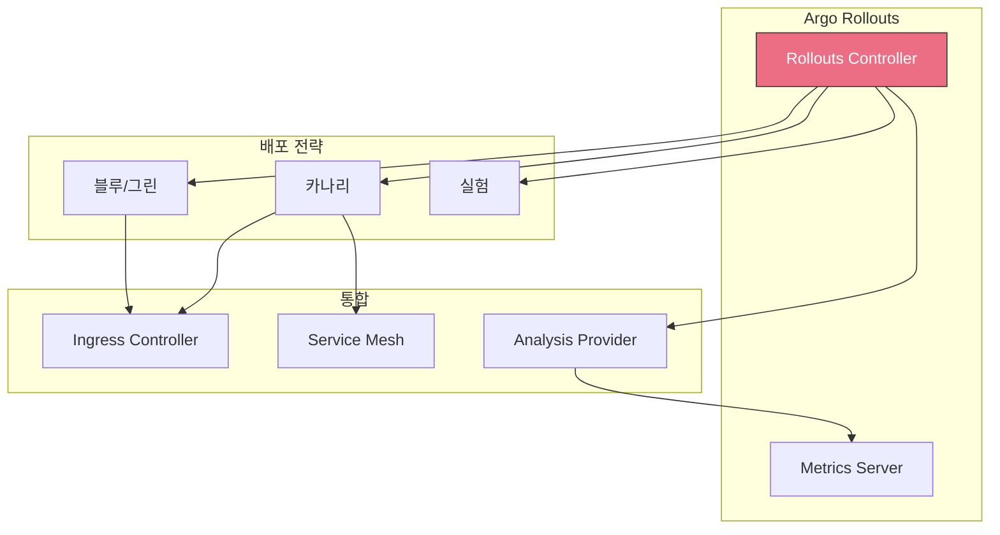
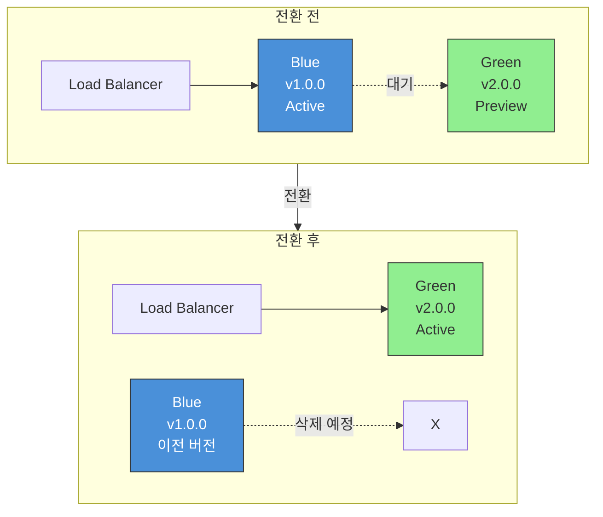
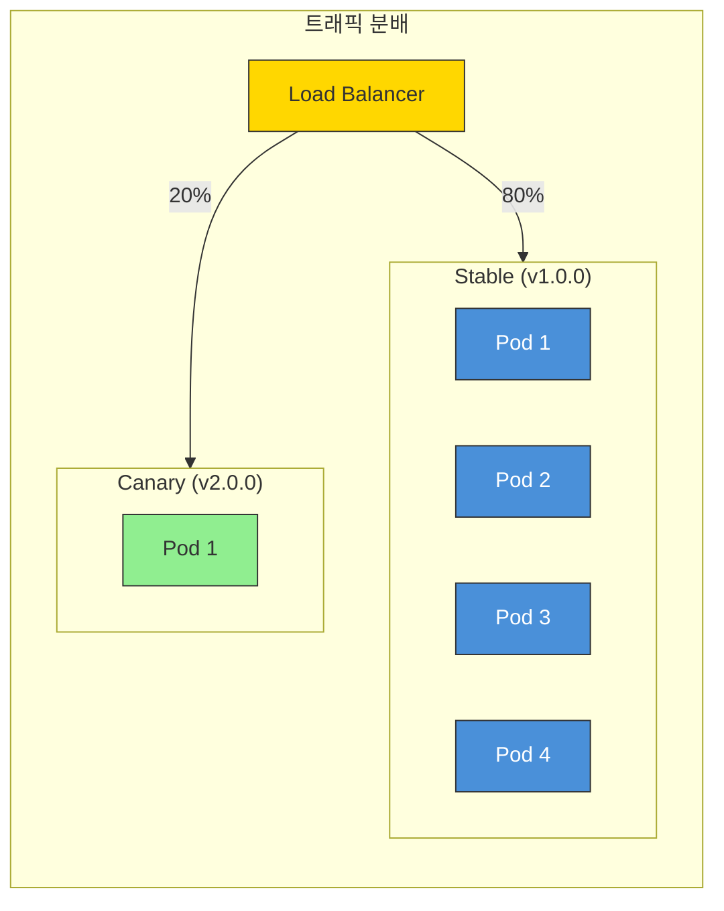
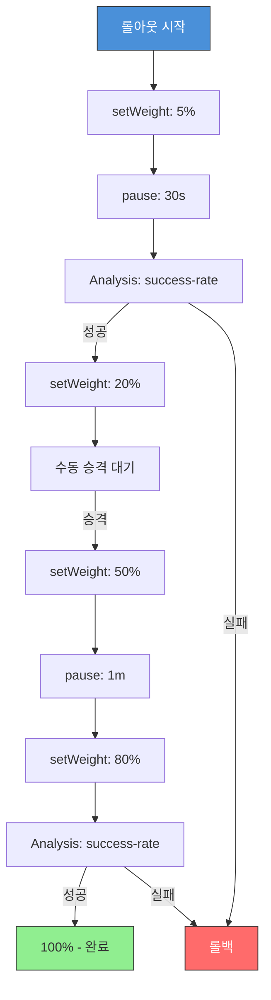

# ArgoCD 트래픽 관리

> **지원 버전**: ArgoCD v2.9+, Argo Rollouts v1.6+
> **마지막 업데이트**: 2026년 2월 21일

## 목차

- [Argo Rollouts 개요](#argo-rollouts-개요)
- [설치](#설치)
- [블루/그린 배포](#블루그린-배포)
- [카나리 배포](#카나리-배포)
- [Analysis와 자동 롤백](#analysis와-자동-롤백)
- [인그레스 컨트롤러 통합](#인그레스-컨트롤러-통합)
- [EKS에서의 프로그레시브 딜리버리](#eks에서의-프로그레시브-딜리버리)
- [Experiment](#experiment)

## Argo Rollouts 개요

Argo Rollouts는 Kubernetes를 위한 프로그레시브 딜리버리(Progressive Delivery) 컨트롤러입니다. 블루/그린 배포, 카나리 배포, 실험, 자동 롤백 등 고급 배포 전략을 제공합니다.



### 주요 특징

| 특징 | 설명 |
|------|------|
| **블루/그린 배포** | 완전한 환경 전환 |
| **카나리 배포** | 점진적 트래픽 이동 |
| **Analysis** | 메트릭 기반 자동 승격/롤백 |
| **트래픽 관리** | 인그레스 및 서비스 메시 통합 |
| **실험** | A/B 테스트 지원 |

## 설치

### Argo Rollouts 설치

```bash
# 네임스페이스 생성
kubectl create namespace argo-rollouts

# Rollouts 설치
kubectl apply -n argo-rollouts -f https://github.com/argoproj/argo-rollouts/releases/latest/download/install.yaml

# 설치 확인
kubectl get pods -n argo-rollouts
```

### kubectl 플러그인 설치

```bash
# macOS
brew install argoproj/tap/kubectl-argo-rollouts

# Linux
curl -LO https://github.com/argoproj/argo-rollouts/releases/latest/download/kubectl-argo-rollouts-linux-amd64
chmod +x ./kubectl-argo-rollouts-linux-amd64
sudo mv ./kubectl-argo-rollouts-linux-amd64 /usr/local/bin/kubectl-argo-rollouts

# 확인
kubectl argo rollouts version
```

### Rollouts Dashboard

```bash
# 대시보드 시작
kubectl argo rollouts dashboard

# 브라우저에서 접속: http://localhost:3100
```

## 블루/그린 배포

블루/그린 배포는 두 개의 동일한 환경(블루=현재, 그린=새로운)을 유지하고 트래픽을 즉시 전환합니다.



### 블루/그린 Rollout 정의

```yaml
apiVersion: argoproj.io/v1alpha1
kind: Rollout
metadata:
  name: my-app-bluegreen
  namespace: production
spec:
  replicas: 5
  revisionHistoryLimit: 3
  selector:
    matchLabels:
      app: my-app
  template:
    metadata:
      labels:
        app: my-app
    spec:
      containers:
        - name: app
          image: my-app:v2.0.0
          ports:
            - containerPort: 8080
          readinessProbe:
            httpGet:
              path: /health
              port: 8080
            initialDelaySeconds: 5
            periodSeconds: 5
          resources:
            requests:
              cpu: 100m
              memory: 128Mi
            limits:
              cpu: 500m
              memory: 512Mi

  strategy:
    blueGreen:
      # Active 서비스 (프로덕션 트래픽)
      activeService: my-app-active

      # Preview 서비스 (새 버전 테스트용)
      previewService: my-app-preview

      # 자동 승격 활성화 (false면 수동 승격)
      autoPromotionEnabled: true

      # 자동 승격 전 대기 시간
      autoPromotionSeconds: 60

      # 스케일다운 지연 (롤백 대비)
      scaleDownDelaySeconds: 300

      # 스케일다운 수정 제한
      scaleDownDelayRevisionLimit: 2

      # Preview 레플리카 수 (기본값: spec.replicas와 동일)
      previewReplicaCount: 2

      # Analysis 실행 (선택)
      prePromotionAnalysis:
        templates:
          - templateName: smoke-test
        args:
          - name: service-name
            value: my-app-preview
      postPromotionAnalysis:
        templates:
          - templateName: success-rate
        args:
          - name: service-name
            value: my-app-active

      # Anti-affinity (Preview와 Active를 다른 노드에 배치)
      antiAffinity:
        preferredDuringSchedulingIgnoredDuringExecution:
          weight: 100
---
apiVersion: v1
kind: Service
metadata:
  name: my-app-active
  namespace: production
spec:
  selector:
    app: my-app
  ports:
    - port: 80
      targetPort: 8080
---
apiVersion: v1
kind: Service
metadata:
  name: my-app-preview
  namespace: production
spec:
  selector:
    app: my-app
  ports:
    - port: 80
      targetPort: 8080
```

### 블루/그린 관리 명령어

```bash
# 롤아웃 상태 확인
kubectl argo rollouts get rollout my-app-bluegreen -n production

# 실시간 모니터링
kubectl argo rollouts get rollout my-app-bluegreen -n production -w

# 수동 승격 (autoPromotionEnabled: false인 경우)
kubectl argo rollouts promote my-app-bluegreen -n production

# 롤백
kubectl argo rollouts undo my-app-bluegreen -n production

# 특정 리비전으로 롤백
kubectl argo rollouts undo my-app-bluegreen -n production --to-revision=2

# 중단
kubectl argo rollouts abort my-app-bluegreen -n production

# 재시작
kubectl argo rollouts retry rollout my-app-bluegreen -n production
```

## 카나리 배포

카나리 배포는 새 버전에 점진적으로 트래픽을 이동시켜 위험을 최소화합니다.



### 카나리 Rollout 정의

```yaml
apiVersion: argoproj.io/v1alpha1
kind: Rollout
metadata:
  name: my-app-canary
  namespace: production
spec:
  replicas: 10
  revisionHistoryLimit: 5
  selector:
    matchLabels:
      app: my-app
  template:
    metadata:
      labels:
        app: my-app
    spec:
      containers:
        - name: app
          image: my-app:v2.0.0
          ports:
            - containerPort: 8080
          readinessProbe:
            httpGet:
              path: /health
              port: 8080
            initialDelaySeconds: 5
            periodSeconds: 5
          livenessProbe:
            httpGet:
              path: /health
              port: 8080
            initialDelaySeconds: 10
            periodSeconds: 10
          resources:
            requests:
              cpu: 100m
              memory: 128Mi
            limits:
              cpu: 500m
              memory: 512Mi

  strategy:
    canary:
      # Canary 서비스 (선택)
      canaryService: my-app-canary

      # Stable 서비스 (선택)
      stableService: my-app-stable

      # 최대 Surge (추가 Pod 수)
      maxSurge: "25%"

      # 최대 Unavailable
      maxUnavailable: 0

      # 카나리 단계
      steps:
        # 5% 트래픽으로 시작
        - setWeight: 5

        # 30초 대기
        - pause:
            duration: 30s

        # Analysis 실행
        - analysis:
            templates:
              - templateName: success-rate
            args:
              - name: service-name
                value: my-app-canary

        # 20% 트래픽
        - setWeight: 20

        # 수동 승격 대기
        - pause: {}

        # 50% 트래픽
        - setWeight: 50

        # 1분 대기
        - pause:
            duration: 1m

        # 80% 트래픽
        - setWeight: 80

        # 최종 Analysis
        - analysis:
            templates:
              - templateName: success-rate
            args:
              - name: service-name
                value: my-app-canary

        # 100% (자동 완료)

      # 트래픽 라우팅 (인그레스/서비스 메시)
      trafficRouting:
        # NGINX Ingress
        nginx:
          stableIngress: my-app-ingress
          annotationPrefix: nginx.ingress.kubernetes.io
          additionalIngressAnnotations:
            canary-by-header: X-Canary
            canary-by-header-value: "true"

      # 또는 AWS ALB
      # trafficRouting:
      #   alb:
      #     ingress: my-app-ingress
      #     servicePort: 80

      # 또는 Istio
      # trafficRouting:
      #   istio:
      #     virtualService:
      #       name: my-app-vsvc
      #       routes:
      #         - primary

      # Analysis 실패 시 롤백
      abortScaleDownDelaySeconds: 30
---
apiVersion: v1
kind: Service
metadata:
  name: my-app-stable
  namespace: production
spec:
  selector:
    app: my-app
  ports:
    - port: 80
      targetPort: 8080
---
apiVersion: v1
kind: Service
metadata:
  name: my-app-canary
  namespace: production
spec:
  selector:
    app: my-app
  ports:
    - port: 80
      targetPort: 8080
```

### 카나리 단계 상세



## Analysis와 자동 롤백

Analysis는 배포 중 메트릭을 수집하고 평가하여 자동으로 승격하거나 롤백합니다.

### AnalysisTemplate 정의

```yaml
apiVersion: argoproj.io/v1alpha1
kind: AnalysisTemplate
metadata:
  name: success-rate
  namespace: production
spec:
  args:
    - name: service-name
    - name: threshold
      value: "0.95"  # 기본값 95%
  metrics:
    - name: success-rate
      # 성공 조건
      successCondition: result[0] >= {{ args.threshold }}
      # 실패 조건
      failureCondition: result[0] < 0.90
      # 불확정 결과 제한
      failureLimit: 3
      # 재시도 간격
      interval: 30s
      # 측정 횟수
      count: 10
      # Prometheus 쿼리
      provider:
        prometheus:
          address: http://prometheus-server.monitoring:80
          query: |
            sum(rate(
              http_requests_total{
                service="{{ args.service-name }}",
                status=~"2.."
              }[5m]
            )) /
            sum(rate(
              http_requests_total{
                service="{{ args.service-name }}"
              }[5m]
            ))
---
apiVersion: argoproj.io/v1alpha1
kind: AnalysisTemplate
metadata:
  name: error-rate
  namespace: production
spec:
  args:
    - name: service-name
  metrics:
    - name: error-rate
      successCondition: result[0] < 0.05  # 에러율 5% 미만
      failureLimit: 3
      interval: 30s
      count: 5
      provider:
        prometheus:
          address: http://prometheus-server.monitoring:80
          query: |
            sum(rate(
              http_requests_total{
                service="{{ args.service-name }}",
                status=~"5.."
              }[5m]
            )) /
            sum(rate(
              http_requests_total{
                service="{{ args.service-name }}"
              }[5m]
            ))
---
apiVersion: argoproj.io/v1alpha1
kind: AnalysisTemplate
metadata:
  name: latency-p99
  namespace: production
spec:
  args:
    - name: service-name
    - name: threshold-ms
      value: "500"
  metrics:
    - name: latency-p99
      successCondition: result[0] < {{ args.threshold-ms }}
      failureLimit: 3
      interval: 30s
      count: 5
      provider:
        prometheus:
          address: http://prometheus-server.monitoring:80
          query: |
            histogram_quantile(0.99,
              sum(rate(
                http_request_duration_seconds_bucket{
                  service="{{ args.service-name }}"
                }[5m]
              )) by (le)
            ) * 1000
```

### Web Analysis (HTTP 체크)

```yaml
apiVersion: argoproj.io/v1alpha1
kind: AnalysisTemplate
metadata:
  name: smoke-test
  namespace: production
spec:
  args:
    - name: service-name
  metrics:
    - name: smoke-test
      successCondition: result.status == "OK"
      failureLimit: 3
      interval: 10s
      count: 3
      provider:
        web:
          url: "http://{{ args.service-name }}.production/health"
          timeoutSeconds: 10
          headers:
            - key: X-Test
              value: "true"
          jsonPath: "{$.status}"
```

### Datadog Provider

```yaml
apiVersion: argoproj.io/v1alpha1
kind: AnalysisTemplate
metadata:
  name: datadog-success-rate
  namespace: production
spec:
  args:
    - name: service-name
  metrics:
    - name: success-rate
      successCondition: default(result, 0) >= 0.95
      failureLimit: 3
      interval: 1m
      count: 5
      provider:
        datadog:
          apiVersion: v2
          query: |
            sum:trace.http.request.hits{
              service:{{ args.service-name }},
              http.status_code:2*
            }.as_count() /
            sum:trace.http.request.hits{
              service:{{ args.service-name }}
            }.as_count()
```

### CloudWatch Provider (AWS)

```yaml
apiVersion: argoproj.io/v1alpha1
kind: AnalysisTemplate
metadata:
  name: cloudwatch-errors
  namespace: production
spec:
  args:
    - name: load-balancer-name
  metrics:
    - name: error-count
      successCondition: result < 10
      failureLimit: 3
      interval: 1m
      count: 5
      provider:
        cloudWatch:
          metricDataQueries:
            - id: errors
              expression: |
                SELECT SUM(HTTPCode_ELB_5XX_Count)
                FROM SCHEMA("AWS/ApplicationELB", LoadBalancer)
                WHERE LoadBalancer = '{{ args.load-balancer-name }}'
```

### 복합 Analysis (여러 메트릭 결합)

```yaml
apiVersion: argoproj.io/v1alpha1
kind: AnalysisTemplate
metadata:
  name: comprehensive-analysis
  namespace: production
spec:
  args:
    - name: service-name
  metrics:
    # 성공률
    - name: success-rate
      successCondition: result[0] >= 0.95
      failureLimit: 3
      interval: 30s
      count: 10
      provider:
        prometheus:
          address: http://prometheus:80
          query: |
            sum(rate(http_requests_total{service="{{ args.service-name }}",status=~"2.."}[5m])) /
            sum(rate(http_requests_total{service="{{ args.service-name }}"}[5m]))

    # 에러율
    - name: error-rate
      successCondition: result[0] < 0.05
      failureLimit: 3
      interval: 30s
      count: 10
      provider:
        prometheus:
          address: http://prometheus:80
          query: |
            sum(rate(http_requests_total{service="{{ args.service-name }}",status=~"5.."}[5m])) /
            sum(rate(http_requests_total{service="{{ args.service-name }}"}[5m]))

    # 지연 시간
    - name: latency-p99
      successCondition: result[0] < 500
      failureLimit: 3
      interval: 30s
      count: 10
      provider:
        prometheus:
          address: http://prometheus:80
          query: |
            histogram_quantile(0.99, sum(rate(http_request_duration_seconds_bucket{service="{{ args.service-name }}"}[5m])) by (le)) * 1000
```

### AnalysisRun 확인

```bash
# AnalysisRun 목록
kubectl get analysisrun -n production

# AnalysisRun 상세
kubectl describe analysisrun my-app-canary-xxx -n production

# AnalysisRun 로그
kubectl argo rollouts get rollout my-app-canary -n production
```

## 인그레스 컨트롤러 통합

### NGINX Ingress

```yaml
apiVersion: argoproj.io/v1alpha1
kind: Rollout
metadata:
  name: my-app
  namespace: production
spec:
  replicas: 5
  selector:
    matchLabels:
      app: my-app
  template:
    metadata:
      labels:
        app: my-app
    spec:
      containers:
        - name: app
          image: my-app:v2.0.0
          ports:
            - containerPort: 8080
  strategy:
    canary:
      canaryService: my-app-canary
      stableService: my-app-stable
      trafficRouting:
        nginx:
          stableIngress: my-app-ingress
          annotationPrefix: nginx.ingress.kubernetes.io
          additionalIngressAnnotations:
            canary-by-header: X-Canary
            canary-by-header-value: "true"
      steps:
        - setWeight: 10
        - pause: {duration: 1m}
        - setWeight: 30
        - pause: {duration: 2m}
        - setWeight: 60
        - pause: {duration: 2m}
---
apiVersion: networking.k8s.io/v1
kind: Ingress
metadata:
  name: my-app-ingress
  namespace: production
  annotations:
    nginx.ingress.kubernetes.io/rewrite-target: /
spec:
  ingressClassName: nginx
  rules:
    - host: my-app.example.com
      http:
        paths:
          - path: /
            pathType: Prefix
            backend:
              service:
                name: my-app-stable
                port:
                  number: 80
```

### AWS ALB

```yaml
apiVersion: argoproj.io/v1alpha1
kind: Rollout
metadata:
  name: my-app
  namespace: production
spec:
  replicas: 5
  selector:
    matchLabels:
      app: my-app
  template:
    metadata:
      labels:
        app: my-app
    spec:
      containers:
        - name: app
          image: my-app:v2.0.0
          ports:
            - containerPort: 8080
  strategy:
    canary:
      canaryService: my-app-canary
      stableService: my-app-stable
      trafficRouting:
        alb:
          ingress: my-app-ingress
          servicePort: 80
          # 가중 대상 그룹 활성화
          annotationPrefix: alb.ingress.kubernetes.io
      steps:
        - setWeight: 10
        - pause: {duration: 1m}
        - setWeight: 30
        - pause: {duration: 2m}
        - setWeight: 60
        - pause: {duration: 2m}
---
apiVersion: networking.k8s.io/v1
kind: Ingress
metadata:
  name: my-app-ingress
  namespace: production
  annotations:
    kubernetes.io/ingress.class: alb
    alb.ingress.kubernetes.io/scheme: internet-facing
    alb.ingress.kubernetes.io/target-type: ip
    alb.ingress.kubernetes.io/actions.weighted-routing: |
      {
        "type": "forward",
        "forwardConfig": {
          "targetGroups": [
            {
              "serviceName": "my-app-stable",
              "servicePort": 80,
              "weight": 100
            },
            {
              "serviceName": "my-app-canary",
              "servicePort": 80,
              "weight": 0
            }
          ]
        }
      }
spec:
  rules:
    - host: my-app.example.com
      http:
        paths:
          - path: /
            pathType: Prefix
            backend:
              service:
                name: weighted-routing
                port:
                  name: use-annotation
```

### Istio VirtualService

```yaml
apiVersion: argoproj.io/v1alpha1
kind: Rollout
metadata:
  name: my-app
  namespace: production
spec:
  replicas: 5
  selector:
    matchLabels:
      app: my-app
  template:
    metadata:
      labels:
        app: my-app
    spec:
      containers:
        - name: app
          image: my-app:v2.0.0
          ports:
            - containerPort: 8080
  strategy:
    canary:
      canaryService: my-app-canary
      stableService: my-app-stable
      trafficRouting:
        istio:
          virtualService:
            name: my-app-vsvc
            routes:
              - primary  # VirtualService의 route 이름
          destinationRule:
            name: my-app-destrule
            canarySubsetName: canary
            stableSubsetName: stable
      steps:
        - setWeight: 10
        - pause: {duration: 1m}
        - analysis:
            templates:
              - templateName: success-rate
        - setWeight: 30
        - pause: {duration: 2m}
        - setWeight: 60
        - pause: {duration: 2m}
---
apiVersion: networking.istio.io/v1beta1
kind: VirtualService
metadata:
  name: my-app-vsvc
  namespace: production
spec:
  hosts:
    - my-app.example.com
  gateways:
    - my-gateway
  http:
    - name: primary
      route:
        - destination:
            host: my-app-stable
            port:
              number: 80
          weight: 100
        - destination:
            host: my-app-canary
            port:
              number: 80
          weight: 0
---
apiVersion: networking.istio.io/v1beta1
kind: DestinationRule
metadata:
  name: my-app-destrule
  namespace: production
spec:
  host: my-app
  subsets:
    - name: stable
      labels:
        app: my-app
    - name: canary
      labels:
        app: my-app
```

## EKS에서의 프로그레시브 딜리버리

### EKS 최적화 설정

```yaml
apiVersion: argoproj.io/v1alpha1
kind: Rollout
metadata:
  name: my-app
  namespace: production
  annotations:
    eks.amazonaws.com/fargate-profile: production
spec:
  replicas: 5
  selector:
    matchLabels:
      app: my-app
  template:
    metadata:
      labels:
        app: my-app
    spec:
      serviceAccountName: my-app
      containers:
        - name: app
          image: 123456789012.dkr.ecr.ap-northeast-2.amazonaws.com/my-app:v2.0.0
          ports:
            - containerPort: 8080
          env:
            - name: AWS_REGION
              value: ap-northeast-2
          resources:
            requests:
              cpu: 200m
              memory: 256Mi
            limits:
              cpu: 1000m
              memory: 1Gi
          readinessProbe:
            httpGet:
              path: /health
              port: 8080
            initialDelaySeconds: 10
            periodSeconds: 5
          livenessProbe:
            httpGet:
              path: /health
              port: 8080
            initialDelaySeconds: 15
            periodSeconds: 10
      # Spot 인스턴스 고려
      topologySpreadConstraints:
        - maxSkew: 1
          topologyKey: topology.kubernetes.io/zone
          whenUnsatisfiable: ScheduleAnyway
          labelSelector:
            matchLabels:
              app: my-app

  strategy:
    canary:
      canaryService: my-app-canary
      stableService: my-app-stable
      trafficRouting:
        alb:
          ingress: my-app-ingress
          servicePort: 80
      steps:
        - setWeight: 5
        - pause: {duration: 30s}
        - analysis:
            templates:
              - templateName: cloudwatch-success-rate
            args:
              - name: alb-name
                value: "app/my-app-alb/xxx"
        - setWeight: 20
        - pause: {duration: 1m}
        - setWeight: 50
        - pause: {duration: 2m}
        - setWeight: 80
        - pause: {duration: 2m}
---
# CloudWatch Analysis Template
apiVersion: argoproj.io/v1alpha1
kind: AnalysisTemplate
metadata:
  name: cloudwatch-success-rate
  namespace: production
spec:
  args:
    - name: alb-name
  metrics:
    - name: success-rate
      successCondition: result >= 0.99
      failureLimit: 3
      interval: 30s
      count: 10
      provider:
        cloudWatch:
          metricDataQueries:
            - id: requests
              metricStat:
                metric:
                  namespace: AWS/ApplicationELB
                  metricName: RequestCount
                  dimensions:
                    - name: LoadBalancer
                      value: "{{ args.alb-name }}"
                period: 60
                stat: Sum
            - id: errors
              metricStat:
                metric:
                  namespace: AWS/ApplicationELB
                  metricName: HTTPCode_Target_5XX_Count
                  dimensions:
                    - name: LoadBalancer
                      value: "{{ args.alb-name }}"
                period: 60
                stat: Sum
            - id: success_rate
              expression: "1 - (errors / requests)"
```

## Experiment

Experiment는 여러 버전을 동시에 실행하여 A/B 테스트를 수행합니다.

```yaml
apiVersion: argoproj.io/v1alpha1
kind: Experiment
metadata:
  name: my-experiment
  namespace: production
spec:
  # 실험 지속 시간
  duration: 1h

  # 분석 진행 전 대기 시간
  progressDeadlineSeconds: 600

  # 템플릿
  templates:
    # Baseline (현재 버전)
    - name: baseline
      replicas: 2
      selector:
        matchLabels:
          app: my-app
          version: baseline
      template:
        metadata:
          labels:
            app: my-app
            version: baseline
        spec:
          containers:
            - name: app
              image: my-app:v1.0.0
              ports:
                - containerPort: 8080

    # Canary (새 버전)
    - name: canary
      replicas: 2
      selector:
        matchLabels:
          app: my-app
          version: canary
      template:
        metadata:
          labels:
            app: my-app
            version: canary
        spec:
          containers:
            - name: app
              image: my-app:v2.0.0
              ports:
                - containerPort: 8080

  # 분석
  analyses:
    - name: compare-versions
      templateName: compare-analysis
      args:
        - name: baseline-hash
          valueFrom:
            podTemplateHashValue: Baseline
        - name: canary-hash
          valueFrom:
            podTemplateHashValue: Canary
```

### 롤아웃에서 Experiment 사용

```yaml
apiVersion: argoproj.io/v1alpha1
kind: Rollout
metadata:
  name: my-app
  namespace: production
spec:
  replicas: 5
  selector:
    matchLabels:
      app: my-app
  template:
    metadata:
      labels:
        app: my-app
    spec:
      containers:
        - name: app
          image: my-app:v2.0.0
  strategy:
    canary:
      steps:
        - setWeight: 20
        - pause: {duration: 30s}
        # 실험 실행
        - experiment:
            duration: 10m
            templates:
              - name: baseline
                specRef: stable
                replicas: 2
              - name: canary
                specRef: canary
                replicas: 2
            analyses:
              - name: compare
                templateName: compare-analysis
        - setWeight: 50
        - pause: {duration: 2m}
```

## 다음 단계

1. **[프로젝트와 RBAC](06-projects-rbac.md)**: Rollout에 대한 접근 제어를 구성하세요.

2. **[보안](07-security.md)**: 시크릿 관리와 SSO 통합을 설정하세요.

3. **[모범 사례](09-best-practices.md)**: 프로그레시브 딜리버리 모범 사례를 학습하세요.

## 참고 자료

- [Argo Rollouts 문서](https://argoproj.github.io/argo-rollouts/)
- [블루/그린 배포](https://argoproj.github.io/argo-rollouts/features/bluegreen/)
- [카나리 배포](https://argoproj.github.io/argo-rollouts/features/canary/)
- [Analysis](https://argoproj.github.io/argo-rollouts/features/analysis/)
- [트래픽 관리](https://argoproj.github.io/argo-rollouts/features/traffic-management/)

## 퀴즈

이 장에서 배운 내용을 테스트하려면 [트래픽 관리 퀴즈](../../quizzes/gitops/argocd/05-traffic-management-quiz.md)를 풀어보세요.
