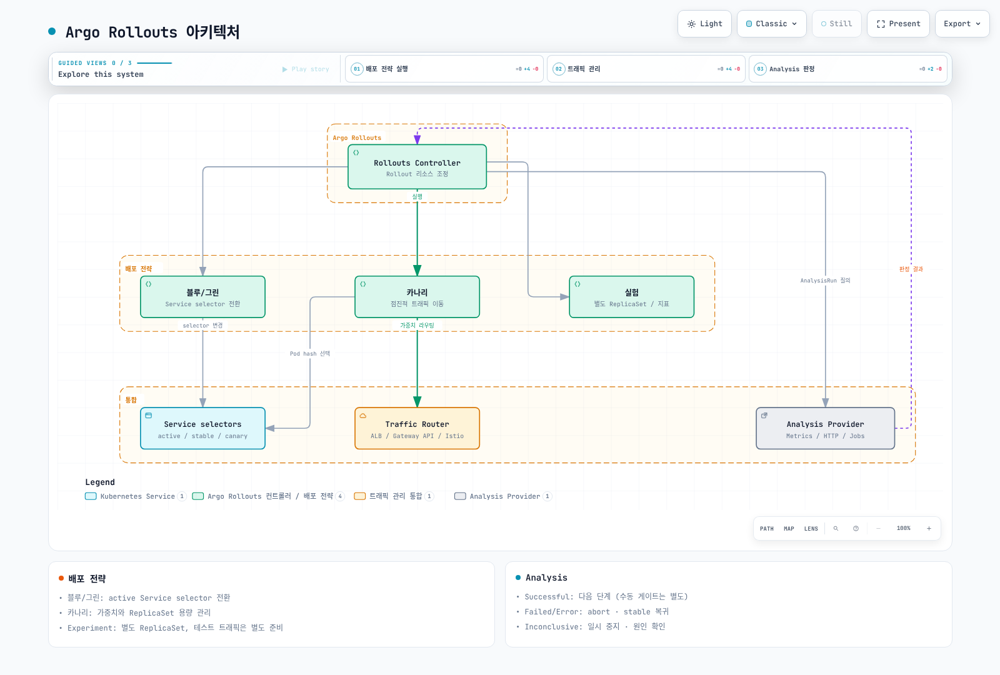
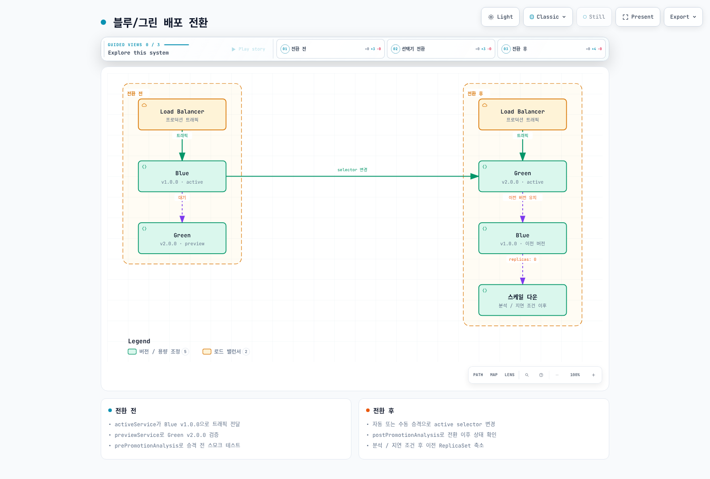
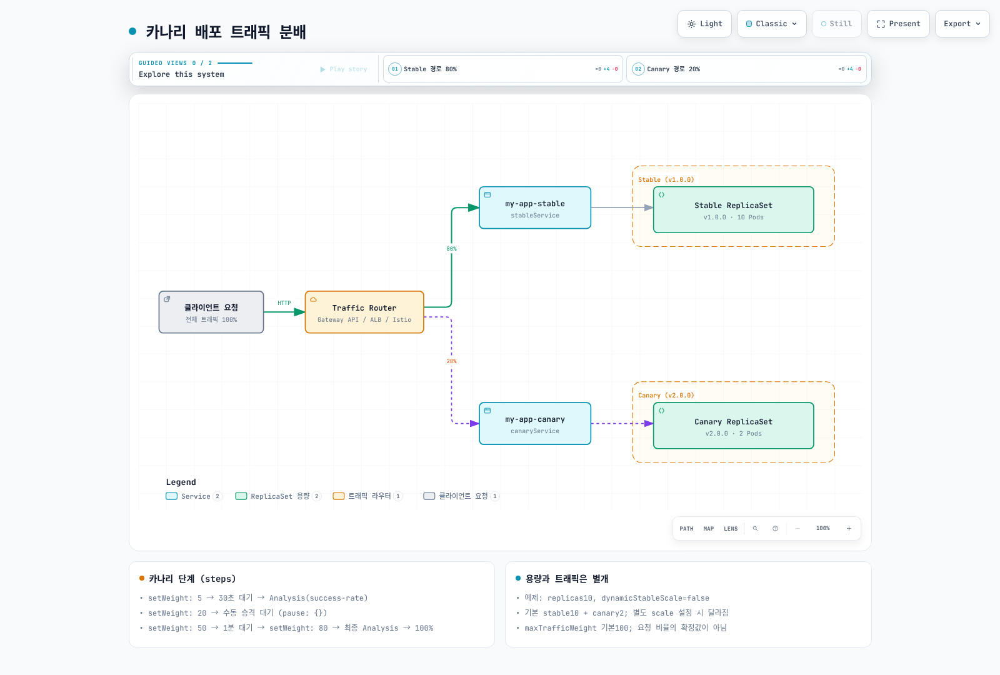
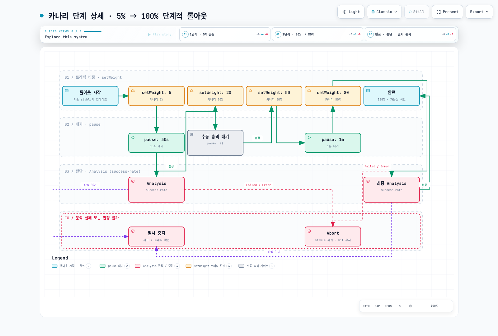

# ArgoCD 트래픽 관리

> **검토 기준**: Argo CD 3.5.2, Argo Rollouts 1.10.0, Helm chart 2.43.1
> **마지막 업데이트**: 2026년 9월 11일

## 목차

- [Argo Rollouts 개요](#argo-rollouts-개요)
- [설치](#설치)
- [블루/그린 배포](#블루그린-배포)
- [카나리 배포](#카나리-배포)
- [Analysis와 자동 롤백](#analysis와-자동-롤백)
- [인그레스 컨트롤러 통합](#인그레스-컨트롤러-통합)
- [EKS에서의 프로그레시브 딜리버리](#eks에서의-프로그레시브-딜리버리)
- [Experiment](#experiment)

## Argo Rollouts 개요

Argo Rollouts는 Kubernetes를 위한 프로그레시브 딜리버리(Progressive Delivery) 컨트롤러입니다. 블루/그린 배포, 카나리 배포, 실험, 자동 롤백 등 고급 배포 전략을 제공합니다.



[🔍 인터랙티브 다이어그램 보기](https://www.atomai.click/kubernetes-docs/archmaps/ko-gitops-argocd-05-traffic-management-0.html)

### 주요 특징

| 특징 | 설명 |
|------|------|
| **블루/그린 배포** | active Service selector를 새 ReplicaSet으로 전환 |
| **카나리 배포** | 점진적 트래픽 이동 |
| **Analysis** | 메트릭 기반 자동 승격/롤백 |
| **트래픽 관리** | 인그레스 및 서비스 메시 통합 |
| **실험** | A/B 테스트 지원 |

## 설치

### Argo Rollouts 설치

```bash
set -euo pipefail
ROLLOUTS_VERSION=v1.10.0
kubectl create namespace argo-rollouts --dry-run=client -o yaml | kubectl apply -f -
kubectl apply --server-side -n argo-rollouts \
  -f "https://github.com/argoproj/argo-rollouts/releases/download/${ROLLOUTS_VERSION}/install.yaml"
kubectl rollout status deployment/argo-rollouts -n argo-rollouts --timeout=180s
```

### kubectl 플러그인 설치

```bash
set -euo pipefail
ROLLOUTS_VERSION=v1.10.0
case "$(uname -s)" in
  Linux) plugin_os=linux ;;
  Darwin) plugin_os=darwin ;;
  *) echo "Use the Windows release asset for Windows" >&2; exit 1 ;;
esac
case "$(uname -m)" in
  x86_64) plugin_arch=amd64 ;;
  aarch64|arm64) plugin_arch=arm64 ;;
  *) echo "Unsupported architecture" >&2; exit 1 ;;
esac
plugin_asset="kubectl-argo-rollouts-${plugin_os}-${plugin_arch}"
plugin_dir="$(mktemp -d)"
trap 'rm -rf "$plugin_dir"' EXIT
plugin_base="https://github.com/argoproj/argo-rollouts/releases/download/${ROLLOUTS_VERSION}"
curl --fail --location --retry 3 "$plugin_base/$plugin_asset" -o "$plugin_dir/$plugin_asset"
curl --fail --location --retry 3 "$plugin_base/argo-rollouts-checksums.txt" -o "$plugin_dir/checksums.txt"
awk -v artifact="$plugin_asset" '$2 == artifact { print }' "$plugin_dir/checksums.txt" > "$plugin_dir/selected.sha256"
test -s "$plugin_dir/selected.sha256"
(
  cd "$plugin_dir"
  if [ "$plugin_os" = darwin ]; then
    shasum -a 256 -c selected.sha256
  else
    sha256sum -c selected.sha256
  fi
)
install -d "$HOME/.local/bin"
install -m 0755 "$plugin_dir/$plugin_asset" "$HOME/.local/bin/kubectl-argo-rollouts"
export PATH="$HOME/.local/bin:$PATH"
kubectl argo rollouts version
```

### Helm 설치 대안

위 매니페스트 설치 또는 Helm 중 하나로 컨트롤러 소유권을 관리합니다. 아래 values를 `rollouts-values.yaml`로 저장합니다. `AWS_REGION`은 CloudWatch 분석을 수행하는 **Rollouts 컨트롤러**의 설정입니다. 사용하지 않으면 해당 env 항목을 제거할 수 있습니다.

```yaml
controller:
  replicas: 2
  metrics:
    enabled: true
    serviceMonitor:
      enabled: false  # Enable after installing/configuring Prometheus Operator
  pdb:
    enabled: true
    minAvailable: 1
  extraEnv:
    - name: AWS_REGION
      value: ap-northeast-2

dashboard:
  enabled: false
```

```bash
helm repo add argo https://argoproj.github.io/argo-helm
helm repo update argo
helm upgrade --install argo-rollouts argo/argo-rollouts \
  --version 2.43.1 --namespace argo-rollouts --create-namespace \
  --values rollouts-values.yaml --wait --timeout 5m
```

ServiceMonitor를 활성화하려면 CRD와 Prometheus의 selector를 먼저 준비합니다. Dashboard를 공유해야 한다면 인증·인가 계층을 별도로 구성합니다. CLI `dashboard`는 1.10.0에서 모든 인터페이스에 바인딩하고 현재 kubeconfig 권한으로 동작합니다. 출력의 localhost URL이 접근을 제한하지는 않습니다.

### Dashboard 접근 (Helm 설치)

Helm 설치를 선택한 경우 읽기 전용 ClusterIP Dashboard를 활성화하고 loopback 주소로 포트 포워딩합니다.

```bash
helm upgrade --install argo-rollouts argo/argo-rollouts \
  --version 2.43.1 --namespace argo-rollouts --create-namespace \
  --values rollouts-values.yaml \
  --set dashboard.enabled=true --set dashboard.readonly=true \
  --set dashboard.service.type=ClusterIP --set dashboard.ingress.enabled=false \
  --wait --timeout 5m
kubectl port-forward --address 127.0.0.1 -n argo-rollouts \
  service/argo-rollouts-dashboard 3100:3100
```

`http://127.0.0.1:3100/rollouts`에 접속합니다. 공유 접속에는 별도의 인증·인가 프록시가 필요합니다.

## 블루/그린 배포

아래의 `my-app`, `myregistry`, ECR 계정·태그와 메트릭 이름은 애플리케이션에 맞게 교체하는 예시입니다. Namespace, 이미지 접근 권한, readiness 응답, 메트릭 수집과 AnalysisTemplate을 준비한 뒤 각 시나리오를 독립적으로 실행합니다. 최초 배포에는 이전 stable ReplicaSet이 없으므로, 먼저 v1을 정상 배포한 뒤 Git의 이미지 버전을 v2로 변경해야 전환 과정을 관찰할 수 있습니다.

Argo CD는 Git의 Rollout 명세를 적용하고, 별도의 Rollouts 컨트롤러가 ReplicaSet과 트래픽 전환을 관리합니다. 분석 실패 시 abort/이전 stable로 트래픽 복귀는 Git 커밋이나 데이터베이스 변경을 되돌리는 작업과 다릅니다.

블루/그린은 같은 Rollout의 이전·새 ReplicaSet을 함께 유지하고 active Service의 selector를 새 버전으로 변경합니다. 클러스터 전체 환경을 복제하는 기능은 아니며, kube-proxy·데이터플레인·로드밸런서 전파와 연결 드레이닝에는 시간이 걸립니다.



[🔍 인터랙티브 다이어그램 보기](https://www.atomai.click/kubernetes-docs/archmaps/ko-gitops-argocd-05-traffic-management-1.html)

### 블루/그린 Rollout 정의

```yaml
apiVersion: argoproj.io/v1alpha1
kind: Rollout
metadata:
  name: my-app-bluegreen
  namespace: production
spec:
  replicas: 5
  revisionHistoryLimit: 3
  selector:
    matchLabels:
      app: my-app
  template:
    metadata:
      labels:
        app: my-app
    spec:
      containers:
      - name: app
        image: my-app:v2.0.0
        ports:
        - containerPort: 8080
        readinessProbe:
          httpGet:
            path: /health
            port: 8080
          initialDelaySeconds: 5
          periodSeconds: 5
        resources:
          requests:
            cpu: 100m
            memory: 128Mi
          limits:
            cpu: 500m
            memory: 512Mi
  strategy:
    blueGreen:
      activeService: my-app-active
      previewService: my-app-preview
      autoPromotionEnabled: true
      scaleDownDelayRevisionLimit: 2
      previewReplicaCount: 2
      prePromotionAnalysis:
        templates:
        - templateName: smoke-test
        args:
        - name: service-name
          value: my-app-preview
      postPromotionAnalysis:
        templates:
        - templateName: success-rate
        args:
        - name: service-name
          value: my-app-active
      antiAffinity:
        preferredDuringSchedulingIgnoredDuringExecution:
          weight: 100
---
apiVersion: v1
kind: Service
metadata:
  name: my-app-active
  namespace: production
spec:
  selector:
    app: my-app
  ports:
  - port: 80
    targetPort: 8080
---
apiVersion: v1
kind: Service
metadata:
  name: my-app-preview
  namespace: production
spec:
  selector:
    app: my-app
  ports:
  - port: 80
    targetPort: 8080
```

`previewReplicaCount`는 승격 전 용량이며 실제 전환 전에 새 ReplicaSet이 `spec.replicas`까지 확장됩니다. `autoPromotionEnabled: false`이면 `autoPromotionSeconds`는 적용되지 않습니다. 필수 pre-promotion 분석과 별도의 시간 기반 승격 예제를 구분하기 위해 본 예제에서는 autoPromotionSeconds도 생략합니다. 예제는 post-promotion 분석이 완료되기 전에 고정 scale-down 시간이 분석을 취소하지 않도록 `scaleDownDelaySeconds`를 생략했습니다. ALB 대상 등록/해제와 연결 드레이닝까지 포함한 무중단을 보장하는 설정은 아니므로 실제 데이터플레인에서 검증해야 합니다.

### 블루/그린 관리 명령어

```bash
# 롤아웃 상태 확인
kubectl argo rollouts get rollout my-app-bluegreen -n production

# 실시간 모니터링
kubectl argo rollouts get rollout my-app-bluegreen -n production -w

# 수동 승격 (autoPromotionEnabled: false인 경우)
kubectl argo rollouts promote my-app-bluegreen -n production

# 롤백
kubectl argo rollouts undo my-app-bluegreen -n production

# 특정 리비전으로 롤백
kubectl argo rollouts undo my-app-bluegreen -n production --to-revision=2

# 중단
kubectl argo rollouts abort my-app-bluegreen -n production

# 중단된 롤아웃 재시도 (Pod restart와 다름)
kubectl argo rollouts retry rollout my-app-bluegreen -n production
```

## 카나리 배포

트래픽 라우터가 있으면 `setWeight`는 라우터의 상대 가중치를 바꿉니다. 라우터가 없으면 ReplicaSet 수를 가능한 비율로 조정하는 근사치이며 요청의 정확한 비율을 보장하지 않습니다. 라우터 사용 시 stable Pod 수와 트래픽 가중치는 독립적입니다.

카나리 배포는 새 버전에 점진적으로 트래픽을 이동시켜 위험을 최소화합니다.



[🔍 인터랙티브 다이어그램 보기](https://www.atomai.click/kubernetes-docs/archmaps/ko-gitops-argocd-05-traffic-management-2.html)

라우터 기반 카나리는 기본적으로 stable 용량 100%를 유지하므로, 업데이트 중 stable과 canary 두 세트의 용량을 고려합니다. `maxSurge`는 라우터 없는 basic canary의 desired replica 계산용이며 전체 트래픽 라우팅 모드의 Pod 수 상한이 아닙니다. `maxUnavailable`은 이 모드에서도 이전 ReplicaSet 축소를 제한할 수 있습니다.

### 카나리 Rollout 정의

아래 예제에는 뒤의 Gateway API 플러그인 0.17.0 설정, `my-app-route` HTTPRoute, 준비된 Gateway와 stable/canary Service가 필요합니다. HTTPRoute의 Accepted/ResolvedRefs 상태와 실제 데이터플레인 준비 상태를 확인합니다.

```yaml
apiVersion: argoproj.io/v1alpha1
kind: Rollout
metadata:
  name: my-app-canary
  namespace: production
spec:
  replicas: 10
  revisionHistoryLimit: 5
  selector:
    matchLabels:
      app: my-app
  template:
    metadata:
      labels:
        app: my-app
    spec:
      containers:
      - name: app
        image: my-app:v2.0.0
        ports:
        - containerPort: 8080
        readinessProbe:
          httpGet:
            path: /health
            port: 8080
          initialDelaySeconds: 5
          periodSeconds: 5
        livenessProbe:
          httpGet:
            path: /health
            port: 8080
          initialDelaySeconds: 10
          periodSeconds: 10
        resources:
          requests:
            cpu: 100m
            memory: 128Mi
          limits:
            cpu: 500m
            memory: 512Mi
  strategy:
    canary:
      canaryService: my-app-canary
      stableService: my-app-stable
      maxUnavailable: 0
      steps:
      - setWeight: 5
      - pause:
          duration: 30s
      - analysis:
          templates:
          - templateName: success-rate
          args:
          - name: service-name
            value: my-app-canary
      - setWeight: 20
      - pause: {}
      - setWeight: 50
      - pause:
          duration: 1m
      - setWeight: 80
      - analysis:
          templates:
          - templateName: success-rate
          args:
          - name: service-name
            value: my-app-canary
      trafficRouting:
        plugins:
          argoproj-labs/gatewayAPI:
            httpRoute: my-app-route
            namespace: production
      abortScaleDownDelaySeconds: 30
---
apiVersion: v1
kind: Service
metadata:
  name: my-app-stable
  namespace: production
spec:
  selector:
    app: my-app
  ports:
  - port: 80
    targetPort: 8080
---
apiVersion: v1
kind: Service
metadata:
  name: my-app-canary
  namespace: production
spec:
  selector:
    app: my-app
  ports:
  - port: 80
    targetPort: 8080
```

### 카나리 단계 상세



[🔍 인터랙티브 다이어그램 보기](https://www.atomai.click/kubernetes-docs/archmaps/ko-gitops-argocd-05-traffic-management-3.html)

## Analysis와 자동 롤백

Analysis는 배포 중 메트릭을 수집하고 평가하여 자동으로 승격하거나 롤백합니다.

이 예제의 `http_requests_total`, `http_request_duration_seconds_bucket`과 `service`/버전 레이블은 애플리케이션 계측과 scrape 설정으로 제공해야 합니다. `prometheus.monitoring.svc.cluster.local:9090` 역시 실제 Prometheus Service에 맞게 변경합니다. 오류율·지연 기준과 측정 기간은 예시이며 최소 요청 수와 SLO 기준을 함께 설계합니다.

`failureLimit`는 허용할 **실패 측정** 횟수이며, 3이면 네 번째 실패 측정에서 한도를 초과합니다. API 호출 오류는 별도의 consecutiveErrorLimit, 판정 불가는 inconclusiveLimit으로 처리합니다. 아래 조건은 빈 벡터·NaN·Infinity·결측값을 성공으로 바꾸지 않고 Inconclusive로 멈춥니다. `count`는 HTTP 요청 수가 아니라 측정 횟수이고, 중첩 조회 기간은 독립 표본을 의미하지 않습니다.

### AnalysisTemplate 정의

```yaml
apiVersion: argoproj.io/v1alpha1
kind: AnalysisTemplate
metadata:
  name: success-rate
  namespace: production
spec:
  args:
  - name: service-name
  - name: threshold
    value: '0.95'
  metrics:
  - name: success-rate
    successCondition: result != nil && len(result) == 1 && !isNaN(result[0]) && !isInf(result[0]) && result[0] >=
      0 && result[0] <= 1 && result[0] >= {{ args.threshold }}
    failureCondition: result != nil && len(result) == 1 && !isNaN(result[0]) && !isInf(result[0]) && result[0] >=
      0 && result[0] <= 1 && result[0] < 0.90
    failureLimit: 3
    interval: 30s
    count: 10
    provider:
      prometheus:
        address: http://prometheus.monitoring.svc.cluster.local:9090
        query: |
          (sum(rate(
            http_requests_total{
              service="{{ args.service-name }}",
              status=~"2.."
            }[5m]
          )) or vector(0)) /
          sum(rate(
            http_requests_total{
              service="{{ args.service-name }}"
            }[5m]
          ))
    inconclusiveLimit: 0
---
apiVersion: argoproj.io/v1alpha1
kind: AnalysisTemplate
metadata:
  name: error-rate
  namespace: production
spec:
  args:
  - name: service-name
  metrics:
  - name: error-rate
    successCondition: result != nil && len(result) == 1 && !isNaN(result[0]) && !isInf(result[0]) && result[0] >=
      0 && result[0] <= 1 && result[0] < 0.05
    failureLimit: 3
    interval: 30s
    count: 5
    provider:
      prometheus:
        address: http://prometheus.monitoring.svc.cluster.local:9090
        query: |
          (sum(rate(
            http_requests_total{
              service="{{ args.service-name }}",
              status=~"5.."
            }[5m]
          )) or vector(0)) /
          sum(rate(
            http_requests_total{
              service="{{ args.service-name }}"
            }[5m]
          ))
    failureCondition: result != nil && len(result) == 1 && !isNaN(result[0]) && !isInf(result[0]) && result[0] >=
      0 && result[0] <= 1 && result[0] >= 0.05
    inconclusiveLimit: 0
---
apiVersion: argoproj.io/v1alpha1
kind: AnalysisTemplate
metadata:
  name: latency-p99
  namespace: production
spec:
  args:
  - name: service-name
  - name: threshold-ms
    value: '500'
  metrics:
  - name: latency-p99
    successCondition: result != nil && len(result) == 1 && !isNaN(result[0]) && !isInf(result[0]) && result[0] <
      {{ args.threshold-ms }}
    failureLimit: 3
    interval: 30s
    count: 5
    provider:
      prometheus:
        address: http://prometheus.monitoring.svc.cluster.local:9090
        query: |
          histogram_quantile(0.99,
            sum(rate(
              http_request_duration_seconds_bucket{
                service="{{ args.service-name }}"
              }[5m]
            )) by (le)
          ) * 1000
    failureCondition: result != nil && len(result) == 1 && !isNaN(result[0]) && !isInf(result[0]) && result[0] >=
      {{ args.threshold-ms }}
    inconclusiveLimit: 0
```

### Web Analysis (HTTP 체크)

서비스가 HTTP 성공 응답에 `{"status":"OK"}` JSON을 반환한다고 가정합니다. jsonPath는 status 문자열을 추출하므로 비교 대상은 `result.status`가 아니라 `result`입니다. 실제 응답 계약에 맞게 수정합니다.

```yaml
apiVersion: argoproj.io/v1alpha1
kind: AnalysisTemplate
metadata:
  name: smoke-test
  namespace: production
spec:
  args:
  - name: service-name
  metrics:
  - name: smoke-test
    successCondition: result == "OK"
    failureLimit: 3
    interval: 10s
    count: 3
    provider:
      web:
        url: http://{{ args.service-name }}.production.svc.cluster.local/health
        timeoutSeconds: 10
        headers:
        - key: X-Test
          value: 'true'
        jsonPath: '{$.status}'
    failureCondition: result != nil && result != "OK"
```

### Datadog Provider

Datadog v2의 수식은 `queries`와 `formula`로 분리합니다. 해당 AnalysisTemplate Namespace의 datadog Secret에 address/api-key/app-key를 준비합니다. `asFloat(default(result, -1))`로 결측값을 정상 오류율 0과 구분하고 typed 함수 호출의 nil 오류도 피합니다.

```yaml
apiVersion: argoproj.io/v1alpha1
kind: AnalysisTemplate
metadata:
  name: datadog-success-rate
  namespace: production
spec:
  args:
  - name: service-name
  metrics:
  - name: success-rate
    successCondition: |
      let rate = asFloat(default(result, -1));
      !isNaN(rate) && !isInf(rate) && rate >= 0 && rate <= 1 && rate >= 0.95
    failureLimit: 3
    interval: 1m
    count: 5
    provider:
      datadog:
        apiVersion: v2
        interval: 5m
        aggregator: sum
        secretRef:
          name: datadog
          namespaced: true
        queries:
          a: sum:trace.http.request.hits{service:{{args.service-name}},http.status_code:2*}.as_count()
          b: sum:trace.http.request.hits{service:{{args.service-name}}}.as_count()
        formula: a / b
    failureCondition: |
      let rate = asFloat(default(result, -1));
      !isNaN(rate) && !isInf(rate) && rate >= 0 && rate <= 1 && rate < 0.95
    inconclusiveLimit: 0
```

### CloudWatch Provider (AWS)

`cloudwatch:GetMetricData` 권한과 AWS_REGION은 워크로드가 아니라 Rollouts **컨트롤러 ServiceAccount의 IAM 역할/환경**에 설정합니다. EKS에서는 IRSA 또는 EKS Pod Identity를 사용하고, EKS 제어판 IAM 역할에 권한을 추가하는 것으로 대체하지 않습니다. 아래 예제는 조회 데이터의 Complete 상태와 실제 datapoint 개수를 확인합니다. StatusCode는 SDK의 문자열 별칭 타입이므로 expr에서 `string(...)`으로 변환합니다.

LoadBalancer dimension은 짧은 이름이 아닌 `app/이름/ID` 형식입니다. ReturnData는 계산식 한 개에만 true로 두어 result[0]의 의미를 고정합니다. 요청이 없는 구간의 -1은 Inconclusive로 처리합니다. ALB 전체 지표는 카나리 오류를 희석할 수 있으므로 버전별 애플리케이션 지표를 대체하지 않습니다.


```yaml
apiVersion: argoproj.io/v1alpha1
kind: AnalysisTemplate
metadata:
  name: cloudwatch-errors
  namespace: production
spec:
  args:
  - name: load-balancer-name
  metrics:
  - name: error-count
    successCondition: 'result != nil && len(result) == 1 && string(result[0].StatusCode) == "Complete" && len(result[0].Values)
      >= 3 && all(result[0].Values, {# >= 0 && # < 10})'
    failureCondition: result != nil && len(result) == 1 && string(result[0].StatusCode) == "Complete" && len(result[0].Values)
      > 0 && any(result[0].Values, {# >= 10})
    failureLimit: 3
    inconclusiveLimit: 0
    interval: 1m
    count: 5
    provider:
      cloudWatch:
        interval: 5m
        metricDataQueries:
        - id: evaluated
          expression: IF(FILL(requests,0) > 0, FILL(errors,0), -1)
          returnData: true
        - id: requests
          metricStat:
            metric:
              namespace: AWS/ApplicationELB
              metricName: RequestCount
              dimensions: &id001
              - name: LoadBalancer
                value: '{{ args.load-balancer-name }}'
            period: 60
            stat: Sum
          returnData: false
        - id: errors
          metricStat:
            metric:
              namespace: AWS/ApplicationELB
              metricName: HTTPCode_ELB_5XX_Count
              dimensions: *id001
            period: 60
            stat: Sum
          returnData: false
```

### 복합 Analysis (여러 메트릭 결합)

```yaml
apiVersion: argoproj.io/v1alpha1
kind: AnalysisTemplate
metadata:
  name: comprehensive-analysis
  namespace: production
spec:
  args:
  - name: service-name
  metrics:
  - name: success-rate
    successCondition: result != nil && len(result) == 1 && !isNaN(result[0]) && !isInf(result[0]) && result[0] >=
      0 && result[0] <= 1 && result[0] >= 0.95
    failureLimit: 3
    interval: 30s
    count: 10
    provider:
      prometheus:
        address: http://prometheus.monitoring.svc.cluster.local:9090
        query: |
          (sum(rate(http_requests_total{service="{{ args.service-name }}",status=~"2.."}[5m])) or vector(0)) /
          sum(rate(http_requests_total{service="{{ args.service-name }}"}[5m]))
    failureCondition: result != nil && len(result) == 1 && !isNaN(result[0]) && !isInf(result[0]) && result[0] >=
      0 && result[0] <= 1 && result[0] < 0.95
    inconclusiveLimit: 0
  - name: error-rate
    successCondition: result != nil && len(result) == 1 && !isNaN(result[0]) && !isInf(result[0]) && result[0] >=
      0 && result[0] <= 1 && result[0] < 0.05
    failureLimit: 3
    interval: 30s
    count: 10
    provider:
      prometheus:
        address: http://prometheus.monitoring.svc.cluster.local:9090
        query: |
          (sum(rate(http_requests_total{service="{{ args.service-name }}",status=~"5.."}[5m])) or vector(0)) /
          sum(rate(http_requests_total{service="{{ args.service-name }}"}[5m]))
    failureCondition: result != nil && len(result) == 1 && !isNaN(result[0]) && !isInf(result[0]) && result[0] >=
      0 && result[0] <= 1 && result[0] >= 0.05
    inconclusiveLimit: 0
  - name: latency-p99
    successCondition: result != nil && len(result) == 1 && !isNaN(result[0]) && !isInf(result[0]) && result[0] <
      500
    failureLimit: 3
    interval: 30s
    count: 10
    provider:
      prometheus:
        address: http://prometheus.monitoring.svc.cluster.local:9090
        query: |
          histogram_quantile(0.99, sum(rate(http_request_duration_seconds_bucket{service="{{ args.service-name }}"}[5m])) by (le)) * 1000
    failureCondition: result != nil && len(result) == 1 && !isNaN(result[0]) && !isInf(result[0]) && result[0] >=
      500
    inconclusiveLimit: 0
```

### AnalysisRun 확인

```bash
# AnalysisRun 목록
kubectl get analysisrun -n production

# AnalysisRun 상세
kubectl describe analysisrun my-app-canary-xxx -n production

# AnalysisRun 로그
kubectl argo rollouts get rollout my-app-canary -n production
```

## 인그레스 컨트롤러 통합

Argo Rollouts는 네이티브 트래픽 provider와 플러그인 확장을 지원합니다. Kong처럼 네이티브 통합이 없는 provider는 **Gateway API 플러그인**을 경유합니다.

| Provider | 연동 방식 | 비고 |
|---|---|---|
| NGINX Ingress | 네이티브 (`trafficRouting.nginx`) | `canary-weight` 애노테이션 직접 조작 |
| AWS ALB | 네이티브 (`trafficRouting.alb`) | Ingress backend port가 `use-annotation`이어야 함 — [실측 검증 결과](#실측-검증-결과-eks) 참고 |
| Istio | 네이티브 (`trafficRouting.istio`) | VirtualService/DestinationRule 직접 조작 |
| SMI | 네이티브 (`trafficRouting.smi`) | SMI 프로젝트 자체가 유지보수 종료 상태 — 신규 도입 비권장 |
| Ambassador, Apache APISIX, Traefik | 네이티브 | 이 문서에서는 다루지 않음, [공식 문서](https://argo-rollouts.readthedocs.io/en/stable/features/traffic-management/) 참고 |
| **Kong**, 기타 Gateway API 호환 구현체(kgateway 등) | **Gateway API 플러그인** (`trafficRouting.plugins`) | 네이티브 `trafficRouting.kong` 필드는 존재하지 않음 |

### NGINX Ingress (기존 설치 참고)

커뮤니티 ingress-nginx는 2026년 3월 유지보수가 종료되어 아래 설정은 기존 설치의 마이그레이션 검토용입니다. 신규 예제는 Gateway API 경로를 사용합니다. 각 라우팅 예제는 위 stable/canary Service와 같은 Namespace를 사용합니다.

```yaml
apiVersion: argoproj.io/v1alpha1
kind: Rollout
metadata:
  name: my-app
  namespace: production
spec:
  replicas: 5
  selector:
    matchLabels:
      app: my-app
  template:
    metadata:
      labels:
        app: my-app
    spec:
      containers:
      - name: app
        image: my-app:v2.0.0
        ports:
        - containerPort: 8080
  strategy:
    canary:
      canaryService: my-app-canary
      stableService: my-app-stable
      trafficRouting:
        nginx:
          stableIngress: my-app-ingress
          annotationPrefix: nginx.ingress.kubernetes.io
          additionalIngressAnnotations:
            canary-by-header: X-Canary
            canary-by-header-value: 'true'
      steps:
      - setWeight: 10
      - pause:
          duration: 1m
      - setWeight: 30
      - pause:
          duration: 2m
      - setWeight: 60
      - pause:
          duration: 2m
---
apiVersion: networking.k8s.io/v1
kind: Ingress
metadata:
  name: my-app-ingress
  namespace: production
  annotations:
    nginx.ingress.kubernetes.io/rewrite-target: /
spec:
  ingressClassName: nginx
  rules:
  - host: my-app.example.com
    http:
      paths:
      - path: /
        pathType: Prefix
        backend:
          service:
            name: my-app-stable
            port:
              number: 80
```

### AWS ALB

```yaml
apiVersion: argoproj.io/v1alpha1
kind: Rollout
metadata:
  name: my-app
  namespace: production
spec:
  replicas: 5
  selector:
    matchLabels:
      app: my-app
  template:
    metadata:
      labels:
        app: my-app
    spec:
      containers:
      - name: app
        image: my-app:v2.0.0
        ports:
        - containerPort: 8080
  strategy:
    canary:
      canaryService: my-app-canary
      stableService: my-app-stable
      trafficRouting:
        alb:
          ingress: my-app-ingress
          servicePort: 80
          annotationPrefix: alb.ingress.kubernetes.io
          rootService: weighted-routing
      steps:
      - setWeight: 10
      - pause:
          duration: 1m
      - setWeight: 30
      - pause:
          duration: 2m
      - setWeight: 60
      - pause:
          duration: 2m
---
apiVersion: networking.k8s.io/v1
kind: Ingress
metadata:
  name: my-app-ingress
  namespace: production
  annotations:
    alb.ingress.kubernetes.io/scheme: internal
    alb.ingress.kubernetes.io/target-type: ip
    alb.ingress.kubernetes.io/actions.weighted-routing: |
      {
        "type": "forward",
        "forwardConfig": {
          "targetGroups": [
            {
              "serviceName": "my-app-stable",
              "servicePort": 80,
              "weight": 100
            },
            {
              "serviceName": "my-app-canary",
              "servicePort": 80,
              "weight": 0
            }
          ]
        }
      }
spec:
  rules:
  - host: my-app.example.com
    http:
      paths:
      - path: /
        pathType: Prefix
        backend:
          service:
            name: weighted-routing
            port:
              name: use-annotation
  ingressClassName: alb
```

> **ALB 설정 확인**: Rollout의 rootService(미지정 시 stableService), actions 애노테이션 이름과 Ingress backend 이름이 일치해야 합니다. backend port의 `name: use-annotation`은 가중치 action을 선택합니다. 실제 port 번호를 넣으면 일반 Service backend로 해석되므로 원하는 action이 적용되지 않으며, Service 유무에 따라 조정 오류나 다른 라우팅이 발생할 수 있습니다. 컨트롤러 이벤트와 `aws elbv2 describe-rules`의 ForwardConfig를 확인합니다.

### Istio VirtualService

```yaml
apiVersion: argoproj.io/v1alpha1
kind: Rollout
metadata:
  name: my-app
  namespace: production
spec:
  replicas: 5
  selector:
    matchLabels:
      app: my-app
  template:
    metadata:
      labels:
        app: my-app
    spec:
      containers:
      - name: app
        image: my-app:v2.0.0
        ports:
        - containerPort: 8080
  strategy:
    canary:
      canaryService: my-app-canary
      stableService: my-app-stable
      trafficRouting:
        istio:
          virtualService:
            name: my-app-vsvc
            routes:
            - primary
      steps:
      - setWeight: 10
      - pause:
          duration: 1m
      - analysis:
          templates:
          - templateName: success-rate
          args:
          - name: service-name
            value: my-app-canary
      - setWeight: 30
      - pause:
          duration: 2m
      - setWeight: 60
      - pause:
          duration: 2m
---
apiVersion: networking.istio.io/v1
kind: VirtualService
metadata:
  name: my-app-vsvc
  namespace: production
spec:
  hosts:
  - my-app.example.com
  gateways:
  - my-gateway
  http:
  - name: primary
    route:
    - destination:
        host: my-app-stable
        port:
          number: 80
      weight: 100
    - destination:
        host: my-app-canary
        port:
          number: 80
      weight: 0
```

### Gateway API 플러그인 (HTTPRoute)

Kong·kgateway 등의 Gateway API 경로는 argoproj-labs가 유지하는 [Gateway API 플러그인](https://github.com/argoproj-labs/rollouts-plugin-trafficrouter-gatewayapi)을 통해 지원됩니다. Traefik은 네이티브 TraefikService 통합도 있으며 Gateway API 경로를 선택하면 이 플러그인을 사용할 수 있습니다. 이 문서는 플러그인 0.17.0(2026-09-01) 기준입니다. HTTPRoute의 backendRefs weight를 갱신하며 다른 Route 종류와 헤더 라우팅은 CRD 및 구현체의 지원 범위를 확인해야 합니다. Route 상태와 실제 요청 분포를 함께 검증합니다.

아래 바이너리는 **컨트롤러 Pod가 실행되는 Linux amd64 노드용**입니다. arm64 노드에서는 파일명을 gatewayapi-plugin-linux-arm64로 바꾸고 SHA256 `5221279f7bf2c9b2c0ff6ed7ff12718ecce1d4892f1ff5e5224bb723cfd0fd92`를 사용합니다. Helm 설치는 같은 목록을 controller.trafficRouterPlugins values로 관리합니다. 매니페스트 설치는 기존 ConfigMap data에 병합하고 컨트롤러를 재시작합니다. Role 예제는 해당 Namespace의 HTTPRoute weight 조작 범위이며 다른 Route 종류/헤더 생성 기능에는 별도 권한 검토가 필요합니다.

플러그인 설치 — 컨트롤러가 기동 시 바이너리를 다운로드하도록 `argo-rollouts-config` ConfigMap에 등록합니다:

```yaml
apiVersion: v1
kind: ConfigMap
metadata:
  name: argo-rollouts-config
  namespace: argo-rollouts
data:
  trafficRouterPlugins: |
    - name: argoproj-labs/gatewayAPI
      location: https://github.com/argoproj-labs/rollouts-plugin-trafficrouter-gatewayapi/releases/download/v0.17.0/gatewayapi-plugin-linux-amd64
      sha256: 1904ca787d33107c140521899d61fff030ee75d99908bd175fca5a4647759061
---
apiVersion: rbac.authorization.k8s.io/v1
kind: Role
metadata:
  name: argo-rollouts-gateway-api-plugin
  namespace: production
rules:
- apiGroups:
  - ''
  resources:
  - services
  verbs:
  - get
- apiGroups:
  - gateway.networking.k8s.io
  resources:
  - httproutes
  verbs:
  - get
  - list
  - update
  - patch
---
apiVersion: rbac.authorization.k8s.io/v1
kind: RoleBinding
metadata:
  name: argo-rollouts-gateway-api-plugin
  namespace: production
roleRef:
  apiGroup: rbac.authorization.k8s.io
  kind: Role
  name: argo-rollouts-gateway-api-plugin
subjects:
- kind: ServiceAccount
  name: argo-rollouts
  namespace: argo-rollouts
```

Rollout에서는 `trafficRouting.plugins`로 HTTPRoute를 지정합니다:

```yaml
apiVersion: argoproj.io/v1alpha1
kind: Rollout
metadata:
  name: my-app
  namespace: production
spec:
  replicas: 5
  selector:
    matchLabels:
      app: my-app
  template:
    metadata:
      labels:
        app: my-app
    spec:
      containers:
      - name: app
        image: my-app:v2.0.0
        ports:
        - containerPort: 8080
  strategy:
    canary:
      stableService: my-app-stable
      canaryService: my-app-canary
      trafficRouting:
        plugins:
          argoproj-labs/gatewayAPI:
            httpRoute: my-app-route
            namespace: production
      steps:
      - setWeight: 20
      - pause:
          duration: 1m
      - setWeight: 50
      - pause:
          duration: 1m
      - setWeight: 100
---
apiVersion: gateway.networking.k8s.io/v1
kind: HTTPRoute
metadata:
  name: my-app-route
  namespace: production
spec:
  parentRefs:
  - name: my-gateway
  rules:
  - backendRefs:
    - name: my-app-stable
      kind: Service
      port: 80
      weight: 100
    - name: my-app-canary
      kind: Service
      port: 80
      weight: 0
```

플러그인이 Rollout의 각 `setWeight` 단계마다 이 두 `backendRefs[].weight` 값을 직접 갱신합니다.

### Kong (Gateway API 플러그인 경유)

Kong Ingress Controller(KIC)는 Argo Rollouts에 네이티브로 통합되어 있지 않습니다 — 위 Gateway API 플러그인을 그대로 사용합니다. 아래는 Kong Operator 없이 독립 KIC가 기존 Kong Gateway 데이터플레인을 관리하는 구성입니다. 이때 unmanaged 애노테이션을 사용하며 Kong Operator의 managed Gateway 구성과 구분합니다:

```yaml
apiVersion: gateway.networking.k8s.io/v1
kind: GatewayClass
metadata:
  name: kong
  annotations:
    konghq.com/gatewayclass-unmanaged: "true"   # 필수 — 없으면 Gateway가 "Waiting for controller"에서 멈춤
spec:
  controllerName: konghq.com/kic-gateway-controller   # KIC의 IngressClass controller 문자열과 다르므로 주의
```

이후 [Gateway API 플러그인](#gateway-api-플러그인-httproute) 설정을 그대로 적용하면 됩니다 (Rollout/HTTPRoute YAML 동일).

### 실측 검증 결과 (EKS)

기존 문서는 EKS 1.36, Rollouts 1.9.0, AWS Load Balancer Controller 3.2.1, Istio 1.30, KIC 3.5와 플러그인0.16.0으로 아래 결과를 보고했습니다. 원시 로그·요청 수·측정 기간·실행 매니페스트가 첨부되지 않아 이번 정적 검토에서 재현 검증하지 못했습니다. 표는 당시 기록이며 1.10.0/0.17.0 실행 결과나 즉시 전환·무중단 보증으로 사용하지 않습니다.

| Provider | 검증 항목 | 결과 |
|---|---|---|
| NGINX | `canary-weight` 애노테이션 20→50→100% 전환 | ✅ 정상 — 실시간 curl 트래픽 비율이 애노테이션 값과 일치 |
| Istio | VirtualService weight 20→50→100% 전환, `abort` 시 즉시 0% 복귀 | ✅ 정상 — curl 비율이 weight와 일치, abort 후 트래픽이 즉시 이전 stable로 전환 |
| AWS ALB | 리스너 규칙 forward weight 전환, `aws elbv2 describe-rules`로 실제 AWS 상태 대조 | ✅ 정상 (단, 위 [`use-annotation` 주의](#aws-alb) 필요) |
| Kong (Gateway API 플러그인) | `HTTPRoute.backendRefs[].weight` 전환, Kong 데이터플레인 실제 트래픽 확인 | ✅ 정상 — 단, `gatewayclass-unmanaged` 애노테이션과 정확한 `controllerName` 설정이 까다로움 (위 참고) |

Argo CD가 Rollout과 라우팅 리소스를 관리한다면 Rollouts 소유 필드만 정밀하게 diff 제외 대상으로 검토합니다. 해당 ALB action 애노테이션, Istio route weight, HTTPRoute backend weight, Service의 rollouts-pod-template-hash selector가 예입니다. 전체 spec/manager를 제외하지 않습니다. sync에서도 유지하려면 RespectIgnoreDifferences=true와 기존 리소스에만 적용되는 제약을 고려합니다.

## EKS에서의 프로그레시브 딜리버리

### EKS EC2 노드 예제

아래는 EC2 노드용 예제입니다. Rollout 메타데이터의 Fargate 프로파일 애노테이션은 Pod를 Fargate에 배치하지 않습니다. Fargate를 사용하려면 별도의 프로파일 selector, Pod 레이블과 지원되는 리소스/스케줄링 구성을 적용합니다. topologySpreadConstraints는 분산 힌트이며 Spot 중단 대응을 대신하지 않습니다.

ALB 보조 게이트는 1분당100요청 이상인 datapoint3개를 요구하는 예시입니다. 데이터 수집 지연·저트래픽에서는 Inconclusive가 정상일 수 있으므로 서비스 트래픽에 맞게 조정합니다. 같은 분석에 canary Service의 success-rate 템플릿도 결합하며, 두 템플릿의 메트릭 이름은 중복되지 않게 유지합니다.

```yaml
apiVersion: argoproj.io/v1alpha1
kind: Rollout
metadata:
  name: my-app
  namespace: production
  annotations: {}
spec:
  replicas: 5
  selector:
    matchLabels:
      app: my-app
  template:
    metadata:
      labels:
        app: my-app
    spec:
      containers:
      - name: app
        image: 123456789012.dkr.ecr.ap-northeast-2.amazonaws.com/my-app:v2.0.0
        ports:
        - containerPort: 8080
        resources:
          requests:
            cpu: 200m
            memory: 256Mi
          limits:
            cpu: 1000m
            memory: 1Gi
        readinessProbe:
          httpGet:
            path: /health
            port: 8080
          initialDelaySeconds: 10
          periodSeconds: 5
        livenessProbe:
          httpGet:
            path: /health
            port: 8080
          initialDelaySeconds: 15
          periodSeconds: 10
      topologySpreadConstraints:
      - maxSkew: 1
        topologyKey: topology.kubernetes.io/zone
        whenUnsatisfiable: ScheduleAnyway
        labelSelector:
          matchLabels:
            app: my-app
      automountServiceAccountToken: false
  strategy:
    canary:
      canaryService: my-app-canary
      stableService: my-app-stable
      trafficRouting:
        alb:
          ingress: my-app-ingress
          servicePort: 80
          rootService: weighted-routing
      steps:
      - setWeight: 5
      - pause:
          duration: 30s
      - analysis:
          templates:
          - templateName: cloudwatch-success-rate
          - templateName: success-rate
          args:
          - name: alb-name
            value: app/my-app-alb/xxx
          - name: service-name
            value: my-app-canary
      - setWeight: 20
      - pause:
          duration: 1m
      - setWeight: 50
      - pause:
          duration: 2m
      - setWeight: 80
      - pause:
          duration: 2m
---
apiVersion: argoproj.io/v1alpha1
kind: AnalysisTemplate
metadata:
  name: cloudwatch-success-rate
  namespace: production
spec:
  args:
  - name: alb-name
  metrics:
  - name: alb-success-rate
    successCondition: 'result != nil && len(result) == 1 && string(result[0].StatusCode) == "Complete" && len(result[0].Values)
      >= 3 && all(result[0].Values, {# >= 0.99 && # <= 1})'
    failureCondition: 'result != nil && len(result) == 1 && string(result[0].StatusCode) == "Complete" && len(result[0].Values)
      > 0 && any(result[0].Values, {# >= 0 && # < 0.99})'
    failureLimit: 3
    inconclusiveLimit: 0
    interval: 1m
    count: 5
    provider:
      cloudWatch:
        interval: 5m
        metricDataQueries:
        - id: evaluated
          expression: IF(FILL(requests,0) >= 100, 1 - FILL(errors,0) / requests, -1)
          returnData: true
        - id: requests
          metricStat:
            metric:
              namespace: AWS/ApplicationELB
              metricName: RequestCount
              dimensions: &id001
              - name: LoadBalancer
                value: '{{ args.alb-name }}'
            period: 60
            stat: Sum
          returnData: false
        - id: errors
          metricStat:
            metric:
              namespace: AWS/ApplicationELB
              metricName: HTTPCode_Target_5XX_Count
              dimensions: *id001
            period: 60
            stat: Sum
          returnData: false
```

## Experiment

1.10.0에서는 `requiredForCompletion: true`인 분석이 모두 성공하면 `duration` 전에 실험이 끝날 수 있습니다. 기간을 최소 검증 시간으로 가정하지 않습니다. Experiment Pod의 트래픽 격리도 Service/라우터 selector를 명시적으로 확인해야 합니다. 상세 상태 전이와 정리 지연은 [심층 분석](10-rollouts-experiment.md)을 참고하세요.

Experiment는 여러 버전을 동시에 실행하여 A/B 테스트를 수행합니다.

> 리소스 생성 체인, 이름 규칙, 트래픽 격리, AnalysisRun 판정의 상세 동작은 [Rollouts Experiment 심층 분석](10-rollouts-experiment.md)을 참고하세요.

**사전 준비:** Experiment 자체는 사용자 트래픽을 만들지 않습니다. 테스트 트래픽과 metrics scrape를 구성하고 Pod의 `rollouts-pod-template-hash`를 `rollouts_pod_template_hash` 메트릭 레이블로 전달해야 합니다. 아래 비교는 오류율 증가 1%p라는 예시 기준이며 통계적 유의성 검정이나 최소 표본 수 검증을 대신하지 않습니다. 데이터가 없으면 Inconclusive로 중지합니다. `progressDeadlineSeconds`는 ReplicaSet 가용성 확보 제한 시간입니다.

참조하는 AnalysisTemplate을 같은 Namespace에 준비합니다:

```yaml
apiVersion: argoproj.io/v1alpha1
kind: AnalysisTemplate
metadata:
  name: compare-analysis
  namespace: production
spec:
  args:
  - name: baseline-hash
  - name: canary-hash
  metrics:
  - name: canary-error-rate-increase
    interval: 30s
    count: 5
    failureLimit: 0
    inconclusiveLimit: 0
    successCondition: result != nil && len(result) == 1 && !isNaN(result[0]) && !isInf(result[0]) && result[0] <=
      0.01
    failureCondition: result != nil && len(result) == 1 && !isNaN(result[0]) && !isInf(result[0]) && result[0] >
      0.01
    provider:
      prometheus:
        address: http://prometheus.monitoring.svc.cluster.local:9090
        query: |
          (
            sum(rate(http_requests_total{rollouts_pod_template_hash="{{ args.canary-hash }}",status=~"5.."}[5m]))
            or vector(0)
          ) / sum(rate(http_requests_total{rollouts_pod_template_hash="{{ args.canary-hash }}"}[5m]))
          -
          (
            sum(rate(http_requests_total{rollouts_pod_template_hash="{{ args.baseline-hash }}",status=~"5.."}[5m]))
            or vector(0)
          ) / sum(rate(http_requests_total{rollouts_pod_template_hash="{{ args.baseline-hash }}"}[5m]))
  - name: canary-absolute-error-rate
    interval: 30s
    count: 5
    failureLimit: 0
    inconclusiveLimit: 0
    successCondition: result != nil && len(result) == 1 && !isNaN(result[0]) && !isInf(result[0]) && result[0] >=
      0 && result[0] < 0.05
    failureCondition: result != nil && len(result) == 1 && !isNaN(result[0]) && !isInf(result[0]) && result[0] >=
      0.05
    provider:
      prometheus:
        address: http://prometheus.monitoring.svc.cluster.local:9090
        query: |
          (
            sum(rate(http_requests_total{rollouts_pod_template_hash="{{ args.canary-hash }}",status=~"5.."}[5m]))
            or vector(0)
          ) / sum(rate(http_requests_total{rollouts_pod_template_hash="{{ args.canary-hash }}"}[5m]))
```

```yaml
apiVersion: argoproj.io/v1alpha1
kind: Experiment
metadata:
  name: my-experiment
  namespace: production
spec:
  duration: 1h
  progressDeadlineSeconds: 600
  templates:
  - name: baseline
    replicas: 2
    selector:
      matchLabels:
        app: my-app-experiment
        version: baseline
    template:
      metadata:
        labels:
          app: my-app-experiment
          version: baseline
      spec:
        containers:
        - name: app
          image: my-app:v1.0.0
          ports:
          - containerPort: 8080
  - name: canary
    replicas: 2
    selector:
      matchLabels:
        app: my-app-experiment
        version: canary
    template:
      metadata:
        labels:
          app: my-app-experiment
          version: canary
      spec:
        containers:
        - name: app
          image: my-app:v2.0.0
          ports:
          - containerPort: 8080
  analyses:
  - name: compare-versions
    templateName: compare-analysis
    args:
    - name: baseline-hash
      value: '{{templates.baseline.podTemplateHash}}'
    - name: canary-hash
      value: '{{templates.canary.podTemplateHash}}'
    requiredForCompletion: true
```

### 롤아웃에서 Experiment 사용

```yaml
apiVersion: argoproj.io/v1alpha1
kind: Rollout
metadata:
  name: my-app
  namespace: production
spec:
  replicas: 5
  selector:
    matchLabels:
      app: my-app
  template:
    metadata:
      labels:
        app: my-app
    spec:
      containers:
      - name: app
        image: my-app:v2.0.0
  strategy:
    canary:
      steps:
      - setWeight: 20
      - pause:
          duration: 30s
      - experiment:
          duration: 10m
          templates:
          - name: baseline
            specRef: stable
            replicas: 2
          - name: canary
            specRef: canary
            replicas: 2
          analyses:
          - name: compare
            templateName: compare-analysis
            requiredForCompletion: true
            args:
            - name: baseline-hash
              value: '{{templates.baseline.podTemplateHash}}'
            - name: canary-hash
              value: '{{templates.canary.podTemplateHash}}'
      - setWeight: 50
      - pause:
          duration: 2m
```

## 다음 단계

1. **[프로젝트와 RBAC](06-projects-rbac.md)**: Rollout에 대한 접근 제어를 구성하세요.

2. **[보안](07-security.md)**: 시크릿 관리와 SSO 통합을 설정하세요.

3. **[모범 사례](09-best-practices.md)**: 프로그레시브 딜리버리 모범 사례를 학습하세요.

## 참고 자료

- [1.10.0 분석 컨트롤러의 실패 한도 구현](https://github.com/argoproj/argo-rollouts/blob/v1.10.0/analysis/analysis.go)
- [CloudWatch 결과 처리 구현](https://github.com/argoproj/argo-rollouts/blob/v1.10.0/metricproviders/cloudwatch/cloudwatch.go)
- [Gateway API 플러그인 0.17.0](https://github.com/argoproj-labs/rollouts-plugin-trafficrouter-gatewayapi/releases/tag/v0.17.0)
- [Argo Rollouts 문서](https://argoproj.github.io/argo-rollouts/)
- [블루/그린 배포](https://argoproj.github.io/argo-rollouts/features/bluegreen/)
- [카나리 배포](https://argoproj.github.io/argo-rollouts/features/canary/)
- [Analysis](https://argoproj.github.io/argo-rollouts/features/analysis/)
- [트래픽 관리](https://argoproj.github.io/argo-rollouts/features/traffic-management/)

## 퀴즈

이 장에서 배운 내용을 테스트하려면 [트래픽 관리 퀴즈](../../quizzes/gitops/argocd/05-traffic-management-quiz.md)를 풀어보세요.
