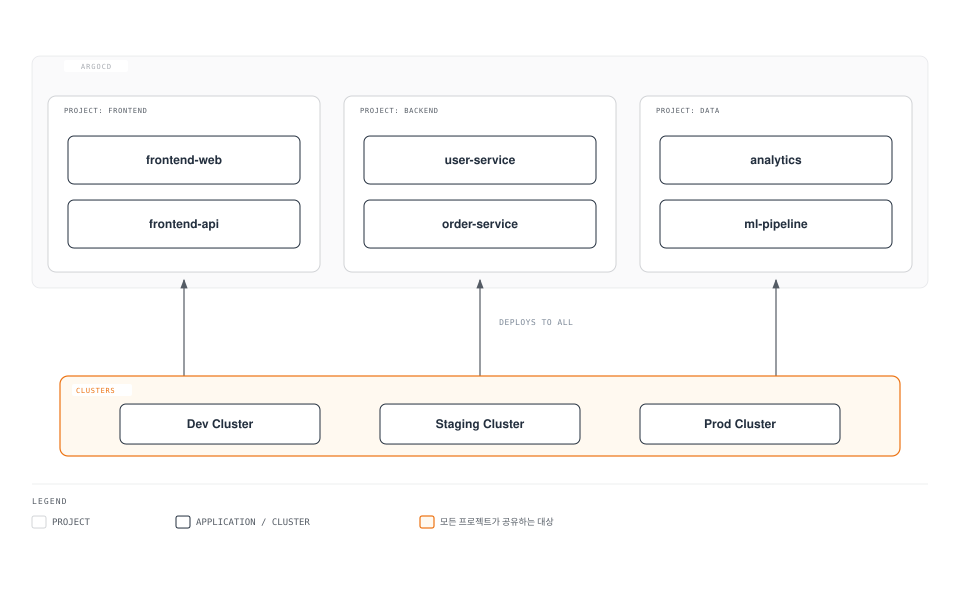

# ArgoCD 프로젝트와 RBAC

> **지원 버전**: ArgoCD v2.9+
> **마지막 업데이트**: 2026년 2월 22일

## 목차

- [AppProject 개요](#appproject-개요)
- [프로젝트 구성](#프로젝트-구성)
- [RBAC 정책](#rbac-정책)
- [역할 정의](#역할-정의)
- [SSO 그룹 바인딩](#sso-그룹-바인딩)
- [JWT 토큰](#jwt-토큰)
- [멀티테넌시 패턴](#멀티테넌시-패턴)

## AppProject 개요

AppProject는 ArgoCD에서 Application을 논리적으로 그룹화하고 접근 제어를 설정하는 리소스입니다.


[🔍 인터랙티브 다이어그램 보기](https://www.atomai.click/kubernetes-docs/archmaps/ko-gitops-argocd-06-projects-rbac-0.html)

### 기본 프로젝트 vs 커스텀 프로젝트

**기본 프로젝트 (default):**
- 모든 소스 저장소 허용
- 모든 대상 클러스터/네임스페이스 허용
- 모든 리소스 유형 허용
- 프로덕션 환경에서는 권장하지 않음

**커스텀 프로젝트:**
- 소스 저장소 제한
- 대상 클러스터/네임스페이스 제한
- 배포 가능한 리소스 유형 제한
- 역할 및 권한 정의

## 프로젝트 구성

### AppProject CRD 전체 스펙

```yaml
apiVersion: argoproj.io/v1alpha1
kind: AppProject
metadata:
  name: production
  namespace: argocd
  # Finalizer 설정 (프로젝트 삭제 시 소속 Application 확인)
  finalizers:
    - resources-finalizer.argocd.argoproj.io
spec:
  # 프로젝트 설명
  description: Production applications managed by Platform Team

  # 허용된 소스 저장소
  sourceRepos:
    - 'https://github.com/myorg/production-*'
    - 'https://github.com/myorg/shared-*'
    # 모든 저장소 허용: '*'

  # 허용된 대상
  destinations:
    - namespace: 'prod-*'
      server: https://prod-cluster.example.com
    - namespace: 'monitoring'
      server: https://prod-cluster.example.com
      name: production-cluster  # 클러스터 이름으로도 지정 가능

  # 클러스터 리소스 허용 목록
  clusterResourceWhitelist:
    - group: ''
      kind: Namespace
    - group: rbac.authorization.k8s.io
      kind: ClusterRole
    - group: rbac.authorization.k8s.io
      kind: ClusterRoleBinding

  # 클러스터 리소스 거부 목록 (허용 목록보다 우선)
  clusterResourceBlacklist:
    - group: ''
      kind: ResourceQuota

  # 네임스페이스 리소스 허용 목록 (기본: 모두 허용)
  namespaceResourceWhitelist:
    - group: ''
      kind: '*'
    - group: apps
      kind: '*'
    - group: networking.k8s.io
      kind: '*'

  # 네임스페이스 리소스 거부 목록
  namespaceResourceBlacklist:
    - group: ''
      kind: LimitRange

  # 프로젝트 역할
  roles:
    - name: admin
      description: Project admin role
      policies:
        - p, proj:production:admin, applications, *, production/*, allow
        - p, proj:production:admin, repositories, *, production/*, allow
      groups:
        - platform-admins
        - production-admins

    - name: developer
      description: Developer role with limited permissions
      policies:
        - p, proj:production:developer, applications, get, production/*, allow
        - p, proj:production:developer, applications, sync, production/*, allow
      groups:
        - developers

    - name: readonly
      description: Read-only access
      policies:
        - p, proj:production:readonly, applications, get, production/*, allow
      groups:
        - viewers

  # 동기화 윈도우
  syncWindows:
    # 유지보수 윈도우: 매주 일요일 02:00-06:00만 허용
    - kind: allow
      schedule: '0 2 * * 0'
      duration: 4h
      applications:
        - '*'
      manualSync: true

    # 업무 시간 차단: 월-금 09:00-18:00 차단
    - kind: deny
      schedule: '0 9 * * 1-5'
      duration: 9h
      applications:
        - 'critical-*'
      manualSync: false

  # 서명된 커밋만 허용
  signatureKeys:
    - keyID: 4AEE18F83AFDEB23

  # 고아 리소스 모니터링
  orphanedResources:
    warn: true
    ignore:
      - group: ''
        kind: ConfigMap
        name: kube-root-ca.crt
```

### 환경별 프로젝트 예시

**개발 환경:**

```yaml
apiVersion: argoproj.io/v1alpha1
kind: AppProject
metadata:
  name: development
  namespace: argocd
spec:
  description: Development environment - relaxed policies

  sourceRepos:
    - '*'  # 모든 저장소 허용

  destinations:
    - namespace: 'dev-*'
      server: https://dev-cluster.example.com
    - namespace: 'feature-*'
      server: https://dev-cluster.example.com

  clusterResourceWhitelist:
    - group: ''
      kind: Namespace

  # 동기화 윈도우 없음 (항상 배포 가능)

  roles:
    - name: developer
      policies:
        - p, proj:development:developer, applications, *, development/*, allow
      groups:
        - all-developers
```

**스테이징 환경:**

```yaml
apiVersion: argoproj.io/v1alpha1
kind: AppProject
metadata:
  name: staging
  namespace: argocd
spec:
  description: Staging environment - moderate policies

  sourceRepos:
    - 'https://github.com/myorg/*'

  destinations:
    - namespace: 'staging-*'
      server: https://staging-cluster.example.com

  clusterResourceWhitelist:
    - group: ''
      kind: Namespace
    - group: rbac.authorization.k8s.io
      kind: '*'

  syncWindows:
    # 업무 시간에만 배포 허용
    - kind: allow
      schedule: '0 9 * * 1-5'
      duration: 9h
      applications:
        - '*'
      manualSync: true

  roles:
    - name: qa-engineer
      policies:
        - p, proj:staging:qa-engineer, applications, *, staging/*, allow
      groups:
        - qa-team
        - developers
```

**프로덕션 환경:**

```yaml
apiVersion: argoproj.io/v1alpha1
kind: AppProject
metadata:
  name: production
  namespace: argocd
spec:
  description: Production environment - strict policies

  sourceRepos:
    - 'https://github.com/myorg/production-manifests'
    - 'https://github.com/myorg/helm-charts'

  destinations:
    - namespace: 'prod-*'
      server: https://prod-cluster.example.com

  clusterResourceWhitelist:
    - group: ''
      kind: Namespace

  clusterResourceBlacklist:
    - group: ''
      kind: ResourceQuota
    - group: ''
      kind: LimitRange

  syncWindows:
    # 유지보수 윈도우만 허용
    - kind: allow
      schedule: '0 2 * * 0'  # 일요일 02:00
      duration: 4h
      applications:
        - '*'
      manualSync: true

    # 긴급 배포는 수동으로만
    - kind: allow
      schedule: '* * * * *'
      duration: 24h
      applications:
        - 'emergency-*'
      manualSync: true  # 수동만 허용, 자동 동기화 차단

  signatureKeys:
    - keyID: 4AEE18F83AFDEB23

  orphanedResources:
    warn: true

  roles:
    - name: release-manager
      policies:
        - p, proj:production:release-manager, applications, *, production/*, allow
      groups:
        - release-managers

    - name: oncall
      policies:
        - p, proj:production:oncall, applications, get, production/*, allow
        - p, proj:production:oncall, applications, sync, production/*, allow
      groups:
        - oncall-engineers
```

## RBAC 정책

ArgoCD RBAC은 Casbin 기반이며, `argocd-rbac-cm` ConfigMap에서 구성합니다.

### RBAC 정책 구문

```
p, <subject>, <resource>, <action>, <object>, <effect>
g, <user/group>, <role>
```

**리소스 (Resource):**
- `applications`: Application 리소스
- `applicationsets`: ApplicationSet 리소스
- `clusters`: 클러스터
- `projects`: 프로젝트
- `repositories`: 저장소
- `certificates`: 인증서
- `accounts`: 계정
- `gpgkeys`: GPG 키
- `logs`: 로그
- `exec`: Pod exec

**액션 (Action):**
- `get`: 읽기
- `create`: 생성
- `update`: 수정
- `delete`: 삭제
- `sync`: 동기화
- `override`: 오버라이드
- `action/<action-name>`: 커스텀 액션

**효과 (Effect):**
- `allow`: 허용
- `deny`: 거부

### argocd-rbac-cm ConfigMap

```yaml
apiVersion: v1
kind: ConfigMap
metadata:
  name: argocd-rbac-cm
  namespace: argocd
data:
  # 기본 정책 (인증된 사용자에게 적용)
  policy.default: role:readonly

  # CSV 형식 정책
  policy.csv: |
    # 내장 역할 정의
    p, role:readonly, applications, get, */*, allow
    p, role:readonly, certificates, get, *, allow
    p, role:readonly, clusters, get, *, allow
    p, role:readonly, repositories, get, *, allow
    p, role:readonly, projects, get, *, allow
    p, role:readonly, accounts, get, *, allow
    p, role:readonly, gpgkeys, get, *, allow
    p, role:readonly, logs, get, */*, allow

    # 관리자 역할
    p, role:admin, applications, *, */*, allow
    p, role:admin, applicationsets, *, */*, allow
    p, role:admin, clusters, *, *, allow
    p, role:admin, repositories, *, *, allow
    p, role:admin, projects, *, *, allow
    p, role:admin, accounts, *, *, allow
    p, role:admin, certificates, *, *, allow
    p, role:admin, gpgkeys, *, *, allow
    p, role:admin, logs, get, */*, allow
    p, role:admin, exec, create, */*, allow

    # 개발자 역할
    p, role:developer, applications, get, */*, allow
    p, role:developer, applications, sync, */*, allow
    p, role:developer, applications, action/*, */*, allow
    p, role:developer, logs, get, */*, allow

    # 프로젝트별 관리자
    p, role:frontend-admin, applications, *, frontend/*, allow
    p, role:frontend-admin, logs, get, frontend/*, allow

    p, role:backend-admin, applications, *, backend/*, allow
    p, role:backend-admin, logs, get, backend/*, allow

    # 그룹 바인딩
    g, admin@example.com, role:admin
    g, platform-team, role:admin
    g, developers, role:developer
    g, frontend-team, role:frontend-admin
    g, backend-team, role:backend-admin
    g, viewers, role:readonly

  # 스코프 (OIDC 그룹 클레임)
  scopes: '[groups, email]'
```

### 세분화된 RBAC 예시

```yaml
policy.csv: |
  # 특정 Application만 관리
  p, role:app-owner, applications, *, default/my-specific-app, allow

  # 특정 네임스페이스의 Application만 관리
  p, role:ns-owner, applications, *, */ns-production-*, allow

  # 동기화만 허용 (생성/삭제 불가)
  p, role:sync-only, applications, get, */*, allow
  p, role:sync-only, applications, sync, */*, allow

  # 롤백만 허용
  p, role:rollback-only, applications, get, */*, allow
  p, role:rollback-only, applications, action/rollback, */*, allow

  # 특정 액션만 허용
  p, role:restart-only, applications, action/restart, */*, allow

  # Pod exec 허용 (디버깅용)
  p, role:debugger, exec, create, */*, allow
  p, role:debugger, logs, get, */*, allow

  # 저장소 관리자
  p, role:repo-admin, repositories, *, *, allow
  p, role:repo-admin, certificates, *, *, allow
```

## 역할 정의

### 내장 역할

| 역할 | 설명 |
|------|------|
| `role:readonly` | 모든 리소스 읽기 전용 |
| `role:admin` | 전체 관리자 권한 |

### 커스텀 역할

**프로젝트 내 역할:**

```yaml
apiVersion: argoproj.io/v1alpha1
kind: AppProject
metadata:
  name: my-project
spec:
  roles:
    - name: ci-deployer
      description: CI/CD pipeline deployment role
      policies:
        - p, proj:my-project:ci-deployer, applications, get, my-project/*, allow
        - p, proj:my-project:ci-deployer, applications, sync, my-project/*, allow
        - p, proj:my-project:ci-deployer, applications, update, my-project/*, allow

    - name: lead-developer
      description: Lead developer with full app control
      policies:
        - p, proj:my-project:lead-developer, applications, *, my-project/*, allow
        - p, proj:my-project:lead-developer, logs, get, my-project/*, allow
        - p, proj:my-project:lead-developer, exec, create, my-project/*, allow

    - name: junior-developer
      description: Junior developer with view and sync
      policies:
        - p, proj:my-project:junior-developer, applications, get, my-project/*, allow
        - p, proj:my-project:junior-developer, applications, sync, my-project/*, allow
        - p, proj:my-project:junior-developer, logs, get, my-project/*, allow
```

**전역 역할 (argocd-rbac-cm):**

```yaml
policy.csv: |
  # SRE 역할
  p, role:sre, applications, get, */*, allow
  p, role:sre, applications, sync, */*, allow
  p, role:sre, applications, action/*, */*, allow
  p, role:sre, clusters, get, *, allow
  p, role:sre, logs, get, */*, allow
  p, role:sre, exec, create, */*, allow

  # 보안 감사자 역할
  p, role:security-auditor, applications, get, */*, allow
  p, role:security-auditor, clusters, get, *, allow
  p, role:security-auditor, repositories, get, *, allow
  p, role:security-auditor, projects, get, *, allow
  p, role:security-auditor, logs, get, */*, allow

  # Release Manager 역할
  p, role:release-manager, applications, get, */*, allow
  p, role:release-manager, applications, sync, production/*, allow
  p, role:release-manager, applications, action/rollback, production/*, allow
```

## SSO 그룹 바인딩

### OIDC 그룹 매핑

```yaml
apiVersion: v1
kind: ConfigMap
metadata:
  name: argocd-rbac-cm
  namespace: argocd
data:
  policy.csv: |
    # OIDC 그룹을 ArgoCD 역할에 매핑
    g, platform-engineers, role:admin
    g, sre-team, role:sre
    g, developers, role:developer
    g, security-team, role:security-auditor

    # 특정 프로젝트에 그룹 바인딩
    g, frontend-developers, proj:frontend:developer
    g, backend-developers, proj:backend:developer

  scopes: '[groups]'
```

### SAML 그룹 매핑

```yaml
apiVersion: v1
kind: ConfigMap
metadata:
  name: argocd-cm
  namespace: argocd
data:
  url: https://argocd.example.com

  dex.config: |
    connectors:
      - type: saml
        id: okta
        name: Okta
        config:
          ssoURL: https://myorg.okta.com/app/xxx/sso/saml
          caData: |
            -----BEGIN CERTIFICATE-----
            ...
            -----END CERTIFICATE-----
          redirectURI: https://argocd.example.com/api/dex/callback
          usernameAttr: email
          emailAttr: email
          groupsAttr: groups
---
apiVersion: v1
kind: ConfigMap
metadata:
  name: argocd-rbac-cm
  namespace: argocd
data:
  policy.csv: |
    # Okta 그룹 매핑
    g, ArgoCD-Admins, role:admin
    g, ArgoCD-Developers, role:developer
    g, ArgoCD-Viewers, role:readonly
```

### Azure AD 그룹 매핑

```yaml
apiVersion: v1
kind: ConfigMap
metadata:
  name: argocd-cm
  namespace: argocd
data:
  url: https://argocd.example.com

  oidc.config: |
    name: Azure AD
    issuer: https://login.microsoftonline.com/TENANT_ID/v2.0
    clientID: CLIENT_ID
    clientSecret: $oidc.azure.clientSecret
    requestedScopes:
      - openid
      - profile
      - email
    # Azure AD는 그룹 ID를 반환하므로 매핑 필요
    requestedIDTokenClaims:
      groups:
        essential: true
---
apiVersion: v1
kind: ConfigMap
metadata:
  name: argocd-rbac-cm
  namespace: argocd
data:
  policy.csv: |
    # Azure AD 그룹 ID로 매핑
    g, 00000000-0000-0000-0000-000000000001, role:admin       # Platform Team
    g, 00000000-0000-0000-0000-000000000002, role:developer   # Developers
    g, 00000000-0000-0000-0000-000000000003, role:readonly    # Viewers
```

## JWT 토큰

CI/CD 파이프라인에서 ArgoCD API를 호출할 때 JWT 토큰을 사용합니다.

### 프로젝트 토큰 생성

```bash
# 프로젝트 역할에 토큰 생성
argocd proj role create-token my-project ci-deployer

# 만료 시간 지정 (초 단위)
argocd proj role create-token my-project ci-deployer --expires-in 86400  # 24시간

# 토큰 ID 지정
argocd proj role create-token my-project ci-deployer --token-id github-actions
```

### 선언적 토큰 정의

```yaml
apiVersion: argoproj.io/v1alpha1
kind: AppProject
metadata:
  name: my-project
  namespace: argocd
spec:
  roles:
    - name: ci-deployer
      description: CI/CD deployment role
      policies:
        - p, proj:my-project:ci-deployer, applications, get, my-project/*, allow
        - p, proj:my-project:ci-deployer, applications, sync, my-project/*, allow
      # JWT 토큰 정의
      jwtTokens:
        - iat: 1700000000  # 발급 시간 (Unix timestamp)
          id: github-actions
        - iat: 1700000001
          id: gitlab-ci
```

### GitHub Actions에서 사용

```yaml
# .github/workflows/deploy.yaml
name: Deploy to ArgoCD

on:
  push:
    branches: [main]

jobs:
  deploy:
    runs-on: ubuntu-latest
    steps:
      - name: Deploy with ArgoCD
        env:
          ARGOCD_SERVER: argocd.example.com
          ARGOCD_AUTH_TOKEN: ${{ secrets.ARGOCD_TOKEN }}
        run: |
          # CLI 설치
          curl -sSL -o /usr/local/bin/argocd https://github.com/argoproj/argo-cd/releases/latest/download/argocd-linux-amd64
          chmod +x /usr/local/bin/argocd

          # 동기화
          argocd app sync my-app --server $ARGOCD_SERVER --auth-token $ARGOCD_AUTH_TOKEN

          # 대기
          argocd app wait my-app --server $ARGOCD_SERVER --auth-token $ARGOCD_AUTH_TOKEN
```

### API 직접 호출

```bash
# JWT 토큰으로 API 호출
curl -H "Authorization: Bearer $ARGOCD_TOKEN" \
  https://argocd.example.com/api/v1/applications

# Application 동기화
curl -X POST \
  -H "Authorization: Bearer $ARGOCD_TOKEN" \
  -H "Content-Type: application/json" \
  https://argocd.example.com/api/v1/applications/my-app/sync

# Application 상태 확인
curl -H "Authorization: Bearer $ARGOCD_TOKEN" \
  https://argocd.example.com/api/v1/applications/my-app
```

## 멀티테넌시 패턴

### 패턴 1: 팀별 프로젝트



```yaml
# Frontend 프로젝트
apiVersion: argoproj.io/v1alpha1
kind: AppProject
metadata:
  name: frontend
  namespace: argocd
spec:
  description: Frontend team applications

  sourceRepos:
    - 'https://github.com/myorg/frontend-*'

  destinations:
    - namespace: 'frontend-*'
      server: '*'

  roles:
    - name: admin
      policies:
        - p, proj:frontend:admin, applications, *, frontend/*, allow
      groups:
        - frontend-leads

    - name: developer
      policies:
        - p, proj:frontend:developer, applications, get, frontend/*, allow
        - p, proj:frontend:developer, applications, sync, frontend/*, allow
      groups:
        - frontend-developers
---
# Backend 프로젝트
apiVersion: argoproj.io/v1alpha1
kind: AppProject
metadata:
  name: backend
  namespace: argocd
spec:
  description: Backend team applications

  sourceRepos:
    - 'https://github.com/myorg/backend-*'

  destinations:
    - namespace: 'backend-*'
      server: '*'

  roles:
    - name: admin
      policies:
        - p, proj:backend:admin, applications, *, backend/*, allow
      groups:
        - backend-leads

    - name: developer
      policies:
        - p, proj:backend:developer, applications, get, backend/*, allow
        - p, proj:backend:developer, applications, sync, backend/*, allow
      groups:
        - backend-developers
```

### 패턴 2: 환경별 프로젝트

```yaml
# 개발 환경
apiVersion: argoproj.io/v1alpha1
kind: AppProject
metadata:
  name: development
spec:
  sourceRepos:
    - '*'
  destinations:
    - namespace: '*'
      server: https://dev-cluster.example.com
  roles:
    - name: developer
      policies:
        - p, proj:development:developer, applications, *, development/*, allow
      groups:
        - all-developers
---
# 스테이징 환경
apiVersion: argoproj.io/v1alpha1
kind: AppProject
metadata:
  name: staging
spec:
  sourceRepos:
    - 'https://github.com/myorg/*'
  destinations:
    - namespace: '*'
      server: https://staging-cluster.example.com
  syncWindows:
    - kind: allow
      schedule: '0 9 * * 1-5'
      duration: 9h
      applications:
        - '*'
  roles:
    - name: qa
      policies:
        - p, proj:staging:qa, applications, *, staging/*, allow
      groups:
        - qa-team
---
# 프로덕션 환경
apiVersion: argoproj.io/v1alpha1
kind: AppProject
metadata:
  name: production
spec:
  sourceRepos:
    - 'https://github.com/myorg/production-manifests'
  destinations:
    - namespace: 'prod-*'
      server: https://prod-cluster.example.com
  syncWindows:
    - kind: allow
      schedule: '0 2 * * 0'
      duration: 4h
      applications:
        - '*'
      manualSync: true
  signatureKeys:
    - keyID: 4AEE18F83AFDEB23
  roles:
    - name: release-manager
      policies:
        - p, proj:production:release-manager, applications, *, production/*, allow
      groups:
        - release-managers
```

### 패턴 3: 테넌트별 격리

```yaml
# 테넌트 A
apiVersion: argoproj.io/v1alpha1
kind: AppProject
metadata:
  name: tenant-a
spec:
  description: Tenant A isolated environment

  sourceRepos:
    - 'https://github.com/tenant-a/*'

  destinations:
    - namespace: 'tenant-a-*'
      server: https://shared-cluster.example.com

  namespaceResourceBlacklist:
    - group: ''
      kind: ResourceQuota
    - group: ''
      kind: LimitRange
    - group: networking.k8s.io
      kind: NetworkPolicy

  roles:
    - name: admin
      policies:
        - p, proj:tenant-a:admin, applications, *, tenant-a/*, allow
      groups:
        - tenant-a-admins
---
# 테넌트 B
apiVersion: argoproj.io/v1alpha1
kind: AppProject
metadata:
  name: tenant-b
spec:
  description: Tenant B isolated environment

  sourceRepos:
    - 'https://github.com/tenant-b/*'

  destinations:
    - namespace: 'tenant-b-*'
      server: https://shared-cluster.example.com

  namespaceResourceBlacklist:
    - group: ''
      kind: ResourceQuota
    - group: ''
      kind: LimitRange
    - group: networking.k8s.io
      kind: NetworkPolicy

  roles:
    - name: admin
      policies:
        - p, proj:tenant-b:admin, applications, *, tenant-b/*, allow
      groups:
        - tenant-b-admins
```

## 다음 단계

1. **[보안](07-security.md)**: SSO 통합과 시크릿 관리를 설정하세요.

2. **[알림](08-notifications.md)**: RBAC 이벤트에 대한 알림을 구성하세요.

3. **[모범 사례](09-best-practices.md)**: 멀티테넌시 모범 사례를 학습하세요.

## 참고 자료

- [ArgoCD RBAC](https://argo-cd.readthedocs.io/en/stable/operator-manual/rbac/)
- [프로젝트 문서](https://argo-cd.readthedocs.io/en/stable/user-guide/projects/)
- [SSO 구성](https://argo-cd.readthedocs.io/en/stable/operator-manual/user-management/)
- [Casbin 정책](https://casbin.org/docs/syntax-for-models)

## 퀴즈

이 장에서 배운 내용을 테스트하려면 [프로젝트와 RBAC 퀴즈](../../quizzes/gitops/argocd/06-projects-rbac-quiz.md)를 풀어보세요.
