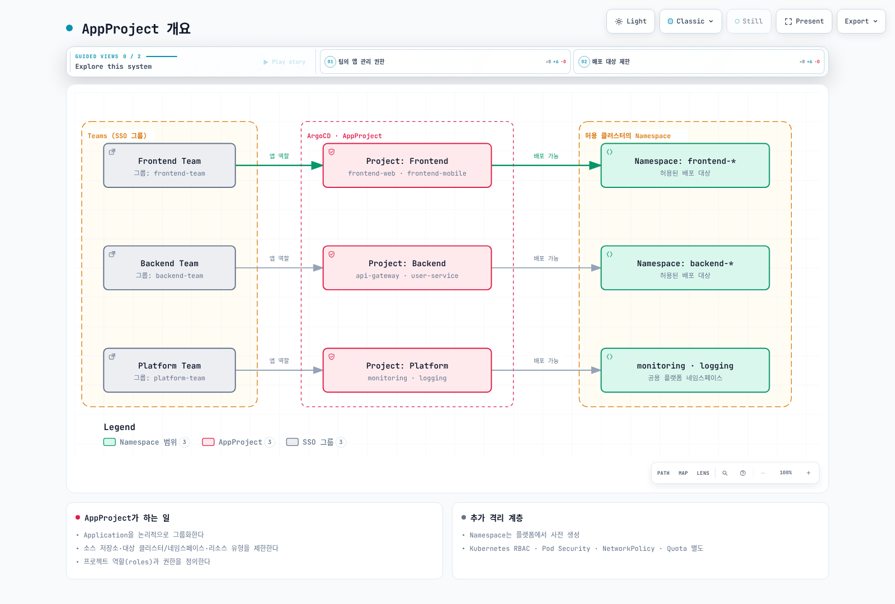
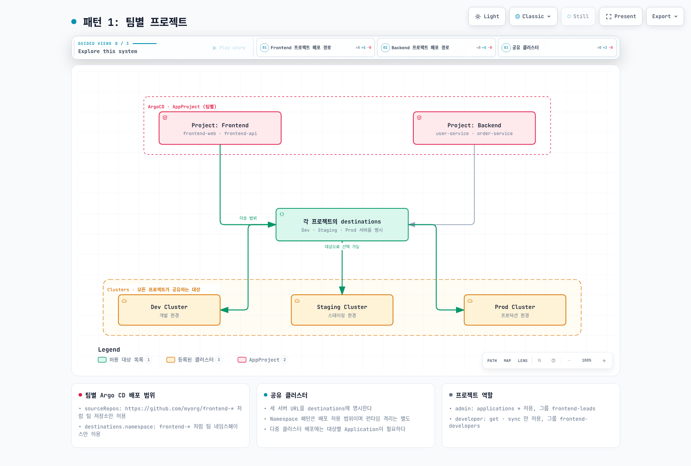

# ArgoCD 프로젝트와 RBAC

> **검토 기준**: Argo CD 3.5.2
> **마지막 업데이트**: 2026년 9월 11일

## 목차

- [AppProject 개요](#appproject-개요)
- [프로젝트 구성](#프로젝트-구성)
- [RBAC 정책](#rbac-정책)
- [역할 정의](#역할-정의)
- [SSO 그룹 바인딩](#sso-그룹-바인딩)
- [JWT 토큰](#jwt-토큰)
- [멀티테넌시 패턴](#멀티테넌시-패턴)

## AppProject 개요

AppProject는 ArgoCD에서 Application을 논리적으로 그룹화하고 접근 제어를 설정하는 리소스입니다.



[🔍 인터랙티브 다이어그램 보기](https://www.atomai.click/kubernetes-docs/archmaps/ko-gitops-argocd-06-projects-rbac-0.html)

AppProject는 Argo CD가 관리하는 소스·대상·리소스와 API 권한을 제한합니다. Kubernetes RBAC, Pod Security Admission, NetworkPolicy, ResourceQuota를 대신하는 격리 장치는 아닙니다. Pod 종류를 거부해도 Deployment가 만드는 privileged Pod까지 막지는 못합니다.

예제의 URL·그룹·클러스터·Namespace는 실제 환경에 맞게 준비해야 합니다. 애플리케이션 팀의 Namespace는 플랫폼 팀이 미리 만들고 보안·쿼터 정책을 소유합니다. 아래 팀/환경 프로젝트는 클러스터 범위 리소스를 허용하지 않습니다. 별도의 platform 프로젝트는 신뢰하는 관리자 전용입니다. 여러 전체 AppProject 예시는 독립된 대안이며, 같은 이름의 정의를 연속 적용하지 않습니다.

### 기본 프로젝트 vs 커스텀 프로젝트

**기본 프로젝트 (default):**
- 모든 소스 저장소 허용
- 모든 대상 클러스터/네임스페이스 허용
- 모든 리소스 유형 허용
- 프로덕션 환경에서는 권장하지 않음

**커스텀 프로젝트:**
- 소스 저장소 제한
- 대상 클러스터/네임스페이스 제한
- 배포 가능한 리소스 유형 제한
- 역할 및 권한 정의

## 프로젝트 구성

### AppProject 구성 예시

```yaml
apiVersion: argoproj.io/v1alpha1
kind: AppProject
metadata:
  name: production
  namespace: argocd
  finalizers:
  - resources-finalizer.argocd.argoproj.io
spec:
  description: Production applications managed by Platform Team
  sourceRepos:
  - https://github.com/myorg/production-*
  - https://github.com/myorg/shared-*
  destinations:
  - namespace: prod-*
    server: https://prod-cluster.example.com
  - namespace: monitoring
    server: https://prod-cluster.example.com
  clusterResourceWhitelist: []
  namespaceResourceWhitelist:
  - group: ''
    kind: '*'
  - group: apps
    kind: '*'
  - group: networking.k8s.io
    kind: '*'
  namespaceResourceBlacklist:
  - group: ''
    kind: LimitRange
  - group: ''
    kind: ResourceQuota
  roles:
  - name: admin
    description: Project admin role
    policies:
    - p, proj:production:admin, applications, *, production/*, allow
    - p, proj:production:admin, repositories, *, production/*, allow
    groups:
    - platform-admins
    - production-admins
  - name: developer
    description: Developer role with limited permissions
    policies:
    - p, proj:production:developer, applications, get, production/*, allow
    - p, proj:production:developer, applications, sync, production/*, allow
    groups:
    - developers
  - name: readonly
    description: Read-only access
    policies:
    - p, proj:production:readonly, applications, get, production/*, allow
    groups:
    - viewers
  syncWindows:
  - kind: allow
    schedule: 0 2 * * 0
    duration: 4h
    applications:
    - '*'
    manualSync: true
    timeZone: Asia/Seoul
  - kind: deny
    schedule: 0 9 * * 1-5
    duration: 9h
    applications:
    - critical-*
    manualSync: false
    timeZone: Asia/Seoul
  orphanedResources:
    warn: true
    ignore:
    - group: ''
      kind: ConfigMap
      name: kube-root-ca.crt
  sourceIntegrity:
    git:
      policies:
      - repos:
        - url: '*'
        gpg:
          mode: head
          keys:
          - 0123456789ABCDEF
```

### 환경별 프로젝트 예시

**개발 환경:**

```yaml
apiVersion: argoproj.io/v1alpha1
kind: AppProject
metadata:
  name: development
  namespace: argocd
spec:
  description: Development environment - relaxed policies
  sourceRepos:
  - https://github.com/myorg/dev-*
  destinations:
  - namespace: dev-*
    server: https://dev-cluster.example.com
  - namespace: feature-*
    server: https://dev-cluster.example.com
  clusterResourceWhitelist: []
  roles:
  - name: developer
    policies:
    - p, proj:development:developer, applications, *, development/*, allow
    groups:
    - all-developers
```

**스테이징 환경:**

```yaml
apiVersion: argoproj.io/v1alpha1
kind: AppProject
metadata:
  name: staging
  namespace: argocd
spec:
  description: Staging environment - moderate policies
  sourceRepos:
  - https://github.com/myorg/*
  destinations:
  - namespace: staging-*
    server: https://staging-cluster.example.com
  clusterResourceWhitelist: []
  syncWindows:
  - kind: allow
    schedule: 0 9 * * 1-5
    duration: 9h
    applications:
    - '*'
    manualSync: true
    timeZone: Asia/Seoul
  roles:
  - name: qa-engineer
    policies:
    - p, proj:staging:qa-engineer, applications, *, staging/*, allow
    groups:
    - qa-team
    - developers
```

**프로덕션 환경:**

```yaml
apiVersion: argoproj.io/v1alpha1
kind: AppProject
metadata:
  name: production
  namespace: argocd
spec:
  description: Production environment - strict policies
  sourceRepos:
  - https://github.com/myorg/production-manifests
  - https://github.com/myorg/helm-charts
  destinations:
  - namespace: prod-*
    server: https://prod-cluster.example.com
  clusterResourceWhitelist: []
  syncWindows:
  - kind: allow
    schedule: 0 2 * * 0
    duration: 4h
    applications:
    - '*'
    manualSync: true
    timeZone: Asia/Seoul
  orphanedResources:
    warn: true
  roles:
  - name: release-manager
    policies:
    - p, proj:production:release-manager, applications, *, production/*, allow
    groups:
    - release-managers
  - name: oncall
    policies:
    - p, proj:production:oncall, applications, get, production/*, allow
    - p, proj:production:oncall, applications, sync, production/*, allow
    groups:
    - oncall-engineers
  namespaceResourceBlacklist:
  - group: ''
    kind: ResourceQuota
  - group: ''
    kind: LimitRange
  sourceIntegrity:
    git:
      policies:
      - repos:
        - url: '*'
        gpg:
          mode: head
          keys:
          - 0123456789ABCDEF
```

### 범위와 검증 설정의 의미

- AppProject destination은 `(server 또는 등록된 name) + namespace` 조합을 검사합니다. 두 식별자를 함께 쓰면 추가 AND 제한이 되지 않습니다. 위 예제는 server만 사용합니다. Application 리소스의 destination에서는 server와 name을 동시에 지정할 수 없습니다.
- ResourceQuota와 LimitRange는 네임스페이스 범위입니다. clusterResourceBlacklist에 넣어도 차단하지 못하므로 namespaceResourceBlacklist에 둡니다. 이 거부는 Argo CD 경로에만 적용됩니다.
- namespaceResourceWhitelist를 생략하면 기본적으로 모든 namespaced kind가 허용되며, 명시적 허용 목록과 거부 목록을 함께 평가합니다. clusterResourceWhitelist는 허용한 종류만 관리합니다. Argo CD 3.5.2는 이 클러스터 목록에 `name` 패턴도 지원합니다.
- Namespace 관리를 위임해야 한다면 `group: ''`, `kind: Namespace`, `name: team-a-*`처럼 이름도 제한합니다. 그래도 Namespace 보안 레이블을 바꿀 권한이 생기므로, 강한 테넌트 경계에서는 사전 생성과 admission 정책을 유지합니다.
- manualSync는 허용 창 밖 수동 동기화 예외이며 자동 동기화를 끄지 않습니다. sync 권한이 있는 사용자에게 적용되며 on-call 역할만 선별하는 옵션은 아닙니다. 겹치는 deny와 시간대 의미는 동기화 전략 장을 참고합니다.
- 기본 프로젝트를 제한하기 전에 기존 Application을 명시적 프로젝트로 옮기고 권한을 확인합니다.

### 서명 검증 (3.5 형식)

`signatureKeys`는 호환성용으로 남아 있지만 폐기 예정입니다. 위 sourceIntegrity 예제의 `0123456789ABCDEF`는 가짜 자리표시자이며, 실제 조직의 승인된 공개키를 먼저 keyring에 등록하고 ID를 교체해야 합니다. 기존 signatureKeys를 제거한 뒤 sourceIntegrity로 옮깁니다. 이 정책은 Git에만 적용하며 Helm/OCI 및 컨테이너 이미지 서명을 검증하지 않습니다. head 모드는 대상 commit 또는 서명된 annotated tag를 검사하고 전체 이력 검증은 strict 모드의 별도 정책입니다. 정책에 매칭되지 않은 Git source는 검증하지 않으므로 모든 허용 Git source를 검사하려는 예제는 repos.url='*'를 사용합니다.

## RBAC 정책

ArgoCD RBAC은 Casbin 기반이며, `argocd-rbac-cm` ConfigMap에서 구성합니다.

### RBAC 정책 구문

```
p, <subject>, <resource>, <action>, <object>, <effect>
g, <user/group>, <role>
```

**리소스 (Resource):**
- `applications`: Application 리소스
- `applicationsets`: ApplicationSet 리소스
- `clusters`: 클러스터
- `projects`: 프로젝트
- `repositories`: 저장소
- `certificates`: 인증서
- `accounts`: 계정
- `gpgkeys`: GPG 키
- `logs`: 로그
- `exec`: Pod exec

**액션 (Action):**
- `get`: 읽기
- `create`: 생성
- `update`: 수정
- `delete`: 삭제
- `sync`: 동기화
- `override`: 오버라이드
- `action/<group>/<kind>/<action-name>`: 리소스 액션 (예: action/apps/Deployment/restart)

**효과 (Effect):**
- `allow`: 허용
- `deny`: 거부

### argocd-rbac-cm ConfigMap

아래는 기본 권한을 비워 두고 그룹별로 명시적인 권한을 부여하는 예제입니다. 개발자는 frontend 프로젝트로 제한됩니다. role:authenticated에는 allow/deny 정책을 추가하지 않습니다. 기본 정책이 부여한 권한은 사용자 deny로 회수할 수 없으므로 role:readonly를 기본값으로 두면 프로젝트 간 읽기 격리가 되지 않습니다. 내장 역할을 policy.csv에 복제하여 재정의하지 않습니다.

```yaml
apiVersion: v1
kind: ConfigMap
metadata:
  name: argocd-rbac-cm
  namespace: argocd
  labels:
    app.kubernetes.io/part-of: argocd
data:
  policy.default: role:authenticated
  policy.matchMode: glob
  scopes: '[groups]'
  policy.csv: |
    # Built-in role:admin and role:readonly are already provided by Argo CD.
    p, role:developer, applications, get, frontend/*, allow
    p, role:developer, applications, sync, frontend/*, allow
    p, role:developer, applications, action/apps/Deployment/restart, frontend/*, allow
    p, role:developer, logs, get, frontend/*, allow
    p, role:viewer, applications, get, frontend/*, allow
    p, role:frontend-admin, applications, *, frontend/*, allow
    p, role:frontend-admin, logs, get, frontend/*, allow
    p, role:backend-admin, applications, *, backend/*, allow
    p, role:backend-admin, logs, get, backend/*, allow
    p, role:sre, applications, get, production/*, allow
    p, role:sre, applications, sync, production/*, allow
    p, role:sre, applications, action/apps/Deployment/restart, production/*, allow
    p, role:sre, logs, get, production/*, allow
    p, role:sre, exec, create, production/*, allow
    p, role:security-auditor, applications, get, */*, allow
    p, role:security-auditor, projects, get, *, allow
    p, role:security-auditor, repositories, get, *, allow
    g, platform-team, role:admin
    g, developers, role:developer
    g, frontend-team, role:frontend-admin
    g, backend-team, role:backend-admin
    g, viewers, role:viewer
    g, sre-team, role:sre
    g, security-team, role:security-auditor
    p, role:developer, projects, get, frontend, allow
    p, role:viewer, projects, get, frontend, allow
    p, role:frontend-admin, projects, get, frontend, allow
    p, role:backend-admin, projects, get, backend, allow
    p, role:sre, projects, get, production, allow
```

추가 정책 조각은 기존 argocd-rbac-cm의 data에 Kustomize/Helm 등으로 합쳐 최종 ConfigMap을 구성합니다. policy.example-N.csv 키는 서버가 policy.csv와 합산합니다. 조각마다 기존 전체 ConfigMap을 교체하는 방식으로 적용하지 않습니다. 서로 다른 예제의 넓은 allow가 누적되지 않도록 필요한 정책만 선택합니다.

Argo CD API RBAC은 Kubernetes RBAC과 별개입니다. object의 project/app은 배포 대상 Namespace가 아니며, 다른 Namespace에 둔 Application CR은 project/application-namespace/app 형식도 사용합니다. `/`는 glob의 구분자가 아니므로 리소스 action/update/delete 경로를 생략하지 않습니다.

3.x 기본 설정에서 application의 update/delete 권한은 하위 Kubernetes 리소스 작업으로 자동 상속되지 않습니다. 하위 작업은 update/<group>/<kind>/<namespace>/<name> 또는 delete/...로 명시합니다. server.rbac.disableApplicationFineGrainedRBACInheritance 설정에 따라 달라질 수 있습니다.

sync는 실제 배포 리소스를 생성·변경하고 prune으로 삭제할 수 있습니다. Application 객체 delete 권한을 주지 않았다고 해서 배포 리소스 삭제도 막는 것은 아닙니다. Rollback API도 sync 권한을 검사하므로 별도의 action/rollback 또는 'rollback-only' 권한은 없습니다. override는 강제 sync가 아니라 로컬 매니페스트 등의 소스 대체 권한입니다. 3.5.2의 application.sync.requireOverridePrivilegeForRevisionSync 설정은 revision 지정 sync에도 override를 요구할 수 있습니다.

### 세분화된 RBAC 예시

```yaml
policy.example-1.csv: |
  # 특정 Application만 관리
  p, role:app-owner, applications, *, default/my-specific-app, allow

  # production 프로젝트의 Application만 관리 (대상 Namespace는 destinations에서 제한)
  p, role:project-owner, applications, *, production/*, allow

  # 동기화만 허용 (생성/삭제 불가)
  p, role:sync-only, applications, get, production/*, allow
  p, role:sync-only, applications, sync, production/*, allow

  # sync와 rollback에 공통인 권한
  p, role:sync-and-rollback, applications, get, production/*, allow
  p, role:sync-and-rollback, applications, sync, production/*, allow

  # 특정 액션만 허용
  p, role:restart-only, applications, action/apps/Deployment/restart, production/*, allow

  # Pod exec 허용 (디버깅용)
  p, role:debugger, exec, create, production/*, allow
  p, role:debugger, logs, get, production/*, allow

  # 저장소 관리자
  p, role:repo-admin, repositories, *, *, allow
  p, role:repo-admin, certificates, *, *, allow
  p, role:debugger, applications, get, production/*, allow
  p, role:restart-only, applications, get, production/*, allow
```

## 역할 정의

### 내장 역할

| 역할 | 설명 |
|------|------|
| `role:readonly` | 모든 리소스 읽기 전용 |
| `role:admin` | 전체 관리자 권한 |

### 커스텀 역할

**프로젝트 내 역할:**

```yaml
apiVersion: argoproj.io/v1alpha1
kind: AppProject
metadata:
  name: my-project
  namespace: argocd
spec:
  roles:
  - name: ci-deployer
    description: CI/CD pipeline deployment role
    policies:
    - p, proj:my-project:ci-deployer, applications, get, my-project/*, allow
    - p, proj:my-project:ci-deployer, applications, sync, my-project/*, allow
  - name: lead-developer
    description: Lead developer with full app control
    policies:
    - p, proj:my-project:lead-developer, applications, *, my-project/*, allow
    - p, proj:my-project:lead-developer, logs, get, my-project/*, allow
    - p, proj:my-project:lead-developer, exec, create, my-project/*, allow
  - name: junior-developer
    description: Junior developer with view and sync
    policies:
    - p, proj:my-project:junior-developer, applications, get, my-project/*, allow
    - p, proj:my-project:junior-developer, applications, sync, my-project/*, allow
    - p, proj:my-project:junior-developer, logs, get, my-project/*, allow
  clusterResourceWhitelist: []
  sourceRepos:
  - https://github.com/myorg/myapp.git
  destinations:
  - server: https://kubernetes.default.svc
    namespace: my-app-*
```

**전역 역할 (argocd-rbac-cm):**

```yaml
policy.example-2.csv: |
  # SRE 역할
  p, role:sre, applications, get, */*, allow
  p, role:sre, applications, sync, */*, allow
  p, role:sre, applications, action/apps/Deployment/restart, */*, allow
  p, role:sre, clusters, get, *, allow
  p, role:sre, logs, get, */*, allow
  p, role:sre, exec, create, */*, allow

  # 보안 감사자 역할
  p, role:security-auditor, applications, get, */*, allow
  p, role:security-auditor, clusters, get, *, allow
  p, role:security-auditor, repositories, get, *, allow
  p, role:security-auditor, projects, get, *, allow
  p, role:security-auditor, logs, get, */*, allow

  # Release Manager 역할
  p, role:release-manager, applications, get, production/*, allow
  p, role:release-manager, applications, sync, production/*, allow
  p, role:release-manager, applications, sync, production/*, allow
```

## SSO 그룹 바인딩

### OIDC 그룹 매핑

```yaml
apiVersion: v1
kind: ConfigMap
metadata:
  name: argocd-rbac-cm
  namespace: argocd
data:
  scopes: '[groups]'
  policy.example-3.csv: |
    # OIDC 그룹을 ArgoCD 역할에 매핑
    g, platform-engineers, role:admin
    g, sre-team, role:sre
    g, developers, role:developer
    g, security-team, role:security-auditor

    # 특정 프로젝트에 그룹 바인딩
    g, frontend-developers, proj:frontend:developer
    g, backend-developers, proj:backend:developer
```

### SAML 그룹 매핑

아래는 IdP에서 SAML 앱·서명 인증서·그룹 attribute를 이미 설정한 뒤 사용하는 예제입니다. caData는 BEGIN/END 줄을 포함한 전체 PEM 파일을 base64로 인코딩한 값이며, 원문 PEM을 붙이는 필드가 아닙니다. redirectURI는 IdP 등록값과 정확히 일치해야 합니다.

```yaml
apiVersion: v1
kind: ConfigMap
metadata:
  name: argocd-cm
  namespace: argocd
data:
  url: https://argocd.example.com
  dex.config: |
    connectors:
    - type: saml
      id: okta
      name: Okta
      config:
        ssoURL: https://myorg.okta.com/app/xxx/sso/saml
        caData: BASE64_OF_THE_COMPLETE_IDP_SIGNING_CERTIFICATE_PEM
        redirectURI: https://argocd.example.com/api/dex/callback
        usernameAttr: email
        emailAttr: email
        groupsAttr: groups
---
apiVersion: v1
kind: ConfigMap
metadata:
  name: argocd-rbac-cm
  namespace: argocd
data:
  policy.example-4.csv: |-
    # Okta 그룹 매핑
    g, ArgoCD-Admins, role:admin
    g, ArgoCD-Developers, role:developer
    g, ArgoCD-Viewers, role:viewer
```

### Microsoft Entra ID 그룹 매핑

Entra 앱 등록에서 groups claim과 사용자/그룹 할당을 설정하고 실제 Object ID를 사용합니다. requestedIDTokenClaims만으로 그룹 설정이 생성되지는 않습니다. clientSecret 참조는 argocd-secret의 해당 키를 별도로 준비합니다. direct OIDC callback은 /auth/callback이며 Dex SAML의 /api/dex/callback과 다릅니다.

200개 초과 그룹에서는 overage claim이 올 수 있습니다. 3.5.2의 azure.enableUserGroupOverageClaim은 기본 false이며, 필요한 경우 User.Read 위임 권한과 Graph 연결을 준비해 명시적으로 활성화합니다. Graph 실패가 로그인 실패로 이어질 수 있으므로 아래 단순 예제와 별도로 검토합니다.

```yaml
apiVersion: v1
kind: ConfigMap
metadata:
  name: argocd-cm
  namespace: argocd
data:
  url: https://argocd.example.com
  oidc.config: |
    name: Microsoft Entra ID
    issuer: https://login.microsoftonline.com/TENANT_ID/v2.0
    clientID: CLIENT_ID
    clientSecret: $oidc.azure.clientSecret
    requestedScopes:
    - openid
    - profile
    - email
    requestedIDTokenClaims:
      groups:
        essential: true
---
apiVersion: v1
kind: ConfigMap
metadata:
  name: argocd-rbac-cm
  namespace: argocd
data:
  policy.example-5.csv: |-
    # Azure AD 그룹 ID로 매핑
    # Platform Team
    g, 00000000-0000-0000-0000-000000000001, role:admin
    # Developers
    g, 00000000-0000-0000-0000-000000000002, role:developer
    # Viewers
    g, 00000000-0000-0000-0000-000000000003, role:viewer
```

## JWT 토큰

CI/CD 파이프라인에서 ArgoCD API를 호출할 때 JWT 토큰을 사용합니다.

### 프로젝트 토큰 생성

발급과 회수는 해당 프로젝트를 update할 수 있는 운영자가 수행합니다. CI 토큰 자체에는 get/sync만 부여합니다. my-project에 ci-deployer 역할과 my-app Application이 이미 있어야 합니다. 만료 전 회전 절차를 준비하고 기본 무기한 토큰을 그대로 사용하지 않습니다.

```bash
set -euo pipefail
umask 077
# Run as an operator authorized to update my-project.
argocd proj role create-token my-project ci-deployer \
  --expires-in 24h --token-only > ./argocd-ci.token
# Store this file's value in the approved CI secret store; do not commit or print it.
```

식별자를 지정할 때는 `--id UNIQUE_ID`를 사용합니다. `--token-id`는 3.5.2의 옵션이 아닙니다. expires-in은 24h 같은 기간 문자열을 받습니다. 토큰 값은 발급 시 한 번만 받으며 서버에 원문 토큰이 저장되는 것은 아닙니다.

### 토큰 메타데이터와 회수

spec.roles[].jwtTokens와 status.jwtTokensByRole의 iat/exp/id는 서버가 발급·검증·회수에 사용하는 메타데이터입니다. 임의 timestamp를 Git에 선언한다고 서명된 JWT가 생성되지 않습니다. 과거 메타데이터를 복원해 토큰 상태를 되돌리지 않도록 관리합니다. 역할 정책을 바꾸면 발급된 토큰의 권한에도 반영됩니다.

```bash
argocd proj role list-tokens my-project ci-deployer --unixtime

# Select one token's ISSUED AT value from the list, using operator credentials.
: "${SELECTED_ISSUED_AT:?Set the selected integer ISSUED AT value}"
argocd proj role delete-token my-project ci-deployer "$SELECTED_ISSUED_AT"
```

3.5.2의 delete-token 위치 인자는 ID 문자열이 아니라 ISSUED AT Unix 정수입니다. 목록의 ID와 혼동하지 않습니다.

### GitHub Actions에서 사용

Application에 선언된 revision을 동기화하는 예제입니다. 워크플로우 SHA를 임의로 강제하지 않습니다. immutable revision이 필요하면 Application의 targetRevision을 Git에서 관리하고, --revision 사용 시 override 관련 서버 설정과 권한도 확인합니다. production Environment의 승인 규칙은 저장소에서 별도로 설정해야 합니다.

```yaml
name: Sync declared Argo CD application
'on':
  push:
    branches:
    - main
  workflow_dispatch: {}
permissions: {}
concurrency:
  group: argocd-my-project-my-app
  cancel-in-progress: false
jobs:
  sync:
    runs-on: ubuntu-24.04
    timeout-minutes: 15
    environment: production
    steps:
    - name: Install verified CLI
      shell: bash
      run: |
        set -euo pipefail
        ARGOCD_VERSION=v3.5.2
        case "$(uname -m)" in
          x86_64) cli_arch=amd64 ;;
          aarch64|arm64) cli_arch=arm64 ;;
          *) echo "Unsupported runner architecture" >&2; exit 1 ;;
        esac
        cli_asset="argocd-linux-${cli_arch}"
        cli_dir="$(mktemp -d)"
        trap 'rm -rf "$cli_dir"' EXIT
        cli_base="https://github.com/argoproj/argo-cd/releases/download/${ARGOCD_VERSION}"
        curl --fail --location --retry 3 "$cli_base/$cli_asset" -o "$cli_dir/$cli_asset"
        curl --fail --location --retry 3 "$cli_base/cli_checksums.txt" -o "$cli_dir/checksums.txt"
        awk -v artifact="$cli_asset" '$2 == artifact { print }' "$cli_dir/checksums.txt" > "$cli_dir/selected.sha256"
        test -s "$cli_dir/selected.sha256"
        (cd "$cli_dir" && sha256sum --check selected.sha256)
        install -m 0755 "$cli_dir/$cli_asset" "$RUNNER_TEMP/argocd"
    - name: Sync and wait
      shell: bash
      env:
        ARGOCD_SERVER: ${{ secrets.ARGOCD_SERVER }}
        ARGOCD_AUTH_TOKEN: ${{ secrets.ARGOCD_TOKEN }}
      run: |
        set -euo pipefail
        "$RUNNER_TEMP/argocd" app sync my-app --server "$ARGOCD_SERVER" --grpc-web --timeout 300
        "$RUNNER_TEMP/argocd" app wait my-app --server "$ARGOCD_SERVER" --grpc-web --sync --health --timeout 300
```

### API 직접 호출

다음 조회·동기화는 CI 토큰을 ARGOCD_AUTH_TOKEN으로 제공한 별도 환경에서 실행합니다. 토큰 발급·회수 운영자 세션과 구분합니다. POST sync는 소스에 선언된 상태를 적용하므로 변경 내용을 검토한 뒤 실행합니다.

```bash
: "${ARGOCD_AUTH_TOKEN:?Provide the CI token securely}"
curl --fail --silent --show-error --max-time 30 \
  -H "Authorization: Bearer $ARGOCD_AUTH_TOKEN" \
  https://argocd.example.com/api/v1/applications/my-app

curl --fail --silent --show-error --max-time 30 \
  -H "Authorization: Bearer $ARGOCD_AUTH_TOKEN" \
  -H "Content-Type: application/json" --data '{}' \
  https://argocd.example.com/api/v1/applications/my-app/sync
```

## 멀티테넌시 패턴

### 패턴 1: 팀별 프로젝트



[🔍 인터랙티브 다이어그램 보기](https://www.atomai.click/kubernetes-docs/archmaps/ko-gitops-argocd-06-projects-rbac-1.html)

```yaml
apiVersion: argoproj.io/v1alpha1
kind: AppProject
metadata:
  name: frontend
  namespace: argocd
spec:
  description: Frontend team applications
  sourceRepos:
  - https://github.com/myorg/frontend-*
  destinations:
  - namespace: frontend-*
    server: https://dev-cluster.example.com
  - namespace: frontend-*
    server: https://staging-cluster.example.com
  - namespace: frontend-*
    server: https://prod-cluster.example.com
  roles:
  - name: admin
    policies:
    - p, proj:frontend:admin, applications, *, frontend/*, allow
    groups:
    - frontend-leads
  - name: developer
    policies:
    - p, proj:frontend:developer, applications, get, frontend/*, allow
    - p, proj:frontend:developer, applications, sync, frontend/*, allow
    groups:
    - frontend-developers
  clusterResourceWhitelist: []
---
apiVersion: argoproj.io/v1alpha1
kind: AppProject
metadata:
  name: backend
  namespace: argocd
spec:
  description: Backend team applications
  sourceRepos:
  - https://github.com/myorg/backend-*
  destinations:
  - namespace: backend-*
    server: https://dev-cluster.example.com
  - namespace: backend-*
    server: https://staging-cluster.example.com
  - namespace: backend-*
    server: https://prod-cluster.example.com
  roles:
  - name: admin
    policies:
    - p, proj:backend:admin, applications, *, backend/*, allow
    groups:
    - backend-leads
  - name: developer
    policies:
    - p, proj:backend:developer, applications, get, backend/*, allow
    - p, proj:backend:developer, applications, sync, backend/*, allow
    groups:
    - backend-developers
  clusterResourceWhitelist: []
```

### 패턴 2: 환경별 프로젝트

```yaml
apiVersion: argoproj.io/v1alpha1
kind: AppProject
metadata:
  name: development
  namespace: argocd
spec:
  sourceRepos:
  - https://github.com/myorg/dev-*
  destinations:
  - namespace: dev-*
    server: https://dev-cluster.example.com
  roles:
  - name: developer
    policies:
    - p, proj:development:developer, applications, *, development/*, allow
    groups:
    - all-developers
  clusterResourceWhitelist: []
---
apiVersion: argoproj.io/v1alpha1
kind: AppProject
metadata:
  name: staging
  namespace: argocd
spec:
  sourceRepos:
  - https://github.com/myorg/*
  destinations:
  - namespace: staging-*
    server: https://staging-cluster.example.com
  syncWindows:
  - kind: allow
    schedule: 0 9 * * 1-5
    duration: 9h
    applications:
    - '*'
    timeZone: Asia/Seoul
  roles:
  - name: qa
    policies:
    - p, proj:staging:qa, applications, *, staging/*, allow
    groups:
    - qa-team
  clusterResourceWhitelist: []
---
apiVersion: argoproj.io/v1alpha1
kind: AppProject
metadata:
  name: production
  namespace: argocd
spec:
  sourceRepos:
  - https://github.com/myorg/production-manifests
  destinations:
  - namespace: prod-*
    server: https://prod-cluster.example.com
  syncWindows:
  - kind: allow
    schedule: 0 2 * * 0
    duration: 4h
    applications:
    - '*'
    manualSync: true
    timeZone: Asia/Seoul
  roles:
  - name: release-manager
    policies:
    - p, proj:production:release-manager, applications, *, production/*, allow
    groups:
    - release-managers
  clusterResourceWhitelist: []
  sourceIntegrity:
    git:
      policies:
      - repos:
        - url: '*'
        gpg:
          mode: head
          keys:
          - 0123456789ABCDEF
```

### 패턴 3: 테넌트별 격리

```yaml
apiVersion: argoproj.io/v1alpha1
kind: AppProject
metadata:
  name: tenant-a
  namespace: argocd
spec:
  description: Tenant A isolated environment
  sourceRepos:
  - https://github.com/tenant-a/*
  destinations:
  - namespace: tenant-a-*
    server: https://shared-cluster.example.com
  namespaceResourceBlacklist:
  - group: ''
    kind: ResourceQuota
  - group: ''
    kind: LimitRange
  - group: networking.k8s.io
    kind: NetworkPolicy
  roles:
  - name: admin
    policies:
    - p, proj:tenant-a:admin, applications, *, tenant-a/*, allow
    groups:
    - tenant-a-admins
  clusterResourceWhitelist: []
---
apiVersion: argoproj.io/v1alpha1
kind: AppProject
metadata:
  name: tenant-b
  namespace: argocd
spec:
  description: Tenant B isolated environment
  sourceRepos:
  - https://github.com/tenant-b/*
  destinations:
  - namespace: tenant-b-*
    server: https://shared-cluster.example.com
  namespaceResourceBlacklist:
  - group: ''
    kind: ResourceQuota
  - group: ''
    kind: LimitRange
  - group: networking.k8s.io
    kind: NetworkPolicy
  roles:
  - name: admin
    policies:
    - p, proj:tenant-b:admin, applications, *, tenant-b/*, allow
    groups:
    - tenant-b-admins
  clusterResourceWhitelist: []
```

## 정책 확인

기본 ConfigMap 예제를 argocd-rbac-cm.yaml로 저장해 로컬 정책을 확인합니다. CLI 초기화에 유효한 kubeconfig도 필요하지만 policy-file 검사는 운영 설정을 바꾸지 않습니다. AppProject 동적 역할, SSO 실제 claims, Kubernetes admission은 별도로 검증합니다.

```bash
argocd admin settings rbac validate --policy-file ./argocd-rbac-cm.yaml
argocd admin settings rbac can developers sync applications frontend/my-app \
  --policy-file ./argocd-rbac-cm.yaml
# Expected: No (exit 1)
argocd admin settings rbac can developers get applications backend/my-app \
  --policy-file ./argocd-rbac-cm.yaml
```

validate는 내장 role:admin이 사용자 CSV에 없다는 경고를 낼 수 있습니다. can은 내장 정책을 기본으로 함께 평가하므로 경고를 없애려고 내장 역할을 복제하지 않습니다. 로컬 사용자와 SSO 그룹의 이름 충돌 및 실제 group claim을 확인합니다. exec 정책만으로 터미널이 켜지지는 않으며 exec.enabled와 하위 Kubernetes 권한도 필요합니다.

## 다음 단계

1. **[보안](07-security.md)**: SSO 통합과 시크릿 관리를 설정하세요.

2. **[알림](08-notifications.md)**: RBAC 이벤트에 대한 알림을 구성하세요.

3. **[모범 사례](09-best-practices.md)**: 멀티테넌시 모범 사례를 학습하세요.

## 참고 자료

- [Argo CD 3.5.2 RBAC](https://github.com/argoproj/argo-cd/blob/v3.5.2/docs/operator-manual/rbac.md)
- [Project matching and validation](https://github.com/argoproj/argo-cd/blob/v3.5.2/pkg/apis/application/v1alpha1/app_project_types.go)
- [Source Integrity](https://github.com/argoproj/argo-cd/blob/v3.5.2/docs/user-guide/source-integrity-git-gpg.md)
- [Project token CLI](https://github.com/argoproj/argo-cd/blob/v3.5.2/cmd/argocd/commands/project_role.go)

- [ArgoCD RBAC](https://argo-cd.readthedocs.io/en/stable/operator-manual/rbac/)
- [프로젝트 문서](https://argo-cd.readthedocs.io/en/stable/user-guide/projects/)
- [SSO 구성](https://argo-cd.readthedocs.io/en/stable/operator-manual/user-management/)
- [Casbin 정책](https://casbin.org/docs/syntax-for-models)

## 퀴즈

이 장에서 배운 내용을 테스트하려면 [프로젝트와 RBAC 퀴즈](../../quizzes/gitops/argocd/06-projects-rbac-quiz.md)를 풀어보세요.
